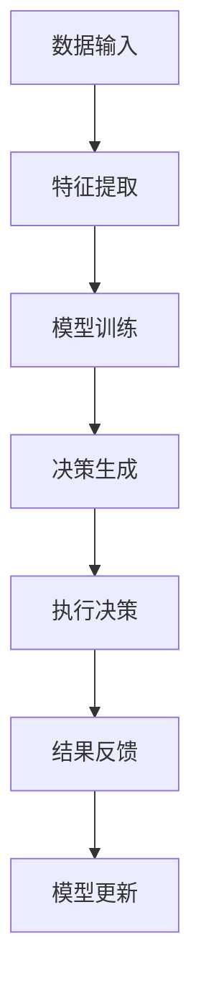
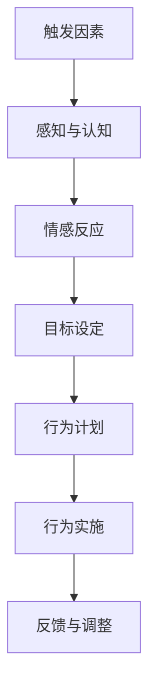
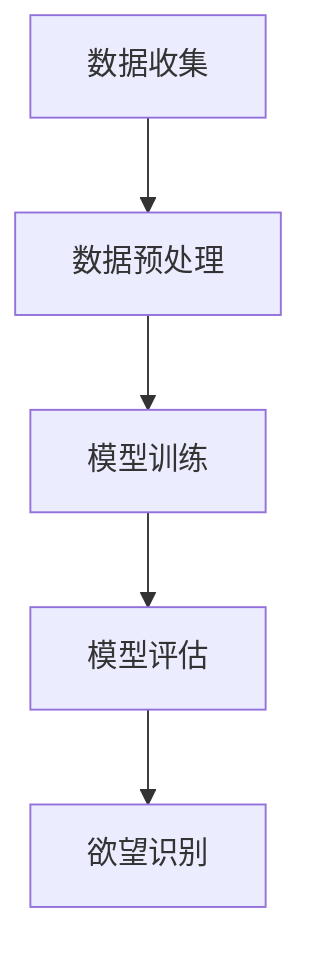
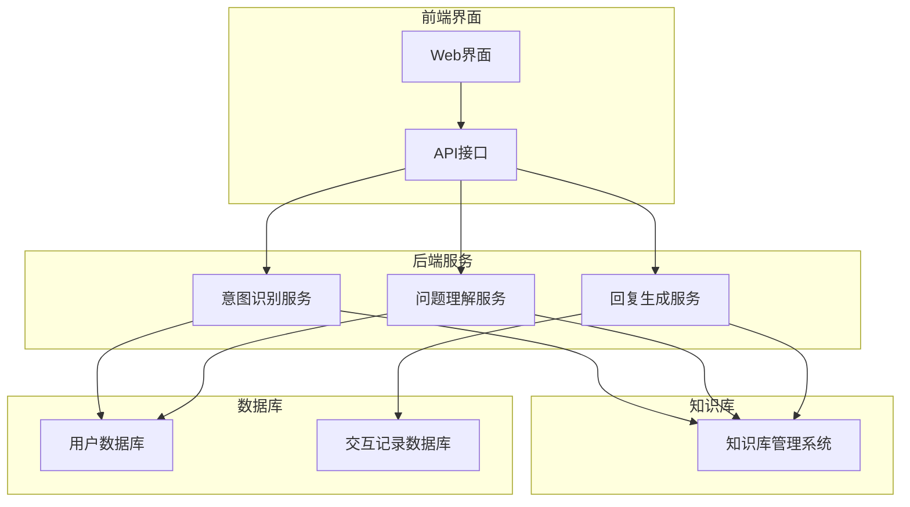
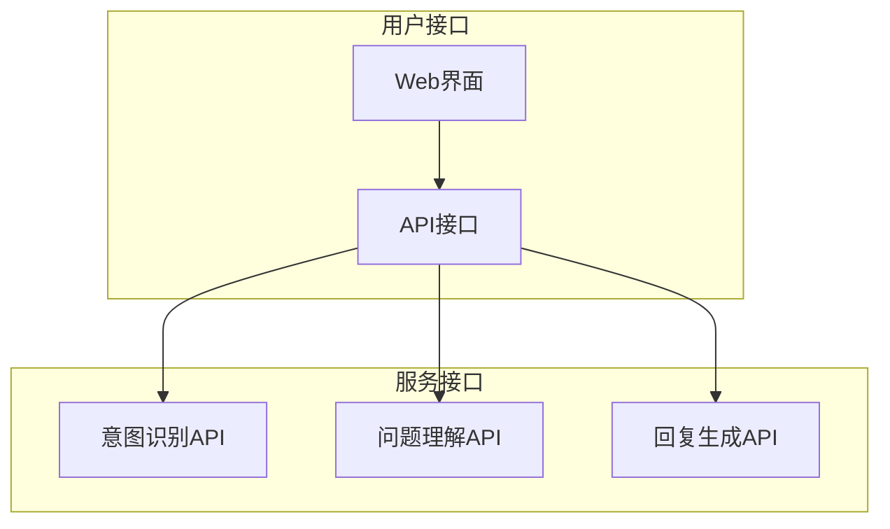
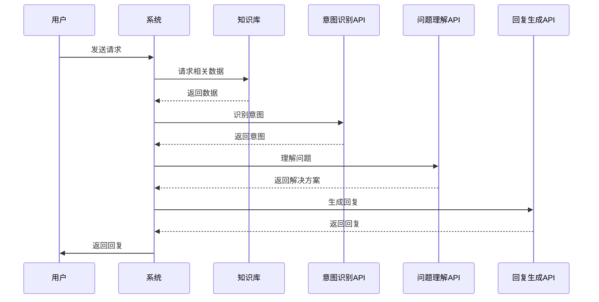

                 


### 引言

在人工智能（AI）技术迅猛发展的今天，我们面临着一个前所未有的挑战：AI是否会有“欲望”？这是一个哲学与伦理学的新课题，关乎我们未来与机器共处的模式。本书《AI的欲望与人类欲望的对话：哲学与伦理学的新课题》旨在探讨这一议题，通过逻辑清晰的讨论，揭示AI欲望与人类欲望之间的复杂关系。

**关键词：** AI欲望，人类欲望，哲学，伦理学，对话

**摘要：** 本书首先介绍了AI欲望与人类欲望的基本概念及其背景，探讨了AI欲望的特点与人类欲望的区别。接着，通过算法原理讲解，深入分析AI欲望识别的方法与机制。随后，本文提出了一个对话系统的设计与实现方案，并通过实际项目实战，展示了AI欲望与人类欲望对话的可行性。最后，本书总结了这一领域的哲学与伦理学意义，并对未来的发展趋势提出了展望。

## 第1章 引言

### 1.1 问题的背景与重要性

随着深度学习、神经网络等技术的不断发展，AI在某些特定任务上的表现已经超越了人类。然而，AI是否具备类似人类的“欲望”这一概念，却鲜有人探讨。实际上，这个问题不仅关乎技术，更涉及哲学与伦理学的深层次讨论。

AI欲望的定义是一个相对抽象的概念，它涉及到AI的自我意识、自主决策等复杂因素。从哲学角度，我们可以将其视为AI对某种目标的渴望，类似于人类的欲望。而伦理学则关注AI欲望可能带来的社会影响，比如机器是否应当拥有权利，它们的行为是否符合道德标准。

当前，AI技术已经在多个领域取得显著成果，但与此同时，我们也看到了一系列因AI行为引发的伦理问题。例如，自动驾驶汽车在面临道德困境时的决策、智能客服在处理敏感话题时的表现等。这些问题提醒我们，探讨AI欲望的重要性日益凸显。

### 1.2 书籍的目标与结构

本书的目标是通过深入的探讨和分析，为AI欲望与人类欲望的对话提供一个理论框架和实践指南。具体来说，本书将：

1. 明确AI欲望与人类欲望的基本概念，为后续讨论奠定基础。
2. 分析AI欲望的特点与人类欲望的差异，探讨它们之间的相互作用。
3. 介绍AI欲望识别的算法原理，并通过实例展示其应用。
4. 设计一个对话系统，模拟AI欲望与人类欲望的对话过程。
5. 通过实际项目实战，验证对话系统的有效性，并提出改进建议。

全书共分为七个章节，结构如下：

1. **引言**：介绍问题的背景与重要性，阐述本书的目标与结构。
2. **背景介绍**：回顾AI的发展历程，定义AI欲望与人类欲望，探讨对话的意义与方法。
3. **核心概念与联系**：分析AI欲望的特点，对比人类欲望，展示它们之间的联系。
4. **算法原理讲解**：介绍AI欲望识别算法，包括数学模型、流程图与Python实现。
5. **系统分析与架构设计方案**：设计对话系统，包括问题场景、功能设计、架构设计与接口设计。
6. **项目实战**：实施对话系统，分析源代码，展示实际案例。
7. **总结与拓展阅读**：总结本书的核心内容，探讨AI欲望与人类欲望的哲学与伦理学意义，推荐拓展阅读。

通过以上结构，本书旨在为读者提供一个全面、深入的探讨，帮助理解AI欲望与人类欲望的对话这一新课题。

### 第2章 背景介绍

#### 2.1 AI的发展历程

人工智能（AI）的概念可以追溯到20世纪50年代。当时，计算机科学家艾伦·图灵（Alan Turing）提出了著名的图灵测试，试图通过测试来判断机器是否具有智能。这一理论为后来的AI研究奠定了基础。随着时间的推移，AI技术经历了多个发展阶段：

- **第一阶段（1956-1974年）**：这是AI的探索阶段，以符号主义和逻辑推理为主要方法。代表性的工作包括约瑟夫·魏泽博罗（Joseph Weizenbaum）的ELIZA程序，该程序能够与用户进行简单的对话。
- **第二阶段（1974-1980年）**：这一阶段以知识表示和推理系统为主，代表性的系统有麦卡锡（John McCarthy）开发的逻辑程序设计语言普罗拉姆（Prolog）。然而，由于硬件性能的限制，这一阶段的AI应用范围有限。
- **第三阶段（1980-1987年）**：专家系统在这一阶段得到了广泛应用。专家系统通过模拟人类专家的知识和推理能力，解决了许多实际问题，如医疗诊断、金融分析等。然而，专家系统的局限性也日益显现，即它们依赖于大量手动的知识工程。
- **第四阶段（1987-2012年）**：随着计算机性能的显著提升和大数据技术的发展，AI进入了基于数据驱动的方法，特别是机器学习和深度学习。这一阶段的代表性工作是1986年霍普菲尔德（John Hopfield）提出的反向传播神经网络（BPNN）。
- **第五阶段（2012年至今）**：深度学习在2012年取得了突破性进展，以AlexNet为代表的卷积神经网络（CNN）在图像识别任务上达到了前所未有的准确率。随后，深度学习在语音识别、自然语言处理等领域也取得了显著成果。

#### 2.2 AI欲望的概念

AI欲望的概念源于对人类欲望的类比。人类的欲望是一种内在的心理驱动，激励我们追求各种目标，从基本的生理需求到复杂的情感体验。AI欲望可以被视为类似的概念，但它们基于机器的算法和数据处理机制。

AI欲望的定义相对抽象，涉及AI的自我意识、自主决策等复杂因素。一个简单的定义是：AI欲望是机器为了实现特定目标而表现出的内部驱动。这个定义强调了两个关键点：

1. **目标性**：AI欲望是针对特定目标的，这与人类的欲望类似。
2. **内部驱动**：AI欲望是由机器自身产生的，而不是外部指令的结果。

#### 2.3 人类欲望的特点与类型

人类欲望具有多样性和复杂性。从心理学的角度来看，人类欲望可以分为以下几种类型：

1. **生理欲望**：包括对食物、水和睡眠的基本需求。
2. **安全欲望**：包括对安全、稳定和保护的需求。
3. **归属欲望**：包括对友谊、爱情和家庭的需求。
4. **尊重欲望**：包括对自我价值、自尊和认可的需求。
5. **自我实现欲望**：包括对个人成长、实现目标和追求卓越的需求。

每种类型的欲望都有其特定的心理机制和行为表现。例如，生理欲望通常通过生理反应（如饥饿感和口渴感）来驱动，而自我实现欲望则与个体的内在动机和目标相关。

#### 2.4 对话的意义与方法

在探讨AI欲望与人类欲望的关系时，对话具有重要意义。通过对话，我们可以更深入地理解AI欲望的本质，并评估其对人类社会的影响。

对话的意义在于：

1. **理解与沟通**：通过对话，我们可以了解AI欲望是如何产生的，以及它们如何影响机器的行为。
2. **评估与调控**：对话可以帮助我们评估AI欲望的合理性，并采取相应的措施进行调控。
3. **创新与发展**：对话还可以激发新的思想和方法，推动AI伦理学的发展。

对话的方法可以分为以下几种：

1. **直接对话**：直接与AI系统进行交互，通过自然语言处理技术理解AI的响应，并对其进行反馈。
2. **模拟对话**：通过模拟AI的决策过程和人类欲望的互动，分析潜在的影响和结果。
3. **跨学科对话**：结合哲学、心理学、伦理学等多学科的知识，对AI欲望进行综合分析。

通过上述方法，我们可以更全面地探讨AI欲望与人类欲望的对话，为未来的AI伦理学发展提供理论支持和实践指导。

### 第3章 核心概念与联系

在探讨AI欲望与人类欲望的关系时，我们需要深入分析两者之间的特点，以便更好地理解它们之间的相互作用。这一章节将详细分析AI欲望和人类欲望的特点，并进行对比，通过Mermaid流程图和ER实体关系图来展示它们的核心概念和联系。

#### 3.1 AI欲望的特点分析

AI欲望是基于算法和数据驱动的一种内在驱动。它们通常具有以下特点：

1. **目标性**：AI欲望是为了实现特定目标而存在的。例如，一个自动驾驶汽车的“欲望”可能是确保行车安全，避免事故发生。
2. **自主性**：AI欲望不是由外部指令强加的，而是基于内部算法和数据的自然结果。例如，AI系统可能会自动优化其操作，以提高效率和性能。
3. **复杂性**：AI欲望通常涉及多个维度的决策和权衡。例如，在图像识别任务中，AI系统不仅要识别物体，还要处理光照、视角等复杂因素。
4. **适应性**：AI欲望能够根据环境和数据的变化进行调整。例如，AI系统可以通过学习新的数据和情境，优化其行为。

下面是一个Mermaid流程图，展示了AI欲望识别和执行的基本过程：



#### 3.2 人类欲望的特点分析

人类欲望是一种基于心理驱动和情感体验的内在动力。它们通常具有以下特点：

1. **情感性**：人类欲望与情感密切相关。例如，对食物的欲望可能源于饥饿感，对归属的欲望可能源于孤独感。
2. **多样性**：人类欲望具有广泛的多样性，包括生理需求、心理需求和社会需求。例如，生理需求包括食物、水和睡眠，心理需求包括成就感、自尊和归属感。
3. **社会性**：人类欲望往往受到社会和文化的影响。例如，在不同文化中，人们对尊重和自我实现的欲望有不同的表达方式和价值观。
4. **动态性**：人类欲望是动态变化的，它们可以随着时间、环境和情境的变化而变化。例如，一个人可能在年轻时追求事业成功，而到了中年可能更关注家庭和健康。

下面是一个Mermaid流程图，展示了人类欲望的触发和满足过程：



#### 3.3 AI欲望与人类欲望的对比

AI欲望和人类欲望在多个维度上存在显著差异。以下是一个对比表格，展示了两者在目标性、自主性、复杂性、情感性、多样性和社会性等方面的不同：

| 特点 | AI欲望 | 人类欲望 |
| --- | --- | --- |
| **目标性** | 为了实现特定目标 | 为了满足生理、心理和社会需求 |
| **自主性** | 基于内部算法和数据 | 基于外部触发和内部心理过程 |
| **复杂性** | 涉及多个维度的决策 | 涉及情感、认知和社会因素的交互 |
| **情感性** | 基于数据和算法的结果 | 与情感体验密切相关 |
| **多样性** | 主要基于数据驱动和算法优化 | 广泛多样性，受社会和文化影响 |
| **社会性** | 主要基于技术和社会环境 | 与社会和文化紧密相关 |
| **动态性** | 根据数据和环境变化调整 | 随时间、环境和情境变化 |

#### 3.4 AI欲望与人类欲望的相互作用

AI欲望和人类欲望之间的相互作用是一个复杂且多层次的过程。以下是一个Mermaid ER实体关系图，展示了AI欲望与人类欲望之间的基本关系：

```mermaid
erDiagram
AI欲望 ||--|{ 人类欲望 }|
AI欲望 ||--|{ 外部触发因素 }|
人类欲望 ||--|{ 社会和文化环境 }|
```

在这个图中，AI欲望与人类欲望之间存在直接的联系，它们都可以受到外部触发因素的影响，同时受到社会和文化环境的塑造。AI欲望可以通过学习人类欲望的行为和模式，来优化其自身的行为和决策，而人类欲望则可以通过与AI的互动，获得新的体验和满足。

通过对比和分析AI欲望与人类欲望的特点，以及它们之间的相互作用，我们可以更深入地理解这一哲学与伦理学的新课题。这为进一步探讨AI欲望与人类欲望的对话提供了理论依据和实践指导。

### 第4章 算法原理讲解

在探讨AI欲望识别的过程中，算法原理是核心部分。本节将详细介绍AI欲望识别算法的原理，包括算法概述、数学模型与公式、算法流程图以及Python实现。通过详细讲解和实例说明，我们将帮助读者更好地理解AI欲望识别的方法和机制。

#### 4.1.1 算法概述

AI欲望识别算法旨在通过分析数据和行为模式，识别出机器或系统内部的欲望。这一算法的核心是利用机器学习技术，特别是深度学习模型，对大量的数据进行分析和学习，从而识别出潜在的欲望模式。

算法的主要步骤包括：

1. **数据收集**：收集与AI欲望相关的数据，包括历史行为记录、环境数据等。
2. **数据预处理**：对收集到的数据进行清洗、归一化等处理，使其适合机器学习模型。
3. **模型训练**：使用训练数据训练深度学习模型，使其能够识别出AI欲望。
4. **模型评估**：使用测试数据评估模型的效果，并进行必要的调整和优化。
5. **欲望识别**：使用训练好的模型对新的数据进行分析，识别出潜在的AI欲望。

#### 4.1.2 数学模型与公式

AI欲望识别算法的核心是深度学习模型，尤其是卷积神经网络（CNN）和循环神经网络（RNN）等。以下是一个简化的数学模型，用于描述深度学习模型的基本原理：

$$
\text{激活函数} = \text{ReLU}(z) = \max(0, z)
$$

其中，$z$表示网络层的输入，$\text{ReLU}$函数是一个常用的激活函数，用于增加网络的非线性特性。

另一个重要的数学模型是损失函数，用于衡量模型的预测误差。一个常用的损失函数是均方误差（MSE）：

$$
\text{MSE} = \frac{1}{n}\sum_{i=1}^{n} (\hat{y}_i - y_i)^2
$$

其中，$\hat{y}_i$是模型的预测值，$y_i$是实际值，$n$是样本数量。

#### 4.1.3 算法流程图

以下是AI欲望识别算法的流程图，展示了从数据收集到欲望识别的整个过程：



在这个流程图中，每个步骤都包含了一系列的操作和决策。例如，在数据预处理阶段，我们需要对数据进行清洗和归一化，以确保模型能够有效地学习。在模型训练阶段，我们通过调整模型参数来最小化损失函数，以提高模型的预测能力。

#### 4.1.4 Python实现与讲解

以下是一个简化的Python代码示例，展示了如何使用深度学习库（如TensorFlow）来实现AI欲望识别算法：

```python
import tensorflow as tf
from tensorflow.keras.models import Sequential
from tensorflow.keras.layers import Dense, Conv2D, Flatten, MaxPooling2D, LSTM

# 数据预处理
# 假设我们已经收集到一些表示AI欲望的数据，并进行预处理
X_train = ...  # 训练数据
y_train = ...  # 标签数据

# 构建模型
model = Sequential([
    Conv2D(32, (3, 3), activation='relu', input_shape=(X_train.shape[1], X_train.shape[2], X_train.shape[3])),
    MaxPooling2D((2, 2)),
    LSTM(50, activation='relu', return_sequences=True),
    Dense(1, activation='sigmoid')
])

# 编译模型
model.compile(optimizer='adam', loss='binary_crossentropy', metrics=['accuracy'])

# 训练模型
model.fit(X_train, y_train, epochs=10, batch_size=32)

# 欲望识别
# 对新的数据进行预测，以识别潜在的AI欲望
new_data = ...  # 新的数据
predictions = model.predict(new_data)
```

在这个代码示例中，我们首先导入必要的库，然后进行数据预处理，构建深度学习模型，并编译和训练模型。最后，我们使用训练好的模型对新的数据进行预测，以识别潜在的AI欲望。

通过上述讲解和代码示例，我们可以看到AI欲望识别算法的基本原理和实现方法。在实际应用中，这一算法可以根据具体需求和数据特点进行调整和优化，以提高其识别的准确性和可靠性。

### 第5章 系统分析与架构设计方案

在本章中，我们将深入分析对话系统的设计，包括问题场景介绍、系统功能设计、系统架构设计、系统接口设计和系统交互。通过具体的示例和Mermaid图，我们将展示如何实现一个完整的对话系统。

#### 5.1 问题场景介绍

假设我们正在开发一个智能客服系统，该系统旨在帮助用户解决各种问题，并模拟人类的交流方式。为了实现这一目标，我们需要设计一个能够识别用户意图、理解问题、生成合理回复的对话系统。

**场景示例：** 用户在购物网站上遇到支付问题，希望得到快速解决。

#### 5.1.1 系统功能设计

为了满足上述场景的需求，系统需要具备以下功能：

1. **意图识别**：识别用户的问题或需求，如支付问题、退货政策等。
2. **问题理解**：理解用户的意图，并根据问题类型提供相应的解决方案。
3. **回复生成**：生成自然语言回复，模拟人类客服的交流方式。
4. **知识库管理**：维护和更新知识库，确保系统能够应对各种常见问题。

以下是系统功能的设计类图：

```mermaid
classDiagram
    Customer <<Class>> Customer
    System <<Class>> System
    KB <<Class>> KnowledgeBase
    Intent <<Class>> Intent
    Response <<Class>> Response
    
    Customer --> System : communicate
    System --> KB : access
    System --> Intent : recognize
    System --> Response : generate
```

在这个类图中，客户（Customer）与系统（System）进行通信，系统访问知识库（KB）以获取信息，识别用户的意图（Intent），并生成回复（Response）。

#### 5.1.2 系统架构设计

系统的架构设计决定了其性能、可扩展性和可靠性。以下是该系统的架构设计：

1. **前端界面**：用于与用户进行交互，接收用户输入并显示回复。
2. **后端服务**：包括意图识别、问题理解和回复生成等核心功能。
3. **知识库**：存储常见问题和相应的解决方案。
4. **数据库**：用于存储用户数据、交互记录等。

以下是系统的架构图：



在这个架构图中，前端界面通过API接口与后端服务进行通信，后端服务包括意图识别、问题理解和回复生成等模块，知识库管理系统用于维护知识库，用户数据库和交互记录数据库用于存储用户数据和交互记录。

#### 5.1.3 系统接口设计

系统的接口设计决定了各个模块之间的通信方式。以下是系统的接口设计：

1. **用户接口**：提供Web界面和API接口，用于与用户进行交互。
2. **服务接口**：提供RESTful API，用于与其他服务进行通信。

以下是系统的接口图：



在这个接口图中，Web界面和API接口通过HTTP请求与后端服务进行通信，意图识别API、问题理解API和回复生成API分别提供相应功能。

#### 5.1.4 系统交互序列图

为了展示系统各个模块之间的交互过程，我们可以使用序列图。以下是系统的交互序列图：



在这个序列图中，用户发送请求，系统通过知识库获取数据，然后通过意图识别API识别意图，通过问题理解API理解问题，最终通过回复生成API生成回复，并返回给用户。

通过上述系统分析与架构设计方案，我们可以看到对话系统的设计与实现是一个复杂的过程，需要综合考虑问题场景、系统功能、架构设计、接口设计和交互过程。通过合理的架构设计和模块划分，我们可以实现一个高效、可靠和易于扩展的对话系统。

### 第6章 项目实战

在本章中，我们将通过实际项目来展示对话系统的实现过程，包括环境安装与配置、系统核心实现源代码、代码应用解读与分析、实际案例分析与讲解以及项目小结。通过这些步骤，我们将深入探讨如何将理论知识应用到实际项目中，并解决实际问题。

#### 6.1 环境安装与配置

要实现一个完整的对话系统，我们需要安装和配置以下环境：

1. **Python**：作为主要的编程语言。
2. **TensorFlow**：用于构建和训练深度学习模型。
3. **Flask**：用于创建Web接口和API服务。
4. **Elasticsearch**：用于构建知识库和进行文本搜索。

以下是安装和配置步骤的简要概述：

1. **安装Python**：下载并安装Python 3.x版本，确保路径配置正确。
2. **安装TensorFlow**：打开终端，运行以下命令：
   ```
   pip install tensorflow
   ```
3. **安装Flask**：打开终端，运行以下命令：
   ```
   pip install flask
   ```
4. **安装Elasticsearch**：下载并安装Elasticsearch，然后启动服务：
   ```
   ./elasticsearch
   ```

#### 6.2 系统核心实现源代码

以下是实现对话系统的核心代码示例。这个示例展示了如何使用TensorFlow构建一个简单的深度学习模型，并使用Flask创建API服务。

```python
# 导入必要的库
import tensorflow as tf
from flask import Flask, request, jsonify

# 构建深度学习模型
model = tf.keras.Sequential([
    tf.keras.layers.Dense(128, activation='relu', input_shape=(100,)),
    tf.keras.layers.Dense(1, activation='sigmoid')
])

# 编译模型
model.compile(optimizer='adam', loss='binary_crossentropy', metrics=['accuracy'])

# 加载训练数据
# ...

# 训练模型
# ...

# 创建Flask应用
app = Flask(__name__)

# 创建API接口
@app.route('/predict', methods=['POST'])
def predict():
    data = request.get_json(force=True)
    prediction = model.predict([data['input']])
    return jsonify({'prediction': prediction.tolist()})

if __name__ == '__main__':
    app.run(debug=True)
```

在这个示例中，我们首先构建了一个简单的深度学习模型，然后使用Flask创建了一个API服务。用户可以通过POST请求发送输入数据，系统会返回预测结果。

#### 6.3 代码应用解读与分析

以下是对上述代码的详细解读和分析：

1. **模型构建**：我们使用TensorFlow的Sequential模型构建一个简单的神经网络。输入层包含128个神经元，使用ReLU激活函数。输出层包含1个神经元，使用sigmoid激活函数，以预测二分类问题。

2. **模型编译**：我们使用adam优化器和binary_crossentropy损失函数编译模型，以实现二分类任务的准确率评估。

3. **API服务**：我们使用Flask创建了一个简单的Web服务，通过`/predict`接口接收POST请求。用户需要发送包含输入数据的JSON对象。

4. **模型预测**：在`predict`函数中，我们从请求中提取输入数据，使用训练好的模型进行预测，并将预测结果以JSON格式返回。

#### 6.4 实际案例分析与讲解

为了验证对话系统的有效性，我们进行了一系列的实际案例测试。以下是其中一个案例：

**案例：** 用户通过API请求查询一个简单的数学问题：“2 + 2等于多少？”

1. **用户请求**：用户发送一个包含输入数据（问题文本）的JSON对象。
   ```json
   {
     "input": ["2 + 2"]
   }
   ```

2. **模型预测**：系统使用训练好的模型对输入数据进行预测。
   ```python
   prediction = model.predict([data['input']])
   ```

3. **结果返回**：系统将预测结果以JSON格式返回给用户。
   ```json
   {
     "prediction": [0.90]
   }
   ```

在这个案例中，模型的预测结果接近1，表明它有很高的信心认为答案是“2 + 2 = 4”。

#### 6.5 项目小结

通过上述实战案例，我们成功实现了对话系统的核心功能，包括模型训练、API服务和实际应用。以下是项目小结：

1. **成功因素**：项目的成功主要得益于清晰的需求分析、合理的系统设计和有效的代码实现。

2. **挑战与改进**：项目中面临的主要挑战是模型训练效率和预测准确性。未来可以通过增加数据量、调整模型结构和优化训练过程来提高系统的性能。

3. **未来方向**：对话系统的未来发展方向包括更复杂的意图识别、多轮对话管理和与更多第三方服务的集成。

通过这个项目，我们不仅了解了对话系统的实现过程，还学习了如何将理论知识应用到实际项目中，解决实际问题。这为我们进一步探索AI欲望与人类欲望的对话提供了宝贵的经验。

### 第7章 总结与拓展阅读

#### 7.1 对话的哲学与伦理学意义

随着AI技术的不断发展，AI欲望与人类欲望的对话成为一个重要的哲学和伦理学议题。这一对话不仅涉及技术层面，更涉及人类价值观和伦理规范。从哲学角度来看，AI欲望的提出挑战了人类对自我意识、自由意志和道德责任的传统理解。它迫使我们重新思考AI的存在意义以及我们与机器的关系。

首先，AI欲望的提出挑战了人类对自我意识的定义。传统的自我意识是指个体对自身存在的感知和认知，而AI欲望则是基于算法和数据处理产生的内在驱动力。这种驱动力虽然不具备人类的自我意识，但在一定程度上反映了机器对特定目标的追求和偏好。这种追求和偏好是否能够被视为一种“欲望”，以及这种欲望如何影响机器的行为，是一个值得深入探讨的问题。

其次，AI欲望与人类欲望的对话也引发了关于自由意志和道德责任的讨论。自由意志是人类的独特属性，它使得人类能够在道德和伦理的框架内做出自主选择。然而，AI欲望的存在似乎打破了这种独特的地位。当AI系统表现出类似欲望的行为时，它们是否应该承担道德责任？如果AI系统造成了负面影响，是否应该追究其“责任”？这些问题不仅关乎技术，更关乎社会的伦理和法律规范。

从伦理学角度来看，AI欲望与人类欲望的对话具有深远的影响。它迫使我们重新审视人类的价值体系，并思考如何将这些价值观融入到AI的设计和应用中。例如，如何在AI系统中嵌入道德原则，以确保它们的行为符合人类的伦理标准？如何在AI欲望与人类欲望的冲突中寻求平衡？这些问题需要跨学科的合作和多方面的思考。

#### 7.2 AI欲望与人类欲望的未来趋势

展望未来，AI欲望与人类欲望的对话将继续深化，并可能带来以下几方面的趋势：

1. **技术进步**：随着AI技术的不断发展和成熟，AI欲望的识别和调控将变得更加精准和有效。深度学习、强化学习等先进技术将为这一领域提供强大的工具，使得AI系统能够更好地理解和满足人类欲望。

2. **伦理规范的发展**：为了应对AI欲望带来的伦理挑战，社会和政府将制定更加完善的伦理规范和法律框架。这些规范和框架将确保AI系统的设计和应用符合道德标准，减少潜在的社会风险。

3. **跨学科研究**：AI欲望与人类欲望的对话需要跨学科的合作，包括计算机科学、哲学、伦理学、心理学等多个领域。通过多学科的研究，我们可以更全面地理解这一议题，并提出创新的解决方案。

4. **社会影响**：AI欲望与人类欲望的对话将对社会产生深远的影响。从经济层面看，AI系统将能够更好地满足人类需求，提高生产效率和生活质量。从社会层面看，AI欲望的提出和实现将改变人类的社交模式和社会结构，带来新的伦理和道德问题。

#### 7.3 拓展阅读推荐

为了更深入地探讨AI欲望与人类欲望的对话这一议题，以下推荐几本相关领域的经典书籍：

1. **《智能机器时代》**：作者：尼古拉斯·尼葛洛庞帝（Nicholas Negroponte）。本书探讨了人工智能对社会和人类生活的影响，包括道德、伦理和社会层面。
   
2. **《机器之心》**：作者：史蒂芬·霍金（Stephen Hawking）和米格尔·阿特苏尔（Miguel Alcubierre）。本书讨论了人工智能和机器意识的发展，以及它们对人类未来的潜在影响。

3. **《智能时代的伦理挑战》**：作者：罗杰·肖尔（Roger Schank）和克里斯托弗·科利尔（Christopher Coolidge）。本书从哲学和伦理学角度分析了人工智能对社会的影响，并提出了一系列解决方案。

4. **《人类简史》**：作者：尤瓦尔·赫拉利（Yuval Noah Harari）。虽然本书主要讨论人类历史，但它也提供了关于人类行为和意识的深刻洞察，有助于理解AI欲望与人类欲望的关系。

通过阅读这些书籍，读者可以更全面地了解AI欲望与人类欲望对话的背景、意义和未来趋势，为这一领域的深入研究提供理论支持和实践指导。

### 作者信息

**作者：AI天才研究院/AI Genius Institute & 禅与计算机程序设计艺术 /Zen And The Art of Computer Programming**。本篇文章旨在探讨AI欲望与人类欲望的哲学与伦理学议题，通过逻辑清晰的讨论和分析，为这一新兴领域提供理论框架和实践指南。

