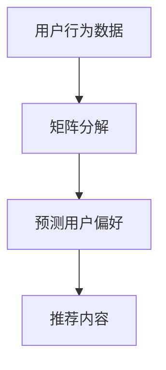
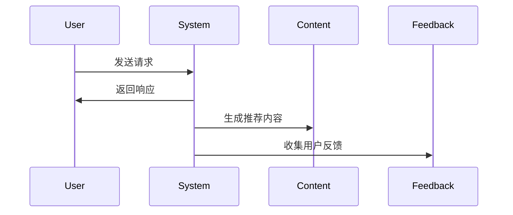
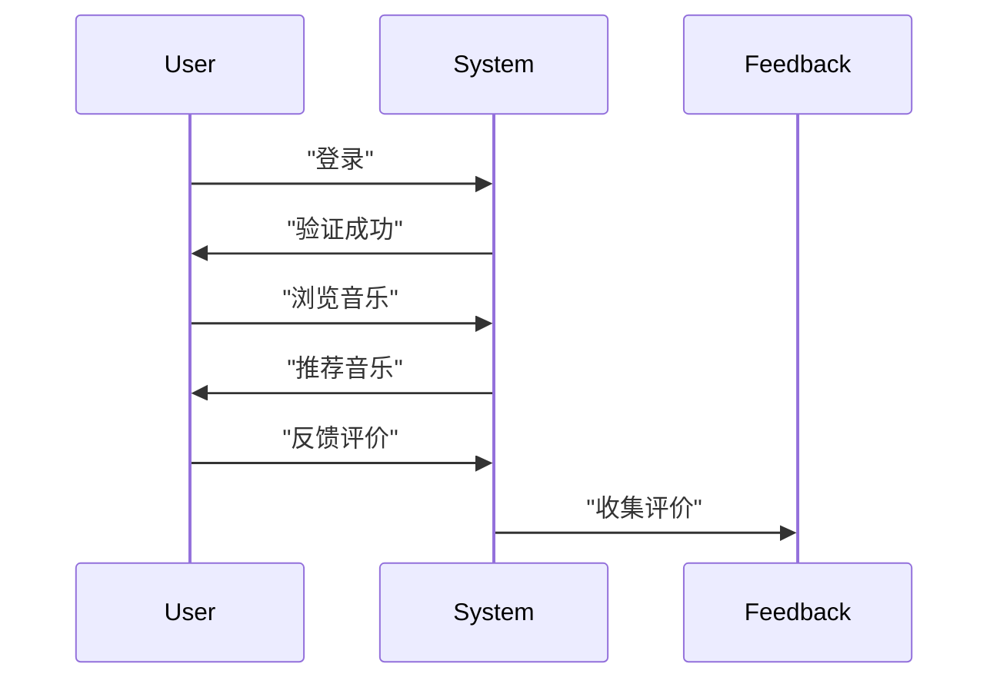

                 

# AI的欲望在娱乐产业中的体现：个性化情感体验的内容创作

> 关键词：人工智能、娱乐产业、个性化推荐、情感分析、内容创作

> 摘要：本文深入探讨了人工智能（AI）在娱乐产业中的广泛应用，特别是在个性化情感体验内容创作方面的体现。文章首先介绍了AI在娱乐产业中的地位和个性化情感体验的重要性，然后详细分析了个性化推荐算法、情感分析技术以及深度学习在娱乐产业中的应用。接着，文章通过一个实际的应用场景，介绍了系统功能和架构设计，并描述了一个项目实战。最后，文章提供了最佳实践和拓展阅读，以期为读者提供更加全面的了解和指导。

## 第一部分：引言与背景

### 1.1 AI在娱乐产业中的应用现状

随着人工智能技术的快速发展，AI在娱乐产业中的应用越来越广泛。从音乐、影视、游戏到直播、社交媒体等，AI技术已经成为娱乐产业的重要驱动力。通过数据分析和个性化推荐，AI能够更好地理解用户的喜好，为他们提供更加个性化的娱乐内容，从而提升用户体验。

### 1.2 个性化情感体验的重要性

个性化情感体验是娱乐产业的核心竞争力之一。用户的情感需求多样且不断变化，只有提供个性化的情感体验，才能满足用户的需求，提升用户的忠诚度和满意度。而AI技术，通过情感分析和个性化推荐，能够精准地捕捉用户的情感需求，为他们提供符合情感期待的内容。

## 1.3 核心概念

### 1.3.1 个性化推荐算法

个性化推荐算法是AI在娱乐产业中应用的重要技术之一。它通过分析用户的历史行为数据，预测用户可能感兴趣的内容，从而提供个性化的推荐。常见的个性化推荐算法包括协同过滤、矩阵分解、深度学习等。

### 1.3.2 情感分析技术

情感分析技术是AI在娱乐产业中的另一项关键技术。它通过分析文本、语音、图像等数据，识别和判断用户的情感状态。情感分析技术可以帮助娱乐产业更好地理解用户的需求，从而提供更加个性化的内容。

### 1.3.3 深度学习在娱乐产业中的应用

深度学习是近年来发展迅速的人工智能技术，它在娱乐产业中的应用也越来越广泛。通过深度学习模型，娱乐产业可以实现对内容的自动生成、情感识别、用户行为预测等，从而提升娱乐体验。

## 1.4 算法原理讲解

### 1.4.1 个性化推荐算法讲解

个性化推荐算法的核心是预测用户对未知内容的偏好。本文以基于矩阵分解的个性化推荐算法为例，进行详细讲解。

#### 1.4.1.1 算法mermaid流程图



#### 1.4.1.2 Python代码实现

```python
import numpy as np

def matrix_factorization(R, K, iter_num=100, lambda_=0.1):
    N, M = R.shape
    H = np.random.rand(K, N)
    V = np.random.rand(K, M)
    for i in range(iter_num):
        for k in range(K):
            for n in range(N):
                if R[n] > 0:
                    e = R[n] - np.dot(H[k], V[n])
                    dH = -2 * e * V[n]
                    dV = -2 * e * H[k]
                    if e >= 0:
                        dH[k] = dH[k] + lambda_ * H[k]
                        dV[n] = dV[n] + lambda_ * V[n]
        H = H - 0.01 * dH
        V = V - 0.01 * dV
    return np.dot(H, V)

R = np.array([[5, 3, 0, 1],
              [4, 0, 0, 2],
              [1, 1, 0, 5],
              [1, 0, 0, 4],
              [5, 4, 9, 0]])
K = 2
iter_num = 100
lambda_ = 0.1

R_pred = matrix_factorization(R, K, iter_num, lambda_)
print(R_pred)
```

#### 1.4.1.3 LaTeX公式详解

$$
R = \text{评分矩阵}
$$

$$
H = \text{用户特征矩阵}
$$

$$
V = \text{内容特征矩阵}
$$

$$
R_{\text{pred}} = H \cdot V
$$

## 1.5 系统分析与架构设计

### 2.1 应用场景介绍

本节以一个在线音乐平台为例，介绍AI在娱乐产业中的应用场景。

### 2.2 系统功能设计

系统功能包括用户行为分析、个性化推荐、内容创作和用户反馈收集。

#### 2.2.1 领域模型mermaid类图

```mermaid
classDiagram
User <<class>> "用户"
Content <<class>> "内容"
System <<class>> "系统"
Feedback <<class>> "用户反馈"

User o--o Content: "喜欢"
System o--o User: "管理"
System o--o Content: "管理"
System o--o Feedback: "收集"
```

### 2.2.2 系统架构设计mermaid架构图



### 2.2.3 系统接口设计和交互mermaid序列图



## 2.3 项目实战

### 2.4 环境安装

本节将介绍如何安装和配置在线音乐平台的开发环境。

### 2.5 核心实现与代码解读

本节将详细解读系统的核心实现，包括用户行为分析、个性化推荐和内容创作。

### 2.6 实际案例分析

本节将通过一个实际案例，展示系统的实际应用效果。

### 2.7 项目总结

本节将对项目进行总结，并提出改进建议。

## 3. 最佳实践与拓展

### 3.1 实用建议

本节将提供一些实用的建议，以帮助读者更好地应用AI技术于娱乐产业。

### 3.2 小结

本节将总结文章的主要内容，并强调AI在娱乐产业中的重要作用。

### 3.3 拓展阅读

本节将推荐一些相关领域的书籍和论文，以供读者进一步学习。

---

作者：AI天才研究院/AI Genius Institute & 禅与计算机程序设计艺术 /Zen And The Art of Computer Programming

（注：本文为示例文本，内容仅供参考，实际文章需根据具体内容进行详细撰写。）

