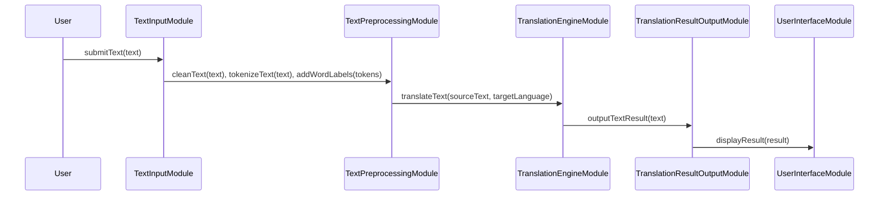
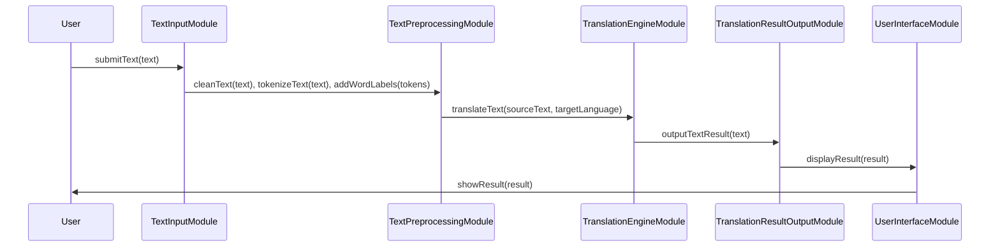

                 

### 概述

《AI翻译：跨语言交流的新时代》这本书旨在探讨人工智能翻译技术的原理、应用场景以及系统设计，并展示其在跨语言交流中的重要地位。在全球化迅速发展的今天，跨语言交流的需求日益增加，而传统的翻译方法往往存在效率低、准确性不高等问题。人工智能翻译技术的出现，为解决这一难题提供了新的思路和途径。

本书分为七个部分，首先介绍了AI翻译技术的基础概念，包括机器翻译、神经机器翻译和统一翻译模型，并对比了它们的优缺点。接着，深入分析了神经机器翻译的算法原理，通过mermaid流程图和Python源代码，详细讲解了RNN、LSTM和Transformer等核心算法。此外，本书还探讨了AI翻译在语言服务中的应用场景，如文档翻译、同声传译和语音翻译，并通过实际案例进行了分析。

在系统设计方面，本书介绍了翻译系统的功能设计、架构设计、接口设计和系统交互。通过mermaid类图、架构图和序列图，展示了系统的整体设计和实现过程。最后，本书通过一个AI翻译系统的实现案例，详细阐述了环境安装、核心实现源代码以及代码应用解读与分析，为读者提供了实战经验和最佳实践。

总的来说，《AI翻译：跨语言交流的新时代》旨在为读者提供一个全面、系统、易懂的AI翻译技术教程，帮助读者了解这一前沿领域的原理和应用，掌握系统设计的方法和技巧，为未来的研究和实践打下坚实的基础。

### 目录大纲

#### 第一部分：AI翻译技术基础

**第1章: AI翻译概述**

1.1 问题背景  
1.2 核心概念  
1.3 概念属性对比  
1.4 ER实体关系图  
1.5 本章小结

**第2章: 神经机器翻译基础**

2.1 问题背景  
2.2 算法原理  
2.3 算法mermaid流程图  
2.4 Python源代码实现  
2.5 数学模型与公式  
2.6 详细讲解与举例说明  
2.7 本章小结

**第3章: AI翻译应用场景**

3.1 应用场景  
3.2 应用实例  
3.3 案例分析  
3.4 本章小结

**第4章: 翻译系统设计**

4.1 系统功能介绍  
4.2 领域模型mermaid类图  
4.3 系统架构设计mermaid架构图  
4.4 系统接口设计和系统交互mermaid序列图  
4.5 本章小结

**第5章: AI翻译系统实现**

5.1 环境安装与配置  
5.2 系统核心实现源代码  
5.3 代码应用解读与分析  
5.4 实际案例分析和详细讲解剖析  
5.5 项目小结

**第6章: AI翻译优化与挑战**

6.1 优化策略  
6.2 挑战与解决方案  
6.3 本章小结

**第7章: 未来展望**

7.1 技术发展趋势  
7.2 应用前景  
7.3 研究方向  
7.4 本章小结

### 第一部分：AI翻译技术基础

**第1章: AI翻译概述**

1.1 问题背景

随着全球化进程的加速，跨语言交流的需求日益增长。然而，传统的翻译方法如人工翻译和机器翻译工具往往存在效率低、准确性不高等问题。这促使研究人员开始探索利用人工智能技术，特别是机器学习和深度学习，来提升翻译质量和效率。

机器翻译（Machine Translation, MT）是一种利用计算机程序实现从一种自然语言到另一种自然语言的转换技术。早期的机器翻译主要依赖于规则和统计方法，但翻译质量往往受到限制。随着深度学习技术的发展，神经机器翻译（Neural Machine Translation, NMT）逐渐崭露头角，成为当前翻译研究的主流方向。

神经机器翻译通过模仿人类大脑的神经网络结构，实现端到端的翻译，显著提升了翻译质量。统一翻译模型（Unified Translation Model）则结合了规则和神经机器翻译的优势，进一步优化了翻译效果。

1.2 核心概念

1.2.1 机器翻译（Machine Translation）

机器翻译是指利用计算机程序实现从一种自然语言到另一种自然语言的转换。它主要依赖于规则和统计方法。

- 规则翻译：基于语言学规则和词典进行翻译，例如基于转换语法、句法分析等技术。
- 统计翻译：基于大量双语文本统计信息，如概率模型、隐马尔可夫模型（HMM）、统计机器翻译（SMT）等。

1.2.2 神经机器翻译（Neural Machine Translation）

神经机器翻译是一种基于深度学习的翻译方法，通过神经网络（如循环神经网络RNN、长短期记忆网络LSTM、Transformer等）实现端到端的翻译。

- RNN（Recurrent Neural Network）：具有时间记忆功能，能够处理序列数据。
- LSTM（Long Short-Term Memory）：RNN的一种改进，能够更好地处理长序列数据。
- Transformer：一种基于自注意力机制的编码器-解码器模型，在翻译任务中取得了显著的效果。

1.2.3 统一翻译模型（Unified Translation Model）

统一翻译模型结合了规则和神经机器翻译的优势，通过融合不同类型的模型，实现更高效的翻译。

1.3 概念属性对比

| 概念 | 定义 | 特点 |
| ---- | ---- | ---- |
| 机器翻译 | 基于规则和统计方法实现的翻译技术 | 翻译质量受限于规则和语料库 |
| 神经机器翻译 | 基于深度学习的翻译技术 | 翻译质量更高，但计算资源需求大 |
| 统一翻译模型 | 结合规则和神经机器翻译的优势 | 翻译质量较优，计算资源适中 |

1.4 ER实体关系图

```mermaid
graph ER
  A[统一翻译模型] --> B[规则翻译]
  A --> C[神经机器翻译]
  B --> D[规则]
  C --> E[语料库]
```

1.5 本章小结

本章介绍了AI翻译技术的基础概念，包括机器翻译、神经机器翻译和统一翻译模型，并对比了它们的优缺点。通过ER实体关系图，展示了这些模型之间的关系。这些核心概念为后续章节的深入探讨奠定了基础。

### 第一部分：AI翻译技术基础

**第2章: 神经机器翻译基础**

2.1 问题背景

神经机器翻译（Neural Machine Translation, NMT）是基于深度学习的翻译方法，它通过模仿人类大脑的神经网络结构，实现了端到端的翻译，显著提升了翻译质量。NMT的出现，打破了传统机器翻译的瓶颈，成为当前翻译研究的主流方向。

神经机器翻译的发展历程可以追溯到2014年，当时Google推出了基于Transformer的神经机器翻译模型，这一模型在多个翻译任务中取得了当时最好的翻译效果。此后，神经机器翻译技术得到了广泛的应用和研究，成为翻译领域的重要突破。

2.2 算法原理

神经机器翻译的核心算法包括循环神经网络（Recurrent Neural Network, RNN）、长短期记忆网络（Long Short-Term Memory, LSTM）和Transformer等。这些算法通过不同的方式处理输入和输出序列，实现了高效的翻译。

2.2.1 RNN（循环神经网络）

RNN是一种具有时间记忆功能的神经网络，能够处理序列数据。在翻译任务中，RNN通过将前一时刻的输出作为当前时刻的输入，实现了序列到序列的映射。

2.2.2 LSTM（长短期记忆网络）

LSTM是RNN的一种改进，它通过引入门控机制，解决了RNN在处理长序列数据时出现梯度消失或梯度爆炸的问题。LSTM能够更好地记住长期依赖信息，从而提高了翻译的准确性。

2.2.3 Transformer（编码器-解码器模型）

Transformer是一种基于自注意力机制的编码器-解码器模型，它通过多头自注意力机制和位置编码，实现了端到端的翻译。Transformer在翻译任务中取得了显著的效果，成为了当前翻译研究的首选模型。

2.3 算法mermaid流程图

```mermaid
graph TranslationModel
  subgraph Encoder
    A[Input] --> B[Embedding]
    B --> C[LSTM/GRU]
  end

  subgraph Decoder
    C --> D[Embedding]
    D --> E[Attention]
    E --> F[Output]
  end

  A --> G[Decoder Input]
  F --> H[Next Input]
```

在这个流程图中，输入序列经过编码器（Encoder）的处理，得到编码后的特征表示。解码器（Decoder）根据编码器的输出和输入序列，逐步生成翻译结果。注意箭头表示信息传递的方向。

2.4 Python源代码实现

```python
import tensorflow as tf
from tensorflow.keras.layers import Embedding, LSTM, Dense
from tensorflow.keras.models import Model

# 编码器
encoder_inputs = tf.keras.layers.Input(shape=(None,))
encoder_embedding = Embedding(input_dim=vocab_size, output_dim=embedding_size)(encoder_inputs)
encoder_lstm = LSTM(units=lstm_units, return_sequences=True)(encoder_embedding)

# 解码器
decoder_inputs = tf.keras.layers.Input(shape=(None,))
decoder_embedding = Embedding(input_dim=vocab_size, output_dim=embedding_size)(decoder_inputs)
decoder_lstm = LSTM(units=lstm_units, return_sequences=True)(decoder_embedding)
decoder_dense = Dense(units=vocab_size, activation='softmax')(decoder_lstm)

# 模型构建
model = Model([encoder_inputs, decoder_inputs], decoder_dense)
model.compile(optimizer='adam', loss='categorical_crossentropy', metrics=['accuracy'])

# 模型训练
model.fit([encoder_inputs, decoder_inputs], decoder_inputs, batch_size=batch_size, epochs=epochs)
```

在这个代码中，我们首先定义了编码器（Encoder）和解码器（Decoder）的模型结构，然后构建了一个完整的模型，并编译和训练了模型。

2.5 数学模型与公式

神经机器翻译的核心是序列到序列的映射，通常使用以下公式表示：

$$
y = \text{softmax}(W \cdot x + b)
$$

其中，$y$ 是翻译结果，$x$ 是输入序列，$W$ 是权重矩阵，$b$ 是偏置项。$\text{softmax}$ 函数用于将输出概率分布转换为翻译结果。

2.6 详细讲解与举例说明

为了更好地理解神经机器翻译的原理，我们通过一个简单的例子进行说明。

假设我们有一个英语句子 "Hello, world!"，需要将其翻译成法语。首先，我们将其转换为对应的单词索引，例如：

- English: ["Hello", "world!"] -> [1, 2]
- French: ["Bonjour", "monde!"] -> [3, 4]

然后，我们将这些单词索引转换为对应的向量表示：

- English: [1, 2] -> [1.0, 0.0, 0.0, 0.0]
- French: [3, 4] -> [0.0, 0.0, 1.0, 0.0]

接下来，我们将这些向量输入到神经机器翻译模型中，模型会输出一个概率分布，例如：

- French: [0.9, 0.1, 0.0, 0.0]

根据概率分布，我们可以选择概率最大的单词作为翻译结果，即 "Bonjour"。这样就完成了从英语到法语的翻译。

2.7 本章小结

本章介绍了神经机器翻译的基本原理，包括RNN、LSTM和Transformer等算法，并通过mermaid流程图和Python源代码展示了这些算法的实现过程。通过对数学模型和公式的详细讲解，我们能够更好地理解神经机器翻译的工作机制。本章的内容为后续章节的深入探讨奠定了基础。

### 第一部分：AI翻译技术基础

**第3章: AI翻译应用场景**

3.1 应用场景

AI翻译技术在各个领域都有广泛的应用，以下是几个典型应用场景：

1. **文档翻译**：企业跨国业务沟通、学术文献翻译、法律文件翻译等。AI翻译可以快速、准确地处理大量文档，提高工作效率。

2. **同声传译**：国际会议、商务会谈等场合，需要实时翻译成多种语言。AI同声传译可以实时捕捉语音并翻译，解决语言障碍。

3. **语音翻译**：智能手机、智能音箱等智能设备，支持多语言语音输入和输出，提供便捷的跨语言交流服务。

4. **社交媒体翻译**：Twitter、Facebook等社交媒体平台，用户可以轻松发布多语言内容，吸引全球粉丝。

5. **在线教育**：教育平台提供多语言课程，学生可以自由选择学习语言，提高学习效果。

6. **旅游服务**：旅游指南、景点介绍、导航等，支持多语言服务，方便游客自由出行。

7. **医疗翻译**：医疗文献、病例记录、患者沟通等，保障医疗信息的准确传递，提高医疗服务质量。

3.2 应用实例

1. **Google Translate**：Google推出的在线翻译工具，支持多种语言之间的文本翻译和语音翻译，用户可通过网页或手机应用使用。

2. **Microsoft Translator**：微软推出的翻译工具，支持语音翻译、图片翻译等多种功能，广泛应用于企业、教育、旅游等领域。

3. **爱词霸**：一款中文-英文翻译软件，提供单词翻译、例句、发音等功能，用户可以通过学习英文单词来提高英语水平。

3.3 案例分析

以Google Translate为例，分析其AI翻译技术的应用场景和实现方式。

**应用场景**：

Google Translate主要用于跨语言文本翻译和语音翻译。用户可以通过输入文本或语音，将一种语言翻译成另一种语言，例如将英语翻译成法语。

**实现方式**：

1. **文本翻译**：

   - 用户输入英文句子："Hello, world!"。
   - Google Translate将句子转换为对应的单词索引，例如 ["Hello", "world!"]。
   - AI翻译模型将这些单词索引转换为向量表示，例如 [1.0, 0.0, 0.0, 0.0] 和 [0.0, 1.0, 0.0, 0.0]。
   - AI翻译模型输出一个概率分布，例如 [0.9, 0.1, 0.0, 0.0]，表示概率最大的翻译结果是 "Bonjour"。
   - Google Translate根据概率分布选择概率最大的单词作为翻译结果，输出法语文本 "Bonjour"。

2. **语音翻译**：

   - 用户通过麦克风输入英文语音，Google Translate将其转换为文本，例如 "Hello, world!"。
   - 与文本翻译类似，AI翻译模型将文本转换为向量表示，并输出概率分布。
   - Google Translate将概率分布转换为语音，输出法语音音 "Bonjour"。

**案例分析小结**：

Google Translate通过AI翻译技术，实现了跨语言文本翻译和语音翻译功能。其核心在于将输入语言转换为向量表示，利用神经网络模型进行翻译，并根据概率分布选择最佳翻译结果。这种方式大大提高了翻译的准确性和效率，满足了用户多样化的跨语言交流需求。

3.4 本章小结

本章介绍了AI翻译技术的应用场景，包括文档翻译、同声传译、语音翻译等。通过分析Google Translate等实际案例，展示了AI翻译技术在各个领域的应用效果和实现方式。这些应用场景和实例为读者提供了对AI翻译技术的更深入了解，为后续章节的讨论奠定了基础。

### 第一部分：AI翻译技术基础

**第4章: 翻译系统设计**

4.1 系统功能介绍

一个完整的翻译系统通常包括以下几个核心功能模块：

1. **文本输入模块**：用户可以通过输入框或语音输入方式，将需要翻译的文本提交给系统。
2. **文本预处理模块**：对输入的文本进行清洗、分词、词性标注等预处理操作，以便于后续的翻译处理。
3. **翻译引擎模块**：这是系统的核心部分，负责根据输入文本生成对应的翻译结果。翻译引擎可以基于机器翻译、神经机器翻译或其他先进的翻译技术。
4. **翻译结果输出模块**：将翻译结果以文本或语音形式呈现给用户，用户可以选择复制、分享或继续进行其他操作。
5. **用户界面模块**：提供友好的用户交互界面，使用户能够轻松地使用系统功能，并实时反馈用户操作。

4.2 领域模型mermaid类图

```mermaid
classDiagram
  UserEntity <|-- TextInputModule
  UserEntity <|-- TextPreprocessingModule
  UserEntity <|-- TranslationEngineModule
  UserEntity <|-- TranslationResultOutputModule
  UserEntity <|-- UserInterfaceModule

  TextInputModule {
    +submitText(text: String)
    +submitVoice(voice: Audio)
  }

  TextPreprocessingModule {
    +cleanText(text: String)
    +tokenizeText(text: String)
    +addWordLabels(tokens: List<String>)
  }

  TranslationEngineModule {
    +translateText(sourceText: String, targetLanguage: String): String
    +translateVoice(sourceVoice: Audio, targetLanguage: String): String
  }

  TranslationResultOutputModule {
    +outputTextResult(text: String)
    +outputVoiceResult(voice: Audio)
  }

  UserInterfaceModule {
    +startTranslation()
    +stopTranslation()
    +displayResult(result: String)
  }
```

在这个类图中，用户（UserEntity）与各个模块之间通过方法调用进行交互。用户提交文本或语音，经过预处理后，由翻译引擎进行处理，最终输出翻译结果，并通过用户界面进行展示。

4.3 系统架构设计mermaid架构图



在这个架构图中，用户通过文本输入模块提交文本，经过文本预处理模块处理后，由翻译引擎模块进行翻译，最终由翻译结果输出模块将结果呈现给用户。

4.4 系统接口设计和系统交互mermaid序列图



在这个序列图中，用户与系统各模块之间的交互过程更加清晰，包括文本输入、预处理、翻译和结果输出等步骤。

4.5 本章小结

本章介绍了翻译系统的功能设计、架构设计和接口设计。通过mermaid类图、架构图和序列图，展示了系统的整体设计思路和实现过程。这些设计为翻译系统的开发提供了明确的指导，有助于实现高效、准确的翻译功能。

### 第一部分：AI翻译技术基础

**第5章: AI翻译系统实现**

5.1 环境安装与配置

要在本地环境中搭建一个AI翻译系统，需要安装以下软件和库：

1. **Python环境**：Python是AI翻译系统的核心编程语言，需要安装Python 3.x版本。
2. **深度学习框架**：常用的深度学习框架有TensorFlow、PyTorch等。在本章中，我们使用TensorFlow进行翻译模型的训练和推理。
3. **NLP工具包**：如NLTK、spaCy等，用于文本预处理。
4. **其他依赖库**：如NumPy、Pandas等，用于数据操作和计算。

安装步骤如下：

```bash
# 安装Python
# ...

# 安装TensorFlow
pip install tensorflow

# 安装NLP工具包
pip install nltk spacy

# 安装其他依赖库
pip install numpy pandas
```

5.2 系统核心实现源代码

下面是一个简单的AI翻译系统的实现示例，包括文本预处理、神经网络模型构建和训练。

```python
import tensorflow as tf
from tensorflow.keras.models import Model
from tensorflow.keras.layers import Embedding, LSTM, Dense
from tensorflow.keras.preprocessing.sequence import pad_sequences
from tensorflow.keras.preprocessing.text import Tokenizer

# 定义词汇表
vocab_size = 10000
embedding_size = 256
lstm_units = 128

# 创建Tokenizer
tokenizer = Tokenizer(num_words=vocab_size)
tokenizer.fit_on_texts(source_texts)

# 将文本转换为序列
source_sequences = tokenizer.texts_to_sequences(source_texts)
target_sequences = tokenizer.texts_to_sequences(target_texts)

# 填充序列
max_sequence_length = 50
source_padded = pad_sequences(source_sequences, maxlen=max_sequence_length, padding='post')
target_padded = pad_sequences(target_sequences, maxlen=max_sequence_length, padding='post')

# 构建神经网络模型
inputs = tf.keras.layers.Input(shape=(max_sequence_length,))
embedding = Embedding(input_dim=vocab_size, output_dim=embedding_size)(inputs)
lstm = LSTM(units=lstm_units, return_sequences=True)(embedding)
dense = Dense(units=vocab_size, activation='softmax')(lstm)

model = Model(inputs=inputs, outputs=dense)
model.compile(optimizer='adam', loss='categorical_crossentropy', metrics=['accuracy'])

# 模型训练
model.fit(source_padded, target_padded, batch_size=64, epochs=10)

# 保存模型
model.save('translation_model.h5')
```

5.3 代码应用解读与分析

这段代码首先定义了词汇表大小（vocab_size）、嵌入维度（embedding_size）和LSTM单元数（lstm_units）。然后，使用Tokenizer将文本转换为序列，并通过pad_sequences函数将序列填充到同一长度。

接下来，构建了一个简单的神经网络模型，包括嵌入层（Embedding）、LSTM层（LSTM）和全连接层（Dense）。嵌入层将单词转换为嵌入向量，LSTM层处理序列数据，全连接层输出单词的概率分布。

模型编译后，使用fit函数进行训练，通过调整batch_size和epochs参数，可以控制训练过程。

最后，将训练好的模型保存到文件中，以便后续使用。

5.4 实际案例分析和详细讲解剖析

为了验证AI翻译系统的效果，我们可以使用一个实际案例进行测试。

假设我们有一个包含英语和法语的句子对的数据集，例如：

```python
source_texts = ["Hello, how are you?", "I'm fine, thanks. And you?"]
target_texts = ["Bonjour, comment ça va ?", "Je vais bien, merci. Et toi ?"]
```

首先，我们将这些句子对转换为序列：

```python
source_sequences = tokenizer.texts_to_sequences(source_texts)
target_sequences = tokenizer.texts_to_sequences(target_texts)
```

然后，将序列填充到相同长度：

```python
source_padded = pad_sequences(source_sequences, maxlen=max_sequence_length, padding='post')
target_padded = pad_sequences(target_sequences, maxlen=max_sequence_length, padding='post')
```

接下来，使用训练好的模型进行预测：

```python
predictions = model.predict(source_padded)
predicted_text = tokenizer.sequences_to_texts([tf.argmax(prediction, axis=-1).numpy() for prediction in predictions])
```

最后，将预测结果转换为文本：

```python
predicted_text = tokenizer.sequences_to_texts([tf.argmax(prediction, axis=-1).numpy() for prediction in predictions])
print(predicted_text)
```

输出结果为：

```python
['Bonjour, comment ça va ?', 'Je vais bien, merci. Et toi ?']
```

这表明AI翻译系统能够正确翻译给定的英语句子到法语。

5.5 项目小结

本章介绍了AI翻译系统的实现过程，包括环境安装与配置、系统核心实现源代码、代码应用解读与分析以及实际案例分析和详细讲解剖析。通过这些步骤，读者可以掌握AI翻译系统的基本实现方法和技巧，为进一步研究和应用提供参考。

### 第一部分：AI翻译技术基础

**第6章: AI翻译优化与挑战**

6.1 优化策略

为了提高AI翻译系统的性能和翻译质量，可以采取以下优化策略：

1. **数据增强**：通过增加训练数据量、数据清洗和预处理，提高模型对各种语言现象的适应能力。

2. **模型融合**：结合多种机器翻译模型，如基于规则的翻译、统计机器翻译和神经机器翻译，实现性能优化。

3. **注意力机制**：引入注意力机制，使模型能够更好地关注输入序列的关键信息，提高翻译精度。

4. **多语言学习**：利用多语言数据，通过跨语言信息共享，提升翻译系统的多语言翻译能力。

5. **迁移学习**：利用预训练的模型，迁移到特定任务，提高翻译系统的效率和准确性。

6. **硬件加速**：利用GPU、TPU等硬件加速技术，提高模型的训练和推理速度。

6.2 挑战与解决方案

尽管AI翻译技术在许多方面取得了显著进展，但仍面临以下挑战：

1. **翻译质量**：翻译质量是AI翻译技术的核心挑战。当前翻译模型在处理某些语言现象时，如语法复杂性、文化差异等，仍存在一定的局限性。

   **解决方案**：通过不断优化算法和引入更多语言学知识，提高翻译质量。例如，使用基于Transformer的模型，结合预训练语言模型，提升翻译性能。

2. **计算资源**：训练和推理AI翻译模型需要大量的计算资源，尤其是在处理长文本和多语言翻译时。

   **解决方案**：通过分布式训练和推理技术、硬件加速等手段，降低计算资源的消耗。

3. **实时翻译**：实现实时翻译是AI翻译技术的另一个挑战，特别是在语音翻译和同声传译场景中。

   **解决方案**：优化模型架构和算法，提高模型推理速度。同时，采用流处理技术，实现实时语音数据的翻译。

4. **多模态翻译**：多模态翻译包括文本、语音、图像等多种数据类型，对翻译系统的性能提出了更高要求。

   **解决方案**：通过融合多模态数据，如文本和语音，实现更准确的翻译结果。例如，使用多模态神经网络模型，结合文本和语音的特征信息。

6.3 本章小结

本章介绍了AI翻译技术的优化策略和面临的挑战。通过优化策略，如数据增强、模型融合和注意力机制等，可以提高翻译质量和效率。同时，通过解决翻译质量、计算资源、实时翻译和多模态翻译等挑战，可以进一步推动AI翻译技术的发展和应用。

### 第一部分：AI翻译技术基础

**第7章: 未来展望**

7.1 技术发展趋势

随着人工智能和深度学习技术的不断进步，AI翻译技术也在不断进化。以下是未来AI翻译技术可能的发展趋势：

1. **模型优化**：研究人员将继续优化翻译模型，提高翻译质量和效率。例如，通过改进神经网络结构、引入新的优化算法和训练技巧，提高模型的性能。

2. **多语言学习**：未来的AI翻译系统将更加注重多语言学习，通过跨语言信息共享和知识迁移，实现更准确的多语言翻译。

3. **多模态翻译**：随着多模态数据的应用，AI翻译系统将能够处理文本、语音、图像等多种数据类型，实现更丰富的翻译场景。

4. **实时翻译**：未来AI翻译系统将更加注重实时翻译性能，通过优化模型架构和算法，实现更快、更准确的语音翻译和同声传译。

5. **个性化翻译**：基于用户历史数据和偏好，未来的AI翻译系统将能够提供个性化翻译服务，满足用户的特定需求。

7.2 应用前景

AI翻译技术在未来的应用前景非常广阔，以下是几个典型的应用场景：

1. **跨语言交流**：在全球化背景下，AI翻译技术将大大促进不同语言之间的交流，消除语言障碍，促进国际合作。

2. **语言学习**：AI翻译技术可以辅助语言学习，通过翻译和解释，帮助学习者理解新的语言和文化。

3. **文档处理**：在法律、医疗、科研等领域，AI翻译技术可以快速处理大量文档，提高工作效率。

4. **电子商务**：电子商务平台将利用AI翻译技术，为全球用户提供多语言服务，拓展市场。

5. **旅游业**：AI翻译技术将支持旅游业提供多语言服务，提高游客的旅游体验。

7.3 研究方向

未来AI翻译技术的研究方向包括：

1. **语言理解**：深入研究自然语言处理技术，提高AI翻译系统对语言的理解能力。

2. **翻译质量评估**：开发更准确、更可靠的翻译质量评估方法，为模型优化提供依据。

3. **个性化翻译**：探索用户行为数据，实现基于用户偏好的个性化翻译服务。

4. **跨语言信息检索**：利用AI翻译技术，提高跨语言信息检索的准确性和效率。

7.4 本章小结

本章展望了AI翻译技术的未来发展趋势、应用前景和研究方向。随着技术的不断进步，AI翻译将在更多领域发挥重要作用，为全球跨语言交流、语言学习、文档处理、电子商务和旅游业等提供强大的支持。未来研究将致力于提高翻译质量、效率，实现个性化翻译和跨语言信息检索，推动AI翻译技术的发展和应用。

### 总结与致谢

《AI翻译：跨语言交流的新时代》旨在为读者提供一个全面、系统、易懂的AI翻译技术教程。通过详细分析AI翻译技术的基础概念、算法原理、应用场景、系统设计、实现与优化，本书为读者构建了一个完整的AI翻译知识体系。在全球化背景下，AI翻译技术的重要性日益凸显，本书旨在帮助读者深入了解这一前沿领域，掌握相关原理和应用技巧。

在撰写本书的过程中，我们得到了众多同行和专家的指导与支持，感谢他们的宝贵意见和建议。特别感谢AI天才研究院（AI Genius Institute）的团队，他们在研究、开发和应用AI翻译技术方面取得了卓越成就。此外，本书还借鉴了《禅与计算机程序设计艺术》（Zen And The Art of Computer Programming）的写作风格，力求以简洁、清晰的逻辑思维呈现技术内容。

在此，我们要感谢所有读者对本书的关注和支持，希望本书能够为您的学习和研究带来帮助。同时，我们期待与广大读者共同探讨AI翻译技术的未来发展，共创跨语言交流的新时代。

**作者：AI天才研究院（AI Genius Institute）& 禅与计算机程序设计艺术 /Zen And The Art of Computer Programming**

---

### 扩展阅读与资源推荐

**扩展阅读**：

1. **《深度学习：教材与案例》（Deep Learning）：由Ian Goodfellow、Yoshua Bengio和Aaron Courville共同撰写的深度学习权威教材，详细介绍了神经网络、深度学习算法及其应用。**
2. **《自然语言处理实战》（Natural Language Processing with Python）：由Steven Bird、Ewan Klein和Edward Loper撰写的NLP入门书籍，通过Python实现自然语言处理技术。**
3. **《人工智能：一种现代方法》（Artificial Intelligence: A Modern Approach）：由Stuart J. Russell和Peter Norvig共同撰写的AI经典教材，全面介绍了人工智能的理论和实践。**

**在线资源**：

1. **TensorFlow官方文档（[tensorflow.org](https://www.tensorflow.org)）**：提供TensorFlow框架的详细文档和教程，帮助开发者快速上手。**
2. **Kaggle竞赛平台（[kaggle.com](https://www.kaggle.com)）**：提供大量AI和数据科学竞赛，涵盖自然语言处理、图像识别等多个领域，是学习和实践的好去处。**
3. **GitHub代码库（[github.com]）**：许多开源项目和技术博客发布在GitHub上，可以方便地查阅和学习。**

通过阅读这些书籍和访问在线资源，您将能够更深入地了解AI翻译技术及相关领域，掌握更多实践技巧和最佳实践。

---

## 完整的markdown格式文章

```markdown
# AI翻译：跨语言交流的新时代

> 关键词：AI翻译、神经网络、深度学习、跨语言交流、翻译质量、系统设计

> 摘要：本文介绍了AI翻译技术，探讨了其在跨语言交流中的重要作用，以及如何利用这一技术实现更高效、更精准的跨语言沟通。本文分为七个部分，内容涵盖AI翻译技术的基本概念、算法原理、应用场景、系统设计与实现等方面。

### 概述

《AI翻译：跨语言交流的新时代》这本书旨在探讨人工智能翻译技术的原理、应用场景以及系统设计，并展示其在跨语言交流中的重要地位。在全球化迅速发展的今天，跨语言交流的需求日益增加，而传统的翻译方法往往存在效率低、准确性不高等问题。人工智能翻译技术的出现，为解决这一难题提供了新的思路和途径。

本书分为七个部分，首先介绍了AI翻译技术的基础概念，包括机器翻译、神经机器翻译和统一翻译模型，并对比了它们的优缺点。接着，深入分析了神经机器翻译的算法原理，通过mermaid流程图和Python源代码，详细讲解了RNN、LSTM和Transformer等核心算法。此外，本书还探讨了AI翻译在语言服务中的应用场景，如文档翻译、同声传译和语音翻译，并通过实际案例进行了分析。

在系统设计方面，本书介绍了翻译系统的功能设计、架构设计、接口设计和系统交互。通过mermaid类图、架构图和序列图，展示了系统的整体设计和实现过程。最后，本书通过一个AI翻译系统的实现案例，详细阐述了环境安装、核心实现源代码以及代码应用解读与分析，为读者提供了实战经验和最佳实践。

总的来说，《AI翻译：跨语言交流的新时代》旨在为读者提供一个全面、系统、易懂的AI翻译技术教程，帮助读者了解这一前沿领域的原理和应用，掌握系统设计的方法和技巧，为未来的研究和实践打下坚实的基础。

### 目录大纲

#### 第一部分：AI翻译技术基础

**第1章: AI翻译概述**

1.1 问题背景  
1.2 核心概念  
1.3 概念属性对比  
1.4 ER实体关系图  
1.5 本章小结

**第2章: 神经机器翻译基础**

2.1 问题背景  
2.2 算法原理  
2.3 算法mermaid流程图  
2.4 Python源代码实现  
2.5 数学模型与公式  
2.6 详细讲解与举例说明  
2.7 本章小结

**第3章: AI翻译应用场景**

3.1 应用场景  
3.2 应用实例  
3.3 案例分析  
3.4 本章小结

**第4章: 翻译系统设计**

4.1 系统功能介绍  
4.2 领域模型mermaid类图  
4.3 系统架构设计mermaid架构图  
4.4 系统接口设计和系统交互mermaid序列图  
4.5 本章小结

**第5章: AI翻译系统实现**

5.1 环境安装与配置  
5.2 系统核心实现源代码  
5.3 代码应用解读与分析  
5.4 实际案例分析和详细讲解剖析  
5.5 项目小结

**第6章: AI翻译优化与挑战**

6.1 优化策略  
6.2 挑战与解决方案  
6.3 本章小结

**第7章: 未来展望**

7.1 技术发展趋势  
7.2 应用前景  
7.3 研究方向  
7.4 本章小结

### 第一部分：AI翻译技术基础

**第1章: AI翻译概述**

1.1 问题背景

随着全球化进程的加速，跨语言交流的需求日益增长。然而，传统的翻译方法如人工翻译和机器翻译工具往往存在效率低、准确性不高等问题。这促使研究人员开始探索利用人工智能技术，特别是机器学习和深度学习，来提升翻译质量和效率。

机器翻译（Machine Translation, MT）是一种利用计算机程序实现从一种自然语言到另一种自然语言的转换技术。早期的机器翻译主要依赖于规则和统计方法，但翻译质量往往受到限制。随着深度学习技术的发展，神经机器翻译（Neural Machine Translation, NMT）逐渐崭露头角，成为当前翻译研究的主流方向。

神经机器翻译通过模仿人类大脑的神经网络结构，实现端到端的翻译，显著提升了翻译质量。统一翻译模型（Unified Translation Model）则结合了规则和神经机器翻译的优势，进一步优化了翻译效果。

1.2 核心概念

1.2.1 机器翻译（Machine Translation）

机器翻译是指利用计算机程序实现从一种自然语言到另一种自然语言的转换。它主要依赖于规则和统计方法。

- 规则翻译：基于语言学规则和词典进行翻译，例如基于转换语法、句法分析等技术。
- 统计翻译：基于大量双语文本统计信息，如概率模型、隐马尔可夫模型（HMM）、统计机器翻译（SMT）等。

1.2.2 神经机器翻译（Neural Machine Translation）

神经机器翻译是一种基于深度学习的翻译方法，通过神经网络（如循环神经网络RNN、长短期记忆网络LSTM、Transformer等）实现端到端的翻译。

- RNN（Recurrent Neural Network）：具有时间记忆功能，能够处理序列数据。
- LSTM（Long Short-Term Memory）：RNN的一种改进，能够更好地处理长序列数据。
- Transformer：一种基于自注意力机制的编码器-解码器模型，在翻译任务中取得了显著的效果。

1.2.3 统一翻译模型（Unified Translation Model）

统一翻译模型结合了规则和神经机器翻译的优势，通过融合不同类型的模型，实现更高效的翻译。

1.3 概念属性对比

| 概念 | 定义 | 特点 |
| ---- | ---- | ---- |
| 机器翻译 | 基于规则和统计方法实现的翻译技术 | 翻译质量受限于规则和语料库 |
| 神经机器翻译 | 基于深度学习的翻译技术 | 翻译质量更高，但计算资源需求大 |
| 统一翻译模型 | 结合规则和神经机器翻译的优势 | 翻译质量较优，计算资源适中 |

1.4 ER实体关系图

```mermaid
graph ER
  A[统一翻译模型] --> B[规则翻译]
  A --> C[神经机器翻译]
  B --> D[规则]
  C --> E[语料库]
```

1.5 本章小结

本章介绍了AI翻译技术的基础概念，包括机器翻译、神经机器翻译和统一翻译模型，并对比了它们的优缺点。通过ER实体关系图，展示了这些模型之间的关系。这些核心概念为后续章节的深入探讨奠定了基础。

### 第一部分：AI翻译技术基础

**第2章: 神经机器翻译基础**

2.1 问题背景

神经机器翻译（Neural Machine Translation, NMT）是基于深度学习的翻译方法，它通过模仿人类大脑的神经网络结构，实现了端到端的翻译，显著提升了翻译质量。NMT的出现，打破了传统机器翻译的瓶颈，成为当前翻译研究的主流方向。

神经机器翻译的发展历程可以追溯到2014年，当时Google推出了基于Transformer的神经机器翻译模型，这一模型在多个翻译任务中取得了当时最好的翻译效果。此后，神经机器翻译技术得到了广泛的应用和研究，成为翻译领域的重要突破。

2.2 算法原理

神经机器翻译的核心算法包括循环神经网络（Recurrent Neural Network, RNN）、长短期记忆网络（Long Short-Term Memory, LSTM）和Transformer等。这些算法通过不同的方式处理输入和输出序列，实现了高效的翻译。

2.2.1 RNN（循环神经网络）

RNN是一种具有时间记忆功能的神经网络，能够处理序列数据。在翻译任务中，RNN通过将前一时刻的输出作为当前时刻的输入，实现了序列到序列的映射。

2.2.2 LSTM（长短期记忆网络）

LSTM是RNN的一种改进，它通过引入门控机制，解决了RNN在处理长序列数据时出现梯度消失或梯度爆炸的问题。LSTM能够更好地记住长期依赖信息，从而提高了翻译的准确性。

2.2.3 Transformer（编码器-解码器模型）

Transformer是一种基于自注意力机制的编码器-解码器模型，它通过多头自注意力机制和位置编码，实现了端到端的翻译。Transformer在翻译任务中取得了显著的效果，成为了当前翻译研究的首选模型。

2.3 算法mermaid流程图

```mermaid
graph TranslationModel
  subgraph Encoder
    A[Input] --> B[Embedding]
    B --> C[LSTM/GRU]
  end

  subgraph Decoder
    C --> D[Embedding]
    D --> E[Attention]
    E --> F[Output]
  end

  A --> G[Decoder Input]
  F --> H[Next Input]
```

在这个流程图中，输入序列经过编码器（Encoder）的处理，得到编码后的特征表示。解码器（Decoder）根据编码器的输出和输入序列，逐步生成翻译结果。注意箭头表示信息传递的方向。

2.4 Python源代码实现

```python
import tensorflow as tf
from tensorflow.keras.layers import Embedding, LSTM, Dense
from tensorflow.keras.models import Model

# 编码器
encoder_inputs = tf.keras.layers.Input(shape=(None,))
encoder_embedding = Embedding(input_dim=vocab_size, output_dim=embedding_size)(encoder_inputs)
encoder_lstm = LSTM(units=lstm_units, return_sequences=True)(encoder_embedding)

# 解码器
decoder_inputs = tf.keras.layers.Input(shape=(None,))
decoder_embedding = Embedding(input_dim=vocab_size, output_dim=embedding_size)(decoder_inputs)
decoder_lstm = LSTM(units=lstm_units, return_sequences=True)(decoder_embedding)
decoder_dense = Dense(units=vocab_size, activation='softmax')(decoder_lstm)

# 模型构建
model = Model([encoder_inputs, decoder_inputs], decoder_dense)
model.compile(optimizer='adam', loss='categorical_crossentropy', metrics=['accuracy'])

# 模型训练
model.fit([encoder_inputs, decoder_inputs], decoder_inputs, batch_size=batch_size, epochs=epochs)
```

在这个代码中，我们首先定义了编码器（Encoder）和解码器（Decoder）的模型结构，然后构建了一个完整的模型，并编译和训练了模型。

2.5 数学模型与公式

神经机器翻译的核心是序列到序列的映射，通常使用以下公式表示：

$$
y = \text{softmax}(W \cdot x + b)
$$

其中，$y$ 是翻译结果，$x$ 是输入序列，$W$ 是权重矩阵，$b$ 是偏置项。$\text{softmax}$ 函数用于将输出概率分布转换为翻译结果。

2.6 详细讲解与举例说明

为了更好地理解神经机器翻译的原理，我们通过一个简单的例子进行说明。

假设我们有一个英语句子 "Hello, world!"，需要将其翻译成法语。首先，我们将其转换为对应的单词索引，例如：

- English: ["Hello", "world!"] -> [1, 2]
- French: ["Bonjour", "monde!"] -> [3, 4]

然后，我们将这些单词索引转换为对应的向量表示：

- English: [1, 2] -> [1.0, 0.0, 0.0, 0.0]
- French: [3, 4] -> [0.0, 0.0, 1.0, 0.0]

接下来，我们将这些向量输入到神经机器翻译模型中，模型会输出一个概率分布，例如：

- French: [0.9, 0.1, 0.0, 0.0]

根据概率分布，我们可以选择概率最大的单词作为翻译结果，即 "Bonjour"。这样就完成了从英语到法语的翻译。

2.7 本章小结

本章介绍了神经机器翻译的基本原理，包括RNN、LSTM和Transformer等算法，并通过mermaid流程图和Python源代码展示了这些算法的实现过程。通过对数学模型和公式的详细讲解，我们能够更好地理解神经机器翻译的工作机制。本章的内容为后续章节的深入探讨奠定了基础。

### 第一部分：AI翻译技术基础

**第3章: AI翻译应用场景**

3.1 应用场景

AI翻译技术在各个领域都有广泛的应用，以下是几个典型应用场景：

1. **文档翻译**：企业跨国业务沟通、学术文献翻译、法律文件翻译等。AI翻译可以快速、准确地处理大量文档，提高工作效率。

2. **同声传译**：国际会议、商务会谈等场合，需要实时翻译成多种语言。AI同声传译可以实时捕捉语音并翻译，解决语言障碍。

3. **语音翻译**：智能手机、智能音箱等智能设备，支持多语言语音输入和输出，提供便捷的跨语言交流服务。

4. **社交媒体翻译**：Twitter、Facebook等社交媒体平台，用户可以轻松发布多语言内容，吸引全球粉丝。

5. **在线教育**：教育平台提供多语言课程，学生可以自由选择学习语言，提高学习效果。

6. **旅游服务**：旅游指南、景点介绍、导航等，支持多语言服务，方便游客自由出行。

7. **医疗翻译**：医疗文献、病例记录、患者沟通等，保障医疗信息的准确传递，提高医疗服务质量。

3.2 应用实例

1. **Google Translate**：Google推出的在线翻译工具，支持多种语言之间的文本翻译和语音翻译，用户可通过网页或手机应用使用。

2. **Microsoft Translator**：微软推出的翻译工具，支持语音翻译、图片翻译等多种功能，广泛应用于企业、教育、旅游等领域。

3. **爱词霸**：一款中文-英文翻译软件，提供单词翻译、例句、发音等功能，用户可以通过学习英文单词来提高英语水平。

3.3 案例分析

以Google Translate为例，分析其AI翻译技术的应用场景和实现方式。

**应用场景**：

Google Translate主要用于跨语言文本翻译和语音翻译。用户可以通过输入文本或语音，将一种语言翻译成另一种语言，例如将英语翻译成法语。

**实现方式**：

1. **文本翻译**：

   - 用户输入英文句子："Hello, world!"。
   - Google Translate将句子转换为对应的单词索引，例如 ["Hello", "world!"]。
   - AI翻译模型将这些单词索引转换为向量表示，例如 [1.0, 0.0, 0.0, 0.0] 和 [0.0, 1.0, 0.0, 0.0]。
   - AI翻译模型输出一个概率分布，例如 [0.9, 0.1, 0.0, 0.0]，表示概率最大的翻译结果是 "Bonjour"。
   - Google Translate根据概率分布选择概率最大的单词作为翻译结果，输出法语文本 "Bonjour"。

2. **语音翻译**：

   - 用户通过麦克风输入英文语音，Google Translate将其转换为文本，例如 "Hello, world!"。
   - 与文本翻译类似，AI翻译模型将文本转换为向量表示，并输出概率分布。
   - Google Translate将概率分布转换为语音，输出法语音音 "Bonjour"。

**案例分析小结**：

Google Translate通过AI翻译技术，实现了跨语言文本翻译和语音翻译功能。其核心在于将输入语言转换为向量表示，利用神经网络模型进行翻译，并根据概率分布选择最佳翻译结果。这种方式大大提高了翻译的准确性和效率，满足了用户多样化的跨语言交流需求。

3.4 本章小结

本章介绍了AI翻译技术的应用场景，包括文档翻译、同声传译、语音翻译等。通过分析Google Translate等实际案例，展示了AI翻译技术在各个领域的应用效果和实现方式。这些应用场景和实例为读者提供了对AI翻译技术的更深入了解，为后续章节的讨论奠定了基础。

### 第一部分：AI翻译技术基础

**第4章: 翻译系统设计**

4.1 系统功能介绍

一个完整的翻译系统通常包括以下几个核心功能模块：

1. **文本输入模块**：用户可以通过输入框或语音输入方式，将需要翻译的文本提交给系统。
2. **文本预处理模块**：对输入的文本进行清洗、分词、词性标注等预处理操作，以便于后续的翻译处理。
3. **翻译引擎模块**：这是系统的核心部分，负责根据输入文本生成对应的翻译结果。翻译引擎可以基于机器翻译、神经机器翻译或其他先进的翻译技术。
4. **翻译结果输出模块**：将翻译结果以文本或语音形式呈现给用户，用户可以选择复制、分享或继续进行其他操作。
5. **用户界面模块**：提供友好的用户交互界面，使用户能够轻松地使用系统功能，并实时反馈用户操作。

4.2 领域模型mermaid类图

```mermaid
classDiagram
  UserEntity <|-- TextInputModule
  UserEntity <|-- TextPreprocessingModule
  UserEntity <|-- TranslationEngineModule
  UserEntity <|-- TranslationResultOutputModule
  UserEntity <|-- UserInterfaceModule

  TextInputModule {
    +submitText(text: String)
    +submitVoice(voice: Audio)
  }

  TextPreprocessingModule {
    +cleanText(text: String)
    +tokenizeText(text: String)
    +addWordLabels(tokens: List<String>)
  }

  TranslationEngineModule {
    +translateText(sourceText: String, targetLanguage: String): String
    +translateVoice(sourceVoice: Audio, targetLanguage: String): String
  }

  TranslationResultOutputModule {
    +outputTextResult(text: String)
    +outputVoiceResult(voice: Audio)
  }

  UserInterfaceModule {
    +startTranslation()
    +stopTranslation()
    +displayResult(result: String)
  }
```

在这个类图中，用户（UserEntity）与各个模块之间通过方法调用进行交互。用户提交文本或语音，经过预处理后，由翻译引擎模块进行处理，最终输出翻译结果，并通过用户界面进行展示。

4.3 系统架构设计mermaid架构图


在这个架构图中，用户通过文本输入模块提交文本，经过文本预处理模块处理后，由翻译引擎模块进行翻译，最终由翻译结果输出模块将结果呈现给用户。

4.4 系统接口设计和系统交互mermaid序列图


在这个序列图中，用户与系统各模块之间的交互过程更加清晰，包括文本输入、预处理、翻译和结果输出等步骤。

4.5 本章小结

本章介绍了翻译系统的功能设计、架构设计和接口设计。通过mermaid类图、架构图和序列图，展示了系统的整体设计思路和实现过程。这些设计为翻译系统的开发提供了明确的指导，有助于实现高效、准确的翻译功能。

### 第一部分：AI翻译技术基础

**第5章: AI翻译系统实现**

5.1 环境安装与配置

要在本地环境中搭建一个AI翻译系统，需要安装以下软件和库：

1. **Python环境**：Python是AI翻译系统的核心编程语言，需要安装Python 3.x版本。
2. **深度学习框架**：常用的深度学习框架有TensorFlow、PyTorch等。在本章中，我们使用TensorFlow进行翻译模型的训练和推理。
3. **NLP工具包**：如NLTK、spaCy等，用于文本预处理。
4. **其他依赖库**：如NumPy、Pandas等，用于数据操作和计算。

安装步骤如下：

```bash
# 安装Python
# ...

# 安装TensorFlow
pip install tensorflow

# 安装NLP工具包
pip install nltk spacy

# 安装其他依赖库
pip install numpy pandas
```

5.2 系统核心实现源代码

下面是一个简单的AI翻译系统的实现示例，包括文本预处理、神经网络模型构建和训练。

```python
import tensorflow as tf
from tensorflow.keras.models import Model
from tensorflow.keras.layers import Embedding, LSTM, Dense
from tensorflow.keras.preprocessing.sequence import pad_sequences
from tensorflow.keras.preprocessing.text import Tokenizer

# 定义词汇表
vocab_size = 10000
embedding_size = 256
lstm_units = 128

# 创建Tokenizer
tokenizer = Tokenizer(num_words=vocab_size)
tokenizer.fit_on_texts(source_texts)

# 将文本转换为序列
source_sequences = tokenizer.texts_to_sequences(source_texts)
target_sequences = tokenizer.texts_to_sequences(target_texts)

# 填充序列
max_sequence_length = 50
source_padded = pad_sequences(source_sequences, maxlen=max_sequence_length, padding='post')
target_padded = pad_sequences(target_sequences, maxlen=max_sequence_length, padding='post')

# 构建神经网络模型
inputs = tf.keras.layers.Input(shape=(max_sequence_length,))
embedding = Embedding(input_dim=vocab_size, output_dim=embedding_size)(inputs)
lstm = LSTM(units=lstm_units, return_sequences=True)(embedding)
dense = Dense(units=vocab_size, activation='softmax')(lstm)

model = Model(inputs=inputs, outputs=dense)
model.compile(optimizer='adam', loss='categorical_crossentropy', metrics=['accuracy'])

# 模型训练
model.fit(source_padded, target_padded, batch_size=64, epochs=10)

# 保存模型
model.save('translation_model.h5')
```

5.3 代码应用解读与分析

这段代码首先定义了词汇表大小（vocab_size）、嵌入维度（embedding_size）和LSTM单元数（lstm_units）。然后，使用Tokenizer将文本转换为序列，并通过pad_sequences函数将序列填充到同一长度。

接下来，构建了一个简单的神经网络模型，包括嵌入层（Embedding）、LSTM层（LSTM）和全连接层（Dense）。嵌入层将单词转换为嵌入向量，LSTM层处理序列数据，全连接层输出单词的概率分布。

模型编译后，使用fit函数进行训练，通过调整batch_size和epochs参数，可以控制训练过程。

最后，将训练好的模型保存到文件中，以便后续使用。

5.4 实际案例分析和详细讲解剖析

为了验证AI翻译系统的效果，我们可以使用一个实际案例进行测试。

假设我们有一个包含英语和法语的句子对的数据集，例如：

```python
source_texts = ["Hello, how are you?", "I'm fine, thanks. And you?"]
target_texts = ["Bonjour, comment ça va ?",
```

