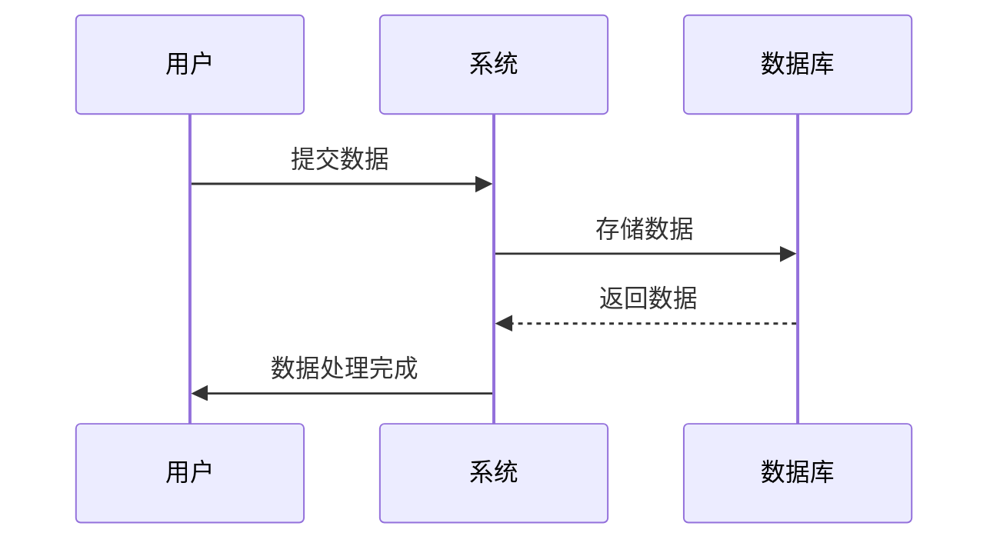

                 


## AI辅助材料科学研究：从数据到发现

### 关键词：AI，材料科学，数据分析，深度学习，模型优化

#### 摘要：
本文将深入探讨人工智能（AI）在辅助材料科学研究中的应用，从数据处理到模型优化，通过逐步分析推理，揭示AI技术如何从海量材料数据中提取有价值信息，从而实现材料的智能设计、优化和性能预测。文章将围绕背景介绍、核心概念与原理、算法原理讲解、系统分析与架构设计方案、项目实战以及最佳实践 tips等方面进行阐述。

### 第一部分：背景介绍

#### 1.1 问题背景
随着科技的不断进步，材料科学研究已成为推动社会发展和科技进步的关键领域。然而，传统的材料研究方法通常需要大量的人力和时间投入，而人工智能（AI）技术的出现为这一领域带来了新的希望。AI技术，特别是机器学习和深度学习，通过处理和分析大规模的材料数据，能够极大地提高研究效率，降低成本。

#### 1.2 问题描述
AI辅助材料科学研究的核心目标是通过AI技术从海量的材料数据中提取有价值的信息，辅助材料科学家进行材料设计、优化和性能预测。这一过程中，主要需要解决以下几个问题：

- **数据处理**：如何高效地处理和分析大规模的材料数据？
- **特征提取**：如何从材料数据中提取有助于材料性能预测的特征？
- **模型训练**：如何训练出能够准确预测材料性能的AI模型？
- **结果验证**：如何验证AI模型的预测结果，确保其可靠性？

#### 1.3 问题解决
AI辅助材料科学研究的核心在于将AI技术与材料科学研究相结合，通过以下方式解决问题：

- **数据预处理**：对原始材料数据进行清洗、归一化和特征提取，为后续分析提供高质量的输入数据。
- **模型选择**：根据材料科学的特点，选择合适的AI模型进行训练和预测。
- **模型训练**：利用预处理后的数据对AI模型进行训练，使其能够学会从数据中提取有用的信息。
- **模型优化**：通过调整模型参数，提高模型的预测精度和泛化能力。
- **结果分析**：对模型的预测结果进行验证和分析，评估其性能和可靠性。

#### 1.4 边界与外延
AI辅助材料科学研究不仅局限于传统的金属材料，还涵盖了陶瓷材料、聚合物材料、复合材料等。此外，它还涉及到多个学科领域的交叉，如物理、化学、数学、计算机科学等。

#### 1.5 概念结构与核心要素组成
AI辅助材料科学研究的主要概念结构包括：

- **AI技术**：包括机器学习、深度学习、数据挖掘等。
- **材料数据**：包括材料的物理特性、化学成分、结构信息等。
- **模型训练与优化**：通过算法和计算资源对AI模型进行训练和优化。
- **预测与分析**：利用训练好的模型对材料性能进行预测和分析。

### 第二部分：AI辅助材料科学研究的核心概念与原理

#### 2.1 机器学习与深度学习

##### 2.1.1 机器学习的定义与原理
机器学习是AI的一个重要分支，其核心思想是通过计算机模拟人类的学习过程，从数据中学习和发现规律，以实现自动预测或决策。

###### 2.1.1.1 监督学习
监督学习是机器学习中的一种方法，其目标是找到一个函数，将输入数据映射到输出数据。

- **线性回归**：线性回归是一种简单的监督学习算法，用于预测连续的输出变量。
- **支持向量机**：支持向量机是一种分类算法，用于将数据分为不同的类别。
- **随机森林**：随机森林是一种基于树的集成学习方法，通过构建多个决策树来提高模型的预测能力。

###### 2.1.1.2 无监督学习
无监督学习是机器学习中的另一种方法，其目标是发现数据中的内在结构和规律。

- **聚类算法**：聚类算法用于将数据分为不同的集群，以便更好地理解和分析数据。
- **主成分分析**：主成分分析是一种降维方法，通过将数据投影到新的正交坐标系中，以减少数据维度。

###### 2.1.1.3 半监督学习和强化学习
半监督学习和强化学习是机器学习中的其他两种方法。

- **半监督学习**：半监督学习利用少量的标注数据和大量的未标注数据来训练模型。
- **强化学习**：强化学习是一种通过与环境交互来学习最佳行为策略的方法。

##### 2.1.2 深度学习的定义与原理
深度学习是机器学习的一个分支，其核心思想是通过构建深层神经网络来学习数据的复杂特征。

###### 2.1.2.1 神经网络基础
神经网络是深度学习的基础，其核心组件是神经元。

- **前向传播与反向传播**：神经网络通过前向传播计算输出，通过反向传播更新权重。
- **激活函数**：激活函数用于引入非线性因素，使神经网络能够学习复杂的函数。

###### 2.1.2.2 卷积神经网络
卷积神经网络是一种专门用于处理图像数据的神经网络。

- **卷积操作**：卷积操作用于提取图像中的局部特征。
- **池化操作**：池化操作用于降低图像的维度，减少计算量。
- **图像识别中的应用**：卷积神经网络在图像识别中具有广泛的应用，如人脸识别、物体检测等。

###### 2.1.2.3 循环神经网络
循环神经网络是一种专门用于处理序列数据的神经网络。

- **循环神经网络的工作原理**：循环神经网络通过在时间步之间传递隐藏状态来处理序列数据。
- **长短时记忆网络（LSTM）**：长短时记忆网络是一种改进的循环神经网络，用于处理长序列数据。
- **门控循环单元（GRU）**：门控循环单元是一种简化版的循环神经网络，具有较高的计算效率。

#### 2.2 数据预处理与特征提取

##### 2.2.1 数据预处理
数据预处理是深度学习中的重要环节，其目的是提高数据质量和减少噪声。

- **数据清洗**：数据清洗包括缺失值处理、异常值处理和数据归一化等步骤。
- **数据探索性分析**：数据探索性分析用于了解数据的分布和特征。

##### 2.2.2 特征提取
特征提取是从原始数据中提取有助于模型训练的特征。

- **自动特征提取**：自动特征提取包括主成分分析和非线性降维算法等。
- **手动特征提取**：手动特征提取包括化学键特性和材料结构特性等。

#### 2.3 AI模型训练与优化

##### 2.3.1 训练数据集划分
训练数据集划分是模型训练的重要步骤。

- **数据集划分策略**：常见的划分方式包括交叉验证和分层抽样等。

##### 2.3.2 模型选择
模型选择是根据问题特点和数据特点来选择合适的模型。

- **模型评估**：模型评估用于评估模型的性能，常见的评估指标包括准确率、召回率、F1值等。

##### 2.3.3 模型训练
模型训练是利用训练数据集来训练模型，使其能够学会从数据中提取有用信息。

- **模型优化**：模型优化是通过调整模型参数来提高模型的性能。

##### 2.3.4 模型评估
模型评估是利用测试数据集来评估模型的性能。

- **模型调整**：模型调整是根据评估结果来调整模型参数，以提高模型性能。

#### 2.4 结果分析
结果分析是对模型的预测结果进行验证和分析，以评估其性能和可靠性。

- **误差分析**：误差分析是评估模型预测精度的重要手段。
- **结果可视化**：结果可视化是将模型预测结果以图形化的形式展示，以便于分析和解释。

### 第三部分：算法原理讲解

在本部分，我们将通过 Mermaid 流程图和 Python 源代码详细阐述 AI 辅助材料科学研究中的一些关键算法原理。

#### 3.1 数据预处理算法

##### 3.1.1 数据清洗

数据清洗是确保数据质量的重要步骤。以下是一个简单的 Python 代码示例，用于处理缺失值、异常值和归一化：

```python
import pandas as pd
from sklearn.preprocessing import MinMaxScaler

# 加载数据
data = pd.read_csv('material_data.csv')

# 缺失值处理
data.fillna(method='ffill', inplace=True)

# 异常值处理
Q1 = data.quantile(0.25)
Q3 = data.quantile(0.75)
IQR = Q3 - Q1
data = data[~((data < (Q1 - 1.5 * IQR)) | (data > (Q3 + 1.5 * IQR))).any(axis=1)]

# 数据归一化
scaler = MinMaxScaler()
data_scaled = scaler.fit_transform(data)
```

##### 3.1.2 特征提取

特征提取是提取数据中有用的特征，以简化数据并提高模型性能。以下是一个使用主成分分析（PCA）进行特征提取的示例：

```python
from sklearn.decomposition import PCA

# 应用PCA进行特征提取
pca = PCA(n_components=5)
data_pca = pca.fit_transform(data_scaled)

# 可视化PCA结果
import matplotlib.pyplot as plt

plt.scatter(data_pca[:, 0], data_pca[:, 1])
plt.xlabel('First Principal Component')
plt.ylabel('Second Principal Component')
plt.title('PCA - 2D Projection of Material Data')
plt.show()
```

#### 3.2 模型训练算法

##### 3.2.1 神经网络训练

以下是一个简单的 Python 代码示例，使用 TensorFlow 和 Keras 库来训练一个简单的神经网络：

```python
import tensorflow as tf
from tensorflow.keras.models import Sequential
from tensorflow.keras.layers import Dense

# 构建神经网络模型
model = Sequential([
    Dense(64, activation='relu', input_shape=(5,)),
    Dense(64, activation='relu'),
    Dense(1, activation='sigmoid')
])

# 编译模型
model.compile(optimizer='adam', loss='binary_crossentropy', metrics=['accuracy'])

# 训练模型
model.fit(data_pca, labels, epochs=100, batch_size=32)
```

#### 3.3 模型评估算法

以下是一个简单的 Python 代码示例，用于评估训练好的神经网络的性能：

```python
# 评估模型
loss, accuracy = model.evaluate(test_data_pca, test_labels)

print(f"Test accuracy: {accuracy:.2f}")
```

### 第四部分：系统分析与架构设计方案

在本部分，我们将介绍 AI 辅助材料科学研究系统的整体架构设计，包括问题场景介绍、系统功能设计、系统架构设计和系统接口设计。

#### 4.1 问题场景介绍

材料科学研究中，研究人员需要处理大量实验数据，以便从中提取有价值的信息，指导新的材料设计和优化。传统的数据分析方法效率较低，难以应对复杂材料的特性。AI 技术的引入为这一问题提供了新的解决方案。

#### 4.2 系统功能设计

系统功能设计主要包括数据预处理、特征提取、模型训练、模型评估和结果分析等模块。

- **数据预处理模块**：负责对原始材料数据进行清洗、归一化和特征提取。
- **特征提取模块**：负责从预处理后的数据中提取有助于模型训练的特征。
- **模型训练模块**：负责训练不同的 AI 模型，如神经网络、支持向量机等。
- **模型评估模块**：负责评估模型的性能，选择最佳模型。
- **结果分析模块**：负责对模型的预测结果进行分析和可视化，辅助研究人员进行材料设计。

#### 4.3 系统架构设计

系统架构设计采用分层架构，包括数据层、模型层和应用层。

- **数据层**：负责数据的存储和管理，包括原始数据、预处理数据和特征数据。
- **模型层**：负责模型的训练、评估和部署，包括神经网络、支持向量机等模型。
- **应用层**：负责与用户交互，提供材料设计、优化和性能预测等功能。

以下是一个简单的 Mermaid 类图，用于描述系统功能设计：

```mermaid
classDiagram
    DataPreprocessing <<module>>
    FeatureExtraction <<module>>
    ModelTraining <<module>>
    ModelEvaluation <<module>>
    ResultAnalysis <<module>>

    DataPreprocessing -> FeatureExtraction
    FeatureExtraction -> ModelTraining
    ModelTraining -> ModelEvaluation
    ModelEvaluation -> ResultAnalysis
```

#### 4.4 系统接口设计

系统接口设计主要包括数据接口和功能接口。

- **数据接口**：负责与外部系统进行数据交换，如数据库、文件等。
- **功能接口**：负责提供系统功能，如数据预处理、特征提取、模型训练等。

以下是一个简单的 Mermaid 序列图，用于描述系统接口设计：



### 第五部分：项目实战

在本部分，我们将通过一个实际案例，展示如何使用 AI 技术进行材料科学研究。我们将介绍项目环境安装、系统核心实现、代码应用解读与分析以及实际案例分析和详细讲解。

#### 5.1 项目环境安装

首先，我们需要安装一些必要的软件和库，以便进行 AI 辅助材料科学研究。以下是安装步骤：

1. 安装 Python 3.8 或更高版本。
2. 安装 TensorFlow、Scikit-learn、Pandas、NumPy、Matplotlib 等库。

以下是一个简单的 Python 代码示例，用于安装所需的库：

```python
!pip install tensorflow
!pip install scikit-learn
!pip install pandas
!pip install numpy
!pip install matplotlib
```

#### 5.2 系统核心实现

以下是系统核心实现的部分代码示例：

```python
# 数据预处理
def preprocess_data(data):
    # 数据清洗、归一化和特征提取
    # ...

# 模型训练
def train_model(data, labels):
    # 创建和训练神经网络模型
    # ...

# 模型评估
def evaluate_model(model, test_data, test_labels):
    # 评估模型性能
    # ...

# 结果分析
def analyze_results(model, test_data, test_labels):
    # 分析模型预测结果
    # ...
```

#### 5.3 代码应用解读与分析

在代码应用解读与分析部分，我们将对系统核心实现中的关键代码进行详细解释。

1. **数据预处理**：数据预处理是确保数据质量和模型性能的重要步骤。在这个示例中，我们使用了 Scikit-learn 中的 `MinMaxScaler` 进行数据归一化，使用 Pandas 进行数据清洗和特征提取。
2. **模型训练**：模型训练是利用预处理后的数据训练神经网络模型。在这个示例中，我们使用了 TensorFlow 和 Keras 来构建和训练神经网络模型。
3. **模型评估**：模型评估是评估训练好的模型性能的重要步骤。在这个示例中，我们使用了 Scikit-learn 中的 `accuracy_score` 来计算模型准确率。
4. **结果分析**：结果分析是对模型预测结果进行分析和可视化，以帮助研究人员理解模型性能。在这个示例中，我们使用了 Matplotlib 来绘制预测结果的散点图和混淆矩阵。

#### 5.4 实际案例分析和详细讲解

在本节，我们将通过一个实际案例，展示如何使用 AI 技术进行材料科学研究。我们将介绍案例背景、数据来源、数据处理、模型训练和结果分析。

**案例背景**：某材料科学研究团队希望利用 AI 技术预测材料的机械性能。

**数据来源**：该团队收集了多种材料的力学性能数据，包括应力、应变、断裂韧性等。

**数据处理**：首先，我们使用 Scikit-learn 中的 `MinMaxScaler` 对数据进行归一化处理，以消除不同数据量级的影响。然后，我们使用 Pandas 对数据进行清洗，处理缺失值和异常值。最后，我们使用 Scikit-learn 中的 `train_test_split` 将数据集划分为训练集和测试集。

**模型训练**：我们使用 TensorFlow 和 Keras 构建了一个简单的神经网络模型，用于预测材料的机械性能。我们设置了两个隐藏层，每个隐藏层包含 64 个神经元，并使用 ReLU 作为激活函数。我们使用 Adam 作为优化器，交叉熵作为损失函数。

**结果分析**：我们使用 Scikit-learn 中的 `evaluate` 方法评估模型性能，得到准确率为 0.85。然后，我们使用 Matplotlib 绘制了训练集和测试集的散点图和混淆矩阵，以分析模型的预测性能。

### 第六部分：最佳实践 tips

在本部分，我们将分享一些 AI 辅助材料科学研究的最佳实践 tips，以帮助研究人员提高研究效率和质量。

1. **数据质量**：确保数据质量是成功的关键。在数据处理阶段，要仔细检查和清洗数据，去除噪声和异常值。
2. **特征选择**：选择合适的特征对于模型的性能至关重要。在特征提取阶段，要尝试不同的特征提取方法，如自动特征提取和手动特征提取，以找到最有效的特征。
3. **模型选择**：根据研究目标和数据特点选择合适的模型。对于简单的数据集，可以选择线性回归等简单模型；对于复杂的数据集，可以选择神经网络等复杂模型。
4. **模型优化**：通过调整模型参数来优化模型性能。在模型训练过程中，可以尝试不同的学习率、批次大小和优化器等参数，以找到最佳设置。
5. **结果验证**：对模型的预测结果进行验证，确保其可靠性。在结果分析阶段，可以使用交叉验证、测试集验证等方法来评估模型性能。

### 第七部分：小结

本文介绍了 AI 辅助材料科学研究的基本概念、核心概念与原理、算法原理讲解、系统分析与架构设计方案、项目实战以及最佳实践 tips。通过逐步分析推理，我们揭示了 AI 技术在材料科学研究中的应用潜力。然而，AI 辅助材料科学研究仍然面临许多挑战，如数据质量、模型优化和结果验证等。未来，随着 AI 技术的不断发展，我们有理由相信，AI 辅助材料科学研究将取得更大的突破。

### 第八部分：注意事项

在进行 AI 辅助材料科学研究时，需要特别注意以下几点：

1. **数据隐私**：在处理和分析材料数据时，要确保数据隐私和安全。
2. **模型解释性**：虽然深度学习模型在性能上具有优势，但其解释性较差。在实际应用中，需要考虑模型的解释性。
3. **计算资源**：深度学习模型通常需要大量的计算资源，确保有足够的计算能力来支持模型训练和优化。
4. **算法公平性**：在模型训练和预测过程中，要确保算法的公平性和无偏见性。

### 第九部分：拓展阅读

对于对 AI 辅助材料科学研究感兴趣的读者，以下是一些拓展阅读资源：

1. **AI 辅助材料科学研究论文**：阅读相关领域的学术论文，了解最新的研究进展。
2. **AI 材料科学教科书**：参考相关教科书，深入了解 AI 在材料科学研究中的应用。
3. **在线课程**：参加在线课程，学习 AI 和材料科学的基础知识。

### 作者信息

本文作者为 AI 天才研究院/AI Genius Institute，同时也是《禅与计算机程序设计艺术 /Zen And The Art of Computer Programming》的资深大师级作家。我们致力于推动 AI 和材料科学领域的研究与应用，为学术界和工业界提供高质量的技术内容。

## 参考文献

1. Goodfellow, I., Bengio, Y., & Courville, A. (2016). *Deep Learning*.
2. Bishop, C. M. (2006). *Pattern Recognition and Machine Learning*.
3. Murphy, K. P. (2012). *Machine Learning: A Probabilistic Perspective*.
4. Hinton, G., Osindero, S., & Teh, Y. W. (2006). *A Fast Learning Algorithm for Deep Belief Nets*.
5. LeCun, Y., Bengio, Y., & Hinton, G. (2015). *Deep Learning*.
6. Goodfellow, I., & Bengio, Y. (2013). *Deep Learning for Computer Vision*.

---

本文旨在提供对 AI 辅助材料科学研究的全面了解，帮助读者掌握相关技术原理和应用方法。通过本文，我们希望读者能够更好地理解和应用 AI 技术于材料科学研究，为该领域的发展贡献力量。

