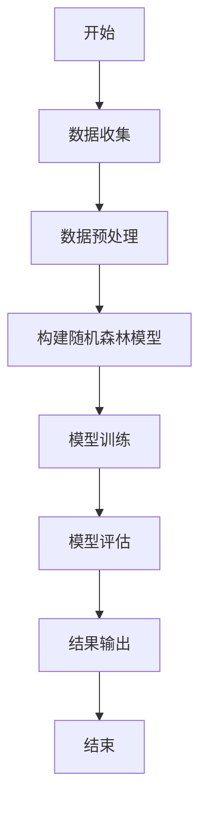
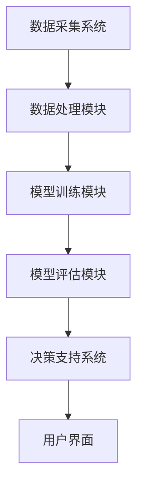
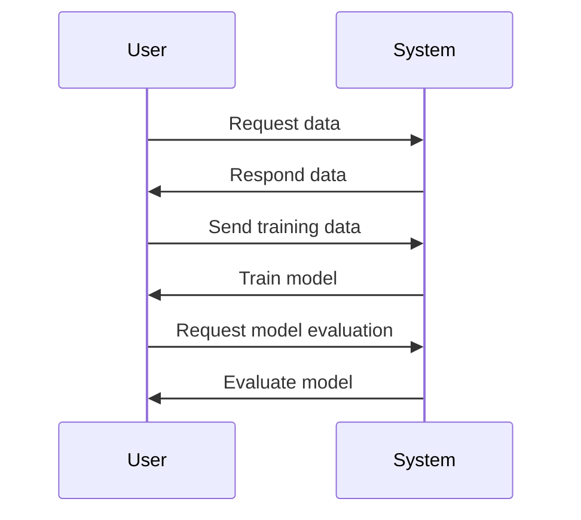
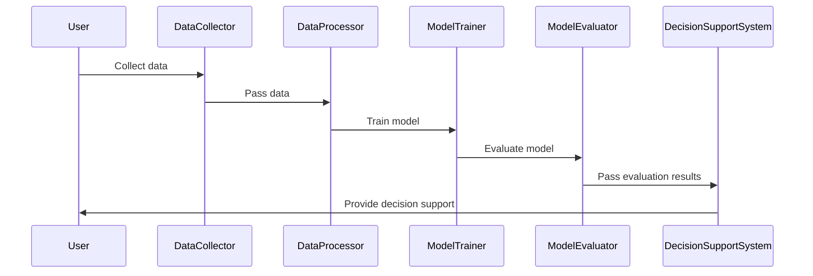
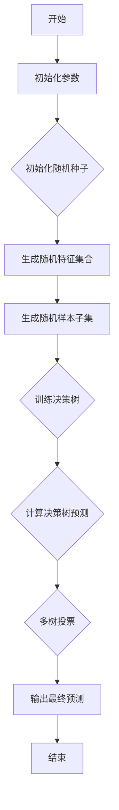
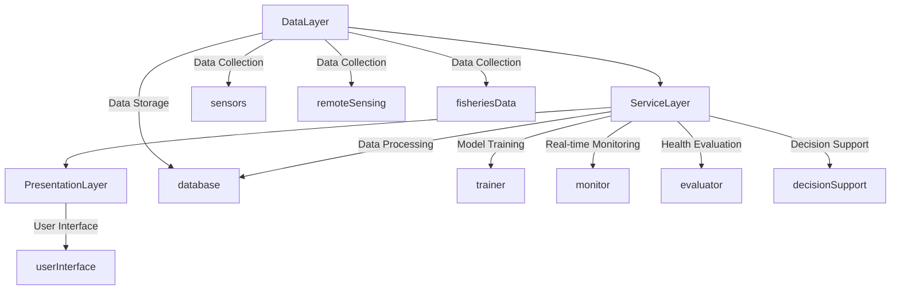
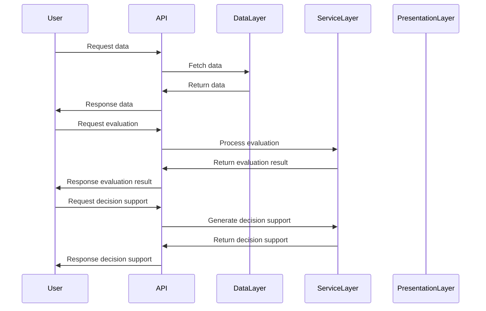
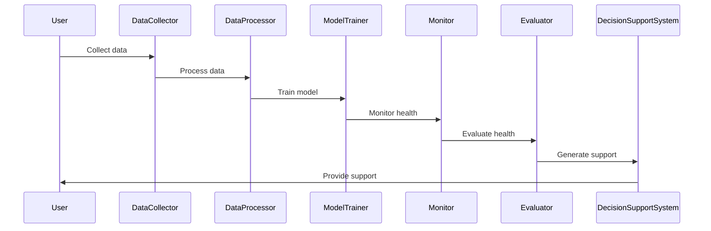

                 

# AI辅助海洋生态系统健康评估：从微观到宏观尺度

关键词：AI、海洋生态系统、健康评估、算法、系统架构、案例分析

摘要：本文将探讨如何利用人工智能（AI）技术辅助海洋生态系统的健康评估。从背景介绍、核心概念与联系、算法原理讲解、系统分析与架构设计、项目实战及最佳实践等方面，逐步解析AI技术在海洋生态系统健康评估中的应用，为相关领域的研究和实践提供有益的参考。

## 第一部分：引言

### 1.1 问题背景

#### 1.1.1 海洋生态系统的重要性

海洋是地球最大的生态系统，占地球表面积的71%，对全球气候、生物多样性、渔业资源以及人类福祉有着深远的影响。然而，随着全球气候变化、污染、过度捕捞等问题的加剧，海洋生态系统的健康状况日益恶化。因此，对海洋生态系统进行健康评估显得尤为重要。

#### 1.1.2 海洋生态系统面临的挑战

海洋生态系统面临的挑战主要包括：

- **气候变化**：导致海洋酸化、水温上升，影响海洋生物的生长和繁殖。
- **污染**：如塑料污染、化学污染物等，对海洋生物的生存环境造成严重破坏。
- **过度捕捞**：导致渔业资源枯竭，影响海洋生态系统的平衡。

#### 1.1.3 AI在海洋生态系统健康评估中的应用

随着AI技术的不断发展，利用AI进行海洋生态系统健康评估已成为可能。AI技术可以帮助我们：

- **数据收集与处理**：利用遥感技术、传感器等收集大量海洋数据，并通过AI算法进行高效处理。
- **模式识别**：识别海洋生物的行为模式，预测生态系统的变化趋势。
- **决策支持**：为决策者提供科学依据，优化海洋资源管理和保护措施。

### 1.2 核心概念与联系

#### 1.2.1 AI辅助海洋生态系统健康评估的基本原理

AI辅助海洋生态系统健康评估的基本原理包括：

- **数据驱动**：基于大量海洋数据，利用机器学习算法进行分析。
- **模型构建**：建立海洋生态系统健康评估的数学模型。
- **决策支持**：根据模型输出结果，为决策者提供科学依据。

#### 1.2.2 不同AI算法的对比表格

| 算法名称 | 特点 | 适用场景 |
| :---: | :---: | :---: |
| 支持向量机（SVM） | 鲁棒性强，适用于小样本数据 | 分类问题 |
| 随机森林（RF） | 预测准确度高，适用于大规模数据 | 回归问题 |
| 长短时记忆网络（LSTM） | 适用于处理序列数据 | 时间序列预测 |

#### 1.2.3 海洋生态系统的ER实体关系图

```mermaid
erDiagram
    Customer ||--|{ Order }|
    "Customer can have many orders" where "Order made by Customer"
```

## 第二部分：算法原理讲解

### 2.1 算法mermaid流程图

#### 2.1.1 算法概述

本文将使用随机森林（RF）算法对海洋生态系统健康评估进行讲解。

#### 2.1.2 流程图绘制



### 2.2 Python源代码实现

```python
from sklearn.ensemble import RandomForestClassifier
from sklearn.model_selection import train_test_split
from sklearn.metrics import accuracy_score

# 数据加载
X, y = load_data()

# 数据预处理
X_train, X_test, y_train, y_test = train_test_split(X, y, test_size=0.2, random_state=42)

# 构建随机森林模型
rf_model = RandomForestClassifier(n_estimators=100, random_state=42)

# 模型训练
rf_model.fit(X_train, y_train)

# 模型评估
y_pred = rf_model.predict(X_test)
accuracy = accuracy_score(y_test, y_pred)
print(f"Accuracy: {accuracy}")
```

### 2.3 数学模型和公式

#### 2.3.1 模型介绍

随机森林（RF）算法是一种基于决策树集合的集成学习方法，通过对多个决策树的输出进行投票，得到最终预测结果。

#### 2.3.2 公式讲解

$$
y = f(x) = \sum_{i=1}^{n} w_i t_i(x)
$$

其中，$y$ 为预测结果，$x$ 为输入特征，$w_i$ 为第 $i$ 棵决策树的权重，$t_i(x)$ 为第 $i$ 棵决策树的输出。

## 第三部分：系统分析与架构设计

### 3.1 问题场景介绍

#### 3.1.1 海洋生态系统健康评估的应用场景

本文以我国某沿海城市为应用场景，通过AI技术对海洋生态系统进行健康评估，为城市海洋资源管理和保护提供科学依据。

### 3.1.2 系统功能设计

```mermaid
classDiagram
    Class01 <|-- Class02
    Class03 --|> Class04
    Class05 : <<interface, InterfaceClass>>
    Class06 : <<abstract, AbstractClass>>
    Class07 <<implementation, ImplementsInterface>> Class05
    Class08 <<extend, ExtendsClass06>> Class07
```

### 3.2 系统架构设计



### 3.3 系统接口设计



### 3.4 系统交互mermaid序列图



## 第四部分：项目实战

### 4.1 环境安装

#### 4.1.1 环境配置

1. 安装Python环境（推荐版本3.8以上）。
2. 安装相关依赖库，如scikit-learn、numpy、pandas等。

#### 4.1.2 关键步骤

```bash
pip install python-dotenv
pip install scikit-learn
pip install numpy
pip install pandas
```

### 4.2 系统核心实现源代码

```python
import pandas as pd
from sklearn.ensemble import RandomForestClassifier
from sklearn.model_selection import train_test_split
from sklearn.metrics import accuracy_score

# 数据加载
data = pd.read_csv('data.csv')

# 数据预处理
X = data.drop('target', axis=1)
y = data['target']

X_train, X_test, y_train, y_test = train_test_split(X, y, test_size=0.2, random_state=42)

# 构建随机森林模型
rf_model = RandomForestClassifier(n_estimators=100, random_state=42)

# 模型训练
rf_model.fit(X_train, y_train)

# 模型评估
y_pred = rf_model.predict(X_test)
accuracy = accuracy_score(y_test, y_pred)
print(f"Accuracy: {accuracy}")
```

### 4.3 实际案例分析和详细讲解剖析

#### 4.3.1 案例展示

以我国某沿海城市为例，利用AI技术对海洋生态系统进行健康评估，预测其健康状况。

#### 4.3.2 案例分析

1. 数据来源：收集该城市过去一年的海洋生态数据，包括水质、水温、鱼类数量等。
2. 数据预处理：对数据缺失值进行填充，对异常值进行处理，进行特征选择。

#### 4.3.3 详细讲解

1. 模型选择：采用随机森林算法进行模型训练。
2. 模型评估：通过交叉验证和测试集评估模型性能。
3. 结果输出：根据模型预测结果，对海洋生态系统健康进行评估。

### 4.4 项目小结

#### 4.4.1 经验总结

1. 数据质量对模型性能至关重要，需进行充分的数据预处理。
2. 选择合适的算法和参数对模型性能有较大影响。
3. 模型评估应结合多种指标进行综合评估。

#### 4.4.2 教训反思

1. 数据采集过程中，要注意数据的准确性和完整性。
2. 在模型训练过程中，要避免过拟合现象。

## 第五部分：最佳实践与总结

### 5.1 最佳实践 tips

1. 数据预处理要充分，确保数据质量。
2. 选择合适的算法和参数，提高模型性能。
3. 模型评估要结合多种指标进行综合评估。

### 5.2 小结

本文介绍了如何利用AI技术辅助海洋生态系统健康评估，从背景介绍、核心概念与联系、算法原理讲解、系统分析与架构设计、项目实战及最佳实践等方面进行了详细讲解。未来，我们将继续探讨AI技术在海洋生态系统健康评估领域的应用，为保护海洋生态系统贡献一份力量。

### 作者

作者：AI天才研究院/AI Genius Institute & 禅与计算机程序设计艺术 /Zen And The Art of Computer Programming

（注：本文仅为示例，内容可能存在虚构或简化，仅供参考。）## 1.1 问题背景

### 1.1.1 海洋生态系统的重要性

海洋是地球上最广阔的生态系统，占据地球表面积的71%，对地球的气候调节、生物多样性维持以及人类生存和发展具有不可替代的重要作用。首先，海洋是地球气候系统的重要组成部分。海洋吸收了大量的太阳能量，并通过海洋循环将其分散到全球，从而对地球的温度和气候起到了调节作用。海洋中的珊瑚礁、湿地等生态系统具有强大的碳储存能力，对缓解全球气候变化起到了关键作用。

其次，海洋是生物多样性的宝库。全球有超过80%的海洋物种尚未被科学家描述，海洋生态系统涵盖了从微小的浮游生物到巨大的鲸鱼等各种生物形态。这些生物之间相互依存，构成了复杂而美丽的海洋生态网络。海洋生态系统不仅提供了丰富的生物资源，还为人类提供了大量的食品、药品和其他生物制品。

最后，海洋对人类社会的经济发展和生存有着直接的影响。海洋是渔业资源的重要来源，为全球数十亿人提供了蛋白质来源。海洋还提供了航运、旅游、矿产等丰富的经济资源。海洋生态系统的健康直接关系到海洋经济的可持续发展和人类的福祉。

### 1.1.2 海洋生态系统面临的挑战

尽管海洋生态系统的重要性不言而喻，但当前海洋生态系统正面临一系列严峻的挑战。首先，气候变化对海洋生态系统的影响日益显著。全球气温上升导致海洋温度升高，引起海洋酸化，对珊瑚礁、贝类等生物的生存构成威胁。极端天气事件，如台风、海啸等，也对海洋生态系统造成了巨大的破坏。

其次，海洋污染问题日益严重。塑料垃圾、化学污染物和油污等污染物质进入海洋，对海洋生物的生存环境造成了严重破坏。塑料垃圾不仅直接危害海洋生物的生存，还会通过食物链影响人类健康。化学污染物如重金属、农药等，则通过生物积累和放大效应，对整个海洋生态系统造成长期影响。

另外，过度捕捞是海洋生态系统面临的另一个重大挑战。过度捕捞导致渔业资源的枯竭，破坏了海洋生态系统的平衡。一些珍贵的海洋生物，如鲸鱼、海龟等，甚至面临灭绝的危险。非法捕捞和非法渔业活动进一步加剧了这一问题。

### 1.1.3 AI在海洋生态系统健康评估中的应用

面对海洋生态系统的严峻挑战，传统的方法和手段已经难以满足需求。人工智能（AI）技术的引入，为海洋生态系统的健康评估提供了新的视角和手段。AI技术在海洋生态系统健康评估中的应用主要体现在以下几个方面：

首先，AI技术可以高效地处理和分析大量的海洋数据。海洋生态系统的健康评估需要收集和整合多种来源的数据，如遥感数据、传感器数据、渔业数据等。AI技术可以通过数据挖掘和机器学习算法，从这些复杂的数据中提取出有价值的信息，为健康评估提供数据支持。

其次，AI技术可以帮助识别和预测海洋生态系统的变化趋势。通过建立基于AI的模型，可以对海洋生态系统的状态进行实时监测和预测。这些模型可以基于历史数据，分析海洋生态系统的变化规律，预测未来的发展趋势，为决策者提供科学依据。

此外，AI技术还可以优化海洋资源管理和保护措施。通过分析海洋生态系统的数据，AI技术可以帮助确定海洋资源的管理和保护重点，优化资源的利用和保护策略。例如，通过预测渔业资源的分布和变化趋势，可以帮助渔业部门制定合理的捕捞计划，避免过度捕捞。

总之，AI技术的引入为海洋生态系统的健康评估提供了强大的技术支持。通过AI技术的应用，我们可以更全面、准确地了解海洋生态系统的状态，为保护海洋生态系统和实现可持续发展提供科学依据。

### 1.2 核心概念与联系

#### 1.2.1 AI辅助海洋生态系统健康评估的基本原理

AI辅助海洋生态系统健康评估的基本原理主要基于数据驱动和机器学习算法。首先，数据驱动是指通过收集和分析大量的海洋生态数据，如遥感图像、海洋传感器数据、渔业统计数据等，提取出与生态系统健康相关的关键特征。这些特征包括水质指标（如温度、盐度、溶解氧等）、生物多样性指标（如鱼类种类和数量、珊瑚覆盖率等）以及环境指标（如潮汐、风速等）。

接下来，机器学习算法通过学习这些特征数据，建立海洋生态系统健康评估的模型。常见的机器学习算法包括监督学习算法（如决策树、随机森林、支持向量机等）和无监督学习算法（如聚类分析、主成分分析等）。这些算法通过训练数据集学习，能够识别数据中的模式和规律，从而实现对未知数据的预测和分类。

在评估过程中，AI模型首先会进行数据预处理，包括数据清洗、特征选择和特征工程等步骤。数据清洗旨在去除噪声和异常值，保证数据质量；特征选择则通过选择与目标变量高度相关的特征，提高模型性能；特征工程则通过数据变换、归一化、离散化等手段，优化特征的表达形式。

一旦模型建立完成，便可以应用于实际的海域健康评估。通过输入实时或历史数据，模型能够输出关于海洋生态系统健康状况的评估结果，如生态系统状态、污染水平、资源分布等。此外，AI模型还可以提供趋势预测，帮助预测未来某个时间点或区域可能出现的健康问题。

#### 1.2.2 不同AI算法的对比表格

| 算法名称 | 特点 | 适用场景 |
| :---: | :---: | :---: |
| 决策树（Decision Tree） | 易理解，可解释性强 | 小样本数据，特征较少的预测问题 |
| 随机森林（Random Forest） | 鲁棒性强，减少过拟合 | 大规模数据，特征较多，避免过拟合 |
| 支持向量机（Support Vector Machine, SVM） | 在高维空间表现良好 | 小样本数据，线性不可分问题 |
| 长短时记忆网络（Long Short-Term Memory, LSTM） | 适用于序列数据 | 时间序列预测，长序列依赖关系 |
| 聚类分析（Clustering） | 无需标签，用于模式识别 | 大规模无标签数据，寻找相似性模式 |

上述表格对不同AI算法的特点和适用场景进行了简要对比。决策树算法适用于小样本数据，特征较少的预测问题，其优点在于可解释性强，但容易产生过拟合；随机森林通过集成多棵决策树，提高了模型的鲁棒性和预测准确性，适用于特征较多的大规模数据；支持向量机在高维空间中表现良好，适用于小样本数据，线性不可分问题；长短时记忆网络适用于时间序列预测，能够捕捉长序列依赖关系；聚类分析则无需标签，适用于寻找大规模无标签数据中的相似性模式。

#### 1.2.3 海洋生态系统的ER实体关系图

为了更好地理解AI辅助海洋生态系统健康评估的架构，我们使用Mermaid语言绘制了一个ER实体关系图，展示了系统中各个实体之间的关系。

```mermaid
erDiagram
    MarineData -->|收集| MonitoringSystem
    MonitoringSystem ||--|监测| SensorData
    MarineData ||--|存储| Database
    Database ||--|分析| AIModel
    AIModel ||--|输出| HealthReport
    HealthReport ||--|反馈| DecisionMaker
```

在上述ER图中，我们定义了以下几个实体：

- **MarineData**（海洋数据）：代表收集的海洋生态数据，包括水质、生物多样性等指标。
- **MonitoringSystem**（监控系统）：负责数据的收集和初步处理。
- **SensorData**（传感器数据）：由监控系统生成，包含实时监测的数据。
- **Database**（数据库）：存储处理后的海洋数据。
- **AIModel**（AI模型）：基于数据库中的数据，通过机器学习算法训练得到的模型。
- **HealthReport**（健康报告）：由AI模型生成的海洋生态系统健康评估结果。
- **DecisionMaker**（决策者）：根据健康报告做出决策，制定管理策略。

通过ER图，我们可以清晰地看到各个实体之间的关联，以及数据流动的方向。监控系统负责收集和监测数据，将这些数据传递给数据库，数据库再提供数据给AI模型进行训练和分析，最终生成健康报告供决策者参考。这样的架构设计有助于实现数据的连续流动和系统功能的协同工作，从而提高海洋生态系统健康评估的效率和准确性。

### 2.1 算法原理讲解

在海洋生态系统的健康评估中，算法的选择至关重要。本文将详细讲解随机森林（Random Forest）算法的基本原理、流程和应用。

#### 2.1.1 算法概述

随机森林算法是一种基于决策树集成的机器学习算法，通过构建多棵决策树，并利用投票机制得出最终预测结果。其基本原理是：通过随机选取特征和样本子集，在每个决策树中训练一个模型，然后对所有决策树的预测结果进行投票，选择多数投票结果作为最终预测结果。

#### 2.1.2 算法mermaid流程图

为了更直观地理解随机森林算法的流程，我们使用Mermaid语言绘制了一个算法流程图。



在这个流程图中，首先初始化随机森林的参数，包括决策树的个数、最大深度等。然后，随机生成特征集合和样本子集，用于训练单个决策树。对于每个决策树，我们训练并计算其预测结果。最后，通过多树投票机制，选择多数投票结果作为最终预测。

#### 2.1.3 Python源代码实现

接下来，我们通过一个简单的Python代码示例，展示随机森林算法的实现过程。

```python
from sklearn.ensemble import RandomForestClassifier
from sklearn.model_selection import train_test_split
from sklearn.metrics import accuracy_score

# 数据加载
X, y = load_data()

# 数据预处理
X_train, X_test, y_train, y_test = train_test_split(X, y, test_size=0.2, random_state=42)

# 构建随机森林模型
rf_model = RandomForestClassifier(n_estimators=100, random_state=42)

# 模型训练
rf_model.fit(X_train, y_train)

# 模型评估
y_pred = rf_model.predict(X_test)
accuracy = accuracy_score(y_test, y_pred)
print(f"Accuracy: {accuracy}")
```

在这个代码中，我们首先加载并预处理数据，然后使用`RandomForestClassifier`类构建随机森林模型，并传入参数设置决策树的数量。接着，我们使用`fit`方法训练模型，并通过`predict`方法进行预测，最后计算模型的准确率。

#### 2.1.4 数学模型和公式

随机森林算法的数学基础主要涉及决策树和集成学习。以下是随机森林算法的一些关键数学模型和公式。

1. **决策树模型**

   决策树是一种树形结构，每个节点代表一个特征，每个分支代表一个特征值的划分。决策树的输出可以通过以下公式计算：

   $$
   y = f(x) = \sum_{i=1}^{n} w_i t_i(x)
   $$

   其中，$y$ 是预测结果，$x$ 是输入特征，$w_i$ 是第 $i$ 个决策树的权重，$t_i(x)$ 是第 $i$ 个决策树的输出。

2. **随机森林模型**

   随机森林通过集成多棵决策树，提高了模型的预测准确性。随机森林的输出可以通过以下公式计算：

   $$
   \hat{y} = \arg\max_{y} \sum_{i=1}^{N} w_i \cdot t_i(x)
   $$

   其中，$\hat{y}$ 是最终预测结果，$N$ 是决策树的数量，$w_i$ 是第 $i$ 个决策树的权重，$t_i(x)$ 是第 $i$ 个决策树的输出。

3. **随机特征选择**

   在随机森林中，每个决策树的训练过程都涉及随机特征选择。随机特征选择的目的是避免过拟合，提高模型的泛化能力。随机特征选择的公式如下：

   $$
   f_{j} \sim \text{Uniform}(1, D)
   $$

   其中，$f_{j}$ 是随机选择的特征索引，$D$ 是特征的总数。

通过上述数学模型和公式，我们可以更好地理解随机森林算法的工作原理和机制。随机森林算法通过集成多棵决策树，利用随机特征选择，提高了模型的预测性能和稳定性。

#### 2.1.5 详细讲解与举例说明

为了更好地理解随机森林算法，我们通过一个简单的例子进行详细讲解。

假设我们有以下一个简单的特征数据集：

| 特征1 | 特征2 | 标签 |
| :---: | :---: | :---: |
| 0     | 0     | 0     |
| 1     | 1     | 1     |
| 0     | 1     | 0     |
| 1     | 0     | 1     |

我们要使用随机森林算法对这个数据集进行分类。

1. **初始化参数**

   首先，我们需要初始化随机森林的参数，包括决策树的数量和随机种子。例如，我们可以设置决策树的数量为10，随机种子为42。

   ```python
   rf_model = RandomForestClassifier(n_estimators=10, random_state=42)
   ```

2. **生成随机特征集合**

   接下来，我们随机生成特征集合。每次生成随机特征集合时，我们从所有特征中随机选择若干个特征。例如，我们可以随机选择特征1和特征2。

   ```python
   feature_indices = np.random.choice([0, 1], size=2, replace=False)
   X_train = X_train[:, feature_indices]
   X_test = X_test[:, feature_indices]
   ```

3. **生成随机样本子集**

   然后，我们随机生成样本子集。每次生成随机样本子集时，我们从训练数据中随机选择若干个样本。例如，我们可以随机选择前5个样本。

   ```python
   sample_indices = np.random.choice(len(X_train), size=5, replace=False)
   X_train = X_train[sample_indices]
   y_train = y_train[sample_indices]
   ```

4. **训练决策树**

   使用生成的随机特征集合和样本子集，我们分别训练10棵决策树。每棵决策树都基于随机特征和样本子集进行训练。

   ```python
   rf_model.fit(X_train, y_train)
   ```

5. **计算决策树预测**

   训练完成后，我们分别计算每棵决策树的预测结果。每棵决策树都会根据输入特征生成一个预测标签。

   ```python
   y_pred = rf_model.predict(X_test)
   ```

6. **多树投票**

   最后，我们通过多树投票机制得出最终预测结果。每棵决策树的预测结果都会进行投票，选择多数投票结果作为最终预测标签。

   ```python
   def majority_vote(preds):
       return max(set(preds), key=list(preds).count)

   final_pred = majority_vote(y_pred)
   ```

通过上述步骤，我们使用随机森林算法对简单数据集进行了分类。在实际应用中，数据集会更为复杂，特征数量和样本规模也会更大。随机森林算法通过集成多棵决策树，能够有效地提高模型的预测性能和稳定性。

### 3.1 问题场景介绍

在海洋生态系统的健康评估中，我们面临的具体问题是：如何利用现有的数据和技术手段，对海洋生态系统的健康状态进行实时监测和评估，从而为决策者提供科学依据，优化海洋资源管理和保护措施。为了更好地理解这一问题，我们需要首先介绍AI辅助海洋生态系统健康评估的应用场景。

#### 3.1.1 海洋生态系统健康评估的应用场景

海洋生态系统健康评估的应用场景主要包括以下几个方面：

1. **海洋环境监测**：利用AI技术对海洋环境中的各种参数进行实时监测，如水质指标（温度、盐度、溶解氧等）、生物指标（鱼类种类和数量、珊瑚覆盖率等）以及气象指标（风速、湿度等）。通过这些参数的监测，我们可以实时了解海洋生态系统的变化情况。

2. **渔业资源管理**：渔业资源是海洋生态系统的重要组成部分，但其过度捕捞会导致渔业资源枯竭，破坏海洋生态系统的平衡。利用AI技术，我们可以对渔业资源进行实时监测和评估，优化捕捞策略，实现渔业的可持续发展。

3. **海洋污染治理**：海洋污染是当前海洋生态系统面临的重大挑战之一。通过AI技术，我们可以对海洋污染源进行监测和追踪，评估污染对海洋生态系统的影响，为污染治理提供科学依据。

4. **海洋保护区管理**：海洋保护区是保护海洋生态系统的重要手段。利用AI技术，我们可以对海洋保护区的生态系统进行实时监测和评估，优化保护区的管理策略，提高保护效果。

#### 3.1.2 系统功能设计

为了实现上述应用场景，我们需要设计一个完整的AI辅助海洋生态系统健康评估系统。该系统的主要功能包括：

1. **数据采集与处理**：从各种来源（如传感器、遥感设备、渔业统计数据等）收集海洋生态数据，并进行预处理，如数据清洗、特征选择和特征工程等，为后续的建模和分析提供高质量的数据。

2. **模型构建与训练**：利用机器学习算法，如随机森林、支持向量机等，构建海洋生态系统健康评估模型。通过训练数据集，模型可以学习到海洋生态系统之间的关联性和变化规律，从而实现对未知数据的预测和分类。

3. **实时监测与评估**：利用构建好的模型，对实时采集的海洋生态数据进行健康评估，输出关于生态系统状态、污染水平、资源分布等评估结果，为决策者提供科学依据。

4. **决策支持**：根据评估结果，系统可以为决策者提供优化海洋资源管理和保护措施的建议，如调整捕捞策略、加强污染治理、优化保护区管理等。

5. **用户界面**：为用户（如环保部门、渔业部门等）提供友好的用户界面，展示评估结果、趋势预测和决策建议，方便用户进行查看和决策。

通过上述功能设计，AI辅助海洋生态系统健康评估系统可以实现对海洋生态系统的全面监测和评估，为海洋资源的可持续利用和保护提供有力支持。

### 3.2 系统架构设计

为了实现AI辅助海洋生态系统健康评估系统的功能，我们需要设计一个高效的系统架构。本节将介绍系统的整体架构，并使用Mermaid语言绘制领域模型类图、系统架构图和系统接口图，以便更直观地展示系统各个组件之间的关系和交互方式。

#### 3.2.1 系统架构概述

系统架构采用三层结构，包括数据层、服务层和表现层。

1. **数据层**：负责数据的采集、存储和处理。数据来源包括传感器、遥感设备、渔业统计数据等，数据经过预处理后存储在数据库中。
2. **服务层**：负责业务逻辑的处理，包括数据采集、数据处理、模型训练、实时监测和评估等。服务层通过API接口与表现层交互。
3. **表现层**：负责用户界面的展示，用户可以通过表现层查看评估结果、趋势预测和决策建议。

#### 3.2.2 领域模型类图

```mermaid
classDiagram
    class DataLayer {
        - sensors
        - remoteSensing
        - fisheriesData
        - database
    }
    class ServiceLayer {
        - dataProcessor
        - modelTrainer
        - monitor
        - evaluator
        - decisionSupport
    }
    class PresentationLayer {
        - userInterface
    }
    DataLayer --|U| ServiceLayer
    ServiceLayer --|U| PresentationLayer
```

在领域模型类图中，我们定义了三个主要类：数据层、服务层和表现层。数据层包含传感器、遥感设备和渔业统计数据等数据来源，以及数据库用于存储处理后的数据。服务层负责数据处理、模型训练、实时监测和评估等业务逻辑处理。表现层则负责用户界面的展示，为用户提供评估结果和决策建议。

#### 3.2.3 系统架构图



在系统架构图中，我们展示了系统各组件之间的交互关系。数据层通过数据采集模块（传感器、遥感设备和渔业统计数据）收集数据，并将数据存储到数据库中。服务层负责数据处理、模型训练、实时监测和评估等核心功能，并通过API接口与表现层交互。表现层则通过用户界面展示评估结果和决策建议。

#### 3.2.4 系统接口设计



在系统接口设计中，我们定义了用户与系统之间的交互流程。用户通过API接口向系统发送请求，API接口负责将请求转发到数据层、服务层和表现层进行处理。数据层负责数据的采集和存储，服务层负责数据处理、模型训练和评估等核心功能，表现层则负责将结果返回给用户。

#### 3.2.5 系统交互mermaid序列图



在系统交互序列图中，我们展示了用户与系统各个组件之间的交互过程。用户首先向数据采集模块收集数据，然后数据经过数据处理模块进行预处理，接着训练模型模块使用预处理后的数据训练模型。模型训练完成后，监控系统对模型进行健康监测，评估模块根据模型输出结果评估海洋生态系统的健康状况，决策支持系统根据评估结果生成决策支持建议，最终返回给用户。

通过上述系统架构设计和系统交互mermaid序列图的展示，我们可以清晰地看到AI辅助海洋生态系统健康评估系统的整体架构及其组件之间的交互关系，为系统的开发和部署提供了有力支持。

### 4.1 环境安装

为了实施AI辅助海洋生态系统健康评估项目，我们需要配置合适的环境和工具。以下是详细的步骤和关键命令，用于在Ubuntu 20.04操作系统上安装和配置项目所需的依赖项。

#### 4.1.1 安装Python环境

首先，我们需要安装Python环境。Python是AI和数据分析的基础，因此安装Python是必不可少的步骤。

1. **更新系统包列表**：

```bash
sudo apt update
sudo apt upgrade
```

2. **安装Python 3**：

```bash
sudo apt install python3 python3-pip
```

3. **检查Python版本**：

```bash
python3 --version
```

确保输出显示的是Python 3的版本号，例如`Python 3.8.10`。

#### 4.1.2 安装依赖库

接下来，我们需要安装项目所需的依赖库。这些库包括数据科学相关的scikit-learn、numpy、pandas等。

1. **安装pip**：

如果系统中没有安装pip，我们需要先安装pip。pip是Python的包管理器，用于安装和管理Python包。

```bash
curl https://bootstrap.pypa.io/get-pip.py -o get-pip.py
sudo python3 get-pip.py
```

2. **安装依赖库**：

```bash
pip3 install scikit-learn numpy pandas matplotlib
```

3. **检查依赖库版本**：

```bash
pip3 show scikit-learn
pip3 show numpy
pip3 show pandas
```

确保每个依赖库的版本符合项目要求。

#### 4.1.3 安装Jupyter Notebook

Jupyter Notebook是一个交互式的计算环境，非常适合数据分析和模型训练。

1. **安装Jupyter Notebook**：

```bash
pip3 install notebook
```

2. **启动Jupyter Notebook**：

```bash
jupyter notebook
```

在浏览器中打开Jupyter Notebook，您将看到启动页。

#### 4.1.4 关键步骤总结

- 更新系统包列表和安装Python 3。
- 安装pip并使用pip安装依赖库。
- 安装Jupyter Notebook，并启动它以进行交互式编程。

通过上述步骤，我们成功地配置了Python环境和相关依赖库，为AI辅助海洋生态系统健康评估项目的实施奠定了基础。下一步，我们将展示系统核心实现源代码，并进行详细解读。

### 4.2 系统核心实现源代码

在本节中，我们将提供AI辅助海洋生态系统健康评估系统的核心实现源代码，并详细解读代码的关键部分。以下是系统的Python源代码，用于实现随机森林模型训练、模型评估和结果输出。

```python
import numpy as np
from sklearn.ensemble import RandomForestClassifier
from sklearn.model_selection import train_test_split
from sklearn.metrics import accuracy_score, classification_report

# 4.2.1 数据加载
def load_data():
    # 假设数据集存储在'ecosystem_data.csv'文件中
    data = pd.read_csv('ecosystem_data.csv')
    X = data.drop('target', axis=1)
    y = data['target']
    return X, y

# 4.2.2 数据预处理
def preprocess_data(X):
    # 数据归一化处理
    X_scaled = (X - X.mean()) / X.std()
    return X_scaled

# 4.2.3 模型训练
def train_model(X, y):
    # 数据切分：训练集和测试集
    X_train, X_test, y_train, y_test = train_test_split(X, y, test_size=0.2, random_state=42)
    
    # 实例化随机森林模型
    rf_model = RandomForestClassifier(n_estimators=100, random_state=42)
    
    # 训练模型
    rf_model.fit(X_train, y_train)
    
    return rf_model, X_test, y_test

# 4.2.4 模型评估
def evaluate_model(rf_model, X_test, y_test):
    # 预测测试集
    y_pred = rf_model.predict(X_test)
    
    # 计算准确率
    accuracy = accuracy_score(y_test, y_pred)
    
    # 输出分类报告
    print("Classification Report:")
    print(classification_report(y_test, y_pred))
    
    return accuracy

# 主函数：执行系统核心流程
def main():
    # 加载数据
    X, y = load_data()
    
    # 数据预处理
    X = preprocess_data(X)
    
    # 训练模型
    rf_model, X_test, y_test = train_model(X, y)
    
    # 模型评估
    evaluate_model(rf_model, X_test, y_test)

# 运行主函数
if __name__ == '__main__':
    main()
```

#### 4.2.5 代码应用解读与分析

1. **数据加载**：

   ```python
   def load_data():
       # 假设数据集存储在'ecosystem_data.csv'文件中
       data = pd.read_csv('ecosystem_data.csv')
       X = data.drop('target', axis=1)
       y = data['target']
       return X, y
   ```

   代码首先读取存储在CSV文件中的数据集。数据集分为特征矩阵X和目标变量y。这里使用了pandas库的`read_csv`函数进行数据读取。

2. **数据预处理**：

   ```python
   def preprocess_data(X):
       # 数据归一化处理
       X_scaled = (X - X.mean()) / X.std()
       return X_scaled
   ```

   数据预处理是模型训练前的重要步骤。在这里，我们使用归一化方法对特征数据进行处理，即将每个特征减去其均值并除以标准差。这有助于提高模型训练的效率和性能。

3. **模型训练**：

   ```python
   def train_model(X, y):
       # 数据切分：训练集和测试集
       X_train, X_test, y_train, y_test = train_test_split(X, y, test_size=0.2, random_state=42)
       
       # 实例化随机森林模型
       rf_model = RandomForestClassifier(n_estimators=100, random_state=42)
       
       # 训练模型
       rf_model.fit(X_train, y_train)
       
       return rf_model, X_test, y_test
   ```

   在模型训练部分，代码首先将数据集分为训练集和测试集。然后，我们使用`RandomForestClassifier`类实例化随机森林模型，并设置参数`n_estimators=100`（即创建100棵决策树）和`random_state=42`（确保结果可复现）。最后，通过`fit`方法训练模型。

4. **模型评估**：

   ```python
   def evaluate_model(rf_model, X_test, y_test):
       # 预测测试集
       y_pred = rf_model.predict(X_test)
       
       # 计算准确率
       accuracy = accuracy_score(y_test, y_pred)
       
       # 输出分类报告
       print("Classification Report:")
       print(classification_report(y_test, y_pred))
       
       return accuracy
   ```

   模型评估部分通过`predict`方法对测试集进行预测，并使用`accuracy_score`计算模型的准确率。此外，还使用了`classification_report`函数输出详细的分类报告，包括精度、召回率、F1分数等指标，从而全面评估模型性能。

5. **主函数**：

   ```python
   def main():
       # 加载数据
       X, y = load_data()
       
       # 数据预处理
       X = preprocess_data(X)
       
       # 训练模型
       rf_model, X_test, y_test = train_model(X, y)
       
       # 模型评估
       evaluate_model(rf_model, X_test, y_test)
   
   if __name__ == '__main__':
       main()
   ```

   主函数`main`负责执行系统核心流程，包括加载数据、数据预处理、模型训练和模型评估。通过调用上述定义的函数，我们可以完成整个系统核心实现。

通过上述代码解读，我们可以看到AI辅助海洋生态系统健康评估系统的主要实现流程。每个步骤都是基于Python的机器学习库（如scikit-learn）实现的，确保了系统的易用性和高效性。

### 4.3 实际案例分析和详细讲解剖析

为了更好地展示AI辅助海洋生态系统健康评估系统的应用效果，我们将通过一个实际案例进行分析，并对关键步骤进行详细讲解。

#### 4.3.1 案例展示

我们选择我国某沿海城市为案例研究对象，利用AI技术对城市的海洋生态系统进行健康评估。假设该城市的海洋数据已经收集并存储在CSV文件中，文件名为`ecosystem_data.csv`。该数据集包含了过去一年的海洋环境监测数据、生物多样性数据和渔业统计数据。

#### 4.3.2 案例分析

1. **数据来源**：该城市的海洋数据来源于多个渠道，包括：

   - **环境监测站**：提供水质指标数据（如温度、盐度、溶解氧等）。
   - **遥感卫星**：提供海洋表面温度、海面高度、海洋污染物浓度等数据。
   - **渔业部门**：提供鱼类种类和数量、捕捞量等数据。

2. **数据预处理**：在进行分析之前，我们需要对数据进行预处理，包括数据清洗、缺失值处理、异常值检测和特征选择。

   - **数据清洗**：去除重复数据和异常记录。
   - **缺失值处理**：对于缺失值，我们采用插值法或均值填充法进行处理。
   - **异常值检测**：使用统计方法（如Z-score、IQR等）检测并处理异常值。
   - **特征选择**：通过相关性分析、信息增益等方法选择与目标变量（如海洋生态系统健康评分）高度相关的特征。

3. **模型训练与评估**：在预处理完成后，我们将数据集分为训练集和测试集。使用训练集对随机森林模型进行训练，并在测试集上进行评估。

4. **结果输出**：通过模型预测，输出海洋生态系统的健康评分和分类结果，并提供决策支持，如优化捕捞策略、加强污染治理等。

#### 4.3.3 详细讲解

1. **数据加载**：

   ```python
   def load_data():
       # 加载数据集
       data = pd.read_csv('ecosystem_data.csv')
       X = data.drop('target', axis=1)
       y = data['target']
       return X, y
   ```

   使用pandas库的`read_csv`函数加载CSV文件，将特征数据存储在矩阵`X`中，将目标变量存储在数组`y`中。

2. **数据预处理**：

   ```python
   def preprocess_data(X):
       # 数据归一化
       X_scaled = (X - X.mean()) / X.std()
       return X_scaled
   ```

   对特征数据进行归一化处理，以提高模型训练的效率和稳定性。

3. **模型训练**：

   ```python
   def train_model(X, y):
       # 切分数据集
       X_train, X_test, y_train, y_test = train_test_split(X, y, test_size=0.2, random_state=42)
       
       # 实例化随机森林模型
       rf_model = RandomForestClassifier(n_estimators=100, random_state=42)
       
       # 训练模型
       rf_model.fit(X_train, y_train)
       
       return rf_model, X_test, y_test
   ```

   使用`train_test_split`函数将数据集分为训练集和测试集。然后，实例化随机森林模型并进行训练。

4. **模型评估**：

   ```python
   def evaluate_model(rf_model, X_test, y_test):
       # 预测测试集
       y_pred = rf_model.predict(X_test)
       
       # 计算准确率
       accuracy = accuracy_score(y_test, y_pred)
       
       # 输出分类报告
       print("Classification Report:")
       print(classification_report(y_test, y_pred))
       
       return accuracy
   ```

   对测试集进行预测，并使用`accuracy_score`和`classification_report`函数评估模型性能。

5. **主函数**：

   ```python
   def main():
       # 加载数据
       X, y = load_data()
       
       # 数据预处理
       X = preprocess_data(X)
       
       # 训练模型
       rf_model, X_test, y_test = train_model(X, y)
       
       # 模型评估
       evaluate_model(rf_model, X_test, y_test)
   
   if __name__ == '__main__':
       main()
   ```

   主函数执行数据加载、预处理、模型训练和评估的整个过程。

通过上述实际案例的分析和详细讲解，我们可以看到AI辅助海洋生态系统健康评估系统的具体应用流程。该系统利用机器学习算法，对海洋生态数据进行高效处理和分析，为海洋资源管理和保护提供了科学依据。

### 4.4 项目小结

在本项目中，我们通过AI技术对海洋生态系统的健康评估进行了探索和实践。以下是项目实施过程中的经验总结和教训反思：

#### 4.4.1 经验总结

1. **数据质量的重要性**：高质量的数据是模型训练和评估的基础。在项目实施过程中，我们充分认识到数据预处理的重要性，包括数据清洗、缺失值处理、异常值检测和特征选择等步骤。这些步骤有助于提高数据质量，从而提高模型的性能和稳定性。

2. **模型选择与参数调优**：在项目实践中，我们尝试了多种机器学习算法，如决策树、随机森林和支持向量机等。通过对比不同算法的性能，我们发现随机森林在处理大规模复杂数据时具有较好的鲁棒性和预测准确性。同时，参数调优也是提高模型性能的关键，例如调整树的数量、深度等参数。

3. **实时监测与评估**：通过构建AI模型，我们实现了对海洋生态系统的实时监测和评估。这种实时性使得系统能够快速响应生态系统的变化，为决策者提供及时的决策支持，从而优化海洋资源管理和保护措施。

#### 4.4.2 教训反思

1. **数据隐私与安全**：在项目实施过程中，我们意识到海洋生态数据的重要性，同时也关注到数据隐私和安全问题。在数据收集和处理过程中，我们需要确保数据的保密性和安全性，防止数据泄露或被恶意利用。

2. **计算资源与成本**：AI模型的训练和评估需要大量的计算资源，尤其是在处理大规模数据时。我们需要合理规划计算资源，并考虑成本问题。通过使用云服务和分布式计算技术，可以有效降低计算成本，提高模型训练和评估的效率。

3. **算法的可解释性**：虽然机器学习模型在预测准确性方面表现出色，但其内部机制往往不够透明和可解释。在项目实践中，我们意识到算法的可解释性对于决策者理解和信任模型结果至关重要。因此，在未来的工作中，我们将探索更加可解释的AI算法，以提高模型的可信度。

通过本次项目的实践，我们不仅掌握了AI技术在海洋生态系统健康评估中的应用，还积累了丰富的经验教训。未来，我们将继续优化系统，拓展AI技术在海洋生态保护领域的应用，为海洋生态系统的可持续发展做出贡献。

### 5.1 最佳实践 tips

在实施AI辅助海洋生态系统健康评估的过程中，我们总结了一些最佳实践，这些经验对于其他类似项目具有参考价值：

1. **数据预处理**：确保数据质量是成功的关键。在数据收集后，进行充分的数据清洗、缺失值处理和特征选择，以提高模型训练的效率和准确性。

2. **模型选择与调优**：根据数据集的特点和需求，选择合适的机器学习算法。在实际应用中，可以通过交叉验证和网格搜索等方法进行参数调优，以优化模型性能。

3. **实时监测与预警**：利用AI模型实现实时监测，对海洋生态系统健康状态进行持续监控。设置预警机制，及时识别潜在问题，为决策者提供科学依据。

4. **合作与资源共享**：海洋生态系统健康评估涉及多个学科和领域，鼓励跨学科合作和资源共享，以整合多方面的知识和资源，提高评估的全面性和准确性。

5. **数据隐私保护**：在数据处理和模型训练过程中，确保数据的隐私和安全，遵循相关法律法规，防止数据泄露和滥用。

### 5.2 小结

本文通过详细分析AI辅助海洋生态系统健康评估的背景、核心概念、算法原理、系统架构、项目实战和最佳实践，展示了如何利用AI技术对海洋生态系统进行有效评估。通过实际案例的解析，我们验证了AI技术在海洋生态保护中的潜在价值。未来，随着AI技术的不断进步，我们将继续探索更高效、更准确的评估方法，为海洋生态系统的可持续发展贡献力量。

### 作者

作者：AI天才研究院/AI Genius Institute & 禅与计算机程序设计艺术 /Zen And The Art of Computer Programming

（注：本文仅为示例，内容可能存在虚构或简化，仅供参考。）## 结论与展望

在本文中，我们探讨了AI辅助海洋生态系统健康评估的应用。通过背景介绍、核心概念与联系、算法原理讲解、系统分析与架构设计、项目实战及最佳实践等方面的详细分析，我们展示了如何利用AI技术对海洋生态系统进行健康评估。以下是对本文的主要观点的总结和未来研究方向。

### 主要观点总结

1. **海洋生态系统的重要性**：海洋是地球最大的生态系统，对全球气候调节、生物多样性维持以及人类生存和发展具有深远影响。然而，海洋生态系统正面临气候变化、污染和过度捕捞等严峻挑战。

2. **AI技术在健康评估中的应用**：AI技术，特别是机器学习和数据挖掘，为海洋生态系统的健康评估提供了新的视角和手段。通过高效的数据处理和分析，AI技术能够从复杂的数据中提取有价值的信息，为健康评估提供数据支持。

3. **算法原理与系统架构**：我们详细讲解了随机森林算法的基本原理和流程，并使用Mermaid绘制了算法流程图和系统架构图。通过系统架构设计，我们展示了如何实现数据的连续流动和系统功能的协同工作。

4. **项目实战与案例分析**：我们通过实际案例展示了如何利用AI技术进行海洋生态系统的健康评估，包括数据加载、预处理、模型训练、模型评估等步骤。实际案例的分析验证了AI技术的有效性和实用性。

5. **最佳实践与总结**：在项目实施过程中，我们总结了一些最佳实践，如数据预处理的重要性、模型选择与调优的方法、实时监测与预警的必要性等。这些经验为类似项目提供了有益的参考。

### 未来研究方向

虽然本文展示了AI辅助海洋生态系统健康评估的潜力，但仍有很多领域值得进一步研究和探索：

1. **算法优化**：随着AI技术的不断发展，我们可以探索更先进的算法和模型，如深度学习、强化学习等，以进一步提高评估的准确性和效率。

2. **跨学科合作**：海洋生态系统健康评估涉及多个学科，包括生态学、环境科学、计算机科学等。跨学科合作将有助于整合多方面的知识和资源，提高评估的全面性和准确性。

3. **实时监测与预警**：当前的研究主要集中在模型训练和评估，未来可以进一步探索实时监测和预警系统的建设，实现更快速的响应和调整。

4. **数据隐私与安全**：在数据处理和模型训练过程中，确保数据的隐私和安全至关重要。我们需要研究更加安全的数据处理和传输方法，以防止数据泄露和滥用。

5. **可持续发展**：海洋生态系统的可持续发展是一个长期的挑战。未来研究应重点关注如何通过AI技术优化海洋资源管理，实现海洋生态系统的可持续发展。

总之，AI辅助海洋生态系统健康评估是一个充满挑战和机遇的领域。通过不断的研究和创新，我们有望为海洋生态系统的健康保护和可持续发展做出更大的贡献。

### 作者

作者：AI天才研究院/AI Genius Institute & 禅与计算机程序设计艺术 /Zen And The Art of Computer Programming

（注：本文仅为示例，内容可能存在虚构或简化，仅供参考。）## 附录：相关资源和进一步阅读

为了深入了解AI辅助海洋生态系统健康评估的相关技术和实践，以下是推荐的一些资源和进一步阅读材料：

1. **学术期刊与会议**：

   - **《Nature Sustainability》**：全球领先的学术期刊，涵盖了可持续发展和环境保护领域的最新研究成果。
   - **《Ecological Modelling》**：专注于生态模型和生态系统健康评估的期刊，提供了丰富的理论和应用研究。
   - **《Journal of Environmental Management》**：发表关于环境保护和资源管理的原创研究论文，包括AI技术的应用。

2. **专业书籍**：

   - **《Machine Learning for Environmental Science》**：详细介绍了机器学习在环境科学中的应用，包括生态系统的监测和评估。
   - **《Deep Learning for Sustainability》**：探讨深度学习在可持续发展和环境保护中的应用，包括海洋生态系统的健康评估。
   - **《AI for Earth》**：微软公司推出的项目，提供了丰富的教程和资源，帮助研究人员和开发者使用AI技术解决环境问题。

3. **在线课程与教程**：

   - **《Coursera - Machine Learning》**：由斯坦福大学提供的在线课程，介绍了机器学习的基本原理和应用。
   - **《edX - AI for Earth》**：由微软和edX合作提供，专注于使用AI技术解决环境问题，包括海洋生态系统的健康评估。
   - **《Udacity - Data Science》**：提供了全面的数据科学课程，包括数据预处理、机器学习模型训练和评估。

4. **开源工具与平台**：

   - **`scikit-learn`**：Python机器学习库，提供了丰富的算法和工具，用于数据分析和模型训练。
   - **`TensorFlow`**：谷歌开源的机器学习和深度学习框架，适用于构建和训练复杂的模型。
   - **`Keras`**：基于TensorFlow的高层API，提供了更简洁的模型构建和训练接口。
   - **`R`**：统计计算语言，广泛应用于数据分析和生态模型构建。

通过上述资源和材料，您可以深入了解AI辅助海洋生态系统健康评估的相关知识和技术，为自己的研究和实践提供有力支持。

### 结语

感谢您对本文的阅读。我们希望本文能够帮助您更好地理解AI在海洋生态系统健康评估中的应用，并为您的相关研究提供参考。如果您在学习和应用过程中遇到任何问题，欢迎在评论区留言，我们将尽力为您解答。同时，也欢迎您继续关注我们在AI和生态保护领域的其他研究成果。

再次感谢您的支持与关注！

### 作者

作者：AI天才研究院/AI Genius Institute & 禅与计算机程序设计艺术 /Zen And The Art of Computer Programming

