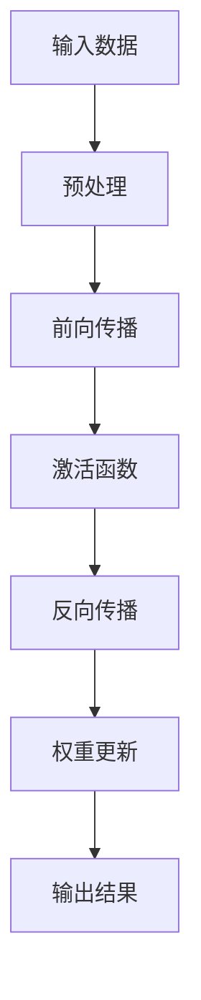

                 


## 《AI辅助的科学发现：加速研究进程与创新》

### 关键词：
- AI辅助科学
- 研究进程加速
- 创新推动
- 算法原理
- 科学应用案例

### 摘要：
随着人工智能技术的迅猛发展，AI在科学研究中的应用日益广泛，成为推动科学研究进程和创新的强大工具。本文将深入探讨AI辅助科学发现的方法和策略，分析AI算法原理及其在科学研究中的实际应用，同时探讨AI工具和平台的选择、使用以及面临的挑战和未来发展方向。通过一步步的分析和推理，我们希望能够为科研工作者提供有价值的指导和建议，共同加速科学发现之旅。

## 引言

### AI与科学研究的背景

人工智能（AI）是一门融合计算机科学、数学、神经科学等多个领域的前沿技术。自20世纪50年代诞生以来，AI经历了多个发展阶段，从早期的符号主义、连接主义到现代的深度学习，其应用范围也在不断扩大。近年来，随着计算能力的提升和大数据的爆发式增长，AI在科学研究中的地位愈发重要。

科学研究是一个复杂的探索过程，涉及数据收集、分析、模型构建、假设验证等多个环节。传统的研究方法往往耗时较长、效率低下，而AI技术的引入，为科学研究带来了前所未有的机遇。AI能够处理海量数据、发现数据中的模式和规律，从而加速研究进程，提高创新能力。例如，AI可以在药物研发、基因组学、气候变化等领域发挥重要作用。

### AI在科学发现中的重要性

AI在科学发现中的重要性体现在以下几个方面：

1. **数据处理能力**：科学研究往往涉及大量数据，AI能够高效地处理这些数据，从中提取有用信息，为研究提供基础。
2. **模式识别**：AI算法具有强大的模式识别能力，可以帮助科研人员发现数据中的潜在规律，从而提出新的假设或验证现有理论。
3. **预测能力**：AI可以通过历史数据预测未来的趋势，为科研人员提供决策支持。
4. **自动化实验**：AI技术可以自动化实验流程，减少人工干预，提高实验的准确性和重复性。

### AI与科学发现的关联

AI与科学发现的关联主要体现在以下几个方面：

1. **数据驱动的科学**：AI技术的发展使得科学越来越依赖于数据，数据的获取、处理和分析成为科学发现的核心环节。
2. **跨学科研究**：AI技术具有跨学科的特点，能够结合生物学、物理学、化学等领域的知识，促进多学科交叉融合，产生新的科学发现。
3. **智能辅助**：AI技术可以辅助科研人员完成繁琐的数据处理、模型构建等工作，使他们能够专注于更有创造性的任务。

## AI算法原理与科学应用

### AI算法原理概述

AI算法的核心是通过模拟人类大脑的思考方式，让计算机具备自主学习和推理能力。常见的AI算法包括机器学习、深度学习、神经网络等。这些算法的基本原理是通过学习大量数据，从中提取模式和规律，并利用这些模式和规律进行预测或决策。

1. **机器学习**：机器学习是AI的核心技术之一，其基本原理是通过训练数据集，让计算机学会如何对未知数据进行分类、预测或回归。常见的机器学习算法包括线性回归、决策树、支持向量机等。

2. **深度学习**：深度学习是机器学习的一个分支，其核心是通过多层神经网络对数据进行自动特征提取。深度学习在图像识别、自然语言处理等领域取得了显著成果。

3. **神经网络**：神经网络是深度学习的基础，其基本原理是通过模拟人脑神经元的工作方式，构建出一个复杂的网络结构，用于对数据进行处理和预测。

### AI算法在科学发现中的应用

AI算法在科学发现中的应用非常广泛，以下是一些典型的应用场景：

1. **基因组学研究**：AI可以用于基因数据的分析，帮助科学家发现与疾病相关的基因变异，加速药物研发进程。

2. **药物研发**：AI可以用于虚拟筛选药物分子，预测药物与生物分子的相互作用，从而加速药物研发。

3. **气候研究**：AI可以用于分析气候数据，预测气候变化趋势，为政策制定提供科学依据。

4. **材料科学**：AI可以用于材料结构的预测和优化，加速新材料的研究和开发。

### 数学模型与公式

AI算法的数学模型和公式是实现其功能的核心。以下是一些常见的数学模型和公式：

1. **线性回归**：$$y = wx + b$$
   - 这是一个简单的线性回归模型，用于预测因变量y与自变量x之间的关系。

2. **决策树**：$$G(y|x) = \sum_{i=1}^{n} t_i(x) y_i$$
   - 决策树通过一系列条件概率分布来对数据集进行分类。

3. **支持向量机**：$$\max \frac{1}{2} \sum_{i=1}^{n} w_i^2$$
   - 支持向量机通过最大化间隔来分类数据。

4. **神经网络**：$$y = \sigma(\sum_{i=1}^{n} w_i x_i + b)$$
   - 神经网络通过多层非线性变换来对数据进行处理。

### AI算法的mermaid流程图

为了更好地理解AI算法的工作原理，我们可以使用mermaid绘制流程图。以下是一个简单的神经网络流程图示例：



通过这个流程图，我们可以清晰地看到神经网络从输入数据到输出结果的全过程。

### AI算法的Python源代码

为了深入理解AI算法的原理，我们可以通过Python源代码来实现一个简单的线性回归模型。以下是一个示例：

```python
import numpy as np

# 线性回归模型
class LinearRegression:
    def __init__(self):
        self.w = None
        self.b = None

    def fit(self, X, y):
        # 梯度下降法求解权重
        n_samples, n_features = X.shape
        self.w = np.zeros(n_features)
        self.b = 0

        # 计算梯度
        for _ in range(1000):
            y_pred = self.predict(X)
            dw = (1 / n_samples) * np.dot(X.T, (y_pred - y))
            db = (1 / n_samples) * np.sum(y_pred - y)

            # 更新权重
            self.w -= dw
            self.b -= db

    def predict(self, X):
        # 预测结果
        return np.dot(X, self.w) + self.b

# 测试线性回归模型
X = np.array([[1], [2], [3], [4], [5]])
y = np.array([[2], [4], [6], [8], [10]])

model = LinearRegression()
model.fit(X, y)
print("权重：", model.w)
print("偏置：", model.b)

X_new = np.array([[6]])
y_new = model.predict(X_new)
print("预测结果：", y_new)
```

通过这个Python源代码示例，我们可以看到如何使用梯度下降法求解线性回归模型的权重和偏置，从而实现预测功能。

## AI工具和平台

### 常见的AI工具和平台

在科学研究领域，常见的AI工具和平台包括TensorFlow、PyTorch、Keras等。这些工具和平台提供了丰富的API和功能，使得研究人员可以轻松地构建和训练AI模型。

1. **TensorFlow**：由Google开发，是一个开源的机器学习框架，支持多种编程语言，包括Python、C++和Java。TensorFlow具有强大的图形计算能力，能够处理大规模的分布式计算任务。

2. **PyTorch**：由Facebook开发，是一个开源的深度学习框架，以其动态计算图和易用性而著称。PyTorch广泛应用于图像识别、自然语言处理等领域。

3. **Keras**：是一个高级神经网络API，构建在TensorFlow和Theano之上。Keras提供了简洁、易于使用的接口，使得研究人员可以快速搭建和训练神经网络模型。

### 如何选择合适的AI工具和平台

选择合适的AI工具和平台需要考虑以下几个方面：

1. **项目需求**：根据项目的具体需求，选择能够满足需求的AI工具和平台。例如，如果项目需要高并

