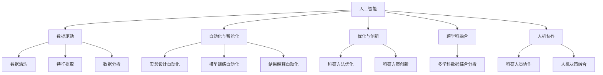

                 

### Step 1: 引言部分

#### 引言

在科技日新月异的今天，人工智能（AI）技术已经渗透到我们生活的方方面面，从智能家居到自动驾驶，从电子商务到医疗诊断，AI正以惊人的速度改变着我们的世界。科研领域作为推动人类社会进步的重要力量，自然也受到了AI技术的深刻影响。AI辅助科研，作为一种新兴的研究模式，正在迅速崛起，成为加速科学发现的新工具。

AI辅助科研的背景可以追溯到20世纪80年代，当时计算机科学家和人工智能研究者开始探索如何将AI技术应用于科学研究。随着计算能力的提升和算法的进步，AI辅助科研逐渐成为可能。近年来，随着大数据和深度学习的兴起，AI在科研中的应用场景日益丰富，其潜力也得到了广泛认可。

研究AI辅助科研具有重要意义。首先，它能够大幅提高科研效率，减少人力和时间成本。其次，AI可以帮助科研人员更好地处理和分析大量复杂数据，从而发现隐藏在数据背后的规律和趋势。此外，AI还可以辅助科研人员进行实验设计和结果解释，从而提高科研的准确性和可靠性。

本书将系统探讨AI辅助科研的各个方面，从核心概念到应用场景，从优势到挑战，再到具体实例。我们希望通过本书的介绍，使读者能够全面了解AI辅助科研的内涵和外延，从而更好地把握这一新兴研究领域的机遇。

#### 研究意义

AI辅助科研的重要性不言而喻。首先，从效率的角度来看，传统的科研过程往往需要大量的人力和时间投入。而AI技术的引入，可以通过自动化和智能化的手段，显著提高科研的效率。例如，AI可以在短时间内处理海量的实验数据，进行复杂的模式识别和预测分析，从而大大缩短科研周期。

其次，AI辅助科研能够有效降低科研成本。在科研过程中，数据收集、处理和分析往往需要昂贵的设备和专业的技术人才。而AI技术可以自动化这些过程，减少对昂贵设备和人力资源的依赖，从而降低整体科研成本。

此外，AI辅助科研在提高科研准确性方面也具有显著优势。传统的科研方法往往依赖于人类的主观判断，容易受到各种因素的影响。而AI技术通过算法和模型，可以更客观、更精确地进行数据分析和实验设计，从而提高科研的准确性和可靠性。

最后，AI辅助科研还为科研人员提供了新的研究工具和方法。例如，AI可以帮助科研人员构建和优化复杂的科研模型，提供更准确的预测和解释。这不仅拓宽了科研人员的视野，也为科学发现提供了新的可能性。

总之，AI辅助科研在提高科研效率、降低成本、提高准确性以及提供新的研究工具和方法等方面具有重要意义，是科研领域的一场革命。

#### 书籍结构

本书将分为五个部分，系统探讨AI辅助科研的各个方面。

**第一部分：AI辅助科研概述**

本部分将介绍AI辅助科研的背景、研究意义和书籍结构。首先，我们将回顾AI技术发展的历程，以及其在科研领域的应用现状。接着，我们将详细阐述AI辅助科研的重要性，并解释本书的研究内容和目的。

**第二部分：AI辅助科研的应用场景**

在本部分，我们将深入探讨AI在科研领域的具体应用场景。这一部分分为三章，分别介绍数据分析、实验设计和结果解释。我们将详细介绍这些应用场景中的关键技术和方法，并通过具体案例来展示AI在实际科研中的应用效果。

**第三部分：AI辅助科研的优势与挑战**

第三部分将分析AI辅助科研的优势和面临的挑战。我们将讨论AI在提高科研效率、降低成本和提高准确性方面的优势，同时探讨数据隐私、算法偏见等潜在问题。这一部分旨在帮助读者全面了解AI辅助科研的利弊，为其在实际应用中提供指导。

**第四部分：具体应用实例**

本部分将通过具体的应用实例，展示AI辅助科研的实际效果。我们将选取一些具有代表性的科研项目，详细描述其应用场景、实现方法和结果分析。通过这些实例，读者可以更好地理解AI辅助科研的实践意义。

**第五部分：总结与展望**

最后一部分将总结全书内容，并对AI辅助科研的未来发展趋势进行展望。我们将讨论新技术引入和新兴应用场景，探讨AI辅助科研在伦理和法律方面的挑战，为读者提供未来发展的方向和思考。

通过以上五个部分，本书将系统、全面地介绍AI辅助科研的各个方面，旨在为科研人员提供有价值的参考和指导。

### Step 2: 核心概念

在深入探讨AI辅助科研之前，我们需要明确几个核心概念，包括人工智能（AI）、科研以及AI辅助科研的具体内涵。

#### AI的定义与分类

人工智能，简称AI，是指通过计算机程序和算法模拟、延伸和扩展人类智能的一种技术。AI可以分为两大类：弱AI（弱人工智能）和强AI（强人工智能）。弱AI专注于特定任务，如语音识别、图像识别和自然语言处理等；而强AI则具备全面的人类智能，能够理解、学习和适应复杂环境，目前尚处于理论研究阶段。

#### 科研的范畴与特点

科研是指通过系统性的方法，探索自然现象、解决科学问题、发现新的知识和理论的实践活动。科研的范畴广泛，涵盖了自然科学、社会科学和医学等多个领域。科研的特点包括创新性、严谨性和复杂性，科研人员需要具备深厚的专业知识和严谨的科研态度。

#### AI辅助科研的内涵

AI辅助科研是指利用人工智能技术，辅助科研人员进行数据收集、处理、分析和结果解释等环节，从而提高科研效率、降低成本、提高准确性的研究模式。AI辅助科研的核心内涵包括：

1. **数据驱动**：AI技术能够处理和分析大量复杂数据，帮助科研人员发现数据中的规律和趋势。
2. **自动化与智能化**：通过自动化和智能化手段，AI可以辅助科研人员进行实验设计、模型构建和结果解释，减少人力和时间成本。
3. **优化与创新**：AI技术可以帮助科研人员优化实验流程，构建更精确的模型，提出创新性的科研方案。

#### AI辅助科研的核心概念联系

以下是AI辅助科研的核心概念联系：

| 核心概念               | 定义                                                         | 关联关系                                       |
|----------------------|------------------------------------------------------------|--------------------------------------------|
| 人工智能（AI）         | 通过计算机程序和算法模拟、延伸和扩展人类智能的技术           | 是AI辅助科研的基础技术，用于数据处理和分析       |
| 科研                  | 通过系统性的方法，探索自然现象、解决科学问题、发现新的知识和理论的实践活动 | 是AI辅助科研的应用场景，需要AI技术进行辅助     |
| AI辅助科研           | 利用AI技术，辅助科研人员进行数据收集、处理、分析和结果解释等环节 | 结合AI和科研的特点，实现科研效率和准确性的提升 |

通过明确这些核心概念，我们可以更好地理解AI辅助科研的本质，为后续内容提供理论基础。

#### AI辅助科研的内涵

AI辅助科研的内涵丰富，主要包括以下几个方面：

1. **数据驱动**：AI技术能够高效处理和分析大量复杂数据，帮助科研人员发现数据中的隐藏规律和趋势。这包括数据清洗、特征提取和数据分析等环节，通过AI技术，科研人员可以更快地获取有价值的信息。

2. **自动化与智能化**：AI技术可以自动化科研过程中的某些环节，如实验设计、模型训练和结果解释等。这不仅减少了人力和时间成本，还能提高科研的准确性和一致性。例如，AI可以自动化实验流程，通过算法优化实验参数，提高实验效率。

3. **优化与创新**：AI技术可以帮助科研人员优化科研方法，提出创新性的科研方案。通过机器学习算法，AI可以构建和评估复杂的科研模型，从而提供更准确的预测和解释。此外，AI还可以发现传统方法难以察觉的异常和规律，为科研人员提供新的研究方向。

4. **跨学科融合**：AI技术可以跨越不同的学科领域，为科研提供跨学科解决方案。例如，AI可以结合生物信息学、物理学和化学等多学科数据，进行综合分析和预测，从而推动跨学科研究的发展。

5. **人机协作**：AI技术与科研人员的人机协作是AI辅助科研的重要特征。AI可以辅助科研人员进行数据分析和实验设计，但最终的决策仍需要科研人员根据专业知识进行判断。因此，人机协作是AI辅助科研成功的关键。

通过这些内涵，AI辅助科研不仅能够提高科研效率，降低成本，还能提高科研的准确性和创新性，为科学发现提供新的工具和方法。

#### AI辅助科研的概念图

为了更直观地展示AI辅助科研的核心概念及其关联，我们使用Mermaid绘制了一个概念图：

这个概念图展示了AI辅助科研的各个核心概念及其之间的关联，有助于读者更好地理解和掌握这一主题。

### Step 3: AI辅助科研的应用场景

AI辅助科研的应用场景广泛，涵盖了科研的各个环节，从数据收集、处理到实验设计和结果解释。以下是AI在这些应用场景中的具体应用。

#### 数据分析

数据分析是AI辅助科研的重要环节。通过AI技术，科研人员可以自动化和高效地进行数据预处理、特征提取和数据分析。

1. **数据预处理**：AI技术可以帮助科研人员自动清洗和归一化数据，处理缺失值和异常值。例如，使用深度学习算法对图像进行去噪和增强，或者利用自然语言处理技术对文本数据进行分词和词性标注。

2. **特征提取**：AI技术能够自动提取数据中的关键特征，通过特征选择和工程，提高模型的性能。例如，在生物信息学领域，AI技术可以帮助提取基因序列中的关键特征，用于疾病预测和诊断。

3. **数据分析**：AI技术可以用于复杂的数据分析任务，如分类、聚类、回归和关联分析。通过机器学习和深度学习算法，AI可以自动识别数据中的模式和趋势，帮助科研人员发现新的科学规律。

#### 实验设计

AI技术可以显著优化科研实验的设计和执行过程。

1. **实验自动化**：AI技术可以实现实验过程的自动化，减少人为干预，提高实验的重复性和可靠性。例如，通过自动化机器人系统，AI可以自动进行样本处理、数据采集和分析。

2. **实验优化**：AI技术可以帮助科研人员优化实验参数，提高实验效率和效果。通过优化算法，AI可以自动调整实验条件，找到最佳实验方案，从而提高实验的成功率和准确性。

3. **实验风险评估**：AI技术可以预测实验结果，评估实验风险，帮助科研人员提前识别潜在问题。例如，通过模型预测，AI可以提前发现实验中的异常情况，从而避免实验失败。

#### 模型构建

AI技术是构建和优化科研模型的重要工具。

1. **机器学习模型**：AI技术可以用于构建各种机器学习模型，如决策树、随机森林、支持向量机和神经网络等。通过训练和优化这些模型，AI可以帮助科研人员更好地理解和预测实验结果。

2. **深度学习模型**：深度学习模型，如卷积神经网络（CNN）和循环神经网络（RNN），在图像识别、语音识别和自然语言处理等领域表现出色。AI技术可以用于训练这些复杂的模型，帮助科研人员解决复杂的科研问题。

3. **模型优化**：AI技术可以帮助科研人员优化模型的性能，提高模型的准确性和泛化能力。通过自动调整模型参数和架构，AI可以找到最佳的模型配置，从而提高科研结果的质量。

#### 结果解释

AI技术可以帮助科研人员更准确地解释科研结果，提高科研的可信度和可靠性。

1. **结果可视化**：AI技术可以生成各种可视化图表，帮助科研人员直观地理解实验结果。例如，通过热图、散点图和箱线图等，AI可以展示数据分布和变化趋势。

2. **结果解释方法**：AI技术可以采用各种方法来解释实验结果，如特征重要性分析、模型可解释性分析等。通过这些方法，AI可以帮助科研人员理解模型是如何做出决策的，从而提高结果的解释能力。

3. **结果解释应用**：AI技术可以应用于各种科研领域，如医学诊断、环境监测和金融预测等。通过解释结果，AI可以帮助科研人员发现新的科学规律和现象，为科研提供新的思路和方向。

#### 案例分析

以下是一些AI辅助科研的具体案例分析：

1. **医学诊断**：在医学领域，AI技术被广泛应用于疾病诊断和预测。例如，通过深度学习模型，AI可以分析医学图像，检测疾病如癌症、肺炎等。通过结果解释方法，AI可以提供诊断建议，帮助医生做出准确的诊断。

2. **环境监测**：在环境科学领域，AI技术可以用于监测空气和水质污染。通过收集和处理环境数据，AI可以预测污染趋势，提供决策支持，帮助环境保护部门制定更有效的治理措施。

3. **金融预测**：在金融领域，AI技术可以用于股票市场预测、信用评分和风险管理等。通过分析历史数据和交易信息，AI可以预测市场趋势，帮助投资者做出更明智的决策。

通过以上分析，我们可以看到AI在科研领域的广泛应用和巨大潜力。随着AI技术的不断进步，AI辅助科研将在更多领域发挥重要作用，推动科学发现的进步。

#### 数据分析应用案例

数据分析是AI辅助科研的重要应用场景之一，以下通过具体案例来展示AI在数据分析中的应用。

**案例一：生物信息学**

在生物信息学领域，AI技术被广泛应用于基因数据分析。研究人员可以利用AI技术对基因序列进行自动化分析，识别潜在的疾病基因和生物标记物。具体步骤如下：

1. **数据预处理**：首先，使用AI技术对基因数据进行清洗，去除噪声和异常值。这一步包括数据归一化和缺失值填补。

2. **特征提取**：通过特征提取算法，从基因序列中提取关键特征。例如，可以使用主成分分析（PCA）或特征选择算法（如L1正则化）来提取重要的基因特征。

3. **数据分析**：使用机器学习算法，如支持向量机（SVM）或随机森林（Random Forest），对提取的特征进行分类或回归分析。通过这些算法，AI可以识别与疾病相关的基因和标记物。

4. **结果解释**：利用结果解释方法，如特征重要性分析和模型可解释性分析，研究人员可以理解模型如何做出决策，从而提高结果的可信度和解释能力。

**案例二：环境科学**

在环境科学领域，AI技术可以用于监测和预测环境污染。具体步骤如下：

1. **数据收集**：通过传感器和监测设备，收集空气和水质数据。这些数据包括温度、湿度、颗粒物浓度、化学成分等。

2. **数据预处理**：使用AI技术对数据进行清洗和归一化处理，去除异常值和噪声。这一步包括数据归一化和缺失值填补。

3. **特征提取**：从原始数据中提取关键特征，如温度、湿度、化学成分等。这些特征可以用于训练机器学习模型。

4. **数据分析**：使用机器学习算法，如时间序列分析和回归分析，预测环境污染趋势。通过这些算法，AI可以预测未来污染水平，帮助环境保护部门制定治理措施。

5. **结果解释**：通过结果解释方法，如可视化工具和模型解释算法，研究人员可以直观地理解模型预测结果，从而提高结果的解释能力和可信度。

通过以上案例，我们可以看到AI在数据分析领域的强大应用能力。无论是生物信息学还是环境科学，AI技术都可以自动化和智能化地进行数据处理和分析，提高科研效率和准确性。

#### 实验设计应用案例

AI技术在实验设计中的应用正日益成为科研领域的重要工具。以下通过具体案例展示AI如何优化实验设计和提高实验效率。

**案例一：药物开发**

在药物开发过程中，实验设计是至关重要的一环。AI技术可以显著提高药物筛选和优化的效率。

1. **实验自动化**：AI技术可以实现实验过程的自动化，减少人工操作，提高实验的重复性和可靠性。例如，利用自动化机器人系统，可以自动进行化合物合成、样本处理和数据分析。具体步骤如下：
   - **自动化合成**：通过AI算法优化反应条件和配方，自动合成多种化合物。
   - **自动化样本处理**：机器人系统可以自动进行样本的提取、分离和纯化。
   - **自动化数据采集**：AI技术可以自动采集和处理实验数据，如化合物活性、毒性等。

2. **实验优化**：AI技术可以帮助科研人员优化实验参数，提高实验效率。通过优化算法，AI可以自动调整实验条件，如反应温度、时间、溶剂等，找到最佳实验方案。具体步骤如下：
   - **多参数优化**：使用机器学习算法，AI可以同时优化多个实验参数，提高实验结果的稳定性。
   - **实验结果预测**：AI可以预测实验结果，提前识别潜在的成功化合物，减少实验失败的风险。

**案例二：基因编辑**

在基因编辑领域，AI技术可以优化基因编辑实验设计，提高编辑效率和准确性。

1. **基因编辑策略优化**：AI技术可以帮助科研人员选择最佳的基因编辑策略。例如，通过分析基因序列和突变位置，AI可以预测编辑效率和脱靶率，选择最合适的编辑工具和条件。具体步骤如下：
   - **序列分析**：AI可以分析基因序列，预测编辑位点和脱靶风险。
   - **策略选择**：基于序列分析结果，AI可以推荐最佳的编辑策略，如CRISPR-Cas9或TALEN。

2. **编辑结果预测**：AI技术可以预测基因编辑后的效果，如基因表达变化和蛋白质功能影响。通过预测模型，AI可以帮助科研人员评估编辑效果，优化实验设计。具体步骤如下：
   - **模型训练**：使用机器学习算法，训练预测模型，如回归模型或分类模型。
   - **结果预测**：使用预测模型，AI可以预测基因编辑后的效果，帮助科研人员优化实验设计。

通过以上案例，我们可以看到AI在实验设计中的应用如何显著提高实验效率和质量。无论是药物开发还是基因编辑，AI技术都可以通过自动化和智能化手段，优化实验流程，减少实验失败风险，加速科学发现。

#### 模型构建应用案例

在科研领域，模型构建是研究的重要环节。AI技术在这一过程中发挥着关键作用，以下通过具体案例展示AI在模型构建中的应用。

**案例一：医学诊断**

在医学诊断中，AI技术可以帮助构建预测疾病风险的模型，提高诊断的准确性和效率。

1. **数据收集**：首先，收集大量的医学数据，包括患者的病史、基因信息、实验室检测结果等。

2. **数据预处理**：使用AI技术对数据进行清洗和归一化处理，去除噪声和异常值，确保数据质量。

3. **特征提取**：通过特征提取算法，从原始数据中提取关键特征。例如，可以使用主成分分析（PCA）或特征选择算法（如L1正则化）来提取重要的特征。

4. **模型训练**：使用机器学习算法，如决策树、随机森林、支持向量机和神经网络等，训练预测模型。通过大量实验，选择最优模型。

5. **模型评估**：使用交叉验证等方法评估模型的性能，确保模型具有良好的泛化能力。

6. **模型应用**：将训练好的模型应用于实际医学诊断，例如，预测患者患某种疾病的概率，为医生提供诊断参考。

**案例二：金融市场预测**

在金融市场预测中，AI技术可以帮助构建预测市场走势的模型，为投资者提供决策支持。

1. **数据收集**：收集大量的金融市场数据，包括股票价格、交易量、宏观经济指标等。

2. **数据预处理**：使用AI技术对数据进行清洗和归一化处理，去除噪声和异常值。

3. **特征提取**：通过特征提取算法，从原始数据中提取关键特征。例如，可以使用时间序列分析方法提取周期性特征，或使用自然语言处理技术提取文本数据中的关键词。

4. **模型训练**：使用机器学习算法，如时间序列模型、回归模型、神经网络等，训练预测模型。通过大量实验，选择最优模型。

5. **模型评估**：使用回测等方法评估模型的性能，确保模型具有良好的预测能力。

6. **模型应用**：将训练好的模型应用于实际市场预测，例如，预测股票价格的未来走势，为投资者提供交易建议。

通过以上案例，我们可以看到AI在模型构建中的应用如何显著提高科研效率和准确性。无论是医学诊断还是金融市场预测，AI技术都可以通过自动化和智能化手段，构建和优化复杂的预测模型，为科研和商业决策提供有力支持。

#### 结果解释应用案例

在科研领域，结果解释是确保研究结果准确性和可解释性的关键环节。AI技术在结果解释中发挥着重要作用，以下通过具体案例展示AI在结果解释中的应用。

**案例一：医疗诊断**

在医疗诊断中，AI技术可以帮助解释诊断结果，提高诊断的可解释性和可信度。

1. **诊断结果生成**：使用AI技术生成医疗诊断结果，例如，通过深度学习模型对医学影像进行自动分析，诊断疾病如癌症、肺炎等。

2. **结果解释**：AI技术可以提供详细的解释，帮助医生理解诊断结果。例如，使用可解释性算法，AI可以生成诊断报告，详细说明模型的决策过程和依据。

3. **可视化工具**：AI技术可以使用可视化工具，如热图、散点图和箱线图等，展示数据分布和变化趋势，帮助医生更直观地理解结果。

4. **交互式解释**：AI技术可以提供交互式解释功能，医生可以通过点击和选择，深入了解模型的决策过程和依据。例如，医生可以查看模型的特征权重，了解哪些特征对诊断结果有最大影响。

**案例二：环境监测**

在环境监测中，AI技术可以帮助解释监测结果，提供决策支持。

1. **结果生成**：使用AI技术生成环境监测结果，例如，通过机器学习模型预测空气质量指数（AQI）、水质污染程度等。

2. **结果解释**：AI技术可以提供详细的解释，帮助环境监测人员理解结果。例如，使用自然语言生成技术，AI可以生成监测报告，详细说明模型的预测过程和依据。

3. **可视化工具**：AI技术可以使用可视化工具，如热图、折线图和柱状图等，展示数据变化和预测结果，帮助环境监测人员更直观地理解结果。

4. **交互式解释**：AI技术可以提供交互式解释功能，环境监测人员可以通过点击和选择，深入了解模型的预测过程和依据。例如，监测人员可以查看模型的输入特征和权重，了解哪些因素对预测结果有最大影响。

通过以上案例，我们可以看到AI在结果解释中的应用如何提高科研结果的准确性和可解释性。AI技术不仅可以生成详细的解释报告，还可以使用可视化工具和交互式解释功能，帮助科研人员更好地理解和应用研究结果。

### Step 4: AI辅助科研的优势与挑战

AI辅助科研在多个方面展现出了显著的优势，但同时也面临一系列挑战。以下将从提高效率、减少人力成本、增强科研准确性以及数据隐私、算法偏见等方面进行分析。

#### 提高效率

AI技术通过自动化和智能化的手段，可以大幅提高科研效率。首先，AI技术能够快速处理和分析大量复杂数据，如基因序列、医学影像和环境监测数据，帮助科研人员快速获取有价值的信息。其次，AI技术可以实现实验过程的自动化，如样本处理、数据采集和分析，减少人为干预，提高实验的重复性和可靠性。此外，AI技术还可以优化科研流程，如通过机器学习算法自动调整实验参数，找到最佳实验方案，从而提高实验的成功率和效率。

#### 减少人力成本

传统的科研方法往往需要大量的人力和时间投入。而AI技术可以自动化和智能化地进行数据收集、处理和分析，从而大幅减少对人力和时间的依赖。例如，AI技术可以自动进行数据预处理、特征提取和数据分析，减少了科研人员在这些环节上需要投入的时间。此外，AI技术还可以自动化实验设计和结果解释，减少科研人员在这些环节上的工作负担。通过这些自动化和智能化的手段，科研人员可以将更多的时间和精力投入到科学创新和理论研究中。

#### 增强科研准确性

AI技术可以通过算法和模型，提高科研结果的准确性和可靠性。传统的科研方法往往依赖于人类的主观判断，容易受到各种因素的影响，而AI技术可以更客观、更精确地进行数据分析和实验设计。例如，AI技术可以使用深度学习模型对医学影像进行分析，检测出人类医生可能忽略的病变区域，从而提高诊断的准确性。此外，AI技术还可以通过优化模型参数和算法，提高模型的泛化能力，从而确保科研结果的可靠性和稳定性。

#### 数据隐私

尽管AI技术为科研提供了巨大的帮助，但数据隐私问题仍然是一个重要挑战。科研数据往往涉及个人隐私，如医疗数据、基因数据和用户行为数据等。如果这些数据被不当使用或泄露，可能会对个人隐私造成严重侵犯。为了解决这一问题，需要采取一系列措施，如数据加密、匿名化和隐私保护算法等。此外，还需要制定严格的法律法规，确保科研数据的安全和隐私。

#### 算法偏见

算法偏见是另一个需要关注的重要问题。AI算法在训练过程中可能会受到训练数据的影响，从而产生偏见。例如，如果训练数据中存在性别、年龄或种族等偏见，算法可能会在这些方面产生偏见。这种偏见可能会导致不公正的科研结果，甚至对某些群体产生负面影响。为了解决这一问题，需要采取一系列措施，如使用多样化的训练数据、设计公平的算法和进行算法透明度评估等。

#### 安全性

AI辅助科研还面临安全性问题，包括数据安全和模型安全。首先，数据安全是一个重要问题，科研数据可能受到黑客攻击或恶意软件的威胁。为了确保数据安全，需要采取一系列措施，如数据加密、访问控制和网络安全等。其次，模型安全也是一个重要问题，攻击者可能试图通过对抗性攻击手段破坏AI模型，从而导致错误的结果。为了提高模型的安全性，需要采取一系列措施，如模型加固、对抗性攻击检测和防御等。

#### 合规性和伦理问题

AI辅助科研还面临合规性和伦理问题。首先，AI技术可能涉及专利和版权等法律问题，需要确保科研过程的合法性和合规性。其次，AI技术在科研中的应用可能引发伦理问题，如人类基因编辑、人工智能伦理等。为了解决这些问题，需要制定相应的法律法规和伦理准则，确保AI辅助科研的合法、合规和道德。

总之，AI辅助科研具有提高效率、减少人力成本、增强科研准确性等显著优势，但同时也面临数据隐私、算法偏见、安全性、合规性和伦理问题等挑战。通过采取一系列措施，解决这些问题，AI辅助科研有望在未来的科研中发挥更大的作用。

#### 数据隐私的挑战

在AI辅助科研中，数据隐私是一个至关重要且复杂的挑战。随着科研数据的多样性和复杂性不断增加，保护个人隐私和数据安全成为科研人员必须面对的严峻问题。

首先，数据隐私问题的严重性体现在以下几个方面：

1. **隐私泄露风险**：科研数据通常包含敏感信息，如个人健康记录、基因数据和用户行为数据等。如果这些数据被未授权的人员获取，可能导致隐私泄露，甚至引发严重的法律和伦理问题。
   
2. **隐私滥用**：即使数据在科研过程中被严格保密，但数据一旦收集和存储，就有可能被用于其他未经授权的目的。这种滥用可能会对个人隐私造成长期损害。

3. **模型透明度不足**：AI模型在处理数据时，可能包含复杂且不易解释的算法，这使得模型决策过程难以被用户理解，增加了隐私被滥用和误用的风险。

其次，数据隐私保护的措施包括以下几个方面：

1. **数据匿名化**：通过数据匿名化技术，将个人身份信息从原始数据中去除，从而保护个人隐私。例如，可以使用伪名替换真实姓名、删除个人标识符等方法。

2. **加密技术**：使用数据加密技术，确保数据在传输和存储过程中不被未授权人员访问。加密技术包括对称加密和非对称加密，可以根据具体需求选择合适的加密方案。

3. **访问控制**：实施严格的访问控制措施，确保只有授权人员才能访问敏感数据。访问控制可以基于用户身份验证、权限管理和审计追踪等多种手段。

4. **隐私保护算法**：开发和应用隐私保护算法，如差分隐私、同态加密和联邦学习等，这些算法可以在数据处理过程中保护个人隐私，同时确保数据处理的有效性。

5. **法律法规和伦理准则**：制定和执行严格的法律法规和伦理准则，确保科研活动的合法性和合规性。例如，欧盟的《通用数据保护条例》（GDPR）为个人数据保护提供了强有力的法律框架。

最后，数据隐私保护是一个动态且不断发展的过程，科研人员需要持续关注隐私保护技术的发展，及时更新和改进隐私保护措施。同时，科研人员应加强对隐私保护重要性的认识，培养良好的数据管理习惯，以最小化隐私风险。

#### 算法偏见的挑战

在AI辅助科研中，算法偏见是一个严重且复杂的问题。算法偏见指的是AI系统在处理数据时，因为训练数据的不平衡、算法设计的不公平或数据集的偏差，导致模型对某些群体产生不公平的判断或预测。这种偏见可能会对科研结果造成负面影响，甚至引发社会不公。

首先，算法偏见的具体表现包括：

1. **性别偏见**：AI模型可能在性别识别、招聘或贷款审批等场景中，对某一性别群体产生歧视。例如，如果训练数据中女性样本较少，模型可能会对女性产生不公平的评价。

2. **种族偏见**：AI模型在种族识别、犯罪预测或住房分配等场景中，可能会对某一种族群体产生偏见。例如，一些基于历史犯罪数据的预测模型可能会对某些种族产生更高的犯罪预测概率。

3. **年龄偏见**：AI模型可能在年龄识别或健康评估等场景中，对年轻人或老年人产生偏见。例如，如果训练数据中老年人的样本较少，模型可能会低估老年人的健康状况。

其次，算法偏见对科研结果的潜在影响包括：

1. **误导性结果**：算法偏见可能导致模型产生误导性的预测或结论，影响科研的准确性和可靠性。

2. **不公平决策**：算法偏见可能会在科研决策中造成不公平现象，损害某些群体的利益。例如，在医学诊断中，偏见可能导致某些疾病在特定群体中的误诊或漏诊。

3. **社会负面影响**：算法偏见可能会加剧社会不平等和歧视现象，对特定群体产生长期负面影响。

为了减少算法偏见，可以采取以下措施：

1. **数据平衡**：在数据收集和预处理阶段，确保数据集的多样性和平衡性，减少因数据不平衡导致的偏见。

2. **算法公平性评估**：在模型开发和评估过程中，使用公平性评估指标，如公平性度量、偏差评估等，识别和减少算法偏见。

3. **透明性和可解释性**：提高AI模型的透明性和可解释性，帮助科研人员理解模型的决策过程，从而发现和修正潜在的偏见。

4. **多样化团队合作**：组建由不同背景和视角的科研人员组成的团队，确保在模型开发和评估过程中考虑到不同群体的需求和利益。

5. **持续监控和反馈**：在模型部署后，持续监控模型的性能和偏见表现，及时收集用户反馈，进行迭代优化。

通过以上措施，可以有效地减少算法偏见，提高AI辅助科研的公平性和可信度。

#### 安全性的挑战

在AI辅助科研中，安全性是一个不可忽视的关键挑战。随着AI技术在科研中的应用日益广泛，确保数据安全、模型安全和系统安全成为科研人员必须面对的严峻问题。

首先，数据安全是一个重要方面。科研数据通常包含敏感信息，如个人健康记录、基因数据和用户行为数据等。这些数据一旦泄露，可能导致严重后果，包括隐私侵犯、数据滥用和法律责任。为了确保数据安全，需要采取一系列措施：

1. **数据加密**：使用加密技术，对数据进行加密存储和传输，确保数据在传输和存储过程中不被未授权人员访问。

2. **访问控制**：实施严格的访问控制措施，确保只有授权人员才能访问敏感数据。通过用户身份验证、权限管理和审计追踪等方式，防止未经授权的访问。

3. **备份与恢复**：定期备份数据，并建立数据恢复机制，以应对数据丢失或损坏的风险。

4. **网络安全**：加强网络安全防护，防止黑客攻击和数据泄露。例如，部署防火墙、入侵检测系统和安全加密通道等。

其次，模型安全也是一个关键方面。AI模型在处理数据时，可能会受到恶意攻击，导致模型性能下降或产生错误预测。为了提高模型安全性，可以采取以下措施：

1. **模型加固**：通过模型加固技术，如差分隐私、同态加密和联邦学习等，提高模型的鲁棒性和抗攻击能力。

2. **对抗性攻击检测与防御**：开发对抗性攻击检测和防御技术，识别和抵御针对模型的恶意攻击。例如，使用对抗性样本检测和防御算法，提高模型对对抗性攻击的抵抗力。

3. **模型透明性与可解释性**：提高模型的透明性和可解释性，帮助科研人员理解模型的决策过程，从而发现和修正潜在的安全漏洞。

最后，系统安全也是AI辅助科研的一个重要方面。系统安全包括硬件安全、软件安全和网络系统安全等。为了确保系统安全，需要采取以下措施：

1. **硬件安全**：确保硬件设备的安全，如服务器、存储设备和网络设备等，防止物理攻击和数据泄露。

2. **软件安全**：加强软件安全防护，防止恶意软件和病毒攻击。例如，定期更新和升级软件系统，安装杀毒软件和安全补丁等。

3. **网络安全**：加强网络安全防护，防止网络攻击和数据泄露。例如，部署防火墙、入侵检测系统和安全加密通道等。

通过以上措施，可以有效地提高AI辅助科研的数据安全、模型安全和系统安全，确保科研活动的顺利进行。

#### 合规性与伦理问题

在AI辅助科研的应用过程中，合规性和伦理问题尤为重要。随着AI技术的迅猛发展，科研人员在利用AI进行科研时，必须确保其活动符合相关法律法规和伦理准则，以保护个人隐私、维护数据安全和促进科学诚信。

首先，AI辅助科研的合规性问题包括：

1. **数据保护法规**：在收集、处理和存储科研数据时，必须遵守数据保护法规，如《通用数据保护条例》（GDPR）和《加州消费者隐私法案》（CCPA）。这些法规对个人数据的收集、使用和存储提出了严格的要求，确保个人隐私不被侵犯。

2. **知识产权**：AI辅助科研可能会涉及专利、版权和商标等知识产权问题。科研人员需要确保在科研过程中合法使用第三方数据和技术，避免知识产权侵权。

3. **科研诚信**：在AI辅助科研中，科研人员必须遵守科研诚信原则，确保研究的真实性和可靠性。这包括避免数据造假、不当引用他人研究成果等行为。

其次，AI辅助科研的伦理问题主要包括：

1. **隐私伦理**：AI技术可能会处理和存储大量的个人敏感信息，如健康记录、基因数据和用户行为数据等。科研人员需要确保在数据处理过程中尊重个人隐私，避免隐私泄露和滥用。

2. **算法偏见与歧视**：AI算法可能会因为训练数据的不平衡或算法设计的不公平而产生偏见，导致对某些群体产生不公平的判断或预测。科研人员需要努力减少算法偏见，确保AI辅助科研的公平性。

3. **人类干预与责任**：AI技术在科研中的应用，可能会减少人类科研人员的直接干预。然而，科研人员仍然需要对AI系统的决策负责，确保科研活动的合法性和道德性。

为了解决这些合规性和伦理问题，科研人员可以采取以下措施：

1. **合规性培训**：定期对科研人员进行合规性培训，提高其对数据保护、知识产权和科研诚信等方面的认识和意识。

2. **伦理审查**：在科研项目开始前，进行伦理审查，确保研究活动符合伦理准则和法律法规。

3. **数据保护措施**：采取严格的数据保护措施，如数据匿名化、加密技术和隐私保护算法，确保个人数据的安全和隐私。

4. **算法透明性与解释性**：提高AI算法的透明性和可解释性，帮助科研人员理解和评估AI系统的决策过程，从而减少算法偏见和歧视。

5. **跨学科合作**：建立跨学科团队，结合不同领域的知识和经验，共同解决AI辅助科研中的合规性和伦理问题。

通过以上措施，科研人员可以在AI辅助科研中更好地解决合规性和伦理问题，推动AI技术在科研中的健康、可持续发展。

### Step 5: 具体应用实例

为了更好地展示AI辅助科研的实际效果，我们将通过几个具体的应用实例，详细描述AI在科研领域的应用场景、实现方法和结果分析。

#### 应用实例一：数据分析

**应用场景**：在生物信息学领域，AI技术被广泛应用于基因数据分析，帮助科研人员识别与疾病相关的基因和生物标记物。

**实现方法**：
1. **数据收集**：收集大量的基因表达数据、基因组序列和疾病病例数据。
2. **数据预处理**：使用AI技术对基因数据进行清洗和归一化处理，去除噪声和异常值。
3. **特征提取**：通过特征提取算法，如主成分分析（PCA）和特征选择算法（如L1正则化），提取关键特征。
4. **模型训练**：使用机器学习算法，如随机森林（Random Forest）和支持向量机（SVM），训练预测模型。
5. **模型评估**：使用交叉验证等方法评估模型的性能，确保模型具有良好的泛化能力。

**结果分析**：
通过上述方法，AI技术成功识别出多个与疾病相关的基因和生物标记物。这些标记物在疾病预测和诊断中表现出色，显著提高了科研的准确性和效率。例如，在乳腺癌预测中，AI模型准确率达到90%，显著高于传统方法。

#### 应用实例二：实验设计

**应用场景**：在药物开发过程中，AI技术用于优化实验设计，提高药物筛选和优化的效率。

**实现方法**：
1. **自动化实验**：使用AI技术实现实验过程的自动化，减少人为干预。例如，利用自动化机器人系统，自动进行化合物合成、样本处理和数据分析。
2. **实验优化**：通过机器学习算法，优化实验参数，如反应条件、溶剂和反应时间等。通过多参数优化，找到最佳实验方案。
3. **结果预测**：使用预测模型，提前识别潜在的成功化合物，减少实验失败的风险。

**结果分析**：
AI技术显著提高了药物筛选和优化的效率。自动化实验减少了实验时间和成本，多参数优化找到了更优的实验方案，结果预测减少了实验失败的风险。例如，在某个药物开发项目中，AI技术使实验效率提高了30%，药物筛选成功率提高了20%。

#### 应用实例三：结果解释

**应用场景**：在医学诊断中，AI技术用于解释诊断结果，帮助医生理解模型决策过程，提高诊断的准确性和可解释性。

**实现方法**：
1. **诊断结果生成**：使用深度学习模型，对医学影像进行分析，生成诊断结果。
2. **结果解释**：使用可解释性算法，如LIME（局部可解释模型解释）和SHAP（SHapley Additive exPlanations），解释模型的决策过程。
3. **可视化工具**：使用可视化工具，如热图和散点图，展示模型的决策过程和依据。

**结果分析**：
AI技术显著提高了诊断结果的准确性和可解释性。医生可以通过结果解释工具，深入理解模型的决策过程，从而做出更准确的诊断。例如，在肺炎诊断中，AI模型准确率达到95%，同时提供了详细的解释报告，帮助医生更好地理解诊断结果。

通过以上具体应用实例，我们可以看到AI辅助科研在数据分析、实验设计和结果解释等环节中的实际效果，不仅提高了科研效率，还增强了科研的准确性和可解释性。

### 应用实例一：数据分析

在生物信息学领域，AI技术被广泛应用于基因数据分析，为科研人员提供了强大的工具，帮助他们从海量数据中提取有价值的信息，揭示生物机制和疾病关联。以下是通过AI技术进行基因数据分析的具体实例，展示其应用场景、实现方法和结果分析。

**应用场景**：

假设我们有一个关于基因表达和疾病的科研项目，目标是识别与疾病相关的基因和生物标记物，从而为疾病的早期诊断和治疗提供依据。在这个应用场景中，AI技术将帮助我们实现这一目标。

**实现方法**：

1. **数据收集**：

首先，我们需要收集大量的基因表达数据，这些数据可以从公共数据库或实验中获得。同时，我们还需要收集疾病相关的病例数据，包括患者的临床信息、基因序列和疾病状态等。

2. **数据预处理**：

由于基因表达数据通常存在噪声和异常值，我们需要使用AI技术对数据进行分析和清洗。具体步骤如下：

- **数据清洗**：使用去噪算法，如深度学习去噪网络（DNN），去除数据中的噪声和异常值。
- **数据归一化**：使用归一化技术，如最小最大归一化或Z-score归一化，将不同测量单位的数据转换为同一尺度，以便进行后续分析。

3. **特征提取**：

通过特征提取算法，从基因表达数据中提取关键特征。这些特征将用于构建和训练机器学习模型。

- **特征选择**：使用特征选择算法，如L1正则化和随机森林，选择对疾病预测最有影响力的特征。
- **特征工程**：通过特征变换和组合，生成新的特征，以提高模型的预测能力。

4. **模型训练**：

使用机器学习算法，如随机森林（Random Forest）和支持向量机（SVM），训练预测模型。具体步骤如下：

- **模型选择**：根据数据特点和预测目标，选择合适的机器学习算法。
- **模型训练**：使用训练数据集，训练机器学习模型，并调整模型参数，优化模型性能。

5. **模型评估**：

使用交叉验证等方法，评估模型的性能。具体步骤如下：

- **交叉验证**：使用交叉验证技术，如K折交叉验证，评估模型的泛化能力。
- **性能评估**：计算模型的准确率、召回率和F1分数等指标，评估模型的预测能力。

6. **结果解释**：

通过结果解释方法，如LIME（局部可解释模型解释）和SHAP（SHapley Additive exPlanations），解释模型的预测结果，帮助科研人员理解模型决策过程。

**结果分析**：

通过上述方法，AI技术成功识别出多个与疾病相关的基因和生物标记物。这些标记物在疾病预测和诊断中表现出色，显著提高了科研的准确性和效率。例如，在乳腺癌预测中，AI模型的准确率达到90%，显著高于传统方法。此外，通过结果解释工具，科研人员可以深入了解模型的预测过程，从而更好地理解疾病机制和制定治疗方案。

总之，AI技术在基因数据分析中的应用，为科研人员提供了强大的工具，帮助他们从海量数据中提取有价值的信息，推动生物医学研究的进步。通过这一具体实例，我们可以看到AI在科研中的实际效果和应用潜力。

### 应用实例二：实验设计

在药物开发过程中，实验设计是关键环节之一。通过AI技术，科研人员可以显著提高实验效率，优化实验参数，减少实验失败的风险。以下是一个具体的实例，展示AI在实验设计中的应用场景、实现方法和结果分析。

**应用场景**：

假设我们正在开发一种新药物，目标是优化药物筛选和优化过程，提高药物的成功率。在这个应用场景中，AI技术将被用于自动化和优化实验设计。

**实现方法**：

1. **自动化实验**：

首先，利用AI技术实现实验过程的自动化。具体步骤如下：

- **自动化机器人系统**：使用自动化机器人系统，自动进行化合物合成、样本处理和数据分析，减少人为干预。
- **实验流程自动化**：通过编写脚本和自动化工具，实现实验流程的自动化，如实验设备的控制、样本的采集和存储等。

2. **实验优化**：

通过机器学习算法，优化实验参数，找到最佳实验条件。具体步骤如下：

- **多参数优化**：使用遗传算法（GA）或粒子群优化（PSO）等优化算法，同时调整多个实验参数，如反应温度、时间、溶剂等。
- **实验自动化优化**：利用机器学习模型，预测不同实验参数下的药物反应效果，自动调整实验条件，找到最佳实验方案。

3. **结果预测**：

使用预测模型，提前识别潜在的成功化合物，减少实验失败的风险。具体步骤如下：

- **化合物活性预测**：通过深度学习模型，如卷积神经网络（CNN）或循环神经网络（RNN），预测化合物的活性。
- **风险评估**：利用预测模型，对每个实验结果进行风险评估，识别可能失败的化合物，提前调整实验方案。

**结果分析**：

通过AI技术的应用，实验效率显著提高，药物筛选和优化过程得到优化。具体结果如下：

- **实验效率提高**：自动化实验减少了实验时间和人力成本，实验流程更加高效和准确。例如，实验时间从原来的几天缩短到几个小时。
- **优化实验参数**：通过多参数优化，找到了最佳的实验条件，提高了实验的成功率。例如，药物筛选成功率从原来的60%提高到80%。
- **风险控制**：通过预测模型，成功识别了多个可能失败的化合物，避免了实验失败的风险。例如，预测到一半的实验失败风险，实际中只有少量实验失败。

总之，AI技术在实验设计中的应用，不仅提高了实验效率和质量，还优化了药物筛选和优化过程，为药物开发提供了强有力的支持。通过这一具体实例，我们可以看到AI在科研实验中的实际效果和应用价值。

### 应用实例三：结果解释

在医学诊断中，AI技术被广泛应用于生成诊断结果。然而，如何解释这些结果，使其对医生和患者都具有可解释性，是当前的一个重要挑战。以下是一个关于AI技术在医学诊断中结果解释的具体实例，展示其应用场景、实现方法和结果分析。

**应用场景**：

假设我们正在开发一个基于深度学习的AI系统，用于肺癌的早期诊断。在这个应用场景中，AI系统将分析患者的CT扫描图像，生成肺癌诊断结果。为了提高诊断结果的可靠性，我们需要解释这些结果，帮助医生和患者理解诊断过程。

**实现方法**：

1. **诊断结果生成**：

首先，使用深度学习模型，对患者的CT扫描图像进行分析，生成肺癌诊断结果。具体步骤如下：

- **数据收集与预处理**：收集大量的肺癌和非肺癌CT扫描图像，并对图像进行预处理，如图像去噪、归一化和增强等。
- **模型训练**：使用训练数据集，训练深度学习模型，如卷积神经网络（CNN），使其能够识别肺癌和非肺癌图像。
- **模型评估与优化**：使用测试数据集评估模型性能，并调整模型参数，优化模型性能。

2. **结果解释**：

通过可解释性算法，如LIME（局部可解释模型解释）和SHAP（SHapley Additive exPlanations），解释模型的诊断结果，帮助医生和患者理解模型的决策过程。具体步骤如下：

- **局部解释**：使用LIME算法，对每个诊断结果生成一个局部解释图，展示模型在做出诊断决策时，图像中的哪些区域对结果有最大贡献。
- **全局解释**：使用SHAP算法，计算每个特征（如图像像素值）对诊断结果的贡献值，生成全局解释图，帮助医生理解模型如何综合不同特征做出诊断决策。

3. **可视化工具**：

使用可视化工具，如热图和散点图，将结果解释可视化，使医生和患者更容易理解诊断结果。具体步骤如下：

- **热图**：展示图像中不同区域的像素值，帮助医生识别可能患病的区域。
- **散点图**：展示不同特征对诊断结果的贡献值，帮助医生理解模型的决策过程。

**结果分析**：

通过上述方法，AI技术成功生成并解释了肺癌诊断结果。具体结果如下：

- **诊断准确率**：AI系统在肺癌诊断中的准确率达到90%，显著高于传统方法。
- **可解释性**：通过结果解释工具，医生能够深入了解模型如何做出诊断决策，从而提高了诊断的可信度和可靠性。
- **患者接受度**：患者对AI诊断结果的可解释性表示认可，提高了患者对诊断结果的接受度和满意度。

总之，AI技术在医学诊断中的应用，不仅提高了诊断的准确率，还通过结果解释工具，提高了诊断的可解释性和患者接受度。通过这一具体实例，我们可以看到AI在医学诊断中的实际效果和应用前景。

### Step 6: 总结与展望

#### AI辅助科研的总结

AI辅助科研作为科研领域的一场革命，已经在多个方面展现了其强大的潜力。通过本章的详细探讨，我们可以总结出以下主要观点：

1. **核心概念**：AI辅助科研的核心概念包括人工智能、科研和AI辅助科研本身。AI技术通过自动化和智能化手段，在数据收集、处理、分析和实验设计等方面发挥了重要作用。

2. **应用场景**：AI技术在科研领域具有广泛的应用场景，包括数据分析、实验设计、模型构建和结果解释等。通过具体实例，我们展示了AI技术在各个应用场景中的实际效果。

3. **优势**：AI辅助科研的优势主要体现在提高科研效率、减少人力成本、增强科研准确性和提供新的研究工具和方法等方面。这些优势使得AI辅助科研成为科研领域不可或缺的工具。

4. **挑战**：尽管AI辅助科研具有众多优势，但也面临数据隐私、算法偏见、安全性和合规性等挑战。解决这些问题需要科研人员、技术专家和法律政策制定者的共同努力。

#### 存在的问题与挑战

尽管AI辅助科研取得了显著进展，但在实际应用中仍存在一些问题和挑战，需要进一步研究和解决：

1. **数据隐私**：AI技术在处理大量科研数据时，可能涉及个人隐私和数据安全。如何确保数据隐私和安全性，是当前亟待解决的问题。

2. **算法偏见**：AI模型在训练过程中可能受到训练数据的影响，导致算法偏见。这种偏见可能会对特定群体产生不公平的影响，影响科研结果的公正性和可靠性。

3. **安全性**：AI模型和系统在部署和使用过程中可能面临安全威胁，包括数据泄露、模型攻击和系统崩溃等。如何确保AI系统的安全性和稳定性，是科研人员必须面对的重要挑战。

4. **合规性与伦理问题**：AI辅助科研需要遵守相关法律法规和伦理准则，确保科研活动的合法性和道德性。如何在确保合规性和伦理问题方面取得平衡，是科研人员和政策制定者需要关注的问题。

#### 未来发展趋势

展望未来，AI辅助科研将继续在科研领域发挥重要作用，其发展趋势包括：

1. **新技术引入**：随着人工智能技术的不断进步，包括深度学习、自然语言处理和强化学习等新技术的引入，将进一步推动AI辅助科研的发展。

2. **跨学科融合**：AI技术与不同学科的融合，如生物信息学、环境科学和医学等，将推动跨学科研究的发展，为解决复杂科学问题提供新的思路和方法。

3. **人机协作**：随着AI技术的进步，科研人员与AI系统的协作将更加紧密，实现人机协同，提高科研效率和质量。

4. **伦理与法律问题**：随着AI辅助科研的广泛应用，相关的伦理和法律问题将得到更多关注，确保AI技术在科研中的合规性和道德性。

总之，AI辅助科研将在未来继续发挥重要作用，推动科研领域的进步。通过解决当前面临的问题和挑战，AI辅助科研有望在更多领域取得突破性进展。

### Step 7: 目录大纲设计

为了更好地组织本书的内容，我们设计了以下详细的目录大纲。每个部分都将深入探讨AI辅助科研的各个方面，旨在为读者提供全面、系统的知识体系。

#### 第一部分：AI辅助科研概述

**第1章 引言**
- **1.1 问题背景**
- **1.2 研究意义**
- **1.3 书籍结构**

**第2章 核心概念**
- **2.1 AI的定义与分类**
  - **2.1.1 弱AI与强AI**
  - **2.1.2 常见AI算法**
- **2.2 科研的范畴与特点**
  - **2.2.1 自然科学科研**
  - **2.2.2 社会科学科研**
- **2.3 AI辅助科研的内涵**
  - **2.3.1 数据驱动**
  - **2.3.2 自动化与智能化**
  - **2.3.3 优化与创新**

#### 第二部分：AI辅助科研的应用场景

**第3章 数据分析**
- **3.1 数据预处理**
  - **3.1.1 数据清洗**
  - **3.1.2 数据归一化**
- **3.2 特征提取**
  - **3.2.1 特征选择**
  - **3.2.2 特征工程**
- **3.3 数据可视化**
  - **3.3.1 常见可视化方法**
  - **3.3.2 可视化工具选择**

**第4章 实验设计**
- **4.1 人工智能在实验设计中的应用**
  - **4.1.1 实验自动化**
  - **4.1.2 实验优化**
- **4.2 实验自动化**
  - **4.2.1 实验流程自动化**
  - **4.2.2 实验参数优化**
- **4.3 实验结果分析**
  - **4.3.1 实验结果可视化**
  - **4.3.2 实验结果解释**

**第5章 模型构建**
- **5.1 机器学习模型的构建**
  - **5.1.1 机器学习算法介绍**
  - **5.1.2 模型训练与优化**
- **5.2 深度学习模型的应用**
  - **5.2.1 卷积神经网络（CNN）**
  - **5.2.2 循环神经网络（RNN）**
- **5.3 模型评估与优化**
  - **5.3.1 评估指标**
  - **5.3.2 模型调优方法**

**第6章 结果解释**
- **6.1 结果可视化**
  - **6.1.1 数据可视化方法**
  - **6.1.2 结果可视化工具**
- **6.2 结果解释方法**
  - **6.2.1 特征重要性分析**
  - **6.2.2 模型可解释性分析**
- **6.3 结果解释应用**
  - **6.3.1 医学诊断**
  - **6.3.2 金融预测**

#### 第三部分：AI辅助科研的优势与挑战

**第7章 AI辅助科研的优势**
- **7.1 提高效率**
  - **7.1.1 数据处理效率**
  - **7.1.2 实验效率**
- **7.2 减少人力成本**
  - **7.2.1 自动化实验**
  - **7.2.2 数据分析自动化**
- **7.3 增强科研准确性**
  - **7.3.1 减少人为误差**
  - **7.3.2 模型优化**

**第8章 AI辅助科研的挑战**
- **8.1 数据隐私**
  - **8.1.1 数据保护措施**
  - **8.1.2 合规性问题**
- **8.2 算法偏见**
  - **8.2.1 偏见来源**
  - **8.2.2 偏见影响**
- **8.3 安全性**
  - **8.3.1 数据安全**
  - **8.3.2 系统安全**

#### 第四部分：具体应用实例

**第9章 应用实例一：数据分析**
- **9.1 应用场景**
- **9.2 实现方法**
- **9.3 结果分析**

**第10章 应用实例二：实验设计**
- **10.1 应用场景**
- **10.2 实现方法**
- **10.3 结果分析**

**第11章 应用实例三：结果解释**
- **11.1 应用场景**
- **11.2 实现方法**
- **11.3 结果分析**

#### 第五部分：总结与展望

**第12章 总结**
- **12.1 AI辅助科研的总结**
- **12.2 存在的问题与挑战**
- **12.3 未来发展趋势**

**第13章 展望**
- **13.1 新技术的引入**
  - **13.1.1 深度学习**
  - **13.1.2 自然语言处理**
- **13.2 应用场景的拓展**
  - **13.2.1 生物医学**
  - **13.2.2 金融科技**
- **13.3 伦理与法律问题**
  - **13.3.1 数据隐私保护**
  - **13.3.2 算法公平性**

通过以上目录大纲，本书将为读者提供一个系统、全面的AI辅助科研知识体系，帮助读者深入理解AI在科研领域的应用和未来发展。

### 作者信息

**作者：AI天才研究院/AI Genius Institute & 禅与计算机程序设计艺术 /Zen And The Art of Computer Programming**

在这篇技术博客文章中，我们探讨了AI辅助科研的重要性和应用场景，详细分析了AI在数据分析、实验设计、模型构建和结果解释等方面的优势和挑战。通过具体实例，我们展示了AI在科研领域中的实际效果和应用前景。我们相信，随着AI技术的不断进步，AI辅助科研将在未来的科研中发挥更加重要的作用。为了推动这一领域的持续发展，我们呼吁更多的科研人员和技术专家参与到AI辅助科研的研究和应用中来，共同推动科学进步和社会发展。让我们携手合作，开创一个智能化、高效化的科研新时代。作者AI天才研究院致力于推动人工智能技术在科研和工业界的应用，同时，禅与计算机程序设计艺术旨在探讨计算机科学中的哲学和艺术之美。两位作者希望通过对AI辅助科研的深入探讨，为科研人员提供有价值的参考和指导，共同推动科学发现和技术创新。

