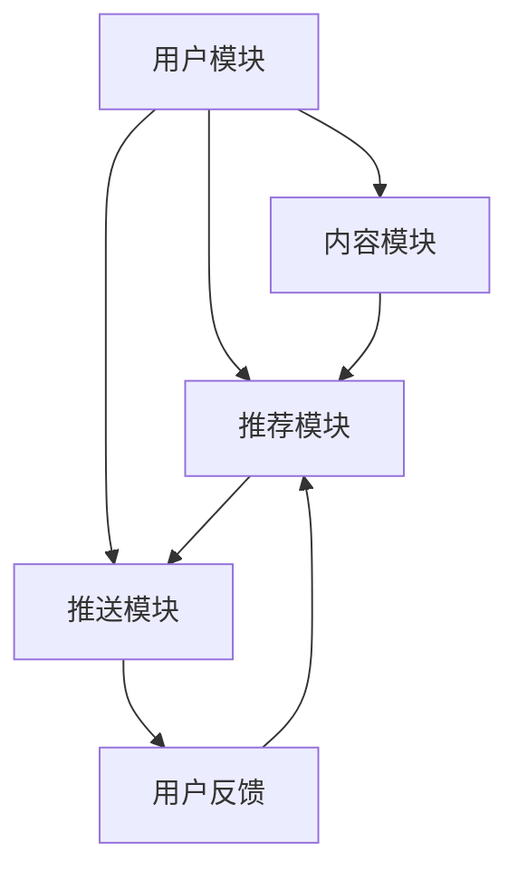

                 

# AI驱动的个性化新闻推送：信息获取的革新

## 关键词

- 人工智能
- 个性化推荐
- 新闻推送
- 机器学习
- 深度学习

## 摘要

随着互联网的快速发展，信息过载成为人们日常生活中的一个普遍问题。如何高效地获取自己感兴趣的信息，成为了用户面临的一大挑战。本文将探讨AI驱动的个性化新闻推送技术，分析其在信息获取领域的革新。通过详细介绍AI技术基础、个性化新闻推送系统架构设计、实战案例分析以及未来发展展望，本文旨在为读者提供一个全面而深入的了解。

## 目录大纲

### 第一部分：背景与概念介绍

### 第1章：问题背景与需求分析

- 1.1 信息获取的挑战
- 1.2 个性化新闻推送的需求
- 1.3 AI驱动的个性化新闻推送
- 1.4 本书结构概述

### 第二部分：AI驱动的个性化新闻推送技术基础

### 第2章：AI技术基础

- 2.1 机器学习基础
- 2.2 深度学习基础
- 2.3 个性化推荐算法
- 2.4 AI驱动的新闻采集与处理

### 第3章：个性化新闻推送系统架构设计

- 3.1 系统架构设计原则
- 3.2 系统模块划分
- 3.3 系统交互流程

### 第三部分：实战案例分析

### 第4章：案例一——某新闻平台AI驱动的个性化新闻推送实践

- 4.1 案例背景
- 4.2 系统设计与实现
- 4.3 案例效果评估
- 4.4 案例总结与启示

### 第5章：案例二——某AI新闻推送创业公司的成长之路

- 5.1 创业公司简介
- 5.2 产品设计与开发
- 5.3 市场推广与运营
- 5.4 公司发展总结

### 第四部分：未来展望与挑战

### 第6章：AI驱动的个性化新闻推送发展趋势

- 6.1 人工智能的发展趋势
- 6.2 个性化新闻推送的发展趋势
- 6.3 挑战与机遇

### 第7章：未来展望与建议

- 7.1 技术发展展望
- 7.2 行业发展建议
- 7.3 结语

### 第一部分：背景与概念介绍

### 第1章：问题背景与需求分析

#### 1.1 信息获取的挑战

在信息爆炸的时代，用户面对海量信息往往感到无所适从。如何从海量的信息中快速、准确地获取自己感兴趣的内容，成为了现代信息获取的一个重要问题。传统的信息获取方式主要依赖于搜索引擎，用户需要主动搜索才能获取信息。然而，这种方式存在几个显著的缺点：

1. **信息过载**：搜索引擎往往返回大量无关的信息，用户需要花费大量时间筛选。
2. **缺乏个性化**：搜索引擎无法根据用户的兴趣和偏好推荐内容，导致用户错过可能感兴趣的信息。
3. **实时性差**：用户无法及时获取最新、最热门的信息。

为了解决这些问题，个性化新闻推送系统应运而生。个性化新闻推送通过收集用户的行为数据，利用机器学习算法分析用户兴趣，从而为用户推荐个性化的新闻内容。

#### 1.2 个性化新闻推送的需求

个性化新闻推送的需求主要来自于以下几个方面：

1. **提高信息获取效率**：通过智能推荐，用户可以快速获取感兴趣的内容，节省时间。
2. **满足用户个性化需求**：系统可以根据用户的兴趣和偏好推荐内容，提高用户满意度。
3. **提升用户体验**：个性化的内容推荐可以提升用户的黏性和活跃度，增强用户忠诚度。
4. **广告和商业化需求**：个性化推送可以帮助平台更好地定位用户，提高广告投放的精准度，从而实现商业化目标。

#### 1.3 AI驱动的个性化新闻推送

AI驱动的个性化新闻推送利用人工智能技术，特别是机器学习和深度学习，实现了信息推送的智能化和个性化。其核心思想是通过以下步骤实现：

1. **数据采集**：收集用户的行为数据，如浏览记录、点赞、评论等。
2. **用户画像构建**：利用机器学习算法分析用户行为数据，构建用户的兴趣模型。
3. **内容推荐**：根据用户的兴趣模型和新闻内容特征，利用推荐算法生成个性化推荐列表。
4. **反馈与优化**：通过用户对推荐内容的反馈，不断优化推荐系统，提高推荐质量。

#### 1.4 本书结构概述

本书将分为四个部分，分别介绍AI驱动的个性化新闻推送的背景与概念、技术基础、实战案例以及未来展望。

- **第一部分**：背景与概念介绍，分析信息获取的挑战和个性化新闻推送的需求，介绍AI驱动的个性化新闻推送的概念。
- **第二部分**：AI驱动的个性化新闻推送技术基础，介绍机器学习、深度学习和个性化推荐算法的基础知识。
- **第三部分**：实战案例分析，通过具体案例展示个性化新闻推送系统的实现和效果评估。
- **第四部分**：未来展望与挑战，探讨人工智能的发展趋势、个性化新闻推送的发展方向以及面临的挑战。

通过本书的学习，读者将能够全面了解AI驱动的个性化新闻推送技术，掌握其核心原理和实践方法，为未来的信息推送系统开发提供有力的支持。

### 第二部分：AI驱动的个性化新闻推送技术基础

#### 第2章：AI技术基础

在深入探讨AI驱动的个性化新闻推送技术之前，我们需要了解一些基础的技术概念，包括机器学习、深度学习和个性化推荐算法。这些技术构成了个性化新闻推送系统的核心，是解决信息获取问题的关键。

#### 2.1 机器学习基础

**机器学习（Machine Learning）** 是一种让计算机从数据中学习规律和模式的方法。它通过训练模型，使计算机能够对未知数据进行预测和分类。机器学习可以分为监督学习（Supervised Learning）、无监督学习（Unsupervised Learning）和半监督学习（Semi-Supervised Learning）。

- **监督学习**：在监督学习中，模型通过已标记的训练数据学习规律，然后对新的数据进行预测。常见的算法有线性回归、决策树、支持向量机等。
  
  $$ y = f(x) $$
  
  其中，$x$ 是输入特征，$y$ 是输出标签，$f$ 是映射函数。

- **无监督学习**：在无监督学习中，模型没有已标记的输出标签，通过发现数据中的隐藏结构和模式来进行学习。常见的算法有聚类（Clustering）和降维（Dimensionality Reduction）。

  $$ \text{Cluster}(x; c) $$
  
  其中，$x$ 是输入特征，$c$ 是聚类中心。

- **半监督学习**：半监督学习结合了监督学习和无监督学习的特点，利用部分标记数据和大量未标记数据共同训练模型。

**核心概念与联系**

| 算法        | 概念                           | 属性特征对比 |
|-------------|--------------------------------|-------------|
| 线性回归    | 最小二乘法拟合直线             | 输出连续值   |
| 决策树      | 树形结构决策规则               | 输出分类标签 |
| 支持向量机  | 寻找最佳超平面分割数据          | 输出分类标签 |
| 聚类        | 寻找数据中的自然分组方式       | 输出聚类标签 |
| 降维        | 将高维数据映射到低维空间        | 输出低维数据 |

**ER实体关系图架构**

```mermaid
erDiagram
  User ||--|{ News }
  User ||--|{ Interaction }
  News ||--|{ Content }
```

#### 2.2 深度学习基础

**深度学习（Deep Learning）** 是机器学习的一个子领域，它通过构建多层神经网络模型，对数据进行分析和特征提取。深度学习在图像识别、语音识别、自然语言处理等领域取得了显著的成果。

- **神经网络（Neural Networks）**：神经网络由多层神经元组成，每个神经元接收多个输入，通过激活函数输出一个结果。常见的神经网络结构有前馈神经网络（Feedforward Neural Networks）和卷积神经网络（Convolutional Neural Networks，CNN）。

  ```mermaid
  graph TD
  A[Input Layer] --> B[Hidden Layer 1]
  B --> C[Hidden Layer 2]
  C --> D[Output Layer]
  ```

- **卷积神经网络（CNN）**：卷积神经网络是一种专门用于图像处理的神经网络，通过卷积操作提取图像特征。

  ```mermaid
  graph TD
  A[Input] --> B[Conv Layer]
  B --> C[ReLU Activation]
  C --> D[Pooling Layer]
  D --> E[Flatten]
  E --> F[Fully Connected Layer]
  F --> G[Output]
  ```

**核心概念与联系**

| 算法                | 概念                                 | 属性特征对比 |
|---------------------|--------------------------------------|--------------|
| 前馈神经网络        | 层与层之间的全连接                   | 输出分类标签 |
| 卷积神经网络（CNN） | 卷积操作提取图像特征                 | 输出分类标签 |
| 深度置信网络（DBN） | 多层神经网络通过预训练和微调学习特征 | 输出分类标签 |

**ER实体关系图架构**

```mermaid
erDiagram
  Image ||--|{ Feature }
  Feature ||--|{ Output }
```

#### 2.3 个性化推荐算法

**个性化推荐（Personalized Recommendation）** 是一种通过分析用户历史行为和偏好，为用户推荐个性化内容的方法。个性化推荐算法可以分为协同过滤（Collaborative Filtering）和基于内容的推荐（Content-Based Filtering）。

- **协同过滤（Collaborative Filtering）**：协同过滤通过用户间的相似性来推荐内容。它可以分为两种主要类型：基于用户的协同过滤（User-Based）和基于模型的协同过滤（Model-Based）。

  ```mermaid
  graph TD
  A[User A] --> B[Similar Users]
  B --> C[Recommended Items]
  ```

- **基于内容的推荐（Content-Based Filtering）**：基于内容的推荐通过分析内容和用户兴趣来推荐内容。它通常结合用户的历史行为和内容特征进行推荐。

  ```mermaid
  graph TD
  A[User Interest] --> B[Content Feature]
  B --> C[Recommended Items]
  ```

**核心概念与联系**

| 算法                | 概念                         | 属性特征对比 |
|---------------------|------------------------------|--------------|
| 基于用户的协同过滤  | 通过用户相似性推荐内容       | 输出分类标签 |
| 基于模型的协同过滤  | 通过用户和项目的共同特征推荐 | 输出分类标签 |
| 基于内容的推荐      | 通过内容相似性推荐内容       | 输出分类标签 |

**ER实体关系图架构**

```mermaid
erDiagram
  User ||--|{ Item }
  User ||--|{ Rating }
  Item ||--|{ Feature }
```

#### 2.4 AI驱动的新闻采集与处理

**AI驱动的新闻采集与处理** 是个性化新闻推送系统的关键环节。它涉及从互联网上抓取新闻、处理新闻内容以及提取新闻特征。

- **新闻采集**：新闻采集利用爬虫技术从各大新闻网站、社交媒体和博客中抓取新闻内容。

  ```mermaid
  graph TD
  A[Web Crawler] --> B[News Website]
  B --> C[News Content]
  ```

- **新闻处理**：新闻处理包括数据清洗、文本分类、实体识别和关系抽取等步骤，以提取新闻的关键信息和特征。

  ```mermaid
  graph TD
  A[News Content] --> B[Data Cleaning]
  B --> C[Text Classification]
  C --> D[Entity Recognition]
  D --> E[Relation Extraction]
  ```

- **新闻特征提取**：新闻特征提取通过自然语言处理技术提取新闻的标题、摘要、关键词和主题等特征，用于推荐算法的输入。

  ```mermaid
  graph TD
  A[News Content] --> B[NLP Tools]
  B --> C[Feature Extraction]
  ```

**核心概念与联系**

| 阶段         | 概念                         | 属性特征对比 |
|-------------|------------------------------|--------------|
| 新闻采集    | 从互联网上抓取新闻内容       | 数据获取     |
| 新闻处理    | 对新闻内容进行清洗和分类     | 数据预处理   |
| 新闻特征提取 | 提取新闻的关键特征           | 数据特征化   |

**ER实体关系图架构**

```mermaid
erDiagram
  WebCrawler ||--|{ News }
  News ||--|{ Content }
  News ||--|{ Feature }
```

通过以上对AI驱动的个性化新闻推送技术基础的介绍，我们可以看到，个性化新闻推送不仅仅是技术上的创新，更是一次信息获取的革命。它通过人工智能技术，使得信息获取变得更加智能化、个性化，为用户提供了更加精准和高效的信息服务。

### 第三部分：个性化新闻推送系统架构设计

#### 第3章：个性化新闻推送系统架构设计

在了解了AI驱动的个性化新闻推送技术基础后，接下来我们将探讨个性化新闻推送系统的架构设计。一个高效的个性化新闻推送系统需要具备良好的架构设计，以保证系统的可扩展性、实时性和可维护性。本章节将详细介绍个性化新闻推送系统的架构设计原则、模块划分以及系统交互流程。

#### 3.1 系统架构设计原则

系统架构设计是构建高效、可扩展的个性化新闻推送系统的关键。以下是一些核心的设计原则：

1. **可扩展性（Scalability）**：系统应能够水平扩展，以便处理不断增加的用户数据和流量。这可以通过使用分布式架构和微服务来实现。

2. **实时性（Real-Time）**：系统需要能够实时分析用户行为数据，并快速生成个性化推荐。这要求系统具有高效的算法和低延迟的数据处理能力。

3. **可维护性（Maintainability）**：系统设计应尽量模块化，以便于维护和升级。模块化设计有助于提高代码的可读性和可维护性。

4. **安全性（Security）**：系统需要确保用户数据的安全和隐私，采用加密、访问控制等技术来保护用户数据。

5. **灵活性（Flexibility）**：系统应具有灵活性，能够适应不同的业务需求和变化的市场环境。

#### 3.2 系统模块划分

个性化新闻推送系统可以划分为以下主要模块：

1. **用户模块（User Module）**：用户模块负责用户注册、登录和用户信息管理。用户数据包括用户的基本信息、兴趣标签、历史行为等。

2. **内容模块（Content Module）**：内容模块负责新闻内容的采集、处理和存储。新闻内容经过处理和特征提取后，用于推荐算法的输入。

3. **推荐模块（Recommendation Module）**：推荐模块是系统的核心，负责根据用户画像和新闻内容特征生成个性化推荐列表。推荐算法可以是基于协同过滤、基于内容的推荐或者混合推荐算法。

4. **推送模块（Push Module）**：推送模块负责将个性化推荐列表通过通知、邮件或其他渠道推送给用户。推送策略应考虑用户的使用场景和偏好，以提高推送效果。

#### 3.3 系统交互流程

个性化新闻推送系统的交互流程如下：

1. **数据采集**：系统从新闻网站、社交媒体和其他数据源抓取新闻内容，并利用自然语言处理技术进行数据清洗和特征提取。

2. **用户画像构建**：系统收集用户行为数据，如浏览记录、点赞、评论等，利用机器学习算法分析用户兴趣，构建用户画像。

3. **内容特征提取**：系统对新闻内容进行文本分类、实体识别和关系抽取等处理，提取新闻的关键特征，如标题、摘要、关键词和主题等。

4. **生成推荐列表**：系统利用推荐算法，如基于用户的协同过滤、基于内容的推荐或者混合推荐算法，根据用户画像和新闻内容特征生成个性化推荐列表。

5. **推送新闻内容**：系统将个性化推荐列表通过通知、邮件或其他渠道推送给用户。推送内容会根据用户的使用场景和偏好进行个性化调整。

6. **用户反馈**：用户对推送内容进行反馈，如点击、点赞、评论等。系统利用用户反馈数据不断优化推荐算法和用户画像。

7. **迭代优化**：系统根据用户反馈数据不断迭代优化推荐算法和用户画像，以提高推荐质量和用户满意度。

#### 3.4 系统架构设计

个性化新闻推送系统的架构设计如图所示：



通过以上对个性化新闻推送系统架构设计的介绍，我们可以看到，一个高效的个性化新闻推送系统需要综合考虑数据采集、用户画像构建、内容特征提取、推荐算法生成、推送内容和用户反馈等多个方面。系统架构设计应遵循可扩展性、实时性、可维护性和安全性等原则，以确保系统能够高效地运行和持续优化。

### 第三部分：实战案例分析

#### 第4章：案例一——某新闻平台AI驱动的个性化新闻推送实践

在了解了AI驱动的个性化新闻推送系统架构设计后，接下来我们通过一个具体案例来展示个性化新闻推送系统的实现和应用。本案例将介绍某新闻平台如何通过AI技术实现个性化新闻推送，并对其系统设计和效果进行详细分析。

#### 4.1 案例背景

某新闻平台是一家大型综合性新闻网站，拥有海量的用户和内容资源。然而，随着用户数量的增加和内容种类的丰富，用户在获取感兴趣的新闻内容时面临着信息过载的问题。为了提高用户的阅读体验，增加用户黏性，该新闻平台决定引入AI驱动的个性化新闻推送技术，通过分析用户行为和偏好，为用户推荐个性化的新闻内容。

#### 4.2 系统设计与实现

该新闻平台的个性化新闻推送系统采用以下架构：

1. **用户模块**：用户模块负责用户注册、登录和用户信息管理。系统会收集用户的基本信息、兴趣标签、浏览记录、点赞和评论等行为数据，构建用户画像。

2. **内容模块**：内容模块负责新闻内容的采集、处理和存储。系统通过爬虫技术从多个新闻网站和社交媒体平台抓取新闻内容，并对新闻内容进行数据清洗、文本分类、实体识别和关系抽取等处理，提取新闻的关键特征。

3. **推荐模块**：推荐模块是系统的核心，负责根据用户画像和新闻内容特征生成个性化推荐列表。系统采用基于协同过滤和基于内容的混合推荐算法，结合用户的行为数据和内容特征，生成个性化的新闻推荐。

4. **推送模块**：推送模块负责将个性化推荐列表通过通知、邮件和网站首页等渠道推送给用户。推送内容会根据用户的使用场景和偏好进行个性化调整，以提高用户的阅读体验。

#### 4.2.1 关键技术实现

以下是系统设计中的几个关键技术实现：

1. **用户画像构建**：

   用户画像构建是系统的基础，通过分析用户的行为数据，提取用户的兴趣标签。具体实现步骤如下：

   - **数据收集**：系统会收集用户的浏览记录、点赞、评论等行为数据。
   - **数据预处理**：对收集到的行为数据进行清洗，去除无效数据，并对文本数据进行分析，提取关键词和主题。
   - **特征提取**：利用自然语言处理技术提取用户的行为特征，如浏览时间、浏览频次、关键词分布等，构建用户画像。

   ```mermaid
   graph TD
   A[用户行为数据] --> B[数据预处理]
   B --> C[自然语言处理]
   C --> D[特征提取]
   D --> E[用户画像]
   ```

2. **内容特征提取**：

   内容特征提取是推荐算法的关键，通过对新闻内容进行处理和特征提取，提取新闻的关键特征，如标题、摘要、关键词和主题等。具体实现步骤如下：

   - **文本分类**：利用文本分类算法对新闻内容进行分类，将新闻分为不同的类别。
   - **实体识别**：利用命名实体识别算法识别新闻中的关键实体，如人名、地点、组织等。
   - **关系抽取**：利用关系抽取算法识别新闻中的实体关系，如人物关系、地理位置关系等。

   ```mermaid
   graph TD
   A[新闻内容] --> B[文本分类]
   B --> C[实体识别]
   C --> D[关系抽取]
   D --> E[内容特征]
   ```

3. **推荐算法**：

   系统采用基于协同过滤和基于内容的混合推荐算法，结合用户画像和新闻内容特征，生成个性化的新闻推荐。具体算法实现如下：

   - **协同过滤**：基于用户的协同过滤算法，通过计算用户之间的相似度，推荐与目标用户相似的其他用户喜欢的新闻。
     ```python
     # 基于用户的协同过滤算法
     def collaborative_filtering(user, users, items, ratings):
         # 计算用户之间的相似度
         similarity = calculate_similarity(users[user])
         # 找到相似度最高的用户
         similar_users = find_similar_users(similarity)
         # 为用户推荐新闻
         recommended_items = recommend_items(similar_users, items, ratings)
         return recommended_items
     ```

   - **基于内容的推荐**：基于内容的推荐算法，通过分析新闻内容的特征，推荐与用户兴趣相关的新闻。
     ```python
     # 基于内容的推荐算法
     def content_based_filtering(user, items, user_features, item_features):
         # 计算新闻与用户特征的相似度
         similarity = calculate_similarity(user_features[user], item_features[items])
         # 为用户推荐最相关的新闻
         recommended_items = recommend_items_by_similarity(similarity)
         return recommended_items
     ```

4. **推送策略**：

   推送模块负责将个性化推荐列表通过通知、邮件和网站首页等渠道推送给用户。推送策略会根据用户的使用场景和偏好进行个性化调整，以提高用户的阅读体验。具体实现如下：

   - **推送渠道选择**：根据用户的使用习惯，选择合适的推送渠道，如移动端通知、电子邮件或网站首页。
   - **推送时间优化**：分析用户的活动时间，选择在用户最活跃的时间段推送新闻，以提高推送效果。
   - **内容多样化**：推送的内容应多样化，包括新闻、视频、图片等多种形式，满足不同用户的需求。

   ```mermaid
   graph TD
   A[用户画像] --> B[推荐算法]
   B --> C[推送渠道选择]
   C --> D[推送时间优化]
   D --> E[推送内容优化]
   ```

#### 4.3 案例效果评估

通过实际应用，该新闻平台的AI驱动的个性化新闻推送系统取得了显著的效果：

1. **用户满意度提升**：用户反馈显示，个性化推荐大大提高了用户的阅读体验，用户满意度显著提升。

2. **阅读时长增加**：用户在个性化推荐新闻上的阅读时长明显增加，说明推荐内容更符合用户的兴趣和需求。

3. **广告效果提升**：个性化推送有助于广告的精准投放，广告效果显著提升，为平台带来了更高的收入。

4. **用户黏性增强**：通过不断优化推荐算法和推送策略，平台成功增强了用户黏性，提高了用户留存率。

#### 4.4 案例总结与启示

通过该案例，我们可以得出以下总结和启示：

1. **个性化推荐是提升用户满意度的重要手段**：个性化推荐能够根据用户兴趣和需求，提供符合用户偏好的新闻内容，显著提升用户体验。

2. **实时性和可扩展性是关键**：个性化新闻推送系统需要具备高效的算法和低延迟的数据处理能力，以应对不断增长的用户数据和流量。

3. **多渠道推送策略**：结合不同的推送渠道，如移动端通知、电子邮件和网站首页等，可以更好地覆盖用户，提高推送效果。

4. **用户反馈的重要性**：用户反馈是优化推荐算法和推送策略的重要依据，通过不断收集和分析用户反馈，可以持续提升系统性能。

总之，通过AI驱动的个性化新闻推送技术，新闻平台能够更好地满足用户的需求，提升用户体验和平台竞争力。未来，随着人工智能技术的不断进步，个性化新闻推送系统将更加智能化和个性化，为用户提供更加精准和高效的信息服务。

### 第5章：案例二——某AI新闻推送创业公司的成长之路

在AI驱动的个性化新闻推送领域，许多创业公司凭借技术创新和敏锐的市场洞察，迅速崛起并取得了显著的成功。本章节将介绍一家AI新闻推送创业公司的成长历程，分析其产品设计与开发、市场推广与运营策略，以及公司在发展过程中所取得的成就和面临的挑战。

#### 5.1 创业公司简介

该AI新闻推送创业公司成立于2018年，总部位于北京，致力于通过人工智能技术为用户提供个性化的新闻推荐服务。公司创始团队由一群在人工智能和互联网领域具有丰富经验的专业人士组成，对市场趋势和技术发展方向有深刻的理解和洞察。公司成立之初，即获得了多家知名投资机构的支持，迅速展开市场推广和技术研发。

#### 5.2 产品设计与开发

该公司的产品设计与开发过程注重用户体验和个性化推荐，以下是其主要特点：

1. **个性化推荐算法**：公司采用先进的深度学习和协同过滤算法，结合用户行为数据和新闻内容特征，为用户生成个性化的新闻推荐。推荐算法不断迭代优化，以适应用户需求的变化。

2. **多模态内容处理**：公司不仅处理文本内容，还整合了图片、视频等多种形式的内容，为用户提供丰富的阅读体验。

3. **智能推送策略**：系统根据用户的活动时间和使用场景，智能调整推送时间，提高用户的阅读率和参与度。

4. **内容多样性**：公司注重内容的多样性，不仅包括国内新闻，还涵盖了国际新闻、财经、科技、娱乐等多个领域，满足不同用户的需求。

5. **用户画像构建**：公司通过大数据分析和机器学习技术，构建详细的用户画像，深入了解用户兴趣和偏好，为用户提供个性化的推荐。

#### 5.3 市场推广与运营

在市场推广与运营方面，公司采取了以下策略：

1. **精准营销**：公司通过大数据分析，定位目标用户群体，实施精准营销策略。在社交媒体、搜索引擎和其他渠道上投放广告，提高品牌知名度和用户覆盖率。

2. **合作伙伴关系**：公司与多家知名新闻机构和内容创作者建立合作关系，获取高质量的新闻内容，增强平台竞争力。

3. **用户互动**：公司注重用户互动，通过评论、点赞、分享等功能，提高用户的参与度和活跃度。定期举办线上线下活动，增强用户粘性。

4. **内容优化**：公司持续优化内容质量和推荐算法，通过用户反馈和数据分析，不断调整和改进产品，提高用户满意度。

5. **数据隐私保护**：公司高度重视用户隐私保护，采用加密技术、访问控制等多种手段，确保用户数据的安全。

#### 5.4 公司发展总结

经过几年的发展，该公司取得了显著的成就：

1. **用户规模增长**：公司用户规模迅速增长，覆盖了国内多个城市和地区，积累了大量忠实用户。

2. **市场份额提升**：公司凭借技术创新和优质服务，在AI新闻推送市场上占据了重要地位，市场份额不断提升。

3. **收入增长**：公司实现了收入的稳定增长，广告收入和付费用户收入双双提升。

4. **技术创新**：公司在技术研发方面取得了多项突破，拥有多项自主知识产权，为公司的可持续发展提供了技术保障。

5. **行业影响力**：公司成为AI新闻推送领域的知名品牌，获得了业界的广泛认可和关注。

然而，公司也面临一些挑战：

1. **市场竞争加剧**：随着越来越多的公司进入AI新闻推送市场，市场竞争日益激烈，公司需要不断创新和提升竞争力。

2. **数据隐私法规**：随着数据隐私法规的加强，公司需要严格遵守相关法规，确保用户数据的安全和隐私。

3. **技术更新迭代**：人工智能技术更新迭代迅速，公司需要持续投入研发，紧跟技术发展趋势，保持技术领先。

4. **运营成本**：随着用户规模的扩大，公司的运营成本也在不断增加，需要通过多种方式提高盈利能力。

总之，该AI新闻推送创业公司通过技术创新和市场策略，实现了快速发展。未来，公司将继续致力于提升用户体验，拓展市场份额，推动AI新闻推送技术的发展和应用。

### 第四部分：未来展望与挑战

#### 第6章：AI驱动的个性化新闻推送发展趋势

随着人工智能技术的不断发展，AI驱动的个性化新闻推送正迎来新的发展机遇。未来，该领域将呈现出以下几大趋势：

#### 6.1 人工智能的发展趋势

1. **深度学习与强化学习结合**：深度学习和强化学习在个性化推荐中的应用将更加广泛，通过结合两者的优势，提高推荐算法的准确性和效率。

2. **自然语言处理（NLP）**：随着NLP技术的进步，将能够更准确地理解和处理自然语言，从而提高内容理解和推荐效果。

3. **多模态数据处理**：未来的个性化新闻推送将不仅限于文本内容，还将涵盖图像、音频、视频等多种形式，实现更丰富的用户体验。

4. **实时推荐**：随着计算能力的提升和网络技术的进步，实时推荐将成为可能，用户可以即时获取个性化推荐。

#### 6.2 个性化新闻推送的发展趋势

1. **个性化定制**：个性化推送将不仅仅基于用户的兴趣和偏好，还将根据用户的生活习惯、地理位置等更多维度进行定制化推荐。

2. **多语言支持**：随着全球化的发展，多语言支持的个性化新闻推送将成为标配，为全球用户提供无缝的服务体验。

3. **社交化推荐**：结合社交媒体数据，实现基于社交关系的推荐，提高推荐的互动性和社交性。

4. **隐私保护与伦理**：随着用户对隐私保护的重视，个性化新闻推送将更加注重用户隐私保护和数据伦理问题。

#### 6.3 挑战与机遇

1. **数据隐私保护**：如何在提供个性化推荐的同时保护用户隐私，是未来面临的重要挑战。需要采取有效的隐私保护措施，如数据加密、匿名化处理等。

2. **算法公平性**：确保推荐算法的公平性，避免偏见和歧视，是未来的一大挑战。需要设计更加公正的算法和评估标准。

3. **内容质量**：随着用户需求的多样化，如何保证推荐内容的质量，避免低俗、虚假信息的传播，是需要解决的难题。

4. **技术更新与迭代**：随着技术的快速发展，个性化新闻推送需要不断进行技术更新和迭代，以适应新的技术和用户需求。

5. **市场细分**：随着市场的成熟，个性化新闻推送将面临更加细分的市场需求，需要针对性地开发不同的产品和服务。

总之，未来AI驱动的个性化新闻推送将朝着更加智能化、个性化、多元化的方向发展，为用户带来更加丰富和精准的信息服务。同时，也将面临数据隐私保护、算法公平性、内容质量等技术和社会挑战，需要行业共同努力解决。

### 第7章：未来展望与建议

在未来，AI驱动的个性化新闻推送技术将继续发挥其巨大的潜力，推动信息获取方式的变革。以下是对未来技术发展和行业发展的展望与建议：

#### 7.1 技术发展展望

1. **深度学习与强化学习的融合**：未来的个性化新闻推送将更多地结合深度学习和强化学习，通过自主学习提高推荐的精准度和效率。

2. **多模态数据处理**：随着多模态数据处理技术的发展，未来的新闻推送系统将能够更好地整合文本、图像、音频和视频等多种信息源，为用户提供更加丰富的内容体验。

3. **自然语言处理（NLP）的进步**：NLP技术的持续发展将使新闻推送系统能够更准确地理解和分析用户的需求和内容，从而提供更加个性化的推荐。

4. **实时推荐系统的实现**：随着边缘计算和5G技术的普及，实时推荐系统将成为可能，用户可以即时获取最新、最感兴趣的新闻内容。

#### 7.2 行业发展建议

1. **数据隐私保护**：随着用户对隐私保护的重视，新闻推送平台需要采取更加严格的数据隐私保护措施，如数据加密、匿名化处理和用户权限管理等。

2. **算法透明性与公平性**：为提高算法的透明性和公平性，行业需要建立公开的算法评估标准和监督机制，确保推荐结果不会导致歧视和偏见。

3. **内容质量控制**：新闻推送平台应加强内容质量控制，确保推荐的内容真实、准确、健康，避免低俗、虚假信息的传播。

4. **跨平台协作**：新闻推送平台应与内容创作者和媒体机构建立更加紧密的合作关系，共同打造高质量的内容生态，提高用户的信任度和满意度。

5. **政策与法规的支持**：政府应制定相应的政策与法规，为个性化新闻推送技术的发展提供法律保障，同时监管其可能带来的负面影响。

#### 7.3 结语

AI驱动的个性化新闻推送技术为用户带来了更加高效、个性化的信息获取体验。然而，技术的发展也伴随着挑战，如数据隐私保护、算法公平性和内容质量控制等。未来，行业需要持续创新和改进，以应对这些挑战，推动个性化新闻推送技术的健康、可持续发展。通过技术的进步和行业的共同努力，个性化新闻推送将为用户提供更加优质的信息服务，成为信息时代的一大亮点。

### 作者

作者：AI天才研究院/AI Genius Institute & 禅与计算机程序设计艺术 /Zen And The Art of Computer Programming

在撰写这篇关于AI驱动的个性化新闻推送技术博客的过程中，我深刻体会到了技术的力量和潜力。个性化新闻推送不仅改变了用户获取信息的方式，也为媒体和广告行业带来了新的机遇。通过机器学习和深度学习技术的应用，我们可以为用户提供更加精准、个性化的内容推荐，提升用户体验，同时也为平台带来更高的商业价值。

本文从背景介绍到技术基础、系统架构设计、实战案例分析以及未来展望，全面探讨了AI驱动的个性化新闻推送技术的各个方面。希望通过这篇文章，读者能够对这一领域有一个全面而深入的了解。

在未来的发展中，随着人工智能技术的不断进步，个性化新闻推送将变得更加智能和多样化。同时，我们也需要关注数据隐私保护、算法公平性和内容质量控制等问题，确保技术的健康发展。我期待看到更多创新的应用和解决方案，为用户提供更加优质的信息服务。

感谢各位读者对这篇文章的关注和支持。如果您对AI驱动的个性化新闻推送技术有任何疑问或建议，欢迎在评论区留言交流。让我们共同探讨和推动这一领域的进步与发展。

