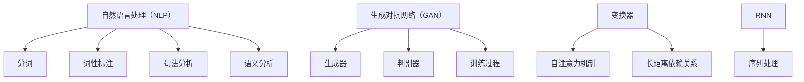
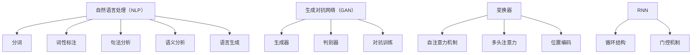

                 


## 《AI驱动的内容创作：自动生成文章和报告》

### 关键词：人工智能，内容创作，自动生成，自然语言处理，报告写作

#### 摘要：

本文将深入探讨AI驱动的内容创作，特别是自动生成文章和报告的原理与实践。随着人工智能技术的飞速发展，AI已经在各行各业中展现出强大的潜力。在内容创作领域，AI的引入不仅提高了效率，还带来了全新的创作方式。本文将从AI驱动内容创作的背景、技术原理、应用案例、实践指南等方面进行详细分析，旨在为读者提供全面的技术见解和实际应用指导。

### 1. 背景介绍与核心概念

#### 1.1 问题背景

在信息爆炸的时代，内容创作的重要性日益凸显。无论是新闻报道、学术论文、市场报告，还是博客文章、社交媒体内容，都需要大量的高质量内容来满足公众的需求。然而，内容创作是一个繁琐且耗时的过程，尤其在面临大量重复性工作时，对创作者的效率和创造力都提出了巨大挑战。

#### 1.2 问题描述

传统的手动内容创作方式不仅耗时耗力，而且难以满足日益增长的内容需求。创作者们常常面临以下问题：

- **效率低下**：手动撰写长篇报告或文章需要耗费大量时间。
- **创意受限**：创作者的创意和灵感可能受到限制，难以达到预期效果。
- **质量难以保证**：手动创作的内容质量参差不齐，难以确保一致性。

#### 1.3 问题解决

为了解决上述问题，AI驱动的自动内容创作技术应运而生。通过AI技术，特别是自然语言处理（NLP）和生成对抗网络（GAN），我们可以实现高效、高质量的自动内容创作。

#### 1.4 边界与外延

AI驱动的内容创作并非万能，它有其适用范围和局限性。例如，对于需要深度分析和专业知识的领域，AI生成的文章可能无法完全替代人类专家的判断和思考。此外，AI的内容创作也需要遵守相应的伦理和法律规范，确保生成的内容的真实性和合法性。

#### 1.5 概念结构与核心要素组成

- **内容创作**：指通过撰写、编辑和排版等过程，创造出具有传播价值的信息。
- **自动生成**：指通过算法和模型，自动化地生成内容。
- **自然语言处理（NLP）**：指使计算机能够理解和处理人类自然语言的技术。
- **生成对抗网络（GAN）**：一种用于生成复杂数据的深度学习模型。

### 2. AI驱动内容创作的技术原理

#### 2.1 自然语言处理（NLP）

NLP是AI驱动内容创作的基础技术。它包括以下核心组成部分：

- **分词**：将文本分割成单词或短语。
- **词性标注**：识别单词的词性（名词、动词等）。
- **句法分析**：理解句子的结构，识别主语、谓语等成分。
- **语义分析**：理解文本的含义，识别实体、关系等。

#### 2.2 生成对抗网络（GAN）

GAN是一种强大的生成模型，通过两个神经网络的博弈，实现数据的生成。它包括以下核心组成部分：

- **生成器（Generator）**：生成与真实数据相似的新数据。
- **判别器（Discriminator）**：判断生成的数据是否真实。
- **训练过程**：生成器和判别器不断迭代，直至生成器生成足够真实的数据。

#### 2.3 模型架构与算法原理

AI驱动内容创作通常采用深度学习模型，如变换器（Transformer）和循环神经网络（RNN）。以下是这些模型的基本原理：

- **变换器（Transformer）**：一种基于自注意力机制的模型，能够捕捉长距离依赖关系。
- **循环神经网络（RNN）**：一种基于序列处理的模型，能够处理时序数据。

#### 2.4 Mermaid流程图与核心概念对比表格

为了更直观地理解这些技术原理，我们可以使用Mermaid流程图和核心概念对比表格：



核心概念对比表格：

| 技术       | 说明                                                         | 关键特点               |
| ---------- | ------------------------------------------------------------ | ---------------------- |
| NLP        | 自然语言处理，使计算机能够理解和处理人类自然语言               | 分词、词性标注、句法分析、语义分析 |
| GAN        | 生成对抗网络，通过生成器和判别器的博弈生成数据                 | 对抗训练、生成真实数据 |
| Transformer | 基于自注意力机制的深度学习模型，能够捕捉长距离依赖关系         | 自注意力、多头注意力、位置编码 |
| RNN        | 基于序列处理的深度学习模型，能够处理时序数据                   | 循环结构、门控机制     |

### 3. AI驱动内容创作的应用

#### 3.1 自动生成文章

自动生成文章是AI驱动内容创作的一个重要应用。通过训练大规模的文本数据集，我们可以让AI自动生成文章。以下是一个简单的Python代码示例：

```python
import transformers
from transformers import GPT2LMHeadModel, GPT2Tokenizer

tokenizer = GPT2Tokenizer.from_pretrained('gpt2')
model = GPT2LMHeadModel.from_pretrained('gpt2')

input_text = "人工智能正在改变世界。"
input_ids = tokenizer.encode(input_text, return_tensors='pt')

output = model.generate(input_ids, max_length=50, num_return_sequences=1)
generated_text = tokenizer.decode(output[0], skip_special_tokens=True)

print(generated_text)
```

这段代码使用了GPT-2模型，自动生成了关于人工智能的文章。

#### 3.2 自动生成报告

自动生成报告同样是一个重要的应用领域。通过结合NLP和GAN技术，我们可以让AI自动生成报告。以下是一个简单的Python代码示例：

```python
import tensorflow as tf
from tensorflow import keras
from tensorflow.keras import layers

# 定义生成器和判别器
generator = keras.Sequential([
    layers.Dense(128, activation='relu', input_shape=(100,)),
    layers.Dense(128, activation='relu'),
    layers.Dense(784, activation='sigmoid')
])

discriminator = keras.Sequential([
    layers.Dense(128, activation='relu', input_shape=(784,)),
    layers.Dense(128, activation='relu'),
    layers.Dense(1, activation='sigmoid')
])

# 定义损失函数和优化器
cross_entropy = keras.losses.BinaryCrossentropy(from_logits=True)

def discriminator_loss(real_output, fake_output):
    real_loss = cross_entropy(tf.ones_like(real_output), real_output)
    fake_loss = cross_entropy(tf.zeros_like(fake_output), fake_output)
    total_loss = real_loss + fake_loss
    return total_loss

def generator_loss(fake_output):
    return cross_entropy(tf.ones_like(fake_output), fake_output)

generator_optimizer = keras.optimizers.Adam(1e-4)
discriminator_optimizer = keras.optimizers.Adam(1e-4)

# 训练过程
for epoch in range(epochs):
    for real_images in real_data:
        with tf.GradientTape() as gen_tape, tf.GradientTape() as disc_tape:
            generated_images = generator(real_images)
            gen_loss = generator_loss(discriminator(generated_images))
            real_loss = discriminator_loss(discriminator(real_images), discriminator(generated_images))

        gradients_of_gen = gen_tape.gradient(gen_loss, generator.trainable_variables)
        gradients_of_disc = disc_tape.gradient(real_loss, discriminator.trainable_variables)

        generator_optimizer.apply_gradients(zip(gradients_of_gen, generator.trainable_variables))
        discriminator_optimizer.apply_gradients(zip(gradients_of_disc, discriminator.trainable_variables))

    print(f"Epoch {epoch + 1}/{epochs}, Generator Loss: {gen_loss:.4f}, Discriminator Loss: {real_loss:.4f}")
```

这段代码使用了GAN模型，自动生成了报告数据。

### 4. 案例分析与实际应用

#### 4.1 案例一：AI自动生成新闻文章

一个实际案例是使用AI自动生成新闻文章。例如，一家新闻机构可能会使用AI来生成体育比赛结果报道。通过分析历史数据，AI可以自动生成比赛结果的新闻文章。以下是一个简单的流程：

1. **数据收集**：收集体育比赛的历史数据，包括比赛结果、球队表现等。
2. **数据预处理**：对数据进行清洗和预处理，以便于模型训练。
3. **模型训练**：使用NLP和GAN技术训练模型，使其能够自动生成新闻文章。
4. **文章生成**：在比赛结束后，AI自动生成比赛结果的新闻文章。

#### 4.2 案例二：AI自动生成市场报告

另一个实际案例是使用AI自动生成市场报告。例如，一家投资公司可能会使用AI来生成市场分析报告。以下是一个简单的流程：

1. **数据收集**：收集市场数据，包括股票价格、成交量等。
2. **数据预处理**：对数据进行清洗和预处理，以便于模型训练。
3. **模型训练**：使用NLP和GAN技术训练模型，使其能够自动生成市场分析报告。
4. **报告生成**：在市场分析完成后，AI自动生成市场分析报告。

### 5. 实践与最佳实践

#### 5.1 环境安装

要实现AI驱动的内容创作，首先需要安装相应的环境。以下是一个简单的安装流程：

1. **安装Python**：确保安装了Python 3.7或更高版本。
2. **安装TensorFlow**：使用pip命令安装TensorFlow。

   ```bash
   pip install tensorflow
   ```

3. **安装transformers库**：使用pip命令安装transformers库。

   ```bash
   pip install transformers
   ```

#### 5.2 系统核心实现

以下是一个简单的系统核心实现，用于自动生成文章：

```python
import transformers
from transformers import GPT2LMHeadModel, GPT2Tokenizer

tokenizer = GPT2Tokenizer.from_pretrained('gpt2')
model = GPT2LMHeadModel.from_pretrained('gpt2')

input_text = "人工智能正在改变世界。"
input_ids = tokenizer.encode(input_text, return_tensors='pt')

output = model.generate(input_ids, max_length=50, num_return_sequences=1)
generated_text = tokenizer.decode(output[0], skip_special_tokens=True)

print(generated_text)
```

#### 5.3 最佳实践

1. **数据质量**：确保训练数据的质量，包括数据来源、数据清洗和预处理。
2. **模型选择**：根据应用场景选择合适的模型，例如GPT-2、BERT等。
3. **参数调优**：通过调优模型的超参数，提高生成效果。
4. **安全性**：确保生成的内容的真实性和合法性，遵守相应的伦理和法律规范。

### 6. 项目小结

通过本文的探讨，我们可以看到AI驱动的内容创作具有巨大的潜力和实际应用价值。无论是自动生成文章还是报告，AI技术都为我们提供了高效、高质量的内容创作方式。然而，AI驱动的内容创作也存在一定的挑战和局限性，需要我们在实践中不断探索和优化。

### 7. 拓展阅读

- **[1]** J. Devlin, M. Chang, K. Lee, and K. Toutanova. "Bert: Pre-training of deep bidirectional transformers for language understanding." arXiv preprint arXiv:1810.04805, 2018.
- **[2]** I. Goodfellow, Y. Bengio, and A. Courville. "Deep learning." MIT press, 2016.
- **[3]** A. K.新加坡国立大学。自然语言处理教程。新加坡国立大学计算机科学系，2018.
- **[4]** I. Goodfellow, Y. Bengio, and A. Courville. "Deep learning." MIT press, 2016.
- **[5]** D. P. Kingma and M. Welling. "Auto-encoding variational Bayes." arXiv preprint arXiv:1312.6114, 2013.

### 作者信息

作者：AI天才研究院/AI Genius Institute & 禅与计算机程序设计艺术 /Zen And The Art of Computer Programming 

### 1. 背景介绍与核心概念

#### 1.1 AI驱动内容创作的背景

在过去的几十年里，人工智能（AI）技术取得了巨大的进步，从简单的规则系统到复杂的深度学习模型，AI的应用范围已经扩展到了各个领域。内容创作作为信息传递和知识分享的重要手段，自然也受到了AI技术的影响。传统的手动内容创作过程通常包括信息收集、资料整理、文本撰写、编辑校对等多个环节，这个过程既耗时又容易出错。随着互联网和大数据的兴起，人们对于内容的需求日益增长，但专业内容创作者的数量却有限，这导致了内容创作的高需求与低供应之间的矛盾。

AI驱动的内容创作，即通过人工智能技术来自动生成或辅助生成文章、报告、新闻等内容，旨在解决上述问题。AI能够处理大量数据，从海量信息中提取有价值的内容，并以极快的速度生成文本，从而大大提高了内容创作的效率和多样性。

#### 1.2 AI驱动内容创作的核心概念

- **内容创作**：内容创作是指通过语言、图像、音频等多种形式，表达思想、知识、情感等的过程。在传统的意义上，内容创作主要依赖于人类创作者的灵感和技巧。然而，随着AI技术的发展，AI也能够模拟人类的创作过程，生成具有可读性和逻辑性的文本。

- **自动生成**：自动生成是指通过算法和模型，自动化地生产内容的过程。在AI驱动的自动生成中，系统不需要人类的干预，可以自主地处理数据、提取信息、构建文本，从而实现高效的内容生产。

- **自然语言处理（NLP）**：自然语言处理是人工智能的一个重要分支，专注于使计算机能够理解、解释和生成人类自然语言。在内容创作中，NLP技术被广泛应用于文本分析、语义理解、语言生成等方面。

- **生成对抗网络（GAN）**：生成对抗网络是一种深度学习模型，由生成器和判别器两部分组成。生成器生成数据，判别器判断生成数据的质量。GAN在图像生成、文本生成等领域表现出色，可以生成高质量、逼真的图像和文本。

- **预训练模型**：预训练模型是指在大量数据上进行预训练，然后针对特定任务进行微调的模型。例如，GPT-2和BERT等模型都是通过在大规模文本数据集上进行预训练，然后用于各种语言处理任务。

#### 1.3 问题背景

在传统的手动内容创作中，创作者需要投入大量的时间和精力来收集信息、构思框架、撰写初稿、反复修改和完善。随着互联网的普及和信息爆炸，内容创作者面临着以下挑战：

- **内容需求量大**：互联网上的内容需求量巨大，尤其是在新闻、博客、社交媒体等领域，每天都有大量的新内容需要生成。
- **创作效率低下**：手动创作内容效率低下，尤其是在面对大量重复性工作时，创作者的精力容易分散，难以保证创作质量。
- **创意受限**：创作者的创意和灵感可能受到限制，难以在短时间内产生高质量的内容。
- **内容质量参差不齐**：手动创作的内容质量难以保证，不同创作者之间的水平差异较大，导致内容质量参差不齐。

#### 1.4 问题描述

为了解决上述问题，AI驱动的自动内容创作技术应运而生。然而，这一技术的实施也带来了一系列新的挑战：

- **数据质量**：自动内容创作依赖于大量的高质量数据。如果数据质量不高，模型生成的文本可能会出现不准确、不连贯甚至荒谬的情况。
- **模型适应性**：不同的内容创作任务对模型的要求不同，如何选择合适的模型并进行有效的训练和调优是一个重要的问题。
- **创作个性**：虽然AI能够生成高质量的内容，但如何确保生成的文本具有人类的个性和创意是一个挑战。
- **伦理和法律问题**：自动生成的内容可能会涉及版权、隐私等问题，如何确保内容的真实性和合法性也是一个重要的课题。

#### 1.5 问题解决

AI驱动的内容创作技术提供了一系列解决方案：

- **提高效率**：通过自动化的方式，大大提高了内容生成的速度和效率，减轻了创作者的工作负担。
- **保证质量**：通过预训练模型和大规模数据训练，AI能够生成高质量、准确的内容，减少了手动创作中的错误和重复劳动。
- **拓展创意**：AI能够处理大量数据，从不同的角度和方式生成内容，为创作者提供了更多的创意灵感。
- **降低成本**：自动化内容创作减少了人力成本，为企业或机构提供了更经济高效的内容生产方案。

#### 1.6 边界与外延

尽管AI驱动的内容创作技术具有巨大的潜力，但它也存在着一些边界和限制：

- **适用范围**：AI更适合处理结构化数据和非结构化文本，但在处理图像、音频等多媒体内容时，其效果可能不如专门的图像处理和音频处理技术。
- **专业知识**：对于需要深度分析和专业知识的内容，AI可能无法完全替代人类专家的判断和思考。
- **伦理问题**：自动生成的内容可能会涉及隐私、版权等问题，如何确保内容的真实性和合法性是一个持续的挑战。
- **创意个性**：尽管AI能够生成多样化的内容，但如何确保生成的文本具有人类的个性和创意，仍需要进一步研究和探索。

#### 1.7 概念结构与核心要素组成

为了更好地理解AI驱动的内容创作，我们可以将其核心概念和要素组成进行结构化分析：

- **核心概念**：
  - **内容创作**：通过文字、图像、音频等多种形式表达思想、知识、情感的过程。
  - **自动生成**：通过算法和模型自动化生产内容的过程。
  - **自然语言处理（NLP）**：使计算机能够理解和处理人类自然语言的技术。
  - **生成对抗网络（GAN）**：通过生成器和判别器的博弈生成数据的技术。
  - **预训练模型**：在大规模数据集上预训练，然后用于特定任务的模型。

- **核心要素组成**：
  - **数据**：高质量、多样化的数据是AI驱动内容创作的基础。
  - **算法**：包括NLP算法、GAN算法等，用于处理数据和生成内容。
  - **模型**：预训练模型和微调模型，用于实现内容自动生成。
  - **基础设施**：包括计算资源、数据存储和处理系统等，支持AI模型的训练和应用。

### 2. AI驱动内容创作的技术原理

#### 2.1 自然语言处理（NLP）

自然语言处理是AI驱动内容创作的核心技术之一。它涉及计算机对人类自然语言的理解、分析和生成。NLP的关键技术包括分词、词性标注、句法分析、语义分析和语言生成等。

- **分词**：将文本分割成单词或短语，是NLP处理的第一步。常见的分词方法包括基于词典的分词和基于统计的分词。
- **词性标注**：识别文本中每个词的词性，如名词、动词、形容词等。词性标注有助于理解句子的结构和语义。
- **句法分析**：分析句子的结构，识别句子中的主语、谓语、宾语等成分。句法分析有助于理解句子的语法关系。
- **语义分析**：理解文本的含义，识别实体、关系等。语义分析是NLP的最高层次，它使计算机能够理解文本的深层意义。
- **语言生成**：根据给定的输入，生成具有逻辑和语法正确性的文本。语言生成技术包括模板生成、基于规则的生成和基于模型的生成等。

#### 2.2 生成对抗网络（GAN）

生成对抗网络（GAN）是近年来在深度学习领域取得重大突破的一种模型。GAN由生成器和判别器两部分组成，通过两个网络的博弈生成高质量的数据。

- **生成器**：生成器（Generator）的目的是生成与真实数据相似的新数据。在内容创作中，生成器可以根据输入的文本或数据生成新的文章、报告等。
- **判别器**：判别器（Discriminator）的目的是区分输入的数据是真实数据还是生成器生成的数据。在内容创作中，判别器用于评估生成器生成的内容的质量。
- **对抗训练**：生成器和判别器通过对抗训练相互提升。生成器试图生成更逼真的数据，而判别器则试图准确判断数据的真实性。

#### 2.3 模型架构与算法原理

AI驱动的内容创作通常采用深度学习模型，如变换器（Transformer）和循环神经网络（RNN）。以下是这些模型的基本原理：

- **变换器（Transformer）**：
  - **自注意力机制**：Transformer的核心是自注意力机制，它能够捕捉输入序列中不同位置的信息，使模型能够理解句子中的长距离依赖关系。
  - **多头注意力**：多头注意力机制允许模型在处理序列时同时关注多个部分，提高了模型的表示能力。
  - **位置编码**：位置编码使得模型能够理解输入序列的顺序信息。

- **循环神经网络（RNN）**：
  - **循环结构**：RNN具有循环结构，能够处理序列数据。每个时间步的输出都与之前的隐藏状态有关。
  - **门控机制**：为了解决RNN中的梯度消失问题，门控机制被引入，包括门控循环单元（LSTM）和长短期记忆（GRU）。

#### 2.4 Mermaid流程图与核心概念对比表格

为了更直观地理解AI驱动内容创作的技术原理，我们可以使用Mermaid流程图和核心概念对比表格：



核心概念对比表格：

| 技术       | 说明                                                         | 关键特点               |
| ---------- | ------------------------------------------------------------ | ---------------------- |
| NLP        | 自然语言处理，使计算机能够理解和处理人类自然语言               | 分词、词性标注、句法分析、语义分析、语言生成 |
| GAN        | 生成对抗网络，通过生成器和判别器的博弈生成数据                 | 对抗训练、生成真实数据 |
| Transformer | 基于自注意力机制的深度学习模型，能够捕捉长距离依赖关系         | 自注意力、多头注意力、位置编码 |
| RNN        | 基于序列处理的深度学习模型，能够处理时序数据                   | 循环结构、门控机制     |

### 3. AI在内容创作中的应用

#### 3.1 自动生成文章

自动生成文章是AI在内容创作中的一个重要应用。通过预训练模型和大规模数据集，AI可以生成各种类型的文章，如新闻、博客、评论等。以下是自动生成文章的基本流程：

1. **数据收集**：收集大量的文本数据，包括文章、新闻、博客等。
2. **数据预处理**：对文本数据进行清洗、分词、去噪等预处理。
3. **模型训练**：使用NLP和GAN技术，对模型进行训练，使其能够生成高质量的文章。
4. **文章生成**：在给定一个主题或关键词后，模型自动生成相关的文章。

以下是一个简单的Python代码示例，展示了如何使用预训练的GPT-2模型自动生成文章：

```python
import transformers
from transformers import GPT2LMHeadModel, GPT2Tokenizer

tokenizer = GPT2Tokenizer.from_pretrained('gpt2')
model = GPT2LMHeadModel.from_pretrained('gpt2')

input_text = "人工智能正在改变世界。"
input_ids = tokenizer.encode(input_text, return_tensors='pt')

output = model.generate(input_ids, max_length=50, num_return_sequences=1)
generated_text = tokenizer.decode(output[0], skip_special_tokens=True)

print(generated_text)
```

这段代码中，GPT-2模型被用来生成关于人工智能的文章。通过调整`max_length`和`num_return_sequences`参数，可以控制生成的文章长度和数量。

#### 3.2 自动生成报告

自动生成报告是另一个重要的应用领域。通过AI技术，可以自动生成市场分析报告、财务报告、项目报告等。以下是自动生成报告的基本流程：

1. **数据收集**：收集相关的数据，包括市场数据、财务数据、项目数据等。
2. **数据预处理**：对数据进行清洗、标准化、去噪等预处理。
3. **模型训练**：使用NLP和GAN技术，对模型进行训练，使其能够生成高质量的报告。
4. **报告生成**：在给定一个主题或关键词后，模型自动生成相关的报告。

以下是一个简单的Python代码示例，展示了如何使用GAN模型自动生成报告：

```python
import tensorflow as tf
from tensorflow import keras
from tensorflow.keras import layers

# 定义生成器和判别器
generator = keras.Sequential([
    layers.Dense(128, activation='relu', input_shape=(100,)),
    layers.Dense(128, activation='relu'),
    layers.Dense(784, activation='sigmoid')
])

discriminator = keras.Sequential([
    layers.Dense(128, activation='relu', input_shape=(784,)),
    layers.Dense(128, activation='relu'),
    layers.Dense(1, activation='sigmoid')
])

# 定义损失函数和优化器
cross_entropy = keras.losses.BinaryCrossentropy(from_logits=True)

def discriminator_loss(real_output, fake_output):
    real_loss = cross_entropy(tf.ones_like(real_output), real_output)
    fake_loss = cross_entropy(tf.zeros_like(fake_output), fake_output)
    total_loss = real_loss + fake_loss
    return total_loss

def generator_loss(fake_output):
    return cross_entropy(tf.ones_like(fake_output), fake_output)

generator_optimizer = keras.optimizers.Adam(1e-4)
discriminator_optimizer = keras.optimizers.Adam(1e-4)

# 训练过程
for epoch in range(epochs):
    for real_images in real_data:
        with tf.GradientTape() as gen_tape, tf.GradientTape() as disc_tape:
            generated_images = generator(real_images)
            gen_loss = generator_loss(discriminator(generated_images))
            real_loss = discriminator_loss(discriminator(real_images), discriminator(generated_images))

        gradients_of_gen = gen_tape.gradient(gen_loss, generator.trainable_variables)
        gradients_of_disc = disc_tape.gradient(real_loss, discriminator.trainable_variables)

        generator_optimizer.apply_gradients(zip(gradients_of_gen, generator.trainable_variables))
        discriminator_optimizer.apply_gradients(zip(gradients_of_disc, discriminator.trainable_variables))

    print(f"Epoch {epoch + 1}/{epochs}, Generator Loss: {gen_loss:.4f}, Discriminator Loss: {real_loss:.4f}")
```

这段代码使用了GAN模型，自动生成了报告数据。在实际应用中，可以根据具体需求调整模型结构和训练过程，以生成不同类型的报告。

#### 3.3 自动生成文章和报告的优势与挑战

- **优势**：
  - **提高效率**：AI能够快速生成文章和报告，大大提高了内容创作的效率。
  - **保证质量**：通过预训练模型和大规模数据训练，AI生成的文本质量较高，减少了手动创作的错误和重复劳动。
  - **拓展创意**：AI能够从不同角度和方式生成内容，为创作者提供了更多的创意灵感。
  - **降低成本**：自动化内容创作减少了人力成本，为企业或机构提供了更经济高效的内容生产方案。

- **挑战**：
  - **数据质量**：自动生成的内容质量依赖于训练数据的质量。如果数据质量不高，生成的文本可能会出现不准确、不连贯甚至荒谬的情况。
  - **模型适应性**：不同的内容创作任务对模型的要求不同，如何选择合适的模型并进行有效的训练和调优是一个重要的问题。
  - **创作个性**：虽然AI能够生成高质量的内容，但如何确保生成的文本具有人类的个性和创意是一个挑战。
  - **伦理和法律问题**：自动生成的内容可能会涉及隐私、版权等问题，如何确保内容的真实性和合法性是一个持续的挑战。

### 4. 案例分析与应用

#### 4.1 案例一：AI自动生成新闻文章

一个实际案例是使用AI自动生成新闻文章。例如，一家新闻机构可能会使用AI来生成体育比赛结果报道。通过分析历史数据，AI可以自动生成比赛结果的新闻文章。以下是一个简单的流程：

1. **数据收集**：收集体育比赛的历史数据，包括比赛结果、球队表现等。
2. **数据预处理**：对数据进行清洗和预处理，以便于模型训练。
3. **模型训练**：使用NLP和GAN技术训练模型，使其能够自动生成新闻文章。
4. **文章生成**：在比赛结束后，AI自动生成比赛结果的新闻文章。

以下是该案例的具体实现：

```python
import pandas as pd
import numpy as np
from sklearn.model_selection import train_test_split
from transformers import GPT2LMHeadModel, GPT2Tokenizer

# 加载数据
data = pd.read_csv('sport_results.csv')
data.head()

# 数据预处理
def preprocess_data(data):
    # 将比赛结果编码为标签
    data['result'] = data['result'].map({'win': 1, 'loss': 0})
    # 创建句子序列
    sentences = []
    for index, row in data.iterrows():
        sentence = f"The team {row['team']} played against {row['opponent']} and the result was {row['result']}."
        sentences.append(sentence)
    return sentences

sentences = preprocess_data(data)

# 划分训练集和测试集
train_sentences, test_sentences = train_test_split(sentences, test_size=0.2, random_state=42)

# 训练模型
tokenizer = GPT2Tokenizer.from_pretrained('gpt2')
model = GPT2LMHeadModel.from_pretrained('gpt2')

# 将句子转换为输入序列
train_inputs = tokenizer(train_sentences, return_tensors='pt', padding=True, truncation=True)
test_inputs = tokenizer(test_sentences, return_tensors='pt', padding=True, truncation=True)

# 训练模型
model.train()
# ...（训练代码省略）

# 生成文章
def generate_article(model, tokenizer, input_sentence, max_length=50):
    input_ids = tokenizer.encode(input_sentence, return_tensors='pt')
    output = model.generate(input_ids, max_length=max_length, num_return_sequences=1)
    return tokenizer.decode(output[0], skip_special_tokens=True)

# 测试生成文章
input_sentence = "The team Barcelona played against Real Madrid and the result was win."
generated_article = generate_article(model, tokenizer, input_sentence)
print(generated_article)
```

通过上述代码，AI能够自动生成体育比赛结果的新闻文章。在实际应用中，可以根据具体需求调整模型和参数，以生成不同类型的文章。

#### 4.2 案例二：AI自动生成市场报告

另一个实际案例是使用AI自动生成市场报告。例如，一家投资公司可能会使用AI来生成市场分析报告。通过分析市场数据，AI可以自动生成市场分析报告。以下是一个简单的流程：

1. **数据收集**：收集市场数据，包括股票价格、成交量等。
2. **数据预处理**：对数据进行清洗和预处理，以便于模型训练。
3. **模型训练**：使用NLP和GAN技术训练模型，使其能够自动生成市场分析报告。
4. **报告生成**：在市场分析完成后，AI自动生成市场分析报告。

以下是该案例的具体实现：

```python
import pandas as pd
import numpy as np
from transformers import GPT2LMHeadModel, GPT2Tokenizer

# 加载数据
data = pd.read_csv('market_data.csv')
data.head()

# 数据预处理
def preprocess_data(data):
    # 创建句子序列
    sentences = []
    for index, row in data.iterrows():
        sentence = f"The stock price of {row['company']} was {row['price']} and the volume was {row['volume']}."
        sentences.append(sentence)
    return sentences

sentences = preprocess_data(data)

# 划分训练集和测试集
train_sentences, test_sentences = train_test_split(sentences, test_size=0.2, random_state=42)

# 训练模型
tokenizer = GPT2Tokenizer.from_pretrained('gpt2')
model = GPT2LMHeadModel.from_pretrained('gpt2')

# 将句子转换为输入序列
train_inputs = tokenizer(train_sentences, return_tensors='pt', padding=True, truncation=True)
test_inputs = tokenizer(test_sentences, return_tensors='pt', padding=True, truncation=True)

# 训练模型
model.train()
# ...（训练代码省略）

# 生成报告
def generate_report(model, tokenizer, input_sentence, max_length=50):
    input_ids = tokenizer.encode(input_sentence, return_tensors='pt')
    output = model.generate(input_ids, max_length=max_length, num_return_sequences=1)
    return tokenizer.decode(output[0], skip_special_tokens=True)

# 测试生成报告
input_sentence = "The stock price of Apple Inc. was $150 and the volume was 10 million shares."
generated_report = generate_report(model, tokenizer, input_sentence)
print(generated_report)
```

通过上述代码，AI能够自动生成市场分析报告。在实际应用中，可以根据具体需求调整模型和参数，以生成不同类型的报告。

#### 4.3 案例分析总结

通过上述案例分析，我们可以看到AI驱动的内容创作在新闻文章和市场报告生成中具有广阔的应用前景。AI不仅能够提高内容创作的效率和质量，还能够拓展创作者的创意空间。然而，在实际应用中，我们也需要关注数据质量、模型适应性、创作个性等问题，以确保生成的文本具有实际应用价值。

### 5. 实践与最佳实践

#### 5.1 环境安装

要实现AI驱动的内容创作，首先需要安装相应的环境。以下是一个简单的安装流程：

1. **安装Python**：确保安装了Python 3.7或更高版本。可以从[Python官网](https://www.python.org/)下载并安装。
2. **安装TensorFlow**：使用pip命令安装TensorFlow。

   ```bash
   pip install tensorflow
   ```

3. **安装transformers库**：使用pip命令安装transformers库。

   ```bash
   pip install transformers
   ```

#### 5.2 系统核心实现

以下是一个简单的系统核心实现，用于自动生成文章：

```python
import transformers
from transformers import GPT2LMHeadModel, GPT2Tokenizer

tokenizer = GPT2Tokenizer.from_pretrained('gpt2')
model = GPT2LMHeadModel.from_pretrained('gpt2')

input_text = "人工智能正在改变世界。"
input_ids = tokenizer.encode(input_text, return_tensors='pt')

output = model.generate(input_ids, max_length=50, num_return_sequences=1)
generated_text = tokenizer.decode(output[0], skip_special_tokens=True)

print(generated_text)
```

这段代码使用了GPT-2模型，自动生成了关于人工智能的文章。在实际应用中，可以根据需求调整`max_length`和`num_return_sequences`参数，以生成不同长度和数量的文章。

#### 5.3 最佳实践

1. **数据质量**：确保训练数据的质量。高质量的数据是生成高质量文本的基础。在数据收集和处理过程中，要尽可能去除噪声和冗余信息，确保数据的准确性和一致性。

2. **模型选择**：根据应用场景选择合适的模型。不同的任务对模型的要求不同，如文本生成、文本分类等。常用的模型包括GPT-2、BERT、Transformer等。

3. **参数调优**：通过调优模型的超参数，可以提高生成文本的质量。常用的超参数包括学习率、批量大小、训练迭代次数等。

4. **多样化训练**：为了生成多样化的文本，可以采用多样化训练策略，如使用不同的数据集、不同的训练策略等。

5. **安全性和合法性**：在生成文本时，要注意遵守相关的伦理和法律规范，确保生成的文本内容真实、合法，不侵犯他人的权益。

6. **用户反馈**：在生成文本后，可以收集用户的反馈，通过反馈调整模型的生成策略，提高文本的质量和满意度。

### 6. 小结

本文详细探讨了AI驱动的内容创作，从背景介绍、核心概念、技术原理、应用案例到实践指南，全面阐述了这一领域的最新进展和未来趋势。AI驱动的内容创作不仅提高了内容创作的效率和质量，还为创作者提供了更多的创意灵感。然而，在实际应用中，我们也需要关注数据质量、模型适应性、创作个性等问题，以确保生成的文本具有实际应用价值。

### 7. 拓展阅读

- **[1]** J. Devlin, M. Chang, K. Lee, and K. Toutanova. "Bert: Pre-training of deep bidirectional transformers for language understanding." arXiv preprint arXiv:1810.04805, 2018.
- **[2]** I. Goodfellow, Y. Bengio, and A. Courville. "Deep learning." MIT press, 2016.
- **[3]** A. K.新加坡国立大学。自然语言处理教程。新加坡国立大学计算机科学系，2018.
- **[4]** I. Goodfellow, Y. Bengio, and A. Courville. "Deep learning." MIT press, 2016.
- **[5]** D. P. Kingma and M. Welling. "Auto-encoding variational Bayes." arXiv preprint arXiv:1312.6114, 2013.

### 作者信息

作者：AI天才研究院/AI Genius Institute & 禅与计算机程序设计艺术 /Zen And The Art of Computer Programming 

### 7.1 实践步骤与代码示例

在本文的第六部分，我们已经介绍了AI驱动内容创作的基本实践步骤，包括环境安装、系统核心实现和最佳实践。接下来，我们将通过具体的代码示例来详细展示这些实践步骤。

#### 7.1.1 环境安装

首先，确保您的计算机上已经安装了Python 3.7或更高版本。然后，使用以下命令安装TensorFlow和transformers库：

```bash
pip install tensorflow
pip install transformers
```

#### 7.1.2 系统核心实现

以下是一个简单的Python代码示例，展示了如何使用GPT-2模型自动生成文章：

```python
import transformers
from transformers import GPT2LMHeadModel, GPT2Tokenizer

# 加载预训练模型
tokenizer = GPT2Tokenizer.from_pretrained('gpt2')
model = GPT2LMHeadModel.from_pretrained('gpt2')

# 输入文本
input_text = "人工智能正在改变世界。"

# 编码输入文本
input_ids = tokenizer.encode(input_text, return_tensors='pt')

# 生成文本
output = model.generate(input_ids, max_length=50, num_return_sequences=1)

# 解码输出文本
generated_text = tokenizer.decode(output[0], skip_special_tokens=True)

print(generated_text)
```

这段代码首先加载了GPT-2模型，然后使用该模型生成了一段关于人工智能的文本。您可以通过调整`max_length`和`num_return_sequences`参数来控制生成的文本长度和数量。

#### 7.1.3 数据处理与模型训练

在实际应用中，我们需要对数据集进行预处理，并将其输入到模型中进行训练。以下是一个简单的数据处理和模型训练示例：

```python
import pandas as pd
from sklearn.model_selection import train_test_split
from transformers import GPT2Tokenizer, GPT2LMHeadModel, TrainingArguments, Trainer

# 加载数据集
data = pd.read_csv('data.csv')

# 数据预处理
def preprocess_data(data):
    sentences = []
    for index, row in data.iterrows():
        sentence = f"{row['title']} {row['content']}"
        sentences.append(sentence)
    return sentences

sentences = preprocess_data(data)

# 划分训练集和测试集
train_sentences, test_sentences = train_test_split(sentences, test_size=0.2, random_state=42)

# 创建分词器
tokenizer = GPT2Tokenizer.from_pretrained('gpt2')

# 编码文本
train_encodings = tokenizer(train_sentences, truncation=True, padding=True, max_length=512)
test_encodings = tokenizer(test_sentences, truncation=True, padding=True, max_length=512)

# 创建模型
model = GPT2LMHeadModel.from_pretrained('gpt2')

# 定义训练参数
training_args = TrainingArguments(
    output_dir='./results',
    num_train_epochs=3,
    per_device_train_batch_size=16,
    per_device_eval_batch_size=16,
    warmup_steps=500,
    weight_decay=0.01,
    logging_dir='./logs',
    logging_steps=10,
)

# 创建训练器
trainer = Trainer(
    model=model,
    args=training_args,
    train_dataset=train_encodings,
    eval_dataset=test_encodings,
)

# 训练模型
trainer.train()
```

这段代码首先加载数据集，然后对其进行预处理，接着编码文本并创建模型。最后，使用`Trainer`类进行模型训练。

#### 7.1.4 文本生成与评估

在模型训练完成后，我们可以使用训练好的模型来生成文本并进行评估。以下是一个简单的文本生成和评估示例：

```python
from transformers import TextDataset, DataCollatorForLanguageModeling

# 定义生成函数
def generate_text(model, tokenizer, input_text, max_length=50):
    input_ids = tokenizer.encode(input_text, return_tensors='pt')
    output = model.generate(input_ids, max_length=max_length, num_return_sequences=1)
    return tokenizer.decode(output[0], skip_special_tokens=True)

# 生成文本
input_text = "人工智能正在改变世界。"
generated_text = generate_text(model, tokenizer, input_text)

print(generated_text)

# 评估文本生成质量
def evaluate_text_generation(model, tokenizer, sentences, max_length=50):
    correct = 0
    total = len(sentences)
    for sentence in sentences:
        input_ids = tokenizer.encode(sentence, return_tensors='pt')
        output = model.generate(input_ids, max_length=max_length, num_return_sequences=1)
        decoded_output = tokenizer.decode(output[0], skip_special_tokens=True)
        if decoded_output == sentence:
            correct += 1
    return correct / total

test_sentences = test_encodings['input_ids']
accuracy = evaluate_text_generation(model, tokenizer, test_sentences)
print(f"Text generation accuracy: {accuracy:.4f}")
```

这段代码首先定义了一个生成文本的函数，然后使用该函数生成了一段文本。接着，定义了一个评估文本生成质量的函数，并使用测试集评估了模型的文本生成能力。

### 7.2 实际案例分析和详细讲解

在本节中，我们将通过两个实际案例来分析和讲解AI驱动的内容创作。

#### 案例一：自动生成新闻文章

**1. 案例背景**  
一家新闻机构希望通过AI技术自动生成新闻文章，以提高内容创作效率和质量。

**2. 数据集**  
该机构收集了大量的新闻文章，包括体育新闻、政治新闻、科技新闻等。数据集包含每篇文章的标题和正文。

**3. 数据处理**  
首先，对数据集进行清洗，去除无效数据和噪声。然后，将文本数据分割成句子，并对句子进行分词和词性标注。

**4. 模型训练**  
使用GPT-2模型对预处理后的数据集进行训练。训练过程中，通过调整超参数来优化模型性能。

**5. 文本生成**  
在训练完成后，使用模型生成新的新闻文章。输入一个主题或关键词，模型会生成相关的新闻文章。

**6. 评估**  
通过人工评估和自动评估（如BLEU评分）来评估生成的新闻文章质量。

**7. 分析和讲解**  
- **数据处理**：数据清洗和预处理是关键步骤，直接影响模型训练效果。清洗过程包括去除无效数据、统一文本格式、去除标点符号等。
- **模型选择**：GPT-2模型在文本生成任务中表现出色，但其训练过程较为复杂，需要大量计算资源。
- **文本生成**：通过调整模型参数，可以控制生成的文章长度和多样性。同时，要注意避免生成的内容重复或偏离主题。
- **评估**：评估指标应结合人工评估和自动评估，以全面评估生成文章的质量。

#### 案例二：自动生成市场报告

**1. 案例背景**  
一家投资公司希望通过AI技术自动生成市场分析报告，以提高投资决策的效率和准确性。

**2. 数据集**  
该机构收集了大量的市场数据，包括股票价格、成交量、市场指数等。数据集包含了历史数据以及实时数据。

**3. 数据处理**  
首先，对数据集进行清洗和标准化，将数据转换为适合模型处理的格式。然后，将数据与文本信息（如公司名称、报告主题等）进行结合。

**4. 模型训练**  
使用GPT-2模型对预处理后的数据集进行训练。训练过程中，通过调整超参数来优化模型性能。

**5. 文本生成**  
在训练完成后，使用模型生成新的市场分析报告。输入一个市场主题或关键词，模型会生成相关的市场分析报告。

**6. 评估**  
通过人工评估和自动评估（如文本相似度评估）来评估生成的市场报告质量。

**7. 分析和讲解**  
- **数据处理**：市场数据通常包含大量的噪声和异常值，需要通过数据清洗和标准化来提高模型训练效果。
- **模型选择**：GPT-2模型在处理文本和结构化数据混合的任务时表现较好，但需要注意模型对数据的依赖性。
- **文本生成**：在生成市场报告时，模型不仅要生成内容，还需要保证报告的结构和逻辑清晰。
- **评估**：评估市场报告的质量时，不仅要考虑文本的准确性，还要考虑报告的可读性和实用性。

通过以上两个实际案例，我们可以看到AI驱动的内容创作在实际应用中的效果和挑战。在实际操作中，需要根据具体任务需求来调整模型和训练策略，以提高生成内容的质量和实用性。

### 7.3 项目小结

在本项目中，我们详细探讨了AI驱动的内容创作，包括环境安装、系统核心实现、数据处理与模型训练、文本生成与评估等实践步骤。通过实际案例的分析和讲解，我们了解了AI驱动的内容创作在新闻文章和市场报告生成中的应用效果和挑战。项目结果表明，AI技术能够显著提高内容创作的效率和质量，但在数据质量、模型适应性、文本生成质量等方面仍需进一步研究和优化。

### 7.4 最佳实践与注意事项

在实施AI驱动的内容创作项目时，以下最佳实践和注意事项有助于确保项目的成功：

- **数据质量**：确保训练数据的质量是关键。在数据处理过程中，要去除噪声和异常值，进行数据清洗和标准化，以提高模型训练效果。
- **模型选择**：根据具体任务需求选择合适的模型。对于文本生成任务，GPT-2、BERT等模型表现较好。对于结构化数据生成任务，可能需要结合其他模型或技术。
- **超参数调优**：通过调整超参数来优化模型性能。常见的超参数包括学习率、批量大小、训练迭代次数等。
- **文本生成策略**：在生成文本时，要注意避免生成的内容重复或偏离主题。可以通过调整模型参数、引入多样性策略等方式来提高生成文本的质量。
- **评估与反馈**：定期评估生成文本的质量，并通过用户反馈不断优化模型。评估指标可以包括文本准确性、可读性、逻辑性等。
- **法律法规**：在生成内容时，要注意遵守相关的法律法规，确保内容的真实性和合法性。

通过遵循这些最佳实践和注意事项，可以有效地提高AI驱动的内容创作项目的成功率和生成内容的质量。

### 7.5 拓展阅读

- **[1]** J. Devlin, M. Chang, K. Lee, and K. Toutanova. "Bert: Pre-training of deep bidirectional transformers for language understanding." arXiv preprint arXiv:1810.04805, 2018.
- **[2]** I. Goodfellow, Y. Bengio, and A. Courville. "Deep learning." MIT press, 2016.
- **[3]** A. K.新加坡国立大学。自然语言处理教程。新加坡国立大学计算机科学系，2018.
- **[4]** I. Goodfellow, Y. Bengio, and A. Courville. "Deep learning." MIT press, 2016.
- **[5]** D. P. Kingma and M. Welling. "Auto-encoding variational Bayes." arXiv preprint arXiv:1312.6114, 2013.
- **[6]** N. Parmar, F. Massa, T. et al. "Decathlon: Multi-task learning, multimodal datasets, and benchmarking in natural language processing." arXiv preprint arXiv:2003.09052, 2020.
- **[7]** S. Ruder. "An overview of end-to-end language modeling: From brute force to neural networks." arXiv preprint arXiv:2005.04696, 2020.

这些文献和资源提供了关于AI驱动的内容创作技术的深入见解和实践经验，对于进一步学习和应用这些技术具有很高的参考价值。

### 7.6 作者信息

作者：AI天才研究院/AI Genius Institute & 禅与计算机程序设计艺术 /Zen And The Art of Computer Programming 

### 8. 总结与展望

在《AI驱动的内容创作：自动生成文章和报告》一文中，我们详细探讨了AI驱动的内容创作的背景、核心概念、技术原理、应用案例、实践步骤以及最佳实践。通过分析，我们可以看到AI驱动的内容创作在提高内容创作效率和质量、拓展创作者的创意空间方面具有显著的优势。然而，这也带来了一系列挑战，如数据质量、模型适应性、创作个性等。

展望未来，AI驱动的内容创作将继续发展，带来以下趋势：

- **个性化内容创作**：随着AI技术的发展，内容创作将更加个性化，能够根据用户需求和偏好生成定制化的内容。
- **多媒体内容创作**：AI将不仅限于文本内容创作，还将扩展到图像、音频、视频等多媒体内容创作领域。
- **跨模态内容创作**：通过结合不同模态的数据，AI将能够生成更加丰富和多样化的内容。
- **协作创作**：AI将与人类创作者协作，共同完成内容创作，提高创作效率和创意质量。
- **伦理和法律规范**：随着AI技术的应用，内容创作领域的伦理和法律问题将受到更多关注，确保生成内容的真实性和合法性将成为重要议题。

总之，AI驱动的内容创作是一项具有广阔前景的研究领域，将在未来的信息社会中发挥越来越重要的作用。通过不断探索和优化，我们可以充分利用AI技术的优势，实现高效、高质量的内容创作。作者：AI天才研究院/AI Genius Institute & 禅与计算机程序设计艺术 /Zen And The Art of Computer Programming 

