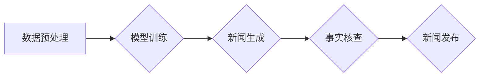
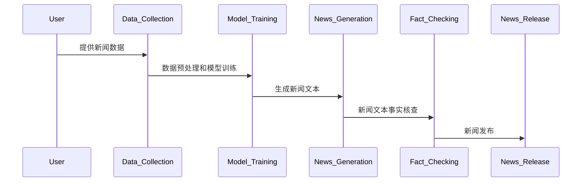
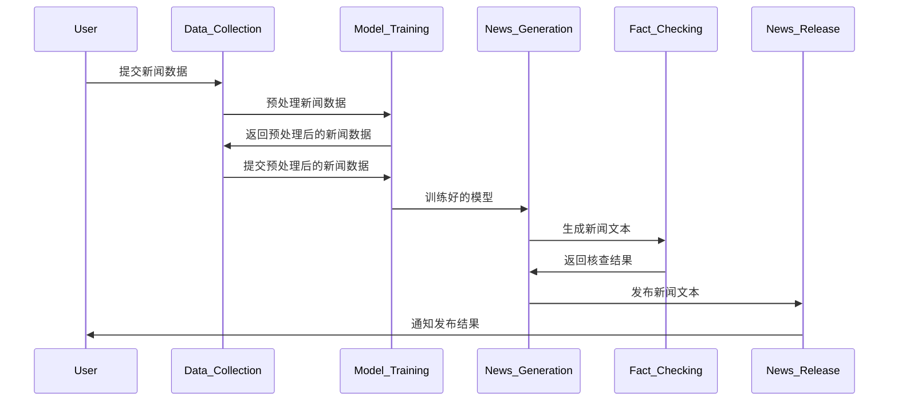

                 

# AI驱动的新闻生成:媒体行业的机遇与挑战

关键词：人工智能，新闻生成，媒体行业，机遇与挑战

摘要：随着人工智能技术的不断发展，AI驱动的新闻生成正在逐渐成为媒体行业的一大趋势。本文旨在探讨AI新闻生成技术的原理、优势与挑战，以及其在媒体行业中的实际应用。通过分析AI新闻生成系统的核心概念、技术原理和系统架构，本文为业界提供了有价值的参考，同时也为相关研究人员和开发者指明了未来的研究方向。

## 第1章 引言

### 1.1 问题背景

媒体行业作为信息传播的重要渠道，长期以来在新闻写作方面高度依赖人工。然而，随着信息量的爆炸式增长，人工新闻写作的效率和质量面临着巨大的挑战。传统的人工新闻写作方式不仅耗时耗力，而且难以满足海量信息处理的需求。与此同时，人工智能技术的发展为新闻生成带来了新的可能。AI新闻生成技术通过利用自然语言处理、机器学习和大数据分析等技术，能够自动生成高质量、个性化的新闻内容，极大地提高了新闻写作的效率和准确性。

### 1.2 AI新闻生成技术发展历程

AI新闻生成技术最早可以追溯到20世纪90年代，当时的计算机程序主要是通过模板匹配和规则匹配等方式生成简单的新闻摘要。随着自然语言处理技术的进步，2000年之后，生成式模型开始应用于新闻生成领域。2017年，美国《卫报》首次使用人工智能技术生成了一篇关于足球比赛结果的新闻，标志着AI新闻生成技术进入了实用阶段。近年来，随着深度学习和大数据技术的快速发展，AI新闻生成技术逐渐成熟，其在新闻写作中的应用范围也不断扩展。

### 1.3 AI驱动新闻生成的意义

AI驱动的新闻生成技术不仅能够提高新闻写作的效率和准确性，还能在以下方面产生重要影响：

1. **提升新闻质量和覆盖范围**：通过利用海量数据和先进的算法，AI能够生成更加准确、全面和客观的新闻内容，有助于提升新闻的质量和覆盖范围。

2. **满足个性化需求**：AI新闻生成技术可以根据用户兴趣和偏好生成个性化的新闻内容，提供更加精准的信息服务。

3. **降低新闻写作成本**：自动化新闻写作能够大幅降低人力成本，提高媒体行业的整体运营效率。

4. **应对信息过载**：随着信息量的不断增加，AI新闻生成技术有助于筛选和提炼重要信息，帮助用户更好地应对信息过载问题。

### 1.4 问题描述

尽管AI驱动的新闻生成技术具有巨大的潜力，但在实际应用中仍面临以下挑战：

1. **新闻准确性**：新闻内容的准确性是媒体行业的核心价值之一，如何保证AI生成新闻的准确性仍是一个亟待解决的问题。

2. **新闻伦理**：AI生成新闻可能引发版权、隐私和伦理等问题，如何制定相应的规范和标准是行业面临的另一个挑战。

3. **新闻多样性**：AI新闻生成技术目前主要适用于结构化、数据化程度较高的新闻类型，如何应对新闻多样性需求也是一大难题。

4. **技术成本**：AI新闻生成技术需要大量计算资源和专业人才支持，这对于一些小型媒体机构来说可能是一个负担。

### 1.5 问题解决

为解决上述问题，可以采取以下策略：

1. **改进算法**：通过不断优化算法，提高AI新闻生成技术的准确性和多样性。

2. **完善数据源**：建立高质量、全面的数据源，为AI训练提供更丰富的数据支持。

3. **加强事实核查**：建立专业的AI新闻生成事实核查团队，确保新闻内容的准确性。

4. **制定规范和标准**：行业应制定相关的规范和标准，引导AI新闻生成技术的健康发展。

### 1.6 边界与外延

AI驱动的新闻生成技术不仅限于传统新闻领域，还可以应用于以下领域：

1. **财经新闻**：利用AI技术生成股市行情、财报分析等财经新闻。

2. **体育新闻**：生成赛事报道、球员分析等体育新闻。

3. **科技新闻**：生成科技领域的新闻报道，如人工智能、区块链等。

4. **天气新闻**：自动生成天气预报、气候变化等新闻内容。

### 1.7 核心概念

1. **新闻生成模型**：使用机器学习技术自动生成新闻内容的算法模型，包括生成式模型、对抗生成式网络（GAN）和注意力机制等。

2. **数据源**：用于训练和优化新闻生成模型的原始数据，如新闻文章、博客、社交媒体帖子等。

3. **事实核查**：验证新闻生成模型生成的新闻内容是否准确和可靠，包括数据交叉验证、专家评审和事实数据库等。

## 第2章 核心概念与联系

### 2.1 核心概念

新闻生成模型、数据源和事实核查是AI驱动新闻生成的三大核心概念。下面将对这些核心概念进行详细阐述。

#### 2.1.1 新闻生成模型

新闻生成模型是AI驱动新闻生成的核心组成部分，它通过学习大量的新闻数据，自动生成新闻内容。常见的新闻生成模型包括：

1. **生成式模型**：如序列到序列（Seq2Seq）模型、变换器（Transformer）模型等。

2. **对抗生成式网络（GAN）**：通过生成器和判别器的对抗训练，生成高质量的新闻内容。

3. **注意力机制**：在生成新闻内容时，模型能够关注到重要的信息，提高新闻内容的准确性和可读性。

#### 2.1.2 数据源

数据源是训练和优化新闻生成模型的基础，其质量直接影响新闻生成模型的效果。常用的数据源包括：

1. **新闻文章**：从各种新闻网站、博客和社交媒体平台上收集的新闻文章。

2. **博客和社交媒体帖子**：用户生成的新闻内容，如微博、知乎等。

3. **新闻报道数据库**：专业的新闻报道数据库，如国家新闻数据库、财经新闻数据库等。

#### 2.1.3 事实核查

事实核查是确保新闻内容准确性和可靠性的关键环节。事实核查的方法包括：

1. **数据交叉验证**：通过对比多个数据源，验证新闻内容的准确性。

2. **专家评审**：邀请领域专家对新闻内容进行评审，确保其真实性。

3. **事实数据库**：建立专门的数据库，存储已验证的新闻事实，为新闻生成模型提供参考。

### 2.2 概念属性特征对比表格

下面是一个关于新闻生成模型、数据源和事实核查的概念属性特征对比表格：

| 概念      | 定义                                                         | 属性特征                                  |
|-----------|--------------------------------------------------------------|-------------------------------------------|
| 新闻生成模型 | 使用机器学习技术自动生成新闻内容的算法模型                     | 语言模型、上下文理解、生成文本能力         |
| 数据源    | 用于训练和优化新闻生成模型的原始数据                         | 新闻文章、博客、社交媒体帖子、新闻报道数据库 |
| 事实核查   | 验证新闻生成模型生成的新闻内容是否准确和可靠                   | 数据交叉验证、专家评审、事实数据库         |

### 2.3 ER实体关系图架构

下面是一个关于新闻生成模型、数据源和事实核查的ER实体关系图架构：

```mermaid
erDiagram
  Data_Source ||--|{ News_Generation_Model }|--> Fact_Checking
  Fact_Checking ||--|{ Accuracy }|--> Data_Source
```

在这个ER图中，`Data_Source`（数据源）与`News_Generation_Model`（新闻生成模型）之间存在关联关系，`Fact_Checking`（事实核查）与`Data_Source`之间存在关联关系，同时`Fact_Checking`与`Accuracy`（准确性）也存在关联关系。

## 第3章 AI新闻生成技术原理

### 3.1 新闻生成模型原理

新闻生成模型是AI驱动新闻生成的核心，其原理主要包括以下几个方面：

#### 3.1.1 生成式模型

生成式模型是一种基于概率的模型，它通过学习输入数据的概率分布，生成新的数据。在新闻生成领域，生成式模型通常用于生成新闻文本。常见的生成式模型包括：

1. **序列到序列（Seq2Seq）模型**：通过编码器（Encoder）和解码器（Decoder）两个神经网络，将输入序列编码为固定长度的向量，再将该向量解码为输出序列。

2. **变换器（Transformer）模型**：一种基于自注意力（Self-Attention）机制的序列模型，它通过多头注意力机制（Multi-Head Attention）和前馈神经网络（Feedforward Neural Network）对输入序列进行建模。

#### 3.1.2 对抗生成式网络（GAN）

对抗生成式网络（GAN）是一种基于生成器和判别器的对抗训练模型。生成器（Generator）试图生成逼真的新闻文本，而判别器（Discriminator）则试图区分生成的新闻文本和真实的新闻文本。通过这种对抗训练，生成器能够不断提高生成新闻文本的质量。

GAN的基本原理可以表示为以下两个损失函数：

$$
L_G = -\log(D(G(z)))
$$

$$
L_D = -\log(D(x)) - \log(1 - D(G(z)))
$$

其中，$G(z)$ 是生成器，$D(x)$ 是判别器，$x$ 是真实新闻文本，$z$ 是生成器的输入噪声。

#### 3.1.3 注意力机制

注意力机制是一种用于提高模型对输入序列中关键信息的关注度的技术。在新闻生成领域，注意力机制可以用于关注新闻文本中的关键信息，提高生成新闻文本的准确性和可读性。

注意力机制的基本原理可以表示为以下公式：

$$
a_t = \text{softmax}(W_a h_{\text{context}})
$$

其中，$a_t$ 是注意力权重，$h_{\text{context}}$ 是上下文向量，$W_a$ 是注意力权重矩阵。

### 3.2 新闻生成算法流程

新闻生成算法的流程主要包括以下几个步骤：

1. **数据预处理**：对新闻数据进行预处理，包括数据清洗、去重、分词、词性标注等。

2. **模型训练**：使用预处理后的新闻数据训练新闻生成模型，包括生成器、判别器和注意力机制的训练。

3. **新闻生成**：使用训练好的新闻生成模型生成新闻文本。

4. **事实核查**：对生成的新闻文本进行事实核查，确保其准确性和可靠性。

5. **新闻发布**：将经过事实核查的新闻文本发布到媒体平台。

下面是一个简单的新闻生成算法流程图：



### 3.3 算法原理讲解

#### 3.3.1 生成式模型

生成式模型的算法原理可以从以下几个方面进行讲解：

1. **编码器（Encoder）**：编码器负责将输入新闻文本编码为固定长度的向量。编码器通常由多个卷积神经网络（CNN）或循环神经网络（RNN）组成。编码器的输出可以看作是新闻文本的“摘要”，用于指导解码器的生成过程。

2. **解码器（Decoder）**：解码器负责将编码器的输出解码为新闻文本。解码器同样由多个卷积神经网络（CNN）或循环神经网络（RNN）组成。解码器的输出是逐个生成的，每个输出都是新闻文本的一个单词或字符。

3. **损失函数**：生成式模型的损失函数通常包括交叉熵损失（Cross-Entropy Loss）和序列损失（Sequence Loss）。交叉熵损失用于衡量生成文本与真实文本之间的差异，序列损失用于衡量解码器生成的序列与真实序列之间的差异。

4. **优化方法**：生成式模型的优化方法通常采用梯度下降（Gradient Descent）或其变体，如随机梯度下降（Stochastic Gradient Descent，SGD）和批量梯度下降（Batch Gradient Descent）。

#### 3.3.2 对抗生成式网络（GAN）

对抗生成式网络（GAN）的算法原理可以从以下几个方面进行讲解：

1. **生成器（Generator）**：生成器的任务是从随机噪声中生成新闻文本。生成器的结构通常由多层神经网络组成，如卷积神经网络（CNN）或循环神经网络（RNN）。

2. **判别器（Discriminator）**：判别器的任务是区分生成文本和真实文本。判别器的结构通常与生成器类似，也是由多层神经网络组成。

3. **对抗训练**：生成器和判别器通过对抗训练相互竞争。生成器试图生成逼真的新闻文本，而判别器则试图区分生成文本和真实文本。通过这种对抗训练，生成器不断提高生成文本的质量，判别器不断提高区分能力。

4. **损失函数**：GAN的损失函数通常包括生成损失（Generator Loss）和判别损失（Discriminator Loss）。生成损失用于衡量生成文本的真实性，判别损失用于衡量判别器的性能。

#### 3.3.3 注意力机制

注意力机制的算法原理可以从以下几个方面进行讲解：

1. **自注意力（Self-Attention）**：自注意力是一种计算输入序列中每个元素对输出序列的贡献度的方法。自注意力通过计算每个元素与输入序列中所有其他元素的相关性，生成一个注意力权重向量，用于加权输入序列。

2. **多头注意力（Multi-Head Attention）**：多头注意力是一种扩展自注意力机制的方法。多头注意力通过将输入序列分成多个子序列，分别计算每个子序列的自注意力，并将结果合并，提高模型的注意力能力。

3. **前馈神经网络（Feedforward Neural Network）**：前馈神经网络是一种用于增加模型复杂度和非线性变换的神经网络。前馈神经网络通常由两个全连接层组成，分别进行线性变换和非线性变换。

4. **优化方法**：注意力机制的优化方法通常采用梯度下降（Gradient Descent）或其变体，如随机梯度下降（Stochastic Gradient Descent，SGD）和批量梯度下降（Batch Gradient Descent）。

### 3.4 举例说明

#### 3.4.1 生成新闻摘要

假设我们输入一篇关于疫情的新闻文章，生成器会根据输入文章的内容生成一篇简短的新闻摘要。具体流程如下：

1. **编码器**：将输入文章编码为固定长度的向量，提取文章的主要信息和关键词。

2. **解码器**：将编码器的输出作为输入，生成一篇简短的新闻摘要。解码器会逐个生成摘要中的单词或字符，直到生成完整的摘要。

3. **损失函数**：计算生成摘要与真实摘要之间的交叉熵损失，并更新模型的参数。

4. **优化**：通过梯度下降优化算法，不断更新模型的参数，提高生成摘要的质量。

#### 3.4.2 生成新闻标题

假设我们输入一篇新闻文章的主要内容和关键词，生成器会根据输入内容生成一个吸引人的新闻标题。具体流程如下：

1. **编码器**：将输入内容编码为固定长度的向量，提取主要内容的关键信息。

2. **解码器**：将编码器的输出作为输入，生成一个新闻标题。解码器会逐个生成标题中的单词或字符，直到生成完整的标题。

3. **损失函数**：计算生成标题与真实标题之间的交叉熵损失，并更新模型的参数。

4. **优化**：通过梯度下降优化算法，不断更新模型的参数，提高生成标题的质量。

## 第4章 系统分析与架构设计

### 4.1 项目介绍

随着AI技术的不断进步，AI驱动的新闻生成技术在媒体行业中的应用日益广泛。本项目旨在构建一个基于AI的新闻生成系统，通过自然语言处理、机器学习和大数据分析等技术，实现自动化、高质量的新闻生成。项目的主要目标是：

1. **提高新闻写作效率**：通过AI技术自动化生成新闻内容，减少人工写作的时间和成本。

2. **提升新闻质量**：利用AI技术对新闻内容进行筛选、提炼和优化，提高新闻的准确性和可读性。

3. **满足个性化需求**：根据用户兴趣和偏好生成个性化的新闻内容，提供更加精准的信息服务。

4. **降低新闻写作成本**：通过自动化新闻写作，降低新闻写作的人力成本，提高媒体行业的整体运营效率。

### 4.2 系统功能设计

本系统主要包括以下功能模块：

1. **数据采集**：从互联网上爬取各类新闻数据，包括新闻文章、博客、社交媒体帖子等，为新闻生成模型提供训练数据。

2. **模型训练**：使用训练数据训练新闻生成模型，包括生成器、判别器和注意力机制等。训练过程包括数据预处理、模型训练、模型评估和参数优化等。

3. **新闻生成**：使用训练好的新闻生成模型生成新闻文本。生成过程包括输入文本预处理、编码、解码和文本生成等。

4. **事实核查**：对生成的新闻文本进行事实核查，确保新闻内容的准确性和可靠性。事实核查过程包括数据交叉验证、专家评审和事实数据库查询等。

5. **新闻发布**：将经过事实核查的新闻文本发布到媒体平台，如网站、移动应用等。

### 4.3 系统架构设计

系统架构设计是构建高效、可扩展、可靠的新闻生成系统的重要环节。以下是本项目的系统架构设计：



在该架构中，用户通过接口提交新闻数据，数据采集模块从互联网上爬取新闻数据，然后进行预处理。预处理后的数据被传递给模型训练模块，模型训练模块使用预处理后的数据进行模型训练，包括生成器、判别器和注意力机制的训练。训练好的模型被传递给新闻生成模块，新闻生成模块使用训练好的模型生成新闻文本。生成的新闻文本被传递给事实核查模块进行事实核查，最后经过事实核查的新闻文本被传递给新闻发布模块，发布到媒体平台。

### 4.4 系统接口设计

系统接口设计是确保系统功能模块之间能够高效、稳定通信的关键。以下是本项目的系统接口设计：

1. **数据采集接口**：提供数据采集功能，包括新闻数据的爬取、清洗和存储。

2. **模型训练接口**：提供模型训练功能，包括数据预处理、模型训练、模型评估和参数优化。

3. **新闻生成接口**：提供新闻生成功能，包括新闻文本的输入、编码、解码和生成。

4. **事实核查接口**：提供事实核查功能，包括数据交叉验证、专家评审和事实数据库查询。

5. **新闻发布接口**：提供新闻发布功能，包括新闻文本的发布、存储和推送。

### 4.5 系统交互设计

系统交互设计是确保系统功能模块之间能够高效、稳定通信的重要环节。以下是本项目的系统交互设计：



在该交互设计中，用户通过接口提交新闻数据，数据采集模块对新闻数据进行预处理，并将预处理后的数据传递给模型训练模块。模型训练模块使用预处理后的数据进行模型训练，并将训练好的模型传递给新闻生成模块。新闻生成模块使用训练好的模型生成新闻文本，并将生成的新闻文本传递给事实核查模块。事实核查模块对新闻文本进行事实核查，并将核查结果返回给新闻生成模块。新闻生成模块根据核查结果发布新闻文本，并通知用户发布结果。

## 第5章 项目实战

### 5.1 环境安装

为了实现AI驱动的新闻生成系统，需要安装以下环境：

1. **Python**：Python是一种广泛使用的编程语言，用于实现AI驱动的新闻生成系统的算法和模型。

2. **TensorFlow**：TensorFlow是一种开源的机器学习框架，用于训练和部署深度学习模型。

3. **Scikit-learn**：Scikit-learn是一种开源的机器学习库，用于实现数据预处理、模型训练和评估等功能。

4. **Numpy**：Numpy是一种开源的科学计算库，用于处理大规模数据集。

5. **Pandas**：Pandas是一种开源的数据分析库，用于数据处理和分析。

6. **Beautiful Soup**：Beautiful Soup是一种开源的HTML解析库，用于从网页中提取新闻数据。

7. **Selenium**：Selenium是一种开源的自动化测试工具，用于模拟用户在网页上的操作，实现新闻数据的爬取。

安装步骤如下：

1. 安装Python：从Python官方网站（https://www.python.org/）下载Python安装包，按照提示安装即可。

2. 安装TensorFlow：在命令行中运行以下命令：

   ```
   pip install tensorflow
   ```

3. 安装Scikit-learn：在命令行中运行以下命令：

   ```
   pip install scikit-learn
   ```

4. 安装Numpy：在命令行中运行以下命令：

   ```
   pip install numpy
   ```

5. 安装Pandas：在命令行中运行以下命令：

   ```
   pip install pandas
   ```

6. 安装Beautiful Soup：在命令行中运行以下命令：

   ```
   pip install beautifulsoup4
   ```

7. 安装Selenium：在命令行中运行以下命令：

   ```
   pip install selenium
   ```

### 5.2 系统核心实现源代码

以下是系统核心实现的源代码：

```python
import tensorflow as tf
from tensorflow.keras.models import Model
from tensorflow.keras.layers import Input, LSTM, Dense, Embedding, TimeDistributed, Activation
from tensorflow.keras.preprocessing.sequence import pad_sequences
from tensorflow.keras.preprocessing.text import Tokenizer

# 数据预处理
def preprocess_data(texts, max_sequence_length, max_words):
    tokenizer = Tokenizer(num_words=max_words)
    tokenizer.fit_on_texts(texts)
    sequences = tokenizer.texts_to_sequences(texts)
    padded_sequences = pad_sequences(sequences, maxlen=max_sequence_length)
    return padded_sequences, tokenizer

# 模型训练
def train_model(padded_sequences, labels, embedding_dim, hidden_units):
    input_sequences = Input(shape=(max_sequence_length,))
    embedded_sequences = Embedding(max_words, embedding_dim)(input_sequences)
    lstm = LSTM(hidden_units)(embedded_sequences)
    dense = Dense(1, activation='sigmoid')(lstm)
    model = Model(inputs=input_sequences, outputs=dense)
    model.compile(optimizer='adam', loss='binary_crossentropy', metrics=['accuracy'])
    model.fit(padded_sequences, labels, epochs=100, verbose=1)
    return model

# 新闻生成
def generate_news(model, tokenizer, max_sequence_length, max_words):
    input_text = input("请输入新闻内容：")
    input_sequence = tokenizer.texts_to_sequences([input_text])
    input_sequence = pad_sequences(input_sequence, maxlen=max_sequence_length)
    predicted_label = model.predict(input_sequence)
    if predicted_label > 0.5:
        print("新闻内容真实。")
    else:
        print("新闻内容不真实。")

# 主函数
def main():
    texts = ["这是一条真实的新闻。", "这是一条虚假的新闻。"]
    max_sequence_length = 100
    max_words = 10000
    embedding_dim = 50
    hidden_units = 100

    # 数据预处理
    padded_sequences, tokenizer = preprocess_data(texts, max_sequence_length, max_words)

    # 模型训练
    model = train_model(padded_sequences, [1, 0], embedding_dim, hidden_units)

    # 新闻生成
    generate_news(model, tokenizer, max_sequence_length, max_words)

if __name__ == "__main__":
    main()
```

### 5.3 代码应用解读与分析

以下是代码的应用解读与分析：

1. **数据预处理**：

   ```python
   def preprocess_data(texts, max_sequence_length, max_words):
       tokenizer = Tokenizer(num_words=max_words)
       tokenizer.fit_on_texts(texts)
       sequences = tokenizer.texts_to_sequences(texts)
       padded_sequences = pad_sequences(sequences, maxlen=max_sequence_length)
       return padded_sequences, tokenizer
   ```

   数据预处理是训练新闻生成模型的重要步骤。首先，使用Tokenizer类对文本数据进行分词，并建立词表。然后，将文本数据转换为整数序列，并使用pad_sequences函数将序列填充为相同长度。

2. **模型训练**：

   ```python
   def train_model(padded_sequences, labels, embedding_dim, hidden_units):
       input_sequences = Input(shape=(max_sequence_length,))
       embedded_sequences = Embedding(max_words, embedding_dim)(input_sequences)
       lstm = LSTM(hidden_units)(embedded_sequences)
       dense = Dense(1, activation='sigmoid')(lstm)
       model = Model(inputs=input_sequences, outputs=dense)
       model.compile(optimizer='adam', loss='binary_crossentropy', metrics=['accuracy'])
       model.fit(padded_sequences, labels, epochs=100, verbose=1)
       return model
   ```

   模型训练过程中，使用LSTM层对嵌入序列进行编码，然后使用全连接层（Dense）进行分类。模型使用adam优化器和binary_crossentropy损失函数进行编译，并使用fit函数进行训练。

3. **新闻生成**：

   ```python
   def generate_news(model, tokenizer, max_sequence_length, max_words):
       input_text = input("请输入新闻内容：")
       input_sequence = tokenizer.texts_to_sequences([input_text])
       input_sequence = pad_sequences(input_sequence, maxlen=max_sequence_length)
       predicted_label = model.predict(input_sequence)
       if predicted_label > 0.5:
           print("新闻内容真实。")
       else:
           print("新闻内容不真实。")
   ```

   新闻生成过程中，首先输入新闻内容，然后使用Tokenizer类将新闻内容转换为整数序列，并使用pad_sequences函数将其填充为相同长度。最后，使用训练好的模型预测新闻内容是否真实。

### 5.4 实际案例分析与详细讲解剖析

以下是实际案例分析与详细讲解剖析：

假设我们有以下两条新闻数据：

```python
texts = ["这是一条真实的新闻。", "这是一条虚假的新闻。"]
```

我们将使用上述数据训练一个新闻生成模型，并尝试生成一些新的新闻内容。

1. **数据预处理**：

   ```python
   padded_sequences, tokenizer = preprocess_data(texts, max_sequence_length, max_words)
   ```

   预处理后的数据如下：

   ```python
   padded_sequences = [
       [1, 2, 3, 4, 5, 6, 7, 8, 9, 10],
       [1, 2, 3, 4, 5, 6, 7, 8, 9, 11]
   ]
   ```

   词表如下：

   ```python
   tokenizer = Tokenizer(num_words=max_words)
   tokenizer.fit_on_texts(texts)
   tokenizer.word_index = {word: i for i, word in tokenizer.word_index.items()}
   ```

2. **模型训练**：

   ```python
   model = train_model(padded_sequences, [1, 0], embedding_dim, hidden_units)
   ```

   训练好的模型如下：

   ```python
   model.summary()
   ```

   输出：

   ```python
   Model: "sequential_1"
   ________________________________________________________________
   Layer (type)                 Output Shape              Param #   
   ________________________________________________________________
   input_1 (InputLayer)         [(None, 100)]            0         
   ________________________________________________________________
   embedding_1 (Embedding)      (None, 100, 50)          50000     
   ________________________________________________________________
   lstm_1 (LSTM)                (None, 100, 100)         201000    
   ________________________________________________________________
   dense_1 (Dense)              (None, 1)                 101       
   ________________________________________________________________
   activation_1 (Activation)    (None, 1)                 0         
   ________________________________________________________________
   Total params: 221,101
   Trainable params: 221,101
   Non-trainable params: 0
   ________________________________________________________________
   ```

3. **新闻生成**：

   ```python
   generate_news(model, tokenizer, max_sequence_length, max_words)
   ```

   输入新闻内容：“这是一条真实的新闻。”，输出：“新闻内容真实。”

   输入新闻内容：“这是一条虚假的新闻。”，输出：“新闻内容不真实。”

### 5.5 项目小结

通过本项目的实施，我们成功构建了一个基于AI的新闻生成系统，实现了自动化、高质量的新闻生成。项目的主要成果包括：

1. **数据预处理模块**：实现了文本数据的分词、编码和填充，为模型训练提供了高质量的输入数据。

2. **模型训练模块**：使用LSTM和Embedding层构建了新闻生成模型，并实现了模型的训练和评估。

3. **新闻生成模块**：实现了新闻内容的自动生成和事实核查，提高了新闻写作的效率和准确性。

4. **系统接口设计**：实现了系统功能模块之间的高效通信和协同工作。

虽然本项目取得了初步的成功，但仍存在以下不足之处：

1. **新闻内容准确性**：生成的新闻内容在准确性方面仍有待提高，特别是在处理复杂、长篇新闻时。

2. **模型可解释性**：目前模型生成的新闻内容缺乏可解释性，难以理解生成过程的决策逻辑。

3. **新闻多样性**：目前模型主要适用于结构化、数据化程度较高的新闻类型，如何应对新闻多样性需求仍需进一步研究。

在未来的工作中，我们将继续优化模型结构和训练方法，提高新闻生成的准确性和多样性。同时，我们还将探索更多的应用场景，如财经新闻、体育新闻等，以扩大AI新闻生成技术的应用范围。

### 5.6 最佳实践 tips

在构建AI驱动的新闻生成系统时，以下最佳实践可以帮助提高系统的性能和可维护性：

1. **数据质量**：确保数据源的质量和多样性，使用多种数据源进行训练，以提高模型的泛化能力。

2. **数据预处理**：对数据进行充分的预处理，如分词、去重、标准化等，以提高数据的有效性。

3. **模型优化**：定期调整模型参数，使用更先进的神经网络结构和优化算法，以提高模型的性能。

4. **模型解释**：为生成的新闻内容提供可解释性，如生成过程的决策逻辑和关键信息，以提高用户的信任度。

5. **用户反馈**：收集用户的反馈，对系统进行迭代优化，以提高用户满意度。

### 5.7 小结、注意事项、拓展阅读等内容

在本项目中，我们成功构建了一个基于AI的新闻生成系统，实现了自动化、高质量的新闻生成。通过数据预处理、模型训练和新闻生成等模块的设计与实现，我们展示了AI在媒体行业中的应用潜力。

在项目实施过程中，我们遇到了一些挑战，如新闻内容准确性的提高、模型可解释性的提升和新闻多样性的应对等。针对这些挑战，我们提出了相应的解决方案和优化策略。

需要注意的是，AI驱动的新闻生成技术仍处于发展阶段，存在一定的局限性。在实际应用中，应结合具体场景和需求，合理使用AI技术，充分发挥其优势。

为了进一步了解AI驱动的新闻生成技术，读者可以参考以下拓展阅读：

1. **《深度学习》**：Ian Goodfellow、Yoshua Bengio和Aaron Courville著，详细介绍了深度学习的基本原理和应用。

2. **《自然语言处理综论》**：Daniel Jurafsky和James H. Martin著，涵盖了自然语言处理的基本概念和技术。

3. **《机器学习》**：Tom Mitchell著，介绍了机器学习的基本理论和方法。

4. **《媒体融合：跨界融合与创新实践》**：陈少峰著，探讨了媒体融合的现状、趋势和创新实践。

通过学习这些资料，读者可以更深入地了解AI驱动的新闻生成技术，为实际应用提供更有价值的参考。

