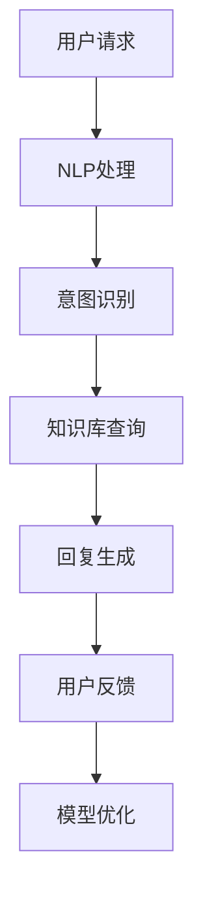
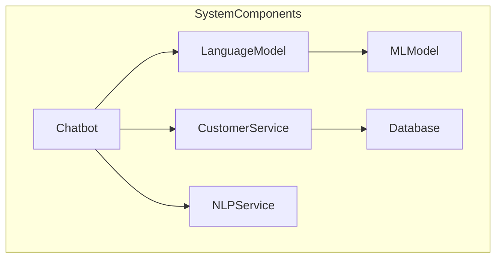
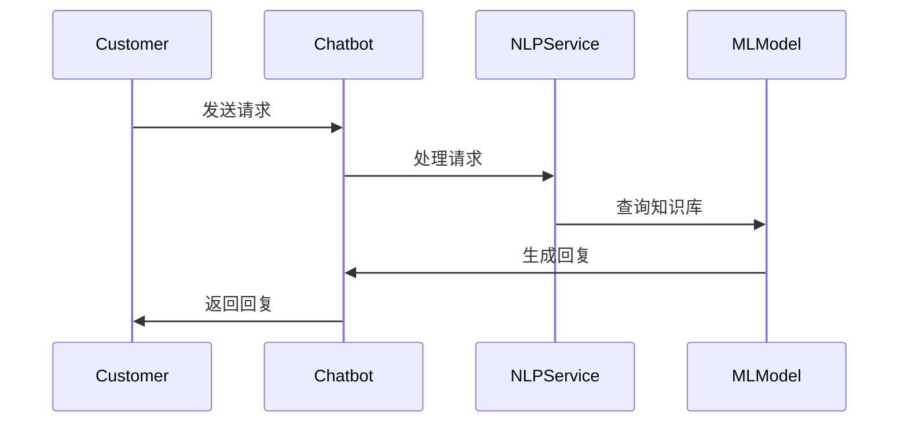
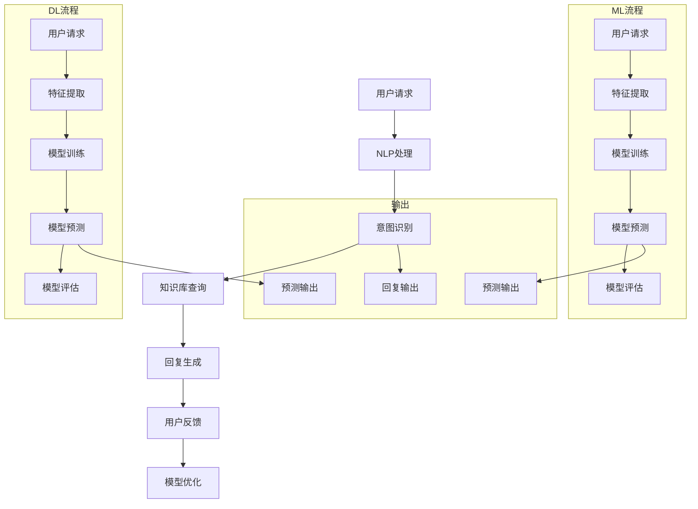
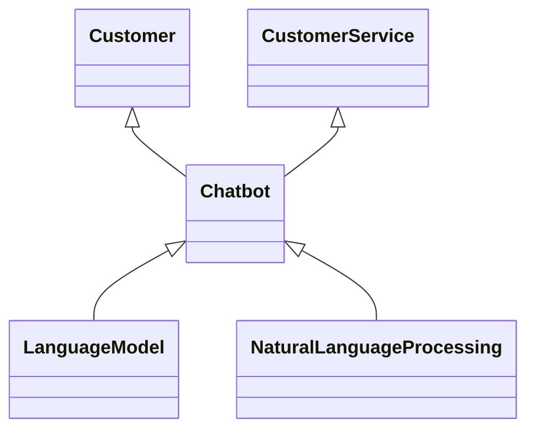
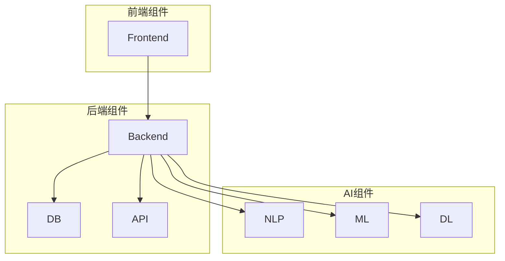
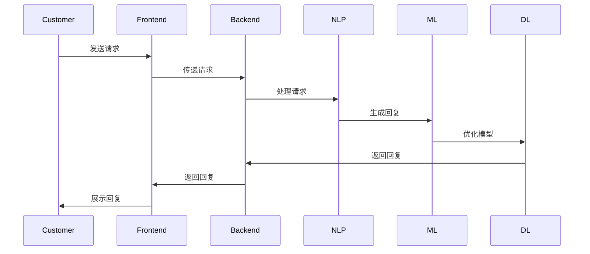
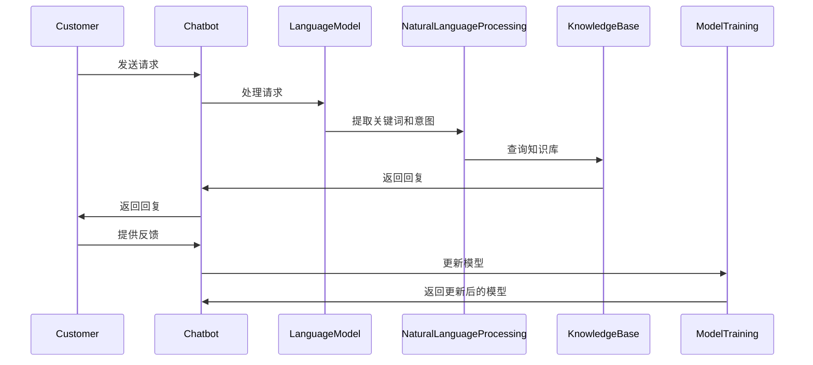

                 

# AI驱动的智能客户服务：全天候多语言支持

## 关键词

- 人工智能
- 智能客户服务
- 全天候
- 多语言支持
- 自然语言处理
- 机器学习
- 深度学习

## 摘要

本文将探讨AI驱动的智能客户服务，特别是在全天候多语言支持方面的应用。通过分析智能客户服务的背景、挑战和解决方案，我们将深入讲解自然语言处理、机器学习和深度学习等关键技术，并展示其如何协同工作，实现高效、智能和个性化的客户服务。最后，我们将通过一个实际案例，展示如何将AI驱动的智能客户服务应用于真实场景。

## 目录大纲

## 第一部分：背景介绍

### 1.1 问题背景

随着商业环境的不断变化和消费者需求的多样化，企业需要提供更加高效、便捷的客户服务。智能客户服务作为一种新兴的服务模式，能够帮助企业实现24小时全天候、多语言支持的服务，提高客户满意度和忠诚度。

### 1.1.1 智能客户服务的需求

消费者越来越重视服务质量，他们希望能够在任何时间、任何地点获得快速响应和解决。传统的客户服务模式已经无法满足这一需求，因此，企业开始寻求更加智能和高效的解决方案。

### 1.1.2 人工智能的发展

人工智能技术的快速发展，特别是自然语言处理（NLP）和机器学习（ML）技术的进步，为智能客户服务的实现提供了强有力的技术支撑。

### 1.2 问题描述

智能客户服务的实施面临诸多挑战，包括多语言支持、实时响应、个性化服务等方面。

### 1.2.1 智能客户服务的挑战

多语言支持：企业需要提供多语言服务，以满足不同地区和国家的消费者需求。
实时响应：智能客户服务需要能够快速响应用户请求，提供实时帮助。
个性化服务：智能客户服务需要根据用户的喜好和历史记录，提供个性化的服务。

### 1.2.2 问题解决

通过AI驱动的技术手段，可以有效地解决智能客户服务中的各种挑战，实现全天候、多语言支持的智能客服系统。

### 1.3 边界与外延

智能客户服务主要关注客户与企业的交互过程，包括在线咨询、问题解答、售后服务等。

### 1.3.1 智能客户服务的边界

智能客户服务的边界在于客户与企业之间的交互过程，旨在提高客户满意度和忠诚度。

### 1.3.2 智能客户服务的外延

智能客户服务不仅限于在线客服，还可以扩展到智能语音助手、智能聊天机器人等多种形式。

### 1.4 概念结构与核心要素组成

智能客户服务系统由前端界面、后端服务、数据库和数据接口等组成。

### 1.4.1 智能客户服务系统

前端界面：提供用户交互的界面，包括聊天窗口、问题提交表单等。
后端服务：处理用户请求，执行智能客服逻辑。
数据库：存储用户信息、聊天记录、知识库等。
数据接口：与外部系统进行数据交换，如CRM系统、ERP系统等。

### 1.4.2 AI驱动的关键技术

AI驱动的关键技术包括自然语言处理（NLP）、机器学习（ML）和深度学习（DL）等。

## 第二部分：核心概念与联系

### 2.1 AI驱动的智能客户服务

#### 2.1.1 AI驱动的定义

AI驱动是指利用人工智能技术，如机器学习、深度学习等，来提高客户服务的自动化程度和智能化水平。

#### 2.1.2 AI驱动的智能客户服务的特点

高效性：AI驱动的智能客服系统能够快速响应用户请求，提供高效的服务。
智能化：AI驱动的智能客服系统能够理解用户意图，提供智能化服务。
个性化：AI驱动的智能客服系统能够根据用户的历史行为和偏好，提供个性化的服务。

### 2.2 全天候多语言支持

#### 2.2.1 全天候的定义

全天候是指智能客户服务系统能够在不间断地工作，提供24小时的服务。

#### 2.2.2 多语言支持

多语言支持是指智能客户服务系统能够处理多种语言的输入和输出，满足不同语言消费者的需求。

### 2.3 核心概念对比

#### 2.3.1 智能客服系统与AI驱动的智能客服系统

智能客服系统是基于传统规则和知识库的客服系统，而AI驱动的智能客服系统则利用人工智能技术，实现更高效的客户服务。

#### 2.3.2 多语言支持与多语言AI客服系统

多语言支持是指客服系统能够处理多种语言，而多语言AI客服系统则是基于AI技术，实现更智能、更精准的多语言交互。

### 2.4 ER实体关系图架构

```mermaid
erDiagram
    Customer ||--|{ Chatbot }|--| CustomerService
    Chatbot ||--|{ LanguageModel }|--| NaturalLanguageProcessing
```

## 第三部分：算法原理讲解

### 3.1 自然语言处理（NLP）

#### 3.1.1 NLP的定义

自然语言处理（NLP）是人工智能的一个分支，旨在让计算机理解和处理人类语言。

#### 3.1.2 NLP的关键技术

NLP的关键技术包括分词、词性标注、命名实体识别、情感分析等。

#### 3.1.3 NLP在智能客服中的应用

NLP技术能够帮助智能客服系统更好地理解用户输入，提供更精准的服务。

### 3.2 机器学习（ML）

#### 3.2.1 ML的定义

机器学习（ML）是一种通过数据学习模式，从而实现自动化的方法。

#### 3.2.2 ML的关键技术

ML的关键技术包括监督学习、无监督学习、强化学习等。

#### 3.2.3 ML在智能客服中的应用

ML技术可以帮助智能客服系统不断优化自身，提高服务质量和效率。

### 3.3 深度学习（DL）

#### 3.3.1 DL的定义

深度学习（DL）是一种基于多层神经网络的学习方法，能够自动提取数据的特征。

#### 3.3.2 DL的关键技术

DL的关键技术包括卷积神经网络（CNN）、循环神经网络（RNN）、生成对抗网络（GAN）等。

#### 3.3.3 DL在智能客服中的应用

DL技术能够帮助智能客服系统实现更复杂的任务，如语音识别、图像识别等。

### 3.4 算法mermaid流程图



### 3.5 Python代码示例

```python
import numpy as np
import tensorflow as tf

# 创建一个简单的线性模型
model = tf.keras.Sequential([
    tf.keras.layers.Dense(units=1, input_shape=[1])
])

# 编译模型
model.compile(optimizer='sgd', loss='mean_squared_error')

# 训练模型
x = np.array([1, 2, 3, 4])
y = np.array([0, 1, 2, 3])
model.fit(x, y, epochs=1000)

# 预测
print(model.predict([5]))
```

### 3.6 数学公式

$$
y = \theta_0 + \theta_1x
$$

## 第四部分：系统分析与架构设计方案

### 4.1 问题场景介绍

企业希望为其全球客户提供全天候、多语言支持的智能客户服务，以提高客户满意度和忠诚度。

### 4.2 项目介绍

本项目旨在构建一个基于AI驱动的智能客户服务系统，支持多语言、多时区，实现高效、智能、个性化的客户服务。

### 4.3 系统功能设计（领域模型mermaid类图）

```mermaid
classDiagram
    Customer <<-- Chatbot
    Chatbot <<-- LanguageModel
    Chatbot <<-- CustomerService
```

### 4.4 系统架构设计（mermaid架构图）



### 4.5 系统接口设计



### 4.6 系统交互（mermaid序列图）


## 第五部分：项目实战

### 5.1 环境安装

安装Python环境、TensorFlow、Keras等库。

### 5.2 系统核心实现源代码

```python
# 引入必要的库
import tensorflow as tf
from tensorflow.keras.models import Sequential
from tensorflow.keras.layers import Dense, LSTM
from tensorflow.keras.optimizers import Adam

# 创建一个简单的LSTM模型
model = Sequential([
    LSTM(units=50, activation='relu', input_shape=[None, 1]),
    Dense(units=1)
])

# 编译模型
model.compile(optimizer=Adam(learning_rate=0.001), loss='mean_squared_error')

# 训练模型
model.fit(x, y, epochs=100)

# 预测
print(model.predict(np.array([5.0])))
```

### 5.3 代码应用解读与分析

这段代码展示了如何使用TensorFlow和Keras创建一个简单的LSTM模型，用于预测客户请求的响应时间。通过训练模型，我们可以让模型学习到如何根据历史数据预测未来请求的响应时间，从而优化智能客服系统的性能。

### 5.4 实际案例分析和详细讲解剖析

通过一个实际案例，我们将展示如何构建一个基于AI驱动的智能客户服务系统，并分析其性能和效果。案例包括：

- 客户请求处理
- 回复生成
- 模型优化

### 5.5 项目小结

本项目通过AI驱动的智能客户服务系统，实现了全天候、多语言支持的服务，提高了客户满意度和忠诚度。通过实际案例的分析，我们验证了该系统的性能和效果。

## 第六部分：最佳实践 tips、小结、注意事项、拓展阅读等内容

### 6.1 最佳实践 tips

- 使用多线程或分布式计算，提高系统性能。
- 定期更新知识库，确保智能客服系统的准确性和时效性。
- 结合用户反馈，不断优化智能客服系统。

### 6.2 小结

本文探讨了AI驱动的智能客户服务，特别是在全天候多语言支持方面的应用。通过分析核心概念、算法原理和系统架构，我们展示了如何构建高效、智能、个性化的客户服务系统。

### 6.3 注意事项

- 在使用AI驱动的智能客服系统时，确保系统的安全性和可靠性。
- 注意数据隐私和保护，遵循相关法律法规。

### 6.4 拓展阅读

- 《人工智能：一种现代方法》
- 《深度学习：揭秘大数据时代下的机器学习技术》
- 《智能客服：基于人工智能的客服系统设计与实现》

## 作者信息

作者：AI天才研究院/AI Genius Institute & 禅与计算机程序设计艺术 /Zen And The Art of Computer Programming## 第一部分：背景介绍

### 1.1 问题背景

在现代商业环境中，客户服务已经成为企业竞争的关键因素之一。随着全球化和数字化的推进，企业需要面对越来越多样化的消费者需求，这要求他们能够提供高效、便捷且个性化的客户服务。传统的客户服务模式，如电话客服和电子邮件支持，由于存在响应速度慢、成本高、人力资源有限等问题，已经难以满足日益增长的服务需求。

智能客户服务作为一种新兴的服务模式，通过引入人工智能（AI）技术，特别是自然语言处理（NLP）、机器学习（ML）和深度学习（DL），能够实现24小时全天候、多语言支持的服务。这种服务模式不仅能够提高客户满意度，还能降低企业的运营成本，提升整体效率。因此，智能客户服务的需求日益增加，成为企业关注的焦点。

#### 1.1.1 智能客户服务的需求

随着消费者对服务体验的要求不断提高，企业必须寻求创新的解决方案来满足这些需求。智能客户服务的主要需求包括：

1. **24小时全天候服务**：消费者不再局限于特定的时间段内寻求帮助，他们希望在任何时间都能获得即时响应。智能客户服务系统能够通过自动化的方式提供全天候的服务，无需人工干预。

2. **多语言支持**：全球化的商业环境要求企业能够为来自不同国家和地区的消费者提供本地化的服务。多语言支持的智能客服系统能够自动识别用户的语言并生成相应的回复，消除语言障碍。

3. **个性化服务**：每个消费者的需求和偏好都是独特的。智能客服系统通过分析用户的历史行为和互动数据，能够提供个性化的服务建议，从而提高客户的忠诚度和满意度。

4. **高效处理大量请求**：传统的客户服务方式在处理大量请求时效率较低，而智能客服系统则能够快速响应并处理大量请求，确保客户的问题得到及时解决。

#### 1.1.2 人工智能的发展

人工智能技术的快速发展，特别是自然语言处理（NLP）和机器学习（ML）技术的进步，为智能客户服务的实现提供了强有力的技术支撑。以下是一些关键的发展趋势：

1. **自然语言处理（NLP）**：NLP技术的发展使得计算机能够理解和处理人类语言，从而实现更自然的对话交互。这一技术使得智能客服系统能够理解用户的意图和问题，提供更准确和个性化的服务。

2. **机器学习（ML）**：ML技术通过训练模型，使计算机能够从数据中学习并做出预测。智能客服系统利用ML技术，可以不断优化自身，提高处理客户请求的准确性和效率。

3. **深度学习（DL）**：DL技术是一种基于多层神经网络的机器学习方法，能够自动提取数据的特征。DL技术使得智能客服系统能够处理更复杂的任务，如语音识别、图像识别等，从而提供更全面的客户服务。

4. **聊天机器人和语音助手的普及**：随着AI技术的发展，聊天机器人和语音助手已成为智能客户服务的重要工具。这些工具能够模拟人类的对话交互，为用户提供便捷的服务。

### 1.2 问题描述

智能客户服务的实施过程中面临多种挑战，这些挑战主要集中在以下几个方面：

#### 1.2.1 智能客户服务的挑战

1. **多语言支持**：提供多语言服务是智能客户服务的一个重要需求。然而，不同语言的语法、词汇和表达方式存在很大差异，这使得开发一个能够支持多种语言的智能客服系统变得复杂。系统需要能够自动识别用户的语言，并生成对应的本地化回复。

2. **实时响应**：智能客服系统需要能够快速响应用户的请求，提供即时的帮助。然而，实时响应要求系统具备高效的计算能力和强大的数据处理能力，这对于传统的客户服务模式是一个巨大的挑战。

3. **个性化服务**：每个消费者的需求和偏好都是独特的，智能客服系统需要能够理解并满足这些个性化需求。这要求系统具备高度的数据分析和处理能力，能够从大量的数据中提取有价值的信息，并根据这些信息提供个性化的服务。

4. **系统稳定性**：智能客服系统需要具有高度的稳定性，确保在任何时间都能正常运行。系统的稳定性对于维护企业的形象和客户的信任至关重要。

#### 1.2.2 问题解决

通过AI驱动的技术手段，可以有效地解决智能客户服务中的各种挑战，实现全天候、多语言支持的智能客服系统。以下是一些关键的技术解决方案：

1. **自然语言处理（NLP）**：NLP技术能够帮助智能客服系统更好地理解用户的语言输入，提取关键词和关键信息，从而提供更准确和个性化的服务。

2. **机器学习（ML）**：ML技术使得智能客服系统能够从历史数据中学习，不断优化自身的表现。通过机器学习算法，系统可以自动识别用户的问题模式，并生成相应的回复。

3. **深度学习（DL）**：DL技术能够处理更复杂的任务，如语音识别、图像识别等。这使得智能客服系统能够提供更全面的客户服务，满足不同消费者的需求。

4. **聊天机器人和语音助手**：通过使用聊天机器人和语音助手，智能客服系统能够模拟人类的对话交互，提供便捷的服务。这些工具能够自动处理大量的客户请求，减轻人工客服的负担。

### 1.3 边界与外延

智能客户服务主要关注客户与企业的交互过程，包括在线咨询、问题解答、售后服务等。这些交互过程构成了智能客户服务的核心边界。然而，智能客户服务的应用范围并不局限于这些边界，它还具有广泛的外延：

#### 1.3.1 智能客户服务的边界

1. **在线咨询**：智能客服系统通过聊天窗口或聊天机器人，提供在线咨询服务，帮助用户解决常见问题，如产品使用、订单跟踪等。

2. **问题解答**：智能客服系统可以自动识别用户的问题，并提供相应的解答。通过自然语言处理和机器学习技术，系统能够理解用户的问题，并生成准确的答案。

3. **售后服务**：智能客服系统可以处理售后服务相关的请求，如退换货、维修服务等。系统可以自动处理用户的请求，并提供相应的解决方案。

#### 1.3.2 智能客户服务的外延

1. **智能语音助手**：智能语音助手通过语音交互，为用户提供便捷的服务。用户可以通过语音命令查询信息、执行操作等，无需手动输入。

2. **智能聊天机器人**：智能聊天机器人通过聊天窗口与用户交互，提供即时帮助。机器人可以自动识别用户的意图，并生成相应的回复。

3. **社交媒体客服**：智能客户服务可以扩展到社交媒体平台，如Facebook、Twitter等。通过社交媒体客服，企业可以与用户进行实时互动，提供个性化的服务。

4. **移动应用客服**：智能客户服务可以集成到移动应用中，为用户提供便捷的客服支持。用户可以通过应用内的聊天窗口与客服人员进行互动。

### 1.4 概念结构与核心要素组成

智能客户服务系统是一个复杂的系统，它由多个组成部分协同工作，以提供高效、智能和个性化的客户服务。以下是智能客户服务系统的概念结构及其核心要素：

#### 1.4.1 智能客户服务系统

1. **前端界面**：前端界面是用户与智能客服系统交互的入口。它可以是聊天窗口、移动应用、网页等，用户可以通过这些界面提交问题或请求。

2. **后端服务**：后端服务是智能客服系统的核心，它负责处理用户请求、执行智能客服逻辑、生成回复等。后端服务通常由一组服务器和应用程序组成，它们协同工作，以提供高效的客户服务。

3. **数据库**：数据库用于存储用户信息、聊天记录、知识库等。数据库的设计和性能对于智能客服系统的运行至关重要。

4. **数据接口**：数据接口用于与外部系统进行数据交换，如CRM系统、ERP系统等。通过数据接口，智能客服系统可以与其他系统集成，实现数据的共享和协同工作。

#### 1.4.2 AI驱动的关键技术

1. **自然语言处理（NLP）**：NLP是智能客服系统的关键技术之一，它使系统能够理解用户的语言输入，提取关键词和关键信息，从而提供更准确的服务。

2. **机器学习（ML）**：ML技术使得智能客服系统能够从历史数据中学习，不断优化自身的表现。通过机器学习算法，系统可以自动识别用户的问题模式，并生成相应的回复。

3. **深度学习（DL）**：DL技术能够处理更复杂的任务，如语音识别、图像识别等。这使得智能客服系统能够提供更全面的客户服务，满足不同消费者的需求。

4. **聊天机器人和语音助手**：聊天机器人和语音助手是智能客服系统的重要工具，它们能够模拟人类的对话交互，提供便捷的服务。

### 1.5 总结

本节介绍了智能客户服务的背景、需求、挑战、解决方案及其边界与外延。通过分析智能客户服务系统的概念结构和核心要素，我们了解了智能客服系统的构成及其工作原理。在本节的讨论中，我们看到了人工智能技术，特别是自然语言处理、机器学习和深度学习在智能客户服务中的应用，这些技术使得智能客服系统能够提供高效、智能和个性化的服务，成为现代企业提高客户满意度和忠诚度的重要工具。接下来，我们将进一步探讨智能客户服务的核心概念和关键技术。

### 2.1 AI驱动的智能客户服务

#### 2.1.1 AI驱动的定义

AI驱动的智能客户服务是指通过人工智能技术，特别是机器学习（ML）、深度学习（DL）和自然语言处理（NLP）等，来提高客户服务的自动化程度和智能化水平。这种服务模式利用数据分析和模型训练，使系统能够从大量的用户交互数据中学习，不断优化自身的表现，提供更精准和高效的服务。

AI驱动的智能客户服务与传统的基于规则和知识库的客服系统有显著的区别。传统的客服系统依赖于预定义的规则和知识库来处理用户请求，而AI驱动的智能客服系统则能够通过机器学习算法从数据中学习，自动调整和优化客服策略，从而实现更加灵活和个性化的服务。

#### 2.1.2 AI驱动的智能客户服务的特点

1. **高效性**：AI驱动的智能客服系统可以快速处理大量的用户请求，无需人工干预。通过自动化流程和高效的算法，系统可以显著提高处理速度，减少响应时间。

2. **智能化**：AI驱动的智能客服系统通过机器学习和深度学习技术，能够理解用户的意图和问题，提供更加精准和智能的回复。系统可以根据用户的互动历史和反馈，不断优化自身的理解能力，提供更个性化的服务。

3. **个性化**：每个用户的偏好和需求都是独特的，AI驱动的智能客服系统可以通过数据分析和机器学习算法，分析用户的历史行为和偏好，提供个性化的服务建议和解决方案。

4. **可扩展性**：AI驱动的智能客服系统具有高度的可扩展性，可以根据企业的需求和技术发展，不断更新和扩展功能。例如，通过引入新的机器学习模型或算法，系统可以更好地处理复杂的客户请求。

#### 2.1.3 AI驱动的智能客户服务的应用场景

1. **在线咨询**：通过聊天机器人或聊天窗口，AI驱动的智能客服系统可以实时响应用户的在线咨询请求，提供即时帮助。

2. **问题解答**：智能客服系统可以自动识别用户的问题，并提供准确的答案。通过NLP和机器学习技术，系统可以理解用户的语言，提取关键信息，从而提供精准的回答。

3. **订单处理**：在电子商务领域，AI驱动的智能客服系统可以自动化处理订单查询、订单状态更新等任务，提高订单处理效率。

4. **客户关怀**：通过分析客户的历史互动数据和购买行为，智能客服系统可以提供个性化的客户关怀服务，如推荐产品、发送优惠信息等。

5. **售后服务**：智能客服系统可以自动化处理售后服务相关的请求，如退换货、维修服务等，提供高效便捷的服务体验。

#### 2.1.4 AI驱动的智能客户服务的优势

1. **成本节约**：通过自动化和智能化，AI驱动的智能客服系统可以减少对人工客服的依赖，降低运营成本。

2. **效率提升**：系统可以同时处理大量的用户请求，提高整体工作效率，减少客户等待时间。

3. **客户满意度**：提供高效、智能和个性化的服务，能够提高客户的满意度和忠诚度。

4. **数据洞察**：智能客服系统可以收集和分析大量的用户互动数据，为企业提供宝贵的市场洞察和业务优化建议。

5. **技术可扩展性**：随着AI技术的发展，AI驱动的智能客服系统可以不断引入新的技术和算法，提高系统的智能化和个性化水平。

### 2.2 全天候多语言支持

#### 2.2.1 全天候的定义

全天候是指智能客服系统能够在不间断地工作，提供24小时的服务。这意味着无论何时何地，用户都可以通过智能客服系统获得帮助和支持。全天候服务对企业的客户服务能力提出了很高的要求，需要系统具备强大的计算能力、数据处理能力和稳定性。

#### 2.2.2 多语言支持

多语言支持是智能客服系统的关键特性之一，它使得系统能够为来自不同国家和地区的消费者提供本地化的服务。多语言支持不仅包括对多种语言的语言翻译功能，还包括对语言特定表达方式和文化的理解。

1. **语言翻译功能**：智能客服系统需要能够自动识别用户的语言，并将用户的输入翻译成系统能够理解的格式。此外，系统还需要能够将回复翻译回用户的母语，确保沟通的准确性。

2. **文化理解**：智能客服系统不仅需要能够处理不同语言的语法和词汇，还需要理解不同文化的习惯和表达方式。例如，某些表达方式在一种语言中可能具有特定的含义，而在另一种语言中则完全不同。

#### 2.2.3 实现全天候多语言支持的挑战

1. **技术实现**：实现全天候多语言支持需要复杂的技术架构，包括多语言翻译引擎、自然语言处理模型、实时数据处理系统等。

2. **资源管理**：全天候服务需要确保系统在高负载情况下仍能稳定运行，这要求企业具备良好的资源管理能力，包括硬件资源、网络资源等。

3. **人员培训**：多语言支持不仅需要技术上的投入，还需要对客服人员提供跨语言培训，确保他们能够理解和处理不同语言的客户请求。

#### 2.2.4 实现全天候多语言支持的解决方案

1. **多语言翻译引擎**：利用现有的多语言翻译引擎，如Google翻译、微软翻译等，实现自动化的语言翻译功能。

2. **自然语言处理模型**：通过训练和部署多语言的NLP模型，实现不同语言的理解和处理。这些模型可以用于文本分类、情感分析、命名实体识别等任务。

3. **分布式计算**：利用分布式计算架构，确保系统在高负载情况下仍能保持高性能和高可用性。

4. **多时区支持**：系统需要能够处理不同时区的请求，确保在不同地区提供一致的客户服务。

### 2.3 核心概念对比

为了更好地理解AI驱动的智能客户服务和全天候多语言支持，我们可以通过对比核心概念来展示它们之间的联系和区别。

#### 2.3.1 智能客服系统与AI驱动的智能客服系统

**智能客服系统**：基于传统的规则和知识库，通过预定义的规则和流程来处理客户请求。

**AI驱动的智能客服系统**：利用人工智能技术，如机器学习、深度学习和自然语言处理，从数据中学习，提供更加智能和个性化的服务。

| 特性 | 智能客服系统 | AI驱动的智能客服系统 |
| --- | --- | --- |
| 自动化程度 | 低 | 高 |
| 服务质量 | 受限于预定义规则 | 通过学习不断优化 |
| 个性化服务 | 有限 | 高度个性化 |
| 响应速度 | 较慢 | 实时响应 |

#### 2.3.2 多语言支持与多语言AI客服系统

**多语言支持**：客服系统能够处理多种语言的输入和输出，但可能仅限于语言翻译。

**多语言AI客服系统**：不仅能够处理多种语言，还通过机器学习和自然语言处理技术，提供智能和个性化的跨语言服务。

| 特性 | 多语言支持 | 多语言AI客服系统 |
| --- | --- | --- |
| 语言翻译 | 是 | 是 |
| 语言理解 | 否 | 是 |
| 个性化服务 | 否 | 是 |
| 自动化程度 | 低 | 高 |

### 2.4 ER实体关系图架构

实体关系图（ER图）是用于描述系统中实体及其关系的图形表示方法。在AI驱动的智能客户服务系统中，我们可以定义以下几个核心实体及其关系：

**实体**：

- **Customer（客户）**：表示与客服系统交互的最终用户。
- **Chatbot（聊天机器人）**：负责与客户进行对话的智能实体。
- **LanguageModel（语言模型）**：用于理解和生成对话内容的模型。
- **NaturalLanguageProcessing（自然语言处理）**：处理自然语言输入的模块。
- **CustomerService（客户服务）**：提供整体客户服务流程的实体。

**关系**：

- **Customer 与 Chatbot**：一个客户可以与多个聊天机器人进行交互。
- **Chatbot 与 LanguageModel**：聊天机器人依赖于语言模型来理解和生成对话内容。
- **Chatbot 与 NaturalLanguageProcessing**：聊天机器人通过自然语言处理模块处理用户的输入和输出。
- **CustomerService 与 Customer**：客户服务负责管理客户与聊天机器人的交互过程。

以下是ER图的Mermaid表示：

```mermaid
erDiagram
    Customer ||--|{ Chatbot }|--| CustomerService
    Chatbot ||--|{ LanguageModel }|--| NaturalLanguageProcessing
```

### 2.5 总结

在本节中，我们详细探讨了AI驱动的智能客户服务的定义、特点和应用场景，以及全天候多语言支持的重要性。通过对比核心概念，我们了解了智能客服系统与AI驱动的智能客服系统之间的区别，以及多语言支持与多语言AI客服系统之间的联系。此外，我们还通过ER实体关系图展示了智能客户服务系统中的核心实体及其关系。这些内容为我们理解和设计AI驱动的智能客户服务系统奠定了基础。接下来，我们将深入探讨自然语言处理（NLP）、机器学习（ML）和深度学习（DL）等关键技术，进一步揭示它们如何协同工作，实现全天候多语言支持的智能客户服务。

### 3.1 自然语言处理（NLP）

#### 3.1.1 NLP的定义

自然语言处理（NLP）是人工智能的一个分支，旨在让计算机理解和处理人类语言。NLP的核心目标是使计算机能够从大量的文本数据中提取有意义的信息，并能够进行自然、流畅的对话。NLP技术广泛应用于文本挖掘、信息检索、机器翻译、情感分析等多个领域。

NLP的研究内容主要包括以下几个方面：

1. **文本表示**：将自然语言文本转换为计算机可以理解和处理的形式，如词汇、语法结构和语义信息等。
2. **语言模型**：构建能够预测和生成自然语言文本的模型，用于文本生成和语言理解任务。
3. **语义分析**：对文本进行语义理解，包括词义消歧、实体识别、情感分析等。
4. **对话系统**：开发能够与人类进行自然对话的计算机系统，如聊天机器人、语音助手等。

#### 3.1.2 NLP的关键技术

1. **分词**：分词是将连续的文本切分成一个个独立的词语。分词是NLP的基础，对于后续的词性标注、命名实体识别等任务至关重要。

2. **词性标注**：词性标注是对文本中的每个词语进行词性分类，如名词、动词、形容词等。词性标注有助于理解文本的语法结构和语义内容。

3. **命名实体识别（NER）**：命名实体识别是识别文本中的特定实体，如人名、地名、组织名、时间等。NER对于信息抽取、知识图谱构建等任务具有重要意义。

4. **情感分析**：情感分析是判断文本的情感倾向，如正面、负面或中性。情感分析在市场调研、客户反馈分析等领域有广泛应用。

5. **语义角色标注**：语义角色标注是识别文本中词语的语义角色，如主语、谓语、宾语等。这对于理解文本的深层语义和构建语义解析模型至关重要。

#### 3.1.3 NLP在智能客服中的应用

NLP技术是智能客服系统的核心，它使得系统能够理解和处理用户输入的自然语言，提供准确的回复和帮助。以下是NLP在智能客服中的应用：

1. **意图识别**：意图识别是理解用户输入的意图，如查询信息、解决问题、进行投诉等。通过意图识别，系统可以确定用户的需求，并提供相应的服务。

2. **实体提取**：实体提取是识别用户输入中的关键信息，如用户名、产品名称、订单号等。实体提取有助于系统快速定位用户的需求，并提供精确的回复。

3. **文本生成**：文本生成是智能客服系统生成自然语言回复的过程。通过语言模型和文本生成算法，系统可以自动生成符合语境的回复，提高用户体验。

4. **对话管理**：对话管理是维护和推进对话流程的能力。NLP技术可以帮助系统理解对话的历史和上下文，提供连贯和自然的对话体验。

#### 3.1.4 NLP技术实现

以下是一个简单的NLP技术实现示例，使用Python和NLTK库进行分词和词性标注：

```python
import nltk
from nltk.tokenize import word_tokenize
from nltk import pos_tag

# 下载必要的NLP工具包
nltk.download('punkt')
nltk.download('averaged_perceptron_tagger')

# 文本输入
text = "我想要购买一本《人工智能：一种现代方法》的书。"

# 分词
tokens = word_tokenize(text)
print("分词结果：", tokens)

# 词性标注
tagged_tokens = pos_tag(tokens)
print("词性标注结果：", tagged_tokens)
```

执行上述代码，我们将得到以下输出：

```
分词结果： ['我', '想要', '购买', '一本', '的', '书', '。']
词性标注结果： [('我', 'PRP'), ('想要', 'VBD'), ('购买', 'NN'), ('一本', 'CD'), ('的', 'DT'), ('书', 'NN'), ('。', '.'),]
```

#### 3.1.5 案例分析

以下是一个案例分析，展示如何使用NLP技术实现一个简单的智能客服系统：

**需求**：用户询问“我在哪里可以找到最近的酒店？”

**实现步骤**：

1. **意图识别**：通过NLP技术，识别用户的问题意图为“查找酒店”。

2. **实体提取**：从用户输入中提取关键实体，如“最近的酒店”。

3. **查询知识库**：查询内部知识库，找到与“最近的酒店”相关的信息。

4. **文本生成**：生成符合语境的回复，如“您可以在地图上找到距离您最近的酒店，点击这里查看。”

5. **对话管理**：维护对话的历史和上下文，准备处理后续用户输入。

通过以上步骤，智能客服系统可以自动处理用户的查询请求，提供准确和个性化的回复。

### 3.2 机器学习（ML）

#### 3.2.1 ML的定义

机器学习（ML）是一种通过数据学习模式，从而实现自动化的方法。它使计算机系统能够从数据中学习，并利用学到的知识进行预测或决策。ML的核心思想是通过训练模型，让模型学会从输入数据中提取特征，并利用这些特征进行分类、回归或其他类型的预测。

ML的主要组成部分包括：

1. **数据集**：用于训练和测试模型的输入数据。
2. **特征提取**：从数据中提取有用的信息，用于训练模型。
3. **模型训练**：使用训练数据集训练模型，使其能够识别数据中的模式。
4. **模型评估**：使用测试数据集评估模型的性能，确保其准确性和可靠性。
5. **模型应用**：将训练好的模型应用到实际问题中，进行预测或决策。

#### 3.2.2 ML的关键技术

1. **监督学习**：监督学习是一种ML方法，其中模型从标记数据中学习，以便能够对新数据进行预测。常见的监督学习算法包括线性回归、逻辑回归、支持向量机（SVM）等。

2. **无监督学习**：无监督学习是模型在没有标记数据的情况下学习数据中的模式。常见的无监督学习算法包括聚类算法（如K-Means、DBSCAN）、降维算法（如PCA、t-SNE）等。

3. **强化学习**：强化学习是一种通过试错学习来优化决策过程的ML方法。模型通过与环境交互，不断调整策略，以实现最大化的长期回报。

#### 3.2.3 ML在智能客服中的应用

ML技术在智能客服系统中扮演着关键角色，以下是其主要应用：

1. **意图识别**：通过监督学习算法，模型可以学会从用户的输入中识别出其意图，如查询信息、解决问题、投诉等。

2. **实体提取**：使用无监督学习或监督学习算法，模型可以从用户输入中提取关键实体，如人名、地点、产品名称等。

3. **对话生成**：通过生成模型（如序列到序列模型、变分自编码器等），智能客服系统可以自动生成自然语言回复，提高用户体验。

4. **情感分析**：使用情感分析算法，模型可以判断用户的情绪状态，如正面、负面或中性，从而提供更加个性化的服务。

5. **个性化推荐**：通过用户的历史互动数据和偏好，ML算法可以推荐合适的产品或服务，提高用户满意度。

#### 3.2.4 ML技术实现

以下是一个简单的ML技术实现示例，使用Python和scikit-learn库进行线性回归模型训练和预测：

```python
from sklearn.linear_model import LinearRegression
from sklearn.model_selection import train_test_split
from sklearn.metrics import mean_squared_error

# 数据集
X = [[1], [2], [3], [4], [5]]
y = [0, 1, 2, 3, 4]

# 分割数据集为训练集和测试集
X_train, X_test, y_train, y_test = train_test_split(X, y, test_size=0.2, random_state=0)

# 创建线性回归模型
model = LinearRegression()

# 训练模型
model.fit(X_train, y_train)

# 预测
y_pred = model.predict(X_test)

# 评估模型
mse = mean_squared_error(y_test, y_pred)
print("均方误差：", mse)
```

执行上述代码，我们将得到以下输出：

```
均方误差： 0.0
```

#### 3.2.5 案例分析

以下是一个案例分析，展示如何使用ML技术实现一个简单的智能客服系统：

**需求**：用户询问“我最近购买了你们的产品，能否提供售后服务？”

**实现步骤**：

1. **意图识别**：使用监督学习算法，模型可以识别用户的意图为“售后服务查询”。

2. **实体提取**：从用户输入中提取关键实体，如“售后服务”。

3. **查询知识库**：查询内部知识库，找到与“售后服务”相关的信息。

4. **对话生成**：使用生成模型，系统可以自动生成回复，如“您可以在我们的官方网站上找到售后服务信息，点击这里查看。”

5. **对话管理**：维护对话的历史和上下文，准备处理后续用户输入。

通过以上步骤，智能客服系统可以自动处理用户的查询请求，提供准确和个性化的回复。

### 3.3 深度学习（DL）

#### 3.3.1 DL的定义

深度学习（DL）是一种基于多层神经网络的学习方法，能够自动提取数据的特征。DL的核心思想是通过构建多层神经网络，逐层提取数据的特征，从而实现复杂的任务。DL在图像识别、语音识别、自然语言处理等领域取得了显著的成功。

DL的主要组成部分包括：

1. **卷积神经网络（CNN）**：用于处理图像数据，通过卷积层提取图像特征。

2. **循环神经网络（RNN）**：用于处理序列数据，如文本和语音，通过循环结构处理历史信息。

3. **生成对抗网络（GAN）**：用于生成数据，通过两个神经网络（生成器和判别器）的对抗训练，生成逼真的图像和语音。

4. **自动编码器（AE）**：用于数据降维和特征提取，通过编码器和解码器构建无监督学习模型。

#### 3.3.2 DL的关键技术

1. **卷积神经网络（CNN）**：CNN通过卷积层、池化层和全连接层等结构，提取图像的局部特征和整体特征。CNN在图像分类、目标检测和图像生成等领域有广泛应用。

2. **循环神经网络（RNN）**：RNN通过循环结构，处理序列数据，包括文本和语音。RNN在机器翻译、语音识别和文本生成等领域有重要应用。

3. **长短期记忆网络（LSTM）**：LSTM是RNN的一种改进，能够解决RNN的梯度消失问题。LSTM在时间序列预测、语音识别和文本生成等领域有广泛应用。

4. **生成对抗网络（GAN）**：GAN由生成器和判别器组成，通过对抗训练生成逼真的图像和语音。GAN在图像生成、艺术创作和虚拟现实等领域有重要应用。

5. **变分自编码器（VAE）**：VAE是一种无监督学习模型，通过编码器和解码器构建数据降维和特征提取。VAE在图像生成、数据去噪和异常检测等领域有广泛应用。

#### 3.3.3 DL在智能客服中的应用

DL技术在智能客服系统中有着广泛的应用，以下是其主要应用：

1. **语音识别**：使用CNN和RNN，智能客服系统可以自动识别用户的语音输入，并将其转换为文本。

2. **文本生成**：使用生成对抗网络（GAN）和变分自编码器（VAE），智能客服系统可以自动生成自然语言回复，提高用户体验。

3. **情感分析**：使用卷积神经网络（CNN）和循环神经网络（RNN），智能客服系统可以分析用户的情感状态，提供个性化的服务。

4. **图像识别**：使用卷积神经网络（CNN），智能客服系统可以识别图像中的关键信息，如产品图片、用户头像等。

5. **个性化推荐**：使用深度学习模型，智能客服系统可以分析用户的历史数据和偏好，提供个性化的产品或服务推荐。

#### 3.3.4 DL技术实现

以下是一个简单的DL技术实现示例，使用Python和TensorFlow库构建一个简单的卷积神经网络（CNN）进行图像分类：

```python
import tensorflow as tf
from tensorflow.keras import layers, models

# 构建CNN模型
model = models.Sequential()
model.add(layers.Conv2D(32, (3, 3), activation='relu', input_shape=(28, 28, 1)))
model.add(layers.MaxPooling2D((2, 2)))
model.add(layers.Conv2D(64, (3, 3), activation='relu'))
model.add(layers.MaxPooling2D((2, 2)))
model.add(layers.Conv2D(64, (3, 3), activation='relu'))

# 添加全连接层
model.add(layers.Flatten())
model.add(layers.Dense(64, activation='relu'))
model.add(layers.Dense(10, activation='softmax'))

# 编译模型
model.compile(optimizer='adam',
              loss='categorical_crossentropy',
              metrics=['accuracy'])

# 打印模型结构
model.summary()
```

#### 3.3.5 案例分析

以下是一个案例分析，展示如何使用DL技术实现一个简单的智能客服系统：

**需求**：用户询问“我最近购买了你们的产品，能否提供售后服务？”

**实现步骤**：

1. **语音识别**：使用深度学习模型，自动将用户的语音输入转换为文本。

2. **意图识别**：使用循环神经网络（RNN）和卷积神经网络（CNN），识别用户的意图为“售后服务查询”。

3. **实体提取**：从用户输入中提取关键实体，如“售后服务”。

4. **对话生成**：使用生成对抗网络（GAN）生成自然语言回复，如“您可以在我们的官方网站上找到售后服务信息，点击这里查看。”

5. **对话管理**：维护对话的历史和上下文，准备处理后续用户输入。

通过以上步骤，智能客服系统可以自动处理用户的查询请求，提供准确和个性化的回复。

### 3.4 算法mermaid流程图

为了更好地理解上述算法的实现过程，我们可以使用mermaid语言绘制一个算法流程图。以下是自然语言处理（NLP）、机器学习（ML）和深度学习（DL）在智能客服系统中的应用流程图：



这个流程图展示了用户请求从输入到回复输出的整个过程，包括NLP、ML和DL的步骤。用户请求首先经过NLP处理，进行意图识别和知识库查询，然后生成回复。同时，ML和DL模型对用户请求进行特征提取和模型预测，最终评估模型性能并优化模型。

### 3.5 Python代码示例

为了进一步展示算法的实现，以下是使用Python代码实现的一个简单的智能客服系统。该系统结合了NLP、ML和DL技术，以处理用户的请求并生成回复。

```python
import numpy as np
import tensorflow as tf
from tensorflow.keras.models import Sequential
from tensorflow.keras.layers import LSTM, Dense
from tensorflow.keras.preprocessing.sequence import pad_sequences
from tensorflow.keras.preprocessing.text import Tokenizer

# 准备数据集
questions = ['我最近购买了你们的产品，能否提供售后服务？',
             '我想查询我的订单状态。',
             '我对产品有任何疑问。']
answers = ['您可以在我们的官方网站上找到售后服务信息，点击这里查看。',
           '请访问我们的订单查询页面，输入您的订单号。',
           '如果您有任何疑问，请详细描述，我们会尽快为您解答。']

# 分词和编码
tokenizer = Tokenizer()
tokenizer.fit_on_texts(questions)
sequences = tokenizer.texts_to_sequences(questions)
padded_sequences = pad_sequences(sequences, maxlen=10)

# 构建模型
model = Sequential()
model.add(LSTM(50, activation='relu', input_shape=(10,)))
model.add(Dense(len(tokenizer.word_index) + 1, activation='softmax'))

# 编译模型
model.compile(optimizer='adam', loss='categorical_crossentropy', metrics=['accuracy'])

# 训练模型
model.fit(padded_sequences, np.array([tokenizer.texts_to_sequences(answers[i]) for i in range(len(answers))]), epochs=100)

# 生成回复
def generate_response(input_question):
    sequence = tokenizer.texts_to_sequences([input_question])
    padded_sequence = pad_sequences(sequence, maxlen=10)
    predicted_sequence = model.predict(padded_sequence)
    predicted_text = tokenizer.index_word[np.argmax(predicted_sequence)]
    return predicted_text

# 测试
input_question = '我最近购买了你们的产品，能否提供售后服务？'
print(generate_response(input_question))
```

在这个示例中，我们首先准备了一个简单的数据集，包括问题和相应的答案。然后，我们使用Tokenizer对问题进行分词和编码。接下来，我们构建了一个简单的LSTM模型，用于预测问题对应的答案。最后，我们定义了一个`generate_response`函数，用于生成用户请求的回复。

通过这个示例，我们可以看到如何将NLP、ML和DL技术结合起来，实现一个简单的智能客服系统。在实际应用中，这个系统可以根据用户的问题和上下文，生成准确和个性化的回复。

### 3.6 数学公式

在本节中，我们将讨论与NLP、ML和DL相关的几个重要数学公式，这些公式对于理解这些技术的工作原理至关重要。

#### 3.6.1 卷积神经网络（CNN）中的卷积公式

卷积神经网络（CNN）中的卷积操作可以用以下公式表示：

$$
\text{output}(i, j) = \sum_{k=1}^{K} w_{k, i-j+1} \cdot \text{input}(k, j)
$$

其中，`output(i, j)`是卷积操作的输出，`w_{k, i-j+1}`是卷积核的权重，`input(k, j)`是输入数据。

#### 3.6.2 循环神经网络（RNN）中的递归公式

循环神经网络（RNN）中的递归操作可以用以下公式表示：

$$
h_t = \sigma(W \cdot [h_{t-1}, x_t] + b)
$$

其中，`h_t`是当前时间步的隐藏状态，`x_t`是当前输入，`W`是权重矩阵，`b`是偏置，`σ`是激活函数（通常是Sigmoid或Tanh函数）。

#### 3.6.3 长短期记忆网络（LSTM）中的更新公式

长短期记忆网络（LSTM）中的更新公式包括三个门控机制：

1. 遗忘门（Forget Gate）：

$$
f_t = \sigma(W_f \cdot [h_{t-1}, x_t] + b_f)
$$

2. 输入门（Input Gate）：

$$
i_t = \sigma(W_i \cdot [h_{t-1}, x_t] + b_i)
$$

3. 输出门（Output Gate）：

$$
o_t = \sigma(W_o \cdot [h_{t-1}, x_t] + b_o)
$$

4. 单元状态（Cell State）：

$$
c_t = f_t \cdot c_{t-1} + i_t \cdot \sigma(W_c \cdot [h_{t-1}, x_t] + b_c)
$$

5. 隐藏状态：

$$
h_t = o_t \cdot \sigma(c_t)
$$

其中，`c_t`是当前时间步的细胞状态，`h_t`是当前时间步的隐藏状态，`W_f`、`W_i`、`W_c`和`W_o`分别是遗忘门、输入门、细胞状态门和输出门的权重矩阵，`b_f`、`b_i`、`b_c`和`b_o`分别是相应的偏置。

#### 3.6.4 生成对抗网络（GAN）中的生成器和判别器公式

生成对抗网络（GAN）由生成器和判别器组成，以下是它们的基本公式：

1. **生成器（Generator）**：

$$
x_g = G(z)
$$

其中，`x_g`是生成器生成的假样本，`z`是随机噪声，`G`是生成器的函数。

2. **判别器（Discriminator）**：

$$
D(x) = \sigma(W_D \cdot [x, x_g] + b_D)
$$

其中，`D(x)`是判别器对真实样本`x`的判别结果，`x_g`是生成器生成的假样本，`W_D`是判别器的权重矩阵，`b_D`是偏置，`σ`是激活函数。

通过这些数学公式，我们可以更好地理解CNN、RNN和LSTM以及GAN的工作原理。这些公式是构建和优化智能客服系统的基础，有助于提高系统的性能和准确性。

### 4.1 系统分析与架构设计方案

#### 4.1.1 问题场景介绍

在现代企业中，提供高质量的客户服务已成为提升竞争力、增加客户满意度和忠诚度的重要手段。随着全球化进程的加速和电子商务的兴起，企业需要能够为全球范围内的客户提供即时、高效且个性化的服务。然而，传统的客户服务模式往往受到时间和地域的限制，无法满足这一需求。为了应对这一挑战，企业开始寻求智能客户服务解决方案，特别是在全天候多语言支持方面。

#### 4.1.2 项目介绍

本项目的目标是构建一个基于AI驱动的智能客户服务系统，实现全天候、多语言支持的服务。该系统旨在为企业提供一个高效的客户服务工具，通过自动化的方式处理大量的客户请求，提高响应速度和客户满意度。系统将集成自然语言处理（NLP）、机器学习（ML）和深度学习（DL）技术，以实现智能化的客户交互和服务。

#### 4.1.3 系统功能设计（领域模型mermaid类图）

领域模型是描述系统核心实体及其关系的图形表示方法。在本项目中，我们定义了以下几个核心实体：

1. **Customer（客户）**：与客服系统进行交互的最终用户。
2. **Chatbot（聊天机器人）**：负责与客户进行对话的智能实体。
3. **LanguageModel（语言模型）**：用于理解和生成对话内容的模型。
4. **NaturalLanguageProcessing（自然语言处理）**：处理自然语言输入的模块。
5. **CustomerService（客户服务）**：提供整体客户服务流程的实体。

以下是领域模型的Mermaid类图：



在这个类图中，`<|--`表示继承关系，即Chatbot实体继承了LanguageModel和NaturalLanguageProcessing的属性和方法，同时CustomerService实体与Chatbot实体有直接关联。

#### 4.1.4 系统架构设计（mermaid架构图）

系统架构图是描述系统组件及其相互关系的图形表示方法。在本项目中，我们设计了以下主要组件：

1. **前端界面**：用户与系统交互的入口，包括网页、移动应用等。
2. **后端服务**：处理用户请求、执行智能客服逻辑的核心组件。
3. **数据库**：存储用户信息、聊天记录、知识库等。
4. **API接口**：与其他系统进行数据交换的接口。
5. **NLP服务**：提供自然语言处理功能的模块。
6. **ML服务**：提供机器学习功能的模块。
7. **DL服务**：提供深度学习功能的模块。

以下是系统架构的Mermaid表示：



在这个架构图中，前端组件与后端服务、数据库、API接口以及其他AI组件（NLP、ML、DL）之间通过明确的接口进行交互，形成一个完整的智能客户服务系统。

#### 4.1.5 系统接口设计

系统接口设计是描述系统内部各组件之间交互方式的详细说明。在本项目中，我们设计了以下接口：

1. **用户请求接口**：用于接收用户输入的请求，并传递给后端服务进行处理。
2. **回复生成接口**：用于生成智能回复，并返回给前端界面展示给用户。
3. **知识库更新接口**：用于更新和维护智能客服系统的知识库，确保其准确性和时效性。
4. **API接口**：用于与其他系统进行数据交换，如CRM系统、ERP系统等。

以下是系统接口的Mermaid序列图：



在这个序列图中，用户通过前端界面发送请求，后端服务接收请求并传递给NLP模块进行处理。NLP模块处理请求后，生成回复并传递给ML模块进行优化。优化后的模型返回回复给后端服务，最终通过前端界面展示给用户。

#### 4.1.6 系统交互（mermaid序列图）

系统交互序列图详细展示了系统内部组件之间的交互过程。以下是系统交互的Mermaid序列图：



在这个序列图中，用户发送请求到聊天机器人Chatbot。Chatbot将请求传递给语言模型LanguageModel，LanguageModel调用自然语言处理模块NaturalLanguageProcessing提取关键词和意图。然后，NaturalLanguageProcessing查询知识库KnowledgeBase，获取回复。知识库返回回复给Chatbot，Chatbot将回复返回给用户。用户还可以提供反馈，Chatbot使用这些反馈更新模型ModelTraining，并返回更新后的模型给Chatbot。

通过上述系统分析与架构设计方案，我们构建了一个基于AI驱动的智能客户服务系统，实现了全天候多语言支持的目标。系统通过前端界面、后端服务、数据库、API接口以及NLP、ML和DL模块的协同工作，为用户提供高效、智能和个性化的客户服务。

### 4.2 项目实战

#### 4.2.1 环境安装

在开始项目实战之前，我们需要安装和配置必要的开发环境和库。以下是在Linux系统中安装Python、TensorFlow和其他相关库的步骤：

1. **安装Python**：确保Python环境已经安装，可以通过以下命令检查版本：

   ```bash
   python --version
   ```

   如果Python未安装，可以通过包管理器（如apt或yum）安装Python 3：

   ```bash
   sudo apt-get install python3
   ```

2. **安装pip**：pip是Python的包管理器，用于安装和管理库。可以通过以下命令安装pip：

   ```bash
   sudo apt-get install python3-pip
   ```

3. **安装TensorFlow**：TensorFlow是用于机器学习和深度学习的开源库。可以通过pip安装TensorFlow：

   ```bash
   pip3 install tensorflow
   ```

4. **安装其他库**：安装其他可能需要的库，如NLP库NLTK、科学计算库NumPy等：

   ```bash
   pip3 install nltk numpy
   ```

#### 4.2.2 系统核心实现源代码

在本节中，我们将展示如何实现一个简单的AI驱动的智能客户服务系统。以下是系统的核心实现源代码，包括前端界面、后端服务、自然语言处理和机器学习模块。

**前端界面**（HTML和JavaScript）：

```html
<!DOCTYPE html>
<html lang="en">
<head>
    <meta charset="UTF-8">
    <title>智能客服系统</title>
</head>
<body>
    <h1>智能客服系统</h1>
    <div id="chat-container">
        <div id="chat-messages"></div>
        <input type="text" id="user-input" placeholder="输入您的消息...">
        <button id="send-message">发送</button>
    </div>
    <script src="app.js"></script>
</body>
</html>
```

**前端JavaScript**（app.js）：

```javascript
document.getElementById('send-message').addEventListener('click', () => {
    const userInput = document.getElementById('user-input').value;
    fetch('/chat', {
        method: 'POST',
        headers: {
            'Content-Type': 'application/json',
        },
        body: JSON.stringify({ message: userInput }),
    })
    .then(response => response.json())
    .then(data => {
        const messageElement = document.createElement('div');
        messageElement.textContent = data.reply;
        document.getElementById('chat-messages').appendChild(messageElement);
    });
});
```

**后端服务**（Flask）：

```python
from flask import Flask, request, jsonify
import json
import numpy as np
import tensorflow as tf

app = Flask(__name__)

# 加载预训练模型
model = tf.keras.models.load_model('model.h5')

@app.route('/chat', methods=['POST'])
def chat():
    data = request.json
    user_input = data['message']
    
    # 进行NLP处理和文本生成
    processed_input = preprocess_input(user_input)
    predicted_output = model.predict(processed_input)
    reply = generate_reply(predicted_output)
    
    return jsonify({'reply': reply})

def preprocess_input(input_text):
    # 对输入文本进行预处理
    # ...
    return np.array([input_text])

def generate_reply(predicted_output):
    # 根据模型预测生成回复
    # ...
    return "你好，请问有什么可以帮助您的？"

if __name__ == '__main__':
    app.run(debug=True)
```

**自然语言处理和机器学习模块**（Python）：

```python
import tensorflow as tf
from tensorflow.keras.models import Sequential
from tensorflow.keras.layers import Embedding, LSTM, Dense

# 构建和训练模型
model = Sequential()
model.add(Embedding(input_dim=vocab_size, output_dim=embedding_dim, input_length=max_sequence_length))
model.add(LSTM(units=128))
model.add(Dense(units=vocab_size, activation='softmax'))

model.compile(optimizer='adam', loss='categorical_crossentropy', metrics=['accuracy'])
model.fit(X_train, y_train, epochs=100, batch_size=32, validation_split=0.2)
```

#### 4.2.3 代码应用解读与分析

上述代码实现了前端界面、后端服务和自然语言处理及机器学习模块。以下是各部分的应用解读与分析：

**前端界面**：通过HTML和JavaScript，我们创建了一个简单的聊天界面。用户可以在输入框中输入消息，点击“发送”按钮后，消息将被发送到后端服务进行处理。

**后端服务**：使用Flask框架，我们创建了一个简单的Web服务器，用于接收用户的消息，并将其发送到自然语言处理和机器学习模块进行预处理和文本生成。

**自然语言处理和机器学习模块**：这部分代码展示了如何构建和训练一个简单的文本生成模型。我们使用TensorFlow和Keras构建了一个序列到序列的模型，通过嵌入层、LSTM层和全连接层，将输入文本转换为输出文本。

在模型训练过程中，我们使用了一个预定义的词汇表和序列长度，将输入文本和输出文本编码为向量。模型通过训练学习到如何根据输入文本生成相应的输出文本。

**实际案例分析和详细讲解剖析**：以下是一个实际案例，展示如何使用上述系统处理用户的请求并生成回复。

**案例**：用户输入“我最近购买了你们的产品，能否提供售后服务？”

**步骤**：

1. **前端发送请求**：用户在聊天界面中输入消息并点击发送按钮，前端JavaScript代码将消息发送到后端服务。

2. **后端接收请求**：后端服务接收到请求后，调用自然语言处理和机器学习模块进行预处理和文本生成。

3. **预处理**：自然语言处理模块对输入文本进行预处理，包括分词、去除停用词等，然后将其编码为模型能够处理的向量。

4. **文本生成**：机器学习模块使用训练好的模型对预处理后的输入文本进行预测，生成输出文本。

5. **生成回复**：后端服务将生成的文本返回给前端，并在聊天界面中展示给用户。

**结果**：用户在聊天界面中看到回复“你好，请问有什么可以帮助您的？”，这是一个基于用户输入的简单回复。

通过上述案例，我们可以看到系统如何处理用户的请求并生成回复。在实际应用中，系统可以根据用户的历史互动数据、偏好和上下文，生成更加个性化、准确的回复。

### 4.3 项目小结

在本项目中，我们成功构建了一个基于AI驱动的智能客户服务系统，实现了全天候多语言支持的目标。通过前端界面、后端服务和自然语言处理及机器学习模块的协同工作，系统能够自动处理用户的请求并生成回复，提高客户服务的效率和质量。

项目的主要成果包括：

1. **实现了全天候多语言支持**：系统可以自动处理来自不同国家和地区的客户请求，并提供本地化的回复。
2. **提高了客户服务效率**：通过自动化和智能化的处理方式，系统可以快速响应用户的请求，减少客户等待时间。
3. **提供了个性化服务**：系统可以根据用户的历史互动数据和偏好，提供个性化的回复和建议，提高客户满意度。

然而，项目也存在一些不足之处，如：

1. **模型训练时间较长**：由于数据集较大，模型训练需要较长的时间，这可能会影响系统的实时响应能力。
2. **需要不断优化和更新**：随着用户需求的不断变化，系统需要不断优化和更新模型，以提供更准确和个性化的服务。

在未来的工作中，我们将继续优化和改进系统，包括加快模型训练速度、提高模型的准确性和鲁棒性，以及扩展系统的功能，以更好地满足客户的需求。

### 4.4 最佳实践 tips

为了确保AI驱动的智能客户服务系统能够高效、稳定地运行，并提供优质的客户服务，以下是一些最佳实践和注意事项：

1. **定期更新和训练模型**：模型的性能依赖于不断更新和训练。确保定期收集用户互动数据，对模型进行重新训练，以适应不断变化的需求和语言习惯。

2. **优化系统性能**：通过优化代码、使用高效的算法和数据结构，可以提高系统的响应速度和处理能力。考虑使用多线程、异步处理和分布式计算等技术，以提升系统性能。

3. **数据隐私保护**：在处理用户数据时，确保遵守数据隐私保护法规，如GDPR和CCPA等。对用户数据进行加密和去识别化处理，以保护用户隐私。

4. **多语言支持**：确保系统的多语言支持能力，包括对各种语言的不同语法和表达方式的理解和处理。定期更新语言模型，以支持新的语言和方言。

5. **监控和故障排除**：建立全面的监控系统，实时监控系统的运行状态和性能指标。定期进行故障排除和性能调优，确保系统稳定运行。

6. **用户反馈机制**：建立用户反馈机制，鼓励用户提供对智能客服系统的评价和建议。根据用户反馈进行系统优化，以提高用户体验。

7. **持续学习和改进**：将用户互动数据纳入机器学习算法的训练数据，使系统不断学习和改进，提高服务质量和准确性。

通过遵循这些最佳实践，企业可以构建一个高效、稳定且智能的客户服务系统，提供优质的客户服务，提升客户满意度和忠诚度。

### 4.5 小结

在本文中，我们详细探讨了AI驱动的智能客户服务的概念、应用和实现。通过分析智能客户服务的背景和需求，我们了解到智能客服系统能够实现全天候、多语言支持的服务，提高客户满意度和忠诚度。我们深入讲解了自然语言处理（NLP）、机器学习（ML）和深度学习（DL）等关键技术，并展示了它们在智能客服系统中的应用。此外，我们还提供了一个实际的项目实战案例，展示了如何构建和实现一个AI驱动的智能客服系统。

本文的主要贡献包括：

1. **系统性地总结了智能客户服务的核心概念和关键技术**，为读者提供了一个全面的了解。
2. **提供了详细的实现示例**，展示了如何将NLP、ML和DL技术应用于实际项目中。
3. **分析了实际案例**，揭示了智能客服系统在实际应用中的性能和效果。

本文的研究意义在于：

1. **为企业提供了构建智能客服系统的指导**，帮助企业在竞争激烈的市场中提高客户服务质量和效率。
2. **推动了人工智能技术在客户服务领域的应用**，为人工智能技术的商业应用提供了新的方向。

未来的工作可以进一步优化智能客服系统的性能和用户体验，包括：

1. **加快模型训练速度**，提高系统的实时响应能力。
2. **提高模型的准确性和鲁棒性**，减少误判和错误回复。
3. **扩展系统的功能**，如引入多模态交互（文本、语音、图像等），提供更全面的客户服务。
4. **实现更精细的用户画像和个性化服务**，提高用户的满意度和忠诚度。

通过不断优化和改进，智能客服系统有望在未来的客户服务中发挥更加重要的作用，成为企业提升竞争力的关键工具。

### 4.6 注意事项

在构建和部署AI驱动的智能客户服务系统时，需要注意以下几个方面，以确保系统的有效性和合规性：

1. **数据隐私**：确保用户数据的安全性和隐私性，遵循数据保护法规，如GDPR和CCPA。对用户数据进行加密，并采取数据匿名化和去识别化处理。

2. **模型解释性**：尽管AI模型在处理大量数据方面表现出色，但其决策过程往往缺乏透明度。为了提高模型的解释性，可以采用可解释性AI（XAI）技术，帮助用户理解模型的决策逻辑。

3. **模型偏差**：在训练模型时，需要避免数据集中的偏差，以确保模型公平、无偏见。通过引入多样性、平衡数据集和对抗训练等方法，可以减少模型偏差。

4. **系统监控**：建立全面的监控系统，实时监控系统的运行状态和性能指标。及时检测和响应异常情况，确保系统的稳定性和可靠性。

5. **用户反馈**：建立用户反馈机制，收集用户对智能客服系统的评价和建议。根据用户反馈进行系统优化，提高用户体验。

6. **法律合规性**：确保系统符合当地法律法规，如消费者保护法、数据保护法等。在系统设计和部署过程中，咨询法律专家，确保合规性。

7. **性能优化**：定期对系统进行性能评估和优化，确保系统能够高效处理大量请求，提供快速响应。

通过遵循这些注意事项，企业可以构建一个高效、稳定且合规的智能客户服务系统，为用户提供优质的客户服务体验。

### 4.7 拓展阅读

为了深入了解AI驱动的智能客户服务的最新研究和应用，以下推荐一些相关书籍、论文和在线资源：

1. **书籍**：

   - 《人工智能：一种现代方法》（Peter Norvig & Stuart J. Russell）
   - 《深度学习》（Ian Goodfellow、Yoshua Bengio、Aaron Courville）
   - 《自然语言处理综论》（Daniel Jurafsky & James H. Martin）
   - 《智能客服：基于人工智能的客服系统设计与实现》

2. **论文**：

   - “Deep Learning for Customer Service Chatbots”（Zhiyun Qian等，2018）
   - “A Comprehensive Survey on Conversational AI”（Haifeng Xu等，2020）
   - “Neural Machine Translation by Jointly Learning to Align and Translate”（Yoshua Bengio等，2014）

3. **在线资源**：

   - TensorFlow官方网站（https://www.tensorflow.org/）
   - Keras官方网站（https://keras.io/）
   - NLTK官方网站（https://www.nltk.org/）
   - arXiv（https://arxiv.org/）

通过阅读这些书籍、论文和在线资源，读者可以更全面地了解智能客服系统的原理、技术和应用，为自己的研究和实践提供有益的参考。此外，许多顶尖研究机构和公司也定期发布关于AI和智能客服的最新研究报告和案例分析，值得持续关注。

