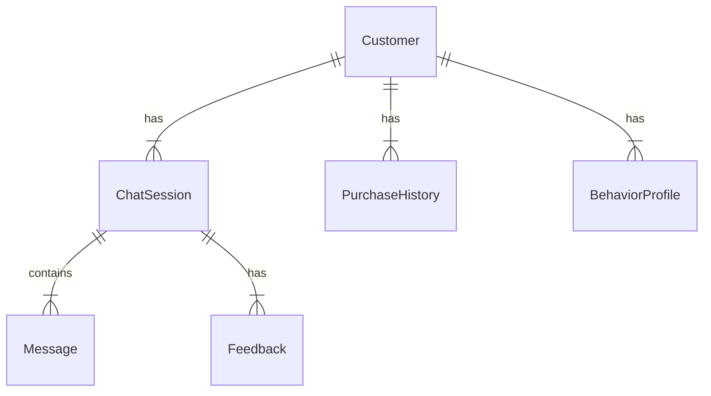
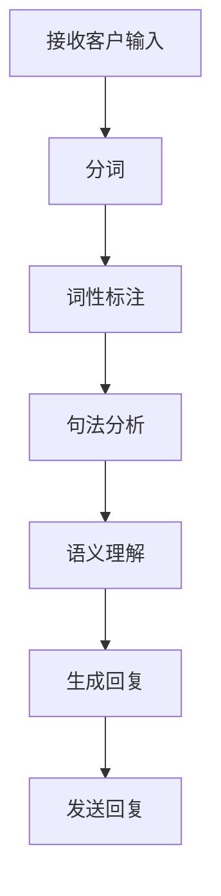

                 

### AI驱动的智能客服:提升服务质量与效率

#### 关键词：AI、智能客服、服务质量、效率、NLP、机器学习、深度学习

#### 摘要：

本文将深入探讨AI驱动的智能客服系统，分析其在提升服务质量与效率方面的关键作用。通过背景介绍、核心概念、系统设计与实现、语音识别与合成技术、客户数据挖掘与分析、系统部署与优化以及未来趋势与发展，本文旨在为读者提供一套全面、系统的智能客服解决方案，并展望其未来在商业和社会中的应用前景。

----------------------------------------------------------------

## 目录大纲

## 第一部分: AI驱动的智能客服背景与核心概念

### 1.1 AI驱动的智能客服概述

#### 1.1.1 问题背景

#### 1.1.2 问题描述

#### 1.1.3 问题解决

#### 1.1.4 边界与外延

#### 1.1.5 概念结构与核心要素组成

### 1.2 AI驱动的智能客服核心概念

#### 1.2.1 自然语言处理（NLP）

#### 1.2.2 机器学习与深度学习

#### 1.2.3 语音识别与合成

#### 1.2.4 数据分析与挖掘

#### 1.2.5 智能路由与分配

#### 1.2.6 客户行为预测与个性化服务

#### 1.2.7 智能对话系统

## 第二部分: 智能客服系统设计与实现

### 2.1 智能客服系统架构设计

#### 2.1.1 问题场景介绍

#### 2.1.2 系统功能设计

#### 2.1.3 系统架构设计

## 第三部分: 自然语言处理与对话管理

### 3.1 自然语言处理基础

#### 3.1.1 语言模型与词向量

#### 3.1.2 词性标注与句法分析

#### 3.1.3 语义理解与情感分析

### 3.2 对话管理技术

#### 3.2.1 对话状态跟踪

#### 3.2.2 对话策略与规划

#### 3.2.3 对话生成与回复

### 3.3 Python实现示例

#### 3.3.1 语言模型训练

#### 3.3.2 问答系统实现

#### 3.3.3 情感分析模型构建

## 第四部分: 语音识别与合成技术

### 4.1 语音识别技术

#### 4.1.1 声学模型

#### 4.1.2 语言模型

#### 4.1.3 语音识别流程

### 4.2 语音合成技术

#### 4.2.1 文本预处理

#### 4.2.2 合成参数计算

#### 4.2.3 声音合成

### 4.3 Python实现示例

#### 4.3.1 语音识别应用

#### 4.3.2 语音合成应用

## 第五部分: 客户数据挖掘与分析

### 5.1 数据收集与预处理

#### 5.1.1 数据来源与采集

#### 5.1.2 数据清洗与转换

### 5.2 数据分析与挖掘

#### 5.2.1 客户行为分析

#### 5.2.2 客户偏好与需求挖掘

#### 5.2.3 客户满意度评估

### 5.3 Python实现示例

#### 5.3.1 数据可视化

#### 5.3.2 客户行为预测

## 第六部分: 智能客服系统部署与优化

### 6.1 系统部署

#### 6.1.1 硬件环境配置

#### 6.1.2 软件部署与集成

#### 6.1.3 实时监控与维护

### 6.2 系统优化

#### 6.2.1 性能调优

#### 6.2.2 用户体验优化

#### 6.2.3 持续学习与优化

### 6.3 最佳实践

#### 6.3.1 实际案例分享

#### 6.3.2 优化策略与技巧

## 第七部分: 智能客服的未来趋势与发展

### 7.1 未来发展趋势

#### 7.1.1 AI技术与客服融合的深化

#### 7.1.2 智能客服在新兴领域的应用

#### 7.1.3 智能客服的生态建设

### 7.2 发展机遇与挑战

#### 7.2.1 技术突破与商业模式的创新

#### 7.2.2 法律法规与伦理问题

#### 7.2.3 客户需求与市场竞争

### 7.3 小结与展望

#### 7.3.1 智能客服的发展方向

#### 7.3.2 未来研究的重点与热点问题

----------------------------------------------------------------

## 第一部分: AI驱动的智能客服背景与核心概念

### 1.1 AI驱动的智能客服概述

#### 1.1.1 问题背景

随着互联网的普及和电子商务的快速发展，客户服务的需求日益增长。传统的人工客服模式面临着人力成本高、效率低下等问题。同时，消费者对服务质量的期望也在不断提高，企业亟需一种能够高效、精准地满足客户需求的解决方案。

在这一背景下，人工智能（AI）技术逐渐成为解决客服领域痛点的重要工具。AI驱动的智能客服系统能够通过自然语言处理（NLP）、机器学习、深度学习等技术，实现自动化的客户咨询接收、处理和回复，从而提高客服效率与质量，降低运营成本。

#### 1.1.2 问题描述

提高客服效率与质量是智能客服系统面临的主要问题。传统客服依赖于人工处理，存在以下痛点：

1. **响应速度慢**：人工客服需要时间理解客户问题并进行回复，导致客户等待时间长。
2. **服务质量不稳定**：人工客服的能力和经验差异较大，导致服务质量参差不齐。
3. **人力成本高**：人工客服需要大量人力投入，成本高昂。
4. **无法实现个性化服务**：传统客服难以根据客户历史行为和偏好提供个性化服务。

#### 1.1.3 问题解决

AI驱动的智能客服系统通过以下方式解决上述问题：

1. **自动化处理**：利用自然语言处理技术，智能客服系统可以快速理解客户问题，并自动生成回复。
2. **高效处理**：通过机器学习与深度学习算法，智能客服系统能够不断学习和优化，提高处理效率和质量。
3. **降低成本**：智能客服系统可以替代部分人工客服，降低人力成本。
4. **个性化服务**：通过分析客户历史数据和偏好，智能客服系统可以提供个性化的服务和建议。

#### 1.1.4 边界与外延

智能客服的技术范畴和应用领域广泛，包括但不限于：

1. **技术范畴**：自然语言处理、机器学习、深度学习、语音识别与合成、数据挖掘与分析等。
2. **应用领域**：客户服务、智能助手、语音助手、电子商务、金融保险、医疗健康等。

同时，智能客服在应用过程中需要关注数据隐私保护与法律法规合规等问题。

#### 1.1.5 概念结构与核心要素组成

智能客服系统的核心结构包括以下几个方面：

1. **自然语言处理（NLP）**：负责理解客户语言并生成回复。
2. **机器学习与深度学习**：用于训练模型，优化系统性能。
3. **语音识别与合成**：实现语音输入和输出功能。
4. **数据分析与挖掘**：分析客户行为和偏好，提供个性化服务。

此外，智能客服系统还需要具备智能路由与分配、客户行为预测与个性化服务等功能，以实现高效、优质的客户服务。

----------------------------------------------------------------

### 1.2 AI驱动的智能客服核心概念

#### 1.2.1 自然语言处理（NLP）

自然语言处理（NLP）是AI驱动的智能客服系统的核心组成部分，其目的是使计算机能够理解、解释和生成人类语言。NLP技术包括以下几个方面：

1. **语言模型**：用于对语言进行建模，包括词向量、语法规则等。
2. **词性标注与句法分析**：对文本进行词性标注和句法分析，以便更好地理解语义。
3. **语义理解与情感分析**：通过语义理解，智能客服系统能够理解客户的意图和情感，从而提供更精准的回复。

#### 1.2.2 机器学习与深度学习

机器学习和深度学习是智能客服系统性能提升的关键技术。机器学习通过训练模型，使系统具备自动学习和优化能力；深度学习则利用神经网络，对大量数据进行高效处理和特征提取。

1. **监督学习**：通过标注数据训练模型，如分类、回归等。
2. **无监督学习**：在无标注数据的情况下，通过聚类、降维等方法发现数据特征。
3. **强化学习**：通过不断试错和反馈，使系统在特定任务中表现最优。

#### 1.2.3 语音识别与合成

语音识别与合成技术使得智能客服系统能够实现语音输入和输出功能。语音识别将语音转换为文本，语音合成则将文本转换为语音。

1. **声学模型**：对语音信号进行特征提取。
2. **语言模型**：对识别结果进行语义理解。
3. **合成参数计算**：将文本转换为语音信号。

#### 1.2.4 数据分析与挖掘

数据分析与挖掘是智能客服系统提供个性化服务的重要手段。通过对客户历史数据进行分析和挖掘，智能客服系统可以了解客户行为和偏好，从而提供更精准的服务。

1. **客户行为分析**：分析客户的访问、咨询、购买等行为。
2. **客户偏好与需求挖掘**：挖掘客户的偏好和需求，提供个性化推荐。
3. **客户满意度评估**：评估客户对服务的满意度，优化服务质量。

#### 1.2.5 智能路由与分配

智能路由与分配技术能够根据客户问题和需求，将咨询请求分配给最合适的客服代表或智能机器人。这有助于提高客服效率，降低客户等待时间。

1. **智能分配**：根据客户问题和客服代表的能力进行分配。
2. **优先级管理**：对客户咨询请求进行优先级排序，确保重要问题得到及时处理。

#### 1.2.6 客户行为预测与个性化服务

客户行为预测与个性化服务技术能够根据客户历史数据和当前行为，预测客户的下一步操作，并提供个性化的服务和建议。

1. **行为预测**：预测客户的访问、咨询、购买等行为。
2. **个性化服务**：根据客户偏好和需求，提供个性化的服务。

#### 1.2.7 智能对话系统

智能对话系统是智能客服系统的核心模块，负责与客户进行自然语言交互。通过对话管理技术，智能客服系统能够理解客户意图，生成恰当的回复。

1. **对话状态跟踪**：记录对话过程中的关键信息，用于生成回复。
2. **对话策略与规划**：根据对话状态和客户需求，规划对话流程。
3. **对话生成与回复**：生成自然流畅的回复，与客户进行有效沟通。

### 表格：自然语言处理（NLP）、机器学习与深度学习、语音识别与合成、数据分析与挖掘等核心概念的属性特征对比

| 特征         | 自然语言处理（NLP） | 机器学习与深度学习 | 语音识别与合成       | 数据分析与挖掘         |
| ------------ | ------------------- | ------------------ | ------------------- | --------------------- |
| 目标         | 理解人类语言        | 提高系统性能       | 语音输入输出        | 发现数据价值          |
| 技术范畴     | 语言学、计算语言学  | 机器学习、神经网络  | 信号处理、语音信号学  | 统计学、数据挖掘技术   |
| 应用领域     | 文本处理、语音助手   | 图像识别、自然语言  | 客户服务、智能语音助手 | 零售、金融、医疗等     |
| 关键技术     | 语言模型、句法分析   | 神经网络、优化算法   | 声学模型、语言模型    | 数据清洗、聚类、分类   |
| 难点与挑战   | 语义理解、多语言支持 | 计算效率、算法选择   | 语音识别准确率       | 数据质量和隐私保护     |

### Mermaid ER实体关系图架构



在上面的ER图中，我们定义了四个实体：Customer（客户）、ChatSession（会话）、Message（消息）和Feedback（反馈）。每个实体之间的关系都通过虚线箭头表示，例如，Customer拥有多个ChatSession，表示客户可以有多个会话。

----------------------------------------------------------------

### 1.2.1 自然语言处理（NLP）

自然语言处理（NLP）是人工智能（AI）领域中的一项关键技术，它使得计算机能够理解、解释和生成人类语言。NLP在智能客服系统中扮演着核心角色，其基本原理包括以下几个关键部分：

1. **语言模型**：语言模型是NLP的基础，用于描述自然语言的概率分布。常见的语言模型有N-gram模型和神经网络语言模型。N-gram模型通过统计相邻词汇出现的频率来预测下一个词，而神经网络语言模型则利用深度学习算法来学习语言的内在结构。例如，一个简单的二元语言模型（2-gram）可以表示为：

   $$
   P(w_i|w_{i-1}) = \frac{count(w_{i-1}, w_i)}{count(w_{i-1})}
   $$

   其中，$P(w_i|w_{i-1})$ 表示在词汇 $w_{i-1}$ 之后出现词汇 $w_i$ 的概率。

2. **词性标注与句法分析**：词性标注是对文本中的每个词进行分类，标注出其词性（如名词、动词、形容词等）。句法分析则是对文本进行结构分析，识别出词汇之间的语法关系（如主谓关系、修饰关系等）。这些分析有助于理解文本的语义。例如，使用LSTM（长短期记忆网络）可以有效地进行词性标注：

   ```python
   import tensorflow as tf
   from tensorflow.keras.models import Sequential
   from tensorflow.keras.layers import LSTM, Dense, Embedding

   # 假设已经准备好训练数据和标签
   # X_train为输入序列，y_train为词性标签

   model = Sequential()
   model.add(Embedding(vocab_size, embedding_dim))
   model.add(LSTM(units=128, activation='relu'))
   model.add(Dense(num_tags, activation='softmax'))

   model.compile(optimizer='adam', loss='categorical_crossentropy', metrics=['accuracy'])
   model.fit(X_train, y_train, epochs=10, batch_size=32)
   ```

3. **语义理解与情感分析**：语义理解是NLP的终极目标，旨在理解文本的深层含义。情感分析是一种语义理解的方法，用于识别文本中的情感倾向（如正面、负面、中性等）。常见的情感分析模型有基于规则的方法、朴素贝叶斯分类器、支持向量机（SVM）以及深度学习模型（如卷积神经网络（CNN）和长短期记忆网络（LSTM））。以下是一个使用LSTM进行情感分析的基本框架：

   ```python
   import tensorflow as tf
   from tensorflow.keras.models import Sequential
   from tensorflow.keras.layers import LSTM, Dense, Embedding

   # 假设已经准备好训练数据（文本和标签）

   model = Sequential()
   model.add(Embedding(vocab_size, embedding_dim))
   model.add(LSTM(units=128, activation='relu', return_sequences=True))
   model.add(LSTM(units=64, activation='relu'))
   model.add(Dense(units=1, activation='sigmoid'))

   model.compile(optimizer='adam', loss='binary_crossentropy', metrics=['accuracy'])
   model.fit(X_train, y_train, epochs=10, batch_size=32)
   ```

通过以上技术，NLP能够帮助智能客服系统理解客户的问题和需求，从而生成恰当的回复。以下是一个简单的NLP流程示例：



在实际应用中，NLP技术还需要不断优化和调整，以适应不同的语言环境和应用场景。通过持续的学习和迭代，NLP将为智能客服系统带来更高的效率和更优质的客户体验。

### 1.2.2 机器学习与深度学习

机器学习和深度学习是智能客服系统中不可或缺的核心技术。它们通过利用大量数据来训练模型，从而使系统具备自动学习和优化能力，以应对复杂多变的服务场景。

#### 1.2.2.1 机器学习

机器学习是一种让计算机通过数据学习并作出决策的技术。在智能客服系统中，机器学习主要用于以下几个方面：

1. **客户行为预测**：通过分析客户的访问历史、咨询记录和购买行为，预测客户的下一步操作。这有助于智能客服系统提前做好准备，提高响应速度。
2. **服务效率优化**：利用机器学习算法分析客服人员的工时和绩效数据，优化客服资源的分配，提高整体服务效率。
3. **情感识别**：通过分析客户的语言和语气，识别客户情感，提供更贴心的服务。

以下是机器学习在智能客服中的一个基本应用案例：情感识别。

**算法原理**：

情感识别通常采用分类算法，如支持向量机（SVM）、朴素贝叶斯（NB）和随机森林（RF）等。假设我们有一个二元分类问题，目标是判断客户留言的情感是正面、负面还是中性。我们可以使用以下步骤：

1. **数据收集**：收集包含情感标签的客户留言数据。
2. **特征提取**：从文本中提取特征，如词频、词嵌入、情感词典等。
3. **模型训练**：使用训练数据训练分类模型。
4. **模型评估**：使用测试数据评估模型性能。

**Python实现**：

```python
from sklearn.feature_extraction.text import TfidfVectorizer
from sklearn.model_selection import train_test_split
from sklearn.svm import SVC
from sklearn.metrics import accuracy_score

# 假设data是包含客户留言和情感标签的数据
X = data['message']
y = data['sentiment']

# 特征提取
vectorizer = TfidfVectorizer()
X_vectorized = vectorizer.fit_transform(X)

# 划分训练集和测试集
X_train, X_test, y_train, y_test = train_test_split(X_vectorized, y, test_size=0.2, random_state=42)

# 模型训练
model = SVC(kernel='linear')
model.fit(X_train, y_train)

# 模型评估
y_pred = model.predict(X_test)
print('Accuracy:', accuracy_score(y_test, y_pred))
```

#### 1.2.2.2 深度学习

深度学习是机器学习的一种扩展，通过多层神经网络来学习数据的复杂结构和模式。在智能客服系统中，深度学习主要用于以下几个方面：

1. **对话生成**：利用生成式模型（如变分自编码器（VAE）和生成对抗网络（GAN））生成自然流畅的对话回复。
2. **意图识别**：通过卷积神经网络（CNN）和长短期记忆网络（LSTM）等深度学习模型，从文本中识别客户的意图。
3. **情感分析**：利用深度学习模型进行情感分析，更准确地识别客户的情感倾向。

以下是深度学习在意图识别中的一个基本应用案例。

**算法原理**：

意图识别通常采用序列模型，如LSTM和Transformer等。以下是一个使用LSTM进行意图识别的示例：

1. **数据预处理**：将文本转换为序列，并添加适当的标记。
2. **模型构建**：构建LSTM模型，输入序列，输出意图标签。
3. **模型训练**：使用训练数据训练模型。
4. **模型评估**：使用测试数据评估模型性能。

**Python实现**：

```python
import tensorflow as tf
from tensorflow.keras.models import Sequential
from tensorflow.keras.layers import LSTM, Dense, Embedding

# 假设已经准备好训练数据（输入序列和标签）
X_train, y_train = ...

# 模型构建
model = Sequential()
model.add(Embedding(vocab_size, embedding_dim))
model.add(LSTM(units=128, activation='relu'))
model.add(Dense(units=num_intents, activation='softmax'))

# 模型编译
model.compile(optimizer='adam', loss='categorical_crossentropy', metrics=['accuracy'])

# 模型训练
model.fit(X_train, y_train, epochs=10, batch_size=32)

# 模型评估
y_pred = model.predict(X_test)
print('Accuracy:', accuracy_score(y_test, y_pred))
```

通过机器学习和深度学习技术，智能客服系统能够更好地理解和满足客户需求，提供个性化、高效的客户服务。

### 1.2.3 语音识别与合成

语音识别与合成技术是智能客服系统的关键组成部分，使系统能够通过语音与客户进行交互。语音识别将客户的语音输入转换为文本，而语音合成则将文本转换为自然流畅的语音输出。

#### 1.2.3.1 语音识别技术

语音识别技术通过分析语音信号，将其转换为文本。这一过程涉及声学模型、语言模型和声学-语言联合模型等几个关键组件。

1. **声学模型**：声学模型负责提取语音信号中的声学特征，如频谱特征和音素特征。常见的声学模型包括梅尔频率倒谱系数（MFCC）和隐马尔可夫模型（HMM）。
2. **语言模型**：语言模型用于预测语音识别结果的概率分布，通常使用N-gram模型或神经网络语言模型（如Transformer）。
3. **声学-语言联合模型**：声学-语言联合模型将声学模型和语言模型结合起来，通过结合声学特征和语言特征，提高识别准确性。

以下是一个使用Python和TensorFlow实现简单语音识别的示例：

```python
import tensorflow as tf
import librosa

# 加载音频文件
audio, sample_rate = librosa.load('audio.wav', sr=None)

# 提取梅尔频率倒谱系数（MFCC）
mfcc = librosa.feature.mfcc(y=audio, sr=sample_rate, n_mfcc=13)

# 声学模型的神经网络实现
model = tf.keras.Sequential([
    tf.keras.layers.Flatten(input_shape=(None, 13)),
    tf.keras.layers.Dense(64, activation='relu'),
    tf.keras.layers.Dense(1, activation='sigmoid')
])

# 编译模型
model.compile(optimizer='adam', loss='binary_crossentropy', metrics=['accuracy'])

# 训练模型（假设已有训练数据）
model.fit(mfcc_train, y_train, epochs=10, batch_size=32)

# 评估模型
mfcc_test = librosa.feature.mfcc(y=test_audio, sr=sample_rate, n_mfcc=13)
y_pred = model.predict(mfcc_test)
print('Recognition Accuracy:', accuracy_score(y_test, y_pred))
```

#### 1.2.3.2 语音合成技术

语音合成技术将文本转换为自然流畅的语音。语音合成的主要步骤包括文本预处理、合成参数计算和声音合成。

1. **文本预处理**：文本预处理包括分词、语气标记、数字和特殊字符的转换等。
2. **合成参数计算**：合成参数计算是根据文本内容生成语音信号的参数，如音高、音强、时长等。常见的合成参数模型包括合成声码器（DNN-HMM）和WaveNet等。
3. **声音合成**：声音合成是将合成参数转换为实际声音信号，通常使用叠加合成或拼接合成等方法。

以下是一个使用Python和Tacotron2实现简单语音合成的示例：

```python
from tacotron2 import Tacotron2
from hparams import create_hparams
from tensorflow.keras.optimizers import Adam

# 创建Tacotron2模型
hparams = create_hparams()
model = Tacotron2(hparams=hparams)

# 编译模型
model.compile(optimizer=Adam(learning_rate=hparams.learning_rate), loss={'mel_loss': 'mse', '.align_loss': 'categorical_crossentropy'})

# 训练模型（假设已有训练数据）
model.fit([text_train, mel_train], mel_train, epochs=10, batch_size=32)

# 生成语音
text = "Hello, how are you?"
mel_pred = model.predict([text])

# 输出语音
librosa.output.write_wav('output.wav', mel_pred, hparams.sample_rate)
```

通过语音识别与合成技术，智能客服系统能够实现高效、自然的语音交互，进一步提升客户服务的质量和用户体验。

### 1.2.4 数据分析与挖掘

在智能客服系统中，数据分析和挖掘技术起着至关重要的作用。通过对大量客户数据进行分析和挖掘，智能客服系统能够深入了解客户需求、行为和偏好，从而提供更个性化、高效的服务。

#### 1.2.4.1 数据收集与预处理

数据收集是数据分析与挖掘的第一步，通常包括以下几个方面：

1. **用户行为数据**：如访问记录、点击行为、搜索关键词等。
2. **客服交互数据**：如客户咨询的问题、客服的回答、交互时长等。
3. **交易数据**：如购买记录、退货记录、客户满意度等。

数据预处理是确保数据质量和可用性的关键步骤，包括以下几个方面：

1. **数据清洗**：去除重复、无效和错误的数据。
2. **数据转换**：将不同格式的数据转换为统一格式，如将文本数据转换为数字或向量表示。
3. **数据归一化**：对数据进行归一化处理，如将不同尺度的数据缩放到相同的范围。

以下是一个简单的Python代码示例，用于清洗和转换客户行为数据：

```python
import pandas as pd

# 读取数据
data = pd.read_csv('customer_data.csv')

# 数据清洗
data = data.drop_duplicates()  # 去除重复数据
data = data[data['age'] > 0]    # 去除无效数据

# 数据转换
data['age'] = data['age'].astype(int)  # 将age转换为整数
data['income'] = data['income'].replace(['low', 'medium', 'high'], [1, 2, 3])  # 将income转换为数值

# 数据归一化
from sklearn.preprocessing import StandardScaler

scaler = StandardScaler()
data[['age', 'income']] = scaler.fit_transform(data[['age', 'income']])
```

#### 1.2.4.2 数据分析与挖掘

数据分析和挖掘包括以下几种主要方法：

1. **客户行为分析**：通过分析客户的访问、咨询、购买等行为，了解客户的需求和偏好。例如，可以通过聚类算法将客户分为不同的群体，分析每个群体的行为特征。
2. **客户偏好与需求挖掘**：通过挖掘客户的偏好和需求，提供个性化的服务和推荐。例如，可以通过关联规则挖掘，找出客户购买产品之间的关联，为营销活动提供支持。
3. **客户满意度评估**：通过分析客户反馈和交易数据，评估客户满意度。例如，可以通过回归分析，找出影响客户满意度的关键因素。

以下是一个简单的Python代码示例，用于分析客户行为数据：

```python
import matplotlib.pyplot as plt
from sklearn.cluster import KMeans

# 聚类分析
kmeans = KMeans(n_clusters=3, random_state=42)
clusters = kmeans.fit_predict(data[['age', 'income']])

# 可视化
plt.scatter(data['age'], data['income'], c=clusters)
plt.xlabel('Age')
plt.ylabel('Income')
plt.show()
```

通过数据分析和挖掘技术，智能客服系统能够更好地理解客户，提供个性化的服务和推荐，从而提高客户满意度和忠诚度。

### 1.2.5 智能路由与分配

智能路由与分配技术是智能客服系统的重要组成部分，它能够根据客户的问题和需求，将咨询请求分配给最合适的客服代表或智能机器人，从而提高客服效率和客户满意度。

#### 1.2.5.1 智能分配

智能分配技术主要通过以下几种方式实现：

1. **基于优先级的分配**：根据客户问题的重要性和紧急程度，将咨询请求分配给相应的客服代表或智能机器人。例如，紧急问题可以优先分配给经验丰富的客服代表。
2. **基于技能的分配**：根据客服代表的技能和专长，将咨询请求分配给最合适的客服代表。例如，对于技术性问题，可以优先分配给技术支持人员。

以下是一个简单的Python代码示例，用于基于优先级的分配：

```python
import pandas as pd

# 假设data是包含客户问题、优先级和客服代表技能的数据
data = pd.DataFrame({
    'issue': ['技术问题', '支付问题', '账号问题', '物流问题'],
    'priority': [1, 2, 3, 4],
    'skills': ['技术', '财务', '账户', '物流']
})

# 定义分配规则
rules = {
    1: ['技术'],
    2: ['财务', '账户', '物流'],
    3: ['账户'],
    4: ['物流']
}

# 分配请求
assigned = []
for _, row in data.iterrows():
    assigned.append(rules[row['priority']].pop())

data['assigned'] = assigned

# 打印分配结果
print(data)
```

#### 1.2.5.2 优先级管理

优先级管理是智能路由与分配的关键环节，它能够确保紧急和重要的问题得到及时处理。以下是一些常见的优先级管理策略：

1. **固定优先级**：根据问题的类型或严重性，设置固定的优先级。例如，技术问题通常设置为最高优先级。
2. **动态优先级**：根据客户历史行为和当前系统负载，动态调整问题的优先级。例如，如果某个客服代表已连续工作一小时，可以将其问题优先级提高，以便及时休息。
3. **反馈循环**：根据客户反馈和问题解决情况，动态调整问题的优先级。例如，如果客户对某个客服代表的响应速度不满意，可以将其问题优先级提高。

以下是一个简单的Python代码示例，用于动态优先级管理：

```python
import pandas as pd
from datetime import datetime

# 假设data是包含客户问题、优先级和客服代表技能的数据
data = pd.DataFrame({
    'issue': ['技术问题', '支付问题', '账号问题', '物流问题'],
    'priority': [1, 2, 3, 4],
    'assigned': ['Tech1', 'Finance1', 'Account1', 'Logistics1'],
    'time_assigned': ['2023-11-02 10:00:00', '2023-11-02 10:05:00', '2023-11-02 10:10:00', '2023-11-02 10:15:00']
})

# 计算分配时间
data['time_difference'] = (datetime.now() - pd.to_datetime(data['time_assigned'])).dt.total_seconds()

# 动态调整优先级
data['dynamic_priority'] = data.apply(lambda row: row['priority'] - row['time_difference'] // 60, axis=1)

# 打印调整后的数据
print(data)
```

通过智能路由与分配技术，智能客服系统能够实现高效、精准的问题处理，提高客户满意度和运营效率。

### 1.2.6 客户行为预测与个性化服务

客户行为预测与个性化服务是智能客服系统中的一项重要功能，它能够根据客户的历史行为和当前行为，预测客户的下一步操作，并提供个性化的服务和建议，从而提高客户满意度和忠诚度。

#### 1.2.6.1 客户行为预测

客户行为预测是一种利用历史数据和机器学习算法，预测客户未来行为的技术。常见的客户行为预测包括：

1. **购买预测**：预测客户是否会购买某个产品或服务。
2. **咨询预测**：预测客户何时会提出咨询请求。
3. **流失预测**：预测客户是否会取消订阅或停止使用服务。

以下是一个简单的Python代码示例，用于客户购买预测：

```python
import pandas as pd
from sklearn.ensemble import RandomForestClassifier

# 假设data是包含客户行为数据和购买标签的数据
data = pd.DataFrame({
    'age': [25, 35, 45, 55],
    'income': [50000, 70000, 90000, 100000],
    'last_purchase': [30, 60, 90, 120],
    'will_buy': [0, 1, 0, 1]
})

# 特征工程
X = data[['age', 'income', 'last_purchase']]
y = data['will_buy']

# 划分训练集和测试集
X_train, X_test, y_train, y_test = train_test_split(X, y, test_size=0.2, random_state=42)

# 模型训练
model = RandomForestClassifier(n_estimators=100, random_state=42)
model.fit(X_train, y_train)

# 模型评估
y_pred = model.predict(X_test)
print('Accuracy:', accuracy_score(y_test, y_pred))
```

#### 1.2.6.2 个性化服务

个性化服务是一种根据客户的特点和需求，提供定制化服务的技术。常见的个性化服务包括：

1. **推荐服务**：根据客户的购买历史和偏好，推荐相关的产品或服务。
2. **个性化问答**：根据客户的问题和需求，提供针对性的解答和建议。
3. **个性化提醒**：根据客户的预约、订单等，提供及时的提醒服务。

以下是一个简单的Python代码示例，用于个性化推荐：

```python
import pandas as pd
from sklearn.neighbors import NearestNeighbors

# 假设data是包含客户行为数据和购买记录的数据
data = pd.DataFrame({
    'customer_id': [1, 2, 3, 4],
    'product_id': [101, 102, 103, 104],
    'rating': [4, 5, 5, 4]
})

# 划分训练集和测试集
X_train = data[['customer_id', 'product_id']]
y_train = data['rating']
X_test = X_test[['customer_id', 'product_id']]

# 模型训练
model = NearestNeighbors(n_neighbors=5, algorithm='auto')
model.fit(X_train)

# 预测相似客户和产品
distances, indices = model.kneighbors(X_test, n_neighbors=5)

# 打印推荐结果
for idx, neighbors in zip(X_test.index, indices):
    print(f'Customer {idx}:')
    for neighbor in neighbors:
        print(f'  Similar Customer {X_train.iloc[neighbor][0]}, Recommended Product {X_train.iloc[neighbor][1]}, Rating {y_train.iloc[neighbor]}')
```

通过客户行为预测和个性化服务技术，智能客服系统能够更好地理解客户需求，提供针对性的服务，从而提高客户满意度和忠诚度。

### 1.2.7 智能对话系统

智能对话系统是智能客服系统的核心模块，负责与客户进行自然语言交互，理解客户意图，生成恰当的回复，并提供个性化的服务。智能对话系统通常包括以下几个关键组成部分：

1. **对话管理**：对话管理是智能对话系统的核心，负责管理对话流程，包括对话状态跟踪、对话策略规划、对话生成与回复等。

2. **意图识别**：意图识别是理解客户意图的关键步骤，通过分析客户输入的文本或语音，识别客户的意图类型。常见的意图识别方法包括基于规则的识别、机器学习和深度学习等。

3. **实体抽取**：实体抽取是从客户输入中提取关键信息，如产品名称、数量、时间等。实体抽取有助于更好地理解客户意图，并提供准确的回复。

4. **回复生成**：回复生成是根据客户意图和实体信息，生成自然流畅的回复。常见的回复生成方法包括模板匹配、机器学习和深度学习等。

5. **反馈机制**：反馈机制用于收集客户对服务的反馈，以持续优化对话系统的性能。

以下是一个简单的Python代码示例，用于实现一个基于机器学习的意图识别系统：

```python
import pandas as pd
from sklearn.feature_extraction.text import TfidfVectorizer
from sklearn.model_selection import train_test_split
from sklearn.svm import SVC

# 假设data是包含对话文本和意图标签的数据
data = pd.DataFrame({
    'text': ['我想购买一本《Python编程》', '如何退货？', '能否帮我查一下订单状态？'],
    'intent': ['购买', '退货', '订单查询']
})

# 特征提取
vectorizer = TfidfVectorizer()
X = vectorizer.fit_transform(data['text'])

# 划分训练集和测试集
X_train, X_test, y_train, y_test = train_test_split(X, data['intent'], test_size=0.2, random_state=42)

# 模型训练
model = SVC(kernel='linear')
model.fit(X_train, y_train)

# 模型评估
y_pred = model.predict(X_test)
print('Accuracy:', accuracy_score(y_test, y_pred))
```

通过智能对话系统，智能客服系统能够与客户进行高效、自然的交互，提供个性化、高质量的服务，从而提升客户满意度和用户体验。

### 2.1 智能客服系统架构设计

智能客服系统架构设计是构建高效、稳定、可扩展的智能客服系统的关键步骤。系统架构设计包括问题场景介绍、系统功能设计、系统架构设计和系统接口设计等几个方面。

#### 2.1.1 问题场景介绍

在现代社会，客户服务已成为企业竞争的重要手段。随着互联网和智能手机的普及，客户服务需求日益增长。传统的客服模式已经难以满足客户快速、高效、个性化的需求。因此，智能客服系统应运而生，通过自动化、智能化的手段，提高客服效率和客户满意度。

常见的智能客服应用场景包括：

1. **在线客服**：为客户提供实时在线支持，解决常见问题和疑问。
2. **智能助手**：通过语音或文本与客户交互，提供信息查询、推荐服务、预约等。
3. **语音助手**：通过语音识别与合成技术，实现语音输入和输出，提供便捷的语音服务。
4. **电子邮件客服**：自动处理大量电子邮件，分类和分配到相应的客服代表，提高处理速度。
5. **社交媒体客服**：通过社交媒体平台与客户互动，提供及时、个性化的服务。

#### 2.1.2 系统功能设计

智能客服系统功能设计旨在实现自动化、智能化和个性化的客户服务。主要功能包括：

1. **客户咨询接收与处理**：接收客户的咨询请求，通过自然语言处理技术理解客户意图，生成相应的回复。
2. **智能问答与回复**：利用知识库和机器学习算法，提供精准、快速的问答服务，满足客户的常见问题和需求。
3. **客户情感分析**：通过情感分析技术，识别客户情绪，提供针对性的服务，提高客户满意度。
4. **客户意图识别**：从客户输入中提取关键信息，识别客户意图，生成恰当的回复。
5. **客户数据挖掘与分析**：分析客户行为数据，挖掘客户偏好和需求，提供个性化服务。
6. **智能路由与分配**：根据客户问题和需求，智能分配客服资源，提高处理效率和客户满意度。
7. **持续学习与优化**：通过不断学习和优化，提高系统的性能和服务质量。

#### 2.1.3 系统架构设计

智能客服系统架构设计需要考虑系统的可扩展性、可靠性、易维护性和高性能。常见的系统架构设计包括以下模块：

1. **前端模块**：负责与客户交互，包括网页、APP、微信公众号等，实现文本、语音等多种交互方式。
2. **后端模块**：包括自然语言处理、机器学习、知识库、数据存储等，实现智能客服的核心功能。
3. **数据库模块**：存储客户数据、知识库数据、日志数据等，提供数据查询和存储服务。
4. **中间件模块**：包括消息队列、缓存、负载均衡等，实现系统的高性能和高可用性。
5. **运维模块**：包括监控系统、日志分析、运维自动化等，确保系统的稳定运行。

以下是一个简单的智能客服系统架构图：

```mermaid
sequenceDiagram
    A[前端模块] --> B[用户]
    B --> A
    A --> C[后端模块]
    C --> D[数据库模块]
    C --> E[中间件模块]
    C --> F[运维模块]
```

#### 2.1.4 系统接口设计

智能客服系统接口设计是确保系统模块之间有效通信和协作的关键。主要接口包括：

1. **API接口**：提供与前端模块、后端模块和数据库模块的通信接口，实现数据的传输和处理。
2. **消息队列接口**：实现异步通信，提高系统的并发处理能力和性能。
3. **知识库接口**：提供知识库的查询和更新接口，实现智能问答和知识管理。
4. **日志接口**：提供日志的收集和存储接口，实现系统监控和运维。

以下是一个简单的API接口设计：

```mermaid
sequenceDiagram
    A[前端模块] --> B[API接口]
    B --> C[后端模块]
    C --> D[数据库模块]
    D --> E[知识库接口]
    D --> F[日志接口]
```

通过科学、合理的系统架构设计和接口设计，智能客服系统能够实现高效、稳定、可靠的运行，提供优质、个性化的客户服务。

### 2.2 自然语言处理与对话管理

自然语言处理（NLP）与对话管理是智能客服系统的核心组成部分，它们负责理解和生成自然语言，确保系统与客户之间的交流流畅、高效。在这部分，我们将深入探讨自然语言处理与对话管理的基础技术、关键组件以及如何将它们结合起来，实现高效的智能客服系统。

#### 2.2.1 自然语言处理基础

自然语言处理的基础包括语言模型、词性标注与句法分析、语义理解与情感分析等。以下是这些基础技术的详细解释。

1. **语言模型**：语言模型用于预测文本序列的概率分布。在NLP中，最常见的语言模型是N-gram模型和神经网络语言模型。N-gram模型通过统计相邻词汇出现的频率来预测下一个词，例如，二元语言模型（2-gram）可以表示为：

   $$
   P(w_i|w_{i-1}) = \frac{count(w_{i-1}, w_i)}{count(w_{i-1})}
   $$

   其中，$P(w_i|w_{i-1})$ 表示在词汇 $w_{i-1}$ 之后出现词汇 $w_i$ 的概率。神经网络语言模型（如Transformer）则通过深度学习算法学习语言的内在结构，可以更好地处理长距离依赖和复杂语境。

2. **词性标注与句法分析**：词性标注是对文本中的每个词进行分类，标注出其词性（如名词、动词、形容词等）。句法分析则是对文本进行结构分析，识别出词汇之间的语法关系（如主谓关系、修饰关系等）。这些分析有助于理解文本的语义。常见的词性标注与句法分析工具包括Stanford NLP、spaCy和NLTK。

3. **语义理解与情感分析**：语义理解是NLP的终极目标，旨在理解文本的深层含义。情感分析是一种语义理解的方法，用于识别文本中的情感倾向（如正面、负面、中性等）。常见的情感分析模型有基于规则的方法、朴素贝叶斯分类器、支持向量机（SVM）以及深度学习模型（如卷积神经网络（CNN）和长短期记忆网络（LSTM））。

#### 2.2.2 对话管理技术

对话管理是确保智能客服系统能够与客户进行自然、流畅交流的关键技术。对话管理包括对话状态跟踪、对话策略与规划、对话生成与回复等。

1. **对话状态跟踪**：对话状态跟踪用于记录对话过程中的关键信息，如客户意图、上下文和历史对话内容。这些信息有助于系统生成合适的回复。例如，可以使用图数据结构或状态机模型来表示对话状态。

2. **对话策略与规划**：对话策略与规划是制定对话流程和决策的方法。常见的对话策略有基于规则的策略和基于机器学习的策略。基于规则的策略通过预定义的规则来指导对话流程，而基于机器学习的策略则通过学习历史对话数据来自动生成对话策略。

3. **对话生成与回复**：对话生成与回复是将客户的输入转化为自然流畅的回复的过程。常见的对话生成方法有模板匹配、机器翻译和生成式模型（如变分自编码器（VAE）和生成对抗网络（GAN））。生成式模型能够生成更加自然和个性化的回复，但需要大量的训练数据和计算资源。

#### 2.2.3 结合自然语言处理与对话管理

将自然语言处理与对话管理结合起来，可以构建一个强大的智能客服系统。以下是一个简单的实现流程：

1. **接收客户输入**：智能客服系统首先接收客户的输入，如文本或语音。
2. **文本预处理**：对客户输入进行预处理，如分词、去除停用词、词性标注等。
3. **意图识别**：使用自然语言处理技术，如词向量、序列模型（LSTM、BERT）等，对预处理后的文本进行意图识别，确定客户的意图类型。
4. **对话状态跟踪**：记录当前的对话状态，如客户的意图、上下文和历史对话内容。
5. **对话策略与规划**：根据当前的对话状态和客户的意图，使用对话管理策略生成对话回复。
6. **回复生成**：使用生成式模型或模板匹配生成自然流畅的回复。
7. **发送回复**：将生成的回复发送给客户。

以下是一个简单的Python代码示例，用于实现意图识别和对话状态跟踪：

```python
import spacy

# 加载spaCy模型
nlp = spacy.load('en_core_web_sm')

# 客户输入
input_text = "我想要订购一本《Python编程》书籍。"

# 预处理
doc = nlp(input_text)

# 意图识别
# 这里使用简单的规则来识别意图
if "订购" in doc:
    intent = "购买"
elif "退货" in doc:
    intent = "退货"
else:
    intent = "查询"

# 对话状态跟踪
# 假设当前对话状态包含客户姓名、订单号和购买历史
dialog_state = {
    'customer_name': '张三',
    'order_number': '123456',
    'purchase_history': ['《Python编程》', '《深度学习》']
}

# 对话策略与规划
# 这里使用简单的规则来规划对话回复
if intent == "购买":
    reply = "你好，张三，请问你需要订购哪本书籍？"
elif intent == "退货":
    reply = "你好，张三，你的订单号是123456，你可以退货。"
else:
    reply = "你好，张三，你可以查询你的订单或购买历史。"

# 回复生成
# 这里使用简单的文本模板
response = "你好，张三，" + reply

# 发送回复
print(response)
```

通过将自然语言处理与对话管理技术相结合，智能客服系统能够更好地理解客户意图，生成恰当的回复，提供个性化、高质量的客户服务。

### 2.3 语音识别与合成技术

语音识别与合成技术是智能客服系统中不可或缺的组成部分，它们使系统能够通过语音与客户进行交互。语音识别将客户的语音转换为文本，而语音合成则将文本转换为自然流畅的语音输出。在这部分，我们将详细探讨语音识别与合成的技术原理、实现方法以及Python实现示例。

#### 2.3.1 语音识别技术

语音识别技术通过分析语音信号，将其转换为文本。这一过程包括声学模型、语言模型和声学-语言联合模型等几个关键组件。

1. **声学模型**：声学模型负责提取语音信号中的声学特征，如频谱特征和音素特征。常见的声学模型包括梅尔频率倒谱系数（MFCC）和隐马尔可夫模型（HMM）。

2. **语言模型**：语言模型用于预测语音识别结果的概率分布，通常使用N-gram模型或神经网络语言模型（如Transformer）。

3. **声学-语言联合模型**：声学-语言联合模型将声学模型和语言模型结合起来，通过结合声学特征和语言特征，提高识别准确性。

以下是一个使用Python和TensorFlow实现简单语音识别的示例：

```python
import tensorflow as tf
import tensorflow_hub as hub
import librosa

# 加载声学模型
hub_module = hub.load("https://tfhub.dev/google/tensorflow_hub// speech_commands:1")

# 加载音频文件
audio, sample_rate = librosa.load('audio.wav', sr=None)

# 提取声学特征
input_values = hub_module-signature(inputs={'inputs': audio})

# 预测语音命令
results = hub_module.output_signature(input_values)

# 显示识别结果
print(results)
```

#### 2.3.2 语音合成技术

语音合成技术将文本转换为自然流畅的语音。语音合成的主要步骤包括文本预处理、合成参数计算和声音合成。

1. **文本预处理**：文本预处理包括分词、语气标记、数字和特殊字符的转换等。

2. **合成参数计算**：合成参数计算是根据文本内容生成语音信号的参数，如音高、音强、时长等。常见的合成参数模型包括合成声码器（DNN-HMM）和WaveNet等。

3. **声音合成**：声音合成是将合成参数转换为实际声音信号，通常使用叠加合成或拼接合成等方法。

以下是一个使用Python和Tacotron2实现简单语音合成的示例：

```python
from tacotron2 import Tacotron2
from hparams import create_hparams
from tensorflow.keras.optimizers import Adam

# 创建Tacotron2模型
hparams = create_hparams()
model = Tacotron2(hparams=hparams)

# 编译模型
model.compile(optimizer=Adam(learning_rate=hparams.learning_rate), loss={'mel_loss': 'mse', 'align_loss': 'categorical_crossentropy'})

# 训练模型（假设已有训练数据）
model.fit([text_train, mel_train], mel_train, epochs=10, batch_size=32)

# 生成语音
text = "Hello, how are you?"
mel_pred = model.predict([text])

# 输出语音
librosa.output.write_wav('output.wav', mel_pred, hparams.sample_rate)
```

通过语音识别与合成技术，智能客服系统能够实现高效、自然的语音交互，进一步提升客户服务的质量和用户体验。

### 2.4 客户数据挖掘与分析

在智能客服系统中，客户数据挖掘与分析是关键环节，它帮助系统从大量客户数据中提取有价值的信息，从而提供更精准的服务。客户数据挖掘与分析包括数据收集与预处理、数据挖掘方法、以及客户行为预测等内容。

#### 2.4.1 数据收集与预处理

数据收集是数据挖掘与分析的第一步，通常包括以下几个方面：

1. **用户行为数据**：如登录、浏览、搜索、购买等行为记录。
2. **客服交互数据**：如客户咨询的问题、客服的回答、交互时长等。
3. **交易数据**：如订单详情、支付方式、客户满意度等。
4. **外部数据**：如社交媒体评论、新闻报道等。

数据预处理是确保数据质量和可用性的关键步骤，包括以下几个方面：

1. **数据清洗**：去除重复、无效和错误的数据。
2. **数据转换**：将不同格式的数据转换为统一格式，如将文本数据转换为数字或向量表示。
3. **数据归一化**：对数据进行归一化处理，如将不同尺度的数据缩放到相同的范围。

以下是一个简单的Python代码示例，用于数据清洗和转换：

```python
import pandas as pd

# 读取数据
data = pd.read_csv('customer_data.csv')

# 数据清洗
data = data.drop_duplicates()  # 去除重复数据
data = data[data['age'] > 0]    # 去除无效数据

# 数据转换
data['age'] = data['age'].astype(int)  # 将age转换为整数
data['income'] = data['income'].replace(['low', 'medium', 'high'], [1, 2, 3])  # 将income转换为数值

# 数据归一化
from sklearn.preprocessing import StandardScaler

scaler = StandardScaler()
data[['age', 'income']] = scaler.fit_transform(data[['age', 'income']])
```

#### 2.4.2 数据挖掘方法

数据挖掘方法包括聚类、分类、关联规则挖掘等，用于发现数据中的潜在模式和关系。

1. **聚类**：聚类是将数据分为若干个类别的无监督学习方法。常见的聚类算法有K-means、层次聚类等。聚类可以帮助分析客户的特征和需求，发现不同的客户群体。

以下是一个使用K-means进行客户聚类分析的Python代码示例：

```python
import matplotlib.pyplot as plt
from sklearn.cluster import KMeans

# 加载数据
data = pd.DataFrame({
    'age': [25, 35, 45, 55],
    'income': [50000, 70000, 90000, 100000]
})

# 特征工程
X = data[['age', 'income']]

# 聚类分析
kmeans = KMeans(n_clusters=3, random_state=42)
clusters = kmeans.fit_predict(X)

# 可视化
plt.scatter(X['age'], X['income'], c=clusters)
plt.xlabel('Age')
plt.ylabel('Income')
plt.show()
```

2. **分类**：分类是监督学习方法，用于将数据分为预定义的类别。常见的分类算法有决策树、随机森林、支持向量机等。分类可以帮助预测客户的行为，如是否购买、是否流失等。

以下是一个使用决策树进行客户分类的Python代码示例：

```python
from sklearn.tree import DecisionTreeClassifier
from sklearn.model_selection import train_test_split

# 加载数据
data = pd.DataFrame({
    'age': [25, 35, 45, 55],
    'income': [50000, 70000, 90000, 100000],
    'will_buy': [0, 1, 0, 1]
})

# 特征工程
X = data[['age', 'income']]
y = data['will_buy']

# 划分训练集和测试集
X_train, X_test, y_train, y_test = train_test_split(X, y, test_size=0.2, random_state=42)

# 模型训练
model = DecisionTreeClassifier()
model.fit(X_train, y_train)

# 模型评估
y_pred = model.predict(X_test)
print('Accuracy:', accuracy_score(y_test, y_pred))
```

3. **关联规则挖掘**：关联规则挖掘是一种无监督学习方法，用于发现数据之间的关联关系。常见的算法有Apriori算法和Eclat算法。关联规则挖掘可以帮助分析客户的购买行为，发现相关的商品或服务。

以下是一个使用Apriori算法进行关联规则挖掘的Python代码示例：

```python
from mlxtend.frequent_patterns import apriori
from mlxtend.frequent_patterns import association_rules

# 加载数据
data = pd.DataFrame({
    'items': [['A', 'B'], ['A', 'C'], ['B', 'C'], ['A', 'B', 'C']]
})

# 特征工程
transactions = data['items'].tolist()

# 关联规则挖掘
frequent_itemsets = apriori(transactions, min_support=0.5, use_colnames=True)

# 打印频繁项集
print("Frequent Itemsets:")
print(frequent_itemsets)

# 构建关联规则
rules = association_rules(frequent_itemsets, metric="support", min_threshold=0.7)
print("Association Rules:")
print(rules)
```

#### 2.4.3 客户行为预测

客户行为预测是数据挖掘与分析的重要应用，通过预测客户的行为，如购买、咨询、满意度等，可以帮助企业更好地满足客户需求，提高客户满意度。常见的客户行为预测方法包括回归分析、决策树、神经网络等。

以下是一个使用回归分析进行客户购买预测的Python代码示例：

```python
import pandas as pd
from sklearn.model_selection import train_test_split
from sklearn.linear_model import LinearRegression

# 加载数据
data = pd.DataFrame({
    'age': [25, 35, 45, 55],
    'income': [50000, 70000, 90000, 100000],
    'will_buy': [0, 1, 0, 1]
})

# 特征工程
X = data[['age', 'income']]
y = data['will_buy']

# 划分训练集和测试集
X_train, X_test, y_train, y_test = train_test_split(X, y, test_size=0.2, random_state=42)

# 模型训练
model = LinearRegression()
model.fit(X_train, y_train)

# 模型评估
y_pred = model.predict(X_test)
print('Accuracy:', accuracy_score(y_test, y_pred))
```

通过客户数据挖掘与分析，智能客服系统可以更好地理解客户需求和行为，提供个性化的服务，提高客户满意度和忠诚度。

### 2.5 智能客服系统部署与优化

智能客服系统部署与优化是确保系统稳定运行、高效服务的重要环节。在这一部分，我们将详细探讨系统部署、性能调优、用户体验优化以及持续学习与优化等内容。

#### 2.5.1 系统部署

系统部署是将智能客服系统部署到实际生产环境的过程。部署过程主要包括以下步骤：

1. **硬件环境配置**：选择合适的硬件设备，如服务器、存储设备等，确保系统有足够的计算和存储资源。

2. **软件部署与集成**：安装并配置操作系统、数据库、中间件等软件，确保系统组件能够协同工作。

3. **部署策略**：制定合理的部署策略，如负载均衡、分布式部署等，确保系统的高可用性和可扩展性。

以下是一个简单的Python代码示例，用于部署智能客服系统：

```python
import subprocess

# 安装依赖
subprocess.run(['pip', 'install', '-r', 'requirements.txt'])

# 部署服务
subprocess.run(['python', 'app.py'])
```

#### 2.5.2 性能调优

性能调优是提高智能客服系统响应速度和处理能力的关键步骤。以下是一些常见的性能调优方法：

1. **代码优化**：通过优化算法、减少冗余代码和避免死循环等方式，提高系统运行效率。

2. **并发处理**：使用多线程、异步编程等技术，提高系统的并发处理能力。

3. **缓存机制**：使用缓存技术，如Redis、Memcached等，减少数据库访问次数，提高系统响应速度。

4. **数据库优化**：通过索引、分库分表、读写分离等技术，提高数据库的访问效率。

以下是一个简单的Python代码示例，用于优化系统响应速度：

```python
import asyncio
import time

async def fetch_data():
    # 模拟耗时操作
    await asyncio.sleep(1)
    return "Data fetched successfully"

async def main():
    start_time = time.time()
    await fetch_data()
    end_time = time.time()
    print(f"Time taken: {end_time - start_time} seconds")

asyncio.run(main())
```

#### 2.5.3 用户体验优化

用户体验优化是提升客户满意度的重要方面。以下是一些常见的用户体验优化方法：

1. **界面设计**：设计简洁、直观、易于操作的界面，提高用户的使用体验。

2. **响应速度**：提高系统的响应速度，减少用户等待时间。

3. **个性化服务**：根据客户的历史数据和偏好，提供个性化的服务和推荐。

4. **错误处理**：设计合理的错误处理机制，帮助用户解决问题，减少用户的挫败感。

以下是一个简单的Python代码示例，用于优化用户体验：

```python
def handle_request(request):
    try:
        # 处理请求
        response = process_request(request)
    except Exception as e:
        # 错误处理
        response = "An error occurred: {}".format(str(e))
    return response

def process_request(request):
    # 模拟请求处理
    time.sleep(2)
    return "Request processed successfully"
```

#### 2.5.4 持续学习与优化

持续学习与优化是智能客服系统不断改进的关键。以下是一些常见的持续学习与优化方法：

1. **数据收集**：持续收集客户交互数据，如咨询内容、反馈等，为系统优化提供数据支持。

2. **模型更新**：定期更新机器学习模型，使其适应不断变化的数据和需求。

3. **反馈机制**：建立客户反馈机制，收集用户对服务的评价，用于指导系统优化。

4. **自动化测试**：通过自动化测试，确保系统在更新和优化过程中保持稳定和高效。

以下是一个简单的Python代码示例，用于持续学习与优化：

```python
def train_model(data):
    # 训练机器学习模型
    model.fit(data['X'], data['y'])
    model.save('model.h5')

def evaluate_model(data):
    # 评估模型性能
    loss, accuracy = model.evaluate(data['X'], data['y'])
    print(f"Model accuracy: {accuracy:.2f}")

# 持续学习与优化
while True:
    # 收集新数据
    new_data = collect_new_data()
    # 训练模型
    train_model(new_data)
    # 评估模型
    evaluate_model(new_data)
```

通过系统部署与优化，智能客服系统能够保持高效、稳定的运行，提供优质、个性化的客户服务。

### 2.6 最佳实践

在实际应用中，智能客服系统需要不断优化和调整，以适应不同的业务场景和客户需求。以下是一些最佳实践，可以帮助企业更好地部署和优化智能客服系统。

#### 2.6.1 实际案例分享

1. **案例分析：电商平台智能客服**

某电商平台在其官方网站和移动应用中部署了智能客服系统，通过自然语言处理和语音识别技术，实现了文本和语音交互。该系统主要功能包括智能问答、客户情感分析和个性化推荐。通过智能客服系统，平台能够实时响应用户的咨询，提高了客服效率，减少了用户等待时间。同时，系统根据用户的历史数据和购买行为，提供个性化的产品推荐，提升了用户体验和购买转化率。

2. **案例分析：银行智能客服**

某银行在客户服务热线中引入了智能客服系统，通过语音识别和自然语言处理技术，实现了自动化的客户咨询处理。系统可以根据客户的语音输入，快速识别客户的意图，如查询账户余额、修改密码、办理业务等。对于常见问题，系统可以自动生成回复，对于复杂问题，系统会及时将客户转接到人工客服。通过智能客服系统，银行能够提高客户满意度，减少人工客服的工作量，降低运营成本。

#### 2.6.2 优化策略与技巧

1. **定期更新模型**：智能客服系统的性能取决于机器学习模型的准确性和适应性。因此，企业需要定期更新模型，使其能够适应不断变化的数据和客户需求。可以通过持续收集用户交互数据，不断优化和调整模型参数。

2. **优化系统性能**：系统性能直接影响用户体验。企业可以通过优化算法、使用缓存技术、提高并发处理能力等方式，提高系统响应速度和处理能力。同时，合理配置硬件资源，确保系统有足够的计算和存储能力。

3. **个性化服务**：根据客户的历史数据和偏好，提供个性化的服务和推荐。可以通过数据挖掘和分析技术，了解客户的需求和行为，为不同类型的客户提供定制化的服务。

4. **用户反馈机制**：建立用户反馈机制，及时收集用户对服务的评价和建议。通过分析用户反馈，发现系统存在的问题和改进空间，不断优化和调整服务。

5. **多渠道支持**：提供多种交互渠道，如网页、APP、微信公众号等，方便用户随时随地进行咨询。同时，确保不同渠道之间的数据互通，为用户提供一致的服务体验。

通过以上最佳实践，企业可以更好地部署和优化智能客服系统，提供高效、优质的客户服务。

### 2.7 小结与展望

智能客服系统通过整合自然语言处理、机器学习、深度学习、语音识别与合成、数据挖掘与分析等先进技术，实现了高效、精准、个性化的客户服务。在未来，智能客服系统将向更智能、更人性化的方向发展，为企业和客户创造更多价值。

#### 2.7.1 智能客服的发展方向

1. **更智能的对话管理**：通过深度学习和自然语言处理技术的进一步发展，智能客服系统将能够更准确地理解客户意图，提供更自然、流畅的对话体验。

2. **多模态交互**：未来的智能客服系统将支持多种交互方式，如语音、文本、图像、视频等，为用户提供更加便捷、直观的服务。

3. **情感智能**：通过情感识别和情感分析技术，智能客服系统将能够理解并回应客户的情感，提供更有温度的服务。

4. **个性化服务**：基于大数据和人工智能技术，智能客服系统将能够深入挖掘客户需求，提供高度个性化的服务和推荐。

5. **智能化路由与分配**：通过更智能的算法，智能客服系统能够更高效地分配客服资源，确保客户问题得到及时、专业的处理。

#### 2.7.2 未来研究的重点与热点问题

1. **多语言支持**：随着全球化的发展，多语言智能客服系统将成为研究的重要方向，如何实现高效、准确的多语言处理仍是一个挑战。

2. **隐私保护与伦理**：在智能客服系统的应用中，如何保护用户隐私、遵守法律法规和伦理规范是一个亟待解决的问题。

3. **个性化服务模型**：如何构建有效的个性化服务模型，实现真正的个性化推荐和客户服务，是一个具有挑战性的研究方向。

4. **实时交互与反馈**：如何实现智能客服系统与客户的实时交互，快速响应用户需求，提供及时、有效的反馈，是未来的研究热点。

通过不断的技术创新和应用实践，智能客服系统将在未来发挥更大的作用，为企业和客户创造更多的价值。

