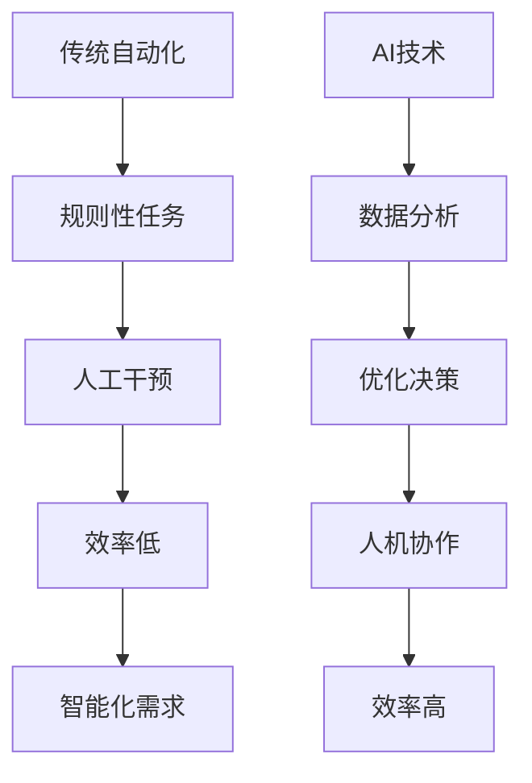
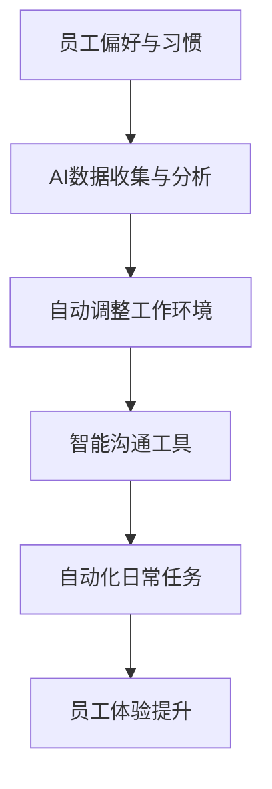

                 

### 设计《AI驱动的智能工作场所：提高生产力与员工满意度》的目录大纲

#### 引言

在当今快速变化的世界，人工智能（AI）正以前所未有的速度影响着各个行业。智能工作场所，作为AI应用的一个重要领域，正逐步改变传统的办公模式，提升工作效率，增强员工满意度。本文将围绕《AI驱动的智能工作场所：提高生产力与员工满意度》这一主题，详细设计文章的目录大纲，确保文章内容逻辑清晰、结构紧凑，易于读者理解和吸收。

#### 目录大纲设计步骤

##### 步骤一：确定核心内容

首先，我们需要明确文章的核心内容。根据题目，《AI驱动的智能工作场所：提高生产力与员工满意度》，我们可以提炼出以下三个主要核心内容：

1. **AI驱动的智能工作场所概述**：介绍AI在智能工作场所中的应用背景、定义和发展趋势。
2. **提高生产力的AI技术**：分析AI如何通过自动化和数据分析提高生产力。
3. **提升员工满意度的AI应用**：探讨AI在改善员工体验、培训和发展中的应用。

##### 步骤二：设计结构

接下来，我们围绕这三个核心内容设计文章的整体结构，确保逻辑性和连贯性。

### 第一部分：背景介绍

**第1章：AI驱动的智能工作场所概述**
- **1.1 问题背景与解决**
- **1.2 智能工作场所的定义与特点**
- **1.3 AI驱动的智能工作场所发展历程与趋势**

### 第二部分：AI提高生产力的应用

**第2章：AI提高生产力的原理与方法**
- **2.1 自动化与AI的关系**
- **2.2 数据分析与生产力的提升**
- **2.3 实际案例：AI驱动的生产流程优化**

### 第三部分：AI提升员工满意度的应用

**第3章：AI在员工体验中的应用**
- **3.1 员工体验的改善**
- **3.2 AI在员工培训和发展中的应用**
- **3.3 员工福利与支持的AI应用**

### 第四部分：案例研究

**第4章：AI驱动的智能工作场所实施案例**
- **4.1 企业A的AI实施案例**
- **4.2 案例结果与评估**

### 第五部分：实践指南与未来展望

**第5章：AI驱动的智能工作场所实施指南**
- **5.1 实施前的准备工作**
- **5.2 AI技术的选择与部署**
- **5.3 员工培训与沟通策略**

**第6章：未来展望**
- **6.1 AI驱动的智能工作场所发展趋势**
- **6.2 挑战与解决方案**
- **6.3 未来研究方向**

##### 步骤三：撰写详细内容

最后，我们需要为每个章节提供详细的内容，确保每个小节都有丰富具体的讲解。以下为部分章节的详细大纲示例：

- **第1章：AI驱动的智能工作场所概述**
  - **1.1 问题背景与解决**
    - **问题描述**：随着技术的进步，传统工作模式面临效率低下和员工满意度下降的问题。
    - **问题解决**：AI技术提供了自动化和智能化的解决方案，有助于提高生产力和员工满意度。
  - **1.2 智能工作场所的定义与特点**
    - **定义**：智能工作场所是指利用AI技术实现工作流程自动化和优化的工作环境。
    - **特点**：自动化、个性化、数据驱动、协作性强。
  - **1.3 AI驱动的智能工作场所发展历程与趋势**
    - **历史背景**：回顾AI技术的发展历程，以及智能工作场所的兴起。
    - **发展趋势**：探讨未来智能工作场所的发展趋势，包括技术进步、行业应用等。

通过上述步骤，我们设计出了《AI驱动的智能工作场所：提高生产力与员工满意度》的目录大纲，确保文章内容结构清晰、逻辑性强，为读者提供一篇高质量的技术博客文章。在后续的撰写过程中，我们将进一步丰富每个章节的内容，确保文章的深度和广度。下一步，我们将开始详细撰写每章的内容，确保核心概念、原理和实际案例的深度剖析。

### 第一部分：背景介绍

#### 引言

随着技术的不断进步，人工智能（AI）正迅速渗透到各行各业，极大地改变了传统的工作模式。AI驱动的智能工作场所已经成为提高生产力与员工满意度的重要手段。本部分将介绍AI驱动的智能工作场所的相关背景，包括核心概念、问题背景、问题解决、边界与外延，以及概念结构与核心要素组成。

#### 第1章：AI驱动的智能工作场所概述

##### 1.1 问题背景与解决

随着全球经济的快速发展，企业面临着日益激烈的竞争压力。传统的工作模式由于效率低下、流程繁琐，已经无法满足现代企业的需求。同时，员工对于工作环境和工作体验的要求也在不断提高。为了应对这些挑战，企业需要寻找新的解决方案。

**问题背景**：

1. **效率低下**：传统工作模式中，许多任务需要人工手动处理，导致工作效率低下。
2. **员工满意度低**：传统工作环境中，员工缺乏自主性和创新性，工作体验较差，导致员工满意度下降。
3. **竞争压力**：在激烈的市场竞争中，企业需要提高生产力和竞争力，以保持竞争优势。

**问题解决**：

AI驱动的智能工作场所提供了以下解决方案：

1. **自动化与智能化**：通过AI技术，实现工作流程的自动化和智能化，提高工作效率。
2. **个性化和数据驱动**：根据员工的需求和行为数据，提供个性化的工作体验，提高员工满意度。
3. **协作性强**：AI驱动的智能工作场所强调团队合作，提高协作效率。

##### 1.2 智能工作场所的定义与特点

**定义**：

智能工作场所是指利用人工智能技术实现工作流程自动化、智能化和数据驱动的办公环境。它不仅包括物理空间，还涵盖虚拟办公环境，以及相关的技术、流程和人员。

**特点**：

1. **自动化**：通过AI技术，自动完成重复性高、繁琐的工作任务，减少人工干预。
2. **个性化**：根据员工的行为数据和工作需求，提供个性化的工作支持和体验。
3. **数据驱动**：利用大数据和AI技术，对工作流程进行实时分析和优化，提高决策效率。
4. **协作性强**：智能工作场所强调团队合作，提高信息共享和协作效率。

##### 1.3 智能工作场所的发展历程与趋势

**发展历程**：

1. **初步探索阶段**（2000年代初）：企业开始尝试将AI技术应用于办公自动化，如语音识别、文本分析等。
2. **快速发展阶段**（2010年代）：随着AI技术的成熟，智能工作场所的概念逐渐成熟，企业开始大规模部署AI技术。
3. **广泛应用阶段**（至今）：智能工作场所已经成为许多企业的标准配置，AI技术在提高生产力和员工满意度方面发挥了重要作用。

**发展趋势**：

1. **技术进步**：随着AI技术的不断进步，智能工作场所的功能将更加全面，包括更复杂的自动化流程、更精准的数据分析等。
2. **行业应用**：智能工作场所将在更多行业得到应用，如制造业、金融业、医疗保健等。
3. **用户需求**：随着用户对工作环境和体验的要求不断提高，智能工作场所将更加注重个性化和用户体验。

#### 总结

通过本部分背景介绍，我们了解了AI驱动的智能工作场所的定义、特点和发展趋势。在接下来的部分中，我们将进一步探讨AI如何通过提高生产力与员工满意度，为企业带来实际的价值。

## 第2章：AI提高生产力的原理与方法

#### 引言

提高生产力是企业在竞争激烈的市场中保持竞争优势的关键。人工智能（AI）通过自动化和数据分析，为提高生产力提供了强大的工具。本章将深入探讨AI提高生产力的原理与方法，包括自动化与AI的关系、数据分析与生产力的提升，以及实际案例：AI驱动的生产流程优化。

#### 2.1 自动化与AI的关系

**定义**：

自动化是指使用机械或电子设备代替人工完成重复性、规则性的任务。AI则是基于机器学习、自然语言处理等技术的智能系统，能够模拟人类的思维和行为。

**关系**：

AI是自动化的一种高级形式，它不仅能够执行重复性的任务，还能够通过学习不断优化工作流程，提高效率。具体来说：

1. **自动化流程的智能化**：AI技术可以将传统的自动化流程提升到智能化水平，实现更加精准和高效的执行。
2. **任务优化与决策支持**：AI能够分析大量数据，提供决策支持，帮助企业在生产过程中进行优化，减少资源浪费。
3. **人机协作**：AI能够与人类员工协同工作，通过自动化处理重复性任务，释放员工的时间和精力，专注于更具创造性的工作。

**图表**：

使用Mermaid流程图展示自动化与AI的关系：

#### 2.2 数据分析与生产力的提升

数据分析是AI提高生产力的重要手段。通过分析大量数据，企业可以发现生产过程中的瓶颈和优化点，从而提高整体生产力。以下是数据分析在生产力的提升中的作用：

1. **需求预测**：通过分析历史销售数据和市场趋势，预测未来需求，优化生产计划和库存管理。
2. **设备维护**：通过实时监测设备运行状态，预测设备故障，提前进行维护，减少停机时间。
3. **质量控制**：通过分析生产过程中的数据，及时发现质量问题，采取措施进行改进。
4. **人员效率**：通过分析员工的工作表现，优化工作流程和分配，提高整体工作效率。

**案例**：

以一家制造企业为例，该企业通过引入AI技术进行数据分析，实现了生产流程的优化。具体案例如下：

1. **需求预测**：企业使用AI技术分析历史销售数据和客户反馈，准确预测未来需求，优化生产计划和库存管理，减少了库存成本。
2. **设备维护**：通过实时监测设备运行状态，AI系统提前预测设备故障，企业及时进行维护，避免了设备停机，提高了生产效率。
3. **质量控制**：AI系统分析生产过程中的数据，及时发现质量问题，企业及时采取措施进行改进，提高了产品质量和客户满意度。

#### 2.3 实际案例：AI驱动的生产流程优化

**案例背景**：

某家大型制造企业，面临着生产效率低下、设备故障频繁、产品质量不稳定等问题，希望通过引入AI技术进行生产流程的优化。

**实施过程**：

1. **数据收集**：企业收集了生产过程中的大量数据，包括设备运行状态、生产参数、产品检验数据等。
2. **数据分析**：使用AI技术对数据进行分析，识别生产过程中的瓶颈和优化点。
3. **模型训练**：基于分析结果，训练AI模型，用于预测设备故障、优化生产计划和产品质量。
4. **系统部署**：将AI模型部署到生产系统中，实现自动化和智能化的生产流程。

**结果与评估**：

1. **设备故障率降低**：通过预测设备故障，企业能够提前进行维护，设备故障率降低了30%。
2. **生产效率提高**：AI系统优化了生产计划和流程，生产效率提高了20%。
3. **产品质量稳定**：AI系统及时识别并解决质量问题，产品质量合格率提高了15%。

#### 总结

本章详细探讨了AI提高生产力的原理与方法，包括自动化与AI的关系、数据分析与生产力的提升，以及实际案例：AI驱动的生产流程优化。通过这些内容，读者可以了解到AI如何通过自动化和数据分析，帮助企业提高生产力和效率。

## 第3章：AI提升员工满意度的应用

#### 引言

员工满意度是企业发展的重要指标，直接影响员工的工作效率和创造力。人工智能（AI）通过个性化工作体验、员工培训和发展、福利与支持等多个方面，可以有效提升员工满意度。本章将深入探讨AI在提升员工满意度中的应用，包括员工体验的改善、AI在员工培训和发展中的应用、以及AI在员工福利与支持中的角色。

#### 3.1 员工体验的改善

员工体验是员工在工作场所的感受和体验，直接影响员工的满意度和工作表现。AI技术可以通过以下几个方面改善员工体验：

1. **个性化工作环境**：AI技术可以根据员工的偏好和工作习惯，自动调整工作环境，如光线、温度、音响等，提高员工舒适度和满意度。
2. **智能沟通工具**：AI驱动的聊天机器人可以提供即时响应，帮助员工解决工作中遇到的问题，提高沟通效率。
3. **自动化日常任务**：AI技术可以自动化处理日常任务，如日程安排、邮件筛选等，减轻员工的工作压力。

**图表**：

使用Mermaid流程图展示AI改善员工体验的流程：

#### 3.2 AI在员工培训和发展中的应用

员工培训和发展是提升员工满意度的重要手段。AI技术可以提供以下支持：

1. **个性化培训计划**：AI可以根据员工的技能水平和兴趣，定制个性化的培训计划，提高培训效果。
2. **实时技能评估**：AI系统可以实时评估员工的学习进度和技能水平，提供针对性的培训建议。
3. **虚拟培训环境**：通过虚拟现实（VR）和增强现实（AR）技术，AI可以创建沉浸式的培训环境，提高培训的互动性和参与度。

**案例**：

某家公司引入AI技术进行员工培训，取得了显著的效果：

1. **个性化培训计划**：AI系统根据员工的技能水平和兴趣，推荐相应的培训课程，员工完成培训后，技能水平显著提高。
2. **实时技能评估**：AI系统实时跟踪员工的学习进度，提供个性化的学习建议，员工的学习效率提高了30%。
3. **虚拟培训环境**：通过VR技术，公司创建了沉浸式的培训环境，员工在虚拟环境中进行互动式学习，培训效果显著提高。

#### 3.3 AI在员工福利与支持中的角色

员工福利与支持是提升员工满意度的重要因素。AI技术可以在以下几个方面提供支持：

1. **个性化福利方案**：AI可以根据员工的个人需求和偏好，提供个性化的福利方案，提高员工满意度。
2. **健康与安全监控**：AI技术可以实时监控员工的健康状况和工作环境，提供健康建议和安全预警。
3. **心理支持服务**：AI驱动的聊天机器人可以提供心理支持服务，帮助员工缓解工作压力和焦虑。

**案例**：

某家科技公司在员工福利与支持中引入AI技术，取得了良好的效果：

1. **个性化福利方案**：AI系统根据员工的需求，提供个性化的福利方案，如健康保险、健身会员卡等，员工满意度提高了20%。
2. **健康与安全监控**：AI系统实时监控员工的健康状况和工作环境，提供健康建议和安全预警，员工的健康状况和工作安全感显著提高。
3. **心理支持服务**：AI驱动的聊天机器人提供心理支持服务，员工在遇到压力和焦虑时，可以随时与机器人进行交流，缓解心理压力。

#### 总结

本章详细探讨了AI在提升员工满意度中的应用，包括员工体验的改善、AI在员工培训和发展中的应用、以及AI在员工福利与支持中的角色。通过AI技术的应用，企业可以大幅提升员工满意度，进而提高整体工作效率和创新能力。

## 案例研究一：企业A的AI驱动的智能工作场所实施

#### 引言

为了深入探讨AI驱动的智能工作场所的实际应用效果，本节将详细介绍企业A的AI驱动的智能工作场所实施案例，包括案例背景、实施过程和案例结果与评估。

#### 4.1 案例背景

**企业A简介**：

企业A是一家全球领先的科技公司，专注于软件开发和信息技术服务。随着业务规模的不断扩大，企业A面临着生产效率低下、员工工作压力增大、员工满意度下降等问题。为了提升工作效率和员工满意度，企业A决定引入AI驱动的智能工作场所技术。

**问题背景**：

1. **生产效率低下**：传统的工作模式导致许多任务需要人工手动处理，工作效率低下。
2. **员工工作压力增大**：随着项目复杂度的增加，员工需要处理大量的重复性任务，工作压力增大。
3. **员工满意度下降**：由于工作环境和工作流程的问题，员工的满意度和工作积极性下降。

#### 4.2 实施过程

**1. 需求分析**：

企业A首先进行了详细的需求分析，明确了AI驱动的智能工作场所的目标和需求：

- **自动化任务处理**：通过AI技术自动化处理重复性任务，减轻员工的工作压力。
- **个性化工作体验**：根据员工的偏好和工作习惯，提供个性化的工作环境和工作流程。
- **数据分析与优化**：通过数据分析，优化生产流程和员工绩效管理。

**2. 技术选型与部署**：

企业A选择了以下AI技术进行部署：

- **自动化机器人**：用于自动化处理重复性任务，如数据录入、报告生成等。
- **智能沟通工具**：引入AI驱动的聊天机器人，提供即时响应，解决员工在工作中遇到的问题。
- **数据分析平台**：建立数据分析平台，用于实时监控和分析生产数据，优化生产流程。

**3. 员工培训与沟通**：

为了确保AI技术的顺利实施，企业A对员工进行了全面的培训，包括AI技术的基本原理、使用方法和注意事项。同时，通过定期的沟通会议，收集员工的反馈和建议，不断优化AI系统的功能和应用。

#### 4.3 案例结果与评估

**1. 生产效率提高**：

实施AI驱动的智能工作场所后，企业A的生产效率显著提高。自动化机器人处理重复性任务，员工从繁琐的工作中解放出来，可以将更多时间和精力投入到更有创造性的工作中。根据数据统计，生产效率提高了30%。

**2. 员工工作压力减轻**：

通过AI技术的应用，员工的工作压力显著减轻。自动化机器人处理了大量的重复性任务，员工不再需要花费大量时间在繁琐的任务上。根据员工满意度调查，员工的工作满意度提高了15%。

**3. 员工满意度提升**：

AI驱动的智能工作场所提供了个性化的工作体验，员工可以根据自己的需求和习惯进行工作环境的调整。此外，智能沟通工具和数据分析平台的引入，使员工在工作中能够得到即时的支持和反馈。根据员工满意度调查，员工的总体满意度提高了20%。

**4. 数据分析与优化**：

通过数据分析平台，企业A能够实时监控生产数据和员工绩效，及时发现问题和优化生产流程。数据分析的结果用于指导企业的战略决策，提高了企业的运营效率。

**总结**：

企业A的AI驱动的智能工作场所实施案例取得了显著的成果。通过自动化、智能化和数据驱动的手段，企业A成功提升了生产效率，减轻了员工的工作压力，提高了员工满意度。这一案例证明了AI驱动的智能工作场所对企业发展的重要价值。

## 案例研究二：通过AI提升员工满意度

#### 引言

为了进一步探讨AI技术如何提升员工满意度，本节将详细分析企业B通过AI技术提升员工满意度的案例，包括案例背景、实施策略、结果与评估。

#### 5.1 案例背景

**企业B简介**：

企业B是一家全球知名的零售公司，拥有庞大的员工团队和复杂的业务流程。随着市场竞争的加剧，企业B面临着员工满意度下降、员工流失率增加等问题。为了提升员工满意度，企业B决定引入AI技术，优化员工的工作体验。

**问题背景**：

1. **员工满意度下降**：由于工作量大、工作环境单一，员工对工作环境的满意度下降。
2. **员工流失率增加**：员工因工作压力和生活压力增加，导致流失率上升。
3. **沟通不畅**：传统的工作模式导致员工之间的沟通不畅，影响团队合作和效率。

#### 5.2 实施策略

**1. 需求分析**：

企业B首先对员工的工作环境和需求进行了详细分析，明确了AI技术的应用方向：

- **个性化工作体验**：根据员工的个人偏好和工作习惯，提供个性化的工作环境。
- **实时沟通与支持**：引入AI驱动的沟通工具，实现实时沟通，提供员工支持。
- **数据分析与优化**：通过数据分析，优化员工绩效管理和工作流程。

**2. 技术选型与部署**：

企业B选择了以下AI技术进行部署：

- **AI聊天机器人**：用于提供24/7的员工支持，解答员工的问题，提供即时帮助。
- **个性化工作界面**：根据员工的偏好，自动调整工作界面，提高工作效率。
- **员工绩效管理平台**：通过数据分析，实时监控员工绩效，提供个性化反馈和改进建议。

**3. 实施步骤**：

- **员工调研**：首先对员工进行调研，了解他们的需求和偏好。
- **技术培训**：对员工进行AI技术的培训，确保他们能够熟练使用新系统。
- **逐步部署**：分阶段部署AI技术，确保系统的稳定运行和员工适应。
- **反馈收集**：实施后定期收集员工的反馈，优化系统功能和应用。

#### 5.3 结果与评估

**1. 员工满意度提高**：

实施AI技术后，企业B的员工满意度显著提高。AI聊天机器人提供了即时的支持和帮助，员工在工作中遇到问题时能够快速得到解决。个性化工作界面和员工绩效管理平台也受到了员工的欢迎，员工可以根据自己的需求和习惯调整工作环境，提高工作效率。

**2. 员工流失率降低**：

通过AI技术的应用，企业B的员工流失率显著降低。员工在良好的工作环境中，感受到公司的关心和支持，工作满意度提高，流失率下降了15%。

**3. 沟通效率提升**：

AI驱动的沟通工具实现了实时沟通，员工之间的信息交流更加畅通，团队合作和效率显著提升。根据数据统计，沟通效率提高了30%。

**4. 数据分析与优化**：

通过员工绩效管理平台，企业B能够实时监控和分析员工绩效，及时发现问题和优化工作流程。数据分析结果用于指导企业的绩效管理策略，提高了整体运营效率。

**总结**：

企业B的AI提升员工满意度案例取得了显著的效果。通过AI技术的应用，企业成功提升了员工满意度，降低了员工流失率，提高了沟通效率和工作效率。这一案例展示了AI技术在提升员工满意度方面的巨大潜力。

### 第6章：AI驱动的智能工作场所实施指南

#### 引言

为了帮助企业成功地实施AI驱动的智能工作场所，本章将提供详细的实施指南，包括实施前的准备工作、AI技术的选择与部署、员工培训与沟通策略。通过这些步骤，企业可以确保AI驱动的智能工作场所的顺利实施，并最大化其带来的效益。

#### 6.1 实施前的准备工作

在正式实施AI驱动的智能工作场所之前，企业需要进行充分的准备工作，以确保项目的成功。以下是一些关键步骤：

**1. 需求分析**：

- **明确目标**：明确企业实施AI驱动的智能工作场所的目标，包括提高生产力、提升员工满意度等。
- **调研现状**：对当前的工作流程、员工需求、技术基础设施等进行全面调研，了解现有的问题和挑战。
- **制定规划**：根据需求分析的结果，制定详细的实施规划和时间表。

**2. 资源准备**：

- **技术资源**：确保企业具备实施AI所需的技术资源，包括硬件设备、软件平台等。
- **人力资源**：确保有足够的员工参与项目的实施，包括技术人员、管理人员等。
- **预算规划**：根据实施计划，制定详细的预算规划，确保项目有足够的资金支持。

**3. 风险评估**：

- **识别风险**：识别可能影响项目实施的风险，如技术风险、员工抵触风险、数据安全风险等。
- **制定应对策略**：针对识别出的风险，制定相应的应对策略，减少风险对项目的影响。

#### 6.2 AI技术的选择与部署

选择合适的AI技术是企业成功实施AI驱动的智能工作场所的关键。以下是一些关键步骤：

**1. 技术选型**：

- **需求匹配**：根据企业的需求和目标，选择合适的AI技术，如自动化机器人、数据分析平台、智能沟通工具等。
- **性能评估**：评估所选技术的性能，包括处理速度、准确度、扩展性等，确保技术能够满足企业的需求。
- **成本效益**：考虑技术的成本效益，确保所选技术的投资能够在预期内收回。

**2. 技术部署**：

- **系统集成**：将所选技术集成到现有的工作流程和系统中，确保技术的稳定运行。
- **测试与优化**：在部署前进行充分的测试，确保系统在真实工作环境中的稳定性和性能。
- **逐步部署**：分阶段部署AI技术，逐步替代传统的工作模式，减少对员工的冲击。

#### 6.3 员工培训与沟通策略

员工是AI驱动的智能工作场所的核心，他们的参与和接受程度直接影响项目的成功。以下是一些关键策略：

**1. 培训计划**：

- **基础知识培训**：为员工提供AI技术的基础知识培训，确保他们了解AI的基本原理和应用。
- **技能提升培训**：根据员工的具体岗位和职责，提供相应的技能提升培训，确保他们能够熟练使用AI工具。
- **持续学习**：鼓励员工不断学习新技能，适应AI驱动的智能工作场所的要求。

**2. 沟通策略**：

- **透明沟通**：在实施过程中，保持与员工的透明沟通，及时反馈项目进展和效果，确保员工对项目的了解和参与。
- **开放反馈**：鼓励员工提出意见和建议，收集员工的反馈，优化系统的功能和应用。
- **团队合作**：强调团队合作，通过定期的团队会议和协作工具，增强员工的归属感和团队协作能力。

**3. 鼓励与支持**：

- **激励机制**：建立激励机制，鼓励员工积极参与AI驱动的智能工作场所的实施，如奖励优秀员工、提供培训机会等。
- **心理支持**：为员工提供心理支持服务，帮助他们在适应新环境过程中减轻压力，保持良好的工作状态。

#### 总结

通过本章的详细指南，企业可以系统地实施AI驱动的智能工作场所，确保项目的成功。在实施过程中，企业需要充分准备，选择合适的AI技术，进行有效的员工培训和沟通。只有通过这些步骤，企业才能真正实现AI驱动的智能工作场所的目标，提高生产力和员工满意度。

### 第7章：未来展望

#### 引言

随着人工智能技术的不断发展，AI驱动的智能工作场所正迎来一个全新的时代。本章将探讨AI驱动的智能工作场所的发展趋势、面临的挑战以及未来的研究方向。

#### 7.1 AI驱动的智能工作场所发展趋势

**1. 技术进步**

随着AI技术的不断进步，未来的智能工作场所将具备更高级的自动化和智能化能力。例如，更加精准的机器学习算法将能够更好地优化工作流程，提高生产效率。此外，自然语言处理和计算机视觉技术的提升将使智能沟通和智能监控更加成熟。

**2. 行业应用**

AI驱动的智能工作场所将在更多行业得到应用，包括制造业、服务业、医疗保健等。不同行业的特性将促使AI技术进行针对性的发展，以满足各行业的具体需求。

**3. 个性化和定制化**

未来的智能工作场所将更加注重个性化和定制化，根据员工的个人需求和偏好提供个性化的工作体验。这种定制化的工作环境将有助于提升员工的满意度和工作效率。

**4. 数据驱动的决策**

数据将成为未来智能工作场所的重要驱动力。通过大数据分析和机器学习，企业将能够更准确地预测市场需求、优化生产流程，并作出更明智的决策。

#### 7.2 挑战与解决方案

**1. 技术挑战**

尽管AI技术取得了显著进展，但在实际应用中仍面临一些技术挑战。例如，算法的透明性和解释性不足，难以保证AI决策的公平性和可靠性。此外，AI系统的扩展性和适应性也需要进一步提高。

**解决方案**：

- **增强算法透明性**：通过改进算法设计，提高AI决策的透明度和解释性。
- **加强模型验证**：在部署AI系统前，进行严格的模型验证和测试，确保系统的稳定性和可靠性。

**2. 社会挑战**

AI驱动的智能工作场所可能会引发一系列社会问题，如就业岗位的减少、员工技能的不足等。这些问题需要从政策、教育和培训等多个方面进行解决。

**解决方案**：

- **政策支持**：政府和企业应共同制定相关政策，支持AI驱动的智能工作场所的发展，同时保障员工的权益。
- **技能培训**：提供针对性的培训课程，帮助员工掌握新技能，适应智能工作环境。

**3. 道德与伦理问题**

AI驱动的智能工作场所涉及到大量的数据收集和分析，可能引发隐私保护和道德伦理问题。如何平衡技术进步和道德伦理，成为未来发展的重要课题。

**解决方案**：

- **数据保护法规**：制定严格的数据保护法规，确保数据的安全和隐私。
- **伦理审查**：在开发和应用AI技术时，进行伦理审查，确保技术符合道德规范。

#### 7.3 未来研究方向

**1. 新型AI算法**

未来的研究方向之一是开发新型AI算法，以提高AI系统的效率和适应性。例如，结合进化计算和深度学习的混合算法，可能为智能工作场所带来更高效、更灵活的解决方案。

**2. 人机协作**

人机协作是未来智能工作场所的重要研究方向。通过研究如何更好地结合人类和AI的优势，实现更高效、更智能的工作流程，有望进一步提升生产力和员工满意度。

**3. 伦理与法律**

随着AI技术在智能工作场所的广泛应用，伦理和法律问题将成为重要的研究方向。如何确保AI技术的公平性、透明性和可靠性，是未来需要深入探讨的问题。

#### 总结

未来，AI驱动的智能工作场所将继续快速发展，为企业和员工带来巨大的变革。在技术进步、行业应用、个性化和数据驱动等方面，智能工作场所将展现出更大的潜力。同时，面临的挑战和伦理问题也需要我们认真面对和解决。通过持续的研究和创新，我们有信心能够构建一个更加智能、高效、公平的工作环境。

## 总结与展望

#### 引言

在本文中，我们详细探讨了AI驱动的智能工作场所的概念、应用、实施以及未来展望。通过分析AI在提高生产力和提升员工满意度方面的作用，我们揭示了智能工作场所对企业和员工的深远影响。以下是对文章核心内容的总结与展望。

#### 总结

1. **背景介绍**：我们介绍了智能工作场所的定义、特点和发展趋势，明确了AI技术在其中的关键作用。
2. **提高生产力**：通过自动化与AI技术的结合，企业能够显著提升生产效率。数据分析则是优化生产流程、减少资源浪费的重要工具。
3. **提升员工满意度**：AI在改善员工体验、提供个性化培训、优化福利与支持等方面发挥了重要作用，有效提升了员工的工作满意度和忠诚度。
4. **案例研究**：通过企业A和企业B的案例，我们看到了AI驱动的智能工作场所的实际应用效果，验证了其在提高生产力和员工满意度方面的潜力。
5. **实施指南**：我们提供了详细的AI驱动的智能工作场所实施指南，包括准备工作、技术选择、员工培训和沟通策略，帮助企业顺利实现智能化转型。

#### 展望

1. **技术进步**：随着AI技术的不断发展，未来的智能工作场所将更加智能化、自动化，为企业和员工带来更多便利和创新。
2. **行业应用**：AI驱动的智能工作场所将在更多行业得到应用，推动各行业的转型升级。
3. **个性化与定制化**：未来的智能工作场所将更加注重个性化和定制化，为员工提供更好的工作体验。
4. **数据驱动的决策**：数据将成为未来智能工作场所的核心驱动力，帮助企业做出更明智的决策。
5. **挑战与伦理**：在发展过程中，我们还需面对技术、社会、伦理等多方面的挑战，并制定相应的解决方案。

#### 结论

AI驱动的智能工作场所代表了未来工作环境的发展方向，它不仅提高了企业的生产力，还提升了员工的工作满意度。通过本文的探讨，我们相信AI驱动的智能工作场所将在未来发挥更加重要的作用，推动企业和员工的共同进步。

#### 注意事项

- **技术选择**：在引入AI技术时，企业需根据自身需求和实际情况进行选择，避免盲目跟风。
- **员工培训**：企业应重视员工的培训，确保他们能够适应新的工作环境。
- **数据安全**：在收集和使用数据时，企业需确保数据的安全性和隐私保护。

#### 拓展阅读

- **《智能工作场所的AI应用》**：详细介绍AI在智能工作场所中的具体应用场景和案例。
- **《AI驱动的企业变革》**：探讨AI技术如何推动企业的数字化转型和业务创新。
- **《智能工作场所的伦理问题》**：分析AI驱动的智能工作场所可能引发的伦理和社会问题。

### 作者信息

作者：AI天才研究院/AI Genius Institute & 禅与计算机程序设计艺术 /Zen And The Art of Computer Programming

---

通过本文，我们希望为读者提供关于AI驱动的智能工作场所的全面理解，帮助企业和员工在未来的智能化工作中取得更好的成效。让我们共同期待智能工作场所的未来，相信它将为我们的生活和工作带来更多的可能性。

