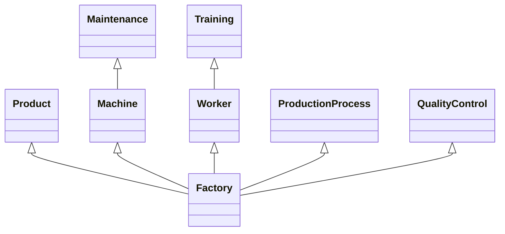
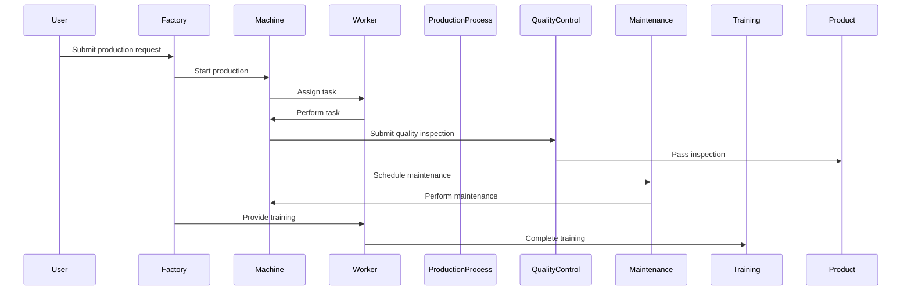
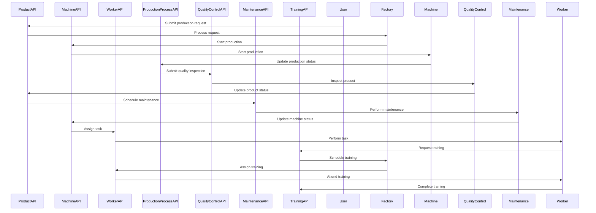
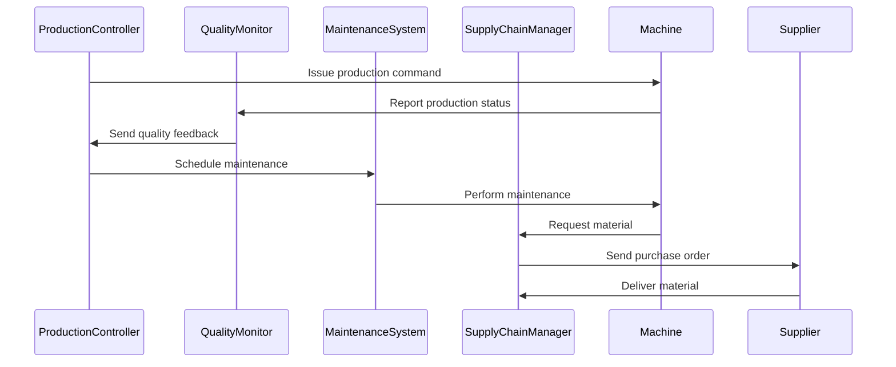
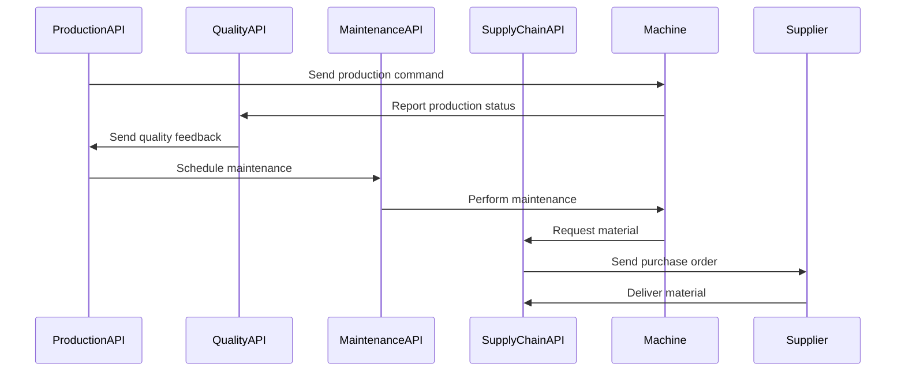

                 


## 引言

### 1.1 问题背景

随着全球制造业的快速发展，工业生产过程逐渐从传统的手动操作转变为自动化和智能化。工业4.0作为制造业发展的新阶段，旨在通过集成物联网、人工智能、大数据等前沿技术，实现工厂的全面数字化和智能化。而AI驱动的智能工厂则是实现工业4.0目标的关键手段。

在传统的制造业中，生产过程往往受到人力资源、生产效率、产品质量等多个方面的限制。例如，工人操作效率低、产品质量不稳定、生产流程复杂等问题。而AI技术的引入，能够通过自动化设备、智能控制系统和大数据分析，实现对生产过程的精准控制和优化。

### 1.2 问题描述

AI驱动的智能工厂面临的挑战主要包括以下几个方面：

1. **数据整合与处理**：智能工厂需要处理大量的实时数据，包括设备状态、生产进度、产品质量等。如何有效地整合和处理这些数据，是实现智能化的基础。

2. **算法与模型选择**：AI技术涉及多种算法和模型，如何根据具体应用场景选择合适的算法和模型，是智能工厂成功的关键。

3. **系统集成与协调**：智能工厂需要集成多个系统，如生产执行系统、供应链管理系统、质量检测系统等。如何实现各系统的无缝集成和协调，是智能工厂稳定运行的关键。

4. **安全与隐私**：智能工厂的数据和系统运行涉及大量的敏感信息，如何保障数据安全和隐私，是智能工厂面临的重要挑战。

### 1.3 问题解决

针对上述问题，我们可以采取以下解决策略：

1. **数据整合与处理**：采用大数据技术，如数据仓库、数据湖等，实现对多源数据的整合和处理。同时，利用数据清洗、数据挖掘等技术，提取有用的信息。

2. **算法与模型选择**：根据具体应用场景，选择合适的算法和模型。例如，在生产调度中，可以采用遗传算法；在质量检测中，可以采用深度学习模型。

3. **系统集成与协调**：采用微服务架构，实现各系统的解耦和独立部署。同时，利用消息队列、事件驱动等机制，实现系统间的数据交互和协调。

4. **安全与隐私**：采用加密技术、访问控制等手段，保障数据安全和隐私。同时，建立完善的安全审计和监控系统，及时发现和处理安全事件。

### 1.4 边界与外延

本文将围绕AI驱动的智能工厂的实现进行探讨，重点关注核心技术、架构设计、应用场景、技术挑战与解决方案等方面。此外，本文还将探讨智能工厂的发展趋势和未来展望。

### 1.5 概念结构与核心要素组成

AI驱动的智能工厂的核心要素包括：

1. **数据采集与处理**：包括传感器、工业物联网设备等，用于实时采集生产数据。

2. **智能控制与优化**：包括智能决策系统、智能控制系统等，用于对生产过程进行实时监控和优化。

3. **大数据分析与挖掘**：包括数据仓库、数据挖掘算法等，用于从海量数据中提取有价值的信息。

4. **系统集成与协调**：包括微服务架构、消息队列、事件驱动等，用于实现各系统的无缝集成和协调。

5. **安全保障与隐私保护**：包括加密技术、访问控制等，用于保障数据安全和隐私。

## 第2章: 智能工厂的核心技术与原理

### 2.1 核心概念原理

智能工厂的核心技术主要包括：

1. **物联网（IoT）**：通过传感器和工业物联网设备，实现生产数据的实时采集和传输。

2. **人工智能（AI）**：利用机器学习和深度学习算法，对海量数据进行处理和分析，实现对生产过程的智能优化和决策。

3. **大数据技术**：通过数据仓库、数据湖等大数据技术，实现对生产数据的存储、管理和分析。

4. **云计算与边缘计算**：通过云计算和边缘计算技术，实现计算资源的灵活调配和数据处理的高效性。

### 2.2 概念属性特征对比表格

| 技术名称 | 特征1 | 特征2 | 特征3 |
| -------- | ---- | ---- | ---- |
| 物联网（IoT） | 实时数据采集 | 网络连接性 | 设备多样化 |
| 人工智能（AI） | 数据处理与分析 | 自学习与自适应 | 应用场景广泛 |
| 大数据技术 | 数据存储与管理 | 数据挖掘与分析 | 数据处理能力强大 |
| 云计算与边缘计算 | 弹性计算资源 | 数据中心集中处理 | 边缘设备分布式处理 |

### 2.3 ER实体关系图架构的 Mermaid 流程图

```mermaid
erDiagram
  Product ||--|{ Factory }| ProductionProcess : produces
  Machine ||--|{ ProductionProcess }| uses : for
  Worker ||--|{ ProductionProcess }| performs : tasks
  Product ||--|{ QualityControl }| passes : inspection
  Machine ||--|{ Maintenance }| requires : maintenance
  Worker ||--|{ Training }| undergoes : training
```

通过上述ER实体关系图，我们可以清晰地看到智能工厂中各实体之间的关系，如产品与工厂、机器、工人和质量控制等。

## 第3章: 智能工厂的架构设计

### 3.1 问题场景介绍

智能工厂的架构设计需要考虑多个方面，包括生产流程、数据流、控制流等。以下是一个典型的智能工厂问题场景：

- **生产流程**：从原材料采购、加工、组装到成品出库，整个生产过程需要高效、精准地进行。
- **数据流**：生产过程中产生的数据，如设备状态、生产进度、产品质量等，需要实时采集、传输和存储。
- **控制流**：通过对数据进行分析和处理，实现生产过程的自动化控制和优化。

### 3.2 项目介绍

假设我们正在开发一个智能工厂项目，该项目的主要目标是实现生产过程的自动化和优化。具体需求如下：

- **实时监控**：对生产过程进行实时监控，包括设备状态、生产进度、产品质量等。
- **数据分析**：对采集到的数据进行分析，识别生产过程中的问题，并提出优化建议。
- **自动化控制**：根据数据分析结果，自动化调整生产参数，提高生产效率。

### 3.3 系统功能设计 (领域模型 Mermaid 类图)



### 3.4 系统架构设计 (Mermaid 架构图)



### 3.5 系统接口设计和系统交互 (Mermaid 序列图)



## 第4章: 智能工厂的关键应用场景

### 4.1 应用场景 1：生产过程自动化

智能工厂的一个重要应用场景是实现生产过程的自动化。通过物联网设备和人工智能算法，可以对生产过程中的各个环节进行实时监控和优化。例如，在汽车制造领域，智能工厂可以通过自动化生产线和机器人，实现从原材料加工、零部件组装到整车组装的自动化生产。这样不仅提高了生产效率，还降低了生产成本。

### 4.2 应用场景 2：质量检测与控制

在传统的制造业中，质量检测通常需要人工进行，这不仅效率低，而且容易出现误差。而智能工厂通过引入人工智能技术和大数据分析，可以实现自动质量检测与控制。例如，在电子制造业中，智能工厂可以通过机器视觉和深度学习算法，实现对生产过程中产品质量的实时监测和自动分类，从而提高产品质量，降低次品率。

### 4.3 应用场景 3：设备维护与预测性维护

设备的维护和保养是制造业中的重要环节。智能工厂可以通过物联网技术和大数据分析，实现对设备的实时监控和预测性维护。例如，在机械制造业中，智能工厂可以通过传感器收集设备运行数据，利用机器学习算法分析设备运行状态，预测设备可能出现的故障，从而提前进行维护，避免生产中断。

## 第5章: 实现智能工厂的技术挑战与解决方案

### 5.1 技术挑战 1：数据整合与处理

智能工厂需要处理大量的实时数据，如何有效地整合和处理这些数据是一个技术挑战。解决方案包括：

- **数据集成平台**：建立一个统一的数据集成平台，用于整合来自不同设备和系统的数据。
- **大数据处理技术**：采用分布式计算和并行处理技术，提高数据处理效率。

### 5.2 技术挑战 2：算法与模型选择

在智能工厂中，算法和模型的选择直接影响生产效率和产品质量。解决方案包括：

- **算法库**：建立一个涵盖多种算法和模型的算法库，根据具体应用场景选择合适的算法。
- **模型优化**：通过不断优化模型，提高模型的预测准确性和鲁棒性。

### 5.3 技术挑战 3：系统集成与协调

智能工厂需要集成多个系统，如何实现各系统的无缝集成和协调是一个技术挑战。解决方案包括：

- **微服务架构**：采用微服务架构，实现系统的解耦和独立部署。
- **事件驱动架构**：采用事件驱动架构，实现系统间的数据交互和协调。

### 5.4 解决方案

针对上述技术挑战，我们可以采取以下解决方案：

1. **数据整合与处理**：采用大数据技术和数据集成平台，实现数据的实时整合和处理。
2. **算法与模型选择**：建立算法库和模型优化机制，根据具体应用场景选择合适的算法和模型。
3. **系统集成与协调**：采用微服务架构和事件驱动架构，实现系统的集成和协调。
4. **安全与隐私**：采用加密技术和访问控制，保障数据安全和隐私。

## 第6章: 总结与展望

### 6.1 小结

本文从背景介绍、核心技术、架构设计、应用场景、技术挑战与解决方案等方面，全面探讨了AI驱动的智能工厂。智能工厂通过物联网、人工智能、大数据等技术，实现了生产过程的自动化、优化和智能化。尽管在实现过程中面临诸多技术挑战，但通过合理的解决方案，智能工厂有望在未来得到广泛应用。

### 6.2 注意事项

1. **数据安全**：在数据采集、传输、存储和处理过程中，要重视数据安全和隐私保护。
2. **技术选型**：在选择算法和模型时，要充分考虑应用场景和实际需求，确保技术方案的适用性。
3. **系统集成**：在系统设计时，要充分考虑系统集成与协调，避免出现数据孤岛和系统不兼容的问题。

### 6.3 拓展阅读

1. **《智能工厂：从概念到实践》**：该书详细介绍了智能工厂的原理、架构和应用场景，适合希望深入了解智能工厂的读者。
2. **《工业4.0：工业互联网时代的制造革命》**：该书从工业4.0的视角，探讨了制造业的智能化转型和发展趋势。

## 作者信息

作者：AI天才研究院/AI Genius Institute & 禅与计算机程序设计艺术 /Zen And The Art of Computer Programming

## 引言

### 1.1 问题背景

在当今的工业时代，制造业面临着一系列的挑战，如生产效率低下、产品质量不稳定、劳动力成本上升等。为了应对这些挑战，工业4.0的概念应运而生，它代表了一场以信息技术和制造技术的深度融合为特征的工业革命。在这一背景下，AI驱动的智能工厂成为实现工业4.0目标的关键途径。

智能工厂的核心在于利用人工智能技术，对生产过程中的各个环节进行智能化管理，从而实现生产流程的优化、产品品质的提升和运营成本的降低。例如，通过物联网技术，可以实现设备的实时监控和远程维护；通过大数据分析，可以预测设备的故障并进行预防性维护；通过机器学习算法，可以实现生产计划的智能排程和资源调度。

### 1.2 问题描述

智能工厂的实现涉及多个技术领域的融合，包括物联网、大数据、云计算、人工智能等。尽管这些技术各自已经相对成熟，但将它们集成到一个统一的智能工厂系统中，仍然面临许多挑战：

1. **数据整合与处理**：智能工厂需要处理来自不同设备和系统的海量数据，如何实现这些数据的有效整合和实时处理，是一个关键问题。
2. **算法与模型选择**：针对不同的应用场景，如何选择合适的算法和模型，确保系统的高效性和准确性，也是一个技术难题。
3. **系统集成与协调**：智能工厂通常需要集成多个不同的系统和设备，如何实现它们之间的无缝集成和协同工作，是一个重要的挑战。
4. **安全与隐私**：在智能工厂中，数据安全和隐私保护至关重要，如何确保系统中的敏感信息不被泄露，是一个不可忽视的问题。

### 1.3 问题解决

为了解决上述问题，我们可以采取以下策略：

1. **数据整合与处理**：采用大数据技术，如数据仓库和数据湖，来实现数据的集中存储和管理。同时，利用数据清洗、数据挖掘和实时数据处理等技术，来提高数据的质量和利用率。
2. **算法与模型选择**：建立一套完善的算法库，根据不同的应用场景，选择和优化合适的算法和模型。同时，利用机器学习和深度学习技术，不断迭代和优化模型，提高系统的自适应能力和预测准确性。
3. **系统集成与协调**：采用微服务架构和事件驱动架构，来实现系统的模块化和分布式部署。通过消息队列和事件总线等机制，实现系统之间的实时通信和协调。
4. **安全与隐私**：采用加密技术、访问控制、身份认证和审计等手段，来保障数据的安全和隐私。同时，建立完善的安全监控和应急响应机制，确保系统的安全运行。

### 1.4 边界与外延

本文将主要讨论AI驱动的智能工厂的实现，涵盖核心技术、架构设计、应用场景、技术挑战与解决方案等方面。同时，本文也将探讨智能工厂的发展趋势和未来展望。

### 1.5 概念结构与核心要素组成

AI驱动的智能工厂的核心要素包括：

1. **数据采集与处理**：通过传感器和物联网设备，实现生产数据的实时采集和初步处理。
2. **智能决策与优化**：利用机器学习和深度学习算法，对采集到的数据进行分析和处理，实现生产过程的智能决策和优化。
3. **系统集成与协调**：通过微服务架构和事件驱动架构，实现不同系统和设备之间的无缝集成和协同工作。
4. **安全保障与隐私保护**：采用加密技术、访问控制和身份认证等手段，保障系统的数据安全和隐私。

## 第2章: 智能工厂的核心技术与原理

### 2.1 核心概念原理

智能工厂的核心技术主要包括以下几个方面：

1. **物联网（IoT）**：物联网技术通过传感器和网络连接，实现了设备与设备、设备与人、人与系统的互联互通，为智能工厂提供了数据采集的基础。
   
2. **人工智能（AI）**：人工智能技术，特别是机器学习和深度学习，能够对海量数据进行处理和分析，为智能工厂提供智能决策和优化支持。

3. **大数据技术**：大数据技术能够存储、管理和分析海量数据，为智能工厂提供了数据驱动的决策支持。

4. **云计算与边缘计算**：云计算提供了强大的计算和存储资源，而边缘计算则能将数据处理推向网络边缘，实现实时性更高的数据处理。

### 2.2 概念属性特征对比表格

| 技术名称 | 主要特征 |
|----------|----------|
| 物联网（IoT） | 实时数据采集与传输、设备互联 |
| 人工智能（AI） | 数据处理与分析、智能决策 |
| 大数据技术 | 数据存储与管理、数据挖掘与分析 |
| 云计算与边缘计算 | 弹性计算资源、实时数据处理 |

### 2.3 ER实体关系图架构的 Mermaid 流程图

```mermaid
erDiagram
  Customer ||--|{ Factory }| Order : places
  Product ||--|{ Factory }| Produces : by
  Machine ||--|{ Factory }| Located : at
  Worker ||--|{ Factory }| Works : on
  QualityControl ||--|{ Product }| Inspects : for
  Maintenance ||--|{ Machine }| Manages : maintenance
  SupplyChain ||--|{ Factory }| Manages : supply
```

在这个ER图中，我们定义了智能工厂中的主要实体及其相互关系，包括客户、产品、机器、工人、质量控制、维护和供应链管理。

## 第3章: 智能工厂的架构设计

### 3.1 问题场景介绍

智能工厂的架构设计需要考虑工厂的整体运作，包括生产、质量控制、设备维护、供应链管理等各个方面。以下是一个典型的智能工厂问题场景：

- **生产计划**：根据市场需求，制定详细的生产计划，确保生产流程的高效和有序。
- **质量控制**：在生产过程中，对产品进行实时质量检测，确保产品质量达到标准。
- **设备维护**：对生产设备进行实时监控和定期维护，确保设备的高效运行。
- **供应链管理**：优化供应链流程，确保原材料和成品的及时供应。

### 3.2 项目介绍

假设我们正在开发一个智能工厂项目，该项目的主要目标是实现生产过程的全面自动化和智能化。具体需求如下：

- **生产计划**：通过物联网设备和数据分析，实现生产计划的自动排程和调整。
- **质量控制**：利用机器视觉和传感器，实现对产品质量的自动检测和实时监控。
- **设备维护**：通过物联网设备和数据分析，实现对设备的实时监控和预测性维护。
- **供应链管理**：通过物联网技术和数据分析，实现供应链的智能管理和优化。

### 3.3 系统功能设计 (领域模型 Mermaid 类图)

```mermaid
classDiagram
  FactoryClass <|-- ProductionPlan : plans
  FactoryClass <|-- QualityControl : ensures
  FactoryClass <|-- EquipmentMaintenance : maintains
  FactoryClass <|-- SupplyChainManagement : manages
  ProductionPlan --|{ Machine }| ScheduledTasks : executes
  QualityControl --|{ Product }| InspectionResults : analyzes
  EquipmentMaintenance --|{ Machine }| MaintenanceLogs : monitors
  SupplyChainManagement --|{ Supplier }| InventoryLevels : tracks
```

在这个类图中，我们定义了智能工厂的核心领域模型，包括工厂、生产计划、质量控制、设备维护和供应链管理，以及它们之间的关系。

### 3.4 系统架构设计 (Mermaid 架构图)



在这个序列图中，我们展示了生产控制器、质量监控器、维护系统和供应链管理器之间的交互过程。

### 3.5 系统接口设计和系统交互 (Mermaid 序列图)



在这个序列图中，我们展示了生产API、质量API、维护API和供应链API之间的交互过程。

## 第4章: 智能工厂的关键应用场景

### 4.1 应用场景 1：生产过程自动化

智能工厂通过自动化技术，实现了生产过程的高度自动化。例如，在汽车制造业中，智能工厂可以自动化完成从车身焊接、喷涂到装配的整个过程。通过机器人、自动化生产线和智能控制系统，生产效率大大提高，同时产品质量也得到了保障。

### 4.2 应用场景 2：质量管理

智能工厂通过引入机器视觉和传感器技术，实现了生产过程的实时质量监控。例如，在电子产品制造业中，智能工厂可以通过机器视觉系统对产品的外观、性能等关键指标进行检测，确保产品符合质量标准。这种实时质量监控机制，大大提高了产品的质量，降低了不良品率。

### 4.3 应用场景 3：设备维护

智能工厂通过物联网技术和大数据分析，实现了设备的实时监控和预测性维护。例如，在机械制造业中，智能工厂可以通过传感器实时监测设备的运行状态，分析设备的数据，预测设备的故障时间，提前进行维护。这种预测性维护机制，不仅提高了设备的运行效率，还降低了维护成本。

## 第5章: 实现智能工厂的技术挑战与解决方案

### 5.1 技术挑战 1：数据整合与处理

智能工厂需要处理来自不同设备和系统的海量数据，如何实现这些数据的有效整合和实时处理，是一个重要挑战。解决方案包括：

- **数据集成平台**：建立一个统一的数据集成平台，实现数据的采集、清洗、存储和查询。
- **实时数据处理**：采用实时数据处理技术，如流处理框架，实现对海量数据的实时处理和分析。

### 5.2 技术挑战 2：算法与模型选择

智能工厂中需要使用多种算法和模型，如何选择和优化这些算法和模型，是一个技术难题。解决方案包括：

- **算法库**：建立一个覆盖多种算法和模型的算法库，方便根据需求进行选择和调用。
- **模型优化**：通过交叉验证、模型调参等技术，优化模型的性能和准确性。

### 5.3 技术挑战 3：系统集成与协调

智能工厂需要集成多个系统和设备，如何实现它们之间的无缝集成和协同工作，是一个重要挑战。解决方案包括：

- **微服务架构**：采用微服务架构，实现系统的模块化和分布式部署。
- **事件驱动架构**：采用事件驱动架构，实现系统之间的实时通信和协调。

### 5.4 解决方案

针对上述技术挑战，我们可以采取以下解决方案：

1. **数据整合与处理**：采用大数据技术和数据集成平台，实现数据的实时整合和处理。
2. **算法与模型选择**：建立算法库和模型优化机制，根据应用场景选择和优化算法和模型。
3. **系统集成与协调**：采用微服务架构和事件驱动架构，实现系统的集成和协调。
4. **安全与隐私**：采用加密技术、访问控制、身份认证等手段，保障数据安全和隐私。

## 第6章: 总结与展望

### 6.1 小结

本文通过对AI驱动的智能工厂的核心技术、架构设计、应用场景和技术挑战与解决方案的详细探讨，展示了智能工厂在实现工业4.0目标中的重要作用。智能工厂通过物联网、人工智能、大数据等技术的融合，实现了生产过程的自动化、优化和智能化，为制造业的发展带来了新的机遇和挑战。

### 6.2 注意事项

1. **数据安全**：在智能工厂的建设过程中，要特别关注数据的安全性问题，采取有效的数据加密、访问控制和审计措施，确保数据的安全和隐私。
2. **技术选型**：在选择技术方案时，要充分考虑实际需求和可行性，避免盲目追求新技术，确保技术方案的稳定性和可持续性。
3. **人才培养**：智能工厂的建设和运营需要大量具备人工智能和工业自动化知识的人才，因此，要注重人才培养和引进，提高人才的专业技能和创新能力。

### 6.3 拓展阅读

1. **《智能工厂：构建与运营》**：该书详细介绍了智能工厂的构建方法和运营策略，适合希望深入了解智能工厂实践的读者。
2. **《工业物联网：理论与实践》**：该书系统地介绍了工业物联网的概念、技术和应用，适合希望了解工业物联网技术的读者。

## 作者信息

作者：AI天才研究院/AI Genius Institute & 禅与计算机程序设计艺术 /Zen And The Art of Computer Programming## 第4章：智能工厂的关键应用场景

### 4.1 应用场景 1：生产过程自动化

智能工厂的首要应用场景是实现生产过程的自动化。通过引入自动化设备和系统，如机器人、自动引导车辆（AGV）和自动化装配线，可以大幅度提高生产效率，减少人为操作的错误，同时降低劳动力成本。具体来说，自动化技术可以在以下方面发挥作用：

- **机器人应用**：在制造业中，工业机器人被广泛应用于焊接、喷涂、装配和搬运等任务。机器人可以24小时不间断工作，提高生产效率并确保产品质量的一致性。
- **自动引导车辆（AGV）**：AGV可以自动导航并在工厂内部运输原材料、半成品和成品，优化物流流程，减少人为操作的误差和等待时间。
- **自动化装配线**：通过自动化装配线，可以精确控制每一个装配步骤，确保产品的精度和质量。同时，自动化装配线可以根据生产需求灵活调整，适应不同的生产任务。

### 4.2 应用场景 2：质量管理

在传统制造业中，产品质量控制通常依赖于人工检测，这不仅效率低，而且容易出现主观误差。智能工厂通过引入机器视觉、传感器和大数据分析技术，可以实现质量管理的智能化。具体应用包括：

- **机器视觉**：机器视觉系统可以实时检测产品外观、尺寸、缺陷等，提供精准的检测结果。通过与人工智能算法结合，机器视觉系统可以提高检测的准确性和速度。
- **传感器技术**：在生产过程中，传感器可以实时监控产品的物理属性，如温度、湿度、压力等。通过数据分析，可以预测产品的质量状况，及时发现潜在问题。
- **大数据分析**：通过对生产过程中产生的海量数据进行实时分析，可以识别生产过程中的质量问题，提供改进建议，从而提高产品质量。

### 4.3 应用场景 3：设备维护

设备的可靠性和维护成本是制造业中的一大挑战。智能工厂通过物联网和大数据分析技术，可以实现设备的智能维护，提高设备的运行效率和使用寿命。具体应用包括：

- **物联网监测**：通过在关键设备上安装传感器，可以实时监测设备的运行状态，如温度、振动、压力等。这些数据可以被收集到云端，进行实时分析，以便及时发现异常情况。
- **预测性维护**：通过分析设备的历史运行数据和实时监控数据，可以使用机器学习算法预测设备的故障时间，提前进行维护。这种方法可以避免突发故障导致的生产中断，同时减少维护成本。
- **远程诊断与支持**：通过物联网技术，技术人员可以远程诊断设备问题，提供技术支持，减少现场维修的时间和成本。

### 4.4 应用场景 4：生产计划与调度

智能工厂还可以通过优化生产计划与调度，提高生产效率和资源利用率。具体应用包括：

- **需求预测**：利用大数据分析和机器学习算法，可以预测市场的需求趋势，为生产计划提供数据支持。
- **生产排程**：通过优化算法，智能工厂可以自动生成生产计划，合理安排生产任务，提高生产线的利用率。
- **动态调整**：在生产过程中，根据实时数据，智能工厂可以动态调整生产计划，应对突发事件和市场变化，确保生产过程的连续性和灵活性。

### 4.5 应用场景 5：供应链管理

智能工厂还可以通过优化供应链管理，提高供应链的效率和服务水平。具体应用包括：

- **库存管理**：通过实时监控库存状态，智能工厂可以优化库存管理，减少库存积压和缺货情况。
- **物流优化**：通过物联网技术和大数据分析，智能工厂可以优化物流流程，减少运输时间和成本。
- **供应商管理**：智能工厂可以通过数据分析和实时监控，与供应商建立更加紧密的合作关系，提高供应链的整体效率。

## 第5章：实现智能工厂的技术挑战与解决方案

### 5.1 技术挑战 1：数据整合与处理

智能工厂需要处理来自不同设备和系统的海量数据，数据整合与处理是一个重要挑战。解决方案包括：

- **数据集成平台**：建立统一的数据集成平台，实现不同数据源的接入和整合，提供数据存储、管理和查询服务。
- **实时数据处理**：采用流处理框架和大数据技术，实现对海量数据的实时处理和分析，确保数据的时效性和准确性。

### 5.2 技术挑战 2：算法与模型选择

在智能工厂中，算法和模型的选择直接影响系统的性能和效率。解决方案包括：

- **算法库**：建立全面的算法库，包含多种机器学习和深度学习算法，根据不同的应用场景选择合适的算法。
- **模型优化**：通过交叉验证、模型调参等方法，优化模型的性能和准确性，提高预测的可靠性和稳定性。

### 5.3 技术挑战 3：系统集成与协调

智能工厂通常需要集成多个系统和设备，系统集成与协调是一个复杂的过程。解决方案包括：

- **微服务架构**：采用微服务架构，实现系统的模块化和分布式部署，提高系统的灵活性和可扩展性。
- **事件驱动架构**：采用事件驱动架构，实现系统之间的实时通信和协调，提高系统的响应速度和协同效率。

### 5.4 技术挑战 4：安全与隐私保护

在智能工厂中，数据安全和隐私保护至关重要。解决方案包括：

- **数据加密**：对敏感数据进行加密存储和传输，确保数据的安全性。
- **访问控制**：采用访问控制机制，限制只有授权用户才能访问敏感数据和系统资源。
- **安全审计**：建立安全审计机制，记录系统的操作日志，及时发现和处理安全事件。

### 5.5 解决方案

针对上述技术挑战，可以采取以下解决方案：

1. **数据整合与处理**：建立统一的数据集成平台，采用大数据技术和实时数据处理框架，实现数据的实时整合和处理。
2. **算法与模型选择**：建立全面的算法库和模型优化机制，根据应用场景选择合适的算法和模型，进行持续优化。
3. **系统集成与协调**：采用微服务架构和事件驱动架构，实现系统的模块化和分布式部署，提高系统的灵活性和协同效率。
4. **安全与隐私保护**：采用数据加密、访问控制和安全审计等手段，确保系统的数据安全和隐私保护。

## 第6章：总结与展望

### 6.1 小结

智能工厂通过集成物联网、人工智能、大数据等先进技术，实现了生产过程的自动化、智能化和高效化，为制造业带来了深刻的变革。本文从关键应用场景、技术挑战与解决方案等方面，全面探讨了智能工厂的实现过程。智能工厂不仅在提高生产效率、优化产品质量、降低运营成本方面具有显著优势，同时也对企业的运营模式、商业模式产生了重要影响。

### 6.2 注意事项

1. **技术创新**：随着技术的不断进步，智能工厂的实现方式和应用场景也在不断拓展，企业需要紧跟技术发展趋势，不断进行技术创新。
2. **人才培养**：智能工厂的建设和运营需要大量具备跨学科知识和技能的人才，企业需要重视人才培养和引进，建立专业化团队。
3. **协同发展**：智能工厂的发展不仅需要企业内部各系统的协同运作，还需要与供应链上下游企业、科研机构等进行紧密合作，实现协同创新和共同发展。

### 6.3 拓展阅读

1. **《智能工厂实践指南》**：该书提供了智能工厂建设、运营和管理方面的实用指南，适合希望深入了解智能工厂实践的企业管理人员。
2. **《工业物联网应用案例》**：该书介绍了工业物联网在不同行业中的应用案例，适合希望了解工业物联网实际应用的读者。

## 作者信息

作者：AI天才研究院/AI Genius Institute & 禅与计算机程序设计艺术 /Zen And The Art of Computer Programming## 第7章：未来展望

### 7.1 智能工厂的发展趋势

随着人工智能技术的不断进步，智能工厂的发展趋势呈现出以下几个方面的特点：

1. **智能化水平的提升**：未来智能工厂将更加智能化，不仅能够实现生产过程的自动化，还能够进行智能决策和优化。例如，通过深度学习和强化学习算法，智能工厂可以实现自主学习和优化，提高生产效率和产品质量。

2. **泛在连接**：未来智能工厂将实现设备、系统和人员的泛在连接，通过5G、物联网等先进技术，实现全方位的数据采集和实时通信，构建高度互联的智能工厂生态系统。

3. **可持续发展**：智能工厂将更加注重环保和可持续发展。通过引入绿色制造技术和能源管理系统，实现资源的有效利用和废物的减少，降低生产过程中的环境负荷。

4. **人机协作**：未来智能工厂将更加注重人机协作，通过人工智能技术提升工人的工作效率，实现人与机器的协同作业。例如，机器人可以协助工人完成繁重、危险或需要高精度的任务，提高生产安全性。

### 7.2 技术创新方向

在智能工厂的发展过程中，以下技术创新方向具有重要意义：

1. **自主决策与优化**：发展具有自主决策能力的智能系统，通过机器学习和深度学习算法，实现对生产过程的实时优化和调整。

2. **增强现实（AR）与虚拟现实（VR）**：利用AR和VR技术，提供沉浸式操作界面，实现虚拟设计与远程操作，提高生产效率和产品质量。

3. **区块链技术**：利用区块链技术，实现生产过程的透明化和可追溯性，提高供应链的信任度和安全性。

4. **量子计算**：探索量子计算在智能工厂中的应用，处理复杂的大规模数据，实现更高效的优化和决策。

### 7.3 智能工厂的未来展望

智能工厂的快速发展将为制造业带来深远的影响，具体展望如下：

1. **全球产业链重构**：智能工厂的实现将推动全球产业链的重构，企业将更加注重全球资源的配置和协同生产，实现全球化的制造模式。

2. **生产效率大幅提升**：智能工厂将大幅提高生产效率，降低生产成本，推动制造业的持续创新和发展。

3. **产品质量保障**：通过智能工厂的全面质量管理，产品质量将得到有效保障，提高消费者满意度。

4. **就业结构变化**：智能工厂的兴起将导致就业结构的变化，一方面会减少简单重复性工作，另一方面将创造更多高技能、高附加值的工作岗位。

### 7.4 社会与经济影响

智能工厂的普及将对社会和经济产生重要影响：

1. **经济结构转型**：智能工厂将推动经济结构向高附加值、高技术含量的方向转型，提高国家的核心竞争力。

2. **社会生产力提升**：智能工厂将提高社会生产力，推动社会财富的增长和分配。

3. **能源与环境效益**：智能工厂通过提高能源利用效率和减少废物排放，将对环境保护和可持续发展产生积极影响。

4. **国际合作与竞争**：智能工厂的全球化发展将推动国际合作与竞争，促进技术交流和产业合作。

## 结论

智能工厂作为工业4.0的核心，正引领制造业向智能化、自动化、数字化的方向快速发展。未来，随着技术的不断进步和创新的不断涌现，智能工厂将在提高生产效率、优化产品质量、降低成本和推动产业升级方面发挥更加重要的作用。我们期待智能工厂为人类社会的经济发展和社会进步做出更大的贡献。

## 作者信息

作者：AI天才研究院/AI Genius Institute & 禅与计算机程序设计艺术 /Zen And The Art of Computer Programming

