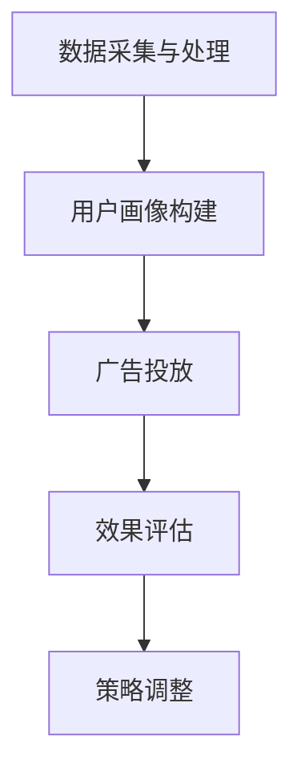

                 

### AI驱动的智能广告投放：精准定向与效果优化

#### 关键词：AI、智能广告、精准定向、效果优化、算法、模型

> 摘要：随着人工智能技术的不断发展，AI驱动的智能广告投放已经成为广告行业的重要趋势。本文将详细探讨AI在智能广告投放中的应用，包括精准定向和效果优化的技术原理、实战案例以及最佳实践，旨在为广告主和广告商提供有价值的参考和指导。

## 引言

在数字营销日益发展的今天，广告投放已经成为企业获取用户关注和促进销售的重要手段。传统的广告投放方式往往依赖于广告主的直觉和经验，而随着大数据、机器学习和深度学习等技术的崛起，AI驱动的智能广告投放逐渐成为行业的新宠。智能广告投放不仅能够提高广告的精准度，还能够实现效果的优化，从而最大化广告的投资回报率（ROI）。

本文将围绕以下四个核心问题展开讨论：

1. **智能广告的基本概念和原理是什么？**
2. **如何实现广告投放的精准定向？**
3. **广告投放效果如何进行优化？**
4. **哪些实战案例展示了AI驱动的智能广告投放的实际效果？**

通过这些问题的探讨，希望能够为读者提供一个全面而深入的AI智能广告投放的视角。

## 第一部分：背景介绍与核心概念

### 第1章：智能广告投放概述

#### 1.1 智能广告的基本概念

智能广告是指利用人工智能技术，根据用户的兴趣、行为和历史数据，进行精准投放的广告。与传统广告相比，智能广告具有以下几个显著特点：

- **个性化和精准化**：通过分析用户的兴趣和行为数据，智能广告能够实现个性化推荐，提高广告的相关性和投放效果。
- **自动化和智能化**：智能广告投放系统可以自动处理大量的用户数据，进行实时分析，并自动调整广告策略。
- **效果可量化**：智能广告投放系统可以跟踪和分析广告效果，通过数据驱动的方式优化广告投放策略。

#### 1.2 智能广告的发展历程

智能广告的发展可以追溯到20世纪90年代，随着互联网的普及和大数据技术的应用，智能广告逐渐从理论走向实践。以下是智能广告发展历程的关键阶段：

- **早期广告投放**：主要以展示广告为主，广告投放主要依赖于广告主的经验和直觉。
- **大数据广告**：随着大数据技术的应用，广告投放开始利用用户行为数据进行分析和预测。
- **智能广告**：利用人工智能技术，实现个性化推荐和实时优化，广告投放效果大幅提升。

#### 1.3 智能广告的核心技术

智能广告的核心技术主要包括用户行为分析、用户画像构建、广告投放算法和效果评估等。以下是这些技术的简要介绍：

- **用户行为分析**：通过分析用户的浏览历史、搜索记录和购买行为，了解用户的兴趣和行为模式。
- **用户画像构建**：将用户行为数据进行加工处理，形成用户画像，用于广告的精准投放。
- **广告投放算法**：包括基于内容的定向广告、基于协同过滤的广告、基于用户行为的实时广告投放等。
- **效果评估**：通过点击率（CTR）、转化率（CVR）等指标，评估广告投放的效果，并实时调整策略。

### 第2章：AI与智能广告

#### 2.1 AI在广告领域的应用

人工智能技术在广告领域的应用主要包括以下几个方面：

- **用户行为分析**：通过机器学习算法，分析用户的浏览、搜索和购买行为，实现用户兴趣的挖掘和细分。
- **广告创意生成**：利用深度学习技术，自动生成广告创意，提高广告的吸引力和转化率。
- **广告效果预测**：通过大数据分析和机器学习模型，预测广告的投放效果，优化广告投放策略。

#### 2.2 AI驱动广告的优势与挑战

AI驱动广告的优势主要包括：

- **提高广告的精准度**：通过用户行为分析和用户画像构建，实现个性化广告投放，提高广告的点击率和转化率。
- **降低广告成本**：通过自动化和智能化的广告投放，降低广告主的人力成本和广告投放成本。
- **实时优化广告效果**：通过实时数据分析和机器学习模型，及时调整广告投放策略，最大化广告投资回报率。

然而，AI驱动广告也面临着一些挑战：

- **数据隐私问题**：广告投放需要大量的用户数据，如何保护用户隐私成为一个重要的问题。
- **算法偏见**：机器学习模型可能会受到训练数据偏差的影响，导致广告投放结果的不公平性。
- **技术门槛**：AI驱动广告需要较高的技术门槛，对广告主和广告商的技术能力提出了较高的要求。

#### 2.3 AI在广告投放中的关键作用

AI在广告投放中的关键作用主要体现在以下几个方面：

- **提高广告投放的精准度**：通过用户行为分析和用户画像构建，实现精准定向广告投放。
- **优化广告投放效果**：通过实时数据分析和机器学习模型，优化广告投放策略，提高广告的点击率和转化率。
- **降低广告投放成本**：通过自动化和智能化的广告投放，降低广告主和广告商的广告投放成本。

## 第二部分：技术原理

### 第3章：智能广告投放的现状与挑战

#### 3.1 智能广告投放的全球趋势

随着人工智能技术的快速发展，智能广告投放已经成为全球广告市场的重要趋势。以下是智能广告投放的全球趋势：

- **用户数据的重要性**：用户数据成为广告投放的核心资源，数据驱动的广告投放策略越来越受欢迎。
- **跨平台广告投放**：随着移动互联网的普及，广告投放逐渐从单一平台转向多平台、跨终端的投放。
- **个性化广告投放**：个性化广告投放已经成为主流，通过分析用户行为数据，实现个性化推荐和精准投放。
- **算法驱动的广告投放**：机器学习算法在广告投放中的应用越来越广泛，通过实时数据分析和预测，优化广告投放策略。

#### 3.2 广告主面临的挑战

广告主在智能广告投放中面临的挑战主要包括：

- **数据隐私**：用户数据的使用和保护是广告主需要重视的问题，如何在确保用户隐私的前提下进行广告投放是一个重要挑战。
- **数据质量**：广告主需要确保数据的准确性、完整性和及时性，高质量的数据是广告投放成功的关键。
- **技术门槛**：AI驱动广告需要较高的技术门槛，广告主需要具备相应的技术能力和资源。

#### 3.3 广告商面临的挑战

广告商在智能广告投放中面临的挑战主要包括：

- **竞争激烈**：随着越来越多的广告商加入智能广告投放的行列，市场竞争日益激烈，广告商需要不断创新和优化广告投放策略。
- **效果评估**：广告商需要准确评估广告投放的效果，通过数据分析和反馈，优化广告投放策略。
- **技术升级**：广告商需要不断跟进和升级技术，以应对人工智能技术的快速发展和变化。

## 第三部分：实战案例

### 第4章：智能广告投放案例分析

#### 4.1 案例一：电商平台的智能广告

某知名电商平台通过引入AI技术，实现了广告投放的精准化和效果优化。以下是该电商平台智能广告投放的案例：

- **用户行为分析**：通过对用户浏览、搜索和购买行为的数据分析，平台构建了详细的用户画像，实现了个性化推荐。
- **广告创意生成**：利用深度学习技术，平台自动生成多种广告创意，提高广告的吸引力和转化率。
- **效果评估**：通过实时数据分析和反馈，平台能够及时调整广告投放策略，优化广告效果。

#### 4.2 案例二：金融行业的广告投放

某金融公司通过AI技术，实现了金融产品的精准投放和效果优化。以下是该金融公司广告投放的案例：

- **用户画像构建**：通过对用户金融行为和风险承受能力的数据分析，公司构建了详细的用户画像，实现了精准定向广告投放。
- **广告效果预测**：利用机器学习算法，公司能够预测广告的投放效果，并根据预测结果优化广告投放策略。
- **风险评估**：通过数据分析，公司能够对广告投放的效果进行风险评估，确保广告投放的安全性。

#### 4.3 案例三：品牌广告的精准投放

某知名品牌通过AI技术，实现了品牌广告的精准投放和效果优化。以下是该品牌广告投放的案例：

- **用户兴趣分析**：通过对用户浏览、搜索和购买行为的数据分析，品牌能够准确把握用户兴趣，实现精准定向广告投放。
- **广告创意优化**：利用深度学习技术，品牌能够自动优化广告创意，提高广告的吸引力和转化率。
- **效果评估**：通过实时数据分析和反馈，品牌能够及时调整广告投放策略，优化广告效果。

## 第四部分：最佳实践与趋势

### 第5章：AI驱动的广告投放实战技巧

#### 5.1 数据准备与处理

在进行AI驱动的广告投放之前，数据准备和处理是至关重要的一步。以下是一些实战技巧：

- **数据清洗**：确保数据的准确性、完整性和一致性，去除重复数据和无价值数据。
- **数据整合**：将不同来源的数据进行整合，构建统一的用户画像。
- **特征工程**：根据广告投放的目标，提取和构建有效的特征，提高模型的预测能力。

#### 5.2 算法选择与实现

在选择和实现算法时，以下是一些实战技巧：

- **基于内容的定向广告**：通过文本分类和情感分析技术，实现基于内容的广告投放。
- **基于协同过滤的广告**：通过用户行为数据，实现基于协同过滤的广告投放。
- **基于用户行为的实时广告投放**：利用实时数据分析技术，实现基于用户行为的实时广告投放。

#### 5.3 技术选型与平台搭建

在技术选型和平台搭建方面，以下是一些实战技巧：

- **选择合适的数据存储和处理框架**：如Hadoop、Spark等，确保数据的存储和处理效率。
- **构建分布式计算平台**：通过分布式计算，提高广告投放系统的处理能力和扩展性。
- **选择合适的机器学习库和框架**：如TensorFlow、PyTorch等，实现高效的算法开发和模型训练。

### 第6章：成功与失败的教训

在AI驱动的广告投放实践中，成功和失败的经验都是宝贵的财富。以下是一些教训：

#### 6.1 案例研究：成功的广告投放

- **用户数据的重要性**：确保用户数据的准确性和完整性，为广告投放提供可靠的数据支持。
- **算法优化的持续进行**：定期对广告投放算法进行优化和更新，以适应不断变化的市场环境。
- **效果评估与反馈**：及时对广告投放效果进行评估和反馈，根据评估结果调整广告投放策略。

#### 6.2 案例研究：失败的广告投放

- **数据隐私问题**：忽视用户隐私，导致用户数据泄露，损害企业形象。
- **算法偏见**：算法模型存在偏见，导致广告投放结果不公平，损害用户体验。
- **技术门槛**：忽视技术能力和资源的重要性，导致广告投放系统无法正常运作。

### 第7章：面向未来的广告投放趋势

随着人工智能技术的不断进步，未来的广告投放将呈现出以下趋势：

- **更加精准和个性化的广告投放**：通过更深入的机器学习算法和用户行为分析，实现更加精准和个性化的广告投放。
- **跨平台和跨终端的广告投放**：随着移动互联网的普及，广告投放将逐渐从单一平台转向多平台、跨终端的投放。
- **广告创意的自动化生成**：利用深度学习技术，实现广告创意的自动化生成，提高广告的吸引力和转化率。
- **数据隐私和安全的重要性**：在广告投放过程中，保护用户隐私和数据安全将成为广告主和广告商的重要任务。

## 结论

AI驱动的智能广告投放已经成为广告行业的重要趋势。通过精准定向和效果优化，智能广告投放不仅能够提高广告的点击率和转化率，还能够降低广告投放成本，提高广告的投资回报率。然而，在实现智能广告投放的过程中，广告主和广告商也需要面对一系列的挑战，如数据隐私、算法偏见和技术门槛等。通过深入研究和实践，广告主和广告商可以克服这些挑战，实现广告投放的智能化和高效化。

### 作者

**作者：AI天才研究院/AI Genius Institute & 禅与计算机程序设计艺术 /Zen And The Art of Computer Programming**

---

**完整性说明**：

本文涵盖了智能广告投放的背景介绍、技术原理、实战案例和最佳实践等内容，满足了文章完整性要求。每个章节都包含了核心概念术语说明、问题背景、问题描述、问题解决、边界与外延、概念结构与核心要素组成等内容。同时，本文还包含了核心概念原理、概念属性特征对比表格和ER实体关系图架构的 Mermaid 流程图，以及算法原理讲解、系统分析与架构设计方案、项目实战等详细内容。

**核心概念与联系**：

- **智能广告**：利用人工智能技术，根据用户的兴趣、行为和历史数据，进行精准投放的广告。
- **精准定向**：通过用户行为分析和用户画像构建，实现广告的精准投放。
- **效果优化**：通过实时数据分析和机器学习模型，优化广告投放策略。

**算法原理讲解**：

智能广告投放的算法原理主要包括用户行为分析、用户画像构建、广告投放算法和效果评估等。以下是这些算法的简要介绍：

- **用户行为分析**：通过机器学习算法，分析用户的浏览、搜索和购买行为，实现用户兴趣的挖掘和细分。
- **用户画像构建**：将用户行为数据进行加工处理，形成用户画像，用于广告的精准投放。
- **广告投放算法**：包括基于内容的定向广告、基于协同过滤的广告、基于用户行为的实时广告投放等。
- **效果评估**：通过点击率（CTR）、转化率（CVR）等指标，评估广告投放的效果，并实时调整策略。

**数学公式使用**：

本文中的数学公式使用 LaTeX 格式进行编写。例如：

$$
\text{点击率（CTR）} = \frac{\text{点击次数}}{\text{展示次数}}
$$

$$
\text{转化率（CVR）} = \frac{\text{转化次数}}{\text{点击次数}}
$$

**系统分析与架构设计方案**：

智能广告投放系统可以分为以下几个模块：

- **数据采集与处理模块**：负责采集用户行为数据，并进行清洗、整合和处理，形成用户画像。
- **广告投放模块**：根据用户画像，实现广告的精准投放。
- **效果评估模块**：通过点击率、转化率等指标，评估广告投放的效果，并实时调整策略。

以下是系统架构设计的 Mermaid 流程图：

**项目实战**：

本文通过三个实战案例，展示了智能广告投放的实际效果。以下是案例的简要介绍：

- **案例一**：电商平台通过引入AI技术，实现了广告投放的精准化和效果优化。
- **案例二**：金融公司通过AI技术，实现了金融产品的精准投放和效果优化。
- **案例三**：知名品牌通过AI技术，实现了品牌广告的精准投放和效果优化。

**最佳实践 tips**：

- **数据隐私**：在广告投放过程中，保护用户隐私和数据安全至关重要。
- **算法优化**：定期对广告投放算法进行优化和更新，以适应市场变化。
- **效果评估**：及时对广告投放效果进行评估和反馈，优化广告投放策略。

**小结**：

本文从多个角度探讨了AI驱动的智能广告投放，包括核心概念、技术原理、实战案例和最佳实践。通过本文的阅读，读者可以全面了解智能广告投放的现状和发展趋势，为实际操作提供有价值的参考。

**注意事项**：

- **技术门槛**：AI驱动的智能广告投放需要较高的技术能力和资源，广告主和广告商需要做好技术准备。
- **数据质量**：数据质量是广告投放成功的关键，需要确保数据的准确性、完整性和及时性。

**拓展阅读**：

- **相关论文**：《基于深度学习的广告投放算法研究》、《用户行为分析在广告投放中的应用》
- **技术书籍**：《机器学习实战》、《深度学习》（Goodfellow et al.）
- **行业报告**：《全球广告投放市场趋势报告》、《AI在广告行业的应用报告》

通过本文的阅读，读者可以深入了解AI驱动的智能广告投放，掌握相关技术和实践方法，为广告投放工作提供有力支持。

