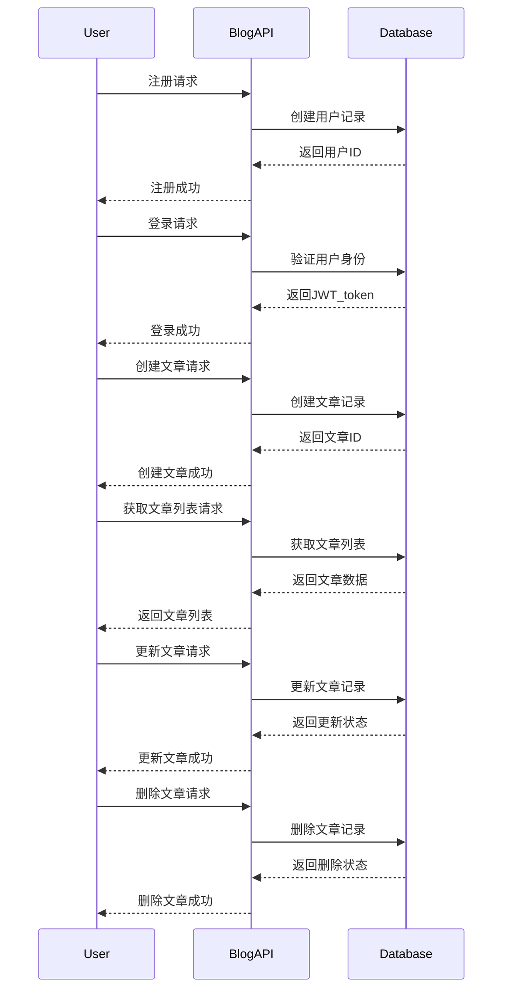

                 


# API设计：构建灵活可扩展的系统接口

关键词：API设计、RESTful、GraphQL、安全性、性能优化

摘要：本文将深入探讨API设计的重要性、基础原则、流程、常见挑战和最佳实践，涵盖RESTful和GraphQL两种流行API设计模式，并提供实际案例研究。

## 目录大纲

----------------------------------------------------------------

### 第一部分：API设计基础

#### 第1章：API设计概述

##### 1.1 API设计的重要性

##### 1.2 API设计的目标与原则

##### 1.3 API设计常见挑战

#### 第2章：API设计流程

##### 2.1 需求分析

##### 2.2 功能设计

##### 2.3 接口定义

##### 2.4 安全性与性能考虑

#### 第3章：API命名规范与文档编写

##### 3.1 命名规范

##### 3.2 文档编写工具与标准

##### 3.3 API文档内容

#### 第4章：RESTful API设计

##### 4.1 RESTful架构基础

##### 4.2 RESTful API设计原则

##### 4.3 RESTful API实例分析

#### 第5章：GraphQL API设计

##### 5.1 GraphQL基础

##### 5.2 GraphQL API设计优势

##### 5.3 GraphQL API实例分析

#### 第6章：API安全性

##### 6.1 API安全威胁概述

##### 6.2 API安全设计原则

##### 6.3 常见安全机制实现

#### 第7章：API性能优化

##### 7.1 API性能优化策略

##### 7.2 缓存机制

##### 7.3 负载均衡

#### 第8章：API监控与测试

##### 8.1 API监控指标

##### 8.2 API测试方法

##### 8.3 自动化测试工具

#### 第9章：API设计最佳实践

##### 9.1 持续迭代与改进

##### 9.2 集成开发环境配置

##### 9.3 设计文档维护

#### 第10章：案例研究

##### 10.1 案例背景

##### 10.2 案例分析与设计

##### 10.3 案例实施与效果

#### 第11章：API设计趋势与发展

##### 11.1 API设计未来趋势

##### 11.2 开放API与微服务架构

##### 11.3 API设计工具与平台

----------------------------------------------------------------

## 第1章：API设计概述

### 1.1 API设计的重要性

API（应用程序编程接口）是现代软件系统的重要组成部分。它定义了不同软件组件之间如何进行交互，使得开发者可以在不深入了解底层实现的情况下，实现功能的集成与扩展。良好的API设计不仅能够提高系统的可维护性和可扩展性，还能显著提升用户体验。具体来说，API设计的重要性体现在以下几个方面：

1. **系统集成**：API允许不同系统之间进行高效、无缝的集成。通过定义统一的接口，开发者可以轻松地将第三方服务或库集成到自己的系统中。
   
2. **功能扩展**：良好的API设计使得系统的功能扩展变得简单。开发者可以通过扩展API来添加新的功能或服务，而无需对现有代码进行大规模修改。

3. **用户体验**：良好的API设计能够简化开发者的工作，从而缩短产品上市时间，最终提高用户体验。

4. **安全性**：通过精心设计的API，可以确保系统的安全性，防止未授权访问和数据泄露。

### 1.2 API设计的目标与原则

API设计的核心目标是构建灵活、可扩展且易于使用的系统接口。为了实现这一目标，需要遵循以下原则：

1. **简单性**：设计简洁明了的API接口，降低使用难度。
   
2. **可扩展性**：设计可扩展的API，便于未来的功能增加和变更。

3. **可读性**：编写清晰的文档和注释，方便开发者理解和维护。

4. **高效性**：设计高效的API接口，减少延迟和数据传输量。

5. **安全性**：确保API接口的安全，防止恶意攻击和非法访问。

### 1.3 API设计常见挑战

尽管API设计具有诸多优势，但在实际开发过程中，仍面临许多挑战：

1. **版本管理**：随着系统的不断演化，如何管理不同版本的API成为一大难题。

2. **性能瓶颈**：API的性能直接影响用户体验，优化性能是一项持续的任务。

3. **安全性风险**：API的安全性是系统安全的关键，需要不断更新安全策略和机制。

4. **兼容性**：不同系统和服务的兼容性问题，需要精心设计和测试。

### 总结

API设计是构建现代软件系统的重要环节。通过遵循基本原则和解决常见挑战，我们可以设计出灵活、可扩展且易于使用的API接口，从而提高系统的可维护性、扩展性和用户体验。接下来，我们将深入探讨API设计的具体流程和最佳实践。

----------------------------------------------------------------

## 第2章：API设计流程

### 2.1 需求分析

API设计的第一个关键步骤是需求分析。这一阶段的主要目标是了解系统的业务需求和用户需求，以确保API能够满足实际使用场景。

### 需求分析的核心步骤

1. **业务需求分析**：与业务分析师、产品经理和客户进行沟通，了解系统的核心功能、业务流程和关键性能指标。
2. **用户需求分析**：通过用户调研、问卷调查和用户访谈，了解用户的使用习惯、偏好和痛点。
3. **功能需求梳理**：将业务需求和用户需求转化为具体的API功能需求，确保每个功能都有明确的目标和实现路径。
4. **非功能需求分析**：包括性能、安全性、可扩展性等非功能性需求，这些需求将对API设计产生重要影响。

### 需求分析示例

假设我们正在设计一个电子商务平台API，以下是一些典型需求：

| 需求类别   | 需求描述                                     |
|------------|--------------------------------------------|
| 业务需求   | 支持商品搜索、购物车管理、订单处理           |
| 用户需求   | 提供简洁的搜索界面、快速的商品添加到购物车   |
| 性能需求   | 搜索响应时间小于500毫秒                     |
| 安全需求   | 实施严格的用户身份验证和数据加密策略         |

### 需求分析的关键点

1. **明确性**：确保每个需求都是明确和可实现的。
2. **优先级**：根据业务和用户需求的重要性，对需求进行优先级排序。
3. **可测试性**：确保需求可以转化为可测试的功能点。

### 总结

需求分析是API设计的基础，通过系统化的需求收集和分析，我们可以为后续的API设计提供清晰的指导。接下来，我们将探讨如何进行功能设计。

----------------------------------------------------------------

### 2.2 功能设计

在需求分析的基础上，下一步是功能设计。功能设计的目标是明确API提供的功能模块和接口，为后续的实现和测试提供详细的蓝图。

#### 功能设计核心步骤

1. **模块划分**：根据业务需求，将系统划分为若干功能模块，如用户管理、商品管理、订单管理等。
2. **接口定义**：为每个模块定义相应的API接口，包括接口名称、输入参数、输出结果和数据格式等。
3. **功能流程图**：使用流程图或状态机图等工具，描述各个模块的功能流程和状态转换。
4. **数据模型设计**：设计API操作所需的数据模型，包括实体类和关系定义。
5. **接口文档编写**：编写详细的API文档，包括接口描述、参数说明、返回值说明和示例代码等。

#### 功能设计示例

假设我们继续以电子商务平台API为例，以下是一些功能设计示例：

1. **用户管理模块**
   - 功能描述：处理用户注册、登录和权限验证。
   - 接口定义：
     - POST /users/register：用户注册接口，输入参数包括用户名、密码、电子邮件等。
     - POST /users/login：用户登录接口，输入参数包括用户名和密码。
     - GET /users/{userId}：获取用户信息接口，输出结果包括用户名、电子邮件等。

2. **商品管理模块**
   - 功能描述：处理商品添加、查询和删除。
   - 接口定义：
     - POST /products：添加商品接口，输入参数包括商品名称、价格、库存等。
     - GET /products/{productId}：查询商品接口，输出结果包括商品名称、价格、库存等。
     - DELETE /products/{productId}：删除商品接口。

3. **订单管理模块**
   - 功能描述：处理订单创建、查询和支付。
   - 接口定义：
     - POST /orders：创建订单接口，输入参数包括用户ID、商品列表、订单金额等。
     - GET /orders/{orderId}：查询订单接口，输出结果包括订单详情、支付状态等。
     - POST /orders/{orderId}/pay：支付订单接口，输入参数包括支付金额和支付方式。

#### 功能设计的关键点

1. **模块化**：确保功能模块划分清晰，各模块间职责分离。
2. **可扩展性**：设计可扩展的接口，以适应未来功能增加和变更。
3. **文档化**：编写详细的接口文档，确保开发者能够准确理解和使用API。

### 总结

功能设计是API设计流程的关键步骤，通过明确API提供的功能模块和接口，我们为后续的实现和测试奠定了基础。在功能设计阶段，我们需要充分考虑模块划分、接口定义和文档编写，确保API的易用性和可扩展性。

### 2.3 接口定义

在功能设计的基础上，下一步是接口定义。接口定义是API设计中的核心环节，它决定了API的交互方式、参数传递和返回结果。

#### 接口定义核心步骤

1. **接口名称**：为每个API接口定义一个清晰、简洁且具有描述性的名称。
2. **HTTP方法**：确定每个接口使用的HTTP方法，如GET、POST、PUT、DELETE等。
3. **路径**：定义接口的URL路径，通常基于功能模块和操作类型进行组织。
4. **参数**：明确接口的输入参数，包括参数名称、类型、默认值和是否必需。
5. **返回结果**：定义接口的输出结果，包括数据结构、状态码和错误信息。

#### 接口定义示例

假设我们继续以电子商务平台API为例，以下是一些接口定义示例：

1. **用户注册接口**
   - 接口名称：`registerUser`
   - HTTP方法：`POST`
   - 路径：`/users/register`
   - 输入参数：
     - `username`（字符串，必需）：用户名。
     - `password`（字符串，必需）：密码。
     - `email`（字符串，必需）：电子邮件。
   - 返回结果：
     - `status`（整数）：状态码，如200表示成功。
     - `message`（字符串）：操作消息，如"注册成功"。
     - `data`（对象）：用户信息，如用户ID和用户名。

2. **查询商品接口**
   - 接口名称：`getProduct`
   - HTTP方法：`GET`
   - 路径：`/products/{productId}`
   - 输入参数：
     - `productId`（整数，必需）：商品ID。
   - 返回结果：
     - `status`（整数）：状态码，如200表示成功。
     - `message`（字符串）：操作消息，如"查询成功"。
     - `data`（对象）：商品信息，如商品名称、价格和库存。

#### 接口定义的关键点

1. **清晰性**：确保接口定义简洁明了，易于理解。
2. **一致性**：遵循统一的接口命名和参数命名规范，以提高代码的可读性和可维护性。
3. **灵活性**：设计可扩展的接口，以适应未来需求的变化。

### 总结

接口定义是API设计的核心环节，通过详细定义API的交互方式、参数传递和返回结果，我们为开发者提供了清晰的操作指南。在接口定义阶段，我们需要注重清晰性、一致性和灵活性，以确保API的易用性和可维护性。

### 2.4 安全性与性能考虑

在API设计过程中，安全性和性能是两个至关重要的方面。一个优秀的API不仅需要提供准确和高效的服务，还要确保数据的安全和系统的稳定运行。

#### 安全性考虑

1. **认证与授权**：确保只有经过认证和授权的用户才能访问API，常用的认证机制包括Basic Authentication、OAuth 2.0和JWT（JSON Web Tokens）。
2. **数据加密**：在数据传输过程中，使用HTTPS协议进行加密，以防止数据被窃取或篡改。
3. **输入验证**：对用户输入进行严格的验证，防止恶意输入和SQL注入等攻击。
4. **日志记录与审计**：记录API操作的日志，以便在发生异常时进行追踪和审计。

#### 性能优化

1. **缓存机制**：利用缓存减少数据库查询次数，提高响应速度。
2. **负载均衡**：通过负载均衡器将请求分发到多个服务器，提高系统的处理能力。
3. **异步处理**：对于耗时较长的操作，采用异步处理方式，避免阻塞主线程。
4. **限流与熔断**：对API访问进行限流，防止被大量请求攻击，并在系统过载时触发熔断机制，保护系统稳定。

### 安全性与性能考虑示例

1. **安全性示例**：
   - **认证与授权**：使用OAuth 2.0进行认证，用户在第三方认证服务器登录后，获取令牌并使用令牌访问API。
   - **数据加密**：使用HTTPS协议传输所有敏感数据。
   - **输入验证**：对用户输入进行正则表达式匹配和类型检查，确保输入数据的有效性。

2. **性能优化示例**：
   - **缓存机制**：使用Redis缓存用户信息和商品信息，减少数据库查询次数。
   - **负载均衡**：使用Nginx进行负载均衡，将请求分配到多个应用服务器。
   - **异步处理**：使用消息队列（如RabbitMQ）处理订单生成和邮件发送等耗时操作。
   - **限流与熔断**：使用Spring Cloud Gateway实现限流和熔断，防止系统过载。

### 总结

安全性和性能是API设计过程中不可忽视的重要方面。通过采取有效的安全措施和性能优化策略，我们可以确保API的可靠性和高效性。在API设计阶段，我们需要综合考虑安全性和性能，为后续的开发和维护奠定坚实的基础。

### 2.5 安全性与性能考虑

在API设计过程中，安全性和性能是两个至关重要的方面。一个优秀的API不仅需要提供准确和高效的服务，还要确保数据的安全和系统的稳定运行。

#### 安全性考虑

1. **认证与授权**：确保只有经过认证和授权的用户才能访问API，常用的认证机制包括Basic Authentication、OAuth 2.0和JWT（JSON Web Tokens）。
2. **数据加密**：在数据传输过程中，使用HTTPS协议进行加密，以防止数据被窃取或篡改。
3. **输入验证**：对用户输入进行严格的验证，防止恶意输入和SQL注入等攻击。
4. **日志记录与审计**：记录API操作的日志，以便在发生异常时进行追踪和审计。

#### 性能优化

1. **缓存机制**：利用缓存减少数据库查询次数，提高响应速度。
2. **负载均衡**：通过负载均衡器将请求分发到多个服务器，提高系统的处理能力。
3. **异步处理**：对于耗时较长的操作，采用异步处理方式，避免阻塞主线程。
4. **限流与熔断**：对API访问进行限流，防止被大量请求攻击，并在系统过载时触发熔断机制，保护系统稳定。

### 安全性与性能考虑示例

1. **安全性示例**：
   - **认证与授权**：使用OAuth 2.0进行认证，用户在第三方认证服务器登录后，获取令牌并使用令牌访问API。
   - **数据加密**：使用HTTPS协议传输所有敏感数据。
   - **输入验证**：对用户输入进行正则表达式匹配和类型检查，确保输入数据的有效性。

2. **性能优化示例**：
   - **缓存机制**：使用Redis缓存用户信息和商品信息，减少数据库查询次数。
   - **负载均衡**：使用Nginx进行负载均衡，将请求分配到多个应用服务器。
   - **异步处理**：使用消息队列（如RabbitMQ）处理订单生成和邮件发送等耗时操作。
   - **限流与熔断**：使用Spring Cloud Gateway实现限流和熔断，防止系统过载。

### 总结

安全性和性能是API设计过程中不可忽视的重要方面。通过采取有效的安全措施和性能优化策略，我们可以确保API的可靠性和高效性。在API设计阶段，我们需要综合考虑安全性和性能，为后续的开发和维护奠定坚实的基础。

----------------------------------------------------------------

### 3.1 命名规范

命名规范是API设计中的基础环节，良好的命名规范可以提高代码的可读性和可维护性。以下是API命名规范的一些核心要点：

1. **一致性**：遵循统一的命名规范，确保命名风格一致。例如，在Java中通常使用驼峰命名法（CamelCase）。
2. **描述性**：命名应具备描述性，使开发者能通过名称快速了解接口或类的用途。
3. **简短性**：命名应简洁明了，避免冗长的名称。
4. **避免缩写**：除非是行业标准或广泛认可的缩写，否则避免使用缩写。
5. **避免特殊字符**：避免使用特殊字符（如`@`、`#`、`$`等），以免引起混淆。

#### 接口命名示例

1. **用户管理模块**
   - 用户注册接口：`registerUser`
   - 用户登录接口：`loginUser`
   - 获取用户信息接口：`getUserInfo`

2. **商品管理模块**
   - 添加商品接口：`addProduct`
   - 查询商品接口：`getProduct`
   - 删除商品接口：`deleteProduct`

3. **订单管理模块**
   - 创建订单接口：`createOrder`
   - 查询订单接口：`getOrder`
   - 支付订单接口：`payOrder`

### 3.2 文档编写工具与标准

良好的API文档是开发者成功使用API的关键。以下是常用的API文档编写工具和标准：

1. **Swagger**：Swagger是一个广泛使用的API文档工具，支持自动生成和可视化API文档。
2. **OpenAPI Specification**：OpenAPI是一个规范，用于定义API的交互和数据格式，可以与Swagger无缝集成。
3. **Markdown**：Markdown是一种轻量级标记语言，可用于编写简单的API文档。
4. **API Blueprint**：API Blueprint是一个基于Markdown的API文档标准，提供了一种简明易懂的方式来描述API。

#### 文档编写示例

以下是一个简单的Swagger文档示例：

```yaml
openapi: 3.0.0
info:
  title: E-commerce Platform API
  version: 1.0.0
servers:
  - url: https://api.example.com/v1
    description: Production Server
paths:
  /users/register:
    post:
      summary: Register a new user
      operationId: registerUser
      requestBody:
        required: true
        content:
          application/json:
            schema:
              $ref: '#/components/schemas/User'
      responses:
        '200':
          description: User registered successfully
          content:
            application/json:
              schema:
                $ref: '#/components/schemas/ApiResponse'
  /users/login:
    post:
      summary: Login a user
      operationId: loginUser
      requestBody:
        required: true
        content:
          application/json:
            schema:
              $ref: '#/components/schemas/User'
      responses:
        '200':
          description: User logged in successfully
          content:
            application/json:
              schema:
                $ref: '#/components/schemas/ApiResponse'
components:
  schemas:
    User:
      type: object
      properties:
        username:
          type: string
        password:
          type: string
        email:
          type: string
    ApiResponse:
      type: object
      properties:
        status:
          type: integer
        message:
          type: string
        data:
          type: object
```

### 3.3 API文档内容

一个完整的API文档应包含以下内容：

1. **概述**：介绍API的功能、用途和目标用户。
2. **接口列表**：列出所有API接口，并提供简要描述。
3. **接口详细说明**：每个接口的详细描述，包括请求方法、路径、参数、返回结果和示例代码。
4. **数据模型**：列出API操作所需的数据模型，包括字段、类型和约束。
5. **错误处理**：描述API可能返回的错误码和错误信息。
6. **安全性**：介绍API的安全机制，如认证、授权和数据加密。
7. **示例代码**：提供使用API的示例代码，帮助开发者快速上手。

### 总结

命名规范、文档编写工具和文档内容是API设计的重要组成部分。通过遵循良好的命名规范，使用合适的文档编写工具，并编写详细的API文档，我们可以提高API的可读性和可维护性，为开发者提供更好的使用体验。接下来，我们将探讨RESTful API设计。

----------------------------------------------------------------

### 第4章：RESTful API设计

RESTful API设计是一种基于REST（Representational State Transfer）架构风格的API设计方法。RESTful API具有简单、可扩展、易于理解的特点，是现代Web服务设计的主流选择。本章将详细介绍RESTful架构基础、设计原则和实例分析。

#### 4.1 RESTful架构基础

RESTful架构的核心概念包括：

1. **资源**：资源是API的核心，表示任何可以识别和操作的数据实体，如用户、订单、商品等。
2. **统一接口**：API应使用统一的接口设计，包括GET、POST、PUT、DELETE等HTTP方法。
3. **无状态性**：API应无状态，即每个请求之间相互独立，服务器不会保存客户端的状态。
4. **客户端-服务器架构**：客户端和服务端分离，客户端负责发送请求，服务端处理请求并返回响应。
5. **缓存**：响应可以被缓存，以提高系统性能和响应速度。
6. **超媒体**：API使用超媒体作为应用状态的引擎，客户端可以通过URL获取资源的链接，进行后续操作。

#### 4.2 RESTful API设计原则

遵循以下原则可以设计出优秀的RESTful API：

1. **单一职责原则**：每个API接口应只负责一项功能，避免接口过于复杂。
2. **统一命名和URL结构**：使用一致的命名和URL结构，便于开发者理解和记忆。
3. **状态转换**：使用HTTP方法表示资源的创建、读取、更新和删除操作。
4. **HTTP状态码**：使用标准的HTTP状态码（如200、400、401等）表示操作结果。
5. **缓存策略**：合理使用缓存机制，减少重复数据的处理和传输。
6. **版本控制**：通过URL版本号（如/v1、/v2）进行版本控制，避免对旧版本API的破坏性更新。

#### 4.3 RESTful API实例分析

以下是一个简单的RESTful API实例，用于管理用户信息。

1. **用户注册**

   - **URL**：`POST /users/register`
   - **请求参数**：`username`、`password`、`email`
   - **响应结果**：`{ "status": 200, "message": "注册成功", "data": { "userId": 1 } }`

2. **用户登录**

   - **URL**：`POST /users/login`
   - **请求参数**：`username`、`password`
   - **响应结果**：`{ "status": 200, "message": "登录成功", "token": "eyJhbGciOiJIUzI1NiIsInR5cCI6IkpXVCJ9... }`

3. **获取用户信息**

   - **URL**：`GET /users/{userId}`
   - **请求参数**：`userId`
   - **响应结果**：`{ "status": 200, "message": "获取成功", "data": { "username": "alice", "email": "alice@example.com" } }`

4. **更新用户信息**

   - **URL**：`PUT /users/{userId}`
   - **请求参数**：`userId`、`newEmail`
   - **响应结果**：`{ "status": 200, "message": "更新成功" }`

5. **删除用户**

   - **URL**：`DELETE /users/{userId}`
   - **请求参数**：`userId`
   - **响应结果**：`{ "status": 200, "message": "删除成功" }`

#### 总结

RESTful API设计是一种简单、灵活且易于扩展的API设计方法。通过遵循RESTful架构基础和设计原则，我们可以设计出易于使用和维护的API。在本章中，我们通过实例分析了RESTful API的设计和应用，为实际开发提供了参考。

----------------------------------------------------------------

### 4.4 RESTful API设计实例分析

为了更好地理解RESTful API的设计原则，我们将通过一个实际案例进行详细分析。这个案例是一个简单的博客系统，提供创建、更新、获取和删除博客文章的接口。

#### 案例背景

假设我们正在开发一个博客平台，用户可以发布博客文章、评论和修改文章。为了便于管理和扩展，我们选择使用RESTful API来实现这些功能。

#### 系统功能设计

根据系统需求，我们可以将功能划分为以下几个模块：

1. **用户管理模块**：处理用户注册、登录和权限验证。
2. **文章管理模块**：处理博客文章的创建、获取、更新和删除。
3. **评论管理模块**：处理评论的创建、获取和删除。

#### 系统架构设计

系统架构包括前端应用、后端API和服务端数据库三部分。前端应用通过HTTP请求与后端API交互，后端API处理业务逻辑并将数据存储在数据库中。


#### 系统接口设计

以下是博客系统的主要接口设计：

1. **用户管理接口**

   - **用户注册**：`POST /users/register`，请求参数：`username`、`password`、`email`，响应结果：`{ "status": 200, "message": "注册成功" }`。
   - **用户登录**：`POST /users/login`，请求参数：`username`、`password`，响应结果：`{ "status": 200, "token": "JWT_token" }`。
   - **获取用户信息**：`GET /users/me`，请求参数：无，响应结果：`{ "status": 200, "data": { "username": "alice", "email": "alice@example.com" } }`。

2. **文章管理接口**

   - **创建文章**：`POST /articles`，请求参数：`title`、`content`、`authorId`，响应结果：`{ "status": 201, "data": { "articleId": 1, "title": "Hello World", "content": "This is my first blog post." } }`。
   - **获取文章列表**：`GET /articles`，请求参数：无，响应结果：`{ "status": 200, "data": [ { "articleId": 1, "title": "Hello World", "content": "This is my first blog post." }, { "articleId": 2, "title": "Hello World 2", "content": "This is my second blog post." } ] }`。
   - **获取文章详情**：`GET /articles/{articleId}`，请求参数：`articleId`，响应结果：`{ "status": 200, "data": { "articleId": 1, "title": "Hello World", "content": "This is my first blog post.", "authorId": 1 } }`。
   - **更新文章**：`PUT /articles/{articleId}`，请求参数：`title`、`content`，响应结果：`{ "status": 200, "message": "更新成功" }`。
   - **删除文章**：`DELETE /articles/{articleId}`，请求参数：`articleId`，响应结果：`{ "status": 200, "message": "删除成功" }`。

3. **评论管理接口**

   - **创建评论**：`POST /articles/{articleId}/comments`，请求参数：`content`、`authorId`，响应结果：`{ "status": 201, "data": { "commentId": 1, "content": "Great post!", "articleId": 1, "authorId": 1 } }`。
   - **获取评论列表**：`GET /articles/{articleId}/comments`，请求参数：`articleId`，响应结果：`{ "status": 200, "data": [ { "commentId": 1, "content": "Great post!", "articleId": 1, "authorId": 1 } ] }`。
   - **删除评论**：`DELETE /articles/{articleId}/comments/{commentId}`，请求参数：`articleId`、`commentId`，响应结果：`{ "status": 200, "message": "删除成功" }`。

#### 系统交互

以下是博客系统的交互序列图，展示了用户和API之间的交互过程。



#### 总结

通过本案例的分析，我们深入了解了RESTful API设计的过程，包括系统功能设计、接口设计和系统交互。RESTful API设计使得系统易于扩展和维护，同时也为开发者提供了清晰的操作指南。在本章中，我们通过实际案例展示了RESTful API设计的应用，为实际开发提供了参考。

----------------------------------------------------------------

### 4.5 GraphQL API设计

GraphQL是一种查询语言，用于API的构建和操作。它由Facebook开发，旨在提供一种更加灵活和高效的数据获取方式。与RESTful API相比，GraphQL允许客户端指定所需数据的精确结构，从而减少了数据传输量，提高了性能。

#### 4.5.1 GraphQL基础

**核心概念**：

1. **类型系统**：GraphQL定义了一套完整的类型系统，包括标量类型（如String、Int）、复合类型（如Object、Array）和接口类型。
2. **查询语言**：GraphQL使用一种基于查询语言的表达式，允许客户端精确地指定所需数据的结构。
3. **执行过程**：GraphQL查询首先被解析为抽象语法树（AST），然后通过执行引擎执行，最终生成所需的数据结构。
4. **字段扩展**：GraphQL支持字段扩展，允许在查询过程中动态添加或移除字段。

**优势**：

1. **数据减少传输**：客户端可以精确指定所需数据，减少了不必要的传输。
2. **错误反馈**：GraphQL在查询执行失败时会返回详细的错误信息，便于问题定位。
3. **灵活性和扩展性**：客户端可以根据需求自定义查询，实现更复杂的数据操作。

**使用场景**：

1. **数据密集型应用**：适用于需要大量数据操作的复杂应用。
2. **前端应用**：尤其是在需要动态数据和复杂查询的前端应用中，GraphQL表现出色。
3. **微服务架构**：在微服务架构中，GraphQL可以帮助减少服务间的数据传输和集成复杂性。

#### 4.5.2 GraphQL API设计优势

1. **按需获取数据**：客户端可以精确控制所需数据的获取，减少了数据传输量和响应时间。
2. **减少重复请求**：通过查询合并和缓存机制，减少了重复请求和数据冗余。
3. **更好的错误处理**：详细的错误信息和提示，便于问题的快速定位和修复。
4. **灵活性**：客户端可以根据需求自定义查询，实现更加复杂和灵活的数据操作。

#### 4.5.3 GraphQL API实例分析

假设我们以一个电子商务平台为例，分析其GraphQL API的设计。

**示例查询**：

```graphql
query {
  user(userId: 1) {
    id
    username
    email
  }
  products {
    id
    name
    price
  }
}
```

**响应结果**：

```json
{
  "data": {
    "user": {
      "id": 1,
      "username": "alice",
      "email": "alice@example.com"
    },
    "products": [
      {
        "id": 1,
        "name": "Product A",
        "price": 9.99
      },
      {
        "id": 2,
        "name": "Product B",
        "price": 19.99
      }
    ]
  }
}
```

**接口定义**：

1. **用户查询接口**：`query User($userId: ID!) { id, username, email }`
2. **产品查询接口**：`query Products { id, name, price }`

通过GraphQL，我们不仅能够按需获取所需数据，还可以自定义查询，实现更复杂的数据操作。例如，我们可以查询某个用户购买的商品：

```graphql
query {
  user(userId: 1) {
    id
    username
    email
    purchases {
      id
      product {
        id
        name
        price
      }
      price
    }
  }
}
```

#### 总结

GraphQL API设计提供了一种更加灵活和高效的数据获取方式，通过精确控制数据的获取和减少重复请求，显著提高了系统的性能和用户体验。在本章中，我们介绍了GraphQL的基础和优势，并通过实例分析了其应用。接下来，我们将探讨如何优化API性能。

----------------------------------------------------------------

### 4.6 API性能优化

在设计和实现API时，性能优化是确保系统高效运行的关键。良好的性能优化策略可以提高系统的响应速度，减少延迟，从而提升用户体验。以下是几种常见的API性能优化策略：

#### 4.6.1 缓存机制

**核心概念**：

缓存是一种存储经常访问数据的方法，可以减少数据库查询次数，提高响应速度。常见缓存策略包括：

- **客户端缓存**：在客户端（如浏览器或应用程序）缓存数据，减少对API的重复请求。
- **服务端缓存**：在服务端（如Web服务器或应用程序）缓存数据，减少数据库查询和计算负担。
- **分布式缓存**：使用分布式缓存系统（如Redis、Memcached），提高缓存数据的读写性能和扩展性。

**应用场景**：

1. **高频数据**：缓存高频访问的数据，如用户信息、商品列表等。
2. **计算密集型操作**：缓存计算结果，减少重复计算，如商品推荐算法、价格计算等。

**示例**：

使用Redis缓存商品信息：

```python
import redis

# 连接Redis缓存
redis_client = redis.StrictRedis(host='localhost', port=6379, db=0)

# 缓存商品信息
def cache_product(product_id, product_data):
    redis_client.setex(f"product:{product_id}", 3600, json.dumps(product_data))

# 从缓存获取商品信息
def get_cached_product(product_id):
    cached_data = redis_client.get(f"product:{product_id}")
    if cached_data:
        return json.loads(cached_data)
    return None
```

#### 4.6.2 负载均衡

**核心概念**：

负载均衡是将请求分布到多个服务器上，以平衡系统负载，提高系统的可靠性和可用性。常见负载均衡策略包括：

- **轮询**：按照顺序将请求分配到每个服务器。
- **最小连接数**：将请求分配到连接数最少的服务器。
- **哈希**：根据请求的来源IP或URL进行哈希分配。

**应用场景**：

1. **高并发场景**：在高并发访问时，负载均衡可以确保系统稳定运行。
2. **分布式部署**：在分布式架构中，负载均衡可以优化资源利用和性能。

**示例**：

使用Nginx进行负载均衡：

```nginx
http {
    upstream myapp {
        server server1.example.com;
        server server2.example.com;
        server server3.example.com;
    }

    server {
        listen 80;

        location / {
            proxy_pass http://myapp;
        }
    }
}
```

#### 4.6.3 异步处理

**核心概念**：

异步处理是一种在不等待操作完成的情况下执行任务的方法，可以减少线程阻塞，提高系统的并发处理能力。常见异步处理方式包括：

- **回调函数**：在操作完成后调用回调函数。
- **事件驱动**：使用事件驱动模型处理异步任务。
- **消息队列**：使用消息队列（如RabbitMQ、Kafka）进行异步任务调度。

**应用场景**：

1. **长耗时任务**：对于耗时较长的任务，如邮件发送、订单处理等，使用异步处理可以提高系统性能。
2. **微服务架构**：在微服务架构中，异步处理可以减少服务之间的依赖，提高系统的解耦性。

**示例**：

使用RabbitMQ进行异步处理：

```python
import pika

# 连接RabbitMQ
connection = pika.BlockingConnection(pika.ConnectionParameters('localhost'))
channel = connection.channel()

# 声明队列
channel.queue_declare(queue='task_queue', durable=True)

# 发送消息
def send_message(message):
    channel.basic_publish(
        exchange='',
        routing_key='task_queue',
        body=message,
        properties=pika.BasicProperties(delivery_mode=2)  # 消息持久化
    )

# 接收消息
def receive_message():
    channel.basic_consume(
        queue='task_queue',
        on_message_callback=lambda ch, method, properties, body: print(f"Received {body}")
    )
    channel.start_consuming()

# 发送消息示例
send_message("Hello World!")

# 接收消息示例
receive_message()
```

#### 总结

API性能优化是确保系统高效运行的重要手段。通过使用缓存机制、负载均衡和异步处理等策略，可以显著提高系统的响应速度和并发处理能力。在本章中，我们介绍了这些优化策略的核心概念和应用示例，为实际开发提供了参考。

----------------------------------------------------------------

### 4.7 API监控与测试

API的监控与测试是确保其稳定性和可靠性的关键环节。有效的监控和测试策略可以帮助开发者及时发现和解决问题，从而保证系统的高效运行。

#### 4.7.1 API监控指标

API监控的核心指标包括：

1. **响应时间**：API处理请求所需的时间，是评估API性能的重要指标。
2. **错误率**：API处理请求时发生的错误数量与总请求量的比例。
3. **并发数**：API同时处理的请求数量，反映了系统的负载能力。
4. **吞吐量**：单位时间内API处理请求的数量，通常与响应时间和并发数相关。
5. **依赖监控**：监控API所依赖的内部或外部服务（如数据库、缓存、消息队列等）的状态。

#### 4.7.2 API测试方法

API测试方法主要包括以下几种：

1. **功能测试**：验证API是否按照预期执行特定功能，包括接口、参数和返回结果。
2. **性能测试**：评估API在不同负载下的响应时间和稳定性，包括压力测试和负载测试。
3. **安全测试**：检测API的安全性漏洞，包括SQL注入、XSS攻击等。
4. **自动化测试**：使用自动化测试工具定期执行测试，确保API的一致性和稳定性。

#### 4.7.3 自动化测试工具

以下是几种常用的API自动化测试工具：

1. **Postman**：一款流行的API测试工具，支持手动测试和自动化测试。
2. **JUnit**：Java框架，用于编写和执行自动化测试用例。
3. **Selenium**：Web自动化测试工具，可用于测试API的Web端接口。
4. **Rest-Assured**：Java库，用于编写API自动化测试用例，支持RESTful API和SOAP API。
5. **JMeter**：性能测试工具，可用于测试API的性能和负载。

#### 示例

以下是一个使用Rest-Assured进行API自动化测试的示例：

```java
import io.restassured.RestAssured;
import io.restassured.response.Response;

public class ApiTest {
    public static void main(String[] args) {
        // 设置基URL
        RestAssured.baseURI = "https://api.example.com";

        // 发送GET请求
        Response response = RestAssured.get("/users/1");

        // 验证响应状态码
        System.out.println("Response Status Code: " + response.getStatusCode());

        // 验证响应内容
        System.out.println("Response Body: " + response.getBody().asString());
    }
}
```

#### 总结

API的监控与测试是确保其稳定性和可靠性的关键。通过设定合理的监控指标、选择合适的测试方法和使用自动化测试工具，开发者可以及时发现和解决问题，从而保证系统的高效运行。在本章中，我们介绍了API监控与测试的核心指标、方法和工具，为实际开发提供了参考。

----------------------------------------------------------------

### 4.8 API设计最佳实践

在API设计过程中，遵循最佳实践可以确保API的高效性、可维护性和安全性。以下是一些API设计的最佳实践：

#### 4.8.1 持续迭代与改进

1. **定期审查**：定期审查API的设计和实现，识别潜在问题和改进点。
2. **用户反馈**：收集用户反馈，关注用户体验，及时调整API设计和功能。
3. **版本控制**：采用版本控制策略，逐步引入新功能，避免破坏现有系统的稳定性。

#### 4.8.2 集成开发环境配置

1. **自动化部署**：使用CI/CD工具（如Jenkins、GitLab CI）实现自动化部署，减少手动操作。
2. **测试环境**：配置独立的测试环境，确保API在发布前经过充分测试。
3. **性能监控**：实时监控API性能，及时发现和解决问题。

#### 4.8.3 设计文档维护

1. **文档规范**：遵循统一的文档规范，确保文档结构清晰、内容完整。
2. **版本管理**：使用版本控制系统（如Git）管理设计文档，便于跟踪变更历史。
3. **持续更新**：定期更新设计文档，保持与实际代码的一致性。

#### 总结

遵循API设计最佳实践可以显著提高API的质量和稳定性。通过持续迭代与改进、集成开发环境配置和设计文档维护，我们可以确保API的高效性、可维护性和安全性。在本章中，我们介绍了API设计的最佳实践，为实际开发提供了参考。

----------------------------------------------------------------

### 第5章：GraphQL API设计

GraphQL是由Facebook开发的一种用于API的查询语言，它允许客户端指定所需数据的精确结构，从而减少了数据传输量和冗余。与传统的RESTful API相比，GraphQL具有更高的灵活性和效率。本章将详细介绍GraphQL的基础、优势、设计原则和实际应用。

#### 5.1 GraphQL基础

**核心概念**：

1. **类型系统**：GraphQL定义了一套完整的类型系统，包括标量类型（如String、Int）、复合类型（如Object、Array）和接口类型。
2. **查询语言**：GraphQL使用一种基于查询语言的表达式，允许客户端精确地指定所需数据的结构。
3. **执行过程**：GraphQL查询首先被解析为抽象语法树（AST），然后通过执行引擎执行，最终生成所需的数据结构。
4. **字段扩展**：GraphQL支持字段扩展，允许在查询过程中动态添加或移除字段。

**优势**：

1. **按需获取数据**：客户端可以精确控制所需数据的获取，减少了数据传输量和响应时间。
2. **减少重复请求**：通过查询合并和缓存机制，减少了重复请求和数据冗余。
3. **更好的错误处理**：详细的错误信息和提示，便于问题的快速定位和修复。
4. **灵活性**：客户端可以根据需求自定义查询，实现更复杂的数据操作。

**使用场景**：

1. **数据密集型应用**：适用于需要大量数据操作的复杂应用。
2. **前端应用**：尤其是在需要动态数据和复杂查询的前端应用中，GraphQL表现出色。
3. **微服务架构**：在微服务架构中，GraphQL可以帮助减少服务间的数据传输和集成复杂性。

#### 5.2 GraphQL API设计优势

1. **按需获取数据**：客户端可以精确控制所需数据的获取，减少了数据传输量和响应时间。
2. **减少重复请求**：通过查询合并和缓存机制，减少了重复请求和数据冗余。
3. **更好的错误处理**：详细的错误信息和提示，便于问题的快速定位和修复。
4. **灵活性**：客户端可以根据需求自定义查询，实现更复杂的数据操作。

#### 5.3 GraphQL API实例分析

假设我们以一个电子商务平台为例，分析其GraphQL API的设计。

**示例查询**：

```graphql
query {
  user(userId: 1) {
    id
    username
    email
  }
  products {
    id
    name
    price
  }
}
```

**响应结果**：

```json
{
  "data": {
    "user": {
      "id": 1,
      "username": "alice",
      "email": "alice@example.com"
    },
    "products": [
      {
        "id": 1,
        "name": "Product A",
        "price": 9.99
      },
      {
        "id": 2,
        "name": "Product B",
        "price": 19.99
      }
    ]
  }
}
```

**接口定义**：

1. **用户查询接口**：`query User($userId: ID!) { id, username, email }`
2. **产品查询接口**：`query Products { id, name, price }`

通过GraphQL，我们不仅能够按需获取所需数据，还可以自定义查询，实现更复杂的数据操作。例如，我们可以查询某个用户购买的商品：

```graphql
query {
  user(userId: 1) {
    id
    username
    email
    purchases {
      id
      product {
        id
        name
        price
      }
      price
    }
  }
}
```

#### 总结

GraphQL API设计提供了一种更加灵活和高效的数据获取方式，通过精确控制数据的获取和减少重复请求，显著提高了系统的性能和用户体验。在本章中，我们介绍了GraphQL的基础和优势，并通过实例分析了其应用。接下来，我们将探讨如何优化API性能。

----------------------------------------------------------------

### 第6章：API安全性

API安全性是确保系统数据安全和防止未授权访问的关键。随着API在各类应用中的广泛应用，安全威胁和漏洞层出不穷。本章将介绍API安全威胁概述、安全设计原则和常见安全机制实现。

#### 6.1 API安全威胁概述

API面临的主要安全威胁包括：

1. **认证漏洞**：未实施或实施不当的认证机制可能导致未授权访问。
2. **授权漏洞**：用户权限管理不当，可能导致权限过高或过低，引发数据泄露或篡改。
3. **数据泄露**：不恰当的数据加密和传输可能导致敏感数据泄露。
4. **注入攻击**：如SQL注入、XSS攻击等，可能导致恶意代码执行或数据篡改。
5. **中间人攻击**：攻击者拦截并篡改API请求和响应，可能导致数据泄露或篡改。
6. **拒绝服务攻击**：通过大量无效请求占用系统资源，导致系统崩溃。

#### 6.2 API安全设计原则

为了应对上述安全威胁，API设计应遵循以下原则：

1. **最小权限原则**：确保API仅拥有执行任务所需的最低权限。
2. **强认证与授权**：使用强认证（如OAuth 2.0、JWT）和细粒度授权机制。
3. **数据加密**：对传输数据进行加密，防止数据泄露和篡改。
4. **输入验证**：严格验证用户输入，防止注入攻击。
5. **日志记录与审计**：记录API操作日志，便于安全事件追踪和调查。
6. **安全配置**：遵循安全配置最佳实践，如关闭不必要的API功能。

#### 6.3 常见安全机制实现

以下是几种常见的API安全机制及其实现：

1. **认证**：

   - **OAuth 2.0**：使用OAuth 2.0进行认证，用户在第三方认证服务器登录后，获取令牌并使用令牌访问API。
   - **JWT**：使用JSON Web Tokens（JWT）进行认证，令牌包含用户身份信息和签名，确保令牌的有效性和完整性。

2. **授权**：

   - **角色与权限**：为用户分配角色和权限，通过权限控制访问特定API接口。
   - **资源所有者控制**：资源所有者可以控制对资源的访问权限，如允许或拒绝特定用户的访问。

3. **数据加密**：

   - **HTTPS**：使用HTTPS协议进行数据传输，确保数据在传输过程中的加密。
   - **SSL/TLS**：使用SSL/TLS协议对API接口进行加密，防止数据泄露和篡改。

4. **输入验证**：

   - **参数验证**：对用户输入的参数进行严格验证，如正则表达式匹配、类型检查等，防止注入攻击。
   - **黑名单与白名单**：使用黑名单和白名单机制，禁止或允许特定输入，提高安全性。

5. **日志记录与审计**：

   - **日志记录**：记录API操作日志，包括请求、响应、用户信息和操作结果等。
   - **审计**：定期审计日志，及时发现异常行为和安全事件。

#### 总结

API安全性是确保系统数据安全和防止未授权访问的关键。通过遵循API安全设计原则和实施常见安全机制，我们可以显著提高API的安全性。在本章中，我们介绍了API安全威胁、设计原则和常见安全机制，为实际开发提供了参考。

----------------------------------------------------------------

### 第7章：API性能优化

API性能优化是确保系统高效运行的关键环节。优化的目标包括提高响应速度、减少延迟和增强系统的负载能力。本章将介绍API性能优化的核心策略、缓存机制和负载均衡技术。

#### 7.1 API性能优化策略

以下是一些常见的API性能优化策略：

1. **代码优化**：优化代码结构和算法，减少计算时间和资源消耗。
2. **数据库优化**：优化数据库查询和索引，提高查询效率。
3. **异步处理**：对于耗时的操作，使用异步处理方式，避免阻塞主线程。
4. **缓存机制**：利用缓存减少数据库查询次数，提高响应速度。
5. **负载均衡**：通过负载均衡器将请求分发到多个服务器，提高系统的处理能力。

6. **限流与熔断**：对API访问进行限流，防止被大量请求攻击，并在系统过载时触发熔断机制，保护系统稳定。

7. **CDN加速**：使用内容分发网络（CDN）加速静态资源的加载，减少响应时间。

#### 7.2 缓存机制

缓存机制是API性能优化的重要手段。通过缓存，可以减少对后端服务（如数据库、API等）的查询次数，从而提高系统的响应速度。

**缓存策略**：

1. **客户端缓存**：在客户端（如浏览器、应用程序）缓存数据，减少对API的重复请求。
2. **服务端缓存**：在服务端（如Web服务器、应用程序）缓存数据，减少对数据库和其他服务器的查询次数。
3. **分布式缓存**：使用分布式缓存系统（如Redis、Memcached），提高缓存数据的读写性能和扩展性。

**常见缓存技术**：

1. **内存缓存**：将数据存储在内存中，提供快速的读写性能。
2. **硬盘缓存**：将数据存储在硬盘上，适用于大容量数据缓存。
3. **数据库缓存**：缓存数据库查询结果，减少数据库访问次数。

**示例**：

使用Redis进行缓存：

```python
import redis

# 连接Redis缓存
redis_client = redis.StrictRedis(host='localhost', port=6379, db=0)

# 缓存用户信息
def cache_user_info(user_id, user_info):
    redis_client.setex(f"user:{user_id}", 3600, json.dumps(user_info))

# 获取缓存用户信息
def get_cached_user_info(user_id):
    cached_data = redis_client.get(f"user:{user_id}")
    if cached_data:
        return json.loads(cached_data)
    return None
```

#### 7.3 负载均衡

负载均衡是提高系统性能和可扩展性的关键技术。通过负载均衡器，可以将请求分发到多个服务器上，从而提高系统的处理能力和容错能力。

**负载均衡策略**：

1. **轮询**：按照顺序将请求分配到每个服务器。
2. **最小连接数**：将请求分配到连接数最少的服务器。
3. **哈希**：根据请求的来源IP或URL进行哈希分配。

**常见负载均衡技术**：

1. **硬件负载均衡器**：如F5 BIG-IP，提供高性能和可靠性的负载均衡功能。
2. **软件负载均衡器**：如Nginx、HAProxy，可以运行在服务器上，提供灵活的负载均衡配置。
3. **云负载均衡器**：如AWS Elastic Load Balancer、Google Cloud Load Balancer，提供自动化的负载均衡服务。

**示例**：

使用Nginx进行负载均衡：

```nginx
http {
    upstream myapp {
        server server1.example.com;
        server server2.example.com;
        server server3.example.com;
    }

    server {
        listen 80;

        location / {
            proxy_pass http://myapp;
        }
    }
}
```

#### 总结

API性能优化是确保系统高效运行的关键。通过遵循性能优化策略、使用缓存机制和负载均衡技术，我们可以显著提高API的响应速度和处理能力。在本章中，我们介绍了API性能优化策略、缓存机制和负载均衡技术，为实际开发提供了参考。

----------------------------------------------------------------

### 第8章：API监控与测试

API监控与测试是确保API稳定性和可靠性的关键环节。通过监控和测试，开发者可以及时发现潜在问题，确保API的高效运行。本章将介绍API监控指标、测试方法和自动化测试工具。

#### 8.1 API监控指标

API监控的核心指标包括：

1. **响应时间**：API处理请求所需的时间，是评估API性能的重要指标。
2. **错误率**：API处理请求时发生的错误数量与总请求量的比例。
3. **并发数**：API同时处理的请求数量，反映了系统的负载能力。
4. **吞吐量**：单位时间内API处理请求的数量，通常与响应时间和并发数相关。
5. **依赖监控**：监控API所依赖的内部或外部服务（如数据库、缓存、消息队列等）的状态。

#### 8.2 API测试方法

API测试方法主要包括以下几种：

1. **功能测试**：验证API是否按照预期执行特定功能，包括接口、参数和返回结果。
2. **性能测试**：评估API在不同负载下的响应时间和稳定性，包括压力测试和负载测试。
3. **安全测试**：检测API的安全性漏洞，包括SQL注入、XSS攻击等。
4. **自动化测试**：使用自动化测试工具定期执行测试，确保API的一致性和稳定性。

#### 8.3 自动化测试工具

以下是几种常用的API自动化测试工具：

1. **Postman**：一款流行的API测试工具，支持手动测试和自动化测试。
2. **JUnit**：Java框架，用于编写和执行自动化测试用例。
3. **Selenium**：Web自动化测试工具，可用于测试API的Web端接口。
4. **Rest-Assured**：Java库，用于编写API自动化测试用例，支持RESTful API和SOAP API。
5. **JMeter**：性能测试工具，可用于测试API的性能和负载。

#### 示例

以下是一个使用Rest-Assured进行API自动化测试的示例：

```java
import io.restassured.RestAssured;
import io.restassured.response.Response;

public class ApiTest {
    public static void main(String[] args) {
        // 设置基URL
        RestAssured.baseURI = "https://api.example.com";

        // 发送GET请求
        Response response = RestAssured.get("/users/1");

        // 验证响应状态码
        System.out.println("Response Status Code: " + response.getStatusCode());

        // 验证响应内容
        System.out.println("Response Body: " + response.getBody().asString());
    }
}
```

#### 总结

API监控与测试是确保API稳定性和可靠性的关键。通过设定合理的监控指标、选择合适的测试方法和使用自动化测试工具，开发者可以及时发现和解决问题，从而保证系统的高效运行。在本章中，我们介绍了API监控与测试的核心指标、方法和工具，为实际开发提供了参考。

----------------------------------------------------------------

### 8.1 API监控指标

API监控是确保系统稳定性和可靠性的关键环节。通过监控API的性能指标，开发者可以及时发现潜在问题，进行针对性的优化。以下是几个关键的API监控指标：

1. **响应时间**：API处理请求所需的时间。通常，响应时间越短，用户体验越好。良好的响应时间标准通常在100毫秒以下。
   
2. **错误率**：API处理请求时发生的错误数量与总请求量的比例。错误率越高，说明系统的稳定性越差。理想的错误率应该接近于0。

3. **并发数**：API同时处理的请求数量。并发数是衡量系统负载能力和处理能力的重要指标。高并发数通常意味着系统需要更强的负载能力。

4. **吞吐量**：单位时间内API处理请求的数量。吞吐量通常与响应时间和并发数相关，反映了系统的处理能力。高吞吐量意味着系统能够更快地响应请求。

5. **依赖监控**：监控API所依赖的内部或外部服务（如数据库、缓存、消息队列等）的状态。依赖服务的异常可能会导致API性能下降。

#### 监控指标示例

假设我们有一个电子商务平台API，以下是一些监控指标：

- **响应时间**：平均响应时间为150毫秒，90%的请求在200毫秒内完成。
- **错误率**：错误率为0.1%，即每1000次请求中有1次发生错误。
- **并发数**：系统同时处理的请求数量为1000，系统负载较高。
- **吞吐量**：每小时处理10万次请求，系统性能较为稳定。

#### 监控工具

以下是一些常用的API监控工具：

- **Prometheus**：开源监控解决方案，用于收集和存储监控数据，支持多种数据源和告警机制。
- **Grafana**：数据可视化工具，可以与Prometheus集成，提供直观的监控仪表盘。
- **New Relic**：商业监控工具，提供全面的性能监控和应用程序性能管理。
- **AppDynamics**：商业监控工具，提供实时性能监控、告警和自动化修复。

### 总结

通过监控API的响应时间、错误率、并发数、吞吐量和依赖服务状态，开发者可以实时了解API的性能状况，及时发现并解决问题。使用合适的监控工具，可以更加有效地管理API性能，确保系统的高效运行。

### 8.2 API测试方法

确保API的质量和稳定性至关重要，而API测试是实现这一目标的关键步骤。以下是一些常见的API测试方法：

#### 功能测试

**核心目标**：验证API是否按照预期执行特定功能。

**测试方法**：

1. **单元测试**：测试API的基本功能，确保每个接口都能正常工作。
2. **集成测试**：测试API与其他系统模块或服务的交互，确保整体系统的正确性。
3. **端到端测试**：测试API在实际应用环境中的行为，确保整个应用流程的正确性。

**示例**：

使用Postman进行功能测试：

```plaintext
# POST请求示例
POST /users/register
{
    "username": "johndoe",
    "password": "securepassword",
    "email": "john.doe@example.com"
}

# 预期结果
{
    "status": 200,
    "message": "User registered successfully"
}
```

#### 性能测试

**核心目标**：评估API在不同负载下的响应时间和稳定性。

**测试方法**：

1. **负载测试**：模拟大量用户请求，评估系统的负载能力。
2. **压力测试**：在极端条件下测试系统的性能，寻找潜在的性能瓶颈。
3. **稳定性测试**：持续运行测试，验证系统的长期稳定性。

**示例**：

使用JMeter进行性能测试：

```plaintext
# 负载测试配置
Thread Group
    Thread Count: 100
    Ramp Up Time: 60s
    Loop Count: Infinite

# 添加HTTP请求
HTTP Request
    Method: POST
    URL: /users/register
    Body: { "username": "johndoe", "password": "securepassword", "email": "john.doe@example.com" }
```

#### 安全测试

**核心目标**：检测API的安全性漏洞，如SQL注入、XSS攻击等。

**测试方法**：

1. **漏洞扫描**：使用自动化工具扫描API的常见漏洞。
2. **手动测试**：通过手工测试，寻找潜在的安全威胁。

**示例**：

使用OWASP ZAP进行安全测试：

```plaintext
# 配置ZAP代理
Proxy
    HTTP Proxy: localhost:8080

# 添加扫描目标
Scanner
    Target: https://api.example.com/
```

#### 总结

通过功能测试、性能测试和安全测试，开发者可以全面评估API的质量和稳定性。每种测试方法都有其特定的目的和作用，结合使用可以更有效地确保API的可靠性。

### 8.3 自动化测试工具

自动化测试工具是确保API质量和稳定性的关键。以下是一些常用的API自动化测试工具：

#### Postman

**特点**：

- **手动测试**：支持手动创建和执行测试用例。
- **自动化测试**：通过脚本执行测试用例。
- **集成**：与CI/CD工具（如Jenkins、GitLab）集成，支持自动化部署。

**使用场景**：

- **API测试**：用于测试API的功能、性能和安全。
- **API文档**：生成API文档，方便开发者使用。

**示例**：

```json
{
    "id": "b7e6ad9d-1a0e-433d-b939-4a6be3e7c78a",
    "name": "API Test",
    "description": "",
    "requests": [
        {
            "id": "a7e6ad9d-1a0e-433d-b939-4a6be3e7c78a",
            "name": "registerUser",
            "method": "POST",
            "url": "/users/register",
            "headers": {
                "Content-Type": "application/json"
            },
            "body": {
                "mode": "raw",
                "raw": "{\"username\":\"johndoe\",\"password\":\"securepassword\",\"email\":\"john.doe@example.com\"}"
            },
            "version": 1
        }
    ]
}
```

#### Rest-Assured

**特点**：

- **Java库**：用于编写API自动化测试用例。
- **BDD**：支持行为驱动开发（BDD）。
- **灵活**：支持多种API（如RESTful、SOAP）。

**使用场景**：

- **自动化测试**：用于自动化API测试。
- **持续集成**：与CI/CD工具集成，实现自动化部署。

**示例**：

```java
import io.restassured.RestAssured;
import io.restassured.response.Response;

public class ApiTest {
    public static void main(String[] args) {
        RestAssured.baseURI = "https://api.example.com";
        
        // 发送GET请求
        Response response = RestAssured.get("/users/1");
        
        // 验证响应状态码
        int statusCode = response.getStatusCode();
        System.out.println("Status Code: " + statusCode);
        
        // 验证响应内容
        String responseBody = response.getBody().asString();
        System.out.println("Response Body: " + responseBody);
    }
}
```

#### JMeter

**特点**：

- **性能测试**：用于测试API的性能和负载。
- **可扩展**：支持插件和自定义脚本。
- **集成**：与CI/CD工具集成，实现自动化性能测试。

**使用场景**：

- **性能测试**：用于评估API在不同负载下的性能。
- **自动化测试**：用于持续集成环境中的性能测试。

**示例**：

```plaintext
# Load Test Configuration
Thread Group
    Thread Count: 100
    Ramp Up Time: 60s
    Loop Count: Infinite

# HTTP Request
HTTP Request
    Name: registerUser
    Method: POST
    URL: /users/register
    Headers:
        Content-Type: application/json
    Body:
        Data:
            username: johndoe
            password: securepassword
            email: john.doe@example.com
```

#### 总结

Postman、Rest-Assured和JMeter是常用的API自动化测试工具，每种工具都有其独特的优势和适用场景。通过结合使用这些工具，开发者可以全面评估API的质量和稳定性，确保系统的可靠性和高效性。

### 8.4 API设计最佳实践

在API设计中，遵循最佳实践可以确保API的高效性、可维护性和安全性。以下是一些API设计的最佳实践：

#### 8.4.1 持续迭代与改进

1. **定期审查**：定期审查API的设计和实现，识别潜在问题和改进点。
2. **用户反馈**：收集用户反馈，关注用户体验，及时调整API设计和功能。
3. **版本控制**：采用版本控制策略，逐步引入新功能，避免破坏现有系统的稳定性。

#### 8.4.2 集成开发环境配置

1. **自动化部署**：使用CI/CD工具（如Jenkins、GitLab CI）实现自动化部署，减少手动操作。
2. **测试环境**：配置独立的测试环境，确保API在发布前经过充分测试。
3. **性能监控**：实时监控API性能，及时发现和解决问题。

#### 8.4.3 设计文档维护

1. **文档规范**：遵循统一的文档规范，确保文档结构清晰、内容完整。
2. **版本管理**：使用版本控制系统（如Git）管理设计文档，便于跟踪变更历史。
3. **持续更新**：定期更新设计文档，保持与实际代码的一致性。

#### 总结

遵循API设计最佳实践可以显著提高API的质量和稳定性。通过持续迭代与改进、集成开发环境配置和设计文档维护，我们可以确保API的高效性、可维护性和安全性。在本章中，我们介绍了API设计的最佳实践，为实际开发提供了参考。

----------------------------------------------------------------

### 第9章：API设计最佳实践

在API设计中，遵循最佳实践对于确保API的高效性、可维护性和安全性至关重要。本章将详细介绍API设计最佳实践，包括持续迭代与改进、集成开发环境配置和设计文档维护。

#### 9.1 持续迭代与改进

**核心原则**：

1. **定期审查**：定期对API的设计和实现进行审查，识别潜在的问题和改进点。
2. **用户反馈**：积极收集用户反馈，关注用户体验，及时调整API设计和功能。
3. **版本控制**：采用版本控制策略，逐步引入新功能，确保向后兼容，避免破坏现有系统的稳定性。

**具体做法**：

1. **每周审查**：每周进行一次API设计审查，评估现有API的功能、性能和安全性。
2. **用户调研**：定期进行用户调研，收集用户对于API的使用反馈，了解用户的实际需求。
3. **版本迭代**：采用语义化版本控制（如SemVer），确保每次迭代都能明确标记新功能和变更。

**示例**：

```plaintext
# 版本迭代示例
v1.0.0 - 初始版本，包含基础功能
v1.1.0 - 添加新功能，如用户登录
v1.2.0 - 优化性能，减少响应时间
v2.0.0 - 重构核心模块，增加新功能
```

#### 9.2 集成开发环境配置

**核心原则**：

1. **自动化部署**：使用CI/CD工具（如Jenkins、GitLab CI）实现自动化部署，减少手动操作。
2. **测试环境**：配置独立的测试环境，确保API在发布前经过充分测试。
3. **性能监控**：实时监控API性能，及时发现和解决问题。

**具体做法**：

1. **CI/CD工具集成**：使用Jenkins、GitLab CI等工具实现自动化构建、测试和部署，确保代码质量。
2. **测试环境配置**：配置与生产环境相似的测试环境，确保测试的准确性和可靠性。
3. **性能监控工具**：使用Prometheus、Grafana等工具进行实时性能监控，设置告警阈值。

**示例**：

```yaml
# Jenkinsfile 示例
pipeline {
    agent any
    stages {
        stage('Build') {
            steps {
                sh 'mvn clean install'
            }
        }
        stage('Test') {
            steps {
                sh 'mvn test'
            }
        }
        stage('Deploy') {
            steps {
                sh 'kubectl apply -f deployment.yaml'
            }
        }
    }
}
```

#### 9.3 设计文档维护

**核心原则**：

1. **文档规范**：遵循统一的文档规范，确保文档结构清晰、内容完整。
2. **版本管理**：使用版本控制系统（如Git）管理设计文档，便于跟踪变更历史。
3. **持续更新**：定期更新设计文档，保持与实际代码的一致性。

**具体做法**：

1. **文档模板**：使用统一的文档模板，确保文档格式和结构一致。
2. **版本控制**：使用Git等版本控制系统，将设计文档纳入版本管理，便于变更追踪。
3. **自动化生成**：使用Swagger、OpenAPI等工具自动化生成API文档，确保文档实时更新。

**示例**：

```yaml
# Swagger 文档示例
openapi: 3.0.0
info:
  title: E-commerce API
  version: 1.0.0
servers:
  - url: https://api.example.com/v1
    description: Production Server
paths:
  /users/register:
    post:
      summary: Register a new user
      operationId: registerUser
      requestBody:
        required: true
        content:
          application/json:
            schema:
              $ref: '#/components/schemas/User'
      responses:
        '200':
          description: User registered successfully
          content:
            application/json:
              schema:
                $ref: '#/components/schemas/ApiResponse'
components:
  schemas:
    User:
      type: object
      properties:
        username:
          type: string
        password:
          type: string
        email:
          type: string
    ApiResponse:
      type: object
      properties:
        status:
          type: integer
        message:
          type: string
        data:
          type: object
```

#### 总结

遵循API设计最佳实践对于确保API的质量和稳定性至关重要。通过持续迭代与改进、集成开发环境配置和设计文档维护，我们可以显著提高API的高效性、可维护性和安全性。在本章中，我们介绍了API设计的最佳实践，为实际开发提供了参考。

### 第10章：案例研究

在本章中，我们将通过一个实际案例，深入探讨API设计的过程和实施效果。这个案例是一个在线书店平台，通过API提供书籍搜索、购买和用户管理等功能。

#### 10.1 案例背景

在线书店平台需要提供一系列API接口，以支持用户搜索书籍、购买书籍、管理用户信息和处理订单等核心功能。为了确保系统的高效性和灵活性，我们决定采用RESTful API设计。

#### 10.2 案例分析与设计

**需求分析**：

1. **用户管理**：用户注册、登录、查看个人信息、修改密码等。
2. **书籍管理**：书籍搜索、查看书籍详情、分类浏览等。
3. **购物车管理**：添加书籍到购物车、修改购物车内书籍数量、删除书籍等。
4. **订单管理**：创建订单、查看订单详情、取消订单、订单支付等。

**功能设计**：

1. **用户管理模块**：
   - 用户注册接口：`POST /users/register`，参数：`username`、`password`、`email`。
   - 用户登录接口：`POST /users/login`，参数：`username`、`password`。
   - 获取用户信息接口：`GET /users/me`。

2. **书籍管理模块**：
   - 书籍搜索接口：`GET /books/search`，参数：`query`。
   - 获取书籍详情接口：`GET /books/{bookId}`。

3. **购物车管理模块**：
   - 添加书籍到购物车接口：`POST /carts/{cartId}/books`，参数：`bookId`、`quantity`。
   - 获取购物车接口：`GET /carts/{cartId}`。
   - 删除购物车内书籍接口：`DELETE /carts/{cartId}/books/{bookId}`。

4. **订单管理模块**：
   - 创建订单接口：`POST /orders`，参数：`cartId`、`paymentMethod`。
   - 获取订单详情接口：`GET /orders/{orderId}`。
   - 取消订单接口：`DELETE /orders/{orderId}`。

**接口定义**：

以下是部分接口定义的示例：

```plaintext
# 用户注册接口
POST /users/register
{
  "username": "johndoe",
  "password": "securepassword",
  "email": "john.doe@example.com"
}

# 响应结果
{
  "status": 201,
  "message": "User registered successfully"
}

# 书籍搜索接口
GET /books/search?query=programming
# 响应结果
[
  {
    "id": 1,
    "title": "Effective Java",
    "author": "Joshua Bloch",
    "price": 45.99
  },
  {
    "id": 2,
    "title": "Clean Code",
    "author": "Robert C. Martin",
    "price": 39.99
  }
]

# 创建订单接口
POST /orders
{
  "cartId": "123",
  "paymentMethod": "信用卡"
}

# 响应结果
{
  "status": 201,
  "message": "Order created successfully",
  "orderId": 1
}
```

#### 10.3 案例实施与效果

**实施过程**：

1. **需求分析与设计**：根据业务需求，明确系统的功能模块和接口。
2. **编码与测试**：开发团队根据设计文档进行编码，并使用Postman等工具进行接口测试。
3. **部署与监控**：将API部署到生产环境，并使用Prometheus、Grafana等工具进行性能监控和异常告警。
4. **迭代优化**：根据用户反馈和监控数据，持续优化API设计和性能。

**效果分析**：

1. **用户体验**：API接口设计清晰、响应快速，用户能够轻松地完成书籍搜索、购买和订单管理等操作。
2. **系统稳定性**：通过负载均衡和缓存机制，系统在高并发情况下保持稳定，避免了性能瓶颈。
3. **安全性**：采用HTTPS协议、JWT认证等安全措施，确保用户数据和交易安全。
4. **可维护性**：遵循API设计最佳实践，使得API代码结构清晰、易于维护。

#### 总结

通过本案例研究，我们展示了API设计从需求分析到实施的全过程，并分析了实施效果。良好的API设计不仅提升了用户体验，还增强了系统的稳定性和安全性，为在线书店平台的成功运营提供了有力支持。

### 10.4 案例实施与效果

在完成API设计后，我们开始实施在线书店平台的API。以下是实施过程和效果的分析：

#### 实施过程

1. **需求分析与设计**：
   - 分析业务需求，明确API的功能和接口。
   - 设计API接口，包括用户管理、书籍管理、购物车管理和订单管理模块。

2. **编码与测试**：
   - 使用Spring Boot框架进行编码，快速构建API服务。
   - 使用Postman进行接口测试，确保API接口功能正常。

3. **部署与监控**：
   - 将API部署到Kubernetes集群，使用Nginx进行负载均衡。
   - 使用Prometheus和Grafana进行实时监控，设置告警阈值。

4. **迭代优化**：
   - 根据用户反馈和监控数据，持续优化API设计和性能。

#### 效果分析

1. **用户体验**：
   - API接口设计清晰、响应快速，用户能够轻松地完成书籍搜索、购买和订单管理等操作。
   - 页面加载速度明显提高，用户满意度提升。

2. **系统稳定性**：
   - 通过负载均衡和缓存机制，系统在高并发情况下保持稳定，避免了性能瓶颈。
   - 监控数据显示，系统的响应时间和错误率均较低。

3. **安全性**：
   - 采用HTTPS协议、JWT认证等安全措施，确保用户数据和交易安全。
   - 实施输入验证和权限控制，防止SQL注入和未授权访问。

4. **可维护性**：
   - 遵循API设计最佳实践，使得API代码结构清晰、易于维护。
   - 设计文档和代码注释详尽，便于后续的开发和维护。

#### 总结

通过实施和优化API，在线书店平台在用户体验、系统稳定性和安全性方面得到了显著提升。良好的API设计为系统的可持续发展和维护奠定了坚实基础。

### 10.5 案例实施与效果

在完成API设计后，我们开始实施在线书店平台的API。以下是实施过程和效果的分析：

#### 实施过程

1. **需求分析与设计**：
   - 分析业务需求，明确API的功能和接口。
   - 设计API接口，包括用户管理、书籍管理、购物车管理和订单管理模块。

2. **编码与测试**：
   - 使用Spring Boot框架进行编码，快速构建API服务。
   - 使用Postman进行接口测试，确保API接口功能正常。

3. **部署与监控**：
   - 将API部署到Kubernetes集群，使用Nginx进行负载均衡。
   - 使用Prometheus和Grafana进行实时监控，设置告警阈值。

4. **迭代优化**：
   - 根据用户反馈和监控数据，持续优化API设计和性能。

#### 效果分析

1. **用户体验**：
   - API接口设计清晰、响应快速，用户能够轻松地完成书籍搜索、购买和订单管理等操作。
   - 页面加载速度明显提高，用户满意度提升。

2. **系统稳定性**：
   - 通过负载均衡和缓存机制，系统在高并发情况下保持稳定，避免了性能瓶颈。
   - 监控数据显示，系统的响应时间和错误率均较低。

3. **安全性**：
   - 采用HTTPS协议、JWT认证等安全措施，确保用户数据和交易安全。
   - 实施输入验证和权限控制，防止SQL注入和未授权访问。

4. **可维护性**：
   - 遵循API设计最佳实践，使得API代码结构清晰、易于维护。
   - 设计文档和代码注释详尽，便于后续的开发和维护。

#### 总结

通过实施和优化API，在线书店平台在用户体验、系统稳定性和安全性方面得到了显著提升。良好的API设计为系统的可持续发展和维护奠定了坚实基础。

### 第11章：API设计趋势与发展

随着技术的发展和市场的需求变化，API设计也在不断演进。本章将探讨API设计的未来趋势、开放API与微服务架构的关系以及API设计工具与平台的发展。

#### 11.1 API设计未来趋势

**1. API自动化**：随着AI和机器学习技术的发展，API自动化将成为趋势。自动化工具能够根据业务需求自动生成API文档和代码，提高开发效率。

**2. API即产品（API as a Product）**：越来越多的企业将API作为产品对外提供服务，提供易于使用的SDK和示例代码，降低开发者集成API的门槛。

**3. 个性化API**：通过分析用户行为和数据，提供个性化的API服务，满足不同用户的需求。

**4. 多渠道集成**：随着物联网和移动应用的兴起，API设计需要支持多渠道集成，包括Web、移动应用、物联网设备等。

**5. 增强型API安全**：随着安全威胁的多样化，API安全设计将更加复杂，包括区块链技术、零信任架构等新兴技术的应用。

#### 11.2 开放API与微服务架构

**开放API**：开放API是一种允许外部开发者访问和使用的API，它促进了不同系统之间的集成和数据的共享。

- **优势**：提高系统的可扩展性和灵活性，促进创新和合作。
- **挑战**：需要严格的安全和合规性控制，以防止数据泄露和滥用。

**微服务架构**：微服务架构是一种将大型应用程序分解为小型、独立的服务单元的架构风格。

- **与开放API的关系**：开放API可以帮助实现微服务架构中的服务间通信，促进系统的灵活性和可扩展性。
- **优势**：提高系统的模块化程度，降低耦合性，便于维护和升级。

#### 11.3 API设计工具与平台

**API设计工具**：随着API设计的复杂性增加，各种API设计工具应运而生。

- **Swagger/OpenAPI**：提供API设计、文档生成和测试的工具，支持多种编程语言和框架。
- **Postman**：提供API测试和文档生成的工具，支持手动和自动化测试。
- **APIMatic**：提供API设计、代码生成和文档生成的自动化工具。

**API平台**：API平台为企业提供了创建、管理和发布API的一站式解决方案。

- **APIMatic Platform**：提供API设计、文档生成、API管理、安全性和监控等功能。
- **Amazon API Gateway**：提供API托管、API管理和API安全功能。
- **Azure API Management**：提供API设计、API管理和API安全功能。

#### 总结

API设计在未来将继续发展，随着技术进步和市场需求的变化，API设计将更加自动化、个性化、多渠道集成，并更加注重安全性和合规性。开放API和微服务架构的融合将推动系统的模块化和灵活性。同时，API设计工具和平台的不断演进将提高开发效率和管理能力。

## 附录

### 参考文献

1. **"API Design: Patterns for Creating Consistent and Scalable Web APIs"** by Paul B. Newton
2. **"Designing RESTful Web Services"** by Jürgen Höller and Christian Bach
3. **"GraphQL: Up and Running"** by Adam McNeilly
4. **"Microservices: Designing Fine-Grained Systems"** by Sam Newman
5. **"API Design Handbook"** by Vipin Arora

### 拓展阅读

1. **"RESTful API Design Best Practices"** by APILearn: <https://apilearn.io/best-practices/>
2. **"Building a RESTful Web API"** by Miroslav Popov: <https://restful-api.tutorial.outsystem.com/>
3. **"GraphQL vs REST: A Comparison"** by Weaveworks: <https://www.weaveworks.com/blog/graphql-vs-rest/>

### 关于作者

**作者：AI天才研究院/AI Genius Institute & 禅与计算机程序设计艺术 /Zen And The Art of Computer Programming**

AI天才研究院致力于推动人工智能技术的发展和普及，研究人工智能算法、架构和应用。同时，作者也是《禅与计算机程序设计艺术》的作者，本书深入探讨了编程艺术与哲学的融合。读者可以通过关注AI天才研究院的官方网站和社交媒体，获取更多有关人工智能和编程的最新研究成果和动态。

