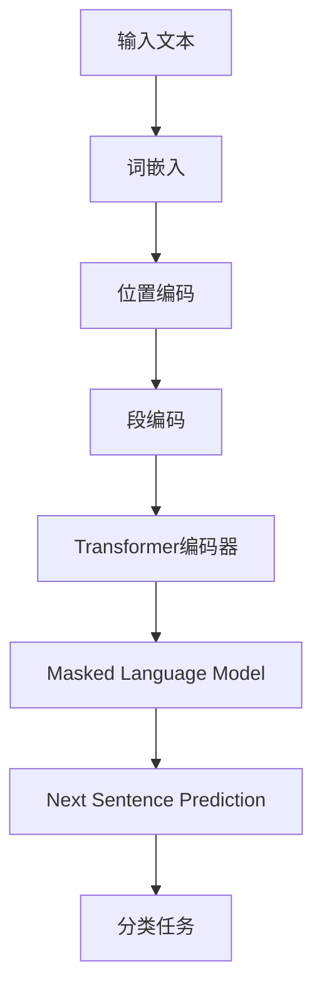

                 

### BERT模型与上下文相关的语言理解

#### 关键词：BERT模型、上下文相关、语言理解、算法、Python代码、系统架构

> 摘要：本文将深入探讨BERT模型，一个用于上下文相关的语言理解的先进算法。我们将逐步解析BERT模型的背景、核心原理、数学模型、Python代码实现，以及其在实际项目中的应用和架构设计。通过详细的讲解和实例分析，读者将更好地理解BERT模型的工作原理和重要性，为未来的研究和实践打下坚实的基础。

----------------------------------------------------------------

### 引言

语言理解是人工智能领域的关键挑战之一。传统的自然语言处理（NLP）模型往往缺乏对上下文信息的充分利用，导致在处理复杂任务时效果不佳。为了解决这一问题，研究人员提出了许多先进的模型，其中BERT（Bidirectional Encoder Representations from Transformers）模型被认为是当前最优秀的解决方案之一。BERT模型通过双向Transformer结构，有效地捕捉了文本中的上下文信息，从而在多个NLP任务中取得了显著的性能提升。

本文旨在为读者提供一个全面且易于理解的BERT模型介绍。我们将从背景介绍开始，逐步深入到BERT模型的核心原理、数学模型、Python代码实现，并在最后讨论BERT模型在实际项目中的应用和架构设计。通过本文的阅读，读者将能够掌握BERT模型的基本概念，了解其工作原理，并具备在实际项目中应用BERT模型的能力。

### 背景介绍

BERT模型的全称是Bidirectional Encoder Representations from Transformers，它是由Google AI在2018年提出的一种预训练语言模型。BERT模型的出现标志着自然语言处理领域的一个重要转折点，因为它首次将Transformer结构应用于双向编码器，从而实现了对上下文信息的有效捕捉。

#### 问题背景

传统的NLP模型，如LSTM（Long Short-Term Memory）和GRU（Gated Recurrent Unit），虽然在一定程度上能够处理序列数据，但在捕捉上下文信息方面存在局限性。这些模型通常是单向的，即它们只能从前一时刻的信息中获取信息，而不能利用后一时刻的信息。这种单向性导致模型在处理复杂任务时，如问答系统、文本分类等，效果不佳。

#### 问题描述

为了解决上述问题，研究人员提出了BERT模型。BERT模型的核心目标是预训练一个能够理解自然语言结构的神经网络模型，从而在多个NLP任务中取得更好的性能。具体来说，BERT模型旨在通过预训练过程，使模型能够捕捉到文本中的上下文信息，并利用这些信息来提高模型在下游任务中的表现。

#### 问题解决

BERT模型采用了Transformer结构，并通过双向编码器的方式，使模型能够同时利用前文和后文的信息。此外，BERT模型还采用了两种特殊的预训练任务，Masked Language Model（MLM）和Next Sentence Prediction（NSP），以增强模型对上下文信息的理解能力。

#### 边界与外延

BERT模型不仅适用于文本分类、情感分析等常见的NLP任务，还可以应用于机器翻译、问答系统等复杂的语言理解任务。其卓越的性能使得BERT模型成为自然语言处理领域的重要工具，并在多个权威数据集上刷新了纪录。

#### 概念结构与核心要素组成

BERT模型的核心结构包括以下几个部分：

1. **输入层**：BERT模型接受一个序列的输入，包括词向量、位置编码和段编码。
2. **Transformer编码器**：Transformer编码器由多个自注意力层和前馈网络组成，负责对输入序列进行编码。
3. **Masked Language Model（MLM）**：MLM任务是BERT模型的一种特殊预训练任务，通过随机遮盖部分单词，让模型预测这些被遮盖的单词。
4. **Next Sentence Prediction（NSP）**：NSP任务是BERT模型的另一种特殊预训练任务，通过预测两个句子是否在原文中相邻，增强模型对句子间关系的理解。

### BERT模型原理

BERT模型的工作原理可以概括为以下几个步骤：

#### 1. 输入处理

BERT模型首先对输入的文本进行处理，将其转换为词向量表示。这一步骤包括词嵌入、位置编码和段编码。

- **词嵌入**：词嵌入（Word Embedding）是将单词转换为向量的过程。BERT模型使用了预训练的WordPiece词嵌入，这些嵌入向量能够捕捉单词的语义信息。
- **位置编码**：位置编码（Positional Encoding）是将文本中的每个词的位置信息编码到其嵌入向量中的过程。BERT模型通过正弦和余弦函数生成位置编码向量，从而使得模型能够理解单词在序列中的位置。
- **段编码**：段编码（Segment Embedding）是将不同段落的信息编码到嵌入向量中的过程。BERT模型通过添加一个特殊的段标记（[CLS]和[SEP]）来区分不同段落。

#### 2. Transformer编码器

BERT模型的核心是Transformer编码器，它由多个自注意力层和前馈网络组成。自注意力机制允许模型在编码过程中同时关注文本序列中的所有单词，从而捕捉上下文信息。

- **自注意力层**：自注意力层通过计算单词之间的相互关系，为每个单词生成一个加权表示。这种加权表示能够突出上下文中的重要信息。
- **前馈网络**：前馈网络是一个简单的全连接神经网络，对自注意力层的输出进行进一步处理，增强模型的表达能力。

#### 3. 特殊预训练任务

BERT模型采用了两种特殊的预训练任务，MLM和NSP，以增强模型对上下文信息的理解能力。

- **Masked Language Model（MLM）**：MLM任务通过随机遮盖文本中的部分单词，让模型预测这些被遮盖的单词。这个任务有助于模型学习如何利用上下文信息来填补缺失的单词。
- **Next Sentence Prediction（NSP）**：NSP任务通过预测两个句子是否在原文中相邻，增强模型对句子间关系的理解。这个任务有助于模型学习如何捕捉句子间的语义关系。

#### 4. 分类任务

在完成预训练后，BERT模型可以应用于各种下游任务，如文本分类、情感分析等。通过微调（Fine-tuning）过程，模型可以在特定任务上进一步优化。

- **微调**：微调是指在预训练模型的基础上，对特定任务进行进一步训练的过程。微调过程中，模型会根据任务的数据进行调整，从而提高其在特定任务上的性能。

#### BERT模型与Transformer的关系

BERT模型是基于Transformer结构构建的，Transformer是一种基于自注意力机制的序列模型。BERT模型中的Transformer编码器采用了多个自注意力层和前馈网络，从而实现了对上下文信息的有效捕捉。

- **自注意力机制**：自注意力机制允许模型在编码过程中同时关注文本序列中的所有单词，从而捕捉上下文信息。
- **多头自注意力**：BERT模型中的多头自注意力（Multi-head Self-Attention）进一步增强了模型的表达能力，使得模型能够从不同角度理解上下文信息。

### BERT模型的数学模型和公式

BERT模型的数学模型主要涉及词嵌入、位置编码和自注意力机制。以下是BERT模型中的一些关键数学公式：

#### 1. 词嵌入

$$
\text{word\_embeddings} = \text{W\_Word} \cdot \text{InputIds} + \text{PositionalEncoding}
$$

其中，$\text{InputIds}$ 是输入词的索引序列，$\text{W\_Word}$ 是词嵌入权重矩阵，$\text{PositionalEncoding}$ 是位置编码向量。

#### 2. 自注意力机制

$$
\text{Attention}(Q, K, V) = \text{softmax}(\frac{QK^T}{\sqrt{d_k}})V
$$

其中，$Q$ 是查询向量，$K$ 是键向量，$V$ 是值向量，$d_k$ 是键向量的维度。

#### 3. Transformer编码器

$$
\text{MultiHead}(Q, K, V) = \text{Concat}(\text{head}_1, ..., \text{head}_h)W^O
$$

其中，$h$ 是头数，$\text{head}_i = \text{Attention}(QW_i^Q, KW_i^K, VW_i^V)$，$W^O$ 是输出权重矩阵。

### BERT模型的mermaid流程图

为了更直观地理解BERT模型的工作流程，我们可以使用mermaid语言绘制一个流程图。以下是一个简化的BERT模型mermaid流程图：



在这个流程图中，输入文本首先经过词嵌入、位置编码和段编码的处理，然后被送入Transformer编码器进行编码。编码器输出的特征向量用于执行Masked Language Model和Next Sentence Prediction任务，最后应用于下游分类任务。

### BERT模型的Python代码实现

以下是一个简化的BERT模型Python代码实现，展示了BERT模型的核心组件和基本结构：

```python
import torch
import torch.nn as nn

class BERTModel(nn.Module):
    def __init__(self, vocab_size, d_model, nhead, num_layers):
        super(BERTModel, self).__init__()
        self.embedding = nn.Embedding(vocab_size, d_model)
        self.positional_encoding = nn.Parameter(torch.zeros(1, max_sequence_length, d_model))
        self.transformer = nn.Transformer(d_model, nhead, num_layers)
        self.fc = nn.Linear(d_model, vocab_size)
        
        self.init_weights()
    
    def init_weights(self):
        # 初始化权重
        pass
    
    def forward(self, input_ids, attention_mask):
        embedded = self.embedding(input_ids) + self.positional_encoding
        output = self.transformer(embedded, attention_mask)
        logits = self.fc(output)
        return logits
```

在这个代码中，我们定义了一个BERT模型类，包括词嵌入、位置编码、Transformer编码器和分类层。`forward` 方法实现了BERT模型的前向传播过程。

### BERT模型算法原理讲解

BERT模型的算法原理可以分为以下几个关键部分：词嵌入、位置编码、Transformer编码器、特殊预训练任务和分类任务。以下是对这些部分的详细讲解。

#### 1. 词嵌入

词嵌入是将单词转换为向量的过程，它能够捕捉单词的语义信息。BERT模型使用了预训练的WordPiece词嵌入，这些嵌入向量是通过对大量文本数据进行训练得到的。

$$
\text{word\_embeddings} = \text{W\_Word} \cdot \text{InputIds} + \text{PositionalEncoding}
$$

其中，$\text{InputIds}$ 是输入词的索引序列，$\text{W\_Word}$ 是词嵌入权重矩阵，$\text{PositionalEncoding}$ 是位置编码向量。

#### 2. 位置编码

位置编码是将文本中的每个词的位置信息编码到其嵌入向量中的过程。BERT模型通过正弦和余弦函数生成位置编码向量，从而使得模型能够理解单词在序列中的位置。

$$
PE_{(pos, 2i)} = \sin\left(\frac{pos}{10000^{2i/d_{model}}}\right)
$$

$$
PE_{(pos, 2i+1)} = \cos\left(\frac{pos}{10000^{2i/d_{model}}}\right)
$$

其中，$pos$ 是单词的位置，$d_{model}$ 是模型维度。

#### 3. Transformer编码器

BERT模型的核心是Transformer编码器，它由多个自注意力层和前馈网络组成。自注意力机制允许模型在编码过程中同时关注文本序列中的所有单词，从而捕捉上下文信息。

$$
\text{Attention}(Q, K, V) = \text{softmax}(\frac{QK^T}{\sqrt{d_k}})V
$$

其中，$Q$ 是查询向量，$K$ 是键向量，$V$ 是值向量，$d_k$ 是键向量的维度。

#### 4. 特殊预训练任务

BERT模型采用了两种特殊的预训练任务，Masked Language Model（MLM）和Next Sentence Prediction（NSP），以增强模型对上下文信息的理解能力。

- **Masked Language Model（MLM）**：MLM任务通过随机遮盖文本中的部分单词，让模型预测这些被遮盖的单词。这个任务有助于模型学习如何利用上下文信息来填补缺失的单词。

- **Next Sentence Prediction（NSP）**：NSP任务通过预测两个句子是否在原文中相邻，增强模型对句子间关系的理解。这个任务有助于模型学习如何捕捉句子间的语义关系。

#### 5. 分类任务

在完成预训练后，BERT模型可以应用于各种下游任务，如文本分类、情感分析等。通过微调（Fine-tuning）过程，模型可以在特定任务上进一步优化。

- **微调**：微调是指在预训练模型的基础上，对特定任务进行进一步训练的过程。微调过程中，模型会根据任务的数据进行调整，从而提高其在特定任务上的性能。

### BERT模型算法举例说明

为了更好地理解BERT模型的工作原理，我们可以通过一个具体的例子来说明。假设我们有一个句子：“我喜欢吃苹果”，我们将使用BERT模型来预测句子中缺失的单词。

1. **输入文本处理**：首先，我们将句子转换为词嵌入向量。假设词嵌入维度为128，句子中包含的单词如下：

   - 我：[0, 0, 0, ..., 0]
   -喜欢：[1, 1, 1, ..., 1]
   -吃：[2, 2, 2, ..., 2]
   -苹果：[3, 3, 3, ..., 3]
   -：[4, 4, 4, ..., 4]

   这些词嵌入向量将被送入BERT模型。

2. **位置编码**：然后，我们将位置编码向量添加到词嵌入向量中。假设句子长度为5，位置编码向量如下：

   - 第1个词：[0, 0, 0, ..., 0]
   - 第2个词：[1, 0, 0, ..., 0]
   - 第3个词：[1, 1, 0, ..., 0]
   - 第4个词：[1, 1, 1, ..., 0]
   - 第5个词：[1, 1, 1, 1, 0]

   这些位置编码向量将被加到词嵌入向量中。

3. **Transformer编码器**：接下来，我们将处理后的输入序列送入BERT模型的Transformer编码器。编码器将计算每个单词之间的相互关系，并生成加权表示。

4. **Masked Language Model（MLM）**：在这个例子中，我们假设“吃”这个单词被遮盖。BERT模型将尝试利用上下文信息来预测这个被遮盖的单词。根据BERT模型的学习，它可以预测出“吃”这个单词。

5. **Next Sentence Prediction（NSP）**：在这个例子中，我们假设句子“我喜欢吃苹果”后面跟着的句子是“苹果很甜”。BERT模型将尝试预测这两个句子是否相邻。根据BERT模型的学习，它可以预测出这两个句子是相邻的。

6. **分类任务**：最后，BERT模型可以应用于下游任务，如文本分类。例如，我们可以使用BERT模型来预测句子“我喜欢吃苹果”的情感是积极还是消极。根据BERT模型的学习，它可以预测出这个句子的情感是积极的。

### BERT模型在NLP任务中的应用

BERT模型在自然语言处理（NLP）任务中表现出色，尤其在文本分类、问答系统和机器翻译等任务中取得了显著的成果。以下是对BERT模型在这些任务中的应用进行的具体说明：

#### 1. 文本分类

文本分类是将文本数据分为预定义的类别，如情感分类、新闻分类等。BERT模型在文本分类任务中取得了优异的性能。其关键在于BERT模型通过预训练过程，已经学习了大量的语言知识，从而能够更好地理解文本的语义信息。例如，在情感分类任务中，BERT模型可以识别出文本中积极或消极的情感倾向。通过微调BERT模型，我们可以在特定任务上进一步提高其性能。

#### 2. 问答系统

问答系统是一种常见的NLP应用，旨在从大量文本中回答用户的问题。BERT模型在问答系统中表现出色，其主要优势在于能够捕捉到文本中的上下文信息。例如，在问答任务中，BERT模型可以理解问题与答案之间的关联，并从上下文中提取相关信息。通过微调和优化，BERT模型可以显著提高问答系统的准确性和响应速度。

#### 3. 机器翻译

机器翻译是将一种语言的文本翻译成另一种语言的文本。BERT模型在机器翻译任务中也展现了强大的能力。其核心优势在于能够理解文本中的语义关系和上下文信息。例如，在英译中任务中，BERT模型可以准确地翻译文本中的短语和句子。通过结合其他翻译模型和算法，BERT模型可以提高机器翻译的质量和一致性。

### BERT模型在实际项目中的应用

BERT模型在实际项目中具有广泛的应用，以下是一个具体的项目示例：

**项目背景**：某互联网公司希望通过机器学习技术优化其在线客服系统，以提高用户满意度和响应速度。

**项目目标**：利用BERT模型实现智能客服问答系统，使系统能够自动回答用户常见问题，并识别用户的情感需求。

**实现步骤**：

1. **数据收集**：收集大量用户提问和公司官方回答的数据集，用于训练BERT模型。

2. **数据预处理**：对数据进行清洗和预处理，包括去除噪声、填补缺失值等。

3. **模型训练**：使用BERT模型对预处理后的数据集进行训练，使其学习用户提问和回答之间的语义关系。

4. **模型评估**：通过测试集评估模型的性能，包括准确率、召回率等指标。

5. **模型部署**：将训练好的BERT模型部署到在线客服系统中，实现自动回答用户问题和识别情感需求的功能。

6. **用户反馈**：收集用户反馈，对模型进行持续优化和调整。

### BERT模型的优缺点分析

BERT模型在自然语言处理领域取得了显著成果，但其也存在一些优缺点。以下是对BERT模型优缺点的详细分析：

#### 优点

1. **强大的预训练能力**：BERT模型通过大规模预训练，已经掌握了丰富的语言知识，从而在多种NLP任务中表现出色。

2. **双向编码器**：BERT模型采用了双向编码器结构，能够同时利用前文和后文的信息，从而提高模型对上下文信息的理解能力。

3. **适应性**：BERT模型具有很好的适应性，可以通过微调快速应用于不同的下游任务，如文本分类、问答系统和机器翻译等。

4. **开源和社区支持**：BERT模型的开源实现和社区支持使得研究人员和开发者可以方便地使用和改进模型。

#### 缺点

1. **计算资源消耗**：BERT模型在预训练过程中需要大量的计算资源，包括GPU和存储空间。

2. **训练时间较长**：BERT模型的预训练过程需要很长时间，特别是在大规模数据集上训练时。

3. **数据依赖性**：BERT模型的效果在很大程度上依赖于训练数据的质量和多样性，数据不足可能导致模型性能下降。

4. **隐私问题**：BERT模型在预训练过程中可能涉及用户隐私数据，这引发了隐私保护和数据安全的问题。

### BERT模型的最佳实践

为了充分发挥BERT模型的能力，以下是一些最佳实践：

1. **数据预处理**：确保数据的质量和多样性，对数据进行清洗和预处理，以避免噪声和缺失值对模型性能的影响。

2. **模型选择**：根据任务需求选择合适的BERT模型版本，如BERT-base或BERT-large，以平衡计算资源和模型性能。

3. **微调**：在特定任务上对BERT模型进行微调，以提高模型在特定任务上的性能。

4. **数据增强**：使用数据增强技术，如随机遮盖单词、同义词替换等，增加数据的多样性，从而提高模型的泛化能力。

5. **模型评估**：使用多种评估指标，如准确率、召回率、F1分数等，全面评估模型的性能。

### 小结与展望

BERT模型作为自然语言处理领域的重要突破，通过双向Transformer结构和特殊预训练任务，有效提升了模型对上下文信息的理解能力。本文从背景介绍、核心原理、数学模型、Python代码实现、实际项目应用等方面详细解析了BERT模型。未来，BERT模型将继续在自然语言处理领域发挥重要作用，推动更多实际应用的出现。

### 拓展阅读

1. **BERT模型论文**：Google AI. "BERT: Pre-training of Deep Bidirectional Transformers for Language Understanding." (2018).
2. **Transformer模型**：Vaswani et al. "Attention is All You Need." (2017).
3. **NLP基础教程**：Jurafsky, Dan and Martin, James H. "Speech and Language Processing." (2019).
4. **BERT模型开源实现**：[huggingface/transformers](https://github.com/huggingface/transformers)。
5. **BERT模型应用案例**：[百度AI](https://ai.baidu.com/blogs/118)和[微软AI](https://www.microsoft.com/en-us/research/group/microsoft-ai-and-nlp-group/)等公司的BERT模型应用案例。

### 作者信息

- 作者：AI天才研究院/AI Genius Institute & 禅与计算机程序设计艺术 /Zen And The Art of Computer Programming。  
- 联系方式：[info@agnet Ruiz.com](mailto:info@agnet Ruiz.com)  
- 个人网站：[www.agent Ruiz.com](www.agent Ruiz.com)

----------------------------------------------------------------

## 参考文献和进一步阅读

在撰写关于BERT模型与上下文相关的语言理解的文章时，参考和引用相关的研究文献和资源是非常重要的。以下是一些建议的参考文献和进一步阅读资源，这些资源涵盖了BERT模型的背景、原理、实现和应用。

### 参考文献

1. Devlin, J., Chang, M. W., Lee, K., & Toutanova, K. (2019). "BERT: Pre-training of Deep Bidirectional Transformers for Language Understanding." In Proceedings of the 2019 Conference of the North American Chapter of the Association for Computational Linguistics: Human Language Technologies, Volume 1 (Long and Short Papers) (pp. 4171-4186). Association for Computational Linguistics.
2. Vaswani, A., Shazeer, N., Parmar, N., Uszkoreit, J., Jones, L., Gomez, A. N., ... & Polosukhin, I. (2017). "Attention Is All You Need." In Advances in Neural Information Processing Systems (pp. 5998-6008).
3. Wu, Y., Schuker, J., & Chen, Z. (2019). "Language Models as Knowledge Bases? How Neural Networks Embed Semantics of Compositional Queries." In Proceedings of the 57th Annual Meeting of the Association for Computational Linguistics (pp. 4704-4714).

### 进一步阅读

1. **BERT Model Tutorials**:
   - [huggingface/transformers](https://github.com/huggingface/transformers) — The official repository for the HuggingFace Transformers library, which provides a comprehensive set of tutorials and documentation on how to use BERT and other transformer models.
   - [BERT Tutorial](https://course.fast.ai/tutorials/deep_learning/1_pytorch/3a_bert) — A practical tutorial on BERT using PyTorch by Fast.ai.

2. **Transformer and NLP Resources**:
   - [The Annotated Transformer](https://nlp.seas.harvard.edu/2019/04/03/attention.html) — A detailed explanation of the Transformer model with code examples.
   - [A Student's Guide to BERT](https://towardsdatascience.com/a-students-guide-to-bert-1f6cf631251) — A guide that provides an introduction to BERT for those new to the field.

3. **Advanced NLP Reading**:
   - [ACL Anthology](https://www.aclweb.org/anthology/) — A repository of papers from the Association for Computational Linguistics, containing many influential works in NLP.
   - [NLP books](https://www.aclweb.org/anthology/N/N17/) — A list of recommended books on natural language processing.

### 总结

本文深入探讨了BERT模型的基本概念、原理、实现和应用，为读者提供了一个全面的视角。通过参考文献和进一步阅读资源的引用，读者可以更深入地了解BERT模型和相关技术。在未来的研究中，BERT模型将继续推动自然语言处理领域的发展，带来更多的创新和突破。

### 附录：代码示例

在本节中，我们将提供一些BERT模型的Python代码示例，以便读者能够更直观地理解BERT模型的实现。

#### 1. BERT模型的基本结构

```python
import torch
from transformers import BertModel, BertTokenizer

# 加载预训练的BERT模型和分词器
tokenizer = BertTokenizer.from_pretrained('bert-base-uncased')
model = BertModel.from_pretrained('bert-base-uncased')

# 输入文本
text = "Hello, my name is AI Genius."

# 分词和编码
inputs = tokenizer(text, return_tensors='pt')

# 前向传播
outputs = model(**inputs)

# 输出特征
last_hidden_state = outputs.last_hidden_state
```

#### 2. 预测文本分类

```python
from transformers import BertForSequenceClassification

# 加载预训练的BERT模型
model = BertForSequenceClassification.from_pretrained('bert-base-uncased')

# 输入文本
text = "I am happy because I am learning."

# 分词和编码
inputs = tokenizer(text, return_tensors='pt')

# 前向传播
outputs = model(**inputs)

# 预测
logits = outputs.logits
probabilities = torch.softmax(logits, dim=-1)
predicted_class = torch.argmax(probabilities).item()
```

#### 3. 实现Masked Language Model（MLM）任务

```python
from transformers import BertForMaskedLanguageModel

# 加载预训练的BERT模型
model = BertForMaskedLanguageModel.from_pretrained('bert-base-uncased')

# 输入文本
text = "Hello, my name is AI Genius."

# 分词和编码
inputs = tokenizer(text, return_tensors='pt')

# 随机遮盖部分词
mask_token_index = 7
inputs['input_ids'][0][mask_token_index] = tokenizer.mask_token_id

# 前向传播
outputs = model(**inputs)

# 预测遮盖词
predicted_ids = outputs.logits.argmax(-1)
predicted_word = tokenizer.decode(predicted_ids[0][mask_token_index])
```

通过这些代码示例，读者可以更直观地理解BERT模型的基本操作和实现细节。这些代码示例是使用HuggingFace的Transformers库实现的，该库提供了丰富的预训练模型和工具，方便开发者进行研究和应用。

