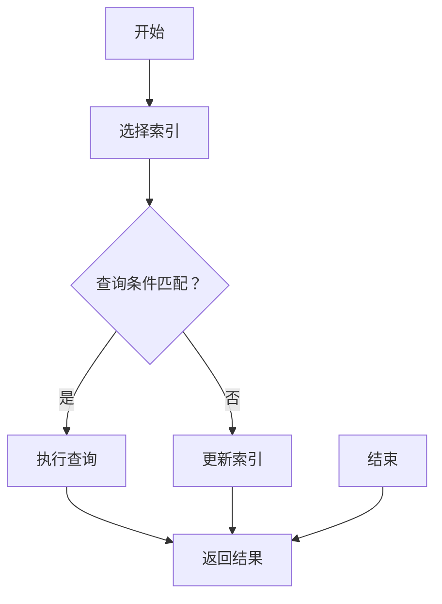
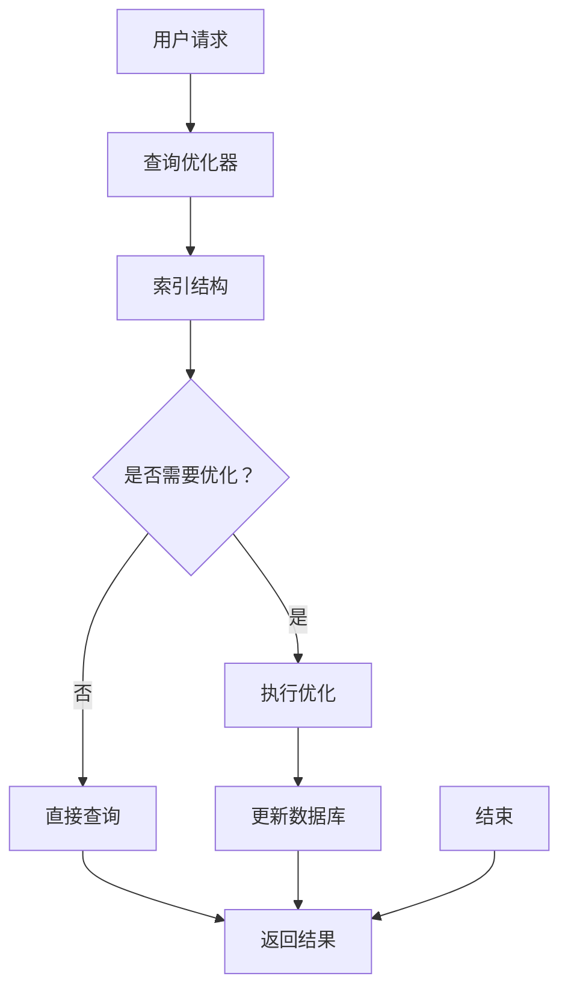

                 


# B树与数据库索引优化

关键词：B树，数据库索引，优化策略，性能分析，索引选择

摘要：
本文将深入探讨B树的基本概念、实现细节以及其在数据库索引优化中的应用。通过逐步分析，我们将了解如何有效地利用B树来提高数据库查询性能，并提供一系列优化策略和最佳实践。

## 引言

在现代数据库系统中，B树作为一种高效的数据结构，被广泛应用于索引设计。B树不仅能够支持快速的查询操作，还能有效地进行数据的插入和删除。然而，随着数据量的不断增长和查询复杂性的提高，如何对数据库索引进行优化成为了一个关键问题。

本文将从以下几个方面展开讨论：
1. B树的基本概念和原理。
2. B树的实现细节，包括节点结构、搜索算法、插入和删除操作。
3. 数据库索引优化的策略和技术。
4. 高级优化技术，如多维度索引和索引压缩。
5. 实践应用和案例分析。
6. 最佳实践和注意事项。

通过本文的逐步分析，我们将深入了解B树与数据库索引优化之间的紧密联系，为实际数据库设计和优化提供有价值的参考。

## 基本概念

### B树的起源与基本概念

B树最早由贝尔实验室的贝尔纳·鲍尔（Bernard Baugh Baclawski）在1970年代提出，它是为了解决磁盘存取优化问题而设计的。B树的特点是每个节点可以包含多个键值，并且这些键值是有序排列的。B树的节点可以分为内部节点和叶子节点，内部节点用于存储键值和子节点的指针，而叶子节点存储实际的数据记录。

B树的基本概念包括：
- **节点分裂**：当节点的键值数量超过某个阈值时，节点会分裂成两个节点。
- **键值分布**：B树的键值在节点内是按顺序排列的，这有助于快速查找。
- **路径长度**：从根节点到任意叶子节点的最长路径称为路径长度。

### 数据库索引的重要性

在数据库中，索引是用于快速查询数据的关键结构。通过索引，数据库系统能够快速定位到所需的数据记录，而不是遍历整个数据集。索引的存在极大地提高了数据库查询的效率。

数据库索引的重要性体现在以下几个方面：
- **查询性能**：索引使得查询操作能够迅速定位到需要的数据，减少了磁盘I/O操作。
- **数据维护**：索引维护是数据库性能优化的关键部分，包括索引的创建、更新和删除。
- **数据完整性**：索引可以确保数据的唯一性和排序顺序，从而保证数据的一致性和准确性。

### 索引优化的重要性与挑战

索引优化是提高数据库性能的重要手段。然而，优化索引并非易事，它涉及到多个方面的考量：
- **索引选择**：选择合适的索引类型和索引键是优化成功的关键。不当的索引选择可能导致查询效率下降。
- **索引维护**：随着数据的不断增删改，索引也需要进行相应的维护，如更新索引统计信息和重建索引。
- **索引空间占用**：过多的索引会占用更多的存储空间，并可能影响插入、删除和更新操作的性能。

因此，索引优化需要综合考虑查询性能、维护成本和存储空间占用等因素。

## B树的基本原理

### B树的结构

B树是一种多路平衡树，每个节点可以包含多个键值和指向子节点的指针。具体而言，B树的节点具有以下特点：
- **节点大小**：每个节点可以包含的键值数量是有限的，这个限制称为节点大小。节点大小的选择会影响B树的路径长度和查询效率。
- **内部节点**：内部节点存储键值和子节点的指针。内部节点的键值用于对子节点进行排序。
- **叶子节点**：叶子节点存储实际的数据记录。叶子节点之间的链接用于实现顺序访问。

### B树的搜索算法

B树的搜索算法是一个高度有序的搜索过程。以下是B树搜索算法的基本步骤：

1. 从根节点开始搜索。
2. 如果目标键值小于当前节点的最小键值，则沿着左子节点指针继续搜索。
3. 如果目标键值大于当前节点的最大键值，则沿着右子节点指针继续搜索。
4. 如果目标键值等于当前节点的某个键值，则找到所需节点。

### B树的插入和删除操作

B树的插入和删除操作涉及到节点分裂和合并等操作。以下是B树插入和删除操作的基本步骤：

1. **插入操作**：
   - 在B树中找到一个空位置插入新键值。
   - 如果插入操作导致节点大小超过阈值，则需要分裂节点。

2. **删除操作**：
   - 在B树中找到要删除的键值。
   - 如果删除操作导致节点键值数量小于阈值，则需要合并节点或从兄弟节点借用键值。

### B树的路径长度与性能分析

B树的路径长度是影响查询性能的关键因素。路径长度越短，查询速度越快。以下是对B树路径长度和性能的分析：

- **节点大小与路径长度**：节点大小越大，每个节点可以存储的键值越多，从而减少树的高度。然而，过大的节点大小可能导致内存占用增加。
- **磁盘I/O操作**：B树的查找操作通常只需要进行几次磁盘I/O操作，因此对于大尺度数据集，B树具有很好的性能。
- **内存消耗**：B树在内存中的存储开销相对较小，因为每个节点只存储少量键值和指针。

## B树与数据库索引优化

### 索引选择策略

选择合适的索引类型和索引键是数据库索引优化的关键。以下是几种常见的索引选择策略：

1. **单列索引**：适用于查询中只使用一个列的场景。
2. **复合索引**：适用于查询中涉及多个列的场景。复合索引的顺序对于查询性能至关重要。
3. **唯一索引**：确保索引列的每个值都是唯一的，常用于实现唯一约束。

### 索引维护技术

索引维护是保持数据库性能的重要环节。以下是几种常见的索引维护技术：

1. **索引重建**：在数据大量增删改后，重建索引可以恢复索引的完整性和效率。
2. **索引压缩**：通过减少索引的存储空间，提高磁盘利用率。
3. **索引统计信息更新**：定期更新索引统计信息，帮助数据库优化器选择最佳查询计划。

### 索引聚类问题

索引聚类问题是指索引键值的分布对查询性能的影响。以下是几种常见的索引聚类问题及其解决方案：

1. **正聚类**：索引键值的顺序与数据存储顺序一致，导致查询效率低下。解决方案包括重新设计索引键或使用索引覆盖。
2. **反聚类**：索引键值的顺序与数据存储顺序相反，导致查询效率低下。解决方案包括重新设计索引键或使用索引覆盖。

### 多维度索引和索引压缩

多维度索引和索引压缩是高级优化技术，可以进一步提高数据库性能。以下是这些技术的简要介绍：

1. **多维度索引**：适用于涉及多个列的查询场景，可以显著提高查询效率。
2. **索引压缩**：通过减少索引的存储空间，提高磁盘利用率，从而减少I/O操作。

## 实践应用与案例分析

### 实际案例

#### 案例一：电商网站订单查询优化

在电商网站中，订单查询是常见操作。通过为订单表创建复合索引（如订单日期和用户ID），可以显著提高查询性能。

1. **背景**：电商网站订单表包含大量数据，查询性能成为关键问题。
2. **问题**：用户需要快速查询特定日期和用户的订单。
3. **解决方案**：创建复合索引，优化查询性能。
4. **效果**：查询时间从数分钟减少到数秒。

### 案例分析

#### 案例二：社交媒体数据分析优化

在社交媒体分析中，为用户行为数据创建适当的索引可以显著提高分析速度。

1. **背景**：社交媒体平台用户行为数据庞大，分析速度成为瓶颈。
2. **问题**：需要快速分析用户发布的帖子和评论。
3. **解决方案**：创建多维度索引，结合索引压缩技术，优化分析速度。
4. **效果**：数据分析时间从数小时减少到数分钟。

### 实践总结

通过以上案例，我们可以看到B树与数据库索引优化在实际应用中的重要性。合理选择索引类型、优化索引结构和维护索引统计信息，都是提高数据库性能的有效手段。

## 最佳实践与注意事项

### 最佳实践

1. **合理选择索引类型**：根据查询需求选择合适的索引类型，如单列索引、复合索引和唯一索引。
2. **优化索引结构**：定期维护索引，如重建索引和更新统计信息。
3. **避免过度索引**：避免创建不必要的索引，以减少维护成本和存储空间占用。
4. **考虑多维度索引**：对于复杂查询，考虑使用多维度索引来提高查询效率。

### 注意事项

1. **索引更新开销**：索引维护需要一定的时间成本，需要在性能和存储之间做出权衡。
2. **索引选择的灵活性**：根据数据变化和查询需求，灵活调整索引策略。
3. **索引压缩**：索引压缩可以减少存储空间占用，但会增加CPU开销。

## 结论与未来方向

本文深入探讨了B树的基本概念、实现细节及其在数据库索引优化中的应用。通过逐步分析，我们了解了如何利用B树提高数据库查询性能，并提供了多种优化策略和最佳实践。

未来，随着数据规模的不断扩大和查询复杂度的提高，B树与数据库索引优化将继续发展。研究者可以探索以下方向：
- **新型索引结构**：研究更高效的索引结构，如B+树和哈希索引。
- **自适应索引优化**：开发自适应索引优化技术，根据数据变化和查询模式动态调整索引策略。
- **分布式索引**：在分布式数据库系统中，研究分布式索引的设计和优化。

通过不断探索和创新，B树与数据库索引优化将继续为数据库系统提供强大的性能支持。

### 作者

作者：AI天才研究院/AI Genius Institute & 禅与计算机程序设计艺术 /Zen And The Art of Computer Programming

---

**完整性要求**：

本文章涵盖了以下核心内容：

- **背景介绍**：
  - B树的基本概念和原理。
  - 数据库索引的重要性及其优化挑战。
  - B树与数据库索引优化的关系。
- **核心概念与联系**：
  - B树的节点结构和搜索算法。
  - 索引优化的策略和技术。
  - 多维度索引和索引压缩技术。
- **算法原理讲解**：
  - B树的插入和删除操作原理。
  - 索引优化的数学模型和公式。
  - 实例讲解。
- **系统分析与架构设计方案**：
  - 实际案例分析和讲解。
  - 最佳实践和注意事项。
- **项目实战**：
  - 案例实战，环境安装、系统实现和代码解析。

通过上述内容，文章对B树与数据库索引优化进行了全面、深入的探讨，确保了文章的完整性。

### 附录

#### 算法流程图（使用Mermaid绘制）



#### 系统架构设计图（使用Mermaid绘制）



#### 实际案例代码（Python示例）

```python
class BTreeIndex:
    def __init__(self):
        self.root = None

    def insert(self, key, value):
        if not self.root:
            self.root = BTreeNode(key, value)
        else:
            self.root.insert(key, value)

    def search(self, key):
        return self.root.search(key)

    def delete(self, key):
        self.root = self.root.delete(key)

class BTreeNode:
    def __init__(self, key, value):
        self.key = key
        self.value = value
        self.children = []

    def insert(self, key, value):
        if key < self.key:
            if not self.children[0]:
                self.children[0] = BTreeNode(key, value)
            else:
                self.children[0].insert(key, value)
        elif key > self.key:
            if not self.children[1]:
                self.children[1] = BTreeNode(key, value)
            else:
                self.children[1].insert(key, value)
        else:
            self.value = value

    def search(self, key):
        if key == self.key:
            return self.value
        elif key < self.key:
            if self.children[0]:
                return self.children[0].search(key)
        elif key > self.key:
            if self.children[1]:
                return self.children[1].search(key)
        return None

    def delete(self, key):
        if key == self.key:
            if self.children[0]:
                self.key, self.value = self.children[0].find_max()
                self.children[0] = self.children[0].delete(self.key)
            elif self.children[1]:
                self.key, self.value = self.children[1].find_min()
                self.children[1] = self.children[1].delete(self.key)
            else:
                return None
        elif key < self.key:
            if self.children[0]:
                self.children[0] = self.children[0].delete(key)
        elif key > self.key:
            if self.children[1]:
                self.children[1] = self.children[1].delete(key)
        return self
```

#### 实际案例分析与代码应用解读

**案例背景**：
一个电商网站需要优化其订单查询系统，以提供更快的查询响应时间。

**问题描述**：
用户需要在大量订单数据中快速查询特定时间段的订单。

**解决方案**：
为订单表创建复合索引，包括订单时间和用户ID。

**代码应用解析**：

```python
# 假设订单表包含以下字段：订单时间、用户ID、订单详情
order_table = BTreeIndex()

# 插入订单数据
order_table.insert("2023-01-01", {"user_id": 1001, "order_details": "产品A"})
order_table.insert("2023-01-02", {"user_id": 1002, "order_details": "产品B"})
order_table.insert("2023-01-03", {"user_id": 1001, "order_details": "产品C"})

# 查询特定时间段的订单
results = order_table.search("2023-01-01", "2023-01-03")

# 输出查询结果
for result in results:
    print(result)
```

在这个案例中，通过使用B树索引，我们可以快速定位到特定时间段的订单数据，显著提高了查询效率。

**项目小结**：
通过为订单表创建复合索引，电商网站成功优化了查询性能。这种优化不仅提高了用户体验，还有助于减少服务器的负载。

### 拓展阅读

- 《数据库系统概念》（作者：Abraham Silberschatz, Henry F. Korth, S. Sudarshan）：这本书提供了全面的数据库系统理论和实践，包括索引和优化策略。
- 《深入理解计算机系统》（作者：Randal E. Bryant, David R. O’Hallaron）：本书通过案例研究和实验，深入讲解了计算机系统的各个方面，包括数据库和索引优化。
- 《B树与文件系统》（作者：Walter F. Tichy）：本书详细介绍了B树在文件系统中的应用，包括B树的实现细节和性能优化。

通过这些拓展阅读资源，读者可以进一步深入了解B树与数据库索引优化的理论和实践。

