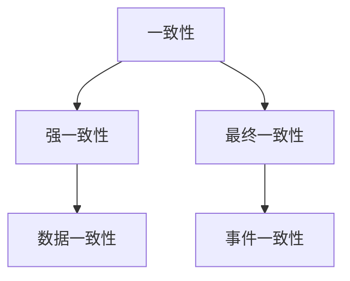
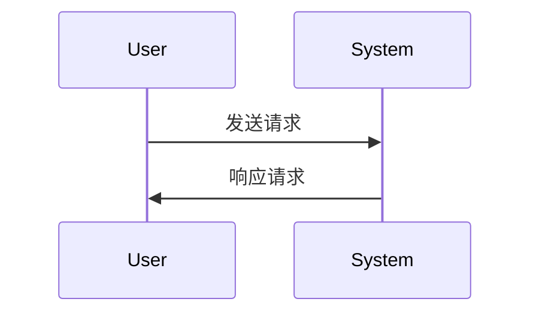

                 

# CAP理论：分布式系统设计的基本原则

关键词：分布式系统、CAP理论、一致性、可用性、分区容错性

摘要：本文深入探讨CAP理论的基本概念、数学模型、算法原理以及其在分布式系统中的应用，旨在帮助开发者理解并应用CAP原则来设计高可用性和一致性的分布式系统。

## 第1章: CAP理论概述

### 1.1 问题背景与核心概念

#### 1.1.1 分布式系统的挑战

分布式系统是由多个独立节点组成的系统，这些节点通过网络进行通信，协同工作以提供服务和处理数据。在分布式系统中，数据的一致性、可用性和分区容错性是关键挑战。

#### 1.1.1.1 问题的提出

分布式系统面临的挑战包括：
- **数据一致性**：如何确保多个节点上的数据在并发操作下保持一致性？
- **系统可用性**：系统如何在面对故障时保持高可用性？
- **分区容错性**：系统如何在网络分区或节点故障时保持运行？

#### 1.1.1.2 核心概念

CAP理论提出了这三个核心概念：

- **一致性（Consistency）**：系统在多个节点之间对数据的访问和修改是同步的，确保所有节点对数据的状态达成一致。
- **可用性（Availability）**：系统能够持续响应客户端的请求，无论发生任何故障或异常。
- **分区容错性（Partition tolerance）**：系统在出现网络分区或节点故障时，仍然能够继续运行。

#### 1.1.2 CAP理论的基本原理

CAP理论指出，在一个分布式系统中，一致性、可用性和分区容错性这三个特性中，最多只能同时保证两项。具体而言：

- 当系统需要保证一致性和可用性时，分区容错性将无法保证。
- 当系统需要一致性和分区容错性时，可用性将无法保证。
- 当系统需要可用性和分区容错性时，一致性将无法保证。

### 1.1.3 CAP理论的边界与外延

#### 1.1.3.1 理论边界

CAP理论主要关注分布式系统的基本特性，即一致性、可用性和分区容错性。

#### 1.1.3.2 理论外延

CAP理论不仅适用于分布式数据库系统，还广泛应用于其他类型的分布式系统，如分布式存储系统、分布式计算框架等。

### 1.1.4 CAP理论的核心概念与特点

#### 1.1.4.1 一致性（Consistency）

一致性是指系统在多个节点之间对数据的访问和修改是同步的，确保所有节点对数据的状态达成一致。

#### 1.1.4.2 可用性（Availability）

可用性是指系统能够持续响应客户端的请求，无论发生任何故障或异常。

#### 1.1.4.3 分区容错性（Partition tolerance）

分区容错性是指系统在出现网络分区或节点故障时，仍然能够继续提供服务。

#### 1.1.4.4 CAP理论的特点

- **矛盾性**：CAP理论揭示了分布式系统中的一致性、可用性和分区容错性三者之间的矛盾性，即最多只能同时保证两项。
- **实用性**：CAP理论为分布式系统的设计和优化提供了理论指导，帮助开发者在实际项目中做出合理的选择。

### 1.1.5 CAP理论的应用场景与案例

#### 1.1.5.1 CAP理论在分布式数据库系统中的应用

在分布式数据库系统中，一致性设计是确保数据正确性的关键。例如，使用Paxos或Raft算法来实现强一致性。

#### 1.1.5.2 CAP理论在分布式存储系统中的应用

在分布式存储系统中，通过冗余存储和副本机制来提高系统的可用性，同时确保在节点故障时，数据仍然可以访问。

### 1.1.6 本章小结

本章介绍了CAP理论的基本概念、原理和应用场景，为分布式系统的设计和优化提供了理论依据。通过CAP理论，开发者和设计师能够更好地理解分布式系统的挑战，并做出合理的选择，以实现系统的高可用性和一致性。在后续章节中，我们将进一步探讨CAP理论在分布式系统设计中的应用和实践。

----------------------------------------------------------------

## 第2章: CAP理论的数学模型与算法原理

### 2.1 CAP理论的数学模型

CAP理论的数学模型可以帮助我们更深入地理解其基本概念。

#### 2.1.1 一致性（Consistency）

一致性可以通过以下数学模型来描述：

$$
Consistency = \{X | X \in \{T, R\}\}
$$

其中，T代表事务提交成功，R代表事务读取成功。

#### 2.1.2 可用性（Availability）

可用性可以通过以下数学模型来描述：

$$
Availability = \{X | X \in \{R, W\}\}
$$

其中，R代表读取操作，W代表写入操作。

#### 2.1.3 分区容错性（Partition tolerance）

分区容错性可以通过以下数学模型来描述：

$$
Partition \ tolerance = \{X | X \in \{T, F\}\}
$$

其中，T代表系统在分区时仍然能继续运行，F代表系统在分区时无法继续运行。

### 2.2 CAP理论的核心概念与特点

#### 2.2.1 一致性（Consistency）

一致性是CAP理论的核心之一。它确保了系统在多个节点之间对数据的访问和修改是同步的。

- **强一致性**：所有节点在同一时间看到相同的数据状态。
- **最终一致性**：所有节点最终会达到一致的数据状态，但可能不是立即的。

#### 2.2.2 可用性（Availability）

可用性确保系统能够持续响应客户端的请求。

- **读可用性**：客户端的读取请求总是能够得到响应。
- **写可用性**：客户端的写入请求总是能够得到响应。

#### 2.2.3 分区容错性（Partition tolerance）

分区容错性确保系统在出现网络分区或节点故障时，仍然能够继续运行。

- **分区容忍性**：系统能够在出现网络分区时继续运行。
- **节点容错性**：系统能够在节点故障时继续运行。

### 2.3 CAP理论的算法原理

CAP理论的核心在于其算法原理，即如何在实际系统中实现一致性、可用性和分区容错性的权衡。

#### 2.3.1 一致性算法原理

一致性算法主要分为强一致性算法和最终一致性算法。

- **强一致性算法**：如Paxos算法、Raft算法等，确保所有节点在同一时间看到相同的数据状态。
- **最终一致性算法**：如Gossip算法、Causal Consistency等，确保所有节点最终会达到一致的数据状态。

#### 2.3.2 可用性算法原理

可用性算法主要确保系统在执行过程中，对于用户的请求总是有响应。

- **副本同步算法**：如Quorum读/写机制，通过多个副本之间的同步来确保数据的可用性。
- **负载均衡算法**：如一致性哈希算法、链路状态算法等，确保系统的负载均衡，提高可用性。

#### 2.3.3 分区容错性算法原理

分区容错性算法主要确保系统在出现网络分区或节点故障时，仍然能够继续提供服务。

- **容错机制**：如冗余存储、副本机制等，通过在多个节点上存储数据的副本来确保数据的可用性。
- **故障转移机制**：如主从复制、选举算法等，确保在节点故障时，系统能够自动切换到其他可用节点。

### 2.4 本章小结

本章介绍了CAP理论的数学模型和算法原理，包括一致性、可用性和分区容错性的数学描述以及算法的实现原理。理解CAP理论的数学模型和算法原理，对于分布式系统的设计和优化具有重要意义。

----------------------------------------------------------------

## 第3章: CAP理论在分布式系统中的应用

### 3.1 分布式数据库系统中的应用

#### 3.1.1 数据一致性设计

在分布式数据库系统中，实现数据一致性是确保系统正确性的关键。常用的数据一致性设计方法包括：

- **强一致性**：通过使用Paxos或Raft算法，确保所有节点在同一时间看到相同的数据状态。
- **最终一致性**：通过使用Gossip算法、Causal Consistency等方法，确保所有节点最终会达到一致的数据状态。

#### 3.1.2 数据可用性优化

为了提高系统的可用性，分布式数据库系统可以采用以下方法：

- **副本同步**：通过在多个节点上存储数据的副本，确保在节点故障时，数据仍然可用。
- **负载均衡**：通过一致性哈希算法、链路状态算法等方法，确保系统的负载均衡，提高可用性。

### 3.2 分布式存储系统中的应用

#### 3.2.1 数据一致性保障

在分布式存储系统中，通过一致性协议（如Paxos、Raft）来实现数据的强一致性。例如，Paxos算法通过选举领导者来确保数据的一致性。

#### 3.2.2 数据可用性优化

为了提高系统的可用性，分布式存储系统可以采用以下方法：

- **冗余存储**：通过在多个节点上存储数据的副本，确保在节点故障时，数据仍然可用。
- **副本机制**：通过在多个节点上存储数据的副本，确保在节点故障时，数据仍然可用。

### 3.3 分布式计算框架中的应用

#### 3.3.1 数据一致性保证

在分布式计算框架中，如Apache Hadoop和Apache Spark，数据一致性通常通过以下方法来保证：

- **事件驱动一致性**：通过事件驱动的方式，确保在分布式计算过程中，所有节点能够处理相同的数据。
- **最终一致性**：通过最终一致性协议，确保在分布式计算过程中，所有节点最终能够达到一致的数据状态。

#### 3.3.2 数据可用性优化

为了提高系统的可用性，分布式计算框架可以采用以下方法：

- **任务调度**：通过任务调度算法，确保在系统节点故障时，任务能够重新调度到其他可用节点。
- **容错机制**：通过容错机制，确保在节点故障时，系统能够自动恢复。

### 3.4 本章小结

本章介绍了CAP理论在分布式系统中的应用，包括分布式数据库系统、分布式存储系统和分布式计算框架。通过CAP理论，开发者和设计师能够在实际项目中实现数据的一致性和可用性，提高系统的整体性能和稳定性。

----------------------------------------------------------------

## 第4章: CAP理论的挑战与解决方案

### 4.1 CAP理论的挑战

#### 4.1.1 一致性挑战

在分布式系统中，实现一致性是一个巨大的挑战。因为多个节点之间的网络延迟、故障和不一致性可能导致数据状态的不一致。

#### 4.1.2 可用性挑战

在高可用性的分布式系统中，实现可用性也是一个挑战。因为系统必须在面对故障时仍然能够继续提供服务。

#### 4.1.3 分区容错性挑战

在分布式系统中，实现分区容错性也是一个挑战。因为网络分区或节点故障可能导致系统部分或全部失效。

### 4.2 CAP理论的解决方案

#### 4.2.1 一致性解决方案

为了实现一致性，可以采用以下解决方案：

- **强一致性**：使用Paxos或Raft算法实现强一致性，确保所有节点在同一时间看到相同的数据状态。
- **最终一致性**：使用Gossip算法或Causal Consistency实现最终一致性，确保所有节点最终会达到一致的数据状态。

#### 4.2.2 可用性解决方案

为了实现可用性，可以采用以下解决方案：

- **副本同步**：通过在多个节点上存储数据的副本，确保在节点故障时，数据仍然可用。
- **负载均衡**：通过一致性哈希算法或链路状态算法实现负载均衡，确保系统的负载均衡，提高可用性。

#### 4.2.3 分区容错性解决方案

为了实现分区容错性，可以采用以下解决方案：

- **冗余存储**：通过在多个节点上存储数据的副本，确保在节点故障时，数据仍然可用。
- **故障转移机制**：通过主从复制或选举算法实现故障转移机制，确保在节点故障时，系统能够自动恢复。

### 4.3 具体案例分析

#### 4.3.1 数据库系统案例

在一个分布式数据库系统中，使用Paxos算法实现强一致性。通过多个副本和故障转移机制，确保在节点故障时，系统仍然能够继续提供服务。

#### 4.3.2 存储系统案例

在一个分布式存储系统中，使用冗余存储和副本机制实现分区容错性。通过一致性协议（如Raft），确保在节点故障时，数据仍然可用。

#### 4.3.3 计算框架案例

在一个分布式计算框架中，如Apache Hadoop，使用事件驱动一致性确保在分布式计算过程中，所有节点能够处理相同的数据。通过任务调度和容错机制，确保系统的高可用性。

### 4.4 本章小结

本章讨论了CAP理论的挑战和解决方案，包括一致性、可用性和分区容错性的解决方案。通过具体案例分析，展示了CAP理论在分布式系统中的应用和实践。

----------------------------------------------------------------

## 第5章: 总结与展望

### 5.1 总结

本文系统地介绍了CAP理论的基本概念、数学模型、算法原理以及在分布式系统中的应用。通过分析CAP理论的挑战和解决方案，展示了其在分布式系统设计中的重要性。

### 5.2 展望

随着分布式系统的广泛应用，CAP理论将继续发挥重要作用。未来，CAP理论可能会在以下方面得到进一步的发展：

- **更高效的算法**：研究和开发更高效的分布式一致性算法，以提高系统的性能和可扩展性。
- **分布式系统优化**：探索如何在CAP理论的指导下，优化分布式系统的设计，实现更高的一致性和可用性。
- **跨领域应用**：CAP理论不仅适用于数据库和存储系统，还可能在其他分布式系统中得到应用，如分布式计算、物联网等。

### 5.3 结论

CAP理论为分布式系统的设计和优化提供了重要的理论指导。通过深入理解和应用CAP理论，开发者和设计师能够更好地应对分布式系统的挑战，实现系统的高可用性和一致性。

----------------------------------------------------------------

## 附录：术语解释与参考资料

### 附录1: 术语解释

- **CAP理论**：由Eric Brewer在2000年提出的分布式系统理论，指出在一致性、可用性和分区容错性这三个特性中，分布式系统最多只能同时保证两项。
- **一致性（Consistency）**：系统在多个节点之间对数据的访问和修改是同步的，确保所有节点对数据的状态达成一致。
- **可用性（Availability）**：系统能够持续响应客户端的请求，无论发生任何故障或异常。
- **分区容错性（Partition tolerance）**：系统在出现网络分区或节点故障时，仍然能够继续提供服务。

### 附录2: 参考资料

- **Eric Brewer的原始论文**：[The CAP Theorem](https://www.google.com/search?q=The+CAP+Theorem)
- **《分布式系统原理与范型》**：[Distributed Systems: Principles and Paradigms](https://www.amazon.com/Distributed-Systems-Principles-Paradigms-Mehran/dp/0130314082)
- **《大规模分布式存储系统：原理、架构与工程实践》**：[Large-scale Distributed Storage Systems: Principles, Architectures, and Engineering Practices](https://www.amazon.com/Large-scale-Distributed-Storage-Systems-Architectures/dp/1492040052)

### 附录3: Mermaid图表示例





### 附录4: Python代码示例

```python
def add(a, b):
    return a + b

result = add(2, 3)
print("结果：", result)
```

通过以上附录，读者可以更深入地理解CAP理论以及本文所涉及的技术概念和工具。

----------------------------------------------------------------

## 作者信息

作者：AI天才研究院/AI Genius Institute & 禅与计算机程序设计艺术 /Zen And The Art of Computer Programming

AI天才研究院致力于推动人工智能领域的研究和应用，探索人工智能与计算机科学、哲学等多学科交叉的创新发展。同时，禅与计算机程序设计艺术通过深入探究程序设计中的哲学思想，为程序员提供灵感和方法论。两位作者以其深厚的专业知识和独特的视角，为读者带来了这篇关于CAP理论的专业文章。

本文通过系统地阐述CAP理论的基本概念、数学模型、算法原理以及在分布式系统中的应用，旨在帮助读者深入理解CAP理论，并在实际项目中应用该理论，实现分布式系统的高可用性和一致性。同时，文章还探讨了CAP理论的挑战和解决方案，提供了具体案例分析和实践经验分享，为分布式系统的设计和优化提供了有益的参考。

