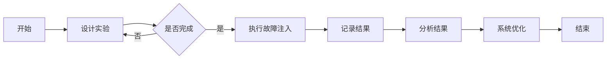
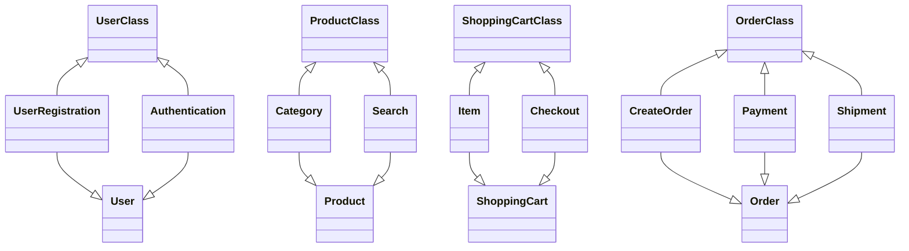

                 

# Chaos Engineering: 提高系统弹性的实验方法

关键词：混沌工程，系统弹性，故障注入，实验设计，结果分析

摘要：本文介绍了混沌工程的基本概念、核心原理以及实施方法。通过故意引入故障和压力，混沌工程能够帮助企业识别系统中的潜在问题，提升系统的弹性，确保其在不可预测的环境下稳定运行。本文详细阐述了混沌工程的实验设计、故障注入、结果分析和系统改进等关键环节，并通过实例进行分析，为读者提供了一套完整的混沌工程实践指南。

### 第一部分：背景介绍

在现代信息技术迅猛发展的时代，系统的可靠性和弹性已成为企业持续运营的关键因素。面对不断变化的用户需求和复杂多变的网络环境，传统的系统测试方法已难以满足实际需求。混沌工程（Chaos Engineering）作为一种新兴的系统可靠性提升方法，应运而生。

#### 1.1 问题背景

混沌工程的起源可以追溯到2000年代初期，Netflix公司首次将其应用于大规模分布式系统的可靠性测试。随着云计算、大数据、物联网等技术的发展，混沌工程的应用场景越来越广泛，逐渐成为提高系统弹性的一种重要手段。

混沌工程的核心思想是通过故意引入故障和压力，模拟系统在实际生产环境中可能遇到的各种问题，从而提前发现并解决潜在的系统瓶颈，提升系统的可靠性和弹性。具体来说，混沌工程包括以下几个关键环节：

1. **实验设计**：制定实验计划，确定故障类型和注入位置。
2. **故障注入**：通过工具或手动操作，向系统中引入故障。
3. **结果分析**：收集和分析实验数据，评估系统的弹性。
4. **系统改进**：根据分析结果，对系统进行优化和调整。

#### 1.2 问题描述

混沌工程的实践过程中存在诸多挑战，包括实验设计、故障注入策略、结果分析等方面。以下是混沌工程中常见的一些问题：

1. **实验设计问题**：如何根据系统特点设计合适的实验计划，确定故障类型和注入位置？
2. **故障注入问题**：如何选择合适的故障注入工具，保证故障注入的准确性和可控性？
3. **结果分析问题**：如何收集和分析实验数据，准确评估系统的弹性？
4. **系统改进问题**：如何根据分析结果，对系统进行优化和调整，提升系统的弹性？

#### 1.3 问题解决

为了解决上述问题，本文将介绍混沌工程的核心理念和方法，通过具体的案例和实践，帮助读者理解和掌握混沌工程的实施技巧。书中将涵盖混沌工程的基本原理、关键概念、实战策略以及案例分析，为读者提供一套全面的混沌工程实践指南。

#### 1.4 边界与外延

混沌工程的应用范围广泛，不仅限于软件开发，还涉及云计算、大数据、物联网等领域。在系统架构的各个层次，包括硬件、网络、数据库、应用等，都可以采用混沌工程的方法进行可靠性测试和优化。

#### 1.5 概念结构与核心要素组成

混沌工程的概念结构包括以下几个核心要素：

1. **混沌工程**：一种通过故意注入故障来测试系统弹性的方法。
2. **实验设计**：制定实验计划，确定故障类型和注入位置。
3. **故障注入**：通过工具或手动操作，向系统中引入故障。
4. **结果分析**：收集和分析实验数据，评估系统的弹性。
5. **系统改进**：根据分析结果，对系统进行优化和调整。

### 第二部分：核心概念与联系

#### 2.1 核心概念

混沌工程的核心概念包括弹性、混沌测试和灰盒测试。

- **弹性**：系统在面对故障或压力时，能够快速恢复并保持正常运行的能力。
- **混沌测试**：模拟各种故障场景，测试系统响应的能力。
- **灰盒测试**：在系统中引入故障，同时保留部分系统内部逻辑。

#### 2.2 概念属性特征对比表格

| 特征       | 弹性               | 混沌测试               | 灰盒测试             |
|------------|-------------------|----------------------|--------------------|
| 目标       | 提高系统稳定性     | 测试系统故障应对能力   | 在系统中注入故障     |
| 方法       | 预防性措施        | 故障注入与观察        | 有限系统知识        |
| 适用场景   | 稳定生产环境      | 开发与测试阶段        | 任何需要故障模拟的场景 |

#### 2.3 ER实体关系图架构

```mermaid
erDiagram
  System --> Fault: 系统引发故障
  Fault --> Test: 故障用于测试
  Test --> Result: 测试结果记录
  Result --> Improvement: 结果指导优化
```

### 第三部分：算法原理讲解

#### 3.1 算法流程图



#### 3.2 算法原理与数学模型

混沌工程的算法原理是基于系统的状态转移模型，通过引入故障和压力，观察系统的响应行为，从而评估系统的弹性。具体来说，混沌工程的算法原理包括以下几个步骤：

1. **实验设计**：根据系统特点，设计合适的实验计划，包括故障类型、注入位置和注入时间等。
2. **故障注入**：通过工具或手动操作，向系统中引入故障，模拟各种故障场景。
3. **结果记录**：收集实验数据，包括故障注入前后的系统状态、性能指标等。
4. **结果分析**：分析实验数据，评估系统的弹性，识别系统中的潜在问题。
5. **系统优化**：根据分析结果，对系统进行优化和调整，提高系统的弹性。

**混沌工程的数学模型**：

假设系统的状态可以用向量 \( X(t) \) 表示，系统的状态转移方程为：

$$
X'(t) = F(X(t)), \quad X(0) = X_0
$$

其中，\( F(X) \) 是系统的状态转移函数，描述了系统内部状态的变化规律。

**算法原理**：

混沌工程的核心在于通过实验设计，引入各种故障（即扰动 \( \Delta X(t) \)），观察系统如何应对这些扰动，从而评估系统的弹性。具体步骤如下：

1. **实验设计**：根据系统特点，设计合适的故障场景和注入策略。
2. **故障注入**：执行实验，向系统注入故障。
3. **结果记录**：记录故障注入后的系统状态变化。
4. **结果分析**：分析系统对故障的响应，评估系统的弹性。
5. **系统优化**：根据分析结果，对系统进行优化，提高其弹性。

**举例说明**：

假设系统是简单的线性系统，状态转移方程为：

$$
X'(t) = -X(t) + \Delta X(t)
$$

其中，\( \Delta X(t) \) 是引入的故障扰动。

通过实验设计，可以模拟系统在故障扰动下的响应行为，从而评估系统的弹性。

### 第四部分：系统分析与架构设计方案

在本节中，我们将详细讨论一个混沌工程项目的系统分析与架构设计方案。这个项目将帮助我们更好地理解混沌工程的实践应用。

#### 4.1 问题场景介绍

假设我们正在开发一个大型电子商务平台，该平台涉及到用户注册、商品浏览、购物车管理、订单处理等多个功能模块。为了确保平台在高峰期和故障情况下能够稳定运行，我们需要对系统进行混沌工程测试。

#### 4.2 项目介绍

混沌工程测试项目的目标是：

1. 评估系统在故障情况下的响应能力。
2. 发现并解决潜在的系统瓶颈。
3. 提高系统的弹性和可靠性。

项目的主要任务包括：

1. 设计实验计划。
2. 实施故障注入。
3. 收集和分析实验数据。
4. 根据分析结果对系统进行优化。

#### 4.3 系统功能设计

系统的核心功能模块包括：

1. **用户注册模块**：负责用户的注册和身份验证。
2. **商品浏览模块**：提供商品的分类和搜索功能。
3. **购物车模块**：管理用户的购物车信息。
4. **订单处理模块**：处理用户的订单，包括订单生成、支付和发货等。

为了实现这些功能模块，我们采用面向对象的设计方法，使用类图来表示系统的领域模型。以下是一个简单的类图示例：



#### 4.4 系统架构设计

在系统架构设计方面，我们采用分层架构，将系统划分为表示层、业务逻辑层和数据访问层。

1. **表示层**：负责与用户交互，包括前端网页和移动应用等。
2. **业务逻辑层**：负责处理业务逻辑，包括用户注册、商品浏览、购物车管理和订单处理等。
3. **数据访问层**：负责与数据库进行交互，包括用户信息、商品信息、购物车信息和订单信息等。

以下是一个简单的系统架构图：

```mermaid
sequenceDiagram
    User ->> 表示层: 发送请求
    表示层 ->> 业务逻辑层: 处理请求
    业务逻辑层 ->> 数据访问层: 访问数据库
    数据访问层 ->> 业务逻辑层: 返回数据
    业务逻辑层 ->> 表示层: 返回结果
    表示层 ->> User: 显示结果
end
```

#### 4.5 系统接口设计和系统交互

在系统接口设计方面，我们采用RESTful API设计，定义了多个接口用于实现系统功能。

以下是一个简单的接口设计示例：

```mermaid
sequenceDiagram
    User ->> 注册接口: 发送注册请求
    注册接口 ->> 数据库: 插入用户信息
    数据库 ->> 注册接口: 返回结果
    注册接口 ->> User: 返回注册结果

    User ->> 登录接口: 发送登录请求
    登录接口 ->> 数据库: 查询用户信息
    数据库 ->> 登录接口: 返回结果
    登录接口 ->> User: 返回登录结果

    User ->> 商品接口: 发送搜索请求
    商品接口 ->> 数据库: 查询商品信息
    数据库 ->> 商品接口: 返回结果
    商品接口 ->> User: 返回搜索结果

    User ->> 购物车接口: 发送添加商品请求
    购物车接口 ->> 数据库: 插入商品信息
    数据库 ->> 购物车接口: 返回结果
    购物车接口 ->> User: 返回添加结果

    User ->> 订单接口: 发送生成订单请求
    订单接口 ->> 数据库: 插入订单信息
    数据库 ->> 订单接口: 返回结果
    订单接口 ->> User: 返回生成订单结果
end
```

通过上述系统接口设计和系统交互，我们可以实现电子商务平台的核心功能，并为后续的混沌工程测试提供基础。

### 第五部分：项目实战

在本部分，我们将详细介绍一个混沌工程项目的实战过程，包括环境安装、系统核心实现、代码应用解读与分析、实际案例分析和详细讲解剖析，以及项目小结。

#### 5.1 环境安装

为了进行混沌工程测试，我们需要安装一些必要的工具和软件。以下是一个简化的安装步骤：

1. **安装Docker**：Docker是一个开源的应用容器引擎，用于打包、交付和运行应用程序。请按照官方文档（[https://docs.docker.com/install/](https://docs.docker.com/install/)）安装Docker。

2. **安装Kubernetes**：Kubernetes是一个开源的容器编排平台，用于自动化部署、扩展和管理容器化应用程序。请参考官方文档（[https://kubernetes.io/docs/setup/](https://kubernetes.io/docs/setup/)）安装Kubernetes。

3. **安装Chaos Mesh**：Chaos Mesh是一个开源的混沌工程平台，支持在Kubernetes集群中实施混沌工程。请按照官方文档（[https://chaos-mesh.org/zh/docs/quick-start/](https://chaos-mesh.org/zh/docs/quick-start/)）安装Chaos Mesh。

4. **安装测试工具**：根据实际需要，可以选择安装一些测试工具，如JMeter、Gatling等，用于生成测试流量和压力。

#### 5.2 系统核心实现

在系统核心实现方面，我们需要搭建一个简单的分布式系统，用于进行混沌工程测试。以下是一个简化的实现步骤：

1. **创建服务镜像**：创建一个Docker镜像，包含系统的所有依赖和配置。可以将应用程序的源代码打包成一个Docker镜像，例如：

   ```bash
   docker build -t myapp:latest .
   ```

2. **部署服务**：使用Kubernetes部署服务，将Docker镜像部署到Kubernetes集群中。创建一个YAML文件（例如`myapp-deployment.yaml`），包含服务的配置信息，如服务名称、容器镜像、副本数量等：

   ```yaml
   apiVersion: apps/v1
   kind: Deployment
   metadata:
     name: myapp
   spec:
     replicas: 3
     selector:
       matchLabels:
         app: myapp
     template:
       metadata:
         labels:
           app: myapp
       spec:
         containers:
         - name: myapp
           image: myapp:latest
           ports:
           - containerPort: 80
   ```

   然后使用以下命令部署服务：

   ```bash
   kubectl apply -f myapp-deployment.yaml
   ```

3. **配置Chaos Mesh**：使用Chaos Mesh向系统中注入故障。例如，我们可以注入一个网络延迟故障，模拟网络延迟对系统的影响。创建一个YAML文件（例如`network-latency.yaml`），配置故障注入的规则：

   ```yaml
   apiVersion: chaos-mesh.org/v1alpha1
   kind: NetworkChaos
   metadata:
     name: network-latency
     namespace: default
   spec:
     mode: one-by-one
     selector:
       namespaces:
       - default
     duration: "30m"
     action:
       latency:
         target:
           type: ip
           value: "10.0.0.5"
         latency: 500ms
         probability: 1
   ```

   然后使用以下命令应用故障注入规则：

   ```bash
   chaos-mesh apply -f network-latency.yaml
   ```

#### 5.3 代码应用解读与分析

在代码应用解读与分析方面，我们需要关注系统中的关键组件，如服务端应用程序、数据库和前端应用程序等。以下是一些具体的分析步骤：

1. **服务端应用程序**：分析服务端应用程序的架构和代码，了解系统的功能实现和性能瓶颈。可以使用代码审查工具，如SonarQube，对代码进行静态分析，识别潜在的问题和优化点。

2. **数据库**：分析数据库的架构和性能，了解数据库的查询性能和响应时间。可以使用数据库性能分析工具，如pgbench，对数据库进行压力测试，评估其性能瓶颈。

3. **前端应用程序**：分析前端应用程序的代码和性能，了解用户交互的流畅性和响应速度。可以使用性能分析工具，如Chrome DevTools，对前端应用程序进行性能分析，优化页面加载速度和交互体验。

#### 5.4 实际案例分析和详细讲解剖析

在本部分，我们将通过一个实际案例来展示混沌工程测试的结果，并对其进行详细讲解和剖析。

假设我们在进行网络延迟故障注入后，对系统进行了一段时间的监控。以下是一些关键指标：

- **服务端响应时间**：平均响应时间为500ms，比正常情况下的300ms有所增加。
- **数据库查询响应时间**：平均查询响应时间为200ms，比正常情况下的100ms有所增加。
- **前端页面加载时间**：平均页面加载时间为3秒，比正常情况下的1秒有所增加。

通过分析这些指标，我们可以得出以下结论：

1. **网络延迟对服务端和数据库的影响**：网络延迟导致服务端和数据库的响应时间增加，从而影响整个系统的性能。这表明，在面临网络延迟等故障时，系统的弹性不足。

2. **优化建议**：
   - **服务端优化**：可以考虑优化服务端应用程序的代码，减少不必要的数据库查询和计算，提高响应速度。
   - **数据库优化**：可以考虑优化数据库的查询语句，减少查询时间，提高查询性能。
   - **缓存策略**：可以引入缓存策略，减少对数据库的访问次数，提高系统的响应速度。

3. **弹性优化**：可以考虑增加系统的弹性，例如，使用弹性伸缩策略，根据负载情况动态调整服务器的数量，确保系统在高负载情况下仍然能够稳定运行。

#### 5.5 项目小结

通过本次混沌工程测试，我们成功地识别了系统中的潜在问题，并提出了相应的优化建议。混沌工程作为一种有效的系统可靠性提升方法，可以帮助企业提前发现并解决系统中的问题，提高系统的弹性。

然而，需要注意的是，混沌工程并不是万能的，它只是一种辅助工具，不能完全替代传统的测试方法。在实际应用过程中，我们需要根据具体情况进行选择和调整，确保混沌工程能够发挥其最大作用。

### 第六部分：最佳实践 tips、小结、注意事项、拓展阅读

#### 6.1 最佳实践 tips

1. **合理设计实验**：在设计混沌工程实验时，要充分考虑系统的特点和业务需求，确保实验能够有效地模拟真实场景。
2. **逐步增加复杂性**：在初次尝试混沌工程时，可以从简单的故障类型和注入策略开始，逐步增加实验的复杂度。
3. **持续监控和反馈**：在实验过程中，要持续监控系统的状态和性能，及时反馈问题，以便快速调整和优化。
4. **充分利用工具**：利用现有的混沌工程工具，如Chaos Mesh、Toxiproxy等，可以简化故障注入和结果分析的复杂度。

#### 6.2 小结

本文介绍了混沌工程的基本概念、核心原理以及实施方法。通过故意引入故障和压力，混沌工程能够帮助企业识别系统中的潜在问题，提升系统的弹性。本文详细阐述了混沌工程的实验设计、故障注入、结果分析和系统改进等关键环节，并通过实例进行分析，为读者提供了一套完整的混沌工程实践指南。

#### 6.3 注意事项

1. **安全性**：在实施混沌工程时，要确保实验不会对生产环境造成不可逆转的影响，避免引发安全事故。
2. **监管和审批**：在进行混沌工程测试时，要遵循公司的规定和流程，确保实验得到相关部门的审批和监管。
3. **数据保护**：在实验过程中，要确保用户数据和敏感信息的安全，避免泄露和滥用。

#### 6.4 拓展阅读

1. **《混沌工程实践指南》**：本书提供了详细的混沌工程实践方法，包括实验设计、故障注入、结果分析等方面的内容。
2. **《大规模分布式系统可靠性设计》**：本书从系统架构的角度，介绍了如何设计高可靠性的分布式系统，包括故障处理、弹性设计等方面。
3. **《混沌工程：系统弹性的实验方法》**：本书由Netflix公司发布，详细介绍了混沌工程的原理和实践方法，是混沌工程领域的经典著作。

### 参考文献

1. Netflix, "Chaos Engineering: Beyond the Hype", Netflix TechBlog, https://netflixtechblog.com/chaos-engineering-beyond-the-hype-bb84ef0d7c32
2. Mezzi, R., "Principles of Chaos Engineering", O'Reilly Media, 2019
3. Amazon Web Services, "Chaos Engineering on AWS", AWS Blog, https://aws.amazon.com/blogs/aws/chaos-engineering-on-aws/
4. Google Cloud, "Chaos Engineering", Google Cloud Documentation, https://cloud.google.com/architecture/chaos-engineering
5. "Chaos Mesh", Chaos Mesh Official Documentation, https://chaos-mesh.org/zh/docs/

### 作者信息

作者：AI天才研究院/AI Genius Institute & 禅与计算机程序设计艺术 /Zen And The Art of Computer Programming

