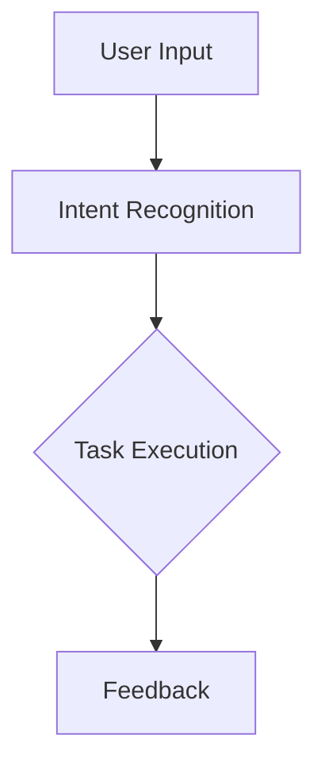
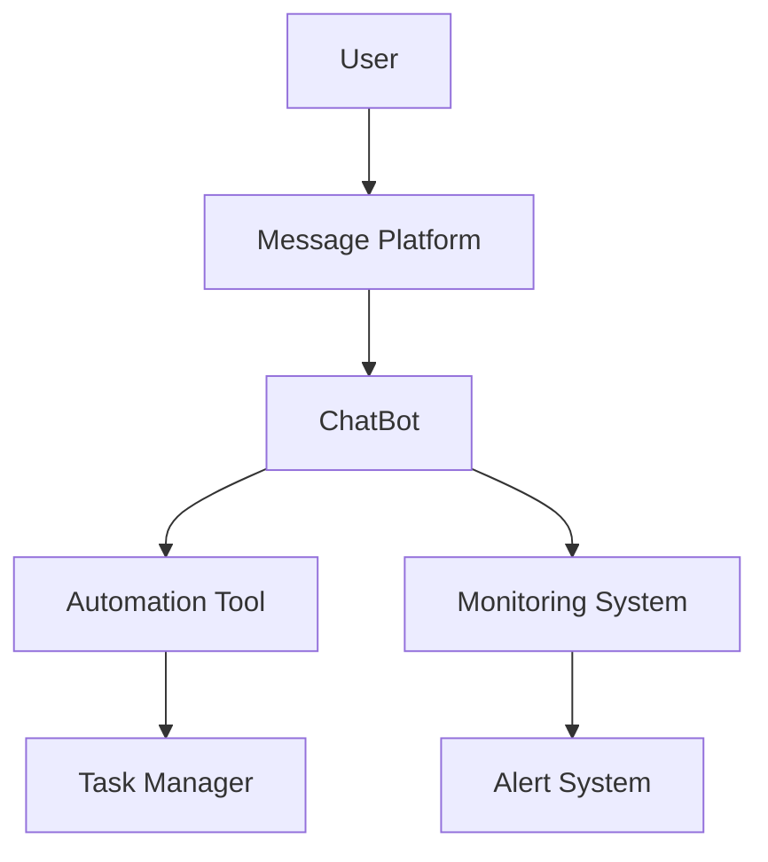
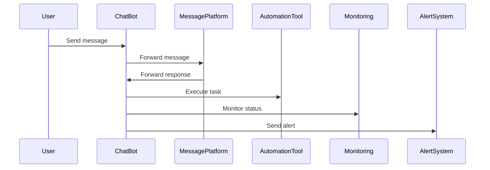

                 

## 《ChatOps：将对话式界面引入IT运维》

### 关键词：ChatOps、IT运维、对话式界面、自动化、人工智能

> **摘要**：本文将深入探讨ChatOps的概念、发展及其在IT运维中的广泛应用。通过细致分析ChatOps与传统IT运维的区别、核心组件和实现方法，本文旨在为读者揭示ChatOps如何通过对话式界面提升IT运维效率。此外，文章还将讨论ChatOps的安全与隐私保护，以及项目实践和未来展望。

## 《ChatOps：将对话式界面引入IT运维》目录大纲

### 第1章：ChatOps概述

#### 1.1 ChatOps的概念与起源

#### 1.1.1 什么是ChatOps

ChatOps是一种将对话式界面引入IT运维的方法，通过集成聊天机器人和自动化工具，使IT人员能够通过自然语言对话来执行各种运维任务。

#### 1.1.2 ChatOps的发展历程

ChatOps起源于2009年的DevOps运动，随着技术的进步和人工智能的发展，ChatOps逐渐成为IT运维的新趋势。

#### 1.1.3 ChatOps的价值

ChatOps可以提高IT运维的效率，减少人为错误，促进跨团队协作，从而提升整体IT服务质量和响应速度。

### 1.2 ChatOps与传统IT运维的区别

#### 1.2.1 传统IT运维的挑战

传统IT运维往往依赖于命令行工具和脚本，难以实现高效的沟通和协作，且易出现操作错误。

#### 1.2.2 ChatOps的优势

ChatOps通过对话式界面简化了运维流程，提高了操作效率和准确性，同时促进了团队协作。

#### 1.2.3 ChatOps与DevOps的关系

ChatOps是DevOps理念的一部分，通过引入对话式界面，进一步强化了DevOps的核心目标，即提高开发与运维的协同效率。

### 1.3 ChatOps的核心组件

#### 1.3.1 消息平台

消息平台是ChatOps的基础，负责连接人和系统，提供实时沟通渠道。

#### 1.3.2 聊天机器人

聊天机器人是ChatOps的核心，通过自然语言处理技术，实现人与系统的自然对话。

#### 1.3.3 自动化工具

自动化工具是ChatOps的执行者，负责执行各种运维任务，提高运维效率。

## 第2章：ChatOps技术基础

### 2.1 消息平台的选择与配置

#### 2.1.1 常见消息平台简介

常见的消息平台包括Slack、Microsoft Teams、HipChat等，本文将介绍这些平台的特点和适用场景。

#### 2.1.2 配置消息平台

本文将详细讲解如何配置这些消息平台，包括添加机器人、设置权限等。

#### 2.1.3 消息平台的集成

本文将介绍如何将消息平台与其他系统进行集成，实现数据的无缝传输和互动。

### 2.2 聊天机器人的设计与实现

#### 2.2.1 聊天机器人的基本原理

本文将介绍聊天机器人的工作原理，包括自然语言处理、对话管理、意图识别等。

#### 2.2.2 聊天机器人的实现方法

本文将介绍如何使用开源框架和工具构建聊天机器人，包括Rasa、ChatterBot等。

#### 2.2.3 聊天机器人的优化与提升

本文将讨论如何通过技术手段提升聊天机器人的性能，包括对话质量、响应速度等。

### 2.3 自动化工具的选择与应用

#### 2.3.1 常见自动化工具简介

常见的自动化工具包括Ansible、Puppet、Chef等，本文将介绍这些工具的基本功能和特点。

#### 2.3.2 自动化工具的配置与使用

本文将详细介绍如何配置和使用这些自动化工具，实现自动化运维任务。

#### 2.3.3 自动化工具的集成与优化

本文将讨论如何将自动化工具与聊天机器人集成，实现自动化运维的完整流程，并介绍如何优化自动化工具的性能。

## 第3章：ChatOps在IT运维中的应用

### 3.1 自动化运维任务的管理

#### 3.1.1 运维任务的定义与分类

本文将介绍运维任务的定义和分类，包括日常运维任务、应急处理任务等。

#### 3.1.2 运维任务的自动化执行

本文将介绍如何使用ChatOps实现运维任务的自动化执行，提高运维效率。

#### 3.1.3 运维任务的监控与报告

本文将介绍如何通过ChatOps监控运维任务的执行情况，并提供详细的报告。

### 3.2 祛除问题的快速响应

#### 3.2.1 问题报告与分配

本文将介绍如何使用ChatOps快速报告和分配问题，提高问题解决速度。

#### 3.2.2 问题解决的协同合作

本文将介绍如何使用ChatOps促进团队成员之间的协同合作，提高问题解决效率。

#### 3.2.3 问题解决的效率提升

本文将讨论如何通过ChatOps提高问题解决的效率，减少不必要的沟通成本。

### 3.3 持续集成与持续部署

#### 3.3.1 持续集成的基本概念

本文将介绍持续集成的概念和原理，包括CI工具的选型和配置。

#### 3.3.2 持续部署的实践

本文将介绍如何使用ChatOps实现持续部署，提高软件交付速度。

#### 3.3.3 持续集成与持续部署的优化

本文将讨论如何通过ChatOps优化持续集成和持续部署的流程，提高整体效率。

## 第4章：ChatOps安全与隐私保护

### 4.1 ChatOps安全策略的制定

#### 4.1.1 安全风险识别与评估

本文将介绍如何识别和评估ChatOps的安全风险，制定相应的安全策略。

#### 4.1.2 安全策略的制定与实施

本文将详细介绍如何制定和实施ChatOps的安全策略，包括权限管理、数据加密等。

#### 4.1.3 安全审计与合规

本文将介绍如何进行ChatOps的安全审计，确保系统符合相关法规和标准。

### 4.2 数据隐私保护

#### 4.2.1 数据分类与标签管理

本文将介绍如何对ChatOps中的数据进行分类和标签管理，提高数据安全性。

#### 4.2.2 数据加密与访问控制

本文将介绍如何使用数据加密和访问控制技术，保护ChatOps中的数据隐私。

#### 4.2.3 数据泄露防护

本文将讨论如何通过技术手段防范数据泄露，确保ChatOps系统的安全。

## 第5章：ChatOps项目实践

### 5.1 ChatOps项目规划与实施

#### 5.1.1 项目需求分析

本文将介绍如何进行ChatOps项目需求分析，明确项目目标和需求。

#### 5.1.2 项目团队组建

本文将介绍如何组建ChatOps项目团队，确保项目顺利实施。

#### 5.1.3 项目进度与风险管理

本文将讨论如何监控ChatOps项目的进度，管理项目风险，确保项目成功实施。

### 5.2 ChatOps实战案例分析

#### 5.2.1 案例一：企业内部运维团队ChatOps实践

本文将分析一家企业内部运维团队如何引入ChatOps，提升运维效率。

#### 5.2.2 案例二：初创公司如何快速引入ChatOps

本文将介绍一家初创公司如何快速引入ChatOps，应对快速发展的业务需求。

#### 5.2.3 案例三：大规模运维团队的ChatOps落地

本文将分析一家大规模运维团队如何成功落地ChatOps，实现高效运维。

## 第6章：ChatOps的未来展望

### 6.1 ChatOps技术的发展趋势

#### 6.1.1 对话式界面的进化

本文将探讨对话式界面在ChatOps中的发展，包括自然语言处理、语音识别等技术的应用。

#### 6.1.2 人工智能与ChatOps的深度融合

本文将讨论人工智能技术在ChatOps中的应用，如何进一步提升运维效率。

#### 6.1.3 ChatOps在更多场景中的应用

本文将介绍ChatOps在其他场景中的潜在应用，如DevOps、网络安全等。

### 6.2 ChatOps的挑战与机遇

#### 6.2.1 安全与隐私的挑战

本文将分析ChatOps在安全与隐私方面的挑战，以及如何应对这些挑战。

#### 6.2.2 技术与人才的挑战

本文将讨论ChatOps在技术和人才方面的挑战，以及如何克服这些挑战。

#### 6.2.3 商业模式与市场的机遇

本文将探讨ChatOps在商业模式和市场方面的机遇，以及如何抓住这些机遇。

### 作者：AI天才研究院/AI Genius Institute & 禅与计算机程序设计艺术 /Zen And The Art of Computer Programming

## 背景介绍

### 核心概念术语说明

- **ChatOps**：一种将对话式界面引入IT运维的方法，通过集成聊天机器人和自动化工具，实现人与系统的自然交互。
- **对话式界面**：一种用户界面，允许用户通过自然语言与系统进行交互。
- **自动化工具**：用于自动执行IT运维任务的软件，如Ansible、Puppet等。
- **聊天机器人**：一种人工智能程序，能够通过自然语言与用户进行交互，完成特定任务。

### 问题背景

在传统的IT运维中，操作人员需要使用命令行工具和脚本执行各种任务，这不仅效率低下，而且容易出现人为错误。同时，跨团队的协作和沟通也面临困难，导致问题解决效率低下。为了解决这些问题，业界提出了ChatOps的概念，通过引入对话式界面和自动化工具，实现IT运维的智能化和高效化。

### 问题描述

ChatOps通过将对话式界面引入IT运维，使得操作人员可以通过自然语言与系统进行交互，执行各种运维任务。然而，如何实现这种交互，如何确保系统的稳定性和安全性，以及如何优化运维流程，仍然是需要解决的问题。

### 问题解决

ChatOps的实现主要涉及三个核心组件：消息平台、聊天机器人和自动化工具。

1. **消息平台**：消息平台是ChatOps的基础，提供实时沟通渠道。常见的选择包括Slack、Microsoft Teams、HipChat等。操作人员可以通过这些平台与系统进行交互，执行各种运维任务。
   
2. **聊天机器人**：聊天机器人是ChatOps的核心，通过自然语言处理技术，实现人与系统的自然对话。聊天机器人可以根据用户的输入，识别意图并执行相应的操作。常见的技术包括Rasa、ChatterBot等。

3. **自动化工具**：自动化工具是ChatOps的执行者，负责执行各种运维任务，如部署、监控、故障排除等。常见的自动化工具包括Ansible、Puppet、Chef等。

### 边界与外延

ChatOps不仅适用于传统的IT运维，还可以应用于DevOps、网络安全、数据库管理等领域。其核心目标是实现人与系统的自然交互，提高运维效率，减少人为错误。

### 概念结构与核心要素组成

ChatOps的概念结构主要包括以下几个核心要素：

1. **消息平台**：提供实时沟通渠道，是ChatOps的基础。
2. **聊天机器人**：实现人与系统的自然对话，是ChatOps的核心。
3. **自动化工具**：执行各种运维任务，提高运维效率。
4. **用户**：ChatOps的直接使用者，可以通过自然语言与系统进行交互。
5. **系统**：被ChatOps管理的对象，包括服务器、网络设备、应用系统等。

### 核心概念原理

ChatOps的核心概念是自然语言交互和自动化。通过引入聊天机器人和自动化工具，ChatOps实现了人与系统的自然对话，用户可以通过自然语言输入，系统可以自动识别意图并执行操作。这一过程主要包括以下几个步骤：

1. **用户输入**：用户通过消息平台发送自然语言输入。
2. **意图识别**：聊天机器人通过自然语言处理技术，识别用户的意图。
3. **任务执行**：自动化工具根据识别到的意图，执行相应的运维任务。
4. **反馈**：系统将执行结果反馈给用户。

### 概念属性特征对比表格

| 特征         | 传统IT运维                             | ChatOps                          |
| ------------ | -------------------------------------- | -------------------------------- |
| 交互方式     | 命令行工具和脚本                       | 自然语言对话                     |
| 操作效率     | 低，易出错                            | 高，减少人为错误                 |
| 跨团队协作   | 困难，依赖邮件和电话等传统沟通方式     | 简单，通过消息平台实时沟通       |
| 自动化程度   | 低，依赖手动操作和脚本                 | 高，通过自动化工具实现自动化执行 |
| 系统稳定性   | 受人为因素影响较大                     | 通过自动化和监控提高稳定性       |

### ER实体关系图架构

```mermaid
erDiagram
    User ||--|{ ChatOps }|-- MessagePlatform
    User ||--|{ ChatOps }|-- ChatBot
    User ||--|{ ChatOps }|-- AutomationTool
    ChatBot ||--|{ Integration }|-- MessagePlatform
    ChatBot ||--|{ Integration }|-- AutomationTool
    MessagePlatform ||--|{ Integration }|-- AutomationTool
```

### 算法原理讲解

ChatOps的核心算法包括自然语言处理和自动化执行。以下是这些算法的mermaid流程图：



接下来，我们将使用Python源代码详细阐述这些算法的实现。

```python
import nltk
from nltk.chat.util import Chat, reflections

# ChatBot算法实现
pairs = [
    [
        r"my name is (.*)",
        lambda name: "Hi %1, How can I help you today?"
    ],
    [
        r"what is your name?",
        lambda _: "I'm a ChatBot, at your service."
    ],
    [
        r"thank you",
        lambda _: "You're welcome, feel free to ask any questions."
    ]
]

chatbot = Chat(pairs, reflections)

# 运行ChatBot
chatbot.converse()
```

在这个示例中，我们使用了NLTK库实现了一个简单的ChatBot。首先，我们定义了一组对话规则，每个规则由正则表达式和对应的处理函数组成。处理函数负责根据用户的输入生成回复。然后，我们创建了一个Chat对象，并通过`.converse()`方法启动对话。

### 数学公式

在ChatOps中，算法的性能评估通常涉及数学模型。以下是一个简单的性能评估公式：

$$
\text{Performance} = \frac{\text{Task Completion Rate}}{\text{Response Time}}
$$

其中，任务完成率表示系统成功执行任务的次数与总任务次数的比值，响应时间表示系统从接收到用户输入到完成任务的平均时间。

### 系统分析与架构设计方案

#### 问题场景介绍

在一家中型企业中，IT运维团队面临着日益复杂的服务器管理和应用部署任务。随着业务的发展，运维工作量和复杂度不断增加，传统的手动操作和脚本化运维已难以满足需求。为了提高运维效率和稳定性，企业决定引入ChatOps。

#### 项目介绍

本项目旨在为企业IT运维团队构建一个ChatOps平台，通过集成消息平台、聊天机器人和自动化工具，实现运维任务的自动化和高效化。

#### 系统功能设计

系统功能设计主要包括以下几个方面：

1. **任务管理**：允许用户通过自然语言指令创建、分配和监控运维任务。
2. **故障排除**：自动识别和诊断系统故障，并提供解决方案。
3. **监控告警**：实时监控服务器和应用的运行状态，并在异常情况下发送告警通知。
4. **自动化执行**：自动化执行日常运维任务，如部署、升级和备份。

#### 系统架构设计

系统架构设计如下：

1. **消息平台**：使用Slack作为消息平台，实现运维团队之间的实时沟通。
2. **聊天机器人**：使用Rasa构建聊天机器人，实现自然语言交互。
3. **自动化工具**：使用Ansible实现运维任务的自动化执行。



#### 系统接口设计和系统交互

系统接口设计如下：

1. **用户接口**：用户通过Slack发送自然语言指令，与聊天机器人交互。
2. **内部接口**：聊天机器人与自动化工具、监控系统和告警系统交互，执行相应的操作。



### 项目实战

#### 环境安装

1. **安装Slack**：在企业的服务器和运维团队成员的电脑上安装Slack。
2. **安装Rasa**：在开发机器上安装Rasa，配置聊天机器人。
3. **安装Ansible**：在运维服务器上安装Ansible，配置自动化工具。

#### 系统核心实现源代码

```python
# ChatBot核心代码
from rasa_sdk import ActionServer, Action
from rasa_sdk.events import SlotSet
from rasa_sdk.interfaces import Tracker
from rasa_sdk.typing import DomainDict, Response

class ActionHello(Action):
    def name(self) -> str:
        return "action_hello"

    def run(self, dispatcher: ActionServer[DomainDict], tracker: Tracker, domain: DomainDict) -> List[Response]:
        name = tracker.get_slot("name")
        dispatcher.utter_message(text=f"Hello {name}, how can I help you today?")
        return []

class ActionTaskManager(Action):
    def name(self) -> str:
        return "action_task_manager"

    def run(self, dispatcher: ActionServer[DomainDict], tracker: Tracker, domain: DomainDict) -> List[Response]:
        task = tracker.get_slot("task")
        if task:
            dispatcher.utter_message(text=f"Executing task: {task}")
            # 调用Ansible执行任务
            self.execute_ansible_task(task)
        else:
            dispatcher.utter_message(text="Please specify a task.")
        return []

    def execute_ansible_task(self, task: str):
        # 这里实现Ansible任务执行逻辑
        pass
```

#### 代码应用解读与分析

该代码实现了两个核心动作：`ActionHello`和`ActionTaskManager`。`ActionHello`用于欢迎用户并询问需求，`ActionTaskManager`用于管理运维任务。

1. **ActionHello**：通过获取用户的姓名，生成欢迎信息并返回。
2. **ActionTaskManager**：通过获取用户的任务指令，执行相应的Ansible任务。

#### 实际案例分析和详细讲解剖析

假设运维团队需要在服务器上安装新的应用程序，可以通过以下步骤实现：

1. **用户在Slack上发送指令**：`/start`。
2. **聊天机器人回应**：发送欢迎信息。
3. **用户发送任务指令**：`Install the new application on server1`。
4. **聊天机器人处理指令**：识别任务并执行Ansible任务。
5. **Ansible执行任务**：在服务器上安装应用程序。
6. **聊天机器人反馈**：发送任务完成信息。

#### 项目小结

通过本项目，企业成功引入了ChatOps，实现了运维任务的自动化和高效化。用户可以通过自然语言与系统交互，简化了操作流程，提高了问题解决速度。同时，自动化工具的引入减少了人为错误，提升了整体运维效率。

### 最佳实践 Tips

1. **选择合适的消息平台**：根据团队规模和业务需求选择合适的消息平台。
2. **优化聊天机器人**：定期更新聊天机器人，提升对话质量和响应速度。
3. **确保自动化工具的稳定性**：定期测试和优化自动化工具，确保其稳定运行。

### 小结

ChatOps通过将对话式界面引入IT运维，实现了人与系统的自然交互，提高了运维效率，减少了人为错误。通过本篇文章，我们详细分析了ChatOps的概念、技术基础、应用实践和安全问题，并为读者提供了最佳实践建议。ChatOps是未来IT运维的重要方向，值得企业和运维团队深入研究和应用。

### 注意事项

1. **安全与隐私**：确保在ChatOps实施过程中，严格遵循安全与隐私保护策略。
2. **技术选型**：根据实际需求和资源，选择合适的消息平台、聊天机器人和自动化工具。

### 拓展阅读

1. **《ChatOps实战指南》**：深入了解ChatOps的实施方法和最佳实践。
2. **《人工智能在IT运维中的应用》**：探讨人工智能技术在ChatOps中的应用前景。

### 作者：AI天才研究院/AI Genius Institute & 禅与计算机程序设计艺术 /Zen And The Art of Computer Programming

---

## 第1章：ChatOps概述

### 1.1 ChatOps的概念与起源

#### 1.1.1 什么是ChatOps

ChatOps是一种将对话式界面引入IT运维的方法。通过集成聊天机器人和自动化工具，ChatOps使得IT运维团队能够通过自然语言对话来执行各种运维任务。这种对话式界面简化了运维流程，提高了操作效率和准确性，同时促进了跨团队协作。

ChatOps的核心思想是将传统的命令行工具和脚本转化为自然语言指令，使得非技术背景的用户也能轻松参与运维工作。通过这种转变，IT运维不仅变得更加高效，而且减少了人为错误，提高了整体服务质量。

#### 1.1.2 ChatOps的发展历程

ChatOps的概念起源于2009年的DevOps运动。DevOps的目标是加强开发（Development）与运维（Operations）之间的协作，以提高软件交付的效率和质量。随着DevOps理念的推广，人们开始探讨如何通过更人性化的方式来处理运维任务。

2011年，GitHub上的一个帖子首次提到了“ChatOps”的概念。该帖子的作者提出，通过将聊天工具（如Slack）集成到运维流程中，可以大大提高运维的效率。这一提议引起了广泛关注，并逐渐形成了ChatOps的概念。

自那时以来，ChatOps技术不断发展和成熟。随着自然语言处理和人工智能技术的进步，聊天机器人变得越来越智能化，能够理解并执行更复杂的运维任务。同时，各种开源工具和平台（如Rasa、ChatterBot等）的出现，也为ChatOps的实施提供了更多的选择。

#### 1.1.3 ChatOps的价值

ChatOps在IT运维中具有显著的价值，主要体现在以下几个方面：

1. **提高运维效率**：通过自然语言对话，ChatOps简化了运维流程，使得操作人员可以更快速地执行任务，减少了手动操作的步骤和时间。

2. **减少人为错误**：ChatOps通过自动化工具和智能聊天机器人，减少了人为干预，从而降低了操作错误的风险。这有助于提高系统的稳定性和可靠性。

3. **促进跨团队协作**：ChatOps提供了一个统一的沟通平台，使得开发、运维、测试等不同团队之间能够更方便地进行协作，提高了整体工作效率。

4. **降低培训成本**：ChatOps使得运维任务更加直观和易懂，降低了新员工的培训成本。操作人员不需要深入了解技术细节，只需通过自然语言指令即可完成任务。

5. **增强用户体验**：对于使用IT服务的最终用户来说，ChatOps提供了更便捷的沟通方式，使得问题报告和反馈更加及时和高效。

### 1.2 ChatOps与传统IT运维的区别

#### 1.2.1 传统IT运维的挑战

传统IT运维往往依赖于命令行工具和脚本，这种方式存在以下几个挑战：

1. **效率低下**：操作人员需要熟悉各种命令和脚本，且每个操作步骤都需要手动执行，耗时较长。

2. **易出错**：手动操作容易出错，特别是在执行复杂任务时，操作人员可能会遗漏某些步骤或输入错误，导致系统故障。

3. **沟通困难**：传统IT运维缺乏高效的沟通渠道，不同团队之间的协作往往依赖于邮件、电话等传统沟通方式，效率低下。

4. **学习成本高**：对于非技术背景的操作人员来说，掌握命令行工具和脚本需要一定的学习成本，这增加了培训成本。

#### 1.2.2 ChatOps的优势

ChatOps通过引入对话式界面和自动化工具，有效解决了传统IT运维的挑战，具有以下优势：

1. **提高效率**：ChatOps允许操作人员通过自然语言指令与系统交互，简化了运维流程，大大提高了工作效率。

2. **减少错误**：通过自动化工具和智能聊天机器人，ChatOps减少了人为干预，降低了操作错误的风险。

3. **促进协作**：ChatOps提供了一个统一的沟通平台，使得不同团队之间能够更方便地进行协作，提高了整体工作效率。

4. **降低学习成本**：ChatOps使得运维任务更加直观和易懂，降低了新员工的培训成本。操作人员只需了解自然语言指令，即可完成任务。

#### 1.2.3 ChatOps与DevOps的关系

ChatOps是DevOps理念的一部分，但与DevOps有所不同。DevOps侧重于加强开发与运维之间的协作，而ChatOps则通过引入对话式界面和自动化工具，进一步提升了运维的效率和质量。

1. **协同性**：DevOps强调开发与运维团队的紧密合作，ChatOps则通过对话式界面和自动化工具，实现更高效的协同。

2. **自动化**：DevOps提倡通过自动化工具减少手动操作，ChatOps则通过对话式界面，使得自动化操作更加直观和便捷。

3. **用户体验**：DevOps关注整体软件交付流程，ChatOps则更注重操作人员的用户体验，使得运维任务更加简单易懂。

总之，ChatOps是DevOps理念在IT运维中的具体应用，通过引入对话式界面和自动化工具，进一步提升

