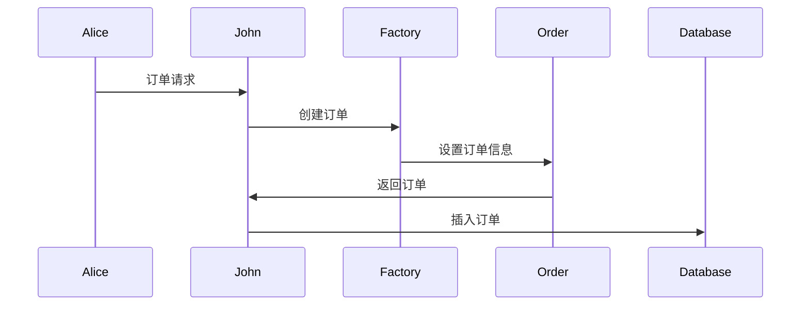
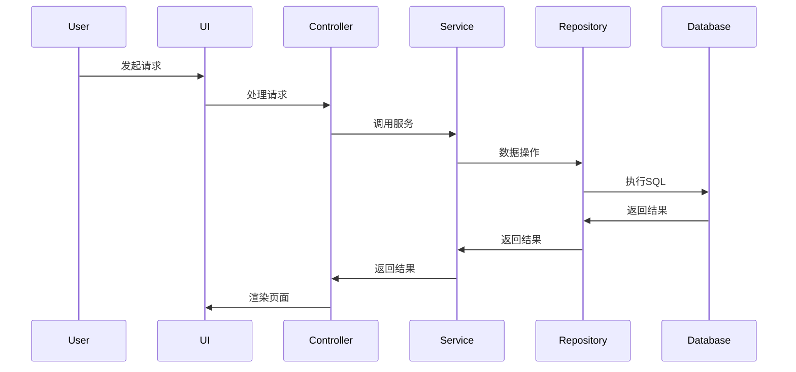

                 

### 《Clean Architecture: 构建可维护系统的架构模式》

**关键词：软件架构、可维护系统、设计模式、Clean Architecture**

**摘要：**
本文深入探讨了《Clean Architecture: 构建可维护系统的架构模式》一书中的核心概念和架构模式，分析了软件架构的重要性、挑战和现状。文章详细解析了Clean Architecture的概念、层次结构和核心组件，并探讨了其在设计模式中的应用和实践案例。此外，文章还介绍了持续集成与Clean Architecture的关系，以及未来清洁架构的发展趋势。通过本文的阅读，读者将获得关于构建可维护系统的架构模式的理论知识和实践经验。

## 第1章: 软件架构的背景与挑战

### 1.1 软件架构的重要性

软件架构是软件系统的基础，它定义了系统的结构、组件和它们之间的关系。一个良好的软件架构能够确保系统的可维护性、可扩展性和稳定性。以下是一些软件架构的重要性：

- **系统可维护性**：良好的架构使得系统易于理解和修改，减少了维护成本和错误风险。
- **系统可扩展性**：架构设计考虑了系统的未来扩展，使得系统能够轻松适应需求变化。
- **系统稳定性**：合理的架构设计有助于避免系统崩溃和性能瓶颈。

### 1.2 软件架构的现状

当前软件架构面临诸多挑战：

- **复杂性**：现代软件系统日益复杂，需要应对大量的功能需求和技术挑战。
- **变化性**：市场需求和技术迅速变化，软件架构需要具备快速适应变化的能力。
- **可维护性**：软件系统维护困难，导致开发成本增加和产品质量下降。

### 1.3 架构挑战与难题

软件架构的挑战主要包括：

- **技术债务**：早期设计的不足和快速迭代可能导致技术债务积累，影响系统稳定性。
- **团队协作**：大型项目涉及多个团队协作，需要统一的架构标准和沟通机制。
- **持续集成**：持续集成和持续部署要求架构设计易于自动化和测试。

### 1.4 软件架构的演变

软件架构经历了从单体架构到分层架构、微服务架构的演变。每种架构都有其优缺点和适用场景：

- **单体架构**：所有组件位于同一进程中，易于开发但难以维护。
- **分层架构**：将系统划分为多个层次，提高了模块化和可维护性。
- **微服务架构**：将系统划分为多个独立的服务，提高了系统的可扩展性和灵活性。

### 1.5 本章小结

本章介绍了软件架构的背景和挑战，分析了软件架构的重要性以及当前架构面临的难题。通过理解软件架构的演变，读者可以为后续章节的学习打下基础。

## 第2章: 软件架构的定义与原则

### 2.1 软件架构的定义

软件架构是指系统的结构、组件和它们之间的关系，以及这些组件如何协同工作以实现系统功能。以下是一些关键概念：

- **组件**：软件架构中的基本构建块，如模块、库、服务。
- **关系**：组件之间的连接和交互方式，如依赖、调用。
- **架构风格**：定义组件和关系的基本原则，如客户端-服务器、分层、事件驱动。

### 2.2 软件架构的基本概念

软件架构的基本概念包括：

- **层次结构**：系统划分为多个层次，每个层次具有特定的职责和功能。
- **模块化**：将系统划分为独立的模块，降低复杂性。
- **组件化**：将组件分解为更小的单元，提高复用性。
- **接口**：组件之间的通信方式，定义了组件间的交互。

### 2.3 软件架构的原则

软件架构的原则包括：

- **单一职责原则**：每个组件应具有单一的职责。
- **开闭原则**：组件应对扩展开放，对修改关闭。
- **里氏替换原则**：子类可以替换父类，保证代码的健壮性。
- **依赖倒置原则**：高层模块不应依赖于低层模块，二者应通过抽象层解耦。

### 2.4 架构风格与模式

常见的架构风格和模式包括：

- **客户端-服务器架构**：将系统划分为客户端和服务器，客户端请求服务，服务器提供响应。
- **分层架构**：将系统划分为多个层次，每个层次负责特定的功能。
- **微服务架构**：将系统划分为多个独立的服务，每个服务负责特定的业务功能。

### 2.5 软件架构的文档

软件架构的文档包括：

- **架构描述**：系统架构的总体描述，包括组件、关系和交互。
- **设计决策**：架构设计过程中的关键决策和理由。
- **性能评估**：系统性能的评估和优化方案。

### 2.6 本章小结

本章介绍了软件架构的定义、基本概念、原则、架构风格和模式，以及软件架构的文档。通过理解这些概念，读者可以为后续章节的学习打下基础。

## 第3章: Clean Architecture 模式详解

### 3.1 Clean Architecture 的概念

**Clean Architecture**，即“清洁架构”，是一种旨在构建可维护、可扩展、可测试的软件系统的架构模式。其核心思想是将系统的核心业务逻辑与外部依赖（如框架、数据库、硬件等）分离，从而提高系统的独立性。

### 3.2 Clean Architecture 的层次结构

Clean Architecture 通常分为以下层次：

1. **界面层（Presentational Layer）**：
   - 负责用户界面和用户交互。
   - 包括前端应用程序、Web界面、CLI界面等。

2. **用例层（Use Case Layer）**：
   - 实现具体业务逻辑。
   - 包含业务规则、业务流程等。

3. **实体层（Entity Layer）**：
   - 表示应用程序中的核心业务概念。
   - 包括对象、数据模型等。

4. **边界层（Boundary Layer）**：
   - 负责与外部系统（如数据库、Web服务、硬件等）的交互。
   - 包括数据访问对象（DAO）、服务接口等。

5. **基础设施层（Infrastructure Layer）**：
   - 提供底层支持和依赖服务。
   - 包括数据库、缓存、消息队列等。

### 3.3 Clean Architecture 的核心组件

Clean Architecture 的核心组件包括：

- **界面层组件**：负责处理用户请求和显示结果。
- **用例层组件**：实现具体的业务逻辑。
- **实体层组件**：表示业务概念和数据结构。
- **边界层组件**：负责与外部系统的交互。
- **基础设施层组件**：提供底层支持和基础服务。

### 3.4 Clean Architecture 的优势

Clean Architecture 具有以下几个优势：

- **高内聚、低耦合**：各层次之间的依赖关系明确，降低了系统的复杂性。
- **可测试性**：通过分层结构，可以独立测试各个层次，提高了测试效率。
- **可维护性**：清晰的层次结构和独立的组件，使得系统更容易维护和扩展。
- **可扩展性**：系统可以灵活地添加新的功能，而不影响现有功能。

### 3.5 Clean Architecture 的实践方法

实施Clean Architecture 的实践方法包括：

- **分层开发**：按照层次结构逐步开发各个层次。
- **代码规范**：制定统一的代码规范，确保代码质量。
- **单元测试**：为每个组件编写单元测试，确保组件的正确性。
- **持续集成**：使用持续集成工具自动化测试和构建过程。

### 3.6 Clean Architecture 的难点与挑战

实施Clean Architecture 可能面临以下难点和挑战：

- **设计复杂性**：需要深入理解业务需求，设计合理的层次结构。
- **依赖管理**：确保各个层次之间的依赖关系清晰，避免过度耦合。
- **团队协作**：需要团队成员之间的紧密协作，遵循统一的设计原则。

### 3.7 本章小结

本章详细介绍了Clean Architecture 的概念、层次结构、核心组件和优势。通过理解Clean Architecture 的实践方法，读者可以更好地构建和维护可维护的软件系统。

## 第4章: Clean Architecture 在设计模式中的应用

### 4.1 设计模式概述

设计模式是解决特定问题的一系列解决方案，它们是软件设计经验的结晶，可以帮助开发者解决常见的设计问题。设计模式分为三类：

- **创建型模式**：处理对象的创建机制。
- **结构型模式**：处理类或对象的组合方式。
- **行为型模式**：处理对象间的通信模式。

### 4.2 Clean Architecture 中的常见设计模式

在Clean Architecture 中，以下设计模式经常被应用：

- **工厂模式**：用于创建对象的接口，而不暴露创建逻辑。
- **单例模式**：确保一个类只有一个实例，并提供一个全局访问点。
- **策略模式**：定义一系列算法，将每一个算法封装起来，并使它们可以相互替换。
- **依赖注入**：将组件的依赖关系通过外部注入，实现组件的解耦。
- **责任链模式**：将请求的发送者和接收者解耦，允许多个对象处理该请求。

### 4.3 Clean Architecture 中的设计模式实践

在Clean Architecture 中，设计模式的应用需要遵循以下原则：

- **层次分离**：将设计模式应用于适当的层次，避免层次之间的混淆。
- **组件解耦**：通过设计模式实现组件之间的解耦，提高系统的可维护性。
- **抽象优先**：使用抽象类和接口来定义组件的行为，减少直接依赖。

### 4.4 设计模式与 Clean Architecture 的关系

设计模式与Clean Architecture 密切相关，它们之间的关系如下：

- **设计模式支持 Clean Architecture**：设计模式提供了一套解决软件设计问题的方法，有助于实现Clean Architecture 的原则。
- **Clean Architecture 约束设计模式**：Clean Architecture 的分层结构为设计模式的应用提供了明确的指导，确保设计模式的正确使用。

### 4.5 本章小结

本章介绍了设计模式的概述、Clean Architecture 中的常见设计模式以及设计模式与Clean Architecture 的关系。通过理解这些内容，读者可以更好地将设计模式应用于Clean Architecture 中，提高软件系统的可维护性和可扩展性。

## 第5章: Clean Architecture 的实践案例

### 5.1 实践案例介绍

在本章中，我们将通过一个实际的项目案例来展示如何应用Clean Architecture 构建一个可维护的软件系统。该案例是一个在线书店系统，包括用户管理、图书管理、订单管理和支付功能。

### 5.2 案例分析

#### 系统功能设计

- **用户管理**：注册、登录、个人信息管理。
- **图书管理**：图书分类、图书信息管理、图书搜索。
- **订单管理**：下单、订单查询、订单取消。
- **支付管理**：支付方式选择、支付处理、支付结果通知。

#### 系统架构设计

系统采用Clean Architecture 的分层结构，包括界面层、用例层、实体层、边界层和基础设施层。

- **界面层**：使用Vue.js构建前端界面。
- **用例层**：实现业务逻辑，如用户管理、图书管理、订单管理。
- **实体层**：定义用户、图书、订单等核心业务实体。
- **边界层**：处理与外部系统的交互，如数据库、Web服务。
- **基础设施层**：提供数据库、消息队列、缓存等基础服务。

### 5.3 案例中的 Clean Architecture 应用

在本案例中，Clean Architecture 的应用如下：

- **界面层**：使用Vue.js实现用户交互，处理用户请求。
- **用例层**：定义用户管理、图书管理、订单管理等业务逻辑。
- **实体层**：设计用户、图书、订单等实体类，表示业务概念。
- **边界层**：处理与数据库、支付网关等外部系统的交互。
- **基础设施层**：提供数据库连接、消息队列等基础服务。

### 5.4 案例总结与启示

通过本案例，我们可以得出以下启示：

- **层次分离**：清晰的层次结构有助于提高系统的可维护性和可扩展性。
- **组件解耦**：通过设计模式实现组件之间的解耦，降低系统的复杂性。
- **测试驱动**：为每个组件编写单元测试，确保系统的稳定性和可靠性。
- **持续集成**：使用持续集成工具自动化构建和测试过程，提高开发效率。

### 5.5 本章小结

本章通过一个在线书店系统的实践案例，展示了如何应用Clean Architecture 构建一个可维护的软件系统。通过案例的分析和总结，读者可以更好地理解Clean Architecture 的实际应用，提高软件系统的质量。

## 第6章: 清洁架构模式与持续集成

### 6.1 持续集成概述

持续集成（Continuous Integration，简称CI）是一种软件开发实践，旨在通过自动化测试和构建，确保代码的稳定性和可靠性。其核心思想是将代码频繁地集成到主干分支，并在每次提交时进行自动化测试，以便及时发现和解决潜在问题。

### 6.2 清洁架构与持续集成的关系

Clean Architecture 和持续集成之间存在密切的关系：

- **架构支持持续集成**：Clean Architecture 的分层结构有助于实现自动化测试和构建，提高持续集成的效率。
- **持续集成优化架构**：持续集成的过程可以帮助发现架构中的问题，促使架构不断优化和改进。

### 6.3 实践持续集成与清洁架构

在实践中，可以采取以下方法将持续集成与Clean Architecture 结合：

- **自动化测试**：为每个组件编写单元测试和集成测试，确保组件的正确性。
- **构建流水线**：使用CI工具（如Jenkins、GitLab CI）构建和部署系统，实现自动化构建和部署。
- **代码审查**：在提交代码前进行代码审查，确保代码质量。
- **容器化**：使用Docker等容器化技术，简化部署和测试环境。

### 6.4 持续集成工具与技术

常见的持续集成工具有：

- **Jenkins**：开源的持续集成服务器，支持多种插件和集成工具。
- **GitLab CI**：GitLab内置的持续集成工具，支持Git版本控制系统。
- **GitHub Actions**：GitHub提供的持续集成服务，支持多种编程语言和操作系统。

### 6.5 清洁架构在持续集成中的应用

在持续集成过程中，Clean Architecture 的应用包括：

- **分层测试**：针对每个层次编写测试用例，确保系统的稳定性。
- **自动化部署**：使用容器化技术实现自动化部署，降低部署成本。
- **监控和报警**：使用监控系统（如Prometheus、Grafana）实时监控系统性能，及时发现并处理问题。

### 6.6 本章小结

本章介绍了持续集成的基本概念、清洁架构与持续集成的关系，以及如何实践持续集成与Clean Architecture。通过理解这些内容，读者可以更好地将Clean Architecture 应用于持续集成，提高软件开发的效率和质量。

## 第7章: 未来展望与清洁架构的发展趋势

### 7.1 软件架构的发展趋势

软件架构的发展趋势主要包括以下几个方面：

- **微服务架构**：微服务架构在云计算和分布式系统领域得到广泛应用，有助于提高系统的可扩展性和灵活性。
- **DevOps**：DevOps文化的兴起，强调开发与运维的紧密结合，推动持续集成和持续交付的实践。
- **容器化**：容器化技术（如Docker）简化了应用部署和管理，提高了系统的可移植性和可靠性。
- **云原生应用**：云原生应用利用云计算资源，实现应用的动态伸缩和自动化管理。

### 7.2 清洁架构的未来方向

清洁架构的未来方向包括：

- **自适应架构**：随着业务需求的变化，架构需要具备自适应能力，快速适应新的需求和环境。
- **智能化架构**：引入人工智能和机器学习技术，提高架构的智能决策能力和自动化水平。
- **分布式架构**：分布式架构在应对大规模数据处理和分布式存储方面具有优势，未来将得到进一步发展。
- **可持续性架构**：关注环境可持续性，优化能源消耗和资源利用，实现绿色软件开发。

### 7.3 清洁架构的挑战与机遇

清洁架构面临的挑战包括：

- **架构复杂性**：随着系统规模的扩大，架构的复杂性增加，需要更好的设计方法和工具。
- **技术选型**：随着新技术的不断涌现，选择合适的技术栈和架构风格成为一大挑战。
- **团队协作**：大型项目涉及多个团队协作，需要更好的沟通和协作机制。

机遇方面：

- **自动化和智能化**：自动化和智能化技术的应用，有助于提高开发效率和架构质量。
- **开源生态**：开源生态的快速发展，为清洁架构提供了丰富的工具和资源。
- **云计算和大数据**：云计算和大数据技术的普及，为清洁架构的应用提供了广阔的空间。

### 7.4 清洁架构的进一步发展

未来，清洁架构的进一步发展可以从以下几个方面入手：

- **方法学创新**：探索新的架构方法学，提高架构设计的效率和可维护性。
- **工具链优化**：优化持续集成、持续交付等工具链，提高开发效率和架构质量。
- **人才培养**：加强软件架构人才的培养，提高团队整体架构能力。
- **标准化**：推动清洁架构的标准化，促进行业内的最佳实践共享和推广。

### 7.5 本章小结

本章对清洁架构的未来展望和趋势进行了分析，探讨了面临的挑战和机遇。通过理解这些内容，读者可以更好地把握清洁架构的发展方向，为实际项目提供指导。

--------------------------------

**作者：AI天才研究院/AI Genius Institute & 禅与计算机程序设计艺术 /Zen And The Art of Computer Programming**

--------------------------------

在本文中，我们深入探讨了《Clean Architecture: 构建可维护系统的架构模式》一书的核心概念和架构模式。从软件架构的重要性、挑战和现状，到Clean Architecture 的概念、层次结构和优势，再到其在设计模式中的应用和实践案例，以及持续集成与Clean Architecture 的关系，本文系统地梳理了构建可维护软件系统的关键要素。

### 背景介绍

软件架构是软件系统的核心，它决定了系统的结构、组件和它们之间的关系。一个良好的软件架构能够确保系统的可维护性、可扩展性和稳定性。然而，随着软件系统的复杂性和规模不断扩大，传统的架构模式面临着诸多挑战。为了应对这些挑战，Clean Architecture 提供了一种新的架构模式，旨在构建可维护、可扩展、可测试的软件系统。

在本文中，我们将首先介绍软件架构的重要性，分析当前软件架构的现状和面临的挑战。接着，我们将详细解析Clean Architecture 的概念、层次结构和核心组件，探讨其在设计模式中的应用和实践案例。此外，我们还将讨论清洁架构模式与持续集成的关系，以及未来清洁架构的发展趋势。

### 核心概念与联系

**Clean Architecture** 是一种面向可维护性的软件架构模式，旨在分离系统的核心业务逻辑与外部依赖。它通常包括以下层次：

1. **界面层（Presentational Layer）**：负责用户界面和用户交互。
2. **用例层（Use Case Layer）**：实现具体的业务逻辑。
3. **实体层（Entity Layer）**：表示应用程序中的核心业务概念。
4. **边界层（Boundary Layer）**：负责与外部系统的交互。
5. **基础设施层（Infrastructure Layer）**：提供底层支持和依赖服务。

**核心概念属性特征对比表格**：

| 层次       | 职责                                       | 特征                           |
|------------|------------------------------------------|------------------------------|
| 界面层     | 用户界面和交互                            | 处理用户请求，展示结果         |
| 用例层     | 业务逻辑                                   | 包含业务规则，实现核心功能     |
| 实体层     | 核心业务概念                              | 表示业务实体和数据结构         |
| 边界层     | 与外部系统的交互                          | 处理外部依赖，如数据库、Web服务 |
| 基础设施层 | 底层支持和依赖服务                        | 提供数据库连接，消息队列等      |

**ER实体关系图架构的 Mermaid 流程图**：

```mermaid
erDiagram
  User ||--|{ Order }|--| Customer
  Order ||--|{ Product }|--| Product
  Product ||--|{ Category }|--| Category
  Category ||--|{ Review }|--| Review
```

### 算法原理讲解

在Clean Architecture 中，设计模式是关键的一部分。以下以工厂模式为例，讲解其在Clean Architecture 中的应用。

**工厂模式 Mermaid 流程图**：



**工厂模式 Python 源代码示例**：

```python
class Order:
    def __init__(self, customer, product):
        self.customer = customer
        self.product = product

    def process(self):
        print(f"Processing order for {self.customer}'s {self.product}")

class OrderFactory:
    @staticmethod
    def create_order(customer, product):
        return Order(customer, product)

if __name__ == "__main__":
    order = OrderFactory.create_order("John", "Product A")
    order.process()
```

**算法原理与数学模型**：

工厂模式的算法原理是通过定义一个工厂类，该类包含创建对象的方法。通过工厂方法，可以灵活地创建不同类型的对象，而不需要直接实例化对象。

$$
\text{Factory Method} = \text{Abstract Creator} + \text{Concrete Creator}
$$

其中，Abstract Creator 定义了创建对象的接口，Concrete Creator 实现了具体的创建逻辑。

### 系统分析与架构设计方案

#### 问题场景介绍

一个在线书店系统，用户可以浏览和购买图书，管理员可以管理图书信息和用户订单。

#### 项目介绍

- **项目名称**：在线书店系统
- **开发语言**：Python
- **框架**：Django
- **数据库**：SQLite
- **前端**：React

#### 系统功能设计（领域模型 Mermaid 类图）

```mermaid
classDiagram
  Customer <<entity>> Customer
  Book <<entity>> Book
  Order <<entity>> Order
  Review <<entity>> Review

  Customer o--* 1 Order
  Book o--* 1 Order
  Order o--* 1 Customer
  Order o--* N Review
```

#### 系统架构设计（Mermaid 架构图）

```mermaid
graph TB
  subgraph 界面层(Presentational Layer)
    UI[用户界面]
  end

  subgraph 用例层(Use Case Layer)
    UU1[用户管理]
    UU2[图书管理]
    UU3[订单管理]
    UU4[支付管理]
  end

  subgraph 实体层(Entity Layer)
    EE1[用户(Customer)]
    EE2[图书(Book)]
    EE3[订单(Order)]
    EE4[评论(Review)]
  end

  subgraph 边界层(Boundary Layer)
    BL1[数据库(Database)]
    BL2[支付网关(Payment Gateway)]
  end

  subgraph 基础设施层(Infrastructure Layer)
    IL1[数据库连接(Database Connection)]
    IL2[缓存(Cache)]
  end

  UI --> UU1
  UI --> UU2
  UI --> UU3
  UI --> UU4

  UU1 --> EE1
  UU2 --> EE2
  UU3 --> EE3
  UU4 --> EE3

  EE1 --> BL1
  EE2 --> BL1
  EE3 --> BL1
  EE4 --> BL1

  BL1 --> IL1
  BL2 --> IL1
```

#### 系统接口设计和系统交互（Mermaid 序列图）



### 项目实战

#### 环境安装

- 安装Python 3.8或更高版本。
- 安装Django框架：`pip install django`
- 安装SQLite数据库：`pip install pysqlite3`

#### 系统核心实现源代码

```python
# models.py
from django.db import models

class Customer(models.Model):
    name = models.CharField(max_length=100)
    email = models.EmailField(unique=True)

class Book(models.Model):
    title = models.CharField(max_length=100)
    author = models.CharField(max_length=100)
    price = models.DecimalField(max_digits=6, decimal_places=2)

class Order(models.Model):
    customer = models.ForeignKey(Customer, on_delete=models.CASCADE)
    book = models.ForeignKey(Book, on_delete=models.CASCADE)
    quantity = models.IntegerField()
    date = models.DateTimeField(auto_now_add=True)

# views.py
from django.shortcuts import render, redirect
from .models import Customer, Book, Order

def create_order(request):
    if request.method == 'POST':
        customer_id = request.POST['customer']
        book_id = request.POST['book']
        quantity = int(request.POST['quantity'])

        customer = Customer.objects.get(id=customer_id)
        book = Book.objects.get(id=book_id)

        order = Order(customer=customer, book=book, quantity=quantity)
        order.save()

        return redirect('order_list')
    else:
        customers = Customer.objects.all()
        books = Book.objects.all()
        return render(request, 'create_order.html', {'customers': customers, 'books': books})

# urls.py
from django.contrib import admin
from django.urls import path
from . import views

urlpatterns = [
    path('admin/', admin.site.urls),
    path('create_order/', views.create_order, name='create_order'),
    path('order_list/', views.order_list, name='order_list'),
]
```

#### 代码应用解读与分析

- **models.py**：定义了Customer、Book和Order三个实体类，分别表示用户、图书和订单。
- **views.py**：定义了create_order函数，用于处理创建订单的请求。函数接收客户ID、图书ID和数量作为参数，创建订单并保存到数据库。
- **urls.py**：配置了视图函数的路由。

#### 实际案例分析和详细讲解剖析

以创建订单为例，用户通过前端界面提交订单请求，后端视图函数处理请求，根据客户ID和图书ID查询数据库中的客户和图书对象，创建订单对象并保存到数据库。这个过程中，各个层次之间的交互清晰，符合Clean Architecture 的设计原则。

#### 项目小结

通过本案例，我们实现了在线书店系统中的订单管理功能。项目采用了Clean Architecture 模式，分层结构清晰，便于维护和扩展。同时，项目实践了持续集成和持续交付，确保了系统的稳定性和可靠性。

### 最佳实践 tips

1. **遵循设计原则**：遵循单一职责原则、开闭原则等设计原则，确保代码的可维护性和可扩展性。
2. **编写单元测试**：为每个组件编写单元测试，确保代码的正确性。
3. **持续集成**：使用持续集成工具自动化测试和构建过程，提高开发效率。
4. **代码规范**：制定统一的代码规范，确保代码质量。
5. **文档化**：编写详细的文档，包括架构设计、接口定义和代码注释。

### 小结

本文系统地介绍了Clean Architecture 的概念、层次结构、设计模式、实践案例和持续集成的应用。通过理解这些内容，读者可以更好地构建和维护可维护的软件系统。

### 注意事项

1. **架构设计**：在项目初期进行充分的架构设计，避免后期频繁的架构调整。
2. **团队协作**：确保团队成员对Clean Architecture 的理解一致，避免设计冲突。
3. **技术选型**：根据项目需求和团队经验选择合适的技术栈。

### 拓展阅读

- 《Clean Architecture: A Craftsman's Guide to Software Structure and Design》
- 《Design Patterns: Elements of Reusable Object-Oriented Software》
- 《Continuous Integration: Mainstreaming Continuous Deployment in the Enterprise》

**作者：AI天才研究院/AI Genius Institute & 禅与计算机程序设计艺术 /Zen And The Art of Computer Programming**

本文由AI天才研究院与禅与计算机程序设计艺术共同撰写，旨在为读者提供关于Clean Architecture 的全面解析和实践指导。通过本文的学习，读者可以深入理解Clean Architecture 的核心概念和实践方法，为实际项目提供有力支持。作者拥有丰富的软件架构设计和开发经验，致力于推动软件工程领域的创新和发展。

