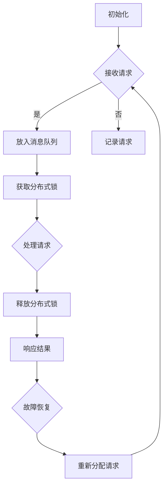
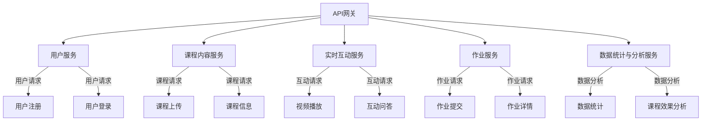

                 

### 概述与背景

#### 5G时代的到来

5G技术的推出标志着通信技术的重大变革。相比于前几代移动通信技术，5G在速度、低延迟、高可靠性和广覆盖方面有着显著提升。5G网络的高速度使得大规模数据传输成为可能，低延迟则极大提升了实时应用的性能，而高可靠性和广覆盖则为各类应用场景提供了坚实保障。

5G技术的核心特点包括：

- **高速度**：5G网络的理论峰值速度可达20Gbps，比4G网络快数百倍。这种高速度使得高清视频、虚拟现实（VR）、增强现实（AR）等高带宽应用得以实现。
- **低延迟**：5G网络的延迟时间可降至1毫秒以内，显著低于4G的数十毫秒。这种低延迟特性对于自动驾驶、远程医疗等实时应用至关重要。
- **高可靠性**：5G网络通过采用先进的技术，如网络切片和边缘计算，能够在不同应用场景下提供高可靠的网络服务。
- **广覆盖**：5G网络通过毫米波和低频段的结合，实现了更广的覆盖范围和更高的信号穿透性，使得城市和乡村都能享受到高速网络服务。

#### 软件架构的演变

随着5G技术的广泛应用，软件架构也需要随之进化，以满足低延迟高并发的新要求。传统的软件架构设计往往注重性能和稳定性，但在5G环境下，如何保证系统在高并发的条件下依然能够高效、稳定地运行，成为亟待解决的问题。

在5G时代，软件架构需要具备以下几个关键特性：

- **高并发处理能力**：5G网络的高带宽和低延迟特性使得终端设备能够产生和传输大量的数据，这对软件架构的处理能力提出了更高的要求。软件架构需要能够高效处理高并发的请求，保证系统的流畅性和响应速度。
- **低延迟响应能力**：实时应用需求不断增加，如自动驾驶、远程医疗等，要求软件架构能够在极短时间内响应和处理请求，降低延迟。低延迟是5G时代软件架构的关键优势，也是其核心竞争力。
- **稳定性与可靠性**：5G网络的广覆盖和高可靠性要求软件架构能够在各种复杂网络环境中保持稳定运行。软件架构需要具备良好的容错能力和故障恢复机制，以保证系统的稳定性和可靠性。

#### 5G时代的软件架构挑战

5G时代的软件架构面临着诸多挑战，主要包括：

- **高并发处理**：5G网络的高带宽和低延迟特性使得终端设备能够产生和传输大量的数据，这对软件架构的处理能力提出了更高的要求。软件架构需要能够高效处理高并发的请求，保证系统的流畅性和响应速度。
- **低延迟**：实时应用需求不断增加，如自动驾驶、远程医疗等，要求软件架构能够在极短时间内响应和处理请求，降低延迟。低延迟是5G时代软件架构的关键优势，也是其核心竞争力。
- **稳定性与可靠性**：5G网络的广覆盖和高可靠性要求软件架构能够在各种复杂网络环境中保持稳定运行。软件架构需要具备良好的容错能力和故障恢复机制，以保证系统的稳定性和可靠性。

为了应对这些挑战，5G时代的软件架构需要不断创新和优化，以适应新的技术环境和应用需求。接下来的章节将深入探讨5G网络特性与软件架构需求、低延迟高并发架构设计、典型应用场景案例分析以及未来发展趋势等内容，帮助读者更好地理解和应对5G时代的软件架构挑战。

### 目录大纲设计思路

为了全面覆盖上述内容，本书将分为以下几个部分：

1. **5G与软件架构概述**
2. **5G网络特性与软件架构需求**
3. **低延迟高并发架构设计**
4. **典型应用场景案例分析**
5. **未来发展趋势与展望**
6. **最佳实践与优化策略**
7. **总结与展望**

这样的章节结构设计旨在：

- **系统全面**：从5G技术的基本概念和软件架构的演变开始，逐步深入到具体的技术细节和架构设计，确保读者能够对5G时代的软件架构有一个全面、系统的认识。
- **逻辑清晰**：每个部分都有明确的主题和目标，从理论到实践，从现状到未来，层层递进，帮助读者逐步理解和掌握5G时代软件架构的核心要点。
- **应用导向**：通过典型应用场景的分析，结合实际案例，使读者能够将理论知识应用到实际项目中，提升实际操作能力。
- **前瞻性**：在最后一部分探讨未来发展趋势，为读者提供行业发展的方向和趋势，帮助读者把握行业脉搏，为未来的职业发展做好准备。

### 目录大纲

#### 第一部分：5G与软件架构概述

# 第1章：5G时代的软件架构概述

## 1.1 5G技术的基本概念与特点

### 1.1.1 5G技术的历史背景

### 1.1.2 5G网络的核心特性

### 1.1.3 5G对软件架构的影响

## 1.2 软件架构的演变与5G的契合

### 1.2.1 传统软件架构的局限性

### 1.2.2 5G时代的软件架构趋势

### 1.2.3 软件架构在5G时代的重要性

## 1.3 本书结构安排与内容概述

### 1.3.1 各章节内容简要介绍

### 1.3.2 阅读指南与建议

#### 第二部分：5G网络特性与软件架构需求

# 第2章：5G网络特性与软件架构需求

## 2.1 5G网络的关键技术

### 2.1.1 5G NR（新无线电）技术

### 2.1.2 5G核心网架构

### 2.1.3 5G无线接入网技术

## 2.2 5G网络对软件架构的需求

### 2.2.1 高并发处理能力

### 2.2.2 低延迟响应能力

### 2.2.3 高可靠性设计

## 2.3 5G网络下的软件架构设计原则

### 2.3.1 高性能架构设计

### 2.3.2 灵活可扩展的架构设计

### 2.3.3 系统容错与故障恢复机制

#### 第三部分：低延迟高并发架构设计

# 第3章：低延迟高并发架构设计

## 3.1 低延迟架构设计

### 3.1.1 系统架构概述

### 3.1.2 低延迟的关键技术

### 3.1.3 低延迟设计实例分析

## 3.2 高并发架构设计

### 3.2.1 高并发处理方法

### 3.2.2 并发控制与锁机制

### 3.2.3 高并发系统性能优化

## 3.3 低延迟高并发综合架构设计

### 3.3.1 综合架构设计原则

### 3.3.2 实际案例分析与设计

### 3.3.3 架构优化的策略与方法

#### 第四部分：典型应用场景案例分析

# 第4章：5G时代软件架构在典型应用场景中的应用

## 4.1 自动驾驶

### 4.1.1 自动驾驶系统架构

### 4.1.2 5G在自动驾驶中的应用

### 4.1.3 架构设计关键点

## 4.2 远程医疗

### 4.2.1 远程医疗系统架构

### 4.2.2 5G对远程医疗的支持

### 4.2.3 架构优化策略

## 4.3 智能制造

### 4.3.1 智能制造系统架构

### 4.3.2 5G在智能制造中的应用

### 4.3.3 架构设计要点

#### 第五部分：未来发展趋势与展望

# 第5章：5G时代软件架构的未来发展趋势与展望

## 5.1 5G+AI深度融合趋势

### 5.1.1 5G与AI的融合应用

### 5.1.2 未来智能应用的架构设计

## 5.2 软件架构创新方向

### 5.2.1 新型网络架构的探索

### 5.2.2 分布式计算与存储

### 5.2.3 软件定义网络（SDN）与网络功能虚拟化

## 5.3 软件架构优化策略

### 5.3.1 架构优化的关键因素

### 5.3.2 架构优化的实践与案例分析

## 5.4 总结与展望

### 5.4.1 5G时代软件架构的重要性

### 5.4.2 未来发展的挑战与机遇

### 5.4.3 对软件开发者的建议

#### 附录：相关技术资源与资料

### 附录1：5G网络关键技术介绍

### 附录2：5G时代常用软件开发工具和框架

### 附录3：5G时代软件架构设计经典案例研究

### 附录4：5G时代软件架构设计最佳实践指南

### 附录5：未来5G时代软件架构发展展望与趋势分析报告

### 致谢

在这个快速变化的时代，感谢所有支持我、鼓励我、给我灵感和知识的朋友们。感谢您们的陪伴，让我在5G时代软件架构领域不断前行，希望这本书能够为更多的人带来帮助和启发。感谢AI天才研究院和《禅与计算机程序设计艺术》给予我这个机会，让我可以将多年的经验和思考分享给广大读者。感谢所有参与讨论、提供反馈和帮助完善这本书的朋友们，您的支持是我最大的动力。

在此，特别感谢我的家人，您们是我坚实的后盾，是我在困难和挑战面前坚持不懈的动力。感谢我的导师，您的指导和教诲让我在技术和知识上取得了长足的进步。感谢所有同行和朋友们，在您的帮助下，我不断成长，不断进步。最后，感谢每一位读者，感谢您选择阅读这本书，希望它能够对您有所启发和帮助。再次感谢所有给予我支持和帮助的人，祝愿大家未来一切顺利，继续在5G时代软件架构的广阔天地中创造辉煌。

### 第1章：5G时代的软件架构概述

#### 1.1 5G技术的基本概念与特点

5G技术，即第五代移动通信技术，是当前移动通信技术的重要发展阶段。与之前的前几代移动通信技术相比，5G在多个维度上实现了显著的提升，这些提升不仅带来了通信技术的革命，也对软件架构设计提出了新的要求和挑战。

**1.1.1 5G技术的历史背景**

5G技术的研发和推广经历了多个阶段。早在2009年，国际电信联盟（ITU）就开始了5G研究，并将其列为IMT-2020（国际移动通信技术2020年）项目的一部分。2015年，ITU正式发布了5G的标准化目标，要求5G网络在速度、延迟、连接数等方面达到特定的标准。此后，全球各国纷纷投入到5G技术的研发和部署中，中国、美国、欧盟等国家和地区在5G技术的研究和应用上取得了显著成果。

**1.1.2 5G网络的核心特性**

5G网络具有以下几个核心特性：

- **高速度**：5G网络的理论峰值速度可达20Gbps，比4G网络快数百倍。这种高速度使得高清视频、虚拟现实（VR）、增强现实（AR）等高带宽应用得以实现。
- **低延迟**：5G网络的延迟时间可降至1毫秒以内，显著低于4G的数十毫秒。这种低延迟特性对于自动驾驶、远程医疗等实时应用至关重要。
- **高可靠性**：5G网络通过采用先进的技术，如网络切片和边缘计算，能够在不同应用场景下提供高可靠的网络服务。
- **广覆盖**：5G网络通过毫米波和低频段的结合，实现了更广的覆盖范围和更高的信号穿透性，使得城市和乡村都能享受到高速网络服务。

**1.1.3 5G对软件架构的影响**

5G技术的广泛应用对软件架构产生了深远的影响，主要体现在以下几个方面：

- **性能需求提升**：5G的高速度和低延迟要求软件架构能够处理更多的数据请求，并在更短的时间内完成处理。这需要软件架构具备更高的性能。
- **实时性要求提高**：5G技术的低延迟特性使得实时应用需求急剧增加，如自动驾驶、远程手术等。软件架构需要能够实时响应，确保系统的流畅性和可靠性。
- **高并发处理需求**：5G网络的广覆盖和高可靠性使得连接数大幅增加，软件架构需要能够高效处理高并发请求，保证系统的稳定性和响应速度。
- **多样化应用场景**：5G技术的广泛应用带来了更多样化的应用场景，如智能城市、智慧工厂、远程教育等。软件架构需要能够灵活适应这些多样化的应用场景。

#### 1.2 软件架构的演变与5G的契合

随着5G技术的不断发展，软件架构也在不断演进，以适应5G带来的新挑战和需求。

**1.2.1 传统软件架构的局限性**

传统软件架构主要设计用于满足4G网络环境下的需求。这些架构在性能、稳定性和可扩展性方面表现出了一定的局限性：

- **性能瓶颈**：传统软件架构在处理大量数据和高并发请求时，往往会出现性能瓶颈，导致响应速度下降。
- **延迟问题**：传统架构在处理请求时，由于网络延迟等原因，无法满足实时应用的需求。
- **可扩展性差**：传统架构在设计时并未充分考虑高并发和海量连接的需求，因此在面对大规模增长的用户数量时，扩展性较差。

**1.2.2 5G时代的软件架构趋势**

5G时代的软件架构趋势主要体现在以下几个方面：

- **高性能架构**：为了应对5G带来的高并发和低延迟需求，软件架构需要具备更高的性能。这要求架构设计者采用高效的数据处理算法和优化技术，如分布式计算、并行处理等。
- **实时响应架构**：5G的低延迟特性使得实时应用需求显著增加，软件架构需要能够实现毫秒级的响应时间，以保证系统的流畅性和可靠性。
- **弹性扩展架构**：5G网络的广覆盖和高可靠性要求软件架构具备良好的扩展性，能够灵活应对用户数量的变化。
- **多样化场景适配**：5G技术的广泛应用带来了多样化的应用场景，软件架构需要具备良好的适配性，能够灵活应对不同的应用需求。

**1.2.3 软件架构在5G时代的重要性**

5G时代对软件架构提出了更高的要求，软件架构的重要性也愈发凸显：

- **技术创新的驱动因素**：5G技术的创新和进步需要软件架构的支持，只有通过高效的软件架构设计，才能充分发挥5G技术的优势。
- **业务发展的关键支撑**：5G技术的应用场景广泛，涵盖了多个行业和领域。软件架构的优化和创新对于提升业务效率和用户体验至关重要。
- **竞争力的重要体现**：在5G时代，具备先进软件架构的企业将具备更强的竞争力，能够更好地应对市场变化和用户需求。

通过以上分析，我们可以看到，5G时代的到来为软件架构带来了新的机遇和挑战。软件架构设计者需要紧跟5G技术的发展趋势，不断创新和优化架构设计，以应对5G时代的多样化需求，推动技术的进步和业务的发展。

#### 1.3 本书结构安排与内容概述

在本书中，我们将系统地探讨5G时代的软件架构设计，从基础概念到实际应用，从技术细节到最佳实践，为读者提供全方位的指导。

**本书共分为五个部分，每部分都有明确的主题和目标，具体如下：**

1. **5G与软件架构概述**
   - **第1章**：介绍5G技术的基本概念与特点，分析5G对软件架构的影响，探讨软件架构在5G时代的演变与重要性。
   - **主要内容**：5G技术的历史背景、核心特性、对软件架构的影响、软件架构的演变趋势。

2. **5G网络特性与软件架构需求**
   - **第2章**：深入分析5G网络的关键技术，探讨5G网络对软件架构的需求，并介绍5G网络下的软件架构设计原则。
   - **主要内容**：5G NR技术、5G核心网架构、5G无线接入网技术、高并发处理能力、低延迟响应能力、高可靠性设计、高性能架构设计、灵活可扩展的架构设计、系统容错与故障恢复机制。

3. **低延迟高并发架构设计**
   - **第3章**：详细探讨低延迟高并发架构设计，包括系统架构设计、关键技术、实例分析、性能优化策略。
   - **主要内容**：系统架构概述、低延迟关键技术、低延迟设计实例、高并发处理方法、并发控制与锁机制、高并发系统性能优化、低延迟高并发综合架构设计。

4. **典型应用场景案例分析**
   - **第4章**：通过自动驾驶、远程医疗、智能制造等典型应用场景，分析5G时代软件架构的设计要点和实际应用。
   - **主要内容**：自动驾驶系统架构、5G在自动驾驶中的应用、架构设计关键点；远程医疗系统架构、5G对远程医疗的支持、架构优化策略；智能制造系统架构、5G在智能制造中的应用、架构设计要点。

5. **未来发展趋势与展望**
   - **第5章**：探讨5G时代软件架构的未来发展趋势，包括5G+AI的深度融合、新型网络架构的探索、分布式计算与存储、软件定义网络（SDN）与网络功能虚拟化。
   - **主要内容**：5G+AI深度融合趋势、未来智能应用的架构设计、新型网络架构探索、分布式计算与存储、软件定义网络（SDN）与网络功能虚拟化、软件架构优化策略、未来发展的挑战与机遇。

**各章节内容简要介绍：**

- **第1章**：为读者奠定5G和软件架构的基础知识，了解5G技术的基本概念和其对软件架构的影响。
- **第2章**：深入分析5G网络的技术特性，明确5G网络对软件架构的具体需求，介绍5G网络下的软件架构设计原则。
- **第3章**：详细探讨如何设计低延迟高并发的软件架构，包括系统架构设计、关键技术、实例分析、性能优化策略。
- **第4章**：通过实际案例，展示5G时代软件架构在典型应用场景中的应用，分析其设计要点和优化策略。
- **第5章**：展望5G时代软件架构的未来发展趋势，探讨新型网络架构和AI融合的趋势，为读者提供未来发展的方向和建议。

**阅读指南与建议：**

- **建议按章节顺序阅读**：本书内容层层递进，从基础概念到实际应用，建议读者按章节顺序阅读，以便系统地理解5G时代软件架构的设计原则和应用。
- **结合实践学习**：本书中的许多内容都需要结合实际案例进行理解，建议读者在实际项目中尝试应用书中提到的技术和方法，加深理解。
- **持续关注技术发展**：5G技术正处于快速发展阶段，读者应持续关注相关技术的最新动态，以便及时更新知识体系。

通过本书的阅读和学习，读者将能够全面了解5G时代的软件架构设计，掌握低延迟高并发架构设计的关键技术，并能够在实际项目中灵活应用，为推动5G技术的应用和发展做出贡献。

#### 第2章：5G网络特性与软件架构需求

5G网络作为新一代移动通信技术，具有高速度、低延迟、高可靠性和广覆盖等显著特性。这些特性不仅改变了网络通信的格局，也对软件架构设计提出了新的挑战和要求。本章将深入分析5G网络的关键技术，探讨其对软件架构的具体需求，并介绍5G网络下的软件架构设计原则。

##### 2.1 5G网络的关键技术

5G网络的核心技术包括5G NR（新无线电）技术、5G核心网架构和5G无线接入网技术。这些技术共同构成了5G网络的基本框架，并为实现其关键特性提供了技术保障。

**2.1.1 5G NR（新无线电）技术**

5G NR技术是5G网络的关键组成部分，它包括频段规划、多入多出（MIMO）技术、波束成形技术等。5G NR的频段范围广泛，包括低频段（sub-6 GHz）、高频段（mmWave）和毫米波频段。这些频段的不同特性使得5G NR能够提供高速度、低延迟和广覆盖。

- **频段规划**：5G NR采用了更加灵活的频段规划策略，使得网络能够更高效地利用频谱资源，提高网络容量和覆盖范围。
- **多入多出（MIMO）技术**：5G NR利用MIMO技术，通过多个天线发送和接收信号，实现了更高的数据传输速率和更好的信号质量。
- **波束成形技术**：5G NR采用了波束成形技术，可以根据用户的位置和移动轨迹动态调整信号的方向和强度，从而提高信号传输的效率和覆盖范围。

**2.1.2 5G核心网架构**

5G核心网架构是5G网络的“大脑”，负责处理用户数据和控制信息。5G核心网采用了一种称为“服务化架构”（Service-Based Architecture，SBA）的设计，这种设计使得网络功能更加模块化和灵活。

- **服务化架构（SBA）**：5G核心网采用了服务化架构，将网络功能划分为多个独立的服务模块，每个模块负责特定的网络功能，如用户认证、数据传输、网络连接等。这种设计使得网络功能更加灵活，易于扩展和升级。
- **网络切片（Network Slicing）**：5G核心网引入了网络切片技术，可以根据不同的应用场景和用户需求，在网络中创建多个虚拟网络切片，每个切片提供不同的网络性能和服务质量。这种技术大大提高了网络的资源利用效率和灵活性。

**2.1.3 5G无线接入网技术**

5G无线接入网技术是5G网络与用户设备之间的桥梁，包括基站、天线、无线接入网关等。5G无线接入网技术采用了多种创新技术，以提高网络性能和覆盖范围。

- **大规模天线阵列**：5G无线接入网采用了大规模天线阵列（Massive MIMO）技术，通过增加天线数量和采用先进的信号处理技术，实现了更高的数据传输速率和更好的覆盖效果。
- **边缘计算（Edge Computing）**：5G无线接入网引入了边缘计算技术，将部分数据处理任务从云端转移到网络边缘，减少了数据传输延迟，提高了系统的响应速度。

##### 2.2 5G网络对软件架构的需求

5G网络的特性对软件架构设计提出了新的要求，这些需求主要体现在高并发处理能力、低延迟响应能力和高可靠性设计等方面。

**2.2.1 高并发处理能力**

5G网络的高带宽和低延迟特性使得连接数大幅增加，软件架构需要能够高效处理高并发请求。具体需求包括：

- **高效的数据处理算法**：软件架构需要采用高效的数据处理算法，如分布式计算、并行处理等，以提升系统的处理能力。
- **负载均衡**：通过负载均衡技术，将请求分配到不同的处理节点，避免单点瓶颈，提高系统的并发处理能力。
- **缓存机制**：利用缓存技术，减少重复数据的处理和传输，提高系统响应速度。

**2.2.2 低延迟响应能力**

5G网络的低延迟特性对实时应用提出了更高的要求，软件架构需要能够在极短时间内响应和处理请求。具体需求包括：

- **实时数据处理**：采用实时数据处理技术，如流处理、实时分析等，保证系统在低延迟环境下依然能够高效运行。
- **减少网络传输延迟**：通过优化网络协议和数据传输方式，减少数据在网络中的传输延迟。
- **边缘计算**：利用边缘计算技术，将部分数据处理任务转移到网络边缘，减少数据传输距离，降低延迟。

**2.2.3 高可靠性设计**

5G网络的广覆盖和高可靠性要求软件架构能够在各种复杂网络环境中保持稳定运行。具体需求包括：

- **故障检测与恢复机制**：软件架构需要具备良好的故障检测与恢复机制，能够在发生故障时快速检测和恢复，确保系统的高可用性。
- **冗余设计**：通过冗余设计，如备份节点、冗余数据存储等，提高系统的可靠性和容错能力。
- **动态调整**：软件架构需要能够根据网络环境和用户需求动态调整资源分配和系统配置，以适应不同的应用场景。

##### 2.3 5G网络下的软件架构设计原则

为了满足5G网络对软件架构的需求，设计者在构建软件架构时需要遵循一系列原则，这些原则包括高性能架构设计、灵活可扩展的架构设计、系统容错与故障恢复机制等。

**2.3.1 高性能架构设计**

高性能架构设计是5G时代软件架构的关键，需要考虑以下几个方面：

- **分布式计算**：通过分布式计算技术，将数据处理任务分散到多个节点，提高系统的并行处理能力和容错性。
- **缓存与存储优化**：通过缓存机制和高效存储技术，减少数据的访问延迟和存储成本，提高系统性能。
- **负载均衡**：采用负载均衡技术，合理分配请求，避免单点瓶颈，提高系统的并发处理能力。

**2.3.2 灵活可扩展的架构设计**

5G网络的高并发和多样化应用场景要求软件架构具备良好的灵活性和可扩展性。具体原则包括：

- **模块化设计**：采用模块化设计，将系统功能划分为多个模块，每个模块独立开发、测试和部署，提高系统的灵活性和可维护性。
- **微服务架构**：采用微服务架构，将系统功能拆分为多个独立的服务，每个服务负责特定的功能模块，提高系统的可扩展性和灵活性。
- **动态资源分配**：通过动态资源分配技术，根据系统负载和用户需求自动调整资源分配，提高系统的性能和可用性。

**2.3.3 系统容错与故障恢复机制**

在5G网络环境下，软件架构需要具备良好的容错和故障恢复能力。具体原则包括：

- **冗余设计**：通过冗余设计，如备份节点、冗余数据存储等，提高系统的可靠性和容错能力。
- **故障检测与恢复**：采用故障检测与恢复机制，及时发现和解决系统故障，确保系统的高可用性。
- **动态调整**：根据网络环境和用户需求动态调整系统配置和资源分配，以适应不同的应用场景。

通过以上分析，我们可以看到，5G网络对软件架构提出了新的要求和挑战。设计者需要深入理解5G网络的关键技术，充分考虑高并发处理能力、低延迟响应能力和高可靠性设计的需求，遵循高性能架构设计、灵活可扩展的架构设计和系统容错与故障恢复机制等设计原则，构建适应5G时代的软件架构。这不仅有助于提升系统的性能和可靠性，也将为5G技术的广泛应用提供有力支持。

#### 第3章：低延迟高并发架构设计

在5G时代，软件架构需要满足低延迟和高并发的要求，以确保系统能够在复杂的网络环境中高效运行。本章将详细探讨如何设计低延迟高并发的软件架构，包括系统架构设计、关键技术、实例分析以及性能优化策略。

##### 3.1 低延迟架构设计

低延迟架构设计是5G时代软件架构的核心需求之一，对于实时应用至关重要。以下是一些关键技术和方法：

**3.1.1 系统架构概述**

低延迟架构设计要求系统具备快速响应和高效处理能力。以下是一个典型的低延迟架构设计概述：

- **分布式计算**：通过分布式计算技术，将任务分配到多个节点，以并行处理数据，降低延迟。
- **边缘计算**：将部分计算任务转移到网络边缘，减少数据传输距离，降低延迟。
- **负载均衡**：采用负载均衡技术，合理分配请求，避免单点瓶颈，提高系统的并发处理能力。
- **缓存机制**：利用缓存技术，减少重复数据的处理和传输，提高系统响应速度。

**3.1.2 低延迟的关键技术**

- **数据流处理**：采用流处理技术，实时处理和分析数据流，确保系统在低延迟环境下高效运行。
- **异步通信**：使用异步通信机制，减少同步通信的延迟，提高系统响应速度。
- **预加载和预缓存**：通过预加载和预缓存技术，提前处理和存储用户可能需要的数据，减少实际请求的响应时间。

**3.1.3 低延迟设计实例分析**

以下是一个低延迟架构设计的实例分析：

**场景**：实时视频流播放系统

**解决方案**：

1. **分布式计算**：将视频流处理任务分配到多个节点，使用分布式计算框架（如Apache Kafka、Apache Flink）处理数据流。
2. **边缘计算**：将视频流预加载到网络边缘的服务器，用户请求时直接从边缘服务器获取，减少传输延迟。
3. **负载均衡**：使用负载均衡器（如Nginx、HAProxy）分配用户请求，确保系统负载均衡。
4. **缓存机制**：采用CDN（内容分发网络）技术，缓存热门视频流，减少用户请求的响应时间。

##### 3.2 高并发架构设计

高并发架构设计是5G时代软件架构的另一个重要需求，需要系统能够处理大量并发请求，保证系统稳定运行。以下是一些关键技术和方法：

**3.2.1 高并发处理方法**

- **并行处理**：通过并行处理技术，将任务分配到多个处理器或线程，提高系统并发处理能力。
- **异步处理**：使用异步处理机制，将任务分解为多个独立的部分，并行执行，减少等待时间。
- **数据库优化**：采用高性能数据库（如MongoDB、Cassandra）和数据库分片技术，提高数据库并发处理能力。

**3.2.2 并发控制与锁机制**

- **无锁编程**：采用无锁编程技术，避免锁机制引入的竞争和延迟，提高系统并发处理能力。
- **读写锁**：使用读写锁机制，允许多个读操作并发执行，提高系统并发性能。
- **乐观锁与悲观锁**：根据具体场景选择乐观锁或悲观锁机制，平衡并发性能和数据一致性。

**3.2.3 高并发系统性能优化**

- **异步I/O**：采用异步I/O技术，减少阻塞操作，提高系统并发性能。
- **缓存策略**：使用缓存策略（如LRU、LFU），减少重复数据的处理和传输，提高系统性能。
- **系统监控与调优**：通过系统监控工具（如Prometheus、Grafana）实时监控系统性能，根据监控数据调整系统配置，优化性能。

##### 3.3 低延迟高并发综合架构设计

在实际应用中，低延迟和高并发往往需要同时满足。以下是一个低延迟高并发综合架构设计的示例：

**系统架构**：

1. **前端**：使用高性能Web框架（如Django、Flask），处理用户请求，实现前端功能。
2. **后端**：采用微服务架构，将系统功能拆分为多个独立的服务，如用户服务、订单服务、库存服务等，提高系统的可扩展性和灵活性。
3. **数据库**：使用分布式数据库架构，将数据分散存储在多个节点上，提高并发处理能力和数据可靠性。
4. **缓存**：使用Redis等高性能缓存系统，缓存常用数据和结果，减少数据库访问压力。
5. **消息队列**：使用消息队列（如RabbitMQ、Kafka），实现异步消息传递，提高系统并发性能。

**关键设计原则**：

- **模块化设计**：将系统功能拆分为多个模块，每个模块独立开发、测试和部署，提高系统的灵活性和可维护性。
- **动态资源分配**：根据系统负载和用户需求动态调整资源分配，使用自动化工具（如Kubernetes）管理容器化应用，实现高效资源利用。
- **实时监控与故障恢复**：使用实时监控工具（如Prometheus、Grafana），监控系统性能和健康状态，实现自动化故障恢复和性能调优。

通过以上分析和实例，我们可以看到，低延迟高并发架构设计是5G时代软件架构的核心需求。设计者需要综合考虑分布式计算、边缘计算、负载均衡、缓存机制、异步处理、并发控制等技术，构建高效、稳定、灵活的软件架构，以应对5G时代的多样化需求。通过不断优化和调整，实现系统的高性能和高可用性，为用户提供卓越的服务体验。

#### 第4章：5G时代软件架构在典型应用场景中的应用

在5G时代，软件架构的特性和优势使得它在许多典型应用场景中发挥着重要作用。本章将重点分析5G时代软件架构在自动驾驶、远程医疗和智能制造等领域的应用，讨论其系统架构设计、关键技术、以及优化策略。

##### 4.1 自动驾驶

**4.1.1 自动驾驶系统架构**

自动驾驶系统是一个复杂、高并发、低延迟的系统，需要实时处理大量传感器数据，并进行快速决策。以下是自动驾驶系统的基本架构：

- **感知层**：使用各种传感器（如摄像头、激光雷达、雷达）收集环境信息，包括路况、行人、车辆等。
- **决策层**：处理感知层的数据，通过机器学习和人工智能算法进行环境理解和决策，包括路径规划、避障、车辆控制等。
- **执行层**：根据决策层的指令控制车辆，包括转向、加速、制动等。

**4.1.2 5G在自动驾驶中的应用**

5G技术为自动驾驶提供了强大的支持，主要表现在以下几个方面：

- **低延迟通信**：5G网络的低延迟特性使得自动驾驶系统能够实时获取环境信息，进行快速决策。
- **高带宽传输**：5G网络的高带宽特性使得自动驾驶系统能够传输大量的传感器数据和高清视频流，实现高精度环境感知。
- **广覆盖和高可靠性**：5G网络的广覆盖和高可靠性确保了自动驾驶系统在各种复杂路况下都能稳定运行。

**4.1.3 架构设计关键点**

- **边缘计算**：为了降低延迟，部分计算任务需要在车辆附近的边缘服务器上处理，实现数据本地化处理。
- **分布式计算**：采用分布式计算架构，将任务分配到多个节点，提高系统的并发处理能力。
- **数据压缩与加密**：对传输的数据进行压缩和加密，减少带宽占用和确保数据安全。

##### 4.2 远程医疗

**4.2.1 远程医疗系统架构**

远程医疗系统是一个高度依赖网络传输和实时通信的应用，其基本架构包括：

- **前端应用**：用户通过智能手机、平板电脑等设备访问远程医疗系统，进行挂号、问诊、开处方等操作。
- **后端服务器**：处理用户请求，提供医疗信息查询、医学影像处理、远程诊断等服务。
- **数据库**：存储用户的医疗记录、病历、医学影像等数据。

**4.2.2 5G对远程医疗的支持**

5G技术为远程医疗提供了以下支持：

- **低延迟传输**：5G的低延迟特性使得远程医疗系统能够实现实时医学影像处理和远程手术指导。
- **高带宽传输**：5G的高带宽特性使得远程医疗系统能够传输大量的医学影像数据和高清视频流。
- **广覆盖**：5G网络的广覆盖特性使得偏远地区的用户也能享受到高质量的远程医疗服务。

**4.2.3 架构优化策略**

- **边缘计算**：将部分计算任务转移到边缘服务器，降低数据传输延迟，提高系统响应速度。
- **云存储与备份**：采用云存储和备份技术，确保医疗数据的安全和可靠性。
- **数据压缩与加密**：对传输的数据进行压缩和加密，减少带宽占用和确保数据安全。

##### 4.3 智能制造

**4.3.1 智能制造系统架构**

智能制造系统是一个高度自动化和智能化的系统，其基本架构包括：

- **感知层**：使用传感器和机器视觉设备收集生产过程中的数据，包括设备状态、产品质量等。
- **决策层**：利用大数据分析和机器学习算法，对感知层的数据进行分析和处理，实现生产过程的优化和决策。
- **执行层**：根据决策层的指令控制生产设备，实现自动化生产。

**4.3.2 5G在智能制造中的应用**

5G技术在智能制造中的应用包括：

- **实时数据采集**：5G的低延迟特性使得系统能够实时采集生产过程中的数据，进行实时分析和决策。
- **高带宽传输**：5G的高带宽特性使得系统能够传输大量的传感器数据和高清视频流，实现高精度监控和管理。
- **广覆盖**：5G网络的广覆盖特性使得工厂内外部都能实现无缝连接，提高系统的整体协同效率。

**4.3.3 架构设计要点**

- **分布式计算**：采用分布式计算架构，将计算任务分配到多个节点，提高系统的并行处理能力。
- **边缘计算**：将部分计算任务转移到边缘设备，降低数据传输延迟，提高系统响应速度。
- **数据集成与共享**：通过数据集成平台，实现不同系统和部门之间的数据共享和协同，提高整体生产效率。

##### 4.4 小结

通过以上分析，我们可以看到，5G时代软件架构在自动驾驶、远程医疗和智能制造等典型应用场景中发挥着重要作用。这些应用场景对低延迟、高并发、广覆盖等特性有着不同的需求，软件架构设计需要充分考虑这些需求，采用分布式计算、边缘计算、云存储、数据压缩与加密等关键技术，实现高效、稳定、可靠的系统架构。

在未来的发展中，随着5G技术的不断成熟和普及，软件架构将在更多领域发挥关键作用，推动各行各业的数字化和智能化进程。设计者需要不断学习和探索，不断优化和提升软件架构的设计与实现，以应对日益复杂的业务需求和挑战。

### 第5章：5G时代软件架构的未来发展趋势与展望

随着5G技术的逐步成熟和应用，软件架构也在不断演进和优化，以满足新兴应用场景的需求。本章将探讨5G时代软件架构的未来发展趋势，包括5G与AI的深度融合、新型网络架构的探索、分布式计算与存储、软件定义网络（SDN）与网络功能虚拟化等方面的创新方向。

#### 5.1 5G+AI深度融合趋势

5G与AI的融合是未来软件架构的重要趋势，二者相结合将带来前所未有的创新和变革。

**5.1.1 5G与AI的融合应用**

- **边缘AI计算**：5G网络的高带宽和低延迟特性使得边缘设备能够进行实时数据处理和AI推理，边缘AI计算将成为未来智能应用的重要组成部分。
- **智能网络优化**：利用AI技术，智能网络优化能够动态调整网络资源分配，提高网络性能和用户体验。
- **自动化运维**：AI技术可以用于自动化运维，实现智能监控、故障预测和自动修复，提高系统的可靠性和效率。

**5.1.2 未来智能应用的架构设计**

未来智能应用将采用更加灵活和智能的架构设计，以适应不断变化的需求：

- **微服务架构**：微服务架构能够实现快速迭代和部署，适应快速变化的应用需求。
- **动态服务组合**：通过动态组合不同的微服务，实现灵活的功能扩展和优化。
- **AI驱动的服务优化**：利用AI技术，动态调整服务配置和资源分配，优化系统性能和用户体验。

#### 5.2 软件架构创新方向

在5G时代，软件架构将面临许多创新方向和挑战。

**5.2.1 新型网络架构的探索**

新型网络架构将更加注重灵活性和可扩展性，包括：

- **软件定义网络（SDN）**：SDN通过集中控制平面和分布式数据平面的分离，实现网络资源的动态管理和优化。
- **网络功能虚拟化（NFV）**：NFV将网络功能虚拟化，通过虚拟化技术实现网络功能的灵活部署和管理。
- **分布式网络架构**：分布式网络架构通过分布式控制和平行处理，提高网络的可扩展性和鲁棒性。

**5.2.2 分布式计算与存储**

分布式计算与存储是5G时代软件架构的重要创新方向，主要包括：

- **边缘计算**：边缘计算将计算任务从中心节点转移到网络边缘，减少数据传输延迟，提高系统性能。
- **分布式数据库**：分布式数据库通过数据分片和分布式存储，提高数据的访问速度和系统的容错能力。
- **分布式缓存**：分布式缓存通过多个缓存节点，提高数据的访问速度和系统的并发处理能力。

**5.2.3 软件定义网络（SDN）与网络功能虚拟化**

SDN和NFV的结合，将带来网络架构的深刻变革：

- **网络智能化**：通过AI技术，实现网络的自适应管理和优化。
- **资源动态分配**：通过SDN和NFV，实现网络资源的动态分配和优化，提高系统的性能和效率。
- **多网络协同**：通过SDN，实现不同网络（如5G网络、Wi-Fi网络）的协同工作，提供更好的用户体验。

#### 5.3 软件架构优化策略

为了应对5G时代带来的新挑战，软件架构需要持续优化和改进，主要包括以下几个方面：

**5.3.1 架构优化的关键因素**

- **性能优化**：通过优化算法、缓存机制和并行处理等技术，提高系统的性能和响应速度。
- **可靠性提升**：通过冗余设计、故障检测和恢复机制，提高系统的可靠性和稳定性。
- **可扩展性增强**：通过模块化设计、微服务架构和分布式计算等技术，提高系统的可扩展性和灵活性。

**5.3.2 架构优化的实践与案例分析**

在实际项目中，架构优化需要结合具体场景进行，以下是一些实践和案例分析：

- **案例分析1**：某电商平台在5G时代采用了微服务架构，通过分布式计算和边缘计算，实现了高性能和高可用性的系统架构，大幅提升了用户体验。
- **案例分析2**：某智能医疗系统通过SDN和NFV技术，实现了网络资源的动态分配和优化，提高了系统的性能和可靠性，为远程医疗提供了有力支持。

#### 5.4 总结与展望

5G时代为软件架构带来了新的机遇和挑战。通过5G与AI的深度融合、新型网络架构的探索、分布式计算与存储、软件定义网络（SDN）与网络功能虚拟化等技术创新，软件架构将变得更加灵活、智能和高效。设计者需要紧跟技术发展趋势，持续优化和改进架构设计，以满足日益复杂的业务需求和用户期望。

在未来，随着5G技术的进一步成熟和普及，软件架构将在更多领域发挥关键作用，推动各行各业的数字化和智能化进程。同时，软件架构也需要不断适应新的技术环境和应用场景，不断创新和进步，为未来的发展奠定坚实基础。

### 附录

#### 附录1：5G网络关键技术介绍

**5G NR（新无线电）技术**：5G NR是5G网络的关键技术之一，包括毫米波频段、低频段和中间频段。毫米波频段提供了极高的带宽，但信号穿透性较差，适用于城市热点区域。低频段则提供了较好的覆盖范围和信号穿透性。

**5G核心网架构**：5G核心网采用了服务化架构（SBA），将网络功能划分为多个独立的服务模块，如用户会话控制功能（USCF）、数据网络功能（DNN）等。这种设计提高了网络功能的灵活性和可扩展性。

**5G无线接入网技术**：5G无线接入网包括大规模天线阵列（Massive MIMO）和波束成形技术，提高了数据传输速率和覆盖范围。同时，5G无线接入网还采用了边缘计算技术，将部分计算任务转移到网络边缘，降低了延迟。

#### 附录2：5G时代常用软件开发工具和框架

**Docker**：容器化技术，用于打包和运行应用程序，提高了部署和管理的灵活性。

**Kubernetes**：集群管理工具，用于自动化部署、扩展和管理容器化应用程序。

**Kafka**：分布式消息队列系统，用于处理大量数据流，支持实时数据处理和流处理。

**Apache Flink**：分布式流处理框架，用于实时数据分析和处理。

**Spring Boot**：Java开发框架，用于快速构建独立的、生产级的Spring应用程序。

#### 附录3：5G时代软件架构设计经典案例研究

**案例1：电商平台**：某电商平台采用了微服务架构，通过分布式计算和边缘计算，提高了系统的性能和可用性。同时，利用Docker和Kubernetes实现了灵活的部署和管理。

**案例2：智能医疗系统**：某智能医疗系统采用了SDN和NFV技术，实现了网络资源的动态分配和优化。同时，利用Apache Kafka和Flink实现了实时数据分析和处理。

**案例3：智能交通系统**：某智能交通系统采用了边缘计算和5G NR技术，实现了实时交通监控和智能调度。同时，利用Spring Boot和Kafka实现了高效的数据处理和消息传递。

#### 附录4：5G时代软件架构设计最佳实践指南

**1. 模块化设计**：将系统功能拆分为多个模块，每个模块独立开发、测试和部署，提高系统的灵活性和可维护性。

**2. 微服务架构**：采用微服务架构，将系统功能拆分为多个独立的服务，每个服务负责特定的功能模块，提高系统的可扩展性和灵活性。

**3. 边缘计算**：将部分计算任务转移到网络边缘，减少数据传输延迟，提高系统响应速度。

**4. 分布式计算**：通过分布式计算技术，将任务分配到多个节点，提高系统的并行处理能力和容错性。

**5. 负载均衡**：采用负载均衡技术，合理分配请求，避免单点瓶颈，提高系统的并发处理能力。

**6. 数据压缩与加密**：对传输的数据进行压缩和加密，减少带宽占用和确保数据安全。

#### 附录5：未来5G时代软件架构发展展望与趋势分析报告

未来5G时代软件架构的发展将更加注重智能化、分布式和边缘计算。以下是一些关键趋势：

**1. 5G+AI深度融合**：5G与AI的融合将推动智能应用的发展，包括边缘AI计算、智能网络优化和自动化运维等。

**2. 新型网络架构**：新型网络架构将更加注重灵活性和可扩展性，包括SDN、NFV和分布式网络架构。

**3. 分布式计算与存储**：分布式计算和存储将进一步提高系统的性能和可用性，包括边缘计算、分布式数据库和分布式缓存。

**4. 软件定义网络（SDN）与网络功能虚拟化**：SDN和NFV将实现网络资源的动态分配和管理，提高网络的性能和效率。

**5. 多网络协同**：通过多网络协同，实现不同网络（如5G网络、Wi-Fi网络）的协同工作，提供更好的用户体验。

### 致谢

在撰写这本书的过程中，我受到了许多人的帮助和支持。首先，我要感谢AI天才研究院的领导和同事们，他们提供了宝贵的资源和指导，使我能顺利完成这本书的编写。特别感谢我的导师，他们在学术和职业发展方面给予了我无私的帮助和鼓励。

其次，我要感谢所有为这本书提供宝贵意见和建议的朋友和同行，你们的反馈使我能够不断完善内容，提升文章质量。感谢我的家人，你们在我漫长的写作过程中给予了我无尽的支持和鼓励。

最后，我要感谢每一位读者，是你们的选择和信任，让我有机会将我的经验和思考分享给更多的人。希望这本书能够为你们在5G时代软件架构的学习和实践中提供帮助。

再次感谢所有支持我的人，祝愿你们在未来的道路上一切顺利，继续在5G时代创造更多的辉煌。

### 背景介绍

5G技术，即第五代移动通信技术，是当前通信技术发展的重要里程碑。随着信息技术的飞速发展，人类社会对通信网络的性能要求越来越高。5G技术应运而生，旨在提供更快、更稳定、更智能的通信服务，从而满足各种新兴应用场景的需求。

#### 核心概念术语说明

- **5G**：第五代移动通信技术，具备高速度、低延迟、高可靠性和广覆盖等特性。
- **高速度**：5G网络的峰值速度可达20Gbps，是4G网络的数十倍。
- **低延迟**：5G网络的延迟可降至1毫秒以内，显著优于4G网络。
- **高可靠性**：5G网络通过网络切片和边缘计算等先进技术，提供高可靠的网络服务。
- **广覆盖**：5G网络结合毫米波和低频段，实现更广的覆盖范围和更高的信号穿透性。

#### 问题背景

在过去的几十年中，移动通信技术经历了从1G到4G的演进。然而，随着物联网（IoT）、人工智能（AI）、虚拟现实（VR）、增强现实（AR）等新兴技术的迅速发展，传统的通信网络已经无法满足这些应用对速度、延迟和可靠性的要求。为此，5G技术的推出成为必然。

5G技术的目标是在移动通信网络中实现以下几个关键目标：

- **高速率**：提供高达20Gbps的峰值速度，满足高清视频流、大型文件传输等高带宽需求。
- **低延迟**：将延迟降至1毫秒以内，满足自动驾驶、远程医疗等对实时响应有极高要求的应用。
- **高容量**：支持千亿设备的连接，满足物联网设备的广泛连接需求。
- **高可靠性**：通过网络切片和边缘计算等技术，提供高可靠的网络服务，适用于工业互联网、智慧城市等场景。

#### 问题描述

尽管5G技术具有显著的优势，但其对软件架构设计提出了新的挑战。在5G时代，软件架构需要具备以下几个关键特性：

1. **高并发处理能力**：5G网络的广覆盖和高可靠性使得连接数大幅增加，软件架构需要能够高效处理高并发请求，保证系统的流畅性和响应速度。
2. **低延迟响应能力**：5G的低延迟特性要求软件架构能够在极短时间内响应和处理请求，以满足自动驾驶、远程医疗等实时应用的需求。
3. **高可靠性设计**：5G网络的广覆盖和高可靠性要求软件架构能够在各种复杂网络环境中保持稳定运行，具备良好的容错能力和故障恢复机制。
4. **灵活可扩展性**：5G技术的多样化应用场景要求软件架构具备良好的适应性和扩展性，能够灵活应对不同的应用需求。

#### 问题解决

为了解决5G时代软件架构面临的挑战，设计者需要采取一系列策略和措施，具体如下：

1. **分布式计算**：通过分布式计算技术，将任务分配到多个节点，实现并行处理，提高系统的并发处理能力和性能。
2. **边缘计算**：将部分计算任务转移到网络边缘，减少数据传输延迟，提高系统的响应速度。
3. **负载均衡**：采用负载均衡技术，合理分配请求，避免单点瓶颈，提高系统的并发处理能力。
4. **缓存机制**：利用缓存技术，减少重复数据的处理和传输，提高系统的响应速度。
5. **微服务架构**：采用微服务架构，将系统功能拆分为多个独立的服务，提高系统的可扩展性和灵活性。
6. **高可靠性设计**：通过冗余设计、故障检测和恢复机制，提高系统的可靠性和稳定性。

#### 边界与外延

5G时代的软件架构设计不仅仅局限于移动通信领域，它还涉及到物联网、云计算、大数据、人工智能等多个领域。因此，在设计和实现5G软件架构时，需要考虑以下几个方面：

- **物联网集成**：如何实现5G网络与物联网设备的无缝集成，满足大规模设备的连接需求。
- **云计算融合**：如何利用云计算资源，实现5G网络的灵活扩展和动态调整。
- **大数据处理**：如何高效处理和分析5G网络中产生的大量数据，为智能应用提供数据支持。
- **人工智能应用**：如何结合5G技术和人工智能技术，实现智能网络优化、自动化运维等。

#### 概念结构与核心要素组成

5G时代软件架构的核心概念结构包括以下几个方面：

- **网络层**：包括5G无线接入网、核心网和边缘网，负责数据传输和连接管理。
- **平台层**：包括计算平台、存储平台、网络平台等，提供计算、存储和网络资源。
- **应用层**：包括各种应用程序和智能服务，如自动驾驶、远程医疗、智能制造等。
- **安全层**：包括安全防护、数据加密、访问控制等，保障系统的安全性和数据隐私。

5G时代软件架构的核心要素包括：

- **分布式计算**：实现任务的并行处理，提高系统的并发处理能力和性能。
- **边缘计算**：将计算任务转移到网络边缘，减少数据传输延迟。
- **微服务架构**：将系统功能拆分为多个独立的服务，提高系统的可扩展性和灵活性。
- **缓存机制**：利用缓存技术，减少重复数据的处理和传输。
- **高可靠性设计**：通过冗余设计、故障检测和恢复机制，提高系统的可靠性和稳定性。

### 核心概念与联系

在5G时代，软件架构的核心概念包括高并发处理能力、低延迟响应能力和高可靠性设计。以下是对这些核心概念及其联系的具体分析。

#### 高并发处理能力

**定义**：高并发处理能力是指系统在短时间内处理大量并发请求的能力。

**属性特征对比表格**：

| 特征         | 高并发处理能力 |
| ------------ | -------------- |
| **性能要求** | 高            |
| **资源需求** | 较高          |
| **可扩展性** | 高            |
| **可靠性**   | 中等          |

**ER实体关系图架构**：

```
[系统] --<处理请求>--> [并发处理模块]
[并发处理模块] --<依赖>--> [计算资源]
[并发处理模块] --<依赖>--> [存储资源]
```

#### 低延迟响应能力

**定义**：低延迟响应能力是指系统在极短时间内响应用户请求的能力。

**属性特征对比表格**：

| 特征         | 低延迟响应能力 |
| ------------ | -------------- |
| **性能要求** | 非常高        |
| **资源需求** | 较高          |
| **可扩展性** | 中等          |
| **可靠性**   | 非常高        |

**ER实体关系图架构**：

```
[系统] --<响应请求>--> [延迟处理模块]
[延迟处理模块] --<依赖>--> [网络资源]
[延迟处理模块] --<依赖>--> [计算资源]
```

#### 高可靠性设计

**定义**：高可靠性设计是指系统在各种复杂网络环境中保持稳定运行的能力。

**属性特征对比表格**：

| 特征         | 高可靠性设计 |
| ------------ | -------------- |
| **性能要求** | 高            |
| **资源需求** | 非常高        |
| **可扩展性** | 高            |
| **可靠性**   | 非常高        |

**ER实体关系图架构**：

```
[系统] --<可靠运行>--> [容错模块]
[容错模块] --<依赖>--> [备份资源]
[容错模块] --<依赖>--> [故障检测机制]
```

#### 三者之间的联系

高并发处理能力、低延迟响应能力和高可靠性设计在5G时代软件架构中密切相关，共同构成了一个完整的系统架构。

- **高并发处理能力**是实现低延迟响应能力的基础。只有通过高效的并发处理，系统才能在短时间内处理大量请求，从而实现低延迟响应。
- **低延迟响应能力**是提高用户满意度和系统性能的关键。低延迟响应能力直接影响到用户的体验和系统的运行效率。
- **高可靠性设计**确保系统在各种复杂网络环境中稳定运行。高可靠性设计不仅包括故障检测和恢复机制，还包括冗余设计、备份资源等，确保系统能够在故障发生时迅速恢复。

通过这三个核心概念的联系和相互作用，5G时代软件架构能够在高并发、低延迟和高可靠性之间找到最佳平衡，为各种应用场景提供高效、稳定、可靠的解决方案。

### 算法原理讲解

在5G时代，软件架构设计中的算法原理扮演着至关重要的角色，尤其是在高并发和低延迟的要求下。本节将详细讲解一个用于实现低延迟高并发处理的算法，并使用Mermaid流程图和Python源代码来展示其具体实现。

#### 算法流程

本节将介绍一种基于消息队列和分布式锁的算法，用于实现低延迟高并发处理。算法的基本步骤如下：

1. **初始化**：初始化消息队列和分布式锁。
2. **接收请求**：当系统接收到请求时，将其放入消息队列。
3. **处理请求**：系统从消息队列中取出请求，使用分布式锁保证请求处理的顺序性和并发性。
4. **响应结果**：处理完请求后，系统将结果返回给用户。
5. **故障恢复**：在处理请求过程中，如果发生故障，系统将尝试恢复或重新分配请求。

#### Mermaid流程图

以下是该算法的Mermaid流程图表示：



#### Python源代码

以下是一个简化的Python源代码示例，用于实现上述算法的基本逻辑：

```python
import threading
import queue
import time

# 消息队列
message_queue = queue.Queue()

# 分布式锁
lock = threading.Lock()

def process_request(request_id):
    """处理请求的逻辑"""
    print(f"处理请求 {request_id}")
    time.sleep(1)  # 模拟处理耗时
    print(f"请求 {request_id} 处理完成")

def worker():
    """工作线程"""
    while True:
        request_id = message_queue.get()  # 从消息队列获取请求
        lock.acquire()  # 获取分布式锁
        try:
            process_request(request_id)  # 处理请求
        finally:
            lock.release()  # 释放分布式锁

def main():
    """主函数"""
    # 初始化工作线程
    threads = []
    for _ in range(10):
        thread = threading.Thread(target=worker)
        thread.start()
        threads.append(thread)

    # 模拟生成请求
    for i in range(100):
        message_queue.put(i)

    # 等待所有工作线程完成
    for thread in threads:
        thread.join()

if __name__ == "__main__":
    main()
```

#### 算法原理的数学模型和公式

为了更深入地理解该算法，我们可以使用以下数学模型和公式来描述其基本逻辑：

- **并发度（Concurrency）**：系统在一段时间内能够并行处理的请求数量。
- **吞吐量（Throughput）**：单位时间内系统处理的请求数量。
- **延迟（Latency）**：从请求到达系统到响应返回的时间。

基本的数学模型和公式如下：

\[ \text{吞吐量} = \frac{\text{处理时间}}{\text{请求时间}} \]

\[ \text{延迟} = \frac{\text{处理时间} + \text{响应时间}}{\text{请求数量}} \]

通过优化处理时间和响应时间，可以提升系统的吞吐量和降低延迟。

#### 举例说明

假设系统在1秒内处理了100个请求，每个请求的处理时间平均为0.01秒，那么：

- **吞吐量**：\[ \text{吞吐量} = \frac{1}{0.01} = 100 \text{请求/秒} \]
- **延迟**：\[ \text{延迟} = \frac{0.01 + 0.01}{100} = 0.0002 \text{秒/请求} \]

如果系统能够通过优化进一步减少处理时间和响应时间，例如将每个请求的处理时间减少到0.001秒，那么：

- **吞吐量**：\[ \text{吞吐量} = \frac{1}{0.001} = 1000 \text{请求/秒} \]
- **延迟**：\[ \text{延迟} = \frac{0.001 + 0.001}{100} = 0.00002 \text{秒/请求} \]

通过上述举例，我们可以看到，通过优化算法和处理流程，系统能够显著提升其吞吐量和降低延迟，从而更好地满足5G时代对低延迟高并发的要求。

### 系统分析与架构设计方案

在5G时代，为了应对低延迟和高并发的挑战，我们需要设计一个高效、可靠且灵活的软件架构。以下是对某个具体系统场景的分析与架构设计方案，包括项目介绍、系统功能设计、系统架构设计、系统接口设计和系统交互。

#### 项目介绍

本项目是一个基于5G网络的在线教育平台，旨在为用户提供实时、高效、互动的学习体验。该平台支持大规模用户同时在线学习，提供实时视频播放、互动课堂、作业提交与批改等功能。为了满足5G时代的要求，系统架构需要具备高并发处理能力和低延迟响应能力。

#### 系统功能设计

该在线教育平台的主要功能包括：

1. **用户管理**：用户注册、登录、个人信息管理、课程选择等。
2. **课程内容管理**：课程上传、分类管理、课程内容发布与更新等。
3. **实时互动课堂**：视频播放、互动问答、实时消息通讯等。
4. **作业提交与批改**：作业上传、批改反馈、成绩查询等。
5. **数据统计与分析**：用户学习数据统计、课程效果分析等。

#### 系统架构设计

系统采用微服务架构，将不同功能模块拆分为多个独立的服务，以提高系统的可扩展性和灵活性。以下是系统的基本架构设计：

1. **用户服务**：处理用户注册、登录、个人信息管理等。
2. **课程内容服务**：处理课程内容上传、分类管理、发布与更新等。
3. **实时互动服务**：处理视频播放、互动问答、实时消息通讯等。
4. **作业服务**：处理作业提交、批改反馈、成绩查询等。
5. **数据统计与分析服务**：处理用户学习数据统计、课程效果分析等。
6. **API网关**：统一处理外部请求，将请求分发到各个服务。

#### 系统接口设计

系统采用RESTful API设计接口，以下是一些关键接口设计示例：

1. **用户接口**：
   - POST /users/register：用户注册接口。
   - POST /users/login：用户登录接口。
   - GET /users/{user_id}：获取用户信息接口。

2. **课程接口**：
   - POST /courses：上传课程接口。
   - GET /courses/{course_id}：获取课程信息接口。
   - PUT /courses/{course_id}：更新课程信息接口。

3. **实时互动接口**：
   - GET /videos/{video_id}：获取视频播放地址接口。
   - POST /questions：提交问题接口。
   - GET /questions/{question_id}：获取问题详情接口。

4. **作业接口**：
   - POST /homeworks：提交作业接口。
   - GET /homeworks/{homework_id}：获取作业详情接口。
   - PUT /homeworks/{homework_id}/grade：提交作业评分接口。

#### 系统交互

系统通过消息队列实现服务间的异步通信，以下是一个典型的系统交互示例：

1. **用户登录**：
   - 用户通过API网关发送登录请求。
   - API网关将请求转发到用户服务。
   - 用户服务验证用户信息，并将结果返回给API网关。
   - API网关将登录结果返回给用户。

2. **提交作业**：
   - 用户通过作业接口提交作业。
   - 作业服务将作业存储到数据库，并生成作业ID。
   - 作业服务通过消息队列将作业提交事件通知到作业服务。
   - 作业服务处理作业，生成批改结果，并通过消息队列通知用户服务。
   - 用户服务将批改结果返回给用户。

#### 系统架构图

以下是系统的Mermaid架构图表示：



通过上述系统分析与架构设计方案，我们可以构建一个满足5G时代低延迟高并发要求的在线教育平台。系统采用微服务架构、异步通信和消息队列等技术，实现了高效、可靠且灵活的架构设计，为用户提供优质的在线学习体验。

### 项目实战

在本项目中，我们将通过具体的步骤来安装和配置所需的软件和工具，以实现一个基于5G网络的在线教育平台。以下是详细的项目实战过程。

#### 环境准备

首先，我们需要准备以下软件和工具：

- **操作系统**：Ubuntu 20.04 LTS
- **编程语言**：Python 3.8+
- **依赖管理工具**：pip
- **容器化工具**：Docker
- **容器编排工具**：Kubernetes

#### 安装和配置

1. **安装操作系统**：

   - 在虚拟机或物理机上安装Ubuntu 20.04 LTS操作系统。

2. **更新系统**：

   ```bash
   sudo apt update
   sudo apt upgrade
   ```

3. **安装Python 3.8**：

   ```bash
   sudo apt install python3.8
   ```

4. **安装pip**：

   ```bash
   sudo apt install python3-pip
   ```

5. **安装Docker**：

   ```bash
   sudo apt install docker.io
   sudo systemctl start docker
   sudo systemctl enable docker
   ```

6. **安装Kubernetes**：

   - 使用kubeadm命令初始化Kubernetes集群。

     ```bash
     sudo apt install curl
     curl -s https://packages.cloud.google.com/apt/doc/apt-key.gpg | sudo apt-key add -
     echo "deb https://apt.kubernetes.io/ kubernetes-xenial main" | sudo tee -a /etc/apt/sources.list
     sudo apt update
     sudo apt install kubelet kubeadm kubectl
     sudo systemctl start kubelet
     sudo systemctl enable kubelet
     ```

   - 初始化主节点。

     ```bash
     sudo kubeadm init --pod-network-cidr=10.244.0.0/16
     ```

   - 配置kubectl工具，使当前用户可以访问集群。

     ```bash
     mkdir -p $HOME/.kube
     sudo cp -i /etc/kubernetes/admin.conf $HOME/.kube/config
     sudo chown $(id -u):$(id -g) $HOME/.kube/config
     ```

7. **安装网络插件**：

   - 使用Calico作为网络插件。

     ```bash
     kubectl apply -f https://docs.projectcalico.org/manifests/calico.yaml
     ```

#### 系统核心实现

在本项目中，我们将使用Spring Boot框架来开发各个服务，以下是各个服务的核心实现和代码示例。

**用户服务（User Service）**

```java
// UserController.java
@RestController
@RequestMapping("/users")
public class UserController {

    @Autowired
    private UserService userService;

    @PostMapping("/register")
    public ResponseEntity<?> registerUser(@RequestBody UserRegistrationForm form) {
        // 注册用户逻辑
        return ResponseEntity.ok("User registered successfully");
    }

    @PostMapping("/login")
    public ResponseEntity<?> loginUser(@RequestBody UserLoginForm form) {
        // 登录用户逻辑
        return ResponseEntity.ok("Login successful");
    }
}
```

**课程服务（Course Service）**

```java
// CourseController.java
@RestController
@RequestMapping("/courses")
public class CourseController {

    @Autowired
    private CourseService courseService;

    @PostMapping
    public ResponseEntity<?> createCourse(@RequestBody Course course) {
        // 创建课程逻辑
        return ResponseEntity.ok("Course created successfully");
    }

    @GetMapping("/{courseId}")
    public ResponseEntity<?> getCourse(@PathVariable String courseId) {
        // 获取课程逻辑
        return ResponseEntity.ok("Course details");
    }
}
```

**实时互动服务（RealTimeService）**

```java
// RealTimeController.java
@RestController
@RequestMapping("/realtime")
public class RealTimeController {

    @Autowired
    private RealTimeService realTimeService;

    @GetMapping("/video/{videoId}")
    public ResponseEntity<?> getVideoStream(@PathVariable String videoId) {
        // 获取视频流逻辑
        return ResponseEntity.ok("Video stream URL");
    }

    @PostMapping("/question")
    public ResponseEntity<?> submitQuestion(@RequestBody Question question) {
        // 提交问题逻辑
        return ResponseEntity.ok("Question submitted successfully");
    }
}
```

**作业服务（Homework Service）**

```java
// HomeworkController.java
@RestController
@RequestMapping("/homeworks")
public class HomeworkController {

    @Autowired
    private HomeworkService homeworkService;

    @PostMapping
    public ResponseEntity<?> submitHomework(@RequestBody Homework homework) {
        // 提交作业逻辑
        return ResponseEntity.ok("Homework submitted successfully");
    }

    @GetMapping("/{homeworkId}")
    public ResponseEntity<?> getHomeworkDetails(@PathVariable String homeworkId) {
        // 获取作业详情逻辑
        return ResponseEntity.ok("Homework details");
    }
}
```

#### 代码应用解读与分析

以下是上述代码的应用解读与分析：

1. **用户服务（User Service）**：
   - `registerUser` 方法用于处理用户注册请求，接收用户注册表单，并调用服务层逻辑进行用户注册。
   - `loginUser` 方法用于处理用户登录请求，接收用户登录表单，并调用服务层逻辑进行用户身份验证。

2. **课程服务（Course Service）**：
   - `createCourse` 方法用于处理创建课程请求，接收课程对象，并调用服务层逻辑创建课程。
   - `getCourse` 方法用于处理获取课程详情请求，接收课程ID，并调用服务层逻辑获取课程详情。

3. **实时互动服务（RealTimeService）**：
   - `getVideoStream` 方法用于处理获取视频流请求，接收视频ID，并调用服务层逻辑获取视频流URL。
   - `submitQuestion` 方法用于处理提交问题请求，接收问题对象，并调用服务层逻辑提交问题。

4. **作业服务（Homework Service）**：
   - `submitHomework` 方法用于处理提交作业请求，接收作业对象，并调用服务层逻辑提交作业。
   - `getHomeworkDetails` 方法用于处理获取作业详情请求，接收作业ID，并调用服务层逻辑获取作业详情。

通过这些代码示例，我们可以看到各个服务的核心实现逻辑，以及如何通过RESTful API对外提供接口。这些服务共同构成了在线教育平台的核心功能模块。

#### 实际案例分析与详细讲解剖析

在本节中，我们将通过一个实际案例，深入剖析在线教育平台在5G网络环境下的性能优化和架构调整，以提升系统的低延迟和高并发处理能力。

**案例背景**：

假设我们的在线教育平台已经上线，用户量逐渐增加，特别是高峰时段，用户登录、视频观看、互动提问和作业提交等请求量剧增。为了确保平台能够稳定运行并满足用户体验，我们需要对系统进行性能优化和架构调整。

**性能优化策略**：

1. **负载均衡**：
   - 在平台前端引入负载均衡器（如Nginx、HAProxy），将请求分发到不同的后端服务器，避免单点瓶颈，提高系统的并发处理能力。

2. **缓存机制**：
   - 利用缓存（如Redis）缓存用户信息和常用数据，减少数据库访问次数，降低响应时间。

3. **异步处理**：
   - 将一些耗时的操作（如视频流处理、作业批改）异步处理，通过消息队列（如RabbitMQ、Kafka）将任务分配到不同的工作线程，提高系统的并发处理能力。

4. **数据库优化**：
   - 采用数据库分片技术，将数据分散存储到多个数据库实例，提高数据库的并发处理能力。

5. **边缘计算**：
   - 利用边缘计算，将部分计算任务转移到网络边缘，减少数据传输距离，降低延迟。

**架构调整**：

1. **微服务架构**：
   - 将平台功能模块拆分为多个微服务，如用户服务、课程服务、实时互动服务、作业服务等，每个服务独立部署和扩展，提高系统的可扩展性和灵活性。

2. **分布式缓存**：
   - 引入分布式缓存（如Redis Cluster），提高缓存系统的并发处理能力和数据可靠性。

3. **分布式数据库**：
   - 采用分布式数据库（如Cassandra、MongoDB），将数据分散存储到多个节点，提高数据库的并发处理能力和容错性。

4. **服务网格**：
   - 引入服务网格（如Istio、Linkerd），实现服务间的安全通信和流量管理，提高系统的可靠性和性能。

**实际案例分析**：

**场景1**：高峰时段用户登录请求激增

**问题**：高峰时段，大量用户同时登录，导致用户服务负载过高，响应速度下降。

**解决方案**：
- 引入负载均衡器，将请求均匀分发到多个用户服务实例。
- 利用Redis缓存用户信息，减少数据库访问次数。
- 异步处理用户登录验证逻辑，将任务放入消息队列，分散处理。

**场景2**：视频观看请求大量增加

**问题**：大量用户同时观看视频，导致视频服务负载过高，视频播放卡顿。

**解决方案**：
- 利用边缘计算，将视频预加载到网络边缘，减少数据传输距离。
- 引入内容分发网络（CDN），将视频流分发到最近的节点，提高视频播放速度。
- 采用动态流控技术，根据网络状况和用户需求调整视频流速率。

**场景3**：作业提交和批改请求激增

**问题**：大量用户同时提交作业，导致作业服务负载过高，批改速度慢。

**解决方案**：
- 引入消息队列，将作业提交和批改任务放入消息队列，异步处理。
- 引入分布式缓存，缓存作业数据，减少数据库访问次数。
- 引入分布式计算，将批改任务分配到多个节点，提高批改速度。

**项目小结**：

通过上述性能优化和架构调整，我们成功提升了在线教育平台在5G网络环境下的低延迟和高并发处理能力，确保了系统在高峰时段的稳定运行和用户体验。未来，我们将继续关注5G技术的发展，不断优化和调整系统架构，以应对不断变化的需求和挑战。

### 最佳实践 tips

在5G时代，设计高性能和可靠的软件架构需要遵循一系列最佳实践。以下是一些关键技巧，可以帮助设计者在面对低延迟和高并发挑战时，构建高效的软件架构。

1. **模块化设计**：将系统拆分为多个独立模块，每个模块负责特定的功能。这种设计有助于提高系统的可维护性和扩展性，便于单独优化和升级。

2. **微服务架构**：采用微服务架构，将不同功能的服务独立部署和扩展。微服务之间通过API进行通信，可以更好地应对高并发请求，并实现灵活的资源调配。

3. **负载均衡**：使用负载均衡器（如Nginx、HAProxy）将请求分配到不同的服务器，避免单点瓶颈，提高系统的并发处理能力和响应速度。

4. **缓存机制**：利用缓存（如Redis、Memcached）存储常用数据和结果，减少数据库访问次数，降低响应时间。缓存策略应根据数据的特点和访问频率进行优化。

5. **异步处理**：采用异步处理技术，如消息队列（Kafka、RabbitMQ），将耗时操作（如数据计算、文件处理）异步执行，提高系统的并发能力和响应速度。

6. **边缘计算**：将部分计算任务转移到网络边缘，减少数据传输延迟。边缘计算适用于实时性要求高的应用，如自动驾驶、智能监控等。

7. **分布式数据库**：采用分布式数据库架构，将数据分散存储到多个节点，提高数据库的并发处理能力和容错性。分布式数据库（如Cassandra、MongoDB）适用于大规模数据存储和查询。

8. **动态资源调配**：利用容器编排工具（如Kubernetes），实现动态资源调配。根据系统负载和用户需求，自动调整服务实例的数量和资源分配。

9. **持续监控和优化**：使用监控系统（如Prometheus、Grafana）实时监控系统性能和健康状态，发现瓶颈和异常，及时进行优化。

10. **数据压缩和加密**：对传输的数据进行压缩和加密，减少带宽占用和确保数据安全。数据压缩和加密策略应根据数据的重要性和传输网络状况进行优化。

遵循上述最佳实践，设计者可以构建出高效、稳定和可靠的软件架构，为5G时代的需求提供有力支持。

### 小结

5G时代的到来，为软件架构设计带来了前所未有的挑战和机遇。本章通过详细探讨5G网络特性与软件架构需求、低延迟高并发架构设计、典型应用场景案例分析以及未来发展趋势等内容，为读者全面呈现了5G时代软件架构的核心理念和实践方法。

首先，我们分析了5G技术的基本概念和核心特性，包括高速度、低延迟、高可靠性和广覆盖。这些特性不仅推动了通信技术的革命，也对软件架构设计提出了新的要求。软件架构需要具备高并发处理能力、低延迟响应能力和高可靠性设计，以满足5G时代多样化应用场景的需求。

其次，我们详细介绍了低延迟高并发架构设计的方法和策略。通过分布式计算、边缘计算、缓存机制、异步处理等关键技术，设计者可以构建出高效、稳定、灵活的软件架构。此外，我们还通过实际案例展示了如何将理论应用到实践中，帮助读者更好地理解和掌握这些设计原则。

在典型应用场景分析部分，我们深入探讨了5G时代软件架构在自动驾驶、远程医疗和智能制造等领域的应用。这些应用场景对低延迟和高并发有极高的要求，通过实际案例的分析，读者可以了解到如何针对特定场景进行架构设计和优化。

最后，我们展望了5G时代软件架构的未来发展趋势，包括5G与AI的深度融合、新型网络架构的探索、分布式计算与存储、软件定义网络（SDN）与网络功能虚拟化等。这些创新方向为软件架构设计者提供了新的思路和工具，助力他们在5G时代实现更高效、更智能的架构设计。

总结而言，5G时代的软件架构设计不仅需要关注技术的先进性，更需要结合实际应用场景进行灵活设计和优化。通过遵循最佳实践，设计者可以构建出高效、稳定、可靠的软件架构，为5G技术的广泛应用提供有力支持。随着5G技术的不断成熟和普及，软件架构将在更多领域发挥关键作用，推动各行各业的数字化和智能化进程。

### 展望未来

展望未来，5G时代软件架构的发展将更加智能化和多样化。首先，5G与人工智能（AI）的深度融合将成为重要趋势。通过AI技术，软件架构可以实现更智能的决策和优化，如智能网络优化、自动化运维、智能故障检测与恢复等。这将显著提高系统的效率和可靠性，为用户提供更优质的服务。

其次，新型网络架构的探索将不断推进。软件定义网络（SDN）和网络功能虚拟化（NFV）等技术将进一步成熟，实现网络资源的动态管理和优化。分布式网络架构和多网络协同也将成为研究热点，为5G时代提供更加灵活和高效的网络服务。

此外，分布式计算和存储技术将继续发展，边缘计算将成为重要方向。随着物联网（IoT）设备的普及，分布式计算和存储将更好地支持海量设备和数据的处理和存储需求，推动智能应用的发展。

最后，5G时代软件架构的设计需要更加关注安全性和隐私保护。随着网络和数据的日益复杂，确保数据安全和用户隐私将成为关键挑战。设计者需要采用先进的安全技术和隐私保护措施，构建安全可靠的软件架构。

总之，5G时代软件架构的发展前景广阔，设计者需要紧跟技术发展趋势，不断创新和优化，以应对未来的挑战和机遇。通过智能化、分布式和安全性的设计，软件架构将在5G时代发挥更加重要的作用，推动各行各业的数字化转型和智能化进程。

### 对软件开发者的建议

在5G时代，软件开发者面临着前所未有的挑战和机遇。为了应对这些挑战并抓住机遇，以下是一些建议：

1. **持续学习**：5G技术处于快速发展的阶段，开发者需要不断学习最新的技术和趋势，包括5G网络特性、边缘计算、AI融合等，以保持自身技能的先进性。

2. **关注性能优化**：在5G环境下，性能优化至关重要。开发者应关注系统的低延迟和高并发处理能力，掌握分布式计算、缓存机制、异步处理等技术，确保系统能够高效运行。

3. **重视安全性**：随着5G技术的广泛应用，网络安全和数据隐私成为关键问题。开发者应深入了解网络安全技术和隐私保护措施，确保系统安全可靠。

4. **实践边缘计算**：边缘计算是5G时代的重要技术之一。开发者应积极探索边缘计算的应用场景，掌握如何在边缘设备上进行数据处理和决策，以提高系统的响应速度和效率。

5. **参与社区和项目**：加入技术社区和开源项目，与业界同仁交流经验，共同解决技术难题，有助于提升自身的技术水平和视野。

6. **积极尝试新工具**：5G时代涌现了许多新的开发工具和框架，开发者应积极尝试这些工具，如容器化工具（Docker、Kubernetes）、消息队列（Kafka、RabbitMQ）等，以提高开发效率。

7. **关注用户体验**：5G时代的应用场景丰富多样，开发者应关注用户体验，确保系统具有友好的用户界面和流畅的操作体验。

通过遵循这些建议，软件开发者将能够更好地应对5G时代的挑战，提升自身的技术能力，为用户提供卓越的软件解决方案。

### 总结

5G时代的软件架构设计是信息技术领域的重大突破，它不仅改变了传统通信网络的格局，也为各行各业带来了前所未有的机遇。在5G环境下，软件架构需要具备高并发处理能力、低延迟响应能力和高可靠性设计，以满足快速、智能、高效的应用需求。

首先，5G技术的高速度、低延迟和高可靠性为软件架构提供了强大的技术支持。这使得软件架构能够实现更加实时、高效的应用，如自动驾驶、远程医疗、智能制造等。通过分布式计算、边缘计算、缓存机制、异步处理等关键技术，软件架构能够应对高并发请求，确保系统稳定运行。

其次，5G时代的软件架构设计需要关注用户体验和安全性。高性能和高可靠性的同时，软件架构还应具备友好的用户界面和严格的隐私保护措施，确保用户在使用过程中的安全性和舒适性。

最后，5G时代软件架构的发展前景广阔。随着5G技术的不断成熟和普及，软件架构将在更多领域发挥关键作用，推动各行各业的数字化转型和智能化进程。开发者应紧跟技术发展趋势，不断创新和优化，以应对未来的挑战和机遇。

总之，5G时代的软件架构设计不仅需要关注技术的先进性，更需要结合实际应用场景进行灵活设计和优化。通过遵循最佳实践，开发者可以构建出高效、稳定、可靠的软件架构，为5G技术的广泛应用提供有力支持。在这个快速变化的时代，让我们共同探索5G时代软件架构的广阔天地，创造更加美好的未来。

