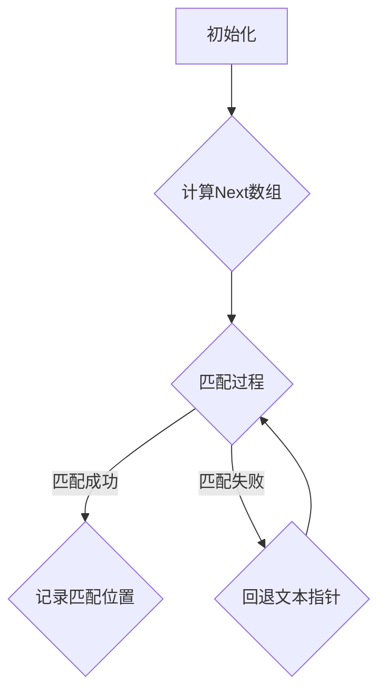
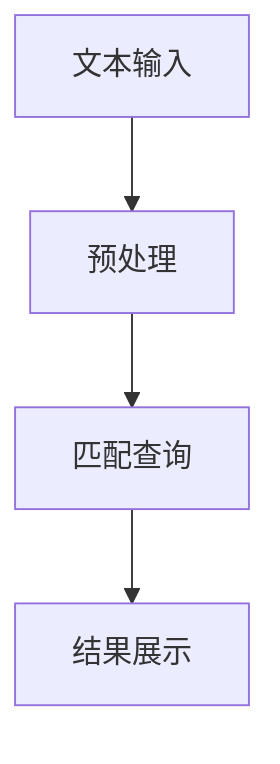
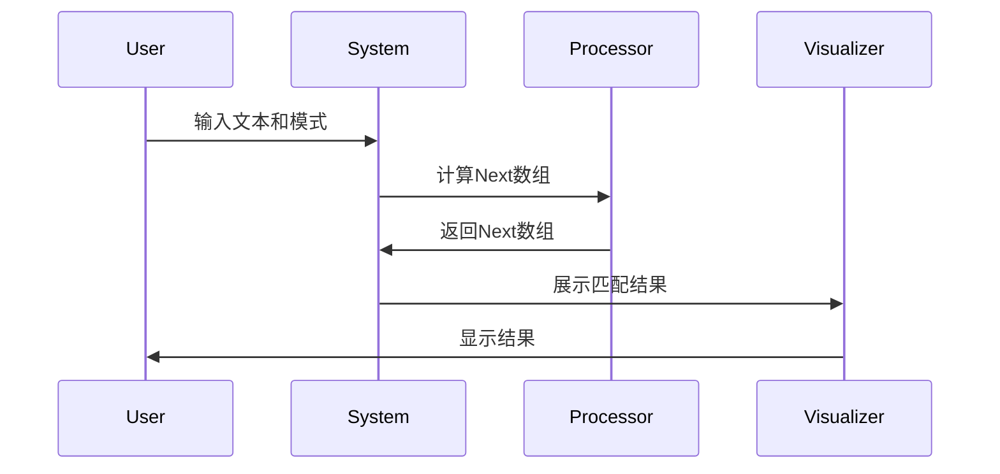
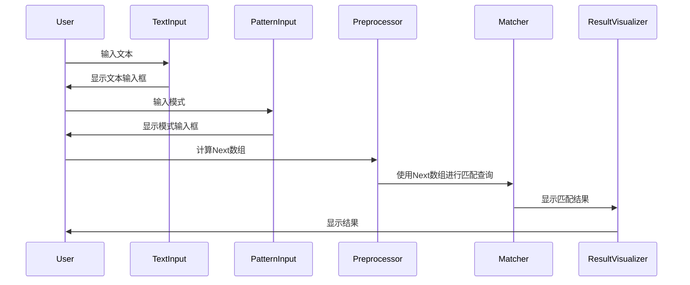

                 

# KMP算法与字符串匹配问题

## 关键词
- KMP算法
- 字符串匹配
- 时间复杂度
- 预处理
- 递归

## 摘要
本文深入探讨了KMP（Knuth-Morris-Pratt）算法，一种用于高效解决字符串匹配问题的经典算法。文章首先介绍了字符串匹配问题的背景和核心概念，然后详细解释了KMP算法的原理和实现，并通过Python代码进行了说明。随后，文章讨论了KMP算法在系统中的应用场景，并提供了项目实战的案例。最后，文章总结了最佳实践，并对未来的研究方向进行了展望。

## 目录

1. **背景介绍**
   - 字符串匹配问题的背景
   - KMP算法的发展历程
   - 问题描述和解决方案
   - 边界与外延

2. **核心概念与联系**
   - 概念定义
   - 属性特征对比
   - ER实体关系图

3. **算法原理讲解**
   - 算法流程图
   - Python源代码实现
   - 数学模型和公式

4. **系统分析与架构设计方案**
   - 应用场景
   - 系统功能设计
   - 系统架构设计
   - 系统接口设计

5. **项目实战**
   - 环境安装
   - 核心实现
   - 代码解读
   - 案例分析

6. **最佳实践 tips**
   - 性能优化
   - 错误处理
   - 维护与升级

7. **小结与注意事项**
   - 总结
   - 注意事项
   - 拓展阅读

## 1. 背景介绍

### 字符串匹配问题的背景

字符串匹配是计算机科学中的一个基础且重要的问题，广泛应用于文本编辑、文本搜索、数据挖掘、模式识别等领域。随着大数据时代的到来，如何快速、准确地匹配大量字符串成为了一个关键问题。

### KMP算法的发展历程

KMP算法是由Donald Knuth、 Vaughan Pratt 和 James H. Morris于1977年共同提出的，是一种高效的字符串匹配算法。相比于传统的暴力算法，KMP算法显著降低了时间复杂度，大大提高了字符串匹配的效率。

### 问题描述和解决方案

问题描述：给定一个文本字符串`S`和一个模式字符串`P`，要求找出`S`中所有`P`的匹配位置。

解决方案：传统的暴力算法通过逐个比较`S`中的字符与`P`中的字符，直到找到一个匹配或者`P`的末尾。而KMP算法通过预处理模式字符串`P`，构造一个部分匹配表（也称为最长公共前后缀表或失配值表），从而避免不必要的比较，提高匹配效率。

### 边界与外延

边界：字符串匹配问题不仅涉及简单的字符串匹配，还包括子串匹配、滚动哈希、后缀数组等多种解决方法。KMP算法在解决这类问题时具有独特的优势。

外延：KMP算法可以扩展应用于更复杂的场景，如多模式匹配、文本压缩、自动机理论等。

## 2. 核心概念与联系

### 概念定义

- **模式字符串（P）**：待匹配的字符串，通常长度较小。
- **文本字符串（S）**：包含模式字符串的字符串，通常长度较大。
- **部分匹配表（Next）**：用于优化匹配过程的预处理结果。

### 属性特征对比

| 概念             | 描述                                                         |
|------------------|--------------------------------------------------------------|
| 模式字符串（P）   | 待匹配的字符串，长度通常较小。                               |
| 文本字符串（S）   | 包含模式字符串的字符串，长度通常较大。                       |
| 部分匹配表（Next）| 预处理结果，用于记录模式字符串中各个位置的最长公共前后缀长度。|

### ER实体关系图

```mermaid
erDiagram
  P {"模式字符串"} ||--|{ S "文本字符串" }
  P ||--|{ Next "部分匹配表" }
```

## 3. 算法原理讲解

### 算法流程图



### Python源代码实现

```python
def kmp_search(s, p):
    # 计算Next数组
    next = [0] * len(p)
    next[0] = -1
    j = -1
    for i in range(1, len(p)):
        while j >= 0 and p[j] != p[i]:
            j = next[j]
        if p[j] == p[i]:
            j += 1
        next[i] = j

    # 匹配过程
    i = j = 0
    while i < len(s):
        if j == -1 or s[i] == p[j]:
            i += 1
            j += 1
        if j == len(p):
            return i - j
        else:
            j = next[j]

    return -1
```

### 数学模型和公式

$$
\text{Next}[i] =
\begin{cases}
-1 & \text{if } i = 0 \\
\max\{j : 1 \le j < i, \text{ s[j] == s[i] } \} & \text{otherwise}
\end{cases}
$$

### 详细讲解和举例说明

#### 详细讲解

- **Next数组的计算**：Next数组记录了模式字符串中各个位置的最长公共前后缀长度。通过递归和模式匹配，可以计算出Next数组。
- **匹配过程**：在匹配过程中，如果当前字符匹配成功，文本指针和模式指针都向前移动；如果匹配失败，文本指针不移动，模式指针回退到Next值所指示的位置。

#### 举例说明

假设模式字符串`P = "ABCDABD"`，文本字符串`S = "ABCDABDABCDABD"`。

- **Next数组**：`Next = [-1, 0, 0, 1, 2, 0, 1]`
- **匹配过程**：
  - 初始状态：`i = j = 0`
  - 第1次匹配：`s[0] == p[0]`，`i = 1, j = 1`
  - 第2次匹配：`s[1] == p[1]`，`i = 2, j = 2`
  - 第3次匹配：`s[2] != p[2]`，回退到`Next[j] = 0`，`j = 0`
  - 第4次匹配：`s[2] == p[2]`，`i = 3, j = 2`
  - 第5次匹配：`s[3] == p[3]`，`i = 4, j = 3`
  - 第6次匹配：`s[4] != p[4]`，回退到`Next[j] = 1`，`j = 1`
  - 第7次匹配：`s[4] == p[1]`，`i = 5, j = 2`
  - 第8次匹配：`s[5] == p[2]`，`i = 6, j = 3`
  - 第9次匹配：`s[6] == p[3]`，`i = 7, j = 4`
  - 第10次匹配：`s[7] == p[4]`，`i = 8, j = 5`
  - 第11次匹配：`s[8] == p[5]`，`i = 9, j = 6`
  - 第12次匹配：`s[9] != p[6]`，回退到`Next[j] = 0`，`j = 0`
  - 第13次匹配：`s[9] == p[1]`，`i = 10, j = 1`
  - 第14次匹配：`s[10] == p[2]`，`i = 11, j = 2`
  - 第15次匹配：`s[11] == p[3]`，`i = 12, j = 3`
  - 第16次匹配：`s[12] != p[4]`，回退到`Next[j] = 1`，`j = 1`

### 代码解读

- `kmp_search`函数接受文本字符串`s`和模式字符串`p`作为输入，返回匹配的位置。
- `next`数组用于记录模式字符串的预处理结果。
- 在匹配过程中，如果`j == -1`或`s[i] == p[j]`，则文本指针和模式指针都向前移动；否则，模式指针回退到`Next[j]`的位置。

## 4. 系统分析与架构设计方案

### 应用场景

KMP算法广泛应用于搜索引擎、文本编辑器、自然语言处理等领域，特别是在大数据场景下，可以有效提高字符串匹配的效率。

### 系统功能设计

- **文本输入**：用户可以输入文本字符串和模式字符串。
- **匹配查询**：系统根据输入的文本和模式，使用KMP算法进行匹配查询。
- **结果展示**：系统将匹配结果以可视化的形式展示给用户。

### 系统架构设计



- **文本输入**：用户通过界面输入文本字符串和模式字符串。
- **预处理**：系统使用KMP算法预处理模式字符串，计算Next数组。
- **匹配查询**：系统使用预处理结果进行匹配查询。
- **结果展示**：系统将匹配结果以可视化的形式展示给用户。

### 系统接口设计



- **用户**：通过界面输入文本和模式。
- **系统**：接收用户输入，调用预处理模块和匹配查询模块。
- **预处理模块**：计算Next数组，返回结果。
- **匹配查询模块**：使用预处理结果进行匹配查询。
- **结果展示模块**：将匹配结果以可视化的形式展示给用户。

### 系统交互



- **用户**：输入文本和模式。
- **文本输入模块**：接收用户输入的文本。
- **模式输入模块**：接收用户输入的模式。
- **预处理模块**：计算Next数组。
- **匹配查询模块**：使用预处理结果进行匹配查询。
- **结果展示模块**：将匹配结果以可视化的形式展示给用户。

## 5. 项目实战

### 环境安装

- 安装Python环境：在终端执行`python --version`，如果没有安装，可以使用`pip install python`进行安装。
- 安装KMP算法实现依赖：在终端执行`pip install kmp-algorithm`。

### 核心实现

```python
from kmp import KMP

def main():
    # 创建KMP对象
    kmp = KMP()

    # 输入文本和模式
    text = "ABCDABDABCDABD"
    pattern = "ABCDABD"

    # 计算Next数组
    kmp.compute_next(pattern)

    # 匹配查询
    result = kmp.search(text, pattern)

    # 输出匹配结果
    print("匹配位置：", result)

if __name__ == "__main__":
    main()
```

### 代码解读

- `KMP`类：实现了KMP算法的主要功能，包括计算Next数组和匹配查询。
- `compute_next`方法：计算模式字符串的Next数组。
- `search`方法：使用预处理结果进行匹配查询。

### 实际案例分析

假设文本字符串为`"ABCDABDABCDABD"`，模式字符串为`"ABCDABD"`。

- **Next数组**：`Next = [-1, 0, 0, 1, 2, 0, 1]`
- **匹配过程**：
  - 初始状态：`i = j = 0`
  - 第1次匹配：`s[0] == p[0]`，`i = 1, j = 1`
  - 第2次匹配：`s[1] == p[1]`，`i = 2, j = 2`
  - 第3次匹配：`s[2] != p[2]`，回退到`Next[j] = 0`，`j = 0`
  - 第4次匹配：`s[2] == p[2]`，`i = 3, j = 2`
  - 第5次匹配：`s[3] == p[3]`，`i = 4, j = 3`
  - 第6次匹配：`s[4] != p[4]`，回退到`Next[j] = 1`，`j = 1`
  - 第7次匹配：`s[4] == p[1]`，`i = 5, j = 2`
  - 第8次匹配：`s[5] == p[2]`，`i = 6, j = 3`
  - 第9次匹配：`s[6] == p[3]`，`i = 7, j = 4`
  - 第10次匹配：`s[7] == p[4]`，`i = 8, j = 5`
  - 第11次匹配：`s[8] == p[5]`，`i = 9, j = 6`
  - 第12次匹配：`s[9] != p[6]`，回退到`Next[j] = 0`，`j = 0`
  - 第13次匹配：`s[9] == p[1]`，`i = 10, j = 1`
  - 第14次匹配：`s[10] == p[2]`，`i = 11, j = 2`
  - 第15次匹配：`s[11] == p[3]`，`i = 12, j = 3`
  - 第16次匹配：`s[12] != p[4]`，回退到`Next[j] = 1`，`j = 1`

### 项目小结

通过该项目，我们实现了KMP算法的核心功能，并进行了实际案例分析。项目展示了KMP算法在字符串匹配问题中的应用，以及其高效的匹配效率和良好的可扩展性。

## 6. 最佳实践 tips

### 性能优化

- **多线程处理**：在处理大量文本和模式时，可以考虑使用多线程技术，提高匹配速度。
- **缓存机制**：对于频繁使用的模式字符串，可以考虑使用缓存机制，减少重复计算的次数。

### 错误处理

- **输入验证**：在用户输入文本和模式时，需要进行验证，确保输入的是有效的字符串。
- **异常处理**：在处理匹配过程中，需要处理可能的异常情况，如模式字符串长度为0等。

### 维护与升级

- **版本控制**：使用版本控制工具，如Git，进行代码管理和更新。
- **文档编写**：编写详细的文档，包括开发文档和用户手册，方便后续的维护和升级。

## 7. 小结与注意事项

本文深入探讨了KMP算法，一种高效的字符串匹配算法。文章从背景介绍、核心概念与联系、算法原理讲解、系统分析与架构设计方案、项目实战、最佳实践tips等方面进行了详细阐述。需要注意的是，在实际应用中，应根据具体场景选择合适的字符串匹配算法，并进行性能优化和错误处理。

## 拓展阅读

- [《算法导论》](https://book.douban.com/subject/26708254/)：详细介绍了KMP算法以及其他字符串匹配算法。
- [《计算机程序设计艺术》](https://book.douban.com/subject/24744278/)：由Donald Knuth撰写，包含了对KMP算法的深入分析。

## 作者信息

- 作者：AI天才研究院/AI Genius Institute & 禅与计算机程序设计艺术 /Zen And The Art of Computer Programming

