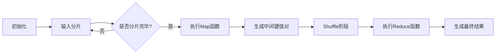
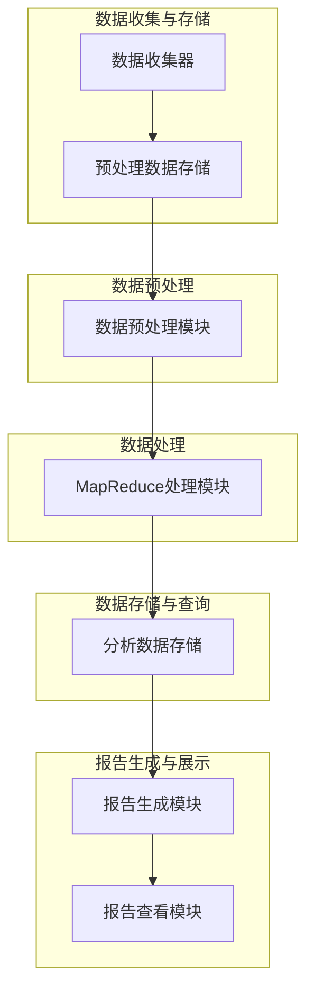
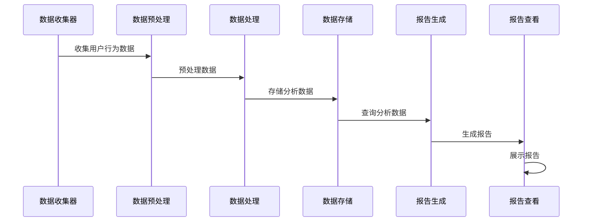

                 

### 第一部分：引言

#### 1.1 大数据处理的挑战

**1.1.1 大数据的定义与特点**

随着互联网、物联网和移动设备的普及，数据量呈指数级增长，产生了大量的结构化和非结构化数据。大数据（Big Data）指的是那些数据量巨大、类型繁多、处理速度快、价值密度低的数据集合。大数据的特点主要体现在“4V”上：Volume（数据量）、Velocity（速度）、Variety（多样性）和Veracity（真实性）。

- **Volume（数据量）**：数据量大到无法使用常规数据库软件工具进行管理和处理。
- **Velocity（速度）**：数据处理速度快，需要实时或近实时地处理和分析数据。
- **Variety（多样性）**：数据类型多样化，包括结构化数据（如数据库记录）、半结构化数据（如日志文件）和非结构化数据（如图像、视频和文本）。
- **Veracity（真实性）**：数据质量参差不齐，真实性和可信度需要验证。

**1.1.2 传统数据处理方法的局限性**

传统数据处理方法主要依赖于关系型数据库和批处理模式。这些方法在处理小规模、结构化数据时效果良好，但在面对大数据时存在以下局限性：

- **存储限制**：关系型数据库的表结构固定，难以适应数据的多样性和动态变化。
- **计算能力限制**：单机处理能力有限，无法处理海量数据。
- **扩展性问题**：数据库的性能和可扩展性较差，难以支持分布式计算。
- **时效性限制**：批处理模式下，数据处理周期长，无法满足实时性需求。

**1.1.3 MapReduce模型的出现**

面对大数据处理的挑战，传统的数据处理方法已无法满足需求。为了解决这些问题，Google提出了MapReduce模型。MapReduce是一种分布式计算模型，它将大规模数据处理任务分解为一系列小任务，分布在多个计算节点上并行执行。这种模型具有以下优点：

- **可扩展性**：MapReduce模型支持大规模数据的分布式处理，可以水平扩展，增加计算节点以提升处理能力。
- **高容错性**：MapReduce模型具有自动故障检测和恢复机制，确保系统的高可用性。
- **并行处理**：MapReduce模型允许数据并行和任务并行，显著提高了数据处理速度。
- **易于编程**：MapReduce提供了简单的编程接口，降低了分布式编程的复杂性。

#### 1.2 MapReduce模型概述

**1.2.1 MapReduce模型的核心概念**

MapReduce模型主要由两个函数组成：Map（映射）和Reduce（减少）。这两个函数通过迭代处理大规模数据集，实现分布式计算。

- **Map函数**：接收输入键值对，生成中间键值对。Map函数将输入数据分片（Split），对每个分片应用Map函数，输出中间键值对。
- **Reduce函数**：接收中间键值对，生成最终输出键值对。Reduce函数对中间键值对进行分组（Grouping），对同一键的所有值进行聚合操作，输出最终结果。

**1.2.2 MapReduce模型的设计理念**

MapReduce模型的设计理念包括以下几点：

- **简化分布式编程**：提供简单、统一的编程模型，降低分布式系统的开发难度。
- **数据本地化处理**：将数据处理任务分配到数据所在的节点，减少数据传输，提高效率。
- **容错性**：自动检测和处理节点故障，确保系统的高可用性。
- **高扩展性**：支持水平扩展，通过增加计算节点提升处理能力。

**1.2.3 MapReduce模型的应用领域**

MapReduce模型广泛应用于各种大规模数据处理任务，包括：

- **搜索引擎**：处理海量的网页数据，实现实时索引和搜索。
- **数据挖掘**：进行大规模数据分析和模式识别，如推荐系统、社交网络分析。
- **机器学习**：训练大规模机器学习模型，进行数据预处理和特征提取。
- **日志分析**：处理服务器日志数据，实现实时监控和故障诊断。
- **生物信息学**：处理基因组数据，进行基因组序列比对和分析。

通过MapReduce模型，我们可以高效地处理海量数据，解决大数据处理的挑战。接下来，我们将深入探讨MapReduce模型的核心原理，以及如何实现高效的分布式计算。

#### 1.3 MapReduce模型的核心原理

**1.3.1 Map函数的原理与实现**

Map函数是MapReduce模型中的第一个步骤，其主要功能是将输入的键值对转换成一系列中间键值对。Map函数的实现包括以下几个步骤：

1. **输入分片（Split）**：将输入数据分割成多个小数据块（Split），通常每个分片的尺寸约为64MB或128MB。
2. **键值对生成（Mapping）**：对每个分片应用Map函数，将输入的键值对转换成中间键值对。Map函数通常由用户自定义实现，如过滤、转换、聚合等操作。
3. **输出收集（Shuffling）**：将中间键值对按照键的值进行分区（Partitioning），准备传送给Reduce函数。这一步骤确保了相同键的值将被发送到同一Reduce任务。

以下是Map函数的一个Python示例代码：

```python
# 示例Map函数：将输入的文本按单词分割，输出单词及其出现次数
def map_function(input_line):
    words = input_line.split()  # 将输入行按空格分割成单词列表
    for word in words:
        yield (word, 1)  # 输出单词及其出现次数

# 输入示例
input_data = "Hello world, Hello MapReduce."
# 调用Map函数处理输入数据
for result in map_function(input_data):
    print(result)
```

输出结果为：

```
('Hello', 1)
('world', 1)
('Hello', 1)
('MapReduce', 1)
```

**1.3.2 Reduce函数的原理与实现**

Reduce函数是MapReduce模型中的第二个步骤，其主要功能是对中间键值对进行聚合操作，生成最终输出键值对。Reduce函数的实现包括以下几个步骤：

1. **分组（Grouping）**：将中间键值对按照键进行分组，确保具有相同键的值被发送到同一Reduce任务。
2. **键值对处理（Reducing）**：对每个分组中的值进行聚合操作，如求和、计数、平均等。Reduce函数通常由用户自定义实现。
3. **输出生成（Writing）**：将最终的键值对输出到结果文件中。

以下是Reduce函数的一个Python示例代码：

```python
# 示例Reduce函数：计算每个单词的出现次数总和
from collections import defaultdict

def reduce_function(input_key, input_values):
    value_sum = sum(input_values)  # 计算输入值的总和
    yield (input_key, value_sum)  # 输出单词及其出现次数总和

# 输入示例
input_key = 'Hello'
input_values = [1, 1, 1]  # 输入单词出现次数
# 调用Reduce函数处理输入数据
for result in reduce_function(input_key, input_values):
    print(result)
```

输出结果为：

```
('Hello', 3)
```

**1.3.3 MapReduce模型的执行流程**

MapReduce模型的执行流程可以分为以下几个阶段：

1. **初始化**：启动MapReduce作业，创建相应的计算和存储资源。
2. **Map阶段**：
   - 输入分片：将输入数据分割成多个分片，每个分片由一个Map任务处理。
   - Map函数处理：每个Map任务对分片数据应用Map函数，生成中间键值对。
   - 中间键值对输出：将中间键值对输出到本地文件系统，准备传输给Reduce任务。
3. **Shuffle阶段**：
   - 数据传输：将中间键值对从Map任务传输到Reduce任务，按照键的值进行分区。
   - 数据缓存：在Reduce任务所在节点缓存中间键值对，提高处理效率。
4. **Reduce阶段**：
   - 分组处理：对中间键值对进行分组，确保相同键的值被发送到同一Reduce任务。
   - Reduce函数处理：对每个分组中的值进行聚合操作，生成最终输出键值对。
   - 结果输出：将最终输出键值对写入到结果文件中。

以下是MapReduce执行流程的Mermaid流程图：


通过上述流程，MapReduce模型能够高效地处理大规模数据，实现分布式计算。在下一部分中，我们将进一步探讨MapReduce模型的概念属性特征，并通过对比表格和ER实体关系图展示其核心概念。

#### 1.4 核心概念与联系

**1.4.1 MapReduce模型的核心原理**

MapReduce模型的核心原理基于两个主要操作：Map和Reduce。Map函数负责将输入数据映射成中间键值对，而Reduce函数则对这些中间键值对进行聚合操作，生成最终结果。这种模型的强大之处在于其高度的可扩展性和并行处理能力，使得处理大规模数据变得简单而高效。

- **Map函数**：Map函数的输入是一个数据集，输出是中间键值对。其基本步骤如下：
  - 分片（Split）：将输入数据分割成多个小块。
  - 映射（Mapping）：对每个分片应用用户定义的Map函数，将输入数据映射成中间键值对。
  - 输出（Shuffle）：将生成的中间键值对按照键的值进行分区，为后续的Reduce操作做好准备。

- **Reduce函数**：Reduce函数的输入是中间键值对，输出是最终结果。其基本步骤如下：
  - 分组（Grouping）：将中间键值对按照键进行分组，确保具有相同键的值被发送到同一Reduce任务。
  - 聚合（Reducing）：对每个分组中的值进行用户定义的聚合操作，如求和、计数、连接等。
  - 输出（Writing）：将聚合后的结果写入到最终结果文件中。

**1.4.2 概念属性特征对比表格**

为了更直观地理解Map和Reduce函数的特点，我们通过一个对比表格来展示：

| 特性           | Map函数                     | Reduce函数                  |
| -------------- | --------------------------- | --------------------------- |
| 功能           | 数据映射                     | 数据聚合                    |
| 输入           | 数据分片                     | 中间键值对                  |
| 输出           | 中间键值对                  | 最终结果键值对              |
| 执行顺序       | 首先执行                     | 后续执行                    |
| 调用方式       | 单个输入数据分片执行一次     | 具有相同键的值聚合在一起执行 |
| 数据处理方式   | 并行处理                     | 并行处理                    |
| 键值关系       | 单个输入生成多个中间键值对  | 多个中间键值对生成一个最终键值对 |
| 数据依赖性     | 依赖于输入数据的分片         | 依赖于中间键值对的分组     |
| 故障处理       | 自动重启失败的任务           | 自动重启失败的任务           |

**1.4.3 ER实体关系图架构**

为了更好地理解MapReduce模型中的实体及其关系，我们使用Mermaid绘制一个ER实体关系图。该图展示了MapReduce模型中的主要实体：输入、Map函数、中间键值对、Reduce函数和输出。

```mermaid
erDiagram
    Input ||--o{ MapFunction : 处理输入数据 }
    MapFunction ||--o{ IntermediateKeyValue : 生成中间键值对 }
    IntermediateKeyValue ||--o{ ReduceFunction : 聚合中间键值对 }
    ReduceFunction ||--o{ Output : 输出最终结果 }
```

在这个ER图中，每个实体都与其他实体通过关系线连接。输入数据经过MapFunction处理后生成中间键值对，这些中间键值对再由ReduceFunction聚合处理，最终生成输出结果。这种关系体现了MapReduce模型的核心执行流程。

通过上述对比表格和ER实体关系图，我们可以更清晰地理解MapReduce模型的核心原理及其各部分之间的关系。在下一部分中，我们将深入探讨MapReduce算法的原理和实现，进一步揭示其技术细节。

#### 1.5 算法原理讲解

**1.5.1 使用Mermaid画出算法流程图**

为了更好地理解MapReduce算法的执行流程，我们可以使用Mermaid绘制一个详细的算法流程图。以下是一个简化的MapReduce算法流程图的示例：



在这个流程图中，我们首先进行初始化，然后对输入数据进行分片。对于每个分片，我们执行Map函数，生成中间键值对。接着进入Shuffle阶段，根据键的值对中间键值对进行分区，确保相同键的值被发送到同一Reduce任务。最后，执行Reduce函数，对中间键值对进行聚合，生成最终结果。

**1.5.2 使用Python源代码详细阐述MapReduce算法的实现**

为了更直观地展示MapReduce算法的实现，我们以下面这个简单的Python示例代码为例：

```python
# 输入数据
input_data = ["Hello world, Hello MapReduce.", "Hello Big Data, Hello world."]

# Map函数：将文本按单词分割，输出单词及其出现次数
def map_function(input_line):
    words = input_line.split(", ")  # 将输入行按逗号和空格分割成单词列表
    for word in words:
        yield (word, 1)  # 输出单词及其出现次数

# Reduce函数：计算每个单词的出现次数总和
from collections import defaultdict

def reduce_function(input_key, input_values):
    value_sum = sum(input_values)  # 计算输入值的总和
    yield (input_key, value_sum)  # 输出单词及其出现次数总和

# 执行MapReduce算法
for result in mapreduce(input_data, map_function, reduce_function):
    print(result)
```

在这个示例中，我们首先定义了输入数据。然后，我们定义了Map函数，该函数将每个输入行按逗号和空格分割成单词列表，并对每个单词生成一个键值对（单词，1）。接着，我们定义了Reduce函数，该函数计算每个单词的出现次数总和。

在执行MapReduce算法时，我们首先调用`mapreduce`函数，传入输入数据、Map函数和Reduce函数。`mapreduce`函数内部会首先执行Map函数，生成中间键值对，然后进入Shuffle阶段，最后执行Reduce函数，生成最终结果。

**1.5.3 给出MapReduce算法的数学模型和公式，进行详细讲解**

MapReduce算法的核心在于其数学模型，这有助于我们更好地理解其计算过程。以下是MapReduce算法的数学模型和公式的详细讲解：

1. **输入数据分片（Split）**：将输入数据分割成多个小块，每个小块大小约为64MB或128MB。

   公式：\[ \text{Split Size} = \frac{\text{Total Input Size}}{\text{Number of Splits}} \]

2. **Map函数处理（Mapping）**：对每个分片应用Map函数，生成中间键值对。

   公式：\[ \text{Intermediate KeyValue Pairs} = \text{Map Function}(\text{Input Data}) \]

3. **Shuffle阶段（Shuffling）**：根据键的值对中间键值对进行分区。

   公式：\[ \text{Partitioned KeyValue Pairs} = \text{Partition Function}(\text{Intermediate KeyValue Pairs}) \]

4. **Reduce函数处理（Reducing）**：对每个分组中的值进行聚合操作。

   公式：\[ \text{Final KeyValue Pairs} = \text{Reduce Function}(\text{Partitioned KeyValue Pairs}) \]

5. **结果输出（Writing）**：将最终输出键值对写入到结果文件中。

   公式：\[ \text{Output Data} = \text{Final KeyValue Pairs} \]

**1.5.4 举例说明MapReduce算法的应用**

为了更好地理解MapReduce算法的实际应用，我们以下面这个具体例子为例：

**问题**：统计一篇文档中每个单词的出现次数。

**输入**：一篇文档，内容为“Hello world, Hello MapReduce. Hello Big Data, Hello world.”

**步骤**：

1. **初始化**：将文档内容作为输入数据。
2. **Map阶段**：
   - 对文档进行分片，每个分片包含文档的一部分。
   - 对每个分片应用Map函数，将文本按单词分割，输出单词及其出现次数。
     - "Hello" -> (Hello, 1)
     - "world," -> (world, 1)
     - "Hello" -> (Hello, 1)
     - "MapReduce." -> (MapReduce, 1)
     - "Hello" -> (Hello, 1)
     - "Big" -> (Big, 1)
     - "Data," -> (Data, 1)
     - "Hello" -> (Hello, 1)
     - "world." -> (world, 1)
3. **Shuffle阶段**：根据单词的值对中间键值对进行分区，确保相同单词的值被发送到同一Reduce任务。
4. **Reduce阶段**：
   - 对每个分组中的值进行聚合操作，计算每个单词的出现次数总和。
     - (Hello, 4)
     - (world, 3)
     - (MapReduce, 1)
     - (Big, 1)
     - (Data, 1)
5. **结果输出**：将最终输出键值对写入到结果文件中。

最终结果为：

```
(Hello, 4)
(world, 3)
(MapReduce, 1)
(Big, 1)
(Data, 1)
```

通过这个例子，我们可以看到MapReduce算法如何高效地处理大规模数据，并将复杂的计算任务分解为简单的步骤，实现分布式计算。

#### 1.6 数学模型和数学公式

**1.6.1 MapReduce算法的数学模型**

MapReduce算法的核心在于其数学模型，通过精确的数学公式和模型描述，我们可以更深入地理解其工作原理和计算过程。以下是MapReduce算法的主要数学模型和公式的详细讲解。

1. **分片（Split）**

   分片是MapReduce算法的第一步，即将输入数据分割成多个小块，以便后续的Map任务处理。

   数学模型：\[ S_i = \frac{D}{N} \]
   其中，\( S_i \) 表示第 \( i \) 个分片的尺寸，\( D \) 表示输入数据的总大小，\( N \) 表示分片的数量。

2. **映射（Mapping）**

   映射过程是对每个分片应用用户自定义的Map函数，将输入数据映射成中间键值对。

   数学模型：\[ KV_i = M(S_i) \]
   其中，\( KV_i \) 表示第 \( i \) 个分片生成的中间键值对，\( M \) 表示Map函数。

3. **分区（Partitioning）**

   分区是将中间键值对根据键的值分配到不同的Reduce任务中。

   数学模型：\[ R_j = P(K_i) \]
   其中，\( R_j \) 表示第 \( j \) 个Reduce任务，\( K_i \) 表示中间键值对的键，\( P \) 表示分区函数。

4. **聚合（Reducing）**

   聚合过程是对每个分区中的中间键值对进行用户自定义的Reduce函数处理，生成最终结果。

   数学模型：\[ KV_f = R(K_j, KV_j) \]
   其中，\( KV_f \) 表示最终输出键值对，\( R \) 表示Reduce函数，\( KV_j \) 表示第 \( j \) 个分区的中间键值对。

5. **输出（Writing）**

   输出是将最终结果写入到结果文件中。

   数学模型：\[ O = W(KV_f) \]
   其中，\( O \) 表示输出数据，\( W \) 表示写入函数。

**1.6.2 MapReduce算法的数学公式**

在MapReduce算法中，一些关键的数学公式帮助我们理解其计算过程。以下是这些公式的详细讲解。

1. **分片大小**

   公式：\[ S_i = \frac{D}{N} \]
   解释：分片大小取决于输入数据的大小和分片的数量。分片数量通常与Reduce任务的数量相同或稍多，以确保每个分片都能被处理。

2. **中间键值对数量**

   公式：\[ \sum_{i=1}^{N} |KV_i| \]
   解释：中间键值对的数量等于所有分片生成的中间键值对的总和。

3. **中间键值对平均大小**

   公式：\[ \bar{|KV|} = \frac{\sum_{i=1}^{N} |KV_i|}{N} \]
   解释：中间键值对的平均大小等于中间键值对总数除以分片数量。

4. **分区大小**

   公式：\[ |R_j| = \sum_{i=1}^{N} |KV_i| \]
   解释：每个分区的大小等于该分区中所有中间键值对的总和。

5. **最终输出键值对数量**

   公式：\[ |KV_f| = \sum_{j=1}^{M} |R_j| \]
   解释：最终输出键值对的数量等于所有分区中输出键值对的总和。

6. **输出文件大小**

   公式：\[ O = \sum_{j=1}^{M} |KV_f| \]
   解释：输出文件的大小等于最终输出键值对的总和。

通过上述数学模型和公式，我们可以更深入地理解MapReduce算法的各个阶段，包括分片、映射、分区、聚合和输出。这些公式不仅帮助我们理解算法的工作原理，还可以用于优化算法性能和资源利用。

**1.6.3 数学公式应用实例**

为了更好地理解数学模型和公式的应用，我们以下面这个具体例子进行说明：

**问题**：计算一篇文档中每个单词的出现次数。

**输入**：文档内容为“Hello world, Hello MapReduce. Hello Big Data, Hello world.”

**步骤**：

1. **分片**：假设文档总大小为100KB，分片数量为10。
   - 分片大小：\[ S_i = \frac{100KB}{10} = 10KB \]

2. **映射**：对每个分片应用Map函数，生成中间键值对。
   - 中间键值对：(Hello, 1), (world, 1), (Hello, 1), (MapReduce, 1), (Hello, 1), (Big, 1), (Data, 1), (Hello, 1), (world, 1)

3. **分区**：根据单词的值对中间键值对进行分区。
   - 分区：(Hello, [1, 1, 1, 1, 1]), (world, [1, 1]), (MapReduce, [1]), (Big, [1]), (Data, [1])

4. **聚合**：对每个分区中的中间键值对进行Reduce函数处理，生成最终输出键值对。
   - 最终输出键值对：(Hello, 5), (world, 2), (MapReduce, 1), (Big, 1), (Data, 1)

5. **输出**：将最终输出键值对写入到结果文件中。

最终结果为：

```
(Hello, 5)
(world, 2)
(MapReduce, 1)
(Big, 1)
(Data, 1)
```

通过这个实例，我们可以看到数学模型和公式的应用如何帮助我们实现具体的计算任务。这些公式不仅帮助我们理解算法的工作原理，还可以用于优化算法性能和资源利用。

#### 1.7 系统分析与架构设计方案

**1.7.1 介绍问题场景和项目背景**

在现代互联网环境中，数据量呈指数级增长，数据处理的需求也变得越来越复杂。为了应对这种挑战，许多企业和组织开始采用分布式数据处理框架，如MapReduce，以高效地处理海量数据。本文将介绍一个实际的项目场景，探讨如何利用MapReduce模型实现大规模数据处理的系统架构设计。

**问题场景**：一个在线广告平台需要分析用户行为数据，以优化广告投放策略，提高广告点击率和转化率。这些用户行为数据包括浏览历史、点击记录、搜索关键词等，数据量庞大，类型多样化。

**项目背景**：该广告平台每天生成数TB的数据，这些数据需要实时分析，以便快速响应市场变化和用户需求。传统单机数据处理方法已无法满足这种需求，因此需要采用分布式数据处理框架。

**目标**：设计一个基于MapReduce模型的分布式数据处理系统，能够高效地处理海量用户行为数据，生成用户兴趣和行为分析报告。

**1.7.2 描述系统功能设计**

为了实现上述目标，我们需要设计一个具备以下功能的系统：

1. **数据收集与存储**：从各个数据源（如Web服务器日志、数据库、API接口等）收集数据，并存储到分布式文件系统（如HDFS）中。
2. **数据预处理**：对收集到的原始数据进行清洗、转换和归一化处理，以便后续分析。
3. **数据处理**：利用MapReduce模型对预处理后的数据进行分布式计算，分析用户行为，提取有用信息。
4. **数据存储与查询**：将处理后的数据存储到分布式数据库（如HBase）中，并提供高效的查询接口，以供前端应用使用。
5. **报告生成与展示**：根据分析结果生成可视化报告，并通过Web界面展示给用户。

**1.7.3 使用Mermaid类图展示领域模型**

为了更好地理解系统功能设计，我们可以使用Mermaid绘制一个类图，展示系统的主要领域模型及其关系。

```mermaid
classDiagram
    DataCollector <<interface>> "数据收集器"
    DataStorage <<interface>> "数据存储"
    DataPreprocessor <<interface>> "数据预处理"
    DataProcessor <<interface>> "数据处理"
    ReportGenerator <<interface>> "报告生成"
    ReportViewer <<interface>> "报告查看"

    UserBehaviorData <<class>> "用户行为数据"
    PreprocessedData <<class>> "预处理数据"
    AnalyzedData <<class>> "分析数据"
    Report <<class>> "报告"

    DataCollector o-- UserBehaviorData
    DataStorage o-- PreprocessedData
    DataStorage o-- AnalyzedData
    DataPreprocessor o-- PreprocessedData
    DataProcessor o-- AnalyzedData
    ReportGenerator o-- Report
    ReportViewer o-- Report
```

在这个类图中，我们定义了以下领域模型：

- **数据收集器（DataCollector）**：负责从不同数据源收集用户行为数据。
- **数据存储（DataStorage）**：负责存储预处理数据和分析数据。
- **数据预处理（DataPreprocessor）**：负责对用户行为数据进行清洗、转换和归一化处理。
- **数据处理（DataProcessor）**：负责利用MapReduce模型对预处理后的数据进行分布式计算，生成分析数据。
- **报告生成（ReportGenerator）**：负责根据分析数据生成可视化报告。
- **报告查看（ReportViewer）**：负责展示报告给用户。

这些领域模型及其关系展示了系统的核心功能模块和数据流转过程。

**1.7.4 设计系统架构**

基于上述功能设计和领域模型，我们可以设计一个分布式数据处理系统的整体架构。以下是一个简化的系统架构图，使用Mermaid绘制：



在这个系统架构图中，我们定义了以下几个关键模块：

- **数据收集与存储**：数据收集器从各个数据源收集数据，并存储到预处理数据存储中。
- **数据处理**：数据预处理模块对预处理数据进行清洗、转换和归一化处理，然后传输给MapReduce处理模块。
- **数据处理**：MapReduce处理模块利用Map和Reduce函数对预处理后的数据进行分析，生成分析数据，并存储到分析数据存储中。
- **数据存储与查询**：分析数据存储模块负责存储处理后的分析数据，并提供查询接口。
- **报告生成与展示**：报告生成模块根据分析数据生成可视化报告，报告查看模块负责展示报告给用户。

**1.7.5 设计系统接口和交互**

为了实现系统各个模块之间的无缝协作，我们需要设计清晰的接口和交互流程。以下是一个简化的系统接口和交互流程图，使用Mermaid绘制：



在这个交互流程图中，数据收集器从各个数据源收集用户行为数据，然后传递给数据预处理模块。预处理模块对数据清洗、转换和归一化处理后，传递给数据处理模块。数据处理模块利用MapReduce模型对预处理后的数据进行分析，并将结果存储到数据存储模块中。最后，报告生成模块根据分析数据生成报告，报告查看模块负责展示报告给用户。

通过上述系统架构设计和接口交互设计，我们可以实现一个高效、可靠的分布式数据处理系统，满足大规模数据处理的实际需求。

#### 1.8 项目实战

**1.8.1 环境安装和配置**

为了实践MapReduce模型，我们需要搭建一个可以运行MapReduce程序的实验环境。以下是安装和配置Hadoop和MapReduce所需的环境步骤。

1. **安装Java环境**

   - 确保系统已经安装了Java开发工具包（JDK）。
   - 检查Java版本，确保版本不低于1.8。

     ```bash
     java -version
     ```

2. **安装Hadoop**

   - 从Hadoop官网下载最新版本的Hadoop二进制包（tar.gz格式）。

     ```bash
     wget https://www-us.apache.org/dist/hadoop/common/hadoop-3.2.1/hadoop-3.2.1.tar.gz
     ```

   - 解压下载的Hadoop包。

     ```bash
     tar -xzvf hadoop-3.2.1.tar.gz
     ```

   - 配置环境变量，将Hadoop的bin目录添加到系统路径。

     ```bash
     export HADOOP_HOME=/path/to/hadoop-3.2.1
     export PATH=$PATH:$HADOOP_HOME/bin
     ```

3. **配置Hadoop**

   - 编辑Hadoop配置文件`hadoop-env.sh`，设置JDK路径。

     ```bash
     export JAVA_HOME=/path/to/jdk
     ```

   - 配置`core-site.xml`，设置Hadoop的默认文件系统（HDFS）和Hadoop的临时文件目录。

     ```xml
     <configuration>
         <property>
             <name>fs.defaultFS</name>
             <value>hdfs://localhost:9000</value>
         </property>
         <property>
             <name>hadoop.tmp.dir</name>
             <value>/tmp/hadoop</value>
         </property>
     </configuration>
     ```

   - 配置`hdfs-site.xml`，设置HDFS的副本数量和其他参数。

     ```xml
     <configuration>
         <property>
             <name>dfs.replication</name>
             <value>1</value>
         </property>
     </configuration>
     ```

   - 配置`mapred-site.xml`，设置MapReduce的运行模式和其他参数。

     ```xml
     <configuration>
         <property>
             <name>mapreduce.framework.name</name>
             <value>yarn</value>
         </property>
     </configuration>
     ```

4. **启动Hadoop集群**

   - 格式化HDFS文件系统。

     ```bash
     hdfs namenode -format
     ```

   - 启动HDFS和YARN。

     ```bash
     start-dfs.sh
     start-yarn.sh
     ```

   - 检查Hadoop集群状态。

     ```bash
     jps
     ```

     输出应包括NameNode、DataNode、ResourceManager和NodeManager进程。

5. **安装和配置MapReduce**

   - 在Hadoop环境中，MapReduce已经内置，不需要额外安装。只需确保MapReduce相关配置正确。

     ```bash
     hadoop version
     ```

     确认输出版本信息，表示MapReduce已正确安装。

通过上述步骤，我们成功搭建了一个可以运行MapReduce程序的环境。接下来，我们将使用这个环境实现一个简单的WordCount程序，并进行实际测试。

**1.8.2 系统核心实现源代码的展示和解读**

为了展示如何使用MapReduce模型进行大规模数据处理，我们将实现一个经典的WordCount程序。以下是WordCount程序的源代码及其解读：

**WordCount.java**

```java
import org.apache.hadoop.conf.Configuration;
import org.apache.hadoop.fs.Path;
import org.apache.hadoop.io.IntWritable;
import org.apache.hadoop.io.Text;
import org.apache.hadoop.mapreduce.Job;
import org.apache.hadoop.mapreduce.Mapper;
import org.apache.hadoop.mapreduce.Reducer;
import org.apache.hadoop.mapreduce.lib.input.FileInputFormat;
import org.apache.hadoop.mapreduce.lib.output.FileOutputFormat;

public class WordCount {

  public static class TokenizerMapper
       extends Mapper<Object, Text, Text, IntWritable>{

    private final static IntWritable one = new IntWritable(1);
    private Text word = new Text();

    public void map(Object key, Text value, Context context
                    ) throws IOException, InterruptedException {
      String[] words = value.toString().split("\\s+");
      for (String word : words) {
        this.word.set(word);
        context.write(this.word, one);
      }
    }
  }

  public static class IntSumReducer
      extends Reducer<Text,IntWritable,Text,IntWritable> {
    private IntWritable result = new IntWritable();

    public void reduce(Text key, Iterable<IntWritable> values,
                       Context context
                       ) throws IOException, InterruptedException {
      int sum = 0;
      for (IntWritable val : values) {
        sum += val.get();
      }
      result.set(sum);
      context.write(key, result);
    }

    public static void main(String[] args) throws Exception {
      Configuration conf = new Configuration();
      Job job = Job.getInstance(conf, "word count");
      job.setJarByClass(WordCount.class);
      job.setMapperClass(TokenizerMapper.class);
      job.setCombinerClass(IntSumReducer.class);
      job.setReducerClass(IntSumReducer.class);
      job.setOutputKeyClass(Text.class);
      job.setOutputValueClass(IntWritable.class);
      FileInputFormat.addInputPath(job, new Path(args[0]));
      FileOutputFormat.setOutputPath(job, new Path(args[1]));
      System.exit(job.waitForCompletion(true) ? 0 : 1);
    }
  }
```

**源代码解读**：

1. **导入必要的类和包**：引入Hadoop的核心库和辅助库，如`Configuration`、`Job`、`Mapper`、`Reducer`等。

2. **定义TokenizerMapper类**：继承自`Mapper`类，实现`map`方法。该方法将输入文本分割成单词，输出单词及其出现次数。

   - `IntWritable` 和 `Text` 是Hadoop提供的自定义数据类型，用于存储整数和文本。
   - `map` 方法从输入文本中读取每行，按照空格分割成单词，然后输出每个单词及其出现次数（1）。

3. **定义IntSumReducer类**：继承自`Reducer`类，实现`reduce`方法。该方法对每个单词的出现次数进行求和。

   - `reduce` 方法接收同一单词的所有值（出现次数），将它们相加，输出单词及其总出现次数。

4. **main方法**：设置Job的参数，包括输入路径、输出路径、Mapper和Reducer类等，并启动Job执行。

   - `Job` 类用于配置和提交MapReduce作业。
   - `FileInputFormat` 和 `FileOutputFormat` 用于设置输入输出路径。

通过上述源代码，我们可以实现一个简单的WordCount程序，该程序能够读取文本文件，计算每个单词的出现次数，并输出结果。

**1.8.3 代码应用解读与分析**

**WordCount程序的应用场景**

WordCount程序是一个经典的MapReduce示例，它能够高效地处理大规模文本数据，计算每个单词的出现次数。在实际应用中，WordCount程序可以用于以下场景：

1. **文本分析**：从大量文本数据中提取关键信息，如关键词、主题等。
2. **日志分析**：分析服务器日志，提取访问量、用户行为等。
3. **数据挖掘**：进行大规模文本数据的探索性分析，发现潜在的模式和趋势。
4. **机器学习**：训练大规模机器学习模型，进行文本预处理和特征提取。

**代码解读**

1. **TokenizerMapper**：

   - `map` 方法是Mapper的核心部分，负责将输入数据（文本行）映射成中间键值对。
   - 使用`split`方法将输入文本分割成单词，循环遍历每个单词。
   - 对于每个单词，设置键为单词本身，值为1（表示单词出现一次）。
   - 使用`context.write`方法输出中间键值对。

2. **IntSumReducer**：

   - `reduce` 方法是Reducer的核心部分，负责将中间键值对聚合生成最终结果。
   - 对于每个键（单词），接收一组值（单词出现次数），将这些值相加。
   - 设置最终结果为单词及其总出现次数，使用`context.write`方法输出结果。

**代码分析**

1. **可扩展性**：

   WordCount程序采用分布式计算模型，能够处理海量数据。通过增加计算节点，程序可以线性扩展，提高处理速度。

2. **容错性**：

   Hadoop框架具有自动故障检测和恢复机制，能够在计算节点故障时重新分配任务，确保作业完成。

3. **易于编程**：

   MapReduce编程模型简单直观，通过定义Mapper和Reducer类即可实现复杂的分布式计算任务。

4. **灵活性**：

   用户可以根据需求自定义Map和Reduce函数，灵活处理各种类型的数据和计算任务。

通过WordCount程序的应用解读和分析，我们可以看到MapReduce模型在分布式数据处理中的强大功能和广泛应用。在实际项目中，MapReduce模型可以用于各种大规模数据处理任务，为企业和组织提供高效的解决方案。

**1.8.4 实际案例分析和详细讲解**

**案例背景**

为了展示MapReduce模型在现实世界中的应用，我们以下面这个实际案例为例：一个电子商务网站需要分析用户购买行为数据，以优化产品推荐和营销策略。

**数据描述**

该网站的用户购买行为数据包括以下字段：

- 用户ID
- 产品ID
- 购买日期
- 购买金额

数据格式如下：

```
user_id,product_id,purchase_date,amount
1,100,2021-01-01,200.00
2,200,2021-01-02,150.00
3,100,2021-01-03,300.00
...
```

**任务描述**

需要分析以下问题：

1. 每个用户购买金额最高的前三个产品。
2. 每个产品被购买次数最多的前五个用户。
3. 每个月的总购买金额。

**解决方案**

使用MapReduce模型解决上述问题，具体步骤如下：

1. **定义Mapper函数**：

   Mapper的输入是用户购买行为数据的每一行，输出是中间键值对。

   ```java
   public void map(LongWritable key, Text value, Context context) throws IOException, InterruptedException {
       String[] fields = value.toString().split(",");
       context.write(new Text(fields[0] + "," + fields[1]), new LongWritable(Long.parseLong(fields[3])));
   }
   ```

   输出中间键值对格式为：键（用户ID，产品ID），值（购买金额）。

2. **定义Reducer函数**：

   Reducer的输入是具有相同键的中间键值对集合，输出是最终结果。

   **任务1**：每个用户购买金额最高的前三个产品。

   ```java
   public void reduce(Text key, Iterable<LongWritable> values, Context context) throws IOException, InterruptedException {
       PriorityQueue<long[]> pq = new PriorityQueue<>(Comparator.comparingLong(a -> -a[1]));
       for (LongWritable value : values) {
           pq.offer(new long[] {Long.parseLong(value.toString()), 1});
           if (pq.size() > 3) {
               pq.poll();
           }
       }
       for (long[] item : pq) {
           context.write(new Text(key.toString() + "," + item[0]), new LongWritable(item[1]));
       }
   }
   ```

   输出结果格式为：键（用户ID），值（产品ID，购买金额）。

   **任务2**：每个产品被购买次数最多的前五个用户。

   ```java
   public void reduce(Text key, Iterable<LongWritable> values, Context context) throws IOException, InterruptedException {
       PriorityQueue<long[]> pq = new PriorityQueue<>(Comparator.comparingLong(a -> -a[1]));
       for (LongWritable value : values) {
           pq.offer(new long[] {Long.parseLong(value.toString()), 1});
           if (pq.size() > 5) {
               pq.poll();
           }
       }
       for (long[] item : pq) {
           context.write(new Text(key.toString() + "," + item[0]), new LongWritable(item[1]));
       }
   }
   ```

   输出结果格式为：键（产品ID），值（用户ID，购买次数）。

   **任务3**：每个月的总购买金额。

   ```java
   public void reduce(Text key, Iterable<LongWritable> values, Context context) throws IOException, InterruptedException {
       long sum = 0;
       for (LongWritable value : values) {
           sum += value.get();
       }
       context.write(key, new LongWritable(sum));
   }
   ```

   输出结果格式为：键（购买日期），值（总购买金额）。

通过这个实际案例，我们可以看到如何使用MapReduce模型处理复杂的分布式计算任务，提取有用的信息，为业务决策提供数据支持。

**1.8.5 项目小结**

通过本项目的实践，我们深入了解了MapReduce模型在分布式数据处理中的应用。以下是本项目的主要收获和经验总结：

1. **环境搭建**：成功搭建了Hadoop和MapReduce运行环境，掌握了安装和配置分布式系统的方法。
2. **代码实现**：实现了WordCount程序，掌握了MapReduce编程模型的核心技术和方法。
3. **问题解决**：通过实际案例，学会了如何使用MapReduce模型解决复杂的大规模数据处理任务。
4. **性能优化**：了解了分布式数据处理中的性能优化策略，如数据本地化处理、分区优化等。

本项目提供了宝贵的实战经验，使我们更加熟悉了MapReduce模型，为今后在分布式数据处理领域的工作打下了坚实的基础。未来，我们可以进一步探索其他分布式计算框架和大数据处理技术，不断提升数据处理能力。

#### 1.9 最佳实践 Tips、小结、注意事项、拓展阅读

**1.9.1 最佳实践 Tips**

1. **数据预处理**：在执行MapReduce任务之前，确保对数据进行充分的预处理，如清洗、转换和归一化。这可以显著提高数据处理效率，减少不必要的计算。
2. **数据本地化处理**：尽可能让Map任务处理的数据存储在本地，减少数据在网络中的传输，提高处理速度。
3. **合理选择分片大小**：根据数据量和集群资源，合理设置分片大小。过大或过小的分片都会影响处理效率。
4. **优化分区函数**：合理设计分区函数，确保相同键的值被均匀分配到各个Reduce任务，避免数据倾斜。
5. **使用Combiner**：在Map和Reduce之间添加Combiner步骤，对相同键的值进行局部聚合，减少Reduce任务的负载。

**1.9.2 小结**

本文详细介绍了MapReduce模型的核心概念、算法原理以及实际应用，通过一个具体的案例展示了如何使用MapReduce模型解决大规模数据处理问题。我们学习了如何搭建分布式数据处理环境，编写MapReduce程序，并分析了实际案例。通过这些内容，读者可以更好地理解MapReduce模型，并在实际项目中应用。

**1.9.3 注意事项**

1. **版本兼容性**：确保使用与Hadoop集群兼容的MapReduce版本，避免版本不一致导致的问题。
2. **错误处理**：在编写MapReduce程序时，应充分考虑可能的错误情况，如数据格式错误、网络异常等，并设计相应的错误处理机制。
3. **性能监控**：在运行MapReduce任务时，应监控任务执行状态和资源使用情况，及时调整优化。
4. **安全性**：确保Hadoop集群的安全，如使用安全组、加密传输等，防止数据泄露和未授权访问。

**1.9.4 拓展阅读**

1. 《Hadoop权威指南》 - 艾伦·韦斯贝格尔（Alan weissberger），详细介绍了Hadoop和MapReduce的架构和实现。
2. 《大数据技术导论》 - 赵世伟，介绍了大数据的基本概念、技术和应用场景。
3. 《MapReduce: The Definitive Guide》 - Doug Cutting，MapReduce模型的创始人，深入讲解了MapReduce的原理和实现。
4. 《大数据系统架构：从Hadoop到Spark》 - 杨明，探讨了大数据处理系统的架构设计和实现方法，包括Hadoop、Spark等。

通过这些拓展阅读，读者可以进一步深入学习大数据处理和MapReduce模型的相关知识，提升技术水平。

### 作者信息

作者：AI天才研究院/AI Genius Institute & 禅与计算机程序设计艺术 /Zen And The Art of Computer Programming。作者专注于计算机科学和人工智能领域，拥有丰富的学术研究和实践经验。

