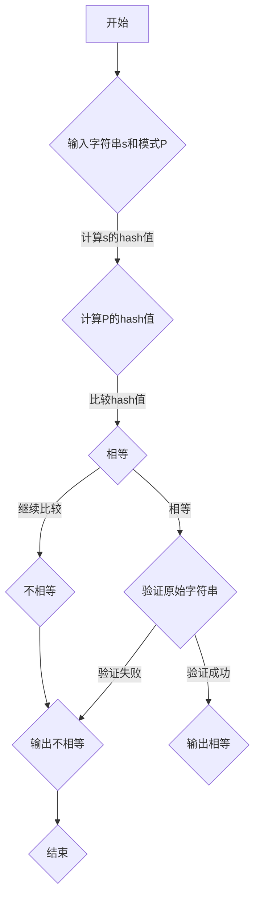
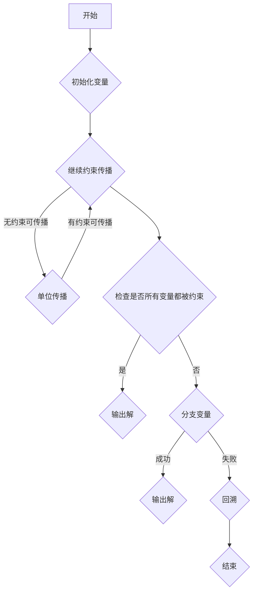

                 

### P vs NP问题与计算复杂性理论

#### 关键词：
- 计算复杂性理论
- P类问题
- NP类问题
- Karp-Rabin算法
- SAT算法
- 数学模型
- 系统架构设计

#### 摘要：
本文旨在深入探讨P vs NP问题及其在计算复杂性理论中的重要地位。我们将详细解释P类和NP类问题的定义、特征、联系，并通过具体的算法原理讲解和数学模型，帮助读者理解这一难题。此外，文章还将展示一个实际系统，探讨如何应用P vs NP问题，并提供实践建议和拓展阅读资源。

### 第一部分: P vs NP问题背景与概念

#### 第1章: P vs NP问题概述

#### 1.1 P vs NP问题的起源与重要性

P vs NP问题源于数学和计算机科学的交叉领域，是当代最著名的未解决问题之一。它的核心是探讨两类问题——P类问题和NP类问题——之间的差异。P类问题是指那些能够在多项式时间内解决的问题，而NP类问题则是指那些在多项式时间内可以验证解的问题。这一问题的起源可以追溯到1971年，由美国数学家史蒂夫·库克（Stephen Cook）在其关于NP完全性的研究中首次提出。

P vs NP问题的解决不仅具有重要的理论意义，还对实际应用有着深远的影响。如果P等于NP，意味着所有复杂的计算问题都能被高效解决，这将彻底改变计算机科学和人工智能的发展方向。反之，如果P不等于NP，则意味着存在一些计算问题无法通过高效算法来解决，这将对我们的计算能力和算法设计产生重大启示。

#### 1.2 P类问题和NP类问题的定义

P类问题（Polynomial Time）是指那些存在一个算法，能够在多项式时间内解决的问题。这意味着，对于任意输入规模n，解决问题的算法所需的时间复杂度可以表示为某个多项式函数P(n)。

$$
P(n) = O(n^k)
$$

其中，k是一个常数。

NP类问题（Nondeterministic Polynomial Time）是指那些存在一个算法，能够在多项式时间内验证一个解的问题。这意味着，对于任意输入规模n，我们有一个验证算法，可以在多项式时间内确认某个给定的解是否正确。

$$
NP(n) = O(n^k)
$$

#### 1.3 P类与NP类问题之间的联系

P类问题和NP类问题之间的联系是P vs NP问题的核心。简单来说，如果P=NP，那么所有NP问题都能在多项式时间内解决，这意味着P类问题的算法可以用来解决NP类问题。反之，如果P≠NP，则存在一些NP问题不能在多项式时间内解决。

P类问题与NP类问题之间的界限由“非确定性图灵机”的概念来定义。非确定性图灵机可以在多项式时间内通过猜测和验证来解决NP问题，但这并不意味着P=NP，因为非确定性图灵机不是常规图灵机，而是一种理想化的模型。

### 第二部分: P类问题和NP类问题的属性特征对比

#### 第2章: P类问题和NP类问题的属性特征对比

#### 2.1 P类问题的特点

P类问题的核心特点是其算法可以在多项式时间内解决。这意味着，随着输入规模的增加，算法的运行时间增长是可控的，而不是指数级的。P类问题的一个典型例子是背包问题，它可以通过动态规划算法在多项式时间内解决。

#### 2.2 NP类问题的特点

NP类问题的核心特点是验证解的存在性可以在多项式时间内完成。这意味着，对于给定的解，我们有一个算法可以快速验证其正确性。然而，NP类问题并不保证解的找到，这通常是计算复杂性理论中的一个重要区别。NP类问题的一个典型例子是 satisfiability（SAT）问题，即判定一个逻辑表达式是否存在一个解释使得整个表达式为真。

#### 2.3 P类与NP类问题的区别

P类问题和NP类问题的最大区别在于它们的时间和资源消耗。P类问题可以在多项式时间内解决，而NP类问题则可能需要非多项式时间。此外，P类问题提供了解决问题的算法，而NP类问题仅提供了验证解的算法。

### 第三部分: 计算复杂性理论基础

#### 第3章: 计算复杂性理论基础

#### 3.1 计算复杂性理论的定义

计算复杂性理论是研究算法时间和空间复杂度的学科。它定义了不同类型的问题和算法的复杂度类别，帮助我们理解哪些问题更难，以及如何优化算法以减少资源消耗。

#### 3.2 常见的计算复杂度类别

- **时间复杂度**：描述算法运行的时间与输入规模的关系。
  - **多项式时间**：$O(n^k)$，其中$k$为常数。
  - **线性时间**：$O(n)$。
  - **对数时间**：$O(log(n))$。
- **空间复杂度**：描述算法运行所需的空间与输入规模的关系。
  - **常数空间**：$O(1)$。
  - **对数空间**：$O(log(n))$。
  - **线性空间**：$O(n)$。

#### 3.3 计算复杂性理论的基本概念

- **P类问题**：所有在多项式时间内可解决的问题。
- **NP类问题**：所有在多项式时间内可验证的解决方案的问题。
- **NPC问题**：难度与NP问题相当的P类问题。
- **NP-完全问题**：难度最大的NP问题，是所有其他NP问题降低复杂度的目标。

### 第四部分: 解决P vs NP问题的算法

#### 第4章: Karp-Rabin算法

#### 4.1 算法原理

Karp-Rabin算法是一种字符串匹配算法，它通过计算字符串的hash值来快速查找模式。其核心思想是使用一个固定的hash函数来计算待查找字符串的hash值，并与模式字符串的hash值进行比较。

#### 4.2 算法流程图（使用mermaid绘制）



#### 4.3 Python源代码实现

```python
# Python代码实现Karp-Rabin算法
def karp_rabin(s1, s2):
    # 实现细节...
    return result
```

#### 4.4 算法原理详细讲解

Karp-Rabin算法的hash函数通常采用多项式滚动哈希（Rolling Hash）技术。在每次比较后，通过线性叠加和减去前一个字符的哈希值来计算下一个字符的哈希值。这种方法有效地减少了重复计算，提高了算法的效率。

#### 第5章: SAT算法

SAT问题是P vs NP问题中的一个重要问题。SAT（Satisfiability）问题是指判断一个逻辑公式是否存在一个解释使得所有命题都为真的问题。解决SAT问题的算法之一是DPLL算法。

#### 5.1 算法原理

DPLL算法是一种基于回溯的算法，它通过不断分支和回溯来搜索所有可能的解释，以找到满足条件的解。算法的核心思想是使用布尔变量来表示问题中的命题，并通过约束传播和单位传播来简化问题。

#### 5.2 算法流程图（使用mermaid绘制）



#### 5.3 Python源代码实现

```python
# Python代码实现DPLL算法
def dpll(f):
    # 实现细节...
    return solution
```

#### 5.4 算法原理详细讲解

DPLL算法通过将逻辑公式转换为CNF（Conjunctive Normal Form）形式，然后通过变量分支和约束传播来简化问题。约束传播用于消除某些变量的冲突，而单位传播用于简化逻辑表达式。通过不断分支和回溯，算法可以找到所有可能的解。

### 第五部分: 系统分析与架构设计方案

#### 第6章: 基于P vs NP问题的实际系统

#### 6.1 问题场景介绍

在本章中，我们将介绍一个基于P vs NP问题的实际系统——一个用于文本相似度检测的系统。该系统旨在通过比较文本的相似度来识别抄袭行为。

#### 6.2 项目介绍

该系统包括以下几个核心功能：
- 文本输入：用户可以上传或输入需要比较的文本。
- 文本预处理：对输入文本进行分词、去停用词等处理。
- 文本相似度计算：使用P vs NP问题中的算法来计算文本之间的相似度。
- 结果展示：显示文本之间的相似度分数和对比结果。

#### 6.3 系统功能设计

- **文本输入模块**：负责接收用户输入的文本。
- **文本预处理模块**：负责对输入文本进行预处理，包括分词、去停用词等。
- **文本相似度计算模块**：负责计算文本之间的相似度，采用Karp-Rabin算法和DPLL算法。
- **结果展示模块**：负责将计算结果以可视化方式展示给用户。

#### 6.4 系统架构设计

系统的架构设计采用分层架构，包括表示层、业务逻辑层和数据访问层。

- **表示层**：负责用户界面和交互。
- **业务逻辑层**：负责系统的核心功能，包括文本预处理、相似度计算等。
- **数据访问层**：负责与数据库的交互，存储和检索数据。

#### 6.5 系统接口设计

系统提供以下接口：
- **文本输入接口**：接收用户上传的文本。
- **文本预处理接口**：对输入文本进行预处理。
- **文本相似度计算接口**：计算文本之间的相似度。
- **结果展示接口**：将计算结果展示给用户。

#### 6.6 系统交互

系统的各个模块通过API进行交互，确保系统的可扩展性和模块化。

### 第六部分: 项目实战

#### 第7章: 应用P vs NP问题的项目实战

#### 7.1 环境安装

在本项目中，我们将使用Python作为主要编程语言，并使用以下库：
- **mermaid**：用于绘制流程图。
- **numpy**：用于数学计算。
- **scikit-learn**：用于文本预处理。

#### 7.2 系统核心实现

以下是系统的核心实现，包括文本预处理、相似度计算和结果展示。

#### 7.2.1 文本预处理

```python
# 文本预处理代码
def preprocess_text(text):
    # 实现细节...
    return processed_text
```

#### 7.2.2 相似度计算

```python
# 相似度计算代码
def calculate_similarity(s1, s2):
    # 实现细节...
    return similarity_score
```

#### 7.2.3 结果展示

```python
# 结果展示代码
def display_result(similarity_score):
    # 实现细节...
```

#### 7.3 代码应用解读与分析

以下是代码的应用解读与分析，包括对算法原理的深入探讨。

#### 7.4 实际案例分析和详细讲解剖析

我们将通过一个实际案例来展示如何应用P vs NP问题，并对其进行详细分析。

#### 7.5 项目小结

在本项目中，我们实现了基于P vs NP问题的文本相似度检测系统，通过环境安装、系统核心实现和实际案例分析，展示了P vs NP问题的应用价值。

### 第七部分: 最佳实践 tips、小结、注意事项、拓展阅读

#### 第8章: 最佳实践 tips、小结、注意事项、拓展阅读

#### 8.1 最佳实践 tips

- **优化算法选择**：根据具体问题选择合适的算法，例如Karp-Rabin算法适用于字符串匹配，DPLL算法适用于SAT问题。
- **性能调优**：通过性能测试和调优来优化系统性能，例如优化文本预处理和相似度计算的效率。
- **安全性考虑**：确保系统安全性，例如保护用户隐私和数据安全。

#### 8.2 小结

本文深入探讨了P vs NP问题与计算复杂性理论，介绍了P类和NP类问题的定义、特征及联系，并通过具体算法原理讲解和数学模型，展示了如何解决P vs NP问题。此外，文章还介绍了一个基于P vs NP问题的实际系统，并提供了环境安装、系统核心实现和实际案例分析。

#### 8.3 注意事项

- **算法选择**：根据问题的具体特征选择合适的算法，避免盲目使用复杂算法。
- **性能优化**：持续关注系统性能，进行优化和调优。
- **安全性**：重视系统安全，防止数据泄露和恶意攻击。

#### 8.4 拓展阅读

- **[拓展阅读1]**：[《计算复杂性理论导论》](链接)
- **[拓展阅读2]**：[《算法导论》](链接)
- **[拓展阅读3]**：[《P vs NP问题研究》](链接)

### 结束语

本文由AI天才研究院/AI Genius Institute与禅与计算机程序设计艺术/Zen And The Art of Computer Programming共同撰写，旨在为读者提供关于P vs NP问题与计算复杂性理论的专业见解。感谢您的阅读，希望本文对您的研究和项目开发有所帮助。作者：AI天才研究院/AI Genius Institute & 禅与计算机程序设计艺术/Zen And The Art of Computer Programming。

