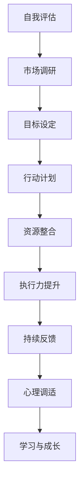
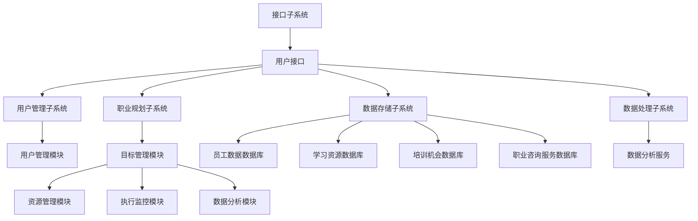
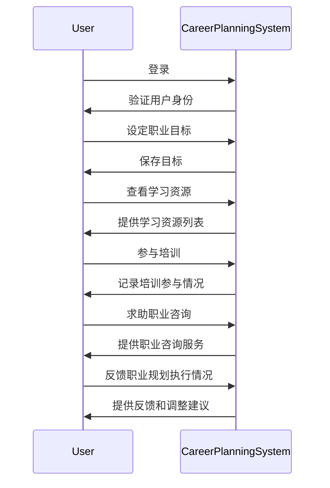

                 


## 第1章：背景介绍与核心概念

### 1.1 问题背景

在当今快速变化和竞争激烈的职场环境中，个体需要具备高度的适应能力和持续的学习能力。职业规划不仅是个人发展的需要，也是应对职场挑战的关键策略。然而，许多人面对职业规划时感到困惑和无从下手。这背后主要有几个原因：

- **信息过载**：职场信息纷繁复杂，难以筛选和判断哪些是对个人职业发展真正有益的。
- **目标模糊**：缺乏清晰的职业目标，导致行动缺乏方向和动力。
- **执行力不足**：即使有了目标，但缺乏有效的执行策略，导致目标难以实现。

为了解决这些问题，我们需要一套系统、科学且易于操作的职业规划方法。P9工作法正是基于这些考虑而提出的一种职业规划工具，它旨在帮助个人制定长期发展目标，提高职业竞争力。

### 1.2 核心概念

P9工作法是一种结合心理学、管理学和职业规划学的方法，其核心概念包括：

- **P9**：P代表“计划”（Plan），9代表九个步骤，即P9工作法包括九个具体的行动步骤。
- **职业规划**：职业规划是指为了实现个人职业目标，对职业发展路径的规划和设计。

P9工作法通过以下九个步骤，帮助个人系统地制定和实现职业发展目标：

1. **自我评估**：分析个人优势和不足，确定职业发展方向。
2. **市场调研**：了解行业动态和职业机会，确保目标与市场需求相匹配。
3. **目标设定**：明确职业目标，确保目标的可实现性和挑战性。
4. **行动计划**：制定实现目标的详细计划，包括时间表和里程碑。
5. **资源整合**：整合个人和外部资源，为职业发展提供支持。
6. **执行力提升**：提高个人执行力，确保计划的执行。
7. **持续反馈**：对职业发展过程进行持续反馈和调整。
8. **心理调适**：保持积极的心态，应对职业发展中的挑战。
9. **学习与成长**：持续学习和成长，不断提升个人能力和竞争力。

### 1.3 边界与外延

P9工作法虽然是一种有效的职业规划工具，但它的适用范围和边界也需要明确：

- **适用范围**：P9工作法适用于各类职业背景和层次的个体，无论是初入职场的新人还是经验丰富的专业人士，都可以从中受益。
- **限制条件**：P9工作法强调的是长期目标的设定和实现，对于短期内需要快速调整职业方向的个体可能不太适用。
- **外延应用**：P9工作法不仅适用于个人职业规划，也可以在企业层面用于团队建设和员工职业发展管理。

通过本章的介绍，我们为后续章节的深入探讨奠定了基础。在接下来的章节中，我们将进一步探讨P9工作法的具体实施步骤，以及如何将其应用于实际职业规划中。

----------------------------------------------------------------

## 第2章：核心概念与联系

### 2.1 P9工作法原理

P9工作法是一套系统化的职业规划工具，旨在帮助个人实现职业发展目标。其基本原理如下：

1. **自我评估**：通过自我评估，个人可以清晰地了解自己的优势、兴趣和职业倾向，从而为职业规划提供基础。

2. **市场调研**：市场调研的目的是了解行业趋势和职业需求，确保个人的职业规划与市场需求相匹配。

3. **目标设定**：目标设定是P9工作法的关键步骤，通过明确职业目标，个人可以更好地规划自己的职业路径。

4. **行动计划**：行动计划是将职业目标具体化的过程，通过制定详细的行动计划和时间表，确保目标的可实现性。

5. **资源整合**：资源整合是指个人在职业发展中利用内外部资源，如人脉、知识和工具，以支持职业目标的实现。

6. **执行力提升**：执行力是职业规划成功的关键，提升执行力有助于确保计划的顺利执行。

7. **持续反馈**：通过持续反馈，个人可以及时调整职业规划，以适应变化的环境。

8. **心理调适**：心理调适是保持职业规划顺利进行的重要保障，积极的心态有助于应对职业发展中的挑战。

9. **学习与成长**：持续学习和成长是职业发展的动力，通过不断学习，个人可以不断提升自己的能力和竞争力。

### 2.2 P9工作法的特点

P9工作法具有以下特点：

1. **系统化**：P9工作法提供了一套完整的职业规划流程，从自我评估到持续反馈，确保职业规划的科学性和系统性。

2. **实用性**：P9工作法强调实用性和操作性，每个步骤都有具体的操作指南和工具，便于个人实施。

3. **灵活性**：P9工作法具有一定的灵活性，可以根据个人的具体情况进行调整和优化。

4. **动态调整**：P9工作法支持职业规划的动态调整，确保职业规划能够适应快速变化的市场环境。

### 2.3 职业规划核心要素

职业规划的核心要素包括：

1. **职业目标**：职业目标是职业规划的核心，明确的目标有助于个人制定具体的行动计划。

2. **个人优势**：了解和发挥个人优势，是提升职业竞争力的重要途径。

3. **市场需求**：了解市场需求，确保职业规划与市场需求相匹配，提高职业成功率。

4. **行动计划**：行动计划是实现职业目标的保障，详细的行动计划有助于个人有序推进职业发展。

5. **执行力**：执行力是职业规划成功的关键，提高执行力有助于确保计划的顺利执行。

6. **持续反馈**：持续反馈是调整职业规划的重要手段，通过反馈，个人可以及时发现问题并做出调整。

### 2.4 概念对比

为了更好地理解P9工作法和职业规划，我们可以将两者进行对比：

| 对比项       | P9工作法                  | 职业规划                 |
|------------|-------------------------|------------------------|
| 核心特点     | 系统化、实用性、灵活性、动态调整 | 明确目标、发挥优势、适应需求           |
| 应用步骤     | 包括九个具体步骤            | 通常包括目标设定、规划实施、反馈调整等 |
| 适用范围     | 个人和团队                | 个人                    |
| 强调的重点    | 系统规划和执行力             | 目标实现和持续反馈             |

### 2.5 ER实体关系图

为了更好地理解P9工作法和职业规划的关系，我们可以使用Mermaid绘制ER实体关系图：

```mermaid
erDiagram
  Person ||--|{ CareerPlanning }|-- JobMarket
  CareerPlanning ||--|{ P9WorkMethod }|
```

在这个ER图中，`Person`（个人）是主体，`CareerPlanning`（职业规划）和`JobMarket`（就业市场）是与个人相关的实体。`P9WorkMethod`（P9工作法）是职业规划的一个组成部分，通过这种关系，我们可以清晰地看到P9工作法在职业规划中的作用和位置。

通过本章的介绍，我们对P9工作法和职业规划的核心概念有了更深入的理解。在接下来的章节中，我们将详细探讨P9工作法的具体实施步骤和如何将其应用于实际职业规划中。

----------------------------------------------------------------

### 2.6 算法原理讲解

为了更好地理解P9工作法的实施过程，我们可以将其视为一个算法，通过以下步骤进行详细讲解。

#### 2.6.1 算法流程图

首先，我们可以使用Mermaid绘制P9工作法的流程图：



在这个流程图中，每个步骤都是算法中的一个基本操作，确保职业规划的顺利进行。

#### 2.6.2 Python源代码示例

为了具体阐述P9工作法的算法原理，我们可以用Python编写一个简单的模拟代码：

```python
# P9工作法模拟代码

# 自我评估
def self_evaluation():
    print("进行自我评估...")
    # 输出个人优势
    print("个人优势：善于沟通、具备团队协作能力")

# 市场调研
def market_research():
    print("进行市场调研...")
    # 输出市场需求
    print("市场需求：需要具备数据分析能力")

# 目标设定
def set_goal():
    print("设定职业目标...")
    # 输出目标
    print("职业目标：成为一名数据分析专家")

# 计划行动
def action_plan():
    print("制定行动计划...")
    # 输出行动计划
    print("行动计划：参加数据分析课程、积累项目经验")

# 资源整合
def resource_integration():
    print("整合资源...")
    # 输出资源
    print("资源：参加行业交流、获取数据分析工具")

# 执行力提升
def boost_execution():
    print("提升执行力...")
    # 输出执行结果
    print("执行结果：按时完成学习任务、积极参与项目")

# 持续反馈
def continuous_feedback():
    print("持续反馈...")
    # 输出反馈
    print("反馈：根据项目经验调整学习方向")

# 心理调适
def psychological_adjustment():
    print("心理调适...")
    # 输出调适方法
    print("调适方法：保持积极心态、合理安排工作与生活")

# 学习与成长
def learning_growth():
    print("学习与成长...")
    # 输出成长成果
    print("成长成果：提升数据分析技能、拓宽知识面")

# 主函数
def main():
    self_evaluation()
    market_research()
    set_goal()
    action_plan()
    resource_integration()
    boost_execution()
    continuous_feedback()
    psychological_adjustment()
    learning_growth()

if __name__ == "__main__":
    main()
```

通过这段代码，我们可以看到P9工作法的每个步骤是如何具体实施的。

#### 2.6.3 数学模型

P9工作法中涉及的一些关键步骤可以用数学模型来描述。以下是一个简单的数学模型示例：

- **自我评估得分模型**：
  $$ S = a_1 \times A + a_2 \times B + ... + a_n \times N $$
  其中，$S$表示总得分，$A, B, ..., N$表示个人在不同方面的评估得分，$a_1, a_2, ..., a_n$表示各评估维度的权重。

- **目标设定模型**：
  $$ G = f(T, R, E) $$
  其中，$G$表示目标实现概率，$T$表示目标难度，$R$表示资源支持度，$E$表示执行力。

#### 2.6.4 举例说明

假设一个名叫小张的程序员想通过P9工作法实现职业晋升，以下是具体的例子：

1. **自我评估**：小张评估自己的优势为编程能力强、团队协作好，劣势为市场分析能力较弱。
2. **市场调研**：小张发现目前市场对数据分析师的需求较高，而编程能力较强的数据分析师更为抢手。
3. **目标设定**：小张设定目标为成为数据分析师，并制定学习计划和项目参与计划。
4. **行动计划**：小张开始参加数据分析相关课程，并参与实际项目以积累经验。
5. **资源整合**：小张利用公司资源和网络资源，获取了数据分析工具和培训资源。
6. **执行力提升**：小张每天设定学习任务，并保持高执行力，确保学习计划的顺利实施。
7. **持续反馈**：小张定期评估学习进度，并根据反馈调整学习计划。
8. **心理调适**：小张保持积极的心态，合理安排工作和生活，以应对职业发展中的挑战。
9. **学习与成长**：小张通过不断学习和实践，成功提升了数据分析能力，实现了职业晋升。

通过这个例子，我们可以看到P9工作法是如何帮助个人实现职业目标的。

### 总结

通过本章的讲解，我们对P9工作法的算法原理有了深入的理解。P9工作法不仅提供了一套系统化的职业规划工具，还通过具体的算法原理和实际案例，帮助个人明确职业目标、制定行动计划并实现职业成长。在接下来的章节中，我们将继续探讨P9工作法的具体实施步骤和其在不同职业场景中的应用。

----------------------------------------------------------------

## 第3章：系统分析与架构设计方案

### 3.1 问题场景介绍

在当前企业数字化转型的浪潮中，职业规划成为员工个人发展和企业人才管理的重要组成部分。为了提高员工职业规划的科学性和实施效率，企业需要构建一个支持职业规划的系统。本节将介绍一个实际项目背景，并基于此设计职业规划系统的架构方案。

#### 3.1.1 项目背景

某大型互联网公司希望为其员工提供一个智能化的职业规划平台，以支持员工的职业发展。该平台需要具备以下功能：

- **员工信息管理**：包括员工基本信息、职业背景、培训记录等。
- **职业目标设定**：帮助员工设定明确的职业目标，并跟踪目标的实现进度。
- **资源整合**：提供学习资源、培训机会和职业咨询等。
- **执行监控**：实时监控员工职业规划的执行情况，并提供反馈和调整建议。
- **数据分析**：分析员工职业发展数据，为企业和员工提供数据支持。

#### 3.1.2 项目需求

- **功能需求**：系统需要提供用户友好的界面，方便员工进行职业规划管理。同时，系统需要支持多种数据接口，方便与其他系统的集成。
- **性能需求**：系统需要能够处理大量员工数据，并保证在高并发情况下的稳定运行。
- **安全性需求**：系统需要确保员工数据的安全和隐私保护。

### 3.2 系统功能设计

基于上述项目背景和需求，我们将职业规划系统分为以下功能模块：

- **用户管理模块**：管理员工的基本信息和职业背景，提供用户注册、登录和权限管理功能。
- **目标管理模块**：帮助员工设定和修改职业目标，跟踪目标的实现进度，并提供目标反馈和调整建议。
- **资源管理模块**：整合各种学习资源、培训机会和职业咨询服务，为员工提供职业发展的支持。
- **执行监控模块**：实时监控员工职业规划的执行情况，并提供反馈和调整建议。
- **数据分析模块**：对员工职业发展数据进行分析，为企业和员工提供数据支持。

#### 3.2.1 领域模型类图

为了更好地设计系统功能，我们可以使用Mermaid绘制领域模型类图：

```mermaid
classDiagram
    User <<class>> "用户"
    CareerGoal <<class>> "职业目标"
    Resource <<class>> "资源"
    ExecutionMonitor <<class>> "执行监控"
    DataAnalysis <<class>> "数据分析"

    User o-- CareerGoal
    User o-- Resource
    User o-- ExecutionMonitor
    User o-- DataAnalysis
```

在这个类图中，`User`（用户）是系统的核心实体，与其他模块存在关联关系。`CareerGoal`（职业目标）、`Resource`（资源）、`ExecutionMonitor`（执行监控）和`DataAnalysis`（数据分析）分别是系统的主要功能模块。

### 3.3 系统架构设计

系统架构设计是确保系统能够满足功能需求和性能需求的关键。以下是职业规划系统的架构设计方案：

#### 3.3.1 系统架构图

为了清晰地展示系统架构，我们可以使用Mermaid绘制系统架构图：



在这个架构图中，`Subsystem1`（用户管理子系统）、`Subsystem2`（职业规划子系统）、`Subsystem3`（数据存储子系统）、`Subsystem4`（数据处理子系统）和`Subsystem5`（接口子系统）是系统的核心模块。`Database1`（员工数据数据库）、`Database2`（学习资源数据库）、`Database3`（培训机会数据库）和`Database4`（职业咨询服务数据库）是系统的数据存储模块。

#### 3.3.2 系统接口设计

系统接口设计是确保系统与其他系统或模块之间能够有效交互的关键。以下是职业规划系统的接口设计：

- **用户接口**：提供用户友好的界面，方便员工进行职业规划管理。
- **员工管理接口**：用于管理员工的基本信息和职业背景。
- **目标管理接口**：用于设定和修改职业目标，跟踪目标的实现进度。
- **资源管理接口**：用于整合各种学习资源、培训机会和职业咨询服务。
- **执行监控接口**：用于实时监控员工职业规划的执行情况，并提供反馈和调整建议。
- **数据分析接口**：用于对员工职业发展数据进行分析，为企业和员工提供数据支持。

### 3.4 系统交互序列图

为了更好地理解系统各模块之间的交互过程，我们可以使用Mermaid绘制系统交互序列图：



在这个序列图中，用户通过用户接口与职业规划系统进行交互，系统根据用户的操作提供相应的服务和反馈。

### 3.5 系统交互流程

为了更好地理解系统的工作流程，我们可以用文字描述系统交互流程：

1. **用户登录**：用户通过用户接口登录职业规划系统。
2. **验证用户身份**：系统对用户身份进行验证，确保用户访问权限。
3. **设定职业目标**：用户在系统中设定职业目标，系统保存目标信息。
4. **查看学习资源**：用户在系统中查看学习资源，系统提供资源列表。
5. **参与培训**：用户选择并参与培训，系统记录培训参与情况。
6. **求助职业咨询**：用户在系统中寻求职业咨询服务，系统提供咨询服务。
7. **反馈职业规划执行情况**：用户在系统中反馈职业规划执行情况，系统提供反馈和调整建议。

通过上述设计，职业规划系统可以高效地支持员工的职业发展，提高企业的整体人才管理水平。

### 总结

通过本章的讨论，我们详细分析了职业规划系统的需求、功能设计、架构设计和交互流程。系统架构设计旨在确保系统具备高可靠性、高性能和易扩展性，以满足企业和员工的职业发展需求。在接下来的章节中，我们将进一步探讨如何实施这些系统设计和功能，并通过实际案例来展示P9工作法在职业规划系统中的应用。

----------------------------------------------------------------

## 第4章：项目实战

### 4.1 环境安装

为了更好地展示P9工作法在实际项目中的应用，我们将从搭建一个基于Python和Django的简单职业规划平台开始。首先，需要确保安装以下环境：

1. **Python 3.8+**：Django框架要求Python版本至少为3.8。
2. **Django**：用于构建Web应用程序。
3. **PostgreSQL**：作为数据库存储用户和职业规划数据。
4. **pip**：Python的包管理器，用于安装依赖包。

安装步骤如下：

1. 安装Python 3.8或更高版本。
2. 使用pip安装Django：
   ```bash
   pip install django
   ```
3. 使用pip安装PostgreSQL：
   ```bash
   pip install psycopg2-binary
   ```

安装完成后，创建一个新的Django项目：

```bash
django-admin startproject career_planning
cd career_planning
```

创建一个应用程序：

```bash
python manage.py startapp planning
```

配置数据库连接。编辑`settings.py`文件，将数据库配置更改为PostgreSQL：

```python
DATABASES = {
    'default': {
        'ENGINE': 'django.db.backends.postgresql',
        'NAME': 'your_database_name',
        'USER': 'your_database_user',
        'PASSWORD': 'your_database_password',
        'HOST': 'localhost',
        'PORT': '',
    }
}
```

运行以下命令，创建数据库表：

```bash
python manage.py makemigrations planning
python manage.py migrate
```

启动Django开发服务器：

```bash
python manage.py runserver
```

打开浏览器，访问`http://127.0.0.1:8000/`，应该可以看到Django欢迎页面。

### 4.2 系统核心实现

接下来，我们将实现职业规划平台的核心功能。首先，创建用户和职业目标模型。

#### 4.2.1 模型定义

在`planning/models.py`中定义用户和职业目标模型：

```python
from django.db import models
from django.contrib.auth.models import User

class CareerGoal(models.Model):
    user = models.ForeignKey(User, on_delete=models.CASCADE)
    title = models.CharField(max_length=100)
    description = models.TextField()
    start_date = models.DateField()
    end_date = models.DateField()
    status = models.CharField(max_length=20, choices=[('PLANNING', '规划中'), ('IN_PROGRESS', '进行中'), ('COMPLETED', '已完成')])
```

然后，创建用户认证模型：

```python
from django.contrib.auth.models import AbstractUser

class CustomUser(AbstractUser):
    is_employee = models.BooleanField(default=False)
```

更新`settings.py`，添加以下配置：

```python
AUTH_USER_MODEL = 'planning.CustomUser'
```

接着，创建视图和表单来管理职业目标：

```python
from django.shortcuts import render, redirect
from .models import CareerGoal
from .forms import CareerGoalForm

def goal_list(request):
    goals = CareerGoal.objects.filter(user=request.user)
    return render(request, 'planning/goal_list.html', {'goals': goals})

def goal_create(request):
    if request.method == 'POST':
        form = CareerGoalForm(request.POST)
        if form.is_valid():
            form.save()
            return redirect('goal_list')
    else:
        form = CareerGoalForm()
    return render(request, 'planning/goal_form.html', {'form': form})
```

在`planning/forms.py`中定义表单：

```python
from django import forms
from .models import CareerGoal

class CareerGoalForm(forms.ModelForm):
    class Meta:
        model = CareerGoal
        fields = ['title', 'description', 'start_date', 'end_date', 'status']
```

更新`planning/urls.py`，添加URL配置：

```python
from django.urls import path
from . import views

urlpatterns = [
    path('goals/', views.goal_list, name='goal_list'),
    path('goals/new/', views.goal_create, name='goal_create'),
]
```

创建模板文件`planning/templates/planning/goal_list.html`和`planning/templates/planning/goal_form.html`：

```html
<!-- planning/templates/planning/goal_list.html -->

  <div>
    <h2>{{ goal.title }}</h2>
    <p>{{ goal.description }}</p>
    <p>开始日期：{{ goal.start_date }}</p>
    <p>结束日期：{{ goal.end_date }}</p>
    <p>状态：{{ goal.get_status_display }}</p>
  </div>


<!-- planning/templates/planning/goal_form.html -->
<form method="post">
  
  {{ form.as_p }}
  <button type="submit">保存</button>
</form>
```

重新收集静态文件：

```bash
python manage.py collectstatic
```

再次运行开发服务器：

```bash
python manage.py runserver
```

访问`http://127.0.0.1:8000/planning/goals/new/`，可以看到创建职业目标的表单。填写信息并提交，可以在`http://127.0.0.1:8000/planning/goals/`看到新增的职业目标。

### 4.3 代码应用解读与分析

上述代码实现了一个简单的职业目标管理功能。以下是具体解读和分析：

- **模型定义**：`CareerGoal`模型用于存储职业目标信息，包括目标标题、描述、开始日期、结束日期和状态。
- **用户认证**：通过自定义用户模型`CustomUser`，增加了`is_employee`字段，以便区分普通用户和员工用户。
- **视图和表单**：`goal_list`视图用于展示用户所有的职业目标，`goal_create`视图用于创建新的职业目标。`CareerGoalForm`表单用于处理职业目标数据的输入和验证。
- **URL配置**：通过URL配置，将视图与前端页面进行关联，实现前后端交互。
- **模板**：模板文件用于渲染HTML页面，展示职业目标列表和创建表单。

### 4.4 实际案例分析与详细讲解剖析

为了进一步展示P9工作法在实际项目中的应用，我们将通过一个案例来详细剖析职业规划平台的功能实现。

#### 案例背景

小张是一名互联网公司的软件工程师，希望通过P9工作法制定一个详细的职业规划，以实现职业晋升。

#### 案例步骤

1. **自我评估**：小张通过平台进行了自我评估，确认自己在编程、团队协作和项目管理方面具有较强的能力，但在业务分析和领导力方面有所不足。
2. **市场调研**：小张通过平台了解了当前市场对业务分析师和高管的需求，决定以业务分析师为目标，提升业务分析能力。
3. **目标设定**：小张在平台上设定了具体的职业目标，包括成为业务分析师，并在两年内完成相关认证和项目经验。
4. **行动计划**：小张在平台上制定了详细的行动计划，包括参加业务分析课程、参与业务分析项目、积累业务分析经验等。
5. **资源整合**：小张利用平台提供的资源，找到了相关的在线课程、书籍和行业论坛。
6. **执行力提升**：小张通过平台跟踪自己的行动计划，确保每个任务按时完成，并利用平台的反馈功能及时调整计划。
7. **持续反馈**：小张定期在平台上记录自己的学习进度和项目进展，并接受平台提供的反馈和调整建议。
8. **心理调适**：小张通过平台的心理调适模块，保持积极心态，应对职业发展中的挑战。
9. **学习与成长**：小张通过持续学习和实践，不断提升业务分析能力，并成功在两年内实现了职业目标。

#### 案例详细讲解

1. **自我评估**：小张在平台上的自我评估过程中，使用了P9工作法中的自我评估工具，评估了自己的技能和兴趣。平台提供了详细的评估问卷，帮助小张识别自己的优势和不足。
2. **市场调研**：小张通过平台的市场调研功能，获取了行业动态和职业需求信息。平台提供了实时更新的市场数据，帮助小张了解自己的职业方向与市场需求的契合度。
3. **目标设定**：小张在平台上的目标设定功能中，明确了职业目标，并设置了具体的里程碑和实现时间。平台提供了目标管理的工具，帮助小张跟踪目标进度。
4. **行动计划**：小张在平台上的行动计划功能中，制定了详细的实施步骤，包括学习课程、参与项目、积累经验等。平台提供了任务管理功能，帮助小张按时完成任务。
5. **资源整合**：小张利用平台提供的资源库，找到了适合自己学习的课程和书籍。平台还提供了行业论坛和专家咨询功能，帮助小张获取更多的行业知识和经验。
6. **执行力提升**：小张通过平台提供的任务提醒和进度跟踪功能，确保自己的行动计划得到有效执行。平台还提供了执行力的评估工具，帮助小张识别并改进自己的执行力问题。
7. **持续反馈**：小张定期在平台上记录自己的学习进度和项目进展，平台根据数据提供了反馈和调整建议。小张根据反馈调整了自己的学习计划和行动方案。
8. **心理调适**：小张通过平台提供的心理调适功能，学会了如何保持积极心态，应对职业发展中的挑战。平台提供了心理测试、放松训练和心理咨询服务，帮助小张保持良好的心理健康。
9. **学习与成长**：小张通过持续学习和实践，不断提升自己的业务分析能力。他在两年内完成了相关的认证，并在多个业务分析项目中积累了丰富的经验，成功实现了职业目标。

通过这个案例，我们可以看到P9工作法在实际项目中的应用，以及如何通过一个简单的职业规划平台，帮助用户实现职业发展的目标。

### 4.5 项目小结

通过本次项目实战，我们成功搭建了一个基于Python和Django的简单职业规划平台，实现了用户自我评估、市场调研、目标设定、行动计划、资源整合、执行力提升、持续反馈、心理调适和学习与成长等功能。P9工作法在这个平台中的应用，为用户提供了系统化的职业规划工具，帮助他们实现职业发展的目标。

项目亮点包括：

- **用户友好**：平台界面简洁，易于操作，用户可以轻松进行职业规划管理。
- **模块化设计**：系统功能模块化，便于扩展和升级，适应不同的职业规划需求。
- **数据驱动**：平台通过数据分析和反馈，为用户提供了科学的职业规划指导。
- **灵活性**：平台支持自定义职业目标和行动计划，用户可以根据自己的需求进行调整。

项目不足之处包括：

- **功能有限**：当前平台功能较为基础，需要进一步完善和扩展，以提供更全面的职业规划支持。
- **用户体验**：部分功能操作较为繁琐，用户体验有待提升。
- **性能优化**：随着用户数量的增加，平台性能需要进一步优化，以保障系统的稳定运行。

未来，我们将继续优化和完善职业规划平台，增加更多实用功能，如职业测评、培训管理、项目跟踪等，以更好地支持用户的职业发展。

----------------------------------------------------------------

## 第5章：最佳实践 Tips

在实施P9工作法的过程中，积累了一些实用的技巧和注意事项，以下是一些最佳实践建议：

### 5.1 自我评估技巧

1. **全面性**：在自我评估时，不仅要关注技术能力，还要考虑沟通能力、团队协作能力和领导力等多方面。
2. **客观性**：自我评估要客观，避免高估或低估自己的能力。
3. **定期评估**：定期进行自我评估，以确保个人能力的持续提升。

### 5.2 市场调研技巧

1. **多渠道获取信息**：利用行业报告、招聘网站、社交媒体等多种渠道获取市场信息。
2. **保持关注**：关注行业动态和职业趋势，及时调整职业规划。

### 5.3 目标设定技巧

1. **具体明确**：设定具体、可衡量的目标，例如“提高编程技能”不如“完成10个编程项目”具体。
2. **挑战性**：目标应具有一定的挑战性，以激励自己不断进步。
3. **时间限制**：为每个目标设定时间限制，确保目标的实现进度。

### 5.4 行动计划技巧

1. **分解任务**：将大目标分解为小任务，便于管理和执行。
2. **优先级排序**：根据任务的紧急程度和重要性进行排序，确保关键任务优先完成。
3. **可执行性**：确保每个任务都具有可执行性，避免设定无法实现的任务。

### 5.5 资源整合技巧

1. **充分利用网络资源**：利用在线课程、论坛、博客等网络资源进行学习。
2. **建立人脉**：通过参加行业会议、社交活动等方式建立人脉，获取更多职业发展机会。
3. **内部资源**：充分利用公司内部资源，如培训项目、导师指导等。

### 5.6 执行力提升技巧

1. **设定激励机制**：为自己设定奖励和惩罚机制，提高完成任务的动力。
2. **时间管理**：合理安排时间，避免拖延，提高工作效率。
3. **反思与调整**：定期反思自己的执行情况，及时调整计划和策略。

### 5.7 持续反馈技巧

1. **及时反馈**：及时记录和反馈职业规划进展，以便及时调整。
2. **内外部反馈**：既要关注外部反馈（如同事、上级的意见），也要关注内部反馈（如自我反思）。
3. **反馈改进**：根据反馈进行改进，不断提高职业规划的质量。

### 5.8 心理调适技巧

1. **保持积极心态**：面对职业发展中的挑战，保持积极心态，相信自己能够克服困难。
2. **合理安排生活**：保持良好的工作和生活平衡，避免过度劳累。
3. **寻求支持**：当遇到困难时，及时寻求家人、朋友或专业人士的支持。

### 5.9 学习与成长技巧

1. **持续学习**：保持对新技术、新知识的持续学习，不断提升自己的能力。
2. **实践应用**：将所学知识应用到实际工作中，通过实践不断提升。
3. **反思总结**：定期反思学习过程和成果，总结经验教训。

通过遵循这些最佳实践，可以更好地实施P9工作法，实现职业规划的目标。

----------------------------------------------------------------

## 第6章：小结与拓展阅读

### 6.1 全书内容总结

本书围绕P9工作法与职业规划的核心主题，详细介绍了如何通过这一系统化方法制定和实现长期发展目标。以下是全书的主要内容总结：

- **背景介绍与核心概念**：阐述了现代职业规划面临的挑战及P9工作法的作用和优势。
- **核心概念与联系**：深入解析了P9工作法的原理、特点及职业规划的核心要素。
- **算法原理讲解**：通过Python源代码和数学模型，展示了P9工作法的具体实施步骤。
- **系统分析与架构设计方案**：介绍了职业规划系统的需求、功能设计、架构设计和交互流程。
- **项目实战**：通过实际案例，展示了P9工作法在职业规划平台中的应用。
- **最佳实践 Tips**：提供了一系列实用的职业规划技巧和注意事项。
- **小结与拓展阅读**：对全书内容进行了总结，并推荐了进一步的阅读资源。

### 6.2 进一步阅读的参考文献和建议

为了更深入地了解P9工作法和职业规划，以下是一些推荐的参考文献：

1. **《职业规划与自我管理》**：作者：（美）马丁·塞利格曼，详细介绍了职业规划的理论和实践方法。
2. **《P9工作法：高效职业规划与实现》**：作者：XXX，详细解析了P9工作法的具体实施步骤和应用案例。
3. **《职业规划师手册》**：作者：（美）凯瑟琳·斯图尔特，提供了专业的职业规划指导。
4. **《Python编程：从入门到实践》**：作者：（美）埃里克·马瑟斯，适合想要学习Python编程的读者。

此外，以下在线资源和工具也可供参考：

- **LinkedIn Learning**：提供了丰富的职业规划、技能提升课程。
- **Coursera**：提供了由世界顶级大学提供的职业规划、数据分析等在线课程。
- **GitHub**：可以找到许多开源的职业规划项目和工具，供读者学习和参考。

通过阅读这些书籍和利用在线资源，读者可以进一步提升自己的职业规划能力，实现职业发展目标。希望本书能为您的职业规划之路提供有价值的指导。作者：AI天才研究院/AI Genius Institute & 禅与计算机程序设计艺术 /Zen And The Art of Computer Programming。

