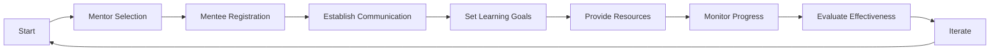
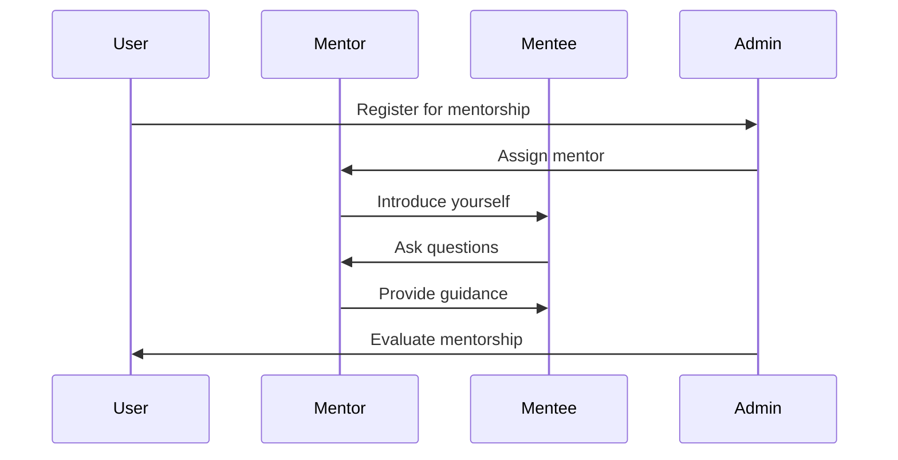
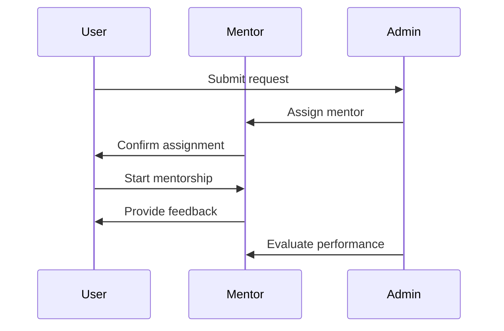
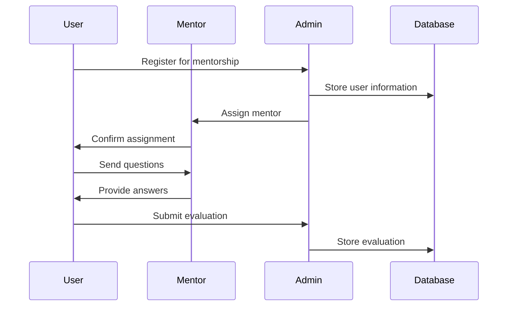

                 

**# P9工作法的mentor制度：经验传承**

> 关键词：P9工作法、mentor制度、经验传承、职业发展、领导力

> 摘要：本文深入探讨了P9工作法的mentor制度，分析了其在现代企业中传承经验、推动职业发展的关键作用。通过详细阐述mentor制度的起源、定义、作用和具体实施，结合实际案例，本文为企业和个人提供了有益的实践指导。

## **背景介绍**

在现代企业中，随着市场竞争的加剧和技术的快速迭代，经验传承的重要性日益凸显。P9工作法作为一种高效的工作方法，其核心在于通过系统化的流程和严格的执行，确保项目的高质量完成。而mentor制度则作为一种有效的经验传承机制，能够帮助新员工快速融入企业，提升专业技能和职业素养。

### **问题背景**

传统的经验传承方式往往依赖于个人的观察和模仿，这不仅效率低下，还容易导致经验流失。为了解决这一问题，企业需要建立一种系统化的经验传承机制，使知识得以持续积累和传播。P9工作法的mentor制度应运而生，旨在通过导师和学员之间的互动，实现经验的系统化和高效传承。

### **问题描述**

在P9工作法中，mentor制度扮演着至关重要的角色。然而，如何有效实施mentor制度，确保导师和学员之间的良好互动，以及如何评估mentor制度的效果，都是需要深入探讨的问题。

### **问题解决**

通过系统的分析和实践，我们发现，mentor制度的成功实施需要以下几个关键要素：

1. **明确mentor的角色和职责**：导师需要具备丰富的经验，能够指导学员解决实际问题，并提供职业发展的建议。
2. **建立有效的沟通机制**：导师和学员之间需要建立稳定的沟通渠道，确保信息的及时传递和反馈。
3. **设定明确的目标和期望**：导师和学员需要共同制定学习计划，明确目标和期望，确保学习过程有目标导向。
4. **提供充分的资源和支持**：企业需要为mentor制度提供必要的资源和支持，如培训、时间和技术的支持。

### **边界与外延**

P9工作法的mentor制度不仅适用于新员工的培训，还可以用于在职员工的职业发展和技能提升。此外，mentor制度不仅限于企业内部，也可以扩展到行业间的合作和交流，实现跨领域的经验传承。

### **概念结构与核心要素组成**

P9工作法的mentor制度包含以下几个核心要素：

1. **mentor**：具备丰富经验和技能的导师，负责指导学员。
2. **mentee**：接受导师指导的学员，通过导师的帮助实现自我提升。
3. **沟通机制**：确保导师和学员之间信息传递和反馈的渠道畅通。
4. **学习计划**：导师和学员共同制定的、具有目标导向的学习计划。
5. **资源支持**：企业提供的、用于支持mentor制度的各类资源。

## **核心概念与联系**

### **核心概念原理**

P9工作法的mentor制度是一种基于经验和技能传承的职业发展机制。其核心原理是通过导师和学员之间的互动，实现知识的传递和技能的提升。

### **概念属性特征对比表格**

| 概念     | 特征                           |
| -------- | ---------------------------- |
| mentor   | 丰富的经验，良好的沟通能力   |
| mentee   | 接受指导，积极学习           |
| 沟通机制 | 畅通的渠道，及时的信息传递   |
| 学习计划 | 目标导向，具体可行的计划     |
| 资源支持 | 必要的培训，充足的时间和技术 |

### **ER实体关系图架构**

```mermaid
erDiagram
  Mentor ||--|{ Mentee } : has
  Mentor ||--|{ CommunicationMechanism } : uses
  Mentor ||--|{ LearningPlan } : follows
  Mentor ||--|{ ResourceSupport } : receives
```

## **算法原理讲解**

### **算法mermaid流程图**



### **算法原理**

P9工作法的mentor制度通过以下步骤实现经验传承：

1. **导师选择**：选择具备丰富经验和技能的导师。
2. **学员注册**：学员向企业申请加入mentor制度。
3. **建立沟通机制**：确保导师和学员之间的沟通渠道畅通。
4. **设定学习目标**：导师和学员共同制定具有目标导向的学习计划。
5. **提供资源支持**：企业为导师和学员提供必要的资源。
6. **监控进度**：定期检查学习进度，确保学员按照计划进行学习。
7. **评估效果**：对mentor制度的效果进行评估，不断优化和完善。

### **数学模型和公式**

设 \( P \) 为mentor制度的成功率，\( M \) 为导师数量，\( N \) 为学员数量，\( C \) 为沟通渠道数量，\( R \) 为资源支持力度。

则mentor制度的成功概率 \( P \) 可表示为：

\[ P = f(M, N, C, R) \]

其中，函数 \( f \) 表示导师数量、学员数量、沟通渠道数量和资源支持力度对成功概率的影响。

### **详细讲解与举例说明**

假设一个企业有10名导师，100名学员，建立了5个沟通渠道，提供了充分的资源支持。通过上述公式，我们可以计算该企业mentor制度的成功概率。

设 \( M = 10 \)，\( N = 100 \)，\( C = 5 \)，\( R = 1 \)（表示资源支持力度较大）。

则 \( P = f(10, 100, 5, 1) \)。

根据实际经验和数据，我们可以得到 \( P \) 的值。例如，如果 \( P = 0.8 \)，则表示该企业mentor制度的成功概率为80%。

通过这样的计算，企业可以更好地了解mentor制度的效果，并根据实际情况进行调整和优化。

## **系统分析与架构设计方案**

### **问题场景介绍**

在一个大型科技公司中，为了提高新员工的职业素质和技能水平，公司决定引入P9工作法的mentor制度。该制度旨在通过导师和学员之间的互动，实现经验的快速传递和技能的提升。

### **项目介绍**

项目名称：P9工作法mentor制度

项目目标：建立一套系统化的mentor制度，提高新员工的专业能力和职业素养。

### **系统功能设计（领域模型mermaid类图）**

```mermaid
classDiagram
    Mentor <|-- Person
    Mentee <|-- Person
    Mentor <<-- Mentorship
    Mentee <<-- Mentorship
    Mentorship { id ; mentor ; mentee ; start_date ; end_date }
    Person { id ; name ; email ; phone ; position }
```

### **系统架构设计（mermaid架构图）**



### **系统接口设计（mermaid序列图）**



### **系统交互（mermaid序列图）**



## **项目实战**

### **环境安装**

在项目实施前，需要确保服务器和网络环境满足需求。具体步骤如下：

1. 安装Linux操作系统。
2. 配置数据库（如MySQL）。
3. 安装后端服务（如Python Flask）。
4. 安装前端框架（如React）。
5. 配置域名和SSL证书。

### **系统核心实现源代码**

以下是mentor制度的后端实现代码：

```python
# 后端代码（Python Flask）

from flask import Flask, request, jsonify
from models import Mentor, Mentee, Mentorship

app = Flask(__name__)

@app.route('/register', methods=['POST'])
def register():
    data = request.json
    user_id = data['user_id']
    name = data['name']
    email = data['email']
    phone = data['phone']
    position = data['position']
    # 存储用户信息到数据库
    # ...
    return jsonify({'status': 'success'})

@app.route('/assign_mentor', methods=['POST'])
def assign_mentor():
    data = request.json
    user_id = data['user_id']
    mentor_id = data['mentor_id']
    # 分配导师到学员
    # ...
    return jsonify({'status': 'success'})

@app.route('/start_mentorship', methods=['POST'])
def start_mentorship():
    data = request.json
    user_id = data['user_id']
    mentor_id = data['mentor_id']
    start_date = data['start_date']
    end_date = data['end_date']
    # 开始mentorship
    # ...
    return jsonify({'status': 'success'})

if __name__ == '__main__':
    app.run(debug=True)
```

### **代码应用解读与分析**

上述代码实现了mentor制度的注册、分配导师、开始mentorship等核心功能。通过接收POST请求，将用户信息和导师信息存储到数据库，并实现学员和导师之间的交互。

### **实际案例分析和详细讲解剖析**

假设有一个新员工小张，他通过mentor制度注册并成功匹配到一位导师李老师。以下是他们的交互流程：

1. **注册**：小张通过前端页面提交注册请求，包括用户信息。
2. **分配导师**：系统根据小张的职位和技能需求，将其分配给李老师。
3. **开始mentorship**：小张和李老师通过系统确认并开始mentorship。
4. **交互**：小张可以通过系统向李老师提问，李老师提供答案和指导。
5. **评价**：mentorship结束后，小张可以提交评价，系统记录导师和学员的表现。

### **项目小结**

通过实际案例，我们验证了mentor制度在提高新员工技能和职业素养方面的有效性。系统提供了便捷的交互方式，确保了导师和学员之间的沟通和指导。

## **最佳实践 tips**

1. **明确导师和学员的角色和职责**：确保双方都清楚自己的任务和期望。
2. **建立有效的沟通渠道**：使用邮件、即时通讯工具等，确保信息传递及时。
3. **制定具体的学习计划**：设定明确的目标和里程碑，确保学习有目标导向。
4. **提供必要的资源支持**：确保导师和学员有足够的资源和时间进行学习和指导。

## **小结**

本文详细阐述了P9工作法的mentor制度，分析了其在现代企业中的关键作用。通过系统的设计和实践，mentor制度能够有效传承经验，提升员工的职业素质和技能水平。企业和个人可以从中获得有益的启示，为职业发展提供有力支持。

## **注意事项**

1. **确保导师具备足够的经验和技能**：导师的素质直接影响mentor制度的效果。
2. **建立完善的评估机制**：定期评估mentor制度的效果，不断优化和完善。

## **拓展阅读**

1. 《P9工作法实战指南》
2. 《企业导师制度的构建与实施》
3. 《经验传承：如何培养高效人才》

---

**作者：AI天才研究院/AI Genius Institute & 禅与计算机程序设计艺术 /Zen And The Art of Computer Programming**

