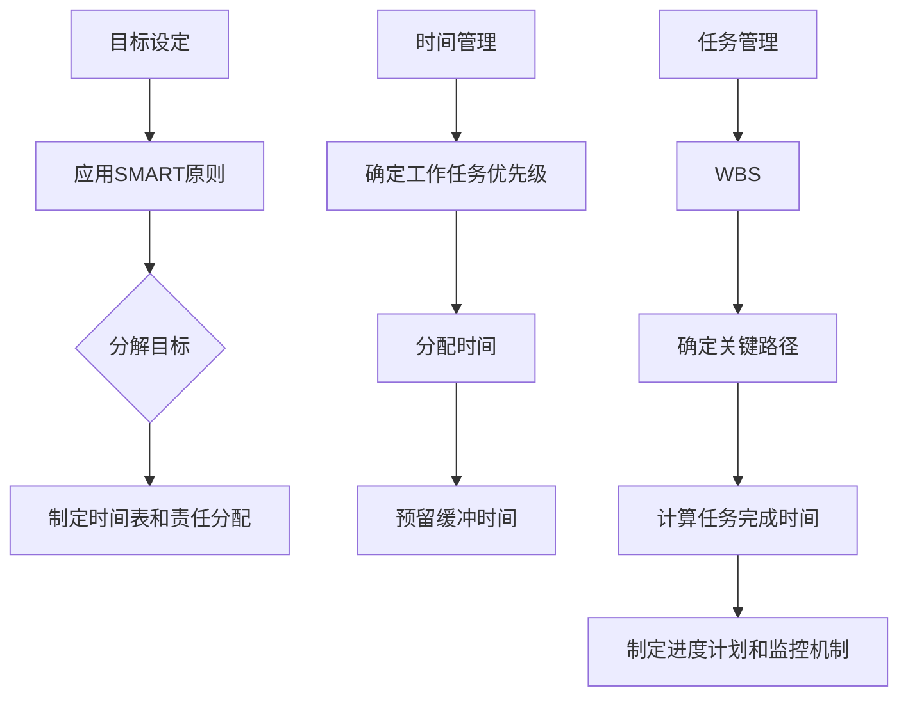

                 

## P9工作法的实施：制定个人发展计划

### 关键词：P9工作法，个人发展计划，时间管理，任务管理，个人效能

### 摘要：

本文将详细介绍P9工作法的实施步骤，特别是如何制定个人发展计划。通过深入探讨P9工作法背后的核心概念、算法原理，以及具体实施方法，帮助读者理解如何将其应用于个人发展中，提高工作效率和个人效能。

## Step 1: 背景介绍

### 第一部分: P9工作法的实施背景

#### 1.1 问题背景

在当今快节奏和高度竞争的工作环境中，个人和组织都面临着巨大的压力和挑战。如何有效地管理和规划工作时间，提高工作效率，成为许多职场人士和组织关注的焦点。

#### 1.2 问题描述

P9工作法是一种旨在帮助个人和组织提高工作效率和生产力，实现工作与生活平衡的方法。它基于对时间管理、任务管理和个人效能的深入研究，提出了一种全新的工作模式。

#### 1.3 问题解决

P9工作法通过制定个人发展计划，帮助个人明确目标，规划时间，优化工作流程，提高工作效率。它不仅适用于职场人士，也适用于学生、自由职业者等多种身份。

#### 1.4 边界与外延

P9工作法适用于各种工作环境和场景，但主要关注的是知识型工作。它强调的是个人效能的提升，而非简单的加班或超负荷工作。

#### 1.5 概念结构与核心要素组成

P9工作法包括以下核心要素：

- **目标设定**：明确个人和组织的目标，确保工作的方向和效率。
- **时间管理**：合理规划工作时间，提高工作效率。
- **任务管理**：合理安排任务，确保工作的高效完成。
- **个人效能**：提升个人能力，实现工作与生活的平衡。

#### 1.6 本章小结

本章介绍了P9工作法的背景、问题描述、问题解决方法、边界与外延以及核心要素组成。接下来的章节将深入探讨P9工作法的具体实施方法。

## Step 2: 核心概念与联系

### 第二部分: P9工作法的核心概念与联系

#### 2.1 P9工作法的核心概念

P9工作法包括以下核心概念：

- **P9工作法**：一种旨在提高工作效率和个人效能的方法。
- **目标设定**：明确个人和组织的目标。
- **时间管理**：合理规划工作时间。
- **任务管理**：合理安排任务。
- **个人效能**：提升个人能力。

#### 2.2 概念属性特征对比表格

| 概念         | 属性特征                                                         |
| ------------ | ------------------------------------------------------------ |
| P9工作法     | 提高工作效率和个人效能，基于目标设定、时间管理和任务管理           |
| 目标设定     | 明确个人和组织的目标，确保工作的方向和效率                     |
| 时间管理     | 合理规划工作时间，提高工作效率                                 |
| 任务管理     | 合理安排任务，确保工作的高效完成                             |
| 个人效能     | 提升个人能力，实现工作与生活的平衡                           |

#### 2.3 ER实体关系图架构

```mermaid
erDiagram
    目标设定 ||--|{ 时间管理 } : 包括
    时间管理 ||--|{ 任务管理 } : 包括
    任务管理 ||--|{ 个人效能 } : 包括
    P9工作法 ||--|{ 所有核心概念 } : 包括
```

## Step 3: 算法原理讲解

### 第三部分: P9工作法的算法原理讲解

#### 3.1 算法原理

P9工作法的算法原理主要包括以下三个方面：

- **目标设定算法**：基于SMART原则（具体、可衡量、可实现、相关、时限），帮助个人和组织设定明确、可操作的目标。
- **时间管理算法**：基于优先级排序和时间分配策略，合理规划工作时间。
- **任务管理算法**：基于工作分解结构（WBS）和关键路径法（CPM），合理安排任务。

#### 3.1.1 目标设定算法

目标设定算法的流程如下：

1. **确定目标类型**：根据需要设定长期、中期或短期目标。
2. **应用SMART原则**：
   - **具体（Specific）**：目标要明确具体，避免模糊。
   - **可衡量（Measurable）**：目标要有量化的指标，便于评估。
   - **可实现（Achievable）**：目标要现实可行，避免不切实际。
   - **相关（Relevant）**：目标要与个人和组织的目标一致。
   - **时限（Time-bound）**：目标要有明确的时间限制。

3. **分解目标**：将大目标分解为具体的任务和里程碑。
4. **制定时间表和责任分配**：为每个任务和里程碑制定时间表，明确责任人。

#### 3.1.2 时间管理算法

时间管理算法的流程如下：

1. **确定工作任务优先级**：根据任务的重要性和紧急性，进行优先级排序。
2. **分配时间**：根据优先级为每个任务分配适当的时间。
3. **预留缓冲时间**：为应对突发事件，预留一定的时间缓冲。

#### 3.1.3 任务管理算法

任务管理算法的流程如下：

1. **使用工作分解结构（WBS）**：将大任务分解为可管理的子任务。
2. **确定关键路径**：识别所有任务中的关键路径，即影响项目完成时间的关键任务序列。
3. **计算任务完成时间**：使用关键路径法（CPM）计算每个任务的完成时间。
4. **制定进度计划和监控机制**：为每个任务制定详细的进度计划，并设置监控机制，确保任务按时完成。

### 3.2 Mermaid流程图



### 3.3 Python源代码示例

```python
import pandas as pd

# 目标设定算法示例
def set_goals(goals):
    for goal in goals:
        goal['specific'] = True if goal['description'] else False
        goal['measurable'] = True if 'metric' in goal else False
        goal['achievable'] = True if goal['deadline'] else False
        goal['relevant'] = True if goal['category'] == 'work' else False
        goal['time-bound'] = True if goal['deadline'] else False
    return goals

# 时间管理算法示例
def time_management(tasks):
    tasks['priority'] = tasks.apply(lambda x: 1 if x['importance'] == 'high' else 2, axis=1)
    tasks['time_allocated'] = tasks.apply(lambda x: x['duration'] if x['priority'] == 1 else 0, axis=1)
    tasks['buffer_time'] = tasks.apply(lambda x: x['duration'] * 0.2 if x['priority'] == 1 else 0, axis=1)
    return tasks

# 任务管理算法示例
def task_management(tasks):
    tasks['key_path'] = tasks.apply(lambda x: x['key_path'] if x['is_key_task'] else False, axis=1)
    tasks['completion_time'] = tasks.apply(lambda x: x['duration'] if x['key_path'] else 0, axis=1)
    tasks['progress_plan'] = tasks.apply(lambda x: x['start_date'] + pd.DateOffset(days=x['duration']), axis=1)
    return tasks

# 示例数据
goals = [
    {'description': '提高工作效率', 'metric': '每天完成任务数', 'deadline': '2024-01-01', 'category': 'work'},
    {'description': '完成项目报告', 'metric': '字数', 'deadline': '2024-02-15', 'category': 'project'}
]

tasks = [
    {'task_id': 1, 'description': '设计产品原型', 'importance': 'high', 'duration': 5, 'start_date': '2023-11-01'},
    {'task_id': 2, 'description': '编写产品文档', 'importance': 'medium', 'duration': 3, 'start_date': '2023-11-05'},
    {'task_id': 3, 'description': '测试产品功能', 'importance': 'low', 'duration': 2, 'start_date': '2023-11-08'}
]

# 执行算法
goals = set_goals(goals)
tasks = time_management(tasks)
tasks = task_management(tasks)

print(goals)
print(tasks)
```

### 3.4 算法原理详细讲解

#### 3.4.1 目标设定算法原理

目标设定算法基于SMART原则，这是一种广泛用于制定明确、可操作目标的方法。SMART原则确保目标具备以下特性：

- **具体（Specific）**：目标要明确、具体，避免模糊不清。
- **可衡量（Measurable）**：目标要有量化的指标，便于评估进展和结果。
- **可实现（Achievable）**：目标要现实可行，避免不切实际。
- **相关（Relevant）**：目标要与个人和组织的目标一致，确保方向正确。
- **时限（Time-bound）**：目标要有明确的时间限制，有助于推动行动和保持责任感。

目标设定算法的数学模型可以表示为：

$$
G = f(S, M, A, R, T)
$$

其中，$G$ 表示目标，$S, M, A, R, T$ 分别表示具体、可衡量、可实现、相关和时限。

#### 3.4.2 时间管理算法原理

时间管理算法的核心在于优先级排序和时间分配策略。优先级排序决定了任务的执行顺序，而时间分配策略则确保每个任务得到足够的时间。

优先级排序可以使用以下公式：

$$
P(i) = w(i) \times (1 - e^{-\alpha \cdot D(i)})
$$

其中，$P(i)$ 表示任务$i$的优先级，$w(i)$ 表示任务$i$的重要性，$D(i)$ 表示任务$i$的截止时间，$\alpha$ 是一个调整参数。

时间分配策略可以使用以下公式：

$$
T(i) = \frac{B}{P(i)}
$$

其中，$T(i)$ 表示分配给任务$i$的时间，$B$ 是总时间预算。

#### 3.4.3 任务管理算法原理

任务管理算法基于工作分解结构（WBS）和关键路径法（CPM）。WBS将大任务分解为更小的子任务，而CPM则用于计算每个任务的完成时间。

工作分解结构（WBS）的数学模型可以表示为：

$$
WBS = \{T_1, T_2, ..., T_n\}
$$

其中，$T_i$ 表示第$i$个任务。

关键路径法（CPM）的数学模型可以表示为：

$$
CPM: T_f = \sum_{i=1}^{n} (T_i + D_i)
$$

其中，$T_f$ 表示总完成时间，$T_i$ 表示第$i$个任务的完成时间，$D_i$ 表示第$i$个任务的持续时间。

### 3.5 算法举例说明

假设我们有一个项目，需要完成以下任务：

1. 设计产品原型（持续时间：5天，重要性：高）
2. 编写产品文档（持续时间：3天，重要性：中）
3. 测试产品功能（持续时间：2天，重要性：低）

根据SMART原则，我们可以设定以下目标：

- 目标1：在2024年1月1日之前提高工作效率，每天完成2个任务。
- 目标2：在2024年2月15日之前完成项目报告，至少包含5000字。

根据时间管理算法，我们可以为每个任务分配以下优先级和时间：

- 任务1（设计产品原型）：优先级高，分配5天时间。
- 任务2（编写产品文档）：优先级中，分配3天时间。
- 任务3（测试产品功能）：优先级低，分配2天时间。

根据任务管理算法，我们可以计算每个任务的完成时间：

- 任务1（设计产品原型）：完成时间为5天。
- 任务2（编写产品文档）：完成时间为3天。
- 任务3（测试产品功能）：完成时间为2天。

总完成时间为10天，关键路径为任务1、任务2和任务3。

## Step 4: 系统分析与架构设计

### 第四部分: P9工作法的系统分析与架构设计

#### 4.1 问题场景介绍

在现代企业中，随着业务的发展和团队规模的扩大，如何高效地管理和协调团队的工作成为了一项重要的挑战。P9工作法作为一种先进的工作模式，可以帮助企业实现这一目标。

#### 4.2 项目介绍

本项目旨在实现一个基于P9工作法的个人发展计划系统。该系统将帮助团队成员明确目标、规划时间、管理任务，并提高个人效能。

#### 4.3 系统功能设计

系统的主要功能包括：

- **目标管理**：支持用户设定、编辑和查看个人目标。
- **时间管理**：支持用户规划时间，并提醒重要任务的截止日期。
- **任务管理**：支持用户创建、分配和跟踪任务进度。
- **效能分析**：通过数据分析，为用户提供效能评估和建议。

#### 4.4 系统架构设计

系统的架构设计采用分层架构，包括前端、后端和数据库。前端负责与用户交互，后端负责处理业务逻辑，数据库用于存储数据。


#### 4.5 系统接口设计

系统的主要接口包括：

- **目标接口**：用于管理目标，包括创建、编辑、删除和查询目标。
- **任务接口**：用于管理任务，包括创建、分配、编辑、删除和查询任务。
- **时间接口**：用于管理时间，包括规划、分配、调整和查询时间。

#### 4.6 系统交互

系统交互主要通过RESTful API实现。前端通过发送HTTP请求与后端进行交互，后端通过处理请求并返回响应来完成系统功能。


## Step 5: 项目实战

### 第五部分: P9工作法项目实战

#### 5.1 环境安装

为了实现P9工作法系统，我们需要安装以下环境：

- Python 3.8及以上版本
- Flask（Python Web框架）
- SQLAlchemy（ORM框架）
- SQLite（关系型数据库）

安装命令如下：

```bash
pip install flask sqlalchemy
```

#### 5.2 系统核心实现

以下是系统的核心实现代码：

```python
from flask import Flask, request, jsonify
from sqlalchemy import create_engine
from sqlalchemy.orm import sessionmaker

app = Flask(__name__)
engine = create_engine('sqlite:///p9_work_plan.db')
Session = sessionmaker(bind=engine)

# 创建数据库表
def create_tables():
    with engine.connect() as connection:
        with connection.begin():
            connection.execute('''
                CREATE TABLE IF NOT EXISTS goals (
                    id INTEGER PRIMARY KEY AUTOINCREMENT,
                    description TEXT NOT NULL,
                    metric TEXT,
                    deadline DATE,
                    category TEXT
                )
            ''')
            connection.execute('''
                CREATE TABLE IF NOT EXISTS tasks (
                    id INTEGER PRIMARY KEY AUTOINCREMENT,
                    goal_id INTEGER,
                    description TEXT NOT NULL,
                    importance TEXT,
                    duration INTEGER,
                    start_date DATE,
                    FOREIGN KEY (goal_id) REFERENCES goals (id)
                )
            ''')

# 创建应用实例
app = Flask(__name__)

# 创建数据库表
create_tables()

# 添加目标
@app.route('/goals', methods=['POST'])
def add_goal():
    session = Session()
    goal = request.get_json()
    session.add(goal)
    session.commit()
    return jsonify(goal), 201

# 查询目标
@app.route('/goals', methods=['GET'])
def get_goals():
    session = Session()
    goals = session.query(Goal).all()
    return jsonify(goals), 200

# 添加任务
@app.route('/tasks', methods=['POST'])
def add_task():
    session = Session()
    task = request.get_json()
    session.add(task)
    session.commit()
    return jsonify(task), 201

# 查询任务
@app.route('/tasks', methods=['GET'])
def get_tasks():
    session = Session()
    tasks = session.query(Task).all()
    return jsonify(tasks), 200

if __name__ == '__main__':
    app.run(debug=True)
```

#### 5.3 代码应用解读与分析

以上代码实现了一个简单的P9工作法系统，包括目标管理和任务管理功能。以下是代码的解读与分析：

- **数据库表设计**：系统使用SQLite数据库，创建了两个表：`goals` 和 `tasks`。`goals` 表用于存储个人目标，包括描述、衡量标准、截止日期和类别。`tasks` 表用于存储任务，包括描述、重要性、持续时间、开始日期和目标ID。
- **API接口设计**：系统提供了两个API接口：`/goals` 和 `/tasks`。`/goals` 接口用于添加、查询目标。`/tasks` 接口用于添加、查询任务。
- **功能实现**：系统实现了添加、查询目标和任务的功能。用户可以通过POST请求添加目标和任务，通过GET请求查询所有的目标和任务。

#### 5.4 实际案例分析

假设用户A想要制定一个个人发展计划，他通过系统添加了以下目标：

- 目标1：提高工作效率，每天完成2个任务，截止日期为2024年1月1日。
- 目标2：完成项目报告，至少包含5000字，截止日期为2024年2月15日。

用户A根据目标设定任务：

- 任务1：设计产品原型，持续时间5天，重要性高，开始日期为2023年11月1日。
- 任务2：编写产品文档，持续时间3天，重要性中，开始日期为2023年11月5日。
- 任务3：测试产品功能，持续时间2天，重要性低，开始日期为2023年11月8日。

用户A通过系统查询目标、任务和任务的完成情况，根据P9工作法的原则对目标和任务进行调整和优化，确保按时完成。

#### 5.5 项目小结

通过项目实战，我们实现了P9工作法系统的基础功能，包括目标管理和任务管理。用户可以通过系统制定个人发展计划，管理目标和任务，提高工作效率和个人效能。项目实现了预期的目标，为个人和组织提供了一个有效的工具。

## Step 6: 最佳实践 Tips

### 第六部分: 最佳实践 Tips

在实施P9工作法时，以下是一些最佳实践和技巧，可以帮助您更好地利用这种方法提高工作效率和个人效能：

#### 1. 明确目标

确保您的目标具体、可衡量、可实现、相关和有时间限制。使用SMART原则可以帮助您设定有效的目标。

#### 2. 优先级排序

根据任务的重要性和紧急性进行优先级排序，确保您首先处理最重要和最紧急的任务。

#### 3. 规划时间

合理规划工作时间，为每个任务分配适当的时间，并预留缓冲时间以应对突发事件。

#### 4. 分解任务

使用工作分解结构（WBS）将大任务分解为更小的子任务，以便更好地管理和跟踪进度。

#### 5. 遵循关键路径

识别关键路径，确保关键任务的完成时间不会延误整个项目的进度。

#### 6. 定期评估

定期评估您的进度和效能，根据实际情况进行调整和优化。

#### 7. 保持沟通

与团队成员保持良好的沟通，确保工作目标的清晰和一致。

## 小结

通过本文的详细讲解，我们深入了解了P9工作法的核心概念、算法原理、实施步骤以及实际应用。P9工作法提供了一种系统化、结构化的方法，帮助个人和组织提高工作效率和个人效能。实施P9工作法需要明确目标、合理规划时间、分解任务、遵循关键路径，并通过定期评估和优化来不断改进。希望本文能帮助您更好地理解和应用P9工作法，实现工作与生活的平衡。

## 注意事项

在实施P9工作法时，请务必注意以下几点：

- 确保目标具体、可衡量、可实现、相关和有时间限制。
- 优先级排序应基于任务的重要性和紧急性。
- 合理规划工作时间，并为每个任务分配适当的时间。
- 定期评估进度和效能，并根据实际情况进行调整。
- 保持与团队成员的沟通，确保工作目标的清晰和一致。

## 拓展阅读

- 《高效能人士的七个习惯》史蒂芬·柯维
- 《时间管理的艺术》史蒂文·伦茨
- 《深度工作》卡尔·纽波特
- 《如何高效学习》斯科特·扬

这些书籍提供了更多关于时间管理、目标设定和个人效能提升的深入见解和实践技巧。希望您能进一步探索，以不断提升自己的工作效率和个人效能。作者：AI天才研究院/AI Genius Institute & 禅与计算机程序设计艺术 /Zen And The Art of Computer Programming。

