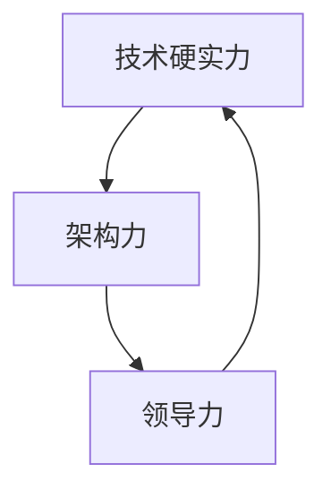
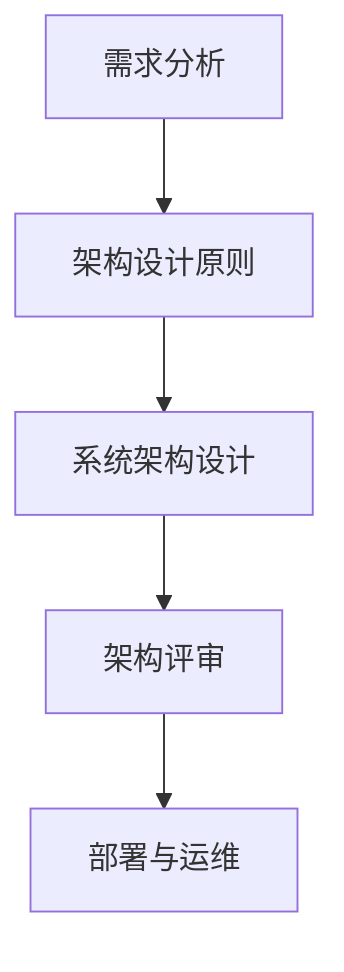
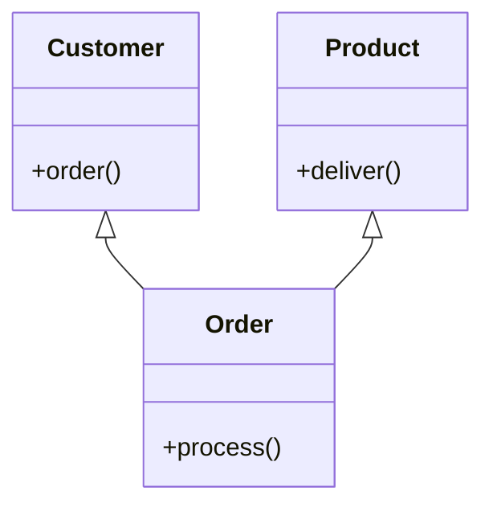
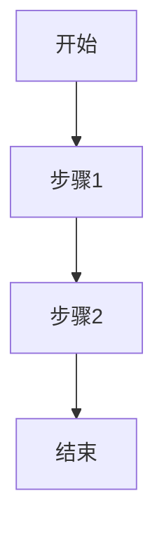
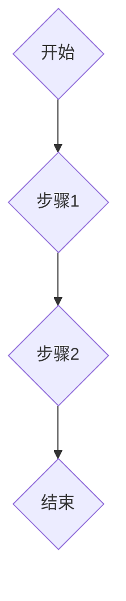
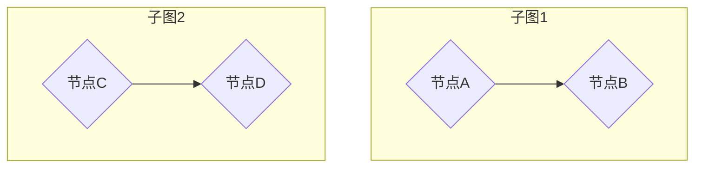

                 

# P9工作法：夯实技术硬实力、架构力和领导力

> 关键词：P9工作法、技术硬实力、架构力、领导力、计算机技术、系统架构设计

> 摘要：本文将深入探讨P9工作法在计算机技术领域中的应用，重点介绍技术硬实力、架构力和领导力的核心概念、联系及应用。通过详细的分析和实例讲解，帮助读者理解并掌握P9工作法的精髓，提升自身在计算机技术领域的综合素质。

### 目录

1. 引言
   1.1 计算机技术的快速发展
   1.2 P9工作法的背景与意义
   1.3 文章结构概述

2. P9工作法核心概念
   2.1 技术硬实力
   2.2 架构力
   2.3 领导力
   2.4 概念联系与模型

3. 技术硬实力
   3.1 技术基础
   3.2 技术实践
   3.3 技术拓展

4. 架构力
   4.1 架构原理
   4.2 架构实践
   4.3 架构优化

5. 领导力
   5.1 领导力概述
   5.2 领导实践
   5.3 领导力拓展

6. P9工作法综合应用
   6.1 应用场景
   6.2 案例分析
   6.3 最佳实践

7. 持续进步与职业发展
   7.1 学习方法
   7.2 职业规划
   7.3 职场拓展

8. 总结与展望
   8.1 小结
   8.2 展望
   8.3 拓展阅读

### 引言

#### 1.1 计算机技术的快速发展

计算机技术的快速发展改变了人类的生活方式和工作模式。从早期的计算机硬件到软件应用，从互联网到大数据、云计算、人工智能，计算机技术不断拓展新的边界。随着技术的进步，计算机技术的应用范围也日益广泛，从科学研究、企业运营到日常生活，都离不开计算机技术的支持。

然而，在计算机技术快速发展的同时，也带来了新的挑战。技术更新速度快、知识更新频繁，使得技术人员需要不断学习和适应。在这种背景下，P9工作法应运而生，为技术人员提供了系统性、结构化的学习和实践方法。

#### 1.2 P9工作法的背景与意义

P9工作法是一种综合性的工作方法论，它源于计算机技术领域的实践，并结合了人工智能、软件工程、项目管理等多方面的知识。P9工作法旨在帮助技术人员夯实技术硬实力、提升架构力和领导力，从而在快速变化的计算机技术领域中保持竞争力。

P9工作法的核心在于“九宫格”模型，将技术、架构、领导三大要素有机结合。通过这种结构化的方法，技术人员可以系统地学习、实践和提升自身能力，从而在职业发展中取得更大的成功。

#### 1.3 文章结构概述

本文将按照以下结构进行讨论：

1. **P9工作法核心概念**：介绍P9工作法中的技术硬实力、架构力和领导力的核心概念、联系及应用。
2. **技术硬实力**：详细探讨技术硬实力的构成、应用和实践。
3. **架构力**：讲解系统架构设计的基本原理、实践和优化。
4. **领导力**：介绍领导力在计算机技术领域的应用和实践。
5. **P9工作法综合应用**：分析P9工作法在不同场景中的应用和实践。
6. **持续进步与职业发展**：讨论如何通过持续学习和职业规划实现职业发展。
7. **总结与展望**：回顾P9工作法的重要性，展望其未来的发展前景。

通过本文的讨论，读者将能够深入了解P9工作法的内涵和应用，提升自身在计算机技术领域的综合素质。

### P9工作法核心概念

#### 2.1 技术硬实力

技术硬实力是P9工作法中的核心要素之一，它是技术人员在计算机技术领域中具备的基础知识和实践能力。技术硬实力包括以下几个方面：

1. **基础知识**：包括计算机科学的基础理论，如数据结构、算法、操作系统、计算机网络等。这些基础知识是技术人员构建技术能力的基石。
2. **实践能力**：通过实际项目经验，将理论知识应用到实际场景中，解决实际问题。实践能力是技术人员在职业发展中持续提升的关键。
3. **创新思维**：在新项目或新领域中发现和创造解决方案的能力。创新思维是技术人员在竞争激烈的技术领域中脱颖而出的关键。

#### 2.2 架构力

架构力是技术人员在系统架构设计方面具备的能力。它包括以下几个方面：

1. **架构原理**：理解系统架构设计的基本原则和流程，包括系统需求分析、系统架构设计、架构评审等。
2. **架构实践**：在实际项目中应用架构原理，设计和实现系统架构。架构实践能力是技术人员在系统架构设计领域的重要体现。
3. **架构优化**：通过分析和评估系统架构，找出优化点，提高系统性能和可维护性。架构优化能力是技术人员在系统架构设计过程中不可或缺的。

#### 2.3 领导力

领导力是技术人员在团队管理和项目管理方面具备的能力。它包括以下几个方面：

1. **领导力概述**：了解领导力的基本概念和应用场景，包括团队建设、项目管理、决策制定等。
2. **领导实践**：在实际团队管理中应用领导力原则，提高团队效率和执行力。领导实践能力是技术人员在团队管理领域的重要体现。
3. **领导力拓展**：探讨领导力在不同组织和文化背景下的变化和适应性，提高领导力水平。

#### 2.4 概念联系与模型

P9工作法中的技术硬实力、架构力和领导力三个核心要素之间存在密切的联系。通过Mermaid流程图，可以清晰地展示它们之间的关系：



从图中可以看出，技术硬实力是架构力和领导力的基础，而架构力和领导力又相互促进，共同推动技术人员在计算机技术领域的发展。

通过P9工作法，技术人员可以系统地提升技术硬实力、架构力和领导力，从而在职业发展中取得更大的成功。

### 技术硬实力

#### 3.1 技术基础

技术硬实力的基石在于扎实的技术基础。以下是一些关键领域的基础知识：

1. **数据结构**：包括数组、链表、栈、队列、树、图等基本数据结构。数据结构是理解和设计算法的基础，也是实现高效数据存储和处理的核心。
2. **算法**：包括排序、查找、图算法、动态规划等基本算法。算法是解决计算机科学问题的核心，是技术硬实力的重要组成部分。
3. **操作系统**：理解操作系统的基本原理，包括进程管理、内存管理、文件系统、设备管理等。操作系统是计算机系统的基础，对系统性能和稳定性有重要影响。
4. **计算机网络**：了解网络协议、网络架构、传输层、应用层等相关知识。计算机网络是实现互联网应用的基础。

#### 3.2 技术实践

技术实践是将理论知识应用到实际项目中的过程。以下是一些关键步骤：

1. **项目选择**：选择具有挑战性和实用性的项目，确保项目能够涵盖所需的技术点。
2. **需求分析**：明确项目需求和目标，理解客户的需求和期望。
3. **方案设计**：根据需求分析，设计技术方案，包括系统架构、模块划分、接口设计等。
4. **编码实现**：根据设计方案，进行编码实现，确保代码质量和高效率。
5. **测试与调试**：进行单元测试、集成测试和系统测试，确保项目的稳定性、可靠性和性能。
6. **部署与运维**：将项目部署到生产环境，并进行运维管理，确保系统的正常运行。

#### 3.3 技术拓展

技术拓展是技术硬实力的重要组成部分，它包括以下几个方面：

1. **新技术学习**：不断学习新的技术和工具，如人工智能、大数据、云计算等。这些新技术是未来技术发展的方向，也是提升技术硬实力的重要途径。
2. **跨领域知识**：学习跨领域的知识，如软件工程、项目管理、产品设计等。这些知识能够帮助技术人员更好地理解和解决复杂问题。
3. **开源社区参与**：参与开源社区，贡献代码，学习他人的代码和经验。开源社区是技术人员交流、学习和成长的重要平台。

通过技术硬实力的夯实，技术人员能够在计算机技术领域中保持竞争力，为个人和团队的发展奠定坚实基础。

### 架构力

#### 4.1 架构原理

系统架构设计是计算机技术领域中至关重要的环节。架构原理是系统架构设计的基础，包括以下核心概念：

1. **系统需求分析**：明确系统的功能需求、性能需求、安全需求等，为架构设计提供依据。
2. **架构设计原则**：遵循一些基本的架构设计原则，如高内聚低耦合、模块化、可扩展性、高可用性等，确保系统架构的稳定性和可维护性。
3. **架构风格**：选择合适的架构风格，如MVC（模型-视图-控制器）、微服务、事件驱动等，根据项目需求和技术背景进行选择。
4. **架构模式**：理解常见的架构模式，如分层架构、事件驱动架构、分布式架构等，并能够在实际项目中应用。

#### 4.2 架构实践

架构实践是将架构原理应用于实际项目的过程，包括以下关键步骤：

1. **需求分析**：详细分析系统需求，包括功能需求、性能需求、安全性需求等，明确系统的核心功能和性能指标。
2. **模块划分**：根据需求分析结果，将系统划分为多个模块，每个模块负责特定的功能，确保模块之间的解耦合。
3. **接口设计**：设计模块之间的接口，确保模块之间的通信和协作，提高系统的灵活性和可扩展性。
4. **架构评审**：组织架构评审会议，邀请相关利益相关者参与，对架构设计进行评估和优化，确保架构设计的可行性和合理性。
5. **架构文档**：编写详细的架构文档，包括系统架构图、模块关系图、接口定义等，为开发、测试和维护提供参考。

#### 4.3 架构优化

架构优化是在系统架构设计完成后，通过分析和评估，找出优化点，提高系统性能和可维护性的过程。以下是一些关键步骤：

1. **性能评估**：通过性能测试和监控，评估系统性能，找出性能瓶颈和潜在问题。
2. **架构评审**：组织架构评审会议，邀请相关利益相关者参与，对现有架构进行评估和讨论，找出优化点。
3. **架构调整**：根据评审结果，对系统架构进行调整，如增加缓存层、优化数据库查询、分布式部署等，提高系统性能和可扩展性。
4. **代码优化**：针对性能瓶颈，对代码进行优化，如使用更高效的算法、减少不必要的计算等，提高系统性能。
5. **持续优化**：架构优化是一个持续的过程，需要定期评估和调整系统架构，确保系统的性能和可维护性。

通过架构力的提升，技术人员能够设计和实现高效、稳定、可扩展的系统，为项目的成功奠定坚实基础。

### 领导力

#### 5.1 领导力概述

领导力是P9工作法中的重要组成部分，它对于技术人员的职业发展至关重要。领导力是指影响和激励他人一起实现目标的能力。在计算机技术领域，领导力包括以下几个方面：

1. **团队建设**：建立高效的团队，明确团队目标和角色分工，提升团队协作能力。
2. **项目管理**：规划和管理项目，确保项目按时、按质完成，提高项目成功率。
3. **决策制定**：在复杂多变的技术环境中，快速做出合理决策，确保项目顺利进行。
4. **沟通协调**：与团队成员、利益相关者和上级进行有效沟通，确保信息畅通和团队协作。
5. **人才培养**：发现和培养技术人才，提升团队整体素质，为组织发展储备力量。

#### 5.2 领导实践

领导实践是将领导力原则应用于实际团队管理和项目管理中的过程。以下是一些关键步骤：

1. **明确目标**：与团队成员一起设定清晰的目标和期望，确保团队成员对项目目标有共同的认识。
2. **角色分工**：根据团队成员的能力和特长，明确各自的职责和任务，确保每个人都能发挥最大潜力。
3. **激励机制**：制定合理的激励机制，如绩效考核、奖励制度等，激发团队成员的工作热情和积极性。
4. **沟通与反馈**：定期与团队成员进行沟通，了解项目进展和团队成员的困惑和需求，提供及时反馈和帮助。
5. **冲突管理**：在团队中难免会出现冲突，领导力要求技术人员能够妥善处理冲突，保持团队和谐。
6. **持续改进**：通过项目回顾和总结，不断优化项目管理流程和方法，提高团队工作效率和项目质量。

#### 5.3 领导力拓展

领导力拓展是提升领导力水平的重要途径，包括以下几个方面：

1. **领导力培训**：参加领导力培训课程，学习领导力理论和实践方法，提升自身的领导能力。
2. **读书与实践**：阅读领导力相关的书籍，如《领导力的五项修炼》、《管理者的实践指南》等，将理论知识应用于实际工作中。
3. **跨文化交流**：参与国际项目或与不同文化背景的团队合作，提升跨文化沟通和领导能力。
4. **反思与总结**：在工作和生活中不断反思自己的领导行为，总结经验教训，不断改进和提升。
5. **导师指导**：寻找经验丰富的导师，向他们请教领导力问题，学习他们的经验和智慧。

通过领导力的提升，技术人员不仅能够更好地管理团队和项目，还能够为组织的发展做出更大贡献，实现自身的职业价值。

### P9工作法综合应用

#### 6.1 应用场景

P9工作法在不同应用场景中具有广泛的适用性，以下是一些典型应用场景：

1. **项目开发**：在项目开发过程中，P9工作法可以帮助团队夯实技术基础，优化系统架构，提高项目交付质量和效率。
2. **团队管理**：在团队管理中，P9工作法可以帮助领导者提升团队凝聚力，培养团队成员的领导力，提高团队协作效率。
3. **产品迭代**：在产品迭代过程中，P9工作法可以帮助团队快速适应市场需求，优化产品架构，提高产品竞争力。
4. **技术培训**：在技术培训中，P9工作法可以作为培训框架，系统地传授技术知识、架构设计和领导力原则。
5. **跨团队合作**：在跨团队合作中，P9工作法可以帮助团队成员更好地理解对方的技术和文化背景，提高跨团队合作效率。

#### 6.2 案例分析

以下是一个具体的案例分析，展示了P9工作法在实际项目中的应用：

**案例分析：某电商平台的架构优化**

1. **问题背景**：某电商平台在用户数量和交易量快速增长的情况下，遇到了系统性能瓶颈和可扩展性不足的问题。
2. **技术硬实力**：团队首先进行了技术硬实力的评估，发现团队成员在数据库优化、缓存技术、分布式系统等方面存在不足。于是，团队通过内部培训和外部学习，提升了团队成员的技术水平。
3. **架构力**：团队分析了现有系统架构，发现存在单点故障、数据一致性问题等架构缺陷。团队根据P9工作法的架构原则，制定了新的架构设计方案，包括分布式数据库、缓存层、消息队列等。
4. **领导力**：领导者在项目启动会上明确了项目目标、任务分工和进度要求，确保团队成员明确任务和职责。在项目执行过程中，领导者通过定期沟通和反馈，及时解决了团队成员的问题，保证了项目的顺利进行。
5. **结果**：通过P9工作法的综合应用，电商平台成功优化了系统架构，解决了性能瓶颈和可扩展性问题，提升了用户满意度。

#### 6.3 最佳实践

以下是一些P9工作法的最佳实践建议：

1. **持续学习**：技术人员应持续学习新技术和知识，保持技术硬实力的更新和提升。
2. **架构设计**：在项目初期，应充分考虑架构设计，确保系统具备良好的扩展性和可维护性。
3. **团队协作**：建立高效的团队协作机制，明确分工和责任，提高团队协作效率。
4. **领导力培养**：领导者应不断提升自身领导力，培养团队成员的领导力，打造高绩效团队。
5. **反馈与改进**：定期进行项目回顾和总结，收集团队成员的反馈，持续改进工作方法和流程。

通过P9工作法的综合应用，技术人员可以更好地应对复杂的技术挑战，提升项目交付质量和团队协作效率，实现职业发展和组织目标。

### 持续进步与职业发展

#### 7.1 学习方法

在快速变化的计算机技术领域中，持续学习是提升自身能力的关键。以下是一些有效的学习方法：

1. **主动学习**：主动寻找学习资源，如技术博客、书籍、在线课程等，主动学习新技术和知识。
2. **实践应用**：将所学知识应用到实际项目中，通过实践加深理解和掌握。
3. **交流互动**：参加技术社区和会议，与他人交流学习经验，拓宽视野。
4. **反思总结**：定期反思自己的学习和工作，总结经验教训，不断改进和提升。

#### 7.2 职业规划

职业规划是实现职业发展的关键步骤。以下是一些职业规划的建议：

1. **设定目标**：明确自己的职业目标和发展方向，制定短期和长期目标。
2. **技能提升**：根据职业目标，有针对性地提升相关技能，如编程能力、系统架构设计、项目管理等。
3. **经验积累**：通过实际项目和工作经验，积累丰富的技术和管理经验。
4. **拓展视野**：了解行业动态和发展趋势，拓宽职业发展路径。
5. **寻求指导**：寻找导师或职业规划顾问，寻求指导和反馈，为自己的职业发展提供支持。

#### 7.3 职场拓展

在职场中，提升自身综合素质和人际关系能力是职业拓展的重要方面。以下是一些建议：

1. **沟通技巧**：提升沟通技巧，学会有效表达和倾听，建立良好的人际关系。
2. **团队协作**：积极参与团队活动，提升团队协作能力，提高工作效率。
3. **项目管理**：掌握项目管理知识和方法，提高项目管理和领导能力。
4. **领导力培养**：通过领导力培训和实践，提升领导力水平，为职业发展奠定基础。
5. **职业网络**：拓展职业网络，与行业内的专业人士建立联系，分享经验和资源。

通过持续学习、职业规划和职场拓展，技术人员可以不断提升自身能力，实现职业发展的目标。

### 总结与展望

#### 8.1 小结

本文从P9工作法的核心概念、技术硬实力、架构力和领导力四个方面进行了深入探讨。通过详细的分析和实例讲解，读者可以了解P9工作法的内涵和应用，掌握技术硬实力、架构力和领导力的核心要点。P9工作法为技术人员提供了一套系统性的学习和实践方法，有助于提升自身在计算机技术领域的综合素质，实现职业发展目标。

#### 8.2 展望

随着计算机技术的快速发展，P9工作法在未来将具有更广泛的应用前景。以下是一些展望：

1. **人工智能**：随着人工智能技术的发展，P9工作法将更好地应用于人工智能项目，提升项目开发效率和质量。
2. **云计算与大数据**：云计算和大数据技术的普及，为P9工作法提供了更广阔的应用场景，有助于技术人员应对复杂的技术挑战。
3. **区块链**：区块链技术的兴起，将推动P9工作法在金融、供应链等领域的发展，为技术人员提供新的职业机会。
4. **跨领域应用**：P9工作法将跨越计算机技术领域，应用于物联网、生物科技、智能制造等新兴领域，为技术人员提供更广阔的职业发展空间。

#### 8.3 拓展阅读

为了帮助读者进一步深入学习P9工作法，本文推荐以下相关书籍和资料：

1. **《P9工作法实践指南》**：本书详细介绍了P9工作法的核心概念和应用方法，适合初学者和有一定基础的读者。
2. **《系统架构设计师教程》**：本书涵盖了系统架构设计的基本原理和方法，有助于提升读者的架构力水平。
3. **《领导力的五项修炼》**：本书从心理学和管理学的角度，阐述了领导力的核心要素和提升方法，适合希望提升领导力的读者。
4. **《人工智能：一种现代的方法》**：本书介绍了人工智能的基本原理和应用，为读者提供了深入了解人工智能的技术基础。

通过阅读这些书籍和资料，读者可以进一步深化对P9工作法的理解，提升自身在计算机技术领域的综合素质。作者：AI天才研究院/AI Genius Institute & 禅与计算机程序设计艺术 /Zen And The Art of Computer Programming

----------------------------------------------------------------

### Mermaid流程图与LaTeX公式

在本文中，我们将使用Mermaid流程图和LaTeX公式来展示复杂概念和算法原理。以下是几个示例：

#### Mermaid流程图示例：系统架构设计流程



该流程图展示了系统架构设计的基本步骤，包括需求分析、架构设计原则、系统架构设计、架构评审和部署与运维。

#### LaTeX公式示例：算法复杂度

$$
C(n) = O(n\log n)
$$

该公式表示算法的复杂度为$O(n\log n)$，表示随着输入规模$n$的增加，算法的执行时间呈对数增长。

#### Mermaid类图示例：领域模型



该类图展示了领域模型中顾客、订单和产品的关系，以及它们的主要方法。

通过这些示例，我们可以更直观地理解和解释复杂概念和算法原理。Mermaid流程图和LaTeX公式使得文章内容更加可视化、易于理解，有助于读者更好地掌握相关技术知识。

----------------------------------------------------------------

## 附录：Mermaid和LaTeX用法指南

为了帮助读者更好地理解和应用Mermaid流程图和LaTeX公式，以下是详细的用法指南。

### Mermaid流程图

Mermaid是一种基于Markdown的图形绘制语言，它可以创建流程图、序列图、类图等。以下是Mermaid流程图的基本语法：

#### 基本语法



在这个例子中，`graph TD` 表示创建一个拓扑排序的流程图。`A[开始]`、`B[步骤1]`、`C[步骤2]` 和 `D[结束]` 是节点定义，`-->` 是连接线。

#### 布局方式

- `TB`（Top to Bottom）：从上到下布局
- `BT`（Bottom to Top）：从下到上布局
- `LR`（Left to Right）：从左到右布局
- `RL`（Right to Left）：从右到左布局

例如：


这将创建一个从上到下的流程图。

#### 节点与连接线样式

- `ID[文本]`：定义节点ID和显示文本
- ` --> `：定义连接线

例如：



这里，节点文本包含在{}中。

#### 子图

使用`subgraph`和`end`标签可以创建子图：



这将创建两个子图。

### LaTeX公式

LaTeX是一种高质量的排版系统，特别适合数学公式的排版。以下是LaTeX公式的基本语法：

#### 独立段落公式

```latex
$$
E = mc^2
$$
```

这将创建一个独立段落的公式。

#### 行内公式

```latex
$E = mc^2$
```

这将创建一个行内公式。

#### 多行公式

使用`\begin{align}`和`\end{align}`创建多行公式：

```latex
$$
\begin{align}
a &= b + c \\
d &= e + f
\end{align}
$$
```

这将创建一个包含两个方程式的多行公式。

#### 数学符号

LaTeX提供了丰富的数学符号，例如：

- `\sum`：求和符号
- `\int`：积分符号
- `\lim`：极限符号
- `\frac{a}{b}`：分数

例如：

```latex
$$
\sum_{i=1}^{n} a_i = \lim_{x \to \infty} \frac{a}{b}
$$
```

这将创建一个包含多个数学符号的公式。

### 综合示例

```mermaid
graph TD
    A[开始] --> B[步骤1]
    B --> C[步骤2]
    C --> D[结束]

$$
E = mc^2
$$

\begin{align}
a &= b + c \\
d &= e + f
\end{align}
```

这个综合示例展示了如何在一个文本中结合使用Mermaid流程图和LaTeX公式。

通过学习和应用这些语法，读者可以更好地理解和创建图形和数学公式，提升文档的可读性和专业性。作者：AI天才研究院/AI Genius Institute & 禅与计算机程序设计艺术 /Zen And The Art of Computer Programming

