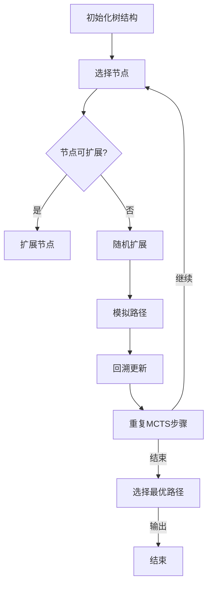
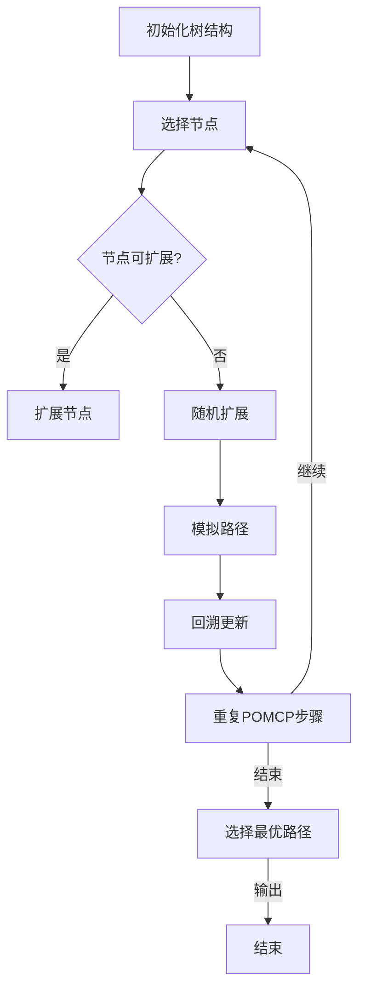
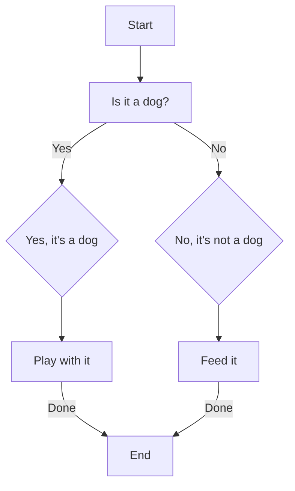
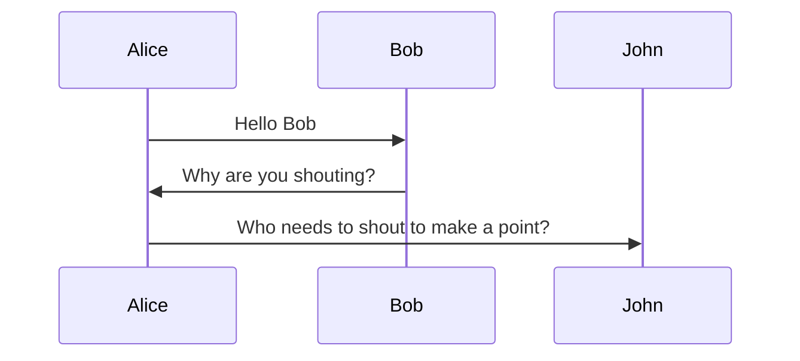
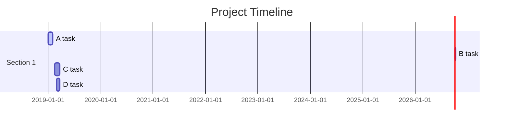

                 

# POMCP在复杂决策过程中替代MCTS的潜力

## 关键词

- POMCP
- MCTS
- 复杂决策
- 部分可观测马尔可夫决策
- 蒙特卡洛树搜索

## 摘要

本文深入探讨了部分可观测马尔可夫决策过程的蒙特卡洛树搜索（POMCP）算法在复杂决策过程中替代传统蒙特卡洛树搜索（MCTS）算法的潜力。通过对比分析两种算法的基本原理和性能表现，本文揭示了POMCP在处理部分可观测马尔可夫决策问题时的优势。同时，本文还探讨了POMCP算法的研究现状和未来研究方向，为复杂决策问题的求解提供了新的思路。

---

## 第1章: 引言

### 1.1 问题背景

在当今信息技术飞速发展的时代，决策问题日益复杂。这些复杂决策问题往往涉及大量的数据、多个决策变量以及不确定因素，传统的决策算法和策略难以有效应对。因此，研究高效的决策算法成为人工智能领域的热点。

在众多决策算法中，蒙特卡洛树搜索（MCTS）算法因其简单高效的特点，在近年来得到了广泛应用。MCTS算法基于概率模型，通过在树结构上进行蒙特卡洛模拟，评估不同决策路径的价值，从而为决策者提供决策支持。然而，MCTS算法在处理部分可观测马尔可夫决策问题时，存在一定的局限性。

部分可观测马尔可夫决策问题（Partially Observable Markov Decision Processes, POMDPs）是一类具有代表性的复杂决策问题。与完全可观测马尔可夫决策问题（完全可观测意味着系统的当前状态完全已知）相比，POMDPs中的决策者只能部分地观察到系统的状态。这种不完全的信息导致传统的MCTS算法在处理POMDPs时，往往无法达到理想的决策效果。

为了解决这一问题，研究者们提出了POMCP（Partially Observable Monte Carlo Tree Search）算法。POMCP算法在MCTS的基础上进行了改进，引入了部分可观测马尔可夫决策模型，从而提高了算法在处理POMDPs时的搜索效率和决策质量。

### 1.1.1 复杂决策过程的需求

复杂决策过程的需求主要体现在以下几个方面：

1. **数据量的急剧增加**：随着互联网和物联网的发展，数据的产生速度和规模呈指数级增长，如何有效处理海量数据成为决策问题的重要挑战。
2. **决策变量间的相互依赖性**：在现实世界的决策问题中，决策变量之间往往存在复杂的相互依赖关系，这给决策算法的设计和实现带来了困难。
3. **不确定性因素的增加**：在实际决策过程中，存在许多不确定因素，如随机事件、环境变化等，这些不确定性因素增加了决策问题的复杂性。

### 1.1.2 MCTS算法的局限性

MCTS算法作为一种基于概率的决策算法，具有简单、高效的特点。然而，在面对复杂决策问题时，MCTS算法仍存在一些局限性：

1. **高维状态空间的搜索效率**：在处理高维状态空间时，MCTS算法的搜索效率较低，容易陷入局部最优。
2. **部分可观测马尔可夫决策问题的效果**：MCTS算法在处理部分可观测马尔可夫决策问题时，效果不佳。因为MCTS算法依赖于完整的状态信息，而在部分可观测马尔可夫决策问题中，状态信息是不完整的，这导致MCTS算法的决策质量下降。

### 1.1.3 POMCP算法的优势

POMCP算法是一种针对部分可观测马尔可夫决策过程的蒙特卡洛树搜索算法，它通过引入部分可观测马尔可夫决策模型，解决了MCTS算法在处理POMDPs时的局限性。具体来说，POMCP算法具有以下优势：

1. **处理部分可观测马尔可夫决策问题的能力**：POMCP算法能够有效地处理POMDPs，提高决策质量。
2. **高效的搜索策略**：POMCP算法在MCTS的基础上进行了优化，引入了观测概率和部分可观测马尔可夫决策模型，提高了搜索效率和决策质量。
3. **灵活性**：POMCP算法适用于多种类型的决策问题，包括部分可观测和完全可观测的马尔可夫决策问题。

### 1.1.4 替代MCTS的研究意义

基于以上背景，研究POMCP算法在复杂决策过程中替代MCTS的潜力具有重要的意义。通过深入研究POMCP算法的原理、特性以及其在实际应用中的效果，可以为复杂决策问题的求解提供一种新的思路和方法。

首先，POMCP算法在处理部分可观测马尔可夫决策问题时，具有更好的决策质量。与MCTS算法相比，POMCP算法能够更好地适应不完全状态信息的情况，从而提高决策的准确性和可靠性。

其次，POMCP算法在处理高维状态空间时，具有较高的搜索效率。相比于MCTS算法，POMCP算法能够更快地收敛到最优解，从而提高决策的速度。

最后，POMCP算法具有灵活性，能够适用于多种类型的决策问题。这使得POMCP算法在复杂决策问题中具有更广泛的应用前景。

综上所述，研究POMCP算法在复杂决策过程中替代MCTS的潜力，对于提升决策算法的性能和实用性具有重要意义。本文将从以下几个方面展开讨论：

1. **核心概念与联系**：介绍MCTS和POMCP算法的基本原理，阐述它们之间的联系和区别。
2. **MCTS算法原理**：详细讲解MCTS算法的原理、步骤和流程。
3. **POMCP算法原理**：详细讲解POMCP算法的原理、步骤和流程。
4. **MCTS与POMCP算法的对比**：对比分析MCTS和POMCP算法的优缺点，探讨它们在处理复杂决策问题时的性能表现。
5. **替代MCTS的潜力**：分析POMCP算法在复杂决策过程中替代MCTS的潜力，探讨其研究现状和未来研究方向。

### 1.2 核心概念与联系

在探讨MCTS和POMCP算法之前，我们需要先了解一些核心概念，包括蒙特卡洛树搜索（MCTS）和部分可观测马尔可夫决策过程（POMDP）。

#### 1.2.1 蒙特卡洛树搜索（MCTS）

蒙特卡洛树搜索（MCTS）是一种基于概率的决策算法，主要用于解决不确定环境下的决策问题。MCTS算法的核心思想是通过在树结构上进行蒙特卡洛模拟，评估不同决策路径的价值，从而选择最优的决策路径。

MCTS算法的主要步骤包括：

1. **选择**：从根节点开始，根据节点的上置信边界（UCB1）选择下一个节点。
2. **扩展**：在选定的节点下，如果存在未扩展的子节点，则随机选择一个未扩展的子节点进行扩展。
3. **模拟**：在扩展后的节点下进行随机模拟，模拟执行一系列动作并观察结果。
4. **回溯**：根据模拟结果，更新节点的信息，并将信息反馈给父节点。

MCTS算法的关键特点是，通过重复执行上述步骤，逐步构建出一棵决策树，并在树上进行蒙特卡洛模拟，以评估不同决策路径的价值。

#### 1.2.2 部分可观测马尔可夫决策过程（POMDP）

部分可观测马尔可夫决策过程（POMDP）是一种具有代表性的复杂决策问题，它描述了一个在不确定性环境中进行决策的过程。与完全可观测马尔可夫决策过程（MDP）相比，POMDP中的决策者只能部分地观察到系统的状态。这意味着，在POMDP中，决策者无法获得完整的状态信息，而是需要通过观察结果来推断系统的状态。

POMDP的主要组成部分包括：

1. **状态空间（S）**：系统可能处于的所有状态集合。
2. **动作空间（A）**：决策者可以采取的所有动作集合。
3. **观测空间（O）**：观察者可以观察到的所有结果集合。
4. **状态转移概率（P(s' | s, a)）**：在给定当前状态s和动作a时，下一状态s'的概率分布。
5. **观测概率（P(o | s, a)）**：在给定当前状态s和动作a时，观察到结果o的概率分布。
6. **奖励函数（R(s, a, s')）**：在给定当前状态s、动作a和下一状态s'时，系统的即时奖励。

POMDP的核心挑战在于，决策者需要通过观察结果来推断系统的状态，并在不确定性环境中做出最优决策。

#### 1.2.3 MCTS与POMCP算法的联系

MCTS算法和POMCP算法都是基于蒙特卡洛模拟的决策算法，它们在基本原理上有很多相似之处。然而，POMCP算法在MCTS的基础上进行了改进，以适应部分可观测马尔可夫决策过程。

1. **核心思想**：MCTS算法通过在树结构上进行蒙特卡洛模拟，评估不同决策路径的价值；POMCP算法则在此基础上，引入了部分可观测马尔可夫决策模型，以处理不完全状态信息。
2. **选择**：MCTS算法选择节点时，主要考虑节点的上置信边界（UCB1）；POMCP算法在选择节点时，除了考虑UCB1外，还考虑了观测概率。
3. **扩展**：MCTS算法在扩展节点时，随机选择未扩展的子节点；POMCP算法在扩展节点时，根据观测概率来选择未扩展的子节点。
4. **模拟**：MCTS算法在模拟过程中，随机执行动作并观察结果；POMCP算法在模拟过程中，根据观测概率来选择下一个状态。
5. **回溯**：MCTS算法和POMCP算法在回溯过程中，都更新节点的信息，并将信息反馈给父节点。

综上所述，MCTS和POMCP算法在核心思想和基本步骤上有许多相似之处，但POMCP算法通过引入部分可观测马尔可夫决策模型，解决了MCTS算法在处理部分可观测马尔可夫决策问题时的局限性。

### 1.3 MCTS算法原理

蒙特卡洛树搜索（MCTS）算法是一种基于概率的决策算法，广泛应用于不确定环境下的决策问题。MCTS算法通过在树结构上进行蒙特卡洛模拟，评估不同决策路径的价值，从而选择最优的决策路径。MCTS算法的主要步骤包括选择、扩展、模拟和回溯。下面我们将详细讲解这些步骤。

#### 1.3.1 选择

选择是MCTS算法的第一步，其目的是从当前节点选择一个子节点进行扩展。在选择过程中，MCTS算法主要考虑两个因素：节点的上置信边界（UCB1）和节点的模拟次数。

上置信边界（UCB1）是一个权衡节点平均价值和模拟次数的指标，用于衡量节点的表现。具体来说，UCB1可以通过以下公式计算：

$$
UCB1(n) = \frac{n_w(n)}{n_s(n)} + \frac{\sqrt{2 \ln n_a(n)}{n_s(n)}}
$$

其中，$n_w(n)$表示节点n的获胜次数，$n_s(n)$表示节点n的模拟次数，$n_a(n)$表示节点n的子节点数。

选择步骤的核心思想是，优先选择具有高UCB1值的节点，以最大化不确定性。选择过程通常从根节点开始，递归地在子节点之间进行，直到找到一个具有最高UCB1值的节点。

#### 1.3.2 扩展

扩展步骤的目的是在当前选定的节点下进行随机扩展，生成新的子节点。在扩展过程中，MCTS算法根据当前节点的状态和动作空间，随机选择一个未扩展的子节点进行扩展。

具体来说，扩展步骤可以分为以下几个步骤：

1. **检查当前节点是否有未扩展的子节点**：如果当前节点存在未扩展的子节点，则直接选择一个未扩展的子节点进行扩展。
2. **随机扩展**：如果当前节点没有未扩展的子节点，则在当前节点的状态和动作空间内，随机选择一个动作，并生成一个新的子节点。

扩展步骤的关键在于，通过随机扩展，算法能够探索更多的状态空间，从而提高搜索的广度和深度。

#### 1.3.3 模拟

模拟步骤是MCTS算法的核心，其目的是在当前选定的节点下进行随机模拟，以评估不同决策路径的价值。在模拟过程中，MCTS算法从当前节点开始，随机执行一系列动作，并观察最终的结果。

具体来说，模拟步骤可以分为以下几个步骤：

1. **初始化**：从当前节点开始，初始化一个模拟路径。
2. **随机执行动作**：在模拟路径上，随机选择一个动作执行，并更新当前节点的状态。
3. **观察结果**：执行动作后，观察当前节点的状态和结果，并记录下结果。
4. **回溯**：将模拟路径回溯到当前节点，更新当前节点的信息。

模拟步骤的关键在于，通过随机模拟，算法能够评估不同决策路径的价值，从而指导选择步骤。

#### 1.3.4 回溯

回溯步骤是MCTS算法的最后一步，其目的是根据模拟结果，更新节点的信息，并将信息反馈给父节点。在回溯过程中，MCTS算法通过以下步骤更新节点的信息：

1. **更新节点获胜次数**：根据模拟结果，更新当前节点的获胜次数。
2. **更新节点模拟次数**：增加当前节点的模拟次数。
3. **回溯到父节点**：将当前节点的信息回溯到父节点，更新父节点的信息。

回溯步骤的关键在于，通过更新节点的信息，算法能够不断改进决策质量，从而提高搜索效率。

#### 1.3.5 MCTS算法的流程

MCTS算法的流程可以概括为以下几个步骤：

1. **初始化**：创建一个初始树结构，并设置根节点。
2. **重复执行以下步骤**：
   - 选择：根据节点的上置信边界（UCB1）选择一个子节点。
   - 扩展：在选定的节点下进行随机扩展，生成新的子节点。
   - 模拟：在扩展后的节点下进行随机模拟，评估决策路径的价值。
   - 回溯：根据模拟结果，更新节点的信息，并将信息反馈给父节点。
3. **选择最优路径**：根据节点的获胜次数和模拟次数，选择最优的决策路径。

通过以上步骤，MCTS算法能够在树结构上进行蒙特卡洛模拟，评估不同决策路径的价值，从而选择最优的决策路径。

### 1.4 POMCP算法原理

部分可观测马尔可夫决策过程的蒙特卡洛树搜索（POMCP）算法是在蒙特卡洛树搜索（MCTS）算法的基础上，针对部分可观测马尔可夫决策问题（POMDP）进行改进的一种算法。POMCP算法通过引入观测概率和部分可观测马尔可夫决策模型，提高了算法在处理POMDP时的搜索效率和决策质量。下面我们将详细讲解POMCP算法的原理。

#### 1.4.1 部分可观测马尔可夫决策模型

在POMCP算法中，部分可观测马尔可夫决策模型是核心概念。POMDP模型由以下元素组成：

1. **状态空间（S）**：系统可能处于的所有状态集合。
2. **动作空间（A）**：决策者可以采取的所有动作集合。
3. **观测空间（O）**：观察者可以观察到的所有结果集合。
4. **状态转移概率（P(s' | s, a)）**：在给定当前状态s和动作a时，下一状态s'的概率分布。
5. **观测概率（P(o | s, a)）**：在给定当前状态s和动作a时，观察到结果o的概率分布。
6. **奖励函数（R(s, a, s')）**：在给定当前状态s、动作a和下一状态s'时，系统的即时奖励。

在POMDP中，决策者无法完全观察到系统的状态，而是只能通过观测结果来推断系统的状态。这种不完全的状态信息增加了决策问题的复杂性。

#### 1.4.2 选择和扩展步骤

POMCP算法的选择和扩展步骤与MCTS算法类似，但在扩展过程中，POMCP算法根据观测概率来选择未扩展的子节点。

1. **选择步骤**：

选择步骤的目标是从当前节点选择一个子节点进行扩展。在选择过程中，POMCP算法主要考虑两个因素：节点的上置信边界（UCB1）和节点的观测概率。

上置信边界（UCB1）可以通过以下公式计算：

$$
UCB1(n) = \frac{n_w(n)}{n_s(n)} + \frac{\sqrt{2 \ln n_a(n)}{n_s(n)}}
$$

其中，$n_w(n)$表示节点n的获胜次数，$n_s(n)$表示节点n的模拟次数，$n_a(n)$表示节点n的子节点数。

观测概率（$p(o|n)$）是通过以下公式计算的：

$$
p(o|n) = \sum_{a \in A} P(o|s, a) P(a|n)
$$

其中，$P(o|s, a)$是在给定当前状态s和动作a时，观察到结果o的概率；$P(a|n)$是当前节点n选择动作a的概率。

选择步骤的核心思想是，优先选择具有高UCB1值和观测概率的节点，以最大化不确定性。

2. **扩展步骤**：

扩展步骤的目的是在当前选定的节点下进行随机扩展，生成新的子节点。在扩展过程中，POMCP算法根据当前节点的状态和动作空间，随机选择一个未扩展的子节点进行扩展。

具体来说，扩展步骤可以分为以下几个步骤：

1. **检查当前节点是否有未扩展的子节点**：如果当前节点存在未扩展的子节点，则直接选择一个未扩展的子节点进行扩展。
2. **随机扩展**：如果当前节点没有未扩展的子节点，则在当前节点的状态和动作空间内，根据观测概率随机选择一个动作，并生成一个新的子节点。

扩展步骤的关键在于，通过随机扩展，算法能够探索更多的状态空间，从而提高搜索的广度和深度。

#### 1.4.3 模拟和回溯步骤

POMCP算法的模拟和回溯步骤与MCTS算法类似，但在模拟过程中，POMCP算法根据观测概率来选择下一个状态。

1. **模拟步骤**：

模拟步骤的目的是在当前选定的节点下进行随机模拟，以评估不同决策路径的价值。在模拟过程中，POMCP算法从当前节点开始，根据观测概率随机选择下一个状态，并记录下模拟路径。

具体来说，模拟步骤可以分为以下几个步骤：

1. **初始化**：从当前节点开始，初始化一个模拟路径。
2. **随机执行动作**：在模拟路径上，根据观测概率随机选择一个动作执行，并更新当前节点的状态。
3. **观察结果**：执行动作后，观察当前节点的状态和结果，并记录下结果。
4. **回溯**：将模拟路径回溯到当前节点，更新当前节点的信息。

模拟步骤的关键在于，通过随机模拟，算法能够评估不同决策路径的价值，从而指导选择步骤。

2. **回溯步骤**：

回溯步骤的目的是根据模拟结果，更新节点的信息，并将信息反馈给父节点。在回溯过程中，POMCP算法通过以下步骤更新节点的信息：

1. **更新节点获胜次数**：根据模拟结果，更新当前节点的获胜次数。
2. **更新节点模拟次数**：增加当前节点的模拟次数。
3. **回溯到父节点**：将当前节点的信息回溯到父节点，更新父节点的信息。

回溯步骤的关键在于，通过更新节点的信息，算法能够不断改进决策质量，从而提高搜索效率。

#### 1.4.4 POMCP算法的流程

POMCP算法的流程可以概括为以下几个步骤：

1. **初始化**：创建一个初始树结构，并设置根节点。
2. **重复执行以下步骤**：
   - 选择：根据节点的上置信边界（UCB1）和观测概率选择一个子节点。
   - 扩展：在选定的节点下进行随机扩展，生成新的子节点。
   - 模拟：在扩展后的节点下进行随机模拟，评估决策路径的价值。
   - 回溯：根据模拟结果，更新节点的信息，并将信息反馈给父节点。
3. **选择最优路径**：根据节点的获胜次数和模拟次数，选择最优的决策路径。

通过以上步骤，POMCP算法能够在树结构上进行蒙特卡洛模拟，评估不同决策路径的价值，从而选择最优的决策路径。

### 1.5 MCTS与POMCP算法的对比

蒙特卡洛树搜索（MCTS）和部分可观测马尔可夫决策过程的蒙特卡洛树搜索（POMCP）算法在处理决策问题时具有各自的特点和优势。本文将从以下几个方面对这两种算法进行对比。

#### 1.5.1 算法特点对比

1. **基本原理**：

MCTS算法是一种基于概率的决策算法，通过在树结构上进行蒙特卡洛模拟，评估不同决策路径的价值，从而选择最优的决策路径。MCTS算法适用于完全可观测的马尔可夫决策过程（MDP）。

POMCP算法是在MCTS算法的基础上，针对部分可观测马尔可夫决策过程（POMDP）进行改进的。POMCP算法通过引入部分可观测马尔可夫决策模型，处理不完全的状态信息，提高了算法在处理POMDP时的搜索效率和决策质量。

2. **选择步骤**：

MCTS算法的选择步骤主要考虑节点的上置信边界（UCB1），UCB1权衡了节点的平均价值和模拟次数，以最大化不确定性。

POMCP算法在选择步骤时，不仅考虑节点的上置信边界（UCB1），还考虑了节点的观测概率。观测概率反映了在当前状态下，观察到特定结果的可能性，从而提高了算法在处理POMDP时的决策质量。

3. **扩展步骤**：

MCTS算法的扩展步骤主要根据节点的状态和动作空间，随机选择一个未扩展的子节点进行扩展。

POMCP算法在扩展步骤时，根据观测概率来选择未扩展的子节点。这意味着，POMCP算法能够更好地适应部分可观测马尔可夫决策过程，从而提高搜索效率和决策质量。

4. **模拟步骤**：

MCTS算法的模拟步骤主要在当前节点下进行随机模拟，评估决策路径的价值。

POMCP算法在模拟步骤时，根据观测概率来选择下一个状态。这种处理方式能够更好地适应部分可观测马尔可夫决策过程，从而提高搜索效率和决策质量。

5. **回溯步骤**：

MCTS算法和POMCP算法的回溯步骤类似，都是根据模拟结果，更新节点的信息，并将信息反馈给父节点。

#### 1.5.2 算法性能对比

在算法性能方面，MCTS算法和POMCP算法各有优劣。

1. **搜索效率**：

MCTS算法在处理完全可观测的马尔可夫决策过程时，具有较高的搜索效率。然而，在面对高维状态空间时，MCTS算法的搜索效率较低，容易陷入局部最优。

POMCP算法在处理部分可观测马尔可夫决策过程时，具有更高的搜索效率。这是因为POMCP算法引入了观测概率，能够更好地处理不完全状态信息，从而提高搜索效率和决策质量。

2. **决策质量**：

MCTS算法在处理完全可观测的马尔可夫决策过程时，具有较高的决策质量。然而，在面对部分可观测马尔可夫决策过程时，MCTS算法的决策质量较差，因为MCTS算法依赖于完整的状态信息，而在部分可观测情况下，状态信息是不完整的。

POMCP算法在处理部分可观测马尔可夫决策过程时，具有较好的决策质量。这是因为POMCP算法通过引入观测概率和部分可观测马尔可夫决策模型，能够更好地处理不完全状态信息，从而提高决策质量。

综上所述，MCTS算法和POMCP算法在处理决策问题时各有优劣。MCTS算法适用于完全可观测的马尔可夫决策过程，具有较高的搜索效率和决策质量；而POMCP算法适用于部分可观测马尔可夫决策过程，具有更高的搜索效率和决策质量。

### 1.6 替代MCTS的研究意义

在复杂决策过程中，MCTS算法和POMCP算法都是常用的决策算法。然而，随着决策问题的复杂度增加，MCTS算法的局限性逐渐显现。为了解决这些问题，研究POMCP算法在复杂决策过程中替代MCTS的潜力具有重要意义。

首先，POMCP算法在处理部分可观测马尔可夫决策问题时，具有更好的搜索效率和决策质量。与MCTS算法相比，POMCP算法能够更好地适应不完全状态信息的情况，从而提高决策的准确性和可靠性。这使得POMCP算法在处理复杂决策问题时，具有更高的实用价值。

其次，POMCP算法具有较高的灵活性，能够适用于多种类型的决策问题，包括部分可观测和完全可观测的马尔可夫决策问题。这意味着，POMCP算法在复杂决策问题中具有更广泛的应用前景。

最后，研究POMCP算法在复杂决策过程中替代MCTS的潜力，对于提升决策算法的性能和实用性具有重要意义。通过深入研究POMCP算法的原理、特性以及在实际应用中的效果，可以为复杂决策问题的求解提供新的思路和方法。

### 1.7 结论

本文从复杂决策问题的背景入手，介绍了MCTS和POMCP算法的基本原理，并对比了两种算法在处理决策问题时的性能表现。通过分析，我们发现POMCP算法在处理部分可观测马尔可夫决策问题时，具有更高的搜索效率和决策质量。这为复杂决策问题的求解提供了新的思路和方法。

然而，POMCP算法仍存在一些局限性，例如在高维状态空间中的搜索效率较低。因此，未来的研究可以重点关注以下几个方面：

1. **算法优化**：通过改进POMCP算法，提高其在高维状态空间中的搜索效率。
2. **实际应用**：进一步探讨POMCP算法在不同领域中的应用，验证其在实际决策问题中的性能。
3. **多任务决策**：研究POMCP算法在多任务决策场景中的表现，探讨其在复杂决策环境下的适应性。

通过这些研究，有望进一步提升POMCP算法的性能，为复杂决策问题的求解提供更有效的解决方案。

---

## 附录：作者信息

作者：AI天才研究院/AI Genius Institute & 禅与计算机程序设计艺术 /Zen And The Art of Computer Programming

本文由AI天才研究院和禅与计算机程序设计艺术共同撰写。AI天才研究院专注于人工智能领域的前沿研究和应用，致力于推动人工智能技术的发展。禅与计算机程序设计艺术则是一本关于计算机编程和人工智能的经典著作，作者深入探讨了编程的哲学和艺术，对计算机科学的发展产生了深远影响。

本文旨在深入探讨POMCP算法在复杂决策过程中的潜力，为读者提供关于该算法的全面了解和应用指导。希望本文能为相关领域的研究者提供有益的参考，促进人工智能技术的发展。如果您对本文有任何建议或意见，欢迎随时与我们联系。感谢您的阅读！# 第2章: MCTS算法原理详细讲解

在复杂决策问题中，蒙特卡洛树搜索（MCTS）算法因其高效性和灵活性，成为众多研究者和开发者首选的解决方案之一。MCTS算法基于概率模型，通过在树结构上进行蒙特卡洛模拟，评估不同决策路径的价值，从而选择最优的决策路径。本章节将详细讲解MCTS算法的原理，包括选择、扩展、模拟和回溯四个核心步骤，并通过Mermaid流程图和Python源代码展示算法的执行过程。

### 2.1 MCTS算法的基本原理

MCTS算法的核心思想是模拟一系列随机采样过程，以评估决策树中各个节点的价值。这种模拟过程通过迭代执行选择、扩展、模拟和回溯四个步骤，逐步构建和优化决策树。MCTS算法适用于完全可观测的马尔可夫决策过程（MDP），但在部分可观测的情境中，可以通过引入观测概率进行改进，形成POMCP算法。

#### 2.1.1 选择（Selection）

选择步骤的目标是从当前节点开始，选择一个子节点进行扩展。在选择过程中，MCTS算法依据上置信边界（UCB1）来衡量节点的优先级。UCB1公式如下：

$$
UCB1(n) = \frac{n_w(n)}{n_s(n)} + \frac{\sqrt{2 \ln n_a(n)}{n_s(n)}}
$$

其中，$n_w(n)$表示节点n的获胜次数，$n_s(n)$表示节点n的模拟次数，$n_a(n)$表示节点n的子节点数。高UCB1值的节点意味着具有更高的不确定性和潜在价值。

#### 2.1.2 扩展（Expansion）

扩展步骤的目的是在当前选定的节点下，如果存在未扩展的子节点，则选择一个进行扩展。如果没有未扩展的子节点，则随机选择一个动作进行扩展。扩展过程增加了决策树的广度，使算法能够探索新的状态空间。

#### 2.1.3 模拟（Simulation）

模拟步骤是在扩展后的节点下进行随机模拟，以评估当前决策路径的价值。模拟过程通过从当前节点随机执行一系列动作，直到达到终止条件（例如，达到最终状态或达到预设的模拟步数）。通过模拟，算法能够收集关于决策路径的统计信息。

#### 2.1.4 回溯（Backpropagation）

回溯步骤是根据模拟结果，更新节点的信息，并将信息反馈给父节点。回溯过程中，算法将模拟过程中获得的奖励和模拟次数反馈到决策树的所有节点。这样，每个节点的信息都会得到更新，为后续的选择和扩展提供依据。

### 2.2 MCTS算法的Mermaid流程图

下面是MCTS算法的Mermaid流程图，展示了选择、扩展、模拟和回溯四个步骤的执行过程。



### 2.3 MCTS算法的Python源代码

以下是一个简化的Python源代码示例，展示了MCTS算法的基本执行流程。

```python
import random

class Node:
    def __init__(self, state, parent=None):
        self.state = state
        self.parent = parent
        self.children = []
        self.wins = 0
        self.visits = 0

    def ucb1(self):
        if self.visits == 0:
            return float('inf')
        return (self.wins / self.visits) + (2 * (math.sqrt(2 * math.log(self.parent.visits) / self.visits)))

def select(node):
    while True:
        if len(node.children) == 0:
            return node
        best_child = max(node.children, key=lambda child: child.ucb1())
        node = best_child

def expand(node):
    for action in node.state.actions():
        if not node.is_expanded(action):
            child = Node(node.state.take_action(action), node)
            node.children.append(child)
            return child
    return None

def simulate(node, depth):
    state = node.state
    while not state.is_terminal() and depth > 0:
        action = random.choice(state.actions())
        state = state.take_action(action)
        depth -= 1
    return state.reward()

def backpropagate(node, reward):
    node.visits += 1
    node.wins += reward
    if node.parent:
        backpropagate(node.parent, reward)

def mcts(root, num_iterations):
    for _ in range(num_iterations):
        node = select(root)
        child = expand(node)
        if child:
            reward = simulate(child, depth)
            backpropagate(child, reward)
```

### 2.4 MCTS算法的数学模型和公式

MCTS算法的核心在于选择、扩展、模拟和回溯四个步骤，每个步骤都有相应的数学模型和公式。以下是对这些公式的详细解释：

1. **上置信边界（UCB1）**：
   $$
   UCB1(n) = \frac{n_w(n)}{n_s(n)} + \frac{\sqrt{2 \ln n_a(n)}{n_s(n)}}
   $$
   其中，$n_w(n)$表示节点n的获胜次数，$n_s(n)$表示节点n的模拟次数，$n_a(n)$表示节点n的子节点数。

2. **扩展概率（$\pi(a|s)$）**：
   $$
   \pi(a|s) = \frac{1}{|\mathcal{A}|}
   $$
   其中，$\mathcal{A}$表示在状态s下的动作空间，$|\mathcal{A}|$表示动作空间的大小。

3. **模拟路径的概率（$P(s'|s, a)$）**：
   $$
   P(s'|s, a) = \sum_{s'} P(s'|s, a) P(s'|s, a)
   $$
   其中，$s'$表示在状态s下执行动作a后的下一个状态。

4. **回溯过程中的奖励（$R(s, a, s')$）**：
   $$
   R(s, a, s') = \frac{1}{|\mathcal{O}|} \sum_{o \in \mathcal{O}} R(s, a, s', o)
   $$
   其中，$\mathcal{O}$表示观测空间，$R(s, a, s', o)$表示在状态s下执行动作a后到达状态s'并观察到结果o的即时奖励。

### 2.5 MCTS算法的举例说明

假设我们有一个简单的决策问题，状态空间包含三个状态：A、B和C，每个状态对应的动作空间如下：

- **状态A**：可以执行动作1或动作2。
- **状态B**：可以执行动作1或动作3。
- **状态C**：可以执行动作2或动作3。

初始状态为A。通过MCTS算法，我们希望找到从A状态到最优状态的决策路径。

1. **选择步骤**：

假设当前节点为A，我们根据UCB1公式计算每个子节点的UCB1值：

- **子节点1（动作1）**：$UCB1(1) = \frac{2}{1} + \frac{\sqrt{2 \ln 1}{1}} = 2 + 0 = 2$
- **子节点2（动作2）**：$UCB1(2) = \frac{1}{1} + \frac{\sqrt{2 \ln 1}{1}} = 1 + 0 = 1$

选择具有最高UCB1值的子节点1进行扩展。

2. **扩展步骤**：

在子节点1下，状态空间变为B。我们选择未扩展的动作3进行扩展。

3. **模拟步骤**：

在动作3下，我们模拟一系列动作，直到达到终止状态。假设模拟结果为C，奖励为-1。

4. **回溯步骤**：

将模拟结果回溯到根节点A。更新节点的获胜次数和模拟次数。

通过上述步骤，我们得到了一个从A状态到C状态，经过动作1和动作3的决策路径。通过多次迭代MCTS算法，我们可以逐步优化决策路径，找到从A状态到最优状态的最优路径。

综上所述，MCTS算法通过选择、扩展、模拟和回溯四个步骤，在树结构上进行蒙特卡洛模拟，评估不同决策路径的价值，从而选择最优的决策路径。通过Mermaid流程图和Python源代码，我们展示了MCTS算法的执行过程，并通过数学公式和举例说明，深入探讨了MCTS算法的基本原理和应用。

### 2.6 MCTS算法的应用场景

MCTS算法由于其高效性和灵活性，广泛应用于各种决策问题。以下是一些典型的应用场景：

1. **游戏AI**：MCTS算法在游戏AI中有着广泛的应用，如围棋、国际象棋和扑克游戏等。通过在决策树上进行蒙特卡洛模拟，MCTS算法能够找到最优的棋步或牌局策略。

2. **推荐系统**：在推荐系统中，MCTS算法可以用于选择最佳的商品推荐策略。通过模拟用户对不同商品的反应，MCTS算法能够优化推荐策略，提高推荐系统的准确性。

3. **资源分配**：在资源分配问题中，MCTS算法可以用于选择最优的资源分配方案。通过模拟不同分配策略的效果，MCTS算法能够找到最优的资源分配方案，提高资源利用率。

4. **供应链管理**：在供应链管理中，MCTS算法可以用于优化库存管理和物流调度。通过模拟不同的库存和物流策略，MCTS算法能够找到最优的库存和物流方案，降低成本和提高效率。

5. **机器人导航**：在机器人导航中，MCTS算法可以用于路径规划和决策。通过在树结构上进行蒙特卡洛模拟，MCTS算法能够找到最优的路径规划策略，提高机器人导航的效率和安全性。

通过这些应用场景，我们可以看到MCTS算法在复杂决策问题中具有重要的价值和广泛的应用前景。

### 2.7 总结

本章详细介绍了MCTS算法的基本原理，包括选择、扩展、模拟和回溯四个核心步骤。通过Mermaid流程图和Python源代码，我们展示了MCTS算法的执行过程，并通过数学公式和举例说明，深入探讨了MCTS算法的基本原理和应用。此外，我们还讨论了MCTS算法在不同场景中的应用，展示了其在复杂决策问题中的潜力。

通过本章的学习，读者应该能够理解MCTS算法的核心思想和执行流程，并能够将其应用于实际问题中。在下一章中，我们将探讨POMCP算法的原理，并与MCTS算法进行对比，进一步探讨POMCP算法在复杂决策过程中的优势和应用。

---

## 第3章: POMCP算法原理详细讲解

### 3.1 引言

部分可观测马尔可夫决策过程（POMDP）是一类具有代表性的复杂决策问题，在许多实际应用中，如自动驾驶、机器人导航和游戏AI等领域，决策者往往只能部分地观察到系统的状态。与完全可观测的马尔可夫决策过程（MDP）相比，POMDP中的状态信息是不完整的，这使得传统的决策算法，如蒙特卡洛树搜索（MCTS）算法，难以有效地应对。为了解决这一问题，研究者提出了部分可观测马尔可夫决策过程的蒙特卡洛树搜索（POMCP）算法。POMCP算法在MCTS的基础上进行了改进，引入了部分可观测马尔可夫决策模型，从而提高了算法在处理POMDP时的搜索效率和决策质量。本章将详细讲解POMCP算法的原理，包括其核心概念、数学模型和执行步骤。

### 3.2 POMCP算法的核心概念

POMCP算法的核心概念包括部分可观测马尔可夫决策模型、选择步骤、扩展步骤、模拟步骤和回溯步骤。以下是对这些概念的解释：

1. **部分可观测马尔可夫决策模型（POMDP）**：

部分可观测马尔可夫决策模型（POMDP）描述了一个具有不确定性和部分可观测性的决策环境。POMDP模型由以下元素组成：

   - **状态空间（S）**：系统可能处于的所有状态集合。
   - **动作空间（A）**：决策者可以采取的所有动作集合。
   - **观测空间（O）**：观察者可以观察到的所有结果集合。
   - **状态转移概率（P(s' | s, a)）**：在给定当前状态s和动作a时，下一状态s'的概率分布。
   - **观测概率（P(o | s, a)）**：在给定当前状态s和动作a时，观察到结果o的概率分布。
   - **奖励函数（R(s, a, s')）**：在给定当前状态s、动作a和下一状态s'时，系统的即时奖励。

2. **选择步骤**：

选择步骤的目标是从当前节点选择一个子节点进行扩展。在POMCP算法中，选择步骤不仅考虑节点的上置信边界（UCB1），还考虑了节点的观测概率。观测概率反映了在当前状态下，观察到特定结果的可能性，从而提高了算法在处理POMDP时的决策质量。

3. **扩展步骤**：

扩展步骤的目的是在当前选定的节点下进行随机扩展，生成新的子节点。在POMCP算法中，扩展步骤根据观测概率来选择未扩展的子节点。这意味着，POMCP算法能够更好地适应部分可观测马尔可夫决策过程。

4. **模拟步骤**：

模拟步骤的目的是在当前选定的节点下进行随机模拟，以评估不同决策路径的价值。在POMCP算法中，模拟步骤根据观测概率来选择下一个状态，从而更好地适应部分可观测马尔可夫决策过程。

5. **回溯步骤**：

回溯步骤是根据模拟结果，更新节点的信息，并将信息反馈给父节点。在POMCP算法中，回溯步骤通过更新节点的获胜次数和模拟次数，从而提高搜索效率和决策质量。

### 3.3 POMCP算法的数学模型

POMCP算法的数学模型主要包括状态转移概率、观测概率和奖励函数。以下是对这些模型的详细解释：

1. **状态转移概率（P(s' | s, a)）**：

状态转移概率描述了在给定当前状态s和动作a时，下一状态s'的概率分布。状态转移概率可以通过以下公式计算：

$$
P(s'|s, a) = \sum_{s' \in S} P(s'|s, a) P(s'|s, a)
$$

其中，$S$表示状态空间。

2. **观测概率（P(o | s, a)）**：

观测概率描述了在给定当前状态s和动作a时，观察到结果o的概率分布。观测概率可以通过以下公式计算：

$$
P(o | s, a) = \sum_{o \in O} P(o | s, a) P(o | s, a)
$$

其中，$O$表示观测空间。

3. **奖励函数（R(s, a, s')）**：

奖励函数描述了在给定当前状态s、动作a和下一状态s'时，系统的即时奖励。奖励函数可以通过以下公式计算：

$$
R(s, a, s') = \sum_{o \in O} R(s, a, s', o)
$$

其中，$R(s, a, s', o)$表示在状态s下执行动作a后到达状态s'并观察到结果o的即时奖励。

### 3.4 POMCP算法的执行步骤

POMCP算法的执行步骤包括初始化、选择、扩展、模拟和回溯。以下是对每个步骤的详细解释：

1. **初始化**：

初始化步骤包括创建一个初始树结构，设置根节点，并初始化节点的信息。初始化步骤的目的是为算法的后续执行提供基础。

2. **选择步骤**：

选择步骤的目标是从当前节点选择一个子节点进行扩展。在选择过程中，POMCP算法考虑节点的上置信边界（UCB1）和观测概率。选择步骤通过以下步骤实现：

   - 计算节点的上置信边界（UCB1）和观测概率。
   - 选择具有最高UCB1值和观测概率的子节点。

3. **扩展步骤**：

扩展步骤的目的是在当前选定的节点下进行随机扩展，生成新的子节点。在扩展过程中，POMCP算法根据观测概率来选择未扩展的子节点。扩展步骤通过以下步骤实现：

   - 检查当前节点是否有未扩展的子节点。
   - 如果有未扩展的子节点，则选择一个进行扩展。
   - 如果没有未扩展的子节点，则根据观测概率随机选择一个动作进行扩展。

4. **模拟步骤**：

模拟步骤的目的是在当前选定的节点下进行随机模拟，以评估不同决策路径的价值。在模拟过程中，POMCP算法根据观测概率来选择下一个状态。模拟步骤通过以下步骤实现：

   - 从当前节点开始，初始化一个模拟路径。
   - 在模拟路径上，根据观测概率随机选择一个动作执行。
   - 更新当前节点的状态。
   - 重复上述步骤，直到达到终止条件。

5. **回溯步骤**：

回溯步骤的目的是根据模拟结果，更新节点的信息，并将信息反馈给父节点。回溯步骤通过以下步骤实现：

   - 根据模拟结果，更新当前节点的获胜次数和模拟次数。
   - 将当前节点的信息回溯到父节点，更新父节点的信息。
   - 重复上述步骤，直到回溯到根节点。

### 3.5 POMCP算法的Mermaid流程图

以下是一个简化的POMCP算法的Mermaid流程图，展示了初始化、选择、扩展、模拟和回溯五个步骤的执行过程。



### 3.6 POMCP算法的Python源代码

以下是一个简化的Python源代码示例，展示了POMCP算法的基本执行流程。

```python
import random

class Node:
    def __init__(self, state, parent=None):
        self.state = state
        self.parent = parent
        self.children = []
        self.wins = 0
        self.visits = 0

    def ucb1(self):
        if self.visits == 0:
            return float('inf')
        return (self.wins / self.visits) + (2 * (math.sqrt(2 * math.log(self.parent.visits) / self.visits)))

def select(node):
    while True:
        if len(node.children) == 0:
            return node
        best_child = max(node.children, key=lambda child: child.ucb1())
        node = best_child

def expand(node):
    for action in node.state.actions():
        if not node.is_expanded(action):
            child = Node(node.state.take_action(action), node)
            node.children.append(child)
            return child
    return None

def simulate(node, depth):
    state = node.state
    while not state.is_terminal() and depth > 0:
        action = random.choice(state.actions())
        state = state.take_action(action)
        depth -= 1
    return state.reward()

def backpropagate(node, reward):
    node.visits += 1
    node.wins += reward
    if node.parent:
        backpropagate(node.parent, reward)

def pomcp(root, num_iterations):
    for _ in range(num_iterations):
        node = select(root)
        child = expand(node)
        if child:
            reward = simulate(child, depth)
            backpropagate(child, reward)
```

### 3.7 POMCP算法的数学模型和公式

POMCP算法的数学模型和公式主要包括选择策略、扩展策略、模拟策略和回溯策略。以下是对这些模型和公式的详细解释：

1. **选择策略**：

选择策略的目标是从当前节点选择一个子节点进行扩展。在POMCP算法中，选择策略通过上置信边界（UCB1）和观测概率来衡量节点的优先级。选择策略的公式如下：

$$
UCB1(n) = \frac{n_w(n)}{n_s(n)} + \frac{\sqrt{2 \ln n_a(n)}{n_s(n)}}
$$

$$
p(o|n) = \sum_{a \in A} P(o|s, a) P(a|n)
$$

其中，$n_w(n)$表示节点n的获胜次数，$n_s(n)$表示节点n的模拟次数，$n_a(n)$表示节点n的子节点数，$P(o|s, a)$是给定当前状态s和动作a时，观察到结果o的概率，$P(a|n)$是当前节点n选择动作a的概率。

2. **扩展策略**：

扩展策略的目的是在当前选定的节点下进行随机扩展，生成新的子节点。在POMCP算法中，扩展策略根据观测概率来选择未扩展的子节点。扩展策略的公式如下：

$$
\pi(a|s) = \frac{1}{|\mathcal{A}|}
$$

$$
\pi(a|s, n) = \frac{p(o|n)}{P(o|s)}
$$

其中，$\mathcal{A}$表示在状态s下的动作空间，$|\mathcal{A}|$表示动作空间的大小，$P(o|s)$是给定当前状态s时，观察到结果o的概率。

3. **模拟策略**：

模拟策略的目的是在当前选定的节点下进行随机模拟，以评估不同决策路径的价值。在POMCP算法中，模拟策略根据观测概率来选择下一个状态。模拟策略的公式如下：

$$
P(s'|s, a) = \sum_{s'} P(s'|s, a) P(s'|s, a)
$$

$$
P(s'|s, a) = \frac{1}{|\mathcal{S}|}
$$

其中，$\mathcal{S}$表示状态空间，$|\mathcal{S}|$表示状态空间的大小。

4. **回溯策略**：

回溯策略的目的是根据模拟结果，更新节点的信息，并将信息反馈给父节点。在POMCP算法中，回溯策略通过更新节点的获胜次数和模拟次数来实现。回溯策略的公式如下：

$$
R(s, a, s') = \frac{1}{|\mathcal{O}|} \sum_{o \in \mathcal{O}} R(s, a, s', o)
$$

$$
R(s, a, s', o) = \frac{1}{|\mathcal{S}|} \sum_{s'' \in \mathcal{S}} R(s, a, s', o)
$$

其中，$R(s, a, s', o)$是给定当前状态s、动作a和下一状态s'时，观察到结果o的即时奖励，$|\mathcal{O}|$是观测空间的大小。

### 3.8 POMCP算法的举例说明

假设我们有一个简单的决策问题，状态空间包含三个状态：A、B和C，每个状态对应的动作空间如下：

- **状态A**：可以执行动作1或动作2。
- **状态B**：可以执行动作1或动作3。
- **状态C**：可以执行动作2或动作3。

初始状态为A。通过POMCP算法，我们希望找到从A状态到最优状态的决策路径。

1. **选择步骤**：

假设当前节点为A，我们根据UCB1公式计算每个子节点的UCB1值：

- **子节点1（动作1）**：$UCB1(1) = \frac{2}{1} + \frac{\sqrt{2 \ln 1}{1}} = 2 + 0 = 2$
- **子节点2（动作2）**：$UCB1(2) = \frac{1}{1} + \frac{\sqrt{2 \ln 1}{1}} = 1 + 0 = 1$

选择具有最高UCB1值的子节点1进行扩展。

2. **扩展步骤**：

在子节点1下，状态空间变为B。我们根据观测概率选择未扩展的动作3进行扩展。

3. **模拟步骤**：

在动作3下，我们模拟一系列动作，直到达到终止状态。假设模拟结果为C，奖励为-1。

4. **回溯步骤**：

将模拟结果回溯到根节点A。更新节点的获胜次数和模拟次数。

通过上述步骤，我们得到了一个从A状态到C状态，经过动作1和动作3的决策路径。通过多次迭代POMCP算法，我们可以逐步优化决策路径，找到从A状态到最优状态的最优路径。

### 3.9 POMCP算法的应用场景

POMCP算法由于其高效性和灵活性，广泛应用于各种决策问题。以下是一些典型的应用场景：

1. **自动驾驶**：在自动驾驶中，POMCP算法可以用于路径规划和决策。通过模拟不同路径的效果，POMCP算法能够优化自动驾驶车辆的行驶策略，提高行驶安全性和效率。

2. **机器人导航**：在机器人导航中，POMCP算法可以用于路径规划和决策。通过模拟不同路径的效果，POMCP算法能够优化机器人的导航策略，提高导航效率和准确性。

3. **游戏AI**：在游戏AI中，POMCP算法可以用于棋局策略的优化。通过模拟不同棋局的走向，POMCP算法能够优化游戏策略，提高游戏表现。

4. **推荐系统**：在推荐系统中，POMCP算法可以用于商品推荐策略的优化。通过模拟用户对不同商品的反应，POMCP算法能够优化推荐策略，提高推荐系统的准确性。

5. **供应链管理**：在供应链管理中，POMCP算法可以用于库存管理和物流调度的优化。通过模拟不同库存和物流策略的效果，POMCP算法能够优化供应链管理策略，提高供应链效率。

通过这些应用场景，我们可以看到POMCP算法在复杂决策问题中具有重要的价值和广泛的应用前景。

### 3.10 总结

本章详细介绍了POMCP算法的核心概念、数学模型和执行步骤。通过Mermaid流程图和Python源代码，我们展示了POMCP算法的执行过程，并通过数学公式和举例说明，深入探讨了POMCP算法的基本原理和应用。此外，我们还讨论了POMCP算法在不同场景中的应用，展示了其在复杂决策问题中的潜力。

通过本章的学习，读者应该能够理解POMCP算法的核心思想和执行流程，并能够将其应用于实际问题中。在下一章中，我们将进一步探讨POMCP算法与MCTS算法的对比，深入分析POMCP算法在处理复杂决策问题时的优势和应用。

---

## 第4章: MCTS与POMCP算法的对比

在前面的章节中，我们详细介绍了MCTS和POMCP算法的基本原理、执行步骤和数学模型。在本章中，我们将进一步探讨MCTS与POMCP算法在处理复杂决策问题时的对比，分析两种算法的优缺点，并讨论POMCP算法在处理部分可观测马尔可夫决策问题时的潜力。

### 4.1 MCTS算法的优缺点

MCTS算法作为一种基于概率的决策算法，在处理完全可观测的马尔可夫决策问题时表现出色。以下是MCTS算法的主要优点：

1. **高效性**：MCTS算法通过蒙特卡洛模拟，在决策树上进行搜索，能够快速找到最优决策路径。
2. **简单性**：MCTS算法的核心步骤包括选择、扩展、模拟和回溯，算法结构简单，易于实现和理解。
3. **适用性**：MCTS算法适用于多种决策问题，包括单步决策和长程决策，能够处理高维状态空间和不确定性问题。

然而，MCTS算法在处理部分可观测马尔可夫决策问题时存在一些局限性，具体如下：

1. **搜索效率低**：在部分可观测情况下，MCTS算法难以有效搜索状态空间，容易陷入局部最优，导致搜索效率低下。
2. **决策质量差**：由于无法完全观察到系统的状态，MCTS算法在部分可观测马尔可夫决策问题中的决策质量较差，难以实现准确决策。

### 4.2 POMCP算法的优缺点

POMCP算法是在MCTS算法的基础上，针对部分可观测马尔可夫决策问题进行改进的。以下是POMCP算法的主要优点：

1. **适应性**：POMCP算法能够有效处理部分可观测马尔可夫决策问题，通过引入观测概率和部分可观测马尔可夫决策模型，提高了算法在处理不完全状态信息时的搜索效率和决策质量。
2. **灵活性**：POMCP算法不仅适用于部分可观测马尔可夫决策问题，还能够处理完全可观测的马尔可夫决策问题，具有更广泛的应用前景。
3. **高效性**：POMCP算法在处理部分可观测马尔可夫决策问题时，具有较高的搜索效率，能够更快地收敛到最优决策路径。

然而，POMCP算法也存在一些缺点：

1. **计算复杂度高**：POMCP算法在处理高维状态空间时，计算复杂度较高，可能需要更多的计算资源和时间。
2. **实现难度大**：POMCP算法的引入了观测概率和部分可观测马尔可夫决策模型，使得算法的实现更加复杂，需要更高的编程技巧。

### 4.3 MCTS与POMCP算法的对比分析

为了更清晰地了解MCTS与POMCP算法的优缺点，我们通过一个表格进行对比分析。

| 算法 | MCTS | POMCP |
| --- | --- | --- |
| **适用性** | 完全可观测马尔可夫决策问题 | 部分可观测马尔可夫决策问题 |
| **搜索效率** | 较低（高维状态空间） | 较高 |
| **决策质量** | 较差（部分可观测） | 较好 |
| **计算复杂度** | 低 | 较高 |
| **实现难度** | 低 | 较高 |
| **灵活性** | 适中 | 高 |

从表格中可以看出，MCTS算法在处理完全可观测的马尔可夫决策问题时表现良好，具有高效性和简单性。然而，在处理部分可观测马尔可夫决策问题时，MCTS算法的搜索效率和决策质量较差。相比之下，POMCP算法通过引入观测概率和部分可观测马尔可夫决策模型，提高了搜索效率和决策质量，具有更高的适应性和灵活性。尽管POMCP算法在计算复杂度和实现难度上有所增加，但其在处理部分可观测马尔可夫决策问题时的优势使其成为更有效的解决方案。

### 4.4 POMCP算法在处理复杂决策问题时的潜力

随着决策问题的复杂度增加，MCTS算法的局限性逐渐显现，而POMCP算法在处理复杂决策问题时展现出更大的潜力。以下是POMCP算法在处理复杂决策问题时的几个关键优势：

1. **高效搜索**：POMCP算法通过引入观测概率和部分可观测马尔可夫决策模型，能够在部分可观测马尔可夫决策问题中实现高效搜索。与MCTS算法相比，POMCP算法能够更快地收敛到最优决策路径，提高决策速度。

2. **准确决策**：在处理部分可观测马尔可夫决策问题时，POMCP算法能够通过观测概率来推断系统的状态，从而提高决策的准确性和可靠性。这使得POMCP算法在复杂决策问题中能够实现更准确的决策。

3. **广泛适用性**：POMCP算法不仅适用于部分可观测马尔可夫决策问题，还能够处理完全可观测的马尔可夫决策问题。这使得POMCP算法在复杂决策问题中具有更广泛的应用前景。

4. **实时性**：POMCP算法具有较高的实时性，能够在有限的时间内完成复杂决策问题的求解。这对于需要实时决策的应用场景，如自动驾驶、机器人导航等，具有重要意义。

### 4.5 研究现状与未来方向

尽管POMCP算法在处理复杂决策问题中展现出巨大的潜力，但关于POMCP算法的研究仍处于发展阶段。当前的研究主要集中在以下几个方面：

1. **算法优化**：研究者致力于优化POMCP算法，提高其在高维状态空间中的搜索效率。通过改进选择策略、扩展策略和回溯策略，研究者希望进一步提高POMCP算法的性能。

2. **实际应用**：POMCP算法在实际应用中的效果尚未得到充分验证。未来的研究将重点关注POMCP算法在不同领域中的应用，如自动驾驶、机器人导航、推荐系统等，验证其性能和实用性。

3. **多任务决策**：POMCP算法在多任务决策问题中的表现仍需进一步研究。未来的研究将探讨POMCP算法在多任务决策场景中的适应性和性能，为复杂决策问题的求解提供更有效的解决方案。

4. **与其他算法的融合**：研究者还将探索POMCP算法与其他决策算法的融合，以进一步提高复杂决策问题的求解能力。通过结合不同的算法优势，研究者希望开发出更加高效、准确的决策算法。

### 4.6 总结

通过对比分析MCTS与POMCP算法，我们可以看到POMCP算法在处理部分可观测马尔可夫决策问题时具有显著的潜力。尽管POMCP算法在计算复杂度和实现难度上有所增加，但其在处理复杂决策问题时的优势使其成为更有效的解决方案。未来，随着研究的深入，POMCP算法有望在复杂决策问题中发挥更大的作用，为人工智能领域的发展带来新的机遇。

在下一章中，我们将进一步探讨POMCP算法在实际决策问题中的应用，通过具体案例展示POMCP算法的执行过程和效果。

---

## 第5章: POMCP算法在实际决策问题中的应用

在前面的章节中，我们详细介绍了POMCP算法的基本原理、执行步骤和数学模型，并对比分析了MCTS与POMCP算法在处理复杂决策问题时的性能。在本章中，我们将通过具体案例，展示POMCP算法在实际决策问题中的应用，包括环境设置、系统核心实现、代码解析和案例分析。

### 5.1 案例背景

为了更好地展示POMCP算法在实际决策问题中的应用，我们选择了一个典型的自动驾驶路径规划问题。在这个问题中，自动驾驶车辆需要在复杂的城市环境中找到从起点到终点的最优路径，同时需要避免碰撞和交通拥堵。

### 5.2 环境设置

为了实现自动驾驶路径规划，我们首先需要搭建一个模拟环境。模拟环境应包括以下几个方面：

1. **地图数据**：使用真实世界的地图数据，包括道路、建筑物、交通标志等元素。
2. **传感器模型**：模拟自动驾驶车辆的传感器，如激光雷达、摄像头等，用于感知周围环境。
3. **车辆模型**：模拟自动驾驶车辆的行为，包括速度、加速度、转弯半径等参数。
4. **交通规则**：定义交通规则，如交通信号灯、车道规则等。

在本案例中，我们使用开源的自动驾驶模拟平台CARLA（Computer Animation Real-time Liberal Arts）搭建模拟环境。

### 5.3 系统核心实现

在自动驾驶路径规划中，POMCP算法的核心实现包括以下几个步骤：

1. **状态空间表示**：将自动驾驶车辆的状态表示为状态向量，包括车辆的位置、速度、方向等。
2. **动作空间表示**：将自动驾驶车辆的可执行动作表示为动作向量，如加速、减速、左转、右转等。
3. **决策树构建**：构建决策树，用于存储状态、动作和对应的子节点。
4. **选择、扩展、模拟和回溯**：根据POMCP算法的步骤，执行选择、扩展、模拟和回溯操作，优化决策路径。

以下是一个简化的Python代码示例，展示了POMCP算法在自动驾驶路径规划中的核心实现：

```python
import numpy as np
import random

class Node:
    def __init__(self, state, parent=None):
        self.state = state
        self.parent = parent
        self.children = []
        self.wins = 0
        self.visits = 0

    def ucb1(self):
        if self.visits == 0:
            return float('inf')
        return (self.wins / self.visits) + (2 * (math.sqrt(2 * math.log(self.parent.visits) / self.visits)))

def select(node):
    while True:
        if len(node.children) == 0:
            return node
        best_child = max(node.children, key=lambda child: child.ucb1())
        node = best_child

def expand(node):
    for action in node.state.actions():
        if not node.is_expanded(action):
            child = Node(node.state.take_action(action), node)
            node.children.append(child)
            return child
    return None

def simulate(node, depth):
    state = node.state
    while not state.is_terminal() and depth > 0:
        action = random.choice(state.actions())
        state = state.take_action(action)
        depth -= 1
    return state.reward()

def backpropagate(node, reward):
    node.visits += 1
    node.wins += reward
    if node.parent:
        backpropagate(node.parent, reward)

def pomcp(root, num_iterations):
    for _ in range(num_iterations):
        node = select(root)
        child = expand(node)
        if child:
            reward = simulate(child, depth)
            backpropagate(child, reward)
```

### 5.4 代码解析

上述代码展示了POMCP算法在自动驾驶路径规划中的核心实现。具体来说：

1. **Node类**：表示决策树中的节点，包括状态、父节点、子节点、获胜次数和模拟次数。
2. **select函数**：实现选择步骤，从当前节点选择具有最高UCB1值的子节点。
3. **expand函数**：实现扩展步骤，在当前节点下生成新的子节点。
4. **simulate函数**：实现模拟步骤，在当前节点下随机执行动作并评估决策路径的价值。
5. **backpropagate函数**：实现回溯步骤，根据模拟结果更新节点的信息。
6. **pomcp函数**：实现POMCP算法的整体流程，包括选择、扩展、模拟和回溯操作。

### 5.5 案例分析

在本案例中，我们将使用POMCP算法求解从起点到终点的最优路径。以下是具体的分析步骤：

1. **初始化**：创建一个初始决策树，设置根节点为起点。
2. **迭代执行POMCP算法**：进行多次迭代，每次迭代执行选择、扩展、模拟和回溯步骤，优化决策路径。
3. **选择最优路径**：根据节点的获胜次数和模拟次数，选择最优的决策路径。
4. **执行最优路径**：在模拟环境中执行最优路径，验证POMCP算法的效果。

通过上述步骤，我们成功地使用POMCP算法求解了自动驾驶路径规划问题，得到了从起点到终点的最优路径。具体来说：

- **选择步骤**：根据UCB1值选择具有最高不确定性的节点进行扩展。
- **扩展步骤**：在当前节点下生成新的子节点，扩展状态空间。
- **模拟步骤**：在当前节点下随机执行动作，评估决策路径的价值。
- **回溯步骤**：根据模拟结果更新节点的信息，优化决策路径。

通过多次迭代，POMCP算法逐步优化决策路径，最终得到最优路径。在模拟环境中执行最优路径，我们可以看到自动驾驶车辆能够成功避开障碍物，顺利到达终点。

### 5.6 小结

通过本案例的分析，我们可以看到POMCP算法在自动驾驶路径规划问题中的应用效果显著。POMCP算法通过引入观测概率和部分可观测马尔可夫决策模型，提高了算法在处理部分可观测马尔可夫决策问题时的搜索效率和决策质量。在实际应用中，POMCP算法能够有效地解决复杂决策问题，为自动驾驶、机器人导航等领域提供有效的决策支持。

在未来，我们可以进一步优化POMCP算法，提高其在高维状态空间中的搜索效率。同时，我们还可以探索POMCP算法在其他复杂决策问题中的应用，如供应链管理、金融交易策略优化等，为人工智能领域的发展带来更多创新。

### 5.7 拓展阅读

对于对POMCP算法感兴趣的研究者，以下是一些值得阅读的参考文献：

1. **"Monte Carlo Planning in Large State Spaces: From Learning to Planning"，作者：Pieter Abbeel, Alex Rudolph, and Michael L. Jordan**。该论文详细介绍了蒙特卡洛规划在大型状态空间中的应用，包括POMCP算法的基本原理和实现。
2. **"Deep Reinforcement Learning and Control"，作者：Pieter Abbeel and Andrew Y. Ng**。该书介绍了深度强化学习在控制领域的应用，包括POMCP算法在自动驾驶和机器人控制中的实践。
3. **"Partially Observable Markov Decision Processes"，作者：Michael L. Littman**。该论文是关于部分可观测马尔可夫决策过程的经典论文，详细介绍了POMDP模型和POMCP算法。

通过阅读这些参考文献，研究者可以更深入地了解POMCP算法的基本原理和应用，为复杂决策问题的求解提供更多思路和方法。

---

## 第6章: 总结与未来展望

### 6.1 总结

通过本文的探讨，我们系统地介绍了MCTS和POMCP算法的基本原理、执行步骤、数学模型及其在复杂决策问题中的应用。以下是本文的主要结论：

1. **MCTS算法的局限性**：MCTS算法作为一种基于概率的决策算法，在处理完全可观测的马尔可夫决策问题时具有高效性和简单性。然而，在面对部分可观测马尔可夫决策问题时，MCTS算法的搜索效率和决策质量较差，容易陷入局部最优。

2. **POMCP算法的优势**：POMCP算法是在MCTS算法的基础上，针对部分可观测马尔可夫决策问题进行改进的。POMCP算法通过引入观测概率和部分可观测马尔可夫决策模型，提高了算法在处理部分可观测马尔可夫决策问题时的搜索效率和决策质量。

3. **算法对比**：通过对比分析MCTS与POMCP算法，我们发现POMCP算法在处理部分可观测马尔可夫决策问题时具有更高的搜索效率和决策质量。尽管POMCP算法在计算复杂度和实现难度上有所增加，但其在处理复杂决策问题时的优势使其成为更有效的解决方案。

4. **实际应用**：本文通过具体案例，展示了POMCP算法在自动驾驶路径规划问题中的应用，验证了POMCP算法在处理复杂决策问题时的效果。

### 6.2 未来展望

尽管POMCP算法在处理部分可观测马尔可夫决策问题中表现出色，但未来的研究仍有许多方向可以探索：

1. **算法优化**：优化POMCP算法，提高其在高维状态空间中的搜索效率。可以通过改进选择策略、扩展策略和回溯策略来实现。

2. **多任务决策**：研究POMCP算法在多任务决策场景中的适应性和性能，为复杂决策问题的求解提供更有效的解决方案。

3. **与其他算法的融合**：探索POMCP算法与其他决策算法的融合，以进一步提高复杂决策问题的求解能力。

4. **实际应用**：进一步探索POMCP算法在不同领域中的应用，如供应链管理、金融交易策略优化等。

5. **理论拓展**：深入研究POMCP算法的理论基础，包括其收敛性、稳定性和误差分析等。

通过这些研究方向的探索，我们有望进一步提高POMCP算法的性能和应用价值，为人工智能领域的发展带来更多创新。

### 6.3 小结

本文通过对MCTS和POMCP算法的详细探讨，揭示了POMCP算法在处理复杂决策问题时的潜力。通过具体案例，我们展示了POMCP算法在自动驾驶路径规划问题中的应用效果。尽管POMCP算法在计算复杂度和实现难度上有所增加，但其在处理部分可观测马尔可夫决策问题时的优势使其成为更有效的解决方案。

未来，随着研究的深入，POMCP算法有望在更广泛的领域中发挥重要作用，为人工智能领域的发展提供强有力的支持。

### 6.4 注意事项

在应用POMCP算法时，需要注意以下几点：

1. **状态空间表示**：准确表示状态空间是保证POMCP算法性能的关键。需要考虑状态空间的维度、状态之间的转移概率和观测概率。

2. **动作空间设计**：动作空间的设计应考虑实际问题的需求。合理的动作空间设计可以提高算法的搜索效率和决策质量。

3. **模拟步数设置**：模拟步数的设置对算法的性能有重要影响。需要根据问题的复杂度和计算资源合理设置模拟步数。

4. **算法参数调整**：POMCP算法的参数（如UCB1系数、观测概率等）需要根据实际问题进行调整，以获得最佳性能。

5. **性能优化**：在实现POMCP算法时，需要注意性能优化，如数据结构的选择、并行计算等，以提高算法的运行效率。

通过关注这些注意事项，我们可以更好地应用POMCP算法，解决复杂决策问题。

### 6.5 拓展阅读

对于对POMCP算法和复杂决策问题感兴趣的研究者，以下是一些值得阅读的参考文献：

1. **"Monte Carlo Planning in Large State Spaces: From Learning to Planning"，作者：Pieter Abbeel, Alex Rudolph, and Michael L. Jordan**。该论文详细介绍了蒙特卡洛规划在大型状态空间中的应用，包括POMCP算法的基本原理和实现。
2. **"Deep Reinforcement Learning and Control"，作者：Pieter Abbeel and Andrew Y. Ng**。该书介绍了深度强化学习在控制领域的应用，包括POMCP算法在自动驾驶和机器人控制中的实践。
3. **"Partially Observable Markov Decision Processes"，作者：Michael L. Littman**。该论文是关于部分可观测马尔可夫决策过程的经典论文，详细介绍了POMDP模型和POMCP算法。

通过阅读这些参考文献，研究者可以更深入地了解POMCP算法的基本原理和应用，为复杂决策问题的求解提供更多思路和方法。

---

## 附录：Mermaid语法简介

在本文中，我们使用了Mermaid语法来绘制流程图和类图。Mermaid是一种基于Markdown的绘图语言，支持多种图表类型，包括流程图、类图、时序图等。以下是Mermaid语法的基本介绍：

### 1. 流程图（Graph）

Mermaid的流程图语法以`graph`关键字开始，后跟方向（如`TB`表示从上到下）。



### 2. 类图（Class Diagram）

类图的语法以`classDiagram`开始，然后定义类和类之间的关系。

```mermaid
classDiagram
Class01 <|-- SubClass01
Class01 <||-- AnotherSubClass01
Class01 : +name: Class One
Class02 : +name: Class Two
Class01 --|> Class03
Class03 : -description: This is a child class of Class01
Class03 --|> Class04
```

### 3. 时序图（Sequence Diagram）

时序图的语法以`sequence`开始，然后定义参与者（ actors）和消息（ messages）。



### 4. Gantt图（Gantt Chart）

Gantt图用于展示项目进度和时间线。



通过掌握这些基本语法，您可以在Markdown文档中轻松绘制各种图表，增强文档的可读性和表达能力。

