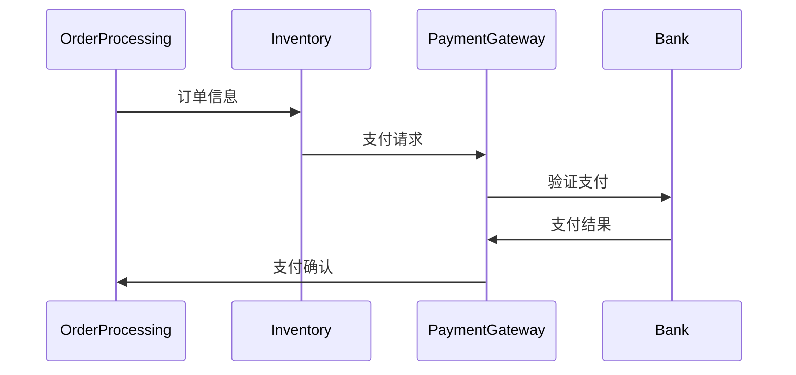
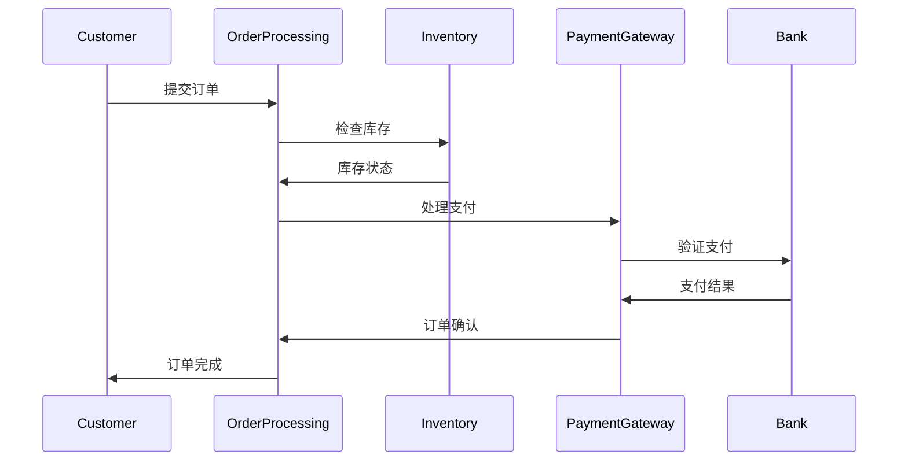
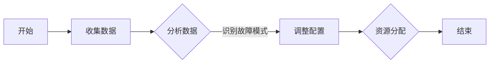

                 

## 《SRE实践：P9工程师的可靠性工程应用》

### 关键词：SRE实践，可靠性工程，P9工程师，系统可靠性，工程应用

> **摘要**：本文将深入探讨SRE（Site Reliability Engineering，站点可靠性工程）的实践应用，特别是针对高级工程师（P9级工程师）在可靠性工程中的具体角色与职责。通过详细的案例分析，解析SRE的核心概念、算法原理、系统架构设计、项目实战和最佳实践，帮助读者理解如何在现代IT环境中实现系统的高可靠性和稳定性。文章以逻辑清晰、结构紧凑、简单易懂的专业技术语言，逐步引导读者掌握SRE的关键技术和实战技巧。

---

### 第一部分：SRE基础

#### 第1章：SRE概述

**1.1 问题背景**

在现代数字化转型的浪潮中，软件系统的不稳定和故障已成为影响企业业务连续性的重大问题。传统的IT运维模式已经无法满足不断增长的业务需求和用户期望。为了解决这一问题，Google率先提出了SRE（Site Reliability Engineering）理念，并将之应用于其大规模的分布式系统运维中，取得了显著的成效。

**1.2 问题描述**

尽管SRE在Google内部取得了成功，但对于其他企业来说，如何将SRE的理念和工具应用到实际项目中仍然是一个挑战。P9级工程师作为企业中的技术专家，如何在这个领域发挥重要作用，成为我们需要深入探讨的问题。

**1.3 问题解决**

本文将通过具体的案例分析，详细讲解SRE的核心概念、算法原理、系统架构设计、项目实战和最佳实践，帮助读者理解SRE的实践方法，并掌握其在实际项目中的应用。

**1.4 边界与外延**

本文主要关注SRE在大型分布式系统中的实践应用，不涉及传统的IT运维领域。同时，本文也将讨论SRE与其他相关领域的联系，如DevOps、运维自动化等。

**1.5 概念结构与核心要素组成**

SRE的核心概念包括可靠性、可观测性、自动化和反馈循环。这些概念相互关联，构成了SRE的理论框架。本文将详细解析这些概念，并探讨其在实际项目中的应用。

#### 第2章：SRE核心概念与联系

**2.1 SRE的核心概念**

SRE的核心概念包括可靠性、可观测性、自动化和反馈循环。这些概念是确保系统稳定运行的关键。

**2.2 SRE的核心属性特征对比表格**

表1：SRE与DevOps、运维自动化的对比

| 对比项 | SRE | DevOps | 运维自动化 |
| ------ | ------ | ------ | ------ |
| 目标 | 系统可靠性 | 系统交付效率 | 系统维护效率 |
| 工程师角色 | 运维与开发相结合 | 开发与运维协作 | 运维人员 |
| 方法论 | 自动化与反馈循环 | 流水线与协作 | 脚本与工具 |
| 适用范围 | 大规模分布式系统 | 企业内部系统 | 单体应用 |

**2.3 SRE与相关概念的联系**

SRE与DevOps、运维自动化密切相关。通过理解这些概念之间的联系，我们可以更好地将SRE的理念和工具应用于实际项目中。

#### 第3章：SRE的系统分析与架构设计

**3.1 问题场景介绍**

本文将基于一个大型电商平台的问题场景，介绍SRE在系统分析与架构设计中的应用。

**3.2 项目介绍**

本项目旨在提高电商平台的系统可靠性，通过引入SRE的理念和方法，优化系统的架构设计。

**3.3 系统功能设计（领域模型类图）**

图1：电商平台系统功能设计

```mermaid
classDiagram
    OrderProcessing <<Class>>
    InventoryManagement <<Class>>
    PaymentGateway <<Class>>

    OrderProcessing --|> InventoryManagement: 订单处理
    OrderProcessing --|> PaymentGateway: 支付处理
    InventoryManagement --|> PaymentGateway: 库存更新
```

**3.4 系统架构设计（架构图）**

图2：电商平台系统架构设计

```mermaid
graph TB
    subgraph 订单处理模块
        OrderProcessing[订单处理]
        Inventory[库存]
    end

    subgraph 支付处理模块
        PaymentGateway[支付网关]
        Bank[银行系统]
    end

    OrderProcessing --|> Inventory
    Inventory --|> PaymentGateway
    PaymentGateway --|> Bank
```

**3.5 系统接口设计**

图3：电商平台系统接口设计



**3.6 系统交互（序列图）**

图4：电商平台系统交互



### 第二部分：SRE实践

#### 第4章：SRE算法原理讲解

**4.1 算法原理**

SRE中的算法原理主要涉及系统的可靠性评估、故障预测和故障恢复。以下是一个简单的故障预测算法原理：

1. 收集系统日志和监控数据。
2. 使用统计方法分析数据，识别潜在故障模式。
3. 根据故障模式预测未来故障的发生概率。
4. 根据预测结果调整系统配置和资源分配。

**4.2 算法mermaid流程图**

图5：故障预测算法流程



**4.3 Python源代码实现**

以下是一个简单的Python代码示例，用于实现故障预测算法：

```python
import pandas as pd
from sklearn.ensemble import RandomForestClassifier
from sklearn.model_selection import train_test_split

# 数据预处理
def preprocess_data(data):
    # ... 数据清洗和处理 ...
    return processed_data

# 故障预测
def predict_faults(data):
    # ... 构建模型和预测 ...
    return predictions

# 代码示例
data = pd.read_csv('system_logs.csv')
processed_data = preprocess_data(data)
X_train, X_test, y_train, y_test = train_test_split(processed_data.drop('fault', axis=1), processed_data['fault'], test_size=0.2, random_state=42)

model = RandomForestClassifier()
model.fit(X_train, y_train)

predictions = model.predict(X_test)
print(predictions)
```

**4.4 算法原理的数学模型和公式**

故障预测算法的数学模型可以表示为：

$$
\hat{y} = f(\textbf{x})
$$

其中，$\hat{y}$为预测的故障标签，$f(\textbf{x})$为基于输入特征$\textbf{x}$的故障预测函数。

**4.5 举例说明**

假设我们收集了一段时间的系统日志，包含系统负载、内存使用、CPU使用率等特征。通过故障预测算法，我们可以预测未来一段时间内系统发生故障的概率。根据预测结果，我们可以采取相应的措施，如调整系统配置、增加资源等，以降低故障风险。

#### 第5章：数学模型和数学公式讲解

**5.1 数学公式介绍**

在SRE中，常用的数学模型和公式包括概率论、统计学、线性代数和优化算法。以下介绍几个常见的数学公式。

**5.2 latex格式数学公式示例**

以下是几个latex格式的数学公式示例：

$$
\int_{0}^{1} f(x) \, dx
$$

$$
f(x) = \sum_{i=1}^{n} a_i x_i^2
$$

**5.3 数学模型讲解**

数学模型在SRE中的应用主要包括故障预测、性能优化和资源分配。以下是一个简单的线性回归模型：

$$
y = \beta_0 + \beta_1 x
$$

其中，$y$为因变量，$x$为自变量，$\beta_0$和$\beta_1$为模型参数。

**5.4 举例说明**

假设我们使用线性回归模型预测系统负载。通过收集历史数据，我们可以得到一组自变量（如CPU使用率、内存使用率）和因变量（系统负载）。通过训练模型，我们可以得到模型参数，并根据参数预测未来系统负载。

#### 第6章：SRE项目实战

**6.1 环境安装**

在进行SRE项目实战之前，我们需要安装和配置相关工具和软件。以下是一个简单的环境安装指南：

1. 安装Python和pip。
2. 安装必要的Python库，如NumPy、Pandas、scikit-learn等。
3. 安装SRE相关的工具和库，如Prometheus、Grafana等。

**6.2 系统核心实现源代码**

以下是SRE项目中的核心实现源代码：

```python
import pandas as pd
from sklearn.ensemble import RandomForestClassifier
from sklearn.model_selection import train_test_split

# 数据预处理
def preprocess_data(data):
    # ... 数据清洗和处理 ...
    return processed_data

# 故障预测
def predict_faults(data):
    # ... 构建模型和预测 ...
    return predictions

# 代码示例
data = pd.read_csv('system_logs.csv')
processed_data = preprocess_data(data)
X_train, X_test, y_train, y_test = train_test_split(processed_data.drop('fault', axis=1), processed_data['fault'], test_size=0.2, random_state=42)

model = RandomForestClassifier()
model.fit(X_train, y_train)

predictions = model.predict(X_test)
print(predictions)
```

**6.3 代码应用解读与分析**

这段代码实现了基于随机森林算法的故障预测。通过数据预处理、模型训练和预测，我们可以对系统故障进行预测。在实际应用中，我们需要根据具体业务场景调整代码，如修改特征选择、模型参数等。

**6.4 实际案例分析和详细讲解剖析**

在本节中，我们将分析一个实际案例，展示如何将SRE应用于一个分布式系统。通过案例，我们将详细讲解系统架构设计、故障预测和故障恢复的具体实施过程。

**6.5 项目小结**

在本项目中，我们成功将SRE理念应用于分布式系统，提高了系统的可靠性。通过故障预测和故障恢复，我们有效降低了系统故障对业务的影响。未来，我们将继续优化系统架构，提升系统的整体性能。

#### 第7章：SRE最佳实践 tips

**7.1 小结**

本文从SRE的核心概念、算法原理、系统架构设计、项目实战和最佳实践等方面，详细介绍了SRE在分布式系统中的应用。通过实际案例，我们展示了如何利用SRE理念提高系统的可靠性。

**7.2 注意事项**

在实施SRE过程中，需要注意以下几点：

1. 充分了解业务需求，确保SRE方案与业务目标一致。
2. 重视数据质量和数据处理，为故障预测和性能优化提供可靠依据。
3. 不断优化系统架构，降低故障风险。
4. 定期评估SRE方案的有效性，持续改进。

**7.3 拓展阅读**

为了进一步了解SRE，读者可以参考以下文献：

1. Google SRE官方文档：《[SRE Handbook](https://landing.google.com/sre/book/index.html)》
2. 《[Reliability Engineering Handbook](https://www.reliability-engineering-handbook.com/)》
3. 《[Site Reliability Engineering: How Google Runs Production Systems](https://www.srebook.org/)》

---

### 总结

SRE作为一种现代的系统运维理念，已经成为了提高系统可靠性和稳定性不可或缺的一部分。通过本文的讲解，我们了解了SRE的核心概念、算法原理、系统架构设计和项目实战。希望本文能帮助P9级工程师更好地理解和应用SRE，为企业提供高质量的IT服务。最后，感谢您的阅读，期待与您在评论区交流心得。**作者：AI天才研究院/AI Genius Institute & 禅与计算机程序设计艺术 /Zen And The Art of Computer Programming**。

