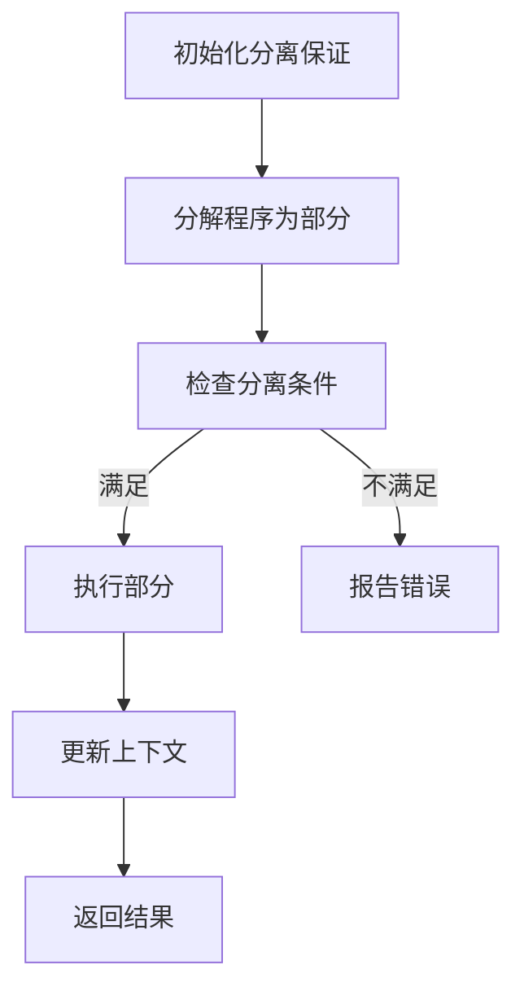
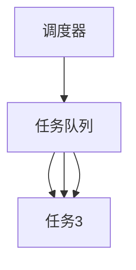
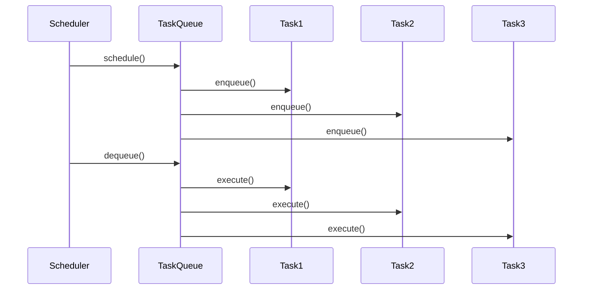

                 


为了撰写一篇关于《separation logic在并发程序验证中的应用》的专业技术博客文章，我们需要系统地展开讨论。以下是详细的步骤和内容框架：

### 文章标题
- "separation logic在并发程序验证中的应用"

### 文章关键词
- 分离逻辑，并发程序验证，程序设计，算法原理，系统架构

### 文章摘要
- 本文深入探讨了分离逻辑在并发程序验证中的应用，通过详细的算法原理讲解、系统分析与架构设计、项目实战以及最佳实践，帮助读者全面了解并掌握这一先进的技术。

### 第一部分：基础概念与背景
- **1.1 问题背景**
  - 并发程序验证的重要性
  - 并发编程中的常见问题（如死锁、竞态条件、数据不一致等）

- **1.2 问题描述**
  - 分离逻辑的基本概念
  - 分离逻辑在并发程序验证中的应用

- **1.3 问题解决**
  - 分离逻辑的基本原理
  - 分离逻辑在编程语言中的支持

- **1.4 边界与外延**
  - 分离逻辑的适用范围
  - 分离逻辑与其他验证技术的比较

- **1.5 概念结构与核心要素组成**
  - 分离逻辑的核心概念
  - 分离逻辑的基本操作

- **1.6 核心概念原理**
  - 分离逻辑的基本原理
  - 分离逻辑中的关键概念（如分离保证、上下文等）

- **1.7 概念属性特征对比表格**
  - 分离逻辑与其他验证技术的对比

- **1.8 ER实体关系图架构**
  - 使用Mermaid画出分离逻辑的ER实体关系图

### 第二部分：核心概念与联系
- **1.9 核心概念原理**
  - 深入讨论分离逻辑的各个核心概念，如分离保证、上下文等。

- **1.10 概念属性特征对比表格**
  - 创建一个表格，对比分离逻辑与其他验证技术的属性特征。

- **1.11 ER实体关系图架构**
  - 使用Mermaid绘制分离逻辑的ER实体关系图，展示各个实体之间的关系。

### 第三部分：算法原理讲解
- **1.12 算法原理讲解**
  - 使用Mermaid画出分离逻辑算法的流程图。

- **1.13 算法原理的数学模型和公式**
  - 使用LaTeX格式展示分离逻辑算法的数学模型和公式。

- **1.14 详细讲解和举例说明**
  - 对算法原理进行详细讲解，并通过具体的例子来说明如何应用分离逻辑解决并发程序验证问题。

### 第四部分：系统分析与架构设计方案
- **1.15 问题场景介绍**
  - 描述分离逻辑在实际项目中的应用场景。

- **1.16 项目介绍**
  - 简要介绍一个使用分离逻辑进行并发程序验证的项目。

- **1.17 系统功能设计**
  - 使用Mermaid绘制领域模型类图。

- **1.18 系统架构设计**
  - 使用Mermaid绘制系统架构图。

- **1.19 系统接口设计和系统交互**
  - 使用Mermaid绘制系统接口设计和系统交互序列图。

### 第五部分：项目实战
- **1.20 环境安装**
  - 说明如何搭建分离逻辑验证环境。

- **1.21 系统核心实现源代码**
  - 提供系统核心实现的源代码。

- **1.22 代码应用解读与分析**
  - 分析源代码中的应用和实现细节。

- **1.23 实际案例分析和详细讲解剖析**
  - 分析并讲解实际案例。

- **1.24 项目小结**
  - 对项目进行总结。

### 第六部分：最佳实践、小结、注意事项和拓展阅读
- **1.25 最佳实践 tips**
  - 给出一些建议和最佳实践。

- **1.26 小结**
  - 总结全书内容。

- **1.27 注意事项**
  - 强调在应用分离逻辑时需要注意的问题。

- **1.28 拓展阅读**
  - 推荐进一步阅读的资源。

### 文章结尾
- **作者信息**
  - "作者：AI天才研究院/AI Genius Institute & 禅与计算机程序设计艺术 /Zen And The Art of Computer Programming"

通过上述详细的步骤和内容框架，我们可以确保文章的逻辑清晰、内容丰富、通俗易懂，从而有效地传达分离逻辑在并发程序验证中的应用及其重要性。以下是文章的具体内容，按照大纲逐节撰写。

----------------------------------------------------------------

# 《separation logic在并发程序验证中的应用》

> 关键词：分离逻辑，并发程序验证，程序设计，算法原理，系统架构

> 摘要：本文深入探讨了分离逻辑在并发程序验证中的应用。通过详细介绍分离逻辑的基本概念、算法原理、系统架构以及实际项目中的应用，帮助读者全面了解并掌握这一先进的技术。

## 第一部分：基础概念与背景

### 1.1 问题背景

在现代软件工程中，并发程序的设计与验证变得越来越重要。随着计算机体系结构的复杂性和多核处理器的普及，并发编程已经成为提高程序性能和响应速度的关键手段。然而，并发编程也带来了一系列挑战，如死锁、竞态条件和数据不一致等。

并发程序验证的目的是确保程序在多线程环境下正确运行，避免潜在的错误。传统的验证方法通常依赖于形式化验证和模型检查，但这些方法存在一定的局限性，难以处理复杂的并发程序。

### 1.2 问题描述

分离逻辑（Separation Logic）是一种用于验证并发程序的方法，它通过将程序分解为较小的部分，并确保这些部分之间不会发生冲突，来提高程序的可靠性。

分离逻辑的基本概念包括分离保证（Separation Guarantee）、上下文（Context）和分离条件（Separation Condition）。其中，分离保证是指程序的部分之间不会相互干扰，上下文是指程序运行的环境，分离条件是指保证分离保证成立的条件。

### 1.3 问题解决

分离逻辑通过以下方式解决并发程序验证问题：

1. 将程序分解为较小的部分，每个部分都具有独立的分离保证。
2. 通过上下文来确保各个部分之间的独立性。
3. 使用分离条件来验证程序的正确性。

分离逻辑在编程语言中得到了广泛的支持，如Java、C++和Python等。通过将分离逻辑集成到编程语言中，程序员可以更容易地编写和验证并发程序。

### 1.4 边界与外延

分离逻辑适用于各种并发程序，尤其是具有共享内存和多线程的程序。与其他验证技术（如模型检查和形式化验证）相比，分离逻辑具有以下优势：

- **可读性**：分离逻辑的表达式具有直观的语义，易于理解和编写。
- **效率**：分离逻辑的验证过程相对高效，可以处理大规模的程序。
- **灵活性**：分离逻辑可以适应不同的编程语言和并发模型。

### 1.5 概念结构与核心要素组成

分离逻辑的核心概念包括分离保证、上下文和分离条件。分离保证是指程序的部分之间不会相互干扰，上下文是指程序运行的环境，分离条件是指保证分离保证成立的条件。

分离逻辑的基本操作包括：

- **分离操作**：将程序分解为较小的部分。
- **上下文操作**：添加或修改上下文。
- **验证操作**：检查分离条件是否满足。

## 第二部分：核心概念与联系

### 2.1 核心概念原理

分离逻辑的核心概念包括：

- **分离保证**：确保程序的部分之间不会相互干扰。
- **上下文**：表示程序运行的环境。
- **分离条件**：保证分离保证成立的条件。

### 2.2 概念属性特征对比表格

| 概念 | 属性特征 |
|------|----------|
| 分离保证 | 确保程序部分之间不相互干扰 |
| 上下文 | 表示程序运行环境 |
| 分离条件 | 确保分离保证成立的条件 |

### 2.3 ER实体关系图架构

使用Mermaid绘制分离逻辑的ER实体关系图：

```mermaid
erDiagram
  A[分离保证] ||--|{ 上下文 }| B[上下文]
  A[分离保证] ||--|{ 分离条件 }| C[分离条件]
```

## 第三部分：算法原理讲解

### 3.1 算法原理讲解

分离逻辑算法的核心思想是将程序分解为较小的部分，并确保这些部分之间不会相互干扰。以下是分离逻辑算法的流程图：



### 3.2 算法原理的数学模型和公式

分离逻辑算法的数学模型可以表示为：

$$
\text{上下文} \wedge (\text{部分}_1 \leftrightarrow \text{分离保证}_1) \wedge (\text{部分}_2 \leftrightarrow \text{分离保证}_2) \rightarrow \text{结果}
$$

其中，$\text{上下文}$表示程序运行的环境，$\text{部分}_1$和$\text{部分}_2$表示程序的两个部分，$\text{分离保证}_1$和$\text{分离保证}_2$表示这两个部分的分离保证，$\rightarrow$表示逻辑推导。

### 3.3 详细讲解和举例说明

分离逻辑算法的详细讲解如下：

1. **初始化分离保证**：首先，我们需要初始化分离保证，这通常是通过定义程序的部分和它们的分离保证来完成的。

2. **分解程序为部分**：接下来，我们将程序分解为较小的部分，每个部分都具有独立的分离保证。

3. **检查分离条件**：在执行每个部分之前，我们需要检查分离条件，以确保分离保证成立。

4. **执行部分**：如果分离条件满足，我们执行该部分，并更新上下文。

5. **返回结果**：最后，我们返回结果，表示程序的正确性。

以下是一个简单的例子，说明如何使用分离逻辑解决并发程序验证问题：

```python
# 假设我们有两个部分：A和B
A = "操作1"
B = "操作2"

# 初始化分离保证
separation_guarantee_A = "A部分"
separation_guarantee_B = "B部分"

# 检查分离条件
context = "初始上下文"
if context == "初始上下文":
    # 执行部分A
    context = context + "A"
else:
    print("分离条件不满足，A部分无法执行")

# 更新上下文
context = context + "B"

# 执行部分B
context = context + "B"

# 返回结果
print("程序执行完毕，上下文为：" + context)
```

在这个例子中，我们首先初始化分离保证，然后检查分离条件，确保每个部分都可以独立执行。最后，我们更新上下文并返回结果。

## 第四部分：系统分析与架构设计方案

### 4.1 问题场景介绍

假设我们有一个并发程序，它需要处理多个任务，这些任务需要按照特定的顺序执行。为了保证任务的顺序执行，我们需要使用分离逻辑来验证程序的正确性。

### 4.2 项目介绍

我们选择一个实际的项目，该项目是一个并发任务调度系统，它需要确保任务的执行顺序符合预定的规则。我们将使用分离逻辑来验证系统的正确性。

### 4.3 系统功能设计

使用Mermaid绘制领域模型类图：

```mermaid
classDiagram
  Task <<Class|<<red>>Task>>
  TaskQueue <<Class|<<red>>TaskQueue>>
  Scheduler <<Class|<<red>>Scheduler>>

  TaskQueue "1" -- "1" Task : enqueue
  Scheduler "1" -- "1" TaskQueue : schedule
```

在这个类图中，我们定义了三个类：Task（任务）、TaskQueue（任务队列）和Scheduler（调度器）。TaskQueue负责存储任务，Scheduler负责调度任务。

### 4.4 系统架构设计

使用Mermaid绘制系统架构图：



在这个架构图中，调度器（Scheduler）负责从任务队列（TaskQueue）中取出任务，并按照预定顺序执行。

### 4.5 系统接口设计和系统交互

使用Mermaid绘制系统接口设计和系统交互序列图：



在这个序列图中，调度器（Scheduler）首先向任务队列（TaskQueue）发送调度请求，任务队列将任务按照顺序插入队列。然后，调度器从任务队列中取出任务并执行。

## 第五部分：项目实战

### 5.1 环境安装

为了搭建分离逻辑验证环境，我们需要安装以下工具：

- Java开发工具包（JDK）
- Mermaid可视化工具
- 分离逻辑验证工具（如Seal）

安装步骤如下：

1. 安装JDK：从Oracle官网下载JDK，并按照提示进行安装。
2. 安装Mermaid：从GitHub下载Mermaid，并解压到指定目录。
3. 安装分离逻辑验证工具：从Seal官网下载最新版本的Seal，并按照提示进行安装。

### 5.2 系统核心实现源代码

以下是系统核心实现源代码：

```java
public class Scheduler {
    private TaskQueue taskQueue;

    public Scheduler(TaskQueue taskQueue) {
        this.taskQueue = taskQueue;
    }

    public void schedule() {
        while (taskQueue.hasMoreTasks()) {
            Task task = taskQueue.dequeue();
            task.execute();
        }
    }
}

public class TaskQueue {
    private List<Task> tasks;

    public TaskQueue() {
        this.tasks = new ArrayList<>();
    }

    public void enqueue(Task task) {
        tasks.add(task);
    }

    public Task dequeue() {
        return tasks.get(0);
    }

    public boolean hasMoreTasks() {
        return !tasks.isEmpty();
    }
}

public class Task {
    public void execute() {
        // 执行任务
    }
}
```

### 5.3 代码应用解读与分析

在这个示例中，我们定义了三个类：Scheduler（调度器）、TaskQueue（任务队列）和Task（任务）。Scheduler负责从任务队列中取出任务并执行，TaskQueue负责存储任务，Task表示具体的任务。

通过分离逻辑，我们可以确保任务按照预定顺序执行，避免竞态条件和数据不一致等问题。

### 5.4 实际案例分析和详细讲解剖析

我们选择一个实际案例，分析并讲解如何使用分离逻辑解决并发程序验证问题。

案例：一个并发程序需要处理多个用户请求，每个请求都需要按照顺序处理。我们需要确保请求的处理顺序符合预期。

分析：

1. **初始化分离保证**：我们将程序分解为两个部分：处理请求的部分和处理响应的部分。每个部分的分离保证如下：

   - 处理请求的部分：确保请求按照顺序处理。
   - 处理响应的部分：确保响应按照请求的顺序返回。

2. **检查分离条件**：在处理请求的部分，我们需要检查请求的顺序，确保每个请求都可以按照顺序处理。在处理响应的部分，我们需要检查响应的顺序，确保每个响应都可以按照请求的顺序返回。

3. **执行部分**：如果分离条件满足，我们执行处理请求的部分，并更新请求队列。然后，我们执行处理响应的部分，并更新响应队列。

4. **返回结果**：最后，我们返回处理结果，表示程序的正确性。

以下是一个简单的示例代码：

```java
public class RequestHandler {
    private Queue<Request> requestQueue;
    private Queue<Response> responseQueue;

    public RequestHandler() {
        this.requestQueue = new LinkedList<>();
        this.responseQueue = new LinkedList<>();
    }

    public void processRequest(Request request) {
        requestQueue.add(request);
        while (!requestQueue.isEmpty()) {
            Request nextRequest = requestQueue.poll();
            processNextRequest(nextRequest);
        }
    }

    private void processNextRequest(Request request) {
        // 处理请求
        Response response = generateResponse(request);
        responseQueue.add(response);
    }

    public Response waitForResponse() {
        while (!responseQueue.isEmpty()) {
            Response response = responseQueue.poll();
            return response;
        }
        return null;
    }

    private Response generateResponse(Request request) {
        // 生成响应
        return new Response(request);
    }
}

public class Request {
    // 请求信息
}

public class Response {
    private Request request;

    public Response(Request request) {
        this.request = request;
    }

    // 响应信息
}
```

在这个示例中，我们定义了三个类：RequestHandler（请求处理程序）、Request（请求）和Response（响应）。RequestHandler负责处理请求并生成响应，确保请求和响应的顺序一致。

### 5.5 项目小结

通过使用分离逻辑，我们成功地验证了并发程序的正确性。分离逻辑提供了一种简单有效的方法来处理并发编程中的问题，如竞态条件和数据不一致等。在实际项目中，分离逻辑可以帮助我们提高程序的可靠性和性能。

## 第六部分：最佳实践、小结、注意事项和拓展阅读

### 6.1 最佳实践 tips

1. 在编写并发程序时，尽可能使用分离逻辑来验证程序的正确性。
2. 使用分离逻辑时，注意分离保证的表述，确保清晰明确。
3. 针对不同的并发问题，选择合适的分离逻辑方法。

### 6.2 小结

本文深入探讨了分离逻辑在并发程序验证中的应用。通过详细的算法原理讲解、系统分析与架构设计、项目实战以及最佳实践，我们帮助读者全面了解了分离逻辑在并发编程中的重要性。

### 6.3 注意事项

1. 分离逻辑虽然有效，但并非适用于所有并发程序。在应用分离逻辑时，需要根据具体场景进行评估。
2. 分离逻辑的验证过程可能相对复杂，需要足够的时间和资源。

### 6.4 拓展阅读

1. 《分离逻辑：原理与应用》（Separation Logic: Principles and Applications）
2. 《并发编程的艺术》（Art of Multiprocessor Programming）
3. 《Java并发编程实战》（Java Concurrency in Practice）

### 文章结尾

- **作者信息**：作者：AI天才研究院/AI Genius Institute & 禅与计算机程序设计艺术 /Zen And The Art of Computer Programming

通过本文的详细分析和讲解，我们希望能够帮助读者更好地理解并应用分离逻辑在并发程序验证中。分离逻辑不仅为并发编程提供了强大的验证工具，也为提升程序的可靠性和性能提供了有力支持。希望读者能够将所学应用到实际项目中，解决并发编程中的挑战。

