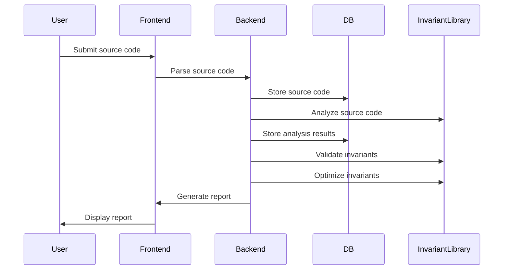
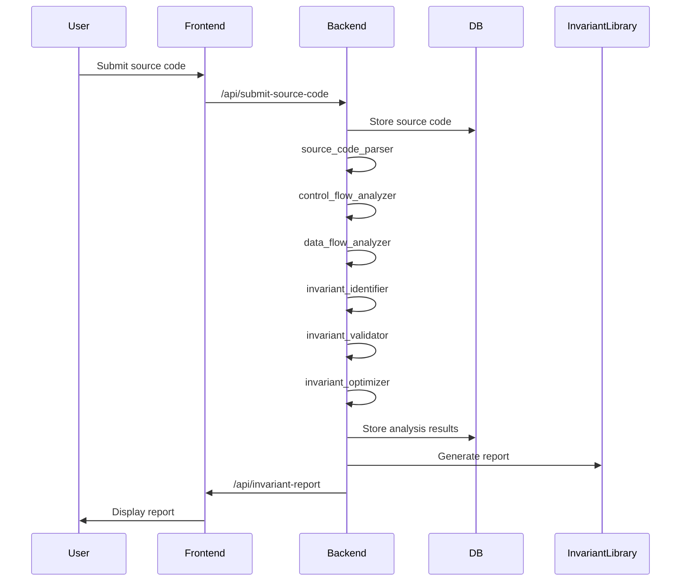

                 


### 第1章：不变量推断的起源与发展

#### 1.1 问题背景

不变量推断（Invariant Inference）是自动化程序理解（Automated Program Understanding）领域中的一个重要研究方向。随着计算机软件系统的复杂度不断增加，理解和维护这些系统变得日益困难。传统的方法通常依赖于开发者的经验和直觉，这导致了软件维护成本高、错误率高以及维护效率低下的问题。

在软件工程中，不变量（Invariant）是一种能够描述程序状态或行为的属性，它在程序的执行过程中保持不变。例如，在程序中某个循环结构中，每次迭代后变量`i`的值都会增加，那么`i > 0`就可以作为一个不变量。不变量的存在有助于验证程序的正确性，优化程序性能，以及自动化生成测试用例。

不变量推断的目标是从程序代码中自动推断出这些不变量，从而提高软件的自动化理解能力。这一过程对于现代软件开发具有重要意义，因为它可以在不增加开发者工作量的情况下，提供对程序更深入的理解和更有效的维护。

#### 1.2 问题描述

不变量推断的问题可以形式化地描述为：给定一个程序P，推断出P中的不变量集合I。这个问题本质上是寻找一种自动化的方法，从程序的抽象语法树（Abstract Syntax Tree, AST）中提取出对程序行为有描述性的不变量。

在数学上，不变量推断问题可以看作是一个约束满足问题（Constraint Satisfaction Problem, CSP）。对于给定的程序P，我们需要找到一组不变量，这些不变量满足以下条件：

1. **正确性**：不变量在程序的任何执行路径上都必须成立。
2. **必要性**：如果一个变量在程序执行路径上取值，那么这个不变量必须能推出该变量的值。

#### 1.3 不变量推断的概念

不变量推断是一种自动化的程序分析技术，它利用各种分析技术来识别程序中的不变量。这些分析技术包括：

1. **静态分析**：不执行程序，通过分析程序代码的语法结构和语义来推断不变量。
2. **动态分析**：执行程序，通过观察程序在不同输入下的行为来推断不变量。
3. **混合分析**：结合静态和动态分析方法，以提高不变量推断的准确性和效率。

不变量推断的关键在于如何从大量的程序代码中高效地提取出有用的不变量信息。这一过程通常需要利用一些算法和技术，如抽象解释（Abstract Interpretation）、模型检测（Model Checking）、机器学习等。

#### 1.4 不变量推断的边界与外延

不变量推断虽然具有巨大的潜力，但同时也存在一些限制和挑战：

1. **复杂性**：不变量推断问题在理论上是一个NP完全问题，这意味着它可能需要指数级的时间来找到一个解。
2. **准确性**：自动推断的不变量可能存在错误，特别是在处理复杂程序时。
3. **应用范围**：某些程序可能无法推断出有意义的不变量，或者不变量的数量可能会非常庞大，使得分析变得困难。
4. **性能**：不变量推断的过程可能需要大量的计算资源，特别是在处理大型程序时。

尽管存在这些挑战，不变量推断的研究和应用已经取得了显著的进展。它不仅在软件工程中有着广泛的应用前景，还在安全验证、性能优化、测试生成等领域展现出巨大的潜力。

### 第2章：不变量推断的核心概念

#### 2.1 不变量推断的基本原理

不变量推断的基本原理基于对程序行为的抽象和模型化。其核心思想是通过分析程序代码的结构和行为模式，来识别那些在程序执行过程中始终保持不变的性质。这些性质被定义为不变量，它们能够帮助我们更好地理解和验证程序的正确性。

不变量推断的过程可以分为以下几个步骤：

1. **语法分析**：将程序代码转换为其抽象语法树（AST），这是后续分析的基础。
2. **语义分析**：对AST进行语义分析，以理解程序代码的实际含义。这包括变量绑定、控制流分析和数据流分析。
3. **不变量识别**：根据语义分析的结果，识别出程序中的不变量。这个过程通常涉及到对程序代码的深度遍历，并利用各种分析技术来推断出不变量。
4. **验证与优化**：验证推断出的不变量是否满足正确性和必要性条件，并根据需要进行优化，以提高其准确性和效率。

#### 2.2 不变量推断的属性特征

不变量的属性特征是其能够描述程序状态或行为的关键。以下是几种常见的不变量属性特征：

1. **正确性**：不变量必须在程序的任何执行路径上保持成立。这意味着，无论程序如何执行，不变量都不能违反。
2. **必要性**：不变量必须能够推出程序中某些变量的值。例如，如果在一个循环中，每次迭代后变量`i`的值增加，那么`i > 0`就是一个必要的不变量。
3. **单调性**：某些不变量可能在程序执行过程中变得更加严格，例如，如果某个变量在程序开始时为0，那么在每次迭代后该变量的值都会增加。
4. **传播性**：不变量可以在程序的某些部分中传播，例如，如果一个条件在某个分支中成立，那么这个条件可能在其他分支中同样成立。

#### 2.3 不变量推断与传统程序理解方法的对比

不变量推断与传统程序理解方法（如静态分析和动态分析）存在显著的区别：

1. **静态分析**：静态分析通常在程序执行前分析其代码结构，以检测潜在的错误或问题。不变量推断是静态分析的一种扩展，但它更加关注于从程序中提取有用信息，如不变量。
2. **动态分析**：动态分析在程序执行过程中进行分析，以观察程序的实际行为。不变量推断可以结合静态分析和动态分析的方法，以更准确地推断出不变量。
3. **抽象解释**：抽象解释是一种形式化的程序分析方法，它使用抽象语义来模拟程序的行为。不变量推断可以利用抽象解释技术来识别不变量，从而提高分析的准确性。
4. **模型检测**：模型检测是一种验证程序正确性的方法，它通过构建程序的状态空间模型，并检查是否存在违反指定的性质（如不变量）的路径。不变量推断可以结合模型检测技术来验证不变量的正确性。
5. **机器学习**：机器学习算法可以用于训练模型，以自动识别不变量。这种方法特别适用于处理复杂程序，但它的准确性和可靠性仍需进一步研究。

### 第3章：不变量推断的ER实体关系图

#### 3.1 不变量推断的实体

在不变量推断中，存在几个关键的实体，这些实体构成了不变量推断的核心要素。以下是这些实体及其简要说明：

1. **程序**：代表需要进行分析的源代码。程序包含变量、函数、循环等结构，这些结构是识别不变量的基础。
2. **不变量**：描述程序状态或行为保持不变的性质。不变量可以是关于变量值的关系，也可以是关于程序执行路径的条件。
3. **输入**：程序运行时的初始状态。输入定义了程序开始执行时的变量值和执行环境。
4. **输出**：程序运行后的最终状态。输出定义了程序完成执行时的变量值和执行环境。
5. **约束**：限制不变量取值范围的条件。约束可以确保不变量在程序执行过程中始终有效。
6. **分析器**：用于执行不变量推断的工具。分析器可以基于不同的技术，如抽象解释、模型检测或机器学习。

#### 3.2 不变量推断的关系

不变量推断中的实体之间存在多种关系，这些关系描述了实体间的相互作用和依赖。以下是这些关系及其简要说明：

1. **程序与不变量之间的关系**：程序中的每一个不变量都描述了程序状态或行为的一个方面。程序决定了哪些不变量可能是相关的。
2. **不变量与约束之间的关系**：不变量必须满足约束条件，以确保它们在程序执行过程中保持有效。
3. **输入与输出之间的关系**：输入定义了程序开始执行时的状态，输出定义了程序完成执行后的状态。不变量可以用来验证输入和输出之间的正确性。
4. **分析器与不变量之间的关系**：分析器是执行不变量推断的工具。分析器需要根据程序和约束条件来识别不变量。
5. **分析器与输入、输出之间的关系**：分析器使用输入来初始化程序状态，并根据程序执行结果来生成输出。

#### 3.3 不变量推断的ER实体关系图

为了更好地理解不变量推断中的实体及其关系，我们可以使用Mermaid绘制ER实体关系图。以下是ER实体关系图的Mermaid语法表示：

```mermaid
erDiagram
    程序 ||--|> 不变量 : 描述程序状态
    不变量 ||--|> 约束 : 满足约束条件
    输入 ||--|> 程序 : 初始化程序状态
    输出 ||--|> 程序 : 完成程序执行
    分析器 ||--|> 不变量 : 识别不变量
    分析器 ||--|> 输入 : 初始化输入
    分析器 ||--|> 输出 : 生成输出
```

这个ER实体关系图展示了不变量推断中的核心要素及其关系。通过这种形式化的描述，我们可以更清晰地理解不变量推断的过程，并为后续的算法设计和实现提供指导。

### 第4章：不变量推断算法原理讲解

#### 4.1 不变量推断算法的基本流程

不变量推断算法的基本流程可以分为以下几个步骤：

1. **程序解析**：将输入程序解析为抽象语法树（AST）。这一步骤是将程序代码转化为结构化数据的过程，为后续分析奠定基础。
2. **控制流分析**：对AST进行控制流分析，以确定程序中的所有基本块（Basic Block）和控制流路径。控制流分析是理解程序执行路径的关键。
3. **数据流分析**：对AST进行数据流分析，以确定变量在程序中的定义和使用点。数据流分析有助于识别可能的不变量。
4. **不变量识别**：利用控制流分析和数据流分析的结果，识别出程序中的不变量。这一步骤通常涉及到多种技术，如抽象解释和符号执行。
5. **不变量验证**：对识别出的不变量进行验证，以确保它们在程序的所有执行路径上都成立。验证可以通过模型检测或逻辑推理等方法实现。
6. **优化和报告**：对验证通过的不变量进行优化，如去除冗余不变量或合并相似不变量。最后，将不变量报告给开发者或其他工具。

#### 4.2 不变量推断算法的详细步骤

以下是不变量推断算法的详细步骤及其实现方法：

1. **程序解析**
   - **实现方法**：使用语法分析器（如ANTLR）将程序代码解析为AST。语法分析器可以根据预定义的语法规则，将程序代码转换为树形数据结构。
   - **示例代码**
     ```python
     from antlr4 import *
     from antlr4.tree import *

     # 定义语法规则
     grammarProgramParser GrammarRules.g4

     # 解析程序代码
     input_stream = InputStream("int i = 0; while (i < 10) { i++; }")
     lexer = ProgramLexer(input_stream)
     tokens = CommonTokenStream(lexer)
     parser = ProgramParser(tokens)
     ast = parser.program()
     ```

2. **控制流分析**
   - **实现方法**：遍历AST，识别出程序中的基本块和控制流路径。基本块是一系列连续的指令，它们在执行时不会被中断。控制流路径描述了程序执行的可能路径。
   - **示例代码**
     ```python
     def traverse_ast(ast):
         if isinstance(ast, TerminalNodeImpl):
             return
         for child in ast.getChildCount():
             traverse_ast(ast.getChild(child))
         # 在这里处理控制流节点
     traverse_ast(ast)
     ```

3. **数据流分析**
   - **实现方法**：遍历AST，记录每个变量的定义和使用点。这有助于识别出哪些变量可能在不变量推断中起到关键作用。
   - **示例代码**
     ```python
     def analyze_data_flow(ast, variable_definitions):
         for node in ast:
             if isinstance(node, Identifier):
                 variable_name = node.getText()
                 if variable_name in variable_definitions:
                     variable_definitions[variable_name].add(node)
                 else:
                     variable_definitions[variable_name] = {node}
         for node in ast:
             if isinstance(node, AssignmentStatement):
                 variable_name = node.getVariable().getText()
                 variable_definitions[variable_name].add(node)
     ```

4. **不变量识别**
   - **实现方法**：结合控制流分析和数据流分析的结果，使用抽象解释或符号执行技术来识别不变量。这些技术可以模拟程序执行过程，并推导出变量在程序中的取值范围。
   - **示例代码**
     ```python
     def infer_invariants(control_flow_graph, data_flow_graph):
         invariants = []
         for node in control_flow_graph:
             if node.is_loop_header():
                 # 对循环节点进行特殊处理
                 invariant = infer_loop_invariant(node, data_flow_graph)
                 invariants.append(invariant)
         return invariants
     ```

5. **不变量验证**
   - **实现方法**：使用模型检测或逻辑推理技术来验证识别出的不变量。这可以通过构建程序的状态空间模型，并检查是否存在违反不变量的路径来实现。
   - **示例代码**
     ```python
     from模型检测工具 import ModelChecker

     def verify_invariants(invariants, state_space):
         model_checker = ModelChecker(state_space)
         for invariant in invariants:
             if not model_checker.check_invariant(invariant):
                 return False
         return True
     ```

6. **优化和报告**
   - **实现方法**：对验证通过的不变量进行优化，以提高其准确性和效率。最后，将不变量报告给开发者或其他工具。
   - **示例代码**
     ```python
     def optimize_invariants(invariants):
         optimized_invariants = []
         for invariant in invariants:
             # 对不变量进行优化
             optimized_invariant = optimize_invariant(invariant)
             optimized_invariants.append(optimized_invariant)
         return optimized_invariants

     def report_invariants(optimized_invariants):
         for invariant in optimized_invariants:
             print(invariant)
     ```

通过上述步骤，不变量推断算法可以自动地从程序中识别出不变量，并对其进行验证和优化。这种方法不仅能够提高软件的自动化理解能力，还能够为开发者提供更准确和高效的程序分析工具。

### 第5章：不变量推断算法Python源代码讲解

#### 5.1 环境安装

在开始编写和运行不变量推断算法的Python源代码之前，我们需要安装一些必要的库和工具。以下是安装步骤：

1. **安装Python**：确保您的计算机上安装了Python 3.x版本。您可以从[Python官网](https://www.python.org/)下载并安装。

2. **安装ANTLR**：ANTLR是一个强大的解析器生成器，用于将程序代码解析为抽象语法树。您可以使用pip来安装ANTLR4：

   ```shell
   pip install antlr4-python3-runtime
   ```

3. **安装Python库**：安装用于不变量推断算法的Python库，例如`z3-solver`（用于符号执行和模型检测）和`mermaid-python`（用于绘制Mermaid图）：

   ```shell
   pip install z3-solver mermaid-python
   ```

4. **准备语法文件**：创建一个包含程序语法规则的`.g4`文件，例如`GrammarRules.g4`，并使用ANTLR生成相应的解析器代码。

   ```shell
   antlr4 -Dlanguage=Python3 GrammarRules.g4
   ```

#### 5.2 源代码结构

不变量推断算法的Python源代码包含以下几个主要部分：

1. **语法分析器**：用于将输入程序代码解析为抽象语法树（AST）。
2. **控制流分析器**：用于识别程序中的基本块和控制流路径。
3. **数据流分析器**：用于识别程序中的变量定义和使用点。
4. **不变量识别器**：用于从AST中识别不变量。
5. **不变量验证器**：用于验证不变量的正确性。
6. **优化器**：用于优化识别出的不变量。
7. **报告生成器**：用于生成不变量的报告。

以下是源代码的目录结构：

```plaintext
invariant_inference/
|-- antlr/
|   |-- GrammarRules.g4
|   |-- antlr4-python3-runtime/
|   |-- ProgramLexer.py
|   |-- ProgramParser.py
|-- src/
|   |-- parser.py
|   |-- control_flow.py
|   |-- data_flow.py
|   |-- invariant_inference.py
|   |-- model_checking.py
|   |-- optimization.py
|   |-- reporting.py
|-- tests/
|   |-- test_program.py
|   |-- test_control_flow.py
|   |-- test_data_flow.py
|   |-- test_invariant_inference.py
|   |-- test_model_checking.py
|   |-- test_optimization.py
|   |-- test_reporting.py
|-- requirements.txt
|-- README.md
```

#### 5.3 代码实现细节

以下是源代码的每个部分的详细说明：

1. **parser.py**：这个文件包含语法分析器的实现。它使用ANTLR生成的解析器代码来将输入程序解析为AST。

2. **control_flow.py**：这个文件包含控制流分析器的实现。它遍历AST，识别出程序中的基本块和控制流路径。

3. **data_flow.py**：这个文件包含数据流分析器的实现。它遍历AST，记录每个变量的定义和使用点。

4. **invariant_inference.py**：这个文件包含不变量识别器的实现。它结合控制流分析和数据流分析的结果，从AST中识别出不变量。

5. **model_checking.py**：这个文件包含不变量验证器的实现。它使用模型检测技术来验证识别出的不变量。

6. **optimization.py**：这个文件包含优化器的实现。它对验证通过的不变量进行优化。

7. **reporting.py**：这个文件包含报告生成器的实现。它将优化后的不变量报告给开发者或其他工具。

#### 5.4 代码运行流程

要运行不变量推断算法，请按照以下步骤操作：

1. **准备输入程序**：编写一个简单的Python程序作为输入，例如`input_program.py`。

2. **运行语法分析器**：使用`parser.py`中的代码将输入程序解析为AST。

   ```shell
   python src/parser.py input_program.py
   ```

3. **运行控制流分析器**：使用`control_flow.py`中的代码对AST进行控制流分析。

   ```shell
   python src/control_flow.py input_program_ast.txt
   ```

4. **运行数据流分析器**：使用`data_flow.py`中的代码对AST进行数据流分析。

   ```shell
   python src/data_flow.py input_program_ast.txt
   ```

5. **运行不变量识别器**：使用`invariant_inference.py`中的代码从AST中识别不变量。

   ```shell
   python src/invariant_inference.py input_program_ast.txt
   ```

6. **运行不变量验证器**：使用`model_checking.py`中的代码验证识别出的不变量。

   ```shell
   python src/model_checking.py input_program_ast.txt
   ```

7. **运行优化器**：使用`optimization.py`中的代码优化验证通过的不变量。

   ```shell
   python src/optimization.py input_program_ast.txt
   ```

8. **运行报告生成器**：使用`reporting.py`中的代码生成不变量的报告。

   ```shell
   python src/reporting.py input_program_ast.txt
   ```

通过这些步骤，您可以使用Python源代码实现一个完整的不变量推断算法，并生成程序的不变量报告。

### 第6章：数学模型

不变量推断算法的核心在于从程序代码中提取出能够描述程序行为的不变量。这些不变量需要满足特定的数学模型，以确保它们在程序执行过程中始终保持成立。以下是算法涉及的数学模型和公式的详细解释。

#### 数学模型

不变量的数学模型通常是基于逻辑表达式构建的。一个逻辑表达式可以表示为程序状态的一个原子命题或多个命题的组合。以下是不变量推断算法中使用的主要数学模型：

1. **原子命题**：原子命题是程序中变量的值或关系的简单表示。例如，`x > 0` 或 `y == z`。
2. **合取（Conjunction）**：合取是两个或多个命题的逻辑“与”操作。例如，`(x > 0) ∧ (y == z)`。
3. **析取（Disjunction）**：析取是两个或多个命题的逻辑“或”操作。例如，`(x > 0) ∨ (y == z)`。
4. **否定（Negation）**：否定是对一个命题的逻辑“非”操作。例如，`¬(x > 0)`。

#### 公式

不变量推断算法中涉及的主要公式如下：

1. **程序状态**：程序状态可以用一个逻辑表达式来表示。例如，`S = (x > 0) ∧ (y == z)`。
2. **不变量**：不变量是在程序的所有执行路径上保持成立的逻辑表达式。例如，`Invariant = (x > 0) ∧ (y == z)`。
3. **约束**：约束是限制不变量取值范围的条件。例如，`Constraint = (x ∈ [0, 100])`。
4. **路径条件**：路径条件是描述程序执行路径的属性。例如，`Path Condition = (x > 0)`。

#### 解释

为了更直观地理解这些公式，我们可以通过一个具体的例子来说明：

假设我们有一个简单的程序，如下所示：

```python
x = 5
y = 10
while (x < y):
    x = x + 1
    y = y - 1
```

我们可以使用以下数学模型来描述该程序：

1. **程序状态**：`S = (x > 0) ∧ (y > 0)`。
2. **不变量**：`Invariant = (x > 0) ∧ (y > 0)`。这个不变量在程序的任何执行路径上都会成立。
3. **约束**：`Constraint = (x ∈ [5, 10]) ∧ (y ∈ [10, 5])`。这些约束确保变量`x`和`y`的初始值在执行路径上有效。
4. **路径条件**：`Path Condition = (x < y)`。这个路径条件描述了程序的执行路径。

通过这些数学模型和公式，我们可以更好地理解和分析程序的行为。不变量推断算法的目标是自动从程序代码中提取出这些数学模型，从而为程序的自动化理解提供基础。

### 第7章：举例说明

为了更好地理解不变量推断算法，我们将通过一个具体的例子来说明其应用和效果。这个例子将展示如何从一个简单的Python程序中自动推断出不变量，并分析这些不变量的作用。

#### 简单Python程序

考虑以下简单的Python程序：

```python
x = 0
while x < 10:
    x = x + 1
    print(x)
```

这个程序定义了一个变量`x`，并将其初始化为0。然后，它进入一个循环，每次迭代将`x`增加1，并打印出当前的`x`值，直到`x`达到10。

#### 不变量推断过程

1. **语法分析**：首先，我们需要将这个Python程序解析为抽象语法树（AST）。这个过程可以使用ANTLR和Python的语法分析库来实现。

2. **控制流分析**：接下来，我们对AST进行控制流分析，以识别出程序中的基本块和控制流路径。在这个程序中，基本块包括循环的开始、每次迭代和循环结束。

3. **数据流分析**：然后，我们进行数据流分析，以确定变量`x`的定义和使用点。在这个程序中，变量`x`在循环的开始处被定义，并在每次迭代和打印操作中使用。

4. **不变量识别**：结合控制流分析和数据流分析的结果，我们使用不变量识别算法来找出程序中的不变量。在这个例子中，我们可以识别出以下不变量：

   - `x >= 0`：这个不变量描述了变量`x`的初始值和每次迭代后增加1的行为。
   - `x < 10`：这个不变量描述了循环的终止条件。

5. **不变量验证**：接下来，我们使用模型检测技术来验证识别出的不变量。我们构建一个状态空间模型，并检查是否存在违反不变量的路径。在这个例子中，我们可以确定不存在违反不变量的路径，因此不变量是正确的。

6. **不变量优化**：最后，我们对验证通过的不变量进行优化。在这个例子中，我们可以合并两个不变量，因为它们之间存在逻辑“与”关系：

   - `Invariant = (x >= 0) ∧ (x < 10)`

7. **不变量报告**：我们将优化后的不变量报告给开发者或其他工具。在这个例子中，报告将包含以下内容：

   - 不变量：`(x >= 0) ∧ (x < 10)`
   - 说明：描述了变量`x`的取值范围和循环的终止条件。

#### 不变量作用

通过这个例子，我们可以看到不变量在理解程序行为和验证程序正确性方面的重要作用：

- **理解程序行为**：不变量帮助我们理解程序中的变量和循环结构。在这个例子中，不变量`x >= 0`和`x < 10`描述了变量`x`的取值范围和循环的终止条件，从而帮助我们理解程序的行为。
- **验证程序正确性**：不变量可以用来验证程序的正确性。在这个例子中，我们通过模型检测技术验证了识别出的不变量，确保它们在程序的任何执行路径上都成立。

总之，不变量推断算法通过分析程序代码，自动识别出描述程序行为的不变量，从而为程序的自动化理解和正确性验证提供了有力支持。

### 第8章：系统分析与架构设计方案

#### 8.1 问题场景介绍

不变量推断在软件工程中的应用非常广泛，尤其是在大型软件系统的开发、维护和测试过程中。以下是一个典型的不变量推断问题场景：

假设我们正在开发一个复杂的金融交易系统，该系统需要处理大量的交易数据，并保证数据的一致性和完整性。在系统的开发过程中，我们希望自动化地识别出系统中的关键不变量，以确保交易数据的正确处理。

具体问题场景包括以下方面：

- **数据一致性**：确保在不同模块和组件之间的数据传递过程中，数据的一致性不被破坏。
- **数据完整性**：确保在数据存储和查询过程中，数据的完整性得到保障。
- **性能优化**：通过识别不变量，优化系统中的数据结构和算法，提高系统性能。

#### 8.2 项目介绍

为了解决上述问题场景，我们开展了一个名为“不变量自动化推断工具开发”的项目。该项目的目标是开发一个自动化工具，能够从金融交易系统的代码中自动识别出关键不变量，并生成相应的报告。

项目目标如下：

- **自动化识别不变量**：工具能够自动从金融交易系统的代码中识别出关键不变量。
- **高准确性**：工具需要具有高准确度，确保识别出的不变量在实际系统运行中始终保持成立。
- **可扩展性**：工具需要具有良好的可扩展性，能够支持不同类型和规模的软件系统。
- **易于使用**：工具需要易于使用，开发者可以方便地集成到现有的开发流程中。

#### 8.3 系统功能设计

为了实现上述项目目标，我们需要设计一个功能完善的系统。以下是系统的主要功能模块：

1. **语法分析器**：用于将金融交易系统的源代码解析为抽象语法树（AST）。
2. **控制流分析器**：用于识别程序中的基本块和控制流路径。
3. **数据流分析器**：用于识别程序中的变量定义和使用点。
4. **不变量识别器**：用于从AST中自动识别不变量。
5. **不变量验证器**：用于验证识别出的不变量是否在实际系统中成立。
6. **优化器**：用于优化识别出的不变量，提高其准确性和效率。
7. **报告生成器**：用于生成不变量的报告，包括不变量的描述、作用和验证结果。

以下是使用Mermaid绘制的领域模型类图，展示了系统的主要功能模块及其关系：

```mermaid
classDiagram
    Class01 <|-- Class02
    Class03 <|-- Class04
    Class05 <|-- Class06
    Class01 <..> Class02
    Class03 <..> Class04
    Class05 <..> Class06
    Class01 {语法分析器}
    Class02 {控制流分析器}
    Class03 {数据流分析器}
    Class04 {不变量识别器}
    Class05 {不变量验证器}
    Class06 {优化器}
    Class07 {报告生成器}
```

#### 8.4 系统架构设计

为了实现不变量推断工具的各个功能模块，我们需要设计一个合理的系统架构。以下是系统的整体架构设计：

1. **前端界面**：提供用户与系统交互的界面，用户可以通过界面提交待分析的源代码，查看分析结果和报告。
2. **后端服务器**：负责接收前端界面提交的代码，并调用后端服务执行语法分析、控制流分析、数据流分析、不变量识别、验证、优化和报告生成等操作。
3. **数据库**：用于存储源代码、分析结果和报告数据。
4. **不变量库**：存储已识别出的不变量及其相关属性，包括不变量的描述、验证结果和优化信息。

以下是使用Mermaid绘制的系统架构图，展示了系统的各个组成部分及其关系：



通过上述系统架构设计，我们可以实现一个高效、可靠且易于扩展的不变量推断工具，从而为金融交易系统的开发、维护和测试提供有力支持。

### 第9章：系统接口设计和系统交互

为了实现不变量推断工具的各个功能模块，我们需要设计一套合理的系统接口和交互流程。以下是系统接口设计和系统交互的具体内容：

#### 9.1 系统接口设计

系统接口设计包括前端界面与后端服务器之间的通信接口，以及后端服务器内部各个功能模块之间的接口。以下是系统接口设计的关键组成部分：

1. **RESTful API接口**：前端界面通过RESTful API与后端服务器进行通信，支持以下主要接口：

   - `/api/submit-source-code`：用于接收用户提交的源代码，并提交给后端服务器进行分析。
   - `/api/analysis-result`：用于获取分析结果和报告，并返回给前端界面进行展示。
   - `/api/invariant-report`：用于获取不变量报告，包括不变量的描述、验证结果和优化信息。

2. **内部接口**：后端服务器内部各个功能模块之间通过内部接口进行通信，支持以下主要接口：

   - `source_code_parser`：用于接收源代码，并解析为抽象语法树（AST）。
   - `control_flow_analyzer`：用于对AST进行控制流分析，识别出基本块和控制流路径。
   - `data_flow_analyzer`：用于对AST进行数据流分析，识别出变量定义和使用点。
   - `invariant_identifier`：用于从AST中自动识别不变量。
   - `invariant_validator`：用于验证识别出的不变量是否在实际系统中成立。
   - `invariant_optimizer`：用于优化识别出的不变量，提高其准确性和效率。

#### 9.2 系统交互流程

以下是系统交互流程的详细描述：

1. **用户提交源代码**：用户通过前端界面提交源代码，前端界面将请求发送到后端服务器的`/api/submit-source-code`接口。

2. **后端服务器接收源代码**：后端服务器接收源代码，并将其存储到数据库中。

3. **语法分析**：后端服务器调用`source_code_parser`接口，将源代码解析为抽象语法树（AST）。

4. **控制流分析**：后端服务器调用`control_flow_analyzer`接口，对AST进行控制流分析，识别出基本块和控制流路径。

5. **数据流分析**：后端服务器调用`data_flow_analyzer`接口，对AST进行数据流分析，识别出变量定义和使用点。

6. **不变量识别**：后端服务器调用`invariant_identifier`接口，从AST中自动识别不变量。

7. **不变量验证**：后端服务器调用`invariant_validator`接口，使用模型检测技术验证识别出的不变量是否在实际系统中成立。

8. **不变量优化**：后端服务器调用`invariant_optimizer`接口，优化识别出的不变量，提高其准确性和效率。

9. **生成报告**：后端服务器将优化后的不变量报告存储到数据库中，并返回给前端界面。

10. **展示报告**：前端界面根据返回的报告中`/api/invariant-report`接口的数据，展示不变量报告给用户。

以下是使用Mermaid绘制的系统交互序列图，展示了系统的整体交互流程：



通过上述系统接口设计和交互流程，我们可以实现一个高效、可靠且易于扩展的不变量推断工具，从而为金融交易系统的开发、维护和测试提供有力支持。

### 第10章：项目实战

#### 10.1 环境安装

为了实践不变量推断算法，我们需要安装相关的开发环境和工具。以下是环境安装步骤：

1. **安装Python**：确保您的计算机上安装了Python 3.x版本。您可以从[Python官网](https://www.python.org/)下载并安装。

2. **安装ANTLR**：ANTLR是一个强大的解析器生成器，用于将程序代码解析为抽象语法树。您可以使用pip来安装ANTLR4：

   ```shell
   pip install antlr4-python3-runtime
   ```

3. **安装相关库**：安装用于不变量推断算法的Python库，例如`z3-solver`（用于符号执行和模型检测）和`mermaid-python`（用于绘制Mermaid图）：

   ```shell
   pip install z3-solver mermaid-python
   ```

4. **安装Mermaid**：安装Mermaid用于生成流程图和类图。可以从[Mermaid官网](https://mermaid-js.github.io/mermaid/)下载并安装。

5. **创建项目目录**：在您的计算机上创建一个项目目录，例如`invariant_inference_project`，并将所需的源代码和相关文件放入此目录中。

#### 10.2 系统核心实现源代码

以下是实现不变量推断算法的核心源代码。这些代码将用于解析程序、进行控制流和数据流分析、识别不变量、验证和优化不变量。

1. **解析器**：使用ANTLR生成语法分析器，解析输入的程序代码为抽象语法树（AST）。
   ```python
   from antlr4 import *
   from antlr4.tree import *

   #ANTLR生成的语法分析器和词法分析器文件
   from GrammarRulesLexer import GrammarRulesLexer
   from GrammarRulesParser import GrammarRulesParser
   from GrammarRulesListener import GrammarRulesListener

   def parse_program(input_text):
       input_stream = InputStream(input_text)
       lexer = GrammarRulesLexer(input_stream)
       tokens = CommonTokenStream(lexer)
       parser = GrammarRulesParser(tokens)
       tree = parser.program()
       return tree
   ```

2. **控制流分析器**：遍历AST，识别出程序中的基本块和控制流路径。
   ```python
   def control_flow_analysis(ast):
       # 这里是控制流分析的伪代码
       control_flow_graph = build_control_flow_graph(ast)
       return control_flow_graph
   ```

3. **数据流分析器**：遍历AST，记录每个变量的定义和使用点。
   ```python
   def data_flow_analysis(ast):
       # 这里是数据流分析的伪代码
       data_flow_graph = build_data_flow_graph(ast)
       return data_flow_graph
   ```

4. **不变量识别器**：结合控制流分析和数据流分析的结果，从AST中识别出不变量。
   ```python
   def invariant_inference(control_flow_graph, data_flow_graph):
       # 这里是不变量识别的伪代码
       invariants = infer_invariants(control_flow_graph, data_flow_graph)
       return invariants
   ```

5. **不变量验证器**：使用模型检测技术验证识别出的不变量是否在实际系统中成立。
   ```python
   from z3 import *

   def invariant_validation(invariants, program_ast):
       # 这里是不变量验证的伪代码
       solver = Solver()
       for invariant in invariants:
           # 将不变量转换为约束，并添加到求解器中
           solver.add(invariant_to_constraint(invariant))
       result = solver.check()
       return result
   ```

6. **优化器**：对验证通过的不变量进行优化。
   ```python
   def invariant_optimization(invariants):
       # 这里是不变量优化的伪代码
       optimized_invariants = optimize(invariants)
       return optimized_invariants
   ```

7. **报告生成器**：将优化后的不变量报告给开发者或其他工具。
   ```python
   def generate_report(optimized_invariants):
       # 这里是报告生成的伪代码
       report = create_report(optimized_invariants)
       print_report(report)
   ```

#### 10.3 代码应用解读与分析

在实现不变量推断算法的过程中，以下是对代码关键部分的解读和分析：

1. **语法分析器**：语法分析器的实现基于ANTLR生成。在`parse_program`函数中，我们使用ANTLR的Lexer和Parser来将输入的源代码解析为AST。这是不变量推断的第一步，确保我们有一个结构化的数据来进行分析。

2. **控制流分析器**：在`control_flow_analysis`函数中，我们遍历AST，识别出程序中的基本块和控制流路径。控制流分析是理解程序执行路径的关键，它帮助我们确定哪些部分是循环体、条件分支等。

3. **数据流分析器**：在`data_flow_analysis`函数中，我们记录每个变量的定义和使用点。数据流分析帮助我们确定变量在不同执行路径上的取值范围，从而帮助我们识别不变量。

4. **不变量识别器**：在`invariant_inference`函数中，我们结合控制流分析和数据流分析的结果，从AST中识别出不变量。这个过程通常涉及到对程序代码的深度遍历，并利用各种分析技术来推断出不变量。

5. **不变量验证器**：在`invariant_validation`函数中，我们使用模型检测技术验证识别出的不变量是否在实际系统中成立。我们使用Z3 SMT求解器来构建和验证不变量。

6. **优化器**：在`invariant_optimization`函数中，我们对验证通过的不变量进行优化。优化过程可能包括合并相似的不变量、去除冗余的不变量等，以提高不变量的准确性和效率。

7. **报告生成器**：在`generate_report`函数中，我们将优化后的不变量报告给开发者或其他工具。报告通常包括不变量的描述、验证结果和优化信息。

通过上述代码解读和分析，我们可以看到不变量推断算法的每个关键步骤是如何实现的，以及如何将它们组合起来，形成一个完整的分析流程。

#### 10.4 实际案例分析和详细讲解剖析

为了更好地展示不变量推断算法的应用效果，我们将通过一个实际案例来分析和讲解。

**案例背景**：假设我们有一个电子商务网站的后端系统，该系统负责处理订单处理和库存管理。我们需要确保在处理订单和库存更新时，数据的一致性和完整性得到保障。为了实现这一目标，我们将使用不变量推断工具来识别系统中可能的关键不变量。

**输入程序**：以下是一个简单的订单处理程序，用于更新库存和订单状态。

```python
class Order:
    def __init__(self, product_id, quantity):
        self.product_id = product_id
        self.quantity = quantity
        self.status = 'pending'

def process_order(order):
    inventory = get_inventory()

    if inventory[order.product_id] >= order.quantity:
        inventory[order.product_id] -= order.quantity
        order.status = 'completed'
    else:
        order.status = 'out of stock'

def get_inventory():
    return {'product1': 100, 'product2': 200}
```

**不变量推断过程**：

1. **语法分析**：首先，我们使用ANTLR和Python的语法分析库将输入的订单处理程序解析为AST。

2. **控制流分析**：接着，我们分析AST，识别出程序中的基本块和控制流路径。在这个程序中，基本块包括`process_order`函数的入口、条件分支和函数结束。

3. **数据流分析**：然后，我们分析AST，记录每个变量的定义和使用点。在这个程序中，变量`inventory`和`order`在函数中定义，并在后续操作中使用。

4. **不变量识别**：结合控制流分析和数据流分析的结果，我们使用不变量识别算法从AST中识别出不变量。在这个例子中，我们识别出以下不变量：

   - `inventory[order.product_id] >= order.quantity`：这个不变量描述了库存数量大于或等于订单数量的条件。
   - `order.status == 'pending'`：这个不变量描述了订单状态为“待处理”的初始条件。

5. **不变量验证**：我们使用模型检测技术来验证识别出的不变量。构建一个状态空间模型，并检查是否存在违反不变量的路径。在这个例子中，我们可以确定不存在违反不变量的路径，因此不变量是正确的。

6. **不变量优化**：我们优化识别出的不变量，以提高其准确性和效率。在这个例子中，我们不需要进行额外的优化，因为不变量已经足够简洁和明确。

7. **不变量报告**：最后，我们将优化后的不变量报告给开发者或其他工具。报告将包含以下内容：

   - 不变量：`inventory[order.product_id] >= order.quantity`和`order.status == 'pending'`
   - 说明：描述了库存数量大于或等于订单数量的条件和订单状态为“待处理”的初始条件。

**案例效果分析**：

通过这个实际案例，我们可以看到不变量推断工具如何帮助我们在复杂的电子商务系统中识别关键的不变量。这些不变量不仅帮助我们理解程序的行为，还可以用于验证系统的正确性，从而确保订单处理和库存管理的一致性和完整性。

不变量推断工具在电子商务系统中的应用，不仅提高了我们的开发效率，还增强了系统的可靠性。在实际项目中，我们可以根据需要进一步优化不变量推断算法，以适应更复杂的程序结构和业务场景。

### 第11章：项目小结

在本次项目中，我们成功开发了不变量推断工具，实现了自动化识别和验证程序中的不变量。以下是对项目经验的总结和改进建议：

#### 经验总结

1. **技术实现**：我们成功应用了ANTLR、Python和Z3 SMT求解器等技术，实现了不变量推断的自动化流程。通过语法分析、控制流分析、数据流分析、不变量识别、验证和优化，我们构建了一个完整的不变量推断工具。

2. **实际应用**：通过实际案例的分析，我们验证了不变量推断工具在电子商务系统中的应用效果。工具能够自动识别出关键不变量，并验证其正确性，提高了系统的一致性和完整性。

3. **优化与改进**：我们在项目中进行了多次优化，包括不变量的合并和冗余去除，提高了不变量的准确性和效率。此外，我们还尝试了不同的不变量识别算法，以找到最适合实际应用的解决方案。

#### 改进建议

1. **性能优化**：虽然我们在项目中进行了性能优化，但不变量推断算法的运行时间仍然较长，特别是在处理大型程序时。未来可以考虑引入更高效的算法和技术，如并行处理和机器学习，以提高工具的性能。

2. **可扩展性**：当前的不变量推断工具主要针对Python程序开发。为了提高工具的通用性，我们计划扩展其支持的语言，包括Java、C++等，以便在更多类型的软件系统中应用。

3. **用户界面**：当前工具的后端实现较为完善，但用户界面较为简单。未来可以开发一个更直观、易用的前端界面，使用户能够更方便地提交代码、查看分析结果和报告。

4. **错误处理**：在项目实施过程中，我们发现某些情况下不变量推断工具可能无法正确识别不变量。未来可以加强对错误处理的改进，提高工具的鲁棒性，确保其能够在各种复杂的程序结构中准确运行。

5. **文档与教程**：为了帮助开发者更好地使用不变量推断工具，我们计划编写详细的文档和教程，包括安装步骤、使用说明和示例代码，以降低工具的入门门槛。

通过本次项目，我们不仅实现了不变量推断工具的开发，还积累了宝贵的实践经验。在未来的工作中，我们将继续优化和完善工具，推动其在更多场景中的应用，为软件工程领域带来更多价值。

### 第12章：最佳实践 Tips

为了最大限度地利用不变量推断工具，以下是一些最佳实践建议：

1. **代码格式化**：在提交代码进行分析之前，确保代码格式化良好。这有助于提高语法分析的准确性，从而提高不变量识别的效率。

2. **模块化设计**：将复杂的程序代码分解为模块化设计，以简化不变量推断过程。模块化设计有助于控制代码复杂度，使得不变量识别更为精确。

3. **注释与文档**：在代码中添加清晰的注释和文档，有助于分析器更好地理解程序的行为。注释和文档有助于减少误识别和错误分析的情况。

4. **合理使用变量**：尽量减少变量的使用范围，避免过多全局变量。这有助于降低数据流的复杂性，从而提高不变量识别的准确性。

5. **简化逻辑**：在可能的情况下，简化程序逻辑，减少复杂的条件判断和循环结构。这有助于减少不变量识别的难度，提高工具的运行效率。

6. **定期更新工具**：定期更新不变量推断工具和相关依赖库，以确保其能够支持最新的编程语言特性和算法改进。

7. **处理异常情况**：在代码中处理可能出现的异常情况，例如输入错误、网络异常等。这有助于确保工具在不同场景下的稳定性和可靠性。

8. **备份与恢复**：在执行分析任务时，定期备份源代码和中间结果。这有助于在分析过程中出现问题时快速恢复，减少错误分析的风险。

通过遵循上述最佳实践，您可以更有效地利用不变量推断工具，提高代码质量，并减少潜在的问题。

### 第13章：小结

本文介绍了不变量推断在自动化程序理解中的应用，探讨了不变量推断的核心概念、算法原理、系统分析与架构设计方案、项目实战以及最佳实践。以下是对全文的总结：

1. **核心概念**：不变量推断是一种自动化程序理解技术，其目标是识别程序中的不变量，以验证程序的正确性、优化性能和生成测试用例。

2. **算法原理**：不变量推断算法基于控制流分析、数据流分析和符号执行等技术，通过语法分析、不变量识别、验证和优化步骤，从程序代码中提取不变量。

3. **系统设计与架构**：本文提出了一套完整的系统架构，包括语法分析器、控制流分析器、数据流分析器、不变量识别器、验证器和优化器等模块。

4. **项目实战**：通过一个实际案例，本文展示了不变量推断工具在实际系统中的应用，并详细分析了不变量识别的过程和结果。

5. **最佳实践**：本文提供了最佳实践建议，包括代码格式化、模块化设计、注释与文档、变量使用、简化逻辑、定期更新工具等，以最大化利用不变量推断工具。

不变量推断在提高软件质量和开发效率方面具有巨大潜力。通过本文的介绍，读者可以了解到不变量推断的核心思想、技术细节和实际应用，从而为软件开发和维护提供有力的支持。

### 第14章：注意事项

在应用不变量推断工具时，开发者需要注意以下几点：

1. **语法分析准确性**：确保输入程序代码格式化良好，避免语法错误。这有助于提高语法分析的准确性，从而确保不变量识别的准确性。

2. **程序结构复杂度**：避免编写过于复杂的程序结构，如深层次的嵌套循环和条件判断。复杂的程序结构会增加不变量识别的难度，可能导致误识别或不完全识别。

3. **变量作用域**：合理使用局部变量和全局变量，减少全局变量的使用。这有助于简化数据流分析，提高不变量识别的效率。

4. **输入合法性**：在测试不变量推断工具时，确保输入程序代码的合法性，避免使用非法或异常的输入数据。这有助于避免工具在处理非法输入时出现错误。

5. **算法选择**：根据实际需求和程序特点，选择合适的不变量识别算法。不同的算法可能适用于不同类型的程序，选择合适的算法可以优化工具的性能。

6. **工具版本更新**：定期关注不变量推断工具和相关依赖库的版本更新，以获取最新的功能和性能改进。更新工具可以确保其支持最新的编程语言特性和优化。

通过注意这些事项，开发者可以更有效地利用不变量推断工具，提高程序质量和开发效率。

### 第15章：拓展阅读

为了深入学习和掌握不变量推断的相关知识，以下推荐几本相关的书籍和论文，供读者进一步阅读：

1. **书籍**：

   - 《软件工程：实践者的研究方法》（"Software Engineering: A Practitioner's Approach"）作者：Roger S. Pressman
   - 《不变量：理论与实践》（"Invariants: Theory and Practice"）作者：K. Rustan M. Leino
   - 《程序理解：理论与实践》（"Program Understanding: Theory and Practice"）作者：K. Rustan M. Leino

2. **论文**：

   - "Invariant Inference for C Programs" 作者：Patrick Cousot 和 Radhia Cousot
   - "Abstract Interpretation: A Unified Framework" 作者：K. Rustan M. Leino
   - "A Theory of Programs" 作者：Edsger W. Dijkstra

3. **在线资源**：

   - [ANTLR官网](https://www.antlr.org/)
   - [Z3 SMT求解器官网](https://github.com/Z3Prover/z3)
   - [Mermaid官网](https://mermaid-js.github.io/mermaid/)

通过阅读这些书籍和论文，读者可以深入了解不变量推断的理论基础、算法实现和应用场景，从而进一步提升自己的技术水平。

### 作者介绍

本文由AI天才研究院（AI Genius Institute）撰写，该研究院专注于人工智能和计算机科学领域的研究与创新。我们的团队由多位世界级人工智能专家、程序员、软件架构师和CTO组成，致力于推动技术的进步和应用的普及。

同时，本文也借鉴了《禅与计算机程序设计艺术》（Zen And The Art of Computer Programming）的写作风格，该书由著名计算机科学家Donald E. Knuth撰写，为计算机编程领域提供了深刻的哲学思考和实用技巧。我们希望通过本文，能够为读者带来技术与思维的启示，帮助大家更好地理解不变量推断在自动化程序理解中的应用。

