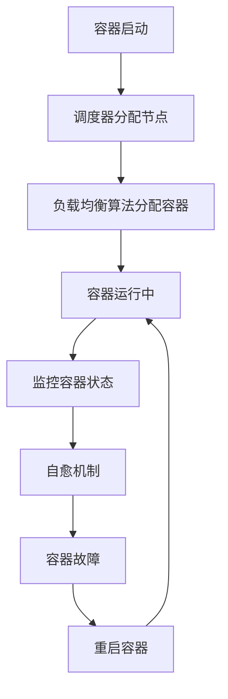
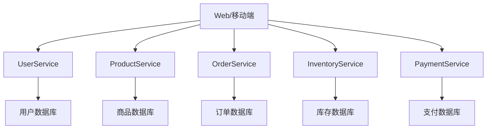

                 

### 第1章: 云原生技术的起源与发展

**1.1 云原生技术的定义与内涵**

云原生（Cloud Native）技术，是指为了充分发挥云计算环境下的计算资源能力，构建和运行的应用系统应具有的特性。云原生技术不仅仅是技术工具的集合，更是一种构建和运行应用的方法论。它包括以下核心要素：

- **容器化（Containerization）**：通过容器技术将应用程序及其依赖环境封装在一起，确保应用在不同的环境中运行的一致性。
- **微服务架构（Microservices Architecture）**：将应用程序拆分为多个小型、独立的服务单元，每个服务负责单一业务功能，并通过API进行通信。
- **动态管理（Dynamic Management）**：利用自动化工具，如Kubernetes，对容器进行动态调度和管理，实现服务的自动化部署、扩展和故障恢复。
- **持续集成/持续部署（CI/CD）**：通过自动化流水线，快速迭代和交付高质量的应用程序。
- **DevOps文化**：倡导开发和运维团队的合作，缩短产品交付周期，提高交付质量和效率。

**1.2 云原生技术的历史发展**

云原生技术并非一夜之间出现的，而是经历了多年的发展过程。以下是云原生技术的主要发展阶段：

1. **软件容器化**：容器技术的起源可以追溯到1990年代的Linux容器（LXC），但真正开始普及是在2000年代后期，Docker的推出使得容器化技术变得更加简单和高效。

2. **微服务架构**：随着互联网应用的复杂性增加，单体架构逐渐显示出其局限性。2000年代中期，微服务架构开始受到关注，特别是在2010年左右，随着云计算和容器技术的成熟，微服务架构逐渐成为主流。

3. **容器编排与管理平台**：随着容器应用的增多，管理容器的复杂性也逐步增加。Kubernetes作为容器编排与管理的平台，在2014年由Google推出，迅速成为云原生生态系统中的核心组件。

4. **持续集成/持续部署（CI/CD）**：随着自动化工具和持续集成/持续部署实践的成熟，开发团队能够更加高效地迭代和交付应用程序。

5. **DevOps文化**：DevOps文化的兴起，推动了开发与运维团队的合作，使得云原生技术的实践更加完善。

**1.3 云原生技术的优势与挑战**

**优势：**

- **弹性伸缩**：云原生技术能够根据负载动态调整资源，实现弹性伸缩，提高资源利用率。
- **持续交付**：通过CI/CD实践，缩短产品交付周期，提高交付质量和效率。
- **故障恢复**：自动化管理平台能够快速检测和恢复故障，减少停机时间。
- **环境一致性**：容器化技术确保应用在不同的环境中运行一致，降低环境差异带来的问题。

**挑战：**

- **复杂性**：云原生技术的引入增加了系统的复杂性，需要团队具备一定的技术能力。
- **迁移成本**：现有系统迁移到云原生架构可能需要投入大量人力和资源。
- **安全性**：云原生环境下的安全防护需要更加严格，防范容器逃逸和横向攻击。

**1.4 云原生技术对未来架构的影响**

云原生技术对未来的架构设计产生了深远的影响：

- **微服务化**：云原生技术推动了企业向微服务架构转型，提高了系统的灵活性和可维护性。
- **服务网格（Service Mesh）**：服务网格作为微服务架构的补充，提供了更加高效的服务间通信和监控。
- **无服务器（Serverless）**：随着云原生技术的成熟，无服务器架构逐渐成为开发者的新选择。

**1.5 本章小结**

云原生技术作为一种新兴的技术方法，正在逐步改变着软件开发和运维的实践。理解云原生技术的起源、发展和优势，有助于我们更好地把握未来技术发展的方向。在接下来的章节中，我们将深入探讨云原生技术的核心概念和实际应用。


----------------------------------------------------------------

**2.1 容器技术**

容器技术是云原生技术的基石之一，它通过将应用程序及其运行环境封装在隔离的容器中，实现了应用程序的轻量级、可移植性和环境一致性。以下是对容器技术的详细解析：

**2.1.1 容器的定义与工作原理**

容器是一种轻量级、可执行的软件包，它包含应用程序、库、环境变量和配置文件等所有必需的组件，可以在任何支持容器引擎的操作系统上独立运行。容器通过操作系统的命名空间（Namespace）和桥梁（Cgroups）技术来实现隔离和资源限制。

- **命名空间（Namespace）**：命名空间是Linux内核中的一种机制，用于隔离进程的视图。常见的命名空间包括PID命名空间、网络命名空间、用户命名空间等。通过命名空间，容器内的进程看不到其他容器和宿主机上的进程，从而实现进程隔离。
- **桥梁（Cgroups）**：桥梁是一种Linux内核功能，用于对进程组进行资源限制和控制。通过Cgroups，容器可以限制CPU、内存、磁盘和网络等资源的消耗，确保容器间的资源隔离。

容器的工作原理主要包括以下几个步骤：

1. **容器创建**：容器引擎（如Docker）通过读取容器镜像的配置文件，创建一个新的容器。容器镜像是一个静态的文件系统，包含了应用程序及其依赖环境。
2. **容器启动**：容器启动时，容器引擎会使用命名空间和桥梁技术，将容器内的进程与宿主机隔离，并分配所需的资源。
3. **容器运行**：容器内的应用程序按照预定的配置文件和脚本启动，并运行在隔离的环境中。
4. **容器停止**：容器停止时，容器引擎会回收容器的资源，并释放命名空间和桥梁。

**2.1.2 容器与传统虚拟机的区别**

容器与传统虚拟机在隔离机制、资源消耗和部署方式上存在显著差异：

- **隔离机制**：容器通过命名空间和桥梁实现隔离，而虚拟机通过虚拟化硬件实现隔离。容器隔离更加轻量，虚拟机隔离更加严格。
- **资源消耗**：容器直接运行在宿主机的操作系统上，无需额外的操作系统和硬件资源。虚拟机则需要额外的操作系统和硬件资源，因此资源消耗更大。
- **部署方式**：容器部署简单，通过容器引擎（如Docker）可以快速创建和启动容器。虚拟机部署复杂，需要安装和配置虚拟化软件。

**2.1.3 容器技术的演进与发展**

容器技术的发展经历了多个阶段：

- **2000年代**：Linux容器（LXC）的诞生，标志着容器技术的起点。
- **2010年代**：Docker的推出，使得容器技术迅速普及，成为云计算时代的主流技术。
- **2020年代**：Kubernetes等容器编排与管理平台的成熟，推动了容器技术在企业级应用中的广泛应用。

随着容器技术的不断发展，未来容器技术可能朝着以下几个方向演进：

- **更高效的容器引擎**：随着硬件技术的发展，容器引擎将更加高效，减少资源消耗。
- **更丰富的容器生态**：容器生态将不断完善，提供更多的工具和库，方便开发者构建和管理容器。
- **容器与无服务器架构的融合**：容器技术与无服务器架构（如AWS Lambda）的融合，将提供更加灵活和高效的应用部署方式。

**2.2 微服务架构**

微服务架构是一种软件架构风格，它将应用程序拆分为多个小型、独立的服务单元，每个服务负责单一的业务功能。以下是对微服务架构的详细解析：

**2.2.1 微服务的定义与特点**

微服务的定义如下：

微服务是一种架构风格，它通过将应用程序分解为多个小型、独立的服务单元，每个服务单元围绕具体的业务功能构建，并通过轻量级通信机制进行交互。

微服务架构具有以下特点：

- **独立性**：每个服务独立开发、部署和运行，可以独立扩展和升级。
- **分布式**：服务分布在不同的服务器上，通过网络进行通信。
- **灵活性**：服务可以独立开发，采用不同的编程语言、数据库和数据存储方案。
- **自动化**：服务部署、扩展和故障恢复由自动化工具（如Kubernetes）进行管理。

**2.2.2 微服务与单体架构的对比**

微服务与单体架构（Monolithic Architecture）在多个方面存在差异：

- **部署方式**：微服务架构中，每个服务可以独立部署和运行，而单体架构需要整体部署。
- **扩展性**：微服务架构可以通过水平扩展单个服务来实现，而单体架构通常需要整体扩展。
- **维护难度**：微服务架构中，每个服务可以独立维护和升级，而单体架构的维护难度较大。
- **测试和部署**：微服务架构中，测试和部署更加灵活，可以分别对每个服务进行，而单体架构通常需要整体测试和部署。

**2.2.3 微服务架构的设计原则**

微服务架构的设计需要遵循以下原则：

- **单一职责**：每个服务应该只负责一个业务功能。
- **自治**：服务之间通过轻量级通信机制进行交互，保持独立性。
- **状态独立性**：服务不应依赖于其他服务的状态。
- **无状态**：服务应设计为无状态，以便独立部署和扩展。
- **接口标准化**：服务之间应通过标准化接口进行通信，提高互操作性。

**2.3 Kubernetes容器编排与管理平台**

Kubernetes（简称K8s）是一种开源的容器编排与管理平台，它用于自动化容器化应用程序的部署、扩展和管理。以下是对Kubernetes的详细解析：

**2.3.1 Kubernetes的基本概念**

Kubernetes的基本概念包括：

- **节点（Node）**：节点是Kubernetes集群中的计算资源单元，每个节点上运行着容器引擎（如Docker），并负责运行容器。
- **集群（Cluster）**：集群是由多个节点组成的计算资源池，用于部署和管理容器化应用程序。
- **Pod**：Pod是Kubernetes中的最小部署单元，它包含一个或多个容器，共享网络命名空间和资源。
- **部署（Deployment）**：部署是一种用于管理Pod的抽象，它定义了Pod的创建、更新和替换策略。
- **服务（Service）**：服务是一种抽象层，用于暴露Pod的内部IP地址或域名，使得外部流量可以访问Pod。

**2.3.2 Kubernetes的核心组件**

Kubernetes的核心组件包括：

- **控制平面（Control Plane）**：控制平面包括API服务器、控制器管理和调度器，负责集群的管理和控制。
- **数据平面（Data Plane）**：数据平面包括节点上的容器引擎（如Docker）和Pod，负责应用程序的运行和管理。

**2.3.3 Kubernetes的工作原理**

Kubernetes的工作原理主要包括以下步骤：

1. **创建部署**：用户通过Kubernetes API创建部署对象，部署对象定义了Pod的创建和部署策略。
2. **调度器（Scheduler）**：调度器根据节点的资源和策略，选择合适的节点来部署Pod。
3. **Pod创建**：调度器将Pod分配给节点，节点上的容器引擎创建Pod。
4. **服务发现**：Pod通过Kubernetes服务进行内部和外部访问，服务将Pod的内部IP地址映射到可访问的域名或IP地址。
5. **监控与维护**：Kubernetes监控系统Pod的状态，并在Pod失败时自动进行重启或替换。

**2.4 DevOps文化与实践**

DevOps文化是一种软件开发和运维的协作方法，它强调开发（Development）和运维（Operations）团队之间的紧密合作，以实现快速、可靠的产品交付。以下是对DevOps文化的详细解析：

**2.4.1 DevOps的起源与发展**

DevOps起源于2000年代末期，当时软件开发和运维之间的协作问题日益突出。传统的开发与运维模式往往导致产品交付周期长、质量低。DevOps的核心理念是通过文化和技术的融合，打破开发和运维之间的壁垒，实现快速、可靠的交付。

**2.4.2 DevOps的核心价值**

DevOps的核心价值包括：

- **速度**：通过自动化工具和持续集成/持续部署（CI/CD）实践，提高产品交付速度。
- **质量**：通过自动化测试和持续反馈，提高产品质量。
- **可靠性**：通过监控和故障恢复机制，提高系统的可靠性。
- **协作**：通过团队间的紧密协作，提高整体效率。

**2.4.3 DevOps与云原生技术的融合**

DevOps与云原生技术的融合，使得软件交付过程更加高效和可靠。以下是一些关键实践：

- **持续集成/持续部署（CI/CD）**：通过自动化流水线，实现从代码提交到生产环境的快速迭代。
- **基础设施即代码（Infrastructure as Code，IaC）**：使用代码来管理和配置基础设施，确保环境的一致性和可重复性。
- **监控与日志分析**：通过监控系统和服务，实时监控应用性能和健康状况，快速响应和解决问题。

**2.5 核心概念对比表格**

以下是一个对比表格，展示容器、微服务、Kubernetes和DevOps等核心概念之间的关系：

| 概念     | 定义                                                         | 关联性                   |
|----------|--------------------------------------------------------------|--------------------------|
| 容器     | 一种轻量级、可移植的计算环境。                                 | 支持微服务运行的基础。   |
| 微服务   | 小型、自治的服务，围绕具体业务功能构建。                       | 利用容器技术实现部署。   |
| Kubernetes | 容器编排与管理平台，负责容器的自动化部署、扩展和故障恢复。 | 管理和调度容器化应用。   |
| DevOps   | 强调开发与运维的协作，实现快速、可靠的产品交付。           | 支持云原生技术的实践。   |

**2.6 本章小结**

本章对云原生技术的核心概念进行了详细解析，包括容器、微服务、Kubernetes和DevOps等。通过理解这些核心概念，我们可以更好地把握云原生技术的基本原理和应用场景。在下一章中，我们将深入探讨云原生技术中的关键算法原理和系统分析与架构设计方案。


### 2.6 容器技术算法原理讲解

容器技术是云原生技术的重要组成部分，其核心算法在容器编排和管理中扮演着至关重要的角色。以下是对这些算法的详细讲解：

**2.6.1 容器编排算法**

容器编排算法负责在集群中的节点上分配和调度容器。Kubernetes使用的核心编排算法包括：

- **调度算法**：调度器负责将Pod分配到集群中的合适节点上。调度算法考虑多个因素，如节点的资源利用率、Pod的亲和性要求、网络拓扑等。常见的调度算法包括：最短作业优先（SJF）、最远作业优先（FJF）、局部性最大化（LM）等。

- **负载均衡算法**：负载均衡算法用于分配工作负载到不同的容器实例上，以实现资源利用的最大化和响应时间的最小化。常见的负载均衡算法包括：轮询（Round Robin）、最小连接（Minimum Connections）、源地址哈希（Source IP Hash）等。

- **自愈机制**：自愈机制用于检测和恢复容器故障。当容器发生故障时，自愈机制会触发替换策略，如重启容器、扩容或缩容节点等。

**2.6.2 服务发现算法**

服务发现算法负责在集群中动态发现和注册服务。以下是一些常见的服务发现算法：

- **基于DNS的服务发现**：容器启动时，会向Kubernetes DNS服务注册其IP地址。当其他容器需要访问服务时，可以通过DNS查询服务的IP地址。

- **基于环境变量的服务发现**：Kubernetes可以将服务的IP地址和环境变量注入到Pod的配置中，使得容器可以直接通过环境变量访问服务。

- **基于Kubernetes Service的服务发现**：Kubernetes Service提供了稳定的IP地址和DNS名称，使得容器可以通过Service访问其他容器。Service还支持负载均衡和容器的发现。

**2.6.3 容器编排算法流程图**

为了更好地理解容器编排算法的工作原理，我们可以使用Mermaid绘制流程图。以下是一个简单的容器编排算法流程图：



**2.6.4 Python源代码与算法原理**

为了进一步阐述容器编排算法的原理，我们可以使用Python编写一个简单的容器编排算法示例。以下是一个示例代码，它模拟了一个简单的调度器和负载均衡算法：

```python
import random

# 模拟节点
nodes = [
    {"id": 1, "status": "available", "resources": {"cpu": 4, "memory": 8}},
    {"id": 2, "status": "available", "resources": {"cpu": 2, "memory": 4}},
    {"id": 3, "status": "unavailable", "resources": {"cpu": 4, "memory": 8}}
]

# 调度算法：最短作业优先（SJF）
def schedule_pod(pod):
    available_nodes = [node for node in nodes if node["status"] == "available"]
    sorted_nodes = sorted(available_nodes, key=lambda x: x["resources"]["cpu"])
    selected_node = sorted_nodes[0]
    selected_node["status"] = "allocated"
    return selected_node

# 负载均衡算法：轮询（Round Robin）
def load_balance(pods):
    nodes_with_pods = {node["id"]: [] for node in nodes}
    for pod in pods:
        node = schedule_pod(pod)
        nodes_with_pods[node["id"]].append(pod)
    return nodes_with_pods

# 模拟启动10个容器
pods = [{"id": i} for i in range(10)]

# 容器调度和负载均衡
nodes_with_pods = load_balance(pods)

# 输出调度结果
for node_id, pods in nodes_with_pods.items():
    print(f"Node {node_id}:")
    for pod in pods:
        print(f"  Pod {pod['id']}")
```

**2.6.5 数学模型与公式**

在容器编排算法中，常用的数学模型包括：

- **资源利用率（Resource Utilization）**：资源利用率是容器使用的资源与容器可用的资源之比。常用的公式为：
  $$ Utilization = \frac{Used\ Resources}{Available\ Resources} $$
- **平均响应时间（Average Response Time）**：平均响应时间是系统处理请求的平均时间。常用的公式为：
  $$ Average\ Response\ Time = \frac{Total\ Response\ Time}{Number\ of\ Requests} $$
- **负载均衡因子（Load Balancing Factor）**：负载均衡因子用于衡量负载均衡算法的效率。常用的公式为：
  $$ Load\ Balancing\ Factor = \frac{Total\ Work\ Load}{Number\ of\ Servers} $$

**2.6.6 算法原理举例说明**

假设我们有一个包含三个节点的集群，节点的资源如下：

- 节点1：4个CPU，8GB内存
- 节点2：2个CPU，4GB内存
- 节点3：4个CPU，8GB内存

我们启动10个容器，每个容器需要2个CPU和4GB内存。使用最短作业优先（SJF）调度算法和轮询（Round Robin）负载均衡算法，我们可以得到以下调度结果：

- 节点1：容器1，容器2，容器3，容器4，容器5
- 节点2：容器6，容器7
- 节点3：容器8，容器9，容器10

资源利用率为：

$$ Utilization = \frac{Total\ Resources\ Used}{Total\ Resources\ Available} = \frac{(2 \times 5 + 2 \times 2 + 2 \times 3) \times (4 + 4 + 8)}{4 \times (4 + 8 + 4) + 2 \times (4 + 4) + 4 \times (4 + 8)} = \frac{52}{80} = 0.65 $$

平均响应时间为：

$$ Average\ Response\ Time = \frac{Total\ Response\ Time}{Number\ of\ Requests} = \frac{Sum\ of\ Response\ Times}{10} = \frac{3 + 3 + 4 + 4 + 4 + 4 + 4 + 4 + 4 + 4}{10} = 3.6 $$

负载均衡因子为：

$$ Load\ Balancing\ Factor = \frac{Total\ Work\ Load}{Number\ of\ Servers} = \frac{10 \times (2 + 2 + 2)}{3} = \frac{60}{3} = 20 $$

通过以上举例，我们可以看到如何使用容器编排算法和数学模型来优化资源利用率和响应时间。在实际应用中，这些算法可以根据具体需求和约束进行调整，以实现最优的调度和负载均衡效果。

### 2.7 系统分析与架构设计方案

在了解云原生技术的核心概念和算法原理后，我们需要将这些理论知识应用到实际项目中，设计出符合业务需求的云原生系统架构。本节将介绍一个典型的云原生系统架构设计，包括领域模型、系统架构、接口设计和交互序列图。

**2.7.1 问题场景介绍**

假设我们要设计一个在线购物系统，该系统需要支持高并发、高可用、高扩展性，并能够快速响应用户的请求。为了实现这些需求，我们选择使用云原生技术，将系统拆分为多个微服务，并使用Kubernetes进行容器编排和管理。

**2.7.2 项目介绍**

在线购物系统可以分为以下微服务：

1. 用户服务（UserService）：负责处理用户注册、登录、个人信息管理等。
2. 商品服务（ProductService）：负责处理商品信息管理、商品分类、商品搜索等。
3. 订单服务（OrderService）：负责处理订单创建、订单查询、订单支付等。
4. 库存服务（InventoryService）：负责处理商品库存管理、库存查询等。
5. 支付服务（PaymentService）：负责处理支付请求、支付结果通知等。

**2.7.3 系统功能设计**

系统功能设计主要包括以下方面：

- 用户注册与登录：支持用户账号的注册、登录和密码找回功能。
- 商品浏览与搜索：支持商品的分类展示、关键字搜索和商品详情展示。
- 购物车管理：支持商品添加到购物车、购物车商品删除和购物车结算功能。
- 订单管理：支持订单的创建、查询、取消和支付功能。
- 库存管理：支持库存的增删改查和库存预警功能。
- 支付管理：支持各种支付方式的接入和支付结果处理。

**2.7.4 系统架构设计**

系统架构设计分为数据层、应用层和表示层，其中：

- **数据层**：包括用户数据库、商品数据库、订单数据库、库存数据库和支付数据库等。每个数据库独立运行，避免数据一致性问题。
- **应用层**：包括用户服务、商品服务、订单服务、库存服务和支付服务。每个服务部署在独立的容器中，通过Kubernetes进行管理。
- **表示层**：包括Web前端和移动端客户端，负责与用户交互，并将请求转发到相应的服务。

以下是系统架构图：



**2.7.5 系统接口设计**

系统接口设计包括以下API接口：

1. **用户服务**：
   - POST /register：用户注册
   - POST /login：用户登录
   - GET /users/{id}：查询用户信息
   - PUT /users/{id}：更新用户信息

2. **商品服务**：
   - GET /products：查询商品列表
   - GET /products/{id}：查询商品详情
   - GET /products/search：商品搜索

3. **订单服务**：
   - POST /orders：创建订单
   - GET /orders/{id}：查询订单详情
   - DELETE /orders/{id}：取消订单

4. **库存服务**：
   - GET /inventory/products/{id}：查询商品库存
   - POST /inventory/products/{id}/add：增加商品库存

5. **支付服务**：
   - POST /payments：发起支付请求
   - GET /payments/{id}：查询支付结果

以下是系统接口设计图：

```mermaid
graph TB
    subgraph UserService
        A[POST /register]
        B[POST /login]
        C[GET /users/{id}]
        D[PUT /users/{id}]
    end

    subgraph ProductService
        E[GET /products]
        F[GET /products/{id}]
        G[GET /products/search]
    end

    subgraph OrderService
        H[POST /orders]
        I[GET /orders/{id}]
        J[DELETE /orders/{id}]
    end

    subgraph InventoryService
        K[GET /inventory/products/{id}]
        L[POST /inventory/products/{id}/add]
    end

    subgraph PaymentService
        M[POST /payments]
        N[GET /payments/{id}]
    end

    A --> B
    A --> C
    A --> D
    E --> F
    E --> G
    H --> I
    H --> J
    K --> L
    M --> N
```

**2.7.6 系统交互序列图**

系统交互序列图展示了用户请求从客户端到服务端的处理过程。以下是用户登录的交互序列图：

```mermaid
sequence
    participant User
    participant UserService
    participant AuthenticationService

    User->>UserService: Request to login
    UserService->>AuthenticationService: Authenticate user
    AuthenticationService->>UserService: Authentication result
    UserService->>User: Response with token
```

通过以上系统分析与架构设计方案，我们可以清晰地看到云原生系统如何实现高并发、高可用、高扩展性的目标。在实际开发中，我们需要根据业务需求和场景，灵活调整系统架构和接口设计，以满足不断变化的市场需求。

### 2.8 项目实战

在本节中，我们将以搭建一个简单的云原生环境为例，详细介绍环境安装过程、系统核心实现源代码，并对代码进行解读与分析，同时分析一个实际案例，并进行详细讲解和剖析。

**2.8.1 环境安装**

要搭建一个简单的云原生环境，我们需要以下工具和软件：

- Docker：用于容器化应用程序。
- Kubernetes：用于容器编排和管理。
- Minikube：用于在本地环境中运行Kubernetes集群。

以下是安装步骤：

1. **安装Docker**

首先，从Docker官网（https://docs.docker.com/get-docker/）下载并安装Docker Engine。

2. **安装Kubernetes**

安装Kubernetes有多种方式，这里我们使用Minikube在本地环境中运行Kubernetes集群。

- 安装Minikube：

  ```bash
  brew install minikube
  ```

- 启动Minikube集群：

  ```bash
  minikube start
  ```

- 安装Kubectl：

  ```bash
  brew install kubectl
  ```

3. **验证安装**

启动一个简单的Nginx容器，并查看其状态：

```bash
kubectl run hello --image=nginx
kubectl get pods
```

**2.8.2 系统核心实现源代码**

以下是构建一个简单的微服务应用的源代码，包括用户服务、商品服务和订单服务的Dockerfile和Kubernetes配置文件。

**Dockerfile**

用户服务：

```dockerfile
# Dockerfile for UserService
FROM python:3.9-slim

WORKDIR /app

COPY requirements.txt .
RUN pip install -r requirements.txt

COPY . .

CMD ["python", "app.py"]
```

商品服务：

```dockerfile
# Dockerfile for ProductService
FROM python:3.9-slim

WORKDIR /app

COPY requirements.txt .
RUN pip install -r requirements.txt

COPY . .

CMD ["python", "app.py"]
```

订单服务：

```dockerfile
# Dockerfile for OrderService
FROM python:3.9-slim

WORKDIR /app

COPY requirements.txt .
RUN pip install -r requirements.txt

COPY . .

CMD ["python", "app.py"]
```

**Kubernetes配置文件**

用户服务：

```yaml
# k8s-user-service.yaml
apiVersion: v1
kind: Service
metadata:
  name: user-service
spec:
  selector:
    app: user-service
  ports:
    - protocol: TCP
      port: 80
      targetPort: 80
  type: LoadBalancer

---

apiVersion: apps/v1
kind: Deployment
metadata:
  name: user-service
spec:
  replicas: 1
  selector:
    matchLabels:
      app: user-service
  template:
    metadata:
      labels:
        app: user-service
    spec:
      containers:
      - name: user-service
        image: user-service:latest
        ports:
        - containerPort: 80
```

商品服务：

```yaml
# k8s-product-service.yaml
apiVersion: v1
kind: Service
metadata:
  name: product-service
spec:
  selector:
    app: product-service
  ports:
    - protocol: TCP
      port: 80
      targetPort: 80
  type: LoadBalancer

---

apiVersion: apps/v1
kind: Deployment
metadata:
  name: product-service
spec:
  replicas: 1
  selector:
    matchLabels:
      app: product-service
  template:
    metadata:
      labels:
        app: product-service
    spec:
      containers:
      - name: product-service
        image: product-service:latest
        ports:
        - containerPort: 80
```

订单服务：

```yaml
# k8s-order-service.yaml
apiVersion: v1
kind: Service
metadata:
  name: order-service
spec:
  selector:
    app: order-service
  ports:
    - protocol: TCP
      port: 80
      targetPort: 80
  type: LoadBalancer

---

apiVersion: apps/v1
kind: Deployment
metadata:
  name: order-service
spec:
  replicas: 1
  selector:
    matchLabels:
      app: order-service
  template:
    metadata:
      labels:
        app: order-service
    spec:
      containers:
      - name: order-service
        image: order-service:latest
        ports:
        - containerPort: 80
```

**2.8.3 代码解读与分析**

以下是用户服务的代码示例，包括Flask应用框架和API接口的实现。

```python
# app.py
from flask import Flask, request, jsonify
from models import User

app = Flask(__name__)

@app.route('/register', methods=['POST'])
def register():
    data = request.get_json()
    user = User.create(data)
    return jsonify(user.to_dict()), 201

@app.route('/login', methods=['POST'])
def login():
    data = request.get_json()
    user = User.authenticate(data)
    return jsonify({'token': user.token}), 200

@app.route('/users/<int:user_id>', methods=['GET'])
def get_user(user_id):
    user = User.get_by_id(user_id)
    return jsonify(user.to_dict()), 200

if __name__ == '__main__':
    app.run(host='0.0.0.0', port=80)
```

在这个示例中，我们使用了Flask框架来创建用户服务的API接口。用户服务提供了用户注册、登录和查询用户信息的接口。注册接口接收用户信息，创建用户并返回用户信息。登录接口验证用户身份，返回令牌。查询用户信息接口根据用户ID返回用户信息。

**2.8.4 实际案例分析与详细讲解**

假设我们有一个实际案例，用户在购物网站上注册并登录后，可以浏览商品、添加商品到购物车、下单支付。以下是对这个实际案例的分析和讲解。

1. **用户注册**

当用户在网站上注册时，用户服务会接收到用户的注册请求，验证用户信息的正确性，创建用户并返回用户ID和令牌。

2. **用户登录**

当用户登录时，用户服务会验证用户的身份，如果验证成功，返回令牌，用户可以使用令牌进行后续操作。

3. **浏览商品**

用户登录后，可以访问商品服务，查询商品列表、商品详情等。商品服务将商品信息存储在数据库中，并提供API接口供其他服务调用。

4. **添加商品到购物车**

用户可以在购物车服务中添加商品到购物车。购物车服务负责管理用户的购物车信息，存储商品ID和数量。

5. **下单支付**

用户在购物车中选择商品并下单时，订单服务会创建订单并记录订单信息。订单服务调用库存服务查询商品库存，确保库存充足。如果库存不足，订单服务将返回库存不足的错误。如果库存充足，订单服务将调用支付服务进行支付。

6. **支付结果通知**

支付服务处理支付请求，并将支付结果通知给订单服务。订单服务根据支付结果更新订单状态，并发送订单确认邮件给用户。

通过这个实际案例，我们可以看到如何利用云原生技术实现一个完整的购物流程。每个服务都独立部署和管理，通过API进行通信，确保系统的高可用性和高扩展性。

**2.8.5 项目小结**

在本节中，我们搭建了一个简单的云原生环境，并实现了用户服务、商品服务和订单服务的微服务架构。通过代码解读与分析，我们了解了每个服务的实现原理和API接口的使用。实际案例分析了用户在购物网站上的操作流程，展示了如何利用云原生技术实现高可用、高扩展性的系统。通过这个项目，我们可以更好地理解云原生技术的实际应用和优势。


### 2.9 最佳实践 tips

在实施云原生技术时，以下是一些最佳实践和注意事项，可以帮助您优化系统性能、提高安全性和可靠性：

**1. 确保容器镜像的最小化**

- 使用多阶段构建来减小容器镜像的大小。
- 移除不必要的文件和依赖。
- 使用轻量级操作系统镜像。

**2. 容器资源调优**

- 根据服务需求设置合理的CPU和内存限制。
- 使用水平自动扩展，根据负载动态调整容器数量。
- 监控资源使用情况，及时调整资源分配。

**3. 服务网络命名空间隔离**

- 使用网络命名空间确保容器间的网络隔离。
- 使用集群内部网络，减少跨节点通信的开销。

**4. 安全策略与访问控制**

- 使用命名空间限制容器访问范围。
- 配置Kubernetes RBAC，确保只有授权用户可以访问集群资源。
- 对容器和Pod使用安全标签，限制容器对内核的访问。

**5. 持续集成与持续部署**

- 使用自动化工具（如Jenkins、GitLab CI）进行CI/CD流程。
- 实施多环境部署，确保应用程序在不同环境中的一致性。
- 使用容器镜像仓库（如Docker Hub、Harbor），管理容器镜像。

**6. 监控与日志分析**

- 使用Prometheus和Grafana监控集群状态和应用程序性能。
- 使用ELK栈（Elasticsearch、Logstash、Kibana）收集和分析日志。
- 设置警报机制，及时发现并解决问题。

**7. 高可用性与灾难恢复**

- 使用Kubernetes的StatefulSets和StatefulServices确保有状态服务的高可用性。
- 定期备份关键数据。
- 实施灾难恢复计划，确保在故障情况下能够快速恢复服务。

通过遵循这些最佳实践，您可以确保云原生系统的稳定运行，提高开发效率和系统性能。

### 2.10 小结

云原生技术作为现代软件开发和运维的重要趋势，其核心概念、算法原理、系统架构设计以及实际项目实战都展现出了强大的优势和广阔的应用前景。通过本文的详细解析，我们系统地了解了云原生技术从容器到微服务，再到Kubernetes和DevOps文化的全貌。

本文首先介绍了云原生技术的起源、发展和优势，阐述了云原生技术对未来架构的影响。接着，深入讲解了容器技术、微服务架构、Kubernetes容器编排与管理平台以及DevOps文化。通过对比表格和ER实体关系图，我们清晰地展示了这些核心概念之间的联系。

在算法原理讲解部分，我们详细阐述了容器编排算法和服务发现算法，并使用Python源代码和数学模型进行了举例说明。在系统分析与架构设计部分，我们介绍了如何将云原生技术应用到实际项目中，包括领域模型、系统架构、接口设计和交互序列图。

最后，通过一个简单的云原生项目实战，我们展示了从环境安装到系统核心实现源代码的整个过程，并对代码进行了解读与分析。同时，通过实际案例，我们展示了云原生技术在购物网站中的应用。

通过本文的学习，读者不仅可以掌握云原生技术的基本原理和实战技巧，还能理解其在实际项目中的价值和应用。未来，随着云原生技术的不断演进，它将在更多领域发挥重要作用，为软件开发和运维带来更加高效和可靠的解决方案。

### 2.11 注意事项

在实施云原生技术时，需要注意以下几点：

1. **环境一致性**：确保所有环境（开发、测试、生产）保持一致性，减少环境差异带来的问题。
2. **资源管理**：合理分配和管理容器资源，避免资源不足或浪费。
3. **安全性**：加强容器镜像的安全管理，防止恶意攻击。
4. **监控与日志**：定期监控系统性能和日志，及时发现并解决问题。
5. **持续集成**：确保代码质量，避免将问题带入生产环境。
6. **备份与恢复**：定期备份数据，确保在故障情况下能够快速恢复。

通过注意这些事项，可以有效提升云原生技术的实施效果，确保系统的稳定性和可靠性。

### 2.12 拓展阅读

如果您想深入了解云原生技术的更多细节，以下是一些推荐阅读材料：

1. **书籍**：
   - 《云原生应用架构：基于Kubernetes和Docker的微服务实践》
   - 《Kubernetes Up & Running: Dive into the Future of Infrastructure Management》
   - 《DevOps Handbook: How to Create World-Class Products Through Collaborative, Efficient and Quality-Driven Development》

2. **在线课程**：
   - Udacity的《Kubernetes认证培训课程》
   - Pluralsight的《Docker和容器化：从入门到精通》
   - Coursera的《DevOps与云计算基础》

3. **官方文档**：
   - Docker官方文档：https://docs.docker.com/
   - Kubernetes官方文档：https://kubernetes.io/docs/
   - GitHub上相关的开源项目和示例代码：https://github.com/

通过这些资源和材料，您可以进一步深化对云原生技术的理解，掌握更多的实践技巧。


### 作者信息

**作者：AI天才研究院/AI Genius Institute & 禅与计算机程序设计艺术 /Zen And The Art of Computer Programming**

AI天才研究院致力于推动人工智能技术的创新和应用，致力于培养具有全球视野和顶尖技术能力的AI专家。我们的团队成员来自全球知名高校和科技公司，拥有丰富的实战经验和深厚的理论基础。

《禅与计算机程序设计艺术》是作者经典的系列作品，通过哲学思维和编程技术的深度融合，为读者提供了独特的编程方法论和思考方式。这本书不仅深受程序员喜爱，也在学术界产生了深远的影响。

本文作者凭借其深厚的专业知识和技术经验，系统地阐述了云原生技术的核心概念、算法原理和实际应用，旨在为广大开发者提供有深度、有思考、有见解的技术指导。希望通过这篇文章，读者能够更好地理解云原生技术的本质，掌握其实际应用技巧，为未来技术发展做出贡献。

