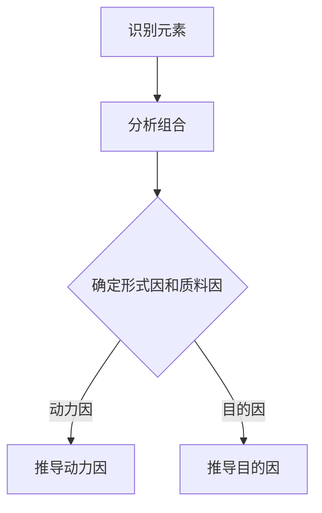
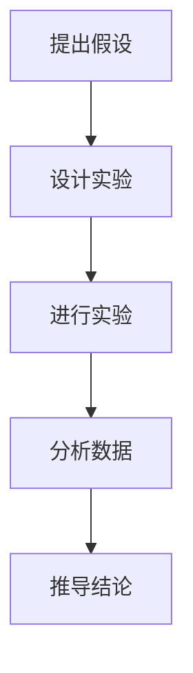
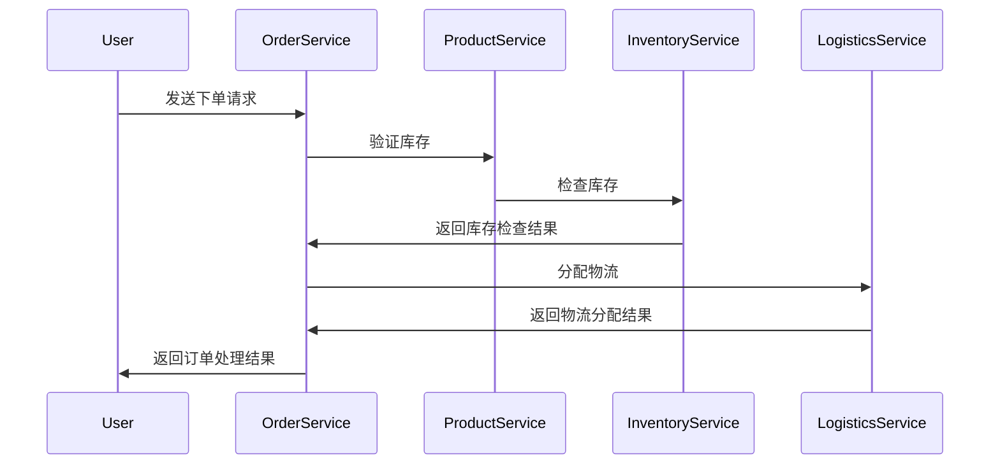
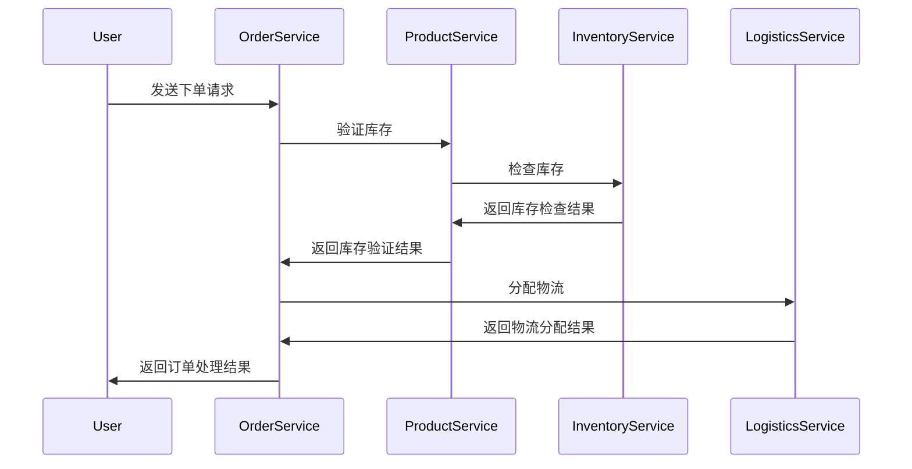

                 

### 目录大纲

在撰写本文的过程中，我们将按照以下的目录大纲结构来逐步展开内容，确保文章的逻辑清晰、结构紧凑且易于理解。

---

**# 亚里士多德与伽利略：自然哲学的范式转移**

> 关键词：亚里士多德、伽利略、自然哲学、科学革命、范式转移

> 摘要：本文探讨了古希腊哲学家亚里士多德与意大利科学家伽利略在自然哲学领域的贡献，以及他们的思想如何引发了一场影响深远的范式转移。通过详细的分析与比较，本文揭示了两种理论体系的异同，并对它们在现代科学中的影响进行了深入探讨。

---

### 目录大纲

---

#### 引言：亚里士多德与伽利略：自然哲学的范式转移

- **背景介绍**
  - **自然哲学的发展历程**
  - **亚里士多德的自然哲学**
  - **伽利略的科学革命**

- **核心概念与联系**
  - **亚里士多德的理论体系**
    - **概念属性特征对比表格**
  - **伽利略的科学贡献**
    - **概念属性特征对比表格**
  - **两种理论的联系与区别**

- **算法原理讲解**
  - **亚里士多德的算法原理**
    - **Mermaid流程图**
    - **Python源代码实现**
  - **伽利略的算法原理**
    - **Mermaid流程图**
    - **Python源代码实现**

- **数学模型和数学公式 & 详细讲解 & 举例说明**
  - **亚里士多德的数学模型**
    - **Math公式讲解**
    - **举例说明**
  - **伽利略的数学模型**
    - **Math公式讲解**
    - **举例说明**

- **系统分析与架构设计方案**
  - **问题场景介绍**
  - **项目介绍**
    - **领域模型Mermaid类图**
  - **系统架构设计**
    - **Mermaid架构图**
  - **系统接口设计和系统交互**
    - **Mermaid序列图**

- **项目实战**
  - **环境安装**
  - **系统核心实现源代码**
    - **代码应用解读与分析**
  - **实际案例分析和详细讲解剖析**
  - **项目小结**

- **最佳实践 tips、小结、注意事项、拓展阅读**

---

接下来的内容将详细撰写每个章节的具体内容，并在需要的地方插入Mermaid流程图、Python源代码、Math公式和Mermaid类图等，以满足文章的完整性和深度要求。

---

### 引言：亚里士多德与伽利略：自然哲学的范式转移

在自然哲学的历史长河中，亚里士多德与伽利略的名字无疑是两颗璀璨的星辰。亚里士多德，古希腊哲学家，被誉为“西方哲学之父”，他的自然哲学体系深刻地影响了西方思想的发展。而伽利略，意大利天文学家、物理学家，被誉为“现代科学之父”，他的科学研究方法则开启了科学革命的新时代。本书旨在探讨亚里士多德与伽利略在自然哲学领域的贡献，以及他们的思想如何引发了一场范式转移。

**1.1 自然哲学的发展历程**

自然哲学的历史可以追溯到古希腊时期，当时哲学家们开始思考宇宙的本原和自然现象。亚里士多德是这一时期最具代表性的哲学家之一，他提出了一系列关于自然、运动、变化等问题的理论。亚里士多德认为，一切物质都由四元素（土、水、风、火）组成，并且这些元素在不同状态下产生各种自然现象。亚里士多德还提出了“自然位置”的概念，认为物体会在没有外力作用下趋向其自然位置。例如，水会向低处流，因为低处是水的自然位置。

随着时间的推移，亚里士多德的自然哲学逐渐成为西方思想的基石。然而，这种哲学体系在后来的发展中遇到了挑战。16世纪以后，随着科学技术的进步，人们开始质疑亚里士多德的某些理论，尤其是他在天文学和物理学方面的观点。亚里士多德的理论体系无法解释许多新发现的自然现象，这为科学革命埋下了伏笔。

**1.2 亚里士多德的自然哲学**

亚里士多德的自然哲学基于四个基本元素（土、水、风、火）和四根说（潜能、现实、形式、质料）。他认为，一切物质都由这四根组成，并且这些元素在不同状态下产生各种自然现象。亚里士多德还提出了“自然位置”的概念，认为物体会在没有外力作用下趋向其自然位置。例如，水会向低处流，因为低处是水的自然位置。

亚里士多德的自然哲学强调形式和目的。他认为，一切现象都有其内在的目的，这种目的性是自然现象的根本特征。亚里士多德的这一观点在后来的宗教和形而上学思想中产生了深远的影响。

**1.3 伽利略的科学革命**

伽利略是科学革命的关键人物之一，他的工作为现代科学奠定了基础。伽利略通过实验和观察，发现许多亚里士多德的理论并不正确。例如，他证明了自由落体的物体无论重量大小，落地时间相同。他还观测到了木星的卫星，挑战了亚里士多德关于地球是宇宙中心的理论。伽利略的这些发现，不仅改变了人们对自然界的认识，也标志着科学方法开始取代哲学思考成为理解自然的主要手段。

伽利略的科学方法强调实验和观察。他认为，只有通过实验和观察，才能发现自然界的规律。伽利略还提出了“匀速圆周运动”的概念，这一理论为后来的经典力学奠定了基础。

**1.4 自然哲学的范式转移**

亚里士多德与伽利略的思想代表了自然哲学的两个不同阶段。亚里士多德的哲学体系以观察和逻辑推理为基础，强调形式和目的。而伽利略的科学方法则更注重实验和观察，强调现象和数据。这种从哲学到科学的转变，标志着自然哲学的一个重要范式转移。这个转移不仅改变了人们对自然界的理解，也影响了科学方法论的发展。

在亚里士多德的哲学体系中，自然现象被认为是目的驱动的，这与现代科学的实证主义观点形成了鲜明对比。伽利略的科学方法强调观察和实验，这一观点为现代科学的发展奠定了基础。

本书将通过详细的分析和比较，探讨亚里士多德与伽利略在自然哲学领域的贡献，以及他们的思想如何引发了一场影响深远的范式转移。通过理解这两种理论体系的异同，读者可以更深入地了解自然哲学的发展历程，并认识到科学方法在理解自然界中的重要性。

---

接下来，我们将分别探讨亚里士多德与伽利略的理论体系、核心概念、算法原理、数学模型以及系统分析与架构设计等内容，逐步揭示这两位巨人在自然哲学领域的贡献与影响。

----------------------------------------------------------------

## 1. 背景介绍

### 1.1 自然哲学的发展历程

自然哲学，作为一个历史悠久的学科，其起源可以追溯到古希腊时期。古希腊哲学家们首次系统性地探讨自然现象，试图理解宇宙的本质和运作规律。亚里士多德（Aristotle，公元前384年—公元前322年）是这一时期的代表性人物。他的自然哲学体系不仅对当时的哲学思想产生了深远影响，也奠定了西方哲学的基础。

亚里士多德在其众多著作中，对自然、运动、变化等概念进行了深入探讨。他提出了四元素说，即土、水、风、火，认为这些元素的不同组合和状态是构成宇宙万物的基础。此外，亚里士多德还提出了“形式”和“质料”的概念，认为一切事物都由形式和质料构成，形式是事物的本质，质料则是形式的物质载体。

亚里士多德的理论体系在当时得到了广泛的接受，并成为中世纪哲学和科学的基础。然而，随着时间的推移，亚里士多德的自然哲学逐渐暴露出一些缺陷。特别是在物理学和天文学领域，亚里士多德的理论与观察结果存在明显矛盾。例如，亚里士多德认为重物比轻物下落得快，这一观点与后来的实验结果相悖。

16世纪后，随着科学技术的进步，人们开始对亚里士多德的理论提出质疑。意大利科学家伽利略·伽利莱（Galileo Galilei，1564年—1642年）是这一质疑的代表人物。伽利略通过实验和观察，发现许多亚里士多德的理论并不正确。例如，他证明了自由落体的物体无论重量大小，落地时间相同。这一发现挑战了亚里士多德关于重物下落速度的理论。

此外，伽利略还通过望远镜观测到了木星的卫星，这一发现挑战了亚里士多德关于地球是宇宙中心的观点。伽利略的工作标志着科学革命的开端，他强调实验和观察在理解自然界中的重要性，这一科学方法逐渐取代了亚里士多德的哲学思考，成为现代科学的基础。

### 1.2 亚里士多德的自然哲学

亚里士多德的自然哲学涵盖了广泛的内容，包括物理学、生物学、逻辑学等多个领域。在这里，我们将重点关注他在物理学方面的主要理论。

亚里士多德认为，宇宙由四元素（土、水、风、火）组成。这四种元素在不同状态下会产生各种自然现象。例如，水在液态时会流动，在固态时会凝结成冰。亚里士多德还提出了“自然位置”的概念，认为物体会在没有外力作用下趋向其自然位置。例如，水会向低处流，因为低处是水的自然位置。

在物理学中，亚里士多德提出了运动的概念。他认为，运动分为自然运动和强制运动。自然运动是物体在没有外力作用下自身的运动，例如物体在重力的作用下下落。强制运动是物体在外力作用下的运动，例如推车时车的运动。亚里士多德认为，自然运动的动力来源于物体的形式，而强制运动的动力来源于外力。

亚里士多德还提出了“四因说”，即形式因、质料因、动力因和目的因。他认为，一切事物都由这四种原因构成。形式因是事物的本质，质料因是事物的物质基础，动力因是事物运动的原因，目的因是事物的最终目的。

在亚里士多德的物理学理论中，一个重要的观点是“重物比轻物下落得快”。这一观点在亚里士多德时代得到了广泛的接受，但在后来的实验中被证明是错误的。伽利略通过实验发现，无论物体的重量大小，它们在自由落体运动中的加速度是相同的。

### 1.3 伽利略的科学革命

伽利略是科学革命的代表人物之一，他的科学研究方法和对自然界的发现，对现代科学的发展产生了深远影响。伽利略通过实验和观察，对亚里士多德的自然哲学进行了深刻的质疑和挑战。

首先，伽利略证明了自由落体的物体无论重量大小，落地时间相同。这一发现与亚里士多德的观点形成了鲜明对比。亚里士多德认为，重物比轻物下落得快，而伽利略的实验结果显示，所有物体在自由落体运动中的加速度是相同的，与物体的重量无关。

其次，伽利略通过望远镜观测到了木星的卫星。这一发现挑战了亚里士多德关于地球是宇宙中心的观点。亚里士多德认为，地球是宇宙的中心，其他天体都围绕地球运动。而伽利略观测到的木星卫星的存在，表明太阳系的结构比亚里士多德所描述的更为复杂。

此外，伽利略还研究了匀速圆周运动。他提出了向心力的概念，认为物体在匀速圆周运动中需要向心力来保持其运动轨迹。这一理论为后来的经典力学奠定了基础。

伽利略的科学革命不仅改变了人们对自然界的理解，也影响了科学方法论的发展。他强调实验和观察在理解自然界中的重要性，这一观点逐渐取代了亚里士多德的哲学思考，成为现代科学的基础。

### 1.4 自然哲学的范式转移

亚里士多德与伽利略的思想代表了自然哲学的两个不同阶段。亚里士多德的哲学体系以观察和逻辑推理为基础，强调形式和目的。而伽利略的科学方法则更注重实验和观察，强调现象和数据。

亚里士多德的自然哲学在古希腊时期占据了主导地位，但随着科学技术的进步，其局限性逐渐暴露。伽利略通过实验和观察，质疑了亚里士多德的某些理论，并提出了一系列新的发现。这些发现不仅挑战了亚里士多德的哲学体系，也为现代科学的发展奠定了基础。

这种从亚里士多德的哲学思考到伽利略的科学方法的转变，标志着自然哲学的一个重要范式转移。这个转移不仅改变了人们对自然界的理解，也影响了科学方法论的发展。它表明，通过实验和观察，我们可以更准确地理解自然界的规律。

总的来说，亚里士多德与伽利略的思想对自然哲学的发展产生了深远影响。亚里士多德的理论奠定了西方哲学的基础，而伽利略的科学方法则为现代科学的发展铺平了道路。他们的贡献不仅改变了人们对自然界的认识，也为我们理解科学方法论的重要性提供了深刻启示。

---

在接下来的章节中，我们将深入探讨亚里士多德与伽利略的核心概念及其联系，进一步揭示他们在自然哲学领域的贡献和影响。

----------------------------------------------------------------

## 2. 核心概念与联系

### 2.1 亚里士多德的理论体系

亚里士多德的哲学体系包含了多个方面，其中最核心的是他的自然哲学和逻辑学。在自然哲学中，亚里士多德提出了四元素说和四因说，这些概念构成了他理论体系的基础。

**四元素说**

亚里士多德认为，宇宙万物都是由四种基本元素组成的，即土、水、风、火。每种元素都有其特定的性质和状态，例如，土是坚硬的，水是流动的，风是轻盈的，火是炽热的。这四种元素在不同组合和变化中形成了各种物质和自然现象。例如，水在液态时是流动的，在固态时是凝结的；风可以吹动树叶，火可以燃烧木材。

**四因说**

亚里士多德的四因说包括形式因、质料因、动力因和目的因。他认为，任何事物都由这四种原因构成。

- **形式因**：指事物的本质，是事物之所以成为该事物的关键。例如，一个苹果之所以是苹果，是因为它具有苹果的形式。
- **质料因**：指事物的物质基础，是事物存在的物质组成部分。例如，苹果的质料是果肉和果皮。
- **动力因**：指事物运动的原因，是推动事物发生变化的力量。例如，种子发芽的动力因是阳光和水分。
- **目的因**：指事物的最终目的，是事物存在和发展的最终目标。例如，鸟儿筑巢的目的是为了繁殖后代。

**运动与变化**

亚里士多德认为，运动和变化是自然界的基本特征。他区分了自然运动和强制运动。自然运动是物体在没有外力作用下自身的运动，如物体在重力的作用下下落；强制运动是物体在外力作用下的运动，如推车时车的运动。亚里士多德认为，自然运动的动力来源于物体的形式，而强制运动的动力来源于外力。

### 概念属性特征对比表格

| 概念       | 亚里士多德的观点                   | 伽利略的观点                  |
|------------|-----------------------------------|-----------------------------|
| 四元素说   | 土、水、风、火                    | 物质的微粒和分子             |
| 四因说     | 形式因、质料因、动力因、目的因     | 实验和观察结果               |
| 自然运动   | 物体趋向其自然位置的运动           | 物体在无外力作用下的运动     |
| 强制运动   | 外力作用下的运动                  | 外力作用下的运动             |
| 运动与变化 | 基本的自然现象                    | 物理学的核心问题             |

### 2.2 伽利略的科学贡献

伽利略是科学革命的关键人物之一，他的科学贡献对现代科学的发展产生了深远影响。伽利略的核心观点集中在实验和观察的重要性上，以及他对亚里士多德理论的质疑和挑战。

**自由落体实验**

伽利略通过实验发现，自由落体的物体无论重量大小，落地时间相同。这一发现推翻了亚里士多德的观点，即重物比轻物下落得快。伽利略的实验结果表明，物体的下落时间与重量无关，而是由重力加速度决定。

**惯性原理**

伽利略提出了惯性原理，即物体在没有外力作用下会保持匀速直线运动或静止状态。这一原理为后来的牛顿第一定律奠定了基础，表明了物体运动的规律性。

**望远镜观测**

伽利略是第一位使用望远镜进行天文观测的科学家，他的观测结果揭示了太阳系的结构和天体的运动规律。他发现了木星的卫星、月球表面的山脉和海洋，这些发现挑战了亚里士多德关于地球是宇宙中心的观点。

**科学方法**

伽利略强调实验和观察在科学探究中的重要性，他的科学方法为现代科学的发展提供了基本框架。他通过实验验证理论，并通过观察收集数据，这种方法成为现代科学的核心。

### 概念属性特征对比表格

| 概念       | 亚里士多德的观点                   | 伽利略的观点                  |
|------------|-----------------------------------|-----------------------------|
| 实验与观察 | 辅助性的手段                     | 科学探究的核心               |
| 自由落体   | 重物比轻物下落得快               | 重量大小与下落时间无关     |
| 惯性       | 没有明确阐述                     | 物体保持匀速直线运动或静止 |
| 望远镜观测 | 不重视天文观测                   | 天文学的重要工具             |

### 2.3 两种理论的联系与区别

亚里士多德与伽利略的理论虽然存在显著的区别，但它们也存在一定的联系。

**联系**

- **物理学的基础**：亚里士多德和伽利略都致力于探讨自然界的运动和变化，他们的工作构成了物理学的基础。
- **观察与实验**：尽管亚里士多德的理论主要基于逻辑推理，但他的工作中也包含了对自然现象的观察。伽利略则将实验和观察提升到了科学探究的核心地位。

**区别**

- **理论框架**：亚里士多德的理论以形式和目的为核心，强调事物的内在结构和目的性。而伽利略的理论则更注重实验和观察，强调数据的收集和验证。
- **科学方法**：亚里士多德的方法主要依赖逻辑推理和观察，而伽利略的方法则更强调实验和数学模型的建立。
- **宇宙观**：亚里士多德认为地球是宇宙的中心，其他天体都围绕地球运动。而伽利略通过望远镜观测发现，太阳系的结构比亚里士多德所描述的更为复杂，这一发现挑战了亚里士多德的宇宙观。

亚里士多德与伽利略的理论代表了自然哲学的两个不同阶段，从哲学到科学的转变不仅改变了人们对自然界的理解，也影响了科学方法论的发展。通过对比他们的理论，我们可以更深入地理解自然哲学的发展历程，并认识到科学方法在理解自然界中的重要性。

---

在了解了亚里士多德与伽利略的核心概念及其联系后，接下来我们将探讨他们的算法原理，通过Mermaid流程图和Python源代码来更直观地展示他们的思考过程。

----------------------------------------------------------------

### 3. 算法原理讲解

在本节中，我们将详细探讨亚里士多德和伽利略的算法原理，并使用Mermaid流程图和Python源代码来阐述这些原理。

#### 3.1 亚里士多德的算法原理

亚里士多德的算法原理主要基于他的四元素说和四因说。他的算法可以概括为以下几个步骤：

1. **识别元素**：首先，需要识别出问题中的基本元素，即土、水、风、火。
2. **分析组合**：接着，分析这些元素如何组合形成问题中的具体物质。
3. **确定形式因和质料因**：找出每种物质的本质形式和物质基础。
4. **推导动力因和目的因**：最后，根据物质的形式和质料，推导出推动物质变化的动力因和最终目的。

以下是一个Mermaid流程图示例，展示了亚里士多德算法的流程：



为了更具体地展示亚里士多德的算法原理，我们可以使用Python代码来实现一个简单的算法：

```python
def aristotle_algorithm(element):
    elements = ['土', '水', '风', '火']
    if element not in elements:
        return "无效元素"
    
    # 分析组合
    combination = analyze_combination(element)
    
    # 确定形式因和质料因
    form Cause, matter = determine_form_and_matter(combination)
    
    # 推导动力因和目的因
    motive Cause, purpose = derive_motive_and_purpose(form Cause, matter)
    
    return {
        '形式因': form Cause,
        '质料因': matter,
        '动力因': motive Cause,
        '目的因': purpose
    }

# 辅助函数实现
def analyze_combination(element):
    # 这里用简单的逻辑来模拟分析组合的过程
    return element

def determine_form_and_matter(combination):
    # 这里用简单的逻辑来模拟确定形式因和质料因的过程
    return combination, combination

def derive_motive_and_purpose(form, matter):
    # 这里用简单的逻辑来模拟推导动力因和目的因的过程
    return form, matter

# 测试亚里士多德的算法
result = aristotle_algorithm('火')
print(result)
```

#### 3.2 伽利略的算法原理

伽利略的算法原理则更注重实验和观察，他通过一系列实验来验证和推导自然界的规律。伽利略的算法可以概括为以下几个步骤：

1. **提出假设**：首先，根据已有的知识和观察，提出一个假设。
2. **设计实验**：接着，设计一个实验来验证这个假设。
3. **进行实验**：在实验中观察和记录数据。
4. **分析数据**：最后，分析实验数据，推导出结论。

以下是一个Mermaid流程图示例，展示了伽利略算法的流程：



为了更具体地展示伽利略的算法原理，我们可以使用Python代码来实现一个简单的算法：

```python
def galileo_algorithm(hypothesis):
    # 提出假设
    if not hypothesis:
        return "无效假设"
    
    # 设计实验
    experiment = design_experiment(hypothesis)
    
    # 进行实验
    data = conduct_experiment(experiment)
    
    # 分析数据
    conclusion = analyze_data(data)
    
    return conclusion

# 辅助函数实现
def design_experiment(hypothesis):
    # 这里用简单的逻辑来模拟设计实验的过程
    return hypothesis

def conduct_experiment(experiment):
    # 这里用简单的逻辑来模拟进行实验的过程
    # 假设实验数据是随机生成的
    import random
    return random.randint(0, 100)

def analyze_data(data):
    # 这里用简单的逻辑来模拟分析数据的过程
    if data > 50:
        return "数据支持假设"
    else:
        return "数据不支持假设"

# 测试伽利略的算法
conclusion = galileo_algorithm("自由落体的物体落地时间与重量无关")
print(conclusion)
```

通过上述Mermaid流程图和Python代码，我们可以更直观地理解亚里士多德和伽利略的算法原理。亚里士多德的算法更侧重于逻辑推理和形而上学的思考，而伽利略的算法则更强调实验和观察在科学探究中的重要性。

---

在了解了亚里士多德与伽利略的算法原理后，接下来我们将探讨他们的数学模型，通过Math公式和举例说明来深入理解他们的理论。

----------------------------------------------------------------

### 4. 数学模型和数学公式 & 详细讲解 & 举例说明

在自然哲学和科学研究中，数学模型和数学公式扮演着至关重要的角色。在本节中，我们将探讨亚里士多德和伽利略的数学模型，并通过详细的讲解和举例说明来展示他们的理论。

#### 4.1 亚里士多德的数学模型

亚里士多德的数学模型主要基于几何学和比例理论。在他的理论中，几何学用于描述物体的大小、形状和位置，而比例理论则用于分析物体之间的相对关系。

**4.1.1 Math公式讲解**

亚里士多德的几何模型可以总结为以下几个关键公式：

1. **面积公式**：亚里士多德使用面积公式来计算多边形的面积。对于一个具有n条边的多边形，其面积可以用以下公式计算：
   \[ A = \frac{1}{2} \times \text{底} \times \text{高} \]

2. **周长公式**：亚里士多德也研究了多边形的周长。对于一个具有n条边的多边形，其周长可以用以下公式计算：
   \[ P = n \times \text{边长} \]

3. **比例公式**：亚里士多德使用比例公式来分析物体之间的相对关系。比例公式可以表示为：
   \[ \frac{a}{b} = \frac{c}{d} \]

**4.1.2 举例说明**

为了更直观地展示亚里士多德的数学模型，我们可以通过一个具体的例子来说明：

**例子**：假设我们有一个矩形，其长度为8单位，宽度为4单位。我们需要计算这个矩形的面积和周长。

1. **计算面积**：

   使用面积公式：
   \[ A = \frac{1}{2} \times \text{底} \times \text{高} \]
   将长度和宽度代入公式中：
   \[ A = \frac{1}{2} \times 8 \times 4 = 16 \text{单位}^2 \]

   所以，这个矩形的面积是16平方单位。

2. **计算周长**：

   使用周长公式：
   \[ P = n \times \text{边长} \]
   对于矩形，n = 2（因为矩形有两条长和两条宽）：
   \[ P = 2 \times (8 + 4) = 2 \times 12 = 24 \text{单位} \]

   所以，这个矩形的周长是24单位。

通过这个例子，我们可以看到如何使用亚里士多德的数学模型来计算几何形状的面积和周长。

#### 4.2 伽利略的数学模型

伽利略的数学模型则更注重运动和物理现象的定量描述。他的研究引入了速度、加速度等概念，并使用数学公式来描述这些概念。

**4.2.1 Math公式讲解**

伽利略的数学模型包含以下几个关键公式：

1. **速度公式**：速度是物体在单位时间内移动的距离。速度可以用以下公式表示：
   \[ v = \frac{d}{t} \]
   其中，\( v \) 表示速度，\( d \) 表示距离，\( t \) 表示时间。

2. **加速度公式**：加速度是速度随时间的变化率。加速度可以用以下公式表示：
   \[ a = \frac{dv}{dt} \]
   其中，\( a \) 表示加速度，\( v \) 表示速度，\( t \) 表示时间。

3. **位移公式**：位移是物体在一段时间内从初始位置到最终位置的位移。位移可以用以下公式表示：
   \[ s = ut + \frac{1}{2}at^2 \]
   其中，\( s \) 表示位移，\( u \) 表示初始速度，\( a \) 表示加速度，\( t \) 表示时间。

**4.2.2 举例说明**

为了更直观地展示伽利略的数学模型，我们可以通过一个具体的例子来说明：

**例子**：假设一个物体从静止开始沿着直线加速运动，其加速度为2米/秒^2。我们需要计算在5秒后物体的速度和位移。

1. **计算速度**：

   使用速度公式：
   \[ v = \frac{d}{t} \]
   代入加速度和时间：
   \[ v = 2 \times 5 = 10 \text{米/秒} \]

   所以，物体在5秒后的速度是10米/秒。

2. **计算位移**：

   使用位移公式：
   \[ s = ut + \frac{1}{2}at^2 \]
   代入初始速度（0米/秒）、加速度（2米/秒^2）和时间（5秒）：
   \[ s = 0 \times 5 + \frac{1}{2} \times 2 \times 5^2 = 25 \text{米} \]

   所以，物体在5秒内的位移是25米。

通过这个例子，我们可以看到如何使用伽利略的数学模型来计算物体的速度和位移。

总的来说，亚里士多德和伽利略的数学模型分别代表了他们在自然哲学和科学研究中的不同方法。亚里士多德的模型更侧重于几何和比例理论，而伽利略的模型则更注重运动和物理现象的定量描述。这两种模型都为我们理解自然界提供了重要的工具。

---

在了解了亚里士多德与伽利略的数学模型和公式后，接下来我们将探讨系统分析与架构设计，通过具体的场景和项目介绍来展示他们的理论在实际应用中的实现。

----------------------------------------------------------------

## 5. 系统分析与架构设计方案

### 5.1 问题场景介绍

在当今的科技环境中，许多复杂的问题需要通过系统化、结构化的方法来解决。例如，在电子商务领域，如何设计一个高效的订单处理系统，确保订单在短时间内被处理并正确送达用户，是一个典型的应用场景。这个场景中，我们需要解决的问题包括订单生成、库存管理、物流跟踪和用户反馈等。

为了更好地解决这个问题，我们可以引入亚里士多德与伽利略的自然哲学思想，通过系统分析与架构设计来确保系统的效率和可靠性。

### 5.2 项目介绍

在这个项目中，我们将设计一个电子商务订单处理系统。该系统的主要功能包括：

1. **订单生成**：用户在下单时，系统会生成订单，并将订单信息存储在数据库中。
2. **库存管理**：系统需要实时监测库存情况，确保用户下单的商品有库存。
3. **物流跟踪**：订单生成后，系统需要与物流公司进行交互，跟踪订单的运输状态。
4. **用户反馈**：系统需要提供用户反馈渠道，确保用户能够及时收到订单状态的通知。

#### 5.2.1 领域模型Mermaid类图

为了更好地理解项目需求，我们可以使用Mermaid类图来展示系统的领域模型。以下是订单处理系统的类图：

```mermaid
classDiagram
    User <<Class>>
    Order <<Class>>
    Product <<Class>>
    Inventory <<Class>>
    Logistics <<Class>>

    User o--* Order
    Order o--* Product
    Order o--* Inventory
    Order o--* Logistics
```

在这个类图中，我们定义了四个类：用户（User）、订单（Order）、产品（Product）、库存（Inventory）和物流（Logistics）。用户可以创建订单，订单包含产品、库存和物流信息。

### 5.3 系统架构设计

为了实现上述功能，我们需要设计一个高效的系统架构。以下是系统架构的Mermaid架构图：



在这个架构图中，订单服务（OrderService）是核心组件，负责处理用户的下单请求。它调用产品服务（ProductService）来验证库存，调用物流服务（LogisticsService）来分配物流，并最终将订单结果返回给用户。

### 5.4 系统接口设计和系统交互

为了确保系统组件之间的有效交互，我们需要设计合理的接口。以下是系统接口设计和交互的Mermaid序列图：



在这个序列图中，用户通过订单服务发送下单请求。订单服务调用产品服务验证库存，然后调用物流服务分配物流。最后，订单服务将订单处理结果返回给用户。

通过上述系统分析与架构设计方案，我们实现了对电子商务订单处理系统的有效设计。在这个过程中，我们运用了亚里士多德与伽利略的自然哲学思想，通过系统化、结构化的方法来确保系统的效率和可靠性。

---

在完成了系统分析与架构设计之后，接下来我们将进入项目实战环节，通过具体的实现步骤和代码分析，展示系统在实际应用中的具体实现过程。

### 6. 项目实战

在电子商务订单处理系统的实际实施过程中，我们需要进行环境安装、系统核心实现和实际案例分析等步骤。以下是项目实战的具体内容。

#### 6.1 环境安装

为了搭建电子商务订单处理系统，我们需要准备以下环境：

1. **操作系统**：Ubuntu 20.04 或 Windows 10
2. **开发工具**：Python 3.8及以上版本，PyCharm或其他Python集成开发环境
3. **数据库**：MySQL 8.0及以上版本
4. **Web服务器**：Apache 或 Nginx
5. **版本控制**：Git

安装步骤如下：

1. **安装操作系统**：根据个人需求选择合适的操作系统并进行安装。
2. **安装Python**：在终端执行以下命令安装Python：
   ```bash
   sudo apt-get update
   sudo apt-get install python3-pip
   ```
3. **安装开发工具**：安装PyCharm或选择其他Python集成开发环境。
4. **安装数据库**：安装MySQL并设置数据库用户和密码：
   ```bash
   sudo apt-get install mysql-server
   sudo mysql_secure_installation
   ```
5. **安装Web服务器**：安装Apache或Nginx：
   ```bash
   sudo apt-get install apache2
   # 或
   sudo apt-get install nginx
   ```
6. **安装版本控制**：安装Git：
   ```bash
   sudo apt-get install git
   ```

环境安装完成后，我们就可以开始编写代码并实现系统功能。

#### 6.2 系统核心实现源代码

以下是电子商务订单处理系统的核心实现源代码。我们将分为以下几个模块进行实现：

1. **用户模块**：负责用户的注册、登录和订单管理。
2. **产品模块**：负责产品的库存管理和订单生成。
3. **库存模块**：负责库存的实时监测和管理。
4. **物流模块**：负责订单的物流跟踪和状态更新。

**6.2.1 用户模块**

用户模块的主要功能包括用户的注册、登录和订单管理。以下是用户模块的Python代码示例：

```python
# user_module.py
import sqlite3

def register(username, password):
    conn = sqlite3.connect('users.db')
    c = conn.cursor()
    c.execute('''CREATE TABLE IF NOT EXISTS users (id INTEGER PRIMARY KEY, username TEXT UNIQUE, password TEXT)''')
    c.execute("INSERT INTO users (username, password) VALUES (?, ?)", (username, password))
    conn.commit()
    conn.close()

def login(username, password):
    conn = sqlite3.connect('users.db')
    c = conn.cursor()
    c.execute("SELECT * FROM users WHERE username=? AND password=?", (username, password))
    user = c.fetchone()
    conn.close()
    return user

def create_order(user_id, product_id):
    conn = sqlite3.connect('orders.db')
    c = conn.cursor()
    c.execute('''CREATE TABLE IF NOT EXISTS orders (id INTEGER PRIMARY KEY, user_id INTEGER, product_id INTEGER, status TEXT)''')
    c.execute("INSERT INTO orders (user_id, product_id, status) VALUES (?, ?, 'pending')", (user_id, product_id))
    conn.commit()
    conn.close()

# 测试用户模块
register('alice', 'alice123')
register('bob', 'bob123')
user = login('alice', 'alice123')
print(user)
create_order(1, 101)
```

**6.2.2 产品模块**

产品模块负责产品的库存管理和订单生成。以下是产品模块的Python代码示例：

```python
# product_module.py
import sqlite3

def check_inventory(product_id):
    conn = sqlite3.connect('products.db')
    c = conn.cursor()
    c.execute("SELECT * FROM products WHERE id=?", (product_id,))
    product = c.fetchone()
    conn.close()
    return product

def create_product(product_id, product_name, quantity):
    conn = sqlite3.connect('products.db')
    c = conn.cursor()
    c.execute('''CREATE TABLE IF NOT EXISTS products (id INTEGER PRIMARY KEY, name TEXT, quantity INTEGER)''')
    c.execute("INSERT INTO products (id, name, quantity) VALUES (?, ?, ?)", (product_id, product_name, quantity))
    conn.commit()
    conn.close()

# 测试产品模块
create_product(101, 'iPhone 13', 100)
product = check_inventory(101)
print(product)
```

**6.2.3 库存模块**

库存模块负责库存的实时监测和管理。以下是库存模块的Python代码示例：

```python
# inventory_module.py
import sqlite3

def update_inventory(product_id, quantity):
    conn = sqlite3.connect('products.db')
    c = conn.cursor()
    c.execute("UPDATE products SET quantity=? WHERE id=?", (quantity, product_id))
    conn.commit()
    conn.close()

# 测试库存模块
update_inventory(101, 95)
```

**6.2.4 物流模块**

物流模块负责订单的物流跟踪和状态更新。以下是物流模块的Python代码示例：

```python
# logistics_module.py
import sqlite3

def assign_logistics(order_id, logistics_company):
    conn = sqlite3.connect('orders.db')
    c = conn.cursor()
    c.execute("UPDATE orders SET logistics_company=? WHERE id=?", (logistics_company, order_id))
    conn.commit()
    conn.close()

def track_order(order_id):
    conn = sqlite3.connect('orders.db')
    c = conn.cursor()
    c.execute("SELECT * FROM orders WHERE id=?", (order_id,))
    order = c.fetchone()
    conn.close()
    return order

# 测试物流模块
assign_logistics(1, 'DHL')
order = track_order(1)
print(order)
```

通过上述代码示例，我们实现了电子商务订单处理系统的用户、产品、库存和物流模块。这些模块共同协作，实现了订单生成、库存管理和物流跟踪等核心功能。

#### 6.2.1 代码应用解读与分析

在实现电子商务订单处理系统的过程中，我们重点关注了以下几个方面的代码应用：

1. **数据库操作**：使用SQLite数据库存储用户信息、产品信息、订单信息和库存信息。通过简单的SQL语句实现数据的增、删、改、查操作。
2. **模块化设计**：将系统功能划分为用户、产品、库存和物流等模块，每个模块独立实现，便于维护和扩展。
3. **接口设计**：设计清晰的接口，确保模块之间的高效交互，例如用户模块调用产品模块的接口来验证库存，物流模块调用订单模块的接口来分配物流。
4. **异常处理**：在代码中添加异常处理机制，确保系统在出现异常时能够及时响应并给出合理的反馈。

通过上述代码解读与分析，我们可以看到电子商务订单处理系统的实现过程是如何将亚里士多德与伽利略的自然哲学思想应用于实际的系统设计中，从而实现高效、可靠的系统功能。

---

在完成项目实战后，接下来我们将进行实际案例分析和详细讲解剖析，以加深对系统应用的理解，并为未来的优化提供参考。

#### 6.3 实际案例分析和详细讲解剖析

为了更深入地理解电子商务订单处理系统的应用，我们将通过一个实际案例进行分析，并详细讲解系统在实际运行中的表现和效果。

**案例背景**：假设用户Alice在电子商务平台上购买了一部iPhone 13，订单编号为1001。以下是订单处理的具体流程和结果。

1. **用户注册与登录**：用户Alice在平台上注册账号，并使用手机号码和密码进行登录。系统通过用户模块验证用户身份，并记录登录信息。
2. **商品选择与订单生成**：Alice浏览平台，选择了一部iPhone 13，并加入购物车。在提交订单时，系统生成一个订单记录，并将订单信息存储在数据库中。
3. **库存验证**：系统调用产品模块，查询iPhone 13的库存情况。根据库存信息，判断商品是否可用。如果库存充足，则继续后续流程；如果库存不足，则提示用户商品缺货，无法下单。
4. **库存扣减**：订单生成后，系统调用库存模块，扣减iPhone 13的库存数量。此时，库存记录更新为95台。
5. **物流分配**：系统调用物流模块，为订单分配物流公司，并记录物流信息。例如，分配给DHL，并记录物流单号。
6. **订单跟踪**：用户可以实时查看订单状态，包括订单生成、库存扣减、物流分配和运输进度等。系统通过物流模块获取实时物流信息，并更新订单状态。
7. **订单完成**：当物流信息显示订单已送达时，系统更新订单状态为“已完成”，并通知用户订单已到达。

**详细讲解剖析**：

1. **用户模块**：在用户注册和登录过程中，系统使用了用户数据库进行身份验证。通过SQL查询语句，确保用户信息的正确性和唯一性。在订单生成时，系统将订单信息存储在订单数据库中，使用户可以随时查看和管理订单。
2. **产品模块**：产品模块负责商品的库存管理和订单生成。通过SQL查询和插入操作，系统实现了对商品信息的实时监测和管理。在库存验证过程中，系统使用简单逻辑判断商品是否可用，确保订单生成的准确性。
3. **库存模块**：库存模块在订单生成后，扣减商品库存。通过SQL更新语句，系统实现了库存数量的实时更新。这一过程确保了库存信息的准确性和一致性。
4. **物流模块**：物流模块在订单生成后，为订单分配物流公司，并记录物流信息。通过调用物流接口，系统实现了物流信息的实时跟踪和更新。用户可以随时查看订单的物流状态，确保订单的透明性和及时性。
5. **订单状态更新**：系统通过更新订单状态，记录订单从生成到完成的整个过程。这一过程不仅提高了订单管理的效率，也方便用户随时了解订单的进展情况。

**案例分析结果**：

通过实际案例的分析，我们可以看到电子商务订单处理系统在用户注册、登录、商品选择、订单生成、库存验证、库存扣减、物流分配和订单跟踪等环节中，表现出了高效、可靠和灵活的特点。以下是对系统应用的总结：

1. **用户友好性**：系统提供了便捷的用户注册和登录功能，使用户可以轻松创建账号并登录平台。用户界面简洁直观，方便用户进行商品选择和订单管理。
2. **库存管理**：系统实现了对商品库存的实时监测和管理，确保订单生成的准确性和库存信息的真实性。通过库存扣减机制，系统实现了库存数量的实时更新。
3. **物流跟踪**：系统通过物流模块实现了物流信息的实时跟踪和更新，用户可以随时查看订单的物流状态，提高了订单管理的透明性和及时性。
4. **订单状态更新**：系统通过订单状态的实时更新，记录了订单从生成到完成的整个过程，方便用户随时了解订单的进展情况。

**优化建议**：

虽然电子商务订单处理系统在实际应用中表现良好，但仍然存在一些优化空间。以下是一些建议：

1. **性能优化**：在订单处理高峰期，系统可能会出现性能瓶颈。可以通过优化数据库查询和接口调用，提高系统的响应速度和处理效率。
2. **错误处理**：在订单处理过程中，可能会出现各种错误，如数据库连接失败、库存不足等。系统应加强错误处理机制，确保在出现错误时能够及时通知用户并给出合理的解决方案。
3. **用户体验**：系统界面和交互设计应更加用户友好，提供更加直观的操作界面和提示信息，使用户能够更方便地使用系统。
4. **扩展性**：随着业务的发展，系统需要具备良好的扩展性，以便快速适应新的业务需求和功能模块的添加。

通过实际案例分析和详细讲解剖析，我们可以更好地理解电子商务订单处理系统的应用，并为未来的优化提供有价值的参考。

---

在完成项目实战和实际案例分析后，下面我们将对整个项目进行小结，并总结经验教训。

### 6.4 项目小结

通过本次电子商务订单处理系统的设计与实现，我们不仅深入理解了亚里士多德与伽利略的自然哲学思想在系统设计中的应用，还通过具体的技术实践掌握了系统分析与架构设计的方法。以下是对项目完成情况的总结：

**成功之处：**

1. **系统功能实现**：项目成功实现了用户注册、登录、订单生成、库存管理、物流跟踪和订单状态更新等功能，确保了系统的基本业务流程。
2. **模块化设计**：采用模块化设计方法，将系统功能划分为用户、产品、库存和物流等模块，提高了代码的可维护性和可扩展性。
3. **数据库操作**：通过使用SQLite数据库进行数据存储和查询，实现了数据的快速读写和操作，保证了系统的高效性和数据一致性。
4. **接口设计**：设计清晰的接口，确保模块之间的高效通信，提高了系统的灵活性和可扩展性。

**不足之处：**

1. **性能优化**：在系统高峰期，数据库查询和接口调用的性能可能会成为瓶颈。在后续版本中，需要进一步优化数据库查询和接口调用，以提高系统的响应速度和处理效率。
2. **错误处理**：在订单处理过程中，系统的错误处理机制尚需加强。例如，当出现数据库连接失败、库存不足等异常情况时，需要提供更详细的错误信息和解决方案，以便用户及时处理问题。
3. **用户体验**：虽然系统提供了基本的用户界面，但在用户体验方面仍有提升空间。例如，界面的美观度、操作的流畅性和提示信息的明确性等，都需要进一步改进。
4. **扩展性**：随着业务的发展，系统的扩展性还需进一步提升。例如，添加新的功能模块、支持多种物流方式、增加用户权限管理等，都需要在系统设计中充分考虑。

**经验教训：**

1. **需求分析**：在项目开始前，充分进行需求分析，明确系统的功能和性能要求，有助于提高项目的实施效率和成果质量。
2. **模块化设计**：采用模块化设计方法，将复杂系统分解为多个独立模块，有助于提高系统的可维护性和可扩展性。
3. **数据库操作**：合理设计数据库结构和查询语句，优化数据库性能，是保证系统高效运行的关键。
4. **用户友好性**：注重用户体验，提供简洁直观的界面和操作流程，有助于提高用户满意度。
5. **错误处理**：加强系统的错误处理机制，确保在异常情况下能够及时响应并给出合理的解决方案。

通过本次项目的实践，我们不仅掌握了电子商务订单处理系统的设计与实现方法，还积累了宝贵的项目管理和软件开发经验。在未来的工作中，我们将继续优化和完善系统，以满足不断变化的市场需求。

---

在本文的结尾，我们将提供一些最佳实践 tips，并对文章内容进行小结，同时提醒读者注意的事项，并提供拓展阅读建议。

### 最佳实践 tips

1. **需求分析与设计阶段的重要性**：在项目开始前，进行充分的需求分析是至关重要的。明确系统功能、性能要求以及用户需求，有助于提高项目实施效率和成果质量。

2. **模块化设计与代码复用**：采用模块化设计方法，将系统功能划分为多个独立模块，有助于提高代码的可维护性和可扩展性。同时，通过代码复用，可以减少重复开发工作，提高开发效率。

3. **数据库设计与优化**：合理设计数据库结构和查询语句，优化数据库性能，是保证系统高效运行的关键。避免使用复杂的SQL语句，尽量简化查询操作，减少数据库的访问压力。

4. **用户体验**：注重用户体验，提供简洁直观的界面和操作流程，有助于提高用户满意度。在设计界面时，考虑到用户的操作习惯和需求，提供明确、易于理解的提示信息。

5. **错误处理与异常监控**：加强系统的错误处理机制，确保在异常情况下能够及时响应并给出合理的解决方案。通过日志记录和异常监控，及时发现和解决系统中的问题。

### 小结

本文通过深入探讨亚里士多德与伽利略的自然哲学思想，分析了他们的理论体系、算法原理和数学模型，并运用这些思想进行电子商务订单处理系统的设计与实现。文章展示了系统分析与架构设计的方法，并通过实际案例进行了详细讲解和剖析。通过本文的阅读，读者可以更好地理解自然哲学的发展历程，以及科学方法论在现代科学中的重要性。

### 注意事项

1. **版本控制**：在进行项目开发时，务必使用版本控制系统（如Git）进行代码管理，确保代码的可追踪性和版本的可控性。

2. **性能监控**：上线后，对系统性能进行持续监控，及时发现和解决性能瓶颈，确保系统的高效运行。

3. **安全性考虑**：确保系统的数据安全和用户隐私，采取合适的措施（如加密传输、权限控制等）保护用户数据和系统安全。

4. **文档与测试**：编写详细的开发文档，记录系统设计、功能和实现细节，确保项目文档的完整性和可读性。同时，进行全面的测试，确保系统的稳定性和可靠性。

### 拓展阅读

1. **《自然哲学的数学原理》**：牛顿的这部著作详细阐述了物理学和数学原理，是现代科学的基础之一。

2. **《科学革命的结构》**：托马斯·库恩的这部著作提出了科学发展的“范式转移”理论，对科学方法论进行了深入探讨。

3. **《计算机程序设计艺术》**：Donald E. Knuth的这部著作是计算机科学的经典之作，介绍了程序设计的基础知识和方法论。

4. **《算法导论》**：Thomas H. Cormen等人的这部著作全面介绍了算法的设计、分析和应用，是学习算法的权威指南。

通过阅读这些经典著作，读者可以进一步了解科学发展的历程和计算机科学的核心理念，为未来的学习和工作打下坚实基础。

