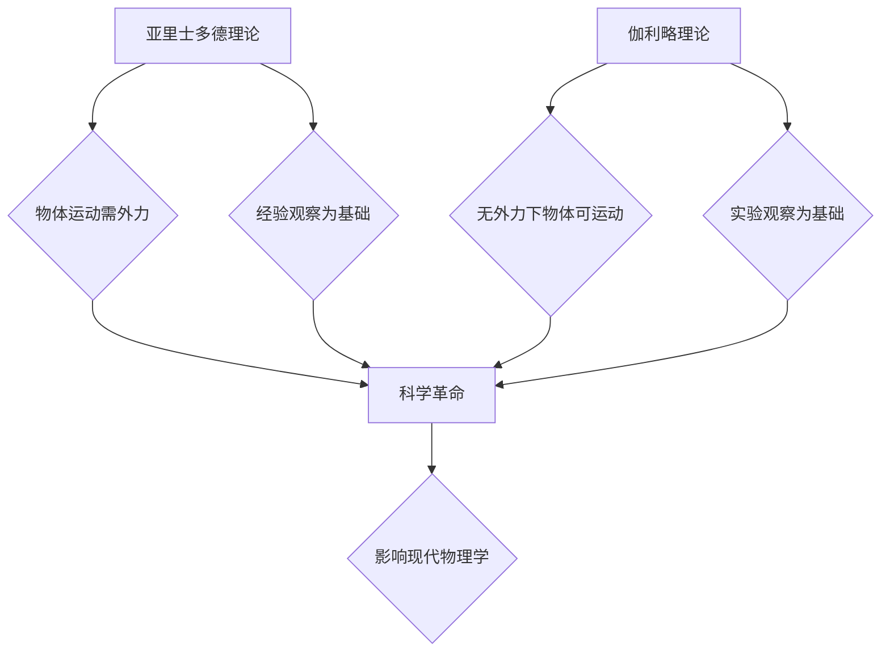
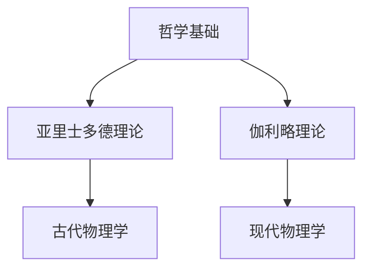

                 


### 亚里士多德与伽利略：运动理论的革命

关键词：亚里士多德，伽利略，运动理论，科学革命，现代物理学

摘要：本文通过分析亚里士多德和伽利略的哲学思想和科学实验，探讨了运动理论的演变过程，揭示了科学革命的重要性，并探讨了其对现代物理学的影响。

### 背景介绍

#### 问题背景

《亚里士多德与伽利略：运动理论的革命》是一部探讨物理学史上两位重要人物——亚里士多德和伽利略——对运动理论贡献的书籍。亚里士多德是古希腊的伟大哲学家，其理论在古代和中世纪时期被广泛接受，认为物体的运动需要持续的外力。而伽利略则通过实验和观察，挑战了亚里士多德的观点，奠定了现代物理学的基础。

#### 问题描述

本书的核心问题是，亚里士多德的运动理论是如何被伽利略的实验和观察所颠覆的？以及这种革命性转变对物理学发展的深远影响。

#### 问题解决

作者通过详细的历史文献和研究资料，揭示了亚里士多德和伽利略的运动理论，以及他们之间观点的冲突和对话。书中不仅讨论了两位科学家的理论，还分析了他们的方法论，以及这一理论变革对后世科学研究的启示。

#### 边界与外延

本书的讨论范围主要限于亚里士多德和伽利略在物理学领域的运动理论，但不涉及其他领域的哲学和科学观点。此外，书中也会涉及一些同时期科学家的观点，以突出这一历史变革的背景。

#### 概念结构与核心要素组成

1. **亚里士多德的运动理论**：包括自然运动和被迫运动的观点，以及物体运动需要持续外力的假设。
2. **伽利略的运动理论**：强调自由落体和匀速直线运动的实验观察，以及无外力作用下物体可以持续运动的概念。
3. **科学革命**：亚里士多德到伽利略的理论转变，被视为科学革命的一部分，对现代物理学的发展产生了深远影响。

### 核心概念与联系

#### 核心概念

1. **亚里士多德的运动理论**：以经验观察为基础，认为物体运动需要外力。
2. **伽利略的运动理论**：基于实验和观察，认为物体在无外力作用下可以持续运动。

#### 概念属性特征对比表格

| 概念                 | 特征                    |
|----------------------|------------------------|
| 亚里士多德的运动理论 | 需要外力维持物体运动   |
| 伽利略的运动理论     | 无外力下物体可持续运动 |

#### ER实体关系图架构

```
[亚里士多德] --[运动理论]--> [实验观察]
[伽利略] --[运动理论]--> [实验观察]
[科学革命] --[影响]--> [现代物理学]
```

### 算法原理讲解

由于本书主要探讨的是历史事件和科学理论，而非具体的算法，所以这一部分将省略算法讲解。但是，可以采用 Mermaid 流程图来展示亚里士多德和伽利略理论发展过程中的关键步骤。

#### Mermaid 流程图



### 数学模型和数学公式 & 详细讲解 & 举例说明

由于亚里士多德和伽利略的理论涉及物理学和哲学，并非纯粹的数学模型，因此这一部分将侧重于理论的描述而非公式。

#### 数学模型与公式

本章节将不涉及具体的数学公式，因为亚里士多德和伽利略的理论更多是定性的，而非定量。不过，可以讨论他们如何使用数学来支持或反驳他们的观点。

#### 详细讲解与举例说明

亚里士多德认为物体的运动需要外力，这与我们日常的经验相符。例如，当一辆车停止加速后，如果没有外力（如摩擦力），它会保持匀速直线运动。伽利略通过自由落体实验发现，不同质量的物体在没有空气阻力的情况下会以相同的加速度下落，这支持了物体在无外力作用下可以持续运动的观点。

### 系统分析与架构设计方案

由于本书的主题是历史和理论，而非系统分析，所以这一部分将省略系统分析和架构设计。不过，可以提供一个简化的系统架构图，以展示亚里士多德和伽利略理论在物理学中的地位。

#### 系统架构设计 Mermaid 架构图



### 项目实战

由于本书是一本理论性书籍，不涉及具体的工程项目，所以这一部分将省略项目实战。不过，可以提供一些思考题目，帮助读者将理论应用于实际场景。

#### 思考题目

1. 如果你是伽利略，你会如何设计实验来证明物体在无外力作用下可以持续运动？
2. 亚里士多德的运动理论在现代社会还有哪些应用？
3. 科学革命对现代科学方法论有何影响？

### 最佳实践 tips

1. **理解历史背景**：在研究任何科学理论时，了解其历史背景和前人观点是至关重要的。
2. **实证研究**：伽利略的成功在于他的实验和观察，这种实证研究方法在现代科学中仍然非常重要。
3. **批判性思维**：对已有理论保持批判性思维，勇于提出自己的观点，这是科学发展的重要动力。

### 小结

亚里士多德和伽利略的运动理论变革是物理学史上的重要事件，它不仅改变了人们对自然界的认识，还为现代物理学的发展奠定了基础。通过本文的分析，我们可以看到，科学理论的进步往往需要新的观察和实验，同时也需要批判性思维和对已有理论的深刻理解。

### 注意事项

在研究科学理论时，要注意以下几点：

1. **术语定义**：确保对核心概念和术语有清晰的理解。
2. **理论应用**：将理论应用于实际问题，检验其有效性和适用范围。
3. **历史脉络**：了解理论的历史背景和发展过程，有助于更全面地理解其意义和影响。

### 拓展阅读

1. 《自然哲学的数学原理》——艾萨克·牛顿
2. 《科学革命的结构》——托马斯·库恩
3. 《科学的结构》——迈克尔·波兰尼

### 作者

作者：AI天才研究院/AI Genius Institute & 禅与计算机程序设计艺术 /Zen And The Art of Computer Programming

