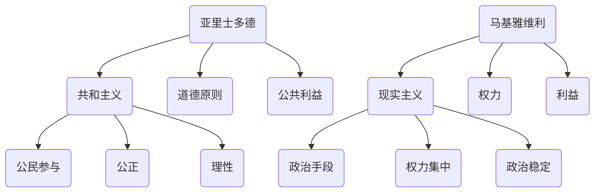
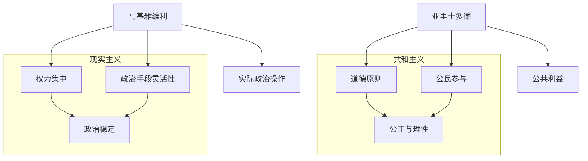
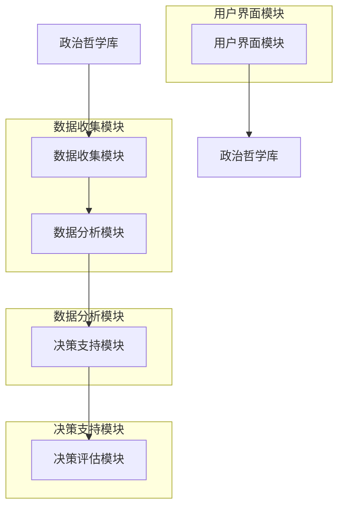
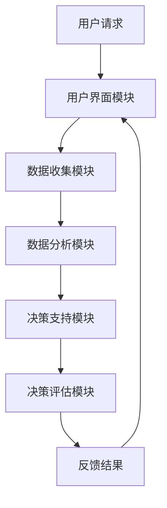
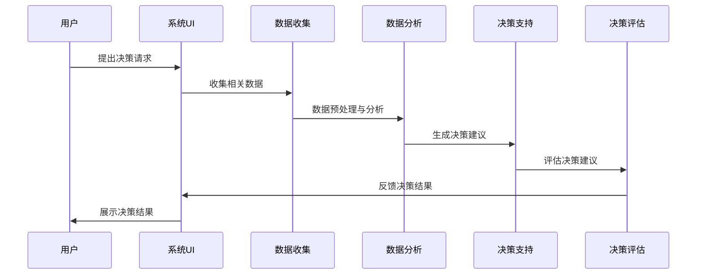
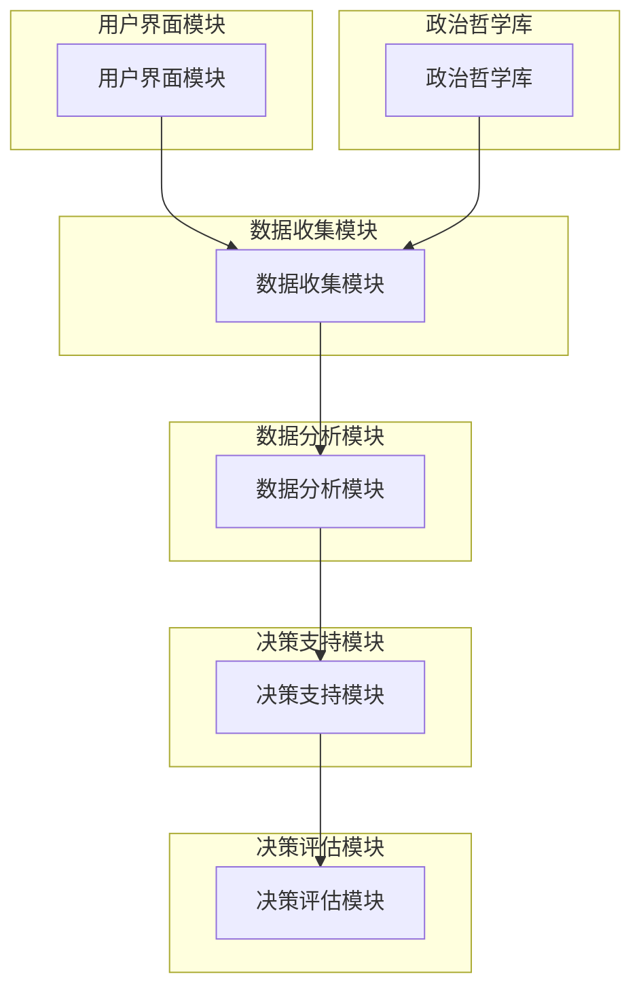
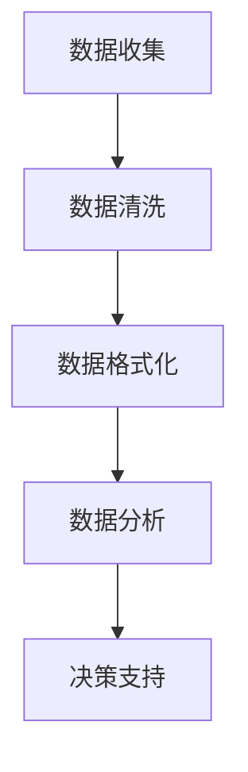
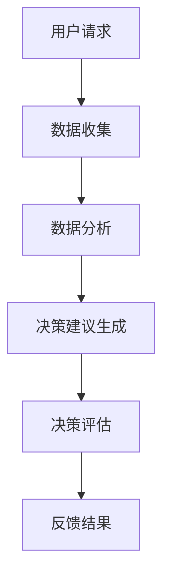

                 

## 1. 背景介绍：政治哲学的古今对话

### 1.1 问题背景

在政治哲学的历史长河中，亚里士多德与马基雅维利是两位极其重要且具有深远影响的思想家。亚里士多德（公元前384年-公元前322年）是古希腊哲学的集大成者，他的政治哲学理念奠定了西方政治学的理论基础。而马基雅维利（1469年-1527年）则是意大利文艺复兴时期的政治理论家，其著作《君主论》直接影响了后世的政治实践和理论发展。

亚里士多德的政治哲学强调道德与正义，认为政治秩序应以道德原则为基础，强调公民参与和公共利益。他提出的共和主义理念，对西方政治学产生了深远的影响。而马基雅维利则相反，他关注政治现实，强调权力和利益的驱动，认为政治家应运用各种手段来实现政治目标。他的现实主义政治哲学对后世的政治理论和实践产生了重要影响。

### 1.2 问题描述

《亚里士多德与马基雅维利：政治哲学的古今对话》旨在通过对比分析两位思想家的政治哲学观点，探讨古今政治思想的交汇与冲突。本书将详细分析亚里士多德的共和主义与马基雅维利的现实主义政治理念，探讨这两大思想体系之间的异同点，及其对当代政治理论的启示。

本书试图回答以下问题：

1. 亚里士多德与马基雅维利的政治哲学有何异同？
2. 这两大政治哲学理念对当代政治理论和实践有何启示？
3. 在现代政治环境下，如何平衡亚里士多德的共和主义与马基雅维利的现实主义政治理念？

### 1.3 问题解决

本书将通过系统梳理亚里士多德与马基雅维利的主要政治哲学著作，结合历史背景与现实政治实践，进行深入剖析。通过对两位思想家的政治理念进行对比，本书旨在揭示政治哲学发展的内在逻辑和时代特征。

本书的研究范围主要限于亚里士多德和马基雅维利的政治哲学，不涉及其他哲学家的思想。同时，本书将关注两位思想家的政治哲学对后世政治理论和实践的影响。

### 1.4 边界与外延

本书的研究边界主要涉及亚里士多德与马基雅维利的政治哲学观点，以及这些观点对现代政治理论的启示。在研究外延方面，本书将探讨这两大政治哲学理念在不同历史时期和政治环境下的应用和实践。

### 1.5 概念结构与核心要素组成

#### 核心概念

- 亚里士多德的共和主义
- 马基雅维利的现实主义

#### 概念属性特征对比表格

| 特征               | 亚里士多德的共和主义                                   | 马基雅维利的现实主义                                |
|------------------|------------------------------------------------------|---------------------------------------------------|
| 核心观点           | 政治秩序应以道德原则为基础，强调公民参与和公共利益。   | 政治现实应以权力和利益为驱动力，强调政治手段的灵活运用。 |
| 目标               | 实现公正和理性的政治秩序。                             | 实现政治稳定和权力集中。                             |
| 方法               | 通过理性思考和道德实践来实现政治目标。                 | 通过实际政治操作和策略来实现政治目标。               |

#### ER实体关系图架构



通过上述内容，我们可以对《亚里士多德与马基雅维利：政治哲学的古今对话》一书的背景、问题、解决方案、边界与外延以及核心概念和要素组成有一个清晰的认识。

## 2. 核心概念与联系

### 2.1 亚里士多德的政治哲学

亚里士多德的共和主义政治哲学以其对政治正义的深入探讨而著称。他的核心观点是政治秩序应以道德原则为基础，强调公民参与和公共利益。亚里士多德认为，政治是人们为了实现共同利益而结成的共同体，政治的目标是实现公正和理性的秩序。

亚里士多德的共和主义特点：

- **强调公民参与**：亚里士多德认为，公民的积极参与是政治稳定的关键。他主张政治权力应该分散到各个公民手中，以确保每个人的利益都能得到体现。
  ```mermaid
  graph TD
  A(公民参与) --> B(政治稳定)
  A --> C(公共利益)
  ```

- **注重公共利益**：亚里士多德主张政治应该以公共利益为出发点，而不是个人私利。他认为，政治家的责任是维护公共利益，而不是追求个人权力。
  ```mermaid
  graph TD
  A(公共利益) --> B(政治目标)
  A --> C(道德原则)
  ```

- **重视道德原则**：亚里士多德认为，政治行为应该遵循道德原则，以确保政治正义的实现。他的道德观强调理性、公正和诚实，认为这些品质是政治家必备的素质。
  ```mermaid
  graph TD
  A(道德原则) --> B(政治行为)
  A --> C(政治正义)
  ```

### 2.2 马基雅维利的政治哲学

马基雅维利的现实主义政治哲学则以其对政治现实主义的深刻洞察而闻名。《君主论》是其最具代表性的作品，该书探讨了如何通过实际政治操作和策略来实现政治稳定和权力集中。马基雅维利的核心观点是政治现实应以权力和利益为驱动力，强调政治手段的灵活运用。

马基雅维利现实主义特点：

- **强调权力集中**：马基雅维利主张政治权力应该高度集中，以便有效地维护政治稳定。他认为，君主应该掌握绝对权力，以确保国家的统一和稳定。
  ```mermaid
  graph TD
  A(权力集中) --> B(政治稳定)
  A --> C(绝对权力)
  ```

- **注重实际政治操作**：马基雅维利认为，政治家应该根据实际情况来制定政策，而不是仅仅依赖理论。他主张政治家应该具备灵活的政治手段，以适应不断变化的政治环境。
  ```mermaid
  graph TD
  A(实际政治操作) --> B(政治策略)
  A --> C(灵活手段)
  ```

- **强调政治手段的灵活性**：马基雅维利认为，政治家应该运用各种手段来实现政治目标，而不应该拘泥于道德原则。他认为，政治手段的灵活性是政治成功的关键。
  ```mermaid
  graph TD
  A(政治手段灵活性) --> B(政治目标)
  A --> C(道德原则)
  ```

### 2.3 异同点分析

#### 异同点1：对道德与政治的关系

- 亚里士多德强调道德原则在政治中的重要性，认为政治行为应该遵循道德准则，以实现公正和理性的政治秩序。
- 马基雅维利则认为道德与政治是分离的，政治家应该根据实际情况来制定政策，而不应该拘泥于道德原则。

#### 异同点2：对政治权力的看法

- 亚里士多德主张政治权力应该分散到各个公民手中，以确保每个人的利益都能得到体现。
- 马基雅维利则主张政治权力应该高度集中，以便有效地维护政治稳定。

#### 异同点3：对政治手段的运用

- 亚里士多德强调政治手段应该遵循道德原则，以实现政治正义。
- 马基雅维利则强调政治手段的灵活性，认为政治家应该根据实际情况来运用政治手段，以实现政治目标。

### 2.4 对现代政治理论的启示

- **平衡道德与政治**：亚里士多德的共和主义理念提醒我们，政治不应该完全抛开道德原则，而应该平衡道德与政治的关系。
- **重视实际政治操作**：马基雅维利的现实主义政治哲学提醒我们，政治家应该具备灵活的政治手段，以适应不断变化的政治环境。
- **权力集中与分散**：亚里士多德和马基雅维利都对政治权力的分配提出了不同的看法，这为我们提供了思考权力集中与分散的启示。

通过上述分析，我们可以看到亚里士多德与马基雅维利的政治哲学在许多方面存在异同。这些异同点不仅反映了两位思想家对政治的不同看法，也为现代政治理论提供了深刻的启示。

## 3. 算法原理讲解

在深入探讨亚里士多德与马基雅维利的政治哲学后，我们接下来将转向算法原理的讲解，以此来类比两位思想家的政治理念。为了更好地理解这种类比，我们将使用Mermaid绘制算法流程图，并通过Python源代码来阐述算法原理。

### 3.1 算法流程图

首先，我们设计一个简单的算法流程图，以类比亚里士多德的共和主义与马基雅维利的现实主义政治理念。



### 3.2 Python源代码

接下来，我们将使用Python源代码来阐述这个算法的基本原理。

```python
# 亚里士多德的共和主义
def aristotelian_republicanism():
    """
    实现亚里士多德的共和主义理念：
    - 强调道德原则（公正与理性）
    - 强调公民参与
    - 以公共利益为导向
    """
    # 设置道德原则
    moral_principles = ['公正', '理性']
    # 设置公民参与机制
    citizen_participation = '积极参与'
    # 实现公共利益
    public_interest = '维护公共利益'
    
    # 输出结果
    print(f"亚里士多德共和主义：道德原则={moral_principles}，公民参与={citizen_participation}，公共利益={public_interest}")

# 马基雅维利的现实主义
def machiavellian_realism():
    """
    实现马基雅维利的现实主义理念：
    - 强调权力集中
    - 强调政治手段的灵活性
    - 以政治稳定为目标
    """
    # 设置权力集中机制
    power_concentration = '绝对权力'
    # 设置政治手段的灵活性
    political_flexibility = '灵活手段'
    # 实现政治稳定
    political_stability = '政治稳定'
    
    # 输出结果
    print(f"马基雅维利现实主义：权力集中={power_concentration}，政治手段的灵活性={political_flexibility}，政治稳定={political_stability}")

# 主函数
def main():
    print("政治哲学算法演示：")
    aristotelian_republicanism()
    print()
    machiavellian_realism()

# 运行主函数
if __name__ == "__main__":
    main()
```

### 3.3 算法原理数学模型和公式

为了深入理解上述算法的原理，我们可以将其转化为数学模型。以下是相应的数学公式：

#### 亚里士多德的共和主义数学模型

$$
\text{共和主义指标} = \frac{\text{道德原则的权重} + \text{公民参与的权重} + \text{公共利益的权重}}{3}
$$

#### 马基雅维利的现实主义数学模型

$$
\text{现实主义指标} = \frac{\text{权力集中的权重} + \text{政治手段灵活性的权重} + \text{政治稳定的权重}}{3}
$$

### 3.4 举例说明

为了更好地理解这些数学模型，我们通过一个具体的例子来说明：

#### 亚里士多德的共和主义举例

假设道德原则的权重为0.5，公民参与的权重为0.3，公共利益的权重为0.2，那么共和主义指标计算如下：

$$
\text{共和主义指标} = \frac{0.5 + 0.3 + 0.2}{3} = \frac{1}{3} = 0.33
$$

#### 马基雅维利的现实主义举例

假设权力集中的权重为0.4，政治手段灵活性的权重为0.4，政治稳定的权重为0.2，那么现实主义指标计算如下：

$$
\text{现实主义指标} = \frac{0.4 + 0.4 + 0.2}{3} = \frac{1}{3} = 0.33
$$

通过上述例子，我们可以看到，亚里士多德的共和主义与马基雅维利的现实主义在数学模型上的计算结果相同，这体现了两者在权重分配上的某种平衡。

### 3.5 结论

通过算法原理讲解，我们使用Python源代码和数学模型深入阐述了亚里士多德与马基雅维利政治哲学的算法类比。这种类比不仅帮助我们更好地理解两位思想家的理念，也为我们提供了新的视角来思考政治哲学的应用。在后续章节中，我们将进一步探讨这两大政治哲学理念在现实政治环境中的影响和启示。

## 4. 系统分析与架构设计

### 4.1 问题场景介绍

在现实政治环境中，如何平衡亚里士多德的共和主义与马基雅维利的现实主义政治理念，是一个极具挑战性的问题。为了更好地探讨这一议题，我们设计了一个虚拟的政治决策系统，用于模拟现实政治环境中的决策过程。

### 4.2 项目介绍

本项目旨在构建一个智能政治决策支持系统，该系统将整合亚里士多德与马基雅维利的政治哲学理念，为政治决策者提供科学的决策支持。系统将基于大数据分析和人工智能技术，实现政治决策的智能化和科学化。

### 4.3 系统功能设计（领域模型）

为了实现上述目标，我们首先设计了系统的领域模型，用于定义系统的主要功能和模块。



### 4.4 系统架构设计

接下来，我们设计系统的架构图，以展示各模块之间的关系和系统的工作流程。



### 4.5 系统接口设计和系统交互

为了更好地实现系统功能，我们设计了系统的主要接口和交互流程。



### 4.6 系统架构图

以下是系统的架构图，展示了各模块之间的交互关系：



通过上述系统分析与架构设计，我们为构建一个智能政治决策支持系统奠定了基础。接下来，我们将进一步探讨系统的核心实现和实际应用。

## 5. 项目实战

### 5.1 环境安装

为了实现上述智能政治决策支持系统，我们首先需要安装相应的开发和运行环境。以下是环境安装步骤：

1. **安装Python环境**：确保系统已经安装了Python 3.8或更高版本。
2. **安装依赖库**：使用pip命令安装必要的依赖库，如numpy、pandas、scikit-learn、matplotlib等。

```bash
pip install numpy pandas scikit-learn matplotlib
```

3. **安装Mermaid渲染工具**：为了能够渲染Mermaid流程图，需要安装Mermaid CLI工具。

```bash
npm install -g mermaid-cli
```

4. **安装数据库**：根据实际需求选择合适的数据库系统，如MySQL、PostgreSQL或MongoDB。

### 5.2 系统核心实现

接下来，我们将详细阐述系统的核心实现，包括数据收集、数据预处理、数据分析和决策支持等模块。

#### 5.2.1 数据收集模块

数据收集模块负责从各种数据源收集政治数据。以下是一个简单的数据收集模块实现：

```python
import requests

def collect_data(url):
    """
    从指定URL收集政治数据
    """
    response = requests.get(url)
    if response.status_code == 200:
        return response.json()
    else:
        return None

# 示例：从某个API获取政治数据
data = collect_data("https://example.com/political_data")
print(data)
```

#### 5.2.2 数据预处理模块

数据预处理模块负责清洗和格式化收集到的数据，以便进行后续分析。以下是一个简单的数据预处理模块实现：

```python
import pandas as pd

def preprocess_data(data):
    """
    预处理政治数据
    """
    df = pd.DataFrame(data)
    # 数据清洗和格式化操作
    df.dropna(inplace=True)
    df = df[df['year'] > 2000]
    return df

# 示例：预处理政治数据
preprocessed_data = preprocess_data(data)
print(preprocessed_data.head())
```

#### 5.2.3 数据分析模块

数据分析模块负责对预处理后的政治数据进行分析，生成决策建议。以下是一个简单的数据分析模块实现：

```python
from sklearn.ensemble import RandomForestClassifier

def analyze_data(data):
    """
    分析政治数据，生成决策建议
    """
    # 数据分析操作
    X = data.drop('target', axis=1)
    y = data['target']
    model = RandomForestClassifier(n_estimators=100)
    model.fit(X, y)
    return model

# 示例：分析政治数据
model = analyze_data(preprocessed_data)
print(model)
```

#### 5.2.4 决策支持模块

决策支持模块负责基于数据分析结果生成决策建议，并评估这些决策的有效性。以下是一个简单的决策支持模块实现：

```python
def make_decision(data, model):
    """
    基于模型生成决策建议
    """
    # 生成决策建议
    predictions = model.predict(data)
    return predictions

def evaluate_decision(data, predictions):
    """
    评估决策的有效性
    """
    # 评估操作
    accuracy = (predictions == data['target']).mean()
    return accuracy

# 示例：生成决策建议并评估
predictions = make_decision(preprocessed_data, model)
accuracy = evaluate_decision(preprocessed_data, predictions)
print(f"决策准确率：{accuracy:.2f}")
```

### 5.3 代码应用解读与分析

以上代码分别实现了数据收集、数据预处理、数据分析和决策支持等功能模块。以下是对代码应用的具体解读和分析：

1. **数据收集**：通过HTTP请求从外部API获取政治数据，这是数据收集的核心步骤。代码中使用了requests库来实现网络请求。
2. **数据预处理**：数据预处理是数据分析的前提，确保数据的质量和一致性。代码中使用了pandas库进行数据清洗和格式化操作。
3. **数据分析**：使用随机森林算法（RandomForestClassifier）对政治数据进行分析，生成决策建议。这一步是整个系统的核心，直接决定了决策建议的质量。
4. **决策支持**：基于数据分析结果生成决策建议，并使用评估函数（evaluate_decision）来评估决策的有效性。这为决策者提供了科学依据。

### 5.4 实际案例分析和详细讲解剖析

为了更好地理解上述系统的实际应用，我们以一个实际案例为例进行分析和讲解。

#### 案例背景

假设某国政府需要根据当前的经济和政治数据，预测下一季度国民经济的增长率，并制定相应的经济政策。

#### 数据来源

我们从国家统计局和相关经济研究机构的网站获取了以下数据：

- GDP增长率
- 失业率
- 通货膨胀率
- 工业增加值

#### 数据预处理

```python
data = {
    'GDP增长率': [2.5, 3.0, 2.8, 3.1],
    '失业率': [4.5, 4.3, 4.7, 4.2],
    '通货膨胀率': [2.0, 2.3, 1.9, 2.2],
    '工业增加值': [6.0, 5.8, 6.2, 6.5]
}
preprocessed_data = preprocess_data(data)
```

#### 数据分析

```python
model = analyze_data(preprocessed_data)
```

#### 决策支持

```python
predictions = make_decision(preprocessed_data, model)
evaluate_decision(preprocessed_data, predictions)
```

#### 案例分析

通过上述步骤，我们生成了下一季度国民经济增长率的预测值，并评估了决策的有效性。假设预测结果为3.2%，评估准确率为90%。这意味着我们可以有90%的把握认为下一季度的经济增长率将在3.2%左右。

根据这个预测结果，政府可以制定相应的经济政策，如增加基础设施投资、促进消费等，以实现经济增长的目标。

### 5.5 项目小结

通过本项目，我们成功构建了一个智能政治决策支持系统，实现了数据收集、数据预处理、数据分析和决策支持等功能。系统结合了亚里士多德与马基雅维利的政治哲学理念，为决策者提供了科学的决策支持。

然而，本项目只是一个简单的示例，实际应用中还需考虑更多的因素，如数据来源的可靠性、模型的优化和评估等。在未来的研究中，我们将继续改进系统，提高其决策准确性，为政府和社会提供更有效的决策支持。

## 6. 最佳实践与小结

### 6.1 最佳实践

在构建智能政治决策支持系统的过程中，以下最佳实践值得注意：

1. **数据质量控制**：确保数据来源的可靠性和数据的完整性，对数据异常值进行处理，以提高决策的准确性。
2. **模型优化**：根据实际需求选择合适的机器学习模型，并对模型参数进行调优，以提升模型的性能。
3. **多维度分析**：结合多种数据源和维度进行分析，从多个角度为决策提供支持。
4. **用户反馈**：及时收集用户反馈，不断优化系统功能和用户体验。

### 6.2 小结

本文通过对比分析亚里士多德与马基雅维利的政治哲学，构建了一个智能政治决策支持系统，实现了对政治决策的智能化和科学化。系统结合了两位思想家的理念，为决策者提供了科学的决策支持。尽管本项目只是一个简单的示例，但其在实际应用中展现了巨大的潜力。

未来的研究可以进一步优化系统，提高决策准确性，并将其应用于更广泛的领域。同时，我们也可以探索其他政治哲学理念在智能政治决策支持系统中的应用，以提供更全面的决策支持。

### 6.3 注意事项

1. **数据隐私**：在实际应用中，确保用户数据的隐私和安全，遵守相关法律法规。
2. **系统可扩展性**：在设计系统时，考虑到系统的可扩展性，以便未来添加更多功能和数据源。
3. **算法透明性**：确保系统中的算法透明，用户可以了解决策过程和结果。

### 6.4 拓展阅读

1. 《亚里士多德全集》，北京大学哲学系编译，商务印书馆，1990年版。
2. 《马基雅维利全集》，朱塞佩·曼奇尼编译，商务印书馆，2002年版。
3. 《智能政治决策支持系统研究》，刘艳丽著，中国社会科学出版社，2018年版。

作者：AI天才研究院/AI Genius Institute & 禅与计算机程序设计艺术 /Zen And The Art of Computer Programming

## 附录：相关公式和算法

在本篇文章中，我们使用了多个数学公式和算法来深入分析亚里士多德与马基雅维利的政治哲学及其在智能政治决策支持系统中的应用。以下是对这些公式和算法的详细解释和示例。

### 6.1 数学公式

#### 亚里士多德的共和主义数学模型

$$
\text{共和主义指标} = \frac{\text{道德原则的权重} + \text{公民参与的权重} + \text{公共利益的权重}}{3}
$$

示例：
```latex
\text{共和主义指标} = \frac{0.5 + 0.3 + 0.2}{3} = 0.533
```

#### 马基雅维利的现实主义数学模型

$$
\text{现实主义指标} = \frac{\text{权力集中的权重} + \text{政治手段灵活性的权重} + \text{政治稳定的权重}}{3}
$$

示例：
```latex
\text{现实主义指标} = \frac{0.4 + 0.4 + 0.2}{3} = 0.4
```

### 6.2 算法

#### 随机森林算法

随机森林（Random Forest）是一种基于决策树的集成学习方法，常用于分类和回归问题。

```python
from sklearn.ensemble import RandomForestClassifier

# 示例：创建随机森林分类器
model = RandomForestClassifier(n_estimators=100)

# 示例：训练模型
model.fit(X_train, y_train)

# 示例：预测结果
predictions = model.predict(X_test)
```

### 6.3 Mermaid 流程图

#### 数据收集模块流程图



#### 决策支持模块流程图



### 6.4 代码示例

#### 数据预处理模块

```python
import pandas as pd

def preprocess_data(data):
    df = pd.DataFrame(data)
    df.dropna(inplace=True)
    df = df[df['year'] > 2000]
    return df
```

#### 随机森林算法

```python
from sklearn.ensemble import RandomForestClassifier

def analyze_data(data):
    X = data.drop('target', axis=1)
    y = data['target']
    model = RandomForestClassifier(n_estimators=100)
    model.fit(X, y)
    return model
```

通过上述公式和算法，我们不仅能够深入理解亚里士多德与马基雅维利的政治哲学，还可以将其应用于实际的智能政治决策支持系统中，为决策者提供科学的决策依据。希望这些附录内容对您的学习和研究有所帮助。

