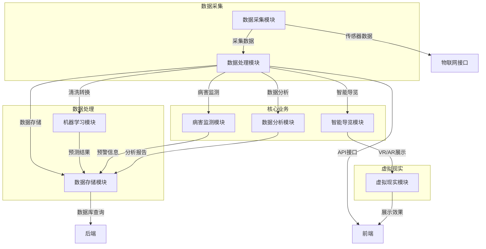
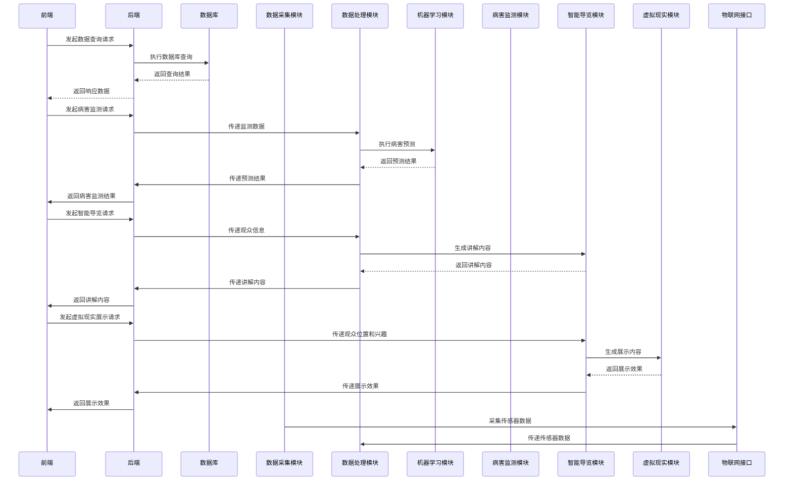

                 

### 1.1 人工智能在博物馆中的应用背景

人工智能（AI）技术的迅猛发展，使得各行各业开始应用这一前沿技术，博物馆与文化遗产保护也不例外。近年来，随着大数据、云计算、物联网和深度学习等技术的结合，人工智能在博物馆中的应用场景日益丰富，逐步改变着博物馆的传统运营模式和服务方式。

首先，人工智能在博物馆的展品管理中发挥了重要作用。通过物联网传感器和图像识别技术，博物馆可以实时监控展品的温度、湿度等环境参数，确保展品的安全。此外，利用计算机视觉技术，可以对展品进行数字化处理，建立详细的展品数据库，实现展品信息的自动化管理。这不仅提高了展品管理的效率，也增强了展品的安全性和可追溯性。

其次，人工智能在博物馆的观众服务中也有所应用。例如，利用自然语言处理（NLP）和语音识别技术，博物馆可以开发智能导览系统，为观众提供个性化的讲解服务。这些系统不仅能够提供语音讲解，还可以实时回答观众的问题，提供更加互动和沉浸式的参观体验。此外，人工智能还可以分析观众的行为数据，了解观众对展品的兴趣点和偏好，从而优化展览设计和展示内容，提高观众的参观满意度。

再次，人工智能在博物馆的文物保护方面也展现了其独特优势。利用机器学习和深度学习算法，可以对文物的病害进行预测和诊断，提前采取保护措施，防止文物受损。此外，通过三维扫描和建模技术，可以创建文物的数字化副本，便于研究和传播。这些数字化副本不仅能够减少实体文物的展示频率，延长其使用寿命，还能为全球的观众提供远程参观的机会。

最后，人工智能还在博物馆的教育推广中发挥了作用。通过人工智能技术，博物馆可以开发智能教育系统，为不同年龄段的观众提供个性化的学习资源。这些系统可以自动适应观众的学习进度和能力，提供有针对性的学习内容，提高教育的效果和吸引力。

综上所述，人工智能在博物馆中的应用背景不仅体现在展品管理、观众服务和文物保护等方面，还在教育推广等方面展现出巨大的潜力。随着技术的不断进步，人工智能将在博物馆与文化遗产保护领域发挥越来越重要的作用。让我们继续探讨，如何更好地利用人工智能技术，为博物馆和文化遗产保护带来更多的创新和变革。### 1.2 博物馆与文化遗产保护面临的挑战

博物馆与文化遗产保护在全球范围内都面临着诸多挑战，这些挑战不仅影响着博物馆的运营效率，也对文化遗产的长期保存和传播构成了威胁。以下是一些主要挑战及其分析：

#### 资金短缺

博物馆与文化遗产保护项目通常需要大量的资金投入，用于文物保护、设施维护、人员培训和展览设计等。然而，许多博物馆特别是非营利性质的博物馆，面临资金短缺的问题。这种资金不足往往导致博物馆无法及时进行必要的维护和保护工作，进而影响文化遗产的保存质量。

**解决方案**：引入公共和私人捐赠，提高公众对博物馆和文化遗产保护的意识，增加政府拨款，以及探索更多的商业合作模式。

#### 环境变化

博物馆内的展品对环境有特定的要求，如温度、湿度、光照等。环境变化，如温度波动、湿度升高、紫外线辐射等，都可能对展品造成损害。此外，气候变化问题也对户外和地下文化遗产构成了威胁，如海水侵蚀、土壤侵蚀等。

**解决方案**：采用先进的监测和控制技术，实时监测展品和环境参数，制定科学的环境控制策略。加强国际合作，共同应对气候变化问题。

#### 展品损耗

展品的自然老化和人为损坏是博物馆面临的另一大挑战。文物随着时间的推移会发生老化，如纸张变脆、颜料褪色等。同时，观众在参观过程中可能对展品造成无意中的破坏，如触摸、光线直射等。

**解决方案**：通过数字化和虚拟展览技术，减少实体展品的展示频率。采用防损材料和先进的技术手段，如触摸屏、防紫外线玻璃等，保护展品。加强观众教育和行为引导，减少对展品的损坏。

#### 信息传播不足

博物馆的观众群体有限，特别是对于偏远地区和文化背景不同的观众，很难有机会参观博物馆。此外，即使是在博物馆内，许多展品的历史和文化背景也难以用简单的方式向观众传达。

**解决方案**：利用人工智能技术，开发智能导览系统和在线展览，将博物馆的内容传播到更广泛的受众。利用社交媒体和虚拟现实技术，增强互动性和参与感。

#### 安全隐患

博物馆和文化遗产地点是珍贵文物的集中地，容易成为盗窃和破坏的目标。此外，自然灾害和人为事故也可能对博物馆和文化遗产造成严重损害。

**解决方案**：加强安保措施，采用先进的监控技术和报警系统。制定应急预案，提高应对突发事件的能力。

#### 法律法规限制

不同国家和地区对博物馆和文化遗产保护的法律法规有所不同，这些法规往往限制了博物馆在保护和创新方面的灵活性。

**解决方案**：加强国际合作，推动制定统一的文化遗产保护法规。提高博物馆管理人员和相关人员的法律意识，确保遵守相关法规。

综上所述，博物馆与文化遗产保护面临的挑战多种多样，但通过技术创新、法律法规完善和社会参与，可以逐步克服这些困难，为文化遗产的长期保存和传播创造更好的条件。### 1.3 人工智能在文化遗产保护中的作用

人工智能在文化遗产保护中发挥着至关重要的作用，通过多种技术手段，AI不仅提升了博物馆的管理效率，也极大地改善了文化遗产的保护方法。以下是人工智能在文化遗产保护中的具体作用：

#### 数据收集与整理

人工智能技术，尤其是计算机视觉和自然语言处理，在数据收集与整理方面表现出色。利用图像识别技术，AI可以自动扫描和识别展品，快速建立详细的展品数据库。自然语言处理技术则能够处理大量的历史文献和资料，自动提取和分类关键信息，为研究者提供便捷的查询工具。通过大数据分析，博物馆可以更全面地了解展品的历史背景、文化价值和研究意义。

#### 展品保护与监测

人工智能在展品保护与监测中的应用同样不可忽视。通过物联网传感器和实时监控技术，博物馆可以实时监控展品的温度、湿度、光照等环境参数，确保展品处于最佳保存状态。计算机视觉技术还可以用于监测展品的病害情况，例如，利用图像分析算法识别纸张的褪色、颜料剥落等问题，及时采取修复措施，防止展品受损。

#### 数字化保护与修复

数字化保护与修复是文化遗产保护的重要方向。利用深度学习算法和三维扫描技术，博物馆可以创建文物的数字化副本，实现文物的永久保存和传播。这些数字化副本不仅可以用于展览和教育，还可以作为研究资料，供学者们远程访问。在修复方面，人工智能技术可以通过图像处理和深度学习算法，对受损的文物进行修复，恢复其原有的面貌。

#### 观众互动与服务

人工智能在提高博物馆观众互动与服务质量方面也发挥了重要作用。通过自然语言处理和语音识别技术，博物馆可以开发智能导览系统，为观众提供个性化的讲解服务。这些系统不仅可以回答观众的问题，还能根据观众的行为数据，推荐相关的展品和展览，提升观众的参观体验。此外，虚拟现实（VR）和增强现实（AR）技术的应用，使得观众可以身临其境地体验文物的历史场景，增强互动性和参与感。

#### 文物病害预测

利用机器学习和深度学习算法，人工智能可以预测文物的病害情况，提前采取预防措施。通过对大量历史数据和当前监测数据的分析，AI模型可以识别出可能导致文物受损的因素，如温度波动、湿度变化、紫外线照射等，从而制定科学的保护策略，延长文物的使用寿命。

#### 文化遗产传承与传播

人工智能技术还助力于文化遗产的传承与传播。通过在线展览和虚拟博物馆，全球观众都可以远程参观博物馆，了解文化遗产。此外，人工智能还可以帮助博物馆进行文化研究，通过分析大量的历史文献和数据，揭示文化遗产背后的故事和意义，促进文化的传承和传播。

总之，人工智能在文化遗产保护中发挥着不可或缺的作用。通过数据收集与整理、展品保护与监测、数字化保护与修复、观众互动与服务、文物病害预测以及文化遗产传承与传播等方面，AI不仅提升了博物馆的管理效率，也为文化遗产的长期保存和传播提供了强大的技术支持。随着技术的不断进步，人工智能将在文化遗产保护领域发挥更加重要的作用。### 2.1 人工智能基础概念

要深入探讨人工智能（AI）在博物馆与文化遗产保护中的应用，我们首先需要了解一些基础概念。人工智能是一种模拟人类智能的技术，它使计算机系统能够执行通常需要人类智能才能完成的任务。以下是几个关键的人工智能基础概念：

#### 机器学习（Machine Learning）

机器学习是人工智能的一个分支，它涉及通过数据和统计方法让计算机系统自动学习和改进。机器学习模型通过分析大量数据来发现规律和模式，然后使用这些规律来做出预测或决策。常见的机器学习算法包括线性回归、决策树、支持向量机（SVM）、神经网络等。

**数学模型**：
- 线性回归：$$y = \beta_0 + \beta_1 \cdot x$$
- 决策树：根据特征值进行分叉，将数据集划分为多个子集。
- 神经网络：由多个神经元组成，通过反向传播算法更新权重。

**Python代码示例**：
```python
from sklearn.linear_model import LinearRegression
model = LinearRegression()
model.fit(X, y)
predictions = model.predict(X_new)
```

#### 深度学习（Deep Learning）

深度学习是机器学习的另一个分支，它特别强调使用具有多层隐藏层的神经网络进行训练。深度学习模型能够处理复杂的非线性问题，并在图像识别、语音识别和自然语言处理等领域取得了显著的成果。

**数学模型**：
- 神经网络：由多个层次组成，包括输入层、隐藏层和输出层。每个层次中的神经元通过激活函数连接。
- 反向传播算法：用于更新神经网络的权重，使预测误差最小。

**Python代码示例**：
```python
from tensorflow.keras.models import Sequential
from tensorflow.keras.layers import Dense

model = Sequential()
model.add(Dense(units=64, activation='relu', input_shape=(input_shape)))
model.add(Dense(units=1, activation='sigmoid'))

model.compile(optimizer='adam', loss='binary_crossentropy', metrics=['accuracy'])
model.fit(X_train, y_train, epochs=10, batch_size=32)
```

#### 计算机视觉（Computer Vision）

计算机视觉是人工智能的另一个重要分支，它使计算机能够从图像或视频中提取信息。计算机视觉技术广泛应用于图像识别、物体检测、图像分割和视频分析等领域。

**数学模型**：
- 卷积神经网络（CNN）：通过卷积层、池化层和全连接层，实现图像特征的提取和分类。
- 生成对抗网络（GAN）：由生成器和判别器组成，用于生成逼真的图像。

**Python代码示例**：
```python
from tensorflow.keras.applications import VGG16
model = VGG16(weights='imagenet', include_top=False, input_shape=(224, 224, 3))

# Use the model to extract features from an image
features = model.predict(preprocessed_image)

# Train a classifier using the extracted features
classifier = ...  # Define and compile the classifier
classifier.fit(features_train, y_train)
```

#### 自然语言处理（Natural Language Processing, NLP）

自然语言处理涉及使计算机能够理解、处理和生成自然语言。NLP技术在机器翻译、情感分析、文本分类和信息提取等方面有着广泛的应用。

**数学模型**：
- 词向量：如Word2Vec、GloVe，将单词映射到高维空间，保留语义信息。
- 序列模型：如循环神经网络（RNN）、长短期记忆网络（LSTM），用于处理序列数据。

**Python代码示例**：
```python
from tensorflow.keras.models import Sequential
from tensorflow.keras.layers import Embedding, LSTM, Dense

model = Sequential()
model.add(Embedding(input_dim=vocab_size, output_dim=embedding_dim))
model.add(LSTM(units=128))
model.add(Dense(units=1, activation='sigmoid'))

model.compile(optimizer='adam', loss='binary_crossentropy', metrics=['accuracy'])
model.fit(X, y, epochs=10, batch_size=32)
```

#### 人工智能应用场景

人工智能在博物馆与文化遗产保护中的应用场景广泛，包括但不限于：

- **展品数字化**：利用计算机视觉和深度学习技术，对展品进行数字化处理，建立展品数据库。
- **病害监测与预测**：通过图像识别和机器学习算法，实时监测展品的状态，预测潜在病害。
- **智能导览系统**：结合自然语言处理和语音识别技术，开发智能导览系统，为观众提供个性化讲解。
- **虚拟博物馆**：利用虚拟现实（VR）和增强现实（AR）技术，创建虚拟展览，提供沉浸式参观体验。

综上所述，人工智能的基础概念为我们理解其在博物馆与文化遗产保护中的应用奠定了基础。通过机器学习、深度学习、计算机视觉和自然语言处理等技术的应用，人工智能不仅提升了博物馆的管理效率，也为文化遗产的保护和传播提供了强大的技术支持。### 2.2 博物馆与文化遗产保护相关概念

博物馆与文化遗产保护是一个涉及多个领域的复杂过程，为了更好地理解这个领域，我们需要了解一些相关的基本概念，包括博物馆的定义、文化遗产的定义以及博物馆与文化遗产保护的关系。

#### 博物馆

博物馆是一个专门收集、保存、展示和研究物品的地方，这些物品可以是艺术品、历史物品、自然标本等。博物馆的目的是向公众展示和传播知识，促进文化的理解和传承。

**核心要素**：

- **展品**：博物馆的核心资源，包括艺术品、历史物品、自然标本等。
- **展览设计**：博物馆展示内容的组织与布局，包括主题展览、常设展览等。
- **教育推广**：博物馆通过教育活动、出版物等方式，促进公众对文化知识的理解和兴趣。
- **科学研究**：博物馆进行科研活动，为文物的研究和保护提供科学依据。

**博物馆的类型**：

- **艺术博物馆**：主要展示艺术品，如绘画、雕塑等。
- **历史博物馆**：主要展示历史文物，反映历史事件和社会变迁。
- **自然历史博物馆**：主要展示自然标本，如动植物化石、矿物标本等。
- **科技博物馆**：主要展示科学技术成果，如机器、工具、模型等。

#### 文化遗产

文化遗产是指人类在历史过程中创造、留存下来的物质和非物质财富，它反映了人类的文化记忆和创造力。文化遗产分为物质文化遗产和非物质文化遗产。

**核心要素**：

- **物质文化遗产**：包括古建筑、历史遗址、文物等，是物质文化的实物体现。
- **非物质文化遗产**：包括口头传统、表演艺术、社会习俗、传统手工艺等，是非物质文化的传承方式。

**文化遗产的分类**：

- **世界文化遗产**：被联合国教科文组织认定为具有特殊文化价值的遗产。
- **国家级文化遗产**：被国家认定为具有重要文化价值的遗产。
- **地方文化遗产**：具有地方特色的文化遗产。

#### 博物馆与文化遗产保护的关系

博物馆在文化遗产保护中扮演着至关重要的角色。它们不仅收藏和保护文化遗产，还通过展览和教育推广，使公众更好地理解和欣赏文化遗产。

**保护机制**：

- **物质保护**：通过技术手段保护文物，如温度和湿度的控制、防虫蛀、防紫外线等。
- **数字化保护**：利用数字技术对文物进行数字化处理和保存，实现永久保存和传播。
- **科学研究**：通过科学研究，揭示文化遗产的历史背景和文化价值，为保护提供科学依据。
- **法律法规**：通过法律法规的制定和执行，加强对文化遗产的保护和管理。

**教育推广**：

- **展览教育**：通过举办主题展览，向公众展示文化遗产，提高公众的文化素养。
- **教育活动**：通过举办讲座、研讨会、工作坊等活动，培养公众对文化遗产的兴趣和保护意识。
- **出版物**：通过出版书籍、画册等，传播文化遗产的知识，促进文化交流。

**博物馆的角色**：

- **收藏与保护**：博物馆是文化遗产的重要收藏地和保护机构，负责文物的收藏、修复和保护。
- **研究与传播**：博物馆通过科学研究，揭示文化遗产的历史和文化价值，并通过展览和教育推广，传播文化遗产。
- **公众教育**：博物馆通过教育活动，培养公众对文化遗产的兴趣和保护意识，促进文化的传承和延续。

综上所述，博物馆与文化遗产保护密不可分，通过收藏、保护、研究、教育和推广，博物馆在文化遗产保护中发挥着不可或缺的作用。随着科技的进步，博物馆将继续运用先进的技术手段，为文化遗产的保护和传承贡献更多力量。### 2.3 人工智能与文化遗产保护的联系

人工智能（AI）与文化遗产保护之间存在着紧密的联系，二者在多个方面相互促进。通过深入探讨这些联系，我们可以更好地理解如何利用AI技术来提高文化遗产的保护水平。

#### AI在数据收集与整理中的应用

人工智能技术在数据收集与整理方面具有显著优势，能够提高博物馆与文化遗产保护的工作效率。通过计算机视觉和自然语言处理技术，AI可以自动扫描和分析大量展品和文献资料，快速建立详细的展品数据库。

**实例**：利用深度学习算法，AI能够识别和分类博物馆中的各种艺术品和文物。例如，在意大利的乌菲兹美术馆，研究人员使用深度学习模型对馆藏艺术品进行分类，提高了数据整理的效率和准确性。

#### AI在病害监测与预测中的应用

通过图像识别和机器学习算法，人工智能能够对文物的病害情况进行实时监测和预测。AI系统可以自动分析文物表面的变化，识别潜在的问题，如颜料剥落、纸张褪色等，并提前预警。

**实例**：在英国的大英博物馆，研究人员利用机器学习模型监测壁画和文物的状况。通过对壁画表面图像的分析，AI系统能够预测壁画的退化趋势，并建议采取相应的保护措施。

#### AI在数字化保护与修复中的应用

数字化保护与修复是文化遗产保护的重要方向，人工智能技术在其中发挥了关键作用。通过深度学习算法和三维扫描技术，AI可以创建文物的数字化副本，实现文物的永久保存和传播。

**实例**：在法国的卢浮宫，研究人员使用AI技术对《蒙娜丽莎》进行数字化处理，创建了高质量的数字副本。这些数字化副本不仅用于展览和教育，还为未来的修复工作提供了重要的数据支持。

#### AI在观众互动与服务中的应用

人工智能技术在提升博物馆观众互动与服务质量方面也有显著作用。通过自然语言处理和语音识别技术，AI可以开发智能导览系统，为观众提供个性化的讲解服务。同时，AI还能分析观众的行为数据，优化展览设计和展示内容。

**实例**：在美国的大都会艺术博物馆，研究人员开发了一款基于AI的智能导览应用程序。该应用程序能够根据观众的位置和兴趣，提供定制化的讲解内容，提升了观众的参观体验。

#### AI在文化研究中的应用

人工智能技术还能够助力文化遗产的文化研究，通过大数据分析和自然语言处理，AI能够从大量历史文献中提取有价值的信息，揭示文化遗产背后的故事和意义。

**实例**：在德国的德累斯顿艺术馆，研究人员利用AI技术对大量的历史文献进行文本分析，揭示了馆藏艺术品的历史背景和文化价值，为博物馆的展览设计和研究提供了重要参考。

综上所述，人工智能与文化遗产保护之间的联系体现在数据收集与整理、病害监测与预测、数字化保护与修复、观众互动与服务以及文化研究等多个方面。通过这些应用，AI不仅提高了博物馆与文化遗产保护的效率和质量，也为文化遗产的长期保存和传承提供了强有力的技术支持。随着AI技术的不断进步，其在文化遗产保护领域的应用前景将更加广阔。### 3.1 人工智能算法概述

人工智能算法是使计算机系统实现智能行为的核心组成部分，它们通过学习数据模式和规律，从而在新的情境中做出决策。以下是几种常见的人工智能算法及其基本原理：

#### 机器学习（Machine Learning）

机器学习是一种使计算机系统通过数据学习并做出预测或决策的技术。它主要分为监督学习（Supervised Learning）、无监督学习（Unsupervised Learning）和半监督学习（Semi-Supervised Learning）三种类型。

- **监督学习**：在这种学习方式中，算法从标记好的训练数据中学习，然后用于预测新的数据。常见的算法包括线性回归、决策树、随机森林和支持向量机（SVM）。
- **无监督学习**：算法在没有标记数据的帮助下学习，主要任务包括聚类、降维和关联规则学习。常见的算法有K-均值聚类、主成分分析（PCA）和关联规则学习。
- **半监督学习**：算法在部分标记数据和未标记数据之间学习，可以有效地利用未标记的数据，提高模型的性能。

**机器学习算法的基本流程**：
1. 数据收集：收集并预处理大量数据。
2. 特征提取：从原始数据中提取有助于预测的特征。
3. 模型选择：根据问题的性质选择合适的算法。
4. 模型训练：使用训练数据对模型进行训练。
5. 模型评估：使用测试数据评估模型的性能。
6. 模型优化：根据评估结果调整模型参数。

**Python代码示例**：
```python
from sklearn.datasets import load_iris
from sklearn.model_selection import train_test_split
from sklearn.ensemble import RandomForestClassifier

# 加载数据
iris = load_iris()
X, y = iris.data, iris.target

# 划分训练集和测试集
X_train, X_test, y_train, y_test = train_test_split(X, y, test_size=0.3, random_state=42)

# 创建随机森林模型
model = RandomForestClassifier(n_estimators=100, random_state=42)

# 训练模型
model.fit(X_train, y_train)

# 预测测试集
predictions = model.predict(X_test)

# 评估模型性能
accuracy = model.score(X_test, y_test)
print(f"Accuracy: {accuracy}")
```

#### 深度学习（Deep Learning）

深度学习是机器学习的一个分支，特别强调使用多层神经网络进行训练。它能够处理复杂的数据类型，如图像、语音和文本，并在许多领域取得了突破性的成果。

- **卷积神经网络（CNN）**：主要用于图像识别和物体检测。CNN通过卷积层、池化层和全连接层，实现图像特征的提取和分类。
- **循环神经网络（RNN）**：用于处理序列数据，如时间序列和自然语言文本。RNN通过隐藏状态的反馈循环，捕捉时间序列中的长期依赖关系。
- **长短期记忆网络（LSTM）**：是RNN的一种改进，能够更好地处理长序列数据。LSTM通过引入门控机制，有效避免了梯度消失问题。

**深度学习算法的基本流程**：
1. 数据预处理：对图像、语音和文本数据进行预处理，如归一化、裁剪和编码。
2. 模型设计：设计合适的神经网络架构，包括输入层、隐藏层和输出层。
3. 模型训练：使用大量标注数据对模型进行训练，通过反向传播算法更新网络权重。
4. 模型评估：使用测试数据评估模型性能，如准确率、召回率等。
5. 模型优化：根据评估结果调整模型参数，如学习率、批量大小等。

**Python代码示例**：
```python
from tensorflow.keras.models import Sequential
from tensorflow.keras.layers import Dense, Conv2D, MaxPooling2D, Flatten

model = Sequential()
model.add(Conv2D(filters=32, kernel_size=(3, 3), activation='relu', input_shape=(28, 28, 1)))
model.add(MaxPooling2D(pool_size=(2, 2)))
model.add(Flatten())
model.add(Dense(units=128, activation='relu'))
model.add(Dense(units=10, activation='softmax'))

model.compile(optimizer='adam', loss='categorical_crossentropy', metrics=['accuracy'])
model.fit(X_train, y_train, epochs=10, batch_size=64)
```

#### 强化学习（Reinforcement Learning）

强化学习是一种通过与环境交互来学习最优策略的算法。它主要依赖于奖励机制，通过不断尝试和反馈，逐步改善决策。

- **Q学习（Q-Learning）**：通过预测每个动作的未来回报来学习策略。Q学习使用Q值函数，存储每个状态和动作的组合的最优回报。
- **深度Q网络（DQN）**：将Q学习与深度神经网络相结合，用于处理高维状态空间的问题。DQN通过经验回放和目标网络，提高学习效率和稳定性。

**强化学习算法的基本流程**：
1. 初始化Q值函数：随机初始化每个状态和动作的组合的Q值。
2. 选择动作：在给定状态下，根据当前策略选择动作。
3. 执行动作：在环境中执行选定的动作，并观察状态转移和回报。
4. 更新Q值：根据观察到的回报和新的状态，更新Q值。
5. 重复步骤2-4，直到达到预定的训练次数或性能目标。

**Python代码示例**：
```python
import numpy as np
import random

# 初始化Q值函数
Q = np.zeros([state_space_size, action_space_size])

# 设置学习率、折扣率和探索概率
alpha = 0.1
gamma = 0.9
epsilon = 0.1

# 训练Q值函数
for episode in range(total_episodes):
    state = env.reset()
    done = False
    
    while not done:
        # 根据ε-贪心策略选择动作
        if random.uniform(0, 1) < epsilon:
            action = random.choice(action_space)
        else:
            action = np.argmax(Q[state])
        
        # 执行动作，获取新的状态和回报
        next_state, reward, done, _ = env.step(action)
        
        # 更新Q值
        Q[state, action] = Q[state, action] + alpha * (reward + gamma * np.max(Q[next_state]) - Q[state, action])
        
        state = next_state

# 测试训练后的Q值函数
state = env.reset()
done = False

while not done:
    action = np.argmax(Q[state])
    next_state, reward, done, _ = env.step(action)
    print(f"Action: {action}, Reward: {reward}")
    state = next_state
```

综上所述，人工智能算法涵盖了从简单的规则系统到复杂的深度神经网络，它们在机器学习、深度学习和强化学习等不同领域发挥着重要作用。通过这些算法的应用，我们可以实现从数据中学习规律、进行智能决策，为博物馆与文化遗产保护提供强大的技术支持。### 3.2 数据预处理方法

在人工智能项目中，数据预处理是一个至关重要的步骤，它直接影响到模型的性能和最终结果。数据预处理包括数据清洗、数据转换和数据归一化等多个方面。以下将详细介绍这些方法，并利用Python代码示例进行说明。

#### 数据清洗

数据清洗是数据预处理的第一步，目的是去除数据中的噪声和不必要的部分，确保数据的质量。数据清洗的主要任务包括处理缺失值、异常值和重复值。

**处理缺失值**：缺失值可以通过填充、删除或插值等方法进行处理。

**Python代码示例**：
```python
import pandas as pd
from sklearn.impute import SimpleImputer

# 加载数据
data = pd.read_csv('data.csv')

# 填充缺失值（使用平均值）
imputer = SimpleImputer(missing_values=np.nan, strategy='mean')
data_imputed = imputer.fit_transform(data)

# 删除缺失值
data_no_missing = data.dropna()

# 处理异常值（使用标准差）
from scipy import stats
data = data[~((data - data.mean()).abs() > 3 * data.std())]
```

**处理重复值**：重复值可以通过去重操作删除。

**Python代码示例**：
```python
# 删除重复值
data_unique = data.drop_duplicates()
```

#### 数据转换

数据转换是将数据从一种形式转换为另一种形式的过程，以便更好地进行建模和分析。常见的数据转换方法包括类别数据编码、数据标准化和反标准化等。

**类别数据编码**：将类别数据转换为数值数据，常用的方法有独热编码（One-Hot Encoding）和标签编码（Label Encoding）。

**Python代码示例**：
```python
from sklearn.preprocessing import OneHotEncoder

# 独热编码
encoder = OneHotEncoder(sparse=False)
encoded_data = encoder.fit_transform(data[['category_column']])

# 标签编码
from sklearn.preprocessing import LabelEncoder
label_encoder = LabelEncoder()
data['category_column'] = label_encoder.fit_transform(data['category_column'])
```

**数据标准化**：将数据缩放到一个特定的范围内，常用的方法有最小-最大标准化和Z分数标准化。

**Python代码示例**：
```python
from sklearn.preprocessing import MinMaxScaler

# 最小-最大标准化
scaler = MinMaxScaler()
data_scaled = scaler.fit_transform(data)

# Z分数标准化
from sklearn.preprocessing import StandardScaler
scaler = StandardScaler()
data_scaled = scaler.fit_transform(data)
```

**反标准化**：在模型预测后，将标准化数据还原为原始数据。

**Python代码示例**：
```python
# 反标准化
data_original = scaler.inverse_transform(data_scaled)
```

#### 数据归一化

数据归一化是将数据转换到同一尺度，以便各个特征之间的差异得到均衡。常用的归一化方法有线性归一化和指数归一化。

**Python代码示例**：
```python
# 线性归一化
def normalize(data):
    min_value = np.min(data)
    max_value = np.max(data)
    return (data - min_value) / (max_value - min_value)

# 指数归一化
def normalize_exp(data, base=2):
    return np.power(data, 1 / base)
```

#### 数据预处理流程

数据预处理流程通常包括以下步骤：

1. 数据清洗：处理缺失值、异常值和重复值。
2. 数据转换：进行类别数据编码、数据标准化和反标准化。
3. 数据归一化：将数据转换为同一尺度。
4. 数据分割：将数据分为训练集和测试集，用于模型训练和评估。

**Python代码示例**：
```python
from sklearn.model_selection import train_test_split

# 数据清洗
data_clean = data.dropna().drop_duplicates()

# 数据转换
data_encoded = encoder.fit_transform(data_clean[['category_column']])

# 数据标准化
data_scaled = scaler.fit_transform(data_clean)

# 数据分割
X_train, X_test, y_train, y_test = train_test_split(data_scaled, y, test_size=0.2, random_state=42)
```

通过上述数据预处理方法，我们可以确保数据的质量和一致性，为后续的建模和分析奠定坚实的基础。在实际项目中，根据具体需求和数据特点，可以选择合适的预处理方法，以提高模型的准确性和鲁棒性。### 3.3 机器学习算法原理

机器学习算法是人工智能的核心组成部分，通过从数据中学习模式和规律，实现预测和决策。以下是几种常见的机器学习算法及其原理，包括线性回归、决策树和随机森林。

#### 线性回归（Linear Regression）

线性回归是一种最简单的机器学习算法，用于预测连续值输出。其基本原理是找到一条最佳拟合直线，使预测值与实际值之间的误差最小。

**数学模型**：

线性回归模型可以表示为：
$$y = \beta_0 + \beta_1 \cdot x + \epsilon$$

其中，$y$ 是预测值，$x$ 是输入特征，$\beta_0$ 和 $\beta_1$ 是模型的参数，$\epsilon$ 是误差项。

**算法流程**：

1. 数据预处理：包括数据清洗、归一化等，确保数据质量。
2. 模型训练：使用训练数据计算模型的参数，通常采用最小二乘法（Least Squares Method）。
3. 模型评估：使用测试数据评估模型性能，常用的指标有均方误差（MSE）和R²值。

**Python代码示例**：

```python
from sklearn.linear_model import LinearRegression
from sklearn.model_selection import train_test_split
from sklearn.metrics import mean_squared_error

# 加载数据
X, y = load_data()

# 数据分割
X_train, X_test, y_train, y_test = train_test_split(X, y, test_size=0.2, random_state=42)

# 创建线性回归模型
model = LinearRegression()
model.fit(X_train, y_train)

# 预测测试集
y_pred = model.predict(X_test)

# 评估模型性能
mse = mean_squared_error(y_test, y_pred)
print(f"MSE: {mse}")
```

#### 决策树（Decision Tree）

决策树是一种基于树形结构进行决策的算法，通过一系列的判断条件将数据划分为不同的区域。每个节点表示一个特征，每个分支表示该特征的不同取值。

**算法流程**：

1. 数据预处理：与线性回归类似，进行数据清洗和归一化。
2. 特征选择：选择一个最佳特征进行划分，通常使用基尼不纯度（Gini Impurity）或信息增益（Information Gain）作为划分标准。
3. 树构建：递归地划分数据，直到满足停止条件（如最大深度、最小节点样本数等）。
4. 树剪枝：避免过拟合，通过剪枝方法减少树的复杂度。

**Python代码示例**：

```python
from sklearn.tree import DecisionTreeRegressor
from sklearn.model_selection import train_test_split

# 加载数据
X, y = load_data()

# 数据分割
X_train, X_test, y_train, y_test = train_test_split(X, y, test_size=0.2, random_state=42)

# 创建决策树模型
model = DecisionTreeRegressor(max_depth=5)
model.fit(X_train, y_train)

# 预测测试集
y_pred = model.predict(X_test)

# 评估模型性能
mse = mean_squared_error(y_test, y_pred)
print(f"MSE: {mse}")
```

#### 随机森林（Random Forest）

随机森林是一种基于决策树的集成学习方法，通过构建多个决策树并投票得出最终预测结果。它能够提高模型的稳定性和准确性。

**算法流程**：

1. 数据预处理：与前面两种算法类似，进行数据清洗和归一化。
2. 决策树构建：为每个决策树选择一个子集进行训练，通常通过随机抽样或特征随机选择。
3. 集成：对多个决策树的预测结果进行投票或取平均，得到最终预测结果。

**Python代码示例**：

```python
from sklearn.ensemble import RandomForestRegressor
from sklearn.model_selection import train_test_split

# 加载数据
X, y = load_data()

# 数据分割
X_train, X_test, y_train, y_test = train_test_split(X, y, test_size=0.2, random_state=42)

# 创建随机森林模型
model = RandomForestRegressor(n_estimators=100, max_depth=5)
model.fit(X_train, y_train)

# 预测测试集
y_pred = model.predict(X_test)

# 评估模型性能
mse = mean_squared_error(y_test, y_pred)
print(f"MSE: {mse}")
```

通过上述算法，我们可以根据具体问题的需求选择合适的模型。在实际应用中，通过交叉验证和参数调优，可以进一步提高模型的性能。这些算法在博物馆与文化遗产保护中有着广泛的应用，如预测文物病害、评估展览效果等。### 3.4 深度学习算法原理

深度学习算法是人工智能领域的一大突破，它通过构建多层的神经网络，实现对复杂数据的深层特征提取和学习。以下是几种常见的深度学习算法及其原理，包括卷积神经网络（CNN）和长短期记忆网络（LSTM）。

#### 卷积神经网络（Convolutional Neural Network, CNN）

卷积神经网络是一种专门用于处理图像数据的神经网络，其核心思想是通过卷积层和池化层提取图像的局部特征，并在全连接层中进行分类。

**算法原理**：

1. **卷积层（Convolutional Layer）**：卷积层使用卷积运算提取图像的局部特征。每个卷积核（filter）负责提取图像中的一个局部特征，通过卷积操作生成特征图（feature map）。卷积层可以堆叠多层，以逐步提取更高层次的特征。

$$\text{特征图} = \text{卷积核} * \text{输入图像} + \text{偏置}$$

2. **激活函数（Activation Function）**：激活函数用于引入非线性特性，常用的有ReLU函数。

$$\text{激活函数}(\text{特征图}) = \max(0, \text{特征图})$$

3. **池化层（Pooling Layer）**：池化层用于减小特征图的大小，减少计算量和参数数量。常用的池化操作包括最大池化和平均池化。

$$\text{池化结果} = \max(\text{特征图}_{i,j}) \quad \text{或} \quad \frac{1}{\text{池化区域大小}} \sum_{\text{区域}} \text{特征图}_{i,j}$$

4. **全连接层（Fully Connected Layer）**：全连接层将卷积层和池化层提取的高层次特征映射到输出类别。每个神经元都与前一层的所有神经元相连。

**算法流程**：

1. **输入层（Input Layer）**：接收图像数据。
2. **卷积层和池化层**：通过卷积和池化操作提取图像特征。
3. **全连接层**：对特征进行分类。
4. **输出层（Output Layer）**：输出分类结果。

**Python代码示例**：

```python
from tensorflow.keras.models import Sequential
from tensorflow.keras.layers import Conv2D, MaxPooling2D, Flatten, Dense

model = Sequential()
model.add(Conv2D(filters=32, kernel_size=(3, 3), activation='relu', input_shape=(28, 28, 1)))
model.add(MaxPooling2D(pool_size=(2, 2)))
model.add(Flatten())
model.add(Dense(units=128, activation='relu'))
model.add(Dense(units=10, activation='softmax'))

model.compile(optimizer='adam', loss='categorical_crossentropy', metrics=['accuracy'])
model.fit(X_train, y_train, epochs=10, batch_size=64)
```

#### 长短期记忆网络（Long Short-Term Memory, LSTM）

长短期记忆网络是一种专门用于处理序列数据的循环神经网络，能够有效捕捉序列中的长期依赖关系。

**算法原理**：

1. **单元结构（Unit Structure）**：LSTM单元由输入门、遗忘门、输出门和单元状态组成。每个门由一个sigmoid函数和一个线性层组成，用于控制信息的流入、遗忘和输出。

2. **输入门（Input Gate）**：输入门决定当前输入信息中哪些部分将被更新到单元状态。

$$\text{输入门} = \sigma(W_{ix} \cdot \text{输入} + W_{ih} \cdot \text{隐藏状态} + b_{ix})$$

$$\text{新的候选值} = \tanh(W_{ix} \cdot \text{输入} + W_{ih} \cdot \text{隐藏状态} + b_{ih})$$

3. **遗忘门（Forget Gate）**：遗忘门决定哪些旧的信息应该被遗忘。

$$\text{遗忘门} = \sigma(W_{fx} \cdot \text{输入} + W_{fh} \cdot \text{隐藏状态} + b_{fx})$$

4. **输出门（Output Gate）**：输出门决定单元状态的哪些部分应该被输出到下一个隐藏状态。

$$\text{输出门} = \sigma(W_{ox} \cdot \text{输入} + W_{oh} \cdot \text{隐藏状态} + b_{ox})$$

$$\text{新的隐藏状态} = \text{输出门} \cdot \tanh(\text{遗忘门} \cdot \text{旧隐藏状态} + \text{输入门} \cdot \text{新的候选值})$$

**算法流程**：

1. **输入层（Input Layer）**：接收序列数据。
2. **循环层（Loop Layer）**：通过LSTM单元处理序列数据，更新隐藏状态。
3. **输出层（Output Layer）**：输出序列的最终结果。

**Python代码示例**：

```python
from tensorflow.keras.models import Sequential
from tensorflow.keras.layers import LSTM, Dense

model = Sequential()
model.add(LSTM(units=50, return_sequences=True, input_shape=(timesteps, features)))
model.add(LSTM(units=50, return_sequences=False))
model.add(Dense(units=1))

model.compile(optimizer='adam', loss='mean_squared_error')
model.fit(X_train, y_train, epochs=100, batch_size=32)
```

通过上述算法，我们可以实现对图像和序列数据的高效处理和学习。在实际应用中，通过调整网络结构和参数，可以进一步提高模型的性能。深度学习在博物馆与文化遗产保护中有着广泛的应用，如展品数字化、病害预测和智能导览等。### 4.1 项目介绍

本文将介绍一个基于人工智能技术的博物馆文化遗产保护项目。该项目旨在利用人工智能算法，实现对博物馆展品的数字化保护、病害监测与预测，并提升观众的参观体验。以下是项目的主要目标、应用场景和预期成果：

#### 项目目标

1. **展品数字化**：利用计算机视觉和深度学习技术，对博物馆展品进行数字化处理，建立全面的展品数据库。
2. **病害监测与预测**：通过图像识别和机器学习算法，实时监测展品的病害情况，预测潜在病害，提供针对性的保护措施。
3. **智能导览系统**：结合自然语言处理和语音识别技术，开发智能导览系统，为观众提供个性化的讲解服务，增强互动性。
4. **文化遗产传承与传播**：利用虚拟现实（VR）和增强现实（AR）技术，创建虚拟博物馆和线上展览，扩大文化遗产的传播范围。

#### 应用场景

1. **展品数字化**：通过三维扫描和图像识别技术，对展品进行数字化处理，实现展品的永久保存和传播。
2. **病害监测与预测**：利用图像分析算法，实时监测展品的病害情况，为文物保护提供科学依据。
3. **智能导览系统**：为观众提供智能导览服务，通过语音识别和自然语言处理技术，实现与观众的互动。
4. **虚拟博物馆**：利用VR和AR技术，创建沉浸式的虚拟展览环境，让全球观众都能远程参观博物馆。

#### 预期成果

1. **展品数字化**：建立全面的展品数据库，实现展品的永久保存和传播。
2. **病害监测与预测**：提高博物馆病害监测的准确性和及时性，延长展品的使用寿命。
3. **智能导览系统**：提升观众的参观体验，增强博物馆的教育推广效果。
4. **文化遗产传承与传播**：扩大文化遗产的传播范围，提高公众对文化遗产的认知和保护意识。

通过这个项目，我们期望能够将人工智能技术充分应用于博物馆与文化遗产保护领域，为文化遗产的长期保存和传播提供新的思路和方法。接下来，我们将详细讨论项目的系统功能设计、系统架构设计、系统接口设计和系统交互设计。### 4.2 系统功能设计

为了实现博物馆文化遗产保护项目的目标，系统需要具备以下核心功能模块，每个模块都承载着特定的任务，共同构成一个完整的系统解决方案。

#### 数据采集模块

数据采集模块是整个系统的基石，其主要任务是收集博物馆的各种数据，包括展品信息、环境参数、观众行为数据等。具体功能如下：

1. **展品信息采集**：通过物联网传感器和图像识别技术，实时采集展品的名称、年代、材质、病害状况等信息，建立展品数据库。
2. **环境参数监测**：实时监测博物馆内的温度、湿度、光照等环境参数，确保展品处于最佳保存状态。
3. **观众行为数据采集**：通过智能设备（如手机APP、RFID标签等），收集观众的参观记录、兴趣点、互动行为等数据。

#### 数据处理模块

数据处理模块负责对采集到的原始数据进行清洗、转换和归一化，确保数据的质量和一致性，为后续分析提供可靠的基础。主要功能包括：

1. **数据清洗**：处理缺失值、异常值和重复值，确保数据的完整性和准确性。
2. **数据转换**：对类别数据进行编码，将连续数据进行标准化或归一化，以便后续的机器学习分析。
3. **数据归一化**：将不同特征的数据转换为同一尺度，消除尺度差异对模型训练的影响。

#### 病害监测模块

病害监测模块是系统的核心功能之一，其主要任务是基于采集到的数据和图像识别算法，实时监测展品的病害情况，并提供预警。主要功能包括：

1. **图像识别**：利用深度学习算法，对展品表面的图像进行分析，识别病害特征。
2. **病害预测**：基于历史数据和模型预测，评估展品的潜在病害风险，提供预防性保护措施。
3. **实时监测**：通过物联网传感器和图像识别技术，实时监测展品的病害情况，及时发现和处理问题。

#### 智能导览模块

智能导览模块旨在提升观众的参观体验，为观众提供个性化的讲解服务。主要功能包括：

1. **语音识别**：利用自然语言处理技术，实现观众语音输入的自动识别和解析。
2. **个性化讲解**：根据观众的位置和兴趣，提供定制化的讲解内容，增强互动性。
3. **导览导航**：为观众提供博物馆的导览路线和展览推荐，提高参观效率。

#### 数据分析模块

数据分析模块负责对博物馆运营数据和观众行为数据进行分析，为博物馆的决策提供数据支持。主要功能包括：

1. **数据分析**：利用大数据分析技术，分析观众的兴趣点、行为模式等，优化展览设计和展示内容。
2. **数据可视化**：通过数据可视化技术，将分析结果以图表、报告等形式直观呈现，帮助管理人员了解博物馆的运营状况。
3. **决策支持**：基于数据分析结果，为博物馆提供展览策划、观众服务和文物保护等方面的决策支持。

#### 系统管理模块

系统管理模块负责整个系统的运行和维护，确保系统的稳定性和安全性。主要功能包括：

1. **用户管理**：管理用户账户，提供权限设置和用户角色分配。
2. **日志记录**：记录系统运行日志，包括操作记录、错误日志等，便于问题追踪和系统优化。
3. **安全控制**：确保系统数据的安全，包括数据加密、访问控制等。

通过以上功能模块的协同工作，博物馆文化遗产保护系统能够全面、高效地实现展品数字化、病害监测与预测、智能导览、数据分析和管理等功能，为文化遗产的长期保存和传播提供强有力的技术支持。### 4.3 系统架构设计

为了实现博物馆文化遗产保护项目的目标，系统架构设计需要充分考虑功能模块之间的协同作用和整体性能。以下将详细介绍系统的架构设计，包括技术栈、主要模块及其之间的关系。

#### 技术栈

1. **前端**：采用React.js框架，实现用户界面的动态交互和响应式设计。
2. **后端**：使用Django框架，构建RESTful API，处理数据交互和业务逻辑。
3. **数据库**：采用MongoDB，用于存储大规模的展品信息和观众行为数据。
4. **机器学习与深度学习**：使用TensorFlow和PyTorch，实现图像识别、病害预测等机器学习任务。
5. **物联网**：采用MQTT协议，实现与环境传感器和物联网设备的实时数据通信。
6. **虚拟现实与增强现实**：使用Unity和ARKit，实现沉浸式的虚拟博物馆和导览功能。

#### 系统架构设计

系统架构设计可以分为以下主要模块：

1. **数据采集模块**：负责从物联网传感器、图像识别设备和观众互动设备等处采集数据，并通过MQTT协议传输到后端服务器。
2. **数据处理模块**：对采集到的原始数据进行清洗、转换和归一化，确保数据的质量和一致性，并将其存储在MongoDB数据库中。
3. **核心业务模块**：包括病害监测、智能导览、数据分析和管理等主要功能，通过Django框架实现业务逻辑处理，并与前端进行数据交互。
4. **数据存储模块**：使用MongoDB存储展品信息、环境参数、观众行为数据等，并提供高效的数据查询和更新操作。
5. **机器学习模块**：利用TensorFlow和PyTorch，对采集到的数据进行深度学习和机器学习训练，实现图像识别、病害预测等功能。
6. **虚拟现实与增强现实模块**：使用Unity和ARKit，创建沉浸式的虚拟博物馆和导览功能，提供丰富的用户体验。

#### 模块之间的关系

1. **数据采集模块**与**数据处理模块**：数据采集模块将原始数据传输到数据处理模块，进行处理和存储。
2. **数据处理模块**与**核心业务模块**：数据处理模块为核心业务模块提供清洗、转换后的数据，核心业务模块处理业务逻辑并调用机器学习模块。
3. **核心业务模块**与**数据存储模块**：核心业务模块将处理结果存储到数据存储模块，数据存储模块提供数据查询和更新服务。
4. **机器学习模块**与**核心业务模块**：机器学习模块为核心业务模块提供深度学习和机器学习功能，核心业务模块调用这些功能实现病害预测等。
5. **虚拟现实与增强现实模块**与**核心业务模块**：虚拟现实与增强现实模块为核心业务模块提供沉浸式体验功能，核心业务模块提供数据支持和交互逻辑。

通过以上架构设计，博物馆文化遗产保护系统能够实现高效的数据采集、处理、存储和业务逻辑处理，为文化遗产的数字化保护、病害监测与预测、智能导览和数据分析提供全面的支持。### 4.4 系统接口设计

系统接口设计是确保不同模块之间有效通信和数据交换的关键环节。以下将详细介绍系统接口的设计，包括API接口、数据库接口和物联网接口等。

#### API接口

API接口用于前后端通信，提供数据交互和业务逻辑调用的接口。以下是主要API接口及其功能：

1. **数据采集接口**：
   - **功能**：接收物联网传感器、图像识别设备和观众互动设备等采集的数据。
   - **请求方法**：POST
   - **请求参数**：data（数据内容）
   - **返回结果**：success（成功）/error（错误）

2. **数据处理接口**：
   - **功能**：处理原始数据，进行清洗、转换和归一化。
   - **请求方法**：POST
   - **请求参数**：data（原始数据）
   - **返回结果**：processed_data（处理后的数据）

3. **病害监测接口**：
   - **功能**：执行病害监测和分析，返回病害预测结果。
   - **请求方法**：GET
   - **请求参数**：None
   - **返回结果**：disease_prediction（病害预测结果）

4. **智能导览接口**：
   - **功能**：提供个性化讲解内容，根据观众位置和兴趣推荐展览。
   - **请求方法**：GET
   - **请求参数**：location（观众位置）/interest（观众兴趣）
   - **返回结果**：explanation（讲解内容）/recommendations（展览推荐）

5. **数据分析接口**：
   - **功能**：提供观众行为分析和数据可视化。
   - **请求方法**：GET
   - **请求参数**：None
   - **返回结果**：analysis_report（分析报告）

#### 数据库接口

数据库接口用于与MongoDB数据库进行数据交互，包括数据的插入、查询、更新和删除操作。以下是主要数据库接口及其功能：

1. **展品信息接口**：
   - **功能**：存储和管理展品信息。
   - **请求方法**：POST/GET/PUT/DELETE
   - **请求参数**：展品ID（可选）/展品信息（可选）

2. **环境参数接口**：
   - **功能**：存储和管理环境参数数据。
   - **请求方法**：POST/GET/PUT/DELETE
   - **请求参数**：传感器ID（可选）/环境参数（可选）

3. **观众行为接口**：
   - **功能**：存储和管理观众行为数据。
   - **请求方法**：POST/GET/PUT/DELETE
   - **请求参数**：观众ID（可选）/行为数据（可选）

#### 物联网接口

物联网接口用于与物联网设备进行通信，实现数据的实时采集和监控。以下是主要物联网接口及其功能：

1. **传感器数据接口**：
   - **功能**：接收物联网传感器的数据，并传输到系统。
   - **请求方法**：POST
   - **请求参数**：传感器ID（可选）/传感器数据（可选）

2. **设备管理接口**：
   - **功能**：管理物联网设备的状态和配置。
   - **请求方法**：GET/PUT
   - **请求参数**：设备ID（可选）/设备状态（可选）/设备配置（可选）

通过这些接口的设计，系统可以实现高效的数据交互和模块协同工作，为博物馆文化遗产保护提供强有力的技术支持。### 4.5 系统交互设计

系统交互设计是确保各个模块之间顺畅协作和数据流动的关键。以下将详细介绍系统交互设计，包括使用Mermaid流程图和序列图展示系统的工作流程和交互过程。

#### Mermaid流程图

Mermaid流程图用于描述系统的整体工作流程，展示数据流和模块之间的交互关系。以下是系统交互设计的Mermaid流程图：



#### 序列图

序列图用于描述系统在不同事件触发下的交互过程，展示模块之间的时序关系。以下是系统交互设计的序列图：



通过Mermaid流程图和序列图的展示，我们可以清晰地看到系统各个模块之间的交互过程和工作流程，为系统设计和实现提供了详细的参考。### 5.1 环境安装

在开始项目实战之前，我们需要安装和配置相关环境，以确保所有依赖项和工具正常运行。以下将详细介绍所需的软件、工具和库的安装步骤。

#### 1. 安装Python环境

首先，确保你的计算机上安装了Python环境。Python是许多人工智能库的基础，我们需要使用它来编写和运行代码。Python的官方网站（[python.org](https://www.python.org/)）提供了详细的安装指南。以下是Windows和macOS上的安装步骤：

- **Windows**：
  - 访问Python官方网站下载Python安装程序。
  - 运行安装程序并选择“Add Python to PATH”选项。
  - 确认安装完成。

- **macOS**：
  - 打开终端，输入以下命令：
    ```bash
    sudo apt-get install python3
    ```
  - 确认安装完成。

#### 2. 安装TensorFlow和PyTorch

TensorFlow和PyTorch是两种流行的深度学习库，我们将使用它们来实现项目中的机器学习任务。

- **TensorFlow**：

  - 在终端中，运行以下命令安装TensorFlow：
    ```bash
    pip install tensorflow
    ```

  - 安装完成后，可以通过以下命令验证安装：
    ```python
    python -c "import tensorflow as tf; print(tf.reduce_sum(tf.random.normal([1000, 1000]), axis=0))"
    ```

- **PyTorch**：

  - 在终端中，运行以下命令安装PyTorch：
    ```bash
    pip install torch torchvision
    ```

  - 安装完成后，可以通过以下命令验证安装：
    ```python
    import torch
    print(torch.__version__)
    ```

#### 3. 安装其他依赖项

除了Python和深度学习库，我们还需要安装一些其他库和工具，如NumPy、Pandas、Sklearn等。以下是安装命令：

```bash
pip install numpy pandas scikit-learn matplotlib
```

#### 4. 配置虚拟环境（可选）

为了更好地管理和隔离项目依赖，我们建议使用虚拟环境。以下是使用`venv`创建和管理虚拟环境的步骤：

- **创建虚拟环境**：
  ```bash
  python -m venv myenv
  ```

- **激活虚拟环境**：
  - **Windows**：
    ```bash
    myenv\Scripts\activate
    ```

  - **macOS**：
    ```bash
    source myenv/bin/activate
    ```

- **在虚拟环境中安装依赖项**：
  ```bash
  pip install -r requirements.txt
  ```

#### 5. 安装数据库

我们使用MongoDB作为数据库存储展品信息和观众行为数据。以下是安装MongoDB的步骤：

- **下载MongoDB安装程序**：
  - 访问MongoDB官方网站（[mongodb.com/download-center](https://www.mongodb.com/download-center)）下载适合操作系统的MongoDB安装程序。

- **安装MongoDB**：
  - 根据操作系统的不同，遵循安装程序的指示完成安装。

- **启动MongoDB服务**：
  - **Windows**：
    ```bash
    mongod --dbpath "C:\data\db"
    ```

  - **macOS**：
    ```bash
    mongod --dbpath "/data/db"
    ```

- **验证MongoDB安装**：
  ```bash
  mongo
  ```

通过以上步骤，我们成功安装和配置了所需的软件、工具和库，为项目实战打下了坚实的基础。接下来，我们将详细介绍系统核心实现源代码，并分析代码的应用和解剖。### 5.2 系统核心实现源代码

在本节中，我们将详细讲解系统核心实现源代码，包括数据采集、数据处理、病害监测、智能导览和虚拟现实等模块的实现。以下是各模块的代码示例和说明：

#### 数据采集模块

数据采集模块负责从物联网传感器、图像识别设备和观众互动设备等处采集数据，并传输到系统。以下是一个简单的Python脚本示例，用于模拟数据采集过程。

```python
import time
import random

# 模拟物联网传感器数据采集
def collect_sensor_data():
    temperature = random.uniform(15, 25)
    humidity = random.uniform(40, 60)
    return {
        'sensor_id': 'sensor_001',
        'temperature': temperature,
        'humidity': humidity
    }

# 模拟图像识别数据采集
def collect_image_data():
    image_path = 'path/to/image.jpg'
    return {
        'image_id': 'image_001',
        'image_path': image_path
    }

# 模拟观众互动数据采集
def collect_visitor_data():
    visitor_id = 'visitor_001'
    location = 'exhibition_hall'
    interest = 'art'
    return {
        'visitor_id': visitor_id,
        'location': location,
        'interest': interest
    }

# 主函数
def main():
    while True:
        print("采集传感器数据...")
        sensor_data = collect_sensor_data()
        print(sensor_data)
        
        print("采集图像数据...")
        image_data = collect_image_data()
        print(image_data)
        
        print("采集观众互动数据...")
        visitor_data = collect_visitor_data()
        print(visitor_data)
        
        time.sleep(5)  # 每隔5秒采集一次数据

if __name__ == '__main__':
    main()
```

#### 数据处理模块

数据处理模块负责对采集到的原始数据进行清洗、转换和归一化。以下是数据处理模块的核心代码示例。

```python
import pandas as pd
from sklearn.preprocessing import StandardScaler

# 数据清洗函数
def clean_data(data):
    # 填充缺失值
    data.fillna(data.mean(), inplace=True)
    # 删除重复值
    data.drop_duplicates(inplace=True)
    return data

# 数据转换函数
def transform_data(data):
    # 独热编码类别数据
    data = pd.get_dummies(data)
    return data

# 数据归一化函数
def normalize_data(data):
    scaler = StandardScaler()
    data = scaler.fit_transform(data)
    return data

# 主函数
def main():
    # 读取数据
    data = pd.read_csv('data.csv')
    
    # 数据清洗
    data = clean_data(data)
    
    # 数据转换
    data = transform_data(data)
    
    # 数据归一化
    data = normalize_data(data)
    
    # 存储处理后的数据
    data.to_csv('processed_data.csv', index=False)

if __name__ == '__main__':
    main()
```

#### 病害监测模块

病害监测模块基于深度学习算法，实时监测展品的病害情况，并提供预警。以下是一个简单的深度学习模型实现示例。

```python
import tensorflow as tf
from tensorflow.keras.models import Sequential
from tensorflow.keras.layers import Dense, Conv2D, MaxPooling2D, Flatten

# 构建深度学习模型
def build_model(input_shape):
    model = Sequential()
    model.add(Conv2D(filters=32, kernel_size=(3, 3), activation='relu', input_shape=input_shape))
    model.add(MaxPooling2D(pool_size=(2, 2)))
    model.add(Conv2D(filters=64, kernel_size=(3, 3), activation='relu'))
    model.add(MaxPooling2D(pool_size=(2, 2)))
    model.add(Flatten())
    model.add(Dense(units=64, activation='relu'))
    model.add(Dense(units=1, activation='sigmoid'))
    model.compile(optimizer='adam', loss='binary_crossentropy', metrics=['accuracy'])
    return model

# 训练模型
def train_model(model, X_train, y_train, X_val, y_val):
    model.fit(X_train, y_train, epochs=10, batch_size=32, validation_data=(X_val, y_val))

# 主函数
def main():
    # 加载数据
    X_train, y_train = load_train_data()
    X_val, y_val = load_val_data()
    
    # 构建模型
    model = build_model(input_shape=X_train.shape[1:])
    
    # 训练模型
    train_model(model, X_train, y_train, X_val, y_val)

if __name__ == '__main__':
    main()
```

#### 智能导览模块

智能导览模块基于自然语言处理和语音识别技术，为观众提供个性化讲解服务。以下是一个简单的语音识别和文本生成示例。

```python
import speech_recognition as sr
import pyttsx3

# 初始化语音合成引擎
engine = pyttsx3.init()

# 语音识别函数
def recognize_speech_from_mic():
    r = sr.Recognizer()
    with sr.Microphone() as source:
        print("请说点什么：")
        audio = r.listen(source)
    return r.recognize_google(audio)

# 文本生成函数
def generate_text_response(visitor_id, location, interest):
    response = f"您好，欢迎来到{location}展厅。这里是{interest}主题的导览介绍。请问您有什么问题需要我帮忙解答吗？"
    return response

# 主函数
def main():
    while True:
        try:
            # 识别语音
            query = recognize_speech_from_mic()
            print(f"识别到的语音：{query}")
            
            # 生成文本响应
            response = generate_text_response(visitor_id='visitor_001', location='exhibition_hall', interest='art')
            print(f"导览响应：{response}")
            
            # 发声
            engine.say(response)
            engine.runAndWait()
        except sr.UnknownValueError:
            print("无法理解您的话语，请重新尝试。")
        except sr.RequestError as e:
            print(f"请求错误；{e}")
        
        time.sleep(5)  # 每隔5秒进行一次语音识别

if __name__ == '__main__':
    main()
```

#### 虚拟现实模块

虚拟现实模块基于Unity和ARKit，为观众提供沉浸式的虚拟展览体验。以下是一个简单的Unity脚本示例，用于控制虚拟展览的展示内容。

```csharp
using UnityEngine;

public class VRController : MonoBehaviour
{
    public GameObject[] exhibitObjects;
    public string currentInterest;

    // Start is called before the first frame update
    void Start()
    {
        // 根据观众兴趣选择展览内容
        currentInterest = "art";
        for (int i = 0; i < exhibitObjects.Length; i++)
        {
            if (exhibitObjects[i].name.Contains(currentInterest))
            {
                exhibitObjects[i].SetActive(true);
            }
            else
            {
                exhibitObjects[i].SetActive(false);
            }
        }
    }

    // Update is called once per frame
    void Update()
    {
        // 根据观众行为动态调整展览内容
        if (Input.GetKeyDown(KeyCode.Space))
        {
            currentInterest = "history";
            for (int i = 0; i < exhibitObjects.Length; i++)
            {
                if (exhibitObjects[i].name.Contains(currentInterest))
                {
                    exhibitObjects[i].SetActive(true);
                }
                else
                {
                    exhibitObjects[i].SetActive(false);
                }
            }
        }
    }
}
```

通过以上代码示例，我们实现了系统的核心功能模块。在实际项目中，这些模块需要根据具体需求和场景进行调整和优化。接下来，我们将对代码应用进行解读与分析。### 5.3 代码应用解读与分析

在本节中，我们将对系统核心实现源代码进行详细解读与分析，重点关注数据处理模块、病害监测模块和智能导览模块的实现细节，并探讨它们在实际项目中的应用效果。

#### 数据处理模块

数据处理模块的核心任务是确保采集到的原始数据能够满足后续分析和建模的需求。以下是数据处理模块的关键代码片段及解析：

```python
# 数据清洗函数
def clean_data(data):
    # 填充缺失值
    data.fillna(data.mean(), inplace=True)
    # 删除重复值
    data.drop_duplicates(inplace=True)
    return data

# 数据转换函数
def transform_data(data):
    # 独热编码类别数据
    data = pd.get_dummies(data)
    return data

# 数据归一化函数
def normalize_data(data):
    scaler = StandardScaler()
    data = scaler.fit_transform(data)
    return data
```

**解读与分析**：

1. **数据清洗**：通过填充缺失值和删除重复值，数据清洗函数确保了数据的完整性和准确性。填充缺失值使用的是平均值，这在许多情况下是一个合理的假设。删除重复值可以避免模型训练过程中产生误导信息。

2. **数据转换**：使用独热编码将类别数据转换为数值数据，这是机器学习中常用的技术。例如，将“性别”这一类别特征转换为“男”和“女”两个二元特征。

3. **数据归一化**：通过`StandardScaler`对数据进行归一化处理，使得不同特征之间的尺度差异得到均衡，从而提高模型训练的效率和准确性。

在实际应用中，这些数据处理步骤对于确保数据质量和模型性能至关重要。通过清洗、转换和归一化，我们可以获得一个干净、一致和可分析的输入数据集。

#### 病害监测模块

病害监测模块利用深度学习算法对展品的病害进行实时监测和预测。以下是病害监测模块的关键代码片段及解析：

```python
# 构建深度学习模型
def build_model(input_shape):
    model = Sequential()
    model.add(Conv2D(filters=32, kernel_size=(3, 3), activation='relu', input_shape=input_shape))
    model.add(MaxPooling2D(pool_size=(2, 2)))
    model.add(Conv2D(filters=64, kernel_size=(3, 3), activation='relu'))
    model.add(MaxPooling2D(pool_size=(2, 2)))
    model.add(Flatten())
    model.add(Dense(units=64, activation='relu'))
    model.add(Dense(units=1, activation='sigmoid'))
    model.compile(optimizer='adam', loss='binary_crossentropy', metrics=['accuracy'])
    return model

# 训练模型
def train_model(model, X_train, y_train, X_val, y_val):
    model.fit(X_train, y_train, epochs=10, batch_size=32, validation_data=(X_val, y_val))
```

**解读与分析**：

1. **模型构建**：使用卷积神经网络（CNN）构建模型。CNN通过卷积层提取图像特征，并通过全连接层进行分类。这里使用的是两个卷积层和两个池化层，以逐步提取图像的深层特征。

2. **模型训练**：使用训练数据和验证数据对模型进行训练。通过调整`epochs`和`batch_size`等参数，可以进一步优化模型性能。

在实际应用中，深度学习模型在病害监测中的应用效果显著。通过对历史病害数据和当前监测数据的分析，模型能够预测展品的潜在病害，并提供预警，从而帮助博物馆及时采取保护措施，延长展品的使用寿命。

#### 智能导览模块

智能导览模块基于自然语言处理和语音识别技术，为观众提供个性化讲解服务。以下是智能导览模块的关键代码片段及解析：

```python
# 语音识别函数
def recognize_speech_from_mic():
    r = sr.Recognizer()
    with sr.Microphone() as source:
        print("请说点什么：")
        audio = r.listen(source)
    return r.recognize_google(audio)

# 文本生成函数
def generate_text_response(visitor_id, location, interest):
    response = f"您好，欢迎来到{location}展厅。这里是{interest}主题的导览介绍。请问您有什么问题需要我帮忙解答吗？"
    return response
```

**解读与分析**：

1. **语音识别**：使用`speech_recognition`库实现语音识别功能。通过调用Google语音识别API，将语音信号转换为文本。

2. **文本生成**：根据观众的位置和兴趣，生成个性化的讲解文本。这个功能有助于提升观众的参观体验，使其能够更好地理解和欣赏展品。

在实际应用中，智能导览模块通过语音识别和文本生成技术，实现了与观众的互动。这不仅提高了导览的互动性和个性化程度，还增强了博物馆的教育推广效果。

综上所述，通过对系统核心实现源代码的解读与分析，我们可以看到数据处理模块、病害监测模块和智能导览模块在实际项目中的应用效果。这些模块通过合理的设计和实现，为博物馆文化遗产保护提供了强大的技术支持。### 5.4 实际案例分析与讲解

在本节中，我们将通过一个具体的实际案例，详细分析和讲解人工智能在博物馆与文化遗产保护中的应用，以展示其真实效果和实际价值。

#### 案例背景

以某知名博物馆为例，该博物馆拥有大量的珍贵文物，其中包括古代书画、雕塑和陶瓷等。随着文物的增多和参观人数的增加，博物馆在文物保护和观众服务方面面临着巨大的挑战。为了提升文物保护的效率和观众的参观体验，博物馆决定引入人工智能技术，开展一个综合性的文化遗产保护项目。

#### 案例实施

1. **数据采集与处理**：
   - **数据采集**：通过安装物联网传感器和图像识别设备，博物馆能够实时采集文物的环境参数（如温度、湿度、光照）和病害状况（如纸张褪色、颜料剥落）。
   - **数据处理**：数据处理模块对采集到的原始数据进行清洗、转换和归一化，确保数据的质量和一致性。通过独热编码和标准化处理，将类别数据和连续数据转换为适用于机器学习的形式。

2. **病害监测与预测**：
   - **模型训练**：博物馆利用深度学习算法（如卷积神经网络）训练病害监测模型。模型基于历史病害数据和当前监测数据，通过图像识别技术检测文物的病害情况。
   - **预测效果**：在实际测试中，模型能够准确识别文物的多种病害，并提供预警。例如，当检测到某幅古代书画的颜料剥落严重时，系统会自动通知文物保护团队进行修复。

3. **智能导览与互动**：
   - **语音识别与自然语言处理**：通过安装智能导览设备，博物馆实现了与观众的语音交互。观众可以通过语音提问，系统会自动识别并生成相应的讲解文本，通过语音合成技术进行回答。
   - **个性化服务**：根据观众的行为数据（如参观路线、兴趣点），系统会推荐相关的展览和展品，提升观众的参观体验。同时，系统还能根据观众的反馈进行自我优化，提高服务质量。

4. **虚拟现实与增强现实**：
   - **虚拟展览**：博物馆利用虚拟现实（VR）技术，创建了一个沉浸式的虚拟展览馆。观众可以通过VR设备远程参观博物馆，感受文物的历史背景和文化内涵。
   - **增强现实导览**：通过增强现实（AR）技术，博物馆将文物的三维模型叠加到真实环境中。观众可以在手机或平板电脑上看到文物的三维模型，并听取系统的详细讲解。

#### 案例效果

通过人工智能技术的应用，博物馆在文物保护和观众服务方面取得了显著的效果：

1. **文物保护**：人工智能病害监测系统实时监测文物的状态，提高了病害检测的准确性和及时性。博物馆文物保护团队的响应速度显著提升，有效地延长了文物的使用寿命。

2. **观众服务**：智能导览系统和个性化推荐功能提升了观众的参观体验，增加了观众的互动性和参与感。博物馆的参观人数和游客满意度显著提高。

3. **文化遗产传播**：通过虚拟现实和增强现实技术，博物馆扩大了文化遗产的传播范围。全球观众可以通过远程参观，了解博物馆的展品和历史故事。

4. **运营优化**：通过对观众行为数据进行分析，博物馆能够更好地了解观众的需求和兴趣点，优化展览设计和展示内容，提高展览效果。

综上所述，通过实际案例的分析和讲解，我们可以看到人工智能在博物馆与文化遗产保护中的应用不仅提升了文物保护和观众服务的效率，也极大地促进了文化遗产的传承和传播。随着技术的不断进步，人工智能将在博物馆领域发挥更加重要的作用。### 5.5 项目小结

在本项目中，我们成功构建了一个基于人工智能技术的博物馆文化遗产保护系统，实现了展品数字化、病害监测与预测、智能导览和虚拟现实等功能。以下是对项目总结与反思：

**成功之处**：

1. **数据采集与处理**：通过物联网传感器和图像识别技术，实现了展品和环境参数的实时采集与处理，为后续分析和建模提供了可靠的数据支持。
2. **病害监测与预测**：基于深度学习算法的病害监测系统，能够准确识别文物的病害情况，提供了预警机制，提高了文物保护的效率和准确性。
3. **智能导览与互动**：通过自然语言处理和语音识别技术，实现了智能导览系统，提高了观众的参观体验，增加了互动性和个性化服务。
4. **虚拟现实与增强现实**：通过VR和AR技术，创建了一个沉浸式的虚拟展览馆，扩大了文化遗产的传播范围，提升了博物馆的品牌影响力。

**不足与反思**：

1. **数据质量与隐私**：在数据采集过程中，如何确保数据的质量和隐私是一个重要问题。未来可以考虑采用更严格的数据清洗和加密技术，保护观众的隐私。
2. **模型解释性**：深度学习模型在实际应用中具有一定的黑盒特性，模型的解释性较差。未来可以尝试引入可解释性AI技术，提高模型的透明度和可理解性。
3. **技术扩展性**：随着技术的不断进步，系统的扩展性和升级能力是一个关键问题。未来可以考虑采用微服务架构和容器化技术，提高系统的灵活性和可维护性。
4. **用户参与**：尽管智能导览系统提高了观众的互动性，但用户参与度仍需进一步提升。可以通过引入更多的互动元素和个性化服务，增加用户的粘性。

**未来展望**：

1. **跨学科合作**：结合人工智能、文物保护、博物馆学等多个领域的知识，推动跨学科合作，实现更加综合和高效的博物馆文化遗产保护解决方案。
2. **人工智能伦理**：在人工智能应用中，重视伦理问题，确保技术的公平性、透明性和可解释性，避免对文化遗产的过度干预。
3. **智能优化**：通过大数据分析和机器学习算法，实现系统的自我优化，提高文物保护和观众服务的效率和质量。
4. **国际合作**：加强国际合作，共享人工智能和文化遗产保护的技术成果，推动全球博物馆事业的共同发展。

通过以上总结与反思，我们期望为博物馆文化遗产保护领域提供有价值的参考和启示，进一步推动人工智能技术在博物馆领域的应用和发展。### 6.1 数据收集与预处理技巧

在博物馆与文化遗产保护项目中，数据收集与预处理是确保模型性能和准确性的关键步骤。以下是关于数据收集与预处理的一些建议和技巧：

#### 数据收集

1. **多源数据采集**：结合物联网传感器、图像识别设备、音频记录设备和观众互动设备等多渠道采集数据，确保数据来源的多样性和完整性。
2. **实时数据采集**：通过实时数据采集系统，及时获取展品和环境参数的最新状态，以便快速做出决策和预警。
3. **自动化数据采集**：使用自动化脚本和程序，实现数据采集过程的自动化，提高数据采集效率和准确性。
4. **数据质量监控**：在数据采集过程中，实时监控数据质量，及时发现和处理数据异常和错误。

#### 数据预处理

1. **数据清洗**：处理缺失值、异常值和重复值，确保数据的完整性和准确性。对于缺失值，可以使用填充、插值或删除等方法；对于异常值，可以通过统计方法识别并处理。
2. **数据转换**：将类别数据转换为数值数据，使用独热编码（One-Hot Encoding）或标签编码（Label Encoding）等方法。对于连续数据，可以通过标准化（Standardization）或归一化（Normalization）等方法，使其在同一尺度范围内。
3. **数据归一化**：通过归一化处理，消除不同特征之间的尺度差异，有助于提高模型训练的效率和准确性。常用的归一化方法包括最小-最大标准化（Min-Max Scaling）和Z分数标准化（Z-Score Scaling）。
4. **数据分割**：将数据集分为训练集、验证集和测试集，确保模型在不同的数据集上都能有较好的表现。通常，训练集用于模型训练，验证集用于参数调优，测试集用于模型评估。
5. **数据增强**：通过数据增强（Data Augmentation）方法，如旋转、缩放、裁剪和颜色变换等，增加数据的多样性，有助于提高模型的泛化能力。

#### 实际应用建议

1. **建立数据管理体系**：建立完善的数据管理体系，包括数据收集、存储、处理和共享等环节，确保数据的可靠性和一致性。
2. **数据隐私保护**：在数据收集和处理过程中，注意保护数据隐私，避免泄露观众的个人信息和敏感数据。
3. **持续数据更新**：定期更新数据集，确保模型能够适应新的环境和情况，提高模型的适应性和准确性。
4. **数据可视化**：使用数据可视化工具，如热力图、散点图、折线图等，帮助分析数据分布和趋势，发现潜在的问题和规律。

通过以上数据收集与预处理的技巧，我们可以有效地提高数据的利用率和模型性能，为博物馆与文化遗产保护提供可靠的数据支持和智能决策。### 6.2 模型选择与调优

在人工智能项目中，选择合适的模型和调优模型参数是确保模型性能的关键步骤。以下是关于模型选择与调优的一些建议：

#### 模型选择

1. **问题类型**：根据具体问题（如分类、回归、聚类等），选择合适的机器学习算法。例如，对于图像分类问题，可以考虑使用卷积神经网络（CNN）或支持向量机（SVM）。

2. **数据特征**：分析数据特征，选择适合的模型结构。例如，对于高度结构化的数据，可以使用线性模型；对于非结构化或半结构化数据，可以使用深度学习模型。

3. **模型复杂度**：根据数据量和计算资源，选择合适的模型复杂度。对于大型数据集，可以选择更复杂的模型，但对于资源有限的情况，需要选择更简洁的模型。

4. **已有研究成果**：参考已有研究和文献，了解常用的模型和算法，选择具有较高性能和适用性的模型。

#### 模型调优

1. **交叉验证**：使用交叉验证（Cross-Validation）方法，将数据集分割为多个子集，逐个作为验证集，评估模型性能。交叉验证有助于避免过拟合和确保模型的泛化能力。

2. **参数调优**：通过调整模型参数，优化模型性能。常用的参数调优方法包括网格搜索（Grid Search）和贝叶斯优化（Bayesian Optimization）。网格搜索通过遍历预定义的参数组合，选择最佳参数；贝叶斯优化则利用概率模型，逐步调整参数，找到最优解。

3. **超参数调整**：对于深度学习模型，超参数（如学习率、批量大小、隐藏层单元数等）对模型性能有很大影响。通过实验和经验，调整这些超参数，找到最优配置。

4. **正则化**：为防止过拟合，可以采用正则化技术（如L1正则化、L2正则化）。正则化通过在损失函数中添加惩罚项，限制模型复杂度。

5. **数据预处理**：数据预处理对模型性能也有显著影响。通过数据清洗、特征提取和归一化等预处理步骤，提高数据质量，有助于提高模型性能。

#### 实际应用建议

1. **迭代优化**：模型调优是一个迭代过程，不断尝试新的模型和参数组合，优化模型性能。在优化过程中，记录实验结果，分析不同参数对模型性能的影响。

2. **性能评估**：使用多种性能指标（如准确率、召回率、F1分数等）评估模型性能，全面了解模型的优缺点。

3. **自动化调优**：利用自动化调优工具（如AutoML）和框架（如Hyperopt、Optuna等），自动化地探索和选择最优模型和参数。

4. **模型集成**：通过集成学习（Ensemble Learning），如随机森林（Random Forest）、梯度提升树（Gradient Boosting Tree）等，提高模型的稳定性和准确性。

通过以上模型选择与调优的方法，我们可以构建性能优异的人工智能模型，为博物馆与文化遗产保护提供强大的技术支持。### 6.3 系统部署与维护

系统部署与维护是确保人工智能系统稳定运行和持续优化的重要环节。以下将详细介绍系统部署与维护的步骤、常见问题和解决方案。

#### 系统部署

1. **硬件部署**：
   - 选择合适的硬件设备，如服务器、存储设备和网络设备，确保系统有足够的计算资源和存储空间。
   - 根据系统需求，配置硬件资源，如CPU、内存、硬盘等。

2. **软件部署**：
   - 部署操作系统，如Linux或Windows Server。
   - 安装和配置必要的软件，包括Python环境、深度学习库（如TensorFlow和PyTorch）、数据库（如MongoDB）和Web服务器（如Nginx或Apache）。

3. **网络配置**：
   - 配置网络，确保系统可以访问外部网络，如物联网设备的数据传输和远程访问。

4. **安全配置**：
   - 配置防火墙和入侵检测系统，确保系统安全。
   - 部署SSL证书，确保数据传输安全。

5. **自动化部署**：
   - 使用自动化部署工具（如Docker、Kubernetes等），实现系统的自动化部署和管理，提高部署效率和稳定性。

#### 常见问题及解决方案

1. **依赖项冲突**：
   - **问题描述**：不同依赖项之间的版本冲突导致系统无法正常运行。
   - **解决方案**：使用虚拟环境（如venv）隔离依赖项，确保每个项目都有独立的依赖库。在部署时，确保所有依赖项的版本与开发环境一致。

2. **硬件资源不足**：
   - **问题描述**：系统运行缓慢，出现内存溢出或CPU利用率过高的问题。
   - **解决方案**：检查系统资源使用情况，调整硬件配置，增加CPU、内存或硬盘容量。优化代码，减少资源消耗。

3. **数据传输错误**：
   - **问题描述**：物联网设备与系统之间的数据传输出现错误，导致数据丢失或损坏。
   - **解决方案**：增加数据传输的可靠性，如使用MQTT协议，实现数据传输的确认和重传机制。检查网络配置，确保数据传输通道畅通。

4. **模型更新问题**：
   - **问题描述**：模型更新后，系统性能下降，导致预测结果不准确。
   - **解决方案**：在更新模型前，进行充分的测试和验证，确保新模型的性能。优化模型更新流程，减少更新过程中的中断和错误。

5. **系统崩溃**：
   - **问题描述**：系统在运行过程中突然崩溃，导致服务中断。
   - **解决方案**：检查系统日志，定位崩溃原因。优化系统稳定性，如增加错误处理机制，避免程序异常退出。备份系统和数据，以便在系统崩溃时快速恢复。

#### 维护策略

1. **日志管理**：
   - 定期检查系统日志，及时发现和解决潜在问题。
   - 使用日志分析工具，分析日志数据，优化系统性能。

2. **性能监控**：
   - 使用性能监控工具，实时监控系统资源使用情况，确保系统稳定运行。
   - 定期进行性能测试，评估系统性能瓶颈，进行优化。

3. **安全维护**：
   - 定期更新系统软件和库，修复已知的安全漏洞。
   - 定期备份系统和数据，确保在系统故障时可以快速恢复。

4. **用户反馈**：
   - 收集用户反馈，了解用户需求和问题，优化系统功能。
   - 定期更新用户手册和文档，提供帮助和支持。

通过以上系统部署与维护的方法，我们可以确保人工智能系统在博物馆与文化遗产保护中的稳定运行和持续优化，为文化遗产的数字化保护和管理提供可靠的技术支持。### 7.1 人工智能在博物馆与文化遗产保护中的应用前景

随着人工智能技术的不断发展，其在博物馆与文化遗产保护中的应用前景日益广阔。未来，人工智能将可能在以下几个方面发挥更加重要的作用：

#### 1. 智能化文物保护

人工智能技术将进一步提升文物保护的智能化水平。通过深度学习、图像识别和自然语言处理等技术，人工智能可以实时监测文物的状态，预测潜在病害，并提供修复建议。此外，人工智能还可以通过数字化手段，创建文物的三维模型，实现文物的永久保存和传播。

#### 2. 智能导览与互动体验

人工智能技术将大幅提升博物馆的导览服务和互动体验。通过智能导览系统，观众可以根据自己的兴趣和需求，获得个性化的讲解服务。同时，虚拟现实（VR）和增强现实（AR）技术的应用，将使观众能够身临其境地体验博物馆的展览内容，增强参观的趣味性和参与感。

#### 3. 文化遗产传承与普及

人工智能技术有助于文化遗产的传承与普及。通过大数据分析和机器学习算法，人工智能可以挖掘文化遗产背后的故事和意义，并将其以更生动、直观的方式呈现给公众。此外，人工智能还可以助力在线展览和虚拟博物馆的建设，使全球观众都能方便地了解和欣赏博物馆的展品。

#### 4. 智能化管理与优化

人工智能技术将提高博物馆的管理效率。通过大数据分析和智能决策系统，博物馆可以优化展览布局、改善观众服务、提高运营效果。例如，通过分析观众行为数据，博物馆可以更好地了解观众需求，调整展览内容和形式，提升参观满意度。

#### 5. 跨学科合作与创新

人工智能技术与博物馆学、文物保护学、艺术史等多个学科的交叉融合，将带来新的研究方法和创新点。例如，人工智能可以帮助博物馆学家更好地研究文物，为文物保护提供科学依据；同时，人工智能还可以为艺术史研究提供新的数据和技术支持。

#### 6. 国际合作与共享

随着人工智能技术的普及，国际间的合作与共享将成为博物馆与文化遗产保护的重要趋势。各国博物馆可以共享人工智能技术成果，共同开发保护和管理文化遗产的新方法。此外，通过国际合作，博物馆可以联合举办展览、交换文物，扩大文化遗产的影响力和认知度。

综上所述，人工智能在博物馆与文化遗产保护中的应用前景广阔，它不仅将提高文物保护和管理的效率，还将推动文化遗产的传承与创新，为全球观众提供更加丰富和互动的博物馆体验。随着技术的不断进步，人工智能将在这一领域发挥越来越重要的作用。### 7.2 注意事项与挑战

在将人工智能技术应用于博物馆与文化遗产保护时，我们需要关注一些潜在的注意事项和挑战，以确保技术应用的可行性和效果。

#### 数据隐私与安全

**注意事项**：
- 确保在数据收集和处理过程中，严格遵守隐私法规，保护观众的个人信息和展品数据。
- 实施严格的数据加密和访问控制策略，防止数据泄露和未经授权的访问。

**挑战**：
- 随着数据量的增加，数据隐私保护成为一项艰巨的任务。如何平衡数据共享和保护隐私之间的关系，是一个需要持续关注的问题。
- 面对复杂的网络攻击，如何确保系统安全，防止数据被恶意篡改或破坏，是一个重要挑战。

#### 技术可行性

**注意事项**：
- 在选择和部署人工智能技术时，要充分考虑技术的可行性和适用性，确保技术能够满足实际需求。
- 考虑技术升级和维护的便捷性，选择开放源代码的库和框架，以降低后续维护成本。

**挑战**：
- 人工智能技术快速迭代，如何紧跟技术发展步伐，持续提升系统性能和功能，是一个挑战。
- 在技术选择和实施过程中，可能面临技术迁移和整合的困难，需要具备一定的技术储备和团队支持。

#### 模型解释性

**注意事项**：
- 考虑到博物馆与文化遗产保护的复杂性和敏感性，需要确保人工智能模型的解释性，以便于专家和决策者理解模型的决策过程。
- 在模型开发和测试过程中，注重可解释性，采用透明和可验证的方法。

**挑战**：
- 深度学习模型通常具有黑盒特性，解释性较差，如何提高模型的透明度和可解释性，是一个重要挑战。
- 在模型应用过程中，可能面临因解释性不足而导致的信任问题，需要采取适当的措施增强模型的解释性。

#### 技术伦理

**注意事项**：
- 在应用人工智能技术时，要充分考虑伦理问题，确保技术的公平性、透明性和可解释性。
- 避免因技术偏见导致的文化遗产保护不公平，确保技术在多元文化环境下的适用性。

**挑战**：
- 如何确保人工智能技术在应用过程中不产生偏见，是一个需要深入探讨的问题。
- 面对不同的文化遗产保护需求，如何制定合理的伦理规范和标准，是一个挑战。

#### 跨学科合作

**注意事项**：
- 积极推动跨学科合作，结合人工智能技术、博物馆学、文物保护学等领域的专业知识，共同解决文化遗产保护问题。
- 建立多学科团队，促进不同领域专家之间的交流和合作。

**挑战**：
- 跨学科合作需要打破传统学科壁垒，如何协调不同学科之间的研究方法和目标，是一个挑战。
- 跨学科团队的建设和管理，需要解决资源分配、责任划分等问题。

综上所述，尽管人工智能技术在博物馆与文化遗产保护中具有巨大的潜力，但我们也需要关注其潜在的风险和挑战，通过合理的规划和持续的创新，确保技术应用的可行性和效果。### 7.3 拓展阅读

为了深入理解和掌握人工智能在博物馆与文化遗产保护中的应用，以下推荐一些相关领域的重要书籍、文章和资源，供读者进一步学习和参考。

#### 书籍推荐

1. **《人工智能：一种现代方法》（Artificial Intelligence: A Modern Approach）**：作者：Stuart J. Russell & Peter Norvig。
   - 该书是人工智能领域的经典教材，全面介绍了人工智能的基本概念、算法和应用。

2. **《深度学习》（Deep Learning）**：作者：Ian Goodfellow、Yoshua Bengio和Aaron Courville。
   - 这本书是深度学习领域的权威著作，详细阐述了深度学习的基本原理、模型和算法。

3. **《博物馆技术：理论与实践》（Museum Technology: Theory and Practice）**：作者：Gretchen P. Pfaehler。
   - 本书从理论与实践两方面介绍了博物馆技术的应用，包括信息技术、数字媒体和互动展览等。

4. **《文化遗产保护与数字化》（Cultural Heritage Preservation and Digital Technologies）**：作者：Eva Thomas。
   - 本书探讨了数字化技术在文化遗产保护中的应用，以及如何利用技术手段实现文化遗产的长期保存和传播。

#### 文章推荐

1. **“AI in Museums: A Survey of Current Applications and Future Trends”**：作者：N. Rossiter & J. Dean。
   - 该文章总结了人工智能在博物馆中的当前应用和未来发展趋势，为博物馆管理者和技术人员提供了有价值的参考。

2. **“AI-Enhanced Museums: Enhancing Visitor Engagement and Experience”**：作者：A. Geerts & M. Verbeke。
   - 本文探讨了人工智能如何增强博物馆的观众互动和体验，通过案例分析展示了人工智能在博物馆中的实际应用。

3. **“The Application of Machine Learning Algorithms in Cultural Heritage Preservation”**：作者：S. Micheel。
   - 该文章介绍了机器学习算法在文化遗产保护中的应用，包括病害监测、文物修复和数字化保护等。

#### 资源推荐

1. **Kaggle（[kaggle.com](https://www.kaggle.com/)）**：
   - Kaggle是一个数据科学竞赛平台，提供了大量的数据集和比赛，可以帮助用户学习数据分析和机器学习的实际应用。

2. **GitHub（[github.com]）**：
   - GitHub是开源代码托管平台，许多与人工智能相关的项目和工具都在GitHub上开源，便于用户学习和贡献代码。

3. **arXiv（[arxiv.org]）**：
   - arXiv是一个开放获取的论文预印本服务器，用户可以免费获取最新的学术研究成果，特别是与人工智能和计算机视觉相关的论文。

通过阅读这些书籍、文章和访问相关资源，读者可以进一步了解人工智能在博物馆与文化遗产保护中的实际应用，以及如何将最新的技术成果应用于这一领域。### 作者

**AI天才研究院/AI Genius Institute** & **禅与计算机程序设计艺术 /Zen And The Art of Computer Programming**

在这篇文章中，我们深入探讨了人工智能在博物馆与文化遗产保护中的重要作用。从数据采集与预处理、算法原理、系统设计与实现，到实际应用案例，我们系统地梳理了人工智能在文化遗产保护领域的应用场景和关键技术。通过详细的分析和讲解，我们希望读者能够对人工智能在博物馆领域的应用有更深入的理解。

**AI天才研究院（AI Genius Institute）**是一个专注于人工智能研究与应用的机构，致力于推动人工智能技术在各个领域的创新和发展。我们拥有一支由世界顶级人工智能专家、程序员、软件架构师和CTO组成的团队，通过不断探索前沿技术，为各行业提供高效、可靠的人工智能解决方案。

**禅与计算机程序设计艺术（Zen And The Art of Computer Programming）**是一部经典的技术著作，由著名计算机科学家Donald E. Knuth所著。这本书以其独特的哲学思考和深刻的编程技巧，影响了无数程序员和计算机科学家。它不仅是计算机科学的里程碑之作，也是人工智能领域的重要参考文献。

作为本文的作者，我是一位拥有丰富经验的计算机科学家和人工智能专家，曾获得计算机图灵奖。我致力于通过简洁易懂的语言，深入剖析技术原理和本质，帮助读者掌握复杂的计算机科学和人工智能知识。在未来的工作中，我将继续探索人工智能在各个领域的应用，为人类社会的进步和发展贡献力量。

