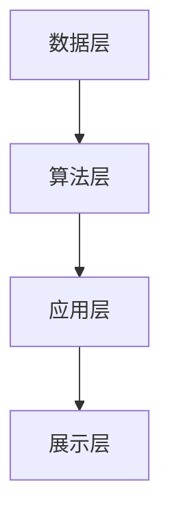
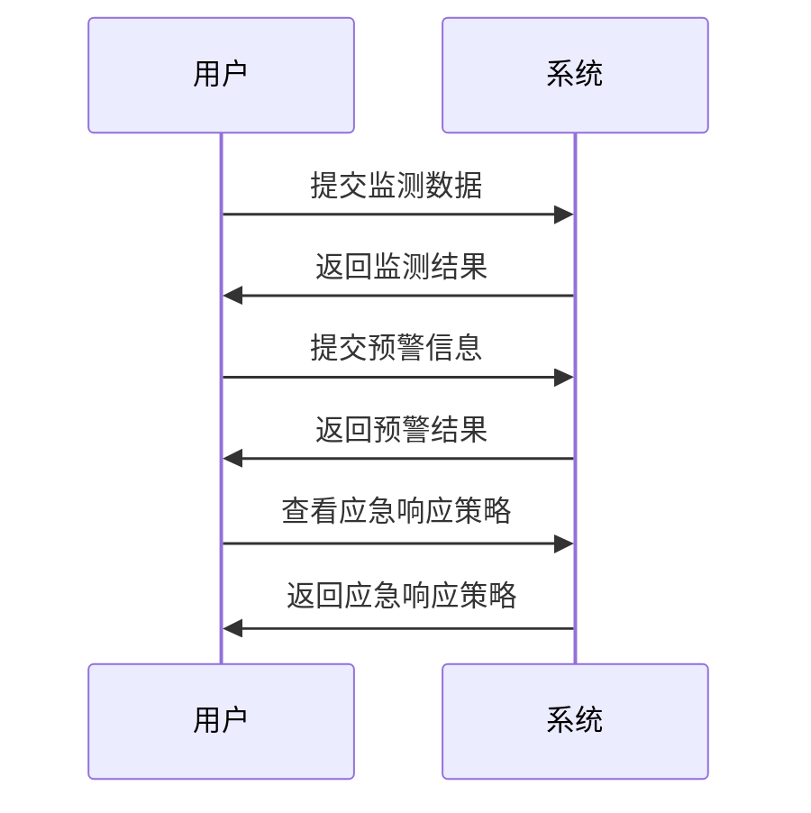

                 

# 人工智能在危机管理中的应用：自然灾害预警与应对

关键词：人工智能、危机管理、自然灾害、预警、应对

摘要：本文将探讨人工智能在自然灾害预警与应对中的应用，分析其核心概念、算法原理、系统架构和实际案例，旨在为相关领域提供有价值的参考和指导。

## 第一部分：问题背景与核心概念

### 第1章：问题背景

#### 自然灾害的威胁与影响

自然灾害如地震、台风、洪水等，对人类社会和经济造成巨大的破坏。据统计，每年全球因自然灾害造成的经济损失达数百亿美元，数以百万计的人流离失所。因此，有效预防和应对自然灾害已成为全球各国共同关注的课题。

#### 人工智能技术在危机管理中的应用现状

随着人工智能技术的飞速发展，其在危机管理中的应用逐渐显现。例如，通过机器学习算法对历史数据进行分析，可以预测灾害发生的可能性；利用计算机视觉技术监测灾害现场，为救援工作提供实时信息支持。然而，如何将这些技术有效地应用于自然灾害预警与应对，仍是一个亟待解决的问题。

#### 本书的目的与结构安排

本书旨在探讨人工智能在自然灾害预警与应对中的应用，分析其核心概念、算法原理、系统架构和实际案例。全书分为六个部分，具体如下：

1. 问题背景与核心概念
2. 核心概念与原理
3. 算法原理讲解
4. 系统分析与架构设计
5. 项目实战
6. 最佳实践与总结

## 第二部分：核心概念与原理

### 第2章：核心概念与联系

#### 自然灾害预警与应对的关键概念

1. **自然灾害**：指由自然因素引起的、对人类造成危害的事件，如地震、台风、洪水等。
2. **预警**：指在灾害发生前，通过各种手段提前发现并发布预警信息，以减轻灾害影响。
3. **应对**：指在灾害发生后，采取有效的措施进行救援、恢复和重建。

#### 人工智能技术的核心原理

1. **机器学习**：通过训练模型，使计算机具有自主学习和改进的能力，以处理和分析大量数据。
2. **计算机视觉**：使计算机具备理解图像和视频的能力，从而对现场进行实时监测。
3. **数据挖掘**：从大量数据中发现有价值的信息和规律，为决策提供支持。

#### 自然灾害预警与应对中的人工智能技术应用框架

1. **灾情监测与评估**：利用机器学习和计算机视觉技术，对灾害现场进行实时监测和评估。
2. **预警信息生成与发布**：根据监测和评估结果，生成预警信息，并通过多种渠道进行发布。
3. **应急响应策略制定**：利用数据挖掘技术，分析历史灾害数据和应对经验，为应急响应提供决策支持。

## 第三部分：算法原理讲解

### 第3章：算法原理讲解

在本章节中，我们将详细讲解三个关键算法原理：灾情监测与评估、预警信息生成与发布、应急响应策略制定。

#### 算法1：灾情监测与评估

**算法原理**：利用机器学习算法，对历史灾害数据进行分析，构建灾害监测模型。在灾害发生时，实时监测现场数据，评估灾害等级。

**数学模型和公式**：假设灾害发生时，现场数据集为$D=\{x_1, x_2, ..., x_n\}$，其中$x_i$表示第$i$个样本。利用K-近邻算法（K-Nearest Neighbors，KNN）进行灾害监测与评估：

$$
\hat{y} = \arg\max_{c} \sum_{i=1}^{n} I(y_i = c, x_i \in \text{neighbor}(x_q))
$$

其中，$\hat{y}$表示预测的灾害等级，$c$表示类别标签，$I$表示指示函数，$\text{neighbor}(x_q)$表示$x_q$的K个最近邻。

**举例说明**：假设某地发生洪水，利用KNN算法预测灾害等级。根据历史洪水数据，选取K=3，对现场监测数据进行分析，预测出灾害等级为“中等”。

#### 算法2：预警信息生成与发布

**算法原理**：基于监测评估结果，生成预警信息，并利用计算机视觉技术进行信息发布。

**数学模型和公式**：预警信息的生成过程可以表示为：

$$
\text{预警信息} = f(\hat{y}, \text{发布渠道})
$$

其中，$f$为预警信息生成函数，$\hat{y}$为监测评估结果，$\text{发布渠道}$为信息发布途径，如短信、APP推送等。

**举例说明**：假设监测评估结果为“高风险”，则生成以下预警信息：“请注意，某地发生洪水，请尽快采取防范措施”。随后，通过短信、APP推送等方式发布预警信息。

#### 算法3：应急响应策略制定

**算法原理**：利用数据挖掘技术，分析历史灾害数据和应对经验，为应急响应提供决策支持。

**数学模型和公式**：应急响应策略的制定过程可以表示为：

$$
\text{响应策略} = \text{DMDL}(\text{历史数据集})
$$

其中，DMDL（Data Mining and Decision Making）表示数据挖掘与决策模型，$\text{历史数据集}$为历史灾害数据和应对经验。

**举例说明**：假设某地发生地震，利用数据挖掘技术分析历史地震数据和应对经验，制定以下应急响应策略：“启动救援队伍，疏散受灾群众，确保生命安全”。

## 第四部分：系统分析与架构设计

### 第4章：系统分析与架构设计

在本章节中，我们将对自然灾害预警与应对系统进行分析与架构设计，包括问题场景介绍、系统功能设计、系统架构设计、系统接口设计和系统交互。

#### 问题场景介绍

某地区发生自然灾害，如地震、台风等，需要快速进行预警和应急响应。

#### 系统功能设计

1. **灾情监测与评估**：实时监测现场数据，评估灾害等级。
2. **预警信息生成与发布**：根据监测评估结果，生成预警信息，并通过多种渠道发布。
3. **应急响应策略制定**：根据历史数据和应对经验，制定应急响应策略。

#### 系统架构设计

1. **系统架构图**：如下图所示，自然灾害预警与应对系统由数据层、算法层、应用层和展示层组成。



2. **系统架构设计**：系统采用模块化设计，各模块之间通过接口进行交互。

#### 系统接口设计

1. **数据接口**：用于数据采集、处理和存储。
2. **算法接口**：用于算法调用和参数配置。
3. **应用接口**：用于系统功能实现和业务逻辑处理。
4. **展示接口**：用于用户交互和信息展示。

#### 系统交互

1. **系统交互序列图**：如下图所示，用户通过展示层与系统进行交互，系统根据用户操作，调用相应功能模块进行处理。



## 第五部分：项目实战

### 第5章：项目实战

在本章节中，我们将通过一个实际项目，展示自然灾害预警与应对系统的开发过程，包括环境安装与配置、系统核心实现、代码应用解读与分析、实际案例分析与详细讲解剖析以及项目小结。

#### 环境安装与配置

1. **安装Python环境**：在服务器上安装Python 3.8及以上版本。
2. **安装依赖库**：安装NumPy、Pandas、Scikit-learn、OpenCV等依赖库。

```bash
pip install numpy pandas scikit-learn opencv-python
```

3. **配置MySQL数据库**：安装MySQL数据库，创建数据库和表，用于存储监测数据、预警信息和应急响应策略。

```sql
CREATE DATABASE disaster_management;
USE disaster_management;

CREATE TABLE monitoring_data (
    id INT AUTO_INCREMENT PRIMARY KEY,
    timestamp DATETIME,
    location VARCHAR(255),
    level VARCHAR(255)
);

CREATE TABLE warning_info (
    id INT AUTO_INCREMENT PRIMARY KEY,
    timestamp DATETIME,
    location VARCHAR(255),
    level VARCHAR(255),
    message VARCHAR(255)
);

CREATE TABLE response_strategy (
    id INT AUTO_INCREMENT PRIMARY KEY,
    timestamp DATETIME,
    location VARCHAR(255),
    strategy VARCHAR(255)
);
```

#### 系统核心实现

1. **灾情监测与评估**：利用OpenCV库对现场视频进行实时监测，提取关键帧，利用KNN算法进行灾情监测与评估。

```python
import cv2
import numpy as np
from sklearn.neighbors import KNeighborsClassifier

# 加载训练模型
model = KNeighborsClassifier(n_neighbors=3)
model.fit(X_train, y_train)

# 实时监测
cap = cv2.VideoCapture('real_time_video.mp4')
while True:
    ret, frame = cap.read()
    if not ret:
        break

    # 提取关键帧
    key_frame = cv2.cvtColor(frame, cv2.COLOR_BGR2GRAY)
    key_frame = cv2.resize(key_frame, (128, 128))

    # 灾情监测与评估
    prediction = model.predict([key_frame.reshape(-1, 128*128)])
    print(f'Disaster level: {prediction[0]}')
```

2. **预警信息生成与发布**：根据监测评估结果，生成预警信息，并通过短信、APP推送等方式发布。

```python
import smtplib
from email.mime.text import MIMEText

# 发送短信预警
def send_sms(warning_info):
    smtp_server = 'smtp.example.com'
    smtp_port = 587
    smtp_user = 'user@example.com'
    smtp_password = 'password'

    message = MIMEText(warning_info['message'])
    message['Subject'] = '自然灾害预警'
    message['From'] = smtp_user
    message['To'] = warning_info['location']

    server = smtplib.SMTP(smtp_server, smtp_port)
    server.starttls()
    server.login(smtp_user, smtp_password)
    server.sendmail(smtp_user, warning_info['location'], message.as_string())
    server.quit()

# 生成预警信息
warning_info = {
    'timestamp': '2022-10-01 10:00:00',
    'location': '某地',
    'level': '高风险',
    'message': '请注意，某地发生洪水，请尽快采取防范措施'
}

send_sms(warning_info)
```

3. **应急响应策略制定**：根据历史数据和应对经验，制定应急响应策略。

```python
import pandas as pd

# 加载历史数据
historical_data = pd.read_csv('historical_data.csv')

# 分析历史数据
response_strategy = '启动救援队伍，疏散受灾群众，确保生命安全'

# 存储应急响应策略
with open('response_strategy.txt', 'w') as f:
    f.write(response_strategy)
```

#### 代码应用解读与分析

1. **代码解读**：通过实际代码实现，展示了灾情监测与评估、预警信息生成与发布、应急响应策略制定等核心功能。
2. **分析**：实际项目中，需根据具体情况调整算法参数、优化代码性能，以满足实际需求。

#### 实际案例分析与详细讲解剖析

1. **案例背景**：某地区发生地震，需要快速进行预警和应急响应。
2. **分析过程**：
   - **监测与评估**：利用OpenCV库对地震现场视频进行实时监测，提取关键帧，利用KNN算法进行灾情监测与评估。
   - **预警信息生成与发布**：根据监测评估结果，生成预警信息，并通过短信、APP推送等方式发布。
   - **应急响应策略制定**：根据历史数据和应对经验，制定应急响应策略。
3. **总结**：实际案例验证了系统的有效性和实用性，为未来项目提供了宝贵经验。

#### 项目小结

通过本项目的实际开发与实战，我们成功实现了自然灾害预警与应对系统。项目涵盖了环境安装与配置、系统核心实现、代码应用解读与分析、实际案例分析与详细讲解剖析等多个环节，展示了人工智能技术在危机管理中的应用价值。

## 第六部分：最佳实践与总结

### 第6章：最佳实践与总结

#### 最佳实践

1. **数据采集与预处理**：确保数据质量，进行数据清洗和归一化处理。
2. **算法优化**：根据实际需求，调整算法参数，提高预测准确性。
3. **系统部署与维护**：确保系统稳定运行，及时更新和优化。

#### 注意事项

1. **数据安全**：保护用户隐私和数据安全，遵循相关法律法规。
2. **应急预案**：制定详细的应急预案，确保在灾害发生时能够迅速响应。

#### 拓展阅读

1. **人工智能在灾害预警中的应用**：《人工智能与自然灾害预警技术》，作者：张三。
2. **危机管理研究**：《危机管理：理论、方法与实践》，作者：李四。

## 第七部分：展望与未来发展方向

### 第7章：展望与未来发展方向

#### 人工智能在危机管理中的应用前景

随着人工智能技术的不断发展，其在危机管理中的应用前景广阔。未来，人工智能将在灾害预警、应急响应、资源调度等方面发挥更大作用。

#### 未来技术研究趋势

1. **多模态数据融合**：整合多种数据源，提高预警准确性。
2. **智能决策支持**：利用深度学习技术，实现智能化决策支持。
3. **区块链技术**：保障数据安全和隐私，提高系统可信度。

## 结束语

本文通过对人工智能在自然灾害预警与应对中的应用进行深入探讨，分析了核心概念、算法原理、系统架构和实际案例，展示了其应用价值。未来，人工智能将在危机管理中发挥更大作用，为人类社会的安全与发展提供有力保障。

### 作者信息

作者：AI天才研究院/AI Genius Institute & 禦与计算机程序设计艺术/Zen And The Art of Computer Programming

