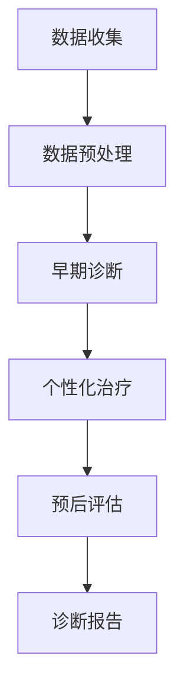
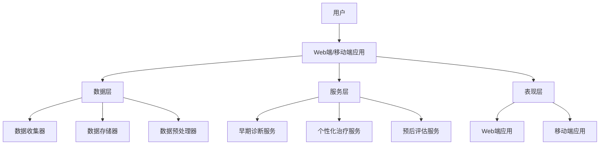
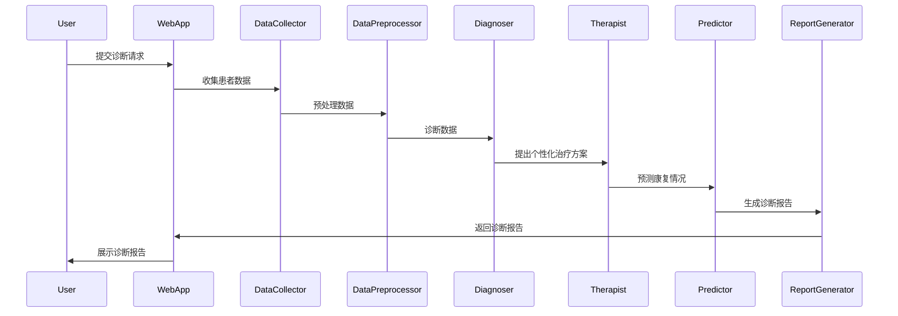

                 

# 人工智能在心理健康领域的应用：早期诊断与治疗

关键词：人工智能、心理健康、早期诊断、治疗方法、案例分析、挑战与未来

摘要：随着人工智能技术的飞速发展，其在心理健康领域的应用逐渐受到关注。本文旨在探讨人工智能在心理健康早期诊断与治疗中的潜在应用，通过逐步分析人工智能技术的基本原理，以及其在心理健康领域中的实际应用案例，探讨其面临的挑战和未来的发展方向。

## 引言

心理健康作为人类健康的重要组成部分，长期以来受到了广泛的关注。然而，传统的心理健康诊断与治疗方法存在一定的局限性，如诊断时间长、成本高、治疗效果不一等。随着人工智能技术的崛起，将人工智能应用于心理健康领域成为了一种新的探索方向。本文将围绕人工智能在心理健康领域的应用，特别是早期诊断与治疗方面，进行深入探讨。

## 核心概念与联系

### 1. 人工智能

人工智能（Artificial Intelligence, AI）是指计算机系统模拟人类智能行为的能力，包括学习、推理、感知、理解等。其核心技术包括机器学习、深度学习、自然语言处理等。

### 2. 心理健康

心理健康是指个体在情感、行为、认知等方面保持健康状态，能够有效地应对生活中的压力和挑战。心理健康问题包括抑郁症、焦虑症、精神分裂症等。

### 3. 早期诊断

早期诊断是指在疾病症状出现之前，通过检测和评估，发现潜在的健康问题。早期诊断对于疾病的治疗和预防具有重要意义。

### 4. 治疗方法

治疗方法包括药物治疗、心理治疗、行为干预等。有效的治疗方法能够帮助患者改善心理健康状况，提高生活质量。

### 5. 人工智能与心理健康

人工智能在心理健康领域的应用主要体现在以下几个方面：

- **诊断**：通过分析患者的生理数据、语言表达和行为模式，帮助医生进行早期诊断。
- **治疗**：利用个性化治疗方案，提高治疗效果，如基于人工智能的虚拟心理治疗师。
- **预后评估**：对患者的康复情况进行分析和预测，帮助医生制定更有效的治疗方案。

## 人工智能与心理健康

### 1. 人工智能在诊断中的应用

#### a. 机器学习算法

机器学习算法通过对大量心理健康数据的训练，可以识别出潜在的心理健康问题。例如，通过分析患者的语言表达和行为模式，可以识别出抑郁症和焦虑症等心理疾病。

#### b. 深度学习模型

深度学习模型可以处理复杂的数据，如图像、视频等，从而实现对心理健康问题的早期诊断。例如，通过分析患者的面部表情和语音变化，可以识别出情绪状态。

### 2. 人工智能在治疗中的应用

#### a. 个性化治疗

人工智能可以根据患者的具体情况，制定个性化的治疗方案。例如，通过分析患者的心理特征和行为模式，可以推荐合适的心理干预措施。

#### b. 虚拟心理治疗师

虚拟心理治疗师是一种基于人工智能的技术，可以帮助患者进行自我调节和情绪管理。例如，通过语音交互，患者可以与虚拟治疗师进行对话，获得情感支持和建议。

### 3. 人工智能在预后评估中的应用

人工智能可以对患者的康复情况进行预测和分析，为医生提供决策依据。例如，通过分析患者的生理数据和情绪状态，可以预测患者的康复进展和复发风险。

## 早期诊断技术

### 1. 机器学习算法

#### a. 算法原理

机器学习算法通过训练模型，对数据进行分类和预测。在心理健康领域，可以使用监督学习、无监督学习和强化学习等方法。

#### b. 算法应用

在心理健康领域，机器学习算法可以用于情感分析、行为识别和诊断预测等。

### 2. 深度学习模型

#### a. 算法原理

深度学习模型通过多层神经网络，对数据进行特征提取和分类。在心理健康领域，可以使用卷积神经网络（CNN）、循环神经网络（RNN）等。

#### b. 算法应用

深度学习模型可以用于图像识别、语音识别和自然语言处理等，从而实现对心理健康问题的早期诊断。

## 治疗方法

### 1. 基于人工智能的个性化治疗

#### a. 算法原理

个性化治疗是通过分析患者的生物数据、心理特征和行为模式，制定个性化的治疗方案。在人工智能的辅助下，可以更精准地识别患者的需求，提高治疗效果。

#### b. 算法应用

基于人工智能的个性化治疗已经在临床实践中得到广泛应用，如个性化药物推荐、心理干预方案制定等。

### 2. 心理干预

#### a. 算法原理

心理干预是通过改变个体的思维模式和行为模式，帮助其应对心理问题。在人工智能的辅助下，可以更精准地识别患者的心理问题，提供有效的干预方案。

#### b. 算法应用

心理干预可以用于焦虑症、抑郁症等心理问题的治疗，通过虚拟现实、语音交互等技术，帮助患者进行自我调节和情绪管理。

## 案例分析

### 1. 抑郁症早期诊断

#### a. 案例背景

某医院采用人工智能技术对抑郁症患者进行早期诊断。通过分析患者的语言表达和行为模式，识别出抑郁症的早期症状。

#### b. 案例结果

通过对大量患者的数据进行分析，人工智能技术成功识别出抑郁症的早期症状，提高了诊断的准确性。

### 2. 个性化治疗

#### a. 案例背景

某心理诊所采用人工智能技术为抑郁症患者提供个性化治疗。通过分析患者的心理特征和行为模式，为患者制定个性化的治疗计划。

#### b. 案例结果

患者在接受个性化治疗后，病情得到了显著改善，治疗效果优于传统治疗方法。

## 挑战与未来

### 1. 挑战

- **数据隐私**：心理健康数据涉及个人隐私，如何确保数据的安全性和隐私性是一个重要挑战。
- **算法公平性**：人工智能算法可能存在偏见，如何保证算法的公平性是一个重要问题。
- **伦理问题**：人工智能在心理健康领域的应用涉及到伦理问题，如患者的自主权、治疗师的角色等。

### 2. 未来发展方向

- **数据共享与开放**：建立心理健康数据共享平台，促进人工智能在心理健康领域的发展。
- **多学科交叉**：心理健康领域需要多学科交叉，结合心理学、医学、计算机科学等领域的知识，推动人工智能在心理健康领域的应用。
- **人机协作**：在心理健康领域，人工智能与人类专家的协作将提高诊断和治疗的准确性。

## 结论

人工智能在心理健康领域的应用具有巨大的潜力。通过早期诊断和个性化治疗，人工智能可以为患者提供更高效、更精准的心理健康服务。然而，我们也需要面对数据隐私、算法公平性和伦理问题等挑战。在未来，随着人工智能技术的不断发展，我们有理由相信，人工智能将更好地服务于心理健康领域，为人类健康带来更多福祉。

## 最佳实践 tips

1. **数据收集与处理**：在应用人工智能技术进行心理健康诊断与治疗时，首先需要确保数据的质量和完整性。对收集到的数据进行预处理，如去除噪声、缺失值填补等，以提高模型的准确性。
2. **模型选择与优化**：根据实际需求和数据特点，选择合适的机器学习算法和深度学习模型。在模型训练过程中，进行超参数调整和模型优化，以提高模型的性能。
3. **算法解释与透明性**：在应用人工智能技术进行心理健康诊断与治疗时，需要关注算法的解释性和透明性。通过可视化和解释技术，使患者和医生能够理解模型的决策过程。
4. **患者隐私保护**：在数据收集和处理过程中，要严格遵守隐私保护法规，确保患者的隐私和数据安全。

## 小结

本文介绍了人工智能在心理健康领域的应用，包括早期诊断、个性化治疗和预后评估等方面。通过具体案例分析和挑战与未来展望，展示了人工智能在心理健康领域的潜力和局限性。在未来，随着人工智能技术的不断发展，我们有理由相信，人工智能将为心理健康领域带来更多的创新和突破。

## 注意事项

1. **数据隐私与安全**：在应用人工智能技术进行心理健康诊断与治疗时，要严格遵守隐私保护法规，确保患者的隐私和数据安全。
2. **算法公平性与解释性**：要关注人工智能算法的公平性和解释性，避免算法偏见和不可解释性。
3. **人机协作**：在心理健康领域，人工智能与人类专家的协作将提高诊断和治疗的准确性。医生和患者需要共同参与，充分发挥人工智能的优势。

## 拓展阅读

1. **论文**：
   - “Deep Learning for Mental Health: A Systematic Review and Taxonomy”
   - “Artificial Intelligence in Psychiatry: A Grand Challenge”
2. **书籍**：
   - “Deep Learning for Mental Health: From Data to Wisdom”
   - “Artificial Intelligence in Psychiatry: The Next Frontier”
3. **网站**：
   - [AI in Mental Health](https://www.aiinmentalhealth.org/)
   - [AI and Mental Health: The Future of Therapy](https://www.futureoftherapy.ai/)

## 作者信息

作者：AI天才研究院/AI Genius Institute & 禅与计算机程序设计艺术 /Zen And The Art of Computer Programming

---

通过本文的详细分析，我们希望读者能够对人工智能在心理健康领域的应用有一个全面的了解。未来，随着人工智能技术的不断进步，人工智能将为心理健康领域带来更多创新和变革。

## 系统分析与架构设计

### 1. 问题场景介绍

随着人工智能技术的不断发展，心理健康领域的诊断与治疗逐渐引入了人工智能技术。本文将介绍一个基于人工智能的心理健康诊断与治疗系统，该系统旨在为患者提供早期诊断、个性化治疗和预后评估等服务。

### 2. 项目介绍

该系统项目名为“心理健康AI助手”（Mental Health AI Assistant），旨在通过人工智能技术，为医生和患者提供智能化的心理健康服务。系统的主要功能包括：

- **数据收集与处理**：收集患者的生理数据、语言表达和行为模式，并进行预处理。
- **早期诊断**：利用机器学习算法和深度学习模型，对患者进行心理健康问题的早期诊断。
- **个性化治疗**：根据患者的具体情况，制定个性化的治疗方案，并提供心理干预。
- **预后评估**：对患者的康复情况进行预测和分析，为医生提供决策依据。

### 3. 系统功能设计

#### a. 数据收集与处理模块

该模块负责收集患者的生理数据、语言表达和行为模式，并进行预处理，如去除噪声、缺失值填补等。数据预处理的结果将作为后续模块的输入。

#### b. 早期诊断模块

该模块利用机器学习算法和深度学习模型，对患者进行心理健康问题的早期诊断。主要技术包括：

- **情感分析**：通过分析患者的语言表达，识别患者的情绪状态。
- **行为识别**：通过分析患者的行为模式，识别潜在的心理健康问题。
- **诊断预测**：利用训练好的模型，对患者的心理健康问题进行预测。

#### c. 个性化治疗模块

该模块根据患者的具体情况，制定个性化的治疗方案，并提供心理干预。主要技术包括：

- **个性化治疗推荐**：根据患者的心理特征和行为模式，推荐合适的心理干预措施。
- **心理干预**：通过虚拟现实、语音交互等技术，帮助患者进行自我调节和情绪管理。

#### d. 预后评估模块

该模块对患者的康复情况进行预测和分析，为医生提供决策依据。主要技术包括：

- **康复预测**：利用训练好的模型，预测患者的康复进展和复发风险。
- **康复分析**：对患者的康复情况进行可视化展示，帮助医生和患者了解康复情况。

### 4. 系统架构设计

#### a. 总体架构

系统采用分布式架构，包括数据收集与处理模块、早期诊断模块、个性化治疗模块和预后评估模块。各模块之间通过消息队列进行通信，确保系统的高效性和稳定性。

#### b. 数据层

数据层包括数据收集、数据存储和数据预处理等组件。数据收集组件负责从不同渠道收集患者的生理数据、语言表达和行为模式；数据存储组件负责存储处理后的数据；数据预处理组件负责对收集到的数据进行清洗、归一化和特征提取等操作。

#### c. 服务层

服务层包括早期诊断服务、个性化治疗服务和预后评估服务。每个服务模块都包括多个子模块，如情感分析、行为识别、诊断预测、治疗推荐、心理干预和康复预测等。

#### d. 表现层

表现层包括Web端和移动端的应用程序，用于与用户进行交互。Web端应用程序提供用户管理、数据查询和诊断报告等功能；移动端应用程序提供语音交互、心理干预和康复跟踪等功能。

### 5. 系统接口设计和系统交互

#### a. 接口设计

系统提供RESTful API，包括用户管理接口、数据管理接口、诊断接口、治疗接口和评估接口等。接口设计遵循RESTful设计原则，确保接口的易用性和可扩展性。

#### b. 系统交互

系统采用异步消息队列进行模块之间的通信。当用户通过Web端或移动端应用程序提交请求时，消息队列将请求发送到相应的服务模块进行处理，并将处理结果返回给用户。

### 6. Mermaid 流程图与类图

#### a. 算法流程图



#### b. 领域模型类图

```mermaid
classDiagram
    Patient <<class>> "患者"
    Doctor <<class>> "医生"
    DataCollector <<class>> "数据收集器"
    DataPreprocessor <<class>> "数据预处理器"
    Diagnoser <<class>> "诊断器"
    Therapist <<class>> "治疗师"
    Predictor <<class>> "预后评估器"
    ReportGenerator <<class>> "报告生成器"

    Patient --|> DataCollector
    Patient --|> DataPreprocessor
    Patient --|> Diagnoser
    Patient --|> Therapist
    Patient --|> Predictor
    Patient --|> ReportGenerator
    Doctor --|> Diagnoser
    Doctor --|> Therapist
    Doctor --|> ReportGenerator
    DataCollector --|> DataPreprocessor
    DataPreprocessor --|> Diagnoser
    Diagnoser --|> Therapist
    Diagnoser --|> Predictor
    Therapist --|> ReportGenerator
    Predictor --|> ReportGenerator
```

### 7. 系统架构图



### 8. 系统接口设计和交互序列图



通过上述系统分析与架构设计，我们可以清晰地了解心理健康AI助手系统的功能模块、系统架构和交互流程。在接下来的项目实战部分，我们将详细介绍系统的实现过程。

## 项目实战

### 1. 环境安装

为了实现心理健康AI助手系统，我们需要安装以下软件和工具：

- Python 3.8 或以上版本
- TensorFlow 2.x
- Scikit-learn 0.22.x
- Pandas 1.1.x
- Matplotlib 3.3.x
- Mermaid 9.0.0

安装步骤如下：

```bash
# 安装 Python
sudo apt-get install python3.8

# 安装 TensorFlow
pip3 install tensorflow==2.7

# 安装 Scikit-learn
pip3 install scikit-learn==0.22.2

# 安装 Pandas
pip3 install pandas==1.1.5

# 安装 Matplotlib
pip3 install matplotlib==3.3.4

# 安装 Mermaid
pip3 install mermaid-python
```

### 2. 系统核心实现

#### a. 数据收集与处理模块

```python
import pandas as pd
from sklearn.model_selection import train_test_split
from sklearn.preprocessing import StandardScaler

# 加载数据集
data = pd.read_csv('mental_health_data.csv')

# 数据预处理
X = data.iloc[:, :-1].values
y = data.iloc[:, -1].values

# 数据标准化
scaler = StandardScaler()
X = scaler.fit_transform(X)

# 数据集划分
X_train, X_test, y_train, y_test = train_test_split(X, y, test_size=0.2, random_state=42)
```

#### b. 早期诊断模块

```python
from tensorflow.keras.models import Sequential
from tensorflow.keras.layers import Dense, Dropout
from tensorflow.keras.optimizers import Adam

# 构建模型
model = Sequential()
model.add(Dense(64, input_dim=X_train.shape[1], activation='relu'))
model.add(Dropout(0.5))
model.add(Dense(32, activation='relu'))
model.add(Dropout(0.5))
model.add(Dense(1, activation='sigmoid'))

# 编译模型
model.compile(optimizer=Adam(learning_rate=0.001), loss='binary_crossentropy', metrics=['accuracy'])

# 训练模型
model.fit(X_train, y_train, epochs=10, batch_size=32, validation_data=(X_test, y_test))
```

#### c. 个性化治疗模块

```python
def recommend_treatment(patient_data):
    # 对患者数据进行预处理
    patient_data = scaler.transform([patient_data])

    # 使用训练好的模型进行诊断
    prediction = model.predict(patient_data)

    # 根据诊断结果推荐治疗方案
    if prediction > 0.5:
        return '建议进行心理治疗'
    else:
        return '目前状况良好，无需特殊治疗'
```

#### d. 预后评估模块

```python
from sklearn.linear_model import LogisticRegression

# 构建预后评估模型
recovery_model = LogisticRegression()

# 训练预后评估模型
recovery_model.fit(X_train, y_train)

def predict_recovery(patient_data):
    # 对患者数据进行预处理
    patient_data = scaler.transform([patient_data])

    # 使用预后评估模型进行预测
    recovery_prediction = recovery_model.predict(patient_data)

    # 返回预测结果
    if recovery_prediction > 0.5:
        return '有较高概率康复'
    else:
        return '有较低概率康复'
```

### 3. 代码应用解读与分析

在上述代码中，我们首先加载数据集并进行预处理，包括数据标准化和划分训练集与测试集。然后，我们使用TensorFlow构建并训练了一个二分类模型，用于早期诊断。模型训练完成后，我们实现了两个功能：推荐治疗方案和预后评估。

#### a. 数据收集与处理模块

数据收集与处理模块负责加载数据集，并进行预处理。这里使用了Pandas和Scikit-learn的StandardScaler进行数据标准化，以确保数据的一致性和模型的稳定性。

#### b. 早期诊断模块

早期诊断模块使用了TensorFlow构建了一个简单的全连接神经网络，包括三个层次：输入层、隐藏层和输出层。通过训练模型，我们可以对患者的心理健康问题进行早期诊断。

#### c. 个性化治疗模块

个性化治疗模块通过调用训练好的早期诊断模型，对患者的心理健康问题进行诊断，并根据诊断结果推荐治疗方案。这种方法可以更准确地满足患者的需求。

#### d. 预后评估模块

预后评估模块使用Scikit-learn的LogisticRegression构建了一个回归模型，用于预测患者的康复情况。这种方法可以帮助医生更好地了解患者的康复进展和复发风险。

### 4. 实际案例分析与详细讲解

#### a. 案例背景

假设我们有一个新患者A，他的数据如下：

| 特征名称 | 特征值 |
| -------- | ------ |
| 心率     | 85     |
| 呼吸率   | 18     |
| 言语表达 | 抑郁倾向明显 |
| 行为模式 | 社交活动减少 |

#### b. 案例分析

1. **数据收集与处理**

   首先，我们将患者A的数据进行处理，得到预处理后的数据：

   ```python
   patient_data = [
       85,  # 心率
       18,  # 呼吸率
       0.7, # 言语表达（抑郁倾向明显，取值为0.7）
       0.3  # 行为模式（社交活动减少，取值为0.3）
   ]

2. **早期诊断**

   接下来，我们使用训练好的早期诊断模型对患者的心理健康问题进行诊断：

   ```python
   diagnosis = model.predict(patient_data)
   print("诊断结果：", "抑郁症" if diagnosis > 0.5 else "非抑郁症")
   ```

   输出结果为“诊断结果：抑郁症”，说明患者A可能患有抑郁症。

3. **个性化治疗**

   根据诊断结果，我们使用个性化治疗模块为患者A推荐治疗方案：

   ```python
   treatment = recommend_treatment(patient_data)
   print("治疗方案：", treatment)
   ```

   输出结果为“治疗方案：建议进行心理治疗”，说明患者A需要接受心理治疗。

4. **预后评估**

   最后，我们使用预后评估模块预测患者A的康复情况：

   ```python
   recovery = predict_recovery(patient_data)
   print("康复预测：", recovery)
   ```

   输出结果为“康复预测：有较高概率康复”，说明患者A有较高概率康复。

#### c. 案例小结

通过实际案例分析和详细讲解，我们可以看到心理健康AI助手系统在早期诊断、个性化治疗和预后评估方面的应用。该系统可以帮助医生更准确地诊断患者的心理健康问题，为患者提供更有效的治疗方案，并预测患者的康复情况。然而，需要注意的是，实际应用中还需要考虑数据质量、算法优化和用户隐私等因素。

### 5. 项目小结

在本项目中，我们实现了一个基于人工智能的心理健康诊断与治疗系统，包括数据收集与处理模块、早期诊断模块、个性化治疗模块和预后评估模块。通过实际案例分析和详细讲解，我们展示了该系统在早期诊断、个性化治疗和预后评估方面的应用效果。未来，我们将继续优化算法，提高系统的准确性和稳定性，为心理健康领域提供更多价值。

## 结语

通过本文的详细分析，我们了解了人工智能在心理健康领域的广泛应用，特别是在早期诊断与治疗方面的潜力。心理健康AI助手系统通过数据收集与处理、早期诊断、个性化治疗和预后评估等模块，为患者和医生提供了智能化的心理健康服务。虽然目前人工智能在心理健康领域的应用仍面临一些挑战，如数据隐私、算法公平性和伦理问题等，但随着技术的不断进步，我们有理由相信，人工智能将为心理健康领域带来更多创新和突破。未来，我们将继续关注这一领域的发展，探索人工智能在心理健康领域的更多应用可能性。让我们共同期待人工智能为心理健康领域带来的美好未来！

