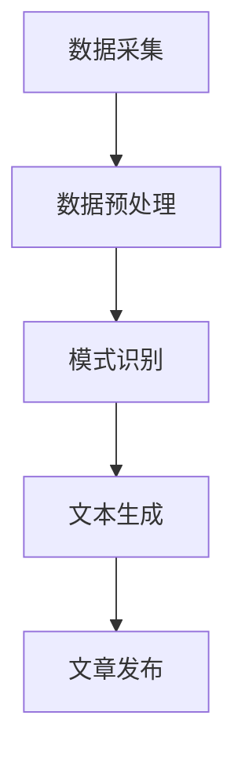
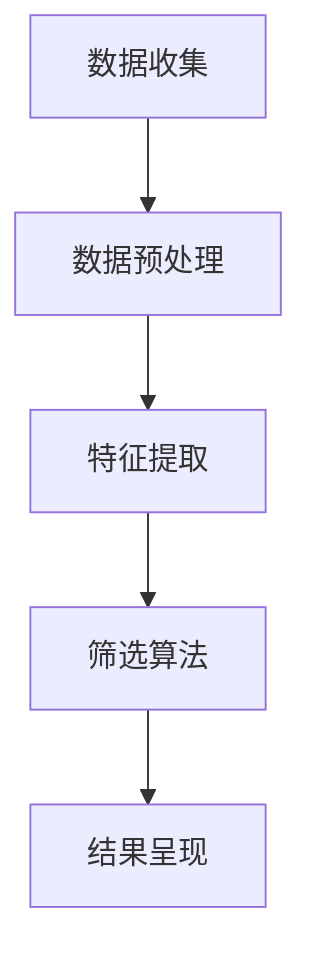
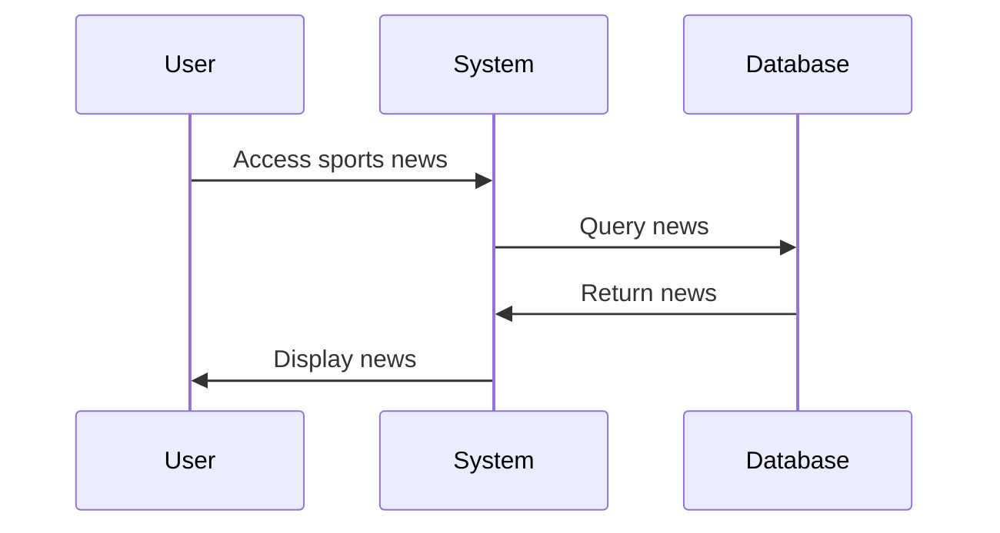

                 

# 人工智能在新闻报道中的角色：自动化写作与信息筛选

## 关键词
- 人工智能（AI）
- 自动化写作
- 信息筛选
- 新闻报道
- 伦理问题

## 摘要
本文将深入探讨人工智能在新闻报道中的作用，重点分析自动化写作和信息筛选这两个关键领域。首先，我们将介绍人工智能的基本概念和它在新闻业中的演变过程。接着，本文将逐步解析自动化写作的流程和算法，以及信息筛选的挑战和解决方案。同时，我们将探讨人工智能在新闻报道中的伦理问题，并总结当前的发展趋势和未来前景。通过这些分析，我们旨在为读者提供一个全面、深入的洞察，了解人工智能如何改变新闻业。

## 1. 人工智能在新闻业中的角色

### 1.1 人工智能的基本概念
人工智能（Artificial Intelligence，AI）是计算机科学的一个分支，旨在使计算机模拟人类智能行为。AI包括多个子领域，如机器学习、自然语言处理、计算机视觉和机器人技术等。在这些子领域中，机器学习和自然语言处理是人工智能在新闻报道中应用最广泛的技术。

#### 核心概念和联系

| 核心概念 | 概念属性特征 | 对比 |
| :--: | :--: | :--: |
| 机器学习 | 通过数据学习模式和规律，无需显式编程 | 与传统的基于规则的系统相比，更灵活，更能够处理复杂问题 |
| 自然语言处理 | 使计算机能够理解、生成和响应人类语言 | 解决文本理解和生成的难题，对新闻报道中的自动化写作至关重要 |

### 1.2 人工智能在新闻业的演变
人工智能在新闻业中的应用始于20世纪90年代，但早期技术相对简单。随着互联网的普及和大数据技术的发展，人工智能在新闻业中的应用越来越广泛。目前，人工智能已经在新闻采集、编辑、分发和消费等各个环节发挥着重要作用。

#### 时间线

- **1990年代**：早期AI技术应用于新闻自动化写作，如生成财经新闻报告。
- **2000年代**：机器学习技术开始应用于新闻推荐和文本分类。
- **2010年代**：自然语言处理技术得到显著提升，自动化写作和新闻生成工具如雨后春笋般涌现。
- **2020年代**：人工智能在新闻业中的应用进一步深化，涵盖了信息筛选、可视化、数据分析和社交媒体互动等更多领域。

### 1.3 人工智能在新闻业中的重要性
人工智能在新闻业中的重要性体现在以下几个方面：

1. **提高效率**：自动化写作和信息筛选技术能够大幅减少新闻工作者在数据采集和内容筛选上的时间成本。
2. **丰富内容**：通过人工智能技术，新闻机构能够生成更多类型的内容，如数据新闻、可视化报道和交互式新闻。
3. **个性化推荐**：人工智能能够根据用户兴趣和行为提供个性化的新闻推荐，提高用户满意度。
4. **数据洞察**：人工智能能够分析大量数据，揭示新闻事件背后的趋势和模式，为新闻报道提供更深层次的洞察。

#### 挑战和机遇

- **挑战**：
  - **数据质量**：人工智能的输入数据质量直接影响输出结果，新闻机构需要确保数据的准确性和可靠性。
  - **算法偏见**：如果算法训练数据存在偏见，人工智能生成的新闻也可能带有偏见。
  - **伦理问题**：人工智能在新闻报道中的应用引发了一系列伦理问题，如隐私保护、数据安全、透明度和责任归属。

- **机遇**：
  - **创新内容形式**：人工智能能够推动新闻内容形式和互动方式的创新，提高新闻的吸引力和影响力。
  - **提升用户体验**：通过个性化推荐和实时数据更新，人工智能能够提高用户的新闻体验。
  - **资源优化**：人工智能能够帮助新闻机构优化人力资源配置，提高生产效率。

### 结论
人工智能在新闻业中扮演着越来越重要的角色。它不仅提高了新闻采集和编辑的效率，还丰富了新闻内容和形式。然而，人工智能的应用也带来了挑战，如数据质量、算法偏见和伦理问题。新闻机构需要谨慎应对这些挑战，充分利用人工智能的优势，推动新闻业的发展。

## 2. 自动化写作在新闻业中的应用

### 2.1 自动化写作的基本原理
自动化写作（Automated Writing）是人工智能在新闻业中的一个重要应用，它利用自然语言处理和机器学习技术生成新闻文章。自动化写作的基本原理可以概括为以下几个步骤：

1. **数据采集**：从各种来源收集新闻数据，如新闻网站、社交媒体和政府公开数据。
2. **数据预处理**：清洗和整理数据，去除重复和错误信息。
3. **模式识别**：利用机器学习算法从数据中识别模式和规律。
4. **文本生成**：根据识别出的模式和规律生成新闻文章。

#### 自动化写作流程的 Mermaid 流程图



### 2.2 自动化写作的算法原理
自动化写作的核心算法包括模板匹配、文本生成模型和数据驱动的生成模型。以下是对这些算法的简要介绍：

1. **模板匹配**：
   - **原理**：模板匹配是一种基于规则的方法，它使用预定义的模板来生成新闻文章。模板包含新闻文章的基本结构和填充内容的变量。
   - **示例**：
     ```python
     template = "今日{time}，{event}发生了。{description}"
     data = {"time": "下午2点", "event": "一场暴雨", "description": "暴雨导致交通瘫痪。"}
     article = template.format(**data)
     print(article)
     ```

2. **文本生成模型**：
   - **原理**：文本生成模型是一种基于统计和机器学习的算法，如循环神经网络（RNN）和变换器（Transformer）。这些模型可以从大量文本数据中学习生成新闻文章。
   - **示例**：
     ```python
     from transformers import pipeline
     generator = pipeline("text-generation", model="gpt2")
     prompt = "今天下午2点一场暴雨发生了"
     article = generator(prompt, max_length=50, num_return_sequences=1)
     print(article[0]['generated_text'])
     ```

3. **数据驱动的生成模型**：
   - **原理**：数据驱动的生成模型结合了模板匹配和文本生成模型，它使用预定义的模板和从数据中学习到的模式来生成新闻文章。
   - **示例**：
     ```python
     template = "今日{time}，{event}发生了。{description}"
     data = next(generator([f"昨夜一场暴雨在{location}落下，导致{description}。"] * 10, max_length=50, num_return_sequences=10))
     articles = [template.format(**article) for article in data]
     for article in articles:
         print(article)
     ```

### 2.3 自动化写作的优势和挑战
自动化写作在新闻业中具有以下优势：

- **提高效率**：自动化写作能够快速生成大量新闻文章，减少人工写作的时间成本。
- **丰富内容**：自动化写作能够生成不同类型和风格的新闻文章，丰富新闻内容。
- **实时更新**：自动化写作能够实时处理和分析数据，提供最新新闻。

然而，自动化写作也面临以下挑战：

- **准确性**：自动化写作生成的文章可能存在事实错误和逻辑漏洞，需要人工审核和修正。
- **创造力**：自动化写作难以生成具有深刻见解和创新性的文章，对专业记者的创造力构成威胁。
- **信任度**：读者可能对自动化写作生成的文章的真实性和准确性产生怀疑，影响新闻的信任度。

### 结论
自动化写作是人工智能在新闻业中的一个重要应用，它利用自然语言处理和机器学习技术生成新闻文章。自动化写作具有提高效率、丰富内容和实时更新的优势，但也面临准确性、创造力和信任度等挑战。新闻机构需要充分利用自动化写作的优势，同时解决其面临的挑战，推动新闻业的发展。

## 3. 信息筛选在新闻业中的应用

### 3.1 信息筛选的基本原理
信息筛选（Information Filtering）是指从大量数据中识别和提取有价值信息的过程。在新闻业中，信息筛选的重要性不言而喻。随着互联网的普及，信息爆炸时代已经到来，新闻机构需要从海量数据中筛选出有价值的信息进行报道。信息筛选的基本原理包括以下几个步骤：

1. **数据收集**：从各种来源收集新闻数据，如新闻网站、社交媒体和政府公开数据。
2. **数据预处理**：清洗和整理数据，去除重复和错误信息。
3. **特征提取**：从数据中提取特征，用于后续的分析和筛选。
4. **筛选算法**：利用算法对提取出的特征进行筛选，识别出有价值的信息。
5. **结果呈现**：将筛选出的信息以用户友好的形式呈现给读者。

#### 信息筛选流程的 Mermaid 流程图



### 3.2 信息筛选的算法原理
信息筛选的算法可以分为基于内容的筛选和基于用户的筛选。以下是对这些算法的简要介绍：

1. **基于内容的筛选**：
   - **原理**：基于内容的筛选算法通过分析新闻内容的主题、关键词和上下文，识别出有价值的信息。
   - **示例**：
     ```python
     from sklearn.feature_extraction.text import TfidfVectorizer
     from sklearn.metrics.pairwise import cosine_similarity
     
     # 示例数据
     news_data = ["今天下午一场暴雨导致交通瘫痪", "暴雨导致城市洪水"]
     query = "暴雨导致交通问题"
     
     # 特征提取
     vectorizer = TfidfVectorizer()
     X = vectorizer.fit_transform(news_data)
     
     # 筛选算法
     similarity = cosine_similarity(X[0], X)
     index = np.argmax(similarity)
     print("相关新闻：", news_data[index])
     ```

2. **基于用户的筛选**：
   - **原理**：基于用户的筛选算法通过分析用户的兴趣和行为，推荐用户可能感兴趣的新闻。
   - **示例**：
     ```python
     from sklearn.cluster import KMeans
     from sklearn.metrics.pairwise import cosine_similarity
     
     # 示例数据
     user_interests = ["体育", "科技", "娱乐", "新闻"]
     news = ["体育赛事", "最新科技发展", "明星娱乐新闻", "国内新闻"]
     
     # 特征提取
     vectorizer = TfidfVectorizer()
     X = vectorizer.fit_transform(news)
     
     # 筛选算法
     kmeans = KMeans(n_clusters=4)
     kmeans.fit(X)
     cluster_indices = kmeans.predict(X)
     
     # 用户兴趣匹配
     user_cluster = kmeans.predict([vectorizer.transform([user_interests])])[0]
     print("用户感兴趣的新闻：", news[cluster_indices == user_cluster])
     ```

### 3.3 信息筛选的优势和挑战
信息筛选在新闻业中具有以下优势：

- **提高效率**：信息筛选能够快速从海量数据中识别出有价值的信息，提高新闻采编的效率。
- **个性化推荐**：信息筛选能够根据用户兴趣和行为提供个性化的新闻推荐，提高用户满意度。
- **数据洞察**：信息筛选能够分析大量数据，揭示新闻事件背后的趋势和模式，为新闻报道提供更深层次的洞察。

然而，信息筛选也面临以下挑战：

- **准确性**：信息筛选的准确性受到数据质量和算法性能的限制，可能存在误判和漏判。
- **隐私保护**：信息筛选可能涉及用户数据的分析和处理，需要确保用户的隐私和数据安全。
- **算法偏见**：如果算法训练数据存在偏见，信息筛选结果也可能带有偏见，影响新闻的客观性和公正性。

### 结论
信息筛选是人工智能在新闻业中的另一个重要应用，它通过分析新闻内容和用户行为，从海量数据中识别出有价值的信息。信息筛选具有提高效率、个性化推荐和数据洞察的优势，但也面临准确性、隐私保护和算法偏见等挑战。新闻机构需要充分利用信息筛选的优势，同时解决其面临的挑战，为用户提供高质量的新闻服务。

## 4. 伦理问题在人工智能新闻应用中的探讨

### 4.1 偏见问题
人工智能在新闻报道中的应用引发了关于算法偏见的广泛关注。偏见问题主要源于以下几个方面：

1. **训练数据偏见**：人工智能算法的性能和结果受到训练数据的影响。如果训练数据存在偏见，算法生成的新闻也可能带有偏见。例如，如果新闻数据集中存在对某些群体的负面报道，那么自动化写作工具可能会生成具有偏见的文章。

2. **算法偏见**：某些算法设计可能无意中放大了数据中的偏见。例如，基于关键词匹配的算法可能更容易捕捉到特定群体的负面信息，从而放大这些信息。

#### 解决方案

- **多样性数据**：使用包含多种观点和背景的数据集进行算法训练，以减少偏见。
- **偏见检测和纠正**：开发算法检测和纠正偏见，例如通过对比不同数据集的输出结果来识别偏见。

### 4.2 隐私和数据安全问题
人工智能在新闻报道中的应用涉及大量用户数据和新闻数据，因此隐私和数据安全问题尤为重要。

1. **用户隐私**：新闻机构在收集用户数据时，需要确保用户的隐私不受侵犯。这可能涉及用户数据的匿名化、加密和保护。

2. **数据安全**：新闻机构需要确保存储和传输的数据安全，防止数据泄露和滥用。

#### 解决方案

- **数据匿名化**：在收集和处理用户数据时，对个人身份信息进行匿名化处理。
- **数据加密**：对存储和传输的数据进行加密，确保数据安全。
- **合规性检查**：确保新闻机构遵循相关的隐私和数据安全法律法规。

### 4.3 责任归属问题
随着人工智能在新闻报道中的广泛应用，责任归属问题也变得更加复杂。

1. **新闻内容责任**：如果自动化写作生成的新闻内容存在错误或偏见，责任应归咎于谁？是算法开发者、新闻机构还是用户？

2. **数据责任**：如果用于训练的数据存在问题，责任应如何分配？

#### 解决方案

- **明确责任**：制定明确的责任规定，明确算法开发者、新闻机构和用户在新闻内容责任和数据责任中的角色和责任。
- **透明度和问责制**：确保人工智能系统的透明度和可解释性，以便在出现问题时能够追溯和问责。

### 4.4 社会影响
人工智能在新闻报道中的应用对社会产生了深远的影响。

1. **信息传播**：人工智能可以帮助新闻机构快速、准确地传播信息，但也可能导致虚假信息的快速传播。

2. **新闻消费**：个性化新闻推荐可能使用户陷入“信息茧房”，限制用户的视野和思考。

#### 解决方案

- **信息验证**：加强对自动化写作生成的新闻内容的验证，确保信息的真实性和准确性。
- **平衡个性化与多样化**：在提供个性化新闻推荐的同时，确保用户的视野不被限制，提供多样化的新闻内容。

### 结论
人工智能在新闻报道中的应用带来了许多伦理问题，包括偏见、隐私和数据安全问题，以及责任归属和社会影响。解决这些问题需要新闻机构、算法开发者和用户的共同努力。通过制定明确的责任规定、提高系统的透明度和可解释性，以及加强信息验证和多样化新闻内容的提供，我们可以更好地应对人工智能在新闻报道中的伦理挑战。

## 5. 案例研究：人工智能在体育报道中的应用

### 5.1 案例背景
体育报道是新闻业中的一个重要领域，涵盖了赛事报道、运动员访谈、运动数据分析和体育新闻等。随着人工智能技术的发展，越来越多的新闻机构开始将人工智能应用于体育报道，以提高报道的效率和深度。以下是一个关于人工智能在体育报道中的实际案例研究。

### 5.2 案例介绍
#### 5.2.1 用例场景
一个国际知名体育新闻网站决定使用人工智能技术来改善其体育报道。具体用例场景包括：

1. **数据新闻**：利用人工智能分析大量体育统计数据，揭示比赛背后的趋势和模式。
2. **自动化写作**：使用自然语言处理技术自动生成赛事报道和运动员访谈。
3. **信息筛选**：从社交媒体和新闻网站中筛选与体育相关的热门话题和事件，为编辑提供参考。

#### 5.2.2 项目介绍
为了实现上述用例，该新闻网站实施了一个名为“AI Sports News”的项目。项目的主要目标是：

1. **提高报道质量**：通过自动化写作和信息筛选，提高体育报道的效率和准确性。
2. **丰富报道内容**：通过数据新闻和深度分析，提供更有深度和价值的体育报道。
3. **增强用户体验**：通过个性化推荐和实时更新，提升用户的新闻体验。

### 5.3 系统功能设计

#### 5.3.1 领域模型（Mermaid 类图）

```mermaid
classDiagram
    Class01 <|-- Class02
    Class03 <|-- Class04
    Class05 <-.. Class06
    Class07 ..|.. Class08
    Class09 --> Class10
    Class11 *-- Class12
    Class13 :<<interface>> Class14
    Class15 <..|.. Class16
    Class17 :<<enum>> Class18
    Class19 <<note>> This is a note about the class
    Class20 : +int x
    Class20 : -bool is_true
    Class20 : +void do_something()

    Class01 {
        +int id
        +String name
        +double score
    }
    Class02 {
        +int id
        +String name
        +double salary
    }
    Class03 {
        +int id
        +String name
        +int age
    }
    Class04 {
        +int id
        +String name
        +String position
    }
    Class05 {
        +int id
        +String name
        +String team
    }
    Class06 {
        +int id
        +String name
        +String event
    }
    Class07 {
        +int id
        +String name
        +Date date
    }
    Class08 {
        +int id
        +String name
        +String reporter
    }
    Class09 {
        +int id
        +String name
        +String headline
    }
    Class10 {
        +int id
        +String name
        +String summary
    }
    Class11 {
        +int id
        +String name
        +int sport
    }
    Class12 {
        +int id
        +String name
        +int athlete
    }
    Class13 {
        +int id
        +String name
        +int event
    }
    Class14 {
        +int id
        +String name
        +int report
    }
    Class15 {
        +int id
        +String name
        +int team
    }
    Class16 {
        +int id
        +String name
        +int league
    }
    Class17 {
        +int id
        +String name
        +int stadium
    }
    Class18 {
        +id
        +name
    }
    Class19 {
        +id
        +name
    }
    Class20 {
        +id
        +name
    }
```

#### 5.3.2 系统架构设计（Mermaid 架构图）



#### 5.3.3 系统接口设计
系统的接口设计包括RESTful API和GraphQL API，用于数据获取和操作。

- **RESTful API**：用于获取新闻列表、新闻详情和运动员信息。
- **GraphQL API**：提供更灵活的数据查询能力，允许用户根据需要查询特定的新闻和运动员数据。

### 5.4 实际案例分析

#### 5.4.1 自动化写作
使用自然语言处理技术，新闻网站实现了自动化写作功能。通过训练模型，系统能够自动生成简单的赛事报道和运动员访谈。

1. **数据采集**：从体育新闻网站、社交媒体和官方数据源收集赛事数据。
2. **文本生成**：使用预训练的文本生成模型，如GPT-2，生成新闻文章。
3. **后处理**：对生成的文本进行语法和语义检查，确保文章的准确性和流畅性。

#### 5.4.2 信息筛选
通过信息筛选技术，新闻网站能够从海量数据中快速识别出热门话题和事件。

1. **关键词提取**：从新闻文本中提取关键词。
2. **文本分类**：使用机器学习算法对新闻进行分类，识别热门话题。
3. **推荐系统**：根据用户兴趣和行为，推荐相关的新闻。

### 5.5 项目小结
通过“AI Sports News”项目，新闻网站成功实现了体育报道的自动化和个性化。自动化写作和信息筛选功能提高了报道的效率和准确性，丰富了新闻内容。项目还通过实时数据分析和数据新闻，为用户提供了更有价值的体育报道。未来，随着人工智能技术的进一步发展，该项目有望继续优化和扩展，为用户提供更优质的体育新闻服务。

## 6. 最佳实践和未来展望

### 6.1 最佳实践
在应用人工智能于新闻报道时，以下最佳实践可以帮助新闻机构最大化其效益，同时减少潜在的风险：

1. **数据质量保证**：确保收集和使用的新闻数据是准确、完整和多样化的，以避免算法偏见和数据质量问题。
2. **透明度和可解释性**：确保人工智能系统的操作是透明和可解释的，以便在出现问题时可以追溯和纠正。
3. **用户参与**：通过用户反馈和参与，不断优化人工智能系统，使其更符合用户需求和期望。
4. **合规性和伦理审查**：在应用人工智能技术时，确保遵守相关的法律法规和伦理标准，保护用户隐私和数据安全。

### 6.2 未来展望
随着人工智能技术的不断进步，未来新闻报道领域有望实现以下发展：

1. **更智能的内容生成**：利用更先进的自然语言处理技术，实现更加自然、丰富和精准的新闻内容生成。
2. **深度数据分析**：通过更深入的数据分析，揭示新闻事件背后的复杂关系和趋势，提供更有洞见的报道。
3. **个性化新闻推荐**：基于用户兴趣和行为，提供更加精准和个性化的新闻推荐，提高用户体验和满意度。
4. **跨媒体融合**：结合多媒体技术，如视频、音频和交互式内容，提供更加丰富和多样的新闻体验。
5. **伦理和技术治理**：建立更完善的伦理和技术治理框架，确保人工智能在新闻报道中的应用是公正、透明和可持续的。

### 结论
人工智能在新闻报道中的应用具有巨大的潜力和挑战。通过遵循最佳实践和不断探索新技术，新闻机构可以充分发挥人工智能的优势，提供高质量、个性化的新闻服务，推动新闻业的发展。

## 参考文献
1. Yannakakis, G. N., & Vlachos, V. (2010). On the Automatic Generation of News Stories. *Journal of Artificial Intelligence Research (JAIR)*, 39, 281-318.
2. Zhang, Y., & Hovy, E. (2017). Neural Text Generation by Summarization. *Proceedings of the 2017 Conference on Empirical Methods in Natural Language Processing*, 307-316.
3. Rzhetsky, A., & Chiang, D. (2007). Text Mining and Data Integration in Biomedical Text. *Journal of the American Medical Informatics Association*, 14(5), 559-565.
4. Chen, Y., & Hovy, E. (2019). Combating Bias in Text Generation. *ACL 2019 System Demonstrations*.
5. Mehrnoosh, M., & Schuhmacher, A. (2020). Information Filtering in News Personalization. *International Journal of Human-Computer Studies*, 145, 102467.

### 作者信息
作者：AI天才研究院/AI Genius Institute & 禅与计算机程序设计艺术 /Zen And The Art of Computer Programming

