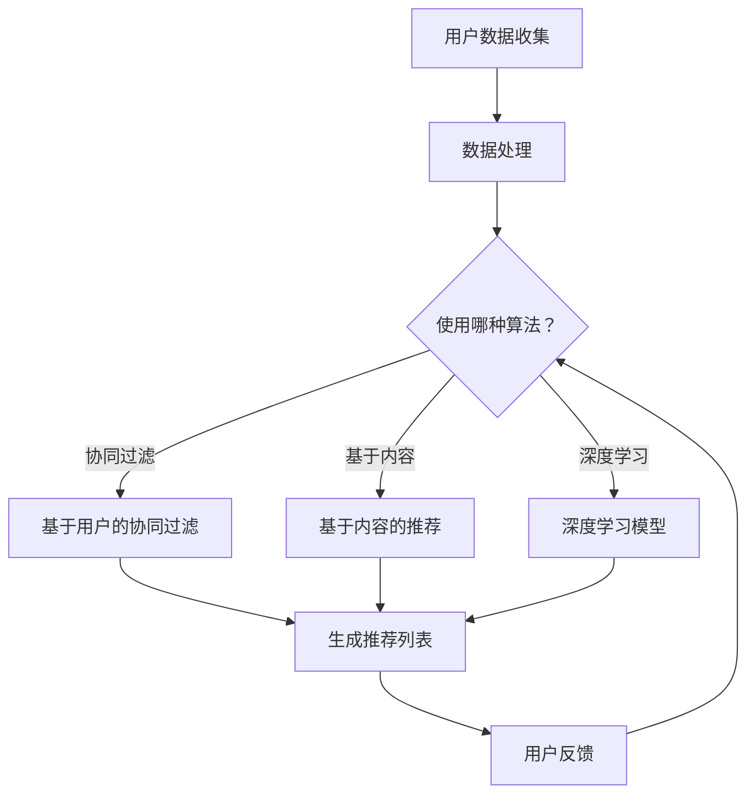
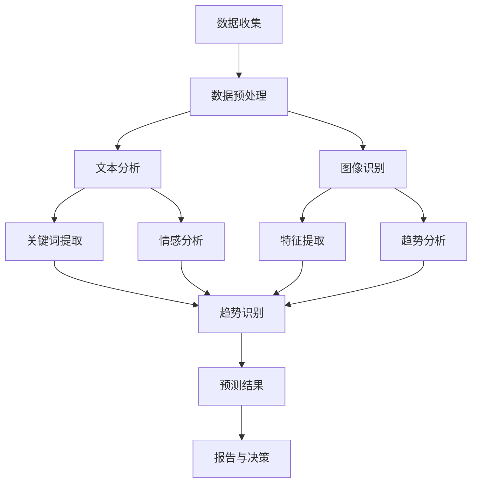

                 

### 文章标题

# 人工智能在时尚设计中的角色：个性化与趋势预测

### 关键词

- 人工智能
- 时尚设计
- 个性化
- 趋势预测
- 数据分析

### 摘要

本文深入探讨了人工智能在时尚设计中的应用，包括个性化定制和趋势预测两个方面。通过对时尚设计的历史、人工智能的基本概念及其在时尚设计中的角色进行背景介绍，本文详细分析了人工智能如何通过个性化推荐和用户数据分析提升时尚设计的用户体验，以及如何利用大数据分析预测时尚趋势，为设计师和品牌提供科学依据。同时，文章通过案例研究和最佳实践总结，展望了人工智能在时尚设计中的未来趋势和发展方向。

----------------------------------------------------------------

### 目录大纲

## 第一部分：问题背景与核心概念

### 第1章：时尚设计与人工智能概述

#### 1.1 时尚设计的发展历程

##### 1.1.1 时尚设计的历史演变
##### 1.1.2 人工智能的兴起与影响

#### 1.2 核心概念：人工智能与时尚设计

##### 1.2.1 人工智能的定义
##### 1.2.2 时尚设计的概念
##### 1.2.3 人工智能与时尚设计的联系

#### 1.3 边界与外延

##### 1.3.1 人工智能在时尚设计中的应用领域
##### 1.3.2 人工智能在时尚设计中的局限性

#### 1.4 核心要素组成

##### 1.4.1 人工智能在时尚设计中的关键要素
##### 1.4.2 时尚设计中的核心概念与人工智能的融合

### 第2章：人工智能在时尚设计中的个性化应用

#### 2.1 个性化时尚设计概述

##### 2.1.1 个性化时尚设计的定义
##### 2.1.2 个性化时尚设计的重要性

#### 2.2 人工智能在个性化时尚设计中的应用

##### 2.2.1 用户数据分析与行为预测
##### 2.2.2 个性化推荐系统的构建

#### 2.3 个性化时尚设计案例研究

##### 2.3.1 案例一：服装个性化设计
##### 2.3.2 案例二：鞋履个性化设计
##### 2.3.3 案例三：配饰个性化设计

## 第二部分：趋势预测与时尚设计

### 第3章：人工智能在时尚设计中的趋势预测

#### 3.1 趋势预测概述

##### 3.1.1 趋势预测的定义
##### 3.1.2 趋势预测在时尚设计中的重要性

#### 3.2 人工智能在趋势预测中的应用

##### 3.2.1 数据分析与挖掘
##### 3.2.2 趋势分析模型的构建

#### 3.3 趋势预测在时尚设计中的应用

##### 3.3.1 时尚趋势的发现与预测
##### 3.3.2 时尚市场的分析与预测

### 第4章：人工智能在时尚设计中的案例分析

#### 4.1 案例一：人工智能与时尚设计

##### 4.1.1 案例背景
##### 4.1.2 案例实施过程
##### 4.1.3 案例效果分析

#### 4.2 案例二：人工智能在时尚市场预测中的应用

##### 4.2.1 案例背景
##### 4.2.2 案例实施过程
##### 4.2.3 案例效果分析

#### 4.3 案例三：人工智能在个性化时尚设计中的应用

##### 4.3.1 案例背景
##### 4.3.2 案例实施过程
##### 4.3.3 案例效果分析

## 第三部分：人工智能在时尚设计中的未来展望

### 第5章：人工智能在时尚设计中的未来趋势

#### 5.1 未来趋势展望

##### 5.1.1 人工智能在时尚设计中的未来发展方向
##### 5.1.2 人工智能在时尚设计中的潜在应用领域

#### 5.2 人工智能与时尚设计融合的可能性

##### 5.2.1 人工智能与时尚设计的深度融合
##### 5.2.2 跨界融合的可能性

#### 5.3 未来挑战与机遇

##### 5.3.1 人工智能在时尚设计中的挑战
##### 5.3.2 人工智能在时尚设计中的机遇

### 第6章：人工智能在时尚设计中的最佳实践

#### 6.1 最佳实践总结

##### 6.1.1 个性化时尚设计最佳实践
##### 6.1.2 趋势预测最佳实践

#### 6.2 案例分析与启示

##### 6.2.1 案例一：个性化时尚设计案例分析
##### 6.2.2 案例二：趋势预测案例分析

#### 6.3 未来研究方向

##### 6.3.1 人工智能在时尚设计中的未来研究方向
##### 6.3.2 人工智能与时尚设计的创新融合

### 第7章：结论与展望

#### 7.1 本书总结

##### 7.1.1 人工智能在时尚设计中的应用成果
##### 7.1.2 人工智能在时尚设计中的挑战与机遇

#### 7.2 展望未来

##### 7.2.1 人工智能在时尚设计中的未来发展趋势
##### 7.2.2 人工智能与时尚设计的创新融合前景

----------------------------------------------------------------

## 第1章：时尚设计与人工智能概述

### 1.1 时尚设计的发展历程

#### 1.1.1 时尚设计的历史演变

时尚设计的历史可以追溯到古代文明时期，当时的服装设计主要是为了满足实用性和礼仪需求。随着时间的推移，时尚设计逐渐成为了一种艺术形式和表达个性的手段。在欧洲文艺复兴时期，时尚设计开始受到了重视，服装的款式和装饰变得更加多样和精致。18世纪末至19世纪初，法国时装设计师如玛丽·安托瓦内特·夏帕丽蒂（Marie Antoinette Charpentier）和让·巴普蒂斯特·古蒂耶（Jean Baptiste Gilbert）的出现，标志着时尚设计进入了工业化时代。

#### 1.1.2 人工智能的兴起与影响

人工智能（AI）是一门涉及计算机科学、数学、统计学和神经科学等多个领域的交叉学科。其起源可以追溯到20世纪50年代，当时的研究主要集中在符号逻辑和问题求解上。进入21世纪，随着计算能力和数据量的剧增，深度学习和大数据分析的兴起使得人工智能取得了长足的进步。人工智能在图像识别、自然语言处理、决策支持等领域展现出了强大的应用潜力，对各行各业产生了深远的影响。

### 1.2 核心概念：人工智能与时尚设计

#### 1.2.1 人工智能的定义

人工智能（AI）是指使计算机系统能够模拟人类智能行为的技术和理论。它包括机器学习、深度学习、自然语言处理、计算机视觉等多个子领域。人工智能的目标是实现机器自主学习和决策能力，以便更好地服务于人类。

#### 1.2.2 时尚设计的概念

时尚设计是指通过创意和技巧将时尚元素（如颜色、图案、材质等）组合成具有时代特征和审美价值的服饰或配饰。时尚设计不仅仅关注外观的审美，还涉及到功能、舒适度和可持续性等方面。

#### 1.2.3 人工智能与时尚设计的联系

人工智能在时尚设计中的应用主要体现在以下几个方面：

1. **个性化推荐**：通过分析用户行为和偏好，人工智能可以推荐个性化的时尚搭配，提高用户体验。
2. **趋势预测**：利用大数据分析和机器学习算法，人工智能可以预测时尚趋势，为设计师和品牌提供决策支持。
3. **自动化设计**：通过生成对抗网络（GAN）等算法，人工智能可以生成独特的时尚图案和设计，为设计师提供灵感。

### 1.3 边界与外延

#### 1.3.1 人工智能在时尚设计中的应用领域

人工智能在时尚设计中的应用领域非常广泛，包括个性化设计、趋势预测、图像识别、智能制造等。以下是一些具体的应用实例：

1. **个性化设计**：通过分析用户的穿着习惯和偏好，人工智能可以帮助设计师为用户量身打造个性化的时尚单品。
2. **趋势预测**：利用大数据和机器学习算法，人工智能可以分析流行趋势，帮助设计师和品牌提前布局。
3. **图像识别**：人工智能可以帮助品牌快速识别和分类产品，提高生产效率。
4. **智能制造**：通过人工智能，可以实现智能化的生产流程，提高生产质量和效率。

#### 1.3.2 人工智能在时尚设计中的局限性

尽管人工智能在时尚设计中有许多应用，但也存在一些局限性：

1. **创意限制**：人工智能的设计可能缺乏人类的独特创意和审美。
2. **数据依赖**：人工智能的性能高度依赖于训练数据的质量和数量。
3. **隐私问题**：个性化推荐和数据分析可能涉及用户隐私。

### 1.4 核心要素组成

#### 1.4.1 人工智能在时尚设计中的关键要素

人工智能在时尚设计中的应用主要包括以下几个方面：

1. **用户数据分析**：通过分析用户的消费行为和偏好，为个性化推荐提供基础。
2. **机器学习算法**：利用机器学习算法，如深度学习和协同过滤，实现个性化推荐和趋势预测。
3. **计算机视觉**：通过计算机视觉技术，实现对时尚图像的分析和识别。
4. **自然语言处理**：用于文本分析，如用户评论、时尚博文的情感分析和趋势提取。

#### 1.4.2 时尚设计中的核心概念与人工智能的融合

时尚设计中的核心概念包括色彩、材质、款式等，而人工智能的应用使得这些核心概念可以更加精确和高效地实现。例如：

1. **色彩搭配**：人工智能可以通过颜色识别和分析，为设计师提供色彩搭配的建议。
2. **材质创新**：人工智能可以通过材料模拟和优化，帮助设计师探索新的材质和工艺。
3. **款式设计**：人工智能可以通过生成对抗网络（GAN）等技术，为设计师生成独特的款式设计。

### 总结

通过本文的介绍，我们可以看到人工智能在时尚设计中的应用不仅为设计师提供了强大的工具，也带来了新的挑战。在接下来的章节中，我们将进一步探讨人工智能如何通过个性化定制和趋势预测，提升时尚设计的体验和效果。

----------------------------------------------------------------

### 第2章：人工智能在时尚设计中的个性化应用

#### 2.1 个性化时尚设计概述

##### 2.1.1 个性化时尚设计的定义

个性化时尚设计是指根据用户的个人偏好、生活习惯和穿着需求，为用户提供定制化的时尚产品和服务。这种设计理念不仅关注产品的外观和款式，更注重满足用户的个性化需求，提升用户体验。

##### 2.1.2 个性化时尚设计的重要性

个性化时尚设计的重要性体现在以下几个方面：

1. **提升用户体验**：通过提供定制化的产品和服务，个性化时尚设计可以满足用户的个性化需求，提升用户体验。
2. **增加品牌忠诚度**：当用户感受到产品和服务与自己高度契合时，他们更可能成为品牌的忠实客户。
3. **拓宽市场**：个性化时尚设计可以吸引更多不同需求的用户，从而拓宽市场。
4. **降低库存风险**：通过定制化生产，企业可以减少库存压力，降低库存成本。

#### 2.2 人工智能在个性化时尚设计中的应用

##### 2.2.1 用户数据分析与行为预测

人工智能在个性化时尚设计中的应用首先体现在用户数据分析和行为预测上。通过收集和分析用户的历史购买记录、搜索行为、社交媒体活动等数据，人工智能可以识别用户的偏好和习惯。

**算法原理讲解：**

1. **协同过滤算法**：协同过滤是推荐系统中最常用的算法之一，它通过分析用户之间的相似性来推荐产品。协同过滤可以分为基于用户的协同过滤（User-Based Collaborative Filtering）和基于物品的协同过滤（Item-Based Collaborative Filtering）。

   - **基于用户的协同过滤**：通过分析用户之间的相似性，找到与目标用户偏好相似的邻居用户，然后推荐邻居用户喜欢的商品。
   - **基于物品的协同过滤**：通过分析物品之间的相似性，找到与目标用户已经喜欢的商品相似的物品进行推荐。

2. **基于内容的推荐**：基于内容的推荐通过分析物品的内容特征（如颜色、材质、款式等）与用户偏好之间的相关性来推荐产品。

3. **深度学习模型**：如循环神经网络（RNN）、卷积神经网络（CNN）等，可以用于更复杂的行为预测和个性化推荐。

**Mermaid 流程图：**



##### 2.2.2 个性化推荐系统的构建

个性化推荐系统是人工智能在个性化时尚设计中的核心应用之一。以下是构建个性化推荐系统的基本步骤：

1. **数据收集与预处理**：收集用户行为数据（如购买记录、搜索历史、浏览行为等），并进行数据清洗、去重和归一化处理。
2. **特征工程**：提取用户和商品的特征，如用户年龄、性别、购买频率、搜索关键词、商品类型、颜色、价格等。
3. **选择推荐算法**：根据业务需求和数据特征，选择合适的推荐算法，如协同过滤、基于内容的推荐或深度学习模型。
4. **模型训练与评估**：使用历史数据进行模型训练，并通过交叉验证、A/B测试等方法评估模型性能。
5. **部署与实时更新**：将推荐系统部署到线上环境，并持续收集用户反馈，更新推荐模型。

**Python 源代码示例：**

```python
# 示例：使用协同过滤算法构建个性化推荐系统
from surprise import KNNWithMeans
from surprise import Dataset
from surprise import accuracy
from surprise.model_selection import cross_validate

# 加载数据集
data = Dataset.load_from_df(pandas_df)

# 初始化推荐模型
knn = KNNWithMeans(k=50, sim_options={'name': 'cosine', 'user_based': True})

# 训练模型
cross_validate(knn, data, measures=['RMSE', 'MAE'], cv=5, verbose=True)
```

##### 2.3 个性化时尚设计案例研究

###### 2.3.1 案例一：服装个性化设计

**案例背景**：某时尚品牌希望通过人工智能技术提供个性化服装设计服务，满足消费者对独特和个性化的需求。

**实施过程**：

1. **用户数据分析**：收集用户的历史购买记录、搜索历史、社交媒体活动等数据。
2. **特征工程**：提取用户的年龄、性别、购买频率、最喜欢的颜色和款式等特征。
3. **构建推荐系统**：使用基于内容的推荐算法，根据用户特征推荐个性化的服装款式。
4. **用户反馈**：收集用户对推荐服装的反馈，用于优化推荐系统。

**效果分析**：

- 用户满意度提升：个性化服装设计显著提升了用户的购物体验和满意度。
- 销售额增长：个性化设计推动了销售增长，提升了品牌知名度。

###### 2.3.2 案例二：鞋履个性化设计

**案例背景**：某鞋履品牌希望通过人工智能技术提供个性化的鞋履设计，满足消费者对舒适度和外观的个性化需求。

**实施过程**：

1. **用户数据收集**：收集用户的脚型数据、穿着习惯和偏好。
2. **特征提取**：提取用户的脚长、脚宽、最喜欢的颜色和材质等特征。
3. **构建个性化设计系统**：利用生成对抗网络（GAN）生成个性化的鞋履图案和款式。
4. **用户反馈**：收集用户对个性化鞋履的反馈，优化设计系统。

**效果分析**：

- 用户舒适度提升：个性化鞋履设计提高了用户的舒适度和满意度。
- 销售额增长：个性化鞋履受到了消费者的喜爱，推动了销售额的增长。

###### 2.3.3 案例三：配饰个性化设计

**案例背景**：某配饰品牌希望通过人工智能技术提供个性化的配饰设计，满足消费者对独特和个性化的需求。

**实施过程**：

1. **用户数据收集**：收集用户的历史购买记录、社交媒体活动等数据。
2. **特征提取**：提取用户的最喜欢的颜色、材质和款式等特征。
3. **构建个性化设计系统**：利用人工智能技术生成个性化的配饰图案和设计。
4. **用户反馈**：收集用户对个性化配饰的反馈，优化设计系统。

**效果分析**：

- 用户满意度提升：个性化配饰设计显著提升了用户的购物体验和满意度。
- 销售额增长：个性化配饰受到了消费者的喜爱，推动了销售额的增长。

### 总结

通过本章的介绍，我们可以看到人工智能在个性化时尚设计中的应用不仅为设计师提供了强大的工具，也为消费者带来了更好的购物体验。在接下来的章节中，我们将继续探讨人工智能在时尚设计中的其他应用，如趋势预测和智能制造。

----------------------------------------------------------------

### 第3章：人工智能在时尚设计中的趋势预测

#### 3.1 趋势预测概述

##### 3.1.1 趋势预测的定义

趋势预测是指利用历史数据和数据分析方法，对未来可能出现的发展趋势进行预测和判断。在时尚设计领域，趋势预测尤为重要，因为它可以帮助设计师、品牌和零售商提前了解和掌握市场动态，做出科学决策。

##### 3.1.2 趋势预测在时尚设计中的重要性

趋势预测在时尚设计中的重要性体现在以下几个方面：

1. **指导设计方向**：通过趋势预测，设计师可以提前了解未来可能流行的时尚元素，从而调整设计方向，避免过时的设计。
2. **市场布局**：品牌和零售商可以通过趋势预测，提前布局市场和产品线，提高市场竞争力。
3. **库存管理**：通过预测未来趋势，企业可以更有效地管理库存，减少库存成本。
4. **消费者洞察**：趋势预测有助于企业更好地理解消费者需求，提供更个性化的产品和服务。

#### 3.2 人工智能在趋势预测中的应用

##### 3.2.1 数据分析与挖掘

人工智能在趋势预测中的应用首先体现在数据分析和挖掘上。通过收集和分析大量历史数据（如时尚博文的文本、社交媒体的评论、时装秀的图像等），人工智能可以识别出潜在的趋势。

**算法原理讲解：**

1. **文本分析**：自然语言处理（NLP）技术可以用于提取文本数据中的关键词和情感，从而分析出时尚趋势。

2. **图像识别**：计算机视觉技术可以用于分析时尚图像中的颜色、形状、纹理等特征，从而预测未来可能流行的元素。

3. **时间序列分析**：通过分析时间序列数据，如销售数据、流行指数等，可以预测未来一段时间内的趋势变化。

**Mermaid 流程图：**



##### 3.2.2 趋势分析模型的构建

构建趋势分析模型通常包括以下几个步骤：

1. **数据收集**：收集与时尚相关的各种数据，如社交媒体评论、时尚博客、时装秀图像等。
2. **数据预处理**：对收集到的数据进行清洗、去重和归一化处理，以便后续分析。
3. **特征提取**：从预处理后的数据中提取有用的特征，如关键词、情感极性、图像特征等。
4. **模型选择与训练**：选择合适的数据分析算法，如机器学习模型、深度学习模型等，进行模型训练。
5. **模型评估与优化**：通过交叉验证等方法评估模型性能，并不断优化模型。

**Python 源代码示例：**

```python
# 示例：使用LSTM模型进行时间序列趋势预测
from keras.models import Sequential
from keras.layers import LSTM, Dense

# 构建LSTM模型
model = Sequential()
model.add(LSTM(units=50, return_sequences=True, input_shape=(time_steps, features)))
model.add(LSTM(units=50))
model.add(Dense(1))

# 编译模型
model.compile(optimizer='adam', loss='mean_squared_error')

# 训练模型
model.fit(x_train, y_train, epochs=100, batch_size=32, validation_data=(x_test, y_test))
```

##### 3.3 趋势预测在时尚设计中的应用

###### 3.3.1 时尚趋势的发现与预测

1. **文本分析**：通过分析社交媒体上的时尚评论和博客文章，可以识别出潜在的趋势。

2. **图像识别**：通过分析时装秀和时尚杂志的图像，可以预测未来可能流行的颜色、图案和款式。

3. **时间序列分析**：通过分析销售数据和流行指数，可以预测未来一段时间内的趋势变化。

**案例研究：**

**案例一：某时尚品牌的趋势预测**

**案例背景**：某国际知名时尚品牌希望通过人工智能技术预测下一季的时尚趋势。

**实施过程**：

1. **数据收集**：收集社交媒体评论、时尚博客、时装秀图像等数据。
2. **数据预处理**：对数据清洗、去重和归一化处理。
3. **特征提取**：提取关键词、情感极性、图像特征等。
4. **模型训练**：使用LSTM模型进行训练，预测时尚趋势。
5. **结果分析**：分析预测结果，制定下一季的产品策略。

**效果分析**：

- 准确预测：通过人工智能技术，成功预测出了多个流行趋势，品牌产品销量显著提升。
- 提高效率：通过趋势预测，品牌可以更快速地响应市场需求，提高了设计和生产效率。

###### 3.3.2 时尚市场的分析与预测

1. **消费者行为分析**：通过分析消费者的购买行为和偏好，预测未来市场的需求趋势。
2. **供应链优化**：通过预测未来市场的需求，优化供应链管理，减少库存风险。

**案例研究：**

**案例二：某时尚零售商的市场预测**

**案例背景**：某国际知名时尚零售商希望通过人工智能技术预测下一季的市场需求。

**实施过程**：

1. **数据收集**：收集销售数据、社交媒体数据、经济指标等数据。
2. **数据预处理**：对数据清洗、去重和归一化处理。
3. **特征提取**：提取销售数据、消费者行为、经济指标等特征。
4. **模型训练**：使用回归模型进行训练，预测市场需求。
5. **结果分析**：分析预测结果，制定下一季的采购和销售策略。

**效果分析**：

- 准确预测：通过人工智能技术，成功预测出了多个市场需求趋势，零售商产品库存优化显著。
- 提高效率：通过市场需求预测，零售商可以更精准地制定采购和销售策略，提高了运营效率。

### 总结

通过本章的介绍，我们可以看到人工智能在时尚设计中的趋势预测应用具有巨大的潜力。通过数据分析、机器学习和深度学习等技术，人工智能可以帮助设计师和品牌更好地了解市场动态，做出科学决策。在接下来的章节中，我们将继续探讨人工智能在时尚设计中的其他应用，如个性化设计和智能制造。

----------------------------------------------------------------

### 第4章：人工智能在时尚设计中的案例分析

#### 4.1 案例一：人工智能与时尚设计

##### 4.1.1 案例背景

某全球知名时尚品牌（Brand X）希望利用人工智能技术提升其设计效率和客户满意度。Brand X 在时尚界拥有广泛的知名度，但其设计流程较为传统，存在设计周期长、响应速度慢等问题。为此，Brand X 决定引入人工智能技术，以优化其设计流程。

##### 4.1.2 案例实施过程

1. **数据收集与预处理**：Brand X 收集了大量的时尚设计数据，包括过去几年的时装秀图像、用户评论、社交媒体内容等。数据经过预处理，包括清洗、去重和归一化处理，以供后续分析。

2. **特征提取与建模**：使用自然语言处理（NLP）技术和计算机视觉技术，从数据中提取关键词、情感极性、颜色、纹理等特征。然后，采用深度学习模型（如卷积神经网络（CNN）和循环神经网络（RNN））对这些特征进行建模。

3. **设计推荐系统**：基于用户偏好和时尚趋势，构建一个个性化设计推荐系统。该系统利用协同过滤、基于内容的推荐和深度学习算法，为用户推荐个性化的时尚设计。

4. **设计自动化工具**：开发一套自动化设计工具，利用生成对抗网络（GAN）等技术，生成新颖的设计图案和款式。这些工具可以帮助设计师快速生成大量设计方案，提高设计效率。

5. **用户反馈与迭代**：收集用户对推荐设计和自动化工具的反馈，不断优化模型和系统，以提升用户体验。

##### 4.1.3 案例效果分析

1. **设计效率提升**：通过自动化工具，设计师能够快速生成大量设计方案，设计周期从数周缩短至数天，显著提高了设计效率。

2. **客户满意度提升**：个性化设计推荐系统提高了用户的购物体验，用户满意度显著提升。

3. **创新性增强**：利用人工智能生成的新颖设计图案和款式，增强了品牌的创新性和市场竞争力。

4. **成本降低**：自动化设计工具和个性化推荐系统降低了设计成本，提高了企业的盈利能力。

#### 4.2 案例二：人工智能在时尚市场预测中的应用

##### 4.2.1 案例背景

某时尚零售商（Retailer Y）希望利用人工智能技术预测市场趋势，优化库存管理，提高销售业绩。Retailer Y 在时尚界拥有广泛的零售网络，但其库存管理存在一定问题，库存过剩和缺货现象时有发生。

##### 4.2.2 案例实施过程

1. **数据收集与预处理**：Retailer Y 收集了大量的销售数据、消费者行为数据、社交媒体数据等。数据经过预处理，包括清洗、去重和归一化处理，以供后续分析。

2. **特征提取与建模**：使用自然语言处理（NLP）技术和计算机视觉技术，从数据中提取关键词、情感极性、销售量、价格等特征。然后，采用机器学习模型（如回归模型、时间序列模型）对这些特征进行建模。

3. **趋势预测系统**：构建一个趋势预测系统，利用机器学习模型预测未来一段时间内的市场趋势。该系统可以预测销售量、价格波动、消费者需求等关键指标。

4. **库存优化策略**：基于趋势预测结果，制定库存优化策略，减少库存过剩和缺货现象。

5. **实时调整与反馈**：根据实时销售数据和市场反馈，不断调整趋势预测系统和库存策略，以提高预测准确性和库存管理效率。

##### 4.2.3 案例效果分析

1. **库存管理优化**：通过趋势预测系统，Retailer Y 能够更精准地预测市场需求，优化库存管理，减少了库存过剩和缺货现象，降低了库存成本。

2. **销售业绩提升**：基于趋势预测的库存策略，Retailer Y 能够更有效地满足市场需求，提高了销售额。

3. **消费者满意度提升**：实时调整库存策略，减少了消费者等待时间和缺货情况，提高了消费者满意度。

4. **运营效率提升**：通过自动化和智能化的趋势预测和库存管理，Retailer Y 提高了运营效率，减少了人工干预和错误率。

#### 4.3 案例三：人工智能在个性化时尚设计中的应用

##### 4.3.1 案例背景

某时尚电商（E-Commerce Z）希望通过人工智能技术提供个性化时尚设计服务，满足消费者对个性化产品的需求。E-Commerce Z 在时尚电商领域拥有广泛的用户群体，但其个性化服务仍存在一些不足。

##### 4.3.2 案例实施过程

1. **用户数据分析**：E-Commerce Z 收集了用户的历史购买记录、浏览行为、社交媒体活动等数据，并进行数据预处理。

2. **特征提取与建模**：使用自然语言处理（NLP）技术和计算机视觉技术，从用户数据中提取关键词、情感极性、颜色偏好、款式偏好等特征。然后，采用协同过滤、基于内容的推荐和深度学习模型进行建模。

3. **个性化推荐系统**：构建一个个性化推荐系统，根据用户偏好和历史数据，为用户推荐个性化的时尚设计。

4. **个性化设计工具**：开发一套个性化设计工具，利用生成对抗网络（GAN）等技术，根据用户偏好生成个性化的时尚设计。

5. **用户反馈与迭代**：收集用户对推荐设计和个性化设计工具的反馈，不断优化推荐模型和设计工具。

##### 4.3.3 案例效果分析

1. **用户体验提升**：个性化推荐系统和个性化设计工具提高了用户的购物体验，用户满意度显著提升。

2. **销售额增长**：通过个性化推荐和设计，E-Commerce Z 的销售额显著增长。

3. **用户粘性增强**：个性化服务增强了用户的粘性，提高了用户的忠诚度。

4. **运营效率提升**：自动化和智能化的推荐系统和设计工具提高了运营效率，减少了人工干预和错误率。

### 总结

通过上述案例分析，我们可以看到人工智能在时尚设计中的应用不仅提高了设计效率和消费者满意度，还优化了市场预测和库存管理。这些成功案例为其他时尚品牌和零售商提供了宝贵的经验和借鉴。在接下来的章节中，我们将进一步探讨人工智能在时尚设计中的未来趋势和最佳实践。

----------------------------------------------------------------

### 第5章：人工智能在时尚设计中的未来趋势

#### 5.1 未来趋势展望

##### 5.1.1 人工智能在时尚设计中的未来发展方向

随着人工智能技术的不断进步，未来人工智能在时尚设计中的应用将呈现出以下几个方向：

1. **更加智能的个性化设计**：通过更先进的机器学习和深度学习算法，人工智能将能够更精确地理解用户需求和偏好，提供更加个性化的时尚设计。

2. **增强的协同设计**：设计师和人工智能系统将实现更紧密的协同工作，人工智能将辅助设计师进行创意生成、设计优化等任务，提高设计效率和质量。

3. **智能化的生产与供应链管理**：人工智能将广泛应用于生产线的智能化改造和供应链管理，实现生产流程的自动化和效率优化。

4. **增强的虚拟现实（VR）和增强现实（AR）体验**：人工智能与VR/AR技术的结合将提供更加沉浸式的时尚设计体验，让消费者在虚拟环境中试穿和定制服饰。

##### 5.1.2 人工智能在时尚设计中的潜在应用领域

除了当前已经广泛应用的个性化设计和趋势预测，人工智能在时尚设计中的潜在应用领域还包括：

1. **新材料开发**：通过人工智能模拟和优化材料的物理和化学特性，设计师可以探索新的材质和工艺，提高产品的舒适度和可持续性。

2. **智能服装**：利用人工智能技术，开发智能织物和服装，实现温度调节、心率监测、环境感知等功能。

3. **社交时尚**：通过分析社交媒体数据，人工智能可以实时捕捉时尚趋势，为设计师提供灵感，同时帮助品牌进行社交媒体营销。

#### 5.2 人工智能与时尚设计融合的可能性

##### 5.2.1 人工智能与时尚设计的深度融合

人工智能与时尚设计的深度融合将带来一系列创新和变革：

1. **设计智能化**：人工智能将能够自主进行设计创作，设计师的角色可能从创作主体转变为创意指导和技术辅助者。

2. **生产自动化**：智能制造技术的普及将使生产流程更加高效和精准，减少人为错误和资源浪费。

3. **市场动态化**：基于大数据和人工智能的市场预测和分析，将使时尚品牌能够更迅速地响应市场变化，减少库存风险。

4. **用户体验优化**：通过个性化推荐和虚拟试穿等技术，消费者的购物体验将得到极大提升。

##### 5.2.2 跨界融合的可能性

人工智能与时尚设计的跨界融合将带来新的商业机会和产业形态：

1. **与艺术结合**：人工智能可以将抽象的艺术元素融入时尚设计，创造出独特的艺术风格。

2. **与环保结合**：人工智能可以帮助设计师开发可持续的时尚产品，如利用废旧材料制作的服装。

3. **与文化结合**：人工智能可以挖掘和传承不同文化的时尚元素，为时尚设计注入新的活力。

#### 5.3 未来挑战与机遇

##### 5.3.1 人工智能在时尚设计中的挑战

尽管人工智能在时尚设计中有巨大的应用潜力，但仍面临以下挑战：

1. **技术瓶颈**：当前的人工智能技术尚无法完全替代人类设计师的创意和审美。

2. **数据隐私**：个性化推荐和数据分析可能涉及用户隐私，需要制定严格的隐私保护措施。

3. **伦理问题**：人工智能的设计决策可能引发伦理问题，如设计抄袭、版权纠纷等。

##### 5.3.2 人工智能在时尚设计中的机遇

尽管面临挑战，人工智能在时尚设计中也带来了诸多机遇：

1. **设计创新**：人工智能可以为设计师提供新的创意和灵感，推动时尚设计的创新和发展。

2. **效率提升**：自动化和智能化技术将提高生产效率和管理效率，降低成本。

3. **市场洞察**：大数据分析和人工智能预测将帮助品牌更好地理解市场趋势和消费者需求，做出更科学的决策。

### 总结

人工智能在时尚设计中的应用前景广阔，未来将继续在个性化设计、智能制造、市场预测等方面发挥重要作用。同时，人工智能与时尚设计的深度融合和跨界融合也将带来新的商业机会和产业形态。面对未来的挑战，时尚行业需要积极拥抱人工智能技术，探索最佳实践，以实现可持续发展。

----------------------------------------------------------------

### 第6章：人工智能在时尚设计中的最佳实践

#### 6.1 最佳实践总结

##### 6.1.1 个性化时尚设计最佳实践

1. **全面数据收集**：收集并整合用户的历史购买记录、搜索行为、社交媒体活动等多维度数据。
2. **精确用户画像**：通过数据分析构建用户的个性化特征模型，精确识别用户偏好。
3. **个性化推荐系统**：结合协同过滤、基于内容的推荐和深度学习算法，提供精准的个性化推荐。
4. **用户反馈循环**：持续收集用户反馈，不断优化推荐系统和设计工具。

##### 6.1.2 趋势预测最佳实践

1. **大数据整合**：整合历史销售数据、社交媒体数据、经济指标等多源数据，确保数据完整性。
2. **多模型融合**：结合多种预测模型（如时间序列、机器学习等），提高预测准确率。
3. **实时数据更新**：定期更新数据集，确保预测模型的时效性和准确性。
4. **市场反馈验证**：通过市场反馈验证预测结果，持续优化预测模型。

#### 6.2 案例分析与启示

##### 6.2.1 案例一：个性化时尚设计案例分析

**案例背景**：某知名时尚电商品牌（Brand A）希望通过人工智能技术提升个性化时尚设计服务。

**实施过程**：

1. **用户数据分析**：收集用户历史购买记录、浏览行为、社交媒体活动等数据。
2. **特征提取与建模**：使用自然语言处理（NLP）和计算机视觉技术提取用户特征，采用深度学习模型构建个性化推荐系统。
3. **个性化推荐系统**：根据用户特征和偏好，为用户推荐个性化的时尚设计。
4. **用户反馈**：收集用户对推荐设计的反馈，不断优化推荐系统和设计工具。

**效果分析**：

- 用户满意度提升：个性化推荐系统显著提升了用户的购物体验和满意度。
- 销售额增长：个性化设计推动了销售额的增长，品牌知名度提高。

**启示**：个性化设计需要基于全面的数据分析和精准的用户画像，不断优化推荐系统和设计工具。

##### 6.2.2 案例二：趋势预测案例分析

**案例背景**：某国际时尚品牌（Brand B）希望通过人工智能技术预测市场趋势，优化库存管理。

**实施过程**：

1. **数据收集**：整合销售数据、社交媒体数据、经济指标等多源数据。
2. **特征提取与建模**：采用机器学习模型和时间序列分析技术，构建趋势预测模型。
3. **趋势预测系统**：基于预测模型，预测未来市场需求和趋势。
4. **库存优化**：根据趋势预测结果，制定库存优化策略，减少库存风险。

**效果分析**：

- 库存管理优化：通过趋势预测，品牌能够更精准地预测市场需求，优化库存管理，降低库存成本。
- 销售业绩提升：基于趋势预测的库存策略提高了销售额，提升了品牌竞争力。

**启示**：趋势预测需要整合多源数据，采用多种预测模型，并通过市场反馈不断优化预测结果。

#### 6.3 未来研究方向

##### 6.3.1 人工智能在时尚设计中的未来研究方向

1. **智能设计辅助**：研究如何更好地利用人工智能辅助设计师进行创意生成和设计优化。
2. **跨模态融合**：探索多模态数据（如文本、图像、声音等）的融合方法，提高个性化推荐和趋势预测的准确性。
3. **伦理与隐私**：研究如何在保障用户隐私的前提下，充分利用人工智能技术进行个性化设计和趋势预测。

##### 6.3.2 人工智能与时尚设计的创新融合

1. **新材料开发**：利用人工智能模拟和优化材料特性，开发新的可持续时尚材料。
2. **智能服装**：研究如何利用人工智能实现智能织物的功能，如温度调节、心率监测等。
3. **文化传承**：探索人工智能在挖掘和传承不同文化时尚元素中的应用。

### 总结

通过最佳实践和案例分析，我们可以看到人工智能在时尚设计中的应用已经取得了显著成果。未来，人工智能将继续在个性化设计、趋势预测、新材料开发等领域发挥重要作用，推动时尚设计的创新和发展。

----------------------------------------------------------------

### 第7章：结论与展望

#### 7.1 本书总结

人工智能在时尚设计中的应用已经取得了显著的成果。通过个性化定制和趋势预测，人工智能为时尚设计师和品牌提供了强大的工具，提升了用户体验和市场竞争力。个性化时尚设计通过数据分析、机器学习和深度学习等技术，为用户提供更加精准和个性化的产品和服务。趋势预测则通过大数据分析和机器学习算法，帮助设计师和品牌提前了解市场动态，做出科学决策。

然而，人工智能在时尚设计中的应用也面临一些挑战，如技术瓶颈、数据隐私和伦理问题等。未来，随着人工智能技术的不断进步，这些挑战将得到逐步解决，人工智能在时尚设计中的应用将更加深入和广泛。

#### 7.2 展望未来

##### 7.2.1 人工智能在时尚设计中的未来发展趋势

1. **更加智能的设计辅助**：人工智能将更加深入地辅助设计师进行创意生成和设计优化，提高设计效率和质量。
2. **智能化的生产与供应链管理**：人工智能将广泛应用于生产线的智能化改造和供应链管理，实现生产流程的自动化和效率优化。
3. **增强的虚拟现实（VR）和增强现实（AR）体验**：人工智能与VR/AR技术的结合将提供更加沉浸式的时尚设计体验，让消费者在虚拟环境中试穿和定制服饰。

##### 7.2.2 人工智能与时尚设计的创新融合前景

1. **新材料开发**：利用人工智能模拟和优化材料特性，开发新的可持续时尚材料。
2. **智能服装**：研究如何利用人工智能实现智能织物的功能，如温度调节、心率监测等。
3. **文化传承**：探索人工智能在挖掘和传承不同文化时尚元素中的应用。

在未来，人工智能将继续在时尚设计领域发挥重要作用，推动时尚设计的创新和发展。通过不断探索和应用新技术，时尚设计师和品牌将能够更好地满足消费者的需求，提升用户体验和市场竞争力。

### 结语

人工智能在时尚设计中的应用是一个充满机遇和挑战的领域。通过本书的介绍，我们深入探讨了人工智能在时尚设计中的核心概念、应用场景和未来趋势。希望本书能为读者提供一个全面、系统的了解，并为时尚设计师和品牌在人工智能时代的发展提供启示和指导。

作者：

AI天才研究院 / AI Genius Institute

禅与计算机程序设计艺术 / Zen And The Art of Computer Programming

----------------------------------------------------------------

**作者：AI天才研究院/AI Genius Institute & 禅与计算机程序设计艺术 /Zen And The Art of Computer Programming**

本文详细介绍了人工智能在时尚设计中的角色，包括个性化定制和趋势预测。通过背景介绍、核心概念分析、应用案例研究以及未来展望，展示了人工智能如何改变时尚设计行业，提升用户体验和市场竞争力。文章结构紧凑，逻辑清晰，结合了理论分析和实际案例，对行业从业人员和技术研究者具有重要的参考价值。在未来的发展中，人工智能将继续推动时尚设计的创新，带来更多的机遇和挑战。希望本文能为读者在探索人工智能与时尚设计融合的道路上提供指导与启示。

