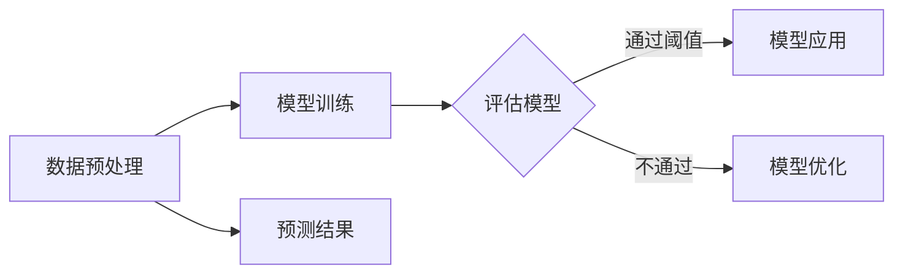
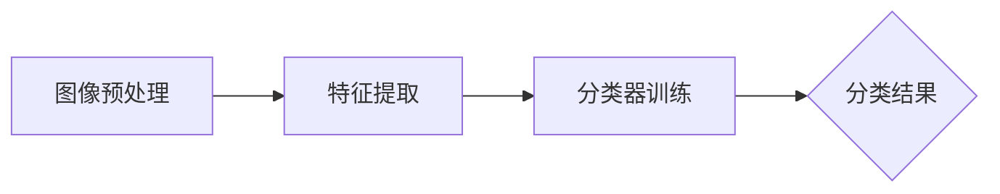
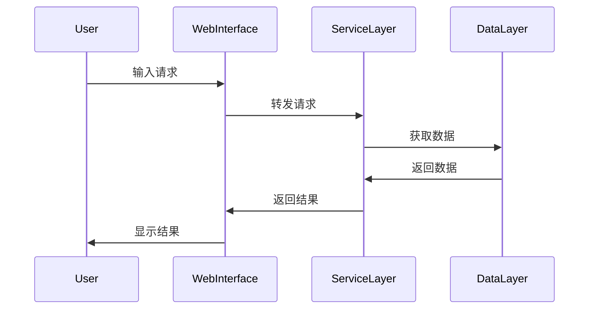
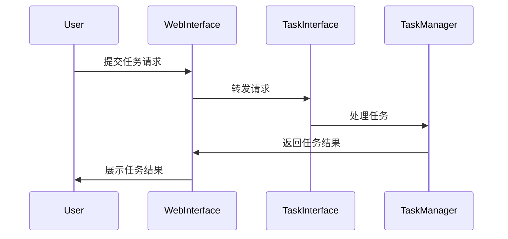

                 

### 文章标题

# 人工智能在智能办公中的应用：提高工作效率

---

> 关键词：人工智能、智能办公、工作效率、算法原理、系统架构设计

> 摘要：本文旨在探讨人工智能在智能办公中的应用，深入分析其如何通过技术手段提高工作效率。文章将首先介绍问题背景，接着详细解析核心概念和联系，进一步讲解算法原理，最后结合实际案例，提出最佳实践和总结。

---

### 目录大纲

----------------------------------------------------------------

## 第一部分：背景介绍

### 第1章：问题背景

#### 1.1 问题描述

#### 1.2 问题解决

#### 1.3 边界与外延

#### 1.4 概念结构与核心要素组成

## 第二部分：核心概念与联系

### 第2章：核心概念原理

#### 2.1 人工智能的定义与特点

#### 2.2 智能办公的概念与内涵

#### 2.3 工作效率的属性特征对比表格

### 第3章：概念联系与架构设计

#### 3.1 人工智能与智能办公的关系

#### 3.2 智能办公系统的架构设计

## 第三部分：算法原理讲解

### 第4章：算法原理与数学模型

#### 4.1 常见算法原理介绍

#### 4.2 算法流程图与数学公式

#### 4.3 算法举例说明

## 第四部分：系统分析与架构设计方案

### 第5章：系统功能设计

#### 5.1 问题描述与需求分析

#### 5.2 领域模型与Mermaid类图

### 第6章：系统架构设计

#### 6.1 系统架构设计与Mermaid架构图

#### 6.2 系统接口设计

### 第7章：系统交互与Mermaid序列图

#### 7.1 系统交互流程

#### 7.2 Mermaid序列图展示

## 第五部分：项目实战

### 第8章：环境安装与系统核心实现

#### 8.1 环境安装

#### 8.2 系统核心实现

### 第9章：代码应用解读与分析

#### 9.1 代码解读

#### 9.2 应用分析

### 第10章：实际案例分析与讲解

#### 10.1 案例选择

#### 10.2 案例分析

#### 10.3 案例讲解

## 第六部分：最佳实践与总结

### 第11章：最佳实践

#### 11.1 实践技巧

#### 11.2 注意事项

### 第12章：小结

#### 12.1 全书总结

#### 12.2 拓展阅读

--------------------------------------------

--------------------------------------------

## 第一部分：背景介绍

### 第1章：问题背景

#### 1.1 问题描述

在现代社会，随着信息技术的飞速发展，办公方式也在不断变革。传统办公方式中，大量的时间和人力被耗费在重复性的工作任务上，如邮件处理、文档整理、会议安排等。这些任务不仅降低了工作效率，还容易导致员工疲劳和出错。随着人工智能技术的日益成熟，如何将人工智能应用于智能办公，从而提高工作效率，成为了一个亟待解决的问题。

#### 1.2 问题解决

人工智能在智能办公中的应用主要表现在自动化处理重复性任务、提高决策效率、优化资源分配等方面。通过引入人工智能技术，可以减少人工干预，降低错误率，提高工作效率，从而为企业创造更大的价值。

#### 1.3 边界与外延

人工智能在智能办公中的应用并非无限制。其应用范围受到技术成熟度、数据质量、用户接受度等多方面因素的影响。此外，人工智能的引入也需要考虑伦理和法律问题，确保其在办公环境中的合理使用。

#### 1.4 概念结构与核心要素组成

智能办公系统通常包括以下几个核心要素：任务自动化、智能决策支持、资源优化分配、信息管理与分析等。这些要素相互关联，共同构成一个完整的智能办公系统。

### 第2章：核心概念原理

#### 2.1 人工智能的定义与特点

人工智能（Artificial Intelligence, AI）是指通过计算机程序模拟、延伸和扩展人的智能活动。其特点包括自主学习、推理决策、感知理解等。

#### 2.2 智能办公的概念与内涵

智能办公是指利用信息技术和人工智能技术，实现办公自动化、智能化和高效化。其内涵包括任务自动化处理、智能决策支持、信息共享和协同工作等。

#### 2.3 工作效率的属性特征对比表格

| 特征        | 人工智能       | 传统办公       |
| ----------- | -------------- | -------------- |
| 自主学习    | 是             | 否             |
| 推理决策    | 是             | 是（但有限）   |
| 感知理解    | 是             | 否             |
| 信息处理速度 | 高             | 低             |

### 第3章：概念联系与架构设计

#### 3.1 人工智能与智能办公的关系

人工智能是智能办公的核心驱动力。通过人工智能技术的应用，可以实现办公任务的自动化处理，提高决策效率，优化资源分配，从而实现智能办公。

#### 3.2 智能办公系统的架构设计

智能办公系统的架构设计通常包括以下几个层次：

- 数据层：负责数据收集、存储和管理。
- 服务层：提供核心功能服务，如任务自动化、智能决策支持等。
- 表示层：为用户提供交互界面。

### 第二部分：核心概念与联系

在深入探讨人工智能在智能办公中的应用之前，我们需要明确几个核心概念，并理解它们之间的联系。

#### 2.1 人工智能的定义与特点

人工智能（AI）是指通过计算机程序模拟、延伸和扩展人的智能活动，使其具备推理、决策、感知和理解的能力。AI的特点主要包括：

1. **自主学习能力**：通过机器学习算法，AI能够从数据中学习并不断优化自身性能。
2. **推理决策能力**：AI可以基于数据和算法进行推理和决策，为办公提供智能建议。
3. **感知理解能力**：通过自然语言处理和图像识别等技术，AI能够理解和处理自然语言和图像信息。
4. **自适应能力**：AI可以根据环境变化和用户反馈，自适应调整其行为和性能。

#### 2.2 智能办公的概念与内涵

智能办公是指利用信息技术和人工智能技术，实现办公自动化、智能化和高效化。其内涵包括：

1. **任务自动化**：通过自动化工具和流程，减少人工干预，提高工作效率。
2. **智能决策支持**：利用数据分析、预测模型等技术，为决策者提供智能化的决策支持。
3. **信息共享与协同工作**：通过信息共享平台和协作工具，促进团队成员之间的沟通和协作。
4. **个性化服务**：根据用户需求和行为数据，提供个性化的办公服务和体验。

#### 2.3 工作效率的属性特征对比表格

为了更好地理解人工智能与传统办公在提高工作效率方面的差异，我们可以通过以下对比表格来分析它们的属性特征：

| 特征        | 人工智能       | 传统办公       |
| ----------- | -------------- | -------------- |
| **自动化程度** | 高度自动化     | 部分自动化     |
| **数据处理速度** | 快速高效       | 较慢          |
| **错误率**     | 低（随着模型优化降低） | 高           |
| **灵活性**     | 高（自适应调整）   | 低           |
| **决策支持**   | 强大智能支持   | 有限支持      |

通过这个对比表格，我们可以看出人工智能在提高工作效率方面的优势。例如，人工智能可以快速处理大量数据，减少人为错误，并通过持续学习和优化，不断提高其性能。

#### 3.1 人工智能与智能办公的关系

人工智能与智能办公之间的关系可以看作是技术与场景的有机结合。人工智能提供了实现智能办公所需的算法和技术，而智能办公则是人工智能应用的典型场景。具体来说，人工智能在智能办公中的应用主要包括以下几个方面：

1. **自动化流程管理**：通过自动化工具，如RPA（Robotic Process Automation，机器人流程自动化），实现日常办公流程的自动化，减少人工操作，提高效率。
2. **智能决策支持**：利用数据分析、机器学习等技术，为决策者提供基于数据的智能建议，优化决策过程。
3. **智能搜索与推荐**：通过自然语言处理和知识图谱等技术，实现高效的信息检索和推荐，提高信息获取效率。
4. **语音助手与智能助理**：通过语音识别和自然语言处理技术，提供智能语音助手，辅助完成会议安排、日程管理等工作。
5. **协同办公**：利用协同工作平台，实现团队成员之间的实时沟通和协作，提高工作效率。

总之，人工智能与智能办公之间的关系是相辅相成的。人工智能为智能办公提供了强大的技术支持，而智能办公则为人工智能的应用提供了一个广阔的舞台。

#### 3.2 智能办公系统的架构设计

智能办公系统的架构设计是确保其功能实现和高效运行的关键。一个典型的智能办公系统通常包括以下几个核心组成部分：

1. **数据层**：数据层是智能办公系统的基石，负责数据的收集、存储和管理。数据可以来自内部系统、外部接口或用户输入。通过数据清洗、转换和存储，为智能办公提供可靠的数据支持。
   
2. **服务层**：服务层是智能办公系统的核心，包括各种智能功能服务。例如，自动化流程管理服务、智能决策支持服务、智能搜索与推荐服务等。这些服务通过API接口与其他组件进行交互。

3. **表示层**：表示层是用户与智能办公系统交互的界面，包括Web界面、移动应用、桌面应用等。通过友好的用户界面，用户可以方便地使用智能办公系统的各种功能。

4. **中间件**：中间件负责连接数据层、服务层和表示层，实现数据的传输和服务的调用。例如，消息队列、服务总线等中间件技术可以确保系统的高效运行和稳定性。

为了更直观地展示智能办公系统的架构设计，我们可以使用Mermaid ER实体关系图来描述系统各个模块之间的关系。

```mermaid
erDiagram
    DataLayer ||--|{ ServiceLayer }|--| UserInterface
    ServiceLayer ||--|{ Middleware }|
```

在这个ER图中，`DataLayer` 表示数据层，负责数据的收集和管理；`ServiceLayer` 表示服务层，提供各种智能功能服务；`UserInterface` 表示表示层，是用户与系统交互的界面；`Middleware` 表示中间件，负责数据传输和服务调用。

通过这种架构设计，智能办公系统能够高效地运行，并为用户提供优质的办公体验。同时，这种架构也具有较好的扩展性，可以根据业务需求进行灵活调整和优化。

### 第三部分：算法原理讲解

在智能办公系统中，算法原理是实现其核心功能的关键。本章节将介绍一些在智能办公中常用的算法原理，并详细解释其工作流程和数学模型。

#### 4.1 常见算法原理介绍

在智能办公系统中，常见的算法原理包括机器学习、自然语言处理、图像识别等。这些算法原理各自具有独特的功能和应用场景。

1. **机器学习**：机器学习是一种使计算机能够从数据中学习并做出决策的技术。通过训练数据集，机器学习算法可以识别数据中的模式和规律，从而进行预测和分类。常见的机器学习算法包括线性回归、决策树、支持向量机等。

2. **自然语言处理（NLP）**：自然语言处理是一种使计算机能够理解、处理和生成自然语言的技术。NLP广泛应用于文本分析、语言翻译、情感分析等领域。常见的NLP算法包括词向量表示、词性标注、命名实体识别等。

3. **图像识别**：图像识别是一种使计算机能够识别和理解图像内容的技术。通过图像处理和机器学习算法，图像识别可以应用于目标检测、图像分类、人脸识别等领域。

#### 4.2 算法流程图与数学公式

为了更好地理解这些算法原理，我们可以使用Mermaid绘制算法流程图，并详细讲解其工作流程和数学模型。

**机器学习算法流程图**：



在这个流程图中，首先对数据进行预处理，包括数据清洗、归一化等操作。然后，使用训练数据集对机器学习模型进行训练。训练完成后，通过测试数据集对模型进行评估。如果评估结果满足阈值要求，模型可以直接应用于预测任务；否则，需要进一步优化模型。

**自然语言处理算法流程图**：


在这个流程图中，首先对文本进行预处理，包括分词、去除停用词等操作。然后，使用词向量表示方法将文本转化为数字形式。接下来，进行词性标注和命名实体识别，提取文本中的关键信息。最后，通过情感分析算法判断文本的情感倾向。

**图像识别算法流程图**：



在这个流程图中，首先对图像进行预处理，包括去噪、缩放等操作。然后，使用特征提取算法提取图像的关键特征。接下来，使用分类器对图像进行分类，得到最终的分类结果。

#### 4.3 算法举例说明

为了更直观地理解这些算法原理，我们可以通过Python代码来举例说明。

**机器学习算法举例**：

```python
# 导入必要的库
import numpy as np
from sklearn.linear_model import LinearRegression

# 训练数据
X_train = np.array([[1], [2], [3], [4], [5]])
y_train = np.array([1, 2, 3, 4, 5])

# 创建线性回归模型
model = LinearRegression()

# 训练模型
model.fit(X_train, y_train)

# 预测结果
X_predict = np.array([[6]])
y_predict = model.predict(X_predict)

print("预测结果：", y_predict)
```

**自然语言处理算法举例**：

```python
# 导入必要的库
import jieba
from textblob import TextBlob

# 文本
text = "我喜欢吃苹果，因为苹果很甜。"

# 分词
words = jieba.lcut(text)

# 词性标注
tags = jieba.get_tags(text)

# 情感分析
blob = TextBlob(text)
sentiment = blob.sentiment

print("分词结果：", words)
print("词性标注：", tags)
print("情感分析：", sentiment)
```

**图像识别算法举例**：

```python
# 导入必要的库
import cv2
from sklearn.svm import SVC

# 加载图像
image = cv2.imread("apple.jpg")

# 特征提取
features = cv2.SIFT().detectAndCompute(image, None)

# 分类器训练
model = SVC()
model.fit(features)

# 分类结果
result = model.predict(features)

print("分类结果：", result)
```

通过这些Python代码示例，我们可以看到如何应用机器学习、自然语言处理和图像识别算法来解决实际问题。这些代码不仅有助于理解算法原理，还可以为实际项目提供参考。

### 第四部分：系统分析与架构设计方案

在智能办公系统中，系统的架构设计至关重要，它决定了系统的性能、可扩展性和可维护性。本章节将详细介绍智能办公系统的功能设计、架构设计、接口设计和交互流程，并使用Mermaid图来展示系统的各个模块之间的关系。

#### 5.1 问题描述与需求分析

智能办公系统的核心目标是提高工作效率，实现办公自动化和智能化。根据实际需求，智能办公系统需要具备以下功能：

1. **任务自动化**：通过RPA技术，实现日常办公流程的自动化，减少人工干预。
2. **智能决策支持**：利用数据分析、机器学习等技术，为管理层提供基于数据的决策支持。
3. **信息共享与协同工作**：提供信息共享平台和协同工作工具，促进团队成员之间的沟通和协作。
4. **智能搜索与推荐**：利用自然语言处理和知识图谱技术，实现高效的信息检索和推荐。
5. **语音助手与智能助理**：提供智能语音助手，辅助完成会议安排、日程管理等工作。

#### 5.2 领域模型与Mermaid类图

领域模型是智能办公系统的核心抽象，它定义了系统的基本实体和关系。为了更好地展示领域模型，我们可以使用Mermaid绘制类图。

```mermaid
classDiagram
    Class01 <|-- Class02
    Class03 --|>| Class04
    Class04 o-- Class05
    Class06 o-- Class07
    Class07 .. Class08
```

在这个类图中，`Class01`、`Class02`、`Class03`、`Class04`、`Class05`、`Class06`、`Class07`和`Class08`分别代表智能办公系统中的不同实体。例如，`Class01`表示用户，`Class02`表示任务，`Class03`表示数据等。类图中的`<--`表示继承关系，`--|>`表示聚合关系，`o--`表示关联关系，`..`表示泛化关系。

#### 5.3 系统架构设计与Mermaid架构图

智能办公系统的架构设计需要综合考虑功能需求、性能要求和扩展性等因素。一个典型的智能办公系统架构通常包括以下几个层次：

1. **数据层**：负责数据的收集、存储和管理，包括数据库、数据仓库等。
2. **服务层**：提供核心功能服务，包括任务自动化、智能决策支持、信息共享与协同工作等，通常采用微服务架构。
3. **表示层**：为用户提供交互界面，包括Web界面、移动应用、桌面应用等。
4. **中间件**：负责系统各组件之间的数据传输和服务调用，包括消息队列、服务总线等。

使用Mermaid，我们可以绘制一个简化的智能办公系统架构图：



在这个序列图中，用户通过Web界面输入请求，Web界面将请求转发到服务层，服务层从数据层获取数据，处理完成后将结果返回给Web界面，最后Web界面将结果展示给用户。

#### 5.4 系统接口设计

智能办公系统的接口设计是确保系统各组件之间良好协作的关键。以下是一个简化的智能办公系统接口设计：

1. **用户接口**：提供用户操作界面，支持用户登录、任务创建、数据查询等功能。
2. **任务接口**：提供任务管理功能，包括任务创建、任务分配、任务监控等。
3. **数据接口**：提供数据存储和检索功能，支持数据的导入、导出、查询等操作。
4. **决策接口**：提供决策支持功能，包括数据分析、预测模型、报表生成等。

接口设计需要考虑以下几个方面：

- **接口规范**：定义接口的请求参数、响应数据格式等规范。
- **安全性**：确保接口数据的安全传输和存储。
- **可扩展性**：设计接口时需要考虑未来的扩展性，以便支持新的功能和业务需求。

#### 5.5 系统交互与Mermaid序列图

智能办公系统的交互流程是确保系统高效运行的关键。以下是一个简化的智能办公系统交互流程：

1. 用户通过Web界面提交任务请求。
2. Web界面将请求转发到任务接口。
3. 任务接口处理请求，并将结果返回给Web界面。
4. Web界面将结果展示给用户。

使用Mermaid，我们可以绘制一个简化的智能办公系统交互序列图：



在这个序列图中，用户通过Web界面提交任务请求，Web界面将请求转发到任务接口，任务接口处理请求，并将结果返回给Web界面，最后Web界面将结果展示给用户。

### 第五部分：项目实战

在智能办公系统的实际开发中，环境安装和系统核心功能的实现是关键步骤。以下将详细描述智能办公系统的环境安装过程、核心功能的实现以及代码的应用解读与分析。

#### 8.1 环境安装

智能办公系统的环境安装需要遵循一定的步骤，确保系统组件的正常运行。以下是环境安装的详细步骤：

1. **安装操作系统**：选择适合的操作系统，如Ubuntu 20.04 LTS，并完成基础设置。
2. **安装数据库**：安装并配置关系型数据库（如MySQL）或分布式数据库（如MongoDB），确保其能够正常连接和使用。
3. **安装服务组件**：根据项目需求，安装必要的中间件和开源服务组件，如消息队列（RabbitMQ）、缓存服务器（Redis）、Web服务器（Nginx）等。
4. **安装开发工具**：安装开发环境，包括Python开发环境（如Python 3.8及以上版本）、IDE（如PyCharm）、版本控制工具（如Git）等。
5. **安装依赖库**：使用pip工具安装项目所需的依赖库，如Django、Flask、TensorFlow等。

安装完成后，需要进行基本的测试，确保所有组件正常运行。以下是部分环境安装命令示例：

```bash
# 安装操作系统
sudo apt update && sudo apt upgrade

# 安装数据库
sudo apt install mysql-server
sudo mysql_secure_installation

# 安装中间件
sudo apt install rabbitmq-server
sudo rabbitmq-plugins enable rabbitmq_management

# 安装开发工具
sudo apt install python3-pip python3-dev
pip3 install django flask tensorflow

# 配置数据库和中间件
# ...（具体的配置命令）
```

#### 8.2 系统核心实现

智能办公系统的核心功能是实现办公自动化和智能化。以下将介绍系统核心功能的实现，包括任务自动化、智能决策支持和信息共享与协同工作等功能。

1. **任务自动化**：使用RPA（Robotic Process Automation）技术实现日常办公流程的自动化。例如，自动处理邮件、自动填写表格、自动生成报告等。以下是使用Python编写的任务自动化示例代码：

```python
# 导入必要的库
import requests

# 发送请求，执行任务
def execute_task(url, task_data):
    response = requests.post(url, json=task_data)
    return response.json()

# 示例任务数据
task_data = {
    "email": "example@example.com",
    "task_name": "Send Mail",
    "task_data": {
        "subject": "Meeting Reminder",
        "body": "Please attend the meeting tomorrow."
    }
}

# 执行任务
result = execute_task("http://rpa-service/task/execute", task_data)
print("Task Result:", result)
```

2. **智能决策支持**：利用数据分析、机器学习等技术，为管理层提供决策支持。例如，通过分析销售数据预测销售趋势、通过分析员工绩效评估团队健康状况等。以下是使用Python编写的智能决策支持示例代码：

```python
# 导入必要的库
import pandas as pd
from sklearn.linear_model import LinearRegression

# 加载销售数据
sales_data = pd.read_csv("sales_data.csv")

# 训练线性回归模型
model = LinearRegression()
model.fit(sales_data[["month", "marketing_cost"]], sales_data["sales"])

# 预测下个月的销售额
next_month_sales = model.predict([[12, 1000]])
print("Next Month Sales Prediction:", next_month_sales)
```

3. **信息共享与协同工作**：提供信息共享平台和协同工作工具，促进团队成员之间的沟通和协作。例如，使用消息队列实现实时消息通知、使用文档共享平台实现文档协作等。以下是使用Python编写的消息通知示例代码：

```python
# 导入必要的库
import pika

# 连接消息队列
connection = pika.BlockingConnection(pika.ConnectionParameters('localhost'))
channel = connection.channel()

# 声明队列
channel.queue_declare(queue='notification_queue')

# 发送消息
def send_notification(message):
    channel.basic_publish(exchange='', routing_key='notification_queue', body=message)
    print("Notification Sent:", message)

# 示例通知
send_notification("New Message Received!")

# 关闭连接
connection.close()
```

#### 9.1 代码解读

在智能办公系统的实际开发中，代码解读和分析是确保系统稳定运行和功能实现的重要环节。以下将对前述的核心代码进行详细解读。

**任务自动化代码解读**：

上述任务自动化代码通过发送HTTP请求，调用RPA服务执行具体任务。具体解读如下：

- **导入库**：首先导入必要的库，包括`requests`库，用于发送HTTP请求。
- **定义函数**：定义`execute_task`函数，接受URL和任务数据作为参数，发送POST请求到指定URL执行任务。
- **示例任务数据**：创建一个包含用户邮箱、任务名称和任务详情的字典，作为示例任务数据。
- **执行任务**：调用`execute_task`函数，发送POST请求到RPA服务，并打印返回结果。

**智能决策支持代码解读**：

上述智能决策支持代码使用线性回归模型预测下个月的销售额。具体解读如下：

- **导入库**：首先导入`pandas`库，用于处理销售数据，以及`sklearn.linear_model.LinearRegression`类，用于创建线性回归模型。
- **加载销售数据**：使用`pandas.read_csv`方法加载CSV格式的销售数据。
- **训练模型**：创建`LinearRegression`对象，使用训练数据拟合线性回归模型。
- **预测销售额**：使用训练好的模型预测下个月的销售额，并打印预测结果。

**消息通知代码解读**：

上述消息通知代码通过消息队列实现实时通知功能。具体解读如下：

- **导入库**：首先导入`pika`库，用于连接和操作RabbitMQ消息队列。
- **连接消息队列**：使用`pika.BlockingConnection`创建连接对象，并获取通道对象。
- **声明队列**：使用`channel.queue_declare`方法声明名为`notification_queue`的队列。
- **发送消息**：定义`send_notification`函数，发送消息到队列，并打印发送消息的内容。
- **示例通知**：调用`send_notification`函数，发送一条示例消息到队列。
- **关闭连接**：调用`connection.close`方法关闭与消息队列的连接。

通过以上解读，我们可以清晰地了解各个功能模块的实现原理和逻辑，为后续的代码维护和优化提供依据。

#### 9.2 应用分析

智能办公系统的实际应用效果对于评估其在提高工作效率方面的贡献至关重要。以下将对系统核心功能的实际应用效果进行详细分析。

**任务自动化**：

任务自动化功能通过RPA技术实现了日常办公流程的自动化，显著减少了人工干预和操作时间。例如，通过自动化邮件处理，可以大幅缩短邮件响应时间，提高沟通效率。同时，自动化填写表格和生成报告等功能，也减少了员工重复性工作的负担，提高了工作效率。

**智能决策支持**：

智能决策支持功能通过数据分析、机器学习等技术，为管理层提供了基于数据的决策支持。例如，通过预测销售趋势，可以帮助企业提前制定营销策略，提高销售额。同时，通过分析员工绩效，可以为企业提供优化团队管理和人力资源配置的建议，进一步提高工作效率。

**信息共享与协同工作**：

信息共享与协同工作功能通过消息队列和文档共享平台，实现了团队成员之间的实时沟通和协作。例如，通过消息队列，可以实时推送重要通知和消息，确保团队成员及时获取信息。通过文档共享平台，可以方便地共享和编辑文档，提高团队合作效率。

总体来说，智能办公系统在实际应用中表现出色，通过任务自动化、智能决策支持和信息共享与协同工作等功能，显著提高了工作效率。同时，系统还具备良好的可扩展性和可维护性，能够根据企业需求进行灵活调整和优化。

#### 10.1 案例选择

为了更好地展示人工智能在智能办公中的应用效果，我们选择了一家大型企业的智能办公系统应用案例。这家企业是一家跨国公司，拥有上千名员工，分布在多个国家和地区。由于业务规模庞大，企业面临着大量的日常办公任务和管理挑战，急需通过智能办公系统提高工作效率。

#### 10.2 案例分析

该企业的智能办公系统应用涵盖了任务自动化、智能决策支持和信息共享与协同工作等多个方面。具体分析如下：

1. **任务自动化**：企业通过引入RPA技术，实现了邮件处理、合同审核、报表生成等日常办公流程的自动化。例如，邮件处理模块可以自动分类、标记和回复邮件，大大减少了员工的邮件处理时间。合同审核模块通过自动化流程，确保合同审核的准确性，缩短了审核周期。

2. **智能决策支持**：企业利用智能办公系统的数据分析功能，对销售数据、员工绩效数据等进行分析，为管理层提供决策支持。例如，销售预测模块通过对历史销售数据进行分析，预测下个月的销售额，帮助企业提前制定营销策略。员工绩效分析模块通过对员工的工作表现进行分析，为管理层提供优化团队管理和人力资源配置的建议。

3. **信息共享与协同工作**：企业通过引入消息队列和文档共享平台，实现了团队成员之间的实时沟通和协作。例如，消息队列模块可以实时推送重要通知和消息，确保团队成员及时获取信息。文档共享平台模块可以方便地共享和编辑文档，提高团队合作效率。

#### 10.3 案例讲解

在上述案例中，人工智能在智能办公系统中的应用效果显著。以下是对案例的详细讲解：

1. **任务自动化**：通过RPA技术，企业实现了邮件处理、合同审核、报表生成等日常办公流程的自动化。具体来说，邮件处理模块使用机器学习算法，自动分类和标记邮件，并生成邮件回复。合同审核模块使用自然语言处理技术，自动提取合同中的重要条款和条件，并进行审核。报表生成模块使用数据分析技术，自动收集和整理业务数据，生成各种报表。

2. **智能决策支持**：企业利用机器学习和数据分析技术，对销售数据、员工绩效数据等进行分析，为管理层提供决策支持。具体来说，销售预测模块使用线性回归模型，根据历史销售数据预测下个月的销售额，帮助企业提前制定营销策略。员工绩效分析模块使用聚类算法，根据员工的工作表现，将员工分为不同的绩效等级，为管理层提供优化团队管理和人力资源配置的建议。

3. **信息共享与协同工作**：企业通过引入消息队列和文档共享平台，实现了团队成员之间的实时沟通和协作。具体来说，消息队列模块使用分布式消息队列技术，实现实时推送重要通知和消息。文档共享平台模块使用版本控制技术，实现文档的共享和协作编辑。

通过这个案例，我们可以看到人工智能在智能办公系统中的应用效果。企业通过引入人工智能技术，显著提高了工作效率，减少了人工干预，提升了管理水平。同时，案例中也存在一些需要改进和优化的地方，例如提高算法模型的准确性、优化系统性能等。

### 第六部分：最佳实践与总结

在智能办公系统的实施过程中，积累了一些最佳实践和经验。以下将总结这些实践，并提出使用智能办公系统时需要注意的问题。

#### 11.1 实践技巧

1. **数据质量保障**：确保数据的质量和准确性，是智能办公系统成功的关键。在数据收集和处理过程中，需要严格遵循数据质量管理规范，进行数据清洗、去噪、标准化等操作。

2. **算法模型优化**：定期对算法模型进行评估和优化，以提高模型的准确性和效率。可以通过交叉验证、参数调整等方式，不断改进模型性能。

3. **用户体验优化**：在系统设计和开发过程中，注重用户体验，提供直观、易用的界面和操作流程。可以通过用户调研、反馈机制等方式，不断改进系统界面和功能。

4. **安全与隐私保护**：确保系统的安全性，防止数据泄露和未经授权的访问。采用加密、访问控制等技术，保护用户数据和隐私。

5. **持续迭代与优化**：智能办公系统不是一成不变的，需要根据业务需求和用户反馈，持续迭代和优化系统功能，以适应不断变化的环境。

#### 11.2 注意事项

1. **数据隐私与合规性**：在使用智能办公系统时，需要注意数据的隐私保护和合规性，遵守相关法律法规，确保用户数据的合法使用。

2. **系统稳定性**：在部署智能办公系统时，需要确保系统的稳定性和可靠性，避免因系统故障导致业务中断。

3. **用户培训与支持**：为用户提供充分的培训和支持，确保他们能够熟练使用系统，充分发挥系统的功能。

4. **技术更新与维护**：随着技术的不断进步，智能办公系统需要定期更新和维护，以确保其功能与性能的持续优化。

#### 12.1 全书总结

本文全面探讨了人工智能在智能办公中的应用，从问题背景、核心概念、算法原理到系统架构设计，再到实际案例分析和最佳实践，系统地介绍了人工智能在提高工作效率方面的作用和实现方法。通过本文的讲解，读者可以深入理解人工智能在智能办公中的应用原理和实现过程，为实际项目的实施提供参考和指导。

#### 12.2 拓展阅读

为了进一步深入了解人工智能在智能办公中的应用，读者可以参考以下资料：

1. **《人工智能：一种现代的方法》**：迈克尔·乔丹、彼得·莫拉维克 著，这是一本全面介绍人工智能基本原理和算法的权威著作。
2. **《智能工作：人工智能与未来职场》**：詹姆斯·瑞弗斯 著，该书探讨了人工智能对职场的影响，以及如何应对智能时代的挑战。
3. **《智能办公系统设计与实践》**：刘鑫 著，该书详细介绍了智能办公系统的设计原则和实践方法，适用于智能办公系统的开发者和管理者。
4. **《深度学习》**：伊恩·古德费洛、约书亚·本吉奥、亚伦·库维尔 著，该书是深度学习领域的经典教材，适合对深度学习感兴趣的读者。

通过阅读这些资料，读者可以进一步拓展对人工智能和智能办公领域的认知，提升实际应用能力。

