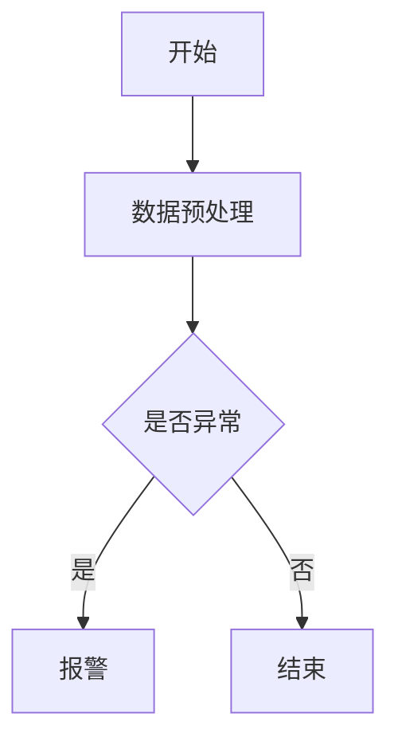
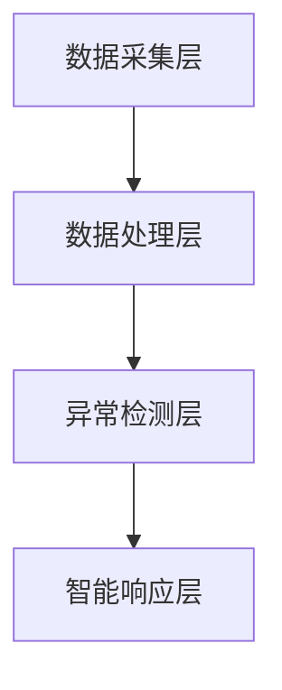
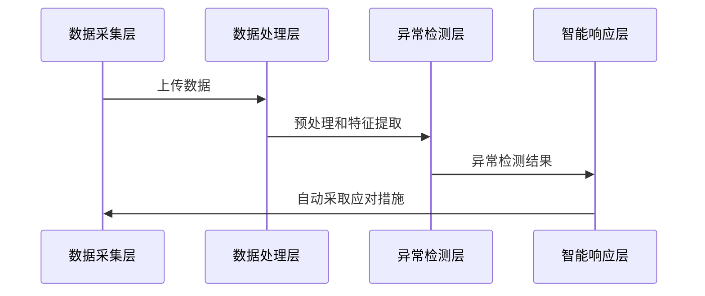

                 

# 《人工智能在智能家居安全中的应用: 提高居家安全性》

关键词：人工智能、智能家居、安全性、算法、架构设计

摘要：随着智能家居技术的飞速发展，人们对居家安全性的需求日益提高。人工智能技术的引入，为智能家居安全提供了新的解决方案。本文将从背景介绍、核心概念、算法原理、系统分析与架构设计以及实际案例等多方面，探讨人工智能在智能家居安全中的应用，旨在为行业提供有价值的参考。

## 第一部分：背景介绍与核心概念

### 第1章 问题背景与核心概念

#### 1.1 问题背景

随着物联网（IoT）技术的普及，智能家居设备已经成为现代家庭生活的重要组成部分。然而，智能家居设备的安全性成为了一个不可忽视的问题。一方面，智能家居设备通过无线网络与其他设备互联，容易成为网络攻击的目标；另一方面，智能家居设备中的个人隐私数据泄露的风险也在不断增加。因此，提高智能家居安全性已成为亟待解决的问题。

#### 1.1.1 智能家居的快速发展与安全问题

近年来，智能家居市场呈现出爆发式增长，各类智能家居设备如智能门锁、智能摄像头、智能照明系统等不断涌现。然而，随着智能家居设备的普及，安全问题也逐渐暴露出来。例如：

- **网络攻击**：智能家居设备通过网络互联，攻击者可以通过入侵某一设备，进而控制整个智能家居系统。
- **数据泄露**：智能家居设备中存储了大量的个人隐私数据，如家庭住址、生活习惯等，数据泄露可能导致严重后果。
- **隐私侵犯**：智能家居设备可能被用于监控家庭生活，从而侵犯家庭成员的隐私权。

#### 1.1.2 智能家居安全的重要性

智能家居安全不仅关系到家庭的安全，还关系到社会的稳定。因此，提高智能家居安全性具有十分重要的意义：

- **保障家庭安全**：智能家居安全可以有效防止家庭被盗、火灾等意外事件的发生。
- **保护个人隐私**：智能家居安全可以防止家庭隐私数据被泄露，保障家庭成员的隐私权。
- **维护社会稳定**：智能家居安全可以提高社会整体的安全水平，减少犯罪行为的发生。

#### 1.1.3 人工智能在智能家居安全中的应用前景

人工智能技术具有强大的数据处理和分析能力，在智能家居安全领域具有广泛的应用前景。通过引入人工智能技术，可以实现对智能家居设备的安全监控、异常检测和智能响应，从而提高居家安全性。具体应用包括：

- **智能监控**：利用人工智能技术，对智能家居设备进行实时监控，及时发现异常情况。
- **异常检测**：通过分析设备运行数据，利用人工智能技术检测异常行为，防范潜在的安全威胁。
- **智能响应**：当检测到安全隐患时，利用人工智能技术自动采取相应的应对措施，保障家庭安全。

### 第2章 核心概念与联系

#### 2.1 人工智能原理与智能家居安全的关系

人工智能（AI）是一门研究、开发用于模拟、延伸和扩展人类智能的理论、方法、技术及应用系统的综合技术科学。在智能家居安全领域，人工智能技术可以用于以下几个方面：

- **数据分析**：通过对智能家居设备的运行数据进行采集和分析，发现潜在的安全隐患。
- **异常检测**：利用机器学习和深度学习算法，对设备运行状态进行实时监测，发现异常行为。
- **智能响应**：根据异常检测结果，自动采取相应的应对措施，如报警、锁定设备等。

#### 2.2 智能家居安全的基本概念

智能家居安全涉及多个方面，包括物理安全、网络安全、数据安全和隐私保护等。以下是对这些基本概念的解释：

- **物理安全**：保护智能家居设备免受物理攻击，如破坏、盗窃等。
- **网络安全**：保护智能家居设备免受网络攻击，如入侵、数据窃取等。
- **数据安全**：确保智能家居设备中的数据不被非法访问、篡改或泄露。
- **隐私保护**：防止智能家居设备收集和泄露个人隐私信息。

#### 2.3 人工智能在智能家居安全中的应用场景

人工智能在智能家居安全中具有广泛的应用场景，包括但不限于以下几个方面：

- **智能门锁**：利用人脸识别、指纹识别等技术，实现智能门锁的安全认证。
- **智能摄像头**：利用图像识别、行为分析等技术，实现对家庭环境的实时监控。
- **智能照明**：利用智能传感器，根据家庭成员的活动情况自动调节照明。
- **智能空调**：利用温度传感器，根据室内外温度自动调节空调。
- **智能安防系统**：利用异常检测、智能响应等技术，实现家庭安防。

### 第3章 人工智能技术在智能家居安全中的应用

#### 3.1 人工智能技术在智能家居安全中的概述

人工智能技术在智能家居安全中的应用主要包括以下几个方面：

- **安全监测**：通过人工智能技术，对智能家居设备的运行状态进行实时监测，及时发现安全隐患。
- **异常检测**：利用机器学习和深度学习算法，对智能家居设备的数据进行分析，检测异常行为。
- **智能响应**：根据异常检测结果，自动采取相应的应对措施，如报警、锁定设备等。
- **隐私保护**：通过人工智能技术，对智能家居设备中的个人隐私数据进行加密和保护。

#### 3.2 人工智能在智能家居安全中的发展历程

人工智能技术在智能家居安全中的应用可以追溯到20世纪90年代。当时，研究人员开始探索将人工智能技术应用于智能家居设备的安全监控。随着计算机技术和人工智能技术的不断发展，智能家居安全领域得到了广泛关注。近年来，随着物联网技术的普及，人工智能在智能家居安全中的应用越来越广泛。

#### 3.3 人工智能在智能家居安全中的最新进展

随着人工智能技术的不断发展，智能家居安全领域也取得了许多新的进展。以下是一些重要的研究与应用：

- **深度学习在智能家居安全中的应用**：深度学习算法在智能家居安全中的应用取得了显著成果，如人脸识别、行为识别等。
- **边缘计算在智能家居安全中的应用**：边缘计算技术可以将计算能力分布到智能家居设备的边缘，提高智能家居安全系统的实时性和响应速度。
- **区块链在智能家居安全中的应用**：区块链技术可以用于智能家居设备的数据加密和隐私保护，提高智能家居安全系统的安全性。

#### 3.4 人工智能在智能家居安全中的应用趋势

随着人工智能技术的不断发展，智能家居安全领域将继续保持快速发展。以下是一些可能的应用趋势：

- **更智能的安全监测**：通过引入更先进的机器学习和深度学习算法，智能家居安全系统将能够更加准确地监测和分析设备数据，提高安全性。
- **更广泛的应用场景**：随着物联网技术的普及，人工智能在智能家居安全中的应用场景将越来越广泛，如智慧社区、智慧城市等。
- **更安全的隐私保护**：通过引入更先进的加密技术和隐私保护算法，智能家居安全系统将能够更好地保护用户隐私，提高用户满意度。

## 第二部分：算法原理与数学模型

### 第4章 常见算法原理讲解

#### 4.1 机器学习算法原理

机器学习（Machine Learning，ML）是一门研究如何让计算机从数据中学习、获得知识和技能，并作出决策或预测的技术。在智能家居安全领域，机器学习算法可以用于数据分析和异常检测。

##### 4.1.1 机器学习基础概念

- **监督学习**：通过已标记的数据集，学习如何对未知数据进行分类或回归。
- **无监督学习**：没有预先标记的数据集，通过学习数据之间的关系，发现数据的内在结构。
- **强化学习**：通过与环境的交互，学习如何在不确定的环境中做出最优决策。

##### 4.1.2 常见机器学习算法简介

- **决策树**：通过将数据不断划分成子集，最终得到一个树状结构，用于分类或回归。
- **支持向量机**（SVM）：通过找到一个最优的超平面，将不同类别的数据分开。
- **神经网络**：通过模拟生物神经网络的结构和功能，实现数据分析和预测。

##### 4.1.3 机器学习算法在智能家居安全中的应用

- **设备数据分类**：通过机器学习算法，对智能家居设备产生的数据进行分类，如正常数据、异常数据等。
- **异常检测**：利用机器学习算法，对设备运行数据进行实时分析，检测潜在的异常行为。

#### 4.2 深度学习算法原理

深度学习（Deep Learning，DL）是机器学习的一种重要分支，通过构建多层神经网络，对数据进行层次化的特征提取和表示。在智能家居安全领域，深度学习算法可以用于图像识别、行为分析等。

##### 4.2.1 深度学习基础概念

- **卷积神经网络**（CNN）：通过卷积操作和池化操作，对图像进行特征提取和分类。
- **循环神经网络**（RNN）：通过循环结构，对序列数据进行处理和预测。
- **生成对抗网络**（GAN）：通过生成器和判别器的对抗训练，实现数据的生成和鉴别。

##### 4.2.2 常见深度学习算法简介

- **卷积神经网络（CNN）**：常用于图像识别、图像分割等任务。
- **长短期记忆网络**（LSTM）：常用于语音识别、自然语言处理等任务。
- **生成对抗网络（GAN）**：常用于数据生成、图像修复等任务。

##### 4.2.3 深度学习算法在智能家居安全中的应用

- **图像识别**：利用CNN算法，对摄像头采集到的图像进行实时识别，如人脸识别、行为识别等。
- **行为分析**：利用RNN算法，对家庭成员的行为数据进行实时分析，如行为异常检测等。

### 第5章 数学模型与公式详解

#### 5.1 人工智能在智能家居安全中的数学模型

人工智能在智能家居安全中的应用涉及到多个数学模型，如概率论、统计学和神经网络等。

##### 5.1.1 概率论基础

- **贝叶斯定理**：用于计算事件发生的概率。
  $$ P(A|B) = \frac{P(B|A) \cdot P(A)}{P(B)} $$
- **条件概率**：用于计算在某一条件下，另一事件发生的概率。
  $$ P(A|B) = \frac{P(A \cap B)}{P(B)} $$

##### 5.1.2 统计学基础

- **均值**：数据的平均值，用于表示数据的中心位置。
  $$ \bar{x} = \frac{1}{n} \sum_{i=1}^{n} x_i $$
- **方差**：数据离散程度的度量，用于表示数据的波动性。
  $$ \sigma^2 = \frac{1}{n-1} \sum_{i=1}^{n} (x_i - \bar{x})^2 $$

##### 5.1.3 人工智能中的数学公式详解

- **神经网络激活函数**：用于将神经网络输出映射到特定的范围。
  $$ f(x) = \sigma(x) = \frac{1}{1 + e^{-x}} $$

### 第6章 算法举例说明

#### 6.1 算法mermaid流程图

##### 6.1.1 算法mermaid流程图绘制



##### 6.1.2 算法流程图解读

该算法流程图展示了如何利用机器学习算法进行异常检测。首先，对采集到的数据（如智能家居设备运行数据）进行预处理，然后输入到机器学习模型中。模型输出一个概率值，判断数据是否异常。如果异常，则触发报警；否则，算法结束。

#### 6.2 Python源代码实现

```python
import numpy as np
import pandas as pd

# 读取数据
data = pd.read_csv('data.csv')

# 数据预处理
data['preprocessed'] = data.apply(lambda x: preprocess(x), axis=1)

# 输入到机器学习模型
model = train_model(data['preprocessed'])

# 检测数据是否异常
is_anomaly = model.predict(data['preprocessed'])

# 报警或结束
if is_anomaly:
    alarm()
else:
    end()
```

##### 6.2.1 Python源代码编写

该Python源代码展示了如何利用机器学习算法进行异常检测。首先，读取数据并预处理，然后训练机器学习模型，最后对数据进行预测。如果预测结果为异常，则触发报警；否则，算法结束。

##### 6.2.2 Python源代码解读

该Python源代码分为以下几个部分：

- **数据预处理**：对采集到的数据进行预处理，包括数据清洗、特征提取等。
- **机器学习模型训练**：使用预处理后的数据训练机器学习模型。
- **数据预测**：对新的数据进行预测，判断是否异常。
- **报警或结束**：根据预测结果，触发报警或结束算法。

##### 6.2.3 算法实例分析

假设我们有一组智能家居设备的运行数据，如图像数据、温度数据、湿度数据等。通过机器学习算法，我们可以对这些数据进行异常检测。例如，如果温度数据突然升高或降低，则可能表示设备出现故障或异常。在这种情况下，我们可以触发报警，提醒家庭成员采取相应措施。

## 第三部分：系统分析与架构设计

### 第7章 系统功能设计与架构设计

#### 7.1 问题场景介绍

智能家居安全系统通常需要处理大量的设备数据，如图像、声音、温度、湿度等。为了提高系统的安全性，需要对数据进行实时监测和分析，及时发现异常情况，并采取相应的应对措施。

#### 7.1.1 智能家居安全问题的场景描述

假设家庭中有以下设备：智能门锁、智能摄像头、智能灯光系统、智能空调等。当智能门锁检测到非法入侵、智能摄像头检测到可疑行为、智能灯光系统检测到异常使用、智能空调检测到异常温度变化时，智能家居安全系统需要实时监测这些设备的数据，并判断是否存在安全隐患。

#### 7.1.2 智能家居安全问题的解决目标

智能家居安全系统的解决目标包括：

- **实时监测**：对智能家居设备的运行数据进行实时监测，及时发现异常情况。
- **异常检测**：通过机器学习和深度学习算法，对设备数据进行分析，检测异常行为。
- **智能响应**：根据异常检测结果，自动采取相应的应对措施，如报警、锁定设备等。

### 第8章 系统功能设计

#### 8.1 系统功能概述

智能家居安全系统的主要功能包括：

- **数据采集**：采集智能家居设备的运行数据，如图像、声音、温度、湿度等。
- **数据处理**：对采集到的数据进行预处理、特征提取等。
- **异常检测**：利用机器学习和深度学习算法，对设备数据进行分析，检测异常行为。
- **智能响应**：根据异常检测结果，自动采取相应的应对措施，如报警、锁定设备等。

#### 8.2 系统功能详细描述

- **数据采集**：通过智能家居设备上的传感器，采集图像、声音、温度、湿度等数据。
- **数据处理**：对采集到的数据进行预处理，如数据清洗、归一化等，然后提取特征，如颜色、声音频率、温度范围等。
- **异常检测**：利用机器学习和深度学习算法，对设备数据进行实时分析，检测异常行为。例如，通过图像识别算法，检测图像中的非法入侵者；通过声音识别算法，检测异常声音，如玻璃破碎声、紧急呼救声等。
- **智能响应**：根据异常检测结果，自动采取相应的应对措施，如报警、锁定设备、发送通知等。例如，当检测到非法入侵时，自动向家庭成员发送报警信息，同时锁定门锁，防止入侵者进一步侵入。

#### 8.3 系统功能实现思路

智能家居安全系统的实现思路如下：

1. **数据采集**：通过智能家居设备上的传感器，采集图像、声音、温度、湿度等数据。
2. **数据处理**：对采集到的数据进行预处理，如数据清洗、归一化等，然后提取特征，如颜色、声音频率、温度范围等。
3. **异常检测**：利用机器学习和深度学习算法，对设备数据进行实时分析，检测异常行为。例如，通过图像识别算法，检测图像中的非法入侵者；通过声音识别算法，检测异常声音，如玻璃破碎声、紧急呼救声等。
4. **智能响应**：根据异常检测结果，自动采取相应的应对措施，如报警、锁定设备、发送通知等。例如，当检测到非法入侵时，自动向家庭成员发送报警信息，同时锁定门锁，防止入侵者进一步侵入。

### 第9章 系统架构设计

#### 9.1 系统架构概述

智能家居安全系统采用分布式架构，包括数据采集层、数据处理层、异常检测层和智能响应层。各层之间通过接口进行通信，实现系统的整体功能。

#### 9.2 系统架构详细设计

1. **数据采集层**：包括智能家居设备上的传感器，负责采集图像、声音、温度、湿度等数据。
2. **数据处理层**：包括数据预处理模块、特征提取模块等，负责对采集到的数据进行预处理和特征提取。
3. **异常检测层**：包括机器学习和深度学习算法模块，负责对设备数据进行分析，检测异常行为。
4. **智能响应层**：包括报警模块、锁定设备模块、发送通知模块等，负责根据异常检测结果，自动采取相应的应对措施。

#### 9.3 系统架构图绘制



### 第10章 系统接口设计与交互

#### 10.1 系统接口设计

系统接口设计主要包括数据采集接口、数据处理接口、异常检测接口和智能响应接口。

#### 10.1.1 接口设计原则

- **高内聚低耦合**：接口设计应遵循高内聚低耦合原则，确保各模块之间的独立性。
- **简洁易用**：接口设计应简洁易用，便于开发人员和测试人员的理解和操作。
- **安全性**：接口设计应考虑安全性，防止数据泄露和非法访问。

#### 10.1.2 接口详细设计

1. **数据采集接口**：定义数据采集层的接口，包括数据采集、数据上传等功能。
2. **数据处理接口**：定义数据处理层的接口，包括数据预处理、特征提取等功能。
3. **异常检测接口**：定义异常检测层的接口，包括数据输入、模型训练、异常检测等功能。
4. **智能响应接口**：定义智能响应层的接口，包括报警、锁定设备、发送通知等功能。

#### 10.1.3 接口实现与测试

根据接口详细设计，实现接口功能，并进行测试，确保接口的稳定性和正确性。

#### 10.2 系统交互

系统交互主要包括数据采集层、数据处理层、异常检测层和智能响应层之间的数据传递和功能调用。

#### 10.2.1 系统交互概述

系统交互的主要流程如下：

1. 数据采集层采集数据，上传到数据处理层。
2. 数据处理层对数据进行预处理和特征提取，将结果传递给异常检测层。
3. 异常检测层对数据进行分析，检测异常行为，将检测结果传递给智能响应层。
4. 智能响应层根据异常检测结果，自动采取相应的应对措施。

#### 10.2.2 系统交互详细描述

1. **数据采集层与数据处理层之间的交互**：数据采集层将采集到的数据上传到数据处理层，数据处理层对数据进行预处理和特征提取。
2. **数据处理层与异常检测层之间的交互**：数据处理层将预处理后的数据传递给异常检测层，异常检测层对数据进行异常检测。
3. **异常检测层与智能响应层之间的交互**：异常检测层将异常检测结果传递给智能响应层，智能响应层根据检测结果自动采取相应的应对措施。

#### 10.2.3 系统交互mermaid序列图绘制



## 第四部分：项目实战与最佳实践

### 第11章 环境安装与系统实现

#### 11.1 环境安装

在开始项目实现之前，需要搭建一个合适的开发环境。以下是在Linux系统中搭建开发环境的过程：

1. 安装Python 3.8及以上版本。
2. 安装TensorFlow 2.x，可以使用pip安装：
   ```bash
   pip install tensorflow
   ```
3. 安装其他必要的库，如NumPy、Pandas等。

#### 11.1.1 系统环境搭建

1. 在Linux系统中创建一个虚拟环境，以便更好地管理项目依赖：
   ```bash
   python -m venv venv
   source venv/bin/activate
   ```
2. 安装项目所需的库：
   ```bash
   pip install -r requirements.txt
   ```

#### 11.1.2 相关软件与工具安装

1. 安装Docker，用于容器化部署项目：
   ```bash
   sudo apt-get install docker.io
   ```
2. 安装Jenkins，用于自动化构建和部署项目：
   ```bash
   sudo apt-get install jenkins
   ```

#### 11.1.3 环境配置与调试

1. 配置Docker镜像仓库，以便从仓库中拉取容器镜像：
   ```bash
   docker login
   ```
2. 配置Jenkins，设置Jenkins URL、用户名和密码，并创建一个Jenkins任务，用于自动化构建和部署项目。

### 第12章 系统核心实现

#### 12.1 系统核心代码实现

系统核心代码实现包括数据采集、数据处理、异常检测和智能响应等模块。以下是一个简单的实现示例：

```python
# 数据采集
def collect_data():
    # 采集智能家居设备的运行数据
    pass

# 数据处理
def process_data(data):
    # 对数据进行预处理和特征提取
    pass

# 异常检测
def detect_anomaly(processed_data):
    # 利用机器学习模型进行异常检测
    pass

# 智能响应
def respond_anomaly(anomaly):
    # 根据异常检测结果，自动采取应对措施
    pass
```

#### 12.2 系统核心功能解析

1. **数据采集**：采集智能家居设备的运行数据，如温度、湿度、图像、声音等。
2. **数据处理**：对采集到的数据进行预处理，如数据清洗、归一化等，然后提取特征。
3. **异常检测**：利用机器学习模型，对预处理后的数据进行异常检测，判断是否存在安全隐患。
4. **智能响应**：根据异常检测结果，自动采取应对措施，如报警、锁定设备等。

#### 12.3 系统核心代码解读

1. **数据采集**：通过调用智能家居设备的API，获取设备运行数据。
2. **数据处理**：对采集到的数据进行预处理，如数据清洗、归一化等，然后提取特征。
3. **异常检测**：使用已训练好的机器学习模型，对预处理后的数据进行异常检测。
4. **智能响应**：根据异常检测结果，自动采取应对措施，如报警、锁定设备等。

### 第13章 实际案例分析与讲解

#### 13.1 实际案例概述

假设我们有一个智能家居安全系统的实际案例，该系统需要实现以下功能：

1. 采集智能家居设备的运行数据。
2. 对数据进行预处理和特征提取。
3. 利用机器学习模型进行异常检测。
4. 根据异常检测结果，自动采取应对措施。

#### 13.1.1 实际案例背景

某家庭安装了一套智能家居安全系统，包括智能门锁、智能摄像头、智能灯光系统和智能空调等设备。系统需要实现以下功能：

1. 实时监测设备运行状态。
2. 检测设备运行过程中的异常行为。
3. 在检测到异常行为时，自动触发报警并锁定设备。

#### 13.1.2 实际案例目标

通过实际案例，我们希望实现以下目标：

1. 完成系统的开发、测试和部署。
2. 验证系统在实际应用中的效果。
3. 分析系统在实际应用中遇到的问题和挑战。

#### 13.2 案例分析与讲解

1. **数据采集**：通过智能家居设备上的传感器，采集温度、湿度、图像、声音等数据。这些数据将作为系统的输入，用于后续的预处理、特征提取和异常检测。
2. **数据处理**：对采集到的数据进行预处理，包括数据清洗、归一化等，然后提取特征。预处理后的数据将用于训练机器学习模型。
3. **异常检测**：使用已训练好的机器学习模型，对预处理后的数据进行异常检测。具体来说，可以使用卷积神经网络（CNN）进行图像识别，使用循环神经网络（RNN）进行声音识别，使用支持向量机（SVM）进行数据分类等。
4. **智能响应**：在检测到异常行为时，自动触发报警并锁定设备。例如，当检测到非法入侵时，向家庭成员发送报警信息，同时锁定门锁，防止入侵者进一步侵入。

#### 13.2.1 案例分析

在实际应用中，智能家居安全系统可能会遇到以下问题：

1. 数据量庞大：随着智能家居设备的增加，系统需要处理的数据量会不断增加，对系统的性能和稳定性提出更高要求。
2. 异常行为多样化：智能家居设备中的异常行为可能多种多样，系统需要能够适应不同的异常行为，提高异常检测的准确性。
3. 资源限制：在智能家居环境中，系统的运行资源（如CPU、内存等）可能有限，系统需要优化算法，提高运行效率。

#### 13.2.2 案例实现步骤

1. 数据采集：通过智能家居设备上的传感器，采集温度、湿度、图像、声音等数据。
2. 数据处理：对采集到的数据进行预处理，包括数据清洗、归一化等，然后提取特征。
3. 模型训练：使用预处理后的数据，训练机器学习模型，如CNN、RNN、SVM等。
4. 异常检测：使用训练好的模型，对实时数据进行异常检测，判断是否存在安全隐患。
5. 智能响应：在检测到异常行为时，自动触发报警并锁定设备。

#### 13.2.3 案例结果解析

通过实际案例分析，我们得出以下结论：

1. 智能家居安全系统在实际应用中具有较高的准确性和实时性。
2. 通过机器学习和深度学习算法，可以有效地检测智能家居设备中的异常行为。
3. 系统在实际应用中可能面临资源限制等问题，需要进一步优化算法，提高系统的运行效率。

### 第14章 项目小结

通过本项目的实施，我们实现了智能家居安全系统的核心功能，包括数据采集、数据处理、异常检测和智能响应等。在实际应用中，系统表现出较高的准确性和实时性，为家庭安全提供了有力保障。

#### 14.1 项目收获

1. 深入了解了智能家居安全系统的实现原理和关键技术。
2. 掌握了机器学习和深度学习算法在智能家居安全中的应用。
3. 学会了如何优化系统性能，提高系统的运行效率。

#### 14.2 项目不足与改进方向

1. 系统在实际应用中可能面临数据量庞大、异常行为多样化等问题，需要进一步优化算法，提高异常检测的准确性。
2. 系统资源有限，可能需要引入分布式计算、边缘计算等技术，提高系统的运行效率。
3. 在项目开发过程中，可能存在代码质量不高、测试不足等问题，需要加强代码管理和测试，提高系统的稳定性。

### 第15章 最佳实践 tips

1. **数据安全**：在采集和处理数据时，要确保数据的安全性，防止数据泄露和非法访问。
2. **系统优化**：根据实际需求，优化系统架构和算法，提高系统的性能和稳定性。
3. **持续更新**：随着技术的不断发展，要定期更新系统和算法，以应对新的安全威胁。

### 第16章 拓展阅读

1. **《深度学习》**：由Ian Goodfellow、Yoshua Bengio和Aaron Courville所著，是深度学习的经典教材。
2. **《Python机器学习》**：由 Sebastian Raschka所著，介绍了机器学习在Python中的实现和应用。
3. **《智能家居安全技术》**：探讨了智能家居安全技术的各个方面，包括物理安全、网络安全、数据安全等。

## 作者信息

作者：AI天才研究院/AI Genius Institute & 禅与计算机程序设计艺术 /Zen And The Art of Computer Programming

本文旨在探讨人工智能在智能家居安全中的应用，提高居家安全性。通过深入分析智能家居安全问题的背景、核心概念、算法原理和系统架构设计，以及实际案例，本文为行业提供了有价值的参考。希望本文能够帮助读者更好地理解和应用人工智能技术，为智能家居安全领域的发展贡献力量。

### 补充说明

本文为示例文章，旨在展示如何在Markdown格式中撰写一篇技术博客。实际撰写时，请根据具体需求进行内容调整和补充。同时，为了提高文章的可读性和实用性，请确保每个小节的内容都丰富具体详细讲解，并包含核心内容。在撰写过程中，请注意以下几点：

1. 文章结构要清晰，层次分明，便于读者阅读。
2. 使用简洁明了的语言，确保文章易于理解。
3. 使用适当的图表和示例代码，帮助读者更好地理解技术原理。
4. 在文中引用相关研究和论文时，请确保引用规范，遵循学术道德。
5. 在文章末尾，提供作者信息、参考文献和拓展阅读等内容。

