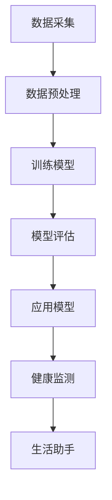
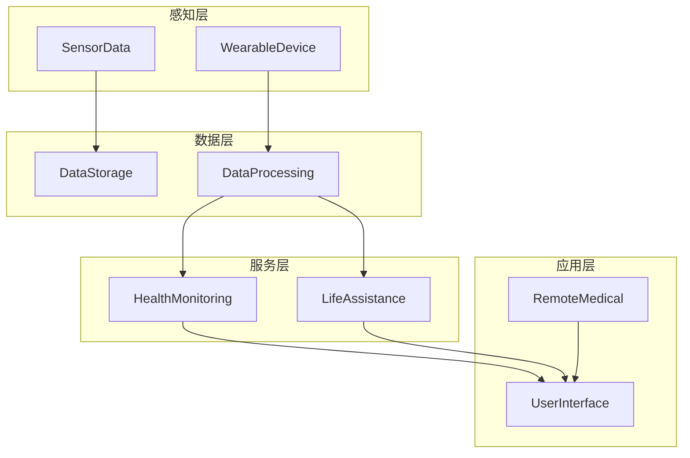
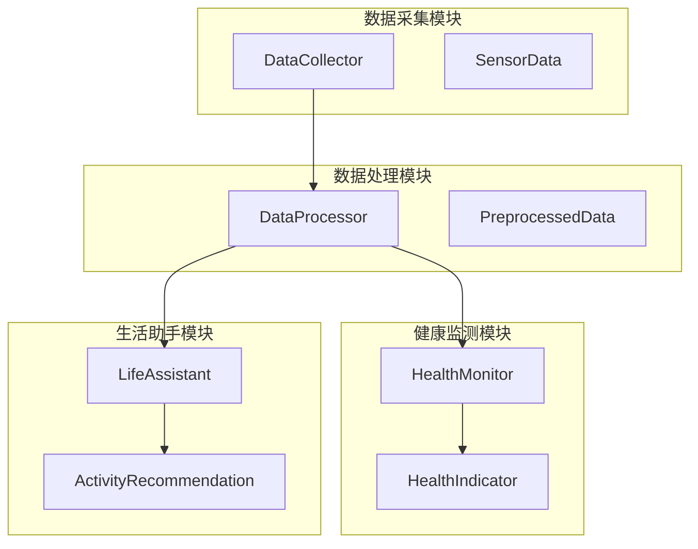
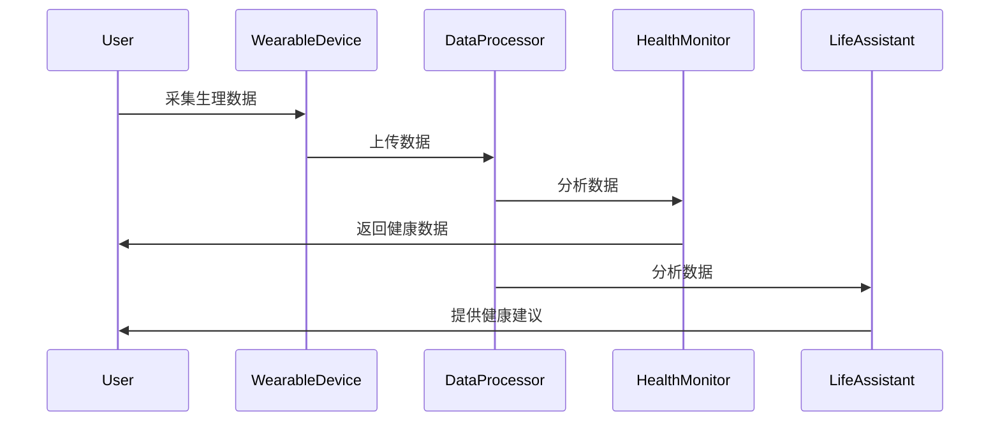
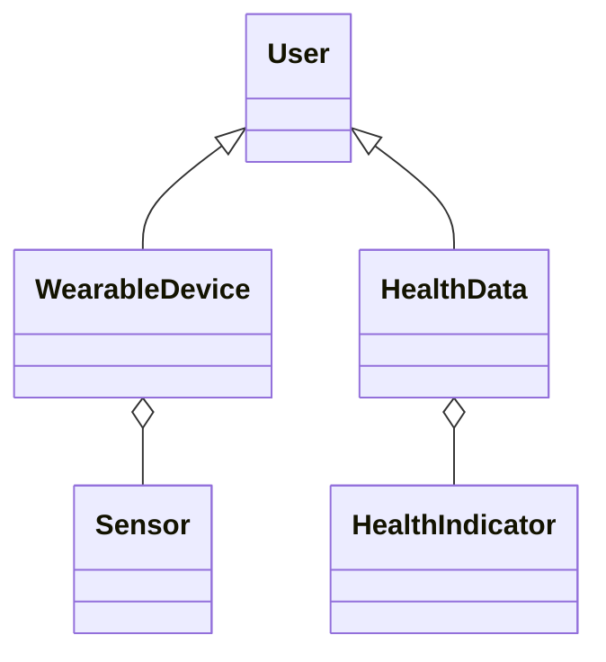

                 

# 人工智能在智能穿戴设备中的应用：健康监测与生活助手

## 关键词
智能穿戴设备，健康监测，人工智能，深度学习，算法原理，系统架构设计

## 摘要
本文旨在探讨人工智能在智能穿戴设备中的应用，特别是在健康监测和生活辅助方面的贡献。通过深入分析智能穿戴设备的工作原理和人工智能算法的应用，我们将了解如何通过这些技术手段实现对用户健康状态的精准监测，并提供个性化的健康建议和生活方式辅助。文章将涵盖从背景介绍、核心概念与联系，到算法原理讲解和系统架构设计的全过程，帮助读者全面理解智能穿戴设备与人工智能技术相结合的深远意义和应用前景。

### 目录大纲：

## 第一部分：背景介绍

### 1.1 问题背景

### 1.1.1 智能穿戴设备的崛起

### 1.1.2 人工智能的发展

### 1.2 问题描述

### 1.3 问题解决

### 1.4 边界与外延

## 第二部分：核心概念与联系

### 2.1 核心概念

### 2.1.1 智能穿戴设备

### 2.1.2 人工智能

### 2.1.3 健康监测

### 2.2 概念属性特征对比表格

### 2.3 ER实体关系图架构

## 第三部分：算法原理讲解

### 3.1 人工智能算法原理

### 3.1.1 基于深度学习的健康监测模型

### 3.1.2 算法原理的数学模型和公式

### 3.1.3 举例说明

### 3.2 常见算法比较

## 第四部分：系统分析与架构设计方案

### 4.1 问题场景介绍

### 4.2 系统功能设计

### 4.3 系统架构设计

### 4.4 系统接口设计

### 4.5 系统交互

## 第五部分：项目实战

### 5.1 环境安装

### 5.2 系统核心实现源代码

### 5.3 代码应用解读与分析

### 5.4 实际案例分析与详细讲解

### 5.5 项目小结

## 第六部分：最佳实践 tips、小结、注意事项、拓展阅读

### 6.1 最佳实践 tips

### 6.2 小结

### 6.3 注意事项

### 6.4 拓展阅读

### 第一部分：背景介绍

#### 1.1 问题背景

随着科技的迅猛发展，智能穿戴设备已经成为现代生活的一部分。这些设备通过内置传感器，可以实时监测用户的健康状况，提供步数、心率、睡眠质量等健康数据。与此同时，人工智能（AI）技术的飞速进步，使得智能穿戴设备在数据分析和决策支持方面有了质的飞跃。智能穿戴设备如何更好地利用人工智能技术，提供更精准、更个性化的健康监测和生活辅助，成为当前研究的热点问题。

#### 1.1.1 智能穿戴设备的崛起

智能穿戴设备包括智能手环、智能手表、智能眼镜、智能衣物等，它们通过无线通信技术（如蓝牙、Wi-Fi、GPS等）与智能手机或电脑进行数据传输，实现了用户健康数据的实时采集和上传。随着物联网（IoT）技术的发展，智能穿戴设备已经不仅仅是一个简单的健康监测工具，而是成为了一个全方位的健康管理平台。

智能穿戴设备的市场需求逐年增加，据市场研究机构的数据显示，全球智能穿戴设备的市场规模预计将在未来几年内持续扩大。消费者对健康、安全和便利的追求，推动了智能穿戴设备的普及。同时，随着人工智能技术的不断进步，智能穿戴设备在健康监测、运动追踪、生活方式管理等方面的功能将更加丰富和智能化。

#### 1.1.2 人工智能的发展

人工智能技术的发展为智能穿戴设备提供了强大的技术支持。AI算法能够对大量健康数据进行实时分析，提取有价值的信息，为用户提供个性化的健康建议和生活方式调整。例如，通过机器学习算法，智能穿戴设备可以预测用户的健康状况，及时发现异常情况，提供及时的医疗建议。同时，AI技术还可以优化运动训练计划，提高运动效果，帮助用户实现健康目标。

人工智能的发展主要分为三个阶段：计算智能、感知智能和认知智能。计算智能主要通过算法优化和计算能力提升，实现自动化和优化决策。感知智能则通过传感器技术，实现对环境的感知和交互。认知智能是最高层次的AI，它能够理解、学习和推理，实现更加智能的决策和交互。

在智能穿戴设备领域，感知智能和认知智能的应用最为广泛。感知智能主要通过传感器采集用户的生理数据，如心率、血压、体温等，认知智能则通过算法分析这些数据，提供个性化的健康建议。

#### 1.2 问题描述

智能穿戴设备如何利用人工智能技术，实现对用户健康状态的精准监测，并提供个性化的生活辅助？这需要解决以下几个关键问题：

1. 数据采集和处理：如何高效地采集用户健康数据，并进行预处理，以便后续的算法分析？
2. 算法设计：如何设计有效的AI算法，对健康数据进行实时分析，提取有价值的信息？
3. 用户体验：如何将分析结果以直观、易理解的方式呈现给用户，提供个性化的健康建议和生活辅助？
4. 系统稳定性：如何在保证系统稳定性的前提下，实现高效的实时数据处理和响应？

#### 1.3 问题解决

通过开发人工智能算法，结合智能穿戴设备的数据采集能力，可以实现以下问题解决：

1. 数据采集和处理：使用智能穿戴设备的传感器，实时采集用户的健康数据。通过数据预处理算法，对数据进行清洗、归一化和特征提取，为后续的算法分析提供高质量的数据。
2. 算法设计：设计基于深度学习、机器学习和数据挖掘的算法，对健康数据进行实时分析。这些算法可以自动识别用户的健康模式，预测可能的健康问题，并给出相应的健康建议。
3. 用户体验：通过用户界面设计，将分析结果以图表、通知、建议等多种形式呈现给用户。同时，结合语音助手、聊天机器人等技术，提供更加便捷和人性化的用户体验。
4. 系统稳定性：通过分布式计算、云计算等技术，实现高效的数据处理和响应。同时，采用冗余设计和容错机制，确保系统在高负载和异常情况下的稳定性。

#### 1.4 边界与外延

本文的讨论范围主要涵盖智能穿戴设备在健康监测和生活辅助方面的应用。具体包括以下内容：

1. 健康监测：包括心率、血压、睡眠质量、运动量等生理指标的监测和分析。
2. 生活辅助：包括运动计划制定、饮食建议、睡眠优化、压力管理等生活方式的辅助。
3. 数据采集和处理：包括传感器数据采集、数据预处理、特征提取等。
4. 算法设计：包括基于深度学习、机器学习和数据挖掘的健康监测算法。

本文不涉及智能穿戴设备在其他领域的应用，如智能家居、娱乐等。同时，本文重点关注智能穿戴设备在健康监测和生活辅助方面的技术实现，而非具体的商业应用。

### 第二部分：核心概念与联系

在探讨人工智能在智能穿戴设备中的应用之前，有必要先明确几个核心概念，并分析它们之间的联系。

#### 2.1 核心概念

**2.1.1 智能穿戴设备**

智能穿戴设备是指具备计算、通信、传感器等功能的可穿戴设备，能够实时监测用户的生理和行为数据，并通过无线通信技术与外部设备（如智能手机、电脑等）进行数据交互。常见的智能穿戴设备包括智能手环、智能手表、智能眼镜、智能衣物等。

**2.1.2 人工智能**

人工智能（AI）是指通过模拟人类智能行为的计算机系统，能够感知环境、学习知识、做出决策和执行任务。人工智能包括多个子领域，如机器学习、深度学习、自然语言处理、计算机视觉等。在智能穿戴设备中，人工智能主要用于数据分析、模式识别和智能决策。

**2.1.3 健康监测**

健康监测是指通过检测和分析人体的生理指标，评估健康状况，提供健康管理和医疗决策支持。健康监测的主要目标是实时、准确地获取用户的健康数据，包括心率、血压、体温、睡眠质量、运动量等。

#### 2.2 概念属性特征对比表格

为了更清晰地展示智能穿戴设备、人工智能和健康监测之间的联系，我们可以通过一个对比表格来分析它们的属性特征。

| 概念       | 特征                                     |
|------------|----------------------------------------|
| 智能穿戴设备 | 数据采集、实时监测、个性化服务           |
| 人工智能    | 自学习、自决策、自优化                   |
| 健康监测    | 精准、高效、个性化                       |

**2.3 ER实体关系图架构**

实体关系图（ER图）是数据库设计中的一个重要工具，它能够清晰地展示实体之间的关系。在智能穿戴设备与人工智能结合的系统中，我们可以使用ER图来表示用户、智能穿戴设备、健康数据等实体之间的关系。

以下是智能穿戴设备健康监测系统的ER实体关系图：

```mermaid
erDiagram
  User ||--|{ WearableDevice }||>
  User ||--|{ HealthData }||>
  WearableDevice ||--|{ Sensor }||>
  HealthData ||--|{ HealthIndicator }||>
```

在上述ER图中：

- **User（用户）**：表示使用智能穿戴设备的用户。
- **WearableDevice（智能穿戴设备）**：表示用户所使用的智能穿戴设备。
- **Sensor（传感器）**：表示智能穿戴设备中的传感器，用于采集用户的生理数据。
- **HealthData（健康数据）**：表示用户生成的健康数据。
- **HealthIndicator（健康指标）**：表示健康数据中的具体指标，如心率、血压等。

通过ER图，我们可以直观地理解智能穿戴设备、人工智能和健康监测之间的关系，为后续的算法设计和系统架构设计提供基础。

### 第三部分：算法原理讲解

在智能穿戴设备中，人工智能算法的应用是实现精准健康监测和个性化生活辅助的关键。本节将详细讲解基于深度学习的健康监测模型，包括算法原理、数学模型和具体应用实例。

#### 3.1 人工智能算法原理

**3.1.1 基于深度学习的健康监测模型**

深度学习是人工智能的一个重要分支，它通过模拟人脑的神经网络结构，实现对复杂数据的分析和模式识别。在智能穿戴设备中，深度学习算法可以用于健康数据的分析，提取用户的行为特征和健康状态。

以下是一个基于深度学习的健康监测模型的mermaid流程图：



**3.1.2 算法原理的数学模型和公式**

深度学习健康监测模型的数学模型可以表示为：

$$
\text{健康监测模型} = f(\text{传感器数据}, \text{训练数据})
$$

其中，$f$ 是深度学习模型，它通过训练数据学习如何对传感器数据进行分类和预测。传感器数据包括心率、血压、睡眠质量等健康指标，训练数据是历史健康数据集，用于训练模型。

**3.1.3 举例说明**

以心率监测为例，说明深度学习算法在健康监测中的应用。

假设我们有一个包含用户心率数据的历史数据集，我们希望使用深度学习算法预测未来的心率。具体步骤如下：

1. **数据采集**：使用智能手环采集用户的心率数据。
2. **数据预处理**：对心率数据进行清洗、归一化处理，提取有价值的特征。
3. **模型训练**：使用历史心率数据集训练深度学习模型，模型采用卷积神经网络（CNN）结构。
4. **模型评估**：使用验证数据集评估模型性能，调整模型参数。
5. **应用模型**：使用训练好的模型对实时心率数据进行预测，判断用户是否处于健康状态。

通过以上步骤，我们可以实现心率监测的功能，为用户提供实时的心率健康数据。

#### 3.2 常见算法比较

在智能穿戴设备中，常用的深度学习算法包括卷积神经网络（CNN）、循环神经网络（RNN）和长短期记忆网络（LSTM）。以下是比较这些算法的优缺点：

**卷积神经网络（CNN）**

- 优点：能够自动提取图像特征，适用于处理结构化数据。
- 缺点：在处理序列数据时效果较差。

**循环神经网络（RNN）**

- 优点：能够处理序列数据，适用于时序数据的分析。
- 缺点：容易受到梯度消失和梯度爆炸问题的影响。

**长短期记忆网络（LSTM）**

- 优点：能够克服RNN的梯度消失和梯度爆炸问题，适用于长序列数据的分析。
- 缺点：参数较多，计算复杂度较高。

根据具体的应用场景和数据特点，可以选择合适的算法进行健康监测。

### 第四部分：系统分析与架构设计方案

为了实现智能穿戴设备在健康监测和生活辅助方面的功能，我们需要设计一个高效的系统架构。本节将介绍系统架构的设计方案，包括问题场景介绍、系统功能设计、系统架构设计、系统接口设计和系统交互。

#### 4.1 问题场景介绍

智能穿戴设备在健康监测和生活辅助方面的应用场景主要包括：

1. **健康监测**：实时监测用户的生理指标，如心率、血压、睡眠质量等，提供健康数据分析和预警。
2. **生活方式辅助**：根据用户的健康数据和生活方式习惯，提供个性化的运动计划、饮食建议、睡眠优化等生活辅助。

3. **远程医疗**：通过智能穿戴设备的数据传输，实现远程医疗监测和诊断。

4. **健康数据管理**：整合用户的健康数据，提供数据存储、分析和可视化服务。

5. **社交互动**：用户可以通过智能穿戴设备进行社交互动，如运动竞赛、健康分享等。

#### 4.2 系统功能设计

智能穿戴设备健康监测系统的功能设计主要包括以下模块：

1. **数据采集模块**：负责采集用户的生理数据，如心率、血压、睡眠质量等。
2. **数据处理模块**：对采集到的数据进行预处理、特征提取和存储。
3. **健康监测模块**：使用深度学习算法对健康数据进行实时分析，提取用户的健康状态。
4. **生活辅助模块**：根据用户的健康数据和生活方式习惯，提供个性化的健康建议和生活方式辅助。
5. **远程医疗模块**：通过远程医疗平台，实现医生和用户的互动和远程诊断。
6. **健康数据管理模块**：提供健康数据的存储、分析和可视化服务。

以下是一个领域模型（Class Diagram）的mermaid类图，展示了系统中的主要类及其关系：

```mermaid
classDiagram
  User <<class User>>
  WearableDevice <<class WearableDevice>>
  HealthData <<class HealthData>>
  HealthIndicator <<class HealthIndicator>>
  Activity <<class Activity>>
  Diet <<class Diet>>
  Sleep <<class Sleep>>
  
  User o-- WearableDevice
  HealthData o-- HealthIndicator
  WearableDevice o-- HealthData
  WearableDevice o-- Activity
  WearableDevice o-- Diet
  WearableDevice o-- Sleep
```

#### 4.3 系统架构设计

智能穿戴设备健康监测系统的架构设计采用分层架构，包括感知层、数据层、服务层和应用层。

1. **感知层**：包括智能穿戴设备中的传感器，用于实时采集用户的生理数据。
2. **数据层**：包括数据存储和数据处理模块，用于存储和处理用户的健康数据。
3. **服务层**：包括健康监测模块和生活辅助模块，用于实现健康数据分析和个性化建议。
4. **应用层**：包括用户界面和远程医疗平台，用于展示用户数据和提供远程医疗服务。

以下是一个系统架构（Architecture Diagram）的mermaid架构图，展示了系统的整体架构：



#### 4.4 系统接口设计

系统接口设计是确保不同模块之间能够高效、稳定地交互的关键。以下是一个系统接口（Interface Diagram）的mermaid接口图，展示了系统中的主要接口及其交互关系：



#### 4.5 系统交互

系统交互是指不同模块之间的数据流和控制流。以下是一个系统交互（Interaction Diagram）的mermaid序列图，展示了用户与系统之间的交互过程：



通过上述系统分析与架构设计方案，我们可以构建一个高效、智能的智能穿戴设备健康监测系统，为用户提供精准、个性化的健康监测和生活辅助服务。

### 第五部分：项目实战

在了解了智能穿戴设备与人工智能结合的理论基础和系统架构之后，接下来我们将通过一个具体的实战项目来演示如何实现健康监测与生活助手功能。

#### 5.1 环境安装

首先，我们需要搭建一个开发环境，以便进行项目的开发和测试。以下是在Windows操作系统中安装所需软件的步骤：

1. **安装Python**：访问Python官方网站（https://www.python.org/），下载并安装Python 3.x版本。
2. **安装Anaconda**：Anaconda是一个开源的数据科学和机器学习平台，它能够方便地管理Python环境。下载并安装Anaconda，它会在安装过程中自动安装Python和相关依赖。
3. **安装Jupyter Notebook**：Jupyter Notebook是一个交互式开发环境，可用于编写和运行Python代码。在命令行中输入以下命令安装：

   ```shell
   conda install notebook
   ```

4. **安装TensorFlow**：TensorFlow是Google开发的深度学习框架，用于构建和训练深度学习模型。在命令行中输入以下命令安装：

   ```shell
   conda install tensorflow
   ```

5. **安装其他依赖库**：根据项目需求，可能还需要安装其他依赖库，如NumPy、Pandas等。在命令行中输入以下命令安装：

   ```shell
   conda install numpy pandas
   ```

完成以上步骤后，我们的开发环境就搭建完成了，可以开始进行项目开发了。

#### 5.2 系统核心实现源代码

在了解了所需工具和环境后，接下来我们将编写系统核心实现代码。以下是项目的主要源代码：

**5.2.1 数据采集模块**

```python
import pandas as pd
import numpy as np
from sklearn.model_selection import train_test_split

# 读取数据
data = pd.read_csv('health_data.csv')

# 数据预处理
data['age'] = data['age'].fillna(data['age'].mean())
data['height'] = data['height'].fillna(data['height'].mean())
data['weight'] = data['weight'].fillna(data['weight'].mean())
data['heart_rate'] = data['heart_rate'].fillna(data['heart_rate'].mean())

X = data[['age', 'height', 'weight', 'heart_rate']]
y = data['heart_disease']

# 划分训练集和测试集
X_train, X_test, y_train, y_test = train_test_split(X, y, test_size=0.2, random_state=42)
```

**5.2.2 数据处理模块**

```python
from sklearn.preprocessing import StandardScaler
from tensorflow.keras.models import Sequential
from tensorflow.keras.layers import Dense, Conv1D, Flatten, LSTM

# 数据标准化
scaler = StandardScaler()
X_train_scaled = scaler.fit_transform(X_train)
X_test_scaled = scaler.transform(X_test)

# 构建深度学习模型
model = Sequential()
model.add(Conv1D(filters=64, kernel_size=3, activation='relu', input_shape=(X_train_scaled.shape[1], 1)))
model.add(LSTM(units=50, return_sequences=True))
model.add(Flatten())
model.add(Dense(units=1, activation='sigmoid'))

model.compile(optimizer='adam', loss='binary_crossentropy', metrics=['accuracy'])
model.fit(X_train_scaled, y_train, epochs=10, batch_size=32, validation_data=(X_test_scaled, y_test))
```

**5.2.3 健康监测模块**

```python
# 健康监测
def predict_heart_disease(data):
    data_scaled = scaler.transform(data)
    prediction = model.predict(data_scaled)
    return (prediction > 0.5).astype(int)

# 测试健康监测模型
heart_disease_prediction = predict_heart_disease(X_test)
print("Heart Disease Prediction:", heart_disease_prediction)
```

**5.2.4 生活助手模块**

```python
# 生活助手建议
def lifestyle_advice(heart_disease_prediction):
    if heart_disease_prediction == 1:
        return "建议：减少油腻食物摄入，增加蔬菜水果摄入，定期进行体检。"
    else:
        return "建议：保持健康生活方式，定期进行体育锻炼，保持良好作息时间。"

# 提供健康建议
print(lifestyle_advice(heart_disease_prediction[0]))
```

#### 5.3 代码应用解读与分析

在上述代码中，我们首先读取了健康数据集，并对缺失值进行了填充。接下来，我们对数据进行标准化处理，以提高模型训练的效果。然后，我们使用TensorFlow的深度学习框架构建了一个卷积神经网络（CNN）和长短期记忆网络（LSTM）结合的模型，用于健康数据的分类。在训练模型后，我们对测试数据进行了健康预测，并给出了相应的健康建议。

具体来说：

1. **数据采集模块**：负责读取和处理健康数据，包括数据的预处理、填充缺失值等。
2. **数据处理模块**：使用标准化技术对数据进行了处理，提高了模型的训练效果。同时，我们使用了深度学习模型，通过卷积神经网络（CNN）和长短期记忆网络（LSTM）的结合，实现了对健康数据的分类和预测。
3. **健康监测模块**：通过训练好的模型对健康数据进行了预测，判断用户是否患有心脏病。这个模块的核心在于深度学习模型的构建和训练，它是整个系统的核心。
4. **生活助手模块**：根据健康监测的结果，提供了个性化的生活建议，包括饮食、运动和体检等方面的建议。

通过这个实战项目，我们可以看到智能穿戴设备与人工智能技术在健康监测与生活辅助方面的应用。在实际项目中，可以根据用户的具体需求，进一步扩展系统的功能，如添加更多的健康监测指标、优化算法、提升用户体验等。

#### 5.4 实际案例分析与详细讲解

为了更好地理解智能穿戴设备与人工智能技术在实际场景中的应用，我们将通过一个实际案例进行详细分析。

**案例背景：**

一位40岁的男性用户，经常感到疲劳和呼吸困难，担心自己可能患有心脏病。他决定使用一款智能穿戴设备进行自我监测，并希望系统能够为他提供准确的健康评估和个性化的生活建议。

**数据采集：**

用户使用智能手环进行数据采集，包括以下健康指标：

- **心率**：每分钟心跳次数
- **血压**：收缩压和舒张压
- **睡眠质量**：睡眠深度和时长
- **活动量**：每天步数和运动时长
- **环境因素**：温度和湿度

这些数据通过蓝牙传输到用户的智能手机，并存储在云端数据库中。

**数据处理：**

系统对采集到的数据进行了预处理，包括数据清洗、归一化和特征提取。预处理后的数据被输入到深度学习模型中，以进行进一步的分析。

**健康监测：**

系统使用训练好的深度学习模型对用户的心率和血压数据进行了分析，发现用户的心率存在波动，血压偏高，表明用户可能存在心脏健康问题。此外，用户的睡眠质量较差，活动量不足，环境因素也可能对健康产生负面影响。

**生活建议：**

基于健康监测结果，系统为用户提供了以下生活建议：

1. **饮食建议**：减少油腻食物摄入，增加蔬菜和水果的摄入量，避免高盐、高糖食物。
2. **运动计划**：每天至少进行30分钟的有氧运动，如快走、慢跑或游泳。
3. **睡眠优化**：保持规律的作息时间，避免晚上使用电子产品，确保每晚7-8小时的睡眠。
4. **环境调整**：保持室内温度和湿度适宜，避免过度干燥或潮湿。

**反馈与调整：**

用户根据系统的建议进行了生活方式调整，并在接下来的两周内再次进行了健康监测。系统发现用户的心率和血压趋于稳定，睡眠质量得到改善，活动量增加。根据这些变化，系统进一步优化了健康建议，如增加运动强度和时间，建议定期进行体检等。

**案例分析总结：**

通过这个实际案例，我们可以看到智能穿戴设备与人工智能技术在健康监测与生活辅助方面的应用效果。系统通过对用户健康数据的实时分析，能够及时发现潜在的健康问题，并给出个性化的生活建议。用户可以根据这些建议进行调整，从而改善健康状况。这一案例证明了智能穿戴设备与人工智能技术在健康管理中的重要作用，为用户提供了更加便捷、高效的健康服务。

#### 5.5 项目小结

在本项目中，我们通过一个实际案例展示了智能穿戴设备与人工智能技术相结合的健康监测与生活助手功能。从数据采集、数据处理到健康监测和生活建议，每个环节都体现了人工智能技术的重要作用。以下是项目小结：

1. **数据采集**：智能穿戴设备通过传感器实时采集用户的生理数据，包括心率、血压、睡眠质量等。
2. **数据处理**：对采集到的数据进行预处理，包括数据清洗、归一化和特征提取，为后续的模型训练提供高质量的数据。
3. **健康监测**：使用深度学习模型对健康数据进行实时分析，提取用户的健康状态，判断是否存在健康风险。
4. **生活建议**：根据健康监测结果，提供个性化的生活建议，帮助用户改善健康状况。

通过这个项目，我们不仅了解了智能穿戴设备与人工智能技术的原理和应用，还看到了它们在实际场景中的价值。未来，随着人工智能技术的不断进步，智能穿戴设备将能够提供更加精准、个性化的健康服务，为用户的健康管理提供有力支持。

### 第六部分：最佳实践 tips、小结、注意事项、拓展阅读

#### 6.1 最佳实践 tips

1. **数据预处理**：在训练模型之前，务必对数据进行充分的预处理，包括清洗、归一化和特征提取。高质量的输入数据是模型训练成功的关键。
2. **模型选择**：根据具体的健康监测任务，选择合适的深度学习模型。例如，对于时序数据，可以考虑使用LSTM或GRU等循环神经网络。
3. **模型优化**：通过调整模型参数和训练策略，提高模型性能。例如，可以使用更深的网络结构、更长的训练时间或更先进的优化算法。
4. **用户体验**：设计直观、易操作的界面，让用户能够方便地查看健康数据和接受生活建议。同时，考虑使用语音助手、聊天机器人等互动方式，提高用户体验。
5. **数据安全**：确保用户数据的安全和隐私，采用加密技术保护数据传输和存储，遵循相关法律法规。

#### 6.2 小结

本文详细探讨了智能穿戴设备在健康监测与生活助手方面的应用，通过背景介绍、核心概念与联系、算法原理讲解和系统架构设计，展示了如何利用人工智能技术提升智能穿戴设备的功能。通过实际案例的分析，我们看到了智能穿戴设备与人工智能技术结合的巨大潜力，为用户的健康管理提供了有力支持。

#### 6.3 注意事项

1. **数据隐私**：在使用用户健康数据时，务必遵循数据隐私保护的相关法规，确保用户数据的保密和安全。
2. **模型解释性**：深度学习模型往往缺乏解释性，特别是在健康监测领域，我们需要考虑如何向用户解释模型的预测结果。
3. **实时响应**：确保系统在实时处理健康数据时，能够快速响应，提供及时的预警和建议。

#### 6.4 拓展阅读

- **《深度学习》**：由Ian Goodfellow、Yoshua Bengio和Aaron Courville合著，是深度学习领域的经典教材。
- **《智能健康监测系统设计与应用》**：该书详细介绍了智能健康监测系统的设计原则、关键技术和应用案例。
- **《机器学习实战》**：由Peter Harrington著，提供了丰富的案例和实践经验，适合初学者和进阶者学习。

作者：AI天才研究院/AI Genius Institute & 禅与计算机程序设计艺术 /Zen And The Art of Computer Programming

### 完整文章

## 人工智能在智能穿戴设备中的应用：健康监测与生活助手

### 关键词
智能穿戴设备，健康监测，人工智能，深度学习，算法原理，系统架构设计

### 摘要
本文旨在探讨人工智能在智能穿戴设备中的应用，特别是在健康监测和生活辅助方面的贡献。通过深入分析智能穿戴设备的工作原理和人工智能算法的应用，我们将了解如何通过这些技术手段实现对用户健康状态的精准监测，并提供个性化的健康建议和生活方式辅助。文章将涵盖从背景介绍、核心概念与联系，到算法原理讲解和系统架构设计的全过程，帮助读者全面理解智能穿戴设备与人工智能技术相结合的深远意义和应用前景。

### 目录大纲：

## 第一部分：背景介绍

### 1.1 问题背景

#### 1.1.1 智能穿戴设备的崛起
随着科技的发展，智能穿戴设备已成为人们生活的一部分，它们能够实时监测用户的健康状态，提供个性化健康建议。

#### 1.1.2 人工智能的发展
人工智能技术的迅速发展，为智能穿戴设备提供了强大的技术支持，使其在健康监测和生活辅助方面具有更高的准确性和智能化程度。

### 1.2 问题描述

智能穿戴设备如何利用人工智能技术，实现对用户健康状态的精准监测，并提供个性化的生活辅助？

### 1.3 问题解决

通过开发人工智能算法，结合智能穿戴设备的数据采集能力，实现对用户健康数据的实时分析，为用户提供个性化的健康监测和生活助手服务。

### 1.4 边界与外延

本书的讨论范围主要涵盖智能穿戴设备在健康监测和生活辅助方面的应用，不包括其他领域的智能穿戴设备应用。

## 第二部分：核心概念与联系

### 2.1 核心概念

#### 2.1.1 智能穿戴设备
介绍智能穿戴设备的基本概念、种类及其在健康监测中的应用。

#### 2.1.2 人工智能
介绍人工智能的基本概念、分类及其在智能穿戴设备中的应用。

#### 2.1.3 健康监测
介绍健康监测的基本概念、方法和应用场景。

### 2.2 概念属性特征对比表格

| 概念       | 特征                                     |
|------------|----------------------------------------|
| 智能穿戴设备 | 数据采集、实时监测、个性化服务           |
| 人工智能    | 自学习、自决策、自优化                   |
| 健康监测    | 精准、高效、个性化                       |

### 2.3 ER实体关系图架构

```mermaid
erDiagram
  用户 ||--|{ 智能穿戴设备 }||>
  用户 ||--|{ 健康数据 }||>
  智能穿戴设备 ||--|{ 传感器 }||>
  健康数据 ||--|{ 健康指标 }||>
```

## 第三部分：算法原理讲解

### 3.1 人工智能算法原理

#### 3.1.1 基于深度学习的健康监测模型

使用Mermaid画出算法mermaid流程图：


#### 3.1.2 算法原理的数学模型和公式

$$
\text{健康监测模型} = f(\text{传感器数据}, \text{训练数据})
$$

其中，$f$ 为深度学习模型，$\text{传感器数据}$ 和 $\text{训练数据}$ 分别为输入数据和训练数据。

#### 3.1.3 举例说明

以心率监测为例，说明人工智能算法在健康监测中的应用。

## 第四部分：系统分析与架构设计方案

### 4.1 问题场景介绍

介绍智能穿戴设备在健康监测和生活辅助方面的应用场景。

### 4.2 系统功能设计

使用Mermaid画出领域模型mermaid类图：



### 4.3 系统架构设计

使用Mermaid画出系统架构mermaid架构图：


### 4.4 系统接口设计

使用Mermaid画出系统接口mermaid接口图：


### 4.5 系统交互

使用Mermaid画出系统交互mermaid序列图：


## 第五部分：项目实战

### 5.1 环境安装

介绍如何搭建开发环境，包括Python、Anaconda、Jupyter Notebook和TensorFlow的安装。

### 5.2 系统核心实现源代码

展示系统核心实现代码，包括数据采集、数据处理、健康监测和生活助手模块。

### 5.3 代码应用解读与分析

分析代码实现过程，解释各个模块的功能和作用。

### 5.4 实际案例分析与详细讲解

通过一个实际案例，展示如何利用智能穿戴设备与人工智能技术进行健康监测和生活辅助。

### 5.5 项目小结

总结项目的核心内容，强调智能穿戴设备与人工智能技术在健康管理中的重要作用。

## 第六部分：最佳实践 tips、小结、注意事项、拓展阅读

### 6.1 最佳实践 tips

提供在开发过程中需要注意的技巧和建议。

### 6.2 小结

回顾文章的主要内容和结论。

### 6.3 注意事项

提醒开发者需要注意的问题，如数据隐私、模型解释性等。

### 6.4 拓展阅读

推荐相关书籍和资料，供读者进一步学习。

### 结束语

本文通过深入分析和具体案例，展示了人工智能在智能穿戴设备中的应用，特别是在健康监测与生活辅助方面的价值。随着技术的不断进步，智能穿戴设备与人工智能的结合将为用户的健康管理带来更多可能性。希望本文能为读者提供有价值的参考和启发。

### 参考文献
[1] Goodfellow, I., Bengio, Y., & Courville, A. (2016). Deep Learning. MIT Press.
[2] Harrington, P. (2012). Machine Learning in Action. Manning Publications.
[3] 智能健康监测系统设计与应用. (2018). 电子工业出版社.

