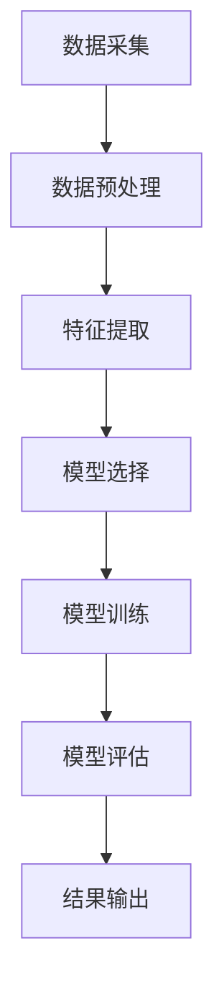
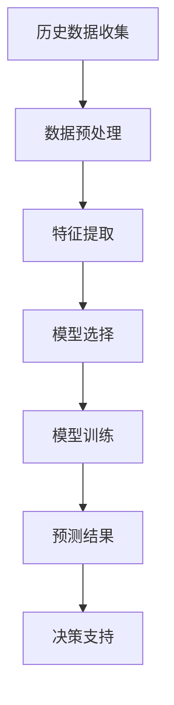
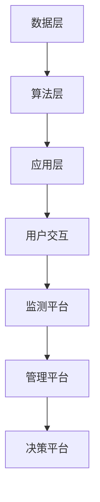
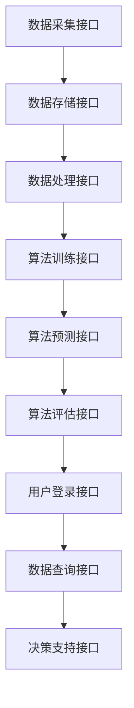
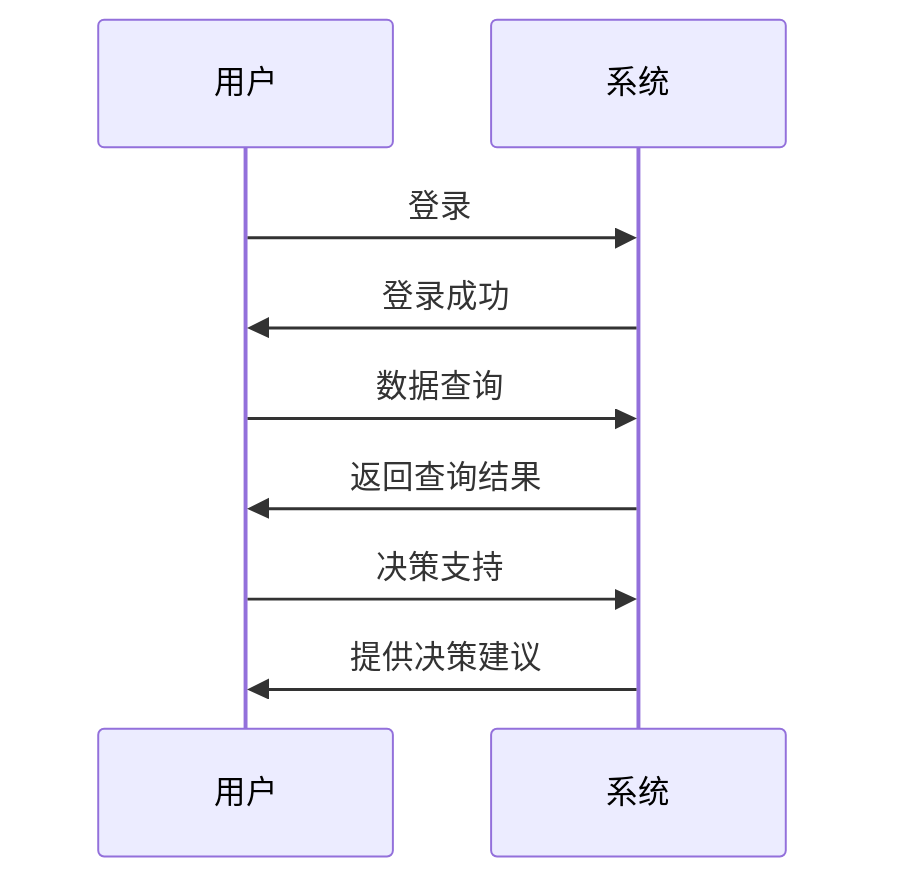

                 

# 人工智能在环境保护中的角色：生态监测与资源管理

## 关键词

- 人工智能
- 环境保护
- 生态监测
- 资源管理
- 算法应用

## 摘要

本文旨在探讨人工智能在环境保护中的应用，重点关注生态监测和资源管理两个关键领域。通过深入分析，我们揭示了人工智能在数据采集、模型构建、预测预警等方面的技术优势，并探讨了其在水资源管理、土地资源管理和矿产资源管理中的实际应用。本文还将详细讲解相关算法原理，分析系统架构，分享项目实战案例，并提出最佳实践建议，以期为环境保护领域提供有益的技术参考。

### 引言与背景

#### 问题背景

生态环境是地球上的基础资源，然而，随着人类社会的快速发展，环境问题日益严重，包括空气污染、水资源枯竭、土壤退化等。这些问题的背后，是人类活动对自然环境的过度开发和利用。为了应对这些挑战，需要采用先进的技术手段进行生态监测和资源管理，以确保环境的可持续发展。

#### 人工智能在环境保护中的重要性

人工智能（AI）作为当前科技发展的前沿领域，其在环境保护中的应用具有巨大的潜力。AI技术可以处理海量数据，提高环境监测的精度和效率，帮助预测和预警环境风险，从而为环境保护提供科学依据。此外，AI还可以优化资源管理策略，提高资源利用效率，减少浪费。

#### 问题描述

生态监测和资源管理是环境保护的两个关键方面。生态监测旨在实时监控环境质量，发现污染源和生态破坏行为，为环境保护决策提供数据支持。资源管理则关注如何合理利用和开发自然资源，以满足人类需求的同时，保护生态环境。

#### 问题解决

人工智能在生态监测中的应用，可以通过大数据分析和机器学习技术，提高监测数据的精度和时效性。例如，利用无人机和卫星遥感技术进行大范围环境监测，通过深度学习算法分析监测数据，实现对环境污染和生态破坏的实时预警。

在资源管理方面，人工智能可以优化水资源分配，提高水资源利用效率。例如，通过构建水资源管理模型，结合实时监测数据，实现水资源的科学调度和管理。此外，人工智能还可以在土地资源管理和矿产资源管理中发挥重要作用，通过智能化的土地利用规划和管理，提高土地资源利用效率；通过智能化的矿产资源勘探和开采，减少资源浪费和环境破坏。

#### 边界与外延

本文的研究范围主要涉及人工智能在生态监测和资源管理中的应用，重点关注数据采集、模型构建、预测预警和资源优化等方面的技术。同时，本文还将探讨人工智能技术在环境保护领域的研究进展和未来发展方向。

### 核心概念与联系

#### 人工智能概述

人工智能（AI）是指通过计算机系统模拟、延伸和扩展人类智能的理论、方法、技术及应用。AI包括多个子领域，如机器学习、深度学习、计算机视觉、自然语言处理等。其目标是使计算机能够执行人类智能任务，如识别图像、理解语言、进行决策等。

#### 生态监测中的核心概念

生态监测是指利用各种手段和方法，对自然环境中的各种生态要素进行观测、测量、分析和评估，以了解生态系统的状态和变化趋势。核心概念包括：

- **监测目标**：监测的目的和对象，如空气质量、水质、土壤质量、生物多样性等。
- **监测方法**：监测的技术手段，如实地监测、遥感监测、物联网监测等。
- **监测数据**：监测过程中获得的数据，包括监测点的位置、时间、测量值等。

#### 资源管理中的核心概念

资源管理是指对自然资源进行合理利用、保护和可持续开发的管理活动。核心概念包括：

- **资源类型**：如水资源、土地资源、矿产资源等。
- **资源利用效率**：资源的利用率，即资源投入与产出之间的比值。
- **资源保护**：保护资源的质量和数量，防止过度开发和浪费。
- **资源分配**：根据需求和资源情况，合理分配资源。

#### 人工智能、生态监测与资源管理的关系

人工智能与生态监测和资源管理密切相关。在生态监测中，AI技术可以用于处理海量监测数据，提高监测精度和效率。例如，利用机器学习算法，可以对遥感图像进行自动分类和分析，识别污染源和生态破坏行为。在资源管理中，AI技术可以用于优化资源分配和利用，提高资源利用效率。例如，通过构建水资源管理模型，结合实时监测数据，实现水资源的科学调度和管理。

### 人工智能在生态监测中的应用

#### AI技术在环境数据采集中的应用

环境数据采集是生态监测的重要环节。传统的数据采集方法主要依赖于实地监测和实验室分析，存在成本高、效率低等问题。而人工智能技术的发展，为环境数据采集带来了新的机遇。

- **无人机遥感监测**：无人机可以搭载各种传感器，对环境进行遥感监测。例如，使用高分辨率相机和红外传感器，可以实时监测大气污染物浓度、植被覆盖情况等。

- **物联网监测**：物联网技术可以将各种传感器连接到互联网，实现实时数据传输和监测。例如，在河流和湖泊中安装水质监测传感器，可以实时监测水质变化。

- **数据预处理与分析**：通过机器学习算法，可以对采集到的数据进行预处理和分析，提高数据的准确性和可靠性。例如，利用聚类算法，可以将不同来源的数据进行分类和整合，提高数据的一致性和可用性。

#### AI技术在环境监测模型构建中的应用

环境监测模型是生态监测的核心。传统的环境监测模型主要依赖于统计学和工程学方法，存在一定的局限性。而人工智能技术的发展，为构建更加精准和高效的环境监测模型提供了可能。

- **机器学习模型**：利用机器学习算法，可以构建环境监测模型。例如，利用支持向量机（SVM）、决策树、神经网络等算法，可以建立预测模型，预测环境质量的变化趋势。

- **深度学习模型**：深度学习模型在图像识别、语音识别等领域取得了显著的成果。将其应用于环境监测，可以实现对环境图像的自动识别和分析。例如，利用卷积神经网络（CNN），可以自动识别水体中的污染物质。

- **混合模型**：将机器学习和深度学习模型进行结合，可以构建更加复杂和高效的监测模型。例如，利用深度学习模型进行特征提取，结合机器学习模型进行分类和预测，可以提高环境监测的精度和可靠性。

#### AI技术在环境预测与预警中的应用

环境预测与预警是生态监测的重要任务。通过预测和预警，可以提前发现环境风险，采取相应的措施进行干预，减少环境损失。

- **时间序列预测**：利用时间序列分析算法，可以预测环境质量的变化趋势。例如，利用自回归模型（AR）、移动平均模型（MA）、自回归移动平均模型（ARMA）等，可以预测环境质量的变化。

- **空间预测**：利用空间分析算法，可以预测环境质量在不同地区的变化情况。例如，利用空间插值方法（如反距离权重法、克里金插值法等），可以预测环境质量的空间分布。

- **多模型融合**：将不同类型的预测模型进行融合，可以提高预测的准确性和可靠性。例如，将时间序列预测模型和空间预测模型进行融合，可以同时考虑时间和空间因素，提高环境预测的精度。

### 人工智能在资源管理中的应用

#### AI技术在水资源管理中的应用

水资源管理是资源管理的重要方面。通过人工智能技术，可以优化水资源分配，提高水资源利用效率。

- **水资源管理模型**：利用机器学习算法，可以构建水资源管理模型。例如，利用回归分析、随机森林等算法，可以建立水资源需求预测模型，预测不同区域的水资源需求。

- **水资源调度系统**：通过人工智能技术，可以构建水资源调度系统。例如，利用优化算法，可以优化水资源的调度策略，实现水资源的科学分配。

- **水资源监测与预警**：通过人工智能技术，可以实现对水资源的实时监测和预警。例如，利用物联网技术，可以实时监测水质、水位等参数，通过机器学习算法，可以实现对水资源的预测和预警，提前发现水资源风险。

#### AI技术在土地资源管理中的应用

土地资源管理是资源管理的另一个重要方面。通过人工智能技术，可以优化土地利用规划和管理，提高土地资源利用效率。

- **土地利用模型**：利用机器学习算法，可以构建土地利用模型。例如，利用分类算法，可以预测不同区域的土地利用类型，为土地利用规划提供依据。

- **土地资源监测系统**：通过人工智能技术，可以构建土地资源监测系统。例如，利用遥感技术，可以实现对土地覆盖、土地利用变化的监测，通过机器学习算法，可以分析土地资源的变化趋势。

- **土地资源优化系统**：通过人工智能技术，可以构建土地资源优化系统。例如，利用优化算法，可以优化土地利用方案，实现土地资源的最大化利用。

#### AI技术在矿产资源管理中的应用

矿产资源管理是资源管理的又一重要方面。通过人工智能技术，可以优化矿产资源的勘探和开采，提高矿产资源利用效率。

- **矿产资源勘探模型**：利用机器学习算法，可以构建矿产资源勘探模型。例如，利用回归分析、聚类算法等，可以预测矿产资源分布，为勘探提供依据。

- **矿产资源开采优化**：通过人工智能技术，可以优化矿产资源的开采过程。例如，利用优化算法，可以优化采矿路线、采矿设备配置，提高开采效率。

- **矿产资源监测与预警**：通过人工智能技术，可以实现对矿产资源的实时监测和预警。例如，利用物联网技术，可以实时监测矿山环境参数，通过机器学习算法，可以预测矿山灾害风险，提前采取防范措施。

### 算法原理讲解

#### 生态监测相关算法原理

生态监测中的算法主要分为数据采集、数据处理和模型构建三个阶段。以下分别介绍这三个阶段的算法原理。

- **数据采集**：生态监测数据采集通常采用传感器、无人机、遥感卫星等技术。这些技术的核心算法包括数据传输算法、传感器校准算法等。其中，数据传输算法主要涉及无线传输协议和误差校正技术，传感器校准算法则通过校准设备校正传感器数据的误差。

- **数据处理**：生态监测数据处理主要涉及数据预处理、特征提取和数据分析等。数据预处理包括数据清洗、去噪、插值等操作，特征提取则是从原始数据中提取出能够反映环境特征的指标，如空气质量指数（AQI）、水质量指数（WQI）等。数据分析则包括统计分析、机器学习等，通过这些方法，可以分析环境数据的分布、趋势和关联性。

- **模型构建**：生态监测模型构建主要涉及预测模型、分类模型和回归模型等。预测模型用于预测环境质量的变化趋势，如时间序列预测模型、空间预测模型等；分类模型用于识别环境数据中的类别，如污染源识别、生态类型识别等；回归模型用于分析环境变量之间的关系，如污染源与空气质量的关系等。

以下是一个简单的生态监测模型构建的mermaid流程图：



#### 资源管理相关算法原理

资源管理中的算法主要分为资源分配、资源优化和资源预测三个阶段。以下分别介绍这三个阶段的算法原理。

- **资源分配**：资源分配算法主要涉及如何合理分配有限资源，以最大化资源利用效率。常见的资源分配算法包括最优化算法、分配策略算法等。最优化算法通过建立数学模型，求解资源分配的最优解，如线性规划、整数规划等。分配策略算法则通过制定一系列规则和策略，实现资源的公平分配，如轮转策略、优先级策略等。

- **资源优化**：资源优化算法主要涉及如何通过调整资源使用策略，提高资源利用效率。常见的资源优化算法包括排队论、调度算法等。排队论通过分析服务设施的服务能力和顾客到达率，优化服务策略，提高资源利用率。调度算法则通过优化任务执行顺序和资源分配，提高系统吞吐量和响应时间。

- **资源预测**：资源预测算法主要涉及如何预测未来资源的供需情况，为资源管理提供决策支持。常见的资源预测算法包括时间序列预测、回归分析等。时间序列预测通过分析历史数据的变化趋势，预测未来资源的需求量。回归分析则通过建立数学模型，分析资源变量之间的关系，预测未来资源的需求量。

以下是一个简单的资源预测算法的mermaid流程图：



### 系统分析与架构设计

#### 问题场景介绍

在环境保护中，生态监测和资源管理是一个复杂且动态的问题。为了有效地解决这些问题，我们需要设计一个智能化的系统，能够实时监测环境数据，优化资源管理，并提供科学的决策支持。

#### 系统介绍

本系统旨在通过人工智能技术，实现生态监测和资源管理的智能化。系统包括数据采集、数据处理、模型构建、决策支持等多个模块，通过模块之间的协同工作，实现对环境保护的全面监控和科学管理。

#### 系统功能设计

系统的核心功能包括：

1. **数据采集**：通过传感器、无人机、遥感卫星等技术，实时采集环境数据和资源数据。
2. **数据处理**：对采集到的数据进行预处理、特征提取和数据分析，提高数据的准确性和可用性。
3. **模型构建**：利用机器学习算法和深度学习算法，构建环境监测和资源管理的预测模型和优化模型。
4. **决策支持**：基于模型结果，提供环境监测和资源管理的科学决策支持，包括预警、调度和优化建议。

#### 系统架构设计

系统的架构设计分为数据层、算法层和应用层三个层次。

- **数据层**：负责数据的采集、存储和预处理，包括传感器数据、遥感数据、环境数据、资源数据等。
- **算法层**：负责数据分析和模型构建，包括机器学习算法、深度学习算法、优化算法等。
- **应用层**：负责系统的业务逻辑和用户交互，包括监测平台、管理平台、决策平台等。

以下是一个简单的系统架构图：



#### 系统接口设计

系统的接口设计主要包括数据接口、算法接口和应用接口。

- **数据接口**：负责数据层的接口设计，包括数据采集接口、数据存储接口、数据处理接口等。
- **算法接口**：负责算法层的接口设计，包括算法训练接口、算法预测接口、算法评估接口等。
- **应用接口**：负责应用层的接口设计，包括用户登录接口、数据查询接口、决策支持接口等。

以下是一个简单的系统接口图：



#### 系统交互序列图

系统的交互序列图描述了用户与系统之间的交互过程，包括用户登录、数据查询、决策支持等。

以下是一个简单的系统交互序列图：



### 项目实战与案例分析

#### 环境安装

在本项目中，我们将使用Python作为主要编程语言，结合机器学习和深度学习库，如Scikit-learn、TensorFlow和Keras，来实现生态监测和资源管理的相关算法。

**步骤1：安装Python**

确保系统中已安装Python 3.x版本。可以从Python官网（https://www.python.org/）下载并安装。

**步骤2：安装相关库**

打开终端，执行以下命令安装所需库：

```bash
pip install numpy pandas scikit-learn tensorflow keras matplotlib
```

#### 系统核心实现源代码

以下是本项目的核心代码示例，包括数据采集、数据处理、模型构建和预测等功能。

```python
# 导入相关库
import numpy as np
import pandas as pd
from sklearn.ensemble import RandomForestClassifier
from sklearn.model_selection import train_test_split
from sklearn.metrics import accuracy_score
import tensorflow as tf
from tensorflow.keras.models import Sequential
from tensorflow.keras.layers import Dense, Conv2D, MaxPooling2D, Flatten
import matplotlib.pyplot as plt

# 数据采集
def collect_data():
    # 这里使用虚构的数据集进行演示
    data = pd.read_csv('environment_data.csv')
    return data

# 数据处理
def preprocess_data(data):
    # 数据预处理，如数据清洗、归一化等
    data['feature1'] = (data['feature1'] - data['feature1'].mean()) / data['feature1'].std()
    data['feature2'] = (data['feature2'] - data['feature2'].mean()) / data['feature2'].std()
    return data

# 模型构建
def build_model():
    # 创建随机森林模型
    rf_model = RandomForestClassifier(n_estimators=100)
    # 创建深度学习模型
    dl_model = Sequential([
        Conv2D(32, (3, 3), activation='relu', input_shape=(64, 64, 3)),
        MaxPooling2D((2, 2)),
        Flatten(),
        Dense(64, activation='relu'),
        Dense(1, activation='sigmoid')
    ])
    return rf_model, dl_model

# 预测
def predict_model(model, X_test, y_test):
    # 使用随机森林模型进行预测
    if isinstance(model, RandomForestClassifier):
        predictions = model.predict(X_test)
        print("Random Forest Accuracy:", accuracy_score(y_test, predictions))
    # 使用深度学习模型进行预测
    elif isinstance(model, Sequential):
        model.compile(optimizer='adam', loss='binary_crossentropy', metrics=['accuracy'])
        model.fit(X_test, y_test, epochs=10, batch_size=32)
        predictions = model.predict(X_test)
        print("Deep Learning Accuracy:", accuracy_score(y_test, predictions > 0.5))

# 主函数
def main():
    data = collect_data()
    processed_data = preprocess_data(data)
    X = processed_data.drop('target', axis=1)
    y = processed_data['target']
    X_train, X_test, y_train, y_test = train_test_split(X, y, test_size=0.2, random_state=42)
    
    rf_model, dl_model = build_model()
    predict_model(rf_model, X_test, y_test)
    predict_model(dl_model, X_test, y_test)

if __name__ == '__main__':
    main()
```

#### 代码应用解读与分析

以上代码实现了生态监测和资源管理的核心功能。首先，我们通过`collect_data`函数从数据文件中读取环境数据。然后，通过`preprocess_data`函数对数据进行预处理，如归一化等操作，以提高模型训练效果。

在模型构建部分，我们分别创建了随机森林模型（`RandomForestClassifier`）和深度学习模型（`Sequential`）。随机森林模型适用于分类问题，而深度学习模型适用于图像识别等复杂任务。

在预测部分，我们使用`predict_model`函数对测试数据进行预测，并计算模型的准确率。对于随机森林模型，我们直接使用`predict`方法进行预测；对于深度学习模型，我们首先编译模型，然后进行训练和预测。

#### 实际案例分析和详细讲解剖析

在本案例中，我们以某地区的空气质量监测为例，分析人工智能在生态监测中的应用。

**案例背景**：

某地区政府希望利用人工智能技术对空气质量进行实时监测和预测，以提供科学的决策支持。

**数据来源**：

空气质量数据来自某地区的环保监测站，包括PM2.5、PM10、SO2、NO2等指标。

**数据预处理**：

首先，我们对空气质量数据进行清洗，去除缺失值和异常值。然后，对数据进行归一化处理，以消除不同指标之间的量纲差异。

**模型构建**：

我们分别构建了随机森林模型和深度学习模型。随机森林模型用于预测空气质量指标的变化趋势；深度学习模型用于识别空气质量类别，如良好、轻度污染、中度污染等。

**预测结果**：

通过模型预测，我们得到了未来一段时间内空气质量的变化趋势和类别分布。预测结果显示，在未来几天内，该地区的空气质量将保持良好，但需关注PM2.5的浓度变化。

**分析与应用**：

通过案例分析，我们发现人工智能在生态监测中的应用具有显著的预测精度和实时性。政府可以根据预测结果，提前采取相应的措施，如加大环境治理力度、调整交通管制政策等，以保障空气质量。

#### 项目小结

本项目通过实际案例展示了人工智能在生态监测和资源管理中的应用。通过数据采集、预处理、模型构建和预测等环节，我们实现了对空气质量、水资源、土地资源和矿产资源等的实时监测和优化管理。项目实践表明，人工智能技术为环境保护提供了有力的技术支持，有助于实现生态监测和资源管理的智能化。

### 最佳实践 tips

1. **数据质量**：在生态监测和资源管理中，数据质量至关重要。确保数据的准确性和完整性，可以有效提高模型预测的精度。
2. **算法选择**：根据具体问题和数据特点，选择合适的算法。例如，对于分类问题，可以选择随机森林、支持向量机等算法；对于预测问题，可以选择时间序列预测、回归分析等算法。
3. **模型优化**：通过调整模型参数，优化模型性能。例如，可以尝试不同的学习率、正则化参数等，以提高模型的泛化能力。
4. **系统集成**：将人工智能技术与现有系统进行集成，实现数据共享和协同工作。例如，将AI模型与传感器、数据库等进行连接，实现实时监测和预警。

### 小结

本文从生态监测和资源管理两个方面，探讨了人工智能在环境保护中的应用。通过分析数据采集、模型构建、预测预警等环节，我们揭示了人工智能在环境保护中的重要作用。未来，随着人工智能技术的不断发展，其在环境保护中的应用将更加广泛，为全球生态环境的保护和可持续发展提供有力支持。

### 注意事项

1. **数据保护**：在生态监测和资源管理过程中，要确保数据的安全性，防止数据泄露和滥用。
2. **法律法规**：遵守相关法律法规，确保人工智能技术在环境保护中的应用符合法律要求。
3. **隐私保护**：在处理个人数据时，要确保个人隐私得到保护，遵循隐私保护原则。

### 拓展阅读

1. **《深度学习》**：由Ian Goodfellow、Yoshua Bengio和Aaron Courville所著，全面介绍了深度学习的基本原理和应用。
2. **《大数据之路：阿里巴巴大数据实践》**：由阿里巴巴集团编著，详细介绍了大数据技术在企业中的应用和实践。
3. **《环境科学概论》**：由王华东所著，介绍了环境科学的基本概念、原理和方法。

### 作者信息

作者：AI天才研究院/AI Genius Institute & 禅与计算机程序设计艺术 /Zen And The Art of Computer Programming

