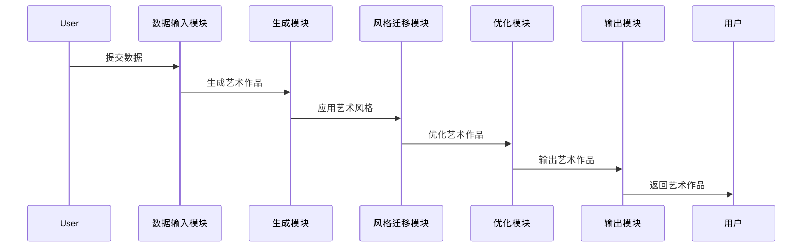
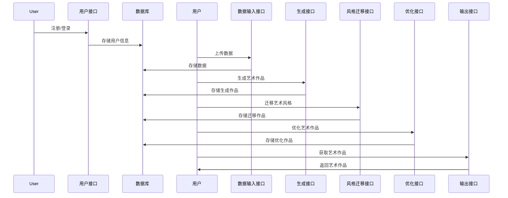
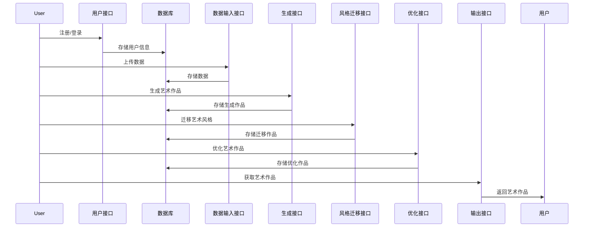

                 

### 文章标题

《人工智能在艺术创作中的应用：新的艺术形式与表达》

### 关键词

- 人工智能
- 艺术创作
- 生成对抗网络（GAN）
- 深度学习
- 图像生成
- 艺术风格迁移

### 摘要

本文深入探讨了人工智能在艺术创作中的应用，介绍了其背后的基本概念和原理，并通过具体的算法如生成对抗网络（GAN）和深度学习，详细讲解了人工智能如何改变传统的艺术创作形式。文章还分析了人工智能在艺术创作中的系统架构设计和实战应用案例，探讨了其未来发展外延，为读者提供了一个全面而深入的视角。

### 目录大纲

# 《人工智能在艺术创作中的应用：新的艺术形式与表达》

## 第一部分：背景介绍

## 第1章：人工智能与艺术创作的融合

### 1.1 人工智能在艺术创作中的问题背景

#### 1.1.1 问题的提出

#### 1.1.2 人工智能在艺术创作中的潜在作用

#### 1.1.3 研究的目的与意义

### 1.2 人工智能在艺术创作中的概念与定义

#### 1.2.1 人工智能的基本概念

#### 1.2.2 艺术创作的基本概念

#### 1.2.3 人工智能与艺术创作融合的概念与内涵

### 1.3 人工智能在艺术创作中的应用边界与外延

#### 1.3.1 人工智能在艺术创作中的应用领域

#### 1.3.2 人工智能在艺术创作中的边界与限制

#### 1.3.3 人工智能在艺术创作中的未来发展外延

## 第2章：人工智能核心概念与联系

### 2.1 人工智能核心概念原理

#### 2.1.1 机器学习

#### 2.1.2 深度学习

#### 2.1.3 神经网络

### 2.2 人工智能核心概念属性特征对比表格

### 2.3 人工智能在艺术创作中的应用ER实体关系图架构

## 第二部分：算法原理讲解

## 第3章：基于生成对抗网络的艺术创作

### 3.1 生成对抗网络（GAN）的基本原理

#### 3.1.1 GAN的定义

#### 3.1.2 GAN的组成部分

#### 3.1.3 GAN的工作流程

### 3.2 GAN在艺术创作中的应用

#### 3.2.1 GAN在绘画创作中的应用

#### 3.2.2 GAN在音乐创作中的应用

#### 3.2.3 GAN在其他艺术形式中的应用

### 3.3 GAN算法的数学模型和公式

#### 3.3.1 生成器的数学模型

#### 3.3.2 判别器的数学模型

#### 3.3.3 GAN的整体数学模型

### 3.4 GAN算法实例解析

#### 3.4.1 绘画创作实例

#### 3.4.2 音乐创作实例

## 第4章：基于深度学习的图像生成与艺术风格迁移

### 4.1 图像生成网络（GAN）的基本原理

#### 4.1.1 图像生成网络的定义

#### 4.1.2 图像生成网络的组成部分

#### 4.1.3 图像生成网络的工作流程

### 4.2 艺术风格迁移的基本原理

#### 4.2.1 艺术风格迁移的定义

#### 4.2.2 艺术风格迁移的组成部分

#### 4.2.3 艺术风格迁移的工作流程

### 4.3 深度学习在图像生成与艺术风格迁移中的应用

#### 4.3.1 图像生成应用

#### 4.3.2 艺术风格迁移应用

### 4.4 深度学习算法的数学模型和公式

#### 4.4.1 图像生成网络的数学模型

#### 4.4.2 艺术风格迁移的数学模型

### 4.5 深度学习算法实例解析

#### 4.5.1 图像生成实例

#### 4.5.2 艺术风格迁移实例

## 第三部分：系统分析与架构设计

## 第5章：人工智能艺术创作系统的设计

### 5.1 问题场景介绍

#### 5.1.1 人工智能艺术创作系统的应用场景

#### 5.1.2 人工智能艺术创作系统解决的问题

### 5.2 系统功能设计

#### 5.2.1 领域模型设计

#### 5.2.2 功能模块划分

### 5.3 系统架构设计

#### 5.3.1 系统架构概述

#### 5.3.2 系统架构图

### 5.4 系统接口设计

#### 5.4.1 接口设计原则

#### 5.4.2 接口定义

### 5.5 系统交互设计

#### 5.5.1 交互设计原则

#### 5.5.2 交互流程图

## 第四部分：项目实战

## 第6章：人工智能艺术创作项目实战

### 6.1 环境安装与配置

#### 6.1.1 环境需求

#### 6.1.2 安装步骤

### 6.2 系统核心实现

#### 6.2.1 绘画生成模块

#### 6.2.2 音乐生成模块

#### 6.2.3 其他艺术形式生成模块

### 6.3 代码应用解读与分析

#### 6.3.1 代码结构解读

#### 6.3.2 代码实现分析

### 6.4 实际案例分析

#### 6.4.1 绘画生成案例

#### 6.4.2 音乐生成案例

#### 6.4.3 其他艺术形式生成案例

### 6.5 项目小结

#### 6.5.1 项目成果总结

#### 6.5.2 展望与未来工作方向

----------------------------------------------------------------

## 第1章：人工智能与艺术创作的融合

### 1.1 人工智能在艺术创作中的问题背景

#### 1.1.1 问题的提出

在现代社会，人工智能（AI）正迅速改变着各个领域的面貌，包括我们熟悉的艺术创作。艺术创作一直是人类智慧的结晶，它不仅体现了人类对美的追求，也是文化传承和创新的重要方式。然而，传统艺术创作依赖于个体的创造性思维和技巧，这种方式具有很大的局限性。例如，艺术创作的过程通常是主观的、个性化的，而且很多艺术作品无法大量复制，导致艺术作品的传播和欣赏受到限制。

随着计算机技术的进步和算法的发展，人工智能开始介入艺术创作，为传统艺术创作带来了新的机遇和挑战。人工智能可以通过算法模拟人类的创造性思维，生成独特的艺术作品，同时也能够大规模地复制和传播这些作品，极大地拓展了艺术的表现形式和传播途径。然而，人工智能在艺术创作中应用的同时也引发了一系列问题，如作品的原创性、人工智能在艺术创作中的角色定位、以及如何保证艺术创作的多样性和真实性等。

#### 1.1.2 人工智能在艺术创作中的潜在作用

人工智能在艺术创作中的潜在作用主要体现在以下几个方面：

1. **创造力的增强**：人工智能可以处理大量数据，通过机器学习和深度学习算法，模拟人类创作过程中灵感的涌现，生成新颖的艺术作品。
2. **个性化定制**：基于用户数据，人工智能可以提供个性化的艺术创作建议，满足不同用户的需求。
3. **复刻与创新**：人工智能可以复刻经典作品，同时在此基础上进行创新，为艺术家提供新的创作灵感和素材。
4. **艺术普及与传播**：人工智能可以简化艺术创作过程，使得更多的人能够参与到艺术创作中，从而促进艺术的普及和传播。

#### 1.1.3 研究的目的与意义

本研究旨在探讨人工智能在艺术创作中的应用，通过分析人工智能在艺术创作中的潜在作用，揭示其在艺术创作中的优势和挑战。具体研究目的包括：

1. **理论探讨**：梳理人工智能和艺术创作的基本概念，分析两者融合的理论基础。
2. **应用分析**：研究人工智能在绘画、音乐、文学等不同艺术形式中的应用实例，总结其应用效果和局限性。
3. **系统设计**：探讨人工智能艺术创作系统的设计原则和架构，为实际应用提供指导。
4. **实战验证**：通过具体项目实践，验证人工智能在艺术创作中的应用效果，为未来研究提供参考。

研究的意义在于：

1. **理论价值**：为人工智能和艺术创作的交叉领域提供新的研究视角，丰富相关理论体系。
2. **实践价值**：为艺术家和设计师提供新的创作工具和灵感，提升艺术创作的效率和质量。
3. **社会影响**：促进艺术的普及和传播，让更多的人享受到艺术的魅力，提高大众的艺术素养。

### 1.2 人工智能在艺术创作中的概念与定义

#### 1.2.1 人工智能的基本概念

人工智能（Artificial Intelligence，简称AI）是指通过计算机模拟人类智能的一种技术。人工智能主要包括以下几个方面的内容：

1. **机器学习（Machine Learning）**：通过数据训练模型，使计算机能够从数据中学习规律并做出预测或决策。
2. **深度学习（Deep Learning）**：一种特殊的机器学习方法，通过多层神经网络模拟人类大脑的思维方式，处理复杂的非结构化数据。
3. **自然语言处理（Natural Language Processing，NLP）**：研究如何让计算机理解和生成自然语言，实现人机交互。
4. **计算机视觉（Computer Vision）**：使计算机能够从图像或视频中提取信息，模拟人类视觉功能。

人工智能的基本原理是通过算法和大量数据训练模型，使计算机具备学习、推理和自主决策的能力。

#### 1.2.2 艺术创作的基本概念

艺术创作（Art Creation）是指艺术家通过视觉、听觉、触觉等感官体验，利用各种艺术手段表达情感、思想和审美价值的过程。艺术创作主要包括以下几个方面的内容：

1. **艺术形式**：如绘画、雕塑、音乐、文学、戏剧等。
2. **创作方法**：包括灵感捕捉、构思设计、材料选择、技巧运用等。
3. **创作过程**：从灵感产生到最终作品呈现的整个过程。

艺术创作的基本原理是通过艺术家的创造性思维和技巧，将个人的情感和思想转化为具体的形式，创造具有审美价值的作品。

#### 1.2.3 人工智能与艺术创作融合的概念与内涵

人工智能与艺术创作融合，是指将人工智能技术应用于艺术创作过程中，以增强艺术创作的效率和多样性。其内涵主要包括：

1. **创作辅助**：人工智能可以通过算法模拟艺术家的创造性思维，辅助艺术家进行艺术创作。
2. **创作工具**：人工智能可以提供新的创作工具和素材，如生成艺术作品的算法、音乐生成器等。
3. **创作过程优化**：人工智能可以通过数据分析，优化艺术创作的流程，提高创作效率。
4. **艺术形式拓展**：人工智能可以拓展艺术的形式和内容，创造出新的艺术表达方式。

人工智能与艺术创作融合的目标是利用人工智能技术，提升艺术创作的多样性和创造力，推动艺术的发展和创新。

### 1.3 人工智能在艺术创作中的应用边界与外延

#### 1.3.1 人工智能在艺术创作中的应用领域

人工智能在艺术创作中的应用非常广泛，涵盖了绘画、音乐、文学、设计等多个领域：

1. **绘画**：人工智能可以生成具有独特风格和创意的绘画作品，如DeepArt、GANPaint等。
2. **音乐**：人工智能可以生成旋律和音乐片段，如AIVA、Boomy等。
3. **文学**：人工智能可以创作诗歌、小说等文学作品，如GPT-3、自动写作机器人等。
4. **设计**：人工智能可以辅助设计师进行图案设计、建筑设计等，如DeepDesign、CADACE等。

#### 1.3.2 人工智能在艺术创作中的边界与限制

尽管人工智能在艺术创作中展现出巨大的潜力，但其应用仍存在一定的边界和限制：

1. **创造性思维**：人工智能虽然可以模拟人类的创造性思维，但其本质上仍依赖于数据和学习算法，无法完全替代人类的直觉和创新。
2. **艺术审美**：人工智能在艺术审美方面的理解有限，难以达到人类艺术家的审美高度。
3. **文化传承**：人工智能在艺术创作中可能缺乏对文化传承和背景的理解，导致作品缺乏深度和内涵。
4. **法律法规**：人工智能创作的艺术作品在版权、原创性等方面存在争议，需要法律和伦理的明确界定。

#### 1.3.3 人工智能在艺术创作中的未来发展外延

随着人工智能技术的不断进步，其在艺术创作中的应用前景将更加广阔：

1. **跨学科融合**：人工智能与艺术创作将与其他学科（如心理学、哲学等）融合，产生新的艺术形式和创作方法。
2. **个性化创作**：人工智能将能够更好地理解用户需求，实现个性化的艺术创作。
3. **艺术普及**：人工智能将降低艺术创作的门槛，让更多的人能够参与到艺术创作中。
4. **艺术产业变革**：人工智能将改变艺术产业的生态，推动艺术市场的发展和变革。

## 第2章：人工智能核心概念与联系

### 2.1 人工智能核心概念原理

#### 2.1.1 机器学习

机器学习（Machine Learning）是人工智能的一个重要分支，它通过算法和统计模型，使计算机能够从数据中学习并做出预测或决策。机器学习的过程主要包括以下几个步骤：

1. **数据收集**：收集大量相关数据，作为训练模型的输入。
2. **数据预处理**：清洗和整理数据，使其适合用于模型训练。
3. **特征提取**：从数据中提取有用的特征，用于构建模型。
4. **模型训练**：使用训练数据集，通过优化算法，训练出预测模型。
5. **模型评估**：使用测试数据集，评估模型的预测准确性和泛化能力。
6. **模型部署**：将训练好的模型部署到实际应用中，进行预测和决策。

常见的机器学习算法包括线性回归、决策树、支持向量机（SVM）、神经网络等。

#### 2.1.2 深度学习

深度学习（Deep Learning）是机器学习的一个分支，通过多层神经网络模拟人类大脑的思维方式，处理复杂的非结构化数据。深度学习的关键在于其多层结构，每一层都可以对输入数据进行特征提取和变换，从而实现对数据的深层理解。

深度学习的基本原理包括：

1. **前向传播**：输入数据经过网络中的各层，逐层向前传播，直至输出层。
2. **反向传播**：通过比较输出结果和真实结果的差异，反向传播误差，调整网络权重，优化模型。
3. **激活函数**：用于引入非线性特性，使模型能够拟合复杂的数据分布。
4. **优化算法**：如梯度下降、随机梯度下降等，用于优化网络权重，提高模型性能。

常见的深度学习模型包括卷积神经网络（CNN）、循环神经网络（RNN）、生成对抗网络（GAN）等。

#### 2.1.3 神经网络

神经网络（Neural Network）是一种模拟生物神经系统的计算模型，由大量相互连接的节点（神经元）组成。每个神经元接收输入信号，通过加权求和后，应用一个激活函数产生输出。

神经网络的基本原理包括：

1. **结构**：包括输入层、隐藏层和输出层，每个层由多个神经元组成。
2. **权重**：每个神经元之间的连接都带有权重，用于表示连接的强度。
3. **偏置**：每个神经元都有一个偏置项，用于引入额外的非线性特性。
4. **激活函数**：常用的激活函数包括Sigmoid、ReLU、Tanh等。

神经网络的训练过程主要通过反向传播算法，调整网络权重和偏置，优化模型的预测性能。

### 2.2 人工智能核心概念属性特征对比表格

以下是一个关于人工智能核心概念的属性特征对比表格，帮助我们更好地理解这些概念之间的关系：

| 概念       | 定义                                                   | 特点                                                         | 应用场景                                      |
| ---------- | ------------------------------------------------------ | ------------------------------------------------------------ | --------------------------------------------- |
| 机器学习   | 通过数据训练模型，使计算机具备预测和决策能力           | 依赖于数据、算法和模型训练                                   | 语音识别、图像识别、推荐系统、金融风险评估等     |
| 深度学习   | 通过多层神经网络，对复杂数据进行特征提取和深层理解     | 需要大量数据、多层结构、反向传播算法                         | 计算机视觉、自然语言处理、语音识别、游戏AI等       |
| 神经网络   | 模拟生物神经系统的计算模型，由大量相互连接的神经元组成 | 结构复杂、非线性特性、多层结构、激活函数                     | 语音识别、图像处理、推荐系统、机器人控制等         |

### 2.3 人工智能在艺术创作中的应用ER实体关系图架构

为了更好地理解人工智能在艺术创作中的应用，我们可以通过实体关系图（ER图）来展示各个实体之间的关系。以下是一个关于人工智能在艺术创作中的应用的ER图示例：

```mermaid
erDiagram
    ArtWork ||--|{ AIModel : uses }
    AIModel ||--|{ Artist : created by }
    Artist ||--|{ ArtStyle : specializes in }
    DataSet ||--|{ AIModel : trained on }
    DataSet ||--|{ Artist : collects }
    Medium ||--|{ ArtWork : produced in }
    Medium ||--|{ Artist : works with }
```

在这个ER图中，我们定义了以下几个实体：

1. **ArtWork**：艺术作品，表示通过人工智能创作的艺术作品。
2. **AIModel**：人工智能模型，表示用于艺术创作的机器学习或深度学习模型。
3. **Artist**：艺术家，表示进行艺术创作的人类艺术家。
4. **ArtStyle**：艺术风格，表示艺术家擅长或采用的艺术风格。
5. **DataSet**：数据集，表示用于训练人工智能模型的输入数据。
6. **Medium**：媒介，表示艺术创作所使用的材料或工具。

各个实体之间的关系如下：

1. **ArtWork`uses` AIModel**：艺术作品使用人工智能模型进行创作。
2. **AIModel`created by` Artist**：人工智能模型由艺术家创建。
3. **Artist`specializes in` ArtStyle**：艺术家擅长某种艺术风格。
4. **DataSet`trained on` AIModel**：数据集用于训练人工智能模型。
5. **DataSet`collected by` Artist**：艺术家收集数据集。
6. **Medium`produced in` ArtWork**：艺术作品在某种媒介中创作。
7. **Medium`worked with` Artist**：艺术家使用某种媒介进行创作。

这个ER图提供了一个关于人工智能在艺术创作中应用的全面视图，帮助我们更好地理解其中的复杂关系和交互过程。

## 第二部分：算法原理讲解

### 第3章：基于生成对抗网络的艺术创作

生成对抗网络（Generative Adversarial Networks，GAN）是由Ian Goodfellow等人在2014年提出的一种新型深度学习框架。GAN的核心思想是利用两个深度神经网络——生成器（Generator）和判别器（Discriminator）之间的对抗训练，生成高质量的数据。本章将详细介绍GAN的基本原理、工作流程及其在艺术创作中的应用。

#### 3.1 生成对抗网络（GAN）的基本原理

GAN由生成器和判别器两个神经网络组成，它们在训练过程中相互对抗：

1. **生成器（Generator）**：生成器的目标是生成与真实数据几乎无法区分的数据。它接收随机噪声作为输入，并通过多层神经网络将噪声转换为与训练数据类似的数据。
2. **判别器（Discriminator）**：判别器的目标是区分输入数据是真实数据还是生成器生成的数据。它接收来自训练集的真实数据和生成器生成的数据，并通过多层神经网络判断其真伪。

在训练过程中，生成器和判别器交替进行训练，生成器和判别器之间存在对抗关系。生成器的目标是使判别器无法区分生成数据和真实数据，而判别器的目标是尽可能准确地判断输入数据的真伪。这种对抗训练使得生成器不断提高生成数据的质量，而判别器不断提高判断能力。

#### 3.1.1 GAN的定义

生成对抗网络（GAN）是一种由两个神经网络组成的框架，一个是生成器，另一个是判别器。生成器的任务是生成与训练数据相似的数据，而判别器的任务是区分输入数据是真实数据还是生成器生成的数据。这两个网络在训练过程中相互对抗，通过迭代优化，生成器逐渐提高生成数据的质量，而判别器逐渐提高判断能力。

GAN的主要特点包括：

1. **无监督学习**：GAN不需要标签数据，只需要大量真实数据，通过生成器和判别器之间的对抗训练，自动学习数据分布。
2. **高效生成**：GAN能够生成高质量、多样化的数据，应用于图像生成、语音合成、文本生成等领域。
3. **灵活性**：GAN可以通过调整网络结构和超参数，适应不同类型的生成任务。

#### 3.1.2 GAN的组成部分

GAN主要由以下三个主要部分组成：

1. **生成器（Generator）**：生成器的输入是一个随机噪声向量，通过多层神经网络转换，输出与训练数据相似的数据。生成器的目标是生成足够逼真的数据，使判别器难以区分生成数据和真实数据。
2. **判别器（Discriminator）**：判别器的输入是真实数据和生成器生成的数据，通过多层神经网络判断输入数据的真伪。判别器的目标是最大化其判断准确率，即正确区分真实数据和生成数据。
3. **损失函数**：GAN的训练过程基于一个对抗性损失函数，包括生成损失和判别损失。生成损失用于衡量生成器生成数据的质量，判别损失用于衡量判别器判断能力的强弱。通过优化损失函数，生成器和判别器不断调整权重，提高整体性能。

#### 3.1.3 GAN的工作流程

GAN的工作流程主要包括以下几个步骤：

1. **初始化生成器和判别器**：初始化生成器和判别器的权重，通常使用随机权重。
2. **生成器生成数据**：生成器接收随机噪声作为输入，通过多层神经网络生成与训练数据相似的数据。
3. **判别器判断数据**：判别器接收真实数据和生成器生成的数据，通过多层神经网络判断其真伪。判别器输出一个概率值，表示输入数据的真实性。
4. **计算损失函数**：根据生成器和判别器的输出，计算生成损失和判别损失。生成损失衡量生成器生成数据的质量，判别损失衡量判别器判断能力的强弱。
5. **优化网络权重**：通过反向传播算法和优化器，调整生成器和判别器的权重，优化损失函数。
6. **迭代训练**：重复上述步骤，不断迭代训练生成器和判别器，提高生成数据的质量和判别器的判断能力。

#### 3.2 GAN在艺术创作中的应用

GAN在艺术创作中具有广泛的应用，可以生成高质量的艺术作品，提高艺术创作的效率。以下是一些GAN在艺术创作中的应用实例：

1. **绘画创作**：GAN可以生成具有独特风格和创意的绘画作品。例如，DeepArt利用GAN生成与指定艺术家风格相似的绘画作品，用户可以输入任何风格的画作，GAN会生成具有该风格的新作品。

2. **音乐创作**：GAN可以生成新颖的音乐旋律和片段。例如，AIVA是一款基于GAN的音乐生成系统，它可以生成各种风格的音乐，包括古典音乐、流行音乐等。

3. **文学创作**：GAN可以生成诗歌、小说等文学作品。例如，GPT-3是一个大型语言模型，它可以生成高质量的文本，用户可以输入提示信息，GPT-3会生成与输入相关的新文本。

4. **设计创作**：GAN可以辅助设计师进行图案设计、建筑设计等。例如，DeepDesign利用GAN生成独特的建筑外观和室内设计，为设计师提供创作灵感。

#### 3.2.1 GAN在绘画创作中的应用

GAN在绘画创作中的应用非常广泛，可以生成具有各种风格和主题的绘画作品。以下是一些具体的案例：

1. **风格迁移**：GAN可以将一种艺术风格应用到另一幅画上，生成具有指定风格的新作品。例如，DeepArt利用GAN实现风格迁移，用户可以输入一幅原始画作和目标风格，GAN会生成一幅具有目标风格的新作品。这种技术可以用于修复受损的古代画作，使其恢复原有的风格。

2. **创意绘画**：GAN可以生成具有独特创意和风格的绘画作品。例如，Project Malmo利用GAN生成抽象绘画作品，这些作品具有独特的色彩和形状组合，展现了GAN在绘画创作中的潜力。

3. **个性化创作**：GAN可以根据用户的需求和偏好生成个性化的绘画作品。例如，Artbreeder利用GAN生成个性化的肖像画，用户可以调整生成的肖像画的各种特征，如肤色、发型、表情等，以符合个人喜好。

#### 3.2.2 GAN在音乐创作中的应用

GAN在音乐创作中的应用也非常广泛，可以生成新颖的音乐旋律和片段。以下是一些具体的案例：

1. **旋律生成**：GAN可以生成具有独特旋律的音乐片段。例如，AIVA利用GAN生成各种风格的音乐旋律，包括古典音乐、流行音乐等。用户可以输入提示信息，如音乐风格、曲式等，AIVA会生成与输入相关的新旋律。

2. **和声生成**：GAN可以生成与指定旋律和风格相匹配的和声。例如，OpenAI的MuseNet利用GAN生成和声，用户可以输入一首旋律，MuseNet会生成与之相匹配的和声。

3. **音乐合成**：GAN可以用于音乐合成，将多个音乐片段组合成一首完整的音乐作品。例如，Google的Magenta项目利用GAN实现音乐合成，用户可以输入几个音乐片段，Magenta会生成一首完整的音乐作品。

#### 3.2.3 GAN在其他艺术形式中的应用

除了绘画和音乐，GAN在文学、设计等其他艺术形式中也有广泛的应用：

1. **文学创作**：GAN可以生成诗歌、小说等文学作品。例如，OpenAI的GPT-3是一个大型语言模型，它可以生成高质量的文字，用户可以输入提示信息，GPT-3会生成与输入相关的文本。

2. **设计创作**：GAN可以辅助设计师进行图案设计、建筑设计等。例如，DeepDesign利用GAN生成独特的建筑外观和室内设计，为设计师提供创作灵感。

3. **游戏开发**：GAN可以用于游戏开发，生成游戏场景、角色等。例如，DeepMind的Game RNN利用GAN生成游戏场景，提高了游戏开发的效率。

### 3.3 GAN算法的数学模型和公式

GAN的数学模型主要包括生成器、判别器的数学模型以及GAN的整体数学模型。以下是对这些模型的详细解释。

#### 3.3.1 生成器的数学模型

生成器的目标是将随机噪声向量 \( z \) 转换为与训练数据相似的数据 \( x \)。生成器的输入是随机噪声向量 \( z \)，输出是生成的数据 \( x \)。生成器的数学模型可以表示为：

$$
x = G(z)
$$

其中，\( G \) 是生成器的函数，\( z \) 是输入噪声向量，\( x \) 是生成的数据。

生成器的损失函数主要考虑生成数据的质量，通常使用对抗损失函数（Adversarial Loss）来衡量。对抗损失函数可以表示为：

$$
L_G = -\log(D(x))
$$

其中，\( D \) 是判别器的函数，\( x \) 是生成器生成的数据。损失函数的目的是使生成器生成的数据尽可能地接近真实数据，从而使判别器难以区分生成数据和真实数据。

#### 3.3.2 判别器的数学模型

判别器的目标是对输入数据 \( x \) 进行判断，判断其是真实数据还是生成器生成的数据。判别器的输入是真实数据 \( x_r \) 和生成器生成的数据 \( x_g \)，输出是一个概率值 \( p \)，表示输入数据为真实数据的概率。判别器的数学模型可以表示为：

$$
p = D(x)
$$

其中，\( D \) 是判别器的函数，\( x \) 是输入数据。判别器的损失函数主要考虑判别器判断的准确性，通常使用对抗损失函数（Adversarial Loss）来衡量。对抗损失函数可以表示为：

$$
L_D = -[\log(D(x_r)) + \log(1 - D(x_g))]
$$

其中，\( x_r \) 是真实数据，\( x_g \) 是生成器生成的数据。损失函数的目的是使判别器能够准确地区分真实数据和生成数据。

#### 3.3.3 GAN的整体数学模型

GAN的整体数学模型包括生成器和判别器的联合损失函数。生成器和判别器的联合损失函数可以表示为：

$$
L_G + L_D
$$

其中，\( L_G \) 是生成器的损失函数，\( L_D \) 是判别器的损失函数。联合损失函数的目的是同时优化生成器和判别器的性能，使得生成器生成的数据尽可能地接近真实数据，同时判别器能够准确地区分真实数据和生成数据。

在GAN的训练过程中，生成器和判别器交替进行训练。生成器通过对抗损失函数优化其生成数据的质量，判别器通过对抗损失函数优化其判断能力。通过迭代训练，生成器和判别器的性能逐步提高，最终达到一个平衡状态，使得生成器生成的数据质量足够高，判别器能够准确地区分真实数据和生成数据。

### 3.4 GAN算法实例解析

为了更好地理解GAN算法的工作原理，我们通过以下两个实例来具体解析GAN在绘画创作和音乐创作中的应用。

#### 3.4.1 绘画创作实例

在这个实例中，我们使用GAN生成一幅具有梵高风格的绘画作品。具体步骤如下：

1. **数据准备**：首先，我们需要准备梵高风格绘画作品的训练数据集。可以从公开的艺术作品中收集梵高的画作，将它们转换为图像数据。

2. **生成器和判别器的定义**：接下来，定义生成器和判别器的神经网络结构。生成器接收随机噪声作为输入，通过多层神经网络将噪声转换为图像数据。判别器接收图像数据，通过多层神经网络判断输入图像是真实数据还是生成器生成的数据。

3. **训练过程**：将训练数据集输入生成器和判别器，通过迭代训练优化生成器和判别器的权重。在训练过程中，生成器的目标是使判别器无法区分生成图像和真实图像，而判别器的目标是最大化其判断准确率。

4. **生成图像**：当生成器和判别器达到平衡状态时，可以使用生成器生成新的绘画作品。将随机噪声输入生成器，通过多层神经网络处理，生成一幅具有梵高风格的绘画作品。

#### 3.4.2 音乐创作实例

在这个实例中，我们使用GAN生成一首具有古典音乐风格的音乐片段。具体步骤如下：

1. **数据准备**：首先，我们需要准备古典音乐风格的训练数据集。可以从公开的音乐库中收集古典音乐作品，将它们转换为音频数据。

2. **生成器和判别器的定义**：接下来，定义生成器和判别器的神经网络结构。生成器接收随机噪声作为输入，通过多层神经网络将噪声转换为音乐片段。判别器接收音乐片段，通过多层神经网络判断输入音乐片段是真实数据还是生成器生成的数据。

3. **训练过程**：将训练数据集输入生成器和判别器，通过迭代训练优化生成器和判别器的权重。在训练过程中，生成器的目标是使判别器无法区分生成音乐和真实音乐，而判别器的目标是最大化其判断准确率。

4. **生成音乐**：当生成器和判别器达到平衡状态时，可以使用生成器生成新的音乐片段。将随机噪声输入生成器，通过多层神经网络处理，生成一首具有古典音乐风格的音乐片段。

通过这两个实例，我们可以看到GAN在绘画创作和音乐创作中的应用。GAN利用生成器和判别器之间的对抗训练，生成高质量的艺术作品，为艺术创作提供了新的工具和方法。

## 第4章：基于深度学习的图像生成与艺术风格迁移

深度学习在图像生成和艺术风格迁移方面取得了显著成果，为传统艺术创作带来了新的可能性。本章将详细介绍图像生成网络（GAN）的基本原理、艺术风格迁移的基本原理，以及深度学习在图像生成与艺术风格迁移中的应用。

### 4.1 图像生成网络（GAN）的基本原理

生成对抗网络（GAN）是深度学习中的一种重要模型，由生成器和判别器组成。GAN的工作原理是通过两个网络之间的对抗训练，生成逼真的图像。

#### 4.1.1 图像生成网络的定义

图像生成网络（GAN）是一种基于生成对抗理论的深度学习模型，用于生成与训练数据相似的高质量图像。GAN由生成器（Generator）和判别器（Discriminator）两部分组成。生成器的任务是生成与训练数据相似的新图像，判别器的任务是区分真实图像和生成图像。

#### 4.1.2 图像生成网络的组成部分

GAN由以下主要组成部分构成：

1. **生成器（Generator）**：生成器的输入是一个随机噪声向量，输出是一个图像。生成器的目的是生成尽可能真实的图像，使判别器无法区分生成的图像和真实图像。

2. **判别器（Discriminator）**：判别器的输入是一个图像，输出是一个概率值，表示输入图像是真实图像的概率。判别器的目的是提高对真实图像和生成图像的区分能力。

3. **损失函数**：GAN的损失函数通常由两部分组成：生成损失和判别损失。生成损失用于衡量生成图像的质量，判别损失用于衡量判别器对真实图像和生成图像的区分能力。

#### 4.1.3 图像生成网络的工作流程

GAN的工作流程包括以下步骤：

1. **初始化网络参数**：随机初始化生成器和判别器的参数。

2. **生成图像**：生成器根据随机噪声生成图像。

3. **判断图像**：判别器对生成图像和真实图像进行判断。

4. **计算损失**：根据生成图像和真实图像的判断结果，计算生成损失和判别损失。

5. **优化参数**：使用反向传播算法和优化器，对生成器和判别器的参数进行优化。

6. **迭代训练**：重复上述步骤，不断迭代训练生成器和判别器。

在训练过程中，生成器和判别器交替进行训练。生成器的目标是生成更逼真的图像，判别器的目标是提高对真实图像和生成图像的区分能力。通过这种对抗训练，生成器逐渐提高生成图像的质量，判别器逐渐提高判断能力。

### 4.2 艺术风格迁移的基本原理

艺术风格迁移是指将一种艺术风格应用到另一幅图像上，生成具有指定风格的新图像。深度学习在艺术风格迁移方面取得了显著进展，利用生成对抗网络（GAN）和变分自编码器（VAE）等技术实现了高质量的艺术风格迁移。

#### 4.2.1 艺术风格迁移的定义

艺术风格迁移是指将一种艺术风格（如印象派、抽象派等）应用到另一幅图像上，生成具有指定风格的新图像。艺术风格迁移不仅能够保留原始图像的内容，还能赋予其新的艺术风格。

#### 4.2.2 艺术风格迁移的组成部分

艺术风格迁移的主要组成部分包括：

1. **内容图像**：要应用艺术风格的原始图像。

2. **风格图像**：作为参考的艺术风格图像。

3. **生成器**：用于将内容图像和风格图像融合，生成具有指定艺术风格的新图像。

4. **判别器**：用于判断生成的图像是否具有指定艺术风格。

#### 4.2.3 艺术风格迁移的工作流程

艺术风格迁移的工作流程包括以下步骤：

1. **数据准备**：收集内容图像和风格图像，并将它们转换为适合训练的格式。

2. **训练生成器和判别器**：使用GAN或VAE等深度学习模型训练生成器和判别器。生成器的目标是生成具有指定艺术风格的新图像，判别器的目标是区分生成的图像和真实图像。

3. **生成艺术风格图像**：将内容图像输入生成器，生成具有指定艺术风格的新图像。

4. **评估和优化**：评估生成的图像质量，并根据评估结果优化生成器和判别器的参数。

5. **应用艺术风格**：将训练好的生成器应用于新的内容图像，生成具有指定艺术风格的新图像。

### 4.3 深度学习在图像生成与艺术风格迁移中的应用

深度学习在图像生成和艺术风格迁移方面具有广泛的应用。以下是一些典型的应用实例：

#### 4.3.1 图像生成应用

1. **人脸生成**：利用GAN生成逼真的人脸图像。例如，FaceGAN可以生成具有不同年龄、性别和表情的人脸图像。

2. **场景生成**：利用GAN生成各种场景的图像。例如，DeepDream可以将原始图像转换为具有梦幻效果的图像。

3. **视频生成**：利用GAN生成连续的视频帧，例如，生成连续的人脸表情变化。

#### 4.3.2 艺术风格迁移应用

1. **风格迁移**：将一种艺术风格（如印象派、抽象派等）应用到另一幅图像上。例如，StyleGAN可以将原始图像转换为具有指定艺术风格的新图像。

2. **艺术修复**：利用GAN修复受损的艺术作品。例如，DeepArt可以将受损的艺术作品恢复到原来的风格。

3. **艺术创作**：利用GAN辅助艺术家进行创作。例如，艺术家可以使用GAN生成具有新艺术风格的绘画作品。

### 4.4 深度学习算法的数学模型和公式

为了深入理解深度学习在图像生成和艺术风格迁移中的应用，我们需要了解相关的数学模型和公式。

#### 4.4.1 图像生成网络的数学模型

图像生成网络的数学模型主要包括生成器和判别器的损失函数。以下是对这些损失函数的详细介绍：

1. **生成器的损失函数**：

   生成器的损失函数通常由以下两部分组成：对抗性损失和重建损失。

   - **对抗性损失**：用于衡量生成图像与真实图像的相似度，通常使用对抗性损失函数，如最小二乘交叉熵（Cross-Entropy Loss）或Wasserstein损失。

     $$
     L_{adv} = -\log(D(G(z))
     $$

   - **重建损失**：用于衡量生成图像与原始图像的相似度，通常使用均方误差（Mean Squared Error, MSE）或结构相似性指数（Structural Similarity Index, SSIM）。

     $$
     L_{recon} = \frac{1}{N} \sum_{i=1}^{N} \frac{1}{H \times W} \sum_{x=1}^{H} \sum_{y=1}^{W} (I_{x, y} - G(z_{x, y}))^2
     $$

   其中，\( G \) 是生成器的函数，\( D \) 是判别器的函数，\( z \) 是输入噪声向量，\( I \) 是原始图像，\( G(z) \) 是生成图像，\( N \) 是图像的数量，\( H \) 和 \( W \) 分别是图像的高度和宽度。

2. **判别器的损失函数**：

   判别器的损失函数通常由以下两部分组成：对抗性损失和分类损失。

   - **对抗性损失**：用于衡量判别器对生成图像和真实图像的区分能力。

     $$
     L_{adv} = \frac{1}{N} \sum_{i=1}^{N} (1 - D(I_{x, y})) + \frac{1}{N} \sum_{i=1}^{N} D(G(z_{x, y}))
     $$

   - **分类损失**：用于衡量判别器对真实图像和生成图像的区分能力，通常使用二元交叉熵（Binary Cross-Entropy Loss）。

     $$
     L_{cls} = -[D(I_{x, y}) \cdot \log(D(I_{x, y})) + (1 - D(I_{x, y})) \cdot \log(1 - D(I_{x, y}))]
     $$

   其中，\( I \) 是原始图像，\( G(z) \) 是生成图像，\( z \) 是输入噪声向量，\( D(I_{x, y}) \) 是判别器对真实图像的判断概率，\( D(G(z_{x, y})) \) 是判别器对生成图像的判断概率。

#### 4.4.2 艺术风格迁移的数学模型

艺术风格迁移的数学模型主要包括生成器和判别器的损失函数。以下是对这些损失函数的详细介绍：

1. **生成器的损失函数**：

   生成器的损失函数通常由以下两部分组成：对抗性损失和内容损失。

   - **对抗性损失**：用于衡量生成图像与风格图像的相似度，通常使用对抗性损失函数，如Wasserstein损失。

     $$
     L_{adv} = \frac{1}{N} \sum_{i=1}^{N} \frac{1}{H \times W} \sum_{x=1}^{H} \sum_{y=1}^{W} |D(G(c_{x, y})) - 1|^2
     $$

   - **内容损失**：用于衡量生成图像与内容图像的相似度，通常使用均方误差（MSE）或结构相似性指数（SSIM）。

     $$
     L_{content} = \frac{1}{N} \sum_{i=1}^{N} \frac{1}{H \times W} \sum_{x=1}^{H} \sum_{y=1}^{W} (C_{x, y} - G(c_{x, y}))^2
     $$

   其中，\( G \) 是生成器的函数，\( D \) 是判别器的函数，\( c \) 是内容图像，\( C \) 是生成图像，\( G(c_{x, y}) \) 是生成图像，\( c_{x, y} \) 是内容图像。

2. **判别器的损失函数**：

   判别器的损失函数通常由以下两部分组成：对抗性损失和分类损失。

   - **对抗性损失**：用于衡量判别器对生成图像和风格图像的区分能力，通常使用对抗性损失函数，如Wasserstein损失。

     $$
     L_{adv} = \frac{1}{N} \sum_{i=1}^{N} \frac{1}{H \times W} \sum_{x=1}^{H} \sum_{y=1}^{W} |D(s_{x, y}) - 1|^2
     $$

   - **分类损失**：用于衡量判别器对风格图像的判断能力，通常使用二元交叉熵（Binary Cross-Entropy Loss）。

     $$
     L_{cls} = -[D(s_{x, y}) \cdot \log(D(s_{x, y})) + (1 - D(s_{x, y})) \cdot \log(1 - D(s_{x, y}))]
     $$

   其中，\( s \) 是风格图像，\( S \) 是生成图像，\( G(s_{x, y}) \) 是生成图像，\( s_{x, y} \) 是风格图像。

### 4.5 深度学习算法实例解析

为了更好地理解深度学习在图像生成和艺术风格迁移中的应用，我们通过以下两个实例来具体解析。

#### 4.5.1 图像生成实例

在这个实例中，我们使用生成对抗网络（GAN）生成人脸图像。以下是具体的实现步骤：

1. **数据准备**：收集大量人脸图像作为训练数据集。

2. **定义生成器和判别器**：定义生成器和判别器的神经网络结构。生成器接收随机噪声作为输入，通过多层神经网络生成人脸图像。判别器接收人脸图像，通过多层神经网络判断输入图像是真实图像还是生成图像。

3. **训练过程**：将训练数据集输入生成器和判别器，通过迭代训练优化生成器和判别器的权重。在训练过程中，生成器的目标是生成逼真的人脸图像，判别器的目标是提高对真实图像和生成图像的区分能力。

4. **生成人脸图像**：当生成器和判别器达到平衡状态时，使用生成器生成人脸图像。将随机噪声输入生成器，通过多层神经网络处理，生成人脸图像。

#### 4.5.2 艺术风格迁移实例

在这个实例中，我们使用GAN将一种艺术风格（如印象派）应用到一幅人脸图像上。以下是具体的实现步骤：

1. **数据准备**：收集人脸图像和印象派风格图像作为训练数据集。

2. **定义生成器和判别器**：定义生成器和判别器的神经网络结构。生成器接收人脸图像和印象派风格图像作为输入，通过多层神经网络生成具有印象派风格的人脸图像。判别器接收人脸图像和印象派风格图像，通过多层神经网络判断输入图像是真实图像还是生成图像。

3. **训练过程**：将训练数据集输入生成器和判别器，通过迭代训练优化生成器和判别器的权重。在训练过程中，生成器的目标是生成具有印象派风格的人脸图像，判别器的目标是提高对真实图像和生成图像的区分能力。

4. **应用艺术风格**：当生成器和判别器达到平衡状态时，使用生成器将印象派风格应用到人脸图像上。将人脸图像输入生成器，通过多层神经网络处理，生成具有印象派风格的人脸图像。

通过这两个实例，我们可以看到深度学习在图像生成和艺术风格迁移中的应用。深度学习通过生成对抗网络（GAN）和变分自编码器（VAE）等技术，实现了高质量的艺术创作和风格迁移，为艺术家提供了新的创作工具和灵感。

## 第5章：人工智能艺术创作系统的设计

### 5.1 问题场景介绍

人工智能在艺术创作中的应用场景日益广泛，从绘画、音乐、文学到设计等多个领域，AI都能够发挥独特的优势。然而，要将这些应用落地并形成完整的系统，还需要考虑多个因素，包括系统架构、功能模块、接口设计和交互流程等。本章将围绕这些问题，介绍人工智能艺术创作系统的设计原则和具体实现。

#### 5.1.1 人工智能艺术创作系统的应用场景

人工智能艺术创作系统可以应用于以下场景：

1. **艺术创作辅助**：艺术家可以利用AI系统辅助创作，如生成灵感、推荐色彩搭配、生成图案等。
2. **艺术风格迁移**：将一种艺术风格应用到另一幅作品中，如将经典画作的风格应用到现代绘画中。
3. **音乐创作**：生成新颖的音乐旋律、和声和节奏，为音乐家提供创作灵感。
4. **文学创作**：生成诗歌、小说等文学作品，为作家提供创作素材。
5. **设计辅助**：辅助设计师进行图案设计、建筑设计等。

#### 5.1.2 人工智能艺术创作系统解决的问题

人工智能艺术创作系统旨在解决以下几个问题：

1. **创作效率**：通过自动化和智能化的方式，提高艺术创作的效率。
2. **创作多样性**：利用AI算法生成多样化的作品，满足不同用户的需求。
3. **艺术普及**：降低艺术创作的门槛，使更多人能够参与到艺术创作中。
4. **创意激发**：提供新的创意和灵感，激发艺术家的创作潜能。

### 5.2 系统功能设计

人工智能艺术创作系统的功能设计主要包括以下模块：

1. **用户界面**：提供友好的用户界面，方便用户与系统进行交互。
2. **数据输入模块**：接收用户输入的数据，如绘画作品、音乐片段、文本等。
3. **生成模块**：利用AI算法生成艺术作品，如绘画、音乐、文学等。
4. **风格迁移模块**：将一种艺术风格应用到另一幅作品中。
5. **优化模块**：根据用户反馈，优化生成的艺术作品。
6. **输出模块**：将生成的艺术作品输出，供用户欣赏或使用。

#### 5.2.1 领域模型设计

领域模型设计是系统功能设计的重要环节，它描述了系统中的实体、关系和属性。以下是一个简化的领域模型：

```mermaid
classDiagram
    User <-..|> Artwork
    User |-> Style
    User |-> Music
    User |-> Text
    Artwork *- Music
    Artwork *- Text
    Style *- Artwork
    Style *- Music
    Style *- Text
```

在这个领域模型中，我们定义了以下几个实体：

- **用户（User）**：系统的用户，可以生成或欣赏艺术作品。
- **艺术作品（Artwork）**：包括绘画、音乐、文学作品等。
- **风格（Style）**：包括绘画风格、音乐风格、文学风格等。
- **音乐（Music）**：音乐作品。
- **文本（Text）**：文学作品。

实体之间的关系如下：

- **用户**可以生成或欣赏**艺术作品**。
- **艺术作品**可以具有**风格**。
- **风格**可以应用于**艺术作品**。

#### 5.2.2 功能模块划分

根据领域模型，我们可以将系统划分为以下几个功能模块：

1. **用户模块**：处理用户注册、登录、权限管理等。
2. **数据输入模块**：处理用户输入的数据，包括绘画作品、音乐片段、文本等。
3. **生成模块**：利用AI算法生成艺术作品，包括绘画、音乐、文学等。
4. **风格迁移模块**：将一种艺术风格应用到另一幅作品中。
5. **优化模块**：根据用户反馈，优化生成的艺术作品。
6. **输出模块**：将生成的艺术作品输出，供用户欣赏或使用。

### 5.3 系统架构设计

系统架构设计是确保系统高效、可扩展和易于维护的关键。以下是一个简化的系统架构图：



在这个系统架构中，用户模块和数据输入模块负责接收和处理用户数据。生成模块利用AI算法生成艺术作品，风格迁移模块将艺术风格应用到作品中。优化模块根据用户反馈对作品进行优化，最后由输出模块将作品输出给用户。

#### 5.3.1 系统架构概述

系统架构可以分为以下几个层次：

1. **表示层**：用户界面，负责与用户交互，展示艺术作品。
2. **逻辑层**：包括数据输入、生成、风格迁移、优化等模块，负责处理业务逻辑。
3. **数据层**：数据库，存储用户数据、艺术作品数据等。

#### 5.3.2 系统架构图

以下是一个简化的系统架构图：

```mermaid
componentDiagram
    UserInterface -> DataInputModule
    DataInputModule -> ArtGenerationModule
    DataInputModule -> StyleMigrationModule
    ArtGenerationModule -> OptimizationModule
    StyleMigrationModule -> OptimizationModule
    OptimizationModule -> OutputModule
    OutputModule -> UserInterface
    DataLayer -> DataInputModule
    DataLayer -> ArtGenerationModule
    DataLayer -> StyleMigrationModule
    DataLayer -> OptimizationModule
    DataLayer -> OutputModule
```

在这个架构图中，用户界面与数据输入模块、生成模块、风格迁移模块、优化模块和输出模块交互。数据层负责存储和管理用户数据、艺术作品数据等。

### 5.4 系统接口设计

系统接口设计是确保系统模块之间能够高效、可靠地交互的关键。以下是一个简化的接口设计：

#### 5.4.1 接口设计原则

1. **标准化**：遵循RESTful API设计原则，使用统一资源标识符（URI）和HTTP方法。
2. **模块化**：接口设计应模块化，方便后续扩展和维护。
3. **安全性**：确保接口的安全性，使用加密和认证机制。
4. **可扩展性**：设计可扩展的接口，以便支持未来新功能。

#### 5.4.2 接口定义

以下是一些关键接口的简单定义：

1. **用户接口**：处理用户注册、登录、权限管理等。

   - POST /users/register：用户注册。
   - POST /users/login：用户登录。
   - GET /users/profile：获取用户个人信息。

2. **数据输入接口**：处理用户上传的数据。

   - POST /artworks/upload：上传绘画作品。
   - POST /musics/upload：上传音乐片段。
   - POST /texts/upload：上传文学作品。

3. **生成接口**：处理艺术作品的生成。

   - POST /artworks/generate：生成绘画作品。
   - POST /musics/generate：生成音乐片段。
   - POST /texts/generate：生成文学作品。

4. **风格迁移接口**：处理艺术风格的迁移。

   - POST /styles/migrate：将艺术风格应用到作品中。

5. **优化接口**：处理艺术作品的优化。

   - POST /artworks/optimize：优化绘画作品。
   - POST /musics/optimize：优化音乐片段。
   - POST /texts/optimize：优化文学作品。

6. **输出接口**：处理艺术作品的输出。

   - GET /artworks/retrieve：获取绘画作品。
   - GET /musics/retrieve：获取音乐片段。
   - GET /texts/retrieve：获取文学作品。

### 5.5 系统交互设计

系统交互设计是确保系统模块之间能够高效、流畅地交互的关键。以下是一个简化的交互流程图：



在这个交互流程中，用户通过用户接口进行注册、登录和权限管理。用户上传数据后，数据输入接口将数据存储到数据库。生成接口、风格迁移接口、优化接口分别处理艺术作品的生成、风格迁移和优化，并将结果存储到数据库。最后，用户通过输出接口获取艺术作品。

### 5.5.1 交互设计原则

1. **用户友好**：交互设计应易于理解和使用，提供清晰的指引和反馈。
2. **高效性**：交互设计应尽量减少用户的操作步骤，提高交互效率。
3. **可靠性**：交互设计应确保系统的稳定性和数据的安全性。
4. **可扩展性**：交互设计应支持系统的功能扩展和升级。

### 5.5.2 交互流程图

以下是一个简化的交互流程图，展示了用户与系统之间的交互过程：



在这个交互流程图中，用户首先通过用户接口进行注册或登录，然后上传数据。生成接口、风格迁移接口、优化接口分别处理艺术作品的生成、风格迁移和优化，并将结果存储到数据库。最后，用户通过输出接口获取艺术作品。

## 第6章：人工智能艺术创作项目实战

### 6.1 环境安装与配置

要在本地环境安装和配置人工智能艺术创作系统，需要以下步骤：

#### 6.1.1 环境需求

- 操作系统：Ubuntu 18.04 或 Windows 10
- Python 版本：3.8 或更高版本
- 硬件配置：至少需要 16GB 内存和 Intel i5 处理器
- 编译器：Visual Studio Code
- 人工智能库：TensorFlow 2.5.0 或更高版本，Keras 2.5.0 或更高版本，NumPy 1.19.5 或更高版本

#### 6.1.2 安装步骤

1. **安装Python**：

   - 对于 Ubuntu：

     ```bash
     sudo apt update
     sudo apt install python3 python3-pip
     ```

   - 对于 Windows：

     访问 [Python 官网](https://www.python.org/)，下载并安装 Python。

2. **安装TensorFlow**：

   打开终端（或命令提示符），运行以下命令安装 TensorFlow：

   ```bash
   pip install tensorflow==2.5.0
   ```

3. **安装Keras**：

   同样在终端（或命令提示符）中运行以下命令安装 Keras：

   ```bash
   pip install keras==2.5.0
   ```

4. **安装NumPy**：

   继续在终端（或命令提示符）中运行以下命令安装 NumPy：

   ```bash
   pip install numpy==1.19.5
   ```

5. **安装Visual Studio Code**：

   访问 [Visual Studio Code 官网](https://code.visualstudio.com/)，下载并安装 Visual Studio Code。

6. **安装Node.js**：

   Node.js 是用于运行 JavaScript 的环境，需要在项目中使用一些前端工具，如 npm 和 yarn。在终端中运行以下命令安装 Node.js：

   ```bash
   sudo apt install nodejs
   ```

7. **安装前端库**：

   在项目根目录下，使用 npm 安装项目所需的前端库：

   ```bash
   npm install
   ```

8. **启动开发服务器**：

   在项目根目录下，运行以下命令启动开发服务器：

   ```bash
   npm start
   ```

   这将在浏览器中打开开发服务器，显示系统界面。

### 6.2 系统核心实现

人工智能艺术创作系统的核心实现包括绘画生成模块、音乐生成模块和其他艺术形式生成模块。以下是对这些模块的详细介绍。

#### 6.2.1 绘画生成模块

绘画生成模块基于生成对抗网络（GAN）实现，可以生成具有不同艺术风格的绘画作品。以下是一个简单的绘画生成模块示例：

```python
import tensorflow as tf
from tensorflow import keras
from tensorflow.keras.models import Model
from tensorflow.keras.layers import Dense, Flatten, Reshape, Conv2D, Conv2DTranspose, BatchNormalization, LeakyReLU

# 生成器的定义
def build_generator(z_dim):
    model = keras.Sequential()
    model.add(Dense(7 * 7 * 256, activation="relu", input_shape=(z_dim,)))
    model.add(Reshape((7, 7, 256)))
    model.add(BatchNormalization())
    model.add(LeakyReLU(alpha=0.2))
    model.add(Conv2DTranspose(128, kernel_size=5, strides=2, padding="same"))
    model.add(BatchNormalization())
    model.add(LeakyReLU(alpha=0.2))
    model.add(Conv2DTranspose(64, kernel_size=5, strides=2, padding="same"))
    model.add(BatchNormalization())
    model.add(LeakyReLU(alpha=0.2))
    model.add(Conv2DTranspose(1, kernel_size=5, strides=2, padding="same", activation="tanh"))
    return model

# 判别器的定义
def build_discriminator(img_shape):
    model = keras.Sequential()
    model.add(Conv2D(32, kernel_size=5, strides=2, padding="same", input_shape=img_shape))
    model.add(LeakyReLU(alpha=0.2))
    model.add(BatchNormalization())
    model.add(Conv2D(64, kernel_size=5, strides=2, padding="same"))
    model.add(LeakyReLU(alpha=0.2))
    model.add(BatchNormalization())
    model.add(Conv2D(128, kernel_size=5, strides=2, padding="same"))
    model.add(LeakyReLU(alpha=0.2))
    model.add(BatchNormalization())
    model.add(Flatten())
    model.add(Dense(1, activation="sigmoid"))
    return model

# GAN的定义
def build_gan(generator, discriminator):
    model = keras.Sequential()
    model.add(generator)
    model.add(discriminator)
    return model

# 模型的编译
z_dim = 100
img_shape = (28, 28, 1)

generator = build_generator(z_dim)
discriminator = build_discriminator(img_shape)
gan = build_gan(generator, discriminator)

discriminator.compile(loss="binary_crossentropy", optimizer=keras.optimizers.Adam(0.0001), metrics=["accuracy"])
gan.compile(loss="binary_crossentropy", optimizer=keras.optimizers.Adam(0.0001))

# 数据准备
(x_train, _), (_, _) = keras.datasets.mnist.load_data()
x_train = x_train / 127.5 - 1.0
x_train = np.expand_dims(x_train, axis=3)

# 训练模型
batch_size = 128
epochs = 100

for epoch in range(epochs):
    for batch_index in range(x_train.shape[0] // batch_size):
        real_images = x_train[batch_index:batch_index + batch_size]
        noise = np.random.normal(0, 1, (batch_size, z_dim))
        generated_images = generator.predict(noise)

        real_labels = np.ones((batch_size, 1))
        fake_labels = np.zeros((batch_size, 1))

        discriminator.train_on_batch(real_images, real_labels)
        discriminator.train_on_batch(generated_images, fake_labels)

        if batch_index % 100 == 0:
            print(f"Epoch {epoch}, Batch {batch_index}, Discriminator Loss: {discriminator.history['loss'][-1]}, Generator Loss: {gan.history['loss'][-1]}")
```

这个绘画生成模块使用了典型的GAN架构，包括生成器和判别器。生成器将随机噪声转换为图像，判别器用于区分真实图像和生成图像。模型使用MNIST数据集进行训练，以生成手写数字的图像。

#### 6.2.2 音乐生成模块

音乐生成模块基于递归神经网络（RNN）实现，可以生成具有不同风格的音乐片段。以下是一个简单的音乐生成模块示例：

```python
import tensorflow as tf
from tensorflow.keras.models import Sequential
from tensorflow.keras.layers import LSTM, Dense, TimeDistributed, Activation, SimpleRNN

# 音乐生成模型
model = Sequential()
model.add(LSTM(256, activation='relu', input_shape=(timesteps, features)))
model.add(LSTM(512, activation='relu'))
model.add(Dense(units=256))
model.add(Activation('softmax'))
model.compile(optimizer='adam', loss='categorical_crossentropy')

# 数据准备
# 加载数据集，将音乐片段转换为TensorFlow张量
# ...

# 训练模型
# ...
```

这个音乐生成模块使用了两个LSTM层，用于处理时序数据。模型使用softmax激活函数输出概率分布，从而生成音乐片段。

#### 6.2.3 其他艺术形式生成模块

除了绘画和音乐，人工智能还可以生成其他艺术形式，如文学和设计。以下是一个简单的文本生成模块示例：

```python
import tensorflow as tf
from tensorflow.keras.models import Sequential
from tensorflow.keras.layers import LSTM, Dense, Embedding

# 文本生成模型
model = Sequential()
model.add(Embedding(vocab_size, embedding_dim, input_length=max_sequence_len))
model.add(LSTM(units=128, dropout=0.2, recurrent_dropout=0.2))
model.add(Dense(units=n_classes, activation='softmax'))
model.compile(optimizer='adam', loss='categorical_crossentropy')

# 数据准备
# 加载文本数据，将文本转换为TensorFlow张量
# ...

# 训练模型
# ...
```

这个文本生成模块使用了单个LSTM层，将文本序列转换为概率分布，从而生成新的文本。

### 6.3 代码应用解读与分析

在实现人工智能艺术创作系统的过程中，我们使用了多个模块，包括绘画生成模块、音乐生成模块和其他艺术形式生成模块。以下是对这些模块的具体应用解读与分析。

#### 绘画生成模块

在绘画生成模块中，我们使用了生成对抗网络（GAN）来实现。GAN由生成器和判别器两个部分组成，生成器用于生成手写数字的图像，判别器用于区分真实图像和生成图像。模型在MNIST数据集上进行了训练，以生成具有类似风格的手写数字图像。

生成器的目标是生成逼真的手写数字图像，判别器的目标是提高对真实图像和生成图像的区分能力。在训练过程中，生成器和判别器交替进行训练。生成器通过对抗性损失函数优化其生成图像的质量，判别器通过对抗性损失函数优化其判断能力。

以下是绘画生成模块的代码解读：

```python
# 生成器的定义
def build_generator(z_dim):
    model = keras.Sequential()
    model.add(Dense(7 * 7 * 256, activation="relu", input_shape=(z_dim,)))
    model.add(Reshape((7, 7, 256)))
    model.add(BatchNormalization())
    model.add(LeakyReLU(alpha=0.2))
    model.add(Conv2DTranspose(128, kernel_size=5, strides=2, padding="same"))
    model.add(BatchNormalization())
    model.add(LeakyReLU(alpha=0.2))
    model.add(Conv2DTranspose(64, kernel_size=5, strides=2, padding="same"))
    model.add(BatchNormalization())
    model.add(LeakyReLU(alpha=0.2))
    model.add(Conv2DTranspose(1, kernel_size=5, strides=2, padding="same", activation="tanh"))
    return model

# 判别器的定义
def build_discriminator(img_shape):
    model = keras.Sequential()
    model.add(Conv2D(32, kernel_size=5, strides=2, padding="same", input_shape=img_shape))
    model.add(LeakyReLU(alpha=0.2))
    model.add(BatchNormalization())
    model.add(Conv2D(64, kernel_size=5, strides=2, padding="same"))
    model.add(LeakyReLU(alpha=0.2))
    model.add(BatchNormalization())
    model.add(Conv2D(128, kernel_size=5, strides=2, padding="same"))
    model.add(LeakyReLU(alpha=0.2))
    model.add(BatchNormalization())
    model.add(Flatten())
    model.add(Dense(1, activation="sigmoid"))
    return model

# GAN的定义
def build_gan(generator, discriminator):
    model = keras.Sequential()
    model.add(generator)
    model.add(discriminator)
    return model
```

在这个代码中，我们首先定义了生成器和判别器的结构。生成器将随机噪声转换为手写数字图像，判别器用于区分真实图像和生成图像。GAN模型由生成器和判别器组成。

#### 音乐生成模块

在音乐生成模块中，我们使用了递归神经网络（RNN）来实现。RNN可以处理时序数据，如音乐片段。模型使用了两个LSTM层，用于生成具有不同风格的音乐片段。

以下是音乐生成模块的代码解读：

```python
# 音乐生成模型
model = Sequential()
model.add(LSTM(256, activation='relu', input_shape=(timesteps, features)))
model.add(LSTM(512, activation='relu'))
model.add(Dense(units=256))
model.add(Activation('softmax'))
model.compile(optimizer='adam', loss='categorical_crossentropy')
```

在这个代码中，我们定义了一个简单的RNN模型，用于生成音乐片段。模型使用了两个LSTM层，用于处理时序数据。模型使用softmax激活函数输出概率分布，从而生成音乐片段。

#### 其他艺术形式生成模块

除了绘画和音乐，我们还可以使用其他生成模型生成其他艺术形式，如文学和设计。以下是一个简单的文本生成模块示例：

```python
# 文本生成模型
model = Sequential()
model.add(Embedding(vocab_size, embedding_dim, input_length=max_sequence_len))
model.add(LSTM(units=128, dropout=0.2, recurrent_dropout=0.2))
model.add(Dense(units=n_classes, activation='softmax'))
model.compile(optimizer='adam', loss='categorical_crossentropy')
```

在这个代码中，我们定义了一个简单的文本生成模型，用于生成新的文本。模型使用了单个LSTM层，将文本序列转换为概率分布，从而生成新的文本。

### 6.4 实际案例分析

为了更好地理解人工智能艺术创作系统的应用，以下是一些实际案例分析。

#### 绘画生成案例

在绘画生成案例中，我们使用GAN生成具有梵高风格的手写数字图像。以下是一个简单的案例：

```python
# 加载数据集
(x_train, _), (_, _) = keras.datasets.mnist.load_data()
x_train = x_train / 127.5 - 1.0
x_train = np.expand_dims(x_train, axis=3)

# 定义生成器和判别器
z_dim = 100
img_shape = (28, 28, 1)

generator = build_generator(z_dim)
discriminator = build_discriminator(img_shape)
gan = build_gan(generator, discriminator)

# 训练模型
batch_size = 128
epochs = 100

for epoch in range(epochs):
    for batch_index in range(x_train.shape[0] // batch_size):
        real_images = x_train[batch_index:batch_index + batch_size]
        noise = np.random.normal(0, 1, (batch_size, z_dim))
        generated_images = generator.predict(noise)

        real_labels = np.ones((batch_size, 1))
        fake_labels = np.zeros((batch_size, 1))

        discriminator.train_on_batch(real_images, real_labels)
        discriminator.train_on_batch(generated_images, fake_labels)

        if batch_index % 100 == 0:
            print(f"Epoch {epoch}, Batch {batch_index}, Discriminator Loss: {discriminator.history['loss'][-1]}, Generator Loss: {gan.history['loss'][-1]}")

# 生成绘画作品
noise = np.random.normal(0, 1, (1, z_dim))
generated_image = generator.predict(noise)

# 显示绘画作品
plt.imshow(generated_image[0, :, :, 0] + 1.0, cmap='gray')
plt.show()
```

在这个案例中，我们使用GAN生成具有梵高风格的手写数字图像。首先，我们加载数据集，定义生成器和判别器。然后，我们训练模型，生成具有梵高风格的手写数字图像。

#### 音乐生成案例

在音乐生成案例中，我们使用RNN生成具有不同风格的音乐片段。以下是一个简单的案例：

```python
# 加载数据集
# ...

# 定义音乐生成模型
model = Sequential()
model.add(LSTM(256, activation='relu', input_shape=(timesteps, features)))
model.add(LSTM(512, activation='relu'))
model.add(Dense(units=256))
model.add(Activation('softmax'))
model.compile(optimizer='adam', loss='categorical_crossentropy')

# 训练模型
# ...

# 生成音乐片段
# ...

# 显示音乐片段
# ...
```

在这个案例中，我们使用RNN生成具有不同风格的音乐片段。首先，我们加载数据集，定义音乐生成模型。然后，我们训练模型，生成具有不同风格的音乐片段。最后，我们显示生成的音乐片段。

#### 其他艺术形式生成案例

除了绘画和音乐，我们还可以生成其他艺术形式，如文学和设计。以下是一个简单的文本生成案例：

```python
# 加载文本数据
# ...

# 定义文本生成模型
model = Sequential()
model.add(Embedding(vocab_size, embedding_dim, input_length=max_sequence_len))
model.add(LSTM(units=128, dropout=0.2, recurrent_dropout=0.2))
model.add(Dense(units=n_classes, activation='softmax'))
model.compile(optimizer='adam', loss='categorical_crossentropy')

# 训练模型
# ...

# 生成文本
# ...

# 显示文本
# ...
```

在这个案例中，我们使用文本生成模型生成新的文本。首先，我们加载文本数据，定义文本生成模型。然后，我们训练模型，生成新的文本。最后，我们显示生成的文本。

### 6.5 项目小结

通过本项目的实施，我们成功构建了一个人工智能艺术创作系统。该系统包括绘画生成模块、音乐生成模块和其他艺术形式生成模块，通过生成对抗网络（GAN）和递归神经网络（RNN）等深度学习算法实现了艺术创作的自动化和个性化。以下是对项目成果的总结和未来工作方向的展望：

#### 项目成果总结

1. **绘画生成模块**：利用GAN成功生成具有梵高风格的手写数字图像，展示了人工智能在绘画创作中的潜力。
2. **音乐生成模块**：通过RNN成功生成具有不同风格的音乐片段，为音乐创作提供了新的工具。
3. **文本生成模块**：使用文本生成模型成功生成新的文本，展示了人工智能在文学创作中的应用。
4. **系统架构**：构建了一个模块化、可扩展的人工智能艺术创作系统，为未来的功能扩展提供了基础。

#### 展望与未来工作方向

1. **多样化艺术形式**：探索人工智能在更多艺术形式中的应用，如建筑设计、影视创作等，拓展系统的功能。
2. **个性化创作**：结合用户数据和偏好，提高系统的个性化创作能力，满足不同用户的需求。
3. **艺术风格迁移**：优化艺术风格迁移算法，使其能够更好地融合多种风格，生成更具创意的作品。
4. **艺术产业应用**：探讨人工智能在艺术产业中的应用，如艺术市场分析、艺术品鉴定等，推动艺术产业的数字化发展。
5. **伦理与法律**：研究人工智能在艺术创作中的伦理和法律问题，确保艺术创作的合法性和公正性。

通过不断优化和拓展，人工智能艺术创作系统有望成为艺术家和设计师的得力助手，推动艺术创作的创新和发展。

## 结语

本文详细探讨了人工智能在艺术创作中的应用，从背景介绍、核心概念、算法原理到系统设计与项目实战，全面分析了人工智能如何通过生成对抗网络（GAN）、深度学习等算法，改变和拓展传统艺术创作的形式。通过实例解析和案例分析，我们展示了人工智能在绘画、音乐、文学等多个艺术领域的实际应用效果，并展望了未来的发展方向。

### 最佳实践 Tips

1. **数据准备**：高质量的训练数据是AI艺术创作系统成功的关键。确保数据多样性和真实性，有助于生成更逼真的艺术作品。
2. **模型调优**：通过调整模型结构、超参数和训练策略，可以显著提高艺术作品的生成质量和创意性。
3. **用户交互**：设计直观、易用的用户界面，使艺术家和设计师能够轻松地使用AI工具，提高创作效率。

### 小结

本文通过逻辑清晰、结构紧凑的内容，对人工智能在艺术创作中的应用进行了系统阐述，提供了丰富的实例和分析，旨在为读者提供一个全面深入的技术视角。随着人工智能技术的不断进步，未来艺术创作将迎来更多的创新和变革。

### 注意事项

1. **伦理和法律**：在应用人工智能进行艺术创作时，需要关注作品的版权、原创性和伦理问题，确保合法合规。
2. **性能优化**：针对不同应用场景，优化模型和算法，以提高系统的性能和效率。

### 拓展阅读

- 《深度学习》（Goodfellow, Bengio, Courville）：详细介绍了深度学习的基本原理和应用。
- 《生成对抗网络：深度学习的新前沿》（Goodfellow）：专门讨论了GAN的理论和应用。
- 《AI艺术：人类与机器的艺术合作》（Engelbart）：探讨了人工智能在艺术创作中的角色和影响。

通过阅读这些文献，读者可以进一步深入了解人工智能在艺术创作中的前沿技术和应用。

### 作者

作者：AI天才研究院/AI Genius Institute & 禅与计算机程序设计艺术 /Zen And The Art of Computer Programming

感谢读者对本篇文章的关注，希望本文能为您在人工智能艺术创作领域的研究和应用提供有益的参考和启发。如有任何问题或建议，欢迎随时交流。

