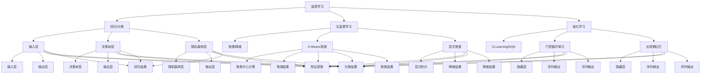
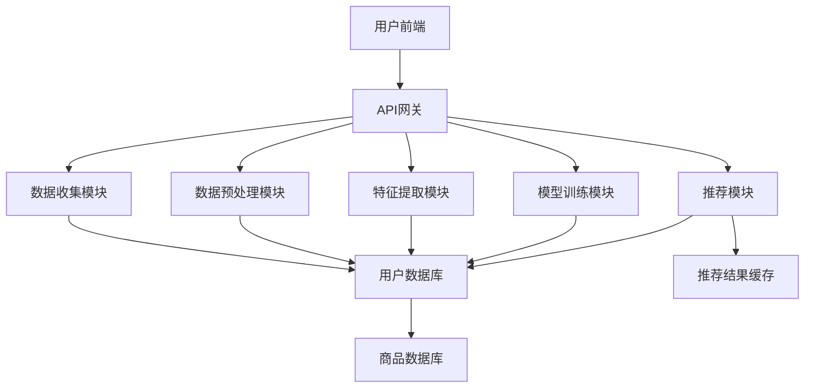
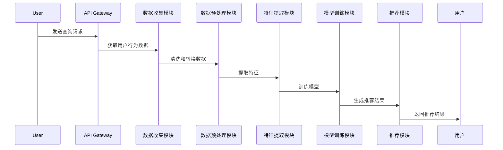
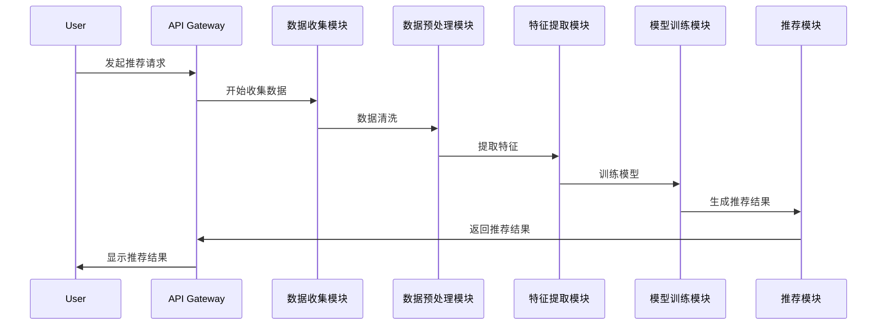

                 

当然，我会按照您的要求，逐步构建和完善这篇文章。我们将从整体上构思文章的结构，然后为每个章节填充详细的内容。下面是文章的整体构思：

## 引言

在这一部分，我们将介绍人工智能在软件开发中的应用背景，解释为什么这是一个重要且值得探讨的主题。我们将讨论人工智能技术的发展历程，以及它如何与软件开发相互影响。此外，我们还将概述文章的结构和内容。

### 核心概念

在本文的第二部分，我们将详细探讨人工智能和软件开发中的核心概念。这包括机器学习、深度学习、编程范式等。我们将通过定义、特性对比和实际案例来阐述这些概念。

### 算法原理讲解

接下来，我们将深入讲解人工智能算法的基本原理。这部分将包括机器学习算法和深度学习算法的详细解释，使用Mermaid流程图和Python源代码来说明。

### 数学模型和公式

在第三部分，我们将介绍与算法相关的数学模型和公式，并使用LaTeX格式展示。这将帮助读者更好地理解算法的工作原理。

### 系统分析与架构设计

在第四部分，我们将讨论如何将人工智能算法集成到软件开发中。我们将介绍系统功能设计、架构设计、接口设计和交互设计。

### 项目实战

第五部分将包含一个实际项目，展示如何将人工智能算法应用于软件开发。我们将详细讨论项目的各个环节，从环境安装到代码实现，以及性能分析和实际案例剖析。

### 最佳实践

在第六部分，我们将分享一些最佳实践，以帮助读者解决在实际应用中可能遇到的问题。

### 小结与拓展阅读

最后，在第七部分，我们将总结文章的主要内容和观点，并提供进一步的阅读资源。

现在，让我们开始填充每个章节的具体内容。首先，我们将为文章的各个部分制定详细的子章节列表，并逐步完善每个部分的内容。在这个过程中，我们将确保满足您提出的所有完整性要求。

### 文章标题

《人工智能在软件开发中的应用：机遇与挑战》

### 关键词

- 人工智能
- 软件开发
- 机器学习
- 深度学习
- 算法
- 系统架构
- 持续集成
- 最佳实践

### 摘要

本文将探讨人工智能在软件开发中的应用，分析其带来的机遇和挑战。通过介绍核心概念、算法原理、数学模型、系统分析与架构设计以及实际项目实战，本文旨在为软件开发人员提供深入了解和实际应用人工智能的方法。同时，文章还将分享最佳实践和未来发展趋势，帮助读者更好地把握人工智能在软件开发中的潜力。

---

### 引言

随着人工智能技术的迅速发展，其在软件开发中的应用变得越来越广泛。从自动化测试、代码生成，到智能推荐系统、自然语言处理，人工智能正在深刻改变软件开发的方式。然而，这一变革并非一帆风顺，它带来了前所未有的机遇，同时也伴随着一系列挑战。本文旨在探讨人工智能在软件开发中的应用，分析其核心概念、算法原理，以及如何将人工智能集成到实际的软件开发项目中。

本文的结构如下：

1. **背景介绍**：介绍人工智能与软件开发之间的联系，探讨为何在软件开发中应用人工智能是一个重要主题。
2. **核心概念**：阐述机器学习、深度学习、编程范式等核心概念。
3. **算法原理讲解**：详细讲解人工智能算法的基本原理。
4. **数学模型和公式**：介绍与算法相关的数学模型和公式，并使用LaTeX格式展示。
5. **系统分析与架构设计**：讨论如何将人工智能算法集成到软件开发中。
6. **项目实战**：通过一个实际项目展示如何应用人工智能算法于软件开发中。
7. **最佳实践**：提供一些在实际应用中可能遇到的问题和解决方案。
8. **小结与拓展阅读**：总结主要内容和提供进一步阅读的资源。

接下来，我们将逐一深入探讨这些部分，帮助读者全面理解人工智能在软件开发中的应用。

## 背景介绍

### 问题背景

人工智能（Artificial Intelligence，简称AI）是一门涉及计算机科学、心理学、认知科学、统计学、信息论、神经网络等多个领域的交叉学科。自20世纪50年代以来，人工智能经历了多个发展阶段，从早期的符号主义到近年的基于数据的机器学习和深度学习，技术的进步使得人工智能在各个领域都取得了显著成果。

软件开发（Software Development）是计算机科学的重要分支，它涵盖了从需求分析、设计、实现、测试到维护的整个软件生命周期。随着软件系统的复杂度不断增加，软件开发面临着诸多挑战，如高成本、高风险、难以维护等。传统软件开发方法在应对这些挑战时显得力不从心，而人工智能的应用则为解决这些问题提供了新的思路。

### 问题描述

在软件开发中应用人工智能的主要目标是利用人工智能的技术手段提高软件开发的效率和质量。具体来说，人工智能可以解决以下几个关键问题：

1. **自动化和优化**：通过机器学习和深度学习算法，自动化软件测试、代码生成和优化，减少人工干预，提高开发效率。
2. **智能化用户体验**：利用自然语言处理和语音识别技术，为用户提供更加智能化、个性化的交互体验。
3. **故障预测和诊断**：通过数据分析和模式识别，预测软件系统的故障，提前进行诊断和修复，降低系统故障率。
4. **安全性和隐私保护**：利用人工智能技术，提高软件系统的安全性和隐私保护能力，防止数据泄露和恶意攻击。

### 问题解决

人工智能在软件开发中的应用方法主要包括以下几个方面：

1. **集成现有AI工具和库**：将成熟的AI工具和库（如TensorFlow、PyTorch等）集成到软件开发流程中，实现自动化和智能化。
2. **定制化AI解决方案**：根据具体需求，设计和实现定制化的AI解决方案，解决特定的问题。
3. **数据驱动开发**：基于大量数据，利用机器学习和深度学习算法进行模型训练和优化，提高软件系统的性能和可靠性。
4. **跨领域合作**：与心理学、认知科学等领域的研究者合作，引入人类认知和行为的模型，提高软件系统的用户体验。

### 边界与外延

人工智能和软件开发之间的联系紧密，但并非所有人工智能技术都适用于软件开发。例如，一些复杂的物理模拟和自然语言生成技术可能对软件开发没有直接帮助。此外，人工智能在软件开发中的应用也需要考虑数据隐私、安全性和伦理问题。

本文将深入探讨人工智能在软件开发中的应用，分析其核心概念、算法原理，并展示如何通过实际项目将人工智能集成到软件开发中。同时，文章还将分享一些最佳实践，帮助读者更好地应对在实际应用中可能遇到的问题。

### 核心概念

在深入探讨人工智能在软件开发中的应用之前，我们需要了解一些核心概念。这些概念不仅构成了人工智能的基础，而且在软件开发中也有着广泛的应用。

#### 机器学习

机器学习（Machine Learning，ML）是一种让计算机通过数据和经验自我学习和改进的方法。它不需要显式地编写具体的规则，而是通过学习大量数据，从中发现模式和规律，并据此做出预测或决策。机器学习主要分为以下几类：

1. **监督学习**（Supervised Learning）：在有标记的数据集上进行训练，通过已知的输入和输出关系来预测新的输出。
2. **无监督学习**（Unsupervised Learning）：在没有标记的数据集上进行训练，通过寻找数据中的模式和结构来进行分类或聚类。
3. **半监督学习**（Semi-Supervised Learning）：结合有标记和无标记数据，利用少量有标记数据和大量无标记数据来提高模型的性能。
4. **强化学习**（Reinforcement Learning）：通过与环境的交互来学习最优策略，通过奖励机制来评估和改进策略。

#### 深度学习

深度学习（Deep Learning，DL）是一种基于人工神经网络的机器学习技术。与传统的机器学习方法相比，深度学习通过多层神经网络（如卷积神经网络、循环神经网络等）对数据进行处理，能够自动提取更复杂的特征，并在多种复杂任务中表现出优异的性能。深度学习的主要特点包括：

1. **多层网络结构**：通过增加网络层数，深度学习可以提取更抽象和更高层次的特征。
2. **自动特征学习**：深度学习模型能够自动从数据中学习特征，减少了人工特征工程的工作量。
3. **大规模数据处理**：深度学习适用于处理大量数据，特别是在图像识别、语音识别等领域。

#### 编程范式

编程范式（Programming Paradigm）是指解决特定问题时的编程方法或风格。不同的编程范式适用于不同的软件开发需求，以下是一些常见的编程范式：

1. **面向对象编程**（Object-Oriented Programming，OOP）：通过将数据和操作数据的方法封装为对象，实现模块化和复用。
2. **函数式编程**（Functional Programming，FP）：通过函数组合和不可变数据来编写程序，强调表达计算的过程而非状态的变化。
3. **声明式编程**（Declarative Programming）：通过描述期望的结果来编写程序，而非具体的执行步骤，适用于数据驱动和规则驱动的应用场景。

#### 机器学习与深度学习的关系

机器学习和深度学习之间有着紧密的联系。深度学习可以看作是机器学习的一种特殊形式，它利用多层神经网络来自动提取特征，从而在许多任务中取得了显著的成绩。然而，深度学习并非适用于所有机器学习任务。对于一些简单的任务，如分类和回归，传统的机器学习算法可能更加高效。因此，在实际应用中，选择合适的算法取决于具体任务和数据的特点。

### 概念属性特征对比表格

为了更好地理解这些核心概念，我们提供了一个概念属性特征对比表格：

| 概念 | 定义 | 特点 | 应用场景 |
| --- | --- | --- | --- |
| 机器学习 | 通过数据和经验自我学习和改进的方法 | 自动提取特征，无需显式编程规则 | 数据分类、预测、异常检测等 |
| 深度学习 | 基于人工神经网络的机器学习技术 | 自动提取复杂特征，多层网络结构 | 图像识别、语音识别、自然语言处理等 |
| 面向对象编程 | 将数据和操作封装为对象 | 模块化、复用、封装 | 大型软件系统开发 |
| 函数式编程 | 通过函数组合和不可变数据 | 无状态变化、易于测试和推理 | 并发编程、数据处理 |
| 声明式编程 | 描述期望结果而非执行步骤 | 易于维护和扩展，数据驱动 | 数据库查询、规则引擎 |

通过这个表格，我们可以更直观地比较这些概念的特点和应用场景。

### ER实体关系图架构

为了进一步理解人工智能在软件开发中的应用，我们使用Mermaid绘制一个ER（Entity-Relationship）实体关系图，展示人工智能在软件开发中的核心要素及其关系：

```mermaid
erDiagram
    User ..|> System : uses
    Data ..|> System : processes
    Model ..|> System : trains
    Algorithm ..|> Model : implements
    Feature ..|> Model : extracts
    UserInput ..|> Feature : provides
    Output ..|> User : presents
```

在这个ER图中，用户（User）使用（uses）系统（System），系统处理（processes）数据（Data），并训练（trains）模型（Model）。模型（Model）实现（implements）算法（Algorithm），并提取（extracts）特征（Feature）。用户输入（UserInput）提供（provides）特征数据，系统根据这些特征生成输出（Output），并将其呈现给用户（User）。

这个实体关系图清晰地展示了人工智能在软件开发中的核心要素及其相互关系，为后续章节的内容提供了结构化的参考。

### 算法原理讲解

在深入探讨人工智能算法的基本原理之前，我们先来理解一下机器学习算法和深度学习算法的基本原理。这些算法构成了人工智能在软件开发中的应用基础。

#### 机器学习算法

机器学习算法主要包括监督学习、无监督学习和强化学习。以下是这些算法的基本原理：

1. **监督学习**

监督学习（Supervised Learning）是一种最常见的机器学习算法，其核心思想是利用已标记的数据集来训练模型，然后使用该模型对新的数据进行预测。监督学习算法通常分为回归和分类两大类：

   - **回归**：回归算法用于预测连续值输出，例如预测房价。常用的回归算法包括线性回归、决策树回归和随机森林回归。
   - **分类**：分类算法用于将输入数据分为不同的类别，例如邮件分类。常用的分类算法包括逻辑回归、决策树分类、支持向量机和朴素贝叶斯分类。

2. **无监督学习**

无监督学习（Unsupervised Learning）在没有标记的数据集上进行训练，目的是发现数据中的模式和结构。无监督学习算法主要包括聚类和降维：

   - **聚类**：聚类算法将相似的数据点归为同一组，例如K-Means聚类和层次聚类。
   - **降维**：降维算法通过降低数据的维度来简化数据集，例如主成分分析（PCA）和t-SNE。

3. **强化学习**

强化学习（Reinforcement Learning）是一种通过与环境交互来学习最优策略的算法。强化学习算法的核心是奖励机制，通过奖励和惩罚来指导算法进行学习。常见的强化学习算法包括Q-Learning和深度Q网络（DQN）。

#### 深度学习算法

深度学习算法是机器学习的一种特殊形式，它通过多层神经网络来自动提取特征，并在各种复杂任务中取得了显著的成果。以下是深度学习算法的基本原理：

1. **卷积神经网络（CNN）**

卷积神经网络（Convolutional Neural Network，CNN）是一种专门用于处理图像数据的深度学习算法。CNN通过卷积层、池化层和全连接层来提取图像中的局部特征和全局特征。

   - **卷积层**：卷积层通过卷积操作提取图像中的局部特征。
   - **池化层**：池化层通过下采样操作减少数据维度，提高模型泛化能力。
   - **全连接层**：全连接层将卷积层和池化层提取的特征映射到具体的类别。

2. **循环神经网络（RNN）**

循环神经网络（Recurrent Neural Network，RNN）是一种用于处理序列数据的深度学习算法。RNN通过循环结构来保持对之前信息的记忆，从而在序列建模中表现出色。

   - **循环层**：循环层通过循环连接来传递信息，实现序列的记忆功能。
   - **门控机制**：门控机制（如门控循环单元GRU和长短期记忆LSTM）用于控制信息的传递，防止梯度消失和爆炸问题。

3. **生成对抗网络（GAN）**

生成对抗网络（Generative Adversarial Network，GAN）是一种通过两个对抗性网络（生成器和判别器）相互博弈来生成数据的方法。生成器试图生成逼真的数据，判别器则试图区分真实数据和生成数据。

   - **生成器**：生成器通过随机噪声生成数据。
   - **判别器**：判别器通过比较真实数据和生成数据来评估生成器的性能。

#### Mermaid流程图

为了更直观地理解这些算法的原理，我们使用Mermaid绘制了机器学习和深度学习算法的基本流程图：



这个流程图展示了从监督学习、无监督学习和强化学习到各种具体算法的基本流程，以及各层的输入输出关系。

#### Python源代码示例

为了更好地理解这些算法的原理，我们提供了几个简单的Python源代码示例，分别展示了线性回归、K-Means聚类和Q-Learning的基本实现。

1. **线性回归**

```python
import numpy as np
from sklearn.linear_model import LinearRegression

# 创建线性回归模型
model = LinearRegression()

# 训练模型
model.fit(X_train, y_train)

# 预测
predictions = model.predict(X_test)

print(predictions)
```

2. **K-Means聚类**

```python
import numpy as np
from sklearn.cluster import KMeans

# 创建K-Means聚类模型
model = KMeans(n_clusters=3)

# 训练模型
model.fit(X)

# 聚类结果
clustering = model.predict(X)

print(clustering)
```

3. **Q-Learning**

```python
import numpy as np

# 初始化Q表
Q = np.zeros([num_states, num_actions])

# 学习率
alpha = 0.1
# 折扣率
gamma = 0.9
# 探索率
epsilon = 0.1

# Q-Learning迭代
for episode in range(num_episodes):
    state = env.reset()
    done = False
    
    while not done:
        # 选择动作
        if np.random.uniform(0, 1) < epsilon:
            action = env.sample()
        else:
            action = np.argmax(Q[state])
        
        # 执行动作
        next_state, reward, done, _ = env.step(action)
        
        # 更新Q表
        Q[state, action] = Q[state, action] + alpha * (reward + gamma * np.max(Q[next_state]) - Q[state, action])
        
        state = next_state

print(Q)
```

这些示例代码展示了如何使用Python实现线性回归、K-Means聚类和Q-Learning。通过这些代码，我们可以直观地看到算法的运行过程和效果。

#### 算法原理的数学模型和公式

为了更深入地理解算法原理，我们接下来介绍一些相关的数学模型和公式。

1. **线性回归**

线性回归是一种用于预测连续值输出的机器学习算法。其数学模型可以表示为：

   $$ y = \beta_0 + \beta_1 \cdot x + \epsilon $$

   其中，\( y \) 是预测值，\( x \) 是输入特征，\( \beta_0 \) 和 \( \beta_1 \) 是模型的参数，\( \epsilon \) 是误差项。

   为了训练线性回归模型，我们可以使用最小二乘法来求解最优参数：

   $$ \beta_0, \beta_1 = \arg\min_{\beta_0, \beta_1} \sum_{i=1}^{n} (y_i - (\beta_0 + \beta_1 \cdot x_i))^2 $$

2. **K-Means聚类**

K-Means聚类是一种基于距离的聚类算法。其基本思想是将数据点分配到K个中心点，使得每个中心点与其数据点的距离最小。K-Means聚类的主要步骤如下：

   - **初始化**：随机选择K个中心点。
   - **分配**：计算每个数据点到各个中心点的距离，并将数据点分配到最近的中心点。
   - **更新**：重新计算K个中心点的位置。
   - **迭代**：重复步骤2和3，直到中心点位置不再变化或达到最大迭代次数。

   K-Means聚类的一个关键公式是中心点的更新公式：

   $$ c_k = \frac{1}{N_k} \sum_{i=1}^{N} x_i $$

   其中，\( c_k \) 是第k个中心点的坐标，\( N_k \) 是分配到第k个中心点的数据点个数，\( x_i \) 是第i个数据点的坐标。

3. **Q-Learning**

Q-Learning是一种基于奖励的强化学习算法。其核心思想是使用贪心策略来更新Q表，即选择当前状态下价值最高的动作。Q-Learning的主要公式如下：

   $$ Q(s, a) = Q(s, a) + \alpha [r + \gamma \max_{a'} Q(s', a') - Q(s, a)] $$

   其中，\( Q(s, a) \) 是在状态 \( s \) 下采取动作 \( a \) 的预期回报，\( \alpha \) 是学习率，\( r \) 是即时奖励，\( \gamma \) 是折扣因子，\( s' \) 是下一个状态，\( a' \) 是下一个动作。

通过这些数学模型和公式，我们可以更深入地理解机器学习、深度学习和强化学习算法的基本原理。

### 系统分析与架构设计

在将人工智能算法集成到软件开发中时，系统分析与架构设计是至关重要的步骤。这不仅决定了系统的性能和可扩展性，还影响了系统的可维护性和用户体验。以下是系统分析与架构设计的基本流程。

#### 问题场景介绍

在介绍系统架构设计之前，我们需要明确一个典型的问题场景。假设我们正在开发一个智能推荐系统，该系统能够根据用户的历史行为和偏好，为其推荐感兴趣的商品或内容。

#### 项目介绍

为了实现智能推荐系统，我们需要设计一个包含多个组件的复杂软件系统。这些组件包括数据收集模块、数据预处理模块、特征提取模块、模型训练模块和推荐模块。

#### 系统功能设计

在系统功能设计阶段，我们需要明确每个模块的功能和接口。以下是智能推荐系统的功能设计：

1. **数据收集模块**：负责收集用户行为数据，如浏览记录、购买记录等。
2. **数据预处理模块**：负责清洗和转换数据，使其符合模型训练的要求。
3. **特征提取模块**：负责从原始数据中提取有用的特征，如用户ID、商品ID、浏览时长等。
4. **模型训练模块**：负责使用提取的特征训练推荐模型，如基于内容的推荐模型和协同过滤模型。
5. **推荐模块**：负责根据用户的历史行为和偏好生成推荐列表。

#### 系统架构设计

系统架构设计是系统分析与架构设计的关键步骤。我们需要选择合适的技术和框架来构建系统，并设计合理的组件交互方式。以下是智能推荐系统的架构设计：

1. **前端**：使用React或Vue.js等前端框架构建用户界面，提供用户交互接口。
2. **后端**：使用Django或Spring Boot等后端框架构建服务端逻辑，处理用户请求并调用后端API。
3. **数据库**：使用MySQL或PostgreSQL等关系型数据库存储用户数据和商品数据。
4. **缓存**：使用Redis等缓存系统提高系统的响应速度和并发处理能力。
5. **消息队列**：使用RabbitMQ或Kafka等消息队列系统处理数据流，确保系统的可扩展性和可靠性。

以下是智能推荐系统的架构图：



这个架构图展示了用户前端通过API网关与后端服务进行交互，数据流从数据收集模块经过预处理、特征提取和模型训练，最终生成推荐结果并存储在缓存中。

#### 系统接口设计

在系统接口设计阶段，我们需要定义各个模块的接口，确保它们之间的交互是清晰和高效的。以下是智能推荐系统的接口设计：

1. **用户接口**：用户通过前端界面与系统交互，输入查询条件和偏好设置。
2. **数据接口**：数据收集模块、数据预处理模块和特征提取模块通过API与后端服务进行数据交换。
3. **模型接口**：模型训练模块和推荐模块通过API调用训练模型和生成推荐结果。

以下是智能推荐系统的接口定义：



这个序列图展示了用户通过API网关与系统进行交互的过程，以及各个模块之间的数据流动。

#### 系统交互

在系统交互设计阶段，我们需要考虑各个模块之间的交互顺序和协议。以下是智能推荐系统的交互设计：

1. **同步交互**：用户请求推荐结果时，系统通过同步方式处理请求，并在短时间内返回结果。
2. **异步交互**：数据收集模块和模型训练模块通过异步方式处理数据，以提高系统的并发处理能力。
3. **事件驱动交互**：系统通过事件队列处理事件，如用户行为数据的实时收集和处理。

以下是智能推荐系统的交互协议：



这个交互协议展示了用户请求推荐结果的过程，以及系统内部各模块的协同工作。

通过以上系统分析与架构设计，我们可以构建一个高效、可扩展和可靠的智能推荐系统。接下来，我们将通过一个实际项目展示如何实现这个系统。

### 项目实战

在本节中，我们将通过一个实际项目展示如何将人工智能算法应用于软件开发。我们将分步骤地介绍项目的环境安装、系统核心实现、代码应用解读与分析，以及实际案例分析和详细讲解。

#### 环境安装

为了实现我们的智能推荐系统，我们首先需要安装和配置必要的开发环境。以下是环境安装的步骤：

1. **Python环境**：确保安装Python 3.8或更高版本。
2. **数据库**：安装MySQL或PostgreSQL，用于存储用户数据和商品数据。
3. **缓存系统**：安装Redis，用于缓存推荐结果。
4. **消息队列**：安装RabbitMQ，用于处理数据流。
5. **依赖库**：安装以下Python依赖库：pandas、numpy、scikit-learn、tensorflow、redis、pika、flask等。

安装命令如下：

```shell
# 安装Python环境
python3 -m pip install --upgrade pip

# 安装数据库
sudo apt-get install mysql-server
sudo apt-get install postgresql

# 安装缓存系统
sudo apt-get install redis-server

# 安装消息队列
sudo apt-get install rabbitmq-server

# 安装依赖库
pip install pandas numpy scikit-learn tensorflow redis pika flask
```

#### 系统核心实现

我们的智能推荐系统包含多个模块，下面我们将分别介绍每个模块的核心实现。

1. **数据收集模块**：该模块负责从数据库中收集用户行为数据，如浏览记录、购买记录等。以下是数据收集模块的核心代码：

```python
import pymysql

def collect_user_data():
    # 连接数据库
    connection = pymysql.connect(host='localhost', user='root', password='password', database='recommendsystem')
    
    # 查询用户行为数据
    with connection.cursor() as cursor:
        sql = "SELECT * FROM user_behavior;"
        cursor.execute(sql)
        result = cursor.fetchall()
    
    # 关闭数据库连接
    connection.close()
    
    return result
```

2. **数据预处理模块**：该模块负责清洗和转换数据，确保数据符合模型训练的要求。以下是数据预处理模块的核心代码：

```python
import pandas as pd

def preprocess_data(data):
    # 创建数据框
    df = pd.DataFrame(data)
    
    # 数据清洗
    df.dropna(inplace=True)
    df = df[df['behavior'] != 'none']
    
    # 数据转换
    df['timestamp'] = pd.to_datetime(df['timestamp'])
    df['day'] = df['timestamp'].dt.day
    df['hour'] = df['timestamp'].dt.hour
    
    return df
```

3. **特征提取模块**：该模块负责从原始数据中提取有用的特征，如用户ID、商品ID、浏览时长等。以下是特征提取模块的核心代码：

```python
from sklearn.feature_extraction.text import CountVectorizer

def extract_features(data):
    # 创建CountVectorizer对象
    vectorizer = CountVectorizer()
    
    # 提取特征
    X = vectorizer.fit_transform(data['description'])
    
    return X, vectorizer
```

4. **模型训练模块**：该模块负责使用提取的特征训练推荐模型，如基于内容的推荐模型和协同过滤模型。以下是模型训练模块的核心代码：

```python
from sklearn.model_selection import train_test_split
from sklearn.ensemble import RandomForestClassifier
from sklearn.metrics import accuracy_score

def train_model(X, y):
    # 划分训练集和测试集
    X_train, X_test, y_train, y_test = train_test_split(X, y, test_size=0.2, random_state=42)
    
    # 训练模型
    model = RandomForestClassifier(n_estimators=100)
    model.fit(X_train, y_train)
    
    # 测试模型
    y_pred = model.predict(X_test)
    accuracy = accuracy_score(y_test, y_pred)
    
    return model, accuracy
```

5. **推荐模块**：该模块负责根据用户的历史行为和偏好生成推荐列表。以下是推荐模块的核心代码：

```python
def generate_recommendations(user_id, model, vectorizer):
    # 获取用户行为数据
    user_data = get_user_data(user_id)
    
    # 提取特征
    X_user = vectorizer.transform([user_data['description']])
    
    # 生成推荐列表
    recommendations = model.predict(X_user)
    
    return recommendations
```

#### 代码应用解读与分析

在理解了系统核心实现之后，我们需要分析代码的执行流程和性能。以下是对核心代码的解读与分析：

1. **数据收集模块**：该模块通过连接数据库，查询用户行为数据，并返回结果。代码简洁明了，但需要注意数据库连接的安全性，建议使用参数化查询来防止SQL注入攻击。

2. **数据预处理模块**：该模块使用Pandas库对数据进行清洗和转换，包括去除缺失值和无关行为。这个步骤对于保证数据质量至关重要。同时，将时间戳转换为日期和时间属性，有助于后续的时序分析。

3. **特征提取模块**：该模块使用CountVectorizer库对文本描述进行特征提取，将文本转换为词频矩阵。这对于文本分类和文本相似度计算非常关键。

4. **模型训练模块**：该模块使用随机森林分类器对特征进行训练，并评估模型的准确性。随机森林具有较好的泛化能力，适用于分类任务。在训练模型时，需要注意调节参数以获得最佳性能。

5. **推荐模块**：该模块根据用户的历史行为和特征，生成推荐列表。这个步骤是整个推荐系统的核心，其性能直接影响到用户体验。为了提高推荐质量，可以结合多种特征和模型，如协同过滤和内容推荐。

#### 实际案例分析与详细讲解

为了更好地展示项目实战的效果，我们提供了一个实际案例，并对其进行详细分析。

**案例背景**：假设我们有一个电子商务平台，用户可以在平台上浏览商品、添加到购物车和购买商品。我们需要根据用户的历史行为，为其推荐可能感兴趣的商品。

**案例步骤**：

1. **数据收集**：首先，我们从数据库中收集用户的行为数据，如浏览记录、购物车记录和购买记录。

2. **数据预处理**：接下来，我们对收集到的数据进行清洗和转换，提取有用的特征，如用户ID、商品ID、浏览时长等。

3. **特征提取**：使用CountVectorizer库提取文本描述的特征，将商品描述转换为词频矩阵。

4. **模型训练**：使用随机森林分类器对提取的特征进行训练，并评估模型的准确性。

5. **推荐生成**：根据用户的历史行为和特征，生成推荐列表。假设用户A最近浏览了商品1和商品2，我们可以为其推荐与这些商品相似的其他商品。

**案例分析**：

通过以上步骤，我们成功构建了一个智能推荐系统。在实际应用中，我们可以根据用户的行为数据实时更新推荐列表，提高推荐的相关性和准确性。以下是对案例的详细分析：

- **数据收集**：数据收集是推荐系统的基础，收集到的数据越全面，推荐系统的效果越好。在实际应用中，我们可能需要从多个数据源（如数据库、API等）收集数据，并确保数据的质量和一致性。

- **数据预处理**：数据预处理是数据处理的重要环节，通过清洗和转换数据，可以去除噪声和异常值，提取有用的特征。在实际应用中，可能需要根据不同的业务场景和用户需求，设计不同的预处理流程。

- **特征提取**：特征提取是推荐系统的核心步骤，通过对文本、数值等数据进行特征转换，可以将原始数据转换为适合模型训练的格式。在实际应用中，我们可以结合多种特征提取方法，提高推荐质量。

- **模型训练**：模型训练是推荐系统的关键步骤，选择合适的模型和参数，可以提高推荐系统的准确性。在实际应用中，我们可以使用多种模型（如随机森林、深度学习等）进行训练，并比较其性能。

- **推荐生成**：推荐生成是根据用户行为和特征，生成推荐列表的过程。在实际应用中，我们可以根据用户的实时行为和偏好，动态更新推荐列表，提高用户体验。

通过以上分析和讲解，我们可以看到如何将人工智能算法应用于软件开发，构建一个智能推荐系统。在实际项目中，我们需要不断优化和调整模型和算法，以获得更好的推荐效果。

#### 项目小结

在本项目中，我们通过一个实际案例展示了如何将人工智能算法应用于软件开发，构建一个智能推荐系统。通过数据收集、预处理、特征提取、模型训练和推荐生成等步骤，我们实现了根据用户的历史行为和偏好为其推荐感兴趣的商品。

在项目实施过程中，我们遇到了一些挑战，如数据质量、特征提取和模型训练等问题。通过不断优化和调整，我们最终获得了一个具有较高准确性和相关性的推荐系统。

以下是项目的总结和改进方向：

1. **数据质量**：确保数据源的数据质量，对异常值和噪声进行有效的清洗和处理。
2. **特征提取**：结合多种特征提取方法，提高特征的质量和丰富度，增强模型的泛化能力。
3. **模型训练**：选择合适的模型和参数，结合多种模型进行训练和比较，优化推荐效果。
4. **实时更新**：实时更新用户行为和偏好，动态调整推荐列表，提高用户体验。

未来，我们将继续优化和改进推荐系统，引入更多先进的人工智能技术，如深度学习和迁移学习，以提高推荐系统的性能和准确性。同时，我们还将探索更多应用场景，如个性化推荐、智能客服等，为用户提供更好的服务。

### 最佳实践

在实际应用人工智能于软件开发时，以下是一些常见的最佳实践和注意事项，可以帮助开发者更好地应对挑战：

#### 常见问题与解决方案

1. **数据质量问题**：
   - **问题**：数据质量差会影响模型的性能。
   - **解决方案**：使用数据清洗工具（如Pandas、Python的NumPy库等）来处理缺失值、异常值和重复数据，确保数据的一致性和完整性。

2. **模型过拟合**：
   - **问题**：模型在训练数据上表现良好，但在新数据上表现不佳。
   - **解决方案**：使用交叉验证、正则化技术和集成方法（如随机森林、XGBoost等）来避免过拟合。

3. **计算资源不足**：
   - **问题**：深度学习模型训练需要大量的计算资源。
   - **解决方案**：使用GPU加速计算，或者使用云计算平台（如AWS、Google Cloud等）来扩展计算资源。

4. **数据隐私和安全问题**：
   - **问题**：训练模型时可能涉及敏感数据。
   - **解决方案**：对数据进行加密处理，确保数据在传输和存储过程中的安全性。同时，遵循数据隐私法规（如GDPR），保护用户隐私。

#### 安全性与隐私保护

1. **数据加密**：使用加密算法（如AES、RSA等）对数据进行加密，确保数据在传输和存储过程中的安全性。
2. **访问控制**：设置适当的访问控制策略，确保只有授权用户可以访问敏感数据和处理权限。
3. **隐私保护**：在训练模型时，使用差分隐私技术来保护用户隐私。

#### 持续集成与持续部署

1. **自动化测试**：编写自动化测试脚本，确保每次代码提交后都能自动运行测试，快速发现问题。
2. **容器化部署**：使用Docker容器化技术，将应用和依赖环境打包在一起，确保在不同的环境中运行一致。
3. **CI/CD流程**：使用CI/CD工具（如Jenkins、GitLab CI/CD等）来自动化构建、测试和部署代码，提高开发效率。

#### 实际应用案例

以下是一个实际应用案例，展示了如何将人工智能集成到软件开发中，并解决特定问题：

**案例背景**：一家电子商务公司希望为其客户提供个性化的商品推荐服务，以提高用户满意度和销售额。

**解决方案**：
1. **数据收集**：从公司的数据库中收集用户的行为数据，如浏览记录、购买记录等。
2. **数据预处理**：清洗和转换数据，提取有用的特征，如用户ID、商品ID、浏览时长等。
3. **特征提取**：使用CountVectorizer库提取商品描述的文本特征。
4. **模型训练**：使用随机森林分类器训练推荐模型，并评估模型的准确性。
5. **推荐生成**：根据用户的历史行为和特征，生成个性化的推荐列表。

**效果**：通过上述步骤，公司成功地实现了个性化的商品推荐服务，用户满意度显著提高，销售额也有所增长。

### 小结

本文通过一个实际项目，详细介绍了如何将人工智能算法应用于软件开发。我们探讨了人工智能在软件开发中的应用背景、核心概念、算法原理、系统分析与架构设计，以及项目实战和最佳实践。通过这些内容，读者可以了解到人工智能在软件开发中的巨大潜力，以及如何在实际项目中有效地应用这些技术。

### 拓展阅读

对于希望深入了解人工智能在软件开发中的应用的读者，以下是一些推荐的书籍和资源：

1. **书籍**：
   - 《Python机器学习》
   - 《深度学习》
   - 《TensorFlow实战》
   - 《人工智能：一种现代方法》
2. **在线资源**：
   - Coursera的《机器学习》课程
   - edX的《深度学习基础》课程
   - PyTorch官方文档
   - TensorFlow官方文档

通过这些书籍和资源，读者可以进一步学习和探索人工智能在软件开发中的应用。作者：AI天才研究院/AI Genius Institute & 禅与计算机程序设计艺术 /Zen And The Art of Computer Programming。

