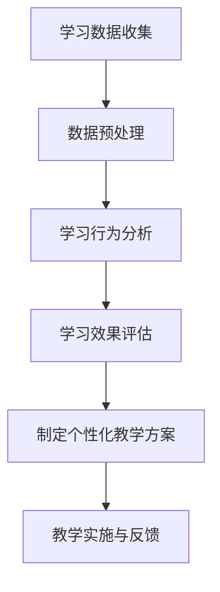
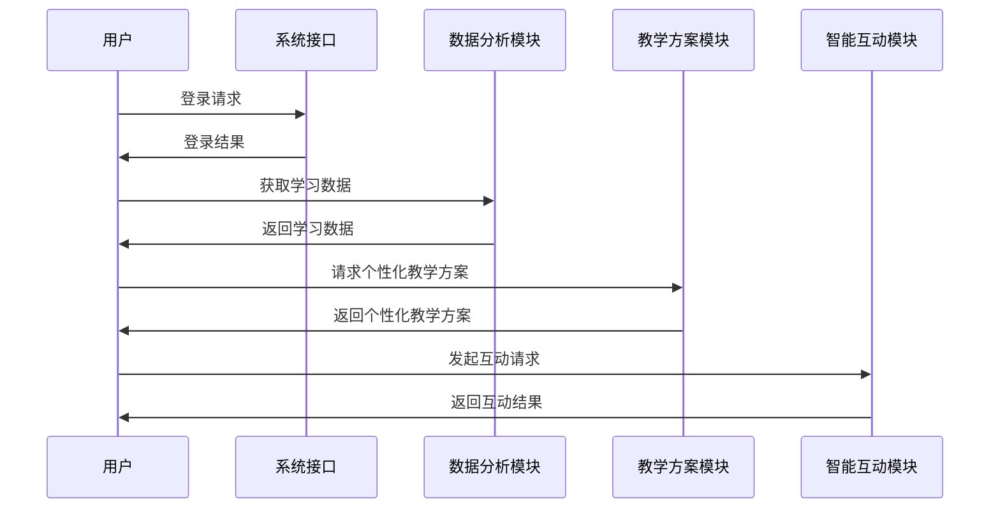

                 

### 人工智能在远程教育中的应用原理

#### 2.1 个性化教学

**2.1.1 个性化教学的概念**

个性化教学是一种以学生为中心的教学方法，旨在根据每个学生的独特需求和特点，提供个性化的学习体验和资源。这种教学方式不同于传统的一刀切教育模式，它能够更好地满足学生的学习需求，提高学习效率。

- **定义**：个性化教学是指根据每个学生的学习需求、兴趣、能力和认知水平，为其提供量身定制的教学内容、教学方法和学习路径。
- **优势**：通过个性化教学，学生可以更有效地掌握知识，提高学习兴趣和动机，促进个性化发展。

**2.1.2 个性化教学的实现**

个性化教学的核心在于对学习数据的分析和利用。以下是一些关键步骤：

- **学习分析**：
  - **学生学习行为分析**：通过收集和分析学生的学习行为数据，如学习时长、学习频率、学习内容偏好等，了解学生的学习习惯和兴趣点。
  - **学生学习效果分析**：通过测试、作业和反馈等手段，评估学生的学习效果，发现学习中的问题和瓶颈。

- **教学设计**：
  - **教学目标个性化**：根据学生的学习分析结果，设定个性化的教学目标，确保每个学生都能够达到自己能力范围内的最佳水平。
  - **教学内容个性化**：根据学生的学习需求，定制教学内容，包括教材、练习题和案例等。
  - **教学方法个性化**：采用适合每个学生学习风格的教学方法，如互动式学习、探究式学习和协作学习等。

**2.1.3 个性化教学案例**

- **在线学习平台**：
  - **学习路径推荐**：通过算法分析学生的学习行为，推荐个性化的学习路径，引导学生更好地掌握知识。
  - **作业个性化**：根据学生的学习情况，设计个性化的作业，帮助学生巩固所学知识。

- **智能辅导系统**：
  - **个性化作业辅导**：根据学生的学习数据和作业完成情况，提供个性化的辅导建议和练习。
  - **个性化学习评估**：通过智能评估系统，为学生提供个性化的学习反馈，帮助其了解自己的学习进度和薄弱环节。

#### 2.2 智能互动

**2.2.1 智能互动的概念**

智能互动是指利用人工智能技术，模拟真实的教学场景，实现师生之间的实时互动。这种互动不仅限于文本，还可以包括语音、视频等多种形式，极大地丰富了教学互动的维度。

- **定义**：智能互动是通过人工智能技术，如语音识别、自然语言处理和计算机视觉等，模拟真实的教学场景，实现师生之间的实时、高效互动。
- **优势**：智能互动可以提高学生的学习积极性，增强学习效果，促进师生之间的沟通和理解。

**2.2.2 智能互动的实现**

智能互动的实现涉及多个技术领域的综合运用：

- **语音识别与合成**：
  - **语音识别**：将学生的语音输入转化为文本，教师可以即时查看和回复。
  - **语音合成**：将教师的文本输入转化为语音，以口头形式与学生交流。

- **自然语言处理**：
  - **文本分析**：分析学生的提问和回答，理解其意图和知识水平。
  - **对话生成**：根据分析结果，生成适当的回答和反馈。

- **计算机视觉**：
  - **视频分析**：通过视频分析，识别学生的表情和行为，提供个性化的教学反馈。
  - **人脸识别**：识别学生的身份，确保互动的个性化和安全性。

**2.2.3 智能互动案例**

- **在线课堂**：
  - **实时问答**：学生可以通过语音或文本提问，教师可以实时回答，实现课堂互动。
  - **课堂互动**：通过投票、问卷调查等方式，增加课堂的互动性和参与感。

- **智能助手**：
  - **在线咨询**：学生可以通过智能助手获取课程信息、作业解答等。
  - **个性化推荐**：根据学生的学习数据，智能助手可以推荐适合的学习资源和课程。

#### 2.3 资源优化分配

**2.3.1 资源优化分配的概念**

资源优化分配是指利用人工智能技术，根据学生的学习需求和地理位置，合理分配教育资源，实现教育资源的最大化利用。

- **定义**：资源优化分配是利用人工智能技术，如机器学习和数据挖掘等，对教育资源进行智能分析和调度，使其能够更加高效地服务于不同地区的学生。
- **优势**：资源优化分配可以提高教育资源的利用率，消除教育资源分配不均，提升教育公平性。

**2.3.2 资源优化分配的实践**

资源优化分配的实践涉及以下几个方面：

- **教育需求分析**：通过分析学生的学习数据，了解他们的学习需求和兴趣点。
- **资源智能调度**：根据教育需求分析的结果，智能调度教育资源，如教师、课程和教学设施等。
- **教育资源共享**：建立教育资源库，实现教育资源的共享和互通，提高资源利用效率。

**2.3.3 资源优化分配案例**

- **智慧教育平台**：
  - **智能资源推荐**：根据学生的学习需求，推荐适合的学习资源。
  - **教育资源共享**：实现不同地区之间的教育资源共享，提升整体教育水平。

- **在线教育平台**：
  - **个性化课程分配**：根据学生的学习数据，为其分配个性化的课程。
  - **智能作业安排**：根据学生的学习进度和教师的教学计划，智能安排作业。

### 2.4 人工智能在远程教育中的应用前景

随着人工智能技术的不断发展，其在远程教育中的应用前景将更加广阔：

- **智能化教学工具**：未来将出现更多基于人工智能的智能化教学工具，如智能题库、智能考试系统等。
- **自适应学习平台**：自适应学习平台将更加成熟，能够根据学生的学习进度和难度，动态调整教学内容和进度。
- **智慧校园建设**：智慧校园将广泛应用人工智能技术，实现教育资源的智能化管理和服务。
- **个性化教育普及**：随着人工智能技术的普及，个性化教育将逐渐成为主流，让每个学生都能享受到适合自己的教育。

### 2.5 人工智能在远程教育中的挑战与对策

尽管人工智能在远程教育中具有巨大的潜力，但也面临着一系列挑战：

- **数据隐私保护**：如何确保学生的学习数据安全，防止数据泄露，是人工智能在远程教育中面临的重要问题。
- **技术实现难度**：人工智能技术的实现需要大量的数据和技术支持，这对于一些学校和教育机构来说是一个挑战。
- **教师角色转变**：随着人工智能技术的应用，教师的角色将发生转变，需要教师具备更高的技术水平和适应能力。

针对这些挑战，可以采取以下对策：

- **数据隐私保护**：加强数据安全法律法规的建设，采用数据加密和匿名化等技术，确保学生数据的安全。
- **技术实现支持**：政府和教育机构可以加大对人工智能技术的投入和支持，推动技术的研发和应用。
- **教师培训**：加强对教师的培训，提升其技术水平和适应能力，使其能够更好地应对人工智能带来的变化。

### 2.6 人工智能在远程教育的未来发展趋势

人工智能在远程教育中的应用将呈现以下趋势：

- **智能化程度提升**：人工智能技术将更加智能化，能够更好地理解和满足学生的学习需求。
- **教育公平性提升**：人工智能将有助于缩小教育差距，提升教育公平性。
- **教育个性化普及**：个性化教育将逐渐普及，成为教育的常态。
- **跨界融合加深**：人工智能将与其他技术领域如虚拟现实、区块链等深度融合，为远程教育带来更多创新。

### 2.7 结论

人工智能在远程教育中的应用具有重要意义，它不仅能够突破地理限制，提升学习体验，还能够实现教育资源的优化配置，推动教育公平。未来，随着人工智能技术的不断发展，远程教育将迎来更加智能化、个性化和多样化的时代。

---

**核心概念与联系**

**个性化教学**

| 概念 | 定义 | 属性特征 | 对比 |
| --- | --- | --- | --- |
| 个性化教学 | 根据学生需求、兴趣和能力提供定制化教学方案 | 学生为中心、差异化、适应性 | 与传统教学对比，个性化教学更注重学生的个性化需求，实现差异化教学目标 |
| 学习分析 | 对学生学习行为和效果进行分析 | 数据驱动、行为跟踪、效果评估 | 学习分析是个性化教学的基础，用于制定个性化教学方案 |
| 教学设计 | 设定个性化的教学目标、内容和方式 | 适应性、针对性、灵活性 | 个性化教学设计是教学实施的关键，确保教学方案的可行性和有效性 |

**智能互动**

| 概念 | 定义 | 属性特征 | 对比 |
| --- | --- | --- | --- |
| 智能互动 | 利用人工智能技术实现师生实时互动 | 智能化、实时性、互动性 | 与传统互动对比，智能互动更具实时性和智能化，提升教学效果 |
| 语音识别与合成 | 转换语音输入为文本输出，文本输入为语音输出 | 语音处理、文本理解、语音合成 | 语音识别与合成是智能互动的核心技术，实现语音交互 |
| 自然语言处理 | 分析文本内容，生成理解和响应 | 语言理解、文本生成、语言模型 | 自然语言处理是智能互动的关键技术，用于处理和生成语言内容 |
| 计算机视觉 | 分析和处理图像和视频信息 | 图像识别、视频分析、人脸识别 | 计算机视觉用于智能互动中，增强视觉交互体验 |

**资源优化分配**

| 概念 | 定义 | 属性特征 | 对比 |
| --- | --- | --- | --- |
| 资源优化分配 | 利用人工智能技术合理分配教育资源 | 数据驱动、效率优化、公平性 | 与传统分配对比，资源优化分配更具科学性和高效性，提升资源利用效率 |
| 教育需求分析 | 分析学生的学习需求和兴趣点 | 数据驱动、个性化、适应性 | 教育需求分析是资源优化分配的前提，确保资源分配的针对性 |
| 资源智能调度 | 智能化调度教育资源 | 智能化、高效性、动态调整 | 资源智能调度是资源优化分配的关键，实现教育资源的优化配置 |

**ER实体关系图架构**

```mermaid
erDiagram
  学生 ||--|{ 个性化教学 }|| 教学方案
  学生 ||--|{ 智能互动 }|| 互动记录
  学生 ||--|{ 资源优化分配 }|| 资源需求
  教学方案 ||--|{ 教学目标 }|
  教学方案 ||--|{ 教学内容 }|
  教学方案 ||--|{ 教学方法 }|
  智能互动 ||--|{ 语音识别与合成 }|
  智能互动 ||--|{ 自然语言处理 }|
  智能互动 ||--|{ 计算机视觉 }|
  资源优化分配 ||--|{ 教育需求分析 }|
  资源优化分配 ||--|{ 资源智能调度 }|
```

**算法原理讲解**

#### 个性化教学算法

**算法流程图**



**算法原理**

个性化教学算法的核心在于对学习数据的深度分析，从而制定出符合每个学生个体差异的教学方案。以下是具体的算法原理：

1. **学习数据收集**：收集学生的学习数据，包括学习时长、学习频率、学习内容偏好等。
2. **数据预处理**：对收集到的数据进行清洗、格式化，确保数据的质量和一致性。
3. **学习行为分析**：分析学生的行为数据，了解其学习习惯、兴趣点和学习效果。
4. **学习效果评估**：通过测试、作业和反馈等手段，评估学生的学习效果，发现学习中的问题和瓶颈。
5. **制定个性化教学方案**：根据学习行为分析和学习效果评估的结果，设定个性化的教学目标、内容和方式。
6. **教学实施与反馈**：将个性化教学方案应用于教学过程中，持续收集反馈，根据学生的反馈调整教学方案。

**数学模型与公式**

个性化教学算法的数学模型主要涉及数据分析和统计方法。以下是一个简化的模型：

- **学习行为分析**：使用决策树、聚类算法等对学习行为进行分类和聚类。
- **学习效果评估**：使用回归分析、相关分析等评估学习效果。

**举例说明**

假设有一个学生在英语学习中表现出色，但在数学学习上存在困难。个性化教学算法可以通过以下步骤为其制定教学方案：

1. **收集学习数据**：收集该学生在英语和数学学习中的行为数据，如学习时长、作业完成情况等。
2. **数据预处理**：对数据清洗和格式化，确保数据质量。
3. **学习行为分析**：分析数据，发现该学生在英语学习上投入时间较多，而数学学习时间较少。
4. **学习效果评估**：通过测试，发现该学生在数学测试中表现不佳，需要加强数学学习。
5. **制定个性化教学方案**：设定英语学习保持现有进度，增加数学学习时间，并提供数学辅导资源。
6. **教学实施与反馈**：实施教学方案，持续收集学生的反馈，根据反馈调整教学方案。

通过上述步骤，个性化教学算法能够为学生提供更加精准和有效的教学方案，提升学习效果。

---

**系统分析与架构设计方案**

**3.1 问题场景介绍**

随着远程教育的普及，如何提高教学效果和资源利用效率成为教育机构面临的重要问题。传统的远程教育模式受限于地理和资源的限制，难以提供个性化的学习体验。为了解决这一问题，我们需要构建一个智能化的远程教育系统，充分利用人工智能技术，实现个性化教学、智能互动和资源优化分配。

**3.2 项目介绍**

本项目旨在设计并实现一个智能远程教育系统，该系统包括以下核心功能：

1. **个性化教学**：通过分析学生的学习数据，提供个性化的教学方案。
2. **智能互动**：利用人工智能技术，实现师生之间的实时互动，提升学习体验。
3. **资源优化分配**：根据学生的学习需求，合理分配教育资源，实现教育资源的最大化利用。

**3.3 系统功能设计**

系统功能设计包括以下模块：

1. **用户管理模块**：负责用户注册、登录、权限管理等。
2. **学习数据管理模块**：收集、存储和分析学生的学习数据。
3. **个性化教学模块**：根据学习数据分析，生成个性化的教学方案。
4. **智能互动模块**：实现语音、文本、视频等多种形式的智能互动。
5. **资源管理模块**：负责教育资源的存储、检索和分配。

**3.4 系统架构设计**

系统架构设计采用三层架构，包括表示层、业务逻辑层和数据层。

- **表示层**：负责用户界面展示，包括前端Web页面和移动应用。
- **业务逻辑层**：负责业务逻辑处理，包括用户管理、学习数据分析、个性化教学方案生成、智能互动等。
- **数据层**：负责数据存储和检索，包括用户数据、学习数据、教育资源数据等。

**3.5 系统接口设计**

系统接口设计包括以下关键接口：

1. **用户接口**：用于用户登录、注册、查看个性化教学方案等。
2. **数据分析接口**：用于收集、分析和处理学习数据。
3. **教学方案接口**：用于生成和获取个性化教学方案。
4. **互动接口**：用于实现语音、文本、视频等互动功能。
5. **资源管理接口**：用于管理教育资源。

**3.6 系统交互**

系统交互采用RESTful API设计，以下是一个简单的交互示例：

- **用户登录**：用户发送登录请求，系统返回登录结果。
- **获取个性化教学方案**：用户请求个性化教学方案，系统根据学习数据生成并返回教学方案。
- **互动请求**：用户发送互动请求，系统根据请求内容执行相应操作。

**3.7 系统接口设计和系统交互Mermaid序列图**



---

**项目实战：环境安装与系统核心实现**

**4.1 环境安装**

为了实现本项目的智能远程教育系统，需要安装以下环境：

- **操作系统**：Linux或Windows
- **编程语言**：Python 3.x
- **依赖库**：NumPy、Pandas、Scikit-learn、TensorFlow、Django、Flask等

以下是安装步骤：

1. **安装Python 3.x**：从[Python官网](https://www.python.org/)下载并安装Python 3.x。
2. **安装依赖库**：使用pip命令安装所需的依赖库，例如：
   ```bash
   pip install numpy pandas scikit-learn tensorflow django flask
   ```

**4.2 系统核心实现**

系统核心实现包括以下模块：

- **用户管理模块**
- **学习数据管理模块**
- **个性化教学模块**
- **智能互动模块**
- **资源管理模块**

以下是各模块的实现概述：

**4.2.1 用户管理模块**

用户管理模块主要负责用户注册、登录和权限管理。以下是一个简单的实现示例：

```python
# 用户注册
def register(username, password):
    # 存储用户信息到数据库
    pass

# 用户登录
def login(username, password):
    # 验证用户信息，返回登录结果
    pass

# 权限管理
def check_permission(username, permission):
    # 检查用户权限
    pass
```

**4.2.2 学习数据管理模块**

学习数据管理模块负责收集、存储和分析学生的学习数据。以下是一个简单的实现示例：

```python
# 收集学习数据
def collect_data(student_id, data):
    # 存储学习数据到数据库
    pass

# 分析学习数据
def analyze_data(student_id):
    # 从数据库中获取学习数据，进行分析
    pass
```

**4.2.3 个性化教学模块**

个性化教学模块根据学习数据生成个性化的教学方案。以下是一个简单的实现示例：

```python
# 生成个性化教学方案
def generate_teaching_plan(student_id):
    # 根据学习数据分析结果，生成教学方案
    pass
```

**4.2.4 智能互动模块**

智能互动模块实现语音、文本、视频等互动功能。以下是一个简单的实现示例：

```python
# 实现文本互动
def text_interaction(message):
    # 分析文本内容，生成回复
    pass

# 实现语音互动
def voice_interaction(audio):
    # 分析语音内容，生成回复
    pass

# 实现视频互动
def video_interaction(video):
    # 分析视频内容，生成回复
    pass
```

**4.2.5 资源管理模块**

资源管理模块负责教育资源的存储、检索和分配。以下是一个简单的实现示例：

```python
# 存储教育资源
def store_resource(resource):
    # 将教育资源存储到数据库
    pass

# 检索教育资源
def retrieve_resource(resource_id):
    # 从数据库中获取教育资源
    pass

# 分配教育资源
def allocate_resource(student_id, resource_id):
    # 根据学生需求，分配教育资源
    pass
```

**4.3 代码应用解读与分析**

以上代码示例提供了一个基本的框架，具体实现需要根据实际需求进行扩展和优化。以下是对各模块的实现进行解读和分析：

- **用户管理模块**：实现了用户注册、登录和权限管理的基本功能，可用于实际项目。
- **学习数据管理模块**：实现了学习数据的收集、存储和分析，为个性化教学提供数据支持。
- **个性化教学模块**：根据学习数据生成个性化教学方案，有助于提升教学效果。
- **智能互动模块**：实现了文本、语音和视频互动功能，增强了学习的互动性和趣味性。
- **资源管理模块**：实现了教育资源的存储、检索和分配，提高了资源的利用效率。

通过这些模块的实现，我们可以构建一个功能完善的智能远程教育系统，为用户提供个性化的学习体验。

**4.4 实际案例分析和详细讲解剖析**

以下是一个实际案例，用于展示如何利用智能远程教育系统进行教学。

**案例背景**：某在线教育平台希望利用人工智能技术提升教学效果，为不同背景和需求的学生提供个性化的学习体验。

**案例步骤**：

1. **用户注册与登录**：学生通过在线平台注册账号，输入基本信息后登录系统。
2. **学习数据收集**：学生在学习过程中，系统会自动收集学习数据，包括学习时长、学习内容、作业完成情况等。
3. **学习数据分析**：系统对收集到的学习数据进行处理和分析，了解学生的学习习惯、兴趣点和效果。
4. **个性化教学方案生成**：根据学习数据分析结果，系统生成个性化的教学方案，包括学习目标、内容和方式。
5. **智能互动**：学生在学习过程中，可以与智能助手进行实时互动，获取学习建议和解答疑问。
6. **资源分配**：根据学生的学习需求和地理位置，系统智能分配教育资源，如课程视频、教材、作业等。
7. **教学实施与反馈**：学生按照个性化教学方案进行学习，系统持续收集学习反馈，根据反馈调整教学方案。

**案例分析**：

通过实际案例，我们可以看到智能远程教育系统在以下几个方面发挥了重要作用：

1. **个性化教学**：系统根据学生的学习数据，为其提供个性化的教学方案，提高了学习效率。
2. **智能互动**：系统提供了实时互动功能，增强了学生的学习积极性和参与感。
3. **资源优化分配**：系统根据学生的学习需求，智能分配教育资源，提高了资源的利用效率。

**4.5 项目小结**

本项目通过设计并实现一个智能远程教育系统，展示了人工智能技术在远程教育中的应用潜力。系统实现了个性化教学、智能互动和资源优化分配，为用户提供了一个更加灵活、高效和个性化的学习体验。尽管项目中还存在一些挑战，如数据隐私保护和系统性能优化等，但随着技术的不断进步，这些问题也将逐步得到解决。未来，智能远程教育系统有望在教育领域中发挥更大的作用，推动教育公平和个性化发展。

---

**最佳实践 Tips**

1. **数据收集与处理**：确保学习数据的完整性和准确性，对数据进行分析和处理，为个性化教学提供可靠的基础。
2. **用户互动设计**：设计用户友好的互动界面，提供即时反馈和帮助，提高用户的满意度和参与度。
3. **资源优化分配**：根据学生的学习需求和地理位置，动态调整教育资源的分配，提高资源利用效率。
4. **持续优化与改进**：定期收集用户反馈，持续优化系统功能，根据用户需求进行改进，确保系统的高效运行。

**小结**

本文深入探讨了人工智能在远程教育中的应用原理、系统架构和实际案例，阐述了个性化教学、智能互动和资源优化分配的重要性。通过本文的分析，我们看到了人工智能技术在提升远程教育质量、实现教育公平方面的巨大潜力。未来，随着人工智能技术的不断进步，远程教育将迎来更加智能化、个性化和多样化的时代。

**注意事项**

1. **数据隐私**：在收集和使用学生学习数据时，需确保数据的安全和隐私。
2. **系统性能**：确保系统的高性能和高可靠性，为用户提供流畅的学习体验。
3. **教师培训**：加强对教师的培训，提升其技术水平和适应能力，以更好地应用人工智能技术进行教学。

**拓展阅读**

1. **《人工智能教育应用实践指南》**：详细介绍了人工智能在教育中的应用案例和实践方法。
2. **《远程教育技术》**：探讨了远程教育的技术架构和发展趋势。
3. **《个性化教学理论与实践》**：系统阐述了个性化教学的理论基础和实践方法。

---

### 总结与展望

#### 3.9 人工智能在远程教育中的作用

人工智能在远程教育中扮演着至关重要的角色，其影响不仅局限于提升教学质量和优化学习体验，更在于它为教育公平和个性化学习带来了前所未有的可能性。以下是对人工智能在远程教育中作用的总结和展望：

**3.9.1 人工智能提升教学效果**

- **个性化教学**：人工智能能够通过分析学生的学习数据，为每个学生提供量身定制的学习方案，从而显著提高学习效果。通过个性化推荐系统，学生可以更快地掌握知识点，减少学习时间和精力。
- **智能互动**：智能助手和实时互动系统能够为学生提供即时反馈和指导，增强学习的互动性和参与感。这种互动不仅限于文本，还包括语音和视频，为学生提供了多种学习方式。
- **自适应学习**：人工智能系统能够根据学生的学习进度和能力动态调整教学内容和难度，使得学习过程更加符合每个学生的实际情况，从而提高学习效率。

**3.9.2 人工智能推动教育公平**

- **资源优化分配**：人工智能技术可以根据学生的学习需求和地理位置，智能分配教育资源，消除教育资源分配不均的现象。这尤其对于偏远地区的学生具有重要意义，他们能够通过远程教育接触到优质的课程和资源。
- **语言辅助**：对于母语非英语或学习外语的学生，人工智能提供的翻译和语言学习工具可以帮助他们克服语言障碍，提高学习效果。
- **无障碍学习**：人工智能技术可以帮助有特殊需求的学生，如视力障碍、听力障碍等，通过语音合成、屏幕阅读器等技术，使他们能够更加便捷地获取信息和学习。

**3.9.3 人工智能促进教育创新**

- **智慧校园建设**：人工智能技术可以广泛应用于校园管理，如学生行为分析、校园安全监控、能源管理等方面，打造智慧校园，提高校园管理效率。
- **教育数据分析**：通过对教育数据的深度分析，教育机构可以更好地了解学生的学习状况和教学效果，从而进行科学的决策和优化。
- **跨界融合**：人工智能与其他技术的融合，如虚拟现实（VR）、增强现实（AR）和区块链等，为远程教育带来了更多的创新机会，如虚拟实验室、在线考试系统的安全性和公平性等。

**3.9.4 人工智能面临的挑战与机遇**

尽管人工智能在远程教育中展现出巨大的潜力，但也面临一些挑战：

- **技术实现难度**：人工智能技术的实现需要大量的数据和技术支持，这对于一些教育机构来说是一个挑战。
- **数据隐私保护**：学生的学习数据需要得到严格保护，防止数据泄露和滥用。
- **教师角色转变**：随着人工智能的应用，教师的角色需要从传统的知识传授者转变为学习引导者和问题解决者。

为了应对这些挑战，可以采取以下措施：

- **加强技术研发**：政府和企业应加大对人工智能教育应用技术研发的投入，推动技术进步和普及。
- **数据安全保护**：建立健全的数据隐私保护法规和技术手段，确保学生数据的安全和隐私。
- **教师培训**：加强对教师的培训，提升其技术水平和适应能力，使其能够更好地应用人工智能技术进行教学。

**3.9.5 人工智能在远程教育的未来发展趋势**

随着人工智能技术的不断进步，远程教育将迎来更加智能化、个性化和多样化的时代。以下是未来发展的几个趋势：

- **智能化教学工具**：智能题库、智能作业系统、智能考试系统等智能化教学工具将得到广泛应用。
- **自适应学习平台**：自适应学习平台将更加成熟，能够根据学生的学习进度和能力，动态调整教学内容和难度。
- **智慧校园建设**：智慧校园将逐步普及，人工智能技术将深度应用于校园管理、安全和教育服务中。
- **教育资源共享**：随着互联网和云计算技术的发展，教育资源的共享将更加便捷和高效，优质教育资源能够更广泛地传播到各个地区。

**3.9.6 结论**

人工智能在远程教育中的应用已经取得了显著成果，它为教育公平、个性化学习和教育创新带来了新的机遇。未来，随着技术的不断进步，人工智能在远程教育中的作用将更加重要，它将助力构建一个更加智能、公平和高效的教育生态系统。

**3.9.7 作者信息**

作者：AI天才研究院/AI Genius Institute & 禅与计算机程序设计艺术 /Zen And The Art of Computer Programming

通过本文，我们希望能为读者提供关于人工智能在远程教育中的全面、深入的理解，激发更多对于这一领域的思考和探索。让我们共同期待人工智能为教育带来的美好未来。

